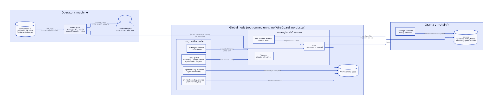

# Global nodes

> **At a glance.**
>
> - **What:** a machine that runs the public Orama L1 (`oramad`) and optionally the services beside it: public IPFS, storage provider, archiver, indexer, repair delegate, Tor roles. No WireGuard, RQLite, Olric or gateway. It can also be a cluster node (`role: both`), in the namespace `orama-global`. On chain, `x/nodes` registers operators, nodes, role bonds and service-key bindings.
> - **Key numbers:** ports 31000 to 31099 (chain P2P 31000, RPC 31001); cosmovisor v1.7.3 pinned by SHA-256; 21-day unbonding; 14-day network-identity lock; 1 ORAMA minimum bond per role; 8 endpoints and 8 bindings per node; record deposit 68,359 norama per byte.
> - **Code:** `core/pkg/globalnode/`, `core/pkg/globalnetns/`, `core/pkg/cosmovisor/`, `core/pkg/globalbind/`, `chain/x/nodes/`.

## Why a separate layer

A private cluster is owned by one operator, carries tenant data and talks to itself over WireGuard. The global layer is public: a chain anyone can read, storage deals anyone can buy, a Tor network anyone can use. Its machines accept connections from strangers and hold a consensus key whose duplication is slashed. They must never become a path into a cluster's overlay.

Three constraints shape the code: global services must not share a trust domain with a cluster; a validator key is not an ordinary secret, because two processes signing at one height is an equivocation; and the chain must know who the operators are.

## What runs on the machine

There are nine installable roles, each one systemd unit and one system account: `chain`, `ipfs`, `provider`, `archiver`, `indexer`, `repair`, `dirauth`, `relay` and `onion`. All but the standalone Tor roles reach the chain only through the local loopback RPC, so `chain` must be in the same install. A provider and a repair delegate never share a host: the delegate holds repair seeds, a provider must not.

None of these units is `PartOf` the node supervisor, so restarting `orama-node` never restarts a validator. They share a sandbox: strict filesystem protection, an empty capability set, `/opt/orama` hidden, and an `IPAddressDeny=` covering every private range, WireGuard's `10.0.0.0/8` included. A compromised global service has no route into a cluster.

The CLI orders the units; systemd only uses `Wants=`. `orama global start` runs the sign-floor check, starts the chain, polls its RPC for at most five minutes, and only then starts the rest.

`orama global install` checks everything that can refuse before changing anything: options, firewall state, the cosmovisor tarball's pinned SHA-256, every binary and the shielded verifier against the release manifest, and `oramad` against the verifier it pins. It starts nothing. The verifier sits beside `oramad` in the cosmovisor layout, so each chain version runs its own.

`orama setup` runs this install over SSH on every machine, beside the cluster node, then registers the operator, nodes, bonds and validator on the chain, signing with the RootWallet. It passes `--external-address`, so the installer writes the chain's configuration and, from a block two seeds' light-client routes both returned, the state-sync block: a joiner restores a snapshot instead of replaying the chain. `core/pkg/install/chainconfig.go:RenderChainConfig`, `core/pkg/statesync/trust.go:Resolve`.

## Upgrading the chain

The chain home belongs to the `orama-chain` account, but root puts binaries in it, and that account could plant a symlink where root is about to write. `core/pkg/cosmovisor/` therefore never resolves a path. It walks to the chain home one component at a time with `O_NOFOLLOW`, copies the binary into a private directory, runs the verifier on the open descriptor, and links it into place with `linkat`, which fails if the name exists. The bytes checked are the bytes installed, and nothing is replaced.

Cosmovisor runs with downloads disabled: a governance plan is data, a binary is code that signs. A plan reaching its height without a staged binary leaves the chain halted. The operator stages each upgrade, with its verifier, using `orama maint global stage-oramad`, verified against the TUF release root.

## The sign floor and moving a key

A key copied to a second host together with an old `priv_validator_state.json` can sign a step the first host already signed, differently. The chain slashes 5% and tombstones the validator.

The sign floor prevents this on any host that ran the migration commands. For each validator key, root records the last height, round and step it signed when the key left. The file sits in root's state root, is updated under an exclusive lock, and is never lowered. `ExecStartPre` runs `check-sign-floor` before every start of the chain unit. The chain refuses to start if its state is behind the floor, if the key is missing while a floor exists (otherwise `oramad` would generate a fresh key and sign as a new validator), or if an export is in progress.

Migration is three root commands. `prepare` on the new host makes an X25519 key. `export` on the old host stops the chain, takes an exclusive sentinel, reads the state twice to catch a chain that started in between, seals key and state to the recipient, records the floor, and only then removes the key. `import` records the floor first, writes the state, installs the key last, and runs the check. A failure at any step leaves either no key on the host or a floor that refuses it.

If the old host is dead, the operator restores from a sealed key backup. With no sign state, `import --old-host-destroyed --floor-height H` sets the floor to H+1, so the key signs nothing at or below the network's latest committed height. A key copied by other means, such as a disk image, carries no floor.

## Co-location

A small operator can run both layers on one server. The cluster's loopback holds sensitive listeners (the Kubo RPC, the gateway's loopback trust, the Caddy admin socket), so a global unit sharing it could reach them. With `--colocated`, the global units join a network namespace, `orama-global`, with its own loopback and port space, joined to the root namespace by one veth pair on `198.18.0.0/30`.

Two nftables tables, each replaced atomically, define the boundary. Published ports are DNAT'd in; forwarding from the namespace to any private range, WireGuard included, is dropped; inside, input and forward default to drop. The chain's RPC and REST listen on the namespace address and are not published; only root, the cluster node's account and named client accounts may connect. The residue: the rule names accounts, not programs, so any process of the `orama` account can reach those ports. A tenant's dynamic user cannot.

## The registry

`x/nodes` has thirteen messages and no authority address, no pause and no parameter-change message; its genesis values are final. Every message is signed by the operator who owns the record, from a wallet key that never sits on a node.

**Registration.** `MsgRegisterNode` fixes the node's roles and carries service-key bindings: each service key signs `orama-global-bind-v1|chain-id|operator|service|pubkey`. A key binds to one live node network-wide and a retired key is revoked forever, so nobody can claim another operator's relay identity. The node's secp256k1 hot key proves itself with a `hot-key` binding; the provider, archiver and reporter sign with it. `MsgFundHotKey` funds it from earnings, or from the operator's bank balance for an operator that has not earned yet (the case of a network's first operators), with no destination field, so the money reaches only that key and pays base fees only.

**Endpoints.** Hosts must be public, and no two live nodes may claim one literal IP.

**Names.** An operator can claim one identification name per node, a DNS label in a dedicated sub-zone that points at the node's literal IPs. The chain enforces the label rules, a reserved list, first come first served and a refundable deposit. The zone's cluster serves them from the chain.

**Bonds.** A bond is norama escrowed in the `nodes` module account, per role. A role is active only while the node is active and that role's bond meets the minimum. Unbonding queues the amount for 21 days, still slashable.

**Deposits.** Records are priced by size at 68,359 norama per byte and released on retirement.

**Identity.** Storage slots go to distinct ASNs and distinct /16 networks, and governance houses cap members per network. The chain cannot prove either, so both are declarations. Network is derived from the first literal public IP; ASN is declared. A change counts only after a 14-day lock, so moving identity to fit a slot draw or a vote costs more than the vote stays open. A wrong declaration is bounded by bond, deposit and lock, not detected.

## Trust

A compromised root owns the host, consensus key included. A compromised `orama-chain` can sign as the validator but cannot change staged binaries, the floor or the units. A compromised service account can sign with its hot key, which cannot bond, unbond or retire the node.

The limit that matters: `x/nodes` walks every node once per block to record service days, and every validator pays for it. That is invisible today and becomes block time at some thousands of nodes. The module set around it is in [The chain](ch16-the-chain.md).
