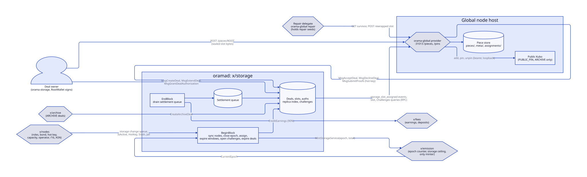

# Storage deals, archive and indexer

> **At a glance.**
>
> - **What:** paid, proven storage for strangers' capacity (x/storage), the registry that keeps chain history alive after validators prune (x/archive), and a separate read index for explorers and wallets.
> - **Key numbers:** 3 to 32 replicas per deal; 1 KiB challenge leaf; 8 sampled replicas per node per epoch; slash at 2 consecutive misses, eviction at 4; payments split 90/5/5; archive ranges of 1,000 blocks, quorum of 3 operators and 3 deals; retention window 201,600 blocks (14 days).
> - **Code:** `chain/x/storage/`, `chain/x/archive/`, `chain/indexer/`.

## Payment follows proof

A deterministic state machine cannot call a provider or inspect a disk. It can verify one thing: a hash path. So x/storage pays only for a Merkle proof of a leaf the chain chose.

An owner opens a deal: a class, 3 to 32 replicas (3 is a constant, not a parameter), a price per epoch per replica, a duration and an escrow of `price x replicas x duration`. `PRIVATE` deals hold one ciphertext per replica. `PUBLIC_PIN` deals hold one piece, pinned in the provider's public Kubo. `ARCHIVE` deals are opened only by the protocol. The deal fee of 1,000 norama is burned. A grant lets another account, such as a cluster backing up on the owner's behalf, create deals within a spend cap.

## Sealing and commitments

A piece is cut into 1,024-byte leaves, padded to a power of two, and hashed into a SHA-256 tree. A proof is the leaf plus one sibling per level, 1,856 bytes at 64 GiB. Challenges are drawn modulo the real leaf count, so padding is never asked for.

A private file is sealed in two layers (`core/pkg/storagefile/file.go:Prepare`). The inner layer is XChaCha20-Poly1305 under a random file key, itself wrapped by the owner's storage key from RootWallet. The outer layer is a per-slot ChaCha20 stream keyed from a separate repair seed. Every slot therefore has its own ciphertext and its own piece root, and a repair delegate that holds only the seed can turn one replica into another without learning the plaintext.

## Assignment, acceptance, proof

Each block, `assignDue` places the unassigned slots of due deals. The seed is the previous block hash, the deal id and the slot index. The picker walks a ring of operators from that seed, skipping any operator that already holds a slot of the deal, then takes the first eligible node by id. A node is eligible when it is bonded, not jailed, not on probation (for user deals) and has capacity for the piece. Protocol deals also need distinct `/16` networks and ASNs. If no slot of a new deal can be placed, the deal is refunded.

The provider has 50 blocks to accept. Declining or lapsing costs nothing, but the operator is excluded from that slot, which prevents reassignment loops. Once a slot is active the chain draws one leaf per epoch for each of at most 8 sampled replicas of the node, plus every slot it missed last epoch. The draw is a hash of public inputs, so every validator agrees without a randomness beacon.

The provider daemon (`chain/provider/runner.go:Step`) polls every 6 seconds. It answers challenges first, in transactions of at most 32 proofs, then follows `storage_slot_assigned` events, uploads and pins, accepts, and declines two blocks before a window closes if the piece is missing. It re-reads the chain each step, so a missed event or a dropped transaction repairs itself. An upload is accepted only for a root the node is waiting for, and the body must hash to that root.

## Settlement and the subsidy

When x/emission's epoch counter moves, `closeEpoch` scores every challenge. A proof is paid only if the proving node still holds the slot. Each paid row carries the deal's price from escrow and, by class, a claim on the epoch's storage ceiling, 25 percent of emission in the default split. A private deal claims `s x price`, where the subsidy rate `s` is 0 below 8 active operators and ramps linearly to 1 at 32. Subsidy claims are capped per operator at one eighth of the ceiling, then scales all claims down pro rata. The whole mint is reserved into a module account at close, so a lagging queue never needs a pruned ceiling record.

Rows drain at 100 per block. Every payment splits 90 percent to the operator, 5 percent burned and 5 percent to an archive fund that tops up archive deals. A row that fails for a collaborator's refusal is rolled back and retried next epoch; on the fifth failure it is dropped and its reserved mint burned. A bad row costs one payout, never a halted block. Recognised item rejections are isolated on a cache branch; any other error fails the block, because validators must not continue on state they cannot trust.

A second consecutive miss queues a slash of 10 percent of one epoch's price. The fourth evicts the slot, excludes the operator and sends the deal back to assignment. A bonded node's slash lowers its capacity and trims replicas that no longer fit. A probation node, registered without a bond, takes only a few protocol-deal slots and posts a deposit from its first earnings. If the deal names a repair delegate, `orama-global repair` fetches a surviving replica, verifies it, rewraps it and uploads it to the new provider.

The honest limit: the leaf index depends only on public values, so a provider can compute future challenges and keep only those leaves. Payment also follows the sample, so a node holding 100 replicas is paid for about 8 per epoch.

## Archive: history that survives pruning

A validator that never prunes grows without bound. One that prunes loses history. x/archive makes pruning conditional on agreement. History is cut into canonical ranges of 1,000 blocks. An archiver packs each into an `ORBH` bundle (block hash plus block protobuf per height) and attests a tuple: bundle CID, file SHA-256, Merkle root of block hashes and piece commitment.

The chain cannot read past block hashes, so it cannot check the truth. It checks agreement. Attestations are tallied per tuple, up to 4 tuples per range, so a wrong first attester cannot pin the range. When a tuple reaches three distinct operators, the range is decided. Any attester may then ask for the ARCHIVE deals. The chain sets price and duration (3,650 epochs, ten years), and the commitment must equal the winner's. A range holds at most three live deals. At three deals plus three attesters, the range is permanently archived.

`OramaApp.Commit` (`chain/app/retain.go`) lowers CometBFT's retain height to `min(tip - 201,600, last archived height)`. The last archived height is the contiguous archived prefix from block 1. A stalled archive therefore pins the retain height however far the tip runs, and no operator setting can prune an uncovered block. The number to watch is the archiver's retain lag. `orama-global history get` loads a bundle, verifies it against the chain record and writes one block. Verification covers the file hash, each block's own hash and the Merkle root. It does not check that headers chain or that commits are signed.

## The indexer

`orama-global indexer` follows oramad over loopback RPC and keeps a Pebble database. Each block, with its transactions, per-account lists, hourly stats and cursor, commits in one synced batch, so a crash leaves the previous block. Because x/cnft and x/market emit no events, the follower rebuilds NFT, listing and bid state from message bodies with twelve handlers. If the node has pruned below the cursor, the follower stops with `ErrPruned`; it never skips. The read API is GET only, bound to loopback or the namespace address, with closed routes and bounded parameters (limit up to 100, page up to 1,000). The gateway forwards `/v1/chain/index/` to it after revalidating the shapes, with no caller credential. The indexer holds no keys.

