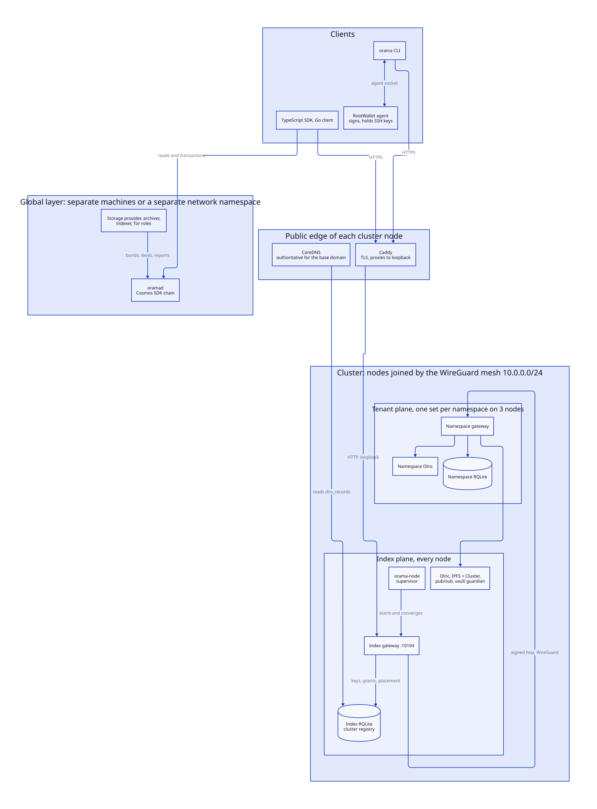

# What Orama is

> **At a glance.**
>
> - **What:** a platform that gives an application the usual backend building blocks (a SQL database, a cache, object storage, pub/sub, serverless functions, app hosting, push, WebRTC, domains with certificates, a secret vault) on a set of machines that one operator, or several, run themselves. A tenant, called a namespace, gets its own small cluster instead of a slice of a shared one. A separate global layer runs a public chain, a storage market and a Tor network beside it. This chapter is the map; the rest of the book is the territory.
> - **Key numbers:** version 0.3.0 (`/VERSION`); overlay network `10.0.0.0/24`, so at most 254 nodes (`.1` for the genesis node, `.2` to `.254` allocated); a namespace has 3 members (1 on a one-node fleet, a two-node fleet refuses); up to 20 namespaces per node; 3 port ranges (10000 to 10099 tenants, 10100 to 10199 index, 31000 to 31099 global); 46 chapters in 2 volumes plus 8 appendices.
> - **Code:** the repository root: `core/` (the node, gateway and CLI), `chain/` (the ledger and its services), `vault/` (guardian daemon), `caddy/` (two Caddy modules), `sdk/` and `sdk-vault/` (TypeScript clients), `contracts/` (cross-language fixtures), `e2e/` (fleet tests).
> - **Depends on:** nothing. Every other chapter builds on this one and on [System shape](02-system-shape.md).

## The problem, in engineering terms

An application backend is a handful of stateful services plus the glue between them: a database that survives a machine dying, a cache, a place for files, a way to push messages between clients, somewhere to run code, a name with a certificate. A team can rent each of these from a cloud provider, or run them itself and take on the operations. Orama is an attempt at the second path without the second path's cost: one control layer, written in Go, that installs and converges the standard open-source components onto machines you hand it, isolates tenants from each other physically rather than by table prefix, and exposes the result through one HTTPS API.

The components are not new. RQLite (SQLite replicated with Raft) is the database, Olric the cache, IPFS and IPFS Cluster the object store, libp2p GossipSub the messaging fabric, wazero the WebAssembly runtime for functions, pion the WebRTC stack, CoreDNS and Caddy the edge, WireGuard the network. What is Orama's own is the layer that decides which of them run where, wires them together, keeps them converged through restarts and upgrades, and puts a single identity and authorization model in front of all of them.

## Three commitments that explain most of the design

**No data layer is shared between tenants.** Creating a namespace starts a private RQLite, a private Olric ring and private gateway processes on three nodes, on a block of five ports each ([Namespaces](09-namespaces.md)). There is no cross-tenant query because there is no shared table to run it against. The cost is process count: three systemd units per member node per namespace, which is why the tenant port range holds 20 blocks per node.

**No internal traffic crosses the public internet.** Raft, Olric gossip, IPFS swarm, the calls between gateways and the chain's peer-to-peer all run on a WireGuard mesh. A node's public face is SSH, DNS on nameserver nodes, HTTP and HTTPS, WireGuard itself and TURN relay ports (`core/pkg/install/firewall.go`, [The WireGuard mesh](06-the-wireguard-mesh.md)). Within the mesh, a service is still not trusted because of where it sits: the index gateway forwards a tenant request to a namespace gateway with a MAC over the identity it has verified ([Gateway architecture](12-gateway-architecture.md#the-hop-mac)), and a node proves which node it is with its own key ([Inter-node trust](15-inter-node-trust.md)).

**Identity starts at a wallet signature.** There are no passwords. A wallet signs an EIP-4361 or SIWS message the gateway issued and receives a short-lived token; API keys, scoped grants and an app's own workload tokens are layered on that ([Identity](13-identity.md), [Authorization](14-authorization.md)). The same wallet, held in the RootWallet agent, signs release archives and unlocks SSH to the nodes ([Build, signing and release](29-build-signing-and-release.md)).

## What runs where

Three planes cover everything the software runs.

| Plane | Runs on | What it is | Chapters |
|---|---|---|---|
| Index | every cluster node | the node's own services: WireGuard, the supervisor `orama-node`, the registry RQLite, a cluster-wide Olric ring, IPFS and IPFS Cluster, pub/sub, the vault guardian, Caddy, ntfy, a Tor client, the index gateway, and CoreDNS on nameserver nodes | 4 to 8, 12, 24 to 26 |
| Tenant | three nodes per namespace | one RQLite, one Olric, one gateway per member node, plus an SFU and a TURN relay when WebRTC is enabled; app deployments run as their own units | 9 to 11, 17 to 23 |
| Global | separate machines, or a separate network namespace on a cluster node | the public chain `oramad` and the services beside it: IPFS, storage provider, archiver, indexer, repair delegate, Tor directory authorities, relays and onion services | 37 to 46 |

The registry is the pivot of the first two planes. The index RQLite holds every node, namespace, key, grant, DNS record and deployment row, one Raft group per cluster. Everything else reads it and converges toward it: the supervisor on each node starts what the registry says the node should run, a reconciler runs every 60 seconds to repair drift, and CoreDNS serves its zone straight from a table in it ([Cluster state](07-cluster-state.md), [Reconciliation and recovery](10-reconciliation-and-recovery.md)).

A cluster is the operator's own. The first node's trust anchor is seeded from the operator's wallet, every later node copies it from the node that invited it, and the nodes install only a build that wallet signed. There is no built-in signer and no vendor key.

## The software, module by module

| Directory | Language | What it is | Where it is explained |
|---|---|---|---|
| `core/cmd/` and `core/pkg/` | Go | the node supervisor, the gateway, the privileged helper, pub/sub, SFU, TURN, the SNI router and the `orama` CLI, with the packages behind them | volume I |
| `chain/` | Go | `oramad`, a Cosmos SDK chain on CometBFT, its modules, and the storage provider, archiver, indexer, repair and reporter services; its own module, not imported by the node | volume II |
| `vault/` | Zig | `vault-guardian`, which holds one Shamir share per secret | [Vault](28-vault.md) |
| `caddy/` | Go | two Caddy modules: a DNS-01 provider and a certificate storage, both backed by the cluster | [TLS and certificates](25-tls-and-certificates.md) |
| `sdk/`, `sdk-vault/` | TypeScript | the client libraries for tenant applications and for the vault | [SDKs](36-sdks.md) |
| `contracts/` | JSON | request and response fixtures that Go, TypeScript and the live fleet all read | [Testing](34-testing.md) |
| `e2e/` | Go | the fleet suite: three fresh servers, the real CLI, every feature | [Testing](34-testing.md) |
| `os/` | Go, Buildroot | OramaOS, an experimental node image; out of scope of this book | none |

One binary does most of the work of a node, in several roles. `orama-node` is the supervisor that brings the rest up; the same `gateway` binary runs as the index gateway and as a namespace gateway; `orama-privhelper` is the only root process the unprivileged daemons talk to ([The node as a supervisor](04-the-node-as-a-supervisor.md), [Privilege and filesystem trust](05-privilege-and-filesystem-trust.md)).

## How people and programs reach it

Two people use it. A *tenant* runs a namespace: deploys apps and functions, uses the database and the cache. An *operator* runs nodes: builds and signs releases, installs and upgrades machines, watches the fleet. Both use the `orama` command, a single Go binary that calls gateway routes with a short-lived bearer, reaches machines over SSH with keys held in the RootWallet agent, and never touches a node's internals directly ([The CLI](35-the-cli.md)). Programs use the TypeScript SDK, the Go client or plain HTTP ([SDKs](36-sdks.md)). There is no dashboard and no Orama MCP server; `docs/CLIENT_SURFACE.md` records which client owns which route.

Every request from either arrives the same way: at a name under the cluster's base domain, resolved by the cluster's own DNS, terminated by the node's Caddy, and handled by a gateway. [One request, end to end](03-one-request-end-to-end.md) follows one through all of it.

## What it is not

The book states limits as plainly as capabilities, and the first ones belong here.

- **Not a chain in the request path.** Hosting, databases, functions and storage do not settle on the ledger. The chain is a separate layer, installed by `orama global install`, not by `orama node install`; a tenant's request never touches it, and the gateway only proxies reads and signed transactions to it ([Global nodes](../vol2/37-global-nodes.md), [Chain architecture](../vol2/39-chain-architecture.md)).
- **Not highly available at one or two nodes.** A one-node fleet provisions single-member namespaces for evaluation, and losing the disk loses the namespace. A two-node fleet refuses to provision, because a two-member Raft group survives the loss of neither member ([Namespaces](09-namespaces.md)).
- **Not a defense against a hostile host.** Anyone who can read the memory of a running node can read what it processes. Secrets are sealed at rest and in transit, not in use ([Secrets and keys](16-secrets-and-keys.md)).
- **Not bounded by the code alone at scale.** One cluster is capped by its overlay at 254 addresses, and its registry is a single Raft group; the chapters name the first bottleneck of each subsystem under Limits and scale.
- **Not finished.** The Known gaps sections record what is incomplete or wrong in the code today, collected in [Appendix H](../appendices/h-known-gaps.md).

## How this book is organized

Volume I covers the platform, in this order: the node and its supervisor (4 to 8), tenancy and orchestration (9 to 11), the gateway and identity (12 to 16), the tenant services (17 to 23), the edge (24 to 27), the vault (28), shipping and operating (29 to 34), and the client surfaces (35 and 36). Volume II covers the global layer (37 and 38) and the chain (39 to 46). Chapter 2 defines the shared vocabulary and chapter 3 follows one request across the pieces; read those two first.

| If you want to | Read |
|---|---|
| understand how a node starts and stays alive | 4, 5, 10 |
| see how machines find, trust and replace each other | 6, 8, 15, 33 |
| follow what a tenant request goes through | 3, 12, 13, 14 |
| understand a tenant service | 17 to 23, one chapter each |
| operate a fleet | 29 to 33 |
| work on the chain | 39 to 46, after 37 |
| look something up | the appendices: [ports](../appendices/a-port-map.md), [schema](../appendices/b-schema.md), [gateway routes](../appendices/c-gateway-routes.md), [CLI](../appendices/d-cli-reference.md), [chain messages](../appendices/e-chain-messages-and-queries.md), [configuration](../appendices/f-configuration.md), [glossary](../appendices/g-glossary.md), [known gaps](../appendices/h-known-gaps.md) |

Every chapter is held to the code. Each backticked path in it is checked against the repository by `make whitepaper-check`, seven of the eight appendices are regenerated from the code and compared, and a chapter's `verified` stamp in `book.yaml` must equal `/VERSION`, so the book cannot silently drift from the version it claims to describe. Where an older document under `docs/` disagrees with the code, the book follows the code.
