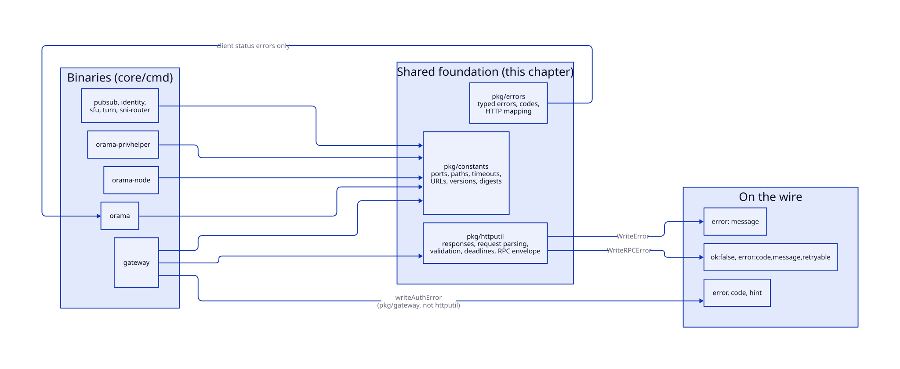
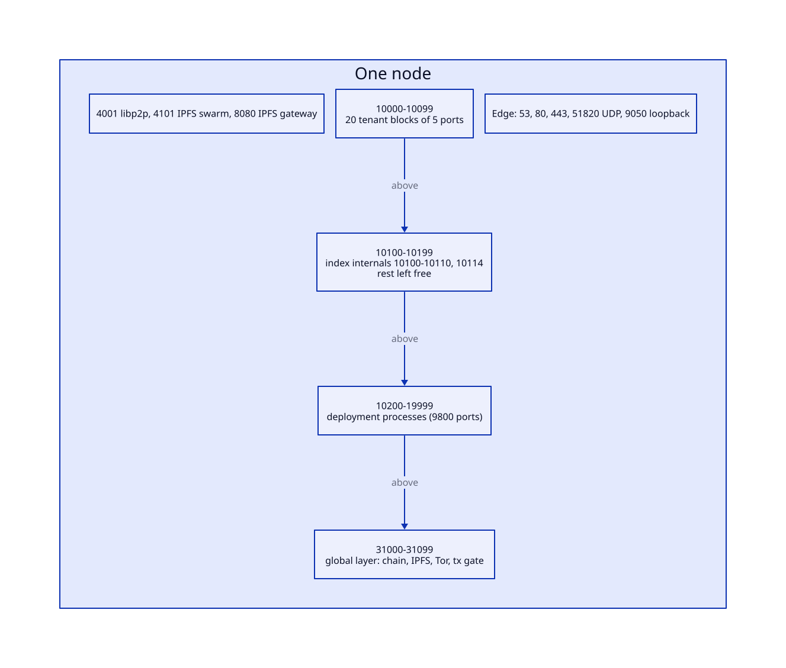
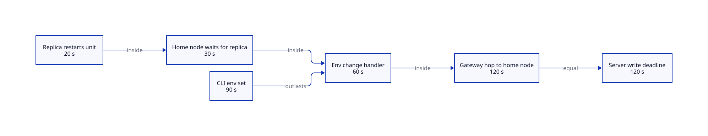

# System shape

> **At a glance.**
>
> - **What:** the vocabulary every other part of the system speaks. `core/pkg/constants` is the one place a port, a path, a timeout, a pinned version or a unit name is defined; `core/pkg/errors` is a typed error model with a code-to-HTTP mapping; `core/pkg/httputil` holds the response writers, request parsers, validators and deadline helpers the gateway and its handlers share. This chapter also fixes the map of the whole system that the rest of the book assumes: three planes, three port ranges, one overlay network, and three error shapes on the wire.
> - **Key numbers:** index block 10100 to 10199 (fixed ports 10100 to 10110 and 10114); tenant block 10000 to 10099 in 5-port blocks; deployments 10200 to 19999 (9,800 ports); global layer 31000 to 31099; edge 53, 80, 443, 51820/udp, 9050 (loopback); overlay `10.0.0.0/24`; per-node capacity ceiling 100 deployments, 8,192 MB, 400 % CPU; long transfers 5 min (`core/pkg/httputil/deadlines.go:TransferBudget`); deployment write deadline 390 s (`core/pkg/constants/timeouts.go:GatewayDeploymentWriteBudget`).
> - **Code:** `core/pkg/constants/`, `core/pkg/errors/`, `core/pkg/httputil/`.
> - **Depends on:** [What Orama is](01-what-orama-is.md) for the purpose of the planes. Every other chapter depends on this one.



## Why it exists

A node runs about twenty kinds of systemd unit, written by one binary, read by another and probed by a third, and all of them have to agree on which port the registry listens on. When that agreement lived in integer literals it broke silently. The commit that moved the index services into the 10100 block left behind every operational tool that addressed a service by a literal: the failure detector, the quorum guard, `recover-raft`, invite creation, the upgrade health gate, the report collectors. They stopped working without a compile error, and one of them failed unsafe. `core/pkg/constants/no_legacy_ports_test.go:TestNoLegacyPortLiterals` is the scar: it walks every non-test Go file under `core/` and fails on any of the five old ports.

The same pressure produced the rest of the package. A path a gateway writes at runtime has to be inside the writable tree of its systemd unit, and the gateway, the spawner, the unit templates, the legacy-layout migration and the node report must all name it identically. A timeout set in the CLI must outlast the handler it waits for, which must outlast the replica call inside it. A version of Kubo or RQLite must be named once, with the digest of its tarball, so the builder and the installer cannot diverge.

`errors` and `httputil` exist for the same reason one layer up: the gateway has more than a hundred routes written by many hands, and a client that needs to know whether to retry should not have to learn a different answer shape for each. They are the least consistent part of the foundation, and this chapter says so where it matters.

## The model

**Planes.** Every machine that runs Orama runs one or more of three planes. The *index plane* runs on every cluster node: the supervisor, the WireGuard interface, the cluster registry (the index RQLite), an Olric ring, IPFS and IPFS Cluster, the pub/sub service, the vault guardian, Caddy, an ntfy server, a Tor client and the index gateway. Nodes installed with `--nameserver` add CoreDNS. The *tenant plane* is one private set of services per namespace, on three nodes: an RQLite, an Olric and a gateway, plus WebRTC services when enabled. The *global layer* is a separate set of machines (or a separate network namespace on a machine that is also a cluster node) that runs the public chain and the services beside it. [Namespaces](09-namespaces.md) and [Global nodes](../vol2/37-global-nodes.md) own the details; here a plane matters only because each has its own port range.

**Registry.** The index RQLite: the one database that holds nodes, namespaces, keys, grants, DNS records and deployment rows ([Cluster state](07-cluster-state.md)). Every cluster node holds a replica.

**Overlay.** The WireGuard network `10.0.0.0/24` (`core/pkg/constants/urls.go:WireGuardSubnet`). Every node-to-node call travels on it; public addresses carry only SSH, DNS, HTTP(S) and WireGuard itself ([The WireGuard mesh](06-the-wireguard-mesh.md)).

**Unit naming.** Cluster services are systemd template units named `orama-namespace-<service>@<instance>`. The instance is the namespace name for tenant services, `index` for the node's own, and `nameserver` for CoreDNS (`core/systemd/`). Deployments are `orama-deploy-<runtime>@<namespace>-<name>`. Global services are plain units named in `core/pkg/constants/global.go` (`orama-global-ipfs.service`, `orama-global-chain.service`, and so on).

**The index namespace.** `constants.IndexNamespace` is the string `index`: the instance name of the node's own services and the `client_namespace` of the index gateway.

### The port plan



| Range | Owner | Allocation | Defined in |
|---|---|---|---|
| 53, 80, 443 | CoreDNS (nameserver nodes), Caddy | fixed | install, [DNS](24-dns-and-nameservers.md), [TLS](25-tls-and-certificates.md) |
| 51820/udp | WireGuard | fixed | `core/pkg/constants/ports.go:WireGuardPort` |
| 9050 (loopback) | the node's Tor client | fixed | `core/pkg/constants/tor.go:TorSOCKSPort` |
| 4001, 4101, 8080 | libp2p host, IPFS swarm, IPFS gateway | fixed | `core/pkg/constants/urls.go` |
| 10000 to 10099 | tenant namespaces | 5-port blocks, 20 per node, recorded in `namespace_port_allocations` | `core/pkg/namespace/types.go:NamespacePortRangeStart` |
| 10100 to 10199 | index plane | fixed offsets 0 to 10 and 14 from `IndexPortBase` | `core/pkg/constants/ports.go:IndexPortBase` |
| 10200 to 19999 | app deployments | one port per process, 9,800 per node | `core/pkg/constants/capacity.go:MaxPortsPerNode` |
| 31000 to 31099 | global layer | fixed | `core/pkg/constants/global.go:GlobalPortBase` |

The index offsets are `RQLiteHTTPPort` 10100, `RQLiteRaftPort` 10101, `OlricHTTPPort` 10102, `OlricMemberlistPort` 10103, `GatewayAPIPort` 10104, `PubsubAPIPort` 10105, `VaultHTTPPort` 10106, `IPFSAPIPort` 10107, `IPFSClusterAPIPort` 10108, `NtfyListenPort` 10109, `IPFSClusterKuboProxyPort` 10110 and `IPFSClusterSwarmPort` 10114. The remaining ports of the block are unassigned and stay out of the deployment range, so a user process cannot bind a service port. [Appendix A](../appendices/a-port-map.md) is the generated, complete list.

### Three error shapes

A response from the gateway carries one of three error bodies, by origin. The first two are written by gateway code, the third by `httputil`.

| Shape | Body | Written by |
|---|---|---|
| plain | `error` | `core/pkg/gateway/http_helpers.go:writeError` and `core/pkg/httputil/response.go:WriteError` |
| refusal | `error`, `code`, optional `hint` and cause-specific fields | `core/pkg/gateway/auth_errors.go:writeAuthError` |
| envelope | `ok: false` and an `error` object with `code`, `message`, `retryable`, optional `request_id` and `retry_after` | `core/pkg/httputil/rpc_error.go:WriteRPCError` |

[Gateway architecture](12-gateway-architecture.md#the-error-model) lists which routes use which. The `errors` package is a fourth vocabulary used inside Go code, not on the wire.

## How it works

### Constants as a contract

`core/pkg/constants` imports nothing from the rest of the codebase, so any package can import it without a cycle; 181 Go files do (tests included). It holds seven kinds of fact.

**Ports.** `ports.go` derives every index port from `IndexPortBase`; `global.go` and `chain.go` do the same for 31000 and up. Tests pin the arithmetic: `urls_test.go:TestIndexPortsAreDistinctAndInBlock` fails if two index ports collide or leave the block, `global_test.go:TestGlobalPortBlock_overlapsNothingElse` fails if the global range touches the cluster or chain ports, and `chain_test.go:TestChainPorts_matchStagenetDeployScript` ties the chain ports to the deploy script that also names them. Address helpers (`LocalGatewayURL`, `GatewayURLFor`, `RQLiteURLFor`, `RQLiteRaftAddrFor`, `OlricAddrFor`) build every URL through `net.JoinHostPort`, so an IPv6 literal gets its brackets (`urls_test.go:TestPeerAddressesBracketIPv6`).

**Paths.** `paths.go` fixes the layout under `/opt/orama/.orama`: `data/namespaces/<ns>/gateway` for a gateway's state, `data/sqlite`, `data/deployments`, `data/turn/turn.yaml`, `data/tls/wildcard.crt` and `.key`. Everything a gateway writes at runtime has to be under `data/`, because the gateway unit runs with `ProtectSystem=strict` and only `data/` writable. `paths_test.go:TestGatewayWrites_areInsideTheGatewayUnitsWritablePaths` reads the gateway unit template and checks that the gateway state, SQLite and deployment directories sit inside its `ReadWritePaths`.

**Timeouts.** `timeouts.go` declares the chain of deadlines for a change to a replicated deployment, innermost first. Each must be strictly shorter than the one around it, or the outer gives up while the inner is still working and the caller is told "timed out" about a change that went through.



| Link | Value | Constant |
|---|---|---|
| replica rewrites its env file and restarts the unit | 20 s | `DeploymentEnvReconfigureTimeout` |
| home node waits for one replica | 30 s | `DeploymentEnvCallTimeout` |
| whole env change on the home node, lock wait included | 60 s | `DeploymentEnvChangeBudget` |
| CLI `env set` and `env unset` | 90 s | `DeploymentEnvClientTimeout` |
| gateway hop to the home node; server write deadline | 120 s each | `GatewayProxyTimeout`, `GatewayServerWriteTimeout` |

An update or rollback has a longer chain because a replica fetches the artifact and waits for the app's health check: replica call 180 s, replica segment 210 s, local segment 120 s, whole handler 330 s (`DeploymentUpdateBudget`), gateway hop 360 s, entry-gateway write deadline 390 s. The budget is split in two so the replicas are never left with only what the local step did not use. `timeouts_test.go` asserts both chains are strictly nested and that the replica segment is reserved.

**Capacity.** `capacity.go` caps what the placement code will put on one node: 100 deployments, 8,192 MB of memory, 400 % CPU, 9,800 ports. `core/pkg/namespace/node_selector.go` and `core/pkg/deployments/home_node.go` read them.

**Versions and digests.** `versions.go` names the toolchain and the bundled components: Go 1.27.1, Olric v0.7.4, Kubo v0.43.1, IPFS Cluster v1.1.6, RQLite 10.4.0, CoreDNS 1.14.7, Caddy 2.11.4. `release_digests.go` and `cosmovisor.go` hold the SHA-256 of the Kubo, RQLite and Cosmovisor tarballs for amd64 and arm64 (Cosmovisor is v1.7.3). [Build, signing and release](29-build-signing-and-release.md) shows how the builder uses them.

**Global layer.** `global.go`, `chain.go` and `cosmovisor.go` name the global units, state directories under `/var/lib/orama-global`, the chain daemon `oramad`, the chain home and key paths, the denomination `norama`, and the veth addresses `198.18.0.1` and `198.18.0.2` that join a co-located node's network namespace to the host.

**Small shared values.** `acme.go` has the Let's Encrypt production and staging directory URLs and the two aliases the CLI accepts; `node_retirement.go` has the sentinel `last_seen` value (`1970-01-01 00:00:00`) that marks a retired node.

### The errors package

`core/pkg/errors` defines a `BaseError` (code, message, cause, captured stack) and nine typed errors with constructors: `ValidationError`, `NotFoundError`, `UnauthorizedError`, `ForbiddenError`, `ConflictError`, `InternalError`, `ServiceError`, `TimeoutError` and `RateLimitError`. Nine sentinels (`ErrNotFound`, `ErrUnauthorized`, `ErrForbidden`, `ErrConflict`, `ErrInvalidInput`, `ErrTimeout`, `ErrServiceUnavailable`, `ErrInternal`, `ErrTooManyRequests`) match with `errors.Is`, and the `Is*` helpers match either the type or the sentinel. `Wrap` and `Wrapf` add a message and keep the cause.

`codes.go` defines 34 string codes in two families, the gRPC set (`NOT_FOUND`, `UNAVAILABLE`, `DEADLINE_EXCEEDED` and so on) and an Orama set (`VALIDATION_ERROR`, `RATE_LIMIT_EXCEEDED`, `DATABASE_ERROR`, `EXECUTION_ERROR`, `CRYPTO_ERROR`). `GetCategory` sorts a code into client, auth, timeout, network or server; `IsRetryable` is true for ten codes (timeouts, unavailable, resource-exhausted, aborted, network, database, cache and storage errors).

`http.go:StatusCode` maps a code to a status: invalid argument, validation, failed precondition and out of range to 400; unauthenticated, unauthorized and auth error to 401; permission denied and forbidden to 403; not found to 404; timeout and deadline to 408; already-exists, conflict and aborted to 409; resource-exhausted and rate limit to 429; unimplemented to 501; unavailable to 503; cancelled to 499; every other code to 500. `ToHTTPError` builds the JSON body (`code`, `message`, `details`, `trace_id`) and `WriteHTTPError` writes it, adding `Retry-After` for a rate-limit error.

Only one production package uses the package: `core/pkg/client/status_error.go` maps a gateway response status onto the sentinels so that a Go client's `errors.Is(err, errors.ErrNotFound)` works (the contract `docs/GO_CLIENT_SDK.md` promises). The gateway does not use `WriteHTTPError`; see Known gaps.

### The httputil package

`httputil` groups six things.

**Responses.** `WriteJSON` sets the content type, writes the status and encodes the value, ignoring an encoding failure because the header is already sent. `WriteError` writes the plain `error` body. `WriteSuccess` and `WriteSuccessWithData` write `status: ok`.

**The RPC envelope.** `WriteRPCError` writes the third shape (`ok: false`, `error.code`, `error.message`, `error.retryable`). It never leaves the message empty (`defaultMessageFor` supplies one) and seeds `retryable` from the code: true for `RATE_LIMITED`, `SERVICE_UNAVAILABLE`, `TIMEOUT`, `FUNCTION_UNAVAILABLE` and `NAMESPACE_GATEWAY_UNAVAILABLE`. `WithRetryAfter` sets `retry_after` in seconds, forces `retryable` and also emits the `Retry-After` HTTP header, so a client unaware of the envelope still backs off. Sixteen codes are defined, stable strings that clients pin to (`VALIDATION_FAILED`, `PAYLOAD_TOO_LARGE`, `STORAGE_QUOTA_EXCEEDED`, `SCHEMA_MISMATCH`, `FUNCTION_EXECUTION_FAILED`, `FUNCTION_DEPLOY_FAILED` and the rest in `core/pkg/httputil/rpc_error.go`).

**Request parsing.** `DecodeJSON`, `DecodeJSONStrict` (rejects unknown fields), `ReadBody` (bounded by `io.LimitReader`), `QueryParam`, `QueryParamInt`, `QueryParamBool`, base64 helpers, and `CheckMethod` and `CheckMethodOneOf`, which write 405 themselves.

**Credential extraction.** `ExtractBearerToken`, `ExtractAPIKey` (header `X-API-Key`, then `ApiKey` or non-JWT `Bearer`, then the query parameters `api_key` and `token`) and `IsJWT`, which is exactly two dots.

**Validation.** Regular expressions for a namespace (`^[a-zA-Z0-9][a-zA-Z0-9_-]` up to 64 characters), a pub/sub topic (1 to 256 of letters, digits, `.`, `_`, `/`, `-`), an Olric DMap name (1 to 128), an IPFS CID (v0 `Qm` plus 44 base58, v1 base32 or base58) and a wallet address (40 hex with optional `0x`, or 32 to 44 base58 for Solana).

**Deadlines and origin.** `ExtendIO(w, budget)` moves a request's read and write deadlines to `budget` from now, through `http.ResponseController`. The servers' own timeouts (60 s read, 120 s write) would cut off a database of a few hundred MiB or a slow upload mid-transfer whatever any proxy allowed, so the long routes call it with `TransferBudget` (5 min) or `GatewayDeploymentWriteBudget`. A writer that cannot move deadlines (`http.ErrNotSupported`, a test recorder) is not an error; any other failure is returned, because carrying on would cut the transfer off. `CheckWebSocketOrigin` is the Origin policy for upgrades behind a reverse proxy: it compares the Origin host with `X-Forwarded-Host` (else `Host`), ignores the port, accepts an Origin whose host is the request host or a subdomain of it, and allows a missing Origin, since non-browser clients send none and Origin is not an authentication signal.

## State it owns

The three packages are stateless: compiled constants and pure functions. What they define is read, and in places written, elsewhere.

| What | Defined here | Written by | Read by |
|---|---|---|---|
| Port numbers | `core/pkg/constants/ports.go`, `global.go`, `chain.go`, `urls.go` | the compiler | every service config writer, firewall rules, health checks, the CLI |
| Orama directory layout | `core/pkg/constants/paths.go` | install, the namespace spawner, the legacy-layout migration | gateways, the shared TURN server, the node report |
| Deadline chains | `core/pkg/constants/timeouts.go` | the compiler | gateway, deployment handlers, CLI |
| Capacity ceilings | `core/pkg/constants/capacity.go` | the compiler | `core/pkg/namespace/node_selector.go`, `core/pkg/deployments/home_node.go` |
| Component versions and tarball digests | `core/pkg/constants/versions.go`, `release_digests.go`, `cosmovisor.go` | the compiler | the builder, the installers |
| Global-layer unit names and homes | `core/pkg/constants/global.go` | the compiler | install, `orama global`, the node report |
| Retired-node marker | `core/pkg/constants/node_retirement.go` | `orama node remove` | membership reconciler, inspectors |
| Error codes and their HTTP statuses | `core/pkg/errors/codes.go`, `http.go` | the compiler | the Go client |
| RPC error codes and envelope | `core/pkg/httputil/rpc_error.go` | the compiler | gateway and handlers; the TypeScript SDK matches the strings |

## Lifecycle

**Boot and restart.** Nothing here runs. Constants are linked into each binary at build time, so a restarted process uses the values of the archive it was built in.

**Rolling upgrade (mixed versions).** Two releases run side by side for the length of a rollout ([Rolling upgrades](31-rolling-upgrades.md)), and a changed constant is a changed contract between them. Changing a port is the dangerous case. The one move so far, from the 4-digit ports (RQLite 5001, Raft 7001, gateway 6001, Olric 3320, Kubo 4501) into the 10100 block, is remembered in two places: `core/pkg/install/firewall_legacy.go` keeps the exact rules old releases opened so an upgrade can close them, and `TestNoLegacyPortLiterals` keeps the old numbers out of the source. Changing a budget in `timeouts.go` is safe in a mixed fleet only if the nesting still holds against the other release's value.

**Node loss.** Not applicable; the packages hold no runtime state.

## Failure modes

| Trigger | What the system does | What you observe |
|---|---|---|
| A new package hard-codes a legacy index port | `TestNoLegacyPortLiterals` fails the build | the test names the file, line and the constant to use |
| A new port collides with another range | `urls_test.go` or `global_test.go` fails the build | a test failure naming both ports |
| A runtime write path falls outside the unit's writable set | `paths_test.go` fails the build | a test failure naming the path |
| A deadline is edited so an inner wait exceeds an outer one | `timeouts_test.go` fails the build | a test failure on the nesting |
| A long transfer runs past the server's own timeout | `ExtendIO` moved the deadline on routes that call it; a route that does not is cut off | a truncated upload or download on a route that never called `ExtendIO` |
| `ExtendIO` cannot move a deadline | the handler returns the error and refuses the request | an error response before any body is read |
| An encoding error in `WriteJSON` | ignored; the status is already written | a 200 or error status with a truncated body |
| A client sends an unmapped code to `StatusCode` | the status defaults to 500 | `INTERNAL` semantics for an unknown code |
| A WebSocket upgrade from an Origin that is not the host or a subdomain | `CheckWebSocketOrigin` returns false and the upgrade is refused | 403 on the upgrade from a browser; curl, which sends no Origin, is unaffected |

## Trust and security

The packages hold no secrets and make no trust decisions. What they decide is what leaks and what is believed.

- **Pinned digests.** The Kubo, RQLite and Cosmovisor tarball hashes are compiled in, so a tampered download fails the installer's check before it is unpacked.
- **Error text.** `ToHTTPError` copies `err.Error()` into the message of any error that is not an Orama typed error. Used on a raw internal error it would leak internal text (an overlay address in a cache error, for instance). The gateway avoids this by not calling it and by logging the detail and returning a fixed sentence ([Cache](18-cache.md) shows the pattern).
- **Origin is not authentication.** `CheckWebSocketOrigin` only stops a browser on another site from opening a socket with a user's cookies; every endpoint that uses it authenticates separately.
- **Credential spellings.** `ExtractAPIKey` accepts a key in a query parameter, which ends up in logs and referrers. The gateway's own resolver, not this function, decides what a request is allowed to present ([Gateway architecture](12-gateway-architecture.md#credential-resolution)).
- **Validators are syntax, not authority.** A valid namespace name or wallet address says nothing about ownership; [Authorization](14-authorization.md) does that.

## Limits and scale

All numbers here are compile-time. The first ceilings reached are in `capacity.go`: 100 deployments and 9,800 ports per node, and 20 tenant blocks per node (from the tenant range, not from this package). A fleet ten times larger needs no change to the shared packages; a tenant plane ten times denser does, because a 100-port tenant range cannot hold more than 20 five-port blocks and moving it means moving a range every node's firewall, spawner and test knows. The port plan is the one fact in the package that cannot grow without a migration like the one that created the 10100 block.

## Design decisions

### One constants package with no dependencies

*Chosen:* every cross-package number lives in `core/pkg/constants`, which imports only the standard library. *Rejected:* each package keeping its own default and a config key. *Why:* a literal is a dependency the compiler cannot see; the port move proved it. A leaf package can be imported from anywhere without a cycle.

### Constants guarded by tests that read the other side

*Chosen:* tests read the unit templates, the deploy script and the source tree and compare them with the constants. *Rejected:* trusting reviewers to remember. *Why:* the facts that must agree live in files of different languages, and the failure mode is silent.

### Derive ports from a base, not list them

*Chosen:* `IndexPortBase` plus offset. *Rejected:* independent literals. *Why:* the block moves as one, and a test can assert the block's bounds.

### Nested deadlines declared in one comment and one file

*Chosen:* the whole chain in `timeouts.go`, with a test of the nesting. *Rejected:* each handler choosing its own timeout. *Why:* a mismatch between two deadlines produces a false "timed out" for a change that succeeded, which is the worst outcome for a retry.

### Keep the plain error body alongside the envelope

*Chosen:* `WriteError` still writes `error` only; `WriteRPCError` writes the typed envelope for routes whose clients switch on a code. *Rejected:* migrating every route at once. *Why:* the SDK matches both shapes and old handlers keep working. The cost is three shapes, listed under Known gaps.

## Known gaps

- **Three error shapes and a fourth vocabulary.** The plain body, the refusal body and the envelope coexist on the wire, and `core/pkg/errors` is a fourth, used only by the Go client (`core/pkg/client/status_error.go`). A generic client cannot parse one shape. `errors.WriteHTTPError` and `errors.ToHTTPError` have no caller in the gateway, so a mapping table that looks authoritative (`core/pkg/errors/http.go:codeToHTTPStatus`) does not decide any gateway status.
- **Helpers with no production caller.** `ExtractAPIKey`, `ExtractBearerToken`, `ExtractNamespaceHeader`, `DecodeJSONStrict`, `ValidateTopicName`, `ValidateDMapName`, `NormalizeWalletAddress`, `RequireNotEmpty` and `QueryParamBool` in `core/pkg/httputil/` are referenced only from tests. The gateway resolves credentials with its own code in `core/pkg/gateway/middleware.go`, so the documented extraction order in `httputil` is not the order that governs requests.
- **Duplicated helpers.** `core/pkg/gateway/http_helpers.go:writeJSON` repeats `httputil.WriteJSON`, and two older copies of the WebSocket origin check remain in `core/pkg/gateway/handlers/serverless/ws_handler.go:checkWSOrigin` and `core/pkg/gateway/handlers/pubsub/ws_client.go:checkWSOrigin`, as the comment on `CheckWebSocketOrigin` itself notes. A fix to one does not reach the others.
- **The IPFS swarm port is named twice.** `core/pkg/constants/urls.go:IPFSSwarmPort` is 4101, the libp2p port is `NodeLibP2PPort` 4001, but `core/cmd/orama/internal/utils/systemd.go:DefaultPorts` lists "IPFS Swarm" as 4001 and the inspector lists the index ports as literals (`core/pkg/inspector/checks/system.go`). The legacy-port test covers only five old numbers.
- **A stale default in a comment.** `core/pkg/gateway/config.go` documents the RQLite DSN default as `http://localhost:4001`, a port the index RQLite has not used since the move to 10100.
- **The validators allow what a DNS label does not.** `httputil.ValidateNamespace` accepts upper case and underscores. A namespace name becomes part of `ns-<name>.<base>` ([DNS and nameservers](24-dns-and-nameservers.md)), so callers must apply the stricter rule themselves.

## Verify it yourself

**Tests.**

- `cd core && go test ./pkg/constants/...` runs the port, path, URL and timeout tests, including `TestNoLegacyPortLiterals`.
- `cd core && go test ./pkg/errors/... ./pkg/httputil/...` covers the status mapping, the envelope and the helpers; `rpc_error_test.go` pins the envelope shape, and the origin policy is tested where the gateway applies it (`core/pkg/gateway/ws_origin_test.go`).
- `make whitepaper-check` regenerates [Appendix A](../appendices/a-port-map.md) from the constants and fails if it drifted.

**Fleet e2e.** No feature owns these packages directly; the stages that install a cluster exercise every constant (`e2e/features/`, see [Testing](34-testing.md)). The owner runs `make e2e-fleet`.

**Live.**

```bash
# the index ports a node actually listens on
ss -ltnp | grep -E ':101(0[0-9]|1[0-4])\b'

# the same plan, from the binary
orama node report --pretty | head
```

Compare the listening set with the table above and with Appendix A. An error body shows which of the three shapes a route uses: a data route called without a credential answers with the refusal shape (`AUTH_MISSING`), a request over a rate limit with the envelope (`RATE_LIMITED`), and a handler that rejects a malformed body with the plain shape.
