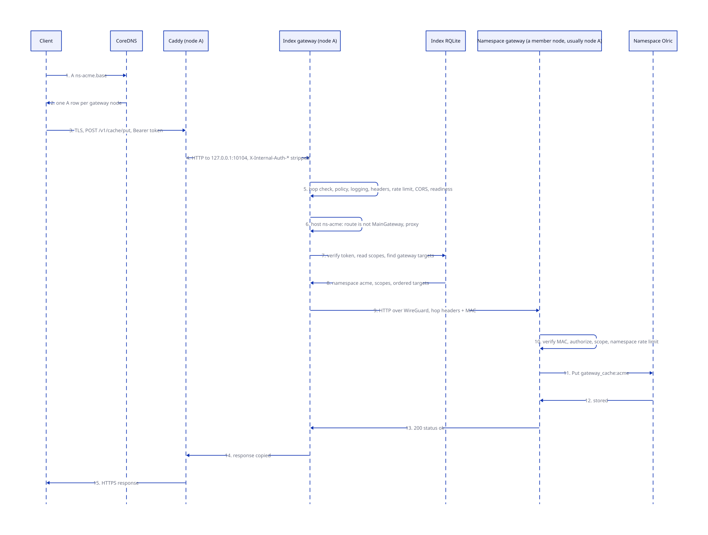
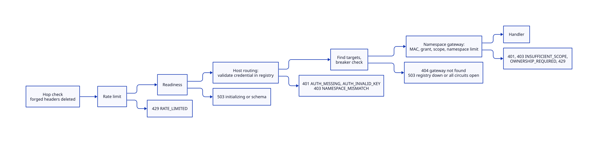

# One request, end to end

> **At a glance.**
>
> - **What:** a trace of one tenant request, `POST /v1/cache/put`, from the SDK on a laptop to a stored key in the tenant's Olric ring and back. It names every process the request touches, every check it passes, every table it reads, and every place it can be refused. Each stop links to the chapter that owns it.
> - **Key numbers:** DNS record TTL 60 s; Caddy upstream `localhost:10104`; hop MAC skew 60 s; namespace proxy 30 s (300 s on long routes); breaker opens at 5 consecutive failures for 30 s; handler context 10 s for a cache put; credential cache 60 s; revocation list reloaded every 5 s; general rate limit 10,000 per minute per client network; namespace rate limit 10,000 per minute (tenant-configurable).
> - **Code:** `core/pkg/gateway/middleware.go`, `core/pkg/gateway/internal_auth_hop.go`, `core/pkg/gateway/namespace_targets.go`, `core/pkg/gateway/handlers/cache/`, `core/pkg/olric/`.
> - **Depends on:** [What Orama is](01-what-orama-is.md) and [System shape](02-system-shape.md); read after them, and read [Gateway architecture](12-gateway-architecture.md) for the full stack this chapter walks through once.



## The request

A tenant application holds an API key for the namespace `acme` on a cluster whose base domain is `example.network`. It calls the SDK:

```ts
await client.cache.put("sessions", "user:123", { name: "Ana" }, { ttl: "1h" });
```

The SDK turns that into `POST https://ns-acme.example.network/v1/cache/put` with a JSON body `dmap`, `key`, `value`, `ttl` and the header `Authorization: Bearer <token>` ([SDKs](36-sdks.md)). The token is not the key. The first call a client makes exchanges its key for a JWT with `POST /v1/auth/token`, and every later request carries the JWT, so the key never appears in an access log. That exchange is itself a request through the same path; this chapter follows the put.

The sections below take the components it meets in order.

## 1. Finding the node: DNS

The name `ns-acme.example.network` is not in a zone file. CoreDNS on the cluster's nameserver nodes runs a custom `rqlite` plugin that answers from the `dns_records` table in the registry ([DNS and nameservers](24-dns-and-nameservers.md)). Provisioning the namespace wrote one A row per node that runs one of its gateways, TTL 60 s, tagged `namespace:acme`. A client therefore gets three addresses and tries them in the order its resolver gives, so a namespace has no single front door; the plugin caches answers for 30 s and serves them stale for up to 24 h if the registry is unreachable. A node that fails its own edge check twice withdraws its rows from the round robin, but never empties a name ([the node as a supervisor](04-the-node-as-a-supervisor.md) and [DNS](24-dns-and-nameservers.md)).

A name under the base domain that is not `ns-` is a different request: `*.ns-acme.example.network` and app names resolve to the same nodes and are routed by host ([App deployments](11-app-deployments.md)).

## 2. The edge: TLS and the loopback hop

The client connects to port 443 on that address. On a node where the SNI router is enabled it takes the port first, reads only the unencrypted server name, and passes the still-encrypted stream to Caddy unless the name is the stealth TURN host ([SNI routing and stealth TURN](26-sni-routing-and-stealth-turn.md)); otherwise Caddy owns 443.

Caddy holds a wildcard certificate for `*.example.network`. The cluster obtained it once through ACME DNS-01 by publishing a TXT record in its own DNS, and every node serves it from a certificate store kept in the registry ([TLS and certificates](25-tls-and-certificates.md)). Caddy speaks HTTP/1.1 only, terminates TLS and reverse-proxies to `localhost:10104`, the index gateway. Before it forwards, it deletes six request headers, `X-Internal-Auth-Validated`, `-Namespace`, `-JWT-Sub`, `-JWT-Custom`, `-Scopes` and `-MAC`. Those are the headers a gateway believes about identity; a client must not be able to send them.

From here on every public request arrives at the gateway from `127.0.0.1`. The gateway therefore never uses the source address as evidence of anything, and learns the client's address from the last `X-Forwarded-For` entry Caddy appended ([Rate limits and egress controls](27-rate-limits-and-egress-controls.md)).

## 3. The index gateway: the stack before the proxy

The process on port 10104 is `orama-namespace-gateway@index`, the index gateway, one per node. Its mux is built from a table that declares, for every route, who may call it; a route with no declared policy cannot be registered ([Gateway architecture](12-gateway-architecture.md#routing-and-the-policy-table)). For `/v1/cache/put` the table says: credential required, grant `cache:write`, any token type, no ownership requirement, not pinned to the main gateway.

The request passes these layers, outermost first (`core/pkg/gateway/middleware.go:withMiddleware`):

1. **Forged proxy header removal.** `X-Orama-Proxy-Node` is deleted unless the peer is on the overlay.
2. **Hop check.** Any `X-Internal-Auth-*` header that does not carry a valid MAC is deleted, so nothing below has to ask whether such a header is authentic. Caddy already stripped them; this is the second wall.
3. **Policy lookup.** The matched route's policy is resolved once and attached to the request.
4. **Logging.** Status, bytes and phase timings are recorded; a row is queued for `request_logs`.
5. **Security headers.** `nosniff`, frame denial, HSTS, and `Cache-Control: no-store` on the `/v1/` response.
6. **Rate limit.** The general bucket is charged to the client network (an IPv6 client by its /64).
7. **CORS.** The origin is echoed only for the base domain, its subdomains and localhost.
8. **Readiness gate.** A gateway whose schema is behind its binary answers 503 to everything except a short passthrough list.
9. **Host routing.** The host is `ns-acme.example.network`. The route is not pinned to the main gateway, so the request is handed to the namespace proxy instead of continuing down the stack.

The gateway's own authentication, authorization and scope layers sit below host routing and do not run for this request. The proxy does its own credential check, because the registry is the authority on keys and a namespace gateway's own database has no authoritative key table.

## 4. The proxy: authenticate once, choose a member, sign the hop

`handleNamespaceGatewayRequest` and `proxyToNamespaceGateway` (`core/pkg/gateway/middleware.go`) do the work, in this order.

**Credential.** The Bearer token has three dot-separated parts, so it is verified as a JWT (`core/pkg/gateway/auth/jwt.go:ParseAndVerifyJWT`): Ed25519 signature against the signing keys the gateways publish in the registry, expiry, and a check against the revocation list, which each gateway reloads every 5 s and which fails closed ([Identity](13-identity.md)). A token minted from an API key has its scopes re-read from the key's row rather than trusted from the token. The credential's namespace must equal `acme`, the namespace named by the host. A request with no credential, or a mismatched one, is refused here with 401 or 403, before any namespace member is contacted.

**Targets.** The proxy needs the live gateways of the namespace. It reads them from the registry (`core/pkg/gateway/namespace_targets.go:namespaceGatewayTargetsQuery`): gateway members of a cluster that is `ready` or `degraded`, whose per-node row is `running` and whose node is `active`. The answer is cached for 60 s, and concurrent misses share one read. A registry that does not answer is a retryable 503, never a 404, so a client with a live tenant is not told it does not exist ([Namespaces](09-namespaces.md)).

**Order and breakers.** The targets are sorted for determinism, the one on this node's WireGuard address goes first, then the rest by an FNV hash of namespace and credential so that one caller's WebSocket subscribe and publish stay on one member. The first target whose circuit breaker admits a request is used. Breakers are per namespace and member, so one tenant's failing gateway never takes another's out of rotation. A breaker opens after 5 consecutive failures and stays open 30 s, then admits one probe.

**Sign the hop.** The proxy copies the request, sets `X-Forwarded-For`, `-Proto` and `-Host`, strips any inbound `X-Internal-Auth-*`, and writes the verified namespace, subject, claims, token times, device, session and key scopes into `X-Internal-Auth-*` headers. It adds a MAC over method, path and those fields, keyed by HKDF of the cluster secret, with a Unix timestamp that the receiver accepts only within 60 s ([the hop MAC](12-gateway-architecture.md#the-hop-mac), [Inter-node trust](15-inter-node-trust.md)). Without a cluster secret it answers 503 rather than send an assertion it cannot back.

**Send.** An HTTP client with a shared transport posts to the member's WireGuard address and gateway port, with a 30 s whole-request budget (300 s for storage uploads, database moves and function invocations). If the dial fails and no byte of the body has been read, the next target is tried; a request that reached a member is never retried on another. Normally the first target is on this node and the hop never leaves the machine, but it still carries the MAC, because the namespace gateway believes nothing else.

## 5. The namespace gateway: believe the hop, check the grant

`orama-namespace-gateway@acme` is the same binary running against the tenant's own RQLite. It listens on the node's WireGuard address at the `gateway_http_port` of the namespace's port block, and it receives public traffic from nobody except an index gateway ([Namespaces](09-namespaces.md)).

It runs the same stack. The hop check now finds a valid MAC and keeps the headers. Authentication rebuilds the caller's identity from them rather than verifying a token again, with one cross-check: a namespace gateway refuses an identity forwarded for another namespace than its own. Authorization then decides whether the forwarded identity already answers the route, and the scope layer computes the caller's permission set and requires `cache:write` ([Authorization](14-authorization.md)). The per-namespace rate limit is charged next (10,000 per minute by default, up to 100,000 if the tenant raised it). The request is now inside the handler.

The namespace gateway does not look the API key up in its own database, and could not: keys live only in the registry, which is why the index gateway did the credential check and why the hop exists.

## 6. The handler: a key in a ring

`core/pkg/gateway/handlers/cache/set_handler.go:SetHandler` runs, in order:

1. method must be POST; the body is capped at 10 MiB and must decode as JSON;
2. `dmap` and `key` must be non-empty, and the value must be present;
3. the key-level check: a grant such as `cache:key=sessions/*` may narrow what the caller can write, and `authorizeKey` evaluates the resource `sessions/user:123` for the write action;
4. the cache client must exist, or the answer is 503;
5. the key is folded with the length-prefixed dmap name, so all of a tenant's dmaps live in one Olric DMap (`gateway_cache:acme`) under one memory bound, and a key too long for that is a 413 ([Cache](18-cache.md));
6. the TTL is parsed (negative or over 10 years is a 400);
7. the value is stored as typed JSON, and checked against the table size;
8. `Put` is called under a 10 s context.

The cluster client sends the put to the Olric member that owns the key's partition (271 partitions across the namespace's three members), with a 10 s socket deadline and no retries. Olric holds the entry in memory only: nothing is replicated, nothing reaches disk. The handler answers `200 {"status":"ok","key":"user:123","dmap":"sessions"}`.

## 7. The way back

The namespace gateway's response travels back along the same connection. The index gateway copies status, headers and body to the client; a 502, 503 or 504 from the member counts as a breaker failure, anything else as a success. Caddy streams the response over TLS. The SDK reads the JSON; on 408, 429, 500, 502, 503 or 504 it retries up to 3 times with a growing delay and honours `Retry-After` up to 30 s.

The whole trace touched: one DNS lookup against the registry, two gateways, the registry (once for targets, cached afterwards), the cluster secret for the MAC, and the tenant's Olric ring. It never touched the tenant's RQLite, the chain, IPFS or the supervisor.



## Where it can be refused

| Layer | Condition | Answer |
|---|---|---|
| DNS | the registry is down and the plugin's cache is cold | resolution fails; with a warm cache stale answers are served for up to 24 h |
| Caddy | no valid certificate for the name | TLS error before any HTTP |
| Hop check | forged internal headers | headers deleted, request continues as unauthenticated |
| Rate limit | bucket empty | 429 `RATE_LIMITED`, `Retry-After` |
| Readiness | schema behind the binary | 503 with a reason (`initializing`, `schema`) |
| Proxy credential | missing, invalid, expired, revoked | 401 `AUTH_MISSING`, `AUTH_INVALID_KEY`, `AUTH_EXPIRED`, `AUTH_REVOKED` |
| Proxy credential | revocation list unreadable | 503 `AUTH_UNAVAILABLE`, `Retry-After: 2` |
| Proxy credential | credential of another namespace | 403 `NAMESPACE_MISMATCH` |
| Targets | registry read fails | 503 `SERVICE_UNAVAILABLE` |
| Targets | no live gateway rows | 404 gateway not found |
| Breakers | every member's circuit is open | 503 "all upstream circuits are open" |
| Upstream | dial fails on every member | 503; timeouts are 504 `TIMEOUT` |
| Namespace gateway | grant missing or too narrow | 403 `INSUFFICIENT_SCOPE` or `OWNERSHIP_REQUIRED` |
| Handler | bad body, bad TTL, key too long | 400, 413 |
| Handler | cache unreachable | 503 `SERVICE_UNAVAILABLE`, retryable; the internal error text stays in the log |

## What keeps the path working

The request path reads state that other processes keep true, none of them in the request.

| State | Kept by | Cadence |
|---|---|---|
| A records for `ns-acme` | the cluster manager at provisioning; each serving node's DNS reconciliation | on change; heartbeat 30 s |
| The wildcard certificate | Caddy, through the certificate store in the registry | renewed by CertMagic; the gateway exports the pair every minute for TURN |
| Namespace member rows and `running` status | the namespace cluster manager and the 60 s tenant sweep | [Reconciliation and recovery](10-reconciliation-and-recovery.md) |
| The three gateway, RQLite and Olric units | `orama-node` and the sweep | restart with backoff |
| The WireGuard mesh | the node's WireGuard sync | every 60 s |
| Signing keys and the revocation list | each gateway | keys published at start; list every 5 s |
| The cluster secret that keys the MAC | install, copied to every node | fixed; rotation is [Secrets and keys](16-secrets-and-keys.md) |

## Other paths through the same stack

- **A route pinned to the main gateway** (deployments, key and member management, namespace list and delete, operator routes) is not proxied. The index gateway serves it itself, with the namespace taken from the host, and refuses a credential that belongs to another namespace ([Gateway architecture](12-gateway-architecture.md)).
- **A WebSocket** (pub/sub, signalling, function sockets) takes the same steps to the hop, then the index gateway hijacks the connection and copies bytes both ways; a failed dial tries the next member ([Pub/sub](20-pubsub.md), [WebRTC](23-webrtc.md)).
- **An app host name** (`app.example.network` or `*.ns-acme.example.network`) is not a namespace request: host routing looks up the deployment and serves a static site from IPFS or proxies to the process on its home node and replica ([App deployments](11-app-deployments.md)).
- **A function call** (`/v1/invoke/`, `/v1/functions/`) reaches the namespace gateway the same way; the WebAssembly runs in that process ([Serverless functions](21-serverless.md)).
- **Node-to-node calls** (join, WireGuard peer exchange, replica setup, telemetry) skip the proxy: they go to a node's gateway over the overlay and authenticate with an invite token, the cluster secret or a coordination MAC in the handler ([The WireGuard mesh](06-the-wireguard-mesh.md), [Inter-node trust](15-inter-node-trust.md)).
- **Chain reads** (`/v1/chain/`) are open, rate-limited by route and forwarded to the local chain node ([Chain architecture](../vol2/39-chain-architecture.md)).
- **Control-plane and CLI calls** take the same path with other policies; the CLI adds SSH and the RootWallet agent for what is not an HTTP call ([The CLI](35-the-cli.md)).

## Why the path looks like this

Two constraints decided it. A tenant's request must be served by the tenant's own processes, so the public name leads to a gateway that is a different process from the one holding the cluster's keys. And only the registry can say whether a key is valid, so someone with registry access must authenticate and everyone else must be told, in a way that cannot be forged. The hop MAC is that telling. Every other piece, from the 60 s tenant sweep to the breaker, exists to keep one of these two properties true while machines restart, upgrade and fail.
