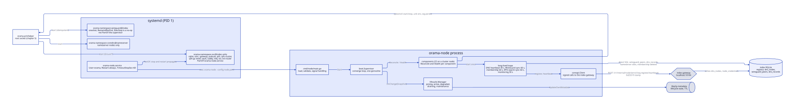
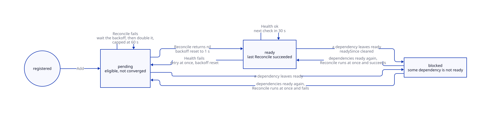
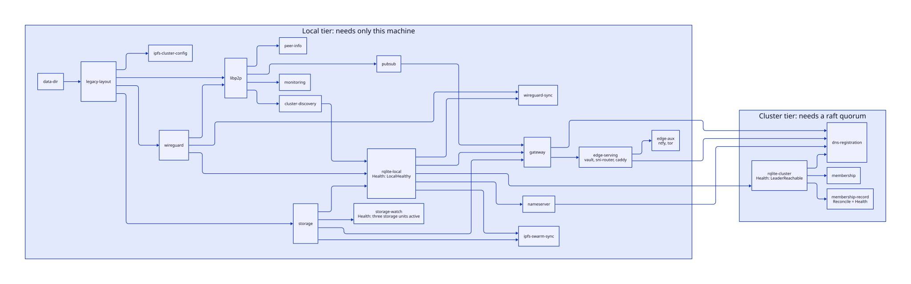
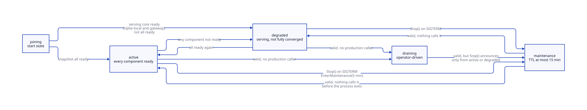
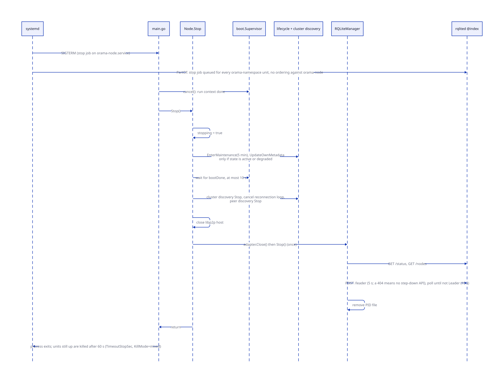
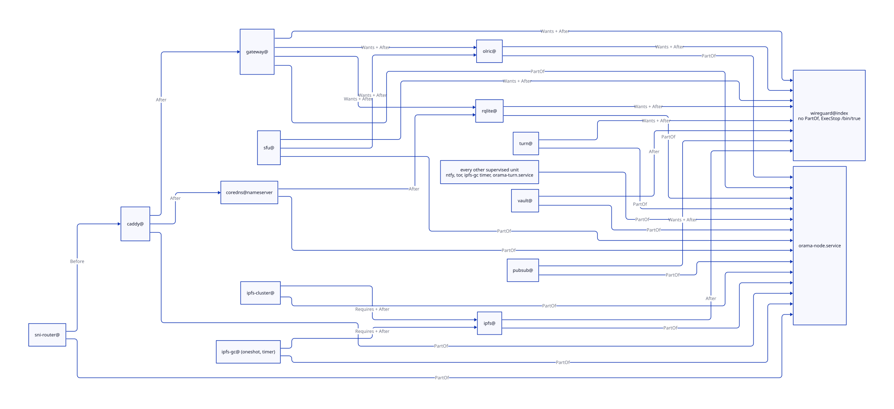
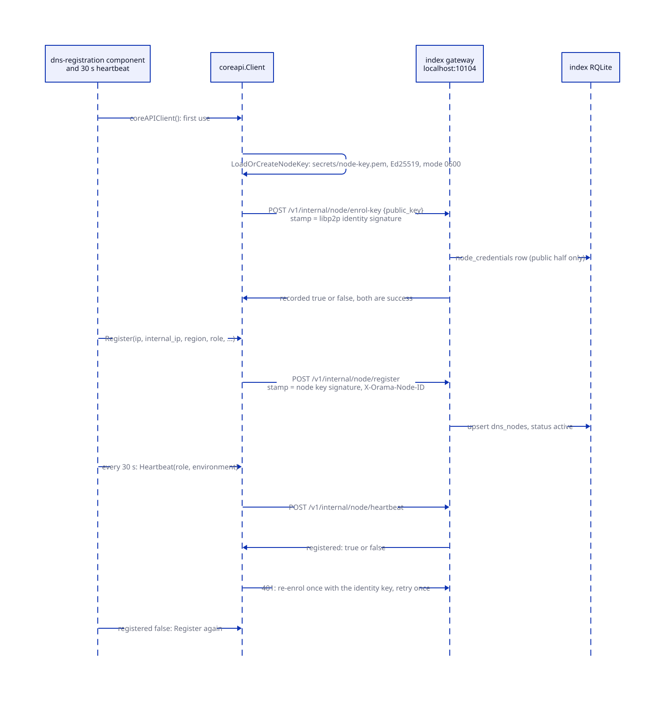
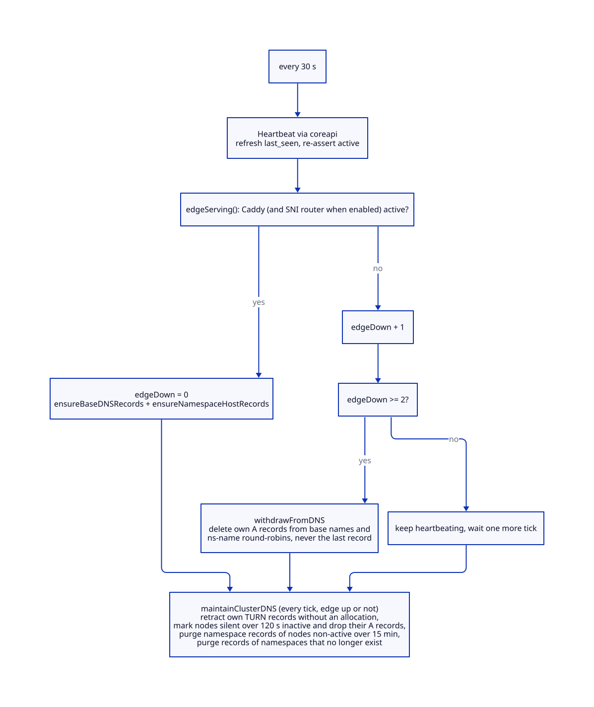

# The node as a supervisor

> **At a glance.**
>
> - **What:** `orama-node` is the only host service install enables besides the WireGuard unit. It does not embed a gateway or exec a database. It is a convergence supervisor: it declares its start-up as a graph of components, retries each with backoff, starts the `orama-namespace-<service>@index` systemd units that do the real work, keeps its own lifecycle state, and records itself in the cluster registry.
> - **Key numbers:** 22 components on a cluster node (18 local tier, 4 cluster tier). Retry backoff 1 s doubling to 60 s (`core/pkg/node/boot/component.go:DefaultMaxBackoff`). Health polled every 30 s. Shutdown grace 10 s inside `TimeoutStopSec=60`. DNS heartbeat 30 s, WireGuard sync 60 s, membership reconcile 60 s. Registry stamp skew limit 60 s. Index port block 10100 to 10199.
> - **Code:** `core/pkg/node/`, `core/pkg/node/boot/`, `core/pkg/node/lifecycle/`, `core/pkg/node/coreapi/`, `core/pkg/node/membership/`, `core/pkg/nodehealth/`, `core/pkg/oramaunit/`, `core/pkg/systemd/`, `core/pkg/config/`, `core/cmd/node/`, `core/systemd/`.
> - **Depends on:** System shape (chapter 2); [Privilege and filesystem trust](05-privilege-and-filesystem-trust.md) for the root helper every privileged call goes through.



## Why it exists

A node has to bring up about a dozen daemons, and several of them cannot start until others are healthy. The index RQLite needs the WireGuard mesh. The gateway needs RQLite, IPFS and pub/sub. DNS registration needs a Raft leader. The first implementation was a straight line: WireGuard, libp2p, storage, RQLite, CoreDNS, gateway, edge. Any step that returned an error aborted the process, systemd restarted it five seconds later, and the line began again from the top (`core/pkg/node/boot/supervisor.go`, package comment).

That shape is correct when every dependency is local and wrong when the fourth step waits on a Raft quorum. A node that boots while its peers are down never reached step five. It served no HTTPS, no DNS and no tenants, not because those need a quorum but because nothing tried to start them. A cold start of the whole fleet made every node wait on the others' database before serving anything.

The supervisor inverts this. Components declare what they depend on. The supervisor runs each one whose dependencies are ready and retries failures with backoff instead of exiting. Components that need consensus depend on the one component that waits for it, so a lost quorum holds back exactly those components and nothing else. A node alone in the world still brings up WireGuard, IPFS, its local RQLite replica, CoreDNS, the index gateway, Caddy and its tenants. It announces itself as `degraded` rather than `active`, and returns to `active` by itself when quorum comes back. Nothing exited, so nothing needs a restart.

Two further constraints shaped the design. The process runs unprivileged as the `orama` user, so every root action (`systemctl`, writing a unit env file, persisting WireGuard peers) goes through `orama-privhelper` (chapter 5). And the mesh must outlive the supervisor: Raft runs over WireGuard, so a node whose supervisor cannot start must still be reachable on `10.0.0.x` for diagnosis.

## The model

**Node.** One machine running `orama-node`. Its identity is the libp2p peer id derived from `identity.key` in the data directory. Every cluster record (`dns_nodes`, `dns_nameservers`, namespace membership, the Raft id once migrated) names the node by that id (`core/pkg/node/rqlite.go:nodeID`).

**Supervisor and component.** A `boot.Supervisor` owns an ordered list of `boot.Component` values. A component has a unique `Name`, a `DependsOn` list, a `Reconcile` function that brings it to its desired state, and an optional `Health` function polled while the component is ready. `Reconcile` must be idempotent, must return within bounded time, and receives the supervisor's run context, which is cancelled only at shutdown (`core/pkg/node/boot/component.go:Component`).

**Status.** Each component is `blocked` (a dependency is not ready; not attempted, not counted as failing), `pending` (eligible and not converged: never attempted, or last attempt failed and waiting out its backoff) or `ready` (last Reconcile succeeded and no Health check has contradicted it).

**Tier.** A component is in the *cluster tier* exactly when it transitively depends on `rqlite-cluster`, the one component that waits for a Raft leader. Every other component is *local tier*. The graph is the record: there is no second list to keep in step (`core/pkg/node/components.go:clusterBootComponents`).

**Role.** `cluster` (the default), `global` or `both`. The role picks the graph (see [Roles](#roles-cluster-global-and-both)).

**Plane.** The units a node runs fall into three planes.

| Plane | Membership | Units | Ports |
|---|---|---|---|
| index | every node | `orama-namespace-<service>@index` for wireguard, ipfs, ipfs-cluster, ipfs-gc, rqlite, olric, pubsub, gateway, vault, caddy, ntfy, tor; sni-router when enabled | internals 10100 to 10110 and 10114; edge 80, 443, 51820, 9050 |
| nameserver | nodes installed with `--nameserver` | `orama-namespace-coredns@nameserver` | 53 |
| tenant | N members chosen at provisioning | `orama-namespace-<service>@<name>` for rqlite, olric, gateway, plus sfu and turn | 10000 to 10099 |

`index` and `nameserver` are reserved namespace names (`core/pkg/systemd/manager.go:IndexNamespace`, `core/pkg/systemd/manager.go:NameserverNamespace`). The index port assignments are constants in `core/pkg/constants/ports.go` (`RQLiteHTTPPort` 10100, `RQLiteRaftPort` 10101, `OlricHTTPPort` 10102, `OlricMemberlistPort` 10103, `GatewayAPIPort` 10104, `PubsubAPIPort` 10105, `VaultHTTPPort` 10106, `IPFSAPIPort` 10107, `IPFSClusterAPIPort` 10108, `NtfyListenPort` 10109, `IPFSClusterKuboProxyPort` 10110, `IPFSClusterSwarmPort` 10114). The node supervises the index and nameserver planes. Tenant units are started by the namespace machinery inside the gateway process (chapter 9) and are outside the boot graph.

**Lifecycle state.** `joining`, `active`, `degraded`, `draining` or `maintenance`, held by `lifecycle.Manager` and published in libp2p discovery metadata (`core/pkg/node/lifecycle/manager.go:State`).

**Unit.** A systemd unit. Install writes exactly one host unit for the node, `orama-node.service`, and the WireGuard template instance; every other daemon runs from an `orama-namespace-*@` template that the supervisor starts.

## How it works

### Process entry and configuration

`core/cmd/node/main.go` takes one flag, `--config` (default `node.yaml`). The systemd unit passes an absolute path to `configs/node.yaml` under the orama directory. The sequence is fixed:

1. Resolve and require the file. A missing file prints a hint that `orama node install` writes `node.yaml` and exits 1.
2. Decode it with `config.DecodeStrict`, which sets `KnownFields(true)` (`core/pkg/config/yaml.go:DecodeStrict`). An unknown key fails the whole parse. This is why every key a template renders must exist as a struct field, even when nothing reads it. The struct comments record the v0.122.42 incident in which a rendered `secrets_encryption_key` that the struct lacked crash-looped every node at boot (`core/pkg/config/gateway_config.go:HTTPGatewayConfig`).
3. Run `Config.Validate`, which aggregates every error from the per-section validators in `core/pkg/config/validate/` and prints them all before exiting 1. It requires a non-empty `node.id`, `discovery.http_adv_address` and `discovery.raft_adv_address` (no defaults: rqlited binds the HTTP advertise host and every on-node client reaches it there), a valid data directory, valid listen multiaddrs, a positive `node.max_connections` and `discovery.discovery_interval`, an odd `database.replication_factor` (an even one is an error, not a warning), distinct RQLite HTTP and Raft ports, and `database.rqlite_auth_file` whenever `rqlite_enforce_auth` is set.
4. Create the data and `rqlite` directories (mode 0755), build the `Node`, and call `Node.Start`.
5. Block on SIGINT or SIGTERM. On either, cancel the context and wait for `Node.Stop` to finish.

`Node.Start` registers the component graph, wires `applyBootState` to the supervisor's change callback, starts `Supervisor.Run` on its own goroutine and returns. Its only possible errors are declaration errors: a malformed graph, a role it cannot parse, or `node.role` disagreeing with `preferences.yaml`. Those are bugs or operator mistakes that retrying cannot fix, so they are the only things that make the process exit.

### The converge loop

`Supervisor.Run` repeats one `pass` over the components in registration order. `Add` refuses a component whose `DependsOn` names something not yet registered, so registration order is always a valid dependency order, cycles cannot be expressed, and one pass converges the whole graph (`core/pkg/node/boot/supervisor.go:Supervisor`).

For each component, in order:

- If any dependency is not `ready`, mark the component `blocked` (resetting its backoff and next-attempt time) and move on. No timer is scheduled for it: it is re-evaluated on every pass.
- If it is `ready` and has a `Health` function, call `Health` when its next-health time arrives. On error, log a warning, move it to `pending` with backoff reset and `nextAttempt` set to now, and notify.
- If it is not `ready` and its backoff has expired, call `Reconcile`. On error it stays `pending`, `attempts` increments, the next attempt is scheduled `backoff` ahead and the backoff doubles up to the cap. On success it becomes `ready`, backoff resets, and the first Health is scheduled one interval ahead.

After each pass `Run` sleeps until the earliest scheduled time over all components, or one minute (`idleInterval`) when nothing is scheduled (no pending retry and no Health function waiting). The three durations are `DefaultBaseBackoff` 1 s, `DefaultMaxBackoff` 60 s and `DefaultHealthInterval` 30 s, overridable through `boot.Options`; the node uses the defaults.



Four properties follow from the code and matter operationally.

**One goroutine.** Reconcile and Health calls are sequential. A `Reconcile` that blocks stalls every component behind it, including health checks. This is why the graph is ordered so that cheap, independent work comes first, and why `monitoring` and `pubsub` are registered before `rqlite-local` (`core/pkg/node/components_test.go:TestBootComponents_slowWorkDoesNotDelayIndependentComponents`). Only the gateway reconcile is wrapped in a timeout (`gatewayStartTimeout`, 3 minutes); the DNS registration bounds its registry writes at 30 s (`dnsWorkTimeout`). The others are bounded by the spawners' own 30-second wait for the unit to report active. `startRQLiteLocal` is the longest: the unit start (up to 30 s), a minimum-cluster-size wait of up to 2 minutes when `database.min_cluster_size` is above 1 (`core/pkg/rqlite/cluster.go:minClusterSizeWait`), a 45-second pre-start discovery when the node needs recovery, the connect retries and the Olric start (up to 30 s), so several minutes in the worst case. `rqlite-cluster` is unwrapped because `JoinCluster` starts the long-lived RQLite reconcilers and the backup loop from the context it is given, and a timeout wrapper would cancel them with the attempt. A failing `rqlite-cluster` blocks the loop for up to a minute per attempt (a 30 s Raft-ready wait, then a 30 s leader-routed read), so during a quorum outage every other Health check runs at most once per attempt.

**A dependent re-runs after its dependency regresses.** When a dependency leaves `ready`, its ready dependents are marked `blocked` on the next pass. When the dependency converges again the dependents are reconciled again, not assumed ready. A failed `rqlite-local` health check therefore re-runs the gateway reconcile once the database is back. Reconcile functions are idempotent for this reason.

**Long-lived loops start once.** Anything a Reconcile launches that must outlive the attempt (DNS heartbeat, WireGuard sync, IPFS swarm sync, connection monitoring, the membership reconciler) is guarded by a `sync.Once` field on `Node` and started from the run context (`core/pkg/node/node.go:Node`).

**There is no panic recovery.** A panic in a Reconcile, Health or loop goroutine terminates the process. systemd restarts it after 5 seconds.

### The boot graph

The cluster graph is declared in `core/pkg/node/components.go:clusterBootComponents` and pinned by a golden test (`core/pkg/node/graph_test.go:TestBootComponents_clusterGraphIsTheGoldenGraph`).



| Component | Depends on | Reconcile | Health |
|---|---|---|---|
| `data-dir` | none | create the data directory | none |
| `legacy-layout` | `data-dir` | move pre-0.200 state (gateway signing keys, tenant SQLite, deployments, shared TURN config, unit env files) into the current layout (`core/pkg/legacylayout/`) | none |
| `wireguard` | `legacy-layout` | `IndexSupervisor.EnsureWireGuard` | none |
| `libp2p` | `legacy-layout`, `wireguard` | build the libp2p host, GossipSub and the discovery manager | none |
| `peer-info` | `libp2p` | write `peer.info` with this node's dialable multiaddr | none |
| `monitoring` | `libp2p` | start the 30-second monitoring loop | none |
| `pubsub` | `libp2p` | `EnsurePubsub`: start `orama-namespace-pubsub@index` | none |
| `ipfs-cluster-config` | `legacy-layout` | write the node-owned part of the IPFS Cluster `service.json` | none |
| `storage` | `legacy-layout` | `EnsureIPFS`, `EnsureIPFSCluster`, `EnsureIPFSGC` | none |
| `storage-watch` | `storage` | same function as `storage` | the three storage units are active |
| `cluster-discovery` | `libp2p` | start the libp2p-backed Raft peer exchange | none |
| `rqlite-local` | `wireguard`, `cluster-discovery`, `storage` | `startRQLiteLocal`: RQLite unit, local connection, Olric, SQL adapter | `LocalHealthy` |
| `nameserver` | `rqlite-local` | `EnsureCoreDNS` when `preferences.yaml` marks a nameserver, otherwise nothing | none |
| `gateway` | `rqlite-local`, `storage`, `pubsub` | `EnsureGateway` under a 3-minute timeout; nothing when `http_gateway.enabled` is false | none |
| `edge-serving` | `gateway` | `EnsureVault`, `EnsureSNIRouter`, `EnsureCaddy` | none |
| `edge-aux` | `edge-serving` | `EnsureNtfy`, `EnsureTor` | none |
| `wireguard-sync` | `wireguard`, `rqlite-local` | self-register in `wireguard_peers`, reconcile `wg0`, start the 60-second loop | none |
| `ipfs-swarm-sync` | `storage`, `rqlite-local` | start the 60-second swarm sync loop | none |
| `rqlite-cluster` | `rqlite-local` | `JoinCluster`: wait for Raft and a leader-routed read, start reconcilers, apply embedded migrations | `LeaderReachable` |
| `membership-record` | `rqlite-cluster` | record cluster membership | the same function |
| `membership` | `rqlite-cluster` | start the 60-second membership reconciler | none |
| `dns-registration` | `rqlite-cluster`, `gateway`, `nameserver`, `edge-serving` | start the 30-second heartbeat (once), then register in `dns_nodes` and ensure DNS records under a 30-second budget | none |

The reasons behind the less obvious edges:

- `storage` does not depend on `ipfs-cluster-config`. A node whose cluster config cannot be written should still run its IPFS daemon; the config failure degrades the node visibly instead of being logged once and forgotten.
- `cluster-discovery` is separate from `rqlite-local` because its goroutines must live as long as the node. Folded into `rqlite-local` they would be tied to that component's attempt and stop minutes after boot.
- `storage-watch` exists because the cluster peer is `Requires=` the daemon: systemd stops the peer together with the daemon as a stop job, and `Restart=` never undoes a stop job. Without the watchdog a peer stopped that way stayed down until `orama-node` restarted. `storage` has no health check on purpose, because `rqlite-local` and `gateway` depend on it and an IPFS outage must not block them. Nothing depends on `storage-watch`, so its failing check only re-runs storage. It also restarts a storage unit an operator stopped by hand while the node keeps running (`core/pkg/namespace/index_host.go:StorageHealthy`).
- `edge-serving` and `edge-aux` are split because `dns-registration` depends on the first and not the second. A `dns_nodes` row saying `active` promises that this node terminates TLS and proxies tenants. A node whose Caddy never started must not advertise itself; a broken ntfy, which serves no traffic, must not take a healthy node out of DNS.
- `dns-registration` depends on `gateway` for two reasons: the registry write goes through the local gateway, and the row is a promise that the gateway runs. The old sequential start-up got this right by accident (a node whose Caddy failed exited before it could register); with independent components it has to be declared (`core/pkg/node/components_test.go:TestBootComponents_dnsRegistrationDependsOnEverythingItPromises`).
- `wireguard-sync` is local tier even though it reads a cluster table. Raft runs over the mesh, so a node whose interface lost its peers can never reach a quorum. Gating the repair on a quorum would make fixing the transport depend on the transport. `loadDesiredWireGuardPeers` falls back to the node's own replica for this reason.
- `ipfs-swarm-sync` is local tier for a weaker reason. `syncIPFSSwarmPeers` reads only the leader-routed handle, so without a quorum its query fails, it logs a warning and returns; it sits early because starting its loop costs nothing, not because it works without a quorum.
- `membership-record` is a leaf. A node that cannot write its record is degraded, not down.

A component's *ready* means its Reconcile returned nil, which for the `Ensure*` family means systemd reports the unit active. For a `Type=simple` unit that proves the process exists, not that it serves. A ready `gateway` component can sit beside a gateway that answers 503 `starting` (see [Readiness](#readiness-nodehealth)).

Reconcile is idempotent through the spawners. `ensurePortsFree` short-circuits when the unit being started is already active on exactly the ports it asks for, so a retry after a transient failure does not report a port conflict against itself (`core/pkg/namespace/systemd_spawner.go:ensurePortsFree`).

### Local tier and cluster tier

The split is what the tiers buy. Local components need nothing but this machine. A node whose local tier is up serves HTTPS, DNS, the gateway and its tenants from local replicas. The four cluster components wait for consensus, and only `rqlite-cluster` actually probes for it. Two health checks carry the tiers, polled every 30 s:

- `rqlite-local` runs `LocalHealthy`: the local `rqlited` answers `/status` (3-second budget, `localStatusTimeout`) and the connection handle is open. It does not require a leader. A failure re-runs the component, which restarts the unit if it died and reopens the handle, and blocks everything reading the local replica until it is back (`core/pkg/rqlite/rqlite.go:LocalHealthy`).
- `rqlite-cluster` runs `LeaderReachable`: a bare `SELECT 1` through a connection opened at gorqlite's default `weak` read level, which routes reads to the leader, so a leaderless node gets an error rather than a stale answer. The probe runs in its own goroutine because gorqlite takes no context, bounded at 10 s (`leaderProbeTimeout`). Its Reconcile, `JoinCluster`, bounds each attempt to 30 s for the Raft-ready wait and 30 s for the SQL check (`supervisedRaftReadyTimeout`, `supervisedSQLTimeout`). Those are short on purpose: the supervisor retries, so a long single attempt only delays the node announcing that it is degraded.

`JoinCluster` also starts three background reconcilers (health monitoring, voter reconciliation, orphaned-node recovery; these three need cluster discovery) and the backup loop exactly once, applies the embedded migrations from the node process and only logs a migration failure, clears this node's Raft eviction tombstone (a node that is voting again is no longer evicted), and logs a warning when the schema is below the binary's required version. The authoritative schema gate is the gateway's own readiness (chapter 12).

### Roles: cluster, global and both

`Node.role` combines `node.role` in node.yaml and `role` in `preferences.yaml` (in the parent of the data directory). Both are optional and empty means `cluster`. If both are set they must agree, case-insensitively. A `preferences.yaml` that exists but cannot be read or parsed is an error, never a guess, because guessing `cluster` would start WireGuard, RQLite, Olric and the gateway on a machine whose preferences were supposed to say `global` (`core/pkg/node/role.go:role`).

- `cluster` and the empty role run the 22-component cluster graph.
- `global` runs a graph of one component, `data-dir`. No WireGuard, RQLite, Olric or gateway. Once `data-dir` is ready the snapshot is all-ready and the node reports `active`. The chain's sync state is part of the node report, not a lifecycle state. Chain, public IPFS and the relay are not boot components and are not `PartOf` the node unit (chapter 37).
- `both` runs the cluster graph and is accepted only when `preferences.yaml` records `global_netns: orama-global` and the layout's files exist: the namespace unit `orama-global-netns.service`, the host and namespace nftables files, and the namespace `resolv.conf` (`core/pkg/globalnetns/preflight.go:Verify`). The global services then run as their own units in their own network namespace, so they share neither loopback nor ports with the cluster node, and they are not components of this process (`core/pkg/node/boot/role.go:ParseRole`).

A plain `orama global install` on a machine with no preferences writes `role: global`, so an `orama-node` started there boots the global graph and never the cluster one.

### The index units a node starts

Every `Ensure*` method on `namespace.IndexSupervisor` writes the unit env file through the privilege helper (when it changes) and starts the unit (`core/pkg/namespace/index.go:IndexSupervisor`, `core/pkg/namespace/index_host.go:EnsureIPFS`). Details that matter:

- **Adopt in place.** The index units run against state older installs created: the core Raft directory (`data/rqlite`), the IPFS repo, the IPFS Cluster data. The `adoptReplace` helper stops the pre-factory host unit (`orama-ipfs.service` and the rest of `core/pkg/systemd/manager.go:LeftoverHostUnits`), starts the template instance and disables the old unit. A node not yet upgraded still has those unit files on disk and anything that decided what to start by looking for a unit file would race the new units for the same ports (`core/pkg/systemd/manager.go:IsLeftoverHostUnit`).
- **WireGuard is never bounced.** `EnsureWireGuard` disables `wg-quick@wg0` without stopping it, returns if the template unit is already active, and otherwise starts it. It does not stat `wg0.conf`: `/etc/wireguard` is root's and the node is not, so the stat failed with permission denied on every node and WireGuard never came up. A missing conf fails the unit start, whose error names the unit.
- **Secrets are required.** `EnsureIPFSCluster` and `EnsureIPFSGC` refuse an unreadable or empty `secrets/cluster-secret`. They used to start the daemon with an empty secret, which runs a private network keyed by nothing and reports healthy.
- **Units with other users read no env file.** tor (`debian-tor`), ntfy (`ntfy`) and WireGuard (`root`) are started with `startWithoutEnv`: anything in an env file would be set by the orama user for a process it does not own.
- **Prerequisites fail loudly, except ntfy.** `EnsureTor` fails when the torrc is missing, `EnsureCoreDNS` when `/usr/local/bin/coredns` or `/etc/coredns/Corefile` is missing, `EnsureVault` without `vault.yaml`, `EnsureCaddy` without `/usr/bin/caddy`, and `EnsureSNIRouter` with the router enabled and no binary. `EnsureNtfy` is the one that skips: without `/usr/local/bin/ntfy` it logs, disables the old host unit and succeeds, so `edge-aux` is ready on a node with no ntfy. With the SNI router disabled, `EnsureSNIRouter` stops any router left running so Caddy can bind 443.
- **Olric prefers the host config.** `EnsureOlric` starts the unit against `configs/olric/config.yaml` when that file exists and otherwise has the spawner write a config for the index instance.
- **Stale per-node configs are deleted.** Index configs are named by node id, which changed from `node.id` to the peer id. `removeStaleIndexConfigs` deletes `<service>-*.yaml` other than the current node's, because the old gateway file embeds the secrets encryption key and nothing reads it.

### Starting the index RQLite

`startRQLiteLocal` and `EnsureRQLite` decide how `rqlited` starts, and this is the point where a node can split a cluster. The decision (`core/pkg/namespace/index_bootstrap.go:indexJoinTargets`):

| Local state | Membership record | Result |
|---|---|---|
| Raft state, address unchanged | any | start with no `-join`; a member restarts into the cluster it has |
| Raft state, configuration holds a different address | any | `-join` every other recorded member and the configured join address; refuse if there is none |
| No Raft state, no record | none | `-join` the configured address if any; with none, bootstrap a new cluster (fresh genesis) |
| No Raft state, a record | present | `-join` the recorded members plus the configured address; with none, refuse to start |
| A recovery `peers.json` is waiting | any | no `-join`; the operator is reforming the cluster from this node's data |

A node holding Raft state but no record gets a record written on the spot, so the evidence exists before it can be lost; a record that does not parse is replaced the same way when the node holds Raft state, and is a refusal when it does not. The refusal on lost data names both ways forward: `orama node recover-raft` from the operator's machine, or deleting the record to bootstrap deliberately. The raft identity (`-node-id`) is resolved from the data directory by `rqlite.ResolveRaftIdentity`, given the peer id and the advertise address (chapter 7): a recorded id wins, a fresh node starts on its peer id, and a node that holds Raft state with no recorded id refuses to start rather than guess the address it last ran under. Raft timing flags come from `rqlite.DefaultRaftTimeouts`: election 5 s, heartbeat 2 s, apply 30 s, leader lease 2 s, overridable per key in node.yaml (`core/pkg/node/rqlite.go:indexRQLiteExtraArgs`). The platform's choice of values above rqlite's one-second defaults is deliberate: over the overlay, with a hypervisor that can take a CPU away for seconds, the defaults mistook a slow heartbeat for a dead leader and namespace clusters elected every few seconds (`core/pkg/rqlite/raft_timeouts.go`).

Between the unit start and the wait for a leader, `StartLocal` calls the `onProcessStarted` hook, which node.go sets to `bootstrapWireGuardMesh`. That is the only window in which a node can repair the transport before anything waits on consensus: rqlited is listening, the node reads its own replica, and re-adds missing WireGuard peers (additive only, with a 10-second read budget). Before the hook existed, one restart of a node that had lost its peers was an unrecoverable outage.

After the unit starts, `startRQLiteLocal` also starts the index Olric (using the host Olric YAML when it exists) and builds the `sql.DB` adapter, which is lazy, so it can exist before a leader does.

### Lifecycle state machine

`lifecycle.Manager` has no dependencies and is tested in isolation. The legal transitions are a fixed table (`core/pkg/node/lifecycle/manager.go:validTransitions`).



The supervisor drives `joining`, `active` and `degraded`. On every status change, `applyBootState` maps the snapshot onto a state (`core/pkg/node/boot_state.go:nextLifecycleState`):

1. `draining` and `maintenance` are operator or shutdown driven. The supervisor never overrides them.
2. Every component ready means `active`.
3. A node still `joining` whose serving core is not both converged stays `joining`. The serving core is `rqlite-local` and `gateway` (`servingCore`), deliberately narrower than the whole local tier: pinning `joining` on every local component would let one component that can never converge, a broken ntfy inside `edge-aux`, hold the node out of `IsAvailable` forever and stop it announcing maintenance on shutdown.
4. Anything else is `degraded`: serving, not fully converged.

`degraded` is a serving state. `IsAvailable` is true for `active` and `degraded`. The peer health monitor does not short-circuit a degraded peer on its metadata; it verifies the claim with an HTTP probe (a `dns_nodes` heartbeat newer than 65 s counts as proof for any state, `freshHeartbeatWindow`), while an `active` peer seen in the last 30 seconds and a `maintenance` peer seen in the last 2 minutes are counted healthy without a probe (`core/pkg/peerhealth/monitor.go:probeNode`, chapter 8).

The transition is conditional: `TransitionToFrom(current, want)` refuses if the state moved while the supervisor was deciding. Without the compare, a concurrent `EnterMaintenance` from the shutdown path could land in between and be silently undone, re-publishing a dying node as available. `applyBootState` also returns immediately once `Stop` has set the `stopping` flag.

After each change the node calls `UpdateOwnMetadata` on cluster discovery, which publishes the lifecycle state and, in maintenance, the TTL to peers (`core/pkg/rqlite/cluster_discovery_membership.go`). Peers that predate the field are read as `active` (`EffectiveLifecycleState`). The state is also logged: `orama node logs node --since -1h` shows "Node lifecycle state changed" lines with the list of components that have not converged.

`EnterMaintenance` takes a TTL, capped at `MaxMaintenanceTTL` (15 minutes). `Stop`, the only caller, requests 5 minutes. Nothing enforces the TTL (see Known gaps), so it is only metadata that peers read.

### The stop sequence

On SIGTERM `main` cancels the run context and then calls `Node.Stop`, which must finish inside `TimeoutStopSec=60`.



1. Set `stopping`. Late reconciles check it (`errNodeStopping`) and cannot re-create what teardown releases.
2. If the state is `active` or `degraded`, enter maintenance for 5 minutes and republish metadata, **before** waiting on anything, so peers hear promptly during a rolling restart instead of one grace period later. A node still `joining` does not announce; it has not claimed to be serving.
3. Wait up to `bootShutdownGrace` (10 s) for the supervisor goroutine to leave its current attempt. If it does not, log and tear down anyway. The supervisor writes the fields torn down below, so waiting is what makes the teardown race-free in the normal case.
4. Stop cluster discovery, cancel the bootstrap-peer reconnection loop, stop peer discovery and close the libp2p host.
5. Close the SQL adapter, which calls `RQLiteManager.Stop`. That runs once (`stopOnce`): request a leadership transfer if this node leads, then remove the PID file. The transfer asks `GET /status`, `GET /nodes`, picks any reachable voter that is not this node, `POST /leader` with the target (5 s), then polls until this node reports a state other than `Leader` (up to 15 s, `transferStepDownTimeout`). With no eligible voter it returns `ErrNoTransferTarget`, and the manager logs a warning and relies on SIGTERM step-down. An rqlited build that answers 404 to `POST /leader` has no step-down API; the transfer returns success and the same fallback applies. The bounds sum to about 40 to 45 s in the worst case (10 s grace, three 5 s requests, up to 15 s of polling with 5 s per poll), inside the 60 s budget (`core/pkg/rqlite/leadership.go:TransferLeadership`).

`rqlited` itself is a separate unit (`orama-namespace-rqlite@index`) and never a child of the node, so the node's only job is to ensure it is not the leader when it goes. A previous guard on a child-process handle that is always nil in production returned before the transfer could ever run, which made every restart of the leader a hard kill and a full election.

The node does not stop the units it supervises. systemd does, through `PartOf=orama-node.service` on each of them (next section).

### The unit model

**One host unit.** `GenerateNodeService` renders `orama-node.service` (`core/pkg/install/services.go:GenerateNodeService`). It is `Type=simple`, `User=orama`, `Restart=always`, `RestartSec=5`, with `StartLimitIntervalSec=0` in the `[Unit]` section, `TimeoutStopSec=60`, `KillMode=mixed`, `MemoryMax=8G`, `MemorySwapMax=0`, `OOMScoreAdjust=-500`, `LimitNOFILE=65536`, `AmbientCapabilities=CAP_NET_ADMIN` and the sandbox set `ProtectSystem=strict`, `ProtectHome=yes`, `PrivateDevices=yes`, `ProtectKernelTunables=yes`, `ProtectKernelModules=yes`, `ProtectProc=invisible`, `RestrictNamespaces=yes`, `PrivateTmp=yes`. Its only writable path is the orama directory. `/etc/wireguard` is read-only to it, because `wg-quick` executes `PostUp` lines as root and a conf the orama user could write would be root code execution. It logs to the journal, not to a file: PID 1 opens a `StandardOutput=append:` target with `open(2)` before dropping privileges and follows symlinks, so an orama-owned log directory would have let the node make root append to any file. The start limit is off because the node no longer exits when the cluster is unreachable, so a restart means a real crash that systemd should keep retrying.

**Template units.** `core/systemd/` ships 23 unit files, installed from the verified archive by `InstallTemplateUnits` (`core/pkg/systemd/manager.go:UnitFilesToInstall`): 17 `orama-namespace-<service>@` files (`TemplateUnits`, including the ipfs-gc service and timer), 5 deployment templates (`orama-deploy-node@`, `-npm@`, `-go@`, `-build@`, `-clean@`) and the shared host unit `orama-turn.service`. Instances are named `NamespaceUnit(service, namespace)`, for example `orama-namespace-gateway@index`.

**Restart policy.** Every long-running supervised unit has `Restart=always`, `RestartSec=5s` and `StartLimitIntervalSec=0`. Always, because `on-failure` leaves a daemon down after a clean exit nobody asked for. No start limit, because a rate-limited unit refuses `systemctl start` ("Start request repeated too quickly") until someone runs `reset-failed`. The cost is that nothing parks a unit that fails instantly (a missing binary, an unparseable config), so the node report reads the restart counter instead: a unit with more than 3 restarts that has been active for less than 300 seconds, or never, is flagged `RestartLoopRisk` (`core/pkg/telemetry/report/services.go:restartLoopRisk`). Both properties are checked by tests (`core/pkg/systemd/unit_ordering_test.go:TestSupervisedUnitsHaveAnExplicitRestartPolicy`, `TestStartLimitIsDeclaredInTheUnitSection`).



**Ordering is not lifecycle.** `Requires=` propagates stop and restart, so it is reserved for the two places where a unit is useless without another: `ipfs-cluster@` and `ipfs-gc@` on `ipfs@`. Everything else uses `Wants=` plus `After=`. The gateway used to `Require` RQLite and Olric, so a restart of RQLite (which split-brain recovery issues by itself) bounced the gateway and restarted its leader wait, reconcilers and tenant restore. The gateway now waits for RQLite itself and reconnects to Olric in the background. Olric has no RQLite ordering at all: it is an in-memory cache that never reads the database (`core/pkg/systemd/unit_ordering_test.go:TestGatewayDoesNotHardRequireItsBackends`, `TestOlricIsNotCoupledToRQLite`, `TestIPFSControllersKeepTheirHardDependency`). Every unit that binds or reaches across the overlay (rqlite, olric, gateway, pubsub, sfu, turn, ipfs, vault) is ordered after `orama-namespace-wireguard@index`, so a cold boot cannot start Olric against an address that does not exist yet (`TestWGBindingUnitsAreOrderedAfterTheMesh`). Caddy is ordered after the index gateway and CoreDNS; the SNI router is ordered before Caddy; CoreDNS is ordered after the index RQLite.

**`PartOf=orama-node.service`.** Every supervised unit except WireGuard carries it, as do `orama-turn.service` and the GC timer. `PartOf` propagates stop and restart from the node unit to its parts, so `systemctl stop orama-node` stops all of them and a restart of the node restarts all of them. It does not propagate start: the supervisor starts them. Nothing orders these stop jobs against the node's own stop job. The shared TURN unit records the cost: a node restart cycles the relay and drops every tenant's active relays on the host, accepted because a relay that outlives the node would keep running an old binary across an upgrade (`core/systemd/orama-turn.service`).

**WireGuard is deliberately not `PartOf`.** The unit is `Type=oneshot`, `RemainAfterExit=yes`, runs `wg show wg0 || wg-quick up wg0` and has `ExecStop=/bin/true`. Install enables it beside `orama-node.service` (`core/pkg/install/orchestrator.go:enableNode`), so the mesh comes up at boot on its own and a node whose supervisor cannot start is still reachable on the overlay. `PartOf` used to tear `wg0` down on every `orama node restart`, severing every namespace Raft and Olric memberlist on the machine. Bring the interface down with `wg-quick down wg0` when that is the intent (`core/pkg/systemd/unit_ordering_test.go:TestWireGuardUnitIsNotPartOfTheSupervisor`).

**Stateful services are never restarted as a side effect.** `Manager.StartService` on a running unit is a no-op unless the unit's inputs are newer than the process: marked stale this run (`GenerateEnvFile` and `MarkConfigChanged` set the mark) or an env file whose mtime is after the unit's `ActiveEnterTimestamp`. Then it restarts, except for the services in `statefulClusterServices` (rqlite, olric, ipfs, ipfs-cluster, vault, wireguard). The same reconcile runs on every node, and restarting RQLite voters or Olric members on several nodes at once is the one thing a rolling procedure exists to prevent. For those, the new inputs wait for the next deliberate restart and the first deferral per change is logged once (`core/pkg/systemd/manager.go:StartService`).

**Env files.** A unit's environment lives in `/var/lib/orama-unit-env/<namespace>/<service>.env`, a root-owned tree (`core/pkg/unitenv/`). The orama user writes it only through `orama-privhelper` (chapter 5). `GenerateEnvFile` renders `NODE_ID` first and then the remaining keys in sorted order, so identical inputs render identical bytes; a differing byte stream is the only thing that triggers a write and a restart mark. Before writing, `validateEnvFile` checks the namespace and service names and every key against `^[A-Za-z_][A-Za-z0-9_]*$`, refuses control characters, quotes and backslashes in every value, and for rqlite, ipfs and ipfs-cluster, whose unit files substitute env values into a `sh -c` script, restricts values to `[A-Za-z0-9 ._:/,=@+-]` (`core/pkg/systemd/envfile_validate.go:ShellInterpolatedServices`). The values come from the cluster, so they are validated where they are written.

**Accounts.** The shipped templates say `User=orama`. Install rewrites `User=` and `Group=` only for the services in `isolatedServices`, today `coredns` and `sfu`, which then run as `orama-coredns` and `orama-sfu` (`core/pkg/systemd/isolation.go:RenderNamespaceUnit`); `ServiceUser` records the account every other service would use once nothing else shares its files. ntfy (`ntfy`), tor (`debian-tor`) and WireGuard (`root`) have fixed accounts in their templates.

**Teardown.** A namespace that is going away is stopped, disabled and has its failed state reset before its env files and data go; a stop alone brings it back at the next upgrade or boot (`core/pkg/systemd/teardown.go:TeardownService`). "Stopped" is judged by `systemctl show`, never by an error's wording, and a unit still `deactivating` is polled for up to 90 s (`stopWaitDeadline`, above the longest tenant `TimeoutStopSec`: SFU 45 s, RQLite 60 s). Deployment units are found through the `.orama-owner` marker in each deployment directory, opened with `O_NOFOLLOW`, never by a glob on the namespace name (`core/pkg/systemd/tenant_deployments.go:OwnedDeploymentInstances`).

### Recording the node in the registry

A node used to write its `dns_nodes` row itself, with the RQLite handle it holds. That row is a promise every consumer routes real traffic on (`status = 'active' AND last_seen > ?`), and a direct INSERT has no request to authenticate. The node now asks the index gateway on its own host, at `constants.LocalGatewayURL()` (`http://localhost:10104`), and the ask carries a signature.



Three paths, defined once in `core/pkg/nodeapi/wire.go` so client and handler cannot drift:

| Path | Purpose | Signed with |
|---|---|---|
| `/v1/internal/node/enrol-key` | record the public half of the node's own key | libp2p identity key |
| `/v1/internal/node/register` | upsert the `dns_nodes` row | node key |
| `/v1/internal/node/heartbeat` | refresh `last_seen`, re-assert `active`, update role and environment | node key |

The node key is an Ed25519 key generated on first use at `secrets/node-key.pem` (PKCS#8, mode 0600, written to a temp file, synced and renamed). A file that exists but has a readable mode or does not parse is an error, never a reason to generate a second key: a silent re-key would be refused by the cluster and the reason would be invisible (`core/pkg/auth/nodekey.go:LoadOrCreateNodeKey`).

The stamp is `X-Orama-Node-ID` plus `X-Orama-Node-Stamp: <unix seconds>.<hex signature>`. The signature covers the string `orama-node-api-v1`, the method, path, query, node id, SHA-256 of the body and the timestamp, joined by newlines (`core/pkg/auth/nodeapi.go:nodeAPIPayload`). The body is in it by hash because the claims (address, wallet, public key) live in the body, so a stamp over method and path alone could be replayed onto a body of the attacker's choosing. The gateway accepts a timestamp within 60 seconds in either direction (`nodeAPIMaxSkew`). The node id the handler acts on comes from the verified header, never from the body, so a node can only register itself.

`enrol-key` is authenticated by the libp2p key carried inside the peer id (`auth.NodeIdentityVerifier`), so the very first call works with nothing recorded and with nothing any other machine holds. There is no trust-on-first-use window: the only machine that can enrol a key for node X is the one that holds X's identity. A peer id that does not carry its public key (an older hashed identity) is refused.

`Client.post` signs with the node key and, on a 401, enrols the key again and retries once. The row can disappear under a running node (a registry restored from a backup taken before enrolment, an operator clearing it); without the retry the node would be refused every 30 seconds and reaped out of DNS, with a restart as the only cure, which is the one thing the supervisor is built never to require. A heartbeat answered `registered: false` triggers `Register`. `coreAPIClient` caches the client but never caches a failure to build one, since the causes (a wrong file owner, a gateway still coming up) get fixed while the process runs. Calls time out at 10 seconds and responses are read through a 64 KiB limit (`core/pkg/node/coreapi/client.go`).

The handler adds admission. A register call is accepted only if the node already has a `dns_nodes` row that is not retired, or a `wireguard_peers` row exists under its id (written by the join, the enrolment or the peer endpoint), or it is an OramaOS placeholder (a `wireguard_peers` row under the synthetic id of the claimed overlay address, no other node holding that address, the request arriving from it), or the registry is empty (the genesis node) (`core/pkg/gateway/handlers/nodeapi/admission.go:admitted`). When a `wireguard_peers` row exists for the node, the claimed `internal_ip` must equal its `wg_ip`, the overlay address the cluster allocated; the handler also refuses loopback, unspecified and multicast addresses and a missing region. The genesis node's operator wallet becomes the first operator, and no request field can claim to be genesis. Chapter 15 covers the handler.

`wireguard_peers` self-registration deliberately did not move behind the gateway. Raft runs over the mesh, so making mesh repair depend on the gateway, which depends on storage and pub/sub, would make the repair conditional on services that need the mesh.

### The DNS heartbeat

Every 30 seconds the node runs one `heartbeatTick` (`core/pkg/node/dns_registration.go:heartbeatTick`).



1. Heartbeat through the gateway. It always runs: an active, fresh `dns_nodes` row is what namespace recovery, vault guardian discovery and the overlay fan-outs read as "this node is alive", and a stopped Caddy is not a dead node.
2. Check that Caddy (and the SNI router when enabled) is active. After `edgeDownTicks` (2) consecutive failures, remove this node's A records from the base names and from every `ns-<name>` gateway round-robin, never the last record of a name. TURN records are left alone, since TURN does not go through Caddy. One failure is a Caddy restart, not an outage. When the edge is up again the next tick re-adds the records. Resolvers that cached the address keep it for the record's TTL: 300 s for base names, 60 s for `ns-<name>`.
3. While the edge serves: ensure this node's base records (`ON CONFLICT DO NOTHING`; the apex and wildcard only on nameserver nodes, the per-node domain on all), claim or refresh its nameserver slot, reconcile the zone's NS and SOA sets, pin `push.<base>` to the lowest-IP healthy nameserver, and re-advertise itself in each namespace gateway round-robin it serves.
4. Maintenance, on every node, every tick, whether or not the edge serves: retract this node's TURN records for namespaces it holds no TURN allocation for, mark nodes silent for over 120 s `inactive` and drop their system A records, purge per-namespace records (gateway host, TURN, stealth TURN) that point at nodes non-active for over 15 minutes (`purgeStaleAfter`), and purge per-namespace records whose namespace is no longer in `namespaces`. The 15-minute cutoff is computed in Go and bound as a parameter: rqlite replicates the statement text and each node applies it locally, so a non-deterministic expression in a DELETE predicate could match different rows on different nodes. The 120-second test is a SELECT on the node that runs it, followed by deletes keyed on the ids it found.

The deletes are written to be safe on every node at once: each is idempotent, a node can only retract itself, and the namespace-host and base-name purges refuse to empty a name. Nameserver slots (`ns1` to `ns13`, `maxNameserverSlots`) are claimed by the lowest free index and released only by `orama node remove`, never by a missed heartbeat, because freeing a slot drops the zone's glue. The SOA is rewritten only by the node that holds the lowest glued slot, since its serial differs per writer. The DNS data model itself belongs to chapter 24.

### Mesh and membership loops inside the node

Three loops run inside the process; their policies are specified in chapters 6 and 8, and what they do in the node is summarized here.

**WireGuard sync (60 s).** Each pass self-registers the node in `wireguard_peers` (first deleting any unconfirmed row from another node id that claims this node's public IP, then an upsert on `node_id` that sets `confirmed_at` but never clears it and never takes another node's row), reads the live peers with `wg`, loads the desired set, and reconciles. The desired set comes from the leader-routed view when it answers and from the local replica otherwise. A fallback result is not authoritative and may only add peers. Removal runs only when the set is authoritative and non-empty, because "read zero peers" and "the cluster has zero peers" are indistinguishable at this layer and the first is far more likely. Peers are validated exactly as `orama-privhelper` validates them (`privhelper.ValidatePeer`): a 32-byte key, an `ip:port` endpoint and a single `/32` inside the overlay, plus that no row may claim this node's own address. A row that fails validation is skipped with a warning, but two rows claiming the same overlay address fail the whole read, and the pass then applies nothing. The resulting peer set is persisted to `wg0.conf` through the helper, never when the interface is empty and not when it equals what this process last wrote (`core/pkg/node/wireguard_sync.go:reconcileWireGuardPeersWith`).

**Membership reconciler (60 s).** It runs on every node but acts only on the Raft leader (`isRQLiteLeader`). It builds a plan from evidence (all `dns_nodes` rows, all `wireguard_peers` rows, Raft eviction tombstones, and the peer ids libp2p can currently see) and applies it. Every deletion needs positive evidence of departure, and any single sign of life vetoes it (`core/pkg/node/membership/plan.go:BuildPlan`): discovery still sees the peer, or it was seen within `LivenessGrace` (30 minutes). A node that merely stopped answering is missing, not gone; turning the first into the second is the Raft eviction path's job, and it writes the tombstone when it does. A departed node loses its `wireguard_peers` row as soon as it is departed; its `dns_nodes` row survives a further `TombstoneGrace` (6 hours) so an operator sees what was removed. WireGuard rows are matched to nodes on the overlay address, not on `node_id`, because the join handler writes a synthetic `node-<wgip>`. A matched row whose `confirmed_at` is empty is latched (`confirmed_at` set) first, so it can never again be dropped as unfinished. An unmatched row is split on `confirmed_at`: never confirmed and older than `JoinGrace` (30 minutes) is the residue of a join that never finished and is dropped, with `AND confirmed_at IS NULL` on the delete so a node that came up between the read and the write is not cut off; confirmed-then-vanished is reported only, since deleting the mesh entry of a machine that may still run would sever it. Dropping a `dns_nodes` row first revokes the node's credential and deletes its system A records, in that order, so a crash between steps leaves the safe half done and a departed node cannot resurrect itself into DNS.

**IPFS swarm sync (60 s after a 30 s warm-up).** It runs `ipfs swarm connect` from the local Kubo to every other node's Kubo on its WireGuard address and port 4101 (`constants.IPFSSwarmPort`), using `wireguard_peers.ipfs_peer_id`, and skips peers it is already connected to. It does nothing, silently, when the `ipfs` binary is not on the PATH or `wg0` has no address.

The 30-second monitoring loop samples peers and CPU (a 3-second window), publishes a JSON metrics message on the `monitoring` pub/sub topic, and every second tick rewrites the IPFS Cluster peer addresses from the overlay-addressed active nodes in `dns_nodes`.

### Readiness: nodehealth

`core/pkg/nodehealth/` answers one question in one place: is this node carrying its share of the cluster? It exists because a rolling-upgrade gate once queried a port nothing had listened on since a port migration, burned two minutes failing, printed a warning and moved on to restart the next voter. Every readiness gate now goes through it.

A `Target` is the node's RQLite endpoint (with credentials) and an optional gateway base. `Observe` reads RQLite `/status` through the authenticated admin client (a 401 must not read as "the node is down") and, when a gateway base is set, `GET /health` with a 5-second client timeout. A `Status` is ready when all of these hold (`core/pkg/nodehealth/nodehealth.go:Status`):

- the Raft state is `Leader` or `Follower`, case-insensitively; Candidate, Shutdown and the empty string are not;
- if `RequireLeaderKnown`, a leader id is reported (a follower with no leader is a cluster that cannot commit);
- the applied index trails the commit index by at most `MaxIndexLag` (default `DefaultMaxIndexLag`, 200 entries; the rollout gate also uses 200);
- the gateway answers 200 on `/health`. A gateway base of "" means the caller says this node has no gateway, not that the check passed by default.

`WaitReady` polls every 2 seconds up to `DefaultBudget` (3 minutes) and its timeout error carries the last observation ("still Candidate", "trails by 40000 entries") instead of the word timeout. Callers: `orama node start` (3-minute budget), the post-upgrade wait, the upgrade orchestrator's cluster-health wait (`RequireLeaderKnown`), and the auto-updater. The pre-upgrade leader check reads one `Observe`, and the rollout gate (`core/pkg/rollout/probe.go:GateBudget`, 5 minutes, polled every 5 seconds, `RequireLeaderKnown`) applies `Status.Ready` to a probe it runs over SSH.

`/health` on the index gateway has two layers (`core/pkg/gateway/status_handlers.go:healthReport`). While the gateway is not `ready` it answers 503 with its own start-up state: `starting` (listening, but the schema is not yet at the version the binary needs, almost always because the local RQLite has no leader) or `blocked` (a leader answered and the schema is genuinely below what the binary requires, which retrying cannot fix). Once `ready` it runs seven subsystem checks in parallel under a 5-second budget (rqlite, olric, ipfs, libp2p, anon_proxy, vault, wireguard) and answers 200 only when all are healthy: an error in rqlite or vault makes it `unhealthy`, an error in any other check `degraded`, and both are 503. A check whose client was never configured, or a Tor client that is down, reads `unavailable`, which is not an error. So the `nodehealth` gate is stricter than readiness: a node whose Olric, IPFS or `wg0` check fails does not pass it. While not ready the gateway refuses everything except health and a short passthrough list, and the unauthenticated answer carries a stable reason code (`initializing`, `schema`, `post-schema`, `schema-version`), never the error behind it (`core/pkg/gateway/readiness.go:ReadinessState`, chapter 12). The namespace-health loop of the index gateway probes each local tenant gateway's `/v1/health` on the WireGuard address and acts on the start-up state only (a degraded or unhealthy body counts as serving), so a tenant gateway that is up but `starting` is withdrawn from the `ns-<name>` DNS round-robin instead of being sent traffic it cannot serve.

### Which units are Orama's

`core/pkg/oramaunit/` is a 33-line package with no dependencies so that the inspector and the end-to-end harnesses share one rule. `Is(name)` is true for any unit whose name starts with `orama-` and for three legacy host units: `wg-quick@wg0.service`, `caddy.service` and `coredns.service`. A failed unit that matches is a cluster problem (the inspector's `system.no_failed_units` check fails at high severity); one the host image ships, such as a failed `cloud-init`, is the operator's warning and no cluster check may wait on it. `Filter` returns the matching subset in order.

### Configuration

`node.yaml` is the only configuration `orama-node` reads, plus `preferences.yaml` for role, co-location and the nameserver flag. The sections (`core/pkg/config/config.go:Config`):

| Section | Keys the node acts on |
|---|---|
| `node` | `listen_addresses` (the template sets the WireGuard address and the libp2p port), `data_dir`, `max_connections` (discovery), `domain`, `public_ip`, `ssh_user`, `environment`, `operator_wallet`, `role` |
| `database` | `rqlite_join_address`, RQLite credentials (`rqlite_username`, `rqlite_password`, `rqlite_auth_file`, `rqlite_enforce_auth`), the four `raft_*_timeout` keys, `min_cluster_size`, `backup_interval`, `ipfs.*` |
| `discovery` | `bootstrap_peers`, `discovery_interval` (15 s), `http_adv_address`, `raft_adv_address`, `node_namespace` |
| `http_gateway` | the values copied into the index gateway's own config: `base_domain`, `olric_servers`, `olric_timeout`, IPFS URLs and timeout, `secrets_encryption_key`, `ntfy_base_url`, `relay_allowed_suffixes` (`http_gateway.enabled` also decides whether the gateway starts and whether the node can register); `webrtc.*` is decoded and carried forward by install, and the node itself reads none of it |
| `sni_router`, `tls` | `sni_router.enabled`; `tls.acme_ca` |

`node.public_ip` is the only source of the address the node publishes in DNS and `dns_nodes`. It used to be guessed from the source address of a UDP socket toward 8.8.8.8, which named the wrong address on multi-homed hosts and behind floating IPs. It is validated as a public IPv4 address and rendered in canonical dotted-quad form, and a node without one does not register (`core/pkg/node/dns_registration.go:configuredPublicIP`).

In production the orama directory is `/opt/orama/.orama` and the node reads `configs/node.yaml` there (`core/pkg/config/paths.go:ProductionNodeConfigPath`); `data_dir` is its `data` subdirectory and the parent of `data_dir` is the orama directory, which is where `preferences.yaml`, `secrets/` and `configs/` live. `config.InstalledOlricAddr` reads `http_gateway.olric_servers` from that file for the node report and `orama node doctor`. Keys that are decoded and validated but read by no code are listed under Known gaps.

### The libp2p host

`startLibP2P` builds a host with the persistent identity, Noise as the only security transport, the default muxers, the listen addresses from `node.listen_addresses`, NAT services, AutoNAT v2, relay, port mapping and AutoRelay fed by the bootstrap peers. GossipSub runs with peer exchange and flood publish. The component is idempotent: a fully started host is left alone, since a second one would put a second copy of this node's identity on the network, and a partial start is torn down so the retry can bind the port again. Chapter 8 covers the failure detection built on this host.

## State it owns

| State | Holds | Writer | Reader | Location |
|---|---|---|---|---|
| libp2p identity | Ed25519 private key; its peer id is the node id | install (`orama node install`) | node, rqlite, every cluster record | `<data_dir>/identity.key`, 0600 |
| Node key | Ed25519 key signing registry calls | node (`LoadOrCreateNodeKey`) | node | `secrets/node-key.pem`, 0600, PKCS#8 |
| `node.yaml` | node configuration | install and upgrade | node (strict decode), CLI | `<orama dir>/configs/node.yaml` |
| `preferences.yaml` | role, `global_netns`, nameserver flag | install | node, installers | parent of the data directory |
| `peer.info` | this node's dialable multiaddr | node (`peer-info`) | CLI | `<data_dir>/peer.info`, 0644 |
| Unit env files | per-unit environment | node, via the privilege helper | systemd | `/var/lib/orama-unit-env/<ns>/<service>.env` |
| Index service configs | per-node YAML for gateway, olric | node | the units | `data/namespaces/index/configs/` |
| `wg0.conf` `[Peer]` sections | persisted mesh membership | node, via the privilege helper | `wg-quick` | `/etc/wireguard/wg0.conf` |
| Cluster membership record | this node is or was a Raft member; recorded members | node (`membership-record`, `readIndexStart`) | `EnsureRQLite` | beside the core Raft directory (chapter 7) |
| `dns_nodes`, `node_credentials` | node row and public key | index gateway on this host, on the node's signed request | everything that routes | index RQLite |
| `wireguard_peers` | mesh membership | node (self-registration), join handler, membership reconciler | every node's WireGuard sync | index RQLite |
| `dns_records`, `dns_nameservers` | system and per-namespace records, NS slots | node (direct SQL, every node) | CoreDNS rqlite plugin | index RQLite |
| Supervisor state | status, attempts, last error, ready time per component | the supervisor goroutine | `Node.BootStatus`, `applyBootState` | memory |
| Lifecycle state | state, maintenance TTL, entry time | supervisor, `Stop` | cluster discovery, peers | memory, published in libp2p metadata |
| Core API client | node key, identity signer | first use of `coreAPIClient` | heartbeat, registration | memory |
| `wgPersisted` | peer set this process last wrote to `wg0.conf` | node | node | memory |

Ports the node's own process opens: the libp2p listener (4001 is the default constant, `constants.NodeLibP2PPort`; the installed address is the node's WireGuard address and the P2P port from the template). `orama-node` binds no HTTP port. The gateway, RQLite and the rest are separate units on the index block.

## Lifecycle

**First boot after install.** Install writes `node.yaml`, the identity key, the unit templates (before anything starts the node, since the supervisor's first act is to start the WireGuard instance, and with no template systemd answers "Unit not found"), then enables and starts `orama-node.service`. `legacy-layout` is a no-op on a new layout. A genesis node has no Raft state, no record and no join address, so `EnsureRQLite` bootstraps a new cluster. A joining node has a join address. The node leaves `joining` for `degraded` when `rqlite-local` and `gateway` are ready, and for `active` when all 22 components are.

**Normal operation.** The supervisor sleeps until the next Health or retry time. Every 30 s a health pass runs on `rqlite-local`, `rqlite-cluster`, `storage-watch` and `membership-record`; the DNS heartbeat, monitoring loop, WireGuard sync, swarm sync and membership reconciler run on their own tickers.

**Restart of the node.** `orama node restart` stops the node unit; `PartOf` stops every supervised unit with it. The new process starts at `joining` and re-runs the graph; the `Ensure*` calls start the units again. Because WireGuard is not `PartOf`, the mesh stays up throughout. A restart is not free for RQLite: the voter goes down with the node and the Raft term can change. The CLI hands leadership over before it stops a leader (chapter 31), and the node's own `Stop` also tries.

**Rolling upgrade, mixed versions.** The upgrade stops every `orama-namespace-*@*` unit, including the index gateway, before replacing binaries, and the restarted node spawns the gateway from the new binary, so on the supported path node and gateway are the same version. `orama node rollout` pushes binaries to the whole fleet before walking restarts. A node that restarts for its own reasons during that walk (crash, OOM kill) comes up new against a gateway still running old code, and its registration is answered 404 until the gateway is bounced. The heartbeat retries every 30 seconds and recovers on its own: a bounded window, not a stuck state (`core/pkg/node/coreapi/client.go`, package comment). Strict decoding of `node.yaml` is a mixed-version hazard of its own: a key rendered by a newer installer that the running binary's struct lacks stops that binary from starting. The first start after an upgrade from a pre-0.200 layout runs `legacy-layout` before any other component, as the orama user, and a path present in both layouts refuses and holds every other component, so the node stays down and says why instead of starting on half of each.

**Quorum loss while running.** `LeaderReachable` fails within one health interval (plus its 10-second probe bound). `rqlite-cluster` returns to `pending`; `membership-record`, `membership` and `dns-registration` become `blocked`. The lifecycle state goes `degraded`. Everything in the local tier keeps serving. The DNS heartbeat goroutine is not a component and keeps running on its own ticker, but its registry calls fail and log warnings until a leader returns. When a leader returns, the cluster-tier components are reconciled again without any restart.

**Node loss.** Seen from the survivors: the node's heartbeat stops, `dns_nodes.last_seen` ages, the maintenance pass of whichever surviving node runs first marks it `inactive` after 120 s and drops its system A records (every node runs the same pass), and the peer health ring (chapter 8) decides death. Its `wireguard_peers` and `dns_nodes` rows go only after a Raft eviction tombstone and the grace periods above.

## Failure modes

| Trigger | What the system does | What you observe |
|---|---|---|
| `node.yaml` fails strict decode or validation | Process exits 1 before starting; systemd restarts it every 5 s with no limit | Journal: "Configuration load error" or the full list of "Configuration errors (n)"; unit flapping |
| `node.role` disagrees with `preferences.yaml`, or `preferences.yaml` is unreadable | `Start` returns an error; process exits | Journal names both roles or the file |
| Role `both` without the netns layout | Refused as above | Error naming `orama global install --colocated` |
| Component Reconcile fails | Stays `pending`, retries at 1 s doubling to 60 s; dependents `blocked` | Warning "Boot component not converged yet, will retry" with attempt and `retry_in`; lifecycle `joining` or `degraded` |
| Component Health fails | Back to `pending`, retried at once; dependents blocked | Warning "failed its health check, reconciling again" |
| Raft quorum lost | Cluster tier retries; local tier keeps serving; node `degraded` | `Node lifecycle state changed` to `degraded`; `dns_nodes` row ages out after 120 s |
| Peers all down at boot | Same as above; no exit | Node serves local traffic; becomes `active` when quorum returns |
| `identity.key` missing or unparseable | `wireguard` fails (it reads the peer id from the file), so `libp2p` and everything behind it stay `blocked`; the process keeps running | Warning "Boot component not converged yet" for `wireguard` naming `identity.key` and `orama node install`; lifecycle stays `joining` |
| Raft state on disk with no recorded raft id | `EnsureRQLite` refuses; `rqlite-local` retries | Error "holds raft state but no raft-node-id"; see `docs/COMMON_PROBLEMS.md` |
| Index gateway unit active but answering 503 `starting` | The `gateway` component is `ready` (the unit is active), so the node reports `active` | `curl localhost:10104/health` shows the state; `orama node start` and the rollout gate keep waiting |
| Index RQLite unit dies | `rqlite-local` health fails, unit restarted by systemd and by Reconcile; gateway re-reconciled | Warning from `LocalHealthy` naming `orama-namespace-rqlite@index` |
| Lost Raft data on a former member | `EnsureRQLite` refuses to bootstrap a second cluster | Error naming the membership record, `orama node recover-raft` and the file to delete |
| Address changed with no other member to join | `EnsureRQLite` refuses | Error naming old and new address and the recovery command |
| Caddy stops | After 2 heartbeats the node removes its A records; heartbeat continues | "kept out of DNS until it does"; records return one tick after Caddy |
| Registry stamp rejected (401) | Re-enrol once, retry once; otherwise warn every 30 s | Warning "refused by the index gateway"; gateway log "without a valid stamp" |
| Gateway rejects registration as not admitted (403) | Retried each heartbeat | Gateway audit line; node never appears in `dns_nodes` |
| `http_gateway.enabled` is false | `gateway` component ready, but registration is refused by design | Node stays `degraded`, never in `dns_nodes` |
| Clock skew over 60 s between node and its gateway | Stamps refused | 401 on every registry call; only possible if the host clock is wrong (the gateway is on the same host) |
| Disk full | Writes fail where they occur: env file, `peer.info`, rqlite data | Reconciles fail and retry; RQLite fails on its own |
| Panic in any component or loop | Process dies; systemd restarts in 5 s | Journal stack trace; restart counter climbing |
| Supervisor stuck in a long Reconcile at shutdown | Waits 10 s, tears down anyway | Warning with the `not_converged` list |
| Shutdown cannot transfer leadership | Warns and relies on SIGTERM step-down | "Leadership transfer failed, relying on SIGTERM" |
| Privilege helper unreachable | Every `Ensure*` that needs systemctl fails; components retry | Errors naming the unit and the helper call |
| A tenant unit crash-loops | Not detected by the boot graph; `Restart=always` retries forever | `RestartLoopRisk` in the node report |

## Trust and security

**Boundaries.** `orama-node` is an unprivileged process in a sandbox. It cannot write `/etc`, cannot read other users' home directories, cannot create namespaces and cannot gain privilege (the sandbox directives imply `no_new_privs`). All root actions are requests to a socket-activated helper that allows only Orama's own units and fixed argument shapes (chapter 5). The units it starts run as the shared `orama` user except CoreDNS and the SFU (own accounts), WireGuard (root, oneshot) and tor and ntfy (own accounts). A compromise of the node process is therefore a compromise of the shared `orama` identity, which can read and write the orama directory and ask the helper for the narrow set of actions it allows. It cannot write the root-owned unit env tree directly and cannot read the gateway key directory (chapter 5).

**What the node proves to the cluster.** Its writes to `dns_nodes` and `node_credentials` carry an Ed25519 signature from a key that never leaves the machine, covering method, path, query, node id, body hash and timestamp, with a 60-second window. The cluster holds only the public half, so it holds nothing that can impersonate a node, and one stolen disk is one node, not a credential for the fleet. Nothing derived from the cluster secret is accepted on these calls, so a machine holding every shared secret still cannot speak as a node it is not. Enrolment is authenticated by the libp2p key inside the peer id, which closes the window in which a compromised node could enrol its own key for a node id that had not yet booted and lock the real node out. The handler answers 404 to anything arriving through the public Caddy proxy, one 401 for every kind of stamp failure (no oracle for which nodes exist), and refuses a gateway that has no way to check callers instead of serving them unauthenticated.

**What an attacker can do from each position.**

- *External, no credential:* reach `/v1/internal/node/*` only through the public proxy, which gets 404.
- *A process on the same host, as the orama user:* read the node key (0600, orama-owned) and therefore speak as this node until an operator revokes it. This is the intended residual risk; the key's value is bounded to one node.
- *A node with an invite:* its join writes a `wireguard_peers` row, which admits it to register. It can register only itself, and `internal_ip` must match the overlay address allocated to it.
- *A compromised member:* it holds RQLite credentials and cluster secrets and can write the tables the node writes directly (`dns_records`, `wireguard_peers`, `dns_nameservers`). Those direct writes are the weakest part of the model: they are authenticated only by the RQLite credential, not by a per-node stamp. The membership reconciler's evidence-based, leader-only deletion limits what a wrong node can cause to disappear; it does not stop a wrong node adding records.
- *Anyone with write access to `node.yaml` or `preferences.yaml`:* controls role, advertised addresses, join address and the DNS addresses the node publishes. Both are orama-owned.

**Where WireGuard carries the trust.** The Raft transport, Olric memberlist and node-to-node HTTP all ride the overlay. `node_cert`, `node_key`, `node_ca_cert` and `node_no_verify` exist in node.yaml and the template, but nothing passes them to `rqlited` (see Known gaps), so the Raft transport is not encrypted at the RQLite level; the WireGuard tunnel is the only protection for inter-node database traffic.

**Input validation at the node boundary.** Env file values and keys are validated before they are written (injection into `sh -c` unit scripts was a real vulnerability class here). Peers from the registry are validated with the same rules as the helper. The public IP is validated and canonicalized. Registry fields received by the gateway are length-bounded and checked (`ssh_user` must be a POSIX login name, because the operator CLI concatenates it into an `ssh` destination).

## Limits and scale

Hard numbers:

| Limit | Value | Source |
|---|---|---|
| Components (cluster / global) | 22 / 1 | `core/pkg/node/components.go` |
| Retry backoff | 1 s to 60 s | `boot.DefaultBaseBackoff`, `DefaultMaxBackoff` |
| Health interval | 30 s | `boot.DefaultHealthInterval` |
| Gateway reconcile attempt | 3 min | `gatewayStartTimeout` |
| Shutdown grace for the supervisor | 10 s of 60 s | `bootShutdownGrace`, `TimeoutStopSec` |
| Leadership transfer step-down wait | 15 s | `transferStepDownTimeout` |
| Max maintenance TTL | 15 min (Stop asks 5) | `lifecycle.MaxMaintenanceTTL` |
| Registry call timeout, response size, stamp skew | 10 s, 64 KiB, 60 s | `coreapi`, `auth.nodeAPIMaxSkew` |
| DNS heartbeat, edge-down threshold | 30 s, 2 ticks | `dns_registration.go` |
| Stale to inactive, purge cutoff | 120 s, 15 min | `reapInactiveNodeDNS`, `purgeStaleAfter` |
| WireGuard sync, bootstrap budget | 60 s, 10 s | `wgSyncInterval`, `wgBootstrapTimeout` |
| Nameserver slots per domain | 13 | `maxNameserverSlots` |
| Overlay | 10.0.0.0/24, 254 host addresses | `core/pkg/constants/urls.go:WireGuardSubnet` |
| `orama-node` memory | 8 GiB cap, swap off | unit |

**What grows with the fleet.** Every node runs the same DNS maintenance on every 30-second tick, and each statement is a Raft write even when it matches nothing. Counting the statements the code issues on a non-nameserver node with nothing to change: the gateway's heartbeat UPDATE, the private-IP cleanup DELETE, two per-node-domain INSERTs, two namespace-host INSERTs, the foreign-TURN DELETE and three purge DELETEs, about ten registry writes per node per tick. That is roughly 0.33 writes per second per node, 33 per second at 100 nodes and 330 per second at 1,000, all through one Raft leader, with one fsync-bound commit path. The overlay's /24 caps the fleet below 255 nodes, which is roughly 85 writes per second at the cap; it is the first bottleneck that scales with the node count rather than with tenants. Each node adds two more writes a minute for the WireGuard self-registration. The membership reconciler avoids the same cost by acting only on the leader, and `reconcileNSSet` by reading before it writes; the DNS maintenance statements do neither.

The second scaling term is the WireGuard full mesh: every node holds a peer per other node, reconciled every 60 s from a full `wireguard_peers` scan (chapter 6). The third is sequential start-up: the single supervisor goroutine means a 3-minute `rqlite-local` delays everything ordered after it, and 10x the components would multiply that.

At 10x tenants nothing in this chapter changes, because tenant units are outside the boot graph; the cost lands in the namespace reconcilers (chapter 10). At 10x index units per node the template-per-service model scales linearly, with `PartOf` meaning a node restart cycles all of them.

## Design decisions

### Converge, don't sequence

*Chosen:* a dependency graph of idempotent components with per-component backoff. *Rejected:* the earlier straight-line start-up that exited on the first error. *Why:* a node whose fourth step waits on a quorum never reached step five. The supervisor lets a node alone in the world serve everything that does not need consensus, and the graph itself records which components need it (`core/pkg/node/boot/supervisor.go`).

### Supervisor, not host

*Chosen:* the node runs nothing itself; each daemon is a systemd template instance. *Rejected:* embedding the gateway and exec-ing `rqlited` from the node. *Why:* `rqlited` can restart without taking the gateway with it, and each unit carries its own sandbox, memory cap and stop timeout in a unit file an operator can read (`core/systemd/`). The cost is that the node can only ask systemd for a unit to be active, not for it to serve.

### WireGuard is infrastructure, not a child

*Chosen:* a separate oneshot instance, enabled on its own, no `PartOf`, no-op `ExecStop`. *Rejected:* `PartOf` like every other unit. *Why:* `PartOf` propagates restart, and a node restart used to tear `wg0` down, severing every Raft group and memberlist on the machine and leaving a node with a broken supervisor unreachable.

### Ordering is not lifecycle

*Chosen:* `Wants=` plus `After=` almost everywhere; `Requires=` only for the IPFS controllers. *Rejected:* `Requires=` between the gateway, RQLite and Olric. *Why:* a restart of one backend should not restart a consumer built to ride it out, and a restart of Olric must not be coupled to RQLite at all.

### No start limit

*Chosen:* `StartLimitIntervalSec=0` and `Restart=always` everywhere, with the restart counter as the crash-loop signal. *Rejected:* systemd's default five starts in ten seconds. *Why:* a rate-limited unit refuses `systemctl start` until a human runs `reset-failed`, and the supervisor's job is to never need a human for a transient failure.

### Degraded is a serving state

*Chosen:* `degraded` counts as available and is verified by an HTTP probe, not trusted. *Rejected:* treating degraded as unavailable. *Why:* taking a node that serves perfectly good local traffic out of rotation for the duration of someone else's outage turns one outage into two.

### Registry writes by signed request, direct SQL where Raft depends on it

*Chosen:* `dns_nodes` through the local gateway with a per-node signature; `wireguard_peers` and DNS records by direct SQL. *Rejected:* routing everything through the gateway, or leaving everything direct. *Why:* the `dns_nodes` row is the promise consumers route on and deserves an authenticated request; the mesh row must stay writable when the gateway cannot start, because Raft depends on the mesh.

### Per-node key, enrolled by the peer id

*Chosen:* each node generates its own Ed25519 key and the cluster records only the public half; the enrolment is checked against the key inside the peer id. *Rejected:* a shared cluster MAC, and trust on first use. *Why:* a shared secret makes one stolen node a working credential for the fleet; trust on first use lets a compromised node pre-enrol a key for a node that has not booted.

## Known gaps

- **Maintenance TTL is never enforced.** `lifecycle.MaxMaintenanceTTL` and both `IsMaintenanceExpired` methods say the leader's health monitor enforces the 15-minute limit, but neither method has a production caller. The monitor counts a `maintenance` peer as healthy while its metadata was seen within 2 minutes, whatever its TTL says. Consequence: the TTL is metadata nothing reads, and the guard against a node hiding in maintenance does not exist. The exposure is small today, because `Stop` is the only entry into `maintenance` and the process exits within `TimeoutStopSec`. Code: `core/pkg/node/lifecycle/manager.go:IsMaintenanceExpired`, `core/pkg/discovery/rqlite_metadata.go:IsMaintenanceExpired`, `core/pkg/peerhealth/monitor.go:probeNode`.
- **`draining` is unreachable.** The state is in the transition table but no production code enters it. Consequence: the "operator-driven" path the supervisor reserves does not exist; the node can only enter `maintenance`, from `Stop`. `Stop` would not announce from `draining` anyway, because it announces only when `IsAvailable` is true. Code: `core/pkg/node/lifecycle/manager.go:StateDraining`, `core/pkg/node/node.go:Stop`.
- **The bootstrap-peer reconnection backoff is dead code.** `connectToPeers` swallows every dial error and returns nil, so `peerReconnectionLoop` always takes its success branch; the backoff (5 s growing by 1.5 times to 10 minutes, with 20% jitter) never runs. Consequence: a node that holds no connection to any bootstrap peer dials them all every 30 s forever, and a node with a bootstrap connection does not dial at all. Code: `core/pkg/node/libp2p.go:peerReconnectionLoop`, `core/pkg/node/libp2p.go:connectToPeers`.
- **Raft node-to-node TLS keys are inert.** `database.node_cert`, `node_key`, `node_ca_cert` and `node_no_verify` are decoded, and the template renders them when its data carries them, but no install code sets them and no `rqlited` flag receives them; the template comment still says "port 7002". An operator who sets them believes the Raft transport is TLS; it is not. Code: `core/pkg/config/database_config.go:DatabaseConfig`, `core/pkg/install/templates/node.yaml`.
- **Other validated-but-inert keys.** `security.*`, `logging.*` (the node always uses its coloured logger), `database.replication_factor`, `shard_count`, `max_database_size`, `peer_inactivity_limit`, `cluster_sync_interval`, `olric_http_port`, `olric_memberlist_port`, `rqlite_raft_port` (the index ports are constants) and `discovery.bootstrap_port` are validated and read by no node code. `ValidateNode` rejects an empty `node.id` with the hint "will be auto-generated if empty", though nothing generates one and the only reader is the IPFS Cluster peer name, which looks for a local-development `node-N` in it (`core/pkg/ipfs/cluster.go:clusterPeername`). Code: `core/pkg/config/config.go:Validate`, `core/pkg/config/validate/node.go:ValidateNode`.
- **Stop is not ordered against the stop of RQLite.** `PartOf` queues a stop job for `orama-namespace-rqlite@index` alongside the node's own, and no `After=` orders them, so the leadership transfer in `Node.Stop` races the SIGTERM sent to `rqlited`. When it loses, the transfer fails and the manager falls back to whatever step-down `rqlited` does on SIGTERM. The CLI avoids the race by handing leadership over before stopping a leader (`core/cmd/orama/internal/production/lifecycle/pre_upgrade.go`), so the node's attempt matters only for stops that bypass the CLI. Code: `core/pkg/node/node.go:Stop`, `core/pkg/rqlite/rqlite.go:shutdown`.
- **Registry maintenance is replicated work.** Every node issues the same DNS maintenance writes every 30 s (see Limits and scale). Code: `core/pkg/node/dns_registration.go:maintainClusterDNS`.
- **Direct registry writes are not per-node authenticated.** `wireguard_peers`, `dns_records` and `dns_nameservers` writes use the shared RQLite credential, not a signed request. Code: `core/pkg/node/wireguard_sync.go:ensureWireGuardSelfRegistered`, `core/pkg/node/dns_nameservers.go:claimNameserverSlot`.
- **A disabled gateway leaves the node permanently degraded and unregistered.** With `http_gateway.enabled: false` the `gateway` component is ready (it returns nil) but `coreAPIClient` refuses, so `dns-registration` never converges. By design, but nothing reports it other than the per-attempt warning. Code: `core/pkg/node/gateway.go:startIndexGateway`, `core/pkg/node/core_api.go:coreAPIClient`.
- **Latent identity regeneration.** `loadOrCreateIdentity` creates a new libp2p identity and overwrites `identity.key` when the file exists but fails to load (a corrupt file, a permission error). In the boot graph this is unreachable (the `wireguard` component reads the same file through `readNodePeerID` and fails first, and `libp2p` depends on it), but the function does not itself refuse. A regenerated identity would silently become a second node. Code: `core/pkg/node/libp2p.go:loadOrCreateIdentity`.
- **Short IPFS peer id panics the swarm sync.** `syncIPFSSwarmPeers` slices `peerID[:12]` for logging, on the success and the failure path, without a length check, and the process has no panic recovery. A non-empty `wireguard_peers.ipfs_peer_id` shorter than 12 characters would crash every node that has the `ipfs` binary on its PATH, on its next sync, and again after each restart. Only self-registration writes the column, from the local Kubo, so the row has to come from direct database access. Code: `core/pkg/node/ipfs_swarm_sync.go:syncIPFSSwarmPeers`.
- **`isNameserverPreference` reads YAML with a substring match.** It looks for the text `nameserver: true` anywhere in `preferences.yaml`, so a comment or a longer key can flip the answer. A false positive makes a worker start CoreDNS, claim an NS slot and publish itself as a nameserver; a false negative leaves a nameserver without CoreDNS. The file is re-read on every use, including every heartbeat. Code: `core/pkg/node/dns_registration.go:isNameserverPreference`.
- **Dead and hazardous helpers.** `Manager.CleanupOrphanedProcesses` sends SIGTERM to every process listening on ports 10000 to 10999 (`lsof | kill -TERM`), which includes the index services at 10100 to 10199 and tenant deployments. It has no caller anywhere in the repository. `StopAllNamespaceServicesGlobally` also has none. Code: `core/pkg/systemd/manager.go:CleanupOrphanedProcesses`, `core/pkg/systemd/manager.go:StopAllNamespaceServicesGlobally`.
- **A stale comment explains the unwrapped `rqlite-local`.** `components.go` says `startRQLiteLocal` is not wrapped in a timeout because it starts cluster discovery's goroutines and allows two minimum-cluster-size waits; discovery is its own component, and the wait runs once. The reason `rqlite-cluster` must stay unwrapped is the one given under "One goroutine". Code: `core/pkg/node/components.go:gatewayStartTimeout`.
- **Package comments overstate the membership reconciler.** `membership.go` says membership is recorded in five stores and that changes apply one at a time; the reconciler handles two stores (`dns_nodes` and `wireguard_peers`) and applies the whole plan each cycle. The Raft, IPFS Cluster and IPFS peering stores are handled by other paths. Code: `core/pkg/node/membership/plan.go`, `core/pkg/node/membership/reconciler.go:Reconcile`.

## Verify it yourself

**Unit tests.**

| Subject | Tests |
|---|---|
| Supervisor semantics | `core/pkg/node/boot/supervisor_test.go` (`TestSupervisor_reconcilesInDependencyOrder`, `TestSupervisor_failingComponentDoesNotBlockIndependents`, `TestSupervisor_healthRegressionReconcilesAgainAndBlocksDependents`, `TestSupervisor_rejectsInvalidGraphs`) |
| The graph | `core/pkg/node/graph_test.go`, `core/pkg/node/components_test.go` (`TestBootComponents_onlyTheQuorumGateAndItsDependentsNeedALeader`, `TestBootComponents_servingCoreConvergesWithoutAQuorum`) |
| Roles | `core/pkg/node/role_test.go`, `core/pkg/node/boot/role_test.go` |
| Lifecycle | `core/pkg/node/lifecycle/manager_test.go`, `core/pkg/node/components_test.go:TestNextLifecycleState` |
| Registry client | `core/pkg/node/coreapi/client_test.go` (`TestPost_reEnrolsAtMostOnce`, `TestEnrolKey_isSignedByTheIdentityAndEverythingElseByTheKey`) |
| Membership plan | `core/pkg/node/membership/plan_test.go`, `core/pkg/node/membership/reconciler_test.go` |
| WireGuard reconcile | `core/pkg/node/wireguard_sync_reconcile_test.go`, `core/pkg/node/wireguard_bootstrap_test.go` |
| Readiness | `core/pkg/nodehealth/nodehealth_test.go` |
| Unit files | `core/pkg/systemd/unit_ordering_test.go`, `core/pkg/systemd/templates_test.go`, `core/pkg/systemd/envfile_validate_test.go`, `core/pkg/systemd/teardown_test.go` |
| Config | `core/pkg/config/validate/validators_test.go`, `core/pkg/config/rendered_node_config_test.go` |

Run `cd core && go test ./pkg/node/... ./pkg/nodehealth/... ./pkg/oramaunit/... ./pkg/systemd/... ./pkg/config/...` from the repository.

**Fleet end-to-end.** `e2e/features/internal-routes-audit/` attacks the `/v1/internal/node/*` routes from outside and from a peer, and requires the cluster to converge afterwards (`TestNodeRegister_aNeverAdmittedIdentityIsRefused` covers admission). `e2e/features/boot-lifecycle/` covers reboot of one node with quorum intact (`TestReboot_oneNodeQuorumIntact`), a CLI restart (`TestNodeRestart_oneNodeReconverges`), a cold start where public surfaces serve before quorum returns (`TestColdStart_servesBeforeQuorum`), crashed daemons returning without an operator (`TestSupervisor_crashedDaemonsComeBack`), CoreDNS serving stale answers with the index RQLite down (`TestIndexRQLiteDown_dnsServesStale`) and a destroyed voter being forgotten (`TestKillVoter_survivorsForgetIt`). The owner runs it with `make e2e-fleet`.

**On a live node (read-only).**

```bash
# Lifecycle transitions and the components that have not converged
sudo orama node logs node --since -1h | grep "Node lifecycle state changed"

# Components that retry, with attempt count and next retry
sudo orama node logs node --since -30min | grep "Boot component not converged"

# Unit state, restart counters, crash-loop risk
sudo orama node status
sudo orama node report --pretty | head -80

# Node unit properties: PartOf children, restart policy, timeouts
systemctl show orama-node.service -p TimeoutStopSec -p Restart -p StartLimitIntervalSec
systemctl show orama-namespace-rqlite@index.service -p PartOf -p After -p Wants
systemctl show orama-namespace-wireguard@index.service -p PartOf -p RemainAfterExit

# Readiness as the rollout gate sees it
curl -s http://localhost:10104/health
```

Expected: a healthy node logs one transition to `active` after boot, `PartOf` on the rqlite unit lists `orama-node.service`, the WireGuard unit shows no `PartOf`, and `/health` returns 200.
