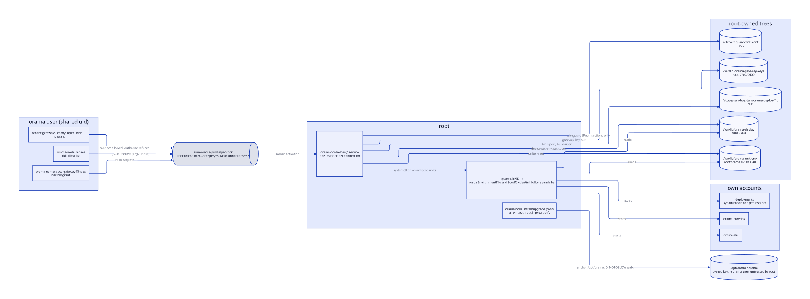
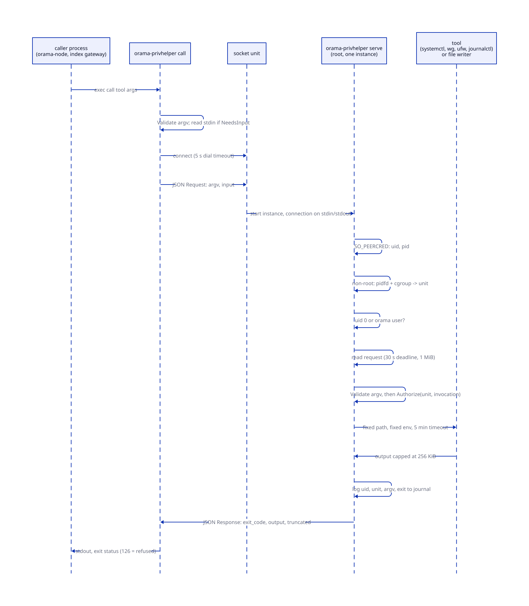
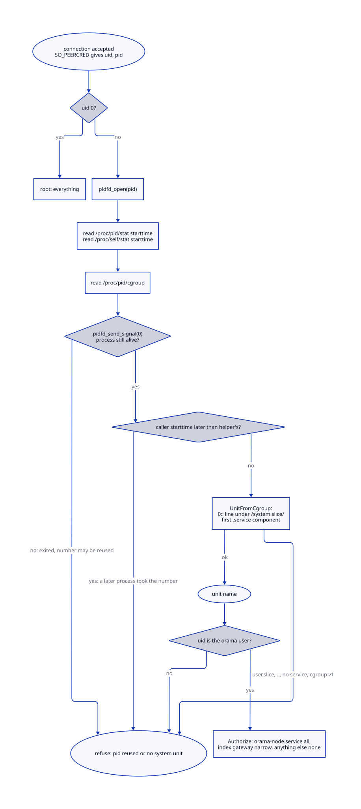
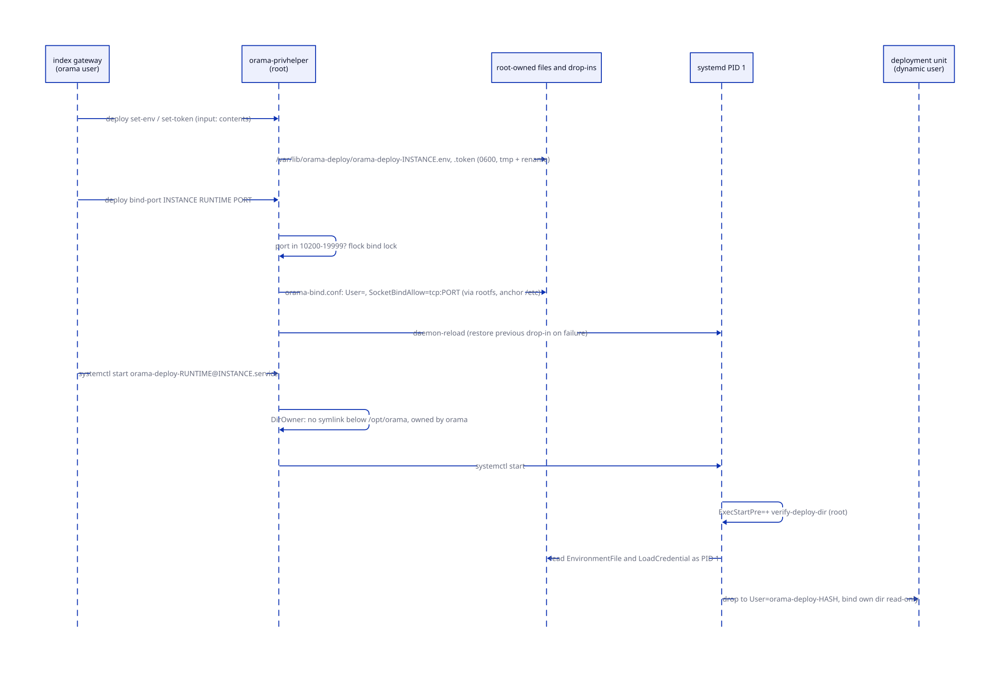
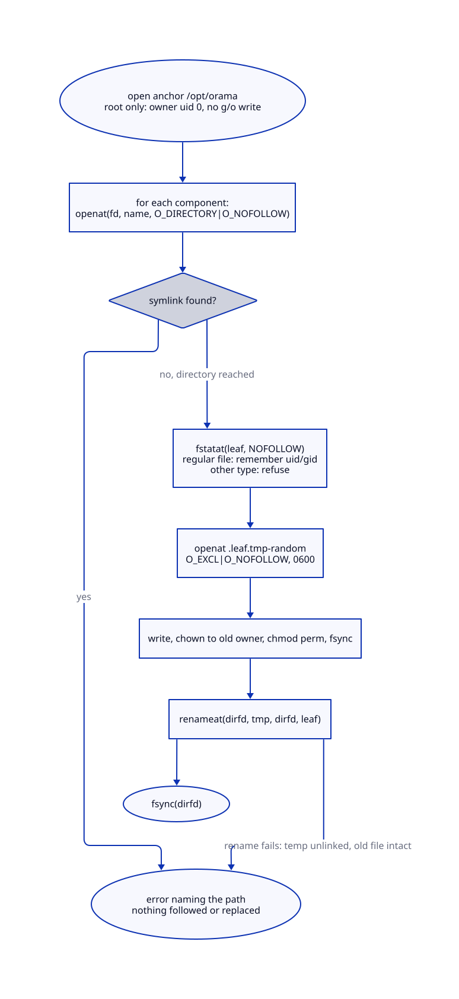

# Privilege and filesystem trust

> **At a glance.**
>
> - **What:** Every Orama daemon runs unprivileged. The few things that need root go through `orama-privhelper`, a socket-activated root service that parses each request against an exact allow-list and authorises it by the systemd unit of the caller. Everything root reads or writes in the `orama` user's tree below `/opt/orama` during install and upgrade goes through `rootfs`, a descriptor-relative `O_NOFOLLOW` library. Secrets that PID 1 reads live in trees only root can write.
> - **Key numbers:** socket `/run/orama-privhelper.sock`, `root:orama` mode `0660`, `MaxConnections=32`; request and response limit 1 MiB; 30 s to read a request and 30 s to write the answer; 5 min per tool; `RuntimeMaxSec=600`; deploy secrets 256 KiB each; deployment ports 10200-19999; relay firewall range 49152-65535; at most 4096 persisted WireGuard peers; journal reads 1 to 1000 lines; `rootfs` reads capped at 1 MiB.
> - **Code:** `core/cmd/privhelper/`, `core/pkg/privhelper/`, `core/pkg/rootfs/`, `core/pkg/unitenv/`, `core/pkg/hardening/`, `core/pkg/durablefile/`; the trees it protects are written by `core/pkg/deploysecrets/` and `core/pkg/gatewaykeys/`.
> - **Depends on:** [the node as a supervisor](04-the-node-as-a-supervisor.md) for the units this chapter authorises.



## Why it exists

A node runs many processes that handle hostile input. A tenant gateway executes tenant WebAssembly, Caddy faces the internet, and deployments run arbitrary tenant code. Most of them run as one Unix user, `orama`, because they share files: the supervisor writes their configuration, the index gateway manages every namespace's directory, and the daemons talk to each other over `0700` sockets that admit only that uid. A compromise of any one of them is therefore a compromise of the `orama` uid, and the design question is what that uid can turn into.

Three facts shape the answer.

First, a handful of actions need root and cannot be avoided. Starting and stopping systemd units, opening TURN ports in ufw, persisting WireGuard peers into `wg0.conf`, reading journals the `orama` user is not allowed to read, and collecting a health report that reads `ss -p` and `wg`. The earlier mechanism was sudoers rules with wildcard arguments such as `systemctl start orama-namespace-*` and `ufw allow *`. It failed twice. The default `sudo` on Ubuntu 26.04 is `sudo-rs`, which refuses wildcards in arguments, so the rules did not load. And in classic sudo a `*` matches spaces and further arguments, so `ufw allow *` granted every ufw rule (`core/pkg/privhelper/command.go`). A third reason is structural: the sandboxing directives of `orama-node.service` make systemd imply `no_new_privs`, so `sudo` cannot gain root there at all (`core/pkg/install/services.go:oramaNodeHardening`).

Second, systemd itself is a confused deputy. PID 1 resolves `EnvironmentFile=`, `LoadCredential=`, `BindReadOnlyPaths=` and `WorkingDirectory=` as root, by name, following symlinks, before it drops to the unit's user. If the path sits in a tree the `orama` user can write, that user can point it at any file root can read (the WireGuard private key in `wg0.conf`, `/etc/shadow`) or at another tenant's directory, start the unit, and read the result through a process it controls. Every such path in Orama therefore lives in a tree only root can write, and the code that writes it never follows a symlink.

Third, root-run install and upgrade code has the mirror-image problem. `orama node install` and `orama node upgrade` run as root but write most of their output into `/opt/orama/.orama`, which the `orama` user owns. A plain `os.WriteFile` follows symlinks, so a planted `configs/node.yaml` pointing at `/etc/sudoers.d/x` would be written as root. `rootfs` exists so root can write into an untrusted tree without being redirected out of it.

The chapter also covers the node-level kernel settings that keep secrets off disk (`hardening`) and the crash-safe file replace used by data the node itself keeps (`durablefile`), because they answer the same question: what survives, and what leaks, when something goes wrong.

## The model

**Caller.** A request's sender, reduced to a uid and, unless the uid is 0, a systemd unit name (`core/pkg/privhelper/caller.go:Caller`). The uid comes from the kernel. The unit comes from the caller's cgroup.

**Invocation.** A validated command: a tool name and its arguments (`core/pkg/privhelper/validate.go:Invocation`). `Validate` turns raw argv into an `Invocation` or refuses it; `Authorize` then decides whether this caller may run it. The two steps are separate on purpose. Validation is about the argument shape and applies to root too. Authorisation is about who asks.

**Tool.** One of eight verbs the helper knows: `systemctl`, `ufw`, `wireguard`, `deploy`, `unitenv`, `gateway-key`, `node-report`, `journal`. A ninth word, `verify-deploy-dir`, is a mode of the binary rather than a tool.

**Grant.** The set of invocations a unit may run. There are exactly three grants: root (everything), `orama-node.service` (everything the allow-list permits), and `orama-namespace-gateway@index.service` (a named subset). Any other unit has none.

**Root-owned tree.** A directory only root can write, which systemd or a root process reads by name. The four trees are `/var/lib/orama-unit-env`, `/var/lib/orama-deploy`, `/var/lib/orama-gateway-keys` and the drop-in directories under `/etc/systemd/system`. A fifth place, `/etc/wireguard/wg0.conf`, is root-owned for the same reason.

**Anchor.** The root-owned directory a `rootfs.Root` walks down from: `/opt/orama` for install and upgrade, `/etc` for the deployment drop-ins. Everything below the anchor is treated as controlled by an attacker.

**Isolated service.** A namespace service that runs as an account of its own instead of `orama`. Today CoreDNS (`orama-coredns`) and the SFU (`orama-sfu`) (`core/pkg/systemd/isolation.go:isolatedServices`).

The unprivileged `orama` user is the default; root appears in three places: the installer and the CLI, PID 1, and one `orama-privhelper@.service` instance per connection.

## How it works

### The helper socket and its service instances

`orama-privhelper` is one binary with four modes (`core/cmd/privhelper/main.go`):

| Mode | Runs as | What it does |
|---|---|---|
| `serve` | root, started by systemd | Handles the single connection on stdin and exits. |
| `call <tool> args` | any caller | Client: validates, sends a request to the socket, relays output and exit status. |
| `run <tool> args` | root only | Validates and executes directly, no socket. Refuses with exit 126 when not root. |
| `verify-deploy-dir <instance>` | root only | `ExecStartPre` of the deployment templates; checks a deployment directory. |

The socket unit is written by the installer from the constants in `core/pkg/privhelper/units.go:SocketUnit`: `ListenStream=/run/orama-privhelper.sock`, `SocketUser=root`, `SocketGroup=orama`, `SocketMode=0660`, `Accept=yes`, `MaxConnections=32`. `Accept=yes` makes systemd start one `orama-privhelper@.service` instance per connection with the connection as stdin and stdout, so no root daemon holds state between requests. The service template (`core/pkg/privhelper/units.go:ServiceUnit`) sets `StandardInput=socket`, `RuntimeMaxSec=600`, `CollectMode=inactive-or-failed`, and a sandbox that removes what root does not need: `ProtectHome=yes`, `PrivateTmp=yes`, `NoNewPrivileges=yes`, `RestrictAddressFamilies=AF_UNIX AF_NETLINK AF_INET AF_INET6`, `SystemCallArchitectures=native`, `LockPersonality=yes`, `RestrictRealtime=yes`, `RestrictSUIDSGID=yes`. It deliberately does not set `ProtectSystem`: writing `/etc/wireguard`, `/etc/systemd/system`, `/etc/ufw` and `/var/lib/orama-deploy` is the job.

The installer copies the binary to `/usr/local/bin/orama-privhelper`, verifies the copy byte for byte, makes it `root` `0755`, writes both units, runs `daemon-reload`, `enable` and `restart` on the socket, and deletes the old `/etc/sudoers.d/orama-namespaces`. Every step is fatal, because a node without the helper cannot start a namespace service (`core/pkg/install/privhelper.go:ensurePrivHelper`). On upgrade it runs under the new binary, after the re-exec, because the pre-re-exec code is the previous release and knows nothing of the helper.

Callers do not talk to the socket directly. `privhelper.Command` returns an `exec.Cmd`: for a root caller it runs `systemctl` and `ufw` directly and everything else as `orama-privhelper run`; for anyone else it runs `orama-privhelper call` (`core/pkg/privhelper/command.go:CommandContext`). Typed wrappers sit on top of it: `AddWireGuardPeer`, `PersistWireGuardPeers`, `SetUnitEnv`, `SetDeploymentEnv`, `AllowDeploymentPort`, `PutGatewayKey`, `DeploymentJournal`, `NodeReport`. The client validates first, so a refused request fails without a round trip. It dials with a 5 s timeout and gives the whole call 10 min, which covers a `systemctl start` that waits for its unit (`core/cmd/privhelper/call.go`).



### Identifying the caller

The helper learns who is on the other end of the connection from the kernel, not from the request. `identifyCaller` reads `SO_PEERCRED` on the accepted socket, which gives the uid and pid of the process that called `connect` (`core/cmd/privhelper/peercred_linux.go:identifyCaller`). For uid 0 that is all. For any other uid it goes on to find the caller's unit (below) before it looks at the uid again: only afterwards does `allowedCaller` admit the `orama` user, looked up by name at request time, and refuse every other uid (`core/cmd/privhelper/serve.go:allowedCaller`). The socket mode already limits who can connect to root and the `orama` group; the uid check is a second, kernel-supplied gate. Only then is the request read. On non-Linux builds `identifyCaller` always fails, so the helper serves nothing.

The uid alone is not enough. Until a change recorded in the comment above `Authorize`, it was the whole check, and every Orama daemon runs as `orama`: each tenant's gateway running tenant WASM, and the internet-facing Caddy. Any of them could have rewritten the node's WireGuard peers, written any namespace's env file or started any namespace's services. The request is now authorised by the systemd unit the calling process runs in, which the kernel assigns and a process cannot change for itself.



`identifyUnit` solves a race. A pid is a name that can be reused, so reading `/proc/<pid>/cgroup` is only valid if the pid still names the process that connected. Three things hold it together (`core/cmd/privhelper/peercred_linux.go:identifyUnit`):

1. A pidfd is opened first (`pidfd_open`). It refers to one process for as long as it is open, whatever happens to the number.
2. The process's start time, from field 22 of `/proc/<pid>/stat`, must be no later than the helper's own. The caller connected before systemd accepted the connection and started this instance, so a later start time is a different process that took the number over. `parseStartTime` counts fields from the last `)` because the command name may contain spaces and parentheses (`core/cmd/privhelper/stat.go:parseStartTime`).
3. After `/proc` has been read, `pidfd_send_signal` with signal 0 must succeed. If it does, the pid has not been released since the pidfd was opened, so the start time and cgroup read belong to that process.

The residual is a caller that exits and has its number reused between connecting and this instance starting, by a process in the right unit. That needs the pid space to wrap in milliseconds. The code comment names it and accepts it.

`UnitFromCgroup` turns the cgroup file into a unit name (`core/pkg/privhelper/caller.go:UnitFromCgroup`). It takes the `0::` line of the unified hierarchy, requires the path to start with `/system.slice/`, rejects `.` and `..` components and empty components, and returns the first component that ends in `.service`. A path under `/user.slice` is refused outright, because a user session can name its own service `orama-node.service` and the helper must not mistake it for the supervisor. A process in no service (a login session, a scope) and a cgroup-v1-only host are both errors, so the helper requires the unified hierarchy.

### Validation: the allow-list

`Validate` parses argv with exact patterns and refuses anything else before a process is started (`core/pkg/privhelper/validate.go:Validate`). There is no shell, no `PATH` lookup and no free-form argument. The patterns are these.

**systemctl.** A unit verb is one of `start`, `stop`, `restart`, `enable`, `disable`, `reset-failed`, with exactly one unit. The one flag accepted is `--no-reload`, only on `disable` and only before the unit; teardown uses it because a plain `disable` makes systemd reload every unit and a node tearing down a namespace did that once per service. The permitted units fall into classes:

| Class | Pattern | Verbs |
|---|---|---|
| Namespace services | `orama-namespace-<svc>@<ns>` with optional `.service` or `.timer`; service is lowercase, 1 to 32 chars; namespace is 1 to 64 chars | all unit verbs |
| Deployments | `orama-deploy-<runtime>@<instance>.service`; runtime up to 16 chars; instance up to 161 chars | all unit verbs |
| Host TURN | `orama-turn.service` | all unit verbs |
| Legacy host units | nine fixed names (`orama-olric.service`, `orama-ipfs.service`, `orama-ipfs-cluster.service`, `orama-ipfs-gc.timer`, `orama-vault.service`, `orama-sni-router.service`, `caddy.service`, `coredns.service`, `ntfy.service`) | `stop` and `disable` only |
| `wg-quick@wg0.service` | fixed | `disable` only; stopping it runs `wg-quick down` and cuts the node off the mesh |
| Global node units | eighteen exact `orama-global-*` names (`core/pkg/privhelper/validate.go:globalUnits`) | `start`, `stop`, `restart`, `status`, `is-active` |

Two more forms exist. `daemon-reload` takes no argument. `set-property <deployment unit> <prop> [<prop>]` accepts only `MemoryMax=<n>[KMGT]` and `CPUQuota=<n>%`, each at most once, and only on deployment units (`core/pkg/privhelper/validate.go:validateSetProperty`).

**ufw.** `status`, `status verbose`, `reload`, and `allow` or `delete allow` of one port spec, optionally followed by the literal `comment orama`, which marks a rule the firewall reconciler owns. A port spec is one of the three TURN listeners (`3478/udp`, `3478/tcp`, `5349/tcp`) or a UDP range lying inside 49152 to 65535 (`core/pkg/privhelper/validate.go:validatePortSpec`). An internal port such as rqlite's stays closed even to a compromised `orama` user.

**wireguard.** Three operations (`core/pkg/privhelper/wireguard.go`): `add-peer <key> <endpoint> <allowed-ip>`, `remove-peer <allowed-ip>`, and `persist-peers` with a JSON list on the request input. `ValidatePeer` accepts only a base64 public key that decodes to 32 bytes and re-encodes to the identical string (the Go decoder skips `\r` and `\n`, and a key with a newline once reached `wg0.conf` as two lines), an optional `ip:port` endpoint with a valid port, and an allowed IP that is a canonical IPv4 `/32` inside `constants.WireGuardSubnet`, 10.0.0.0/24. `persist-peers` accepts at most 4096 peers (`maxPersistedPeers`) and rejects a duplicate key and a duplicate `/32`, because `wg` routes an address to one peer and a second claimant silently takes it from the first when `wg-quick` applies the file.

**deploy.** `set-env <instance>` and `set-token <instance>` (contents on input), `clear <instance>`, `purge <instance>`, `build-user <instance>`, `bind-port <instance> <runtime> <port>`, and `list-state`. The instance must match `deploysecrets.ValidInstance`: an alphanumeric first character, then letters, digits, `_` and `-`, up to 161 characters in total, so it can never hold a path separator or start with a dot.

**unitenv.** `set <namespace> <service>` (the file on input) and `clear <namespace> [<service>]`. Names must match `unitenv.Valid`. `tor`, `ntfy` and `wireguard` are refused for `set`: their units run as `debian-tor`, `ntfy` and root, so a file written for them would let the `orama` user set `LD_PRELOAD` and the like for a process it does not own.

**gateway-key.** `put <filename>` where the filename is one of the two signing-key names (`gatewaykeys.ValidName`).

**node-report.** No arguments. **journal.** `<deployment unit> <lines>`, with lines from 1 to `MaxJournalLines` (1000), and nothing else; the unit must match the deployment pattern, which excludes glob characters and a leading dash.

A request that carries input for a tool that takes none is refused (`core/cmd/privhelper/serve.go:handle`). Which invocations read a payload is decided by `Invocation.NeedsInput`, and `call` and `run` read stdin only when it says so. The comment on `NeedsInput` records why: forgetting one case stored a zero-byte gateway key.

### Authorisation: who may run what

`Authorize` is a switch on the caller's unit (`core/pkg/privhelper/caller.go:Authorize`).

- **uid 0** is allowed everything `Validate` accepts. The installer and the CLI run as root.
- **`orama-node.service`** is allowed every validated invocation. It owns the mesh, the host firewall rules and the `@index` services.
- **`orama-namespace-gateway@index.service`**, the cluster gateway, is allowed a named subset (`authorizeIndexGateway`): starting and stopping namespace, deployment and host TURN units (`daemon-reload`, `set-property` and exactly the `disable --no-reload` three-argument form included); `ufw`; `deploy`; `unitenv`; `gateway-key`; `node-report`; `journal`; and `wireguard add-peer` or `remove-peer`, one peer at a time. It is refused `persist-peers`, the legacy host units, `wg-quick` and every global unit. The single-peer grant gives it nothing it lacks already: it writes `wireguard_peers` in the registry, and every node's sync applies those rows. It must be reachable before a join answers, not a sync later. A tool added later is refused to it until granted, because the switch has a default that returns an error.
- **Any other unit**, including every tenant gateway, gets nothing. A tenant gateway manages no units, since namespace services are started by the cluster gateway. And its deployment instances cannot be told apart from another namespace's by name (`InstanceName` in `core/pkg/deployments/process/naming.go:InstanceName` is not injective), so no narrower grant would be sound.

A refusal is returned as exit status 126 (`ExitRefused`, `core/pkg/privhelper/protocol.go`), which is distinct from any status the tools themselves use.

### Executing a request

`execute` runs a validated invocation (`core/cmd/privhelper/exec.go:execute`). A tool that runs and fails exits with status 1 and an `orama-privhelper: ...` message; a refusal exits 126; an external tool's own exit status is passed through. External tools run from fixed absolute paths, checked in order (`/usr/bin/systemctl` then `/bin/systemctl`, `/usr/sbin/ufw` then `/sbin/ufw`, `/usr/bin/wg`, `/usr/bin/journalctl`), with an environment of exactly `PATH=/usr/sbin:/usr/bin:/sbin:/bin` and `LANG=C.UTF-8`. The helper never consults the caller's `PATH` or environment. One tool run has a 5 minute timeout (`commandTimeout`), inside the unit's `RuntimeMaxSec=600`.

Output is bounded. A tool's combined stdout and stderr is kept up to `maxToolOutput`, a quarter of `MaxRequestBytes` (256 KiB), so the JSON-escaped response fits the 1 MiB the client reads; the rest is cut with a notice. Journal reads are the exception: `journalctl` prints oldest first and the newest lines are what a log read is for, so `tailBuffer` keeps the last 256 KiB, drops the leading partial line, and reports truncation in a separate `truncated` field rather than inside the text. Stderr of a journal read is kept up to 4096 bytes and shown only when the run fails.

The `wireguard` tool does the work itself instead of delegating (`core/cmd/privhelper/exec.go:wireGuard`). `add-peer` runs `wg set wg0 peer <key> allowed-ips <ip> persistent-keepalive 25 [endpoint <ep>]` and then appends the peer to `wg0.conf`; `persist-peers` rewrites the file; `remove-peer` finds every live peer whose allowed-ips column holds exactly the address (`wg show wg0 dump` lists a comma-separated column), removes each, and removes the matching peers from the file. `add-peer` and `persist-peers` refuse a peer whose address is this node's own mesh address (`notThisNode`, which reads the address from the live `wg0` interface and so also fails while `wg0` is down), since `wg0` would then route this node's overlay traffic to that peer. `add-peer` changes the live interface first; if the conf write then fails, the peer is live but not persisted and the error says so. The file writer lives in `core/pkg/wireguard/conf.go`; it takes a `flock` on `/etc/wireguard/.wg0.conf.lock` because the socket serves requests in parallel, replaces the file atomically at mode `0600` and rewrites only the `[Peer]` sections, never `[Interface]`. `AddPeer` replaces any persisted peer with the same key or the same address, which is what a node replaced on its old overlay address needs. The reason `/etc/wireguard` stays root's is that `wg-quick` runs the file's `PostUp` and `PreUp` lines as root, so a conf the `orama` user could write is root code execution. `orama-node`'s own unit does not list `/etc/wireguard` in `ReadWritePaths`; it holds `CAP_NET_ADMIN` only so that it can apply peers to the live interface with `wg set`.

Every request is logged to the journal as `uid=... unit=... argv=... exit=...`, or `refused: ...`. Input is never logged, so secrets passed on stdin stay out of the journal. This line is the audit trail of root actions.

### The node report collector

`node-report` runs the whole health-report collector as root inside the helper, because its collectors read journals, `ss -p`, `ufw` and `wg` (`core/cmd/privhelper/nodereport.go:nodeReport`). The cluster gateway asks every 10 s. Three controls keep that from hurting the other requests that share the 32 connection slots. A non-blocking `flock` on `/run/orama-privhelper-node-report.lock` refuses a second concurrent collection with a clear error. A 50 s timeout (`nodeReportTimeout`) sits below the gateway's 60 s client timeout, so the gateway sees the helper's failure instead of its own. And a report whose encoded response would exceed `MaxRequestBytes` is an error rather than a truncated, unparseable answer. On timeout the collection goroutine keeps the lock until it ends or the instance exits after responding; the kernel drops the lock with the process.

### Deployment staging: secrets, ports, users, directories

A tenant deployment is the hardest case, because the code that runs is the tenant's and the unit is started by systemd on behalf of an unprivileged gateway. The helper provides five mechanisms, and the unit templates (`core/systemd/orama-deploy-go@.service` and its `node`, `npm`, `build` and `clean` siblings) consume them.



**Secrets.** `set-env` and `set-token` store a deployment's environment file and its workload token in `/var/lib/orama-deploy` (`core/pkg/deploysecrets/secrets.go:Write`). The directory is `root:root` `0700`, created and its mode converged on every write. Each file is `orama-deploy-<instance>.env` or `.token` at mode `0600`, written to a random `O_EXCL` temporary name in that directory and renamed over the target, so two parallel helper requests for one instance cannot collide and nobody else can create names there to plant a symlink. The gateway hands over contents, never paths. The unit reads them as PID 1 (`EnvironmentFile=` and `LoadCredential=orama_token:`), and systemd exposes the token at `$CREDENTIALS_DIRECTORY` owned by the deployment's own user at mode `0400`. Each file is capped at 256 KiB (`MaxDeploySecretBytes`), well above real values (a token is under 1 KiB; the gateway caps one environment value at 64 KiB, `core/pkg/deployments/envfile.go:MaxEnvValueBytes`) and far below the request limit, so a runaway caller cannot fill the directory.

**Bind port.** The runtime templates set `SocketBindDeny=any` and allow nothing. `bind-port <instance> <runtime> <port>` writes a per-instance drop-in at `/etc/systemd/system/orama-deploy-<runtime>@<instance>.service.d/orama-bind.conf` containing `User=`, an empty `SocketBindAllow=` to clear anything before it, and `SocketBindAllow=tcp:<port>` (`core/pkg/privhelper/deploybind.go:DeployBindDropIn`). The port must be plain decimal and inside 10200-19999, the deployment allocator's range, so no deployment can be allowed a namespace or platform port (`DeployPortMin`, `DeployPortMax`; a test holds them equal to the allocator's). The reason for a drop-in rather than the obvious alternatives is in the comment: systemd does not expand variables in `SocketBindAllow=`; and `systemctl set-property` persists the setting before systemd 254 as `SocketBindAllow: tcp:<port>`, a line its own parser ignores, so the allow vanishes at the next reload or boot, and it writes the whole list so it cannot narrow a template's. Ubuntu 22.04 ships systemd 249. A reload is needed to see a new drop-in directory at all on 249, so the helper runs `daemon-reload` whenever the file changed.

The write goes through `rootfs` anchored at `/etc`, so a symlink anywhere below `/etc` is refused. A flock on `/run/orama-privhelper-deploy-bind.lock` serialises bind requests, which the socket serves in parallel: a failed reload restores the previous drop-in, and without the lock that restore could overwrite a newer drop-in another request had written and loaded. The invariant is that the file on disk is what systemd has loaded, so a retry writes and reloads again. `build-user` follows the same lock and rollback for the two oneshot templates.

**One uid per deployment.** A bare `DynamicUser=yes` names the user after the template, so every instance of `orama-deploy-go@` was one uid, and one tenant could read another's `/proc/<pid>/environ` and signal or ptrace it. The drop-in sets `User=orama-deploy-` plus the first 16 hex digits of the SHA-256 of the instance, 29 characters, inside the 31 a user name may have. Builds use `orama-build-` plus the same, so a build never runs as a deployment's user and the build and runtime caches of an instance are owned by different uids. The name derives from the instance and nothing else the caller supplies: a name built from the port, which the gateway passes, would let a compromised gateway run one deployment as another's user by handing it that deployment's port. Two instances share a user only on a 64-bit hash collision, with odds about n squared over 2 to the 65 for n deployments on a node, and a collision costs the shared-uid situation of a template, not a break-out (`core/pkg/privhelper/deploybind.go:DeployUserName`).

**Directory check.** The deployment's code lives in `/opt/orama/.orama/data/deployments/<instance>`, which the `orama` user owns, and the templates bind it into the unit and run from it, resolved by PID 1 by name. The helper therefore refuses `systemctl start` or `restart` of `orama-deploy-{node,npm,go,build}@<instance>` unless the directory is a real directory reached with no symlink below `/opt/orama` and owned by `orama` (`core/cmd/privhelper/deploydir.go:verifyDeploymentDir`, using `rootfs.Root.DirOwner`). The same check is `ExecStartPre=+/usr/local/bin/orama-privhelper verify-deploy-dir %i` on the templates, so a start that bypasses the helper (a reboot, a crash restart) is checked too. The `+` prefix runs it as root. The instance argument is matched against the instance-name pattern before it is joined onto the deployments root, so a path or a second argument is refused (`core/pkg/privhelper/deploydir.go:DeploymentDirForInstance`).

**Clear and purge.** `clear` removes the env file and the token, then every drop-in of the instance under the bind lock; it does not reload systemd, because the next start of the instance writes its drop-in again and reloads. `purge` removes the state and cache directories systemd left behind. systemd keeps `StateDirectory=` and `CacheDirectory=` of a `DynamicUser` unit after it stops, under `/var/lib/private` and `/var/cache/private`, owned by a uid a later deployment might be given. `PurgeDeployState` refuses while any of the instance's `node`, `npm`, `go`, `build` or `clean` units is active, activating, reloading or deactivating, or cannot be queried: the helper asks `systemctl is-active` itself and does not take the gateway's word for it. It removes five fixed path patterns with `os.RemoveAll`, which unlinks symlinks rather than following them (`core/pkg/privhelper/deploystate.go:PurgeDeployState`). `list-state` enumerates the instances that have any such directory so the gateway can find leaked ones.

### Gateway signing keys

All gateways run as `orama`, so a signing key in the index gateway's state directory is readable by a tenant gateway. The index gateway's two keys (an RSA-2048 PKCS#1 key and an Ed25519 PKCS#8 key) are instead `root:root` `0400` in `/var/lib/orama-gateway-keys/index`, loaded into that one unit through `LoadCredential=` (`core/pkg/gatewaykeys/keys.go`). `Write` validates that the PEM is the kind its name holds (RSA at least 2048 bits, no trailing data, at most 16 KiB), writes a temporary file, `fsync`s it, renames it and `fsync`s the directory, so a crash leaves the old key or the new one, never the empty file the unit then refuses to start with. `Ensure` creates a missing key before the unit starts, from the legacy copy in the state directory if one exists, otherwise newly generated, and never replaces an existing one, since that would invalidate every token. Only the helper's `gateway-key put` replaces a key, which is what a rotation uses.

### Unit environment files

Namespace units read `EnvironmentFile=/var/lib/orama-unit-env/%i/<service>.env`. The tree is `root` with group `orama`: directories `0750`, files `0640`, so the node can compare contents and mtimes, but only root creates or replaces them: the helper for the `orama` user's callers, and the installer directly when the process is already root (`core/pkg/systemd/manager.go:storeUnitEnv`, `core/pkg/unitenv/unitenv.go:Write`). Names are validated against patterns that cannot escape the tree. A write creates the directory chain, writes a temporary file in the target directory, applies owner and mode, and renames it over the target. It does not `fsync` the file or the directory. `Clear` removes one file and tolerates a missing one, because clearing is how a service is retired and it is retried. `ClearNamespace` removes the namespace directory.

Before the files were moved here they lived under `/opt/orama/.orama/data/namespaces/<ns>/`, and a compromised `orama` process could symlink `<svc>.env` to a root-only `KEY=VALUE` file, start the unit through the helper and read the WireGuard key from the process environment. A test fails the build if any shipped template names a path under `/opt/orama` for `EnvironmentFile=` or `LoadCredential=` (`core/pkg/systemd/unit_file_reads_test.go`), and `TestGoGeneratedUnits_PID1NeverOpensAnOramaOwnedPath` (`core/pkg/install/unit_pid1_reads_test.go`) does the same for `StandardOutput=` and `StandardError=` with `file:`, `append:` or `truncate:`, which PID 1 also opens as root following symlinks. Every Orama unit logs to the journal.

Values are checked before they are written, for a related reason: the rqlite, IPFS and IPFS Cluster units substitute env values into a `sh -c` script, where systemd pastes the text in before the shell reads it (`core/pkg/systemd/envfile_validate.go`).

### rootfs: root writes below an untrusted tree

`rootfs.Root` is an anchor plus a set of operations (`core/pkg/rootfs/rootfs.go:Root`): `ReadFile`, `WriteFile`, `CreateExclusive`, `MkdirAll`, `Chmod`, `Chown`, `Remove` and `DirOwner`. Paths are absolute and must lie inside the anchor. The resolution is a component walk: open the anchor, then for each component `openat(fd, name, O_DIRECTORY|O_NOFOLLOW|O_CLOEXEC)` relative to the previous descriptor and close the previous one (`core/pkg/rootfs/resolve_unix.go:walk`). No component is looked up by path a second time, so none can be swapped for a symlink between a check and a use. A symlink anywhere is an error naming the path, wrapping `ErrSymlink`. Nothing is followed and nothing is replaced.

The library walks components rather than using Linux `openat2(RESOLVE_NO_SYMLINKS)` for two reasons the package comment gives: the walk behaves identically on darwin, so the tests run on a developer's machine, and it cannot be refused by a seccomp profile that predates `openat2`. Off unix every operation returns an error.

The anchor itself is opened by path, since only root can write it. When the process is root, `checkAnchor` refuses an anchor not owned by uid 0 or writable by group or others, because everything below would then be as untrusted as the orama tree (`core/pkg/rootfs/rootfs.go:checkAnchor`).



**WriteFile** replaces a file atomically (`core/pkg/rootfs/rootfs_unix.go:WriteFile`). The parent directory must exist. It stats the leaf with `AT_SYMLINK_NOFOLLOW`: a symlink is an error, anything other than a regular file is refused, and a regular file's uid and gid are remembered. It creates `.<leaf>.tmp-<16 hex digits>` with `O_EXCL|O_NOFOLLOW` at mode `0600`, so nobody else can open it in the meantime. It writes the data, gives the file the previous owner if it replaced one, applies the requested mode through the descriptor, and `fsync`s it. Then `renameat` installs it, and `fsync` of the directory makes the rename durable. A failed rename unlinks the temporary file and leaves the old one intact. A failed `fsync` of the directory after a successful rename is returned as an error although the new file is already in place. A newly created file is owned by whoever the process is, which for root is root; replacing a file keeps its owner, so a rewrite of an `orama`-owned config leaves it `orama`-owned.

**ReadFile** opens the leaf with `O_NOFOLLOW|O_NONBLOCK`. `O_NONBLOCK` means a FIFO planted at the leaf cannot hang root; the type is checked with `fstat` before anything is read, and a non-regular file is refused. Size is bounded by the caller's limit, in practice `SmallFileLimit` of 1 MiB, checked against `st_size` and again while reading. **CreateExclusive** is one `openat` with `O_EXCL`, so of two racers for a path exactly one wins and a symlink already at the name is a failure; it writes, syncs the file and the directory, and removes the new file if a step after the create fails. The global node export uses it for a sentinel (`core/pkg/globalnode/export.go`). **Chmod and Chown** open the target and operate through the descriptor, and refuse a regular file with more than one hard link, since that could be a hard link to a file outside the tree. **Remove** refuses to unlink a symlink leaf and removes a file or an empty directory. **DirOwner** is the check the deployment verifier uses: the uid and gid of a directory reached with no symlink, erroring on a file or a missing path.

The code root runs for install and upgrade is held to this by a source scan: `core/pkg/install/root_file_access_test.go` fails on any direct `os` file call, or `chown`, `chmod`, `mkdir`, `cp`, `mv`, `tee`, `ln`, `rm`, `install`, `touch` or `truncate` command, in those packages that is not on its allow-list, and every allowed call names the root-owned tree it touches. Tools that resolve paths in the tree themselves (`ipfs init`, `ipfs config`, `ipfs-cluster-service init`) are run as the `orama` user instead of root (`core/pkg/install/installers/runas.go`), and the root shell scripts for raft recovery do their `rm`, `mkdir` and redirects as `orama` through `runuser`. `chown -R orama:orama` on the tree is safe only because GNU chown defaults to `-P` and the kernel's `fs.protected_hardlinks=1` prevents hard-linking a root-owned file into the tree; neither is enforced by Orama's code.

### durablefile: crash-safe replace for the node's own data

`durablefile.Write(path, data, perm)` is for files the unprivileged node keeps in directories it owns (`core/pkg/durablefile/write.go:Write`). It creates a uniquely named temporary file beside the target with `os.CreateTemp`, writes the data, applies `perm` through the descriptor so the umask does not matter, `fsync`s the file, closes it and renames it over the target, then opens the directory and `fsync`s it, which is what makes the rename itself survive a power loss. Any failure before the rename removes the temporary file. A failed directory sync is returned as an error although the rename has happened. Callers are the RQLite membership record and node identity files (`core/pkg/rqlite/membership_record.go`, `core/pkg/rqlite/identity.go`) and the IPFS Cluster secret, service config and trusted-peers file (`core/pkg/ipfs/`). It has no notion of owners or symlinks: it trusts its directory, which is why root never uses it below the `orama` tree.

### Hardening: keeping secrets off the block device

`core/pkg/hardening/hardening.go` is the single source for the kernel settings a node is hardened with and the check that reads them back. Three sysctls are defined in `Sysctls`:

| Key | Want | Why |
|---|---|---|
| `fs.suid_dumpable` | `0` | No core dump of a setuid process. |
| `kernel.core_pattern` | `|/bin/false` | Every core dump is piped to `/bin/false` and discarded, whatever crash handler the distribution installs. |
| `kernel.yama.ptrace_scope` | `1` | A process may attach only to its own descendants. Ubuntu ships 1; Debian ships 0, under which any `orama` daemon could attach to any other and read its memory. |

Install renders them with `hardening.DropIn()` into `/etc/sysctl.d/99-orama-ram-hygiene.conf` and applies it with `sysctl -p` (`core/pkg/install/firewall.go:persistRAMHygiene`). It also runs `swapoff -a` and masks `swap.target` so swap stays off at boot, writes a `systemd-coredump` drop-in with `Storage=none` and `ProcessSizeMax=0`, and stops and masks `apport.service` where it is installed. Apport matters because its start writes `fs.suid_dumpable=2` and points `core_pattern` at its own script after `systemd-sysctl` has applied the drop-in, and the kernel runs that script on a crash even with the service stopped (`core/pkg/install/apport.go:disableApport`). A non-zero `swapoff` fails the install, since `swapoff -a` exits 0 when no swap is configured. Apport is disabled when systemd reports its `LoadState` as `not-found` or `masked`; a `systemctl` that cannot answer is an error, never read as "not installed". After applying, `verifyRAMHygiene` reads the three values back and fails the install unless they match, because the sysctl applying cleanly is not proof that a later writer did not change it.

The same check runs forever. `hardening.Read` collects the live sysctls, the number of active swap areas from `/proc/swaps` (rows below the header) and apport's `LoadState`; `Live.Drift` renders every setting that differs from the install value as a sentence, and an unreadable setting is drift, not silence (`core/pkg/hardening/hardening.go:Drift`). The node report collects it with a 4 s timeout (`core/pkg/telemetry/report/system.go:collectHardening`), and the cluster monitor turns each sentence into a `RAM hardening drifted` warning naming the node (`core/pkg/telemetry/cluster/alerts_hardening.go:hardeningAlerts`). It is a warning, not critical: the node still serves, but the guarantee is broken until someone restores it. A report from a release that did not carry the field raises nothing. Drift text quotes the live value cut to 120 bytes, since the value comes from the node's own report and ends up in alert text.

The second layer is cgroup-level: the node unit and the namespace templates set `MemorySwapMax=0`, and deployments set it too, so a cgroup cannot be swapped even if the host has swap. The package does not claim to stop a RAM snapshot or a provider-side VM suspend, and Orama does not use `mlock`: a lock does not survive `execve`, and Go strings cannot be zeroed.

### Per-service accounts

`ProtectProc=invisible` hides only the processes of other uids. A process sharing a uid passes the kernel's ptrace check, so it can read a sibling's `/proc/<pid>/environ` and its `/proc/<pid>/root`, which includes files bound into the sibling's sandbox. Every daemon that runs as `orama` can read what every other `orama` daemon holds.

A service moves to its own account only once nothing else on the node shares its files or its uid. Two have. `orama-namespace-coredns@` runs as `orama-coredns`, with a Corefile `root:orama-coredns` `0640` and `/opt/orama` an empty read-only tmpfs to it. `orama-namespace-sfu@` runs as `orama-sfu` from `/usr/local/bin/sfu`, with its one config file `orama:orama-sfu` `0640` and, of `/opt/orama`, only its own namespace's `configs/` directory bound read-only over an empty tmpfs (`core/pkg/systemd/isolation.go:isolatedServices`). The orama user is a member of the `orama-sfu` group so the spawner can hand the file to it. The template files in `core/systemd/` name `User=orama`; `core/pkg/systemd/manager.go:InstallTemplateUnits` renders the account in at install time. `ensureServiceAccounts` creates the accounts with `useradd --system --user-group --no-create-home --shell /usr/sbin/nologin` and treats only getent's "not found" as missing (`core/pkg/install/service_accounts.go:ensureServiceAccounts`). `ServiceUser` fails on an unknown service rather than falling back to the shared account, because that fallback would hand it every other unit's secrets.

Everything else in the cluster plane stays on `orama`, each for a reason recorded in `docs/SECURITY.md`: the gateway and pubsub share a `SO_PEERCRED` uid check, rqlite is written into by the supervisor and by recovery scripts, ipfs is configured as `orama`, and so on. The global role is different. Each global service runs as its own account (`orama-chain`, `orama-provider`, `orama-archiver`, `orama-repair`, `orama-tor-*` and others) in a unit that hides `/opt/orama` and denies private address ranges (`core/pkg/install/global_units.go`). Those units are controllable through the helper, but only by their eighteen exact names and the verbs above, and by root and `orama-node` alone.

## State it owns

| Item | Holds | Written by | Read by | Location |
|---|---|---|---|---|
| Helper socket | Connections from callers | systemd (`orama-privhelper.socket`) | `orama-privhelper call` | `/run/orama-privhelper.sock`, `root:orama` `0660` |
| Helper binary | The helper | installer | systemd, every caller | `/usr/local/bin/orama-privhelper`, root `0755` |
| Socket and service units | The two units above | installer (`ensurePrivHelper`) | systemd | `/etc/systemd/system/orama-privhelper.socket`, `orama-privhelper@.service` |
| Unit env tree | `<ns>/<svc>.env` for namespace units | helper `unitenv set` | PID 1 (`EnvironmentFile=`), node (group read) | `/var/lib/orama-unit-env`, root:orama `0750`/`0640` |
| Deploy secret tree | `orama-deploy-<instance>.env` and `.token` | helper `deploy set-env`, `set-token` | PID 1 | `/var/lib/orama-deploy`, root `0700`/`0600` |
| Gateway key tree | `index/jwt-signing-key.pem`, `index/jwt-eddsa-key.pem` | helper `gateway-key put`, `Ensure` at install | PID 1 (`LoadCredential=`) into the index unit | `/var/lib/orama-gateway-keys`, root `0700`/`0400` |
| Deploy bind drop-ins | `orama-bind.conf` per runtime unit and instance, plus the build and clean user drop-ins | helper `deploy bind-port`, `build-user`, `clear` | systemd after `daemon-reload` | `/etc/systemd/system/orama-deploy-<runtime>@<instance>.service.d/` |
| Bind lock | flock serialising bind, build-user and clear | helper | helper | `/run/orama-privhelper-deploy-bind.lock`, `0600` |
| Node report lock | flock refusing concurrent collections | helper | helper | `/run/orama-privhelper-node-report.lock`, `0600` |
| `wg0.conf` | `[Interface]` and `[Peer]` sections | installer (interface), helper (peers) | `wg-quick` | `/etc/wireguard/wg0.conf`, root `0600` |
| `wg0.conf` lock | flock serialising read-modify-write of the peers | helper | helper | `/etc/wireguard/.wg0.conf.lock`, `0600` |
| Durable node files | membership record, identity files, IPFS Cluster secret and config | node (`durablefile.Write`) | node | the owning data directories, as the `orama` user |
| Deployment state and cache | systemd-created directories of a `DynamicUser` unit | systemd | the deployment | `/var/lib/private/orama-deploy-<instance>`, `/var/cache/private/orama-deploy-<instance>`, `/var/cache/private/orama-build/<instance>` |
| RAM-hygiene drop-ins | three sysctls, coredump `Storage=none` | installer | systemd-sysctl, coredump | `/etc/sysctl.d/99-orama-ram-hygiene.conf`, `/etc/systemd/coredump.conf.d/orama.conf` |
| Helper audit trail | one line per request | helper | operators | the journal of each `orama-privhelper@` instance |

The helper has no database and no in-memory state across requests; the two lock files are the only coordination.

## Lifecycle

**Install.** The helper is installed at the end of phase 2b: binary, units, socket enabled and restarted. The root-owned trees are created lazily by their first write (`os.MkdirAll` with the right mode). The RAM-hygiene step runs with the firewall provisioner and fails the install on any deviation. Service accounts are created when the namespace templates are installed, before the templates are written, and a missing gateway signing key is created before the index gateway unit is (re)started. On upgrade, before the new templates are installed, a migration writes a bind drop-in for every enabled deployment unit that has none or an outdated one and whose environment file names a port in the deployment range; a unit whose file names no such port is left without one and reported (`core/pkg/install/deploy_bind.go`).

**Normal operation.** Each helper call is an independent root process that lives for one request. Requests are not queued by the helper; systemd refuses connections beyond 32 concurrent instances. The index gateway re-stages the workload token of every deployment with an active replica on the node at start and every 20 minutes, one helper call each (`core/pkg/deployments/health/token_refresh.go:tokenRefreshInterval`). The environment file is staged when a deployment starts or is reconfigured (`core/pkg/deployments/process/manager.go:writeEnvFile`).

**Rolling upgrade.** Upgrading the helper binary replaces `/usr/local/bin/orama-privhelper` and restarts the socket; requests in flight finish in their own instances. During a mixed-version window a client built before a tool existed cannot ask for it, and a helper built before a tool existed refuses it with the "tool is not allowed" error. The index gateway's grant is a closed list, so a new tool is refused to it until the code that grants it is on the node. Moving a service to its own account changes nothing on the wire, so a mixed-release cluster is unaffected. Per-deployment uids apply from a unit's next start: a unit running during the upgrade keeps the shared uid until it restarts.

**Restart.** A node restart brings back the socket (enabled at `sockets.target`), the `/run` locks are recreated on demand, and the root-owned trees persist across reboot so an enabled deployment finds its environment. Hardening sysctls are re-applied by `systemd-sysctl` at boot; the runtime check detects any later writer.

**Node loss.** There is nothing to recover: the helper holds no state, and the trees are per node. A replaced node rebuilds them through install, and the cluster gateway restages deployment secrets from the registry.

## Failure modes

| Trigger | What the system does | What you observe |
|---|---|---|
| The socket is down or not installed | `call` cannot connect within 5 s and fails with the socket path and `systemctl status orama-privhelper.socket` | Exit 126; the calling operation (a namespace start, a join peer add) fails with that message |
| More than 32 concurrent requests | systemd refuses the extra connections | Callers see a failed connect; node-report is guarded by its own lock to make this unlikely |
| Caller is another uid | The helper refuses before reading the request; a caller outside any system service fails earlier, at unit identification | `uid=N refused: uid N is not root or orama` in the journal, or `cannot identify the caller: ...`; exit 126 |
| Caller is `orama` in an ungranted unit (a tenant gateway, Caddy) | `Authorize` refuses | `a process in "<unit>" may not use the privileged helper`; logged with the argv |
| Pid reused or caller exited while identified | `identifyUnit` returns an error and the request is refused | `cannot identify the caller: ...` |
| Host runs cgroup v1 only | No `0::` line, so every non-root caller is refused | `the helper needs the unified hierarchy to tell callers apart` |
| Argv outside the allow-list, even from root | `Validate` refuses before a process starts | `refused: ...` with the reason (tool, unit, port range, instance) |
| Request over 1 MiB, malformed JSON, or slow client | The decoder fails or the 30 s read deadline passes | `unreadable request: ...` |
| `daemon-reload` fails after a bind drop-in write | The previous drop-in is restored; if that also fails both errors are reported | Failure naming that the file was put back, or not |
| A deployment directory is a symlink or owned by someone else | The start is refused by the helper and by `ExecStartPre` | `the deployment directory is not one this helper will let systemd bind` |
| `purge` while a unit is active or cannot be queried | Refused, nothing removed | `... is running; its directories are not removed from under it` |
| Tool exceeds 5 min | The context kills it | Non-zero exit with a run error |
| Node report collection hangs | Fails at 50 s; lock held until the process exits | `did not finish within 50s`; a second collection meanwhile gets `already running` |
| Tool output over 256 KiB | Cut at 256 KiB (journal: oldest bytes dropped) | A notice, or `truncated` set and `orama-privhelper: output truncated` on stderr |
| Power loss during a `rootfs` write | The old file or the new one, never a mix | Nothing |
| Power loss during a `unitenv` or `deploysecrets` write | The rename may reach disk before the data (neither file nor directory is `fsync`ed) | A possibly empty env file or token after reboot; see Known gaps |
| A package postinst, apport, `sysctl -w` or re-enabled swap changes a hardened setting | Nothing blocks it; the next node report shows it | Cluster warning `RAM hardening drifted: ...` |
| Clock skew | Not used; the pidfd check compares start times in ticks since boot on one host | Nothing |
| Disk full | Writes fail and are returned as errors; `rootfs` and `durablefile` remove their temporary file | Error naming the path |

## Trust and security

**Positions an attacker can hold, and what each gets.**

- **An unprivileged local account or a deployment's dynamic user.** The socket is `root:orama` `0660`, so a dynamic user cannot connect. It cannot read `/var/lib/orama-deploy` (`0700` root), the gateway keys, or the unit env tree (group `orama` only), and it cannot write any directory PID 1 reads. Its own bind is limited by `SocketBindAllow` to one TCP port in 10200-19999.
- **A compromised tenant gateway or Caddy (the `orama` uid, wrong unit).** It can connect to the socket, and every request is refused. It can still read what the shared uid can read, including the other `orama` daemons' environments and the unit env tree, because the group `orama` can read it. That is the documented residual for the shared uid, not a property of the helper. The tree's guarantee is write integrity: confidentiality against another `orama` daemon holds only for the two isolated accounts. A tenant gateway also cannot read the index gateway's signing keys, which are not under the `orama` uid's control.
- **A compromised index gateway.** It can start and stop namespace, deployment and TURN units; stage unit and deployment environments and signing keys for the index gateway; open TURN ports within the TURN specs; add or remove one WireGuard peer at a time; read deployment journals; and collect the node report. It cannot rewrite the mesh in one request, touch the legacy units, or run an arbitrary command. Adding a malicious peer is limited to a canonical overlay `/32` that is not this node's address, and does not exceed what it could do by writing `wireguard_peers`, since every node's sync applies those rows and now validates each row the way the helper does (`core/pkg/node/wireguard_peer_rows.go:scanWGPeers`).
- **A compromised `orama-node`.** It has the full allow-list, which is the strongest position short of root. It can persist an arbitrary peer set on the overlay, start and stop any namespace, deployment or global unit, write any namespace's unit env file for a service that runs as `orama`, and open TURN ports. It cannot run a command outside the allow-list, change the `[Interface]` block, write an env file for a root or foreign-account unit, or open a firewall port other than the TURN ones. Granting it less is not possible without moving the sync loops out of it.
- **Root on the box.** Out of scope; every Orama protection is relative to the `orama` uid.

**What the helper trusts.** The kernel's `SO_PEERCRED`, `/proc/<pid>/stat` and `/proc/<pid>/cgroup`, the unit file names systemd gives its services, and the `orama` user's identity resolved by name. It trusts nothing in the request except as data that `Validate` accepts. It does not trust the gateway's report that a deployment is stopped; it asks systemd.

**Where the boundary is thin.**

- A race remains between the directory check and systemd resolving the bind path. The `orama` user owns `/opt/orama/.orama/data/deployments/<instance>` and can swap it after the check. Closing the race needs a directory the `orama` user cannot rename, such as a root-owned staged copy or per-namespace ownership of the deployment tree (comment in `core/pkg/privhelper/deploydir.go`).
- The reachability of `127.0.0.1` from a running deployment cannot be closed by the unit; `IPAddressAllow=localhost` is required because the node's gateway proxies to the app from loopback, and the filter has no port. The services on loopback authenticate instead.
- The port confinement of deployments (`SocketBindDeny=any` plus the per-instance `SocketBindAllow=`) and `IPAddressDeny` are enforced through BPF. A systemd built without `+BPF_FRAMEWORK` ignores them; the node report records this and the cluster monitor raises a security warning (`core/pkg/telemetry/cluster/alerts_node.go`).
- The helper service runs as root with no `CapabilityBoundingSet`, no `ProtectSystem` and no `SystemCallFilter`. The sandbox removes address families, realtime, setuid and home, but a bug in the executor would run with root's full capabilities.

**Secrets handling.** Secrets reach the helper as request input, never argv, so they do not appear in `ps` or in the audit log. The e2e audit scans nodes for secrets in command lines and the journal and counts them.

## Limits and scale

| Limit | Value | Source |
|---|---|---|
| Concurrent helper instances | 32 | `core/pkg/privhelper/units.go:SocketUnit` |
| Request size, response size | 1 MiB (2 to the 20th bytes) | `core/pkg/privhelper/protocol.go:MaxRequestBytes` |
| Tool output | 256 KiB (a quarter of the request limit) | `core/cmd/privhelper/exec.go:maxToolOutput` |
| Read a request / write a response | 30 s / 30 s | `core/cmd/privhelper/serve.go:requestReadTimeout` |
| One tool run / one service instance | 5 min / 600 s | `core/cmd/privhelper/exec.go:commandTimeout`, `core/pkg/privhelper/units.go:ServiceUnit` |
| Client dial / whole client call | 5 s / 10 min | `core/cmd/privhelper/call.go` |
| Node report collection | 50 s | `core/cmd/privhelper/nodereport.go:nodeReportTimeout` |
| Deploy secret file | 256 KiB | `core/pkg/privhelper/deploy.go:MaxDeploySecretBytes` |
| Deployment port range | 10200-19999 | `core/pkg/privhelper/deploybind.go:DeployPortMin` |
| Persisted WireGuard peers | 4096 | `core/pkg/privhelper/wireguard.go:maxPersistedPeers` |
| Journal lines per read | 1 to 1000 | `core/pkg/privhelper/journal.go:MaxJournalLines` |
| Gateway signing key PEM | 16 KiB | `core/pkg/gatewaykeys/keys.go:MaxPEM` |
| `rootfs` read | 1 MiB | `core/pkg/rootfs/rootfs.go:SmallFileLimit` |
| `wg` persistent keepalive set by `add-peer` | 25 s | `core/cmd/privhelper/exec.go:wireGuard` |

**First bottleneck.** The 32 connection slots are shared by every kind of request, and several callers hold a slot for a long time: `systemctl start` waits for its unit, `build` units run up to 240 s, and a node report can run 50 s. A namespace provisioning burst that starts many units at once, concurrent with a deploy and the 10 s report poll, is the first place a slot shortage appears. The failure is an immediate refused connect, not a queue. Because each request is a process, 10x the namespaces on a node raises process-start cost but not memory (the instances are short-lived). The deployment bind lock serialises all bind, build-user and clear requests on a node; each holds it across a `daemon-reload`, whose cost grows with the number of units systemd has loaded, so at 10x deployments the lock becomes a latency source for deploy start. A plain `disable` once starved PID 1 for the same reason, which is why teardown uses `--no-reload`. The user-name hash width is 64 bits, which is not a limit at any plausible node size.

## Design decisions

### A socket-activated helper instead of sudoers

**Chosen:** a socket-activated root service with `Accept=yes`, one instance per connection, that parses argv exactly and authorises by calling unit. **Rejected:** sudoers with wildcard arguments; a long-lived root daemon; Linux capabilities on the binaries. **Why:** sudo-rs refuses wildcards, a `*` matches arguments and spaces, and sudo cannot work inside `no_new_privs`. A per-connection process keeps no state to corrupt between requests. Exact parsing makes the allow-list a data structure that tests can enumerate.

### Authorise by cgroup unit, not by uid

**Chosen:** the caller's systemd unit from `/proc/<pid>/cgroup`, with a pidfd and start-time check. **Rejected:** the `orama` uid as the entire check. **Why:** every daemon, tenant gateways and Caddy included, is that uid. The cgroup is assigned by the kernel and cannot be changed by the process. The cost is that the helper requires cgroup v2 and `/system.slice`, and that sub-processes of a granted unit inherit its grant.

### No narrower grant for a tenant gateway

**Chosen:** a tenant gateway gets nothing. **Rejected:** letting it manage its own namespace's units. **Why:** it manages none, and its deployment instances cannot be distinguished from another namespace's by name, so a narrower grant would not be sound.

### A descriptor walk instead of `openat2`

**Chosen:** component-by-component `O_NOFOLLOW` opens. **Rejected:** `openat2(RESOLVE_NO_SYMLINKS)`. **Why:** identical behaviour on darwin (where the tests run) and on any kernel, and immune to seccomp profiles that predate `openat2`.

### Drop-in files for per-deployment bind ports and users

**Chosen:** a root-written `orama-bind.conf` per instance and runtime plus a `daemon-reload`. **Rejected:** `systemctl set-property`; a variable in `SocketBindAllow=`; a user derived from the port. **Why:** set-property persists an unparseable line on systemd before 254 and cannot narrow a template; variables are not expanded; and a port-derived user would let a compromised gateway run one deployment as another by passing the other's port. The user is a function of the instance alone.

### Root-owned trees for everything PID 1 reads

**Chosen:** `/var/lib/orama-unit-env`, `/var/lib/orama-deploy`, `/var/lib/orama-gateway-keys`, written only by the helper, with tests that fail the build when a template names a path under `/opt/orama` for the directives PID 1 follows. **Rejected:** validating symlinks in the orama tree at start time. **Why:** PID 1 reads by name; checking beforehand leaves a window. The trees close the window by construction. The deployment directory is the exception, where the code has to live in the orama tree, so the check is made twice (helper and `ExecStartPre`) and the residual race is documented.

### Drift detection at runtime, not install-time only

**Chosen:** one definition of the hardened settings in `pkg/hardening`, used by the install drop-in, the install read-back and the runtime report. **Rejected:** checking at install only. **Why:** Ubuntu's apport rewrote the values at boot after install had verified them. A shared definition cannot disagree with itself.

### Two file-replace implementations

**Chosen:** `rootfs.WriteFile` for root writing below an untrusted anchor, and `durablefile.Write` for the node's own data. **Rejected:** one function for both. **Why:** their threats differ. `rootfs` must never follow a symlink and must set owner and mode through the descriptor. `durablefile` runs as the `orama` user in directories it owns, and only needs crash safety.

## Known gaps

- **`unitenv.Write` and `deploysecrets.Write` do not `fsync`.** Unlike `gatewaykeys.Write`, `rootfs.WriteFile` and `durablefile.Write`, they write a temporary file and rename it without syncing the file or its directory (`core/pkg/unitenv/unitenv.go:Write`, `core/pkg/deploysecrets/secrets.go:Write`). After a power loss at the wrong moment a unit can find an empty env file or token, and an empty `EnvironmentFile` starts the unit without its configuration. Some filesystems (ext4 with its default `auto_da_alloc`) flush data on a rename over an existing file, which narrows the window to first-time writes; no code here relies on it. Recovery is partial: a deployment token is re-staged within 20 minutes, but a unit env file or a deployment env file is rewritten only when its service or deployment is next provisioned or started.
- **The deployment directory check is time-of-check to time-of-use.** The `orama` user can replace the directory between the helper's check and PID 1 resolving it (`core/pkg/privhelper/deploydir.go`). It needs a directory the `orama` user cannot rename.
- **All `orama` daemons except CoreDNS and the SFU share an uid.** Any of them can read a sibling's `/proc/<pid>/environ` and `/proc/<pid>/root`, so secrets in a sibling's environment or sandbox are not confidential from them. The unit env tree is also group-readable by `orama`. `PrivatePIDs=yes` (systemd 257 or later) and a runtime test that each unit cannot read another's environ are not in place (`core/pkg/systemd/isolation.go:isolatedServices`).
- **The helper's service unit keeps root's capabilities.** It has no `CapabilityBoundingSet`, `ProtectSystem` or `SystemCallFilter` (`core/pkg/privhelper/units.go:ServiceUnit`), so the allow-list is the only barrier. `orama-node` is granted the entire allow-list, so its compromise is the largest non-root position.
- **A granted unit's sub-processes inherit its grant.** The cgroup identifies a unit, not a binary, so any process the node or the index gateway starts in its own cgroup can ask the helper (`core/cmd/privhelper/peercred_linux.go:identifyUnit`).
- **The helper needs cgroup v2.** A host without the unified hierarchy refuses every non-root caller (`core/pkg/privhelper/caller.go:UnitFromCgroup`).
- **Deployment user names are a 64-bit hash.** A collision gives two instances one uid. It costs the shared-uid situation, not a break-out (`core/pkg/privhelper/deploybind.go:DeployUserName`).
- **`chown -R orama:orama` on the tree relies on `fs.protected_hardlinks=1`**, a distribution default that Orama neither sets nor checks.
- **Some documents lag the code.** `docs/ARCHITECTURE.md` still says `orama-node` omits `NoNewPrivileges` so it can `sudo systemctl`; the code comment in `core/pkg/install/services.go:oramaNodeHardening` says it no longer matters, there is no sudo, and the sandboxing directives imply `no_new_privs`.

## Verify it yourself

**Unit tests** (`cd core && go test ./pkg/privhelper/... ./pkg/rootfs/... ./pkg/unitenv/... ./pkg/hardening/... ./pkg/durablefile/... ./cmd/privhelper/...`):

- Authorisation: `TestAuthorize_refusesEveryOtherOramaProcess`, `TestAuthorize_theClusterGateway`, `TestAuthorizeGatewaySystemctl_threeArgsOnlyDisableNoReload`, `TestUnitFromCgroup` in `core/pkg/privhelper/caller_test.go`.
- Allow-list: `TestValidate_RefusesEverythingElse`, `TestValidate_globalUnitsAreExact`, `TestSocketUnit_OnlyRootAndTheOramaGroupCanConnect` in `core/pkg/privhelper/validate_test.go`; `TestValidatePeer_RefusesNonCanonicalKeys`, `TestParsePersistInput_RefusesDuplicateAllowedIP` in `core/pkg/privhelper/wireguard_test.go`.
- Deployment staging: `TestDeploy_BindPortPutsTheDropInBackWhenTheReloadFails` in `core/cmd/privhelper/deploybind_test.go`, `TestVerifyDeploymentDir_refusesASymlink` in `core/cmd/privhelper/deploydir_test.go`, `TestPurgeDeployState_refusesWhileAUnitIsActive` in `core/pkg/privhelper/deploystate_test.go`.
- Caller identification: `TestParseStartTime` in `core/cmd/privhelper/stat_test.go`; `TestHandle_enforcesAuthorize` in `core/cmd/privhelper/serve_test.go`.
- Filesystem: `TestWriteFile_symlinkIntermediateRefused`, `TestWriteFile_failedRenameLeavesOldFile`, `TestCreateExclusive_exactlyOneOfManyRacersWins`, `TestChmod_hardLinkRefused`, `TestCheckAnchor_rootRequiresRootOwnedNotWritableByOthers` under `core/pkg/rootfs/`.
- Hardening: `TestDrift_unreadableSettingIsDriftNotSilence` in `core/pkg/hardening/hardening_test.go`.
- Install-side guards: `core/pkg/install/root_file_access_test.go` and `TestGoGeneratedUnits_PID1NeverOpensAnOramaOwnedPath` in `core/pkg/install/unit_pid1_reads_test.go`.

**Fleet e2e.** The `security-audit` feature (`e2e/features/security-audit/feature.yaml`) runs on a node as root: `TestPrivhelper_socketAdmitsOnlyRootAndOrama`, `TestPrivhelper_tenantGatewayRefusedIndexGatewayNarrowed`, `TestPrivhelper_serverRefusesOutsideTheAllowList` and `TestPrivhelper_symlinkedDeployDirRefused` (`e2e/features/security-audit/privhelper_test.go`), and `TestUnits_pid1NeverOpensAnOramaPath` (`e2e/features/security-audit/secrets_test.go`). The same feature also runs `TestIsolation_everyUnitRunsAsItsAccount`, `TestIsolation_environAcrossAccounts` and `TestIsolation_kernelHardening` (`e2e/features/security-audit/isolation_test.go`), `TestSecrets_neverOnACommandLine`, `TestSecrets_neverInTheJournal` and `TestSecrets_filesAndTreesClosed` (`e2e/features/security-audit/secrets_test.go`), and `TestHardening_socketBindEnforcementMatchesTheAlert` (`e2e/features/security-audit/hardening_test.go`). The `install` feature covers the helper units (`e2e/features/install/units_test.go`). The owner runs the fleet suite with `make e2e-fleet`.

**Live, read-only commands on a node:**

```bash
systemctl status orama-privhelper.socket
ls -l /run/orama-privhelper.sock /var/lib/orama-unit-env /var/lib/orama-deploy /var/lib/orama-gateway-keys
journalctl -u 'orama-privhelper@*' --since -1h
sysctl fs.suid_dumpable kernel.core_pattern kernel.yama.ptrace_scope
cat /proc/swaps
systemctl show -p LoadState --value apport.service
orama node report
```

The socket should be `srw-rw----` `root:orama`. The journal lines show the uid, unit and argv of each root action. A hardened node prints `0`, `|/bin/false` and `1` for the sysctls, one header line for `/proc/swaps`, and `not-found` or `masked` for apport. The node report carries the same values and the cluster warns when they drift.
