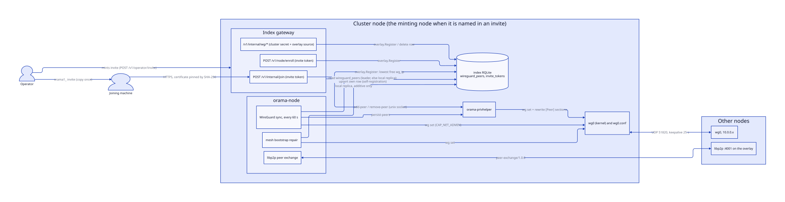
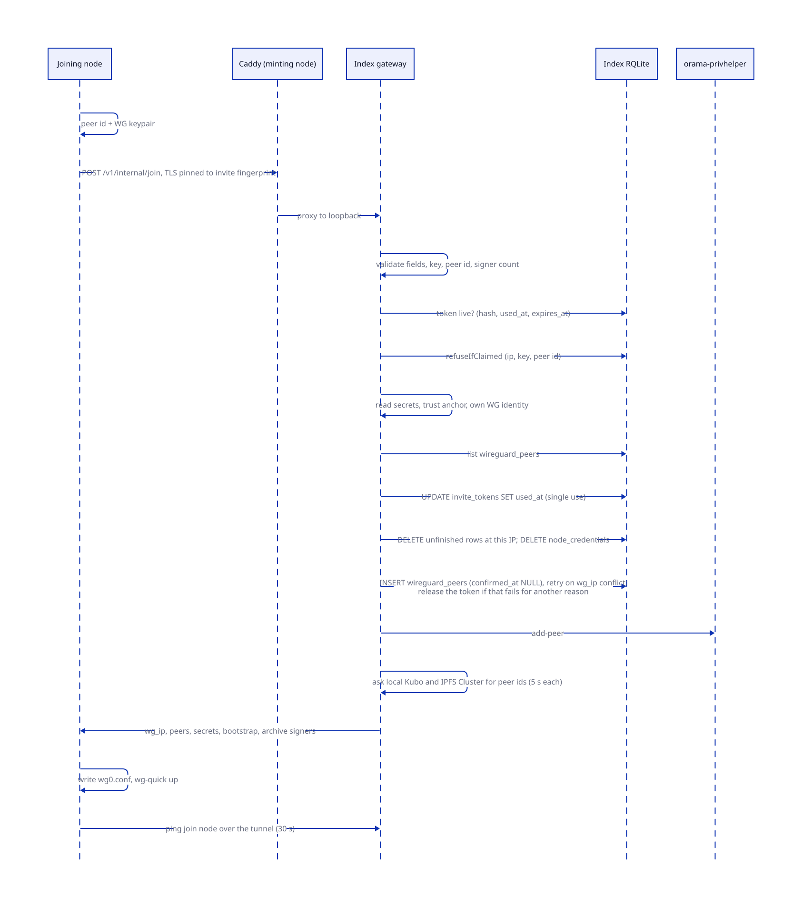
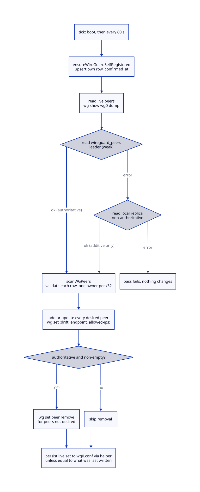
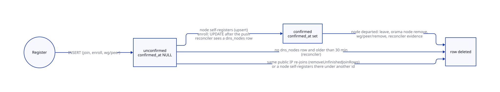

# The WireGuard mesh

> **At a glance.**
>
> - **What:** every node of a cluster holds one WireGuard interface, `wg0`, with a peer entry for every other node. The mesh is the only network Raft, Olric, IPFS, the HTTP APIs between nodes and the libp2p host use. This chapter covers who may enter it (invites, the join handler, the OramaOS enrolment handler), how an address is allocated, how every node's interface is kept equal to the registry's `wireguard_peers` table, and how libp2p peer exchange runs on top of it.
> - **Key numbers:** overlay `10.0.0.0/24` (`.1` genesis, `.2` to `.254` allocated, lowest free first); UDP `51820`; MTU `1420`; persistent keepalive `25` s; peer sync every `60` s; mesh bootstrap repair bounded at `10` s; invite `orama1_` prefix, 32-byte token, `1` h maximum life when minted through the gateway; unfinished-join grace `30` min; libp2p `4001` (Noise), discovery every `15` s, peer exchange protocol `/orama/peer-exchange/1.0.0`.
> - **Code:** `core/pkg/wireguard/`, `core/pkg/overlay/`, `core/pkg/invite/`, `core/pkg/discovery/`, `core/pkg/gateway/handlers/join/`, `core/pkg/gateway/handlers/enroll/`, and the sync in `core/pkg/node/wireguard_sync.go`.
> - **Depends on:** [the node as a supervisor](04-the-node-as-a-supervisor.md) (the component graph that runs the sync), [privilege and filesystem trust](05-privilege-and-filesystem-trust.md) (the helper that writes `wg0.conf`).



## Why it exists

Orama's second design commitment is that no internal traffic crosses the public internet. Raft replication, Olric memberlist, the namespace gateways' calls to each other, IPFS swarm traffic and the chain's peer-to-peer all need a private, authenticated, encrypted network between machines that sit at different providers with public addresses and no shared LAN. WireGuard provides that with one UDP port, a Curve25519 key per node and cryptokey routing, so a packet's source address on `wg0` is proved by the key that carried it. Much of the rest of Orama relies on that: code throughout the gateway decides that a request is "from a peer" by testing whether its source address lies in `10.0.0.0/24` (`core/pkg/auth/internal_auth.go:IsWireGuardPeer`).

Three constraints shaped the design.

1. **Raft runs over the mesh.** A node whose interface has lost its peers can reach no voter, so its RQLite never elects a leader, so it cannot read the table that says who its peers are. The sync therefore has a read path that works without a quorum, and a repair step that runs before RQLite waits for a leader.
2. **Membership is a table, and the table is written by several unrelated paths.** A join, an OramaOS enrolment and a node's own boot all write `wireguard_peers`. Earlier versions had three independent allocators that raced and overwrote each other; one allocator now serves them all.
3. **The private key and `/etc/wireguard` belong to root.** `wg-quick` runs the `PostUp` lines of `wg0.conf` as root, so a conf that the `orama` user can write is root code execution. The processes that decide mesh membership run unprivileged and hand peers, as validated data, to a helper.

## The model

**Overlay.** `10.0.0.0/24` (`core/pkg/constants/urls.go:WireGuardSubnet`). Each node owns one address, advertised as a `/32` in every other node's `AllowedIPs`. The interface itself carries `Address = <ip>/24`. The first node is `10.0.0.1`, hard-coded in the installer (`core/pkg/install/orchestrator.go:Phase6SetupWireGuard`). `core/pkg/overlay/alloc.go` hands out `.2` to `.254`; `.0` and `.255` are never used, and `.1` is never handed out even after the genesis node has left.

**Peer.** One `[Peer]` of the mesh: a public key, an endpoint (`public-ip:51820`) and an allowed IP (`<overlay-ip>/32`) (`core/pkg/wireguard/conf.go:Peer`). Every peer is written with `PersistentKeepalive = 25`, so every node keeps an outbound NAT mapping open to every other node.

**Registry row.** The desired membership is the `wireguard_peers` table of the index RQLite (see [cluster state](07-cluster-state.md)). A row has a `node_id` (the libp2p peer id, or the placeholder `node-<overlay-ip>`), the overlay address, the public key, the public IP, the port, and a `confirmed_at` timestamp. `confirmed_at` is what separates a node that came up from a join handshake that wrote a row and then died. A row without it is **unconfirmed**.

**Invite.** One copy-pasteable string, `orama1_` followed by base64url (no padding) of JSON with four keys: `u` the join URL, `t` the token, `f` the SHA-256 fingerprint of the minting node's certificate, `s` the server name to present (`core/pkg/invite/invite.go:Invite`). `f` and `s` are optional in the format; every minter sets both. The token is 32 random bytes, hex-encoded to 64 characters.

**Minting node.** The node an invite names. It runs the join handler, holds every secret the new node needs, and allocates the new node's address.

**Conf owner.** `core/pkg/wireguard/conf.go:Conf` is the only code that rewrites `wg0.conf` after install (the installer renders the whole file once, at genesis or join). It rewrites `[Peer]` sections and never renders `[Interface]`.

**Gateway placement.** The join, enrolment and operator-invite handlers are built on the gateway's `ORMClient` and mounted on every gateway (`core/pkg/gateway/routes.go`; `core/pkg/rqlite/schema_placement.go` records why `wireguard_peers` and `invite_tokens` exist in namespace databases too). Only the cluster (index) gateway's database holds the real registry and the invites, so only there do they do anything; a tenant gateway sees empty copies of the two tables and answers 401 to a join.

**Peer exchange.** A libp2p stream protocol, `/orama/peer-exchange/1.0.0`, over which a node asks a connected peer for the peers it knows and for the RQLite metadata the peer announces about itself (`core/pkg/discovery/discovery.go:PeerExchangeProtocol`).

## How it works

### Genesis and the interface file

The first node of a cluster runs `Phase6SetupWireGuard(true)` (`core/cmd/orama/internal/production/install/orchestrator.go` calls it only on the genesis path): install the `wireguard` package, generate a Curve25519 keypair in process (`core/pkg/install/wireguard.go:GenerateKeyPair`, which clamps the scalar and derives the public key with `curve25519.ScalarBaseMult`), write the public key to `secrets/wg-public-key`, render `wg0.conf` and bring the interface up with `wg-quick up` (a no-op when `wg0` already exists). The rendered `[Interface]` block is (`core/pkg/install/wireguard.go:GenerateConfig`):

```text
[Interface]
PrivateKey = <key>
Address = 10.0.0.1/24
ListenPort = 51820
MTU = 1420
PostUp = iptables -I INPUT 1 -i wg0 -s 10.0.0.0/24 -j ACCEPT
PostDown = iptables -D INPUT -i wg0 -s 10.0.0.0/24 -j ACCEPT
```

The `PostUp` rule exists because packets reordered by the tunnel are classified by conntrack as invalid and dropped by UFW before any allow rule sees them; the rule accepts the whole overlay ahead of UFW. The file is written `0600` and the mode is checked after the write, because the umask is not trusted (`forcePrivateMode`, bugboard #247). A node that joins generates its keypair in the install CLI instead, and writes the same file with the address and peers it was assigned (`EnableWireGuardWithPeers`); it does not write `secrets/wg-public-key`.

`wg0` is started by `orama-namespace-wireguard@index.service` (`core/systemd/orama-namespace-wireguard@.service`), a oneshot with `RemainAfterExit`. It runs `wg show wg0 || wg-quick up wg0` (it never writes or replaces the conf), has an `ExecStop` of `/bin/true`, and is deliberately not `PartOf=orama-node.service`. Install enables it for boot and disables, without stopping, the distribution's `wg-quick@wg0.service`, because stopping that unit would run `wg-quick down` (`core/pkg/install/orchestrator.go:enableNode`). Stopping or restarting the node supervisor therefore never takes the mesh down: an earlier `PartOf` made `orama node restart` sever every namespace's Raft and Olric links.

### Address allocation

`overlay.Register` (`core/pkg/overlay/alloc.go:Register`) is the single path by which a peer gets an address. Its steps:

1. **Validate.** The public key and public IP are required; the public IP must be a canonical IPv4 string (parse and re-render must match, so no alternative spelling round-trips); the port must be 1 to 65535 (default 51820). The key and endpoint are then run through `privhelper.ValidatePeer`, the same check the helper applies before writing `wg0.conf`, with a dummy `10.0.0.1/32` allowed IP. A row the helper would refuse is refused here, before the insert, so one bad join cannot halt every node's sync.
2. **Check the id.** A non-empty `NodeID` must parse as a libp2p peer id (`peer.Decode`). It becomes the primary key and every consumer of the table reads it back as a peer id.
3. **Pick the address.** `NextFree` reads every `wg_ip`, collects the host octets inside `10.0.0.x`, and returns the **lowest** unallocated host from 2 to 254. It used to be highest plus one. Because addresses were never reused, a churning cluster eventually rolled past `.254` into `10.0.1.x`, outside the `/24` that the `PostUp` rule and the internal-auth check accept; those nodes could reach nobody.
4. **Insert** with a plain `INSERT INTO wireguard_peers (node_id, wg_ip, public_key, public_ip, wg_port, operator_wallet)`. `confirmed_at` is not set, so the row is unconfirmed. If no peer id was given the row's `node_id` is `node-<overlay-ip>` (`PlaceholderNodeID`).
5. **Retry only an address conflict.** Writes serialise through Raft, so two simultaneous joins can both choose `.7`; the loser's insert fails with `UNIQUE constraint failed: wireguard_peers.wg_ip`. `Register` re-reads and tries again, at most 8 times (`allocationAttempts`); the eighth failure returns the last error, wrapped. A uniqueness failure on the public key or the node id is not retried: it means this peer is already registered under another address and a retry would only produce a new address and the same failure, eight times. rqlite returns constraint failures as opaque strings, so `conflictsOn` matches the SQLite message and the column name; an unrecognised message is returned as an error rather than retried. `overlay.IsConflict` is the looser test callers use to tell a caller error from a cluster fault: a uniqueness failure on any column.

The old allocators wrote `INSERT OR REPLACE`, which deletes the conflicting row and inserts a new one. The loser of a race silently deleted the winner's row and took its address. A plain insert turns that into an error.

The node's own boot is the one writer outside `overlay`: it allocates nothing, only re-asserts the row it was given, with `ON CONFLICT(node_id) DO UPDATE` (`core/pkg/node/wireguard_sync.go:ensureWireGuardSelfRegistered`), described under [the sync loop](#the-sync-loop).

### Minting an invite

The invite carries the gateway to join, the token and the certificate to pin, so that a join is one string and cannot be partly transcribed. There are three minters, all producing the same format.

- **On a node:** `orama node invite` (`core/cmd/orama/internal/production/invite/command.go`). It generates 32 random bytes, inserts the hash into the local RQLite over HTTP with the node's RQLite credentials (`invite_tokens`, `created_by` = hostname, no `operator_wallet`, expiry from `--expiry`, default 1 h), reads the certificate Caddy serves for the node's domain on `127.0.0.1:443` with `invite.FingerprintServed`, and encodes `https://<public-ip>`, the token, the fingerprint and the domain as server name. `FingerprintServed` does not verify the certificate, on purpose: the pin is the check, and a staging or not-yet-trusted certificate must still be pinnable. The handshake is bounded at 5 s.
- **From an operator machine:** `orama invite` calls `POST /v1/operator/invite` on one chosen node (`core/cmd/orama/internal/invitemint/invitemint.go:MintThrough`). The invite names that node, not the cluster's base domain. DNS spreads the base domain across every nameserver, each serving its own certificate, so an invite naming the domain pinned whichever certificate answered first and failed when the joiner reached another node. The client dials the chosen node's address whatever the URL resolves to, disables proxies and redirects, and fingerprints the leaf certificate of the very connection that minted the token; it refuses to produce an invite when that connection presented no certificate. The join URL carries the gateway URL's port when it is not 443. `ChooseNode` takes the lowest public IPv4 the domain resolves to unless the operator names a node.
- **The gateway handler** (`core/pkg/gateway/handlers/operator/invite.go:HandleInvite`) requires an operator wallet, generates the token, stores `HashInviteToken(token)` with the wallet in `operator_wallet`, and writes an audit record. The token exists in plaintext only in the response.

Lifetime: through the gateway the default and maximum are one hour (`maxInviteExpiry`); a request for more is clamped and a negative value is a 400. `orama node invite --expiry` has no cap, because it writes the row itself: a node-minted invite can be made to live for days. The registry stores `sha256:` plus the hex digest of the trimmed token (`core/pkg/gateway/handlers/operator/authorize.go:HashInviteToken`), so a registry snapshot holds no usable invite.

**Encoding.** `invite.Encode` validates before it mints: the token must be 64 hex characters, the fingerprint (when present) 64 hex characters, the server name (when present) a DNS name of at least two labels, and the join URL exactly `https://<ip or dns-name>[:port]` with no user, path, query or fragment. `Decode` applies the same checks to what it reads, because the fields end up on a root command line and in a TLS handshake on the joining machine. A bare 64-hex token still decodes, with no URL and no fingerprint; that is what a cluster not yet upgraded issues.

### The join handshake

The joiner runs `orama node install --token <invite>` (`core/cmd/orama/internal/production/install/orchestrator.go`). `applyInvite` unpacks the invite into the join address, fingerprint and server name; an explicit `--join` or `--ca-fingerprint` wins over the invite's values. The install then proceeds in this order.

1. **Check the prerequisites, the Tor client and the archive.** The install checks the machine, provisions the environment and installs the Tor client, then checks everything about the build archive that can fail without the cluster's signers (presence, architecture, integrity, and the operator's `--expect-archive-signers` when given), because the join spends the invite (`establishArchiveTrust`).
2. **Establish identity.** The joiner creates its libp2p identity and a WireGuard keypair. The private key never leaves the machine. The request carries the peer id so the receiving node does not invent a synthetic id.
3. **Call the join endpoint** (`callJoinEndpoint`). TLS is configured with `InsecureSkipVerify` and a `VerifyPeerCertificate` that compares the SHA-256 of the leaf certificate with the pinned fingerprint (`pinnedTLSConfig`). With no fingerprint the install refuses to join, because the token is a credential for every secret in the cluster and there would be nothing to verify the far end with. The invite names the node by IP, so `ServerName` selects the certificate by SNI and the `Host` header is set to the same name, because the node's Caddy routes by `Host` and answers a bare IP with an empty 200. The client times out at 30 s. Any status but 200 is an error carrying the response body, and a 200 whose content type is not JSON is rejected: it never reached the gateway.
4. **Trust the cluster's archive signers** from the response, then install binaries.
5. **Configure WireGuard** with the assigned address and the returned peers, and bring the interface up.
6. **Verify the tunnel** (`verifyWGTunnel`): ping the join node's overlay address, matched by comparing the join address with each peer's endpoint host, once per 2 s for up to 30 s. When no endpoint matches it pings the first peer in the list instead, and an empty peer list fails the install. Other peers do not yet have the new key (they learn it within one sync interval), so the join node is the only one guaranteed to answer.
7. Set up the firewall, save the secrets, generate configuration with the overlay address as the advertise address of every service, install the systemd templates and start `orama-node`. The joiner adopts the cluster's ACME directory unless it was given `--acme-ca`.

### The join handler

`POST /v1/internal/join` (`core/pkg/gateway/handlers/join/handler.go:HandleJoin`) runs on the index gateway of the minting node. The route policy marks it as authenticated by its handler (`core/pkg/gateway/route_policy.go`): the invite token is the credential. Its order is the design.



**Phase A: nothing mutates, the token is untouched.**

1. Method POST, body at most 1 MiB, JSON decode.
2. `token`, `wg_public_key` and `public_ip` are required. `public_ip` must be IPv4. The key must contain no CR or LF, and must decode with strict base64 to exactly 32 bytes. A non-empty `peer_id` must parse as a libp2p peer id. `expected_archive_signers`, if present, has at most 32 entries (`archivetrust.MaxSigners`).
3. `assertTokenLive`: select the row by hash, with `used` and `expired` computed as columns so that a spent token, an expired one and an unknown one give different messages (401). A failure to read the table is a 503, because answering 401 would tell the operator to mint a new invite that would fail the same way. Telling the three apart is not an oracle: telling them apart needs a valid 32-byte token.
4. `refuseIfClaimed`: reject with 409 if any row matches the submitted public IP, key or peer id, except the unfinished rows at the same public IP that step 8 will delete (the refusal set is the complement of the cleanup set; see below). That is a live node at any of the three, or a leftover row at a different public IP. The 409 body says only "identity already registered"; which of the three collided is logged, not returned, because the check is still before the token is spent. A failure to read the table is a 503. The token-live gate sits in front of it so that an unauthenticated caller cannot use the claim check to enumerate the fleet.
5. Read the secrets (`readJoinSecrets`), the node's archive trust anchor, its own overlay address (`ip -4 addr show wg0`, which needs no capability) and the peer list (every `wireguard_peers` row except the joiner's key, unconfirmed rows included). A node with no usable trust anchor refuses to admit anyone (500, naming `/etc/orama/archive-signers`): a joiner can verify nothing it installs without it. If the joiner supplied `expected_archive_signers` and they differ from the anchor, the join is refused with 409 and the message names the anchor, before the invite is spent; a malformed list is a 400.
6. If the node's own overlay address is missing from the peer list (a fresh genesis whose sync has not registered yet), the node injects itself, with its public key from `secrets/wg-public-key` (the gateway cannot run `wg show`, which needs `CAP_NET_ADMIN`) and its public IP from a UDP dial to `8.8.8.8:80`. A failure of either is a 500 before the token is spent.

**Phase B: cluster state changes.**

7. `consumeToken`: `UPDATE invite_tokens SET used_at = datetime('now'), used_by_ip = ? WHERE token = ? AND used_at IS NULL AND expires_at > datetime('now')`. The row count is the answer. This is the atomic single-use point; any failure of it, including a database error, is a 401. The minting wallet is then read back from the row for the new peer row and the audit record.
8. `removeUnfinishedJoinRows`: delete rows at this public IP that are not live (a failure is logged and the join goes on; the insert then fails on any remaining collision). The liveness predicate (`liveRowPredicate`) is `confirmed_at IS NOT NULL OR EXISTS (a dns_nodes row with internal_ip = wg_ip)`. Both halves are needed. `confirmed_at` alone read every un-upgraded node as unconfirmed during the rolling upgrade that introduced the column, because a node on the old binary re-registered with `INSERT OR REPLACE`, nulling its own `confirmed_at` every minute; `dns_nodes` is written the same way by both binaries. A node mid-join has no `dns_nodes` row yet, so neither signal alone suffices.
9. `forgetNodeCredential`: delete any `node_credentials` row for this peer id. A retired machine is re-admitted only at a join, which needs an operator-minted single-use invite; clearing the recorded key lets the rebuilt machine enrol a fresh one. This failure is fatal (500), and the token is not released: the node would come up, fail to enrol and never register, and nothing at the join would say why.
10. `overlay.Register` (above). A uniqueness conflict is a 409 and the token stays spent; any other failure releases the token (`releaseToken` sets `used_at = NULL`, keeping `used_by_ip` as the record of the attempt) and answers 500.
11. `addWGPeerLocally`: add the peer to this node's `wg0` and `wg0.conf` through the helper. A failure is logged and ignored, since the sync applies the row within a minute.
12. Build the response: ask the local Kubo (`/api/v0/id`) and IPFS Cluster (`/id`) for their peer ids, 5 s each, and read the node's libp2p identity key for the bootstrap address. A failure of any of them is logged and leaves that field empty; the join still succeeds.
13. Write the response, then the audit record (action `operator`, resource `join`, with the wallet that minted the token, empty for a node-minted invite). A failure to write the response is logged as an error, writes no audit record and leaves the token spent.

**Why the order.** Only validation and reads precede the token; steps 7 to 13 can still fail. The token is released after a failure of `overlay.Register` that is not a uniqueness conflict (step 10), and in no other case: not after the credential delete, not after a conflict, not when the response cannot be written. The check in step 4 and the cleanup in step 8 are defined in terms of each other: the refusal set is "every row matching the submitted IP, key or peer id except the rows the cleanup will delete". Without that, an unconfirmed row at a different public IP is invisible to both and still collides with the insert, the registration fails, the token is released, and one invite is replayable for ever. And because `public_ip` is a string the caller chooses (nothing compares it with the source address), a cleanup keyed on it with no liveness predicate would let a token holder name any running node's IP, collide on purpose, get the token back and evict that node, repeatedly. The old order, consume then write then read six files, left a spent token and a ghost row for every failure after the write.

**The response** (`JoinResponse`) carries everything the new node needs: its address and the peer list; the cluster secret, swarm key, API-key HMAC secret, RQLite password, serverless secrets key, TURN secret and encryption root (with its id); the RQLite join address (`<minting-wg-ip>:10101`); the IPFS and IPFS Cluster peers as overlay multiaddrs (Kubo swarm `4101`, cluster swarm `10114`); the node's libp2p bootstrap multiaddr on port `4001`; the Olric memberlist seeds (`:10103` on every peer in the list and on the minting node); the base domain and the cluster's ACME directory; the archive signer list and the date of its last rotation. A missing optional secret file yields an empty field and the joiner handles its absence (a missing encryption root falls back to the cluster secret with id `1`); a missing `cluster-secret` or `swarm.key` fails the join before the token is spent. The response also carries an Olric encryption key field that is never filled; it is kept so older joiners decode the message. The peer list excludes the joiner's own key and includes unconfirmed rows.

### The sync loop



The component `wireguard-sync` of the boot graph depends on `wireguard` and `rqlite-local`, and is deliberately outside the cluster tier (`core/pkg/node/components.go`). Putting it behind the quorum gate would make the repair of the mesh conditional on the quorum the mesh carries. `startWireGuardSync` starts `wireGuardSyncLoop` once, and runs one self-registration plus one sync on every supervisor attempt, so a failed attempt is retried at the supervisor's backoff while the loop keeps its own 60 s cadence (`wgSyncInterval`).

**Self-registration** (`ensureWireGuardSelfRegistered`). Each tick the node reads its own public key from `wg show wg0`, its overlay address from the interface, its public IP from `node.public_ip` in `node.yaml` (validated; an unset or unusable value logs an error and skips the registration) and its IPFS peer id from the local Kubo (empty when Kubo is not up yet, which is why the upsert repeats every tick), and upserts its row under its libp2p peer id (the placeholder id when it has none yet) with the fixed port `51820`:

```sql
INSERT INTO wireguard_peers (node_id, wg_ip, public_key, public_ip, wg_port, ipfs_peer_id, confirmed_at)
VALUES (?, ?, ?, ?, ?, ?, CURRENT_TIMESTAMP)
ON CONFLICT(node_id) DO UPDATE SET ... confirmed_at = COALESCE(wireguard_peers.confirmed_at, excluded.confirmed_at)
```

It is an upsert on `node_id` and nothing else: a different node holding this node's address or key makes the statement fail loudly instead of deleting the other node's row. `INSERT OR REPLACE` here had been resetting `operator_wallet` and `created_at` every 60 s. Setting `confirmed_at` here is the strongest evidence a node came up, and it does not depend on `dns_nodes`. The write is a direct SQL insert, not a call through the index gateway like the node's other self-assertions, because the gateway depends on storage and pubsub and those depend on the mesh. Before the upsert it deletes unconfirmed rows at the same public IP under a different node id (ghosts from a previous install or the placeholder id), and only unconfirmed ones: two nodes behind one NAT legitimately share a public IP. Failures of either statement are logged as warnings, not returned, so a failed registration does not fail the sync pass. When `wg` is not installed or `wg0` is not up, registration and sync return without doing anything.

**Desired set** (`loadDesiredWireGuardPeers`). The membership is read first through the adapter's shared handle at consistency `weak`, which the leader answers, and marked **authoritative**. If that fails (no leader, or the query errors), the node reads its own replica (`LocalDB`, consistency `none`) and marks the result non-authoritative. If both fail the pass returns an error and changes nothing. Each row passes through `scanWGPeers` and `meshPeerFromRow`: the row must have a key and an address; the peer built from it must pass `privhelper.ValidatePeer`; its address must not be this node's own; no two rows may claim one `/32`. A row that fails validation is logged and skipped, so one legacy row cannot stop every node from applying the rest. A row whose scan fails, a failing query, or two rows claiming one address is a hard error for the pass. A row without a public IP becomes a peer with no endpoint rather than the endpoint `:51820`.

**Reconcile** (`reconcileWireGuardPeers`). The live peers come from `wg show wg0 dump` (`install.ReadLiveWGPeers`), which carries the endpoint and allowed IPs; a peer whose allowed-ips is `(none)` or a list is ignored because it is not a mesh peer. Then:

- **Add or update** every desired peer that is not live, or whose endpoint or allowed IP differs from the live one (`wgPeerDrifted`, with the `/32` suffix normalised). `wg set wg0 peer <key> allowed-ips <ip>/32 persistent-keepalive 25 [endpoint <e>]` is idempotent, so re-applying a known key is how an endpoint change is rolled out. Skipping known keys had left a peer that moved to a new public IP with its dead endpoint for ever. Adds are unconditional, since adding a peer is safe: one that has left never handshakes and the next authoritative pass removes it.
- **Remove** peers that are live but not desired only if the desired set is authoritative **and** non-empty. An empty read cannot be told from an empty cluster, and the first is far more likely (lost quorum, a replica mid-restore, a migration in flight). Removing every peer severs the mesh, which makes the loss unrecoverable.
- When a newly applied peer takes an address another key held (a node replaced on the same overlay IP), `releaseSupersededAddress` drops the old key from the set to persist, mirroring the kernel, which gives an allowed IP to one peer only. The old key stays on the interface holding nothing until an authoritative pass removes it. Without this the helper refused the whole persist list for assigning an address twice and `wg0.conf` stopped being updated.
- **Persist** (`persistWireGuardPeers`): write the resulting live set to `wg0.conf`, unless it equals what this process last wrote. The node cannot read `wg0.conf` (it is root's), so what it holds is known only from having written it: unknown after a start, so the first pass writes; unknown after a failed write, so the next pass writes. It used to write only when the pass changed the interface, so a stale conf on an already-converged mesh was never repaired and the next `wg-quick up` restored it. An empty live set is never written, because it is what a node that has not reached its mesh looks like and writing it would erase the peers `wg-quick` restores at boot.

Kernel state and file state are reported separately. A peer that reached the interface is live even if the file write failed (logged at error level: the mesh is correct now and will regress on the next `wg-quick up`). A mutex serialises sync passes (`wgSyncMu`), because a supervisor retry can coincide with a tick and the file rewrite is not idempotent; a second mutex guards the record of what was last persisted (`wgPersistMu`), which the boot-time repair also reaches.

### The conf owner and the privileged helper

`/etc/wireguard` is root's. The node (`orama-node.service`, user `orama`, `AmbientCapabilities=CAP_NET_ADMIN` from the unit `core/pkg/install/services.go` renders) can run `wg set` and `wg show` on the live interface but cannot write the file. The index gateway has neither capability: it cannot even run `wg show`. Both call `orama-privhelper` ([chapter 5](05-privilege-and-filesystem-trust.md)), which runs as root, identifies its caller by `SO_PEERCRED` and cgroup, and exposes three WireGuard operations (`core/pkg/privhelper/wireguard.go`):

| Operation | Arguments | Who may call it |
| --- | --- | --- |
| `add-peer` | key, endpoint, allowed IP | node, index gateway |
| `remove-peer` | allowed IP | node, index gateway |
| `persist-peers` | JSON list on stdin | node only |

`add-peer` runs `wg set wg0 peer <key> allowed-ips <ip>/32 persistent-keepalive 25 [endpoint <e>]` and then adds the peer to the conf; if the file write fails it reports that the peer is applied but not persisted. `core/pkg/privhelper/caller.go:authorizeIndexGateway` gives the gateway exactly add and remove of one peer. `ValidatePeer` demands a canonical base64 32-byte key (re-encoding must reproduce the string, since the decoder skips CR and LF, so a key with a newline decoded to 32 bytes and landed in `wg0.conf` as two lines), an `ip:port` endpoint or none, and one `/32` inside the overlay in canonical form. `ParsePersistInput` additionally refuses a list of more than 4096 peers, a key listed twice and an address listed twice. The executor refuses any peer claiming this node's own overlay address (`core/cmd/privhelper/exec.go:notThisNode`). `remove-peer` finds every live peer whose allowed-ips column contains exactly that address, removes each, then removes matching conf entries; it matches on the whole address, because the earlier `strings.Contains` removal of `10.0.0.1` also removed `10.0.0.12`.

`Conf` rewrites the file (`core/pkg/wireguard/conf.go:PersistPeers`):

- It reads the existing file and keeps everything before the first `[Peer]` verbatim. The process does not hold the private key, and the block carries `wg-quick` directives that `wg` does not model (`Address`, `MTU`, `PostUp`). A file with no `[Interface]` or no `PrivateKey` is refused rather than repaired: writing one without a key would take the interface down at the next boot.
- Peers are written sorted by allowed IP then key, so an unchanged mesh is byte-identical and a diff shows only real changes, each with `PersistentKeepalive = 25`.
- The write goes to a temporary file in the same directory, `fsync`, `chmod 0600`, `rename` over the target, then a mode check.
- Every change is read-modify-write under an exclusive `flock` on `.wg0.conf.lock`, because the helper serves requests in parallel, one instance per connection: without the lock a join's add-peer and the sync's persist could each read, modify and rename and one would lose the other's peer. `AddPeer` replaces any peer with the same key or the same address.

The comment above `Conf` records why: the sync used to persist through a zero-value provisioner with no config directory, key or port; every write failed on a relative path, so `wg0.conf` held only the peers written at install time and every reboot brought the mesh back as it was on day one.

### Mesh bootstrap repair

A node that restarts after losing its mesh membership is in a cycle: no peers, so no Raft leader, so no leader-routed read, so no peers. `bootstrapWireGuardMesh` breaks it (`core/pkg/node/wireguard_sync.go:bootstrapWireGuardMesh`). It is registered as the RQLite manager's `SetOnProcessStarted` hook (`core/pkg/node/rqlite.go`), so it runs after `rqlited` is listening and before anything waits for a leader. It opens a short-lived `sql.DB` to the node's own rqlite at read consistency `none`, scans the local replica under a 10 s context (`wgBootstrapTimeout`), counts desired peers missing from the live interface, and, only if any are missing, applies them additively (`authoritative: false`). It never removes, and it does nothing when `wg` or `wg0` is absent. Every failure is logged and swallowed: it is best-effort repair on the startup path, and the periodic sync retries once rqlite is up.

### The OramaOS enrolment handler

`POST /v1/node/enroll` (`core/pkg/gateway/handlers/enroll/handler.go:HandleEnroll`) admits a node that runs the experimental OramaOS image, not covered in this book. That image has no SSH and no shell, so it cannot run the installer. The operator's CLI sends a registration code (shown on the node's console), an invite token and the node's public IP. The gateway does the work the node would otherwise do for itself.

1. Parse `node_ip` as IPv4 and refuse reserved ranges (loopback, RFC 1918, link-local, multicast, unspecified and the CGNAT range `100.64.0.0/10`; `core/pkg/gateway/handlers/enroll/nodeip.go:reservedNodeIP`). The value is stored as the `Endpoint` of every other node and is the target of an outbound HTTP push, so an unvalidated string is both a `wg0.conf` injection and an SSRF. The parsed form is stored.
2. `consumeToken` (the same single-use `UPDATE`; no earlier liveness gate, no claim check; any failure is a 401). From here every failure leaves the token spent.
3. Generate a WireGuard keypair with `wg genkey` and `wg pubkey`. The gateway therefore holds the node's private key briefly; it is delivered to the node and not stored.
4. `overlay.Register` with no peer id: the row is `node-<overlay-ip>`, unconfirmed. Every failure is a 500; a uniqueness conflict is not told apart.
5. Add the peer locally through the helper (a failure is a warning). Read the cluster secret. Build the node's `wg0.conf` (`buildWGConfig`): its own `[Interface]` with `Address = <ip>/24` and `ListenPort = 51820`, then this node (its public key from `wg show wg0 public-key`, its overlay address from `ip`, its public IP from its own `wireguard_peers` row) and every row of `wireguard_peers` except the new one. If the table query fails the error is logged and the config carries this node alone. List the other nodes' ids and overlay addresses (used by the node for LUKS key distribution).
6. Push the configuration to `http://<node_ip>:9999/v1/agent/enroll/complete`, **sealed** under the registration code (`core/pkg/gateway/handlers/enroll/sealed.go:Seal`): the key is HKDF-SHA256 of the code with the info string `orama-enrollment-seal-v1`, the cipher AES-256-GCM, the body `base64(nonce || ciphertext || tag)`. The code is never fetched from the node and never sent; a payload that decrypts proves its sender held it, and the node's reply is sealed the same way, so a reply that opens proves the responder held it too. The format is mirrored in the OS agent module and pinned by a shared test vector (`contracts/`). The client has a 30 s timeout, follows no redirects and reads at most 1 MiB.
7. The node replies with an agent token it minted. The gateway stores it AES-GCM-encrypted under a key derived from the encryption root (`agent_token.go:storeAgentToken`, HKDF purpose `node-agent-token`) in `wireguard_peers.agent_token`; every later command to the node (`/v1/node/status`, `command`, `logs`, `leave`, proxied to `http://<overlay-ip>:9998/v1/agent/...`) carries it as a bearer. Being on the mesh is not the credential.
8. `UPDATE wireguard_peers SET confirmed_at = CURRENT_TIMESTAMP`, because no join handshake and no `orama-node` self-registration ever confirms an enrolled node, and the reconciler would collect the row as an unfinished join after 30 minutes.

`/v1/node/status`, `logs`, `command` and `leave` are authenticated by the route policy, not by the handlers: the first two need an operator-domain read credential, the last two an operator-domain write credential (`core/pkg/gateway/route_policy.go`). `POST /v1/node/leave` (`node_proxy.go:HandleNodeLeave`) is the reverse of enrolment: send `stop` to the agent (a failure or refusal is only logged), delete the row by overlay address, then remove the peer from this gateway's own `wg0` and `wg0.conf` through the helper. The other nodes drop the key at their next authoritative sync.

### No peer registration endpoint

There is no route that registers or removes a peer on the strength of the cluster secret. `/v1/internal/wg/peer`, `/peers` and `/peer/remove` were removed (#727) and answer like any path that does not exist. A peer enters `wireguard_peers` only through the invite-gated join, the OramaOS enrolment and a node's own self-registration, all of which allocate through `overlay.Register`; it leaves through `orama node remove`, `POST /v1/node/leave` or the reconciler. Fleet e2e `internal-routes-audit` asserts the removed paths are absent.

### libp2p discovery and peer exchange

Each node runs a libp2p host that listens on `/ip4/<overlay-ip>/tcp/4001` only (`core/pkg/install/templates/node.yaml`), with the Noise security transport and libp2p's default muxers; the same host carries GossipSub and enables the NAT service, AutoNAT v2, relay and AutoRelay with the bootstrap peers as relay candidates (`core/pkg/node/libp2p.go:startLibP2P`). Bootstrap peers come from the join response, as overlay multiaddrs. They are added to the peerstore with a 24 h TTL and dialled at start; while the node holds no connection to any bootstrap peer, `peerReconnectionLoop` redials them with jittered exponential backoff starting at 5 s, and once connected it re-checks every 30 s. `core/pkg/discovery/discovery.go` adds peer discovery without a DHT, in three parts.

**The handler.** `StartProtocolHandler` registers `/orama/peer-exchange/1.0.0`. A request is JSON `limit` (zero or negative becomes 10, and it is capped at the size of the local peerstore). The response is up to `limit` peers from the local peerstore, skipping itself and any peer with no 4001 address, each with its id and only those addresses on TCP port 4001 (`filterLibp2pAddrs`). The filter keeps the node from advertising, and then dialling, the IPFS swarm (`4101`) or IPFS Cluster ports that the same peer id may also hold. The response also carries the responder's own RQLite metadata from its peerstore.

**The loop.** `Start` runs one discovery pass at once and then every `DiscoveryInterval` (15 s in the generated `node.yaml`, must be greater than zero). A pass has two strategies, bounded by `MaxConnections` new connections (50 in the generated config). First, connect to peers in the peerstore that are disconnected and have a 4001 address. Second, ask every connected peer for peers (`requestPeersFromPeer`), filter the addresses again, add them to the peerstore with a 24 h TTL, and dial each with a 5 s timeout. The stream read has a 5 s deadline. A peer that answers "protocols not supported" (a gateway or other light client) is recorded in `failedPeerExchanges` and not logged; it is still asked on every later pass, because nothing consults the map before opening the stream. Other stream failures are logged at most once a minute per peer, and a success clears the entry.

**The metadata.** `RQLiteNodeMetadata` is what a node says about itself (`core/pkg/discovery/rqlite_metadata.go:RQLiteNodeMetadata`). The node fills in its RQLite id (the raft address it advertises), raft and HTTP addresses, node type, the raft log index, a cluster version of `1.0`, its libp2p peer id, its overlay address, its lifecycle state (`joining`, `active`, `degraded`, `draining`, `maintenance`) and, in maintenance, the expiry. The struct also declares per-service status, per-namespace status and a binary version; no code sets them. Unknown JSON fields are ignored by old nodes and an empty lifecycle state reads as `active`, so metadata fields can be added without a protocol version. On receipt the requester checks that the claimed `PeerID` equals the stream's authenticated sender and rejects the metadata otherwise, then stamps the verified id before storing it in the peerstore. `IsAvailable` counts `active` and `degraded` as available but is a claim by the node about itself; callers must confirm with a probe. `TriggerPeerExchange` is the one-shot variant that asks every connected peer for up to 50 peers, used by the RQLite manager before it starts (the minimum-cluster-size wait and pre-start discovery) and in split-brain recovery to collect metadata ([cluster state](07-cluster-state.md)). The metadata lives only in the peerstore, in memory.

The node publishes its own metadata with `ClusterDiscoveryService.UpdateOwnMetadata` (`core/pkg/rqlite/cluster_discovery_queries.go:UpdateOwnMetadata`), which writes the JSON into its own peerstore entry; peers read that entry through the exchange handler. It is called when the cluster discovery service starts (with log index 0), after the RQLite join, when the boot lifecycle state changes (`core/pkg/node/boot_state.go`) and when the node announces maintenance for five minutes at shutdown (`core/pkg/node/node.go`). The `MetadataPublisher` in `core/pkg/discovery/metadata_publisher.go` (a timer that republishes every 10 s) is not instantiated anywhere in the node; see Known gaps.

## State it owns

| Item | Holds | Written by | Read by | Where |
| --- | --- | --- | --- | --- |
| `wireguard_peers` table | The desired mesh: `node_id` (pk), `wg_ip` (unique), `public_key` (unique), `public_ip`, `wg_port` (default 51820), `created_at`, `ipfs_peer_id`, `operator_wallet`, `confirmed_at`, `agent_token` | `overlay.Register` (join, enroll); the node's self-registration upsert; enroll (`confirmed_at`, `agent_token`); the membership reconciler (confirm, drop); `orama node remove` (`core/cmd/orama/internal/production/clusterops/retire.go`); leave; operator registration (`operator_wallet`) | every node's sync; join; enroll; the reconciler; the IPFS swarm sync (`ipfs_peer_id`); node-API admission | index RQLite (`core/migrations/013_wireguard_peers.sql`, `015`, `020`, `038`, `045`) |
| `invite_tokens` table | `sha256:` hash of the token (pk), `created_by`, `created_at`, `expires_at`, `used_at`, `used_by_ip`, `operator_wallet` | invite minters; join and enroll (`used_at`); `releaseToken` | join, enroll | index RQLite (`core/migrations/014_invite_tokens.sql`, `020`, `044`) |
| `node_credentials` row | A node's enrolled Ed25519 public key | enrolment; deleted by the join | node-authenticated routes | index RQLite (`core/migrations/055_node_credentials.sql`) |
| `/etc/wireguard/wg0.conf` | `[Interface]` verbatim; one `[Peer]` per mesh peer | `orama-privhelper` through `wireguard.Conf`; the installer at install | `wg-quick` at boot; the helper | each node, root `0600` |
| `.wg0.conf.lock` | `flock` target for conf changes | `Conf.locked` | `Conf.locked` | `/etc/wireguard/` |
| `wg0` interface | Kernel peer set, handshakes, counters | `wg set` from the node and the helper | `wg show wg0 dump` | each node |
| `secrets/wg-public-key` | The node's public key, so the unprivileged gateway need not run `wg show` | genesis installer only (`Phase6SetupWireGuard`); a joined node never writes it | the join handler's self-injection | `<oramaDir>/secrets/` |
| `n.wgPersisted` | The peer set the node last wrote to `wg0.conf` | `persistWireGuardPeers` | the same | memory in `orama-node` |
| libp2p peerstore | Peer addresses (24 h TTL for exchanged and bootstrap ones) and `rqlite_metadata` per peer | discovery; `UpdateOwnMetadata` | peer exchange; cluster discovery | memory in `orama-node` |
| `failedPeerExchanges` | When a peer last failed a peer-exchange stream, for log suppression | `requestPeersFromPeer` | the same | memory in `orama-node` |
| Port `51820/udp`, `4001/tcp` | WireGuard; the node's libp2p host on the overlay address | `wg0`; the libp2p host | peers | each node (`core/pkg/constants/ports.go:WireGuardPort`, `core/pkg/constants/urls.go:NodeLibP2PPort`) |

The migrations differ in what they do for existing data: migration 038 added `confirmed_at`, marked every existing row confirmed (marking them unconfirmed would have had the reconciler delete the live mesh) and back-filled real peer ids from `dns_nodes` where the overlay address matched.



## Lifecycle

**Boot.** The supervisor starts `wireguard` (the oneshot unit above), then `libp2p` and `cluster-discovery`, then `rqlite-local`. When `rqlited` is listening, the bootstrap repair runs once against the local replica. The `wireguard-sync` component then self-registers, syncs and starts the 60 s loop. Self-registration also happens when the node joins: the first sync after install registers the row the join handler wrote as unconfirmed with the node's real id (the join row carries the peer id the joiner sent, so the upsert hits it; for a joiner that sent none, the placeholder row is replaced by deleting unconfirmed rows at the same public IP).

**Normal operation.** Each minute every node re-asserts its row and reconciles `wg0` with the table. A new node appears on a peer's interface within one interval of the join, and the joiner pings only the minting node because only it has the new key at once. A peer whose public IP changes is corrected on every other node at the next pass.

**Rolling upgrade, mixed versions.** The invite and join formats are tolerant in both directions: a bare token decodes, unknown JSON fields in the invite, join response and metadata are ignored, an old joiner that sends no peer id or no expected signers still joins, and optional secret files that an older cluster lacks produce empty response fields. The liveness predicate was written for the case where the join-serving node is upgraded first and the others still write `INSERT OR REPLACE` (see the join handler above). Migration 038's own header records that on the first upgraded node the self-registration write can fire before any node has applied the migration and fail with "no such column"; the row is untouched and the next tick succeeds.

**Restart.** Restarting `orama-node` does not touch `wg0`. If `wg0` itself was restarted by an operator, `wg-quick up` restores the peers last persisted in `wg0.conf`, and the bootstrap repair then adds any that the table knows and the file lacks. A restarted node that has lost its peers recovers from its own replica without a quorum.

**Node loss.** A node that goes away stays in every peer set until something removes its row: `orama node remove` or `POST /v1/node/leave`, or the membership reconciler's departed-node rule. After the row is deleted, each node's next authoritative non-empty sync removes the key from its interface and conf. An unfinished join (row unconfirmed, no `dns_nodes` row at its address) is dropped by the reconciler after `JoinGrace`, 30 minutes (`core/pkg/node/membership/plan.go:JoinGrace`); a confirmed row with no `dns_nodes` row is only reported. [Membership and failure detection](08-membership-and-failure-detection.md) covers the reconciler.

## Failure modes

| Trigger | What the system does | What you observe |
| --- | --- | --- |
| Invite expired, spent or unknown | Join answers 401 with a message naming which; nothing is written | `join rejected (HTTP 401): this invite has expired` on the joiner |
| Registry unreadable during a join | Join answers 503 at the token gate or the claim check; token untouched | `cannot verify the invite right now, retry shortly` |
| Joiner's IP, key or peer id matches a live node, or a leftover row at another public IP | 409 `identity already registered`; token kept | joiner install fails; cluster log names the field; a leftover row clears after `JoinGrace` |
| Joiner's expected signers differ from the anchor | 409 naming the anchor; token kept | `the invite was not used` in the message |
| Minting node has no trust anchor | 500 before the token is spent | message names `/etc/orama/archive-signers` |
| Certificate differs from the pinned fingerprint | Joiner aborts before sending the token | `TLS certificate fingerprint mismatch` |
| Address race between two joins | The loser retries up to 8 times | both succeed with different addresses |
| Registration fails after the token is spent (not a conflict) | Token released; 500 | joiner can retry with the same invite |
| Deleting a rejoining node's `node_credentials` row fails | 500; token stays spent; the unfinished rows at its IP are already deleted | `failed to admit this node`; mint a new invite |
| Joiner dies after a successful join | Row stays unconfirmed; every node applies it each minute; reconciler drops it after 30 min | a peer with no handshake in `wg show` |
| Response lost after the row is written | Logged as an error; token spent, row exists | operator removes the node and mints a new invite |
| Raft leader unreachable during sync | Falls back to the local replica; adds only | log: `falling back to the local replica`; `source=local-replica` |
| Registry read returns zero peers | No removal | log: `skipping WG peer removal` |
| `wg0.conf` write fails | Interface correct, file stale; retried every pass | log: `applied to the interface but NOT persisted` |
| Peer changes public IP | Endpoint drift detected; `wg set` re-applied on every node | handshake resumes within one interval plus keepalive |
| Node replaced on the same overlay IP | Old key's address is released from the persisted set; old key lingers until an authoritative pass | duplicate-address persist refusal is avoided |
| Invalid row in `wireguard_peers` | Skipped with a warning; the rest is applied | `skipping a wireguard_peers row that cannot be applied` |
| Two rows claim one address | The pass fails with an error naming both nodes | `both claim 10.0.0.N`; no mesh change until fixed |
| Overlay exhausted (all 253 allocatable hosts held) | Join and enrol fail | `address space exhausted` |
| Partition between two nodes | Handshakes stop; keepalive and endpoint stay; heals when the path returns | `latest handshake` ages in `wg show` |
| Clock skew | `expires_at` and `JoinGrace` use database and node clocks; WireGuard handshakes use TAI64N timestamps and tolerate small skew | invite expiring early or late by the skew |
| Enrol: code wrong or wrong machine | The sealed payload does not open; enrolment fails | `the node rejected the registration code` / `did not decrypt` |
| Enrol fails after the token is consumed | Token is not released; row stays unconfirmed | operator mints a new invite; the row is collected after 30 min |
| Enrol on a gateway that cannot run `wg show` | Fails in `buildWGConfig` after the token is spent and the peer added | 500 `internal error`; log `failed to build WG config` |
| Peer-exchange stream to a light client | "protocols not supported" is recorded and not logged; the peer is asked again next pass | none |

## Trust and security

**Trust boundaries.** Public internet: SSH, `80`, `443`, UDP `51820`, and `53` and the TURN ports where enabled (`core/pkg/install/firewall.go:GenerateRules`). Mesh: everything else. Root: `/etc/wireguard`, the private key and the helper. The firewall admits the whole overlay on `wg0` (`overlayAllowRule` in `core/pkg/install/firewall.go`, plus the `PostUp` rule), so inside the mesh there is no per-service access control from the network layer: every service authenticates its callers itself (chapter 15, inter-node trust). IPv6 is disabled system-wide by sysctl so it cannot bypass the IPv4 rules.

**Crypto.** WireGuard's handshake authenticates both ends by their Curve25519 keys. `AllowedIPs = <ip>/32` makes the kernel drop a packet whose inner source is not that peer's address, so a peer cannot speak as another node. That is why `IsWireGuardPeer` can treat a source address in the subnet as a proof of key possession. The join response never contains a private key; each joiner generates its own and sends only the public half. The one exception is OramaOS enrolment, where the gateway generates the node's key.

**Who can do what.**

- *No credential, public internet.* Can reach the join and enroll routes, which answer 401 without a live token, and the WireGuard port, which answers nothing without a valid handshake. The claim check is behind the token gate, so the fleet cannot be enumerated.
- *Holder of a live invite.* Gets every secret in the cluster in one response (cluster secret, swarm key, RQLite password, encryption root, and the rest) and a mesh address: the invite is a root-level credential, which is why it lives at most an hour, is single-use and is stored hashed. It cannot evict a live node: the cleanup is limited to non-live rows and the claim check refuses any identity that is live. It can occupy one mesh address per invite. The invite appears in the command line of `orama node install`, so it is visible in `ps` and shell history on the new machine. A node-minted invite is not bound to one hour (`orama node invite --expiry`).
- *On-path attacker between joiner and cluster.* Cannot read or replace the exchange without presenting a certificate with the pinned fingerprint; the install refuses to join without a pin.
- *Holder of the cluster secret on the mesh.* Cannot change the mesh with it: no route accepts the cluster secret as a credential for registering or removing a peer. Adding a peer takes an invite.
- *The index gateway process.* Can add or remove one peer at a time through the helper, never rewrite the mesh and never touch `[Interface]`. A compromise of the gateway can insert a peer but not read the WireGuard private key.
- *`orama-node`.* Can persist a whole peer list through the helper; the helper validates every field and refuses its own address.
- *A tenant's deployment process on a node.* Is on the node's loopback and mesh address; it cannot write `wg0.conf`, and the helper authorizes only `orama-node.service` and the index gateway unit.

**Validation at the edges.** Keys must be canonical base64; endpoints must be `ip:port`; allowed IPs must be canonical `/32` in the overlay; a newline in any of them would have appended directives to `wg0.conf` (and, via `wireguard_peers.public_ip`, to the configuration of every other node). Validation runs at the handler, again in `overlay.Register`, again when each node scans the table, and again in the helper.

## Limits and scale

- **Address space:** 253 allocatable hosts (`.2` to `.254`) plus the genesis `.1`: at most 254 nodes per cluster. `NextFree` reads the whole table on every allocation, a few hundred rows at most.
- **Topology:** a full mesh. Every node holds one peer per other node, and every pair sends a keepalive every 25 s: n(n-1)/2 tunnels for n nodes, about 32,000 at the cap. The kernel handles hundreds of peers per interface, but each sync parses the whole `wg show dump` and rewrites the whole conf. The persist list is bounded at 4096 (`maxPersistedPeers`), above the address space.
- **Sync cost:** one table read, one `wg show` and (when changed) one helper call per node per minute. Join-to-visible latency is up to 60 s on a node other than the minting one.
- **Join:** request body 1 MiB, client timeout 30 s, tunnel verification 30 s, IPFS Cluster and Kubo queries 5 s each.
- **Invites:** maximum life 1 h through the gateway (uncapped on a node); signer list at most 32 entries.
- **Discovery:** 15 s interval, 50 connections per pass, peer-exchange default limit 10, request 50 for `TriggerPeerExchange`.
- **At 10x the fleet** (hundreds of nodes) the first bottlenecks are the /24 itself (the address range cannot grow without changing the subnet in the PostUp rule, the internal-auth check, the helper and the firewall), and the full-mesh keepalive and handshake load on small VPSes. The registry-read path, the metadata exchange (one JSON response per peer per pass, each carrying the whole peerstore subset) and the per-pass conf rewrite are next.

## Design decisions

### One allocator for every writer

*Chosen:* `overlay.Register`, lowest free address, plain `INSERT`, retry on a `wg_ip` conflict only. *Rejected:* a read-then-`INSERT OR REPLACE` in each handler, and highest-plus-one. *Why:* the replace form let the loser of a race delete the winner's row and take its address; highest-plus-one walked out of the `/24`. The table's own `UNIQUE` constraints are the arbiter, because writes serialise through Raft.

### Token before row, but only after everything that can fail

*Chosen:* validate, check live, refuse duplicates, read all inputs, then consume the token and write the row; release the token only on a cluster fault. *Rejected:* consume first, or release the token on any failure. *Why:* the first leaves a spent token and a ghost row on every late failure; the second lets a token holder replay one invite to evict nodes. The two rules close each other's hole.

### Rewrite only `[Peer]`, via a helper, under a lock

*Chosen:* the node never holds the key or writes the file; peers go to a root helper as validated data; `[Interface]` is preserved byte for byte. *Rejected:* regenerating the whole file from a provisioner; giving the node write access to `/etc/wireguard`. *Why:* a regenerated file loses the key and the `PostUp` lines; a node-writable conf is root code execution through `wg-quick`.

### Additive local fallback, authoritative non-empty removal

*Chosen:* adds always; removals only from a leader-routed, non-empty read. *Rejected:* mirroring whatever was read. *Why:* an empty or stale read is the usual failure and removing peers on it turns a restart into an unrecoverable partition.

### Live means confirmed or in `dns_nodes`

*Chosen:* a disjunction. *Rejected:* `confirmed_at` alone. *Why:* during the rolling upgrade that added the column, the old binary's `INSERT OR REPLACE` nulled it every minute, so a new join-serving node would have read the whole fleet as displaceable.

### Pin the minting node, not the domain

*Chosen:* the invite names one node by IP and pins its certificate; the domain is only the server name. *Rejected:* an invite naming the base domain with an optional fingerprint, and trust-on-first-use. *Why:* DNS returns different nodes with different certificates, and an optional pin was usually left out.

### Full mesh with keepalive on every pair

*Chosen:* every node peers with every other node, `PersistentKeepalive = 25`. *Rejected:* hub-and-spoke or on-demand peers. *Why:* Raft, memberlist and IPFS are all-to-all, and nodes sit behind provider NAT or firewalls, so an open mapping to every peer is needed anyway. The cost is quadratic tunnels.

### Peer-exchange filters on the node's own libp2p port

*Chosen:* advertise and dial only addresses on TCP `4001`. *Rejected:* advertising every address in the peerstore. *Why:* the same peer id also appears on IPFS swarm and cluster ports, and dialling those cross-connected the node's libp2p host to IPFS.

## Known gaps

- **`MetadataPublisher` is dead code, and most of the metadata struct is empty.** `core/pkg/discovery/metadata_publisher.go:MetadataPublisher` (and the `ProvideMetadata` comment that refers to it) is not constructed anywhere. Metadata is refreshed only on events (service start, RQLite join, boot lifecycle change, shutdown; `UpdateOwnMetadata`), although the comment above that function says it is called periodically. The published `RaftLogIndex` and lifecycle state can therefore be stale for as long as no event happens, and the `LastSeen` of a peer is set to the collection time by the reader (`core/pkg/rqlite/cluster_discovery_membership.go`), so it does not measure the age of the data. `Services`, `Namespaces` and `BinaryVersion` are declared in `RQLiteNodeMetadata` and set nowhere. `PeerExchangeResponseV2` is also unused.
- **Enrolment consumes the invite and never releases it.** `core/pkg/gateway/handlers/enroll/handler.go:HandleEnroll` has no token-live gate and no claim check, and every failure after `consumeToken` (peer registration, secret read, config build, the push, the agent-token store, the confirmation update) leaves the token spent. After the register step it also leaves an unconfirmed row, applied to every node until the membership reconciler drops it 30 minutes after creation. The join handler's token-live gate and `releaseToken` have no counterpart here.
- **Enrolment cannot read its own public key.** `buildWGConfig` runs `wg show wg0 public-key` in the index gateway. That unit runs as `orama` with no `CAP_NET_ADMIN` and `NoNewPrivileges=yes` (`core/systemd/orama-namespace-gateway@.service`), and listing a WireGuard device needs that capability; the join handler's comment says so and reads `secrets/wg-public-key` instead. Enrolment therefore fails at that step on a gateway that is not root, after the token is spent, the peer is registered and added to this node. No unit test drives `HandleEnroll`.
- **`secrets/wg-public-key` is written only at genesis** (`Phase6SetupWireGuard`, called only by the genesis path). A node that joined has no such file, so the join handler's self-injection (`readLocalWGPublicKey`) fails there with a 500 if its own row is missing from the table when it serves a join.
- **The self-injected public IP is a guess.** `readLocalPublicIP` dials UDP to `8.8.8.8:80` and returns the local address the route chose, which is the private address on a node behind 1:1 NAT. The node already holds a validated `node.public_ip` in `node.yaml`.
- **Two failures after the token is spent do not release it.** If `forgetNodeCredential` fails, `HandleJoin` answers 500 and leaves the token spent, after the unfinished rows at the joiner's IP were deleted. If `overlay.Register` exhausts its eight attempts on `wg_ip` conflicts, the wrapped error still contains the SQLite uniqueness message, so `overlay.IsConflict` is true and the handler answers 409 `identity already registered` without releasing the token, although the cause is allocation contention.
- **The join does not range-check `public_ip`.** It accepts any canonical IPv4 address, private and loopback included, and compares it with nothing; enrolment refuses reserved ranges (`reservedNodeIP`). A holder of an invite can put an arbitrary endpoint into every node's `wg0` (the other nodes then send handshake initiations to it every 25 s).
- **Removal does not check that the node is gone.** `HandleNodeLeave` deletes the row even when the agent's `stop` failed or the address is not an OramaOS node's; the other nodes remove the key at their next authoritative sync.
- **Peer-exchange requests are not bounded.** `handlePeerExchangeStream` decodes the request with an unbounded `json.Decoder` and sets no read deadline on the server side. The port is on the overlay only.
- **`failedPeerExchanges` suppresses logs, not requests.** `requestPeersFromPeer` writes the map for a peer that does not speak the protocol and never reads it before opening the stream, so a gateway or other light client in the peer set is asked on every pass, and the map has no expiry for peers that never succeed.
- **A node-minted invite is uncapped.** `orama node invite --expiry` writes the expiry straight to `invite_tokens`; only the gateway minter clamps it to one hour (`core/cmd/orama/internal/production/invite/command.go`).
- **Stale comment and doc.** `wireGuardSyncLoop` says the self-registration is `INSERT OR REPLACE`; it is an upsert. `docs/DEV_DEPLOY.md` still shows `orama node install --join http://...` with a bare token, and `docs/ARCHITECTURE.md` shows `--join https://example.com --token <TOKEN>`; the pin refuses any join without a fingerprint, which only an encoded invite supplies.

## Verify it yourself

**Unit tests**

- `core/pkg/overlay/alloc_test.go`: `TestRegister_reuses_the_lowest_freed_address`, `TestRegister_retries_when_a_concurrent_join_takes_the_address`, `TestRegister_doesNotRetryAConflictOnTheKey`, `TestRegister_leavesTheRowUnconfirmed`, `TestRegister_exhausted_address_space`.
- `core/pkg/invite/invite_test.go`: `TestEncodeDecode_roundTrip`, `TestDecode_acceptsABareToken`, `TestDecode_refusesFieldsOfTheWrongShape`, `TestFingerprintServed_ReadsAnUntrustedCertificate`.
- `core/pkg/wireguard/`: `TestPersistPeersPreservesInterfaceBlock`, `TestPersistPeersRefusesUnusableConf`, `TestPersistPeersWritesPrivateMode`, `TestConf_ConcurrentAddsLoseNothing`, `TestConf_RemovePeersByAllowedIPIsExact`.
- `core/pkg/gateway/handlers/join/`: `TestHandleJoin_conflictDoesNotConsumeTheToken`, `TestHandleJoin_identityConflictDoesNotReleaseTheToken`, `TestHandleJoin_serverFailureDoesReleaseTheToken`, `TestRemoveUnfinishedJoinRows_neverTouchesALiveNodesRow`, `TestHandleJoin_anUnexpectedSignerListIsRefusedBeforeAnythingIsSpent`, `TestHandleJoin_conflictResponseNamesNoFleetState`.
- `core/pkg/node/`: `TestReconcileWireGuardPeers_emptyAuthoritativeSet_doesNotRemove`, `TestReconcileWireGuardPeers_localFallback_addsButNeverRemoves`, `TestReconcileWireGuardPeers_appliesEndpointDrift`, `TestReconcileWireGuardPeers_replacementOnTheSameAddressPersistsOneOwner`, `TestScanWGPeers_refusesTwoRowsForOneAddress`.
- `core/pkg/gateway/handlers/enroll/`: `sealed_contract_test.go`, `nodeip_test.go`, `push_test.go`. No test drives `HandleEnroll` itself.
- `core/pkg/discovery/`: `discovery_test.go`, `rqlite_metadata_test.go`.

Run one package with `cd core && go test ./pkg/overlay/...`.

**Fleet e2e.** `e2e/features/invite-join/` (invite minting, the node it names, the pinned certificate, the one-hour cap, hashed storage, every refusal before a token is spent, a burst of concurrent joins), `e2e/features/invite-join-destructive/` (joins that spend a token), `e2e/features/internal-routes-audit/` (the removed `/v1/internal/wg/*` routes answer as absent), `e2e/features/boot-lifecycle/` and `e2e/features/chaos-lifecycle/` (mesh behaviour across restarts), `e2e/features/wireguard-firewall/` (a full mesh with one `/32` per peer, the overlay unit outside the supervisor, a listener audit and a public scan), `e2e/features/wireguard-firewall-destructive/` (reboot, upgrade and `orama node restart` leave the overlay up) and `e2e/features/oramaos/` (the enrol route refuses a non-public `node_ip` before it spends an invite). The owner runs the fleet suite.

**Live, read-only**

```bash
sudo wg show wg0 dump                  # live peers: key, endpoint, allowed ips, last handshake
sudo grep -c '^\[Peer\]' /etc/wireguard/wg0.conf
ip -4 addr show wg0                    # this node's overlay address
orama status report --env devnet      # per-node mesh section: peers, handshakes
```

Every node's `wg show wg0 dump` should list every other node's `/32` with a handshake younger than a few minutes (the keepalive is 25 s). A `/32` in `wg0.conf` that is absent from `wg show` after a minute, or the reverse, points at the persist or the helper path; the node's journal carries `WireGuard peer sync completed` with the counts and the `source` (`leader`, `local-replica`, `bootstrap-local-replica`) of every pass.
