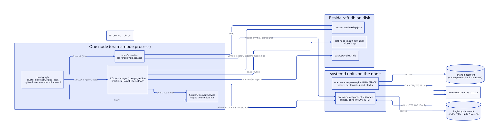
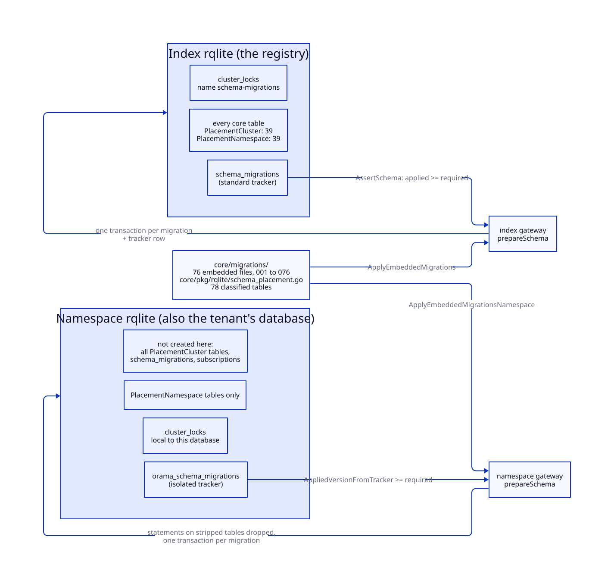
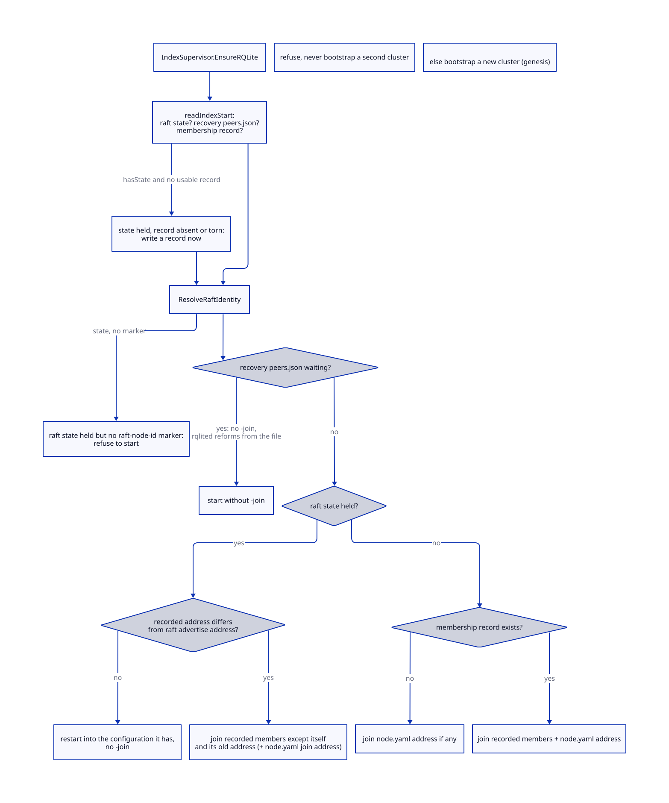
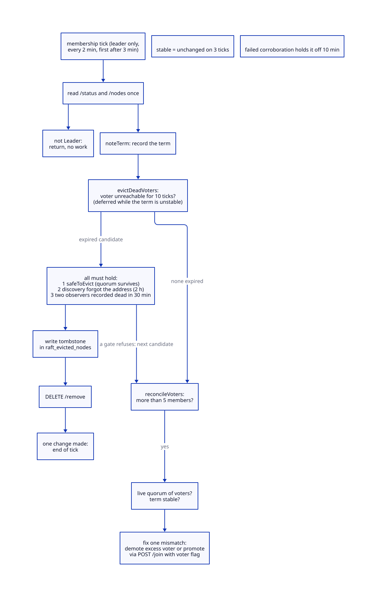
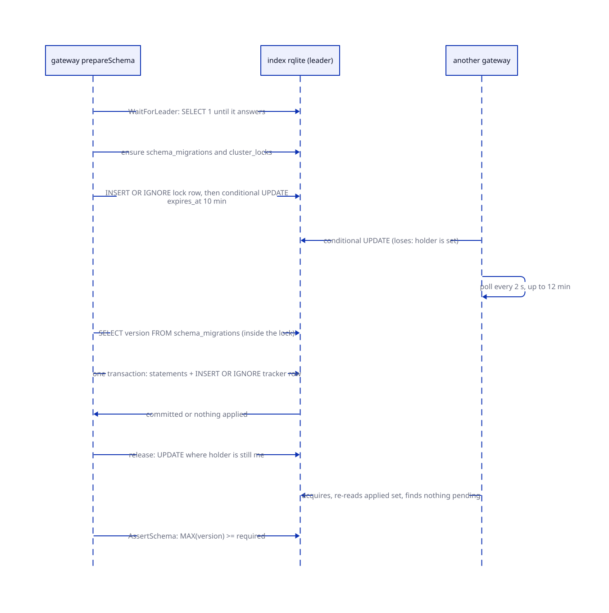
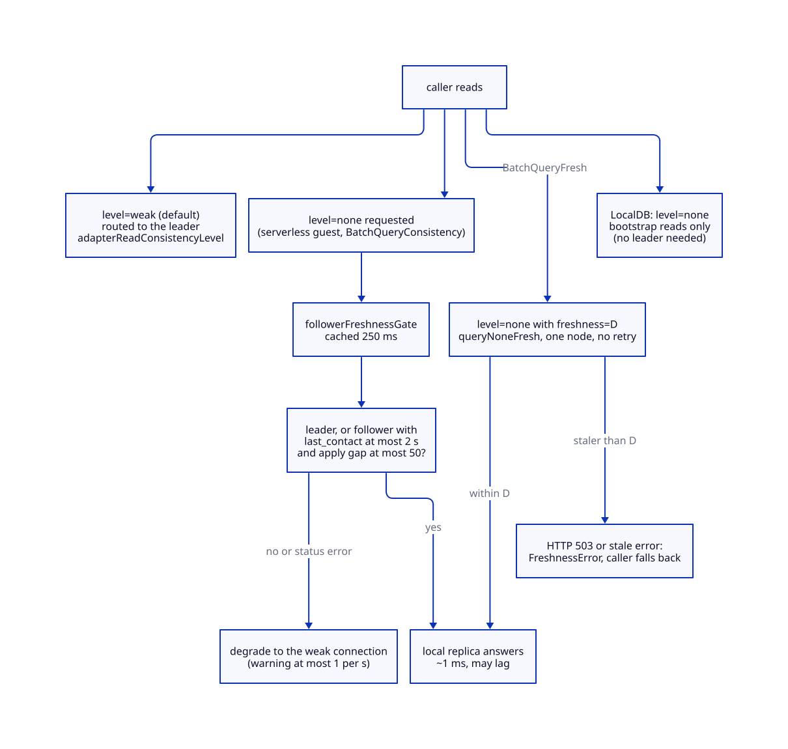
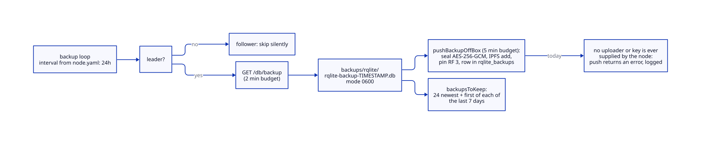

# Cluster state

> **At a glance.**
>
> - **What:** The index RQLite is the cluster registry: one Raft group per cluster that holds every node, namespace, key, DNS record and deployment row. The `core/pkg/rqlite` package starts, joins, monitors and repairs it, and `core/migrations` is the one schema every database in the system is built from. Each tenant namespace runs its own rqlited, built from the same schema with the cluster-only tables left out.
> - **Key numbers:** rqlited 10.4.0 (`core/pkg/constants/versions.go`); index HTTP 10100 and Raft 10101 on the WireGuard address only; Raft election 5 s, heartbeat 2 s, apply 30 s, leader lease 2 s; at most 5 voters (`MaxDefaultVoters`); membership tick every 2 min; dead-voter eviction gated on 10 unreachable ticks, discovery forgetting the peer (2 h) and two fresh `dead` observations (30 min), gates that cannot all hold for a node that stays dead (Known gaps); 76 embedded migrations, 78 classified tables; migration lock TTL 10 min; `none` reads trusted only within 2 s of leader contact and 50 entries of apply gap.
> - **Code:** `core/pkg/rqlite/`, `core/migrations/`, with `core/pkg/namespace/index_bootstrap.go` for the start decision and `core/pkg/node/rqlite.go` for the wiring.
> - **Depends on:** [the node as a supervisor](04-the-node-as-a-supervisor.md), [the WireGuard mesh](06-the-wireguard-mesh.md). Chapters [8](08-membership-and-failure-detection.md) and [9](09-namespaces.md) build on this one.



## Why it exists

Everything that is true of the whole cluster has to live somewhere that every node agrees on: which nodes exist, which namespaces they host, which API keys are valid, which DNS records to serve. Orama keeps that in one SQLite database replicated by Raft, using rqlite. The registry is not an optimisation. A gateway that cannot reach it cannot authenticate a key, and a node that cannot reach it cannot learn who its WireGuard peers are.

Four constraints shape the design.

1. **Raft runs over the thing the registry configures.** The mesh membership (`wireguard_peers`) is stored in the registry, and the registry's Raft traffic crosses the mesh. A node that has lost its WireGuard peers cannot reach any voter, so the repair that would restore them cannot be conditional on a quorum. The start-up is split in two halves, local and cluster, so that the local replica serves and the mesh can be repaired before a leader exists.
2. **Identity must not follow routing.** rqlite names a Raft member by its advertise address unless told otherwise. On a fleet where overlay addresses are reassigned and nodes are replaced, that mints duplicate voters that nothing can reach. The package records the id a node runs under in a file and passes it explicitly.
3. **A lost disk must not look like a new cluster.** rqlited bootstraps when it has no Raft state and no `-join`. The genesis node has neither on a fresh install, and the same is true after it loses its data. A separate record outside the Raft directory tells the two cases apart.
4. **The registry and a tenant's database share one schema.** A namespace's rqlite is also the tenant's own database, which the tenant can export and replace whole. Platform tables must therefore not be created there, and the tenant's own table names must not collide with the platform's.

The platform's Raft timing (`core/pkg/rqlite/raft_timeouts.go:DefaultRaftElectionTimeout`) is sized for an overlay on small VPSes whose CPU the hypervisor can take away for seconds. rqlite's one-second defaults mistook slow heartbeats for dead leaders: on stagenet the namespace clusters, which had started with them, held an election every few seconds.

## The model

### Vocabulary

| Term | Meaning |
| --- | --- |
| Index rqlite | The rqlited run by the systemd unit `orama-namespace-rqlite@index`, on every node. Its Raft group is the registry. |
| Namespace rqlite | A rqlited run by `orama-namespace-rqlite@NAMESPACE` on three nodes per tenant. It is the tenant's database. |
| Voter, non-voter | A voter counts toward quorum. The index has at most `MaxDefaultVoters` (5) voters; further nodes join as read replicas. |
| Raft id | The name a member has in the Raft configuration. Either a libp2p peer id (stable) or the Raft advertise address (legacy). |
| Raft address | `ip:port` where the member listens, always on the WireGuard overlay. Routing data, not identity. |
| Membership record | `cluster-membership.json`, written beside the rqlite directory. Evidence that this node has been a member, plus the member addresses last seen. |
| Markers | `raft-node-id`, `raft-adv-addr`, `raft-suffrage`, written inside the rqlite directory next to `raft.db`. |
| Tombstone | A row in `raft_evicted_nodes` saying a member was removed on purpose. |
| Placement | For every table, whether it exists only in the registry (`PlacementCluster`) or also in a namespace database (`PlacementNamespace`). |
| Trust | For every table, whether the platform acts on its rows (`TrustPlatform`), the rows are the tenant's (`TrustTenantData`), or they are only a record (`TrustTelemetry`). |
| Local half, cluster half | `RQLiteManager.StartLocal` (no quorum needed) and `RQLiteManager.JoinCluster` (needs a leader). |

### Components

`core/pkg/rqlite/rqlite.go:RQLiteManager` is the object a node owns. It does not run rqlited. The unit `orama-namespace-rqlite@index` does, and the manager talks to it over HTTP. Four components cooperate:

- **`IndexSupervisor.EnsureRQLite`** (`core/pkg/namespace/index.go`) decides how rqlited starts (bootstrap, join, rejoin, recovery), writes the unit's environment file and starts the unit. It is covered in [namespaces](09-namespaces.md); this chapter documents the decision because it is the cluster-state decision.
- **`RQLiteManager`** connects to the running rqlited, waits for Raft, applies migrations, and starts the four background loops (split-brain health, voter reconciliation, orphan recovery, backup).
- **`ClusterDiscoveryService`** (`core/pkg/rqlite/cluster_discovery.go`) keeps a table of peers learned over libp2p, with their Raft address, log index and lifecycle state. Every 30 s it rebuilds the table from the metadata each connected peer announced (peerstore key `rqlite_metadata`), writes `discovery-peers.json`, and every 5 minutes drops peers not seen for 2 h. It also serves the ring monitor's lifecycle lookups and the node's cluster metrics (`GetMetrics`).
- **`AdminClient`** (`core/pkg/rqlite/adminclient.go`) is the one HTTP client for rqlite's admin surface: `/status`, `/nodes`, `/join`, `/remove`, `/db/backup`, `/leader`, `/readyz`. Every call carries Basic-auth credentials.

The node's boot graph (`core/pkg/node/components.go:bootComponents`) orders them: `cluster-discovery` depends on `libp2p`; `rqlite-local` depends on `wireguard`, `cluster-discovery` and `storage`; `rqlite-cluster` depends on `rqlite-local`; `membership-record` and `membership` depend on `rqlite-cluster`. Health checks are separate per tier: `rqlite-local` is healthy if the local rqlited answers `/status` within 3 s (`LocalHealthy`), `rqlite-cluster` is healthy if a `SELECT 1` routed to the leader returns within 10 s (`LeaderReachable`). A quorum outage degrades the cluster tier and its dependents and leaves the local tier serving.

### One schema, two placements

The migrations in `core/migrations/` are embedded in the binary (`core/migrations/embed.go:FS`). There are 76, numbered `001_initial.sql` to `076_tls_store.sql`. They are applied to two kinds of database:

- the **registry** (the index rqlite): all of them, tracked in `schema_migrations`;
- every **namespace rqlite**: the same files, with any statement that targets a cluster-only table dropped before execution, tracked in `orama_schema_migrations`.

`core/pkg/rqlite/schema_placement.go:tablePlacement` classifies all 78 tables the migrations leave behind: 39 are `PlacementCluster`, 39 are `PlacementNamespace`. By trust, 65 are `TrustPlatform`, 10 `TrustTenantData`, 3 `TrustTelemetry`. Each entry carries a one-line reason. The classification is enforced by tests: `TestEveryCoreTableIsPlaced` fails when a migration creates a table with no entry, and `TestEveryPlacementNamesARealTable` fails when an entry names a table no migration creates (`core/pkg/rqlite/schema_placement_test.go`).



The rule for putting a table in `PlacementCluster` is evidence-based: it moves there only if the code that reads and writes it demonstrably uses the registry handle (the auth service's registry ORM, the global ORM client in a handler) or runs only on the index. A table a namespace gateway reads on its own handle stays in `PlacementNamespace` even if it is cluster state in spirit, because stripping it would turn an empty answer into "no such table". As a result `wireguard_peers`, `dns_records`, `dns_nodes`, `invite_tokens`, `namespace_clusters`, `namespace_cluster_nodes` and `namespace_port_allocations` exist in every namespace database. The namespace copies of these are not authoritative. The index registry is, and a namespace gateway reads the cluster tables through its separate registry handle (`GlobalRQLiteDSN`).

Placement says where a table lives; trust says what a row is worth. Tenant SQL is refused by name for platform tables by `core/pkg/sqlguard`, and a test holds the two lists together.

## How it works

### Raft timing and the unit

Every rqlited the platform runs gets the same four Raft flags:

| Flag | Value | Source |
| --- | --- | --- |
| `-raft-election-timeout` | 5 s | `DefaultRaftElectionTimeout` |
| `-raft-heartbeat-timeout` | 2 s | `DefaultRaftHeartbeatTimeout` |
| `-raft-apply-timeout` | 30 s | `DefaultRaftApplyTimeout` |
| `-raft-leader-lease-timeout` | 2 s | `DefaultRaftLeaderLeaseTimeout` |

(`core/pkg/rqlite/raft_timeouts.go`.) The index takes overrides from `database.raft_*` in `node.yaml` (`core/pkg/node/rqlite.go:indexRQLiteExtraArgs`); `WithDefaultRaftTimeouts` appends any flag the caller did not set, so a tenant instance, which sets none, runs the platform defaults. The flags carry hashicorp/raft semantics: a follower that hears nothing from the leader for the heartbeat timeout (randomised between 1x and 2x, so 2 to 4 s) campaigns; a candidate that wins no majority retries after the election timeout (5 to 10 s); a leader that cannot reach a quorum for the leader lease steps down. The library requires election at least heartbeat at least lease; nothing in this repository checks that before rqlited refuses to start.

The unit (`core/systemd/orama-namespace-rqlite@.service`) runs `rqlited` with `-http-addr`, `-raft-addr`, `-http-adv-addr`, `-raft-adv-addr`, then `EXTRA_ARGS`, `JOIN_ARGS` and the data directory, all from `/var/lib/orama-unit-env/%i/rqlite.env`. Relevant properties: `After=` and `Wants=` the WireGuard unit and `PartOf=orama-node.service`; `TZ=UTC` (rqlited rewrites `datetime('now')` into a literal in its own zone before SQLite sees it, and the schema compares against UTC), `Restart=always` with `RestartSec=5s` and no start limit (`StartLimitIntervalSec=0`, so a transient failure never needs `reset-failed`), `TimeoutStopSec=60s`, `MemoryMax=2G`, `MemorySwapMax=0`, and `InaccessiblePaths=/opt/orama/.orama/secrets`, which is why the auth file is copied into the data directory.

rqlited binds only the WireGuard address. `core/pkg/rqlite/bind.go:BindAddr` takes the host of the advertise address and refuses an empty or wildcard host, so there is no loopback listener and no way to reach rqlited from outside the overlay. Raft is cleartext inside WireGuard: the `node_cert`, `node_key` and `node_no_verify` keys exist in `node.yaml` but no code passes them to rqlited (`core/pkg/config/database_config.go`).

### Raft identity

`core/pkg/rqlite/identity.go:ResolveRaftIdentity` decides which id a node starts rqlited with and returns it to `EnsureRQLite`, which appends `-node-id`. The id is recorded in `raft-node-id` beside `raft.db` and passed on every start; it never follows the address.

| Marker present | Raft state present | Result |
| --- | --- | --- |
| yes | any | The recorded id is authoritative. |
| no | no | A fresh node. If it has a libp2p peer id, that id is recorded and used. With no peer id, rqlite's default (the advertise address) applies. |
| no | yes | Refused with an error naming both ways forward. The id is the address the node last ran under, and nothing on the node says what that was. |

The refusal exists because the upgrade is supposed to capture the id from the running rqlited before it stops anything (`core/cmd/orama/internal/production/upgrade/raft_identity.go`), reading `/status` through `LiveIdentityFromStatus`. That function takes the node's own address from `store.nodes`, not from its flags, and fails if the node is not a member of its own configuration. A node that predates stable ids keeps the address id it is registered under; the move to peer ids is a deliberate, serial, quorum-checked operation (`orama maint node migrate-raft-id`, `core/cmd/orama/internal/production/raftid/migrate.go`), because rqlite cannot rename a member in place.

Two further markers make an address change survivable:

- `raft-adv-addr` records the address the configuration last held this node at. `RecordClusterMembership` rewrites it only after `/status` shows the node at that address. A recorded address that differs from the current advertise address means the leader still routes to the old address, so `EnsureRQLite` passes `-join` to the other members and the leader re-registers the node (`RaftIdentity.AddressChanged`).
- `raft-suffrage` records `Voter` or `Nonvoter`. A rejoining non-voter gets `-raft-non-voter`, otherwise the join would grow the voter set behind the reconciler's back.

All markers are written with `durablefile.Write` (atomic, fsynced), because a torn id reads as an id nothing is registered under. Raft ids are validated as a libp2p peer id (base58, 16 to 128 characters) or a Raft address (`ValidateRaftID`), since they end up in markers, `peers.json` files and a unit environment file.

### The start decision

`core/pkg/namespace/index_bootstrap.go` implements the rule that stops a second genesis. It gathers three facts (`readIndexStart`):

1. Does the data directory hold Raft state? `rqlite.NodeHasRaftState` asks `HasRaftState` first. Raft state means at least one completed snapshot (in `wsnapshots/` for rqlite v10, `rsnapshots/` for v8, a directory with `meta.json`, not `*.tmp`) or at least one entry in the `logs` bucket of `raft.db` (opened read-only through bbolt with a 1 s lock timeout). The existence of `raft.db` is not state, because rqlited creates it before it joins and a refused join leaves an empty one. If rqlited holds `raft.db` locked, the code asks the running node: `last_log_index` or `last_snapshot_index` above zero.
2. Is there a recovery `raft/peers.json` waiting (`HasRecoveryPeers`)?
3. Is there a membership record, and does it parse?

A node found with Raft state and no record is recorded as a member on the spot, so the evidence exists before it can be lost. A record that does not parse on a node that still holds state is replaced, because the state proves membership.



`indexJoinTargets` then returns the `-join` list or an error:

| Situation | Outcome |
| --- | --- |
| Recovery `peers.json` pending | No `-join`; rqlited reforms from the file. A join would contradict it. |
| Raft state, address unchanged | No `-join`. Every restart would otherwise depend on one address answering. |
| Raft state, recorded address differs from advertise address | Join every recorded member except the old address, then the `node.yaml` join address. With no target, refuse. |
| No state, no record, join address set | Join that address. |
| No state, no record, no join address | Bootstrap a new cluster. This is a fresh genesis install, the only path that elects a leader of an empty registry. |
| No state, record exists | The node lost its data. Join the recorded members and the join address. With none, refuse with `lostDataWithNoPeersError`; the operator either reforms the cluster with `orama maint node recover-raft` or deletes the record to bootstrap deliberately. |

The membership record is a small JSON file (`core/pkg/rqlite/membership_record.go:ClusterMembership`): `first_seen` and a sorted list of member Raft addresses. It lives in the parent of the rqlite directory (`~/.orama/data/cluster-membership.json` for the index) so that wiping the Raft state does not take the evidence with it. Other signals were considered and rejected in the code's design comment: the join address is empty on exactly the node being guarded; enrolment rows live in rqlite and are lost with it; WireGuard peers are in root's `/etc/wireguard`; libp2p peers carry public, not overlay, addresses. `MergeMembership` validates every address, refuses an empty set and keeps the first-seen time. A namespace rqlite uses the same record type and the same rules (`core/pkg/namespace/raft_restore.go:restoreJoinPlan`): a namespace node with a record and no state joins and never bootstraps, and a namespace with no record elects its lowest node id as the bootstrapper.

For a tenant instance the spawn path adds two checks on top (`core/pkg/namespace/systemd_spawner.go:SpawnRQLite`). A `FreshStart` first start of a brand-new cluster clears any Raft directory left by an earlier namespace of the same name, and refuses if the unit is already active. A `JoinVerifyURL` makes the spawner read `/status` of the join target over a WireGuard-only HTTP request and refuse unless the data directory it reports sits under this namespace's path, so a port collision cannot make a node join a foreign Raft group.

### Local half and cluster half

`StartLocal` (`core/pkg/rqlite/rqlite.go`) does what needs no quorum, in order:

1. Create the data directory.
2. If cluster discovery is attached, wait up to `minClusterSizeWait` (2 min, polling every 2 s) until `min_cluster_size - 1` remote peers are discovered and `discovery-peers.json` lists them. Past the deadline it continues: a node that is up and retrying is more useful than one blocked in start-up. A genesis node with `min_cluster_size` of 1 skips the wait.
3. Run `checkNeedsClusterRecovery`, which is true only when a `raft/peers.json` exists that names an address (other than this node's) that discovery cannot see while discovery knows others. If so, `performPreStartClusterDiscovery` waits up to 45 s for discovery to report `min_cluster_size` peers, does nothing if it saw only itself, and otherwise, when this node's log index is known to be zero and a peer's is above zero, runs `clearRaftState` and `ForceWritePeersJSON` (described below). It runs after `EnsureRQLite` has already started the unit (Known gaps).
4. Call the `onProcessStarted` hook, which the node sets to `bootstrapWireGuardMesh`. This is the only window in which transport can be repaired before anything waits for a leader.
5. Open the local gorqlite connection (`connect`): up to 10 attempts, 1 s growing by 1.5 to a 5 s cap, retrying only on "store is not open". The connection uses `disableClusterDiscovery=true` because `/nodes` probes every member and stalls on a dead one. Once open, `validateNodeID` reads `/nodes` and logs an error if the configuration lists a member at this node's address under an id other than the one the node runs as (`ErrNodeIDMismatch`); it does not stop the start.

`JoinCluster` needs the cluster. It returns an error whenever the node is not in a working quorum, and the boot supervisor retries. In order: `WaitForRaftReady` (up to 30 s; ready means `store.raft.state` is `Leader` or `Follower`, not that the port answers), a leader-routed `SELECT 1` (30 s), the background loops started once, `ApplyEmbeddedMigrations` (errors logged, not fatal here), `clearTombstone`, and a warning if the schema is below the binary's required version. The gateway's own `prepareSchema` is the authoritative gate for schema.

### Voters and membership changes

The voter set is deterministic. `computeVoterSet` sorts all known Raft addresses by numeric IP (not lexicographic; `10.0.0.10` must sort after `10.0.0.2`) and takes the first `MaxDefaultVoters` = 5 (`core/pkg/rqlite/cluster_discovery_membership.go`). Every node computes the same set from the same peer list. With five or fewer known peers all are voters; non-voter demotion starts only when a sixth appears.

Membership changes are made only by the leader, one per tick, in `runMembershipTick` (`core/pkg/rqlite/voter_reconciliation.go`). The tick runs every 2 minutes after a 3-minute settle delay. It reads `/status` and `/nodes?nonvoters&ver=2&timeout=5s` once and hands the same snapshot to both passes.



**Term stability.** `noteTerm` counts consecutive ticks with an unchanged Raft term and allows a change only after 3 (`termsBeforeMembershipChange`). A configuration change issued during an election can be lost or applied against a configuration that is already gone, and two microsecond-apart reads of the same term prove nothing; across 2-minute ticks they do.

**Voter correction** (`reconcileVoters`). If the cluster has more than five members, the voter set is compared with the desired set and one mismatch is fixed. A promotion or demotion is `POST /join` with the `voter` flag on the existing member: one committed entry, no window outside the configuration. An earlier remove-then-rejoin sequence left the node out of the configuration for up to 59 s, and a leader change in that window orphaned it. Preconditions: a live quorum of voters (`reachable >= total/2 + 1`, not every member) and a stable term. If the leader is not in the desired set, the whole pass is skipped, so the leader is never demoted. The desired set is computed over raft addresses, never ids, so that this pass, orphan recovery and discovery agree on who is a voter once ids stop being addresses. `setVoterInPlace` refuses to demote an unreachable member (that is an eviction) or a demotion after which the reachable voters fall below the new quorum. A failed change puts the member on a 10-minute cooldown (`voterChangeCooldown`).

**Dead-voter eviction** (`core/pkg/rqlite/eviction.go:evictDeadVoters`). Without it a VPS deleted without ceremony stayed a voter for ever; with three voters the second such event is permanent quorum loss. Four independent signals must agree, because each alone has a failure mode where a healthy node looks dead. The evidence is read only when the term is stable and the candidate is not on cooldown:

1. Raft reports the member as an unreachable voter.
2. This leader saw it unreachable on `deadVoterTicks` = 10 consecutive ticks (about 20 minutes, longer than a reboot, an upgrade step or a WireGuard reconnect). The streak is in memory: a leader change or a restart of the leader's process starts it again. Non-voters are never evicted.
3. Discovery no longer knows its Raft address (`knowsRaftAddress`). Discovery keeps a peer for `defaultInactivityLimit` = 2 h after it was last connected over libp2p and sweeps every 5 minutes, so for a node that is gone this is the slowest signal. A node whose libp2p link is up but whose rqlited is down stays known, which is the point of the gate.
4. At least `deadVoterConfirmations` = 2 distinct observers recorded `dead` for it in `node_health_events` within the last 30 minutes with no later `recovered` (`confirmedDeadByPeers`). The raft address is mapped to a libp2p peer id through `dns_nodes.internal_ip`, because the health table is keyed by peer id; a missing row or a failed corroboration puts the candidate on cooldown. The ring monitor ([chapter 8](08-membership-and-failure-detection.md)) writes one `dead` row per observer per outage.

Then `safeToEvict` checks the arithmetic. It refuses a reachable target ("a live member is demoted, not evicted") and otherwise `quorumSurvivesRemoval` requires the reachable voters among the remaining ones to meet `votersAfter/2 + 1`. It also refuses removing the last voter or a non-voter. `SafeToRemoveMember` exposes the same arithmetic without the reachability veto, for planned removals; the CLI's `orama node remove` and the raft-id migration call it, so there is one implementation of the quorum check (`core/cmd/orama/internal/production/clusterops/clusterops.go`).

The tombstone is written before the removal, keyed by the Raft id as `/nodes` lists it. If the removal succeeded and the tombstone failed, orphan recovery would re-add the node within five minutes. The other order merely leaves an inert tombstone for a node still in the configuration. A failed attempt puts the candidate on a 10-minute cooldown (`evictionCooldown`). Eviction removes the member from the configuration only; it deletes nothing on the evicted machine.

**Orphan recovery** (`recoverOrphanedNodes`) runs on the leader every 5 minutes after a 5-minute settle delay. A discovery peer absent from the Raft configuration is re-added through `POST /join` as voter or non-voter according to `computeVoterSet`, unless a tombstone younger than 24 hours (`tombstoneTTL`) names it. The TTL has to expire because the node named by a tombstone is outside the configuration, has no leader, and cannot clear its own row. If the tombstones cannot be read, the loop does nothing: re-adding a deliberately removed node is the costlier mistake. A node is matched against the configuration under either its id or its address, so a node mid-migration is not added a second time under its other name. The tombstone lookup uses the id the peer announced and its address, and the query returns only `node_id` (Known gaps).

**Leadership transfer.** Before the leader stops (`RQLiteManager.Stop` and the pre-upgrade step), `TransferLeadership` picks any reachable voter other than itself and sends `POST /leader` with the target id, then polls `/status` until this node is no longer leader (15 s). It returns nil only once the node has actually stepped down. With no eligible target it returns `ErrNoTransferTarget`. The pre-upgrade step (`core/cmd/orama/internal/production/lifecycle/pre_upgrade.go`) treats any error as a refusal to stop the node and then waits for another node to report `Leader`; `RQLiteManager.Stop` only logs it and relies on SIGTERM. A 404 means the rqlite build has no step-down and the caller falls back to SIGTERM. `Stop` runs once (`sync.Once`) so the transfer is not repeated past `TimeoutStopSec`.

### Recovery and split-brain paths

Two loops guard against a node that bootstrapped alone or lost its log.

`startHealthMonitoring` waits 30 s, then every 60 s calls `isInSplitBrainState`: this node is a `Follower` at term 0 with zero peers and not a voter, and every reachable discovery peer reports the same. If so, `recoverFromSplitBrain` compares log indexes. Only when its own index is **known** to be zero and some peer's is above zero does it act: `clearRaftState` moves `raft.db`, the snapshot directories, `raft/` and `discovery-peers.json` into `raft.discarded-TIMESTAMP` (a move, not a delete), `ForceWritePeersJSON` writes a recovery `raft/peers.json`, and `recoverCluster` hands leadership over, waits two seconds and restarts the unit through the privilege helper. `getRaftLogIndex` returns a `known` flag precisely so that an unreadable `meta.json` or an I/O error is never read as an empty node (`core/pkg/rqlite/data_safety.go`).

Discovery writes `discovery-peers.json` to `<data>/rqlite/` every 30 s tick when membership changes. It never writes `raft/peers.json` in the normal course, because rqlite treats a `peers.json` in the Raft directory as a command to reset the configuration. Only `writeRecoveryPeersJSON` writes there, after `RemoveRecoveryLeftovers` deletes the `recovery.db*` and `restore-wal-*.tmp` files an earlier recovery leaves behind (a leftover `recovery.db-wal` makes the next recovery fail permanently, and the unit crash-loops). The `non_voter` field of each entry comes from `computeVoterSet`.

The operator's tool for a lost quorum is `orama maint node recover-raft`: keep one node's data (the highest applied index, or `--leader`), reset it to a single-member cluster preserving its log and term, delete every other node's Raft state, write the kept node into their membership records, and start them one at a time to pull a snapshot. It is destructive and does not back anything up (`core/cmd/orama/internal/production/recover/recover.go`).

### Migrations

Three runners exist in `core/pkg/rqlite/migrations.go`: `ApplyMigrations` (a directory), `ApplyMigrationsDirs` (several, with duplicate-version detection) and `ApplyEmbeddedMigrations` (the embedded FS). Only the embedded runner has callers outside tests: `JoinCluster`, the index gateway's `prepareSchema` and `orama maint node schema apply`. All share one algorithm, so every gateway start and every node start can apply migrations; the lock decides who does.



1. Ensure `schema_migrations(version, applied_at)` exists.
2. Take the cluster-wide lock `schema-migrations` (TTL 10 min, wait up to 12 min). The holder is the host name, so the node process and the gateway on one machine present the same identity; nothing renews the TTL, so a migration that outlasts it runs unprotected.
3. **Re-read the applied set inside the lock.** A snapshot taken before the lock let N gateways starting together each run the whole pending list. DDL survives that (`IF NOT EXISTS`), DML does not: migration 019 revokes every refresh token with no `revoked_at`, so a second node reaching it a minute later logged out everyone who signed in in between.
4. For each pending migration, split the file into statements (respecting quotes and comments), drop explicit `BEGIN`/`COMMIT`/`ROLLBACK`/`END`, and send the statements plus the tracker row `INSERT OR IGNORE INTO schema_migrations(version) VALUES (?)` as **one** transaction.

One request means no half-applied state. Against rqlite the transaction is a single `/db/execute?transaction` request through the native gorqlite connection (`core/pkg/rqlite/migration_tx.go:writeNativeTransaction`), because the gorqlite `database/sql` driver's `Begin`, `Commit` and `Rollback` are no-ops. If a statement fails with "duplicate column name" or "already exists", the statement is dropped and the transaction re-sent, a bounded loop that only fires on a database a pre-atomic engine left half-migrated. Any other error aborts at that migration and leaves no trace. Migrations are expand-only where a rolling upgrade overlaps: for example migration 051 adds columns and an `api_keys_expiry_cutoff` so old-binary inserts keep working.

**Cluster lock** (`core/pkg/rqlite/clusterlock.go`). rqlite serialises every write through Raft, so a conditional `UPDATE` is a linearizable compare-and-swap. `tryAcquireClusterLock` issues `INSERT OR IGNORE` of an empty row, then `UPDATE ... WHERE name = ? AND (holder = '' OR expires_at IS NULL OR expires_at < CURRENT_TIMESTAMP)` and reads `RowsAffected`; if that cannot be read it reports an error rather than success. The loser polls every 2 s. `Release` is conditional on the holder, so a lock whose TTL expired and was taken by another node is not freed from under it. The TTL is a liveness property: a holder that dies mid-migration frees the lock on its own. Expiry times come from `datetime('now', '+N seconds')`; the code builds that modifier by hand because `Duration.String()` yields `1m0s`, which SQLite turns into NULL, making a lock that never expires.

**Namespace path** (`core/pkg/rqlite/namespace_migrations.go:ApplyEmbeddedMigrationsNamespace`). A namespace rqlite is the tenant's own database, so the tracker is `orama_schema_migrations`, not `schema_migrations`, which near every migrator uses for itself. Sharing the name caused two failures: a shape collision (`version, name, applied_at` against `version, applied_at`) and a version-number collision. The runner seeds the new tracker from a legacy core-shaped `schema_migrations`, applies migrations with every statement that targets a cluster-only table, `schema_migrations` or `subscriptions` removed (`stmtTargetsStrippedTable`, a regex over `into`, `table`, `on`, `update`, `from`, `join` and `rename to` targets), then drops core's leftovers if and only if they have core's exact shape: a core-shaped `schema_migrations` or an empty core-shaped `subscriptions`, and any empty cluster-only table. A table with rows is left and named in a warning. The shape check is an exact column-set match, so a tenant tracker with the columns `version, checksum` is never touched.

**Schema contract.** `core/migrations/contract.go:AssertSchema` reads `MAX(version)` from `schema_migrations` and returns `SchemaMismatchError` if it is below the highest embedded migration (`RequiredVersion`). A newer database than the binary is accepted: that is the normal rolling-upgrade window. The gateway's `prepareSchema` treats a mismatch as permanent: it stops retrying, reports readiness `blocked` and refuses requests. A failure to read the table, or an apply that fails because the leader went away, is retried with backoff. The namespace gateway runs the same check against the isolated tracker through `AppliedVersionFromTracker`.

### Access: endpoints, credentials, consistency

**Credentials.** rqlited always runs with `-auth`. `core/pkg/install/config.go:EnsureRQLiteAuth` generates one cluster-wide user `orama` with a 32-byte random password (64 hex characters) and perms `["all"]`, written to `secrets/rqlite-password` and `secrets/rqlite-auth.json` (mode 0600). `InstallAuthFile` copies the JSON into each instance's data directory at start, since the unit cannot read `secrets/`. `JoinUser` picks the first user with `all` or `join`, passed as `-join-as`; an anonymous join is refused when `-auth` is on. Every instance, index or tenant, uses the same credentials.

**Endpoints.** `core/pkg/rqlite/endpoint.go:Endpoint` is the single description of how to reach one rqlited: host, port, username, password. `Password` is excluded from JSON and YAML, `String` and `GoString` print only the base URL. `NewEndpoint` refuses a wildcard host and missing credentials. `IndexEndpoint` derives the index endpoint from `node.yaml` so the node process, the CLI and the installer cannot disagree. A `node.yaml` with no auth file and no credentials at all is read as a 0.122.x config whose index rqlited ran without `-auth`, and gets an unauthenticated endpoint (`preAuthConfig`); a current config that lost its credentials is refused. `EndpointFromDSN` refuses non-`http` schemes: rqlited is plain HTTP over the overlay, and an `https` DSN would be silently downgraded.

**Admin budgets** (`core/pkg/rqlite/adminclient.go`): 5 s for `/status` and `/nodes`; 30 s for `/join`, `/remove` and `/leader`; 2 min for `/db/backup`. A 401 is named explicitly, since it otherwise reads as "Raft is broken".

**Driver panic guard.** The gorqlite stdlib driver indexes `wra[0]` of an empty result when rqlite cannot serve the request, which panics the process. The cluster lock, eviction, backup and readiness code call rqlite through `SafeExecContext` and `SafeQueryContext` (`core/pkg/rqlite/safe_exec.go`), which turn the panic into an error. The migration runner's `ensureMigrationsTable` calls `db.ExecContext` directly, so a write to a leaderless node there is not guarded.

**Read consistency.** Four modes are in use.

| Level | Used by | Behaviour |
| --- | --- | --- |
| `weak` (default) | The adapter's main pool (`adapterReadConsistencyLevel`), the leader probe, migrations, the gateways | Reads go to the leader; a leaderless node errors instead of serving stale rows. Chosen after bug 235: `none` reads let an `INSERT`, `UPDATE`, `SELECT` sequence in one serverless invocation see the pre-write snapshot. |
| `none` | `RQLiteAdapter.LocalDB` (4 connections max), the WireGuard bootstrap read, serverless `BatchQueryConsistency` | Answered from the local SQLite, about 1 ms, may lag. `LocalDB` exists for one job: reading `wireguard_peers` when no leader exists, because the data needed to repair connectivity is behind connectivity. |
| `none` with `freshness=D` | `BatchQueryFresh` for serverless guests | POSTed to the single local node at `level=none&freshness=D` (`queryNoneFresh`); rqlite rejects the read with 503 if it is staler than D, returned as `FreshnessError`, never retried on a peer. |
| `strong` | Operator and monitoring paths: `recover-raft`, the inspector, `clusterops`, the health report | Linearizable through the leader. |

The **follower freshness gate** (`core/pkg/rqlite/freshness.go`) sits in front of plain `none` reads on the native connection. `LocalFollowerFresh` reads the local `/status`: a leader is always fresh; a follower is fresh only if `last_contact` is at most `StalenessMaxLastContact` (2 s) and `commit_index - applied_index` is at most `StalenessMaxApplyGap` (50). `never`, unparseable or errors count as stale. The verdict is cached 250 ms. A stale verdict makes the read degrade to the weak connection, with a warning limited to one per second. `LastContactValue` decodes `last_contact` whether rqlite sends a duration string (follower) or a number (leader); declaring it as a string once made the leader's `/status` fail to decode and silently disabled local reads where they are always authoritative.



**Atomic batches.** `client.Batch` splits a batch into writes and reads. The writes go as one `/db/execute?transaction` request (at most `MaxBatchOps` = 100 ops); reads run after commit, so a failed read cannot roll back durable writes. Reads are capped at `MaxBatchQueryRowsPerOp` = 10,000 rows per op and `MaxBatchQueryTotalBytes` = 32 MiB per batch. `BatchWithSeq` prepends an upsert of `namespace_publish_seq` so a publish sequence number is assigned atomically with the user's writes. Every failure carries a stable code (`TOO_MANY_STATEMENTS`, `PAYLOAD_TOO_LARGE`, `DEADLINE_EXCEEDED`, `UNAVAILABLE`, `CONSTRAINT_VIOLATION`, `INVALID_ARGUMENT`, `INTERNAL`); a SQLite statement error is classified by type, never by message text, so "no such column: timeout" is not read as a deadline and retried. The HTTP gateway over the ORM client (`gateway.go:HTTPGateway`, mounted at `/v1/db`) caps bodies at 4 MiB (`MaxRequestBodyBytes`) and asks an optional `SQLGuard` about every statement before running it; a refusal is 403 `SQL_NOT_ALLOWED`. Its routes belong to the Database chapter (chapter 17).

The package is not an ORM that the platform builds on in general. The query builder, repository and scanner (`query_builder.go`, `repository.go`, `scanner.go`) are a thin typed layer over `database/sql`; most platform code uses plain SQL through `SafeQueryContext`.

### Backups

`performBackup` (`core/pkg/rqlite/backup.go`) runs on the leader only: it downloads `/db/backup` (a consistent SQLite file) into `backups/rqlite/rqlite-backup-YYYYMMDD-HHMMSS.db` under the node's data directory (directory mode 0700, file mode 0600), then prunes. Retention is `backupsToKeep`: the 24 newest files plus the earliest file of each of the 7 most recent days that have one; names that do not parse are never deleted. At the installed 24 h interval the 24 newest files already span 24 days, so the daily rule adds nothing; it matters only at the 1 h default. The interval is `database.backup_interval`; the installer template writes `24h` (`core/pkg/install/templates/node.yaml`), and the code's own default applies only if the value is zero (1 h). The first backup runs one interval after start.



The off-box path (`backup_offbox.go:pushBackupOffBox`, 5-minute budget `backupPushTimeout`) seals the snapshot with AES-256-GCM (random 12-byte nonce prepended), adds it to IPFS, pins it with a replication factor of 3 (`defaultBackupReplication`), and records `cid`, `sha256`, size and the Raft address of the taker in `rqlite_backups`. The row is written last and its failure fails the operation, because a pinned CID nobody wrote down cannot be found. `OpenBackup` and `VerifyBackup` decrypt and verify. See Known gaps: nothing in the node supplies the uploader or the key.

## State it owns

| State | Holds | Written by | Read by | Where |
| --- | --- | --- | --- | --- |
| `raft.db`, `wsnapshots/` | rqlite's Raft log and snapshots | rqlited | rqlited, `HasRaftState` | `~/.orama/data/rqlite/` (index) |
| `raft-node-id` | The id the node runs under | `ResolveRaftIdentity`, upgrade capture, `migrate-raft-id` | `EnsureRQLite`, `RaftNodeID` | beside `raft.db` |
| `raft-adv-addr` | Address the configuration last held the node at | `RecordClusterMembership`, upgrade capture | `ResolveRaftIdentity` | beside `raft.db` |
| `raft-suffrage` | `Voter` or `Nonvoter` | `RecordClusterMembership` | `ResolveRaftIdentity` | beside `raft.db` |
| `cluster-membership.json` | `first_seen`, member addresses | `readIndexStart`, `RecordClusterMembership`, upgrade capture, `recover-raft` | `indexJoinTargets` | `~/.orama/data/` (parent of the rqlite dir) |
| `discovery-peers.json` | Peer list for recovery | `ClusterDiscoveryService` every 30 s on change | `StartLocal` wait | `~/.orama/data/rqlite/` |
| `raft/peers.json` | Recovery instruction (consumed by rqlited) | `ForceWritePeersJSON`, `recover-raft` | rqlited | `~/.orama/data/rqlite/raft/` |
| `raft.discarded-TIMESTAMP/` | Raft state set aside by `clearRaftState` | split-brain recovery | operators | `~/.orama/data/rqlite/` |
| `rqlite-auth.json` copy | Credentials for `-auth` | `InstallAuthFile` | rqlited | instance data directory, mode 0600 |
| `rqlite.env` | Unit arguments | `SpawnRQLite` | systemd | `/var/lib/orama-unit-env/index/` |
| `backups/rqlite/*.db` | Local snapshots | `performBackup` | operators | node data directory |
| `schema_migrations` | Applied versions (registry) | migration runner | runner, `AssertSchema` | index rqlite |
| `orama_schema_migrations` | Applied versions (namespace) | namespace runner | gateway contract check | each namespace rqlite |
| `cluster_locks` | `name`, `holder`, `acquired_at`, `expires_at` | `AcquireClusterLock` | same | per database; created on demand |
| `raft_evicted_nodes` | Tombstones: node id, address, peer id, reason (`dead-voter`, `decommission`, `operator`), evictor, time | `evictDeadVoters`, `clusterops` | orphan recovery, the membership reconciler | index rqlite (`PlacementCluster`) |
| `rqlite_backups` | CID, SHA-256, size, taker of each off-box backup | `recordBackup` | `LatestBackups` | index rqlite |
| In memory | peer table (`knownPeers`) and its health, `unreachableStreaks`, term stability, cooldowns; each node's announced metadata in the libp2p peerstore (key `rqlite_metadata`) | the manager, discovery | the manager | node process, lost on restart |

Discovery's `peerHealth` entries, and with them the `knownPeers` entries, expire after `defaultInactivityLimit` = 2 h without a connection and are swept every 5 minutes. The `peer_inactivity_limit` and `cluster_sync_interval` keys in `node.yaml` are validated but not read by the discovery service (see Known gaps).

## Lifecycle

**Boot of a fresh genesis node.** No Raft state, no record, no join address. `EnsureRQLite` logs that it is bootstrapping a new cluster and starts the unit with no `-join`. rqlited elects itself. `JoinCluster` applies all 76 migrations. `recordClusterMembership` writes the record with the one address; `raft-node-id` was written at the start decision (the node's libp2p peer id).

**Boot of a joining node.** `node.yaml` carries `rqlite_join_address`. `EnsureRQLite` joins it with `-join-as orama`. `VerifyJoined` (used by the installer) confirms the node's configuration includes the join target, because a failed join that bootstrapped alone is a leader of a cluster of one and passes every other readiness check. The leader demotes the excess voter at a following membership tick (every 2 minutes, once the term has held for three ticks). Until then there are six voters and quorum is four.

**Normal operation.** Every 30 s discovery refreshes its table; every 2 min the leader runs a membership tick; every 5 min the leader checks for orphans; every 60 s each node checks for split-brain; every interval the leader snapshots. The membership recorder is also the health check of its component, so members that join or leave later are recorded.

**Rolling upgrade, mixed versions.** The upgrade captures `raft-node-id`, `raft-adv-addr` and the member list from the running rqlited before stopping anything (`recordRaftIdentity`). The pre-upgrade step checks quorum, transfers leadership away from the leader and waits for another node to report `Leader`. Migrations apply on whichever node first reaches the lock; a database ahead of the binary is accepted by `AssertSchema`, so old gateways keep running while new ones migrate. Migrations that change columns are expand-only for this window.

**Restart.** A member with state restarts into its configuration with no `-join`. A node restarted on a new overlay address rejoins until `raft-adv-addr` is confirmed. `Stop` hands off leadership first.

**Node loss.** A voter stays in the configuration while it is down: the four eviction gates must hold together, and for a node that stays dead they do not (Known gaps), so the operator removes it with `orama node remove`, which applies the same quorum arithmetic. A node that loses its data without being removed rejoins from its record. A cluster that loses quorum cannot elect; `recover-raft` is the way out.

## Failure modes

| Trigger | What the system does | What you observe |
| --- | --- | --- |
| No quorum (majority of voters down) | Writes fail, `weak` reads error, `LeaderReachable` fails. The local tier keeps serving its replica; `rqlite-cluster` and dependents go degraded. No automatic membership change. | Boot supervisor reports `rqlite-cluster` degraded; gateways answer from the local replica where they can; `WaitForLeader` errors name the WireGuard mesh. |
| Leader loss | Followers campaign after 2 to 4 s without a heartbeat; a split vote retries after the 5 to 10 s election timeout. A clean stop transfers leadership first. | A few failed writes with "not leader" during an unclean loss; none on a managed restart. |
| Genesis node loses its data | The record exists, so the node joins its recorded members; with none it refuses to start. | Start error `refusing to bootstrap a new index rqlite cluster` naming the record path and both ways forward. |
| Raft state present, no id marker | `ResolveRaftIdentity` refuses. | Start error `refusing to start the index rqlite`, naming the file to write. |
| Node address changed | Marker differs from the advertise address, so the node rejoins; if no member is known it refuses. | Start error naming the old and new address and `recover-raft --leader-raft-addr`. |
| Corrupt membership record | With state: replaced. Without: refuse. | `ErrCorruptMembershipRecord` text; warning "Replacing a cluster membership record that does not parse". |
| Partition isolating one voter | The reconciler counts it unreachable. Eviction needs 10 ticks, discovery to have dropped the peer (2 h without a libp2p connection) and two fresh `dead` observations, so a partition shorter than 2 hours evicts nothing. | `Dead voters detected but the raft term is not yet stable`, or `not corroborated dead by peers`. |
| Voter machine deleted | It stays a voter and counts toward quorum; the four gates cannot all hold for it (Known gaps). The operator removes it with `orama node remove`. | `/nodes` lists it unreachable, for ever; `Unreachable voter is not corroborated dead by peers; not evicting` once discovery has dropped it. |
| Leader partitioned from one peer only | Peers keep recording that peer healthy, so the corroboration gate is not met. | `Unreachable voter is not corroborated dead by peers; not evicting`. |
| Evicted node returns | It is outside the configuration with no leader. On a node whose id is its address, orphan recovery skips it until the tombstone is 24 h old, then re-adds it. On a node on a peer-id, the tombstone does not match what discovery announces and orphan recovery re-adds it within 5 minutes (Known gaps). | The node stays in Candidate or Follower with no leader until it is re-added. |
| Disk full on a node | rqlited fails writes or crashes; systemd restarts it every 5 s without limit. Local backups fail with "write backup data". | Crash loop in the unit's journal; `Failed to download RQLite backup`. |
| Clock skew between nodes | Lock expiry and tombstone age are computed from the leader's `datetime('now')`; a leader change between skewed clocks shifts them. Raft itself does not use wall clocks. | Locks expiring early or late; tombstones expiring early or late. |
| Slow peer | A follower that hears nothing for 2 s to 4 s campaigns; a leader that cannot reach a quorum for 2 s (the lease) steps down. A follower more than 2 s behind has `none` reads degraded to `weak`. | `none-read auto-degraded to weak` warning, at most one per second. |
| Bad SQL or oversized batch | A statement error aborts the transaction; over 100 ops returns `TOO_MANY_STATEMENTS`; a body over 4 MiB returns 413. | Typed code in the result. |
| Driver panic on an unavailable leader | Converted to an error by `SafeExecContext`. | `gorqlite panic (ExecContext)` in the error text instead of a crashed gateway. |
| Migration holder dies | The lock expires after 10 min; the next runner re-reads the applied set and continues. | Waiters log "Waiting for the cluster-wide migration lock" up to 12 min, then fail with the holder's name. |
| Tenant node joins the wrong cluster | `verifyJoinTarget` compares the target's reported data directory to the namespace path. | Spawn error naming the namespace. |
| Leftover `recovery.db-wal` | Removed before a recovery `peers.json` is written. | Warning "Removed leftovers of an earlier rqlite recovery". |

## Trust and security

**Trust boundaries.** rqlited listens only on the WireGuard address; its HTTP and Raft ports are not on the public interface. Raft is cleartext inside the tunnel. Anything that can send packets on the overlay can reach the HTTP port of every rqlited on the node's mesh.

**Authentication.** Every HTTP call needs Basic auth. There is exactly one credential, the user `orama` with perms `all`, shared by the index and by every tenant rqlited in the cluster. There are no per-namespace users, no read-only user and no rotation mechanism in this package: `EnsureRQLiteAuth` reuses an existing password and always rewrites the JSON to match it. The consequence is that the credential is registry-equivalent: whoever holds it can read and write the registry, and any namespace's database, from anywhere on the overlay. The credential lives in `secrets/` (0700 directory, 0600 files, chowned to `orama` by `ensureSecretFilePermissions`), reaches the unit only through a copy in the data directory, and appears in gateway YAML for every gateway. `Endpoint` never prints it; `RedactDSN` and `RedactError` strip it from errors, because gorqlite echoes the DSN in its errors. The DSN builder interpolates the password without URL escaping, which is safe for generated 64-hex passwords and not for a hand-set one containing `@` or `%`.

**Positions.**

| Attacker | Can | Cannot |
| --- | --- | --- |
| Public internet | Nothing at this layer. | Reach 10100 or 10101. |
| Another tenant's function | Run SQL against its own namespace rqlite. Platform tables are absent there (`PlacementCluster`) or refused by name (`sqlguard`). | Read the registry through its own database; the registry credential is not given to guests. |
| A tenant that can export and replace its database | Replace platform-trust tables in its own namespace copy. | Affect the registry; the namespace copies of `TrustPlatform` tables that remain in `PlacementNamespace` (for example `wireguard_peers`, `dns_nodes`) are not authoritative. |
| A compromised node or namespace gateway | Use the shared credential against the registry and all rqlites it can route to. | Nothing here limits this beyond overlay reachability. |
| A host on the overlay with no credential | See that rqlited exists. | Query it: unauthenticated requests are refused. |
| A local user other than `orama` and root | Nothing: `secrets/` is owned by `orama` (directory 0700, files 0600). | Read the password. |
| Any process running as `orama` | Read `secrets/rqlite-password` and the copy in the data directory. `orama-node`, the gateways and every rqlited run as this account; `InaccessiblePaths` hides `secrets/` from rqlited only. | Nothing here separates the daemons from one another. |

**Backups.** A registry snapshot contains every API key hash, DNS record and operator row. Local snapshots are mode 0600 in a 0700 directory and are not encrypted. The off-box path refuses to push without a key (`refusing to push an unencrypted registry snapshot off-box`).

**Integrity of membership.** The tombstone and membership record protect against self-inflicted splits, not against an attacker: both are plain rows or files that root or the registry credential can rewrite. `JoinVerifyURL` accepts only an `http://` address inside the WireGuard range, because the shared credential is sent to it.

## Limits and scale

| Quantity | Value | Source |
| --- | --- | --- |
| Voters in the index | 5 | `MaxDefaultVoters` |
| Statements per atomic batch | 100 | `MaxBatchOps` |
| Rows per query op | 10,000 | `MaxBatchQueryRowsPerOp` |
| Result bytes per batch | 32 MiB | `MaxBatchQueryTotalBytes` |
| Request body (ORM routes) | 4 MiB | `MaxRequestBodyBytes` |
| Pool (main adapter) | 100 open, 10 idle, 30 s lifetime | `NewRQLiteAdapter` |
| Migration lock | TTL 10 min, wait 12 min, poll 2 s | `migrationLockTTL`, `migrationLockWait`, `lockPollInterval` |
| Dead-voter eviction | 10 ticks, 2 observers, 30 min window, 2 h discovery expiry | `deadVoterTicks`, `deadVoterConfirmations`, `deadVoterEvidenceWindow`, `defaultInactivityLimit` |
| Tombstone life | 24 h | `tombstoneTTL` |
| Local backups kept | 24 newest + earliest of each of 7 days | `hourlyRetention`, `dailyRetention` |

The index has one writer, the leader, and every write waits for a quorum round trip over WireGuard with the apply timeout at 30 s. At ten times the current registry size or fleet the first bottleneck is write latency and snapshot size on the leader: every registry write (a node or namespace change, a key mint, a health event, a heartbeat row) is a Raft entry in the same group, and `node_health_events` and the per-node rows grow with the node count. Nodes beyond five add read replicas, not write capacity, and each adds a snapshot transfer when it joins. There is no sharding of the registry, and the voter cap of five tolerates two simultaneous voter failures however large the fleet.

The membership machinery is slow by design. A 6th node is a voter for the first few minutes; a term must be observed unchanged on three consecutive leader ticks (the third is 4 minutes after the first) before the reconciler acts after any election; a dead voter needs 10 ticks, a 2-hour discovery expiry and fresh corroboration. Each of those is a deliberate trade of speed for not mistaking a slow node for a dead one; the last combination is slower than intended (Known gaps).

Tenant rqlites are three-member groups. A namespace with N=3 loses write availability when two members are down, and `evictDeadVoters` does not run for tenants (that path is `namespace.removeDeadNodeFromRaft`, covered in [reconciliation and recovery](10-reconciliation-and-recovery.md)).

## Design decisions

### Raft id is a recorded libp2p peer id, not the address

**Chosen:** a marker file records the id, passed as `-node-id` on every start; the address is recorded separately. **Rejected:** rqlite's default (id equals advertise address); deriving the id from `node.yaml` each start. **Why:** an address change made the node a second member while the old entry stayed as an unreachable voter; two such events on a five-voter cluster leave five live voters needing four of seven. The id must be a property of the data directory, and getting it wrong in either direction creates a duplicate voter. Moving existing nodes is a serial CLI migration, not an upgrade side effect, because rqlite cannot rename a member.

### A membership record outside the Raft directory

**Chosen:** `cluster-membership.json` in the parent directory, written when the node is first seen with state or a leader. **Rejected:** `bootstrap_peers`, the join address, enrolment rows, WireGuard peers, libp2p peers. **Why:** each was empty on the genesis node or lost with the data. Refusing to start is preferred over electing an empty leader: the operator picks between `recover-raft` and deliberate re-genesis.

### Eviction needs four independent signals

**Chosen:** unreachable in Raft, unreachable for 10 ticks, absent from discovery, and two other observers recording dead. **Rejected:** a single Raft reachability column; evicting on the leader's own observation. **Why:** each signal has a failure mode where a healthy node looks dead (a WireGuard key rotation, a firewall change, a route broken at one pair). The designed cost is a 20-minute floor, accepted because removal is the one action that is expensive to undo; the discovery signal makes the real floor 2 hours, and the time windows of signals 3 and 4 do not overlap (Known gaps).

### Promotion and demotion in place

**Chosen:** `POST /join` with the voter flag on the existing member. **Rejected:** remove-then-rejoin. **Why:** the rejoin path left the node outside the configuration for up to 59 s; a leader change in that window orphaned it.

### One transaction per migration, with the tracker row inside

**Chosen:** statements plus tracker row in one `/db/execute?transaction`. **Rejected:** a request per statement and a separate tracker write; rewriting DDL to `IF NOT EXISTS`. **Why:** any failure between requests, a lost leader being enough, left a migration half-applied or applied and unrecorded, and the retry re-ran non-idempotent statements against a schema they had already changed.

### A cluster-wide lock built from a conditional UPDATE

**Chosen:** `cluster_locks` with a TTL. **Rejected:** each node assuming it is alone. **Why:** nothing else is shared between nodes except Raft, and a conditional UPDATE through Raft is a linearizable compare-and-swap. The lock cannot be correct without its TTL: a holder that dies would otherwise block every future start.

### Placement as an explicit, tested table

**Chosen:** `tablePlacement` with a reason per table, plus tests. **Rejected:** a denylist in the serverless SQL guard, and applying every migration to both databases. **Why:** a tenant's application database used to hold `api_keys`, `grants`, `nonces` and `refresh_tokens`, the tables that decide who administers the namespace, in a schema the tenant's own code writes and can export. A denylist is a list somebody has to remember to extend.

### Weak reads by default, none reads behind a gate

**Chosen:** leader-routed reads, local reads only where a caller asks and only while the follower is within 2 s and 50 entries. **Rejected:** `none` everywhere for speed. **Why:** bug 235, where an invocation read the snapshot from before its own write. The gate fails safe: any error counts as stale.

## Known gaps

- **Off-box registry backup is not wired.** `SetBackupUploader` and `SetBackupEncryptionKey` have no caller outside tests (`core/pkg/rqlite/backup_offbox.go`). `pushBackupOffBox` therefore always fails with "no off-box backup store configured" (logged at error level after every snapshot), every backup stays on the leader's disk, `rqlite_backups` is never written, and nothing reads it: `OpenBackup`, `VerifyBackup` and `LatestBackups` have no caller outside tests, and there is no restore command. `website/src/docs/operator/upgrades.mdx` describes hourly encrypted IPFS-pinned backups and a restore from the recorded CID; the code writes a local snapshot every `backup_interval`, which the installer sets to 24 h. A lost leader disk loses the only copies, and the series is split across whichever nodes happened to lead.
- **Nodes announce their Raft address as their Raft id.** `ClusterDiscoveryService.UpdateOwnMetadata` and `ProvideMetadata` set `NodeID` to the Raft address (`core/pkg/rqlite/cluster_discovery_queries.go`), while the self entry built in `collectPeerMetadata` uses `RaftNodeID()`. `getPeersJSONUnlocked` and its comment require the peer's real id, so the recovery `peers.json` that `ForceWritePeersJSON` writes names the local node by its id and every remote peer by address; on a cluster that has completed `migrate-raft-id`, a recovery resets those members to address ids, which is the duplicate-voter scenario the migration exists to avoid. Orphan recovery also calls `joinClusterNode` with the address as id for a peer missing from the configuration. The `MetadataPublisher` that would refresh announcements on an interval (`core/pkg/discovery/metadata_publisher.go`) is not constructed anywhere, so announcements, `RaftLogIndex` included, change only at start-up, after the cluster join, on lifecycle transitions and at shutdown.
- **The ring monitor's lifecycle lookup never matches.** `ClusterDiscoveryService.GetPeerLifecycleState` indexes `knownPeers` by the announced id, which is a Raft address, but `core/pkg/peerhealth/monitor.go` calls it with the `dns_nodes` id, a libp2p peer id. The `maintenance` and recently-seen `active` shortcuts in `probeNode` therefore never apply, and a node in a rolling restart is judged by its HTTP probe alone.
- **Tombstones are keyed and looked up by different names.** `evictDeadVoters` writes the tombstone under the Raft id from `/nodes` (a peer id on a migrated node), and the CLI does the same. `JoinCluster` clears `RaftAdvAddress` (`core/pkg/rqlite/rqlite.go`), and `recoverOrphanedNodes` looks tombstones up by the announced id, which is the address, and by the address (`tombstonedNodes` returns only `node_id`). For a node on a peer id the clear never matches and the veto never applies: an evicted node that reappears in discovery is re-added within 5 minutes, under its address as id, instead of waiting out the 24-hour TTL.
- **Dead-voter eviction cannot complete for a node that stays dead.** Signal 3 needs discovery to have dropped the peer, which takes 2 h after its last libp2p connection (`defaultInactivityLimit`, swept every 5 minutes). Signal 4 needs two `dead` rows from the last 30 minutes (`deadVoterEvidenceWindow`), but the ring monitor writes one `dead` row per observer per outage, about two minutes after the node stops answering, and stops probing it once its `dns_nodes.last_seen` is older than 15 minutes (`ringMembershipWindow` in `core/pkg/peerhealth/monitor.go`). The two windows do not overlap, so the gates hold together only if discovery forgets the peer early, which a restart of the leader's process does, and the tenth unreachable tick then falls inside the 30 minutes (a restart within about 11 minutes of the failure). Otherwise a deleted voter stays in the configuration and counts toward quorum until an operator runs `orama node remove`. No test combines the gates: `core/pkg/rqlite/eviction_test.go` covers each alone.
- **`client.Tx` is not atomic.** It uses `database/sql` `BeginTx` on the gorqlite driver, whose `Begin`, `Commit` and `Rollback` are no-ops, so every statement in the function commits on its own and a failure part-way leaves the earlier statements in place. `core/pkg/serverless/registry_versions.go` (`adoptVersionState`, which moves triggers and prunes old versions "in one transaction") and `core/pkg/gateway/handlers/deployments/service.go` (the deployment row plus its history) both rely on it. `Batch` is the atomic path.
- **"Pre-start" recovery runs after the unit is started.** `startRQLiteLocal` calls `EnsureRQLite` before `StartLocal`, so `performPreStartClusterDiscovery` and `waitForMinClusterSizeBeforeStart` run with rqlited already up (`core/pkg/rqlite/cluster.go`). The recovery can move `raft.db`, the snapshot directories and `raft/` aside from under the running process and write `raft/peers.json` with no restart following; rqlited keeps its open files and the file takes effect at its next start. The trigger is narrow (a `raft/peers.json` that disagrees with discovery, a known-zero local log index and a higher peer index).
- **Two definitions of "has Raft state".** `HasRaftState` reads the log and snapshots. `hasExistingRaftState` in `cluster.go`, which gates the pre-start clear, tests only that `raft.db` is larger than 1 KiB, and a bbolt file that rqlited created and never wrote to is already larger. `hasExistingState` in `util.go` repeats the same test and has no caller.
- **Unreachable streaks survive leadership gaps.** `runMembershipTick` returns before `unreachable.observe` on a follower tick, so a streak of 9 from an earlier term as leader plus one tick in a later term reaches 10 without the member having been watched in between. Streaks are lost on a process restart, and a new leader starts from none, so it needs ten of its own ticks.
- **A failed promotion retries an identical call.** `reconcileVoters` falls back to `setVoterInPlace` after `joinClusterNode(..., true)` fails; for `voter=true` that function runs no check and sends the same `POST /join` again.
- **Config keys read by nothing.** `database.cluster_sync_interval` and `database.peer_inactivity_limit` are validated (`core/pkg/config/validate/database.go`) but discovery uses the constants 30 s and `defaultInactivityLimit` (2 h); the key's own comment says 24 h. `rqlite_enforce_auth` is only validated: the unit always passes `-auth`. `node_cert`, `node_key`, `node_ca_cert` and `node_no_verify` configure nothing.
- **Dead code in the package.** `InstanceSpawner` (a process-based spawner, including its `-join-attempts` handling), `FindJoinTargets`, `GetNodeWithHighestLogIndex`, `HasRecentPeersJSON`, `WaitForDiscoverySettling`, `exponentialBackoff`, and the directory migration runners `ApplyMigrations` and `ApplyMigrationsDirs` have no caller outside tests.
- **One shared, all-permission credential.** The index and every tenant rqlited use the same user and password with no rotation path (`core/pkg/install/config.go:EnsureRQLiteAuth`), and the DSN builder does not escape it.
- **Migration lock identity and lifetime.** The holder is the host name, so the node process and the gateway on one machine cannot be told apart by `Release`, and the TTL is never renewed (`core/pkg/rqlite/migrations.go:acquireMigrationLock`). A migration that outlasts 10 minutes while a second runner on the same host takes over the expired lock can have its lock released by the first.
- **Stale operator text.** `SchemaMismatchError` tells the operator to run `orama node migrate-apply`, which does not exist; the command is `orama maint node schema apply` (`core/migrations/contract.go`). The header comment of `core/pkg/rqlite/adminclient.go` still says rqlited runs without `-auth`, and `transferStepDownTimeout` calls the election timeout 1 s. The "Database Layer" section of `website/src/docs/contributor/architecture-reference.mdx` describes `pkg/rqlite` as an ORM with a repository pattern; the package's main job is the cluster mechanics above.
- **No registry sharding and a fixed voter cap.** See Limits and scale.

## Verify it yourself

**Tests.**

- Raft identity and markers: `core/pkg/rqlite/identity_test.go` (`TestResolveRaftIdentity_stateWithoutARecordedIDRefuses`, `TestResolveRaftIdentity_reportsAnAddressChange`), `core/pkg/rqlite/raftstate_test.go` (`TestHasRaftState_raftDBLeftByAFailedJoin`, `TestHasRaftState_snapshotInTheV8Layout`).
- Membership record and start decision: `core/pkg/rqlite/membership_record_test.go`, `core/pkg/namespace/index_bootstrap_test.go` for `indexJoinTargets`.
- Eviction and quorum arithmetic: `core/pkg/rqlite/eviction_test.go` (`TestSafeToEvict`, `TestUnreachableStreaks`, `TestConfirmedDeadByPeers`, `TestTombstones`), `core/pkg/rqlite/mixed_identity_test.go` (`TestSafeToRemoveMember_stillProtectsQuorum`), `core/pkg/rqlite/voter_reconciliation_ids_test.go`.
- Cluster lock: `core/pkg/rqlite/clusterlock_test.go` (`TestClusterLock_onlyOneHolderAtATime`, `TestClusterLock_expiredLockIsReclaimed`, `TestClusterLock_releaseDoesNotStealFromTheNextHolder`).
- Migrations and placement: `core/migrations/roundtrip_test.go`, `core/migrations/idempotence_test.go`, `core/migrations/contract_test.go`, `core/pkg/rqlite/migrations_idempotent_test.go`, `core/pkg/rqlite/namespace_migrations_test.go`, `core/pkg/rqlite/schema_placement_test.go`.
- Reads and freshness: `core/pkg/rqlite/freshness_test.go`, `core/pkg/rqlite/read_consistency_test.go`, `core/pkg/rqlite/freshness_read_test.go`.
- Backup: `core/pkg/rqlite/backup_test.go` (`TestBackupsToKeep_keepsRecentHoursAndOneADay`, `TestSealAndOpenBackup_roundTrips`).
- Real rqlited: `core/pkg/rqlite/rqlitetest/rqlitetest.go` runs a single-node rqlited when one is installed, because behaviour that passes on sqlite3 can fail on rqlite.

Run one package with `cd core && go test ./pkg/rqlite/...`.

**Fleet e2e.** `e2e/features/rqlite-raft/` checks authentication on every endpoint from every node, rqlited's command line, the WireGuard-only bind, the identity markers beside `raft.db`, one agreed leader, identical reads at each consistency level, and schema status. `e2e/features/rqlite-raft-destructive/` checks that a stop or removal that would break quorum is refused, that leader loss hands over, that quorum loss stops strong reads and recovers, and that `recover-raft` refuses bad input and reforms around the leader's data.

**Read-only commands on a node.**

```bash
sudo orama maint node schema status
sudo orama node status
ls -l /opt/orama/.orama/data/rqlite/ /opt/orama/.orama/data/cluster-membership.json
cat /opt/orama/.orama/data/rqlite/raft-node-id /opt/orama/.orama/data/rqlite/raft-adv-addr
```

Against the index (credentials are in `node.yaml`; on a node the `rqlite.NodeShellCurl` helper builds the call without putting the password on a command line):

```sql
SELECT version, applied_at FROM schema_migrations ORDER BY version DESC LIMIT 3;
SELECT name, holder, expires_at FROM cluster_locks;
SELECT node_id, raft_addr, reason, evicted_at FROM raft_evicted_nodes;
SELECT taken_at, cid FROM rqlite_backups ORDER BY taken_at DESC LIMIT 5;
```

`GET /status` on the index rqlited shows `store.raft.state`, `term`, `num_peers`, `last_contact` and `store.nodes` (id, address, suffrage); `GET /nodes?nonvoters&ver=2` shows each member's voter flag and reachability. A healthy cluster has one `Leader`, at most five voters, and `rqlite_backups` empty (see Known gaps).
