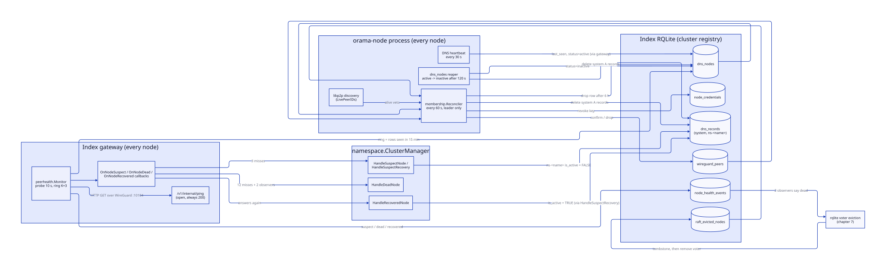
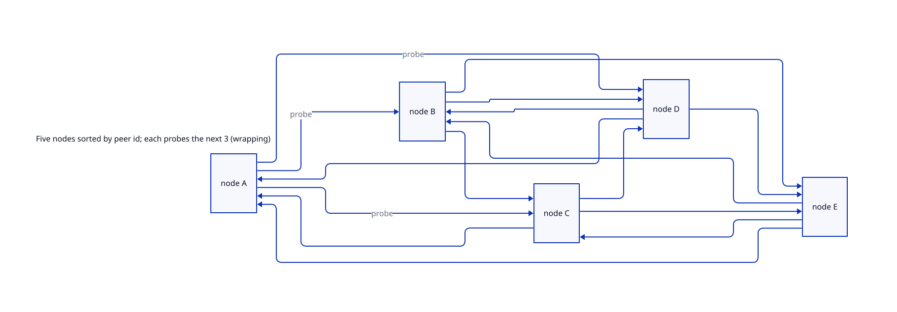
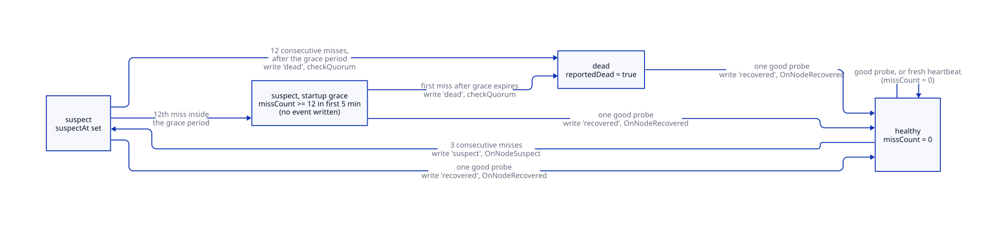
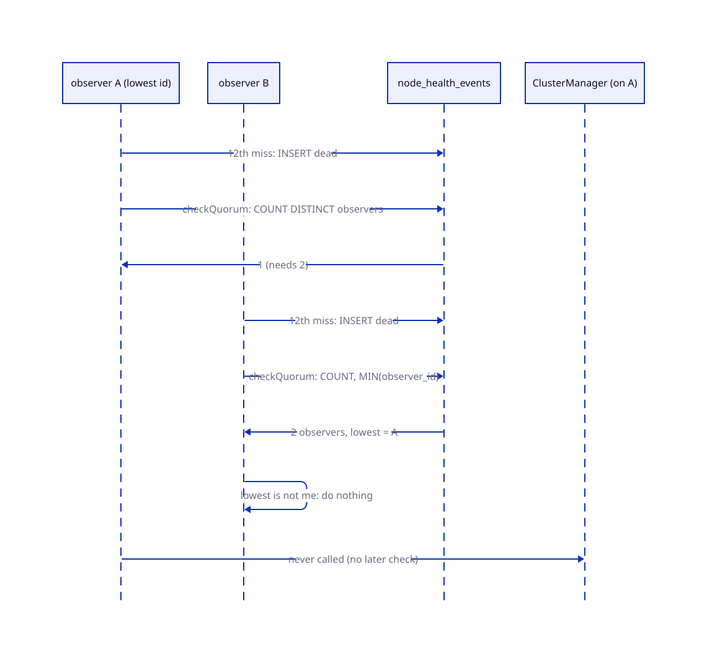
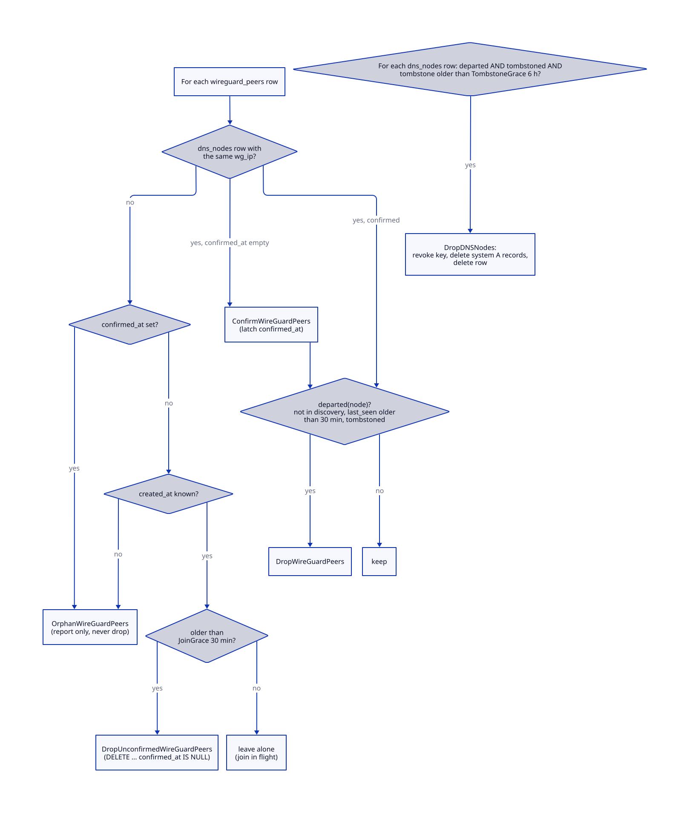

# Membership and failure detection

> **At a glance.**
>
> - **What:** two cooperating loops decide who is in the cluster and who is gone. The ring monitor (`core/pkg/peerhealth/`) runs inside every node's index gateway, probes the next 3 nodes in a sorted ring, and turns consecutive misses into `suspect`, `dead` and `recovered` events. The membership reconciler (`core/pkg/node/membership/`) runs on every node but acts only on the index RQLite leader, and deletes the residue a departed machine leaves in `dns_nodes`, `wireguard_peers`, `node_credentials` and the system DNS records.
> - **Key numbers:** probe every 10 s with a 3 s timeout; suspect after 3 misses, dead after 12; dead needs 2 distinct observers inside 5 min; 5 min startup grace; a heartbeat younger than 65 s replaces the probe; a peer stays in the ring for 15 min after its last heartbeat; reconciler period 60 s; liveness grace 30 min, join grace 30 min, tombstone grace 6 h.
> - **Code:** `core/pkg/peerhealth/`, `core/pkg/node/membership/`, wiring in `core/pkg/gateway/gateway.go` and `core/pkg/node/membership.go`, consumers in `core/pkg/namespace/cluster_recovery.go` and `core/pkg/rqlite/eviction.go`.
> - **Depends on:** [cluster state](07-cluster-state.md) for the index RQLite and voter eviction, [the node as a supervisor](04-the-node-as-a-supervisor.md) for the boot graph, and [the WireGuard mesh](06-the-wireguard-mesh.md) for the probe path.



## Why it exists

A node can disappear in three ways: it stops answering for a minute (a restart, a hung gateway), it is partitioned from some peers but not others, or the machine is deleted without ceremony. The cluster has to react differently to each. A restart must change nothing. A partition from one peer must not evict a healthy node. A deleted machine must eventually be forgotten everywhere, because a forgotten-nowhere machine is not harmless: a dead raft voter still counts toward quorum, a stale WireGuard peer is re-applied to every survivor's interface every 60 s, and a dead node's A record keeps being handed to clients.

Two constraints shaped the design.

First, no node may be asked "are you alive?" by everyone. A full mesh of probes is quadratic in the fleet size, so each node watches a small deterministic subset (the ring) and the cluster combines the observations through the shared registry instead of through gossip.

Second, the evidence is split across stores that each had their own liveness definition and their own timer: `dns_nodes`, `wireguard_peers`, the raft configuration, ipfs-cluster's peer list and IPFS's peering config. Before the reconciler existed no single writer owned "this machine is gone", so each store forgot it, or failed to, on its own schedule (`core/pkg/node/membership/plan.go`, package comment). The ring monitor produces the signal, the membership reconciler cleans two of the stores that signal leaves behind, and the raft voter loop in the RQLite manager cleans the third. Chapter 7 covers the raft side.

## The model

**Node.** One machine, identified everywhere by its libp2p peer id. `dns_nodes.id` is that peer id (`core/pkg/node/membership/plan.go:Node`). A node also has an overlay address (`dns_nodes.internal_ip`, its WireGuard address in 10.0.0.0/24) and a public address (`dns_nodes.ip_address`).

**Ring.** The set of `dns_nodes` rows whose `last_seen` is newer than 15 min, sorted by id. A node monitors the K = 3 nodes that follow it in that order, wrapping at the end (`core/pkg/peerhealth/monitor.go:RingNeighbors`). Each node is therefore observed by its 3 predecessors. When the ring holds fewer than 4 nodes, K shrinks to N minus 1, so every node watches every other.

**Observer and target.** The node doing the probing and the node being probed. An observation is a row in `node_health_events` with `observer_id`, `target_id` and `status` of `suspect`, `dead` or `recovered`.

**Peer state.** The monitor's in-memory record per target: a miss counter and a status of `healthy`, `suspect` or `dead`. It is never persisted. Only the transitions reach the database.

**Quorum.** At least `DefaultMinQuorum = 2` distinct observers have written a `dead` event for the same target within `DefaultQuorumWindow` of 5 min. Quorum, not the individual verdict, is what triggers recovery.

**Heartbeat.** Every 30 s each node sends a request, signed with its node key, to its own local gateway, which runs `UPDATE dns_nodes SET status = 'active', last_seen = datetime('now')` for that node id (`core/pkg/node/dns_registration.go:startDNSHeartbeat`, `core/pkg/gateway/handlers/nodeapi/handler.go:HandleHeartbeat`). A node whose `http_gateway` is disabled has no heartbeat at all. The UPDATE is a raft write, so a fresh `last_seen` proves two things: the node was alive, and it could reach a quorum of the index RQLite. If the row is missing the gateway answers `registered: false` and the node registers itself.

**Tombstone.** A row in `raft_evicted_nodes` saying a raft member was removed on purpose. The membership reconciler treats a tombstone as the proof that a missing machine is gone for good rather than briefly unreachable. The row is keyed by the raft node id and also carries the raft address and, when the writer knew it, the libp2p peer id.

**Plan.** The reconciler's output: five sorted lists of rows to confirm, drop or report (`core/pkg/node/membership/plan.go:Plan`). It is computed by a pure function from an `Evidence` value, so it is reproducible and unit-testable without a database.

## How it works

### Where the monitor runs and why

The monitor is created inside the gateway constructor and started after the gateway reports ready (`core/pkg/gateway/gateway.go`, the block that calls `nodehealth.NewMonitor`). It runs only on the index gateway: the condition is `cfg.NodePeerID != "" && deps.SQLDB != nil && !isNamespaceGateway(cfg)`. A tenant gateway's `SQLDB` is the namespace's own RQLite. Core migrations create an empty `dns_nodes` table there, and nothing ever inserts a row, so a monitor in a tenant gateway would have an empty ring (`core/pkg/gateway/config.go:isNamespaceGateway`).

The code gives no explicit reason for the monitor living in the gateway rather than in `pkg/node`; what it shows is the arrangement. The gateway already holds the index registry connection (`deps.SQLDB`) and the node's peer id (`cfg.NodePeerID`). Its consumer, the `ClusterManager` that replaces dead namespace members, is attached to the gateway through `SetNodeRecoverer` (`core/pkg/gateway/handlers/namespace/core_wire.go`). The namespace package cannot import `pkg/node`, because `pkg/node` imports `pkg/namespace` (`core/pkg/namespace/cluster_manager_webrtc.go:webrtcReconcileStartupGrace` records the same constraint), so a monitor in `pkg/node` would need an adapter to reach the `ClusterManager`.

The gateway passes `ProbeInterval: 10 * time.Second`, `Neighbors: 3` and `ProbePort: constants.GatewayAPIPort`. `ProbeTimeout` and `StartupGracePeriod` keep their defaults. The suspect, dead and quorum thresholds are package constants that `Config` cannot override.

### Building the ring

Every probe round the monitor reads the ring from the registry:

```sql
SELECT id, COALESCE(internal_ip, ip_address),
       CASE WHEN COALESCE(last_seen,'') > ? THEN 1 ELSE 0 END
  FROM dns_nodes WHERE COALESCE(last_seen,'') > ? ORDER BY id
```

The probe address is the overlay address, and the public `ip_address` when `internal_ip` is NULL. The first bound is `now - 65 s` (heartbeat freshness), the second `now - 15 min` (ring membership). Both are computed in UTC and formatted `2006-01-02 15:04:05`, because SQLite stores `CURRENT_TIMESTAMP` in UTC and compares the strings (`core/pkg/peerhealth/monitor.go:getRingNeighbors`).

Membership is deliberately not filtered on `status`. The `dns_nodes` reaper flips a silent node to `inactive` after 120 s (`core/pkg/node/dns_registration.go:reapInactiveNodeDNS`). The ring window used to equal that 120 s, so a node left every ring at the moment it went quiet, long before any observer had accumulated 12 misses, and `HandleDeadNode` could not fire for the failure it exists to catch. The 15 min `ringMembershipWindow` is well past the dead threshold; a node that is merely restarting is back long before then (comment on `ringMembershipWindow`).

`RingNeighbors` sorts by id, finds self, and returns the next `min(K, N-1)` entries modulo N. A node that is not itself in the ring (not yet registered, or silent for over 15 min) monitors nothing.



### One probe round

`Start` ticks every `ProbeInterval`. Each tick calls `probeRound`, which probes all neighbors concurrently (each goroutine calls `updateState` as soon as its own probe returns), waits for all of them, then prunes state for any peer that is no longer a neighbor. With a 3 s HTTP timeout the round finishes well inside the 10 s period.

For each neighbor `probeNode` decides in this order:

1. **Fresh heartbeat.** If the row's `last_seen` is within `freshHeartbeatWindow` (65 s, two heartbeat ticks) the peer counts as healthy and no HTTP request is made. The reasoning in the code: a node is never declared dead because one port was wrong, one request dropped or its gateway was mid-restart while the node itself was fine. A stale heartbeat proves nothing and falls through; it is not a miss.
2. **Lifecycle metadata.** If a `MetadataReader` is configured, a peer in `maintenance` seen within 2 min, or `active` seen within 30 s, counts as healthy. The gateway does not set a `MetadataReader`, so this step never runs (see Known gaps).
3. **HTTP probe.** `GET http://<internal_ip>:<ProbePort>/v1/internal/ping` with a 3 s client timeout. Only status 200 is healthy. Any transport error, timeout or other status is a miss.

The probe goes to the peer's WireGuard address on the index gateway port, 10104 (`core/pkg/constants/ports.go`, `GatewayAPIPort = IndexPortBase + 4`). The port is a required `Config` field. `NewMonitor` returns an error for a non-positive `ProbePort`. The port was once hardcoded, survived the move of the index internals into the 10100 block untouched, and every probe on a healthy fleet failed, which the ring turned into a fleet-wide false eviction. The ping route is served by every index gateway and answers `{"status":"ok"}` unconditionally (`core/pkg/gateway/status_handlers.go:pingHandler`). It is open (`core/pkg/gateway/route_policy.go`), passes the readiness gate (`core/pkg/gateway/readiness.go:readinessPassthrough`) and is excluded from traffic metrics (`core/pkg/gateway/traffic.go`). A 200 therefore proves the HTTP listener is up, not that the node is serving.

### The suspicion-to-death state machine

`updateState` is the only writer of peer state. It holds the monitor mutex while it changes state and releases it before it touches the database or calls a callback, so a callback can call back into the monitor without deadlock.



- **Healthy probe.** The miss counter resets to 0, status becomes `healthy`, `reportedDead` clears. If the previous status was `suspect` or `dead` the monitor writes a `recovered` event and calls `OnNodeRecovered`.
- **Miss number 3** while `healthy`. Status becomes `suspect`, the monitor writes a `suspect` event and calls `OnNodeSuspect`. This is about 30 s of misses at the 10 s period. Later misses do not repeat the event.
- **Miss number 12** and not yet `reportedDead`. Outside the grace period the status becomes `dead`, `reportedDead` is set, a `dead` event is written, and `checkQuorum` runs. This is about 120 s of misses. Inside the grace period (below) the peer stays at `suspect` and nothing is written.
- **Misses after 12.** Nothing happens. `reportedDead` suppresses further events, so one death produces one `dead` row per observer.

Counting from the target's last heartbeat, the trust window adds 65 s before the first probe goes out, and rounds are 10 s apart, so the first miss lands 65 to 75 s after it. The third miss, and so `suspect`, follows 20 s later (85 to 95 s) and the twelfth, and so `dead`, 110 s after the first (175 to 185 s). A probe to a host that does not answer takes the full 3 s timeout before it counts, which delays each figure by up to 3 s. The `monitoring-chaos` fleet feature asserts the suspect leg: a hung cluster gateway is suspected within heartbeat trust plus three misses and recorded as recovered without ever being declared dead (`e2e/features/monitoring-chaos/ring_test.go`).

#### Startup grace

The monitor records its creation time. For `DefaultStartupGracePeriod`, 5 min, a peer that reaches 12 misses is not declared dead. It is already `suspect` from its third miss, so the twelfth changes nothing and writes nothing. (The branch that would write a `suspect` event on entering this state is unreachable, because a peer cannot have 12 misses without having passed 3 as `healthy`.) After the grace period the next miss takes the normal dead path, because `reportedDead` is still false. The purpose is the cluster-wide restart: every node comes up with an empty view and the first probes fail because nothing is listening yet.

### What each verdict does

The gateway registers three callbacks on the monitor. All call into the `NodeRecoverer` interface (`core/pkg/gateway/handlers/auth/handlers.go:NodeRecoverer`), implemented by `namespace.ClusterManager`. The recovered callback starts both `HandleSuspectRecovery` and `HandleRecoveredNode`. Each handler runs in a new goroutine. The callback logs its message first and does nothing more if the recoverer has not been set yet.

| Verdict | Callback | Effect (`core/pkg/namespace/cluster_recovery.go`) |
|---|---|---|
| suspect | `OnNodeSuspect` | `HandleSuspectNode`: for each namespace cluster in status `ready` or `degraded` that the node belongs to, set `is_active = FALSE` on the `ns-<name>` and `*.ns-<name>` A records whose value is the node's public IP. Every observer of the node runs it. A per-node in-flight key prevents concurrent handling inside one process. It touches no `system` record and no deployment record. |
| dead, after quorum | `OnNodeDead` | `HandleDeadNode`: mark `dns_nodes.status = 'offline'`, mark the node's deployment replicas failed, then `ReplaceClusterNode` for each affected namespace cluster, one at a time. |
| recovered | `OnNodeRecovered` | `HandleSuspectRecovery` re-enables the DNS records; `HandleRecoveredNode` marks the node active and repairs degraded clusters, or tears down services of namespaces that were moved away while the node was down. |

The "never disable the last active record" rule lives inside the UPDATE statement. It was once a COUNT followed by an unconditional UPDATE, and two observers could both read a count of 2 and both disable (`core/pkg/namespace/dns_manager.go:DisableNamespaceRecord`). A statement that changes nothing means the guard held and is logged as a normal outcome. Namespace replacement itself belongs to [reconciliation and recovery](10-reconciliation-and-recovery.md).

### Quorum and the single recoverer

`checkQuorum` runs on an observer immediately after it writes its own `dead` event. It counts distinct `observer_id` values with `status = 'dead'` for the target and `created_at` newer than 5 min. Fewer than 2 means it logs "waiting for quorum" and returns. At 2 or more, only the observer with the lowest `observer_id` among those events proceeds to call `OnNodeDead`; every other observer logs that another node is responsible. The lowest-id rule is meant to yield one recovery run per confirmed death rather than one per observer. It does not guarantee exactly one: with 3 observers the check can pass twice (for example when the observers declare in descending id order), and `HandleDeadNode` serialises per cluster only through an in-process key, so a second run on another node is possible. `ReplaceClusterNode` re-checks liveness first (see Failure modes).

The check runs once per observer per death, at the instant that observer declares death. That has a consequence described under Known gaps: when the lowest-id observer is the first to declare, no node ever calls `OnNodeDead`.



`node_health_events` serves a second consumer. The index RQLite voter loop evicts a dead raft voter only when at least 2 distinct peers recorded it `dead` in the last 30 min with no later `recovered` (`core/pkg/rqlite/eviction.go:confirmedDeadByPeers`), alongside three other independent conditions. That path reads the events directly, so it does not depend on `OnNodeDead` firing.

### The node's own DNS self-management

A third actor shares the namespace DNS records with the ring monitor. Every index gateway probes the namespaces it hosts every 30 s (rqlite and Olric by TCP dial on its WireGuard address, the gateway by a readiness request) and, after 3 consecutive unhealthy probes (about 90 s), withdraws its own `ns-<name>` and `*.ns-<name>` records. After 3 healthy probes it restores the records it withdrew itself. The withdrawal carries the same in-statement "never the last active record" guard as the suspect path (`core/pkg/gateway/namespace_health.go:withdrawNamespaceHostRecordSQL`). A record that a peer disabled, which is what the suspect path writes, is reclaimed by its owner only once it has sat untouched for 10 min (`staleDisableReclaimAfter`). Two independent loops therefore write `is_active` on the same rows: the ring (about 90 s after a node stops answering, from the observers) and the owner (about 90 s after its own services fail). The `dns_nodes` reaper and the 15 min purge of per-namespace records that point at non-active nodes (`core/pkg/node/dns_registration.go:purgeInactiveNodeRecords`) are the third and fourth. The purge never empties an fqdn.

### The membership reconciler

`membership.Reconciler` is started by the boot component `membership`, which depends on `rqlite-cluster` (`core/pkg/node/components.go`, `core/pkg/node/membership.go:startMembershipReconciler`). Every node runs the loop; each tick starts with `isLeader()`, which asks the local index RQLite for its raft state over HTTP and returns false on any error. A non-leader returns immediately. Leadership can therefore move without restarting anything.

Each 60 s tick (`core/pkg/node/membership/reconciler.go:Interval`) does three things: gather evidence, build a plan, apply the whole plan. Despite the package comment's list of five stores, it writes only to `wireguard_peers`, `dns_nodes`, `node_credentials` and `dns_records`. The raft configuration is changed by the RQLite voter loop and IPFS peers by the IPFS swarm sync (`core/pkg/node/ipfs_swarm_sync.go:startIPFSSwarmSync`, every 60 s). The reconciler reads their effect, the tombstones, but does not edit them.

#### Evidence

`gather` reads four things at one reference time (`time.Now().UTC()`):

- every `dns_nodes` row: id, `internal_ip`, status, `last_seen`;
- every `wireguard_peers` row: `node_id`, `wg_ip`, `public_key`, `created_at`, `confirmed_at`;
- the tombstones, as a map from peer id to eviction time;
- the libp2p peers discovery sees right now, plus this node's own id (`core/pkg/node/membership.go:discoveryPeers`).

A tombstone is keyed by raft node id, which is the raft advertise address on a node that predates stable raft ids and the libp2p peer id on one that has migrated (`core/pkg/rqlite/identity.go:RaftNodeID`), while the plan is keyed by peer id. The reader resolves it through `raft_evicted_nodes.peer_id` when the evicting node knew it, and otherwise by joining `dns_nodes.internal_ip` to the host part of `raft_addr`. A tombstone that resolves to nothing is skipped. Timestamps are parsed from three layouts; an empty or malformed value becomes the zero time, which the plan treats as "no evidence of liveness" rather than as recent, so a corrupt timestamp cannot protect a row forever.

#### Departed

A node is departed only if it passes every veto in `departed`:

1. If discovery can see its peer id, it is alive.
2. If `last_seen` is non-zero and younger than `LivenessGrace` (30 min), it is alive.
3. If it is tombstoned, it is departed.
4. Otherwise it is missing but unproven, and it is kept.

Rule 4 matters most. An unexplained disappearance is never cleaned up on its own. The raft eviction path is what converts "missing" into "tombstoned", and the reconciler follows that decision rather than making it.

#### The plan



For each `wireguard_peers` row the plan matches a `dns_nodes` row on the overlay address, not on `node_id`. The join handshake writes a synthetic `node-<wgip>` id that matches no `dns_nodes` row and never has, so matching on id would classify every row as an orphan.

| Row situation | Plan entry | Reason |
|---|---|---|
| Matches a node, `confirmed_at` empty | `ConfirmWireGuardPeers` | The node appeared; latch it so the row can never again be dropped for being unconfirmed. |
| Matches a departed node | `DropWireGuardPeers` | Tombstoned, unseen for 30 min. |
| No match, confirmed | `OrphanWireGuardPeers` (report only) | A node that came up and then left `dns_nodes` is an anomaly for a human; deleting the mesh entry of a machine that may still run would sever it. |
| No match, unconfirmed, `created_at` zero | `OrphanWireGuardPeers` (report only) | No way to tell a join in flight from residue. |
| No match, unconfirmed, older than `JoinGrace` (30 min) | `DropUnconfirmedWireGuardPeers` | The join never finished. A node gets its WireGuard row before its `dns_nodes` row, so a younger row is left alone. |

Separately, a `dns_nodes` row goes into `DropDNSNodes` only when the node is departed, tombstoned, and the tombstone is older than `TombstoneGrace` (6 h). The grace keeps the row visible to an operator who looks right after a node disappears. Every list is sorted, so the plan and its log lines are stable.

The plan is conservative in one direction on purpose. Deleting a live node's WireGuard peer severs it from the mesh and raft runs over the mesh, so every deletion needs positive evidence of departure and any single sign of life vetoes it. Leaving a dead node's row costs a stale entry that the next cycle can still catch.

#### Applying the plan

Each tick applies the entire plan, in this order, through `rqlite.SafeExecContext`:

1. **Confirm.** `UPDATE wireguard_peers SET confirmed_at = CURRENT_TIMESTAMP WHERE node_id = ? AND confirmed_at IS NULL`. Confirmations come first because they only protect rows, so a node that appeared between the read and the writes is latched rather than raced against.
2. **Drop unconfirmed.** `DELETE FROM wireguard_peers WHERE node_id = ? AND confirmed_at IS NULL`. The predicate makes the delete safe against a stale evidence read: if the node came up and something confirmed the row meanwhile, it deletes nothing.
3. **Drop departed peers.** `DELETE FROM wireguard_peers WHERE node_id = ?`.
4. **Drop departed nodes**, three statements per node in a fixed order: revoke the node's credential (`UPDATE node_credentials SET revoked_at = CURRENT_TIMESTAMP WHERE node_id = ? AND revoked_at IS NULL`); delete the system A records whose value is the node's public IP (`DELETE FROM dns_records WHERE record_type = 'A' AND namespace = 'system' AND value = (SELECT ip_address FROM dns_nodes WHERE id = ?)`); delete the `dns_nodes` row.

The order inside step 4 is load-bearing. A departed node that keeps a live credential can still sign for its own id, and registration is an upsert that sets `status = 'active'`, so it could resurrect itself into DNS with an address of its choosing. Revoking first means a crash between statements leaves the safe half done. The A records are keyed on the public IP in `dns_nodes`, so they must go while the row still exists.

Unlike a raft configuration change, deleting stale rows cannot cost quorum, so the reconciler does not pace itself to one change per tick. The first error aborts the tick and is logged as a warning; the next tick recomputes from fresh evidence. Orphans are logged at warning level every tick until a human resolves them.

#### The WireGuard consumer

The reconciler only edits the table. Each node reads `wireguard_peers` every 60 s and reconciles its own interface against it (`core/pkg/node/wireguard_sync.go`, `wgSyncInterval`). Only a non-empty read through the raft leader counts as authoritative and may remove peers; a fallback to the local replica may only add them. A dropped row therefore disappears from every survivor's interface within one sync period after the delete commits.

### The tombstone lifecycle

Two paths write `raft_evicted_nodes`: automatic dead-voter eviction in the RQLite manager (reason `dead-voter`, `core/pkg/rqlite/eviction.go:tombstoneNode`), and the operator commands `decommission` and the raft-id migration, which both call `core/cmd/orama/internal/production/clusterops/clusterops.go:WriteTombstone` (reason `operator`; the schema comment also lists `decommission`, which no code writes). The row is written before the removal, so a failed removal leaves an inert tombstone rather than an eviction that orphan recovery undoes within five minutes (`core/pkg/rqlite/eviction.go:evictDeadVoters`).

A tombstone has two readers with different lifetimes. Raft's orphan recovery ignores tombstones older than `tombstoneTTL`, 24 h, because the evicted node is outside the raft configuration and cannot clear its own row. The membership reconciler reads every row regardless of age. A tombstone is cleared in two places. `core/pkg/rqlite/rqlite.go` calls `clearTombstone` on boot, which only reaches a node that was tombstoned but stayed in the raft configuration: a node that was really removed has no leader and never gets there. The raft-id migration calls `clusterops.go:ClearTombstone` once the node is back under its new id. For a removed node that returns, the tombstone stays until an operator rejoins it, and until then the reconciler can still treat it as departed once it also passes the liveness vetoes.

## State it owns

| State | Holds | Writer | Reader | Where |
|---|---|---|---|---|
| `peerState` map | Miss count, status, `suspectAt`, `reportedDead` per ring neighbor | `Monitor.updateState` | the same monitor | Memory of each index gateway; lost on restart, which also restarts the grace period |
| `node_health_events` | `observer_id`, `target_id`, `status` (`suspect`, `dead`, `recovered`), `created_at` | every monitor, on transitions only | `checkQuorum`, `confirmedDeadByPeers` | Index RQLite, migration `core/migrations/016_node_health_events.sql` |
| `dns_nodes` | Node registry: ids, addresses, status, `last_seen` | node registration and heartbeat via the gateway, the reaper (`inactive`), `HandleDeadNode` (`offline`), `HandleRecoveredNode` (`active`), the reconciler (delete) | ring builder, reconciler, node selector | Index RQLite, `core/migrations/005_dns_records.sql` |
| `wireguard_peers` | Mesh membership, plus `confirmed_at` latch | join and enrolment handlers, each node's WireGuard self-registration (`core/pkg/node/wireguard_sync.go`, sets `confirmed_at`), reconciler | every node's WireGuard sync | Index RQLite, `core/migrations/038_wireguard_peers_identity.sql` |
| `raft_evicted_nodes` | Intentional-removal tombstones | RQLite eviction, decommission and migration commands | reconciler, orphan recovery | Index RQLite, `core/migrations/037_raft_evicted_nodes.sql` |
| `node_credentials` | Per-node keys; `revoked_at` | enrolment, reconciler (revoke) | gateway authentication | Index RQLite |
| `dns_records` (`namespace = 'system'`, per-namespace `ns-` names) | Round-robin A records, `is_active` flag | node DNS loops, `HandleSuspectNode`, reconciler | CoreDNS | Index RQLite |
| `unreachableStreaks` | Per-voter consecutive unreachable ticks for eviction | RQLite voter loop | same | Memory of the RQLite manager (chapter 7) |
| Gateway callbacks | `onDeadFn`, `onSuspectFn`, `onRecoveredFn` | `Monitor.OnNode*` | `updateState`, `checkQuorum` | Memory |

## Lifecycle

**Boot.** The reconciler component starts after `rqlite-cluster` is up. The monitor is constructed during gateway construction but starts probing only after `AwaitReady`, and its 5 min grace period is measured from construction. A node that has not yet written its first `dns_nodes` row is not in the ring and monitors nothing; after it registers, its neighbors begin probing it within one tick.

**Normal operation.** Every 10 s each index gateway probes its 3 successors, usually without making a request, because their heartbeats are fresh. Every 30 s each node refreshes its own `last_seen`. Every 60 s the leader reconciles.

**Rolling upgrade.** A restarting node stops heartbeating. Its observers trust the last heartbeat for up to 65 s, then miss. A normal restart returns inside that window plus 30 s, so no `suspect` event is written. A restart in which the node's heartbeat and probes are both absent for more than about 85 to 95 s produces `suspect`, which disables that node's namespace DNS records (never the last one), and the first healthy probe afterwards writes `recovered` and re-enables them. The repair path adds re-advertise lag after the restart (`docs/MONITORING.md`, the DNS self-management section describes the node's own withdrawal and reclaim rules, including that a record a peer disabled is reclaimed only after 10 min). Mixed versions do not interact: the probe is a plain `GET` of an unauthenticated route, and the events are rows in a table whose schema has not changed since migration 16.

**Restart of the monitor's own node.** Peer state is lost. All counters restart at 0, so a target that was `suspect` is re-detected from scratch, and the grace period begins again. Dead events from before the restart remain in the table until they age out of the 5 min quorum window.

**Node loss.** For a deleted machine the timeline on a 3 s probe and 10 s period runs, counting from its last heartbeat t0:

- t0 + 85 to 95 s: observers write `suspect` and disable the node's namespace DNS records (never the last one).
- t0 + 120 to 150 s: the first `dns_nodes` reaper to run (every node runs it on its 30 s tick) marks the row `inactive` and deletes its `system` A records.
- t0 + 175 to 185 s: observers write `dead`. When the quorum check passes on the lowest-id observer, `HandleDeadNode` replaces the node in its namespace clusters.
- t0 + 15 min: the node leaves every ring, and `pruneStaleClusterNodes` and the per-namespace DNS purge treat it as gone (`core/pkg/namespace/cluster_recovery.go:clusterNodePurgeStaleAfter`).
- Raft eviction needs four conditions at once (`core/pkg/rqlite/eviction.go:evictDeadVoters`): 10 consecutive 2 min voter-loop ticks unreachable (20 min or more), no longer known to the leader's discovery (a silent peer is kept for 2 h, `core/pkg/rqlite/cluster_discovery.go:defaultInactivityLimit`), `dead` events from 2 distinct observers less than 30 min old, and a quorum-safe removal. The discovery and event windows do not overlap for a single death (see Known gaps), so this path completes only when something resets one of them; an operator removal writes the tombstone directly.
- Once a tombstone exists and 30 min have passed since `last_seen`, the reconciler drops the WireGuard peer. The `dns_nodes` row, the credential and the `system` records go 6 h after the tombstone.

## Failure modes

| Trigger | What the system does | What you observe |
|---|---|---|
| Target restarts, back within ~95 s | Heartbeat trust plus fewer than 3 misses. Nothing is written. | No events. |
| Target gateway hung, node and heartbeat alive | Fresh heartbeat counts as healthy, so no probe is sent while it lasts. Heartbeats go through that same gateway, so they stop and misses start. | `suspect` after heartbeat staleness plus 3 misses, then `recovered` when the gateway returns (`monitoring-chaos`). |
| Partition: observer cannot reach target, others can | One observer reaches `dead`; the others see a fresh heartbeat or a good probe. No quorum. | One `dead` row, log "waiting for quorum"; no recovery, no eviction. |
| Partition: node isolated in the minority | Its heartbeat writes fail, so `last_seen` goes stale; majority observers miss it and write `dead`. Its own monitor cannot write events. | Majority declares it dead and replaces its namespace members; on heal `recovered` fires and `HandleRecoveredNode` tears down services the node no longer owns. |
| Whole fleet restarts | Grace period holds every peer at `suspect` for 5 min. | `suspect` events, no `dead`, no recovery. |
| Index RQLite has no leader | Heartbeats and event writes fail, so `last_seen` ages and `writeEvent` logs a warning. The reconciler is idle (no leader). If the ring query fails the round is skipped ("Failed to get ring neighbors"). | Warnings in the gateway log; on recovery the first rounds see stale heartbeats and probe by HTTP. |
| Clock skew between nodes | Time comparisons use the writer's database clock for `last_seen` and the observer's clock for the cutoff. A skew of tens of seconds shifts the 65 s freshness test. | Spurious probes or delayed suspicion; a skew beyond several minutes would also shift ring membership and quorum windows. |
| Slow peer (probe takes over 3 s) | The attempt times out and is a miss. | Suspect/recover flapping if sustained. |
| Wrong `ProbePort` | `NewMonitor` returns an error at construction. | The gateway fails to start with "ProbePort must be the index gateway port". |
| `HandleDeadNode` target already live again | Handled in `ReplaceClusterNode` through a liveness check (`nodeIsLive`, 2 min window) so a restarting node is reinstated, not replaced. | "Reinstated cluster node that is alive again". |
| Reconciler: stale evidence read | Delete predicates (`confirmed_at IS NULL`, tombstone veto, discovery veto) make the writes safe. | No deletions of live rows. |
| Reconciler crashes mid-plan | Step order leaves the safe half done; next tick recomputes. | A revoked key with a surviving row, until the next tick. |
| The lowest-id observer declares death first | `checkQuorum` finds 1 event and waits; the later observer is not the lowest and does nothing. | `HandleDeadNode` never runs. Logs show "waiting for quorum" then "another node is responsible", and no "CONFIRMED DEAD". |
| WireGuard row with no matching node | Reported as orphan, never deleted if confirmed. | Warning "WireGuard peers with no matching node record" every 60 s. |
| Disk full on the index RQLite | Writes fail: heartbeats, events and reconciler deletes error and are logged. | Warnings; staleness propagates as above. |

## Trust and security

**The probe.** `/v1/internal/ping` is an open route reachable from the internet through Caddy, which proxies every path to the gateway. It answers a fixed `{"status":"ok"}` and no longer returns the node's peer id (`core/pkg/gateway/status_handlers.go:pingHandler`). The monitor requests it over the WireGuard address, so only a peer on the mesh is probed, but the monitor does not authenticate the answer. A party that can answer on a peer's overlay address with a 200 can hold that peer healthy. That requires owning a mesh address, and the mesh is already the trust boundary for raft.

**The events.** Observers write `node_health_events` through the index RQLite connection, in-process in the gateway. The table is classed as cluster-tier platform data that tenant gateways never open (`core/pkg/rqlite/schema_placement.go`). A tenant cannot write it. A compromised node can write false `dead` events about any target, and with a colluding second node can satisfy the quorum of 2. Its reach is bounded by what the verdicts do: disable a node's namespace DNS records (never the last), trigger replacement of that node in namespace clusters, and corroborate a raft eviction that still needs the voter to be unreachable for about 20 min and unknown to discovery.

**The reconciler.** Its writes are cluster-wide and run on the raft leader only. They are gated by evidence that attackers cannot easily forge from outside the cluster: a tombstone written by the eviction or decommission path, discovery and heartbeat vetoes. Revoking `node_credentials` before dropping `dns_nodes` is a security control, not only an ordering nicety: a departed node must not be able to sign a re-registration that sets itself active with an address of its choosing.

**The orphan rule.** A confirmed WireGuard peer with no `dns_nodes` row is never auto-deleted. An attacker who could delete `dns_nodes` rows therefore cannot use the reconciler to sever peers; the rows are only reported.

## Limits and scale

| Quantity | Value | Source |
|---|---|---|
| Probe period / timeout | 10 s / 3 s | `core/pkg/peerhealth/monitor.go:DefaultProbeInterval`, `DefaultProbeTimeout` |
| Ring fan-out K | 3 | `DefaultNeighbors`, passed by `core/pkg/gateway/gateway.go` |
| Suspect / dead thresholds | 3 / 12 consecutive misses | `DefaultSuspectAfter`, `DefaultDeadAfter` |
| Quorum | 2 distinct observers in 5 min | `DefaultMinQuorum`, `DefaultQuorumWindow` |
| Startup grace | 5 min | `DefaultStartupGracePeriod` |
| Heartbeat trust | 65 s | `freshHeartbeatWindow` |
| Ring membership | 15 min since `last_seen` | `ringMembershipWindow` |
| Reconciler | 60 s tick; 30 min liveness; 30 min join; 6 h tombstone | `core/pkg/node/membership/` constants |

**Probe traffic is linear.** Each node sends at most 3 probes per 10 s and typically none, since heartbeats are fresh. At 10x the fleet there are 10x as many nodes and the same per-node load.

**The first bottleneck is the registry, not the probes.** Every node runs the ring query each 10 s, so the index RQLite serves one read per node per 10 s; every heartbeat is a raft write, 2 per minute per node. The reconciler reads all of `dns_nodes`, `wireguard_peers` and `raft_evicted_nodes` once a minute on the leader only. A heartbeat per node per 30 s through raft is the load that grows with the fleet.

**Minimum fleet.** A ring of 2 nodes gives each target a single observer, and the quorum is 2, so `OnNodeDead` can never fire. With 3 nodes each target has exactly 2 observers. Both must declare, and the lowest id must declare second (see Known gaps). From 4 nodes up each target has 3 observers.

**Neighbor churn.** The state map is pruned to the current neighbor set after every round. When a node joins or leaves and shifts the ring, a target that moves out of the window loses its miss count, and one that moves in starts from zero. Detection of a node that dies during a ring change can be delayed by up to a full 12 misses.

## Design decisions

### Ring of K successors, not full mesh

*Chosen:* each node probes the next 3 in the sorted ring. *Rejected:* probing all peers. *Why:* probe traffic is O(N) rather than O(N squared), while every node is still watched by 3 independent observers (package comment in `core/pkg/peerhealth/monitor.go`). Determinism needs no coordination: the ring is a sorted query.

### Heartbeat outranks the probe

*Chosen:* a heartbeat younger than 65 s counts as a healthy observation. *Rejected:* probing every neighbor every round. *Why:* the heartbeat is a raft write, so it proves liveness and quorum without depending on one HTTP path, port or gateway state. A stale heartbeat is neutral and falls through to the probe.

### Quorum of observers through the registry

*Chosen:* observers write events to a shared table and one deterministic observer acts. *Rejected:* per-node verdicts acting independently, and a gossip protocol. *Why:* one flaky route between two nodes must not evict a healthy third, and a confirmed death must trigger one recovery. The shared registry already exists.

### Ring membership by `last_seen`, not `status`

*Chosen:* a 15 min window ignoring `status`. *Rejected:* filter on `status = 'active'` or a 2 min window. *Why:* the reaper marks silent nodes `inactive` at 120 s, which would remove them from the ring before they can accumulate the misses that make them dead (comment on `ringMembershipWindow`).

### Required probe port

*Chosen:* `ProbePort` is a mandatory field with an error on zero. *Rejected:* a default or hardcoded literal. *Why:* a literal once outlived a port migration and caused a false-eviction cascade.

### Delete only on positive evidence of departure

*Chosen:* deleting a departed node's rows requires a tombstone, no sign of life for 30 min, and absence from discovery; the one deletion without a tombstone, an unconfirmed `wireguard_peers` row that matches no node, requires 30 min of age and is guarded by `confirmed_at IS NULL`. *Rejected:* delete rows that match nothing. *Why:* a wrongly deleted WireGuard peer severs a live node and raft runs on the mesh; a missed deletion costs a stale row.

### One writer, leader only

*Chosen:* a single reconciler on the raft leader. *Rejected:* every node cleaning its own view. *Why:* the stores diverged originally because there was no single writer (package comment, `core/pkg/node/membership/plan.go`).

### Latch instead of liveness for WireGuard rows

*Chosen:* `confirmed_at` is set once and never cleared. *Rejected:* aging unmatched rows out. *Why:* it separates a join that never finished from a node that came up and vanished, so failed joins are collected without any risk to a live node (`core/migrations/038_wireguard_peers_identity.sql`).

## Known gaps

- **`OnNodeDead` can silently never fire.** `checkQuorum` runs once per observer, immediately after that observer writes its own `dead` event (`core/pkg/peerhealth/monitor.go:checkQuorum`). If the lowest-id observer declares first, it sees 1 event and waits; when the second observer declares later, it sees 2 events but is not the lowest and does nothing. Nobody re-checks, because `reportedDead` stops further events. If the observers declare in a uniformly random order, this loses roughly half the deaths with 2 observers per target (3 nodes) and a third with 3 (4 or more nodes); in practice the order follows the phase of each observer's 10 s ticker. Consequence: `HandleDeadNode`, and with it `ReplaceClusterNode`, is skipped; the namespace members are replaced later only by the stale-member sweep (`core/pkg/namespace/cluster_recovery.go:pruneStaleClusterNodes`). Raft eviction is unaffected by this gap because it reads the events itself. No test covers the quorum path with a database; `TestOnNodeDead_Callback` explicitly runs without one.
- **`checkQuorum` ignores `recovered` events.** `confirmedDeadByPeers` excludes a `dead` row followed by a later `recovered` row for the same target from any observer; `checkQuorum` counts every `dead` row in the last 5 min. Two stale `dead` rows can count toward a quorum for a target that has since recovered, and a quick re-failure inside 5 min can reach quorum on the first new declaration (`core/pkg/peerhealth/monitor.go:checkQuorum`, `core/pkg/rqlite/eviction.go:confirmedDeadByPeers`).
- **The lifecycle-metadata shortcut is not wired, and would not match.** `Config.MetadataReader` is never set in `core/pkg/gateway/gateway.go`, so the `maintenance` and `active` short-circuits in `probeNode` do not run. If it were set, `ClusterDiscoveryService.GetPeerLifecycleState` (`core/pkg/rqlite/cluster_discovery.go`) looks the peer up by `RQLiteNodeMetadata.NodeID`, which `ProvideMetadata` publishes as the raft advertise address (`core/pkg/rqlite/cluster_discovery_queries.go:ProvideMetadata`), while the monitor passes a `dns_nodes` peer id. The lookups would miss. A node in maintenance is protected only by its heartbeat.
- **Automatic voter eviction needs windows that do not overlap.** The leader refuses to evict a voter that discovery still lists, and discovery keeps a silent peer for 2 h; the corroborating `dead` rows must be under 30 min old, and a death writes one row per observer, once (`core/pkg/rqlite/eviction.go:evictDeadVoters`, `deadVoterEvidenceWindow`; `core/pkg/rqlite/cluster_discovery.go:defaultInactivityLimit`). By reading the code, a single death satisfies both only if discovery forgets the peer early, for example because the leader's process restarted, or an observer re-declares. No test exercises both gates together.
- **A 200 from `/v1/internal/ping` does not mean the node serves.** The handler answers unconditionally and is exempt from the readiness gate, so a gateway that is blocked or still migrating its schema probes as healthy (`core/pkg/gateway/status_handlers.go:pingHandler`).
- **The thresholds are not configurable.** `DefaultSuspectAfter`, `DefaultDeadAfter`, `DefaultQuorumWindow` and `DefaultMinQuorum` are read directly as constants in `updateState` and `checkQuorum`; only interval, timeout, K and grace come from `Config`, and the gateway sets only the interval and K. A two-node cluster can never reach quorum.
- **`node_health_events` is never pruned.** No migration or code issues a `DELETE` against it (`core/migrations/016_node_health_events.sql` defines no retention). The table grows by one row per transition per observer, and flapping targets add rows continuously. `raft_evicted_nodes` rows are removed only by the clear paths in the tombstone lifecycle.
- **The suspect verdict is edge-triggered, so nothing holds a record down.** `HandleSuspectNode` runs once per transition and its UPDATE touches only rows that are still active. The comment on `staleDisableReclaimAfter` says a monitor that still considers the node suspect keeps refreshing `updated_at`; no code does, so the owner reclaims the record 10 min after the disable whatever the ring thinks (`core/pkg/gateway/namespace_health.go:staleDisableReclaimAfter`).
- **The package comment overstates the reconciler.** `core/pkg/node/membership/plan.go` says membership is reconciled across five stores; the reconciler writes `wireguard_peers`, `dns_nodes`, `node_credentials` and `dns_records`, and only reads the raft tombstones.
- **`EnableNamespaceRecord` swallows errors.** It discards the result of each UPDATE and always returns nil (`core/pkg/namespace/dns_manager.go:EnableNamespaceRecord`), so a failed re-enable after `recovered` is logged as success by `HandleSuspectRecovery`. Its sibling `DisableNamespaceRecord` was fixed to return the error. It also re-enables every row for the node's IP, including one the owner withdrew for local ill health, which the owner's 3-probe loop withdraws again.
- **Stale comments.** The route policy comment says the ping "returns the node id" (`core/pkg/gateway/route_policy.go`), and the `pruneStaleClusterNodes` comment says the ring considers only `status = 'active'` (`core/pkg/namespace/cluster_recovery.go`); the code does neither. `HandleSuspectNode` says it runs at "T+30s"; it runs 85 to 95 s after the last heartbeat.
- **Callbacks are dropped before the recoverer exists.** If `nodeRecoverer` is nil when a verdict fires, the gateway logs "starting recovery" and does nothing (`core/pkg/gateway/gateway.go`). Events are written first, and nothing replays the verdict.

## Verify it yourself

**Unit tests.**

```bash
cd core && go test ./pkg/peerhealth/... ./pkg/node/membership/...
```

- `core/pkg/peerhealth/monitor_test.go`: ring selection (`TestRingNeighbors_Wrap`, `TestRingNeighbors_TwoNodes`), the transitions (`TestStateTransitions`), grace (`TestStartupGrace_PreventsDead`, `TestStartupGrace_AllowsDeadAfterExpiry`), callbacks without the lock (`TestRecoveryCallback_InvokedWithoutLock`), and the ring window against the reaper (`TestRingMembershipWindow_outlivesTheInactiveReaper`).
- `core/pkg/peerhealth/probe_target_test.go`: `TestProbeUsesConfiguredPort`, `TestFreshHeartbeatSkipsHTTPProbe`, `TestNewMonitorRejectsMissingProbePort`.
- `core/pkg/node/membership/plan_test.go`: `TestBuildPlan_neverDropsALiveNode`, `TestBuildPlan_missingWithoutATombstoneIsNotDeparture`, `TestBuildPlan_matchesOnOverlayAddressNotNodeID`, `TestBuildPlan_never_drops_a_confirmed_row_for_being_unmatched`.
- `core/pkg/node/membership/reconciler_test.go`: `TestReconcile_doesNothingOnAFollower`, `TestReconcile_revokesTheKeyOfADepartedNode`, `TestReconcile_dropsSystemDNSRecordsBeforeTheNodeRow`.

**Fleet e2e.** `e2e/features/monitoring-chaos/` (`TestRing_hungGatewaySuspectedThenRecovered`, `TestRing_injectedGatewayUnitRestartIsNoFalsePositive`) and `e2e/features/boot-lifecycle/` (`TestKillVoter_survivorsForgetIt`, which asserts a destroyed voter is gone from the node list and from every WireGuard peer set). The owner runs these with `make e2e-fleet`.

**Live, read-only.** On a node, query the index registry for the evidence the monitor and reconciler use:

```sql
SELECT id, internal_ip, status, last_seen FROM dns_nodes ORDER BY id;
SELECT observer_id, target_id, status, created_at FROM node_health_events ORDER BY id DESC LIMIT 20;
SELECT node_id, wg_ip, created_at, confirmed_at FROM wireguard_peers;
SELECT node_id, peer_id, reason, evicted_at FROM raft_evicted_nodes;
```

The ring for a given node is the 3 ids after its own in the sorted `dns_nodes` result. Verdicts and quorum messages appear in the gateway log (`orama node logs`, see `docs/MONITORING.md`) as "Node SUSPECT", "Node declared DEAD", "waiting for quorum" and "CONFIRMED DEAD". The reconciler logs "Removed the WireGuard peer of a departed node" and "WireGuard peers with no matching node record". `orama monitor` shows the cluster's node list and alerts without SSH.
