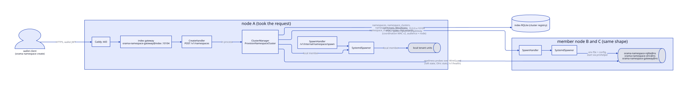
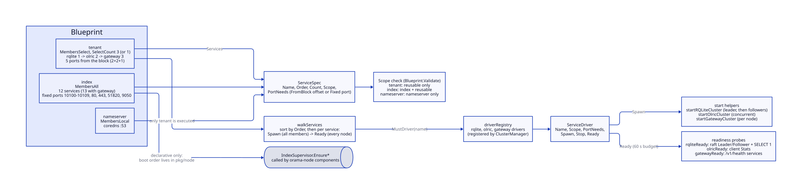
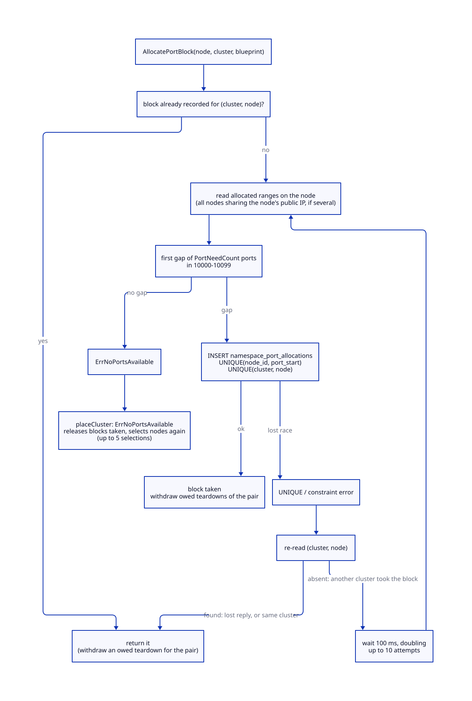
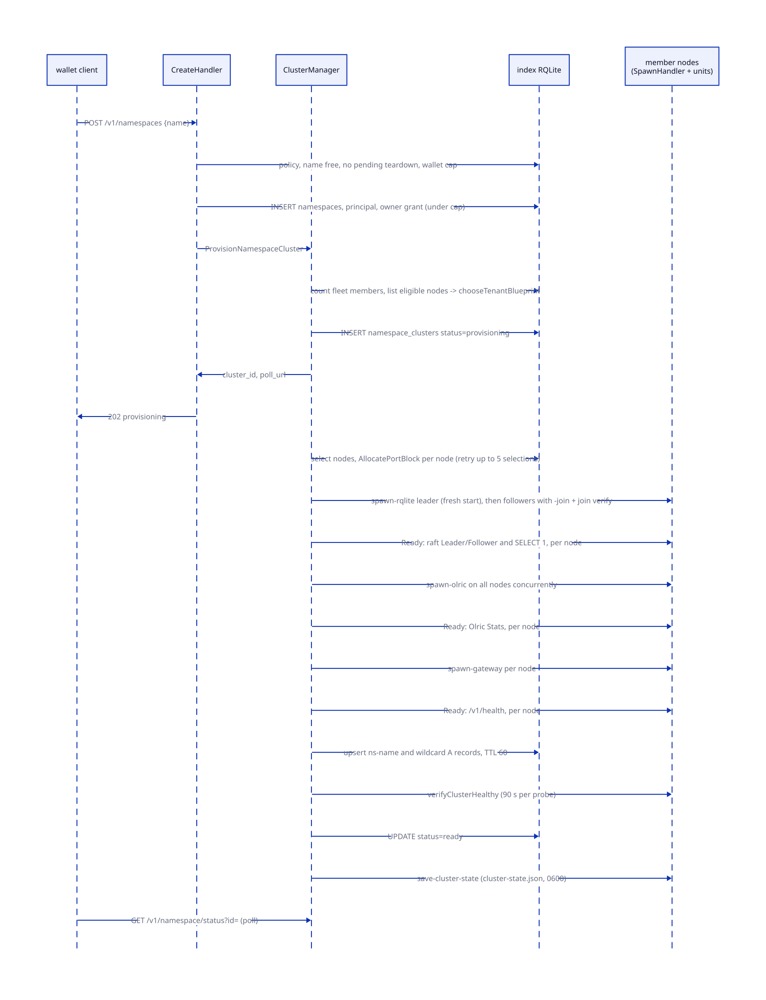
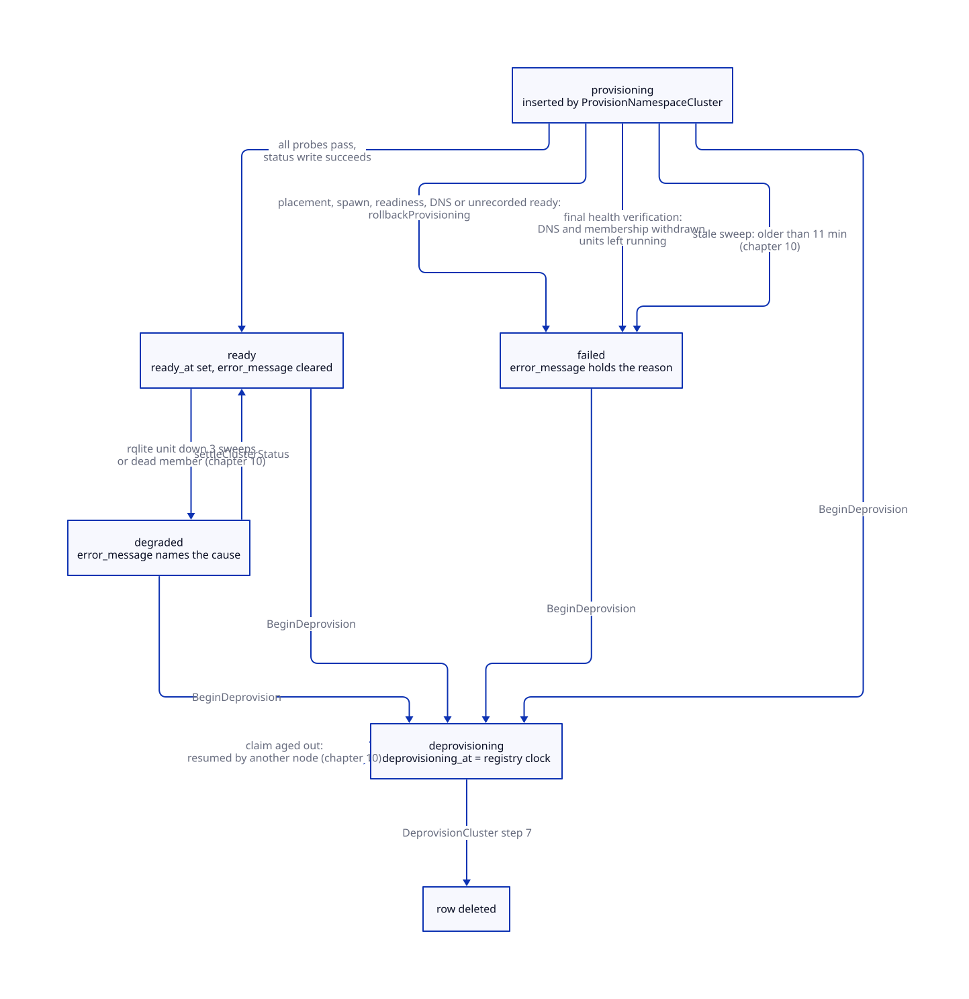
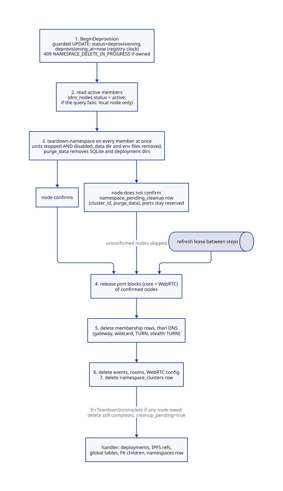
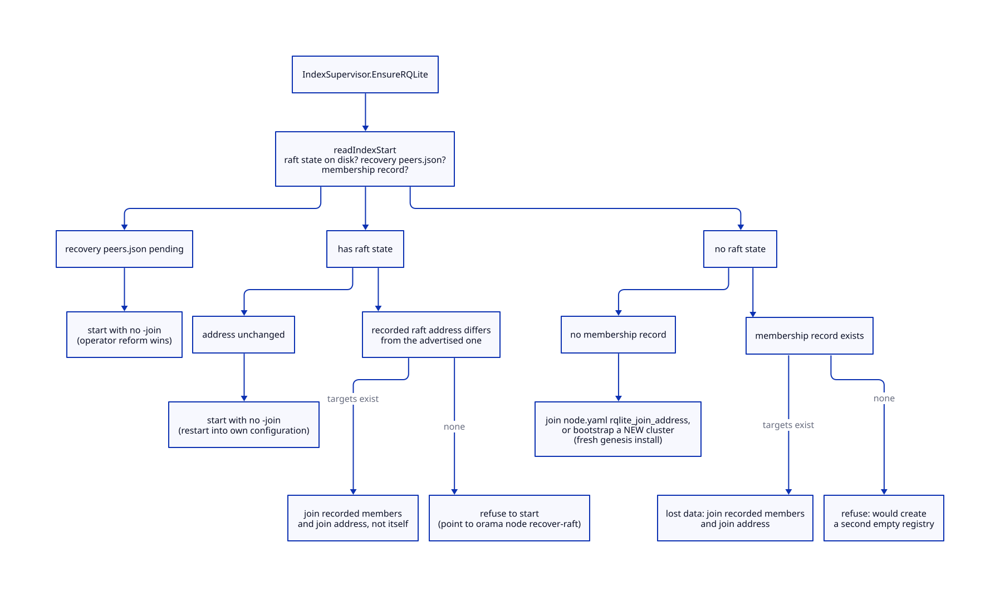

# Namespaces

> **At a glance.**
>
> - **What:** A namespace is the unit of tenancy. Creating one provisions a private cluster of three systemd units per member node (RQLite, Olric, a gateway) on a block of five ports, registers the cluster in the index RQLite, publishes DNS for it, and proves it serves before it is called ready. The same package also starts the index plane (the node's own control-plane services) from the same unit templates.
> - **Key numbers:** tenant members N=3 (N=1 on a one-node fleet, a two-node fleet refused); 5-port blocks in 10000-10099, at most 20 per node; index block 10100-10199 (fixed ports 10100-10109); spawn endpoint on 10104 over WireGuard; provisioning bound 5 min; per-service readiness 60 s; stale provisioning after 11 min; teardown bound 10 min; per-wallet cap 10; DNS TTL 60 s.
> - **Code:** `core/pkg/namespace/`, `core/pkg/gateway/handlers/namespace/`.
> - **Depends on:** [the node as a supervisor](04-the-node-as-a-supervisor.md) (which calls the index supervisor), [the WireGuard mesh](06-the-wireguard-mesh.md), [the cluster registry](07-cluster-state.md), [privilege and filesystem trust](05-privilege-and-filesystem-trust.md), [inter-node trust](15-inter-node-trust.md). Continued in [reconciliation and recovery](10-reconciliation-and-recovery.md).



## Why it exists

Orama's first design commitment is that tenants share no data layer. A tenant's SQL, cache and request path must not sit in a process, a database file or a Raft group that another tenant also uses. The registry of who owns what and where it runs has to exist somewhere, and it is a different thing from any tenant's data, so the system has two kinds of database: the cluster registry, which is the RQLite of the index plane, and one RQLite per namespace, which is also the database that tenant reads, writes and can export whole.

That commitment turns a namespace into a small distributed system of its own, created on demand on a handful of VPS machines with no container runtime. The code has to solve problems that a scheduler normally solves:

- **Placement.** Choose which nodes host a namespace, without two creations choosing the same last free slot.
- **Port assignment.** Every service of every namespace on a node needs distinct ports, and a port handed to a second namespace while the first one's process still holds it makes the second namespace join the first one's Raft group. The registry therefore records every port block, and a block is freed only when its owner's process is known to be gone.
- **Startup order.** A RQLite follower must join the right cluster and needs the seed up to do it. The gateway retries its Olric client five times (500 ms, doubling to 5 s) and then reconnects in the background (every 5 to 30 s), so it survives an Olric that starts late, but its `/v1/health` names any dependency that is not working until it does. Provisioning therefore starts the services in dependency order and judges each by its probe, not by a timer.
- **Honest readiness.** A systemd unit that is `active` has only been exec'd. "Ready" has to mean that the three services work together.
- **Safe removal.** A namespace that is deleted must leave nothing that an upgrade, a reboot or a later namespace of the same name would resurrect or inherit.

The same machinery starts the node's own services. The index plane (WireGuard, IPFS, the index RQLite, Olric, the gateway, Caddy and the rest) runs from the same `orama-namespace-<service>@<instance>` unit templates under the instance name `index`, and the nameserver plane runs CoreDNS as `orama-namespace-coredns@nameserver`. Having one unit-template family and one spawner for all of it is the reason the package is called `namespace` and also holds the index supervisor.

Two operating constraints shape everything else. Inter-node traffic uses the WireGuard overlay only, so every spawn, probe and join in this chapter targets a `10.0.0.x` address. And the registry is a Raft database that can lose its leader at any moment, so every registry write on the provisioning path either waits out an election or fails loudly.

## The model

### Vocabulary

| Term | Meaning | Where it lives |
|---|---|---|
| Namespace | A named tenant. The name becomes a DNS label (`ns-<name>`), a systemd instance name and a directory. | `namespaces` row, UNIQUE name (`core/migrations/001_initial.sql`) |
| Namespace cluster | The set of services serving one namespace. Exactly one per namespace. | `namespace_clusters` row, UNIQUE `namespace_id` (`core/migrations/010_namespace_clusters.sql`) |
| Member | A node chosen to run the cluster. N members per cluster. | `namespace_cluster_nodes` rows, one per member and role |
| Port block | Five consecutive ports on one member, taken from 10000-10099. | `namespace_port_allocations` row |
| Blueprint | A named recipe: how members are chosen, which services run, in what order, on which ports. | `core/pkg/namespace/blueprint.go:Blueprint` |
| Service driver | Starts, stops and health-checks one service kind across all members. | `core/pkg/namespace/driver.go:ServiceDriver` |
| Index plane | The services every node runs for the cluster itself, instance name `index`. | `core/pkg/namespace/index.go:IndexSupervisor` |
| Eval cluster | A tenant of one member on a one-node fleet. Not highly available. | `core/pkg/namespace/blueprint.go:BlueprintTenantN` |

`index` and `nameserver` are reserved names in the registry layer (`core/pkg/namespace/blueprint.go:IsReservedNamespace`). The spawner's teardown refuses a wider set, the platform namespaces `index`, `nameserver`, `system` and `default` (`core/pkg/namespace/teardown.go:platformNamespaces`). The create handler refuses a third, longer list that adds DNS labels such as `api`, `www`, `turn` and `ns1` to `ns4` (`core/pkg/gateway/handlers/namespace/create_handler.go:reservedNamespaces`). The three lists are separate sources of truth; see Known gaps. Only the teardown actions consult the wider set: the spawn endpoint's `spawn-*`, `stop-*` and `restart-gateway` actions accept any syntactically valid name (see Trust and security).

### Blueprints

A `Blueprint` has a `Membership` (how machines are chosen), a `SelectCount`, and a list of `ServiceSpec` entries. Each `ServiceSpec` carries the service name, a start `Order`, an optional replica `Count` (zero means all members), a `Scope` and a list of `PortNeed` entries. A `PortNeed` is either `FromBlock`, an offset inside the namespace's port block, or `Fixed`, an absolute host port.

`Membership` has three values:

- `MembersAll`: every cluster node. The index blueprint uses it.
- `MembersSelect`: N nodes chosen by the node selector. The tenant blueprint uses it.
- `MembersLocal`: this node only, and only when it has the role. The nameserver blueprint uses it.

`Scope` says which blueprints may include a service: `index`, `nameserver` or `reusable`. `Blueprint.Validate` enforces it, so a tenant blueprint cannot contain WireGuard, IPFS, Caddy or CoreDNS. It also rejects a `Count` above `SelectCount`, a block offset outside the block and two services claiming one offset (`core/pkg/namespace/blueprint.go:Validate`).

**The tenant blueprint** (`BlueprintTenantN(n)`) has three services, started in this order:

| Order | Service | Ports from the block |
|---|---|---|
| 1 | `rqlite` | offset 0 HTTP, offset 1 Raft |
| 2 | `olric` | offset 2 client port, offset 3 memberlist |
| 3 | `gateway` | offset 4 HTTP |

`BlueprintTenant()` is `BlueprintTenantN(3)`. The sum of block offsets is 5, which must equal `PortsPerNamespace`; a unit test pins the equality (`core/pkg/namespace/blueprint_test.go:TestPortsPerNamespace_matchesBlueprintTenant`). WebRTC (SFU and TURN) is not part of the blueprint; it is added to a running namespace later and described in chapter 23 (WebRTC).

**The index blueprint** (`BlueprintIndex`) lists twelve services with fixed ports; `BlueprintIndexWithGateway` inserts the gateway at order 8, making thirteen:

| Order | Service | Scope | Fixed ports |
|---|---|---|---|
| 1 | `wireguard` | index | 51820 |
| 2 | `ipfs` | index | 10107 |
| 3 | `ipfs-cluster` | index | 10108 |
| 4 | `ipfs-gc` | index | none (a timer) |
| 5 | `rqlite` | reusable | 10100 HTTP, 10101 Raft |
| 6 | `olric` | reusable | 10102, 10103 |
| 7 | `pubsub` | index | 10105 (reserved; the API is a unix socket) |
| 8 | `gateway` (only in `BlueprintIndexWithGateway`) | reusable | 10104 |
| 9 | `vault` | index | 10106 |
| 10 | `sni-router` | index | 443 |
| 11 | `caddy` | index | 80, 443 |
| 12 | `ntfy` | index | 10109 |
| 13 | `tor` | index | 9050 |

**The nameserver blueprint** (`BlueprintNameserver`) is one service, `coredns`, scope `nameserver`, on port 53.

The index and nameserver blueprints are declarative. Production code never walks them: the only blueprint that `walkServices` executes is the tenant one, and the other two are exercised by tests that pin which ports and scopes the index and nameserver may use. The order in which a node starts its index services is decided by the component graph of `orama-node` (`core/pkg/node/components.go`), not by `Order`: the gateway component depends on the local RQLite, storage and pubsub components, edge serving (vault, SNI router, Caddy) on the gateway, and the DNS registration on all of them, while Olric is started by the RQLite component (`core/pkg/node/rqlite.go`). [The node as a supervisor](04-the-node-as-a-supervisor.md) describes that graph.

### Service drivers



A `ServiceDriver` has six methods: `Name`, `Scope`, `PortNeeds`, `Spawn`, `Stop` and `Ready`. `Spawn` is cluster-scoped. It receives a `SpawnRequest` holding the cluster, all chosen nodes and all their port blocks, and the driver itself decides how to sequence members (RQLite leader first, then followers; Olric concurrently). The walker never loops over nodes (`core/pkg/namespace/driver.go`). `Ready` is node-scoped and receives a node id and its ports.

`ClusterManager.initTenantDrivers` registers three drivers in a per-manager registry: `rqliteClusterDriver`, `olricClusterDriver` and `gatewayClusterDriver`. Each is a thin wrapper around a `start*Cluster` helper (`core/pkg/namespace/tenant_drivers.go`). Their `Stop` methods return nil and are never the mechanism of removal; teardown works on whole namespaces (see Teardown and deletion).

### Choosing the blueprint for a fleet

`TenantBlueprintForFleetSize(members)` maps the size of the fleet to a recipe (`core/pkg/namespace/blueprint.go:TenantBlueprintForFleetSize`):

| Fleet members | Result |
|---|---|
| 3 or more | `BlueprintTenant()`, N=3. A ten-node fleet still provisions N=3. |
| 1 | `BlueprintTenantN(1)`, eval: same units, one member, RQLite leader with no `-join`. |
| 2 | `ErrTwoNodeFleet`. An even Raft group is a split-brain risk and the vault has no spare share. |
| 0 | `ErrInsufficientNodes`. |

"Members" is the count of registered, non-retired nodes, whether or not they are heartbeating or have free slots (`core/pkg/namespace/node_selector.go:FleetMemberCount`: `last_seen != '1970-01-01 00:00:00'`, the value `orama node remove` writes). Counting free slots or live nodes made a full five-node fleet with one free slot provision an eval namespace with all three roles on one machine. `chooseTenantBlueprint(members, withRoom)` now refuses when fewer nodes than `SelectCount` have a free slot, and the create answers a capacity refusal instead.

## How it works

### Creating a namespace

`POST /v1/namespaces` with body `{name}` is served by `CreateHandler` on the index gateway (`core/pkg/gateway/handlers/namespace/create_handler.go`). The route policy requires a wallet token and nothing else, because a wallet with no namespace holds no grant (`core/pkg/gateway/route_policy.go`). `GET /v1/namespace/list` (`ListHandler`) is the companion read: it takes the same wallet token and returns the namespaces the wallet owns with their `cluster_status`, `none` when no cluster row exists. The handler additionally requires that the token's subject is a wallet address starting with `0x`; an API-key session cannot create a namespace because there would be nobody to record as owner (`walletFromContext`).

The handler runs these checks in order. Each refusal writes nothing.

1. Body limit 16 KiB, then lower-case and trim the name.
2. Name pattern `^[a-z0-9][a-z0-9-]{0,38}[a-z0-9]$`, which is 2 to 40 characters (`namespaceName`), and not in `reservedNamespaces`. Answer 400 `NAMESPACE_NAME_INVALID`.
3. Creation policy, read from `cluster_settings` before the existence check so a wallet that is not allowed cannot learn whether a name is taken. `namespace_creation` is `operators` (default when no row exists), `allowlist` (wallet is in `namespace_creators`) or `open`. A stored value the binary does not understand answers 503 and never falls back to open (`core/pkg/gateway/handlers/operator/policy.go:LoadCreationPolicy`). Migration 063 stores `open` for a registry that already had data, so an upgrade does not take creation away from a running cluster. Denied: 403 `NAMESPACE_CREATION_DENIED`.
4. The name is not in `namespaces`: otherwise 409 `NAMESPACE_TAKEN`.
5. No active node is still owed a teardown for this name (`namespace_pending_cleanup` joined to `dns_nodes.status = 'active'`): otherwise 409 `NAMESPACE_TEARDOWN_PENDING` with `Retry-After: 60`. A fresh start clears only the raft directory, so a namespace created now would inherit the previous incarnation's Olric data, env files and directories.
6. The wallet owns fewer than `max_namespaces_per_wallet` namespaces (default 10, stored value 1 to 10000): otherwise 403 `NAMESPACE_QUOTA`.

Then `create` writes the namespace. `INSERT OR IGNORE INTO namespaces` decides name races: a create that inserts zero rows lost and answers 409. The owner principal is inserted, and the owner grant is written by a single statement that counts the wallet's existing owner grants in its own `WHERE` (`ownerGrantUnderCap`). Raft applies one statement at a time, so that count sees every grant committed before it, which is what makes the cap hold under concurrent creates. A grant of zero rows deletes the namespace row again and answers the quota refusal.

If the gateway has a provisioner, the handler calls `ProvisionNamespaceCluster` and answers 202 with `status: provisioning`, the cluster id, a poll URL and `estimated_time_seconds: 60`. That estimate is a literal in the handler, not a measurement. If the provisioner refuses before recording anything, `refuseUnprovisioned` deletes the grants and the namespace row, unless a cluster row exists, and answers 503 `NAMESPACE_CAPACITY` (the error wraps `ErrInsufficientNodes`) or 503 `NAMESPACE_PROVISION_FAILED`. The provisioner's error text is logged and never returned, because it can carry node addresses and paths. A gateway without a provisioner records the namespace and answers 201.

### Choosing nodes

`ClusterNodeSelector.ListEligibleNodes` returns every node that is `status = 'active'` with `last_seen` newer than two minutes, has a free namespace slot, and whose capacity could be read. The cutoff is computed in UTC and compared as a string against `dns_nodes.last_seen`, which SQLite writes in UTC; a local-time cutoff once made every other node look stale on a host set to Europe/Berlin (`core/pkg/namespace/node_selector.go:getActiveNodes`).

For each candidate the selector runs five registry reads (deployment count, deployment ports, memory and CPU from home-node assignments, namespace block count, free slot count). A node whose capacity cannot be read is skipped with a warning, except when the error means the registry itself has no leader, which fails the whole selection so a healthy fleet is not reported too small. The score is a weighted sum of five utilisation terms:

| Term | Weight | Maximum used |
|---|---|---|
| Deployments | 0.30 | 100 (`constants.MaxDeploymentsPerNode`) |
| Namespace instances | 0.25 | 20 (`MaxNamespacesPerNode`) |
| Deployment ports | 0.15 | 9800 (`constants.MaxPortsPerNode`) |
| Memory | 0.15 | 8192 MB (`constants.MaxMemoryMB`) |
| CPU | 0.15 | 400 percent (`constants.MaxCPUPercent`) |

Each term is one minus used over maximum, floored at zero. `SelectNodesForCluster` takes the top `SelectCount` nodes by score. The selector does not look at latency, region or failure domain, and it does not retry an N=3 selection as N=1 (`core/pkg/namespace/cluster_manager.go:tenantBlueprintForFleet`).

### Port blocks

The tenant port range is 10000-10099 (`NamespacePortRangeStart`, `NamespacePortRangeEnd`). A block is `Blueprint.PortNeedCount()` consecutive ports, 5 for a tenant, so a node holds at most `MaxNamespacesPerNode` = 100 / 5 = 20 tenant blocks. The index block (10100-10199) is kept out of the pool by construction; a constants test fails if an index port lands in the tenant range.



`NamespacePortAllocator.AllocatePortBlock` is the only allocator (`core/pkg/namespace/port_allocator.go`):

1. If a block for `(cluster, node)` already exists, return it. This makes a retry after an ambiguous failure safe, including one whose first INSERT committed and whose reply was lost. If the existing block belongs to a member evicted while its teardown was unconfirmed, the owed teardown is withdrawn and the caller is told, so a rolled-back add owes the teardown again instead of freeing a block whose units may still run.
2. Otherwise read the node's allocated ranges and take the first gap of the needed size (`findFreeBlock`). Where several `dns_nodes` rows share one public IP (development fleets), the ranges of all of them are considered, so two node ids cannot bind the same host port.
3. INSERT the row. Two UNIQUE constraints arbitrate: `UNIQUE(node_id, port_start)` stops overlap and `UNIQUE(namespace_cluster_id, node_id)` stops a second block for one pair. A constraint error is a conflict. The allocator re-reads `(cluster, node)`: a row found means the allocation already happened, no row means another cluster took the block, so it waits and tries again with fresh ranges.
4. Retry up to `portAllocMaxAttempts` = 10 times, backoff 100 ms doubling, ending early with the context.
5. After a successful insert, withdraw any teardown still owed to an earlier incarnation of the same namespace on this node, since it would delete the namespace about to be spawned.

`placeCluster` wraps selection and allocation (`core/pkg/namespace/cluster_placement.go`). It selects `SelectCount` nodes, allocates a block on each, and if a node fills up under it (`ErrNoPortsAvailable`) gives back the blocks already taken and selects again from a fresh read, at most `placementAttempts` = 5 times. Any other error ends the placement. A release that fails ends it too (`errReleaseFailed`), because selecting again could leave a block held by a cluster on a node that is not its member. On failure the manager releases every block recorded for the cluster on a fresh context.

Block offsets are not interpreted by the allocator. `portBlockFromBlueprint` copies the five offsets into the named columns (`rqlite_http_port`, `rqlite_raft_port`, `olric_http_port`, `olric_memberlist_port`, `gateway_http_port`).

### Provisioning



The HTTP path is `ProvisionNamespaceCluster`, which does the synchronous part and returns before any service starts (`core/pkg/namespace/cluster_manager.go`):

1. If this process is already provisioning the name (an in-memory map, per process), return the existing cluster's id and poll URL instead of starting a second run; with no cluster row yet, refuse. Cross-process races are decided by `namespace_clusters.namespace_id` being UNIQUE.
2. `tenantBlueprintForFleet`: count members, list eligible nodes, `chooseTenantBlueprint`. A one-member result logs a warning that the cluster is eval and not HA.
3. Insert the `namespace_clusters` row with status `provisioning`, the three replica counts and `provisioned_at = CURRENT_TIMESTAMP`. The registry stamps the time, never the node, so staleness is judged on one clock.
4. Log `provisioning_started` and start `provisionClusterAsync` in a goroutine.

`provisionClusterAsync` runs under one `provisioningTimeout` = 5 minutes, recovers from a panic by marking the cluster failed, and performs, in order:

1. `placeCluster` (node selection and port blocks), logging `nodes_selected` and one `ports_allocated` event per node.
2. `startTenantServices`, which validates the blueprint and calls `walkServices`: for each spec in `Order`, `Spawn` on all members, then `Ready` on every node before the next service starts.
3. `createDNSRecords`. DNS is part of provisioning: a cluster without records is unreachable, so a failure rolls the cluster back instead of continuing.
4. `verifyClusterHealthy`: for each node, the three probes again, each under a 90-second budget (`clusterReadyTimeout`). A failure here is not rolled back: the cluster's DNS records and membership rows are withdrawn and the cluster is marked `failed`, but the units stay running and the port blocks stay allocated until the owner deletes the namespace (see Known gaps).
5. Set status `ready` with `ready_at`, waiting out a registry election. If the status cannot be recorded, the cluster is rolled back; a running cluster under a `provisioning` row would be invisible.
6. `saveClusterStateToAllNodes`: write `cluster-state.json` on every member.

A second synchronous entry point, `ProvisionCluster`, has the same steps and no production caller; see Known gaps. Events are logged as the steps complete (`namespace_cluster_events`), but the RQLite leader-elected and joined events are written when the spawn returns, before the readiness probe has seen an election.

Every registry operation on this path (selection, allocation, the ready and failed status writes) goes through `retryWhileNoLeader`: while the error classifies as "registry unavailable" (`rqlite.BatchCodeUnavailable`) it retries with backoff from 250 ms doubling to 5 s, until the context ends. Any other error returns at once, because only a missing leader clears on its own (`core/pkg/namespace/registry_retry.go`).

### Starting the services

#### RQLite

`startRQLiteCluster` starts member 0 first. Member 0 is the "leader" in the sense that it has no `-join`; it is the configured seed, not a role Raft assigns. Each following member is spawned with `-join` set to the seed's Raft address and, for followers, a `JoinVerifyURL` pointing at the seed's HTTP port (`rqliteMemberConfigs`). Every config has `FreshStart = true`, because these configs are built only for a brand-new cluster, so any raft state already in the data directory is a leftover of a failed delete. `SpawnRQLite` refuses to fresh-start a namespace whose unit is already active, then removes the leftover directory `namespaces/<ns>/rqlite/<node>`.

`SpawnRQLite` also checks that the node can start it safely, in this order (`core/pkg/namespace/systemd_spawner.go`):

- `ensurePortsFree`: both ports must be unbound locally. It waits up to `portFreeWaitTimeout` = 10 s for a releasing socket, polling every 500 ms. A port held by a unit that is active and bound to exactly the ports being asked for is not a conflict (a reconcile of a running service); every other shape is.
- `verifyJoinTarget`, for followers: the rqlite credentials are sent to `JoinVerifyURL` only if its host is a WireGuard address. The target's `/status` reports its data directory; the follower proceeds only when that path contains `/namespaces/<ns>/`. A directory naming another namespace is a hard refusal, because a port collision once put a namespace node into a foreign Raft group as a voter. An empty directory or a refused connection is treated as "not up yet" and retried every 200 ms for at most `joinVerifyTimeout` = 10 s.
- The rqlite auth file is copied into the data directory (mode 0600) and the unit is started with `-auth`, `-join-as` and the platform Raft timing: election 5 s, heartbeat 2 s, apply 30 s, leader lease 2 s (`core/pkg/rqlite/raft_timeouts.go`). rqlite's LAN defaults made the namespace clusters elect every few seconds over the overlay.
- Both listeners bind the node's WireGuard address (`rqlite.BindAddr`), never a wildcard.

#### Olric

`startOlricCluster` spawns all members concurrently. Olric discovers peers through memberlist at startup, and a member started alone exhausts its join attempts before the others exist; concurrency opens every memberlist port within seconds of each other. Each member's config lists the other members' memberlist addresses as peers. Olric binds the overlay address (`0.0.0.0` resolves to IPv6 on some hosts and breaks UDP gossip over WireGuard, so an empty or wildcard bind is rejected or replaced by the `wg0` address).

The Olric config written by `buildOlricConfig` fixes memberlist environment `lan` and a per-DMap cap of 256 MiB with LRU eviction (`core/pkg/olric/limits.go`). It also writes `partitionCount: 12` (`core/pkg/namespace/systemd_spawner.go:olricPartitionCount`), but at the top level of the file, while Olric v0.7.4's loader reads it under `server`, so the setting is ignored and every ring runs Olric's default of 271 partitions; see [Cache](18-cache.md). The unit has `MemoryMax=2G`.

#### Gateway

`startGatewayCluster` spawns one gateway per node, sequentially. Each gateway is configured with the local tenant RQLite URL on the node's overlay address, the registry DSN (`GlobalRQLiteDSN`), the list of all members' Olric client addresses, the IPFS endpoints, and the host's secrets and ntfy settings. A gateway is configured by a YAML file at `namespaces/<ns>/configs/gateway-<node>.yaml`, written with mode 0600 because it embeds the secrets encryption key and the database credential. It listens on `<overlay ip>:<gateway port>`; if WireGuard is not up, spawning refuses rather than binding every interface (`gatewayListenAddr`).

#### Readiness

`walkServices` calls `Ready` for every node after each service's `Spawn`, stopping at the first node that is not ready and naming it. The probes check behaviour (`core/pkg/namespace/readiness.go`):

| Service | Probe | Passes when |
|---|---|---|
| rqlite | `rqliteReady` | Raft state is `Leader` or `Follower`, and `SELECT 1` through the authenticated HTTP API returns no error inside the 200 body |
| olric | `olricReady` | an Olric cluster client connects to the client port and `Stats` answers |
| gateway | `gatewayReady` | `/v1/health` is 2xx and every service in its body is in `ok`, `healthy`, `up`, `ready` or `connected` |

Each probe attempt has a 3-second timeout, repeats every second, and the whole wait for one service on one node is `readyTimeout` = 60 s. On expiry the error carries the last diagnostic failure, not the final "context deadline exceeded". The gateway probe is the first moment at which the three services are known to work together, since the gateway is the only component that talks to both RQLite and Olric. Probes dial the node's overlay address, looked up from `dns_nodes.internal_ip`; a node with no overlay address cannot be probed and fails the provisioning.

The probes replaced a fixed five-second sleep after Olric. The worst-case sequential budget is 9 probes of 60 s, which exceeds the 5-minute provisioning bound; a cluster whose services come up slowly everywhere fails at the bound, not at the sum.

### Spawning on another node

The cluster manager decides local or remote per member by comparing the node id with `localNodeID` (the peer id, set by `SetLocalNodeID`). A local member calls `SystemdSpawner` directly. A remote member receives an HTTP request:

```text
POST http://<member overlay ip>:10104/v1/internal/namespace/spawn
X-Orama-Coordination-MAC-V2: <unix seconds>.<hex hmac>   (audience = member node id)
X-Orama-Coordination-Nonce: <hex, single use>
X-Orama-Coordination-MAC: <v1 stamp, read only by a peer on the previous release>
{"action": "spawn-rqlite", "namespace": "...", "node_id": "...", ...}
```

`sendSpawnRequest` refuses any target outside the WireGuard overlay prefix (`requireOverlayTarget`), refuses a body without `node_id`, signs the request with `signCoordination`, and uses a 60-second client timeout. The signing key is derived from the cluster secret, read from disk on every request so a rotation needs no restart. The v2 stamp covers the HTTP method, the audience (the target node's peer id), the path, the query, a hash of the body and a single-use nonce, with 60 seconds of allowed clock skew in either direction; the receiver also refuses a stamp made before its own process started and remembers nonces for twice the skew (`core/pkg/auth/coordination_v2.go`).

`SpawnHandler` (`core/pkg/gateway/handlers/namespace/spawn_handler.go`) is mounted on the index gateway only, listed as an internal route in the route policy. It applies, in this order:

1. Source address must be a WireGuard peer, and the v2 stamp must verify against this node's id as audience.
2. Body at most 1 MiB.
3. `namespace` and `node_id` present, and `node_id` equal to this node's peer id. A stamped request captured on its way to one node cannot act on another.
4. `validate`: the namespace must match `httputil.ValidateNamespace` (letters, digits, `-`, `_`, at most 64), the node id a single path component (`^[A-Za-z0-9][A-Za-z0-9._-]{0,127}$`), and for `spawn-rqlite` every address must be an IP literal with a port and the join-verify URL must be `http://<ip>:<port>` on the host of one of the join addresses. These fields become directory names and text substituted into `sh -c '... ${JOIN_ARGS} ...'`.
5. The action switch.

The action set is:

| Action | Effect on this node |
|---|---|
| `spawn-rqlite`, `spawn-olric`, `spawn-gateway` | write env and config, start the unit |
| `restart-gateway` | stop, respawn with new config, wait up to 30 s for `/v1/health` to answer (a degraded answer counts as serving) |
| `stop-rqlite`, `stop-olric`, `stop-gateway` | stop the unit; leaves it enabled |
| `teardown-namespace` | stop and disable every unit, delete data and env files; with `purge_data`, also SQLite and deployment directories |
| `save-cluster-state`, `delete-cluster-state` | write or remove `cluster-state.json` |
| `spawn-sfu`, `stop-sfu`, `teardown-sfu`, `stop-turn`, `teardown-turn`, `reconcile-host-turn` | WebRTC; see chapter 23 (WebRTC) |

Every action runs on `context.Background()`, so a unit start outlives the request and a caller that gives up does not abandon a half-applied action. For `spawn-gateway` the registry DSN is not taken from the request: the requesting node's DSN names its own local RQLite, and a gateway reading the registry through a node that later goes away would stop working. The receiving node substitutes its own registry connection (`SetRegistryDSN`).

### The systemd spawner

Every tenant service runs from a template unit in `core/systemd/` (`orama-namespace-rqlite@.service`, `orama-namespace-olric@.service`, `orama-namespace-gateway@.service`), instantiated with the namespace name. Each unit runs as the shared `orama` user with `ProtectSystem=strict`, `NoNewPrivileges`, `PrivateTmp`, `Restart=always` with 5 s back-off and no start-rate limit, so orama-node's reconciler is the only retry policy. Memory limits are `MemoryMax=2G` for rqlite and Olric and 1G for the gateway, all with `MemorySwapMax=0`. The RQLite unit also pins `TZ=UTC`, since rqlited rewrites `datetime('now')` into its own local zone.

`SystemdSpawner` prepares a unit in three steps (`core/pkg/namespace/systemd_spawner.go`, `core/pkg/systemd/manager.go`):

1. **Env file.** `GenerateEnvFile` validates the inputs, renders `KEY=value` lines in sorted order so identical inputs give identical bytes, and writes `/var/lib/orama-unit-env/<ns>/<service>.env`, a root-owned tree (`core/pkg/unitenv/`). A process that is not root writes it through `orama-privhelper`. The file is rewritten only when its content differs, and a change marks the unit for restart.
2. **Config file.** Olric and gateway configs are YAML under `namespaces/<ns>/configs/`, converged to a fixed mode whether or not content changed.
3. **Start.** `StartService` runs `systemctl start` through the privileged helper. A running unit whose inputs changed since it started is restarted only if it is not a stateful cluster service: rqlite, Olric, IPFS, IPFS Cluster, vault and WireGuard are never restarted as a side effect, because the same reconcile runs on every node and restarting several Raft voters or cache members at once is what rolling procedures exist to prevent. Their new inputs take effect at their next deliberate restart. The gateway is restarted. `waitForService` then polls `is-active` every second for at most 30 s.

All teardowns and restores of one namespace on a node take a per-namespace mutex (`SystemdSpawner.LockNamespace`). A restore that decided from a registry read made before a delete began could otherwise start units between a teardown's stop and its file removal, and hold ports the registry had already given away.

`ReconcileGateway` and `ReconcileOlric` are the warm counterparts of spawn. `gatewayYAMLFor` builds the desired YAML, `gatewayYAMLEqual` compares it field by field with the file on disk, and the gateway is rewritten and restarted only on drift. Spawn and reconcile share one builder so they cannot disagree about what "in sync" means; a test fails when a YAML field is added to the struct and not to the builder. `ReconcileOlric` rewrites the file but does not restart Olric.

### DNS

On success `createDNSRecords` calls `DNSRecordManager.CreateNamespaceRecords` with the public IP of each member (`core/pkg/namespace/dns_manager.go`). For each IP it upserts two A records into `dns_records`: `ns-<name>.<base domain>.` and the wildcard `*.ns-<name>.<base domain>.`, TTL 60 s, `namespace` column `namespace:<name>`, `created_by` `cluster-manager`. The upsert re-enables a row that was disabled, because `dns_records` is UNIQUE on `(fqdn, record_type, value)` and the earlier plain insert failed on a node that had been withdrawn and was being re-advertised.

Creation is additive and never deletes the whole name first: a delete here raced each node's own periodic ensure of its own record. `DisableNamespaceRecord` withdraws one IP, with the "never disable the last active record" rule inside the same `UPDATE` statement as a subquery count per fqdn, so two observers that both read a count of two cannot both disable. Teardown removes membership rows first and DNS second, since a node's 30-second sweep re-adds its own record for every cluster it is still a member of.

A public request to `ns-<name>.<base>` arrives at one of the member nodes' Caddy on port 443 and enters the index gateway. That gateway authenticates the credential against the registry, because the tenant RQLite has no authoritative key table, and proxies the request to a namespace gateway on the overlay with the validated identity in signed internal headers; routes marked main-gateway-only, such as namespace deletion and key management, are served by the index gateway itself with the namespace taken from the host (`core/pkg/gateway/middleware.go:domainRoutingMiddleware`). The tenant gateway never listens on a public interface. [Gateway architecture](12-gateway-architecture.md) and chapter 24 (DNS and nameservers) cover the rest.

### Cluster state files

After the cluster is ready, the manager writes `namespaces/<ns>/cluster-state.json` on each member, mode 0600 and atomically (temp file, chmod, rename). Remote members receive it through `save-cluster-state`. The file holds the cluster id, namespace name, the member's id, overlay IP and ports, all members' ids, IPs and ports, whether a gateway runs, the base domain, and WebRTC fields (including the TURN shared secret) once WebRTC is enabled (`ClusterLocalState`).

It exists so a node can restart its tenants with no registry. `RestoreLocalClustersFromDisk` globs `namespaces/*/cluster-state.json` and restores each namespace from it, then reconciles the host's shared TURN once. Before acting it calls `restoreAssigned`, which checks that the registry still assigns the namespace to this node, so a node replaced or a namespace deleted during downtime is not resurrected. A state file for a cluster id the registry has replaced stops the old incarnation and drops the file; a namespace the registry assigns this node nothing of is torn down, at most twice per boot. The check gives way to the local file whenever the registry is in doubt: it cannot answer the assignment query, it holds no clusters, it disowns every tenant on a node that holds two or more, or the boot pass has already used its two teardowns (`core/pkg/namespace/orphan_restore.go:restoreAssigned`). The detailed restore decisions (when a `peers.json` is written, how a joiner chooses its seed) belong to [reconciliation and recovery](10-reconciliation-and-recovery.md). One decision is part of this chapter's contract: `peers.json` is rqlite's force-recovery mechanism, so it is written only from live membership read from the registry and only when it differs from what the node recorded. When membership is unreadable, nothing is asserted and rqlited waits for its peers (`core/pkg/namespace/cluster_manager.go:choosePeersJSONSource`). The alternative, a single-node configuration "to get a leader", would make every node of a cold-started fleet a cluster of one.

### Status and the cluster registry rows



`namespace_clusters.status` takes `provisioning`, `ready`, `degraded`, `failed` and `deprovisioning`. The constant `none` exists in code and is never written. Transitions written by code in this chapter:

| From | To | By |
|---|---|---|
| (new) | `provisioning` | `ProvisionNamespaceCluster` |
| `provisioning` | `ready` | `provisionClusterAsync` after the health verification |
| `provisioning` | `failed` | placement failure, a spawn or readiness failure, a DNS failure or an unrecorded `ready` (each through `rollbackProvisioning`, except placement, which releases its own blocks), a failed final health verification (DNS and membership withdrawn, units left running), a panic, or the stale-provisioning sweep (11 minutes) |
| `ready` | `degraded` | `reconcileRQLiteLiveness`: a member's rqlite unit not active for 3 consecutive sweeps (`rqliteDownSweepsBeforeDegraded`) |
| `degraded` | `ready` | `settleClusterStatus` once the units run again |
| any | `deprovisioning` | `BeginDeprovision` or `DeprovisionCluster` |

The node-failure transitions (`HandleDeadNode`, node replacement) are in [reconciliation and recovery](10-reconciliation-and-recovery.md).

Each node reports on its own rqlite unit. The error message of a degraded cluster is `rqlite is not running on node <ids>`, with ids sorted, and each node edits only its own entry and re-asserts it every sweep, so the message converges on the set of nodes reporting down although each write replaces it. The member row keeps status `running`: marking it `failed` would send the repair path off to replace a node that is alive.

`namespace_cluster_nodes` has one row per `(cluster, node, role)`; an N=3 cluster has nine rows (one `rqlite_leader` or `rqlite_follower`, one `olric`, one `gateway` per node). Rows are inserted with status `running` as soon as a service's spawn returns, and the role `rqlite_leader` records which member was the seed at provisioning, not the current Raft leader. `namespace_cluster_events` is an append-only audit log (`EventType` values such as `nodes_selected`, `rqlite_started`, `cluster_ready`, `recovery_started`).

`GET /v1/namespace/status?id=<cluster id>` is public so that a client can poll during provisioning, before it holds a credential (`core/pkg/gateway/gateway.go:namespaceClusterStatusHandler`). It returns the status, the cluster's `error_message`, node ids and four booleans (`rqlite_ready`, `olric_ready`, `gateway_ready`, `dns_ready`) computed in `GetClusterStatus` from the member rows: each is true when there is at least one member row, every row is `running` and, for the first three, a port is recorded. They are registry facts, not fresh probes (see Known gaps).

### Rollback

`rollbackProvisioning` runs after a spawn, readiness or DNS failure, or when the `ready` status cannot be recorded. It runs on its own context bounded by `rollbackTimeout` = 3 minutes, because the provisioning context is usually the one that just expired. It tears the namespace down on every selected node (`teardown-namespace`, with the cluster id), frees the ports of the nodes that confirmed, withdraws DNS and membership, and finally records `failed` with the reason on a fresh `markFailedTimeout` = 2 minute context, waiting out an election. A node that cannot be reached keeps a pending-cleanup record and its port block stays reserved until the teardown is carried out. If even the failure write cannot land, the cluster stays `provisioning` and the stale sweep fails it later. A failed cluster keeps its row; the owner's delete removes it, and the namespace counts against the wallet's cap until then.

### Teardown and deletion



A node removes a tenant with `SystemdSpawner.TeardownNamespaceOfCluster` (`core/pkg/namespace/teardown.go`):

1. Refuse platform namespaces.
2. Take the namespace lock; refuse if the caller gave up while waiting.
3. `refuseOtherCluster`: if the request names a cluster id and this node's `cluster-state.json` names a different one, return `ErrClusterMismatch` (HTTP 409). A teardown owed for a deleted namespace can reach a node after the name was created again there. A node with no state file proceeds; a state file that cannot be read is an error.
4. Stop and disable every unit (rqlite, Olric, gateway, SFU, TURN and the namespace's deployment units). If any unit cannot be stopped or disabled, return the error and keep the data directory and env files, which are the handle a retry finds the namespace by.
5. Delete the namespace directory and the unit env files.
6. With `purge_data`, also remove the namespace's SQLite databases and deployment directories.

`stop-*` actions only stop. They keep the unit enabled, so `orama node upgrade`, which enables and restarts every namespace unit it finds, would bring a stopped namespace back. Every path that takes a namespace away uses the teardown instead.

`DeprovisionCluster` is the cluster-wide version, and the delete handler wraps it. The handler serves `DELETE /v1/namespace/delete` (POST is accepted too) for the namespace the credential belongs to, and refuses `default` (`core/pkg/gateway/handlers/namespace/delete_handler.go`):

1. `BeginDeprovision`: one guarded `UPDATE` sets `status = 'deprovisioning'` and `deprovisioning_at = CURRENT_TIMESTAMP` unless a teardown already owns the cluster (stamp within the window). A second delete, on this gateway or another, answers 409 `NAMESPACE_DELETE_IN_PROGRESS` with `Retry-After: 15`. The window is `staleDeprovisioningAfter` = `DeprovisionTimeout` (10 min) + 2 min.
2. Read the members that are `dns_nodes.status = 'active'`. Dead members are skipped: each remote stop costs up to 60 s, and a namespace stranded on three departed nodes used to block for about 18 minutes before touching a row. A skipped member is owed nothing and its port blocks are freed with the rest; if the node returns, its own orphan sweep tears down what the registry no longer assigns it ([reconciliation and recovery](10-reconciliation-and-recovery.md)).
3. Send `teardown-namespace` to every member at once and join the results. A node that fails or has no overlay address gets a `namespace_pending_cleanup` row carrying the cluster id and `purge_data`. If the row cannot be written, the delete stops and keeps the cluster row for a retry (`errCleanupNotRecorded`).
4. Free the core and WebRTC port blocks of every node that confirmed. Unconfirmed nodes keep theirs reserved: their units may still hold the ports, and handing them to the next namespace is the foreign-Raft-group bug.
5. Delete membership rows, then the DNS records (gateway, wildcard, TURN, stealth TURN).
6. Delete events, rooms and WebRTC configuration, then the `namespace_clusters` row.

The lease (`deprovisioning_at`) is refreshed between steps so a slow but live delete is never taken over. The delete's context is detached from the HTTP request (`context.WithoutCancel`) with a `removeTimeout` of 15 minutes, because a client that disconnected mid-delete used to cancel every step after it. A failure that is not `ErrTeardownIncomplete` releases the claim the attempt took by ageing its stamp.

After the cluster is gone the handler tears down deployment replicas on their nodes, releases the namespace's references in the cluster-wide IPFS reference index and unpins CIDs no one else holds, deletes global tables that key by namespace name, empties the foreign-key children by hand (rqlited is not started with foreign keys, so `ON DELETE CASCADE` never fires), and deletes the `namespaces` row. It refuses first, with a retryable 503, while the reference index cannot say who else holds the namespace's content. When a node did not confirm, the response is 200 with `cleanup_pending: true`, and the name cannot be created again until the owed teardown completes.

`POST /v1/operator/namespaces/remove` with `{namespace, reason}` runs the same removal for a namespace whose owner is gone. The caller must be a signed-in wallet on the operators list; the reason is mandatory, at most 500 characters, and goes to the audit trail with the operator's wallet (`operator_remove_handler.go`).

### The index supervisor

`IndexSupervisor` is how `orama-node` starts its own host services from the same templates (`core/pkg/namespace/index.go`, `index_host.go`, `index_bootstrap.go`). It is built around the machine, not the cluster: it does not use the node selector or the port allocator, and its ports are the fixed `Index*` constants. The adopting `Ensure*` methods (IPFS, IPFS Cluster, the GC timer, vault, SNI router, Caddy, ntfy, Olric, CoreDNS) stop the older host-level unit, write the new unit's env, start it and then disable the older unit, so the new unit can bind the same port and the old one does not return at boot. WireGuard is only disabled in its old form, never stopped, because stopping `wg-quick@wg0` drops the mesh.

Notable behaviours:

- **RQLite adopts the existing raft directory.** `DATA_DIR` for `@index` is the core directory `data/rqlite`, never `namespaces/index/rqlite` (`rqliteUnitDataDir`).
- **Olric** uses the host YAML at `configs/olric/config.yaml` if it exists, otherwise `SpawnOlric`.
- **Pubsub** serves its API on the unix socket `/run/orama-pubsub/pubsub.sock` (`core/pkg/pubsub/socket.go:DefaultSocketPath`), admitting only peers that run as its own user, and keeps its identity in `namespaces/index/pubsub`, the only directory its sandbox may write. Port 10105 stays reserved in the index block, and `EnsurePubsub` still writes a `PUBSUB_LISTEN` variable that nothing reads; see [Pub/sub](20-pubsub.md).
- **The gateway** is started with `GlobalRQLiteDSN` empty, which is what makes `isNamespaceGateway` false for it (`core/pkg/gateway/config.go:isNamespaceGateway`): a tenant gateway is the one whose registry DSN differs from its own. It binds the WireGuard address and also loopback on the same port (`core/cmd/gateway/listen.go:listenAddrs`), which is where Caddy, the ACME calls and the CLI reach it on the host; a YAML whose listen address is not an overlay address is refused.
- **Storage** (IPFS, IPFS Cluster, the GC timer) and **edge** (vault, SNI router, Caddy) are separate methods so the node can register in DNS only after the edge units run, and so a failing ntfy or Tor does not take the node out of DNS.
- **IPFS Cluster and GC** refuse to start with an unreadable or empty cluster secret. Starting with an empty secret would run a private network keyed by nothing.
- `removeStaleIndexConfigs` deletes `<service>-*.yaml` files that carry another node id, because the gateway YAML embeds the secrets key and the file names changed from a shared `node.id` to the peer id.



`EnsureRQLite` has the one non-obvious decision. The registry must never be split into two clusters. A refusal here keeps the node's local RQLite component, and the gateway, edge serving and DNS registration that depend on it, down until an operator acts. `readIndexStart` reads whether the node has raft state, whether a recovery `peers.json` is pending, and the cluster membership record (`core/pkg/rqlite`'s `ClusterMembership`). A node found holding raft state without a record is recorded as a member at that moment, so the evidence exists before it can be lost. `indexJoinTargets` then decides:

- A pending recovery means no `-join`; the operator is reforming the cluster from this node's data.
- A member whose recorded raft address equals the advertised one restarts into its own configuration with no `-join`, so a restart does not depend on one peer answering.
- A member whose recorded address differs joins the other recorded members and its configured join address (which is how the leader learns the new address). With no one to join it refuses to start and prints `orama node recover-raft` with the new address.
- A node with no state and no record joins its configured address, or, with none, bootstraps a new cluster (a fresh genesis install).
- A node with no state but a record lost its data. It joins the members it recorded; with none, it refuses to start and tells the operator to either reform from the live cluster or, if it was the only member, delete the record to bootstrap deliberately.

Raft identity is resolved from the data directory (`rqlite.ResolveRaftIdentity`), so a node does not start under a second id and become a duplicate voter.

### WebRTC hooks

WebRTC is a bolt-on to a ready namespace. This chapter owns only the seams: the `webrtc_port_allocations` registry table, separate from the core allocations so existing blocks are untouched; the ranges SFU signaling 30000-30099 (one per namespace per node), SFU media 20000-29999 (500 per namespace), TURN relay 49152-65535 (800 per namespace); partial unique indexes on those columns (migration 067) so a missed read cannot give two namespaces one range; `releaseConfirmedAllocations`, which frees both tables together; and the `teardown-sfu` and `teardown-turn` actions. `NodeRoleSFU` and `NodeRoleTURN` extend the role enum. Everything else is in chapter 23 (WebRTC).

## State it owns

| State | Holds | Written by | Read by | Where |
|---|---|---|---|---|
| `namespaces` | name, id, created_at | `CreateHandler`, delete handler | everything that resolves a namespace | index RQLite |
| `namespace_clusters` | status, replica counts, `provisioned_at` and `deprovisioning_at` (registry clock), `ready_at` (the writing node's clock), error | `ClusterManager`, liveness and stale sweeps | status route, reconciler, create/delete handlers | index RQLite |
| `namespace_cluster_nodes` | member, role, ports, status | `insertClusterNode`, recovery | restore, health loop, recovery | index RQLite |
| `namespace_port_allocations` | one block per cluster and node | `NamespacePortAllocator` | allocator, restore, probes | index RQLite, UNIQUE on `(node_id, port_start)` and `(cluster, node)` |
| `webrtc_port_allocations` | SFU and TURN ranges per cluster and node | WebRTC allocator | WebRTC reconciler | index RQLite, partial unique indexes |
| `namespace_cluster_events` | audit log of lifecycle events | `logEvent` | operators | index RQLite |
| `namespace_pending_cleanup` | owed stop or teardown per `(namespace, node, action)` with cluster id, purge flag, attempts, lease | `recordPendingCleanup` | tenant reconciler, create handler | index RQLite; see [reconciliation and recovery](10-reconciliation-and-recovery.md) |
| `dns_records`, `dns_nodes` | `ns-` A records (tag `namespace:<name>`); node addresses and liveness | `DNSRecordManager`, node registration | CoreDNS, selector, probes | index RQLite |
| `cluster_settings`, `namespace_creators` | creation policy and cap; creation allowlist | operators | `CreateHandler` | index RQLite |
| `grants`, `principals` | the owner grant | `CreateHandler` | authorization | index RQLite |
| `<ns>/cluster-state.json` | local restore state, 0600 | manager, spawn handler | `RestoreLocalClustersFromDisk` | each member, `data/namespaces/<ns>/` |
| `<ns>/rqlite/<node>/` | raft state, copied auth file | rqlited | rqlited | each member |
| `<ns>/configs/olric-<node>.yaml`, `gateway-<node>.yaml` | rendered service config | `SystemdSpawner` | the units | each member |
| `/var/lib/orama-unit-env/<ns>/<svc>.env` | unit environment | privileged helper | systemd | each member, root-owned |
| `<ns>/gateway/` | the gateway's state directory (signing keys) | the gateway | the gateway | each member |
| `provisioning`, `resuming`, `orphanStreak`, `rqliteDownSweeps` maps | in-flight work and sweep streaks | `ClusterManager` | `ClusterManager` | index gateway process memory; lost on restart |
| `namespaceLocks` | per-namespace mutex | `SystemdSpawner` | teardown, restore, SFU spawn | process memory |

Table placement (which tables exist in a tenant RQLite and which only in the registry) is declared in `core/pkg/rqlite/schema_placement.go`. `namespace_cluster_events`, `webrtc_port_allocations`, `namespace_pending_cleanup`, `cluster_settings` and `namespace_creators` are registry-only. `namespaces`, `namespace_clusters`, `namespace_cluster_nodes`, `namespace_port_allocations`, `dns_nodes` and `dns_records` are declared as namespace-placement tables, so their schema is also created in each tenant RQLite; the cluster manager reads and writes them only through the registry handle of the index gateway.

## Lifecycle

**Boot.** `orama-node` brings up index units through its component graph; the gateway component starts the index gateway, whose process calls `WireCoreGateway`. That function builds the `ClusterManager` (only on the index gateway, never on a tenant gateway), wires the provisioner, spawn, delete, operator-remove, list and create handlers, starts the leadership-locality reconciler and the WebRTC reconciler, and then in a goroutine runs `RestoreLocalClustersFromDisk` once and starts the tenant reconciler. The disk pass needs nothing but local files, so a node's tenants come up before the registry has a leader.

**Normal operation.** The tenant reconciler runs every 60 s on every node. Its per-node leg restores missing units, rewrites drifted Olric and gateway configs, reports this node's rqlite liveness and tears down namespaces the registry no longer assigns to the node. Its cluster-wide leg replays pending cleanups, resumes abandoned teardowns, fails stale provisioning and reconciles membership. Every node runs the first three and a guarded `UPDATE` or lease lets exactly one act on each row; only the membership step is elected, to the lowest-sorted live member of each cluster. The loop, its elections and the sweeps are in [reconciliation and recovery](10-reconciliation-and-recovery.md). The tenant plane is level-triggered: it was edge-triggered (provision once, repair on an event, restore once at boot), and anything that happened between those moments stayed broken until a runbook.

**Rolling upgrade (mixed versions).** The spawn endpoint accepts only the v2 coordination stamp, so a node still on a release that signs v1 cannot spawn on an upgraded node. Fields added to the spawn request (`cluster_id`, `purge_data`, `rqlite_fresh_start`, `rqlite_join_verify_url`) are optional: a node on the previous release ignores them and tears down or starts as before, which means the incarnation guard and the join check do not protect that node. A unit whose env file changed is not restarted if it is rqlite or Olric; the new inputs apply at the next rolling restart, which is also why Olric reconciliation rewrites a file and does not restart. Migration 072 leaves `deprovisioning_at` NULL for a cluster marked by an older release; the sweep stamps it with the registry's now and judges it only after a full window, so a delete that is still running is not taken over. `orama node upgrade` enables and restarts every namespace unit that has an env file, which is why removal deletes env files.

**Restart.** The index gateway process loses its in-memory maps. Provisioning that was in flight stays `provisioning` and the stale sweep fails it after 11 minutes (the provisioning bound plus rollback plus failure write plus one minute), judged on the registry's clock; the services it started are torn down by that sweep. A tenant node restarting restores units from `cluster-state.json`.

**Node loss.** A member that is gone is replaced or reinstated by the recovery path, an N=1 eval cluster cannot be replaced (`ErrEvalClusterNoReplacement`) and waits for its node, and a deleted namespace skips dead members. See [reconciliation and recovery](10-reconciliation-and-recovery.md).

## Failure modes

| Trigger | What the system does | What you observe |
|---|---|---|
| Registry has no leader during provisioning | Selection, allocation and status writes retry with 250 ms to 5 s backoff until the 5-minute bound | Warn log "Cluster registry has no leader; waiting for one"; create returns 202 and the poll shows `provisioning` |
| Node fills up between selection and allocation | Blocks taken are released and nodes selected again, up to 5 times | Info log "A node chosen for the cluster filled up"; otherwise `failed` with "no ports available on node" |
| Fewer than N nodes with a free slot | Create refused before anything is recorded | 503 `NAMESPACE_CAPACITY`; no namespace row |
| Two-node fleet | Create refused before anything is recorded | 503 `NAMESPACE_PROVISION_FAILED` with "try again", although retrying cannot help (error `ErrTwoNodeFleet` in the log) |
| Foreign process on an allocated port | `ensurePortsFree` fails after 10 s naming the port | Spawn error; provisioning rolls back; cluster `failed` |
| Join target serves another namespace | `verifyJoinTarget` refuses the follower | Error "refusing to join RQLite ... belongs to a different namespace" |
| Raft state left from a deleted namespace | Fresh start clears the directory; refuses if the unit is active | Warn "Clearing leftover RQLite state" or an error naming the live leftover |
| Service not ready in 60 s | Provisioning fails naming service, node and the last probe error | `failed` with "rqlite for ns on node not ready after 1m0s (last: ...)" |
| Gateway healthy but cannot reach Olric | `gatewayReady` fails on the service map | Same, with "gateway at host reports olric=..." |
| DNS write fails | Rollback; cluster not marked ready | `failed`: "namespace cluster has no DNS records" |
| Final health verification fails (a probe not passing within 90 s) | DNS records and membership withdrawn, cluster marked `failed`; units and port blocks are not touched | `failed` with "rqlite on node X not ready after 1m30s (last: ...)" (or olric, gateway); the units stay active on the members until the namespace is deleted |
| Ready status write fails | Rollback of the running cluster | `failed`: "cluster started but ready status was not recorded" |
| Provisioning node dies mid-run | Cluster stays `provisioning`; any node's sweep fails it after 11 minutes and tears it down | Status `failed`: "provisioning never completed ..." |
| Member not `active` in `dns_nodes` at delete | Skipped: no request, no cleanup owed, its port blocks freed | Delete returns at once; the node's orphan sweep removes the units if it returns |
| Member active but unreachable at delete | Teardown recorded in `namespace_pending_cleanup`, its ports stay reserved | 200 with `cleanup_pending: true`; create of the same name returns 409 `NAMESPACE_TEARDOWN_PENDING` |
| Client disconnects during delete | The removal continues on a detached context | Retry gets 409 `NAMESPACE_DELETE_IN_PROGRESS` with `Retry-After: 15` |
| Delete node dies mid-teardown | Claim ages out after 12 minutes; another node's reconciler resumes | Cluster in `deprovisioning` for up to 12 minutes |
| Teardown for a recreated name arrives late | Node refuses on cluster-id mismatch | 409 from the spawn endpoint; replay drops the row |
| Member's rqlite unit down for 3 sweeps | Cluster marked `degraded` naming the node; row stays `running` | status `degraded`, error "rqlite is not running on node X" |
| Clock skew over 60 s between nodes | Coordination stamp rejected | 401 on spawn; remote member cannot start |
| WireGuard down on a node | Gateway refuses to bind; probes cannot reach the node | Spawn error "cannot bind the gateway to the overlay" |
| Cold start of the whole fleet | Disk restore runs without the registry; `peers.json` is not forced | Tenants start and wait for each other's Raft |
| Index RQLite lost its data | Node refuses to bootstrap a second registry | Unit start error naming the membership record and the recovery commands |

## Trust and security

**Who can create and delete.** Creation needs a signed-in wallet that the cluster's policy admits. The default for a new cluster is operators only. The policy and the cap are read from the registry on every create and a value the binary cannot enforce blocks creation. Deletion needs a credential that belongs to the namespace with namespace-write capability (the route is marked main-gateway-only so it is served by the index gateway whichever host it arrives on), or an operator's wallet with a recorded reason. Both end in the same `remove`.

**The spawn endpoint is the sensitive surface.** It starts, stops and deletes services and carries database addresses and secrets. Two independent checks guard it: the source address must be a WireGuard peer and the request must carry an HMAC stamp keyed from the cluster secret, bound to the destination node's peer id, the body hash and a single-use nonce. Being on the overlay is not a privilege, since every namespace's services are on that mesh; the constant header this replaced would have let any tenant workload that reached a node's gateway port spawn or stop services for any namespace. Input validation closes the remaining path to the shell: namespace and node id become directory names, and join addresses are substituted into a `sh -c` command line.

**What the stamp does not give.** Every node holds the cluster secret, so any node can sign for any other. The audience binds a captured request to its destination; it does not identify the sender. A compromised node can therefore ask any other node to spawn, stop or tear down any tenant namespace. The refusal of platform names lives in the spawner's teardown (`core/pkg/namespace/teardown.go:isPlatformNamespace`), which `teardown-namespace`, `teardown-sfu` and `teardown-turn` reach. `validate` checks only the shape of a name, so `spawn-*`, `stop-*`, `restart-gateway`, `save-cluster-state` and `delete-cluster-state` accept `index`, `nameserver`, `system` and `default` like any other (`core/pkg/gateway/handlers/namespace/spawn_validate.go:validate`). `stop-rqlite` with namespace `index` stops the node's registry RQLite unit. The practical exposure is bounded by the fact that such a node already holds the cluster secret and is a Raft voter, but the restriction is absent.

**Credentials inside a tenant.** A tenant gateway's YAML holds the RQLite username and password (one user, `orama`, with permission `all`, generated at the genesis install and handed to each joining node in the join response), the registry DSN, the API-key HMAC secret and the secrets encryption key. The RQLite credential is the same for the registry and for every tenant's RQLite; there is no per-namespace database credential. The YAML is mode 0600 and owned by the shared `orama` user, which every rqlite, Olric and gateway unit runs as. The gateway unit hides `secrets/` behind an empty tmpfs with only the cluster secret and the encryption root bound in, and does not hide the sibling namespace directories under `data/namespaces`. Its write access is its own namespace directory plus the shared `data/deployments` and `data/sqlite` trees; the RQLite unit may write the whole `data/` tree and cannot see `secrets/` at all. Isolation between tenants is therefore at the level of separate processes, separate databases, WireGuard-only listeners and join verification, not separate operating-system users. [Privilege and filesystem trust](05-privilege-and-filesystem-trust.md) states what the sandbox does and does not give.

**Network exposure.** Tenant RQLite and Olric bind the node's WireGuard address, and the tenant gateway binds the overlay address and refuses to start without it. The firewall is therefore not the only barrier between a tenant service and the internet. The gateway's health endpoint, used by readiness probes, is reached on the overlay.

**Cross-tenant attack paths the code closes.** (1) Port reuse: freed ports are not reallocated while the previous owner's unit may still run. (2) Foreign Raft join: the follower checks the seed's data directory before joining, and on the receiving side too. (3) State inheritance: fresh start clears raft state, a delete purges SQLite and deployment directories, and creating the name again is refused until every node confirmed. (4) Name squatting: a namespace is a deliberate authenticated act with a per-wallet cap. (5) Late teardown of a recreated name: cluster-id guard.

**Positions.** An unauthenticated internet client can read `/v1/namespace/status?id=` if it knows a 36-character cluster id; the response names the member node ids and carries the cluster's `error_message`, which for a failed provisioning is the raw failure text, including the overlay address and port of the probe that failed (see Known gaps). A wallet with creation rights can consume up to the cap of namespace clusters, each three RQLite, Olric and gateway processes with 5 GB of memory limits on each of three nodes; the cap is per wallet, not per cluster. An operator can remove any non-platform namespace. A holder of the cluster secret has the powers described above.

## Limits and scale

| Limit | Value | Source |
|---|---|---|
| Tenant members | 3 (1 on a one-node fleet) | `DefaultRQLiteNodeCount`, `TenantBlueprintForFleetSize` |
| Tenant port range | 10000-10099, 5 per block | `NamespacePortRangeStart`, `PortsPerNamespace` |
| Namespaces per node | 20 | `MaxNamespacesPerNode` |
| Namespaces per wallet | 10 default, 1 to 10000 | `operator.DefaultMaxNamespacesPerWallet` |
| Name length | 2 to 40 | `namespaceName` |
| Provisioning, rollback, failure write | 5 min, 3 min, 2 min | `provisioningTimeout`, `rollbackTimeout`, `markFailedTimeout` |
| Stale provisioning | 11 min | `staleProvisioningAfter` |
| Readiness | 60 s per service per node; 90 s per probe in the final verification | `readyTimeout`, `clusterReadyTimeout` |
| Teardown, claim window, whole removal | 10 min, 12 min, 15 min | `DeprovisionTimeout`, `staleDeprovisioningAfter`, `removeTimeout` |
| Spawn request | 60 s client timeout; 1 MiB body | `sendSpawnRequest`, `SpawnHandler` |
| Node liveness for selection | 2 min | `getActiveNodes` |
| Placement selections | 5 | `placementAttempts` |
| Port allocation attempts | 10 | `portAllocMaxAttempts` |
| Resumed teardowns at once | 2 per node | `maxConcurrentResumes` |
| Memory per member | rqlite 2G, Olric 2G, gateway 1G | unit files |

**Scale.** Placement fixes N=3 whatever the fleet size, so capacity grows linearly with nodes at 20 blocks each: a five-node fleet hosts at most 5 x 20 / 3, that is 33 tenants. The memory limits are ceilings, not reservations; a node at 20 tenants carries up to 100 GB of limits against the 8 GB `MaxMemoryMB` the scorer assumes, so the scorer uses assigned deployment resources and block count rather than measured memory. The first bottleneck at 10x is the 20-block cap per node, which is a hard refusal (`NAMESPACE_CAPACITY`), not a degradation. The next is the registry: every create reads capacity of every active node with five queries each, all routed to the Raft leader, and a fleet of 100 nodes makes one create issue about 500 reads in each of two passes (the blueprint choice and the selection) plus the placement writes. Readiness is probed node by node and service by service in sequence, so provisioning latency grows with N and not with fleet size, but a slow node costs up to 60 s per service. The delete fan-out is concurrent and bounded by the slowest member; dead members are skipped.

## Design decisions

### N is three, whatever the fleet size

**Chosen:** a tenant has three members on any fleet of three or more nodes; one on a one-node fleet; a two-node fleet is refused.
**Rejected:** N equal to the fleet, N=1 as a fallback when a 3-member selection fails, an even N.
**Why:** three is the smallest Raft group that tolerates a failure, and the code comment on `TenantBlueprintForFleetSize` states the rule as production staying at three nodes, never N equal to the fleet. A fallback to eval when the fleet is full once produced a namespace with all roles on one machine reported ready; an even-sized Raft group is a split-brain risk. The fleet's size, not its free slots or liveness, decides, so a fleet whose nodes stopped heartbeating for a moment does not look like a one-node eval fleet.

### Ports are recorded in the registry and arbitrated by unique constraints

**Chosen:** a first-fit block from a fixed range, recorded in `namespace_port_allocations`, with unique constraints deciding races and an idempotent allocator.
**Rejected:** letting each service bind an ephemeral port and report it; a per-node local allocator.
**Why:** other nodes need the ports to build join addresses, Olric peer lists and probes before any service runs, and the port must stay reserved for exactly as long as a process might hold it. A block outlives its cluster row when a teardown is unconfirmed, and the allocators count rows by node and range, never by joining to a cluster.

### Drivers are cluster-scoped

**Chosen:** `Spawn` receives all nodes and owns sequencing; the walker calls it once per service.
**Rejected:** a walker looping over nodes with a per-node spawn.
**Why:** sequencing differs by service (RQLite leader then followers, Olric concurrent, gateway one by one), and putting it in a generic loop meant either serialising Olric, which fails, or encoding service knowledge in the walker.

### Readiness is a behavioural probe, not a timer

**Chosen:** per-service probes on the overlay with an explicit budget, reporting the last diagnostic failure.
**Rejected:** a fixed sleep after Olric, TCP connect checks, the systemd `active` state.
**Why:** `active` means exec'd; rqlite binds HTTP before electing anyone; a gateway can accept TCP and fail every request. The gateway probe is the first check that exercises all three services together.

### Removal is stop, disable and delete, with a ledger for what failed

**Chosen:** teardown stops and disables units and deletes state, keeping state if a unit would not stop; a failed remote teardown becomes a `namespace_pending_cleanup` row that keeps the node's ports reserved and refuses re-creation of the name.
**Rejected:** stop-only removal; logging a failed remote stop and moving on.
**Why:** a stopped but enabled namespace returns on the next upgrade, and a stop that was only logged left a unit holding a port that the allocator had already given to the next namespace, which then joined a foreign Raft group.

### Fresh clusters clear old state; restarts never do

**Chosen:** brand-new cluster configs carry `FreshStart`, which clears the raft directory and refuses to run over an active unit; restore paths never set it.
**Rejected:** trusting that delete removed the directory.
**Why:** a namespace re-created over leftover raft state booted nodes that disagreed about membership and never elected.

### The registry's clock decides age

**Chosen:** `provisioned_at` and `deprovisioning_at` are written with `CURRENT_TIMESTAMP` and compared in SQL with `datetime('now', ...)`.
**Rejected:** each node comparing the stamp with its own clock.
**Why:** node clocks differ, and a sweep running on a fast clock would fail a healthy provisioning run.

### Gateways bind the overlay address

**Chosen:** a tenant gateway listens on the WireGuard address and refuses to start without one.
**Rejected:** `:port` with a firewall rule.
**Why:** a listener that is not on a public interface cannot be reached from one however the rules are written. The health probe moved with the bind.

### Index and nameserver are blueprints for description, not execution

**Chosen:** declarative blueprints validated by tests, with startup order owned by the node's component graph.
**Rejected:** driving the host services through `walkServices` with drivers.
**Why:** the index blueprint's own comment says `ClusterManager` must not select nodes or allocate tenant ports for it, since the index is this machine. The component graph expresses dependencies a flat `Order` cannot (storage before the registry node, edge units after the gateway, DNS registration after the edge) and lets a failing auxiliary service degrade the node without blocking the rest. The cost is that `Order` in the index blueprint is not the real order; see Known gaps.

## Known gaps

- **Dead provisioning entry points.** `ClusterManager.ProvisionCluster` (synchronous) and `newProvisioningCluster` have no production caller, and `CheckNamespaceCluster` is declared on the `ClusterProvisioner` interface of the auth handlers but never called (`core/pkg/namespace/cluster_manager.go`). Only `ProvisionNamespaceCluster` is used. The synchronous path duplicates `provisionClusterAsync` step for step, and `CheckNamespaceCluster` carries the "failed cluster is cleaned and re-provisioned" logic that no request reaches. A failed provisioning is recovered only by deleting the namespace and creating it again.
- **Dead status handler.** `StatusHandler` in `core/pkg/gateway/handlers/namespace/status_handler.go` is never constructed; the live route is `Gateway.namespaceClusterStatusHandler`. Its `HandleProvision` accepts a request, answers 202 "accepted" and does nothing, and `gateway_url` is never filled.
- **A cluster that fails its final health verification keeps its units and ports.** `provisionClusterAsync` answers that failure with `withdrawFailedCluster` and `markProvisioningFailed`, not `rollbackProvisioning`: the units stay active on every member and the port blocks stay allocated (`core/pkg/namespace/cluster_manager.go:provisionClusterAsync`). The membership rows are gone by then, so the owner's delete finds no member to ask, owes no teardown to anyone, and `releaseConfirmedAllocations` frees every block while the units may still hold the ports. Each node's orphan sweep stops the units after two sweeps, at most two namespaces per pass, and until then the allocator can give the freed block to a new namespace, which is the foreign-Raft-group collision that the unconfirmed-node bookkeeping exists to prevent. The fix is to run the same rollback as every other provisioning failure.
- **The public status route returns raw failure text.** `GetClusterStatusByID` includes `error_message`, which for a failed provisioning is the probe or spawn error with the overlay address and port in it. `refuseUnprovisioned` in the create handler withholds the same text for exactly that reason (`core/pkg/namespace/cluster_manager.go:GetClusterStatusByID`).
- **Status booleans are not probes.** `GetClusterStatus` derives `rqlite_ready`, `olric_ready`, `gateway_ready` and `dns_ready` from member rows that are inserted as `running` at spawn time; `dns_ready` is simply "all rows running" and does not look at `dns_records` (`core/pkg/namespace/cluster_manager.go:GetClusterStatus`). A failed `insertClusterNode` is only logged, so a missing row makes the booleans look better, not worse. The `rqlite_leader_elected`, `rqlite_joined` and `olric_joined` events are likewise written when the spawn returns. Real checks happen only at provisioning (readiness) and in the rqlite liveness leg.
- **Dead fallback in the gateway driver.** `gatewayClusterDriver.Spawn` skips the gateway and logs "Skipping namespace gateway spawning" when the error contains "gateway binary not found", an error only the old process spawner produced (`core/pkg/gateway/instance_spawner.go`); the systemd path cannot return it (`core/pkg/namespace/tenant_drivers.go`). If it ever matched, the gateway readiness probe that `walkServices` runs next would fail the provisioning, so the branch is unreachable code, not a hazard. Its comment still describes an Olric "5s settle" that `startOlricCluster` no longer has.
- **Platform namespaces on the spawn endpoint.** Only the teardown actions refuse `index`, `nameserver`, `system` and `default`, and they do it in the spawner, not in `validate`. `stop-rqlite`, `stop-olric`, `stop-gateway`, `spawn-*`, `restart-gateway`, `save-cluster-state` and `delete-cluster-state` accept them from any holder of the cluster secret (`core/pkg/gateway/handlers/namespace/spawn_validate.go:validate`, `spawn_handler.go`).
- **One database credential for all tenants and the registry.** `gatewayYAMLFor` reads the host's single `orama`/`all` RQLite credential from `secrets/rqlite-password` and writes it into every tenant gateway's YAML, both as the YAML fields and inside the tenant DSN and the registry DSN (`core/pkg/namespace/systemd_spawner.go:gatewayYAMLFor`; `core/pkg/install/config.go:EnsureRQLiteAuth`). A code-execution compromise of one tenant gateway reaches the registry's RQLite over the overlay with full permissions.
- **Three reserved-name lists.** `IsReservedNamespace` (2 names), `platformNamespaces` (4) and the handler's `reservedNamespaces` (19) are maintained separately and disagree, for example on `system`, which the registry layer does not reserve.
- **Best-effort deletes can leave tenant rows.** `cleanupGlobalTables` and the deployment record deletes in the delete handler log a failure and continue. `functions`, `function_secrets`, `namespace_sqlite_databases` and `namespace_quotas` rows can survive a delete and be inherited by a namespace created later under the same name (`core/pkg/gateway/handlers/namespace/delete_handler.go:cleanupGlobalTables`).
- **Unchecked registry deletes in deprovision.** Step 6 of `DeprovisionCluster` ignores the errors of the three child-table deletes, and `CheckNamespaceCluster` ignores the delete of a failed cluster row (`core/pkg/namespace/cluster_manager.go`).
- **Teardown falls back to local-only, and frees the other members' ports.** If the query for the cluster's members fails, `DeprovisionCluster` logs a warning, tears down only on the local node and proceeds (`clusterNodes = []staleClusterNode{{NodeID: cm.localNodeID}}`). No remote member is asked or owed a teardown, and `releaseConfirmedAllocations` then frees every member's port block, because only the local node can be unconfirmed. The remote units run on until their node's orphan sweep stops them, and the freed blocks can meanwhile go to another namespace. The correct behaviour is to fail the delete and keep the claim for a retry, as the other registry errors in the function do.
- **Cluster state is best effort and written late.** `saveClusterStateToAllNodes` runs after `ready`, logs a failed write and continues; a member without a state file restores only through the registry path.
- **Index blueprint order is not the boot order.** `Order` values in `BlueprintIndex` (for example pubsub 7 after RQLite 5) differ from the component graph; nothing checks them against it, and `BlueprintIndex` and `BlueprintNameserver` are exercised only by tests.
- **Unvalidated spawn parameters.** The spawn handler accepts any port number for `spawn-rqlite` and `spawn-olric` and any DSN and peer list for `spawn-gateway`; it does not compare them with the registry's port allocation. An unparsable duration in `spawn-gateway` becomes 60 s (IPFS) or 30 s (Olric) with a warning, and in `restart-gateway` without one.
- **A permanent refusal reads as transient.** A two-node fleet fails the create with `ErrTwoNodeFleet`, which is not `ErrInsufficientNodes`, so the handler answers 503 `NAMESPACE_PROVISION_FAILED` "try again" and logs the real cause (`core/pkg/gateway/handlers/namespace/create_handler.go:refuseUnprovisioned`). The caller is not told to add a third node.
- **Fixed creation estimate.** `estimated_time_seconds` is the literal 60 while the provisioning bound is 300 s.
- **TURN secrets are encrypted only when a key could be derived.** `WireCoreGateway` leaves `TurnEncryptionKey` nil, without logging, if `secrets.DeriveKey` fails, and a nil key stores TURN secrets in plaintext (`core/pkg/namespace/cluster_manager.go:ClusterManagerConfig`).
- **Stale comment.** The `SystemdSpawner` field comment says an empty cluster secret path makes namespace gateways use per-node random keys; gateways now require `cluster_secret_path` and sign with their own key.

## Verify it yourself

**Unit tests.** `cd core && go test ./pkg/namespace/... ./pkg/gateway/handlers/namespace/...`. The ones that pin this chapter's claims:

- Blueprint rules and fleet sizing: `core/pkg/namespace/blueprint_test.go:TestTenantBlueprintForFleetSize`, `TestPortsPerNamespace_matchesBlueprintTenant`, `TestBlueprintTenant_rejectsIndexSingletons`.
- Port allocation: `core/pkg/namespace/port_allocator_idempotent_test.go:TestAllocatePortBlock_lost_race_for_a_block_retries_and_succeeds`, `TestAllocatePortBlock_committed_insert_with_lost_reply_returns_the_existing_block`.
- Placement: `core/pkg/namespace/cluster_placement_test.go:TestPlaceCluster_aNodeFilledByAConcurrentClusterIsReplaced`, `TestPlaceCluster_conflictsStopAtTheBound`.
- Readiness probes: `core/pkg/namespace/readiness_test.go`; join verification: `core/pkg/namespace/systemd_spawner_joinverify_test.go`; port conflict detection: `core/pkg/namespace/systemd_spawner_ports_test.go`.
- Index start decisions: `core/pkg/namespace/index_bootstrap_test.go:TestEnsureRQLite_genesisWithLostDataAndNoPeersRefuses`, `TestEnsureRQLite_addressChangeRejoinsTheOtherMembers`.
- Teardown and the incarnation guard: `core/pkg/namespace/teardown_test.go`; liveness: `core/pkg/namespace/rqlite_liveness_test.go`; DNS: `core/pkg/namespace/dns_manager_test.go`.
- Create, quota and policy: `core/pkg/gateway/handlers/namespace/create_handler_test.go:TestCreate_concurrentSameNameOneWinner`, `TestCreate_walletCapDeniesTheEleventhUntilRaised`, `TestCreate_noNodeWithRoomIsACapacityRefusal`; spawn validation: `core/pkg/gateway/handlers/namespace/spawn_validate_test.go`; delete: `core/pkg/gateway/handlers/namespace/delete_handler_test.go`.

**Fleet e2e.** `e2e/features/namespaces/` (creation, the name matrix, a creation race with one winner, port blocks in range and disjoint, nothing listening publicly, unit confinement, private config files, deletion on every node and while the client leaves), `e2e/features/namespaces-capacity/` (the wallet cap and twenty blocks per node) and `e2e/features/namespaces-chaos/` (DNS withdrawal and restore, the last record never withdrawn, the reconciler restarting stopped units and rewriting drifted configs). The owner runs them with `make e2e-fleet`.

**Read-only live checks.**

```bash
orama namespace list                 # your namespaces and their cluster_status
orama status namespaces             # namespace health across nodes
curl -s "https://<ns host>/v1/namespace/status?id=<cluster id>"   # public status route
```

Against the registry (index RQLite), the rows behind this chapter:

```sql
SELECT namespace_name, status, error_message, provisioned_at, ready_at FROM namespace_clusters;
SELECT node_id, port_start, port_end FROM namespace_port_allocations ORDER BY node_id, port_start;
SELECT namespace, node_id, action, attempts, last_error FROM namespace_pending_cleanup;
SELECT fqdn, value, ttl, is_active FROM dns_records WHERE namespace LIKE 'namespace:%';
```

On a member node, `/opt/orama/.orama/data/namespaces/<ns>/cluster-state.json` is the local restore state, and `orama node status` shows the service status of the node on this machine.
