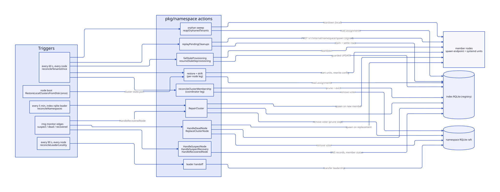
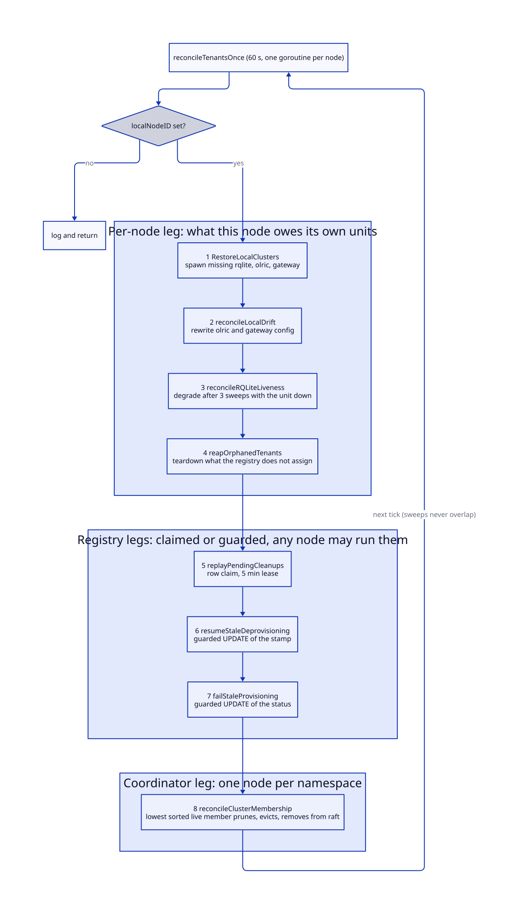
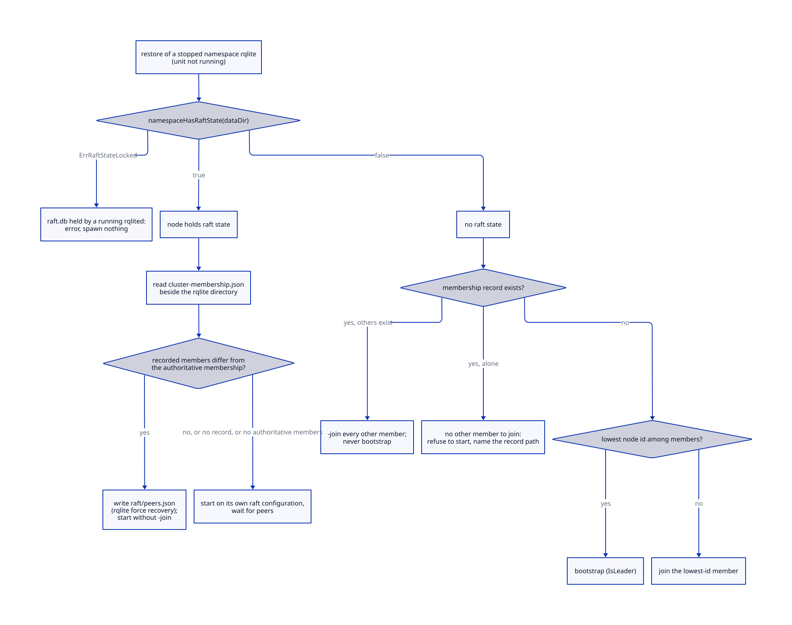
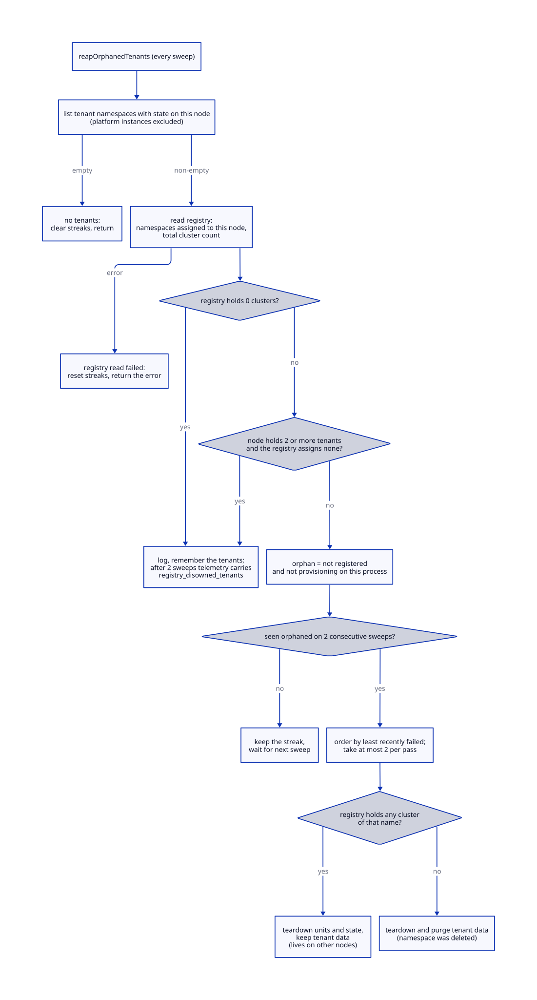
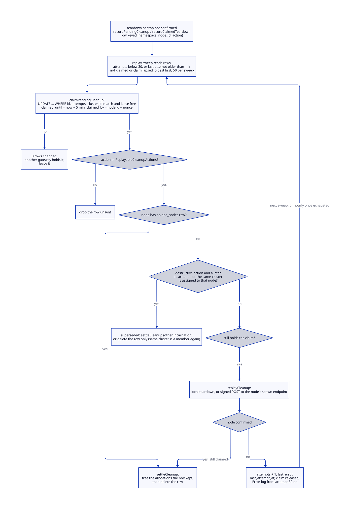
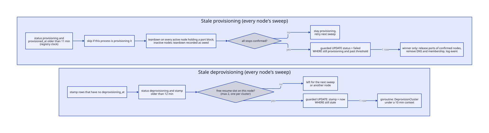
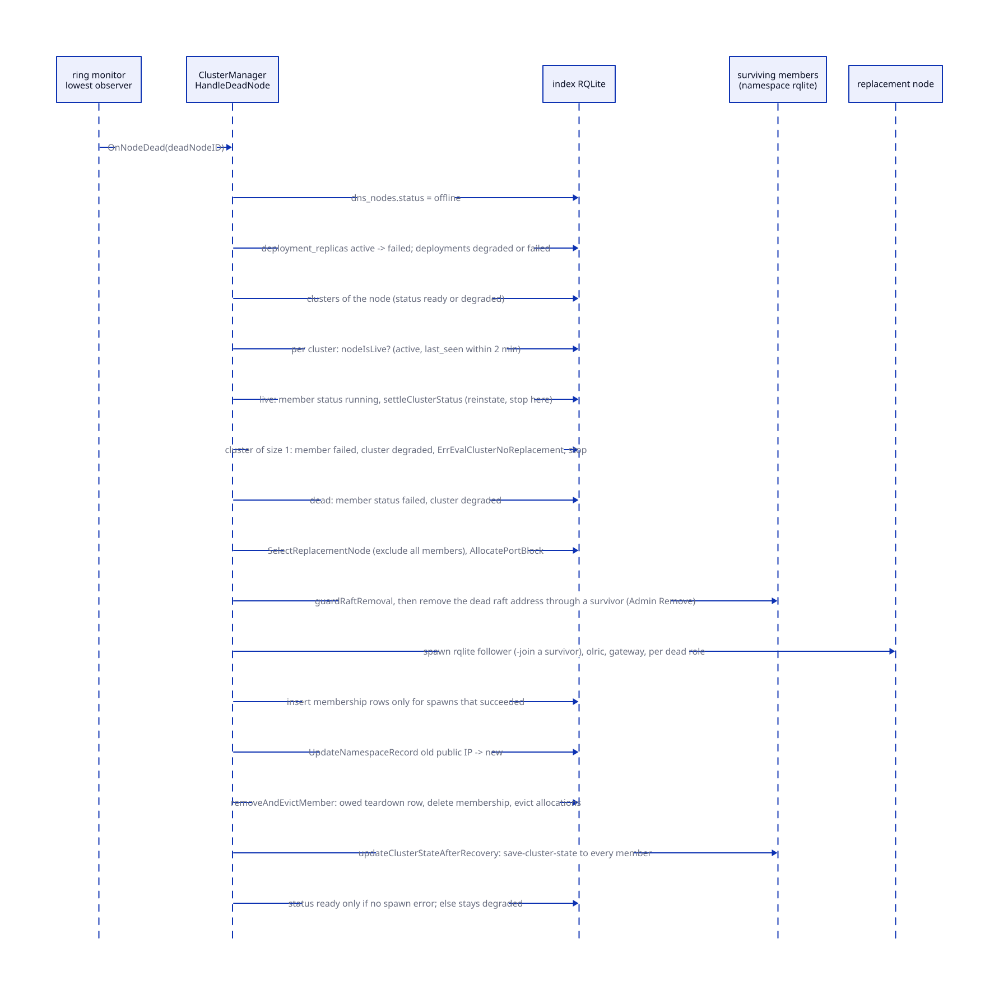

# Reconciliation and recovery

> **At a glance.**
>
> - **What:** the loops that keep the tenant plane equal to what the index registry says it should be. Every node runs a 60 s sweep that starts missing namespace services, rewrites drifted configs, tears down namespaces the registry no longer assigns to it, replays failed teardowns, fails abandoned provisioning and deprovisioning, and (on one elected member per namespace) removes departed members from the namespace raft. Dead-node replacement, repair and a leader-locality check sit beside the sweep. The principle is level-triggered convergence, with edge-triggered callbacks only as accelerators.
> - **Key numbers:** tenant sweep 60 s; leader locality 90 s, 100 ms RTT threshold, 10 min cooldown; orphan teardown after 2 consecutive sweeps, at most 2 per pass; pending cleanup retried every sweep for 30 attempts then hourly, 5 min claim lease, 50 rows per sweep; stale provisioning 11 min, stale deprovisioning 12 min; members pruned after 15 min of silence; a node is live for 2 min after its last heartbeat; repair check every 5 min on the index RQLite leader.
> - **Code:** `core/pkg/namespace/` (`tenant_reconciler.go`, `cluster_recovery.go`, `raft_restore.go`, `orphan_*.go`, `pending_cleanup.go`, `stale_*.go`, `leader_locality.go`), wired by `core/pkg/gateway/handlers/namespace/core_wire.go` and `core/pkg/gateway/gateway.go`.
> - **Depends on:** [namespaces](09-namespaces.md) for the blueprint, ports and provisioning, [cluster state](07-cluster-state.md) for the RQLite facts the restore relies on, and [membership and failure detection](08-membership-and-failure-detection.md) for the events that start dead-node recovery. Operator-driven recovery is in the recovery chapter (33).



## Why it exists

A tenant namespace is three services on each of three nodes (RQLite, Olric, gateway) plus rows in the index registry that say who hosts what. Nothing about that arrangement stays true by itself. Nodes reboot and come back with their units down. A node is replaced and the survivors keep naming it in their peer lists. A delete half finishes because the gateway that took it restarted. A teardown request reaches a partitioned node and the unit keeps holding a port the allocator has handed to the next namespace. An `orama node upgrade` starts every namespace unit it finds on disk, including those the registry deleted weeks ago.

The first generation was edge-triggered: provisioning ran once, repair ran when the ring monitor declared a node dead, and the boot restore tried a fixed number of times and gave up. Anything else stayed broken until an operator ran a runbook; `core/pkg/namespace/tenant_reconciler.go` records seven manual steps that existed because of it. Those moments are also unreliable triggers: the dead-node callback can fail to fire ([membership and failure detection](08-membership-and-failure-detection.md#known-gaps)), and a restart clears the in-memory state that decides when a suspect node is re-enabled.

Three constraints shaped the replacement:

1. **State lives in the registry, effects live on nodes.** The registry (the index RQLite) alone knows the intended assignment. The effects (running units, config files, data directories) are on each node and are touched only by that node or by a signed request to its spawn endpoint.
2. **Destruction needs more evidence than creation.** Starting a missing service is cheap to undo; deleting a namespace's data is not. The loops that delete (orphan teardown, replayed teardown, stale-cluster failure) refuse to act on any registry read they cannot fully trust, and act at a deliberately slow pace.
3. **Many writers, no leader.** Every node runs every loop against the same rows. The code never elects a leader for the whole sweep. Each step is instead safe to run on all nodes at once: a guarded `UPDATE` whose row count says who won, a lease claim on a row, or a deterministic election among the members of one namespace.

## The model

**Registry.** The index RQLite. This chapter reads and writes `namespace_clusters` (one row per namespace incarnation, with a status and two registry-clock stamps), `namespace_cluster_nodes` (one row per node and role), `namespace_port_allocations` (one row per node and cluster), `namespace_pending_cleanup`, `namespace_cluster_events`, `dns_nodes` and `dns_records`. Chapter 9 defines the first three.

**Assignment.** A node is assigned to a cluster when `namespace_cluster_nodes` or `namespace_port_allocations` names it. Provisioning and recovery write the allocation first and the membership row after the services are up, so a node that reboots in between holds only the allocation (`core/pkg/namespace/orphan_restore.go:clusterAssignedQuery`).

**Incarnation.** A namespace name can be deleted and created again, and each creation gets a new `namespace_clusters.id`. Every destructive step carries the cluster id it was owed for, so a teardown owed for one incarnation cannot hit the next.

**Sweep.** One execution of `reconcileTenantsOnce`: eight steps in a fixed order on one goroutine, each step's error logged and the next step run (`core/pkg/namespace/tenant_reconciler.go:reconcileTenantsOnce`).

**Legs.** The steps fall into three groups by authority. The **per-node leg** is what a node owes its own units. The **registry legs** (replay, resume, fail-stale) touch cluster-wide rows but run on every node, each arbitrated by a claim or a guarded `UPDATE`. The **coordinator leg** (membership pruning) is the only step that elects: one live member per namespace per sweep performs it.

**Coordinator.** The lowest-sorted node id among a namespace's live members, computed on each node from the same read, with no lock and no leader lookup (`core/pkg/namespace/tenant_reconciler.go:tenantReconcileCoordinator`).

**Member, live, viable.** A member is a node with a `namespace_cluster_nodes` row for the cluster. A live member also has `dns_nodes.status = 'active'`. A viable member is live or was seen in the last 10 min (`core/pkg/namespace/cluster_manager_webrtc.go:getWebRTCMemberStatus`, `webrtcMemberGracePeriod`). One query returns both sets, so the WebRTC reconciler and the tenant sweep cannot disagree about who is in.

**Owed teardown.** A stop or teardown that a node did not confirm. It is recorded as a row in `namespace_pending_cleanup`, keyed by `(namespace, node_id, action)`, carrying the cluster id and whether the tenant data goes too. While the row exists the node's port blocks stay reserved and a create of that name is refused. See [owed teardowns](#owed-teardowns-the-pending-cleanup-table).

**Orphan.** A tenant namespace with state on a node (a data directory or a unit) that the registry does not assign to that node. **Stale.** A cluster stuck in `provisioning` or `deprovisioning` past a threshold on the registry's clock, which means the node that started the operation is gone.

**Local state file.** `cluster-state.json` under the namespace's data directory. It lets a node restore its services at boot before the index RQLite has a leader (`core/pkg/namespace/cluster_manager.go:ClusterLocalState`).

**Membership record.** `cluster-membership.json` beside the namespace RQLite data directory: the raft addresses this node last saw in its namespace's configuration. It is the evidence that tells "never was a member" from "lost its data" (`core/pkg/rqlite/membership_record.go:ClusterMembership`).

## How it works

### Edge-triggered and level-triggered

An edge is an event (a node was declared dead, a unit crashed); a level is a state (this unit is not running, this peer list names a node that is gone). An edge-triggered repair works only if the event is delivered once, to a process that survives long enough to act. A level-triggered loop works whenever it eventually looks. The code uses both: edges are accelerators, levels are the guarantee.

| Loop | Kind | Period or trigger | Where it runs | Code |
|---|---|---|---|---|
| Tenant sweep | level | 60 s, first sweep immediately | every node | `tenant_reconciler.go:tenantReconcileInterval` |
| Boot restore from disk | level, once | at index gateway start | every node | `cluster_manager.go:RestoreLocalClustersFromDisk` |
| Leader locality | level | 90 s, first check after 90 s | every node | `leader_locality.go:leaderLocalityInterval` |
| Namespace repair check | level | 5 min | index RQLite leader only | `core/pkg/gateway/namespace_health.go:reconcileNamespaces` |
| DNS probe, withdraw and reclaim | level | 30 s probe, 3 agreeing probes to act | every node, own record only | `core/pkg/gateway/namespace_health.go:reconcileLocalNamespaceDNS` |
| WebRTC reconciler | level | 60 s | every node, elected coordinator | chapter 23 |
| `HandleSuspectNode` | edge | ring monitor: 3 misses | each observer | `cluster_recovery.go:HandleSuspectNode` |
| `HandleDeadNode` | edge | ring monitor: quorum of observers | the lowest-id observer | `cluster_recovery.go:HandleDeadNode` |
| `HandleSuspectRecovery` and `HandleRecoveredNode` | edge | ring monitor: suspect or dead to healthy; both run on each recovery | observer that saw it | `cluster_recovery.go:HandleRecoveredNode` |

The DNS comment in `namespace_health.go` states the reason for the pairing: the re-enable path for a suspect node fires on an in-memory transition, a restart clears that memory, and the record then stays disabled for good. The level-triggered probe is the counterpart that cannot be lost. A node withdraws its own record after 3 unhealthy probes and restores it after 3 healthy ones; a record a peer disabled is reclaimed only once its `updated_at` is 10 min old (`staleDisableReclaimAfter`), so a live suspect verdict is not overridden.

For dead nodes the edge is therefore not required for correctness. If `HandleDeadNode` never fires, the node goes `inactive` in `dns_nodes` after 120 s of silence, the coordinator leg prunes it after 15 min, and the next 5 min repair check, which now sees fewer `running` member rows than expected, adds a replacement. A dead member's rows stay `running` until the edge marks them failed or the prune deletes them, so the repair check cannot see the loss earlier. The edge turns up to 20 minutes into a few.

### The tenant sweep

`StartTenantReconciler` starts one goroutine that runs a sweep immediately and then on a 60 s `time.Ticker` until the context ends (`core/pkg/namespace/tenant_reconciler.go:StartTenantReconciler`). The first sweep is immediate because after a restart this node's tenant services are down. `core/pkg/gateway/handlers/namespace/core_wire.go:WireCoreGateway` runs the disk-backed boot restore once and starts the sweep after it returns; it also starts the leader-locality and WebRTC reconcilers. Only the index gateway calls it; tenant gateways never run any of this.

A sweep needs `localNodeID`. Without it the sweep logs and returns, because it cannot tell which services are its own. Then it runs, in this order:

1. `RestoreLocalClusters`: spawn whatever is missing.
2. `reconcileLocalDrift`: rewrite configs that no longer match live membership.
3. `reconcileRQLiteLiveness`: report this node's RQLite state on the cluster status.
4. `reapOrphanedTenants`: tear down namespaces the registry does not assign here.
5. `replayPendingCleanups`: retry owed teardowns.
6. `resumeStaleDeprovisioning`: claim abandoned deletes.
7. `failStaleProvisioning`: fail abandoned creates.
8. `reconcileClusterMembership`: the coordinator leg.



The steps share a goroutine, so a slow step delays the ones after it, and a `Ticker` holds at most one pending tick, so sweeps never overlap or queue. The cost is real: step 1 spawns synchronously and waits up to 30 s per service for the unit to become active (`core/pkg/namespace/systemd_spawner.go:waitForService`). The code compensates in one place: step 6 only claims abandoned deletes and runs the teardown on a separate goroutine, because a teardown of unreachable nodes takes minutes.

Every step's failure is logged at warning and the sweep continues, since the next sweep retries. The comment above `reconcileTenantsOnce` calls steps 5 to 7 part of the coordinator leg; the code does not elect for them, and only step 8 does.

### Per-node leg: restore and drift

`RestoreLocalClusters` lists the clusters in status `ready` or `degraded` that have a `namespace_cluster_nodes` row for this node, resolves this node's overlay address from `dns_nodes`, and calls `restoreClusterOnNode` for each, continuing past failures (`core/pkg/namespace/cluster_manager.go:RestoreLocalClusters`). It is named for the boot case, but the sweep runs it every 60 s; it does nothing for a service that is running.

`restoreClusterOnNode` takes the namespace lock, re-reads the cluster status (the namespace may have begun its delete since the list was read), reads this node's port block and all members' ports with `notOwedTeardownSQL` applied, and restores each service. The liveness test differs per service:

| Service | Liveness test | If down |
|---|---|---|
| RQLite | systemd unit active; an unknown answer aborts this namespace's restore | `planNamespaceRQLiteStart`, then `spawnRQLiteWithSystemd` |
| Olric | TCP dial to `localhost:<memberlist port>`, 2 s timeout | `spawnOlricWithSystemd` with every other allocation as a peer |
| Gateway (only if some member has the gateway role) | HTTP `GET /v1/health` on the node's overlay address and gateway port; any HTTP response counts as up | `spawnGatewayWithSystemd`, WebRTC config read from the registry |

`serviceRunning` returns `(running, known)`: a failed `systemctl` or D-Bus call is "unknown", not "inactive", because re-spawning stops the unit first and a momentary inability to ask would cause the outage the check guards against (`core/pkg/namespace/tenant_reconciler.go:serviceRunning`). The Olric test dials the wrong address; see [Known gaps](#known-gaps).

Afterwards the function writes `cluster-state.json` from the registry's current allocations, so the next cold boot sees the membership this sweep saw.

`reconcileLocalDrift` handles the services that restore skipped because they were running. For each assignment it computes the desired config from live membership (`desiredLocalConfig`) and applies it to Olric and the gateway, only for an active unit; a stopped unit is restore's job, and its cold spawn writes a fresh config.

`desiredLocalConfig` reads this node's port block and the cluster's peers, joining allocations to `dns_nodes` with `status = 'active'` and an `EXISTS` on `namespace_cluster_nodes`. The `EXISTS` replaced a join: the membership table holds one row per role, so the join listed every peer three times, the desired list never equalled the one spawn wrote, and every fresh gateway was restarted as drifted. Peer and server lists are sorted.

The two services are treated differently on purpose.

- **Olric** is rewritten but not restarted. `ReconcileOlric` compares the on-disk YAML to the desired one, peers as a set (their order comes from a database query and means nothing to Olric), and calls `SpawnOlric` only on a real difference (`core/pkg/namespace/systemd_spawner.go:ReconcileOlric`, `olricConfigInSync`). `SpawnOlric` writes the file and calls `StartService`, which for a stateful clustered service (`restartsOnInputChange` is false) never restarts a running unit as a side effect (`core/pkg/systemd/manager.go:StartService`). The new peer list applies at the next deliberate restart. The same reconcile runs on every node, and restarting Olric members, like RQLite voters, on several nodes at once is what a rolling procedure exists to prevent. A running member needs the list no sooner: memberlist drops a departed peer on its own and reads `memberlist.peers` only at start.
- **The gateway** is rewritten and restarted. `ReconcileGatewayMembership` reads the YAML the gateway runs with, replaces only the port and the Olric server list, and hands the result to `ReconcileGateway`, which compares every YAML field and calls `RestartGateway` only on a difference. Rebuilding DSNs, secrets and WebRTC from a membership-only view once produced a skeleton config that never matched, and every sweep restarted the gateway into a config it could not start with.

An absent port allocation is not an error: `desiredLocalConfig` returns nil, since the assignment is being torn down or not yet written, and neither is a reason to touch a running service.

### RQLite liveness and the cluster status

A status written once at provisioning goes stale: a stagenet namespace sat `ready` for an hour while one member's unit crash-looped 640 times. `reconcileRQLiteLiveness` makes `ready` depend on observation (`core/pkg/namespace/rqlite_liveness.go`).

Each node watches its own RQLite unit through `localRQLiteRunning`, with an in-memory per-cluster counter of consecutive sweeps with the unit not active (`observeRQLite`). After `rqliteDownSweepsBeforeDegraded` (3) sweeps the node writes the cluster to `degraded` with the message `rqlite is not running on node <id>`. Several nodes append their ids, sorted and comma separated; each write replaces the whole message, so a node whose entry another node's write dropped adds it back on its next sweep, and the message converges on the set of nodes reporting down. A node whose unit is active again removes its entry, and when the list is empty it calls `settleClusterStatus`. A node named in the message that is no longer a member is dropped, because a node that left can never clear its own entry. A cluster that is `degraded` for another reason has its message replaced.

Only the cluster status changes. The member's row keeps `running`, because a `failed` row sends the repair path off to replace a node that is alive. An unknown unit state leaves the counter and the cluster alone. The cluster stays served while degraded.

`settleClusterStatus` is the common exit: it counts distinct nodes with a `running` or `starting` member row and writes `ready` if there are at least `RQLiteNodeCount`, otherwise `degraded` with `N of M nodes running` (`core/pkg/namespace/cluster_recovery.go:settleClusterStatus`). It exists because `RepairCluster` once returned early on a fully recovered cluster without clearing `degraded`, which kept the namespace refused at the edge.

### Raft restore: peers.json versus join

A namespace RQLite that is not running is restored by the node alone, and two decisions can split the namespace: forcing a raft configuration with a recovery `peers.json`, and bootstrapping a new cluster when the node holds no raft state. Both are taken only on evidence of what this node's configuration was (`core/pkg/namespace/raft_restore.go`).



**Is there raft state?** `namespaceHasRaftState` calls `rqlite.HasRaftState` on `<base>/<ns>/rqlite/<node id>`, which looks for `raft.db` and snapshots at the root of that directory (`rsnapshots/` up to rqlite 9, `wsnapshots/` from 10). An earlier version looked for a `raft/` subdirectory, which only holds the `peers.json` this manager writes, so it returned false on every real member and a restarted member was handed `-join`. If a running `rqlited` holds `raft.db` although the unit is not running (`rqlite.ErrRaftStateLocked`), the function returns an error: guessing either way spawns a second `rqlited` or a duplicate voter.

**A node with raft state** keeps its own configuration unless the evidence says it is wrong. `needsPeersRecovery` compares the node's membership record with the authoritative member list and returns true only when both are non-empty and differ as sorted, de-duplicated sets. Only then does `writePeersJSON` write `<dataDir>/raft/peers.json`, RQLite's force-recovery mechanism, after removing the leftovers of an earlier recovery (`rqlite.RemoveRecoveryLeftovers`). With no record the node's configuration is unknown, so it restarts on its own configuration and waits for its peers. Writing `peers.json` on every restart of a namespace that is live elsewhere used to force this node's view onto one the live leader had since changed.

**A node without raft state** calls `restoreJoinPlan`:

- With a membership record it has been a member and lost its data. It joins every other member and never bootstraps, because electing itself leader of an empty cluster while the others hold the data is a split brain. With no other member to join it refuses to start and names the record file; deleting the record bootstraps an empty cluster deliberately.
- Without a record it has never been a member and takes part in the deterministic election: the member with the lowest node id bootstraps, the others join it. An empty member list is an error.

**The record** is written by `recordNamespaceMembership` whenever a restore pass finds the namespace RQLite running: it reads `status.Store.Nodes` from the local admin endpoint and calls `rqlite.RecordMembership`, which validates every address, refuses an empty set and keeps the first-seen time. A failure is logged and the next pass retries. A corrupt record on a node that holds raft state is dropped (its state proves membership and the next pass records it again); without state it is an error the node refuses to start on (`readNamespaceMembership`).

The sweep path (`restoreClusterOnNode`) takes the authoritative members from the registry's allocations; the boot path differs in where they come from, as the next section shows.

### Boot restore from disk and the registry check

At boot the index RQLite may have no leader yet, and the tenants should come up anyway. `RestoreLocalClustersFromDisk` globs `<base>/*/cluster-state.json` and restores each namespace from its local state, with no registry dependency for the plan (`cluster_manager.go:RestoreLocalClustersFromDisk`, `restoreClusterFromState`). Beyond the sweep's restore, it re-advertises this node in the namespace's `ns-<name>` DNS records; reconciles a running gateway's full config after resolving the WebRTC secret DB-first with 5 reads 2 s apart (`webrtcResolveRetries`), falling back to the secret cached in the state file and leaving a running gateway's TURN block alone when neither source has it; and reconciles the namespace's WebRTC role allocations (chapter 23). After every namespace it reconciles the host's shared TURN server once, so TURN sees the node's complete tenant set.

The risk is restoring something the registry has since deleted or moved. `restoreAssigned` (`core/pkg/namespace/orphan_restore.go`) answers per namespace, by cluster id:

| Registry answer | Action |
|---|---|
| The assignment count cannot be read | Restore from local state and log; the local state is all there is |
| The registered-namespaces read fails after the count succeeded | Do not restore this namespace; the error is returned and the next boot or sweep decides |
| Assigns this node to this cluster id (membership or allocation) | Restore |
| Holds no cluster at all | Restore and warn; an empty registry proves nothing |
| Assigns this node to another cluster of the same name | A previous incarnation: `StopAll` and delete `cluster-state.json`, restore nothing |
| Assigns this node nothing under that name | Tear it down, under the orphan guards below |

The last row is `tearDownUnassignedAtBoot`: it restores instead of tearing down when the node's tenant list cannot be read, when the registry disowns every tenant on a node that holds at least 2, and when the boot has already torn down 2 namespaces (`orphanTeardownsPerPass`). If the registry is right, the orphan sweep removes the remainder. An allocation owed a teardown does not count as an assignment.

When a restored node has raft state, `writeRestorePeersJSON` reads live peers from the registry (`liveRaftPeers`) and `choosePeersJSONSource` returns only two answers: the live membership if readable, or "skip"; the peers.json is written only if `needsPeersRecovery` agrees. A third answer used to exist, a single-node configuration "to at least get a leader" when the registry was unreadable and no peer answered. That is every node's view during a full cold start, so each would have made itself a cluster of one and split every namespace. A node that keeps its configuration waits for its peers. Forcing a smaller cluster is an operator decision (recovery chapter, 33).

### The orphan sweep

Teardown (the delete path, covered in [namespaces](09-namespaces.md)) removes a namespace from the nodes the coordinator could reach. A node that was down, a rollback that could not finish, or a namespace deleted by an older release leaves units and state that an upgrade or reboot brings back to life. `reapOrphanedTenants` is the backstop: each node compares its own disk with the registry and tears down what the registry does not assign to it (`core/pkg/namespace/orphan_teardown.go`).



Teardown is destructive, so every doubt means do nothing:

- **The registry read must succeed and hold at least one cluster.** An empty registry beside a node full of tenants is a fresh or lagging database, not a fleet that deleted every namespace. The registry is read after the local listing, so a namespace provisioned in between already has allocation rows and reads as registered.
- **A namespace this process is provisioning is never touched** (`isProvisioningLocally`).
- **An orphan must be seen on `orphanSweepsRequired` (2) consecutive sweeps.** `confirmOrphans` keeps a per-namespace streak; a namespace missing from a sweep's list loses it, so a sweep that could not decide passes nil.
- **The node's own instances are never candidates.** `index`, `nameserver`, `system`, `default` and the reserved names are excluded (`core/pkg/namespace/teardown.go:isPlatformNamespace`).
- **A registry that disowns every tenant is a registry problem.** A node holding at least `orphanGuardMinTenants` (2) tenants of which the registry assigns none logs an error and tears nothing down: the signature of a database restored from an older snapshot or a node pointed at another cluster. A node with one tenant relies on the two-sweep rule and the cap.
- **At most `orphanTeardownsPerPass` (2) namespaces per pass.** `leastRecentlyAttempted` orders the due namespaces by when their last teardown failed (never attempted first, then the longest ago, ties alphabetical), so repeated failures cannot starve the others of the cap. The record of a namespace that is no longer orphaned is dropped.

What the teardown removes depends on the registry: if no cluster of that name exists anywhere, the namespace was deleted and its tenant data goes too; if it lives on other nodes, this node only stops hosting it (`teardownUnassigned`). Each teardown goes through `SystemdSpawner.TeardownNamespaceOfCluster`, which refuses platform namespaces, takes the namespace lock, and for a request that names a cluster refuses when `cluster-state.json` names another (`ErrClusterMismatch`). Unit teardown mechanics are in [namespaces](09-namespaces.md).

The "registry disowned" state is surfaced rather than only logged. `setRegistryDisowned` counts consecutive sweeps; `RegistryDisownedTenants` returns the tenant list only after 2 of them, and `core_wire.go` hands that function to the gateway, which puts it in the node's telemetry report as `registry_disowned_tenants`, where `orama status report` raises a critical `namespace` alert. An empty registry sets it too, and a failed registry read neither raises nor clears it.

### Owed teardowns: the pending-cleanup table

Every stop or teardown that a node does not confirm is work still owed, not a warning. The unit keeps running and keeps a port the allocator has already released, and the next namespace given that port finds it taken and, in the original incident, joined a foreign raft group. `namespace_pending_cleanup` records the debt (`core/pkg/namespace/pending_cleanup.go`; schema in `core/migrations/039_namespace_pending_cleanup.sql`, `066_pending_cleanup_incarnation.sql`, `069_pending_cleanup_claim.sql`, `070_pending_cleanup_claimed_by.sql`).

**Recording.** `recordPendingCleanup` upserts on `(namespace, node_id, action)`: a repeat increments `attempts`, keeps a known cluster id, and ORs `purge_data` so a later non-purging record cannot downgrade the delete. If the record cannot be written, the error wraps `errCleanupNotRecorded`, nothing is owed, and the delete returns an error and keeps the cluster row for a retry. `recordClaimedTeardown` records the debt of an evicted member already claimed by the caller, in one statement, so no replay can read the row between insert and claim.

**Actions.** `ReplayableCleanupActions` lists what a row may carry: `stop-rqlite`, `stop-olric`, `stop-gateway`, `stop-sfu`, `stop-turn`, `teardown-namespace`, `teardown-sfu`, `teardown-turn`. The `stop-*` actions only stop a unit and are safe to repeat; the three `teardown-*` actions are destructive (`isDestructiveCleanup`). A row with any other action, notably the `stop-all` an older release wrote and no node accepted, can never succeed and is dropped unsent.

**Replay.** `replayPendingCleanups` reads rows where `attempts` is under 30, or the last attempt is older than `pendingCleanupExhaustedRetry` (one hour), and the claim is free or lapsed, oldest first, `pendingCleanupBatch` (50) per sweep. A row is tried on every sweep for its first 30 failures and hourly after that. It is never dropped for failing: an exhausted row keeps refusing a create of the namespace's name and keeps the node's port blocks reserved, and every failed retry is logged at Error. Nothing raises a monitor alert on it ([Known gaps](#known-gaps)).



**Claim.** Every gateway runs the sweep and reads the same rows. `claimPendingCleanup` is an `UPDATE` matching the row id, the attempt count the row was read with, the cluster id and a free or lapsed lease; it sets `claimed_until` to `datetime('now', '+5 minutes')` (`pendingCleanupClaimLease`) and `claimed_by` to the node id plus a random 16-byte token. Exactly one gateway's statement changes a row. A gateway that read the row before another replayed and failed it finds the attempt count changed and leaves it, so `attempts` counts one replay per sweep, not one per gateway. The release is `WHERE id = ? AND claimed_by = ?`, so a lease that lapsed mid-replay and was retaken is not erased. The lease must outlast one replay, which includes a spawn request with a 60 s timeout; a gateway that dies holding a claim blocks the row for at most 5 min.

**Checks before sending.** `replayRow` runs these in order after claiming:

1. The action must be replayable.
2. If the node has no row in `dns_nodes` (`nodeRemoved`), it was removed from the cluster and its units went with it: settle the row. A node that is merely offline or inactive keeps its row and its debt.
3. For a destructive action, `pendingCleanupSuperseded` asks whether the registry places another cluster of the same name on this node, by membership or allocation (`otherIncarnationAssignedQuery`), and for SFU or TURN also by a `webrtc_port_allocations` row of that type. If so the namespace was created again and the teardown would delete the new one: settle the row, which frees only the old incarnation's blocks. A row with no recorded cluster id treats every cluster as another one.
4. If the node is a member of the very cluster the row was owed for (`isClusterMember`), the node was given the cluster again and the block is a live member's: delete the row without sending or freeing anything.
5. Re-confirm the claim is still held (`holdsPendingClaim`); a row withdrawn by a re-add is not this replay's.

If the registry cannot answer any of these checks, nothing is sent.

**Sending.** `replayCleanup` runs a local teardown directly when the row is this node's own `teardown-namespace`; otherwise `sendStop` posts a signed spawn request to the recorded overlay address, or the node's currently registered one. The request carries `purge_data` for a purging teardown and the `cluster_id` for any destructive action, and the receiving handler answers HTTP 409 when its own state names another cluster. A failure updates the claimed row only (`recordReplayFailure`) and never inserts: inserting a row a re-add just withdrew would hide the re-added node's block from the cluster's reads and send a teardown to a node being spawned.

**Settling.** On success `settleCleanup` frees the allocations the failed teardown kept, and only then deletes the row; the other order loses the ports for good when the free fails. What is freed depends on the action (`owedUnreleasedAllocations`): `teardown-namespace` frees the SFU and TURN rows and the core block, `teardown-sfu` and `teardown-turn` free their own rows, and the `stop-*` actions free nothing.

**Reading the cluster without the evicted member.** `notOwedTeardownSQL` narrows a read of port blocks to members the cluster still uses: a block whose node owes a `teardown-namespace` for that cluster is excluded from cluster state, join lists, surviving ports, the node's own restore and the desired config. The allocators' capacity reads still count it, so the ports stay taken.

**Eviction order.** `removeAndEvictMember` records the teardown the leaving member owes first, claimed by the caller, then deletes the membership row, then attempts the teardown and eviction. A crash after the membership row went still has the owed row to free the block from; recording after it would leave a block that no membership names and no row owes. The claim stops a replay from reading the node as a member while its membership row is still there. If the eviction freed everything the row is deleted, since a node gone from the registry sends no teardown to clear it; if the teardown stays owed the claim is released so the next sweep can retry.

**Giving the node the cluster again.** Allocating a port block to a node for a namespace withdraws the destructive rows owed there (`withdrawPendingTeardowns`, `withdrawOwnPendingTeardown`), freeing the old incarnation's allocations first. If the block handed back was owed, a rollback of that add (`rollbackPortBlock`) records the teardown again instead of freeing the block, because the units may still run. **Residual window:** a teardown already on the wire when a re-add withdraws its row can still reach the node and stop the units being spawned. The receiver cannot tell it from a legitimate one, because its cluster-id guard covers only another incarnation. A later sweep repairs the cluster left short.

### Stale provisioning

Provisioning runs on the one node that took the create request, bounded by `provisioningTimeout` (5 min), with a 3 min rollback and a 2 min failure write. If that process restarts, the cluster would stay `provisioning` forever. `failStaleProvisioning` fails it (`core/pkg/namespace/stale_provisioning.go`; constants in `core/pkg/namespace/registry_retry.go`).



The threshold is `staleProvisioningAfter = provisioningTimeout + rollbackTimeout + markFailedTimeout + 1 min`, 11 min, so a run merely finishing its last write is never failed from under itself. Age is judged in SQL on the registry's clock: `provisioned_at` is written with `CURRENT_TIMESTAMP`, and the predicate is `datetime(provisioned_at) < datetime('now', '-660 seconds')`. `datetime()` returns NULL for a value it cannot parse, which never satisfies the comparison, so an unreadable `provisioned_at` is logged at Error by `reportUnreadableProvisionedAt` and skipped rather than treated as ancient. A cluster this process is provisioning is skipped.

The order inside `failStaleCluster` is the safety:

1. `stopStaleClusterServices` tears the namespace down on every active node holding a port block, attempting all and joining failures. A registered node that is not active cannot confirm a stop (it may be restarting with its units running); its teardown is recorded as owed and its block stays reserved. Only overlay addresses are used. If any stop fails the cluster stays `provisioning` and the next sweep retries: ports are never released under a process that may still be bound to them.
2. The guarded `UPDATE ... SET status = 'failed' WHERE id = ? AND status = 'provisioning' AND` the age predicate. Every node runs the sweep and exactly one statement changes a row.
3. The winner alone releases the ports of every node not owed a teardown (`releaseAllocationsExceptOwed`), removes the DNS and membership rows (`removeClusterServingRecords`), and logs the event.

### Stale deprovisioning

A delete runs on the one node that took the request. If that node restarts, loses the registry or is cut off, the cluster stays `deprovisioning` with its member rows `running` and nothing carries the teardown on. No other sweep reads such a cluster: restore and drift read `ready` and `degraded` only, and the orphan sweep reads units on a node (`core/pkg/namespace/stale_deprovisioning.go`).

Ownership of a teardown is a stamp. `BeginDeprovision` is the claim a delete takes first: one `UPDATE` sets the cluster to `deprovisioning` with `deprovisioning_at = CURRENT_TIMESTAMP`, unless it is already `deprovisioning` with a stamp inside the window. If nothing changed and a cluster exists it returns `ErrDeprovisionInProgress`; with no cluster it returns nil. Two deletes, or a delete and a resume, cannot both pass. `DeprovisionCluster` re-stamps the cluster between its steps (`refreshDeprovisionLease`) so a slow but live teardown is never taken over, and a delete that fails calls `ReleaseDeprovision`, which ages the stamp out by a day so a retry is not refused and the reconciler may resume it.

The window is `staleDeprovisioningAfter = DeprovisionTimeout + 2 min`, 12 min, strictly beyond the 10 min a live teardown can run. `resumeStaleDeprovisioning`:

1. Stamps every `deprovisioning` row with no stamp; a release that did not stamp may still be running its delete, so the row gets a whole window.
2. Lists clusters whose stamp is older than the window. An unparseable stamp is neither fresh nor stale and is left alone.
3. For each, `startResume` takes a local slot (`reserveResume`: at most `maxConcurrentResumes` = 2 per node, one per cluster), then takes the cluster with a guarded `UPDATE` that restarts the stamp; only the node whose statement changes the row proceeds. The slot comes before the claim so a cluster this node has no room for stays stale for the next sweep or another node.
4. Runs `DeprovisionCluster` on its own goroutine under a `DeprovisionTimeout` context.

The sweep only claims, because a teardown of unreachable nodes takes minutes. A resume finishes the cluster: units stopped and disabled on every active member, unconfirmed nodes recorded as owed, ports freed, DNS and membership withdrawn, cluster row deleted. If a node did not confirm, `DeprovisionCluster` returns `ErrTeardownIncomplete` after the registry side is done, and the resume logs a warning because the debt is recorded. The namespace row, deployments and grants belong to the delete request and remain until the owner or an operator repeats the delete, which finds no cluster and finishes them.

### The coordinator leg: pruning members and raft

`reconcileClusterMembership` is the only elected step. For each cluster this node is assigned to, it reads the live member set through `getWebRTCMemberStatus`, elects `tenantReconcileCoordinator(live)` (lowest sorted id) and acts only if that is the local node (`core/pkg/namespace/tenant_reconciler.go:reconcileClusterMembership`). It calls `pruneStaleClusterNodes`. Two coordinators during a membership flap would both prune; that is tolerated because the work is idempotent.

`pruneStaleClusterNodes` deletes members that are permanently gone (`core/pkg/namespace/cluster_recovery.go`):

- A cluster with `RQLiteNodeCount == 1` (the one-node eval blueprint) is never pruned: that would delete the only membership and allocation and leave restore nothing to join.
- A stale member has a `dns_nodes.status` other than `active` and a `last_seen` older than `clusterNodePurgeStaleAfter`, 15 min (`staleClusterNodeSQL`). The constant mirrors the DNS layer's purge horizon and cannot be imported because `core/pkg/node` imports this package, so a comment says to keep the two in sync by hand. It is deliberately longer than the 10 min WebRTC grace: deleting a membership row is harder to undo than excluding a node from one reconcile pass.
- For each stale member, `removeMemberFromRaft` runs first, while the allocation still names the member's address, and the prune continues only if it succeeds. If no survivor accepts the removal the member stays registered and the next sweep retries. Forgetting the member first, or never removing it, is how a replaced node stayed a configured voter and made every restart rewrite a recovery `peers.json`.
- Then `removeAndEvictMember`.

**The raft removal and its guards.** The raft id of a namespace RQLite is its raft address, `<overlay ip>:<raft port>`. `memberRaftAddr` builds it from `dns_nodes.internal_ip` and the allocated raft port; a member with a raft port but no `internal_ip` is an error, never addressed by its public IP. Before anything is sent, `guardRaftRemoval` refuses:

1. an address that is not `host:port`;
2. a host outside the WireGuard overlay (`constants.WireGuardOverlay()`, 10.0.0.0/24);
3. an address equal to a surviving member's raft address, since removing it would remove a live member;
4. a removal after which `voters` would be fewer than `(voters+1)/2 + 1`, where `voters` counts survivors with a raft port. Without a leader the removal cannot commit; the error names the procedure "Emergency: namespace RQLite lost quorum" in `docs/NODE_REPLACEMENT.md`. `orama maint node recover-raft` recovers the platform cluster, not a namespace.

`removeDeadNodeFromRaft` then tries each surviving member's RQLite admin endpoint in turn (`AdminClient.Remove`, HTTP `DELETE /remove`, 30 s timeout) until one accepts. RQLite accepts removal of an id that is not in the configuration, so concurrent prunes of one member on several nodes do not fail each other. Survivors are members whose node is still `active`, so a second dead member is not counted as a voter that could commit the removal.

### Dead node: HandleDeadNode and ReplaceClusterNode

The ring monitor calls `HandleDeadNode` once per death, on the lowest-id observer that sees quorum ([membership and failure detection](08-membership-and-failure-detection.md#quorum-and-the-single-recoverer)). The handler runs under `context.Background()` (`core/pkg/gateway/gateway.go`), so it is not bound to any request.



`HandleDeadNode` (`core/pkg/namespace/cluster_recovery.go`):

1. Sets `dns_nodes.status = 'offline'`.
2. `markDeadNodeReplicasFailed`: every active `deployment_replicas` row on the node becomes `failed`, and each affected deployment becomes `degraded` if it still has an active replica or `failed` if not, with a `deployment_events` row. This happens before namespace recovery so routing excludes the node immediately instead of discovering it through circuit breakers.
3. Finds the clusters in `ready` or `degraded` that have a member row for the node.
4. For each, sequentially (to avoid loading replacement nodes), guarded by an in-process flag `recovery:<cluster id>`, calls `ReplaceClusterNode`. A failure is logged and an `EventRecoveryFailed` event written; the next cluster continues.

`ReplaceClusterNode(cluster, deadNodeID)` runs these steps:

0. **Reinstate if alive.** `nodeIsLive` asks for `status = 'active'` and `last_seen` within `nodeLivenessWindow` (2 min, the node selector's window). The handler marked the node offline, so it is live here only if its own heartbeat re-registered it meanwhile, which a restarted node does within one 30 s heartbeat. Replacing a live node discards a healthy member, and on a cluster that spans the whole fleet there is no replacement to find: the later steps would commit `failed` and `degraded` and bail out, wedging the cluster. A query failure counts as not live. If live, the member row is set back to `running` (`reinstateNode`), an `EventRecoveryComplete` event is logged, `settleClusterStatus` runs, and nothing else happens.
1. A cluster of size 1 cannot be replaced onto another machine: the member is marked failed, the cluster `degraded`, and `ErrEvalClusterNoReplacement` is returned. The node is waited for.
2. Marks the dead member's rows `failed` and the cluster `degraded` with `Node X is dead, recovery in progress`.
3. `SelectReplacementNode` with every current member excluded. It considers active nodes with spare namespace slots, scores them and takes the best; no eligible node is `ErrInsufficientNodes`.
4. `AllocatePortBlock` on the replacement. The call is idempotent per `(cluster, node)` and reports `blockOwed` if the block it hands back was owed a teardown (see above).
5. Reads the survivors' ports, excluding the dead node and the replacement, `status = 'active'` and `notOwedTeardownSQL`. The replacement is neither a survivor to ask nor a voter to count.
6. If the dead node held an RQLite role, removes its raft address from the namespace raft (`removeDeadNodeFromRaft` with the guards above) before the replacement joins. On failure it rolls back the replacement's port block (`rollbackPortBlock`) and aborts.
7. Spawns an RQLite follower on the replacement, joining the first survivor's raft address, then Olric with the survivors' memberlist addresses as peers, then the gateway with all Olric servers including the replacement's. Local replacement uses the systemd spawner directly; a remote one goes through the signed spawn endpoint. Each role is spawned only if the dead node held it. WebRTC config is added to the gateway so the TURN secret is present even if the replacement holds no SFU allocation (it is namespace-wide).
8. A membership row is inserted only for a spawn that succeeded. A spawn failure is counted in `spawnErrors` and does not stop the others.
9. Swaps the dead node's public IP for the replacement's in the `ns-<name>` and wildcard records (`UpdateNamespaceRecord`). It is an upsert in effect: if the old row is already gone (the stale-record purge or an earlier disable) it inserts the replacement additively, so the replacement enters the round-robin either way.
10. `removeAndEvictMember` for the dead node, then `updateClusterStateAfterRecovery`, which rebuilds `cluster-state.json` on every current member by signed `save-cluster-state` requests.
11. The cluster becomes `ready` only if `spawnErrors == 0`; otherwise it stays `degraded`. An event `EventNodeReplaced` with the pair is recorded.

`abortReplacement` replaces "recovery in progress" with the real cause and the statement that the cluster stays degraded until retried, since nothing is recovering any more.

TURN and SFU roles are not moved here. The WebRTC reconciler reassigns them (WebRTC chapter, 23).

### Suspect, recovered and reinstated nodes

`HandleSuspectNode` (3 consecutive missed probes) disables the node's public IP in the `ns-<name>` and wildcard records of every cluster it belongs to. Every observer runs it, under a per-node in-process flag `suspect:<id>`. The guard "never disable the last active record for a name" is inside the `UPDATE` (`DisableNamespaceRecord`): two observers that each read a count of 2 and each disabled would leave the namespace resolving nowhere, so count and write are one statement, and each of the two names is guarded on its own count. A statement that changes nothing means the guard held.

`HandleSuspectRecovery` re-enables those records. `HandleRecoveredNode` handles a node that came back after being declared dead. If it still has a `namespace_cluster_nodes` row it is marked `active` and `repairDegradedClusters` runs `RepairCluster` for each degraded cluster it belongs to. If it has none it was replaced during its downtime: the handler finds the clusters whose `EventRecoveryStarted` events named this node in the last 24 h, tears each down on the node with `teardownNamespaceOnNode` (a teardown, not a stop, so units and data do not return at the next upgrade), and marks the node active. Beyond 24 h the orphan sweep on that node is the only backstop.

### RepairCluster

`RepairCluster(namespace)` adds missing members without touching survivors (`core/pkg/namespace/cluster_recovery.go:RepairCluster`). It is called from the 5 min check on the index RQLite leader, from the internal route `POST /v1/internal/namespace/repair` (coordination-v2 MAC required), from `orama namespace repair` (`core/cmd/orama/internal/namespace_commands.go`), which posts to that route, and from `HandleRecoveredNode`.

The 5 min check (`core/pkg/gateway/namespace_health.go:reconcileNamespaces`) runs only on the index RQLite leader (`isRQLiteLeader`; a probe failure is an error and the check is skipped, not read as "not the leader"). It selects clusters in `ready` or `degraded` where the number of `running` member rows is below `rqlite_node_count + olric_node_count + gateway_node_count`, and calls `RepairCluster` for each.

`RepairCluster`:

1. Requires the cluster to be `ready` or `degraded`, and takes an in-process flag `repair:<cluster id>`; a second call returns `ErrRecoveryInProgress`.
2. Prunes permanently gone members (`pruneStaleClusterNodes`), because a member that died without `HandleDeadNode` ever confirming it would otherwise keep its row, count as active and never be replaced. A prune error is logged and repair goes on with the unpruned membership. After a prune it regenerates `cluster-state.json` on every node.
3. Reinstates members marked `failed` whose node is live again, so a node that merely restarted does not stay failed.
4. Counts distinct nodes with a `running` or `starting` row. At least `RQLiteNodeCount` settles the status and returns; a cluster of size 1 returns `ErrEvalClusterNoReplacement`.
5. Otherwise adds the missing nodes one at a time with `addNodeToCluster`: select (excluding every node with a member row), allocate, spawn the RQLite follower, Olric and gateway, add DNS records for the new node's public IP. A failed RQLite spawn rolls the block back and ends the loop; a failed Olric or gateway spawn is logged and the add counts as done. After at least one add it rebuilds the cluster state and marks the cluster `ready`, even if fewer nodes were added than were missing.

Repair spawns RQLite as a follower that joins an existing member and removes nothing from raft. The raft removal for a departed member is the prune step's job, so prune plus add is what `ReplaceClusterNode` does in one pass.

### Leader locality

Namespace raft leadership is geography-blind: the initial leader is the lowest node id, which is random, and raft re-elects freely on every restart. When a distant node (high WireGuard RTT to its peers) becomes leader, every namespace write waits on its cross-region replication for quorum; the file comment records each RQLite hop going from about 20 ms to about 256 ms and stacking into 5 to 10 s RPCs that broke calling (bugboard #708). The leader-locality reconciler moves leadership off an isolated leader. It never removes a node or changes voter membership (`core/pkg/namespace/leader_locality.go`).

Every `leaderLocalityInterval` (90 s) each node globs its `cluster-state.json` files and asks its own RQLite for its raft state per namespace. A node that is not `Leader` does nothing. A leader reads the node list and probes every other voter: `measureRaftRTT` is the time of a TCP connect to the voter's raft address with a 3 s timeout, a privilege-free proxy for the WireGuard round trip.

`decideLeadershipTransfer` is pure and transfers only if this node is the leader, every other voter was reachable and measurable (an already-degraded cluster is not destabilised), the cooldown has elapsed, and even the closest peer is strictly farther than 100 ms (`leaderLocalityRTTThreshold`). The target is the nearest peer. Co-located nodes are about 20 ms apart and a distant node about 256 ms, so 100 ms separates them: a leader with a nearby voter is central enough, and in a lone-distant-node topology the transfer lands on a co-located node that never triggers again.

The cooldown is `leaderLocalityCooldown` (10 min) per namespace, in memory, and is recorded before the transfer is attempted so a slow or looping transfer cannot re-fire whatever the outcome. In a topology where every node is far from every other, it bounds the rotation to about one transfer per namespace per 10 min. The transfer is `rqlite.TransferLeadershipTo`: `POST /leader` with the target id, then a poll for step-down up to 15 s (`core/pkg/rqlite/leadership.go:transferStepDownTimeout`). A failure is logged at warning.

## State it owns

| Item | What it holds | Who writes | Who reads | Where |
|---|---|---|---|---|
| `namespace_clusters.status` | `provisioning`, `ready`, `degraded`, `failed`, `deprovisioning` | provisioning, repair, replace, liveness, stale sweeps, delete | everyone | index RQLite |
| `namespace_clusters.provisioned_at`, `deprovisioning_at` | registry-clock stamps (`CURRENT_TIMESTAMP`) | insert, `BeginDeprovision`, `refreshDeprovisionLease`, resume claim | the two stale sweeps | index RQLite |
| `namespace_clusters.error_message` | the cause of `degraded` or `failed`, including `rqlite is not running on node ...` | liveness, abort, stale sweeps | status route, operators | index RQLite |
| `namespace_cluster_nodes` | one row per node and role, status `running`, `failed`, `starting` | provisioning, replace, repair, prune, reinstate | restore, repair, health loop | index RQLite |
| `namespace_port_allocations` | each node's 5-port block per cluster | allocator, eviction, settle | restore, drift, cluster state | index RQLite |
| `namespace_pending_cleanup` | owed teardowns with cluster id, purge flag, attempts, last error, `claimed_until`, `claimed_by` | record, claim, replay, withdraw | replay, create refusal, `notOwedTeardownSQL` | index RQLite |
| `namespace_cluster_events` | audit trail: `recovery_started`, `node_replaced`, `recovery_complete`, `recovery_failed`, `cluster_degraded` | `logEvent` | `HandleRecoveredNode` (24 h window), operators | index RQLite |
| `dns_nodes.status` | `active`, `inactive`, `offline` | heartbeat, reaper, `markNodeOffline`, `markNodeActive` | liveness, prune, selection | index RQLite |
| `dns_records` (`ns-<name>`, wildcard) | per-node A records, `is_active` | suspect disable/enable, replace, repair, restore | CoreDNS | index RQLite |
| `cluster-state.json` | this node's ports, all members, WebRTC cache | provisioning, restore, recovery pushes | boot restore, leader locality | `<base>/<ns>/` on each node |
| `cluster-membership.json` | raft addresses this node last saw | `recordNamespaceMembership` | `needsPeersRecovery`, `restoreJoinPlan` | beside the namespace RQLite data dir |
| `raft/peers.json` | RQLite force-recovery configuration | `writePeersJSON` | `rqlited` at start, then consumed | `<dataDir>/raft/` |
| Olric and gateway configs | `olric-<node>.yaml`, `gateway-<node>.yaml` | spawn, reconcile | the units | `<base>/<ns>/configs/` |
| Process memory | `rqliteDownSweeps`, `orphanStreak`, `teardownAttempt`, `disownedTenants`, `disownedStreak`, `bootTeardowns`, `leaderLocalityCooldown`, the `resuming` set and the `recovery:`, `repair:`, `suspect:` and namespace flags | the sweeps and handlers that own them | the same | `ClusterManager` |

None of the in-memory items survives a restart. A restart resets the orphan streak (two more sweeps are needed), the cooldown and the down-sweep counter, and none of those resets can trigger a destructive action earlier than its rule allows.

## Lifecycle

**Boot.** The index gateway starts the leader-locality and WebRTC reconcilers, runs `RestoreLocalClustersFromDisk` on a goroutine, and starts the tenant sweep when it returns (`core_wire.go:WireCoreGateway`). The disk pass needs only local files, which brings tenants up before the index RQLite has a leader. The first sweep then restores what the disk pass missed, now with the registry available, and the orphan sweep starts accumulating streaks. The first leader-locality tick comes 90 s after boot, the first repair check 5 min after the gateway's health loop starts. A healthy node otherwise does no-ops each interval: every unit runs, every config matches, the orphan list and the pending table are empty.

**Rolling upgrade, mixed versions.** The code is written for a fleet where some nodes run the previous release.

- Older nodes do not run the stale-provisioning sweep; the guarded `UPDATE` makes the new nodes' sweep sufficient.
- A cluster marked `deprovisioning` by an older release has no stamp; the sweep stamps it and gives it one whole window.
- An older node ignores `cluster_id` and `purge_data` in teardown requests; the sender's registry check and claim then protect the new namespace.
- An older release recorded `stop-all`, which no node accepted; replay drops those rows.
- `orama node upgrade` enables every namespace unit it finds on disk and cannot ask the registry, so a node upgraded while holding a namespace deleted by an older release starts it. The orphan sweep removes it after two sweeps, about two minutes.
- The sweep restarts only gateways, never Olric or RQLite, so it does not contradict the serial restart of a rolling upgrade (rolling-upgrades chapter, 31).

**Restart of one node.** Its tenant units come back through the boot restore and the first sweep. At 3 missed probes `HandleSuspectNode` withdraws its DNS records (never the last of a name). If the node returns before it is declared dead, `HandleSuspectRecovery` re-enables them; if the process holding that edge restarted, the node's own probe reclaims its records after 3 healthy probes (a record a peer disabled, once it is 10 min stale). Within 2 min of its heartbeat it counts as live, and `RepairCluster` reinstates any member row still marked `failed`.

**Loss of one node.** The sequence in time, with the fast path and the slow path:

| Time since last heartbeat | Event |
|---|---|
| 65 s | a heartbeat older than 65 s stops standing in for the HTTP probe; probes at a 10 s interval begin to miss |
| about 95 s | 3 misses: suspect; `HandleSuspectNode` disables its DNS records |
| 120 s | the reaper marks `dns_nodes.status = 'inactive'`; the node is no longer live for the sweeps |
| about 185 s | 12 misses by two observers: `HandleDeadNode` (fast path; the callback can fail to fire, see chapter 8) |
| 10 min | WebRTC roles on the node are no longer held (`webrtcMemberGracePeriod`) |
| 15 min | the coordinator prunes the member from every cluster it hosts, removes it from raft, evicts its allocations (slow path) |
| 15 to 20 min | the leader's next 5 min check sees fewer `running` member rows than expected and calls `RepairCluster`, which adds the replacement |

If the node returns during the first minutes nothing is replaced. If it returns after being replaced, `HandleRecoveredNode` and, as backstop, its own orphan sweep tear down what it still holds.

**Loss of a namespace's quorum.** Two of three members gone leaves no leader. The guard refuses any raft removal that cannot commit and the sweeps keep trying; the code does not recover this on its own. The manual procedure is in `docs/NODE_REPLACEMENT.md`, and the recovery chapter (33) covers the commands.

## Failure modes

| Trigger | What the system does | What you observe |
|---|---|---|
| Index RQLite has no leader | Registry reads fail; registry-dependent steps return errors and the sweep continues; the disk restore uses local state; the orphan sweep resets its streaks; stale sweeps and replay do nothing | Warnings `Tenant reconcile: could not ...`; tenants still come up |
| Registry empty or restored from an old snapshot | Orphan sweep and boot restore tear nothing down and restore from local state | Error `Orphan sweep skipped`; after 2 sweeps a critical `namespace` alert from `registry_disowned_tenants` |
| Node partitioned from the overlay | Remote stops fail and are recorded as owed; eviction, delete and stale-provisioning teardown do not ask an `inactive` node and record the debt, while replay still tries it; raft removals through unreachable survivors fail and the member stays registered | `namespace_pending_cleanup` rows with growing `attempts`; Error logs from attempt 30 |
| Teardown record cannot be written | The delete or eviction fails and keeps the cluster row and membership | HTTP 500 `retryable` on delete; `errCleanupNotRecorded` in logs |
| Node that owed a teardown returns | Replay delivers it on a later sweep, after the supersession, membership and claim checks | Row disappears; ports freed |
| Namespace deleted and recreated on the same node before replay | Replay drops the old row and frees only the old incarnation's blocks; a late teardown on the wire is refused with 409 | Warn `Dropping a pending teardown ...` |
| Namespace RQLite lost quorum | `guardRaftRemoval` refuses; the member stays; sweeps retry | `refusing to remove raft member ... the namespace has lost quorum`, naming the runbook |
| Gateway on a namespace crash-loops | After 3 probes the node withdraws its own DNS records (not the last); the sweep rewrites a drifted config | DNS withdrawal log; gateway restarts |
| RQLite unit crash-loops | After 3 sweeps the cluster is `degraded` with the node named | `error_message: rqlite is not running on node <id>` |
| Clock skew between nodes | Staleness of provisioning, deprovisioning and claims is judged in SQL on the registry's clock. Liveness (2 min) and the prune cutoff (15 min) use the local clock against stored UTC `last_seen` | A skewed node reinstates or prunes early or late by the skew |
| Disk full on a node | Spawn, config writes and state saves fail; the step logs and the next sweep retries; a failed teardown stays owed or is retried in least-recently-attempted order | Sweep warnings; unit failures |
| Slow peer or distant leader | Leader locality hands leadership to the nearest voter if even that one is over 100 ms away | `leader-locality: ... transferring leadership` |
| Replacement spawn fails for one role | Role row not inserted; cluster stays `degraded`; the replacement's own sweep starts the unit from its allocation but never inserts the row | `degraded`, then `ready` after the next 5 min check, which keeps firing (see [Known gaps](#known-gaps)) |
| Dead-node replacement and repair run together | Nothing excludes the second; each selects a replacement | More members than `RQLiteNodeCount` (see [Known gaps](#known-gaps)) |
| Stale provisioning cluster whose node cannot stop its units | Cluster stays `provisioning` with ports held | Error every sweep naming the cluster |
| Bad input to the internal repair route | 405 for a method other than POST; 401 without a valid coordination-v2 stamp; 400 without a namespace; 503 if recovery is not enabled; 500 with the error text if `RepairCluster` fails | HTTP status |

## Trust and security

The loops run with the node's authority and act on registry content, so the trust questions are about what a registry row or a request can cause.

**Requests between nodes.** Every stop, teardown, spawn and `save-cluster-state` request goes to `http://<overlay ip>:10104/v1/internal/namespace/spawn`. `sendSpawnRequest` first calls `requireOverlayTarget`: a target outside the WireGuard overlay is refused before anything is sent, so a registry row with a public or garbage address cannot make a node send a signed request off the mesh. The request is stamped by `signCoordination` with a v2 MAC derived from the cluster secret, covering the body, an audience equal to the target node's peer id, and a single-use nonce. The receiver accepts only a v2 stamp, from a WireGuard peer address, addressed to its own node id (`core/pkg/gateway/handlers/namespace/spawn_handler.go:verifyCoordination`); a request whose `node_id` is not the receiver's is refused with 403. The older constant-header scheme is gone because any tenant workload on the mesh could present it. The inter-node trust chapter (15) covers the scheme.

**Registry as an attack surface.** The loops bound what a wrong registry row can destroy. An orphan teardown needs a successful read, a non-empty registry, two consecutive sweeps, a registry that assigns this node at least one of two or more tenants, and a cap of 2 per pass. A replayed teardown needs a claim, a replayable action, no later incarnation on the node, and a held claim at send time. A raft removal needs an overlay address, a non-live address and a surviving quorum. None of this makes the registry trusted; it makes a corrupt or lagging registry fail closed on the destructive paths.

**Positions.** A tenant workload on the overlay lacks the cluster secret and cannot spawn, stop or tear down anything. A node holding the cluster secret, which includes a compromised node, can send any coordination request to any other node; that is the inter-node trust boundary of the whole system and the loops do not narrow it. The only check on what a destructive request names is the receiving node's own `cluster-state.json`, which refuses a teardown asked for another cluster id. A user who can create and delete namespaces reaches these loops only through the delete and create handlers, which act on the caller's own namespace.

**Secrets.** The cluster secret is read per request, so a rotation needs no restart. RQLite credentials for removal and membership calls come from `tenantRQLiteEndpoint`. Drift logging records only booleans about secrets (`ReconcileGateway`).

## Limits and scale

| Quantity | Value | Source |
|---|---|---|
| Tenant sweep period | 60 s | `tenantReconcileInterval` |
| Leader locality period, RTT threshold, cooldown, dial timeout | 90 s, 100 ms, 10 min, 3 s | `leader_locality.go` constants |
| Namespace repair check | 5 min, leader only | `namespace_health.go:startNamespaceHealthLoop` |
| Orphan confirmation | 2 consecutive sweeps | `orphanSweepsRequired` |
| Orphan teardowns per pass and per boot | 2 | `orphanTeardownsPerPass` |
| Disown guard minimum | 2 tenants | `orphanGuardMinTenants` |
| Pending cleanup attempts at every-sweep pace | 30 | `pendingCleanupMaxAttempts` |
| Exhausted retry | 1 h | `pendingCleanupExhaustedRetry` |
| Rows replayed per sweep | 50 | `pendingCleanupBatch` |
| Claim lease | 5 min | `pendingCleanupClaimLease` |
| Spawn request timeout | 60 s | `sendSpawnRequest` |
| Stale provisioning | 11 min | `staleProvisioningAfter` |
| Stale deprovisioning, teardown bound | 12 min, 10 min | `staleDeprovisioningAfter`, `DeprovisionTimeout` |
| Concurrent resumes per node | 2 | `maxConcurrentResumes` |
| Member prune horizon | 15 min | `clusterNodePurgeStaleAfter` |
| Liveness window | 2 min | `nodeLivenessWindow` |
| Down sweeps before `degraded` | 3 | `rqliteDownSweepsBeforeDegraded` |
| Raft removal admin timeout | 30 s | `core/pkg/rqlite/adminclient.go:adminChangeTimeout` |

**What grows with the fleet.** Every node runs every registry step, so registry read load grows with nodes times hosted namespaces. Per-node queries are filtered to the local node, the status scans of the registry legs return empty sets in steady state, and replay reads at most 50 rows. The first bottleneck is the single sweep goroutine: restore, spawn and teardown are synchronous inside it, a namespace whose services start slowly delays every later step, and at several times the current tenant count per node a cold start would spend whole sweeps inside step 1. There is no per-namespace parallelism.

**At 10 times.** With 10 times the tenants per node the sweep stretches to the sum of its steps; every step stays idempotent, but the 3-sweep and 2-sweep damping counts span more wall time than their nominal minutes. With 10 times the fleet the election is unaffected (it is among one namespace's members), replay contention rises with the number of gateways but still resolves to one winner per row, and the leader-only repair check scans every `ready` and `degraded` cluster every 5 min on one node. A membership change makes every member rewrite and restart its gateway in the same minute, and nothing orders those restarts across nodes.

## Design decisions

### Level-triggered convergence with edges as accelerators

**Chosen:** a 60 s sweep that re-derives what is wrong from the registry every time, with the ring monitor's callbacks kept for speed.

**Rejected:** relying on events (dead-node callback, provisioning completion, a one-shot boot restore with a retry cap).

**Why:** the code documents each way an edge is lost: a callback that cannot fire for a class of deaths, a restart that clears the in-memory transition, a boot loop that gave up after twelve attempts, a process that dies holding a half-finished operation. A level survives all of them at the price of a bounded delay.

### Guarded UPDATE or claim instead of a leader for registry steps

**Chosen:** every node runs the stale-provisioning, stale-deprovisioning and replay steps, each arbitrated by a row-level statement whose affected-row count names the winner.

**Rejected:** electing one node per sweep for those steps, or a distributed lock.

**Why:** an election needs a membership view that can itself be wrong, and the registry already serialises statements. A statement true for only one caller is the cheapest correct arbiter, and it makes nodes on an older build harmless.

### Elect only for membership

**Chosen:** the lowest-sorted live member of a namespace prunes and edits raft.

**Rejected:** every node pruning, or electing through the index leader.

**Why:** concurrent writers are how the stores diverged in the first place. Every node computes the election from the same read, so it needs no lock and no leader lookup, and a disagreement during a flap is tolerated because the work is idempotent.

### Registry clock for staleness

**Chosen:** stamps written with `CURRENT_TIMESTAMP` and compared inside SQL with `datetime('now', ...)`. **Rejected:** one node's timestamp against another node's clock. **Why:** skew would otherwise fail a live cluster or take over a live teardown; an unparseable stamp is skipped, not treated as old.

### Record the debt and remove from raft before the registry forgets

**Chosen:** write the owed-teardown row (claimed) before deleting the membership row, free allocations before deleting the cleanup row, and run `removeMemberFromRaft` before `removeAndEvictMember`, aborting the prune if no survivor accepts. **Rejected:** deleting first and recording or removing afterwards. **Why:** the registry rows are the only thing that names a port block and a departed voter's raft address. Once they are gone nothing owes the block, the allocators never look at it again, and the departed node stays a configured voter, counted toward quorum, for ever.

### Never force a smaller cluster automatically

**Chosen:** the restore writes `peers.json` only from verified live membership and only when the node's recorded membership differs; otherwise it waits for its peers. **Rejected:** a single-node `peers.json` fallback "to get a leader". **Why:** a full cold start looks identical to a partition from every node's view, and each node would form a cluster of one. Choosing a smaller cluster is an operator's decision.

### Do not restart stateful services as a side effect of reconcile

**Chosen:** rewrite Olric's config and let it apply at the next deliberate restart; restart only the stateless gateway. **Rejected:** restarting on drift. **Why:** every node runs the same reconcile at once, simultaneous restarts of cache members are what the rolling procedure exists to prevent, and running members converge through memberlist on their own.

## Known gaps

- **The sweep tests Olric liveness on the wrong address, so every sweep re-spawns it.** `restoreClusterOnNode` decides Olric is running by dialling `localhost:<memberlist port>`, but the unit binds the overlay address (`buildOlricConfig` sets `BindAddr` to it; the gateway probe was moved off loopback for the same reason, `namespaceGatewayHealthURL`). On a healthy node the dial fails, so each sweep calls `SpawnOlric`. The unit is not restarted (`StartService` defers a stateful unit's input change), but the config is rewritten from the restore's peer list: all allocations in query order, including members whose `dns_nodes.status` is not `active`. The drift leg, next in the same sweep, rewrites it from a sorted, active-only list, so while a member is down and not yet pruned the file alternates between the two every sweep. `restoreClusterFromState` has the same dial but runs once at boot. Code: `core/pkg/namespace/cluster_manager.go:restoreClusterOnNode`, `core/pkg/namespace/tenant_reconciler.go:desiredLocalConfig`.
- **A partial replacement never gets its missing member rows, so the repair check fires for ever.** `ReplaceClusterNode` and `addNodeToCluster` insert a `namespace_cluster_nodes` row (and ignore the insert's error) only for a spawn that succeeded. The replacement's own sweep later starts the missing unit from its port allocation but writes no row, and nothing else inserts one. The leader's 5 min check compares `running` rows with the sum of the three service counts, sees a shortfall, and calls `RepairCluster` for that namespace every 5 min; `RepairCluster` finds enough distinct nodes and only settles the status to `ready`. Consequences: a repair run and a `Namespace under-provisioned` warning every 5 min, and a `ready` status over incomplete rows. Code: `core/pkg/namespace/cluster_recovery.go:ReplaceClusterNode`, `core/pkg/namespace/cluster_recovery.go:addNodeToCluster`, `core/pkg/gateway/namespace_health.go:reconcileNamespaces`.
- **A replacement whose RQLite spawn failed can bootstrap its own cluster.** If only the RQLite spawn fails, the replacement has Olric or gateway rows, so its sweep restores it. It has no raft state and no membership record, so `restoreJoinPlan` treats it as never a member and runs the lowest-id election among all allocations; if its id sorts lowest it starts with `IsLeader` and no join address. Code: `core/pkg/namespace/raft_restore.go:restoreJoinPlan`, `core/pkg/namespace/cluster_recovery.go:ReplaceClusterNode`.
- **Dead-node replacement and repair are not mutually exclusive.** `HandleDeadNode` takes `recovery:<id>` and `RepairCluster` takes `repair:<id>`; both flags are in-process and different, and the two usually run on different nodes (the lowest-id observer, the index RQLite leader). `ReplaceClusterNode` marks the dead node's rows `failed` at its start and inserts the replacement's rows only after each spawn, which can take minutes. The 5 min check can fire in that window, count the cluster short, and run `RepairCluster`, which selects its own replacement. Both add a member, the cluster ends with more members than `RQLiteNodeCount`, and nothing in these loops removes a surplus member. `HandleRecoveredNode` and `orama namespace repair` start repairs the same way. Code: `core/pkg/namespace/cluster_recovery.go:HandleDeadNode`, `core/pkg/namespace/cluster_recovery.go:RepairCluster`.
- **No monitor alert for exhausted pending cleanups.** A row past 30 attempts keeps refusing a create of the name and keeps ports reserved, and the only signal is an Error log line on each hourly retry. The node report carries `registry_disowned_tenants` and per-namespace unit state but nothing about `namespace_pending_cleanup`. Code: `core/pkg/namespace/pending_cleanup.go:logExhaustedCleanup`, `core/pkg/telemetry/cluster/alerts_node_services.go:checkNodeNamespaces`.
- **Comments describe a different structure than the code.** `tenant_reconciler.go` and `core/migrations/039_namespace_pending_cleanup.sql` call replay, resume and fail-stale the coordinator leg; the code runs them on every node under claims. The `pruneStaleClusterNodes` comment says the ring monitor considers only `status = 'active'` nodes, but it selects by a 15 min `last_seen` window (`core/pkg/peerhealth/monitor.go:ringMembershipWindow`). `DeprovisionCluster` mentions a 30 s node sweep; the tenant sweep is 60 s.
- **A slow step delays the rest of the sweep.** Restore, spawn and teardown wait inside the single sweep goroutine (up to 30 s per service per spawn), so one slow namespace delays the orphan, replay and stale steps for every other. Code: `core/pkg/namespace/tenant_reconciler.go:reconcileTenantsOnce`.
- **Simultaneous gateway restarts on a membership change.** Each member restarts its own gateway on drift in the same sweep; nothing serialises them. Code: `core/pkg/namespace/tenant_reconciler.go:reconcileNamespaceOnThisNode`, `core/pkg/namespace/systemd_spawner.go:ReconcileGatewayMembership`.
- **Boot restore trusts a state file that a best-effort push refreshes.** A node with raft state takes its peers from the registry, but the join plan of a node without state comes from `cluster-state.json`, which `saveClusterStateToAllNodes` refreshes with signed requests that can fail on an unreachable node; the plan can name a departed member. Code: `core/pkg/namespace/cluster_manager.go:restoreClusterFromState`.
- **A node absent for more than 24 h relies on the orphan sweep.** `HandleRecoveredNode` finds replaced namespaces from events in the last 24 h; beyond that only the orphan sweep on that node cleans up, and it needs two sweeps once the registry is reachable. Code: `core/pkg/namespace/cluster_recovery.go:HandleRecoveredNode`.
- **Leader locality is in memory and one-shot.** The cooldown resets on restart, and raft re-elects freely on every restart, so a restarted distant node can become leader again and hold leadership for up to 90 s until the next check. Code: `core/pkg/namespace/leader_locality.go`.
- **`docs/NODE_REPLACEMENT.md` still labels namespace rebalancing "not automatic enough"** in its replaced-layers table while its Phase C describes the reconciler that does it.

## Verify it yourself

**Unit tests.** From `core/`:

```bash
go test ./pkg/namespace/ -run 'Tenant|Orphan|Restore|Pending|Replay|Stale|Resume|Leader|Prune|Replace|Reinstate|Liveness|PeersJSON|Raft'
```

- `core/pkg/namespace/tenant_reconciler_test.go`: `TestTenantReconcileCoordinator_isDeterministicAndSingular`, `TestOlricConfigInSync_ignoresPeerOrder`, `TestServiceRunning_unknownIsNotInactive`. `tenant_reconciler_membership_test.go`: `TestDesiredLocalConfig_eachPeerOnce`.
- `core/pkg/namespace/orphan_teardown_test.go`: `TestReapOrphanedTenants_tearsDownAnOrphanSeenTwiceAndLeavesTheRegisteredOne`, `TestReapOrphanedTenants_anEmptyRegistryProvesNothing`.
- `core/pkg/namespace/pending_cleanup_test.go`, `pending_cleanup_claim_test.go`: `TestReplayPendingCleanups_doesNotTearDownANamespaceCreatedAgainOnThatNode`, `TestReplayRow_twoReplayersOfOneRowSendOnce`.
- `core/pkg/namespace/stale_provisioning_test.go`: `TestFailStaleProvisioning_stops_services_before_releasing_ports`. `stale_deprovisioning_test.go`: `TestResumeStaleDeprovisioning_onlyOneNodeTakesAClusterOver`.
- `core/pkg/namespace/raft_restore_membership_test.go`: `TestNeedsPeersRecovery`, `TestRestoreJoinPlan_formerSoleMemberRefuses`.
- `core/pkg/namespace/cluster_recovery_replace_test.go`: `TestReplaceClusterNode_raftFailureRollsBackAndSaysAborted`. `cluster_recovery_reinstate_test.go`: `TestReplaceClusterNode_reinstatesLiveNodeInsteadOfDegrading`.
- `core/pkg/namespace/leader_locality_test.go`: `TestDecideLeadershipTransfer_isolatedLeaderTransfersToNearest`, `TestLeaderTransferCooldown`.

**Fleet e2e.** `e2e/features/namespaces-chaos/` (`TestNamespaceReconciler_startsStoppedUnits`, `TestNamespaceReconciler_rewritesDriftedConfig`, `TestNamespaceHealth_dnsWithdrawAndRestore`, `TestNamespaceHealth_lastRecordNeverWithdrawn`) exercises the sweep under injected faults: stopped units started, a drifted gateway config rewritten with a gateway restart, a drifted Olric config rewritten without an Olric restart, and DNS withdrawal that never removes the last record. `e2e/features/namespaces/` covers `TestNamespaceRepair_onANodeIsIdempotent` and `TestNamespaceDelete_tearsEverythingDown`. The owner runs these with `make e2e-fleet`.

**Live, read-only.** Always pass `--env devnet`. Query the index registry:

```sql
SELECT namespace_name, status, error_message, provisioned_at, deprovisioning_at FROM namespace_clusters;
SELECT namespace, node_id, action, attempts, last_error, claimed_by, claimed_until FROM namespace_pending_cleanup;
SELECT c.namespace_name, n.node_id, n.role, n.status FROM namespace_cluster_nodes n JOIN namespace_clusters c ON c.id = n.namespace_cluster_id ORDER BY 1, 2;
SELECT event_type, node_id, message, created_at FROM namespace_cluster_events ORDER BY created_at DESC LIMIT 20;
```

A `degraded` cluster carries its cause in `error_message`. Pending rows with `attempts` at 30 or more are exhausted. The sweep's decisions are in the gateway log: `Orphan sweep skipped`, `Tearing down a namespace the registry no longer assigns`, `Dropping a pending teardown`, `Failed a cluster stuck in provisioning`, `Resuming the teardown of a namespace cluster`, `Removed permanently-gone cluster node assignment`, `leader-locality: ... transferring leadership`. `orama status report --env devnet` shows the `registry_disowned_tenants` alert. On a node, `cluster-state.json` and `cluster-membership.json` under `data/namespaces/<ns>/` show what the boot and raft restores will use.
