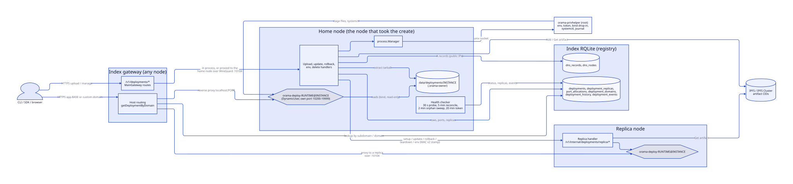
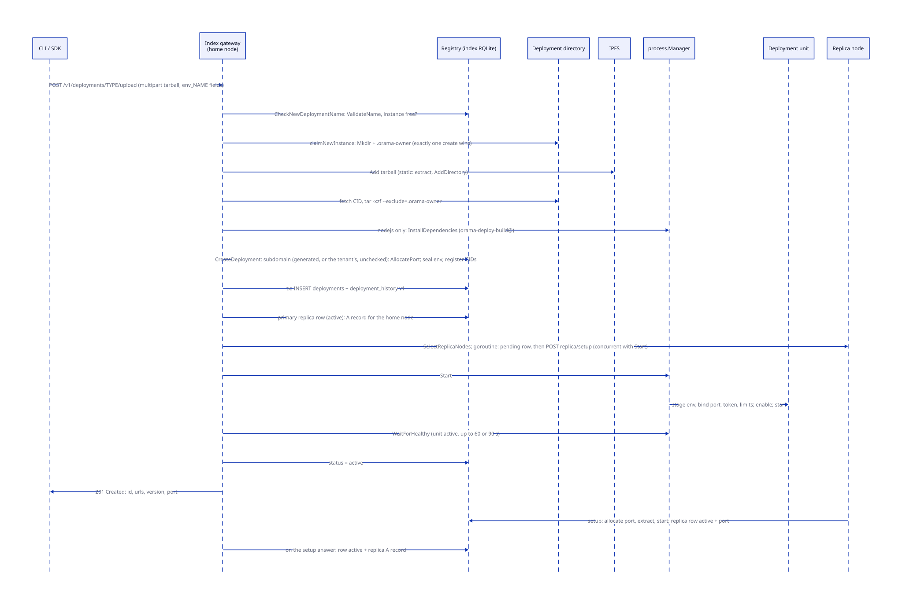
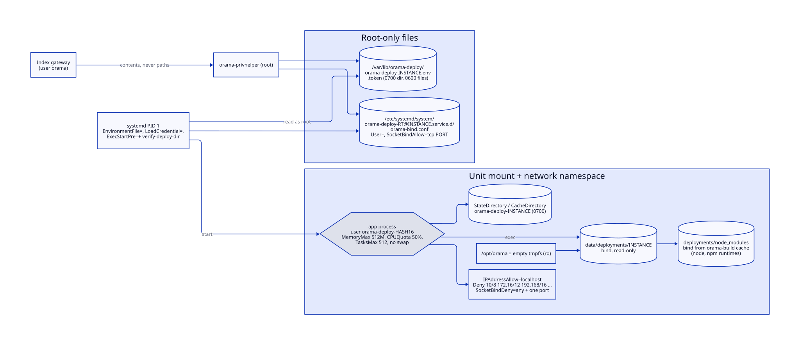
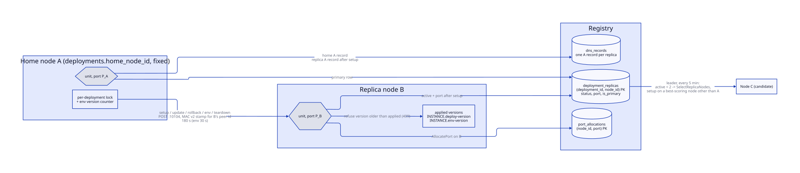
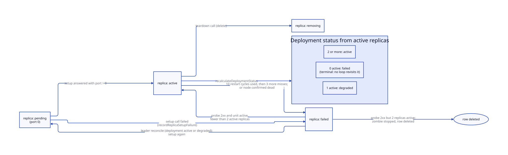
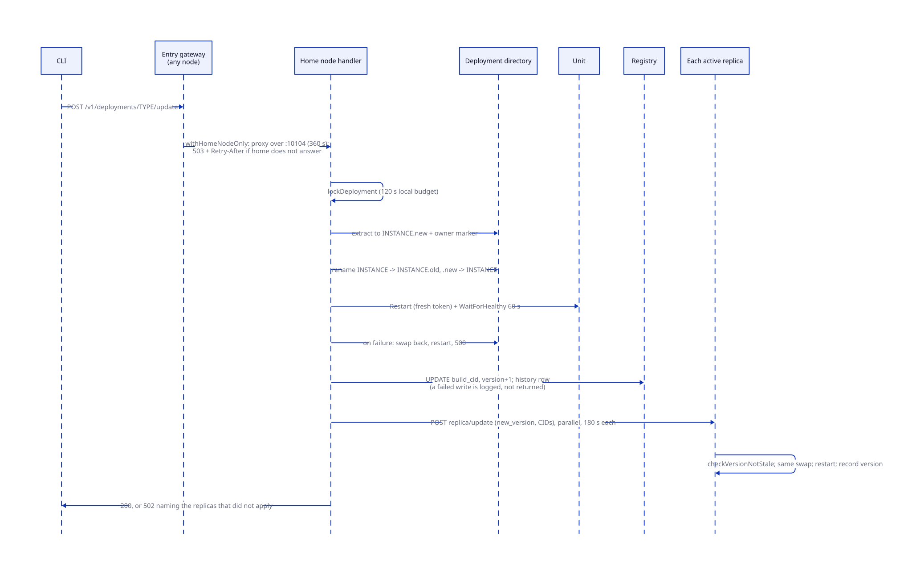
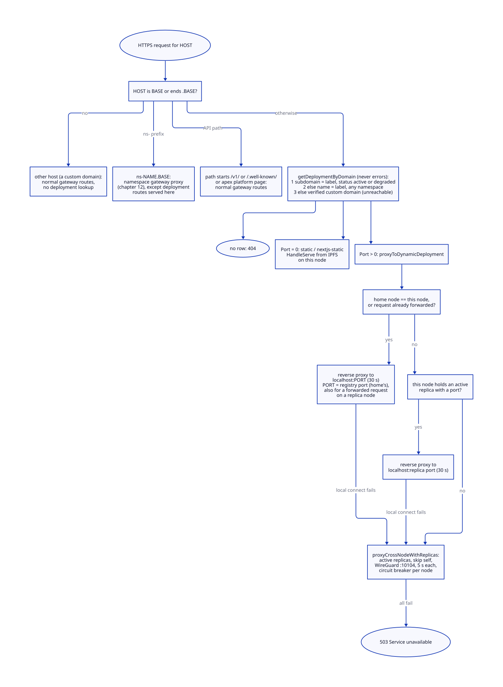

# App deployments

> **At a glance.**
>
> - **What:** the platform runs a tenant's application on the cluster's nodes. A static site is a directory in IPFS that any gateway serves. A dynamic app (Next.js server, Node.js, Go binary) is a systemd unit instance, `orama-deploy-<runtime>@<namespace>-<name>`, running as its own dynamic user inside a mount and network sandbox, on a port in 10200-19999, on two nodes: the home node that took the create and one replica. The deployment control plane lives on the index gateway of every node. Rows live in the index RQLite. Update, rollback and environment changes go through the home node only, under a per-deployment lock and a monotone version stamp, and are fanned out to the replica.
> - **Key numbers:** 6 type constants, 5 with a handler; 2 replicas; ports 10200-19999 per node (9,800); name 1-56 characters; one environment value 64 KiB, one environment 224 KiB; upload memory threshold 100 MiB (static, Go) or 200 MiB (Node.js, Next.js, update); health probe every 30 s with a 5 s timeout, restart after 3 misses, replica failed after 10 restarts; leader reconciliation every 5 min; orphan sweep every 2 min with a 10 min minimum age and at most 2 stops; workload token life 1 h, re-staged every 20 min; replica call 180 s, update handler 330 s, entry gateway write deadline 390 s; default unit limits `MemoryMax=512M`, `CPUQuota=50%`, `TasksMax=512`.
> - **Code:** `core/pkg/deployments/` (types, home node, ports, replicas, environment encoding, `process/`, `health/`), `core/pkg/deploysecrets/`, `core/pkg/gateway/handlers/deployments/`, the unit templates `core/systemd/orama-deploy-*@.service`, and host routing in `core/pkg/gateway/middleware.go`.
> - **Depends on:** [privilege and filesystem trust](05-privilege-and-filesystem-trust.md) for the helper that stages secrets and ports, [cluster state](07-cluster-state.md) for the registry, [membership and failure detection](08-membership-and-failure-detection.md) for the dead-node signal, [namespaces](09-namespaces.md) for the neighbouring port blocks, and [storage](19-storage.md) for the IPFS pins.



## Why it exists

A tenant namespace owns a database, a cache and a gateway ([namespaces](09-namespaces.md)). That is the data plane. A product also needs somewhere to run the code that talks to it: a React build, a Next.js server, a Go API. Without a deployment service every tenant would run their own servers and bring their own TLS, DNS and restarts, which is the opposite of the platform's goal of being one place to put an application.

The constraints that shaped the service are all about running hostile code next to the platform's own services on the same machine.

- **The code is the tenant's.** An app is arbitrary bytes. It runs on the same host as RQLite, the WireGuard private key and other tenants' apps. The design therefore starts from isolation: one unit and one uid per deployment, an empty `/opt/orama`, no route to the overlay, a single bindable port, and no way for the gateway process to be talked into reading a secret for it.
- **The gateway is not root.** The index gateway runs as the `orama` user under `NoNewPrivileges`. It cannot write a unit file, read `/var/lib/orama-deploy`, or call `systemctl` directly. Every privileged step goes through `orama-privhelper` ([privilege and filesystem trust](05-privilege-and-filesystem-trust.md#deployment-staging-secrets-ports-users-directories)). The deployment service is the main customer of that helper.
- **Nodes die.** A deployment has to keep answering while one of its nodes is down, and a tenant must be able to remove it even when its home node is gone for good.
- **State is split across machines and a database.** A unit, a directory, a port and a staged credential exist on one node. The row that says they should exist is replicated. Every failure of the service is one of those two halves disagreeing, and most of the code is the machinery that notices and repairs the disagreement (locks, version stamps, ownership markers, the orphan sweep).
- **The registry is shared.** Every namespace's deployments sit in one set of tables, so names, ports and subdomains are arbitrated cluster-wide, not per tenant.

## The model

**Deployment.** One row of `deployments`: `(namespace, name)` is unique, `id` is a UUID. It has a type, a monotone `version`, a `status`, a content CID, a build CID, the home node's peer id, the home node's port, a subdomain (generated with a random suffix, or supplied by the uploader), the sealed environment, resource limits and a restart policy (`core/pkg/deployments/types.go:Deployment`).

**Type.** Six constants exist (`core/pkg/deployments/types.go:DeploymentType`). Five have an upload route.

| Type | Upload route | What is uploaded | Runs as | Port | Defaults set by the handler |
|---|---|---|---|---|---|
| `static` | `/v1/deployments/static/upload` | tarball, extracted and added to IPFS as a directory | nothing; the gateway serves it | 0 | none |
| `nextjs-static` | `/v1/deployments/nextjs/upload`, form field `ssr` not `true` | same as static | nothing | 0 | none |
| `nextjs` | `/v1/deployments/nextjs/upload` with `ssr=true` | standalone tarball with `server.js` at the root | `orama-deploy-node@`, `node server.js` | allocated | 512 MB, 100% CPU, probe `/api/health` |
| `nodejs-backend` | `/v1/deployments/nodejs/upload` | tarball, `node_modules` optional | `orama-deploy-node@` or `orama-deploy-npm@` | allocated | 512 MB, 100% CPU, probe `/health` |
| `go-backend` | `/v1/deployments/go/upload` | tarball with an ELF binary, `app` by convention | `orama-deploy-go@` | allocated | 256 MB, 100% CPU, probe `/health` |
| `go-wasm` | none | (the constant exists; no route creates one, and `RuntimeFor` treats it as served, not run) | nothing | 0 | none |

Update routes exist for the same four families (`.../static/update`, `.../nextjs/update`, `.../go/update`, `.../nodejs/update`); all four are served by one handler (`core/pkg/gateway/handlers/deployments/update_handler.go:HandleUpdate`), which dispatches on the stored type.

**Instance.** The systemd instance name and the directory name of a deployment: `<namespace>-<name>` with dots replaced by hyphens (`core/pkg/deployments/process/naming.go:InstanceName`). A systemd template can derive paths only from its instance, so the instance, the unit, the code directory, the env and token files and the state directories are all spelled from this one function. The mapping is not injective (`a`/`b-c` and `a-b`/`c` both give `a-b-c`) and cannot change without renaming every existing deployment's unit and directory, so collisions are refused at create time instead ([Instance ownership](#instance-ownership-the-host-arbitrates)).

**Runtime.** Which template runs the instance: `node` (`node ${ORAMA_ENTRYPOINT}`), `npm` (`npm start`) or `go` (the binary). The interpreter cannot be a variable in a systemd `ExecStart`, so there is one template per runtime. Two more templates are oneshot helpers: `build` (npm install) and `clean` (remove its output) (`core/pkg/deployments/process/naming.go:RuntimeFor`).

**Home node.** The node whose index gateway received the create. It is recorded in `deployments.home_node_id` and never changes. Everything that mutates the deployment is serialised there.

**Replica.** A node that also runs the deployment. `DefaultReplicaCount` is 2, so a replica is one extra node (`core/pkg/deployments/types.go:DefaultReplicaCount`). A replica has its own port and its own row in `deployment_replicas`; the home node's is flagged `is_primary`.

**Platform environment.** Variables the platform sets last, so a tenant cannot displace them: `PORT`, `ORAMA_NAMESPACE`, `ORAMA_GATEWAY_URL`, `ORAMA_STATE_DIR`, `ORAMA_CACHE_DIR`, `ORAMA_ENTRYPOINT`, `ORAMA_TOKEN_FILE` (`core/pkg/deployments/process/unit.go:PlatformEnvKeys`). `ENTRY_POINT` is reserved too: it is how a Node.js deployment records what to run.

**Workload credential.** A one-hour JWT whose subject is `app:<namespace>/<name>`, minted for the deployment so that it can call its own namespace's gateway as a principal of its own, not with a pasted key ([identity](13-identity.md)).

## How it works

### Where the control plane runs

Every deployment route is declared `MainGateway` in the route policy (`core/pkg/gateway/route_policy.go:deploymentRoute`). A request addressed to `ns-<name>.<base>` is therefore still served by the index gateway of the node that received it, with the namespace taken from the subdomain and the credential required to belong to it. The reason is in the comment on the policy: a namespace gateway served a delete that removed the rows and freed the port while its refused `systemctl stop` left the unit running, and the next deployment given that port crash-looped behind it. Only the index gateway may drive the privileged helper, so only it may touch units.

The deployment tables are cluster state. `deploymentRegistry` returns the cluster registry handle on every gateway (`core/pkg/gateway/config.go:deploymentRegistry`), and the `deployments`, `deployment_replicas`, `deployment_domains`, `deployment_history`, `deployment_events`, `deployment_health_checks`, `home_node_assignments` and `port_allocations` tables are placed in the cluster RQLite, trust level platform (`core/pkg/rqlite/schema_placement.go`). `global_deployment_subdomains` is placed in the namespace schema but written through the registry handle, so the namespace copy is unused.

The service is built only when there is a registry, an IPFS client and an environment codec. Without an encryption root the codec cannot be derived and deployments are unavailable on that gateway; the gateway logs why and stays up (`core/pkg/gateway/gateway.go`, the block that calls `deployments.NewEnvCodec`).

### Choosing the home node

`CreateDeployment` sets `HomeNodeID` to the gateway's own peer id whenever one is configured, which it always is on a node (`core/pkg/gateway/handlers/deployments/service.go:CreateDeployment`). The comment gives the reason: the port is allocated and the unit started on the node that handles the request, so the port allocation must name that node. There is no placement decision for the home node. The client reaches an arbitrary node and that node becomes home.

`HomeNodeManager.AssignHomeNode` still exists and does choose by capacity: it lists `dns_nodes` with `status = 'active'` and `last_seen` within 2 minutes (ordered by id), scores each, and takes the highest; on equal scores the first, that is the lowest id (`core/pkg/deployments/home_node.go:AssignHomeNode`). It runs in two places: as a fallback in `CreateDeployment` when the gateway has no peer id (tests), and when a tenant SQLite database is created (`core/pkg/gateway/handlers/sqlite/create_handler.go`). The result is cached once per namespace in `home_node_assignments`. For deployments that table is therefore not consulted.

The score is a weighted average of four terms, each 1 minus the used fraction of a limit, floored at 0 (`core/pkg/deployments/home_node.go:calculateCapacityScore`):

| Term | Weight | Limit | Source of the usage |
|---|---|---|---|
| deployments | 0.4 | 100 (`constants.MaxDeploymentsPerNode`) | count of `deployments` rows with this `home_node_id` and status `active` or `deploying` |
| allocated ports | 0.2 | 9,800 (`constants.MaxPortsPerNode`) | rows of `port_allocations` for the node |
| memory | 0.2 | 8,192 MB | sum of `home_node_assignments.total_memory_mb` |
| CPU | 0.2 | 400% | sum of `home_node_assignments.total_cpu_percent` |

`UpdateResourceUsage` is the only writer of the memory and CPU columns and nothing calls it, so those two terms are always 1.0 and the score reduces to deployment count and port count. The deployment count counts home-node deployments only; replicas are visible only through the port term. `SelectReplicaNodes` repeats the pick over the nodes other than the primary, so on equal scores the lowest ids win (below).

### Creating a deployment



The four upload handlers share a shape. This is the Go handler; the others differ where the table above says so.

1. **Parse.** `ParseMultipartForm` with 100 MiB (static, Go) or 200 MiB (Node.js, Next.js, update, and the Next.js path). That number is the in-memory threshold; larger parts spill to a temporary file, and the handlers set no `MaxBytesReader`, so the total upload size is not capped here (see Known gaps).
2. **Name.** `CheckNewDeploymentName` validates the name and queries the registry for any row whose instance equals this one. The SQL spells `InstanceName` as `REPLACE(namespace,'.','-') || '-' || REPLACE(name,'.','-')` and scans the table, once per create (`core/pkg/gateway/handlers/deployments/naming.go:CheckNewDeploymentName`). A name is 1-56 characters of `[A-Za-z0-9_-]` starting with a letter or digit (`core/pkg/deployments/process/naming.go:ValidateName`). 56 is derived: the subdomain is `<name>-<6 random characters>` and one DNS label is at most 63 bytes. The same function bounds the unit instance, which the helper accepts up to 161 characters.
3. **Environment.** Fields named `env_<NAME>` become the environment ([The environment](#the-environment)). The Next.js handler parses none; its environment starts empty and is set later with `env set`.
4. **Claim the instance on the host** ([Instance ownership](#instance-ownership-the-host-arbitrates)).
5. **Pin.** The tarball goes to IPFS (`ipfsClient.Add`) and the returned CID is the artifact. For static content the gateway extracts the archive and adds the directory instead (`uploadSite`), so the CID is a directory that paths resolve under.
6. **Extract.** The handler fetches the CID back and runs `tar --exclude=.orama-owner -xzf <archive> -C <dir>` as the `orama` user (`core/pkg/gateway/handlers/deployments/instance_claim.go:tarExtractArgs`). `tar` is the only program the handlers may run; a test walks the package AST and fails on any other `exec.Command` (`core/pkg/gateway/handlers/deployments/no_tenant_exec_test.go`).
7. **Dependencies** (Node.js only; [Node.js dependencies](#nodejs-dependencies)).
8. **Register.** `CreateDeployment` claims a subdomain (unless the request supplied one, below), allocates a port for every type but `static` and `nextjs-static`, seals the environment, registers the CIDs in the reference index, and inserts the `deployments` row and the version-1 `deployment_history` row in one transaction. A failed insert or CID registration releases a subdomain it generated, and a failed insert also unregisters the CIDs. No failure after the port allocation releases the port, and a failed seal leaves the generated subdomain registered too (see Known gaps). A unique-constraint failure on `(namespace, name)` is reported as the same 409 as a name check, not as a 500 (`core/pkg/gateway/handlers/deployments/service.go:createFailed`).
9. **Replica rows and DNS.** Still inside `CreateDeployment`, `createDeploymentReplicas` writes the primary replica row as `active` (before the unit exists), writes the home node's A record, selects one secondary node, and for a dynamic type starts `SetupDynamicReplica` in a goroutine ([Replicas](#replicas)). So the replica's setup runs concurrently with the home node's start in the next step. A missing home-node address or a failed A-record write is logged, not returned. For a static type the secondary replica is a row with port 0 and an A record; the content comes from IPFS.
10. **Start.** `process.Manager.Start`, then `WaitForHealthy` (60 s for Go and Next.js, 90 s for Node.js), then the row's status becomes `active`. A start that fails returns an error, but the row, its directory and its port stay: the Go and Node.js handlers set the status `failed`, the Next.js SSR handler sets it only in memory and leaves the row `deploying` (see Known gaps). A failed deployment is deleted, not retried ([Delete](#delete)). A deployment that is not active after the wait is not failed: the code logs and continues, and it is marked `active` regardless (see Known gaps for what "healthy" means here). Static and `nextjs-static` deployments are inserted with status `active` and have no start.

A generated subdomain is `<sanitised name>-<6 random lowercase alphanumerics>`, tried up to 10 times against `global_deployment_subdomains` (`core/pkg/gateway/handlers/deployments/service.go:generateSubdomain`). The name is lower-cased and every character outside `a-z0-9-` becomes a hyphen, which is then collapsed and trimmed. The random suffix makes the URL unguessable but not secret. Its fallback when `crypto/rand` fails is a timestamp-derived suffix.

The upload form also accepts a `subdomain` field (the CLI's `--subdomain`). When it is present, `CreateDeployment` uses it as the row's subdomain without validating it, without checking `global_deployment_subdomains` and without registering it there (`ErrSubdomainTaken` has no caller). Host routing then serves the deployment at `<subdomain>.<base>`, so any tenant can claim any label (see Known gaps).

#### Instance ownership: the host arbitrates

A unit instance names things on the host: the unit, the directory, the env and token files. Every gateway on a host shares them, but each reads a registry that may differ in time, and the name check's SELECT is not atomic with the later INSERT. So the host decides. A create claims its instance by `os.Mkdir` of `<base>/<instance>`, which exactly one caller wins, then writes `.orama-owner` containing the `(namespace, name)` JSON by hard-linking a fully written temporary file, so the marker is never visible half-written (`core/pkg/gateway/handlers/deployments/instance_claim.go:claimNewInstance`).

A create never adopts an existing directory, even an unmarked one, which may be another create that has made the directory and not yet marked it: a different owner's marker is a 409 collision and anything else is `errInstanceNotNew`. An update, rollback or replica uses the looser `claimInstance`/`checkInstanceOwner`: the same owner carries on, and a directory with no marker (made before markers existed) is adopted only if this gateway's registry has that exact deployment. The archive cannot rewrite the marker: it is excluded at any depth by the `tar` flags. The base directory is `0700`, each deployment directory `0755` (its reader is the deployment's own dynamic user), the marker `0644`.

If the create fails before a row exists, the deferred release removes the directory the request made. If a row exists the directory is kept, because a delete removes both.

### The process manager

`process.Manager.Start` is the one place a deployment becomes a running unit (`core/pkg/deployments/process/manager.go:Start`). On Linux it does, in order:

1. Clear the deployment's "stopped" mark, so a start after a delete race is a new life.
2. `writeEnvFile`: render the merged environment (tenant first, platform last) and hand the contents to the helper, which writes `/var/lib/orama-deploy/orama-deploy-<instance>.env` ([deploysecrets](#state-it-owns)).
3. `allowPort`: refuse a port outside 10200-19999, then ask the helper to write the per-instance `orama-bind.conf` drop-in that names the user and the one TCP port the unit may bind.
4. `writeWorkloadToken`: mint a credential and have the helper stage it in `/var/lib/orama-deploy/orama-deploy-<instance>.token`. A failure fails the start: a deployment with no identity is the permanent-key situation the token replaces.
5. `applyResourceLimits`: `systemctl set-property` with `MemoryMax=<n>M` and `CPUQuota=<n>%`, only for a memory value other than `DefaultMemoryLimitMB` (256) and a CPU value other than `DefaultCPULimitPercent` (50), on the assumption that the template already carries those. The template carries `MemoryMax=512M`, so a stored 256 MB is never applied (see Known gaps): a Go deployment runs with 512 MB and `CPUQuota=100%`, Node.js and Next.js with 512 MB and 100%.
6. `systemctl enable`, then `systemctl start` of `orama-deploy-<runtime>@<instance>.service`, both through the helper.

Everything that varies per deployment is derived from the instance name or read from the staged files, because the gateway cannot write a unit. The unit is a template installed with the release.



What a runtime unit declares (`core/systemd/orama-deploy-go@.service`; the `node` and `npm` templates differ in `ExecStart` and one extra bind):

| Property | Setting | Effect |
|---|---|---|
| identity | `DynamicUser=yes` plus the drop-in's `User=orama-deploy-<16 hex of SHA-256(instance)>` | one uid per deployment, so `/proc/<pid>/environ` of a neighbour is unreadable |
| filesystem | `ProtectSystem=strict`, `ProtectHome=yes`, `PrivateTmp`, `PrivateDevices`, `TemporaryFileSystem=/opt/orama:ro`, `BindReadOnlyPaths=/opt/orama/.orama/data/deployments/%i` | `/opt/orama` is an empty tmpfs; the app sees only its own code, read-only; secrets, keys, other tenants' code and databases are absent, not merely unreadable |
| writable | `StateDirectory=orama-deploy-%i`, `CacheDirectory=orama-deploy-%i`, modes `0700`, exported as `ORAMA_STATE_DIR` and `ORAMA_CACHE_DIR` | the only place the app writes; it cannot rewrite its own code, so a rollback is to a known version |
| network, outbound | `IPAddressAllow=localhost`, `IPAddressDeny=10.0.0.0/8 172.16.0.0/12 192.168.0.0/16 169.254.0.0/16 fc00::/7 fe80::/10` | no route to the WireGuard overlay or any private range; the public internet is open |
| network, inbound | `SocketBindDeny=any` plus the drop-in's `SocketBindAllow=tcp:<PORT>` | the app binds its own port and nothing else, so it cannot stand in for a platform service on loopback |
| privileges | `NoNewPrivileges`, `RestrictNamespaces`, `RestrictSUIDSGID`, `RestrictRealtime`, `LockPersonality`, `ProtectKernel*`, `ProtectControlGroups`, `ProtectProc=invisible`, `RemoveIPC`, `UMask=0077` | the standard hardening set |
| secrets in | `EnvironmentFile=/var/lib/orama-deploy/orama-deploy-%i.env`, `LoadCredential=orama_token:...token`, `Environment=ORAMA_TOKEN_FILE=%d/orama_token` | PID 1 reads the root-only files; the app receives the token at `$CREDENTIALS_DIRECTORY` owned by its own user, mode `0400` |
| start check | `ExecStartPre=+/usr/local/bin/orama-privhelper verify-deploy-dir %i` | runs as root before every start, including a boot or a crash restart that bypassed the helper: the code directory must be a real directory owned by `orama` |
| restart | `Restart=always`, `RestartSec=5s`, `StartLimitIntervalSec=0` | a crash loop never hits systemd's start limit, so a bad build does not become an operator ticket |
| limits | `MemoryMax=512M`, `MemorySwapMax=0`, `CPUQuota=50%`, `TasksMax=512` | template defaults; the drop-in from `set-property` overrides them |

`IPAddressAllow=localhost` is required: the node's gateway proxies to the app from `127.0.0.1`, and systemd filters on the remote address of both directions. The filter has no notion of a port, so what an app can reach on `127.0.0.1` is decided by the services that listen there, each of which authenticates ([privilege and filesystem trust](05-privilege-and-filesystem-trust.md), Known gaps).

`Stop` attempts every step and returns the joined errors. It marks the instance stopped (so no credential is minted for a deployment on its way out), stops and disables the unit, and only if the stop succeeded clears the installed dependencies and purges the state and cache directories; it always removes the staged env and token. Earlier versions logged failures and returned nil, which freed a port while its unit still ran. A static type returns nil at once, because it has no unit (`ErrServedNotRun`). `Restart` re-mints the credential first and refuses only for a deleted or stopped deployment; for any other mint failure it restarts on the staged token if more than `WorkloadTokenRestartMargin` (5 min) of life is left, because refusing would keep a crashed app down for as long as the registry is. `Reconfigure` rewrites the env file, the bind drop-in, the token and the limits, and restarts.

`WaitForHealthy` is `systemctl is-active` polled every 2 s until it answers `active` or the timeout passes. It is read-only, so the manager runs it directly, not through the helper. It never probes the app's port; the probe path is used only by the health checker ([Health checking and reconciliation](#health-checking-and-reconciliation)). `GetStats` reads the unit's `MainPID` and `ActiveEnterTimestamp` the same way.

Off Linux, `Start` runs the app as a child process with the same environment and logs under `~/.orama/logs/deployments`. That mode exists for development; it has none of the sandbox, and `Restart` in that mode stops the process and does not start it again.

### The environment

The environment column used to be plaintext JSON in a table that Raft replicates to every node and every backup, and the platform's own guide tells tenants to put their API keys there. It is sealed now (`core/pkg/deployments/envcodec.go:EnvCodec`): AES-256-GCM with a key derived by HKDF-SHA256 from the encryption root's IKM and the label `orama-deployment-environment-v1`, in the `enc:` envelope, or `enc:v1:<keyid>:` once a key rotation has produced a versioned one; the codec holds the rotating key holder, so a rotation takes effect without a restart ([secrets and keys](16-secrets-and-keys.md)). `NewEnvCodec` refuses an empty IKM, and `Encode` on a nil codec is an error, so nothing falls back to writing plaintext. `Decode` reads a legacy plaintext row as it is and the next environment write re-seals it; a row that is neither sealed nor JSON is an error. An environment that cannot be read is never treated as empty: starting an app without its database URL looks like the tenant's bug.

The sealed form also travels on the wire to replicas (`environment` in the setup payload). Every node derives the same key from the cluster secret, so there is no reason to unseal it in transit.

Names and values are validated where they are set (`core/pkg/deployments/envfile.go`):

- a name is letters, digits and underscore, not starting with a digit; platform names and `ENTRY_POINT` are refused to a tenant (`reservedEnvKeys`);
- a value must be valid UTF-8 (systemd silently drops an assignment that is not), contain no NUL, and be at most `MaxEnvValueBytes` = 64 KiB;
- the whole environment, measured as the file it renders to, is at most `MaxEnvFileBytes` = 224 KiB. The helper refuses a file over 256 KiB, and the 32 KiB gap is room for the platform's own variables, so an accepted environment can always start; a test holds the two together.

The unit reads an `EnvironmentFile`, not interpolated `Environment=` lines. A value used to be written into the unit as `Environment="{{.}}"`, so a quote and a newline closed the assignment and wrote any directive the tenant liked into a unit that ran as root. `EncodeEnvFileValue` double-quotes the value and escapes exactly the four characters systemd treats as escapable inside double quotes (`"`, `\`, backquote and `$`), read off systemd's own parser (`env-file.c`). Every other byte, newlines included, is literal. `ParseEnvFile` reads back only what `RenderEnvFile` writes and fails on anything else, with errors that name a byte offset and never the text, because the values are secrets. Keys render in sorted order so an unchanged environment renders byte-identical.

`GET /v1/deployments/env` returns names and a `reserved` flag, never values. `POST /v1/deployments/env/set` takes `set` and `unset` and is a deployment change in the sense of the next section.

### The workload credential

`Start` stages a token minted by `workloadTokenMinter` (`core/pkg/gateway/workload_token.go`). It first checks that the deployment's row exists, so a start, restart or refresh that raced a delete cannot record a principal and mint a token for something that is gone; then `EnsureWorkloadPrincipal`, then `MintWorkloadToken` with a one-hour lifetime (`core/pkg/gateway/auth/workload.go:WorkloadTokenLifetime`). The scopes are whatever the principal holds in its own namespace, resolved at mint time, so revoking a grant takes effect at the next renewal; a principal with no grant gets an empty set, not the data plane ([authorization](14-authorization.md)). The grants are managed through `/v1/deployments/grants`, which needs the `members` scope, because handing a deployment authority is handing out authority. The app reads `$ORAMA_TOKEN_FILE` and renews the token against `ORAMA_GATEWAY_URL`, which is `https://ns-<namespace>.<base>`.

The unit reads the staged token at every start, with no gateway involved, whenever systemd restarts a crashed unit or boots the node. A token that was good at deploy time may be expired by then. So the health checker re-stages a fresh token for every active local deployment at start and every 20 minutes (`core/pkg/deployments/health/token_refresh.go:tokenRefreshInterval`), paced 50 ms apart, 15 s per deployment, using the cheaper `workloadTokenRefresher` that does not touch the registry. A staged token therefore always has at least about 40 minutes of life, and a gateway that is down for longer leaves the next unit start with an expired token. The refresh skips a unit that is not active (the checker's restart mints its own) and one the delete path has stopped. The first sweep retries a failed listing with a delay doubling from 1 s to 1 min until it succeeds.

### Node.js dependencies

`npm install` used to run inside the gateway, as `orama`, with the gateway's environment, running every dependency's `postinstall` and reading the tenant's `.npmrc`. It now runs in `orama-deploy-build@<instance>`, a oneshot unit with a dynamic user of its own (`orama-build-` plus the same hash), `MemoryMax=1G`, `CPUQuota=100%`, `TasksMax=512`, `TimeoutStartSec=240`.

Before it starts, the gateway reads `package.json` and the lockfile as bounded regular files (1 MiB and 64 MiB, `O_NOFOLLOW|O_NONBLOCK`) and refuses anything that is not a registry package: workspaces, and any dependency spec containing a colon or slash (git, URL, `file:`, `link:`), in `dependencies`, `devDependencies`, `optionalDependencies`, `peerDependencies` and nested `overrides`, and any lockfile entry that is a link or whose `resolved` is not an `https://` tarball (`core/pkg/deployments/process/npmspec.go:CheckRegistryOnlyDependencies`). A spec starting with a dot is refused even though the character set allows it, because npm reads it as a local directory. The error tells the tenant to ship `node_modules` instead.

The unit itself is the second layer (`core/systemd/orama-deploy-build@.service`): `/opt/orama` is an empty tmpfs with only this deployment's directory bound read-only; loopback and every private range are denied with no exception, `SocketBindDeny=any`, and `/etc/resolv.conf` is replaced by `/etc/orama/build-resolv.conf` (public resolvers only; without it the unit does not start). npm runs with `--omit=dev --ignore-scripts --no-audit --no-fund`, `npm_config_userconfig=/dev/null`, the registry pinned to `https://registry.npmjs.org/` and `npm_config_replace_registry_host=always`, so a lockfile's tarball URLs are fetched from the registry whatever host they name. It runs in a directory holding only `package.json` and the lockfile copied from the deployment, never the tenant's tree, so no `.npmrc` is read. The output goes to the unit's cache directory `orama-build/<instance>/deps`. The runtime units bind its `node_modules` read-only one directory above the app (`-` prefix, optional), where Node's resolution looks after the app's own `node_modules`. After the install the unit checks that `node_modules` is a directory, not a symlink, because PID 1 follows symlinks when it binds. `orama-deploy-clean@` removes the output when a deployment is deleted, or created without an install, so an instance name reused by another tenant never inherits dependencies.

The build runs only on the home node and only at create (see Known gaps). If the tarball ships `node_modules`, or the form sets `skip_install=true`, no install runs and `ClearDependencies` removes anything an earlier holder installed. The CLI's `orama deploy nodejs` leaves `node_modules` out of the tarball, so the server installs.

### Replicas



`createDeploymentReplicas` runs after the row exists. `SelectReplicaNodes` lists active nodes, drops the primary, scores the rest with the capacity function and takes the best `count` (`core/pkg/deployments/replica_manager.go:SelectReplicaNodes`); with only one node there is no replica and the deployment runs singly. For a dynamic type `SetupDynamicReplica` runs in a goroutine on the home node:

1. Resolve the replica's overlay address (`dns_nodes.internal_ip`, else `ip_address`). A node registered before `internal_ip` existed falls back to its public address, which does not serve the index gateway port.
2. Write the replica row `pending`, port 0.
3. POST `/v1/internal/deployments/replica/setup` to `http://<overlay>:10104` with the type, both CIDs, the sealed environment, the version, the probe path, the limits and the restart policy. The call is stamped with a v2 coordination MAC for the replica's peer id (`core/pkg/gateway/handlers/deployments/coordination.go`).
4. On the replica (`core/pkg/gateway/handlers/deployments/replica_handler.go:HandleSetup`): verify the stamp, the WireGuard source and the instance; take the deployment lock; allocate a port on this node; claim the instance; poll IPFS for the artifact every 2 s for up to 60 s (only "content not yet retrievable" is waited for; the home node calls right after pinning, before the cluster has placed the blocks here); extract; unseal the environment; `ClearDependencies` for Node.js and Next.js; `Start`; wait up to 90 s for the unit to be active, which only logs on a timeout; record the applied version; write the row `active` with its port (an error from this write is ignored); answer the port.
5. The home node writes the row `active` with that port and adds the replica's A record with the replica's public address. A replica record that published the overlay address (unreachable from the internet) was an earlier bug. Both writes use the context of the create request that started the goroutine (see Known gaps).

A failure at any point is not dropped. `recordReplicaSetupFailure` writes the row `failed`, port 0, and a `replica_setup_failed` event naming the node and a generic reason. The peer's own text (overlay addresses, ports) stays in the home node's log. When the replica's setup fails after its port allocation (instance claim, content fetch, environment unseal, `ClearDependencies` or `Start`), a deferred `DeallocatePort` deletes the allocation by deployment id, which removes the deployment's allocation on every node, not only this one (see Known gaps). The leader's reconciliation (below) retries.

`HandleSetup` takes the deployment's description from the stamped payload, because the replica has no active row to check it against yet. Update, rollback and environment calls do not trust the caller's description: they resolve `(deployment id, namespace, name, this node)` against the registry and take the type, and for an environment call also the port and limits, from that row (`core/pkg/deployments/replica_manager.go:LookupReplicaBinding`); an update or rollback reads the replica's port from its own row. A request that pairs one deployment's id with another's name is refused. Every internal route requires the WireGuard source and a v2 stamp made with the cluster secret for this node's peer id. The overlay alone is no credential, because every namespace's services share it ([inter-node trust](15-inter-node-trust.md)).



### Updates, rollbacks and environment changes

These three change a running deployment, and they share a discipline.

**Home node only.** `withHomeNodeOnly` proxies a request that reaches another node to the home node over the overlay and refuses with `503` and `Retry-After: 5` if the home node does not answer; it never runs the change on the node that took the request (`core/pkg/gateway/routes.go:withHomeNodeOnly`). The reason is that the lock and the version counter live on the home node. The marker header `X-Orama-Proxy-Node` that says "already forwarded" is honoured only from a WireGuard peer; `dropForgedProxyNode` strips it from every other request, so a client cannot use it to run a change on a node of its choice. Delete, logs and stats are `withHomeNodeProxy`: proxied when the home node answers, run locally when it does not. The gate finds the deployment from the URL query only (`name` or `id`). The CLI always puts the name there, but a request whose name is only in the multipart body (update) or the JSON body (rollback) skips the gate and runs on the node that received it (see Known gaps); the environment route requires the query parameter.

**One change at a time.** `lockDeployment` is a per-`(namespace, name)` channel lock with a reference count; the entry is dropped when no one holds or waits for it (`core/pkg/gateway/handlers/deployments/deployment_lock.go:lockDeployment`). Update, rollback, environment change, delete, and a replica's setup, update, env, teardown all take it on their own node. A caller waits at most its local budget, then gets `503` and is asked to run the command again.

**Versions.** An update or rollback bumps `deployments.version`; each fan-out carries it as `new_version`. An environment change carries `nextEnvVersion`, a wall-clock nanosecond stamp made strictly greater than the previous one issued for the deployment and than the row's `updated_at`, which is where the stamp is stored, so a restart of the process with a clock stepped back still issues a larger number. A replica records the highest applied version of each kind in `<deployment dir>.deploy-version` and `.env-version`, beside the directory (an update swaps the directory, so the record cannot live in it), and refuses an older one with `409` (`core/pkg/gateway/handlers/deployments/replica_version.go:checkVersionNotStale`). Two changes made in order can arrive out of order when a retry overtakes a slow call; this stops the older from overwriting the newer. A zero version is an unversioned caller and is not checked. Records are written to a unique temporary file and renamed; the handler sweeps leftover temporaries at start.



**Static update** is an atomic CID swap: extract and add the new site, register the new CID in the reference index, `UPDATE deployments SET content_cid, version`, release the old CID, record history. No process is involved, and no replica needs to do anything: the replica's handler answers `updated` for a static type, because the content is in IPFS.

**Dynamic update** extracts into `<dir>.new`, writes the owner marker, renames the current directory to `<dir>.old` and the staged one into place, restarts the unit, and waits for the unit to be active (60 s). On a failed restart or wait it renames back, restarts the old code and returns an error. Only then does it write `build_cid` and the new version. If that write fails the handler logs the error and carries on: the new code is running, the old directory is removed, the registered CID reference is unregistered and no history row is written, but the response and the fan-out carry the new version while the row keeps the old one (see Known gaps). The old artifact is released only after a committed write. A create writes `content_cid` and an update writes `build_cid`, so a replica fetches `build_cid` when set, else `content_cid`. The staging directory is `<dir>.new`; a failed update that renames it back leaves it in place, and the next update extracts into it without clearing it.

**Rollback** takes `{name, version}`, requires a version strictly less than the current, looks the target up in `deployment_history`, and re-applies it as a new, higher version (`rolled_back`, with `rollback_from_version`). A rollback is not a time travel; the version counter never moves backwards, which is what lets replicas order changes. It stages into `<dir>.rollback` and otherwise follows the dynamic update's swap. It registers the target's CID but does not release the CID it replaces, and the target's content may already be unpinned, because an update releases the artifact it replaces (see Known gaps). `GET /v1/deployments/versions` lists up to 50 history rows, newest first.

**Environment change** (`core/pkg/gateway/handlers/deployments/env_handler.go:applyChange`): under the lock, read the deployment and the sealed column from one query, merge `set` and `unset`, validate, issue a version, and write the sealed value with a compare-and-swap on the sealed value that was read (`persistEnv`). The sealing is randomised, so two writes never leave the same value, which makes the comparison exact: a change that landed between two reads cannot pass it, and the loser gets a `409` and re-runs. Then `Reconfigure` on the home node and `ReconfigureReplicas` on the others. A static deployment records the variables and restarts nothing.

**Fan-out is not best effort.** `callReplicasAndWait` calls every other replica whose row is `active` with a port in parallel and waits for each. A replica that is `failed` or `pending` is not called, and nothing reconciles its version when it comes back (see Known gaps). If any did not apply the change the request fails with `502`, saying how many applied and naming each node that did not with a generic reason (refused with a status, did not answer in time, could not be reached), and writes a `replica_update_failed` or `replica_env_failed` event. The home node already has the change. Running the same command again retries: an update makes a new version and every replica re-applies it; an environment change is idempotent. The alternative, a best-effort fan-out, leaves two versions of the app answering one hostname.

The budgets nest, each strictly shorter than the one around it (`core/pkg/constants/timeouts.go`):

| Link | Value |
|---|---|
| replica restarts the unit for an env change | 20 s |
| home node waits for one replica, env change | 30 s |
| env handler, lock wait + local work | 30 s (60 s total) |
| replica fetches artifact and starts, update or rollback | 180 s |
| lock wait + local work, update or rollback | 120 s |
| replica segment | 210 s |
| whole update handler | 330 s |
| gateway hop to the home node | 360 s |
| entry gateway's write deadline | 390 s |
| CLI wait for env set | 90 s |

The handler moves its own deadlines first, before it reads the upload or waits for the lock (`extendForChange`), and the replica fan-out runs detached from the request context, bounded by its own budget, so a client that hangs up does not abandon the fan-out half way.

### Host routing



The host-routing middleware runs on every gateway (`core/pkg/gateway/middleware.go:domainRoutingMiddleware`). It acts only on the base domain and its subdomains; a request for any other host passes through to the normal routes untouched. For a host ending in `.<base>` it sends `ns-<x>` hosts to the namespace gateway (except the deployment routes, which are `MainGateway` and run here with the namespace taken from the host), API and well-known paths to the normal routes, and the apex's platform pages to the status handlers. For any other subdomain it resolves a deployment (`getDeploymentByDomain`, up to three queries in order):

1. a row with `subdomain` equal to the single label and status `active` or `degraded`;
2. else a row with `name` equal to the label and the same status test (the legacy form, before random suffixes), in any namespace, the first row the query returns;
3. else a row of `deployment_domains` for the whole host with `verified_at` set, joined to a deployment of status `active` or `degraded`.

The result carries the id, namespace, type, port, content CID, status and home node. A row in any other status, or none, gives `404`. A query error is swallowed and falls through to the next lookup, and the function never returns an error, so a registry outage is indistinguishable from "no such app". The third lookup cannot match a real custom domain, because the middleware has already let every host outside the base domain through, and `domains/add` refuses hosts inside it (see Known gaps).

A deployment with port 0 is served by `StaticDeploymentHandler.HandleServe` on the node that took the request ([Static content](#static-content)). Any other goes to `proxyToDynamicDeployment`:

- If the home node is this node, or the request carries `X-Orama-Proxy-Node` (it was forwarded), serve locally on `deployment.Port`, which is the registry's port: the home node's. A forwarded request that reaches a replica node is therefore proxied to the home node's port number, not the replica's (see Known gaps).
- Otherwise, if this node holds an active replica with a port, serve locally on the replica's port.
- Otherwise `proxyCrossNodeWithReplicas`: list the active replica nodes with a port in the order the query returns them (it has no `ORDER BY`), skip self, and try each over the overlay on `GatewayAPIPort` (10104) with a 5 s client timeout, keeping the original `Host` header, adding `X-Orama-Proxy-Node` and the client IP, and stripping inbound `X-Internal-Auth-*` headers so an outside client cannot forge identity across the hop. A circuit breaker per deployment and node (`dep:<id>@<IP>`, opens after 5 failures, half-opens after 30 s) skips a node that has been failing for that app; a refused or timed-out hop, or a reply of 502, 503 or 504 that the node's own proxy produced (`isUpstreamFailure`), counts as a failure and the next replica is tried. A reply the app produced is marked `X-Orama-Tenant-Origin` by the node that ran it, counts for nothing, and is relayed. The 5 s timeout covers reading the whole response, so a reply that takes longer is cut off, and a request body that the first attempt consumed is not replayed to the next replica. When all fail the answer is `503 Service unavailable`.

Local serving is a plain reverse proxy to `localhost:<port>` with a shared transport and a 30 s client timeout, `X-Forwarded-For`, `-Proto: https` and `-Host` set, inbound `X-Internal-Auth-*` stripped, and WebSocket upgrades handled by a hijacking proxy. If the local request fails, the code tries the other replicas before answering `503`. A request is never served from `localhost` when the home node is another node, no replica is here and the request was not forwarded: that port belongs to whatever else this machine allocated that number to.

DNS decides which node a client reaches first. Each replica's A record points at its node's public address with TTL 300, one record per node, so a browser spreads over the replicas ([DNS and nameservers](24-dns-and-nameservers.md)). Any node can answer any app, by serving it, by serving the replica's port, or by forwarding.

### Static content

A static site is a directory CID in IPFS. `HandleServe` maps `/` to `/index.html`, then asks IPFS for `/ipfs/<cid><path>`; on a miss it tries `<path>/index.html` for a path that does not end in `.html`, then falls back to `/<cid>/index.html` for single-page-app routing, then `404`. It sets `Content-Type` from a small extension table (default `application/octet-stream`) and `Cache-Control: public, max-age=3600`. The content is fetched from the local IPFS node on each request: the client reads blocks this node already has first (an offline `cat`) and only then asks through the network, which pulls blocks it lacks from the cluster. The site is extracted in process by `extractTarball` (`core/pkg/gateway/handlers/deployments/static_handler.go`), which creates only directories and regular files and refuses names that leave the target, so a static archive's links are dropped. A static deployment has no unit and no directory; its replica row has port 0, and every node serves every static site.

The content reference is the directory CID. The CID is recorded in `ipfs_cid_refs` with kind `deployment` when the deployment is created, updated or rolled back, and released when an update replaces it or the deployment is deleted (`core/pkg/gateway/handlers/deployments/cidrefs.go`). References are written only by the handlers, never derived from the `deployments` table, which a tenant with database access can write. `releaseCID` first checks whether another deployment of the same namespace still serves the CID, because the index has one row per `(cid, namespace, kind)`, and unpins only if no reference remains anywhere ([storage](19-storage.md)).

### Custom domains

`domains/add` normalises the host (lowercase, scheme and trailing slash removed), validates it as at least two labels of 1-63 letters, digits and inner hyphens with a non-numeric top label, and refuses the base domain and its subdomains. It then claims the name in a single statement and returns a token and instructions:

```sql
INSERT INTO deployment_domains (...) VALUES (...)
ON CONFLICT(domain) DO UPDATE SET ...
WHERE deployment_domains.verified_at IS NULL
  AND (deployment_domains.namespace != excluded.namespace
       OR datetime(deployment_domains.created_at) < datetime(?))
```

A verified row, or an unexpired pending row of the same namespace, blocks the add (`409`, zero rows affected). A pending row of another namespace, or one older than 72 hours (`pendingDomainTTL`), proves nothing and is superseded in place; the last add holds the row and only its token verifies. The token is `orama-verify-` plus 32 hex digits from `crypto/rand`.

`domains/verify` resolves the TXT record `_orama-verify.<domain>` with the system resolver (5 s timeout) and requires an exact match with the token. It then sets `verified_at` with `WHERE verified_at IS NULL AND verification_token = ?`, so a claim superseded during the lookup is a `409` rather than a verification of someone else's token. It then writes an A record for the domain pointing at the home node's public address (TTL 300; the node must be `active` in `dns_nodes`) before answering. The order matters: `verified_at` is committed first, so a failed record write answers `500` with the domain already verified, and the next `verify` answers "already verified" without writing the record. Domain status is derived, not stored: verified exactly when `verified_at` is set. `domains/remove` deletes the row and the domain's A record, looking the domain up through a join on `deployments` in the caller's namespace; `domains/list` joins the same way.

A verified custom domain is not routed to its deployment. The host-routing middleware lets any host outside the base domain through to the gateway's own routes before it looks at `deployment_domains`, so a request for the custom host never reaches the deployment lookup. The platform does not issue certificates for custom domains either: the TLS check endpoint approves only the base domain and its subdomains (`core/pkg/gateway/status_handlers.go:tlsCheckHandler`) ([TLS and certificates](25-tls-and-certificates.md)). Today a custom domain goes as far as the ownership proof and a DNS row (see Known gaps).

### Health checking and reconciliation

The index gateway of each node runs one `HealthChecker` for every replica on that node, all namespaces together; namespace gateways do not (`core/pkg/gateway/config.go:runsDeploymentHealthChecker`). It waits for the gateway to be ready before it starts, because it queries tables the migrations may still be applying. Four loops run:

**Probe, every 30 s.** For every `nextjs`, `nodejs-backend` or `go-backend` replica on this node that is `active` or `failed`, with a port, of a deployment that is `active` or `degraded`, up to 10 in parallel: `GET http://localhost:<port><health_check_path>` with a 5 s timeout. A status in 200-299 is healthy; anything else, or a refused connection, is a miss. Every probe inserts a row into `deployment_health_checks` with `response_time_ms` 0, and nothing reads the table. The per-deployment `health_check_interval` column is stored but the ticker is fixed.

- On a miss, the in-memory counter for the deployment goes up. At 3 consecutive misses (about 90 s) the checker restarts the unit through the process manager, which mints a fresh token, records a `health_restart` event, adds one to the restart count and resets the miss counter, whether or not the restart call succeeded. A `restart_policy` of `never`, or a restart count already at `max_restart_count` (10 when the column is 0), skips the restart instead; the replica is then set `failed`, a `replica_failed` event is written, and the deployment's status is recalculated from its active replicas: none is `failed`, fewer than 2 is `degraded`, else `active`. A replica is therefore failed after 10 restart cycles and 3 more misses. Any healthy probe deletes the counters, so the restart budget is the number of restart cycles without an intervening success, not a lifetime count. The counters are in memory, so a gateway restart resets them.
- A healthy probe on a `failed` replica counts the deployment's active replicas. If there are already 2 or more, the replica was replaced while its node was down: the checker stops the unit, deletes the replica row only after the stop succeeds, and records `zombie_replica_stopped`. If fewer, the replica is brought back only if its own unit reports `active`: a probe answered by some other process on that port does not revive it. The revival compares no version, so a replica that was `failed` while an update, rollback or environment change fanned out comes back on the old one (see Known gaps).

**Reconciliation, every 5 minutes, leader only.** The checker on the index RQLite leader (it asks its own `/status` for `Leader`, so on a node that cannot reach RQLite it is not the leader) selects `active`/`degraded` dynamic deployments with fewer than 2 active replica rows. For each it decodes the stored environment (an unreadable one skips the deployment and logs an error, rather than starting a replica without its variables), asks `SelectReplicaNodes` for `needed` nodes excluding only the home node, and starts `SetupDynamicReplica` for each in a goroutine. A deployment already `failed` (no active replica) is not selected, and the probe loop skips it too (its query requires the deployment to be `active` or `degraded`), so nothing moves a `failed` deployment back (see Known gaps).

**Token refresh, every 20 minutes** (above).

**Orphan sweep, every 2 minutes**, on its own goroutine with a 90 s budget (below).

The checker's dependency on a replica going `failed` when its node is declared dead is handled by the cluster manager, not here: when a node is confirmed dead, `markDeadNodeReplicasFailed` sets all its active replicas `failed` in one UPDATE, marks each deployment `degraded` (or `failed` if none remain) and writes `node_death_replica_failed` events, so routing excludes the node without waiting for timeouts (`core/pkg/namespace/cluster_recovery.go:markDeadNodeReplicasFailed`; [membership and failure detection](08-membership-and-failure-detection.md), [reconciliation and recovery](10-reconciliation-and-recovery.md)).

### The orphan sweep

A delete whose stop was refused, or that ran while the node was down, leaves a unit running on a port the registry has freed. The allocator hands that port to the next deployment, whose process dies on `EADDRINUSE`. The namespace orphan sweep cannot see these, because a deployment's node is often not a member of its namespace's cluster, and the health checker walks only rows that exist. So `reapOrphanUnits` lists the node's `orama-deploy-{node,npm,go}@*.service` units in any state (the `build@` and `clean@` oneshots are ignored) and compares their instances with every row of `deployments` in any status (`core/pkg/deployments/health/orphan_reaper.go:reapOrphanUnits`). The rule is that every doubt means nothing is stopped:

- the registry read must succeed and hold at least one row, because an empty answer is as likely a lagging database as an empty node;
- a unit must be unmatched on two consecutive sweeps;
- its age must reach `orphanMinAge` = 10 min, the longer of its systemd age (last activation, or last state change if failed) and how long this node has been finding it unmatched, so a crash-looping unit whose activation keeps resetting is still taken. 10 min exceeds the longest deploy: the build unit's 240 s inside the helper's 5 min limit. A first deploy writes its row around the runtime start, so a unit may legitimately run ahead of its row;
- at most `maxOrphansPerSweep` = 2 units are stopped per sweep;
- a unit that cannot be dated is an error, not "old".

`StopOrphan` stops and disables the unit, runs `clean@` for node and npm runtimes, removes the staged secrets, purges the state and cache directories if the stop succeeded, and the caller then removes the extracted directory if one is known. A second pass takes leftover state and cache directories no row and no unit owns, under the same two-sweep and age rules, skipping any instance with an active build or clean unit. A failed listing ends the second pass.

### Delete

`HandleDelete` takes the deployment lock (30 s), then starts a teardown call for every other replica whose row is `active` with a port, one goroutine per node, errors only logged, and does not wait for them. It then removes the local unit and directory (skipped if another deployment on this host holds the instance, by the owner marker), releases the content and build CIDs, deletes the subdomain registry row, the deployment's DNS records, and the `deployments` row, and records `deployment_deleted` in the audit log. A local stop that fails returns `500` and keeps every row. The replica teardown stops the unit, removes the directory and the applied-version records, deallocates the port by deployment id, and sets the replica row `removing`; a unit that cannot be stopped refuses the teardown, so the port is not released under a running unit. The delete has already returned by then and nothing retries the call; the orphan sweep stops the unit later. A replica that is `failed` or `pending` at delete time is not told: its unit, if one runs, is left to the orphan sweep. The delete does not remove `<dir>.new`, `<dir>.old` or `<dir>.rollback`, and it leaves the dependent rows (see Known gaps).

### Logs, stats and events

`GET /v1/deployments/logs` reads the unit's journal through the helper, because the gateway's own user cannot (`core/pkg/gateway/handlers/deployments/logs_handler.go`). It takes `lines` (default 100, 1 to 1000), refuses `follow=true` with `501` rather than return a snapshot as if it followed, allows two concurrent reads per namespace (each holds one of the helper's 32 shared slots) and answers `429` with `Retry-After: 1` beyond that. If the oldest lines were cut to fit the helper's response limit the answer carries `X-Logs-Truncated: true`. `stats` reads `MainPID` and `ActiveEnterTimestamp` from `systemctl show`, RSS from `/proc/<pid>/status`, CPU by sampling `/proc/<pid>/stat` twice, one second apart (percent of one core, assuming 100 clock ticks per second), so a stats request holds its goroutine for about a second, and disk as the summed file sizes of the deployment directory on that node. `events` returns the latest 100 `deployment_events`. Logs and stats run on the home node (`withHomeNodeProxy`, so they describe the home node's unit only); events reads the registry and runs wherever the request lands.

## State it owns

| State | Where | Written by | Read by |
|---|---|---|---|
| `deployments` | index RQLite | upload handlers, update, rollback, env, health checker, cluster manager | host routing, every handler, checker |
| `deployment_replicas` | index RQLite | home node, replica handler, checker, cluster manager | host routing, fan-out, checker |
| `port_allocations` `(node_id, port)` PK | index RQLite | `PortAllocator` (replica setup failure and teardown delete by deployment id) | allocator, capacity score |
| `deployment_domains` | index RQLite | domain handlers | host routing |
| `deployment_history` | index RQLite | create, update, rollback | rollback, `versions` |
| `deployment_events` | index RQLite | handlers, checker, cluster manager | `events` |
| `deployment_health_checks` | index RQLite | checker, one row per probe | nothing (`GetHealthStatus` has no caller) |
| `global_deployment_subdomains` | registry handle | `generateSubdomain`, delete | subdomain check |
| `home_node_assignments` | index RQLite | `AssignHomeNode`, used by SQLite creates | capacity score |
| `dns_records` (deployment rows) | index RQLite | create, replica setup, verify, delete | CoreDNS |
| `ipfs_cid_refs`, kind `deployment` | index RQLite | handlers | storage unpin |
| `<oramaDir>/data/deployments/<instance>/` (`.orama-owner` inside) | each node | upload and replica handlers | the unit (read-only bind) |
| `<dir>.new`, `<dir>.old`, `<dir>.rollback` | each node | update, rollback | same handlers |
| `<dir>.deploy-version`, `<dir>.env-version` | each replica node | replica handler | `checkVersionNotStale` |
| `/var/lib/orama-deploy/orama-deploy-<instance>.env`, `.token` | each node, `root:root` `0700` dir, `0600` files | helper (`core/pkg/deploysecrets/secrets.go:Write`) | systemd as PID 1 |
| `/etc/systemd/system/orama-deploy-<runtime>@<instance>.service.d/orama-bind.conf` | each node | helper | systemd |
| `/var/lib/private/orama-deploy-<instance>`, `/var/cache/private/orama-deploy-<instance>`, `/var/cache/private/orama-build/<instance>` | each node | systemd | the app; the build unit |
| journal of `orama-deploy-<runtime>@<instance>` | each node | systemd | `logs` |
| in-memory: deployment locks, env version counters, staged-token expiry, stopped set, health counters, orphan-seen maps | gateway process | the gateway | the gateway |

The staged-token expiry map and the stopped set are why a gateway restart is safe but not free: `stagedTokenUsable` has nothing to answer from until a token is staged again, and the first token refresh sweep after a restart rebuilds the picture.

## Lifecycle

**Create.** As above. The row exists from step 8; the directory from step 4. Between them a crash leaves a directory with a marker and no row. A later create of the same name finds `errInstanceNotNew` and the tenant is told to delete the deployment first or ask an operator; the orphan sweep removes unit-less directories only through `removeOrphanFiles` after a unit it stopped, so a directory with no unit and no row remains until an operator removes it (see Known gaps).

**Normal operation.** Probes every 30 s, token re-staging every 20 min, replica reconciliation every 5 min on the leader, the orphan sweep every 2 min. Systemd restarts a crashed unit after 5 s without limit.

**Gateway restart.** The deployment units keep running; nothing about a running app depends on the gateway process. In memory, the lock table, env version counters, and the staged-token map are lost and rebuilt. A new `nextEnvVersion` starts above the row's `updated_at`, so the first change after a restart is accepted by replicas. The first token refresh happens at start. The replica handler sweeps leftover `*-version.*.tmp` files before any record is written.

**Node restart.** Units are enabled, so systemd starts them at boot with the env and token files that survive in `/var/lib/orama-deploy`. `ExecStartPre` verifies the code directory. The staged token may be up to about 20 minutes old (re-staged every 20 min of a 1 h life), so it still has life unless the gateway was down for long. After the node's gateway is ready the checker resumes: replicas that were marked `failed` while the node was down are brought back only if their unit is active and fewer than 2 replicas are active.

**Rolling upgrade.** A mixed-version window changes nothing on the wire: the replica routes are internal, versioned only by the fields in the JSON. A replica that receives an unknown field ignores it. The per-instance drop-in is rewritten on upgrade for every enabled deployment unit whose environment file names a port in the deployment range (`core/pkg/install/deploy_bind.go`), and per-deployment uids apply from a unit's next start; a unit running during the upgrade keeps the shared uid until it restarts ([privilege and filesystem trust](05-privilege-and-filesystem-trust.md)).

**Node loss.** The membership layer declares the node dead after about 155 to 185 s, with quorum ([membership and failure detection](08-membership-and-failure-detection.md)). The cluster manager marks its replicas failed, the deployment goes `degraded` (or `failed` with none left), host routing stops picking the node, and the leader's reconciliation sets up a replacement replica within 5 minutes. When the node held the last active replica the deployment goes `failed` and stays so: no loop revisits a `failed` deployment (see Known gaps). `deployments.home_node_id` is never reassigned: while the home node is gone, update, rollback and environment change return `503` for every deployment that was homed there; delete still works from any node; reads and serving continue from replicas.

**Delete.** As above. The home node's port allocation is released only as a side effect of a remote replica's teardown, which deletes every allocation of the deployment id; no replica row is deleted (see Known gaps).

## Failure modes

| Trigger | What the system does | What you observe |
|---|---|---|
| Home node down | Serving continues from the replica; `degraded`; changes refused; delete allowed | `503` with `Retry-After: 5` on update, rollback, env set; app still answers |
| Replica node down | Replica marked failed once the node is confirmed dead; leader re-replicates within 5 min | status `degraded`; `node_death_replica_failed` event |
| Replica setup fails | Row `failed`, event with a generic reason; retried by reconciliation | `replica_setup_failed` in `events`; deployment still created |
| Replica rejects or misses an update | The command fails with `502` naming the nodes; home node already on the new version | `replica_update_failed`; running the command again retries |
| An older change arrives after a newer one | Replica refuses with `409` | `a newer version is already applied on this node` |
| Two creates race for a name | One `Mkdir` wins; the other gets `409` | `this deployment already has files on this node` or a name conflict |
| Two changes race | Second waits at most its local budget, then `503` | `another change to <name> is in progress; run the command again` |
| Env changed concurrently | Compare-and-swap fails, `409` | `the environment was changed by another request` |
| App crashes | Systemd restarts after 5 s; checker restarts after 90 s of failed probes; replica failed after 10 restart cycles | `health_restart` then `replica_failed` events |
| App exceeds `MemoryMax` | Kernel OOM-kills it; `Restart=always` | restarts; stats show a short uptime |
| Probe path missing (Next.js without `/api/health`) | Misses, restarts, then replica failed | `health_restart` events within minutes of deploy |
| Helper refuses a verb or the start | `Start` returns the error; row marked `failed` (Go, Node.js) or left `deploying` (Next.js SSR), directory kept | `500` with the helper's message; delete and retry |
| Every node holding the deployment is declared dead, or its replicas exhaust their restarts | Deployment status `failed`; host routing answers `404`; no loop revisits it | `node_death_replica_failed` or `replica_failed` events; delete and redeploy is the only way out |
| A node with no copy forwards a request to the replica node (the home node failed, answered 502 to 504, or its circuit is open) | The replica proxies to the home node's port number | the app answers only if both nodes were given the same port |
| Registry unreachable | Host-routing lookups fall through to `404`; the checker's queries fail and log; token refresh retries with backoff | app hostnames answer `404` |
| IPFS cannot supply an artifact | Upload `500`; replica waits 60 s for content then fails; static serve falls back and ends in `404` | `Failed to extract content` in the replica failure event |
| Disk full on a node | `tar`, `CreateTemp` or the claim fails; the create's directory is released | `500`; a failed stop or removal returns an error rather than a freed port |
| Clock skew | Env versions are wall-clock nanoseconds floored by the row's `updated_at`; tokens validate against `exp` | an env change after a large backwards step still orders above the previous one |
| Stop refused on delete | Delete returns `500`, keeps rows and port | `Failed to remove the deployment's files; retry the delete` |
| Unit outlives its row | Orphan sweep stops it after two sweeps and 10 min | `Stopping a deployment unit no deployment owns` in the journal |
| Domain claimed twice | Second add gets `409` unless the first is pending, from another namespace, or older than 72 h | `Domain already in use` |
| Hostile `package.json` or lockfile | Refused before the build starts | `500` naming the dependency, with advice to ship `node_modules` |

## Trust and security

**Tenant code** runs as a dynamic user inside the sandbox above. It can read its own code and write its state and cache directories. It cannot read another tenant's code (not in its mount namespace), any platform secret (`/opt/orama` is empty tmpfs), or the overlay (denied by address). It can dial the public internet and the loopback interface; the services on loopback (Caddy admin, Kubo, IPFS Cluster, the gateway) authenticate themselves. It can bind only its own port, so it cannot impersonate a platform service on `127.0.0.1` during its owner's restart. Its credential is its own principal, not a pasted key, and its scopes are what its namespace granted it ([authorization](14-authorization.md)).

**A tenant with deploy rights** (`deploy`:`write`) can upload arbitrary tarballs, which are fetched and unpacked by the gateway as `orama` with `tar`. The environment (`secrets`:`read` and `write`) and grants (`members`:`write`) have their own scopes; handing a deployment its grants is handing out authority, so it needs the members domain. The environment is stored sealed and only names are ever returned.

**A compromised index gateway** can stage environments and tokens for deployment units, start and stop deployment units, read journals, and write the registry; it cannot read what it staged back (the directory is root-only and the gateway hands over contents, never paths), and it cannot run a command outside the helper's allow-list ([privilege and filesystem trust](05-privilege-and-filesystem-trust.md)).

**A peer on the overlay** cannot drive a replica without the cluster secret: the stamp covers the body, is single-use, and is audience-bound to the target's peer id. An attacker on the overlay who lacks the secret can call `/v1/internal/deployments/replica/*` only to receive `403`.

**Outside attackers** reach the deployment plane through the normal credential path. Routes that mutate a deployment are home-node-only and the proxy marker is dropped from untrusted sources. `X-Internal-Auth-*` headers are stripped before any proxy to an app or to another node.

**Namespace boundaries.** Names, subdomains and instances are arbitrated cluster-wide; instances are refused across namespaces. A deployment lookup is always `(namespace, name)` with the namespace from the credential, with one exception: host routing.

**Host names are not protected between tenants.** Host routing resolves a label to a deployment by subdomain, then by bare deployment name in any namespace, and the subdomain can be chosen by the uploader without a check. A tenant can therefore serve content at any `<label>.<base>` that no active deployment already holds by subdomain: names such as `www`, `login` or `status`, and the generated-looking label of another tenant's app while that app is `failed` or `deploying`. When two rows match, the lookup (`LIMIT 1`, no `ORDER BY`) returns whichever SQLite yields first, in practice the older row, so an existing holder keeps its name only by that accident. The platform issues a certificate for every host under the base domain (`tlsCheckHandler`), so the squatted name is served over valid HTTPS. This is impersonation and denial of service for the name, not access to the other tenant's code, secrets or data: the squatter's app runs in its own sandbox and its own namespace. See Known gaps.

## Limits and scale

| Quantity | Limit | Source |
|---|---|---|
| ports per node | 9,800 (10200-19999), one per deployment per node | `core/pkg/deployments/types.go:UserMinPort` |
| deployments per node (scoring only) | 100 | `core/pkg/constants/capacity.go` |
| port allocation retries | 10, delay 100 ms doubling (about 102 s worst case) | `core/pkg/deployments/port_allocator.go:AllocatePort` |
| replicas | 2 | `DefaultReplicaCount` |
| name | 56 characters | `MaxNameLength` |
| env value / env file | 64 KiB / 224 KiB | `MaxEnvValueBytes`, `MaxEnvFileBytes` |
| upload in-memory threshold | 100 MiB / 200 MiB | handlers |
| `package.json` / lockfile read | 1 MiB / 64 MiB | `npmspec.go` |
| internal replica request body | 1 MiB | `replica_handler.go` |
| cross-node proxy to a replica | 5 s per node, whole response included; breaker opens after 5 failures for 30 s | `core/pkg/gateway/middleware.go:proxyCrossNodeToIP` |
| journal read | 1000 lines, 2 concurrent per namespace | `logs_handler.go` |
| `versions` | 50 rows | `rollback_handler.go` |
| `events` | 100 rows | `logs_handler.go` |
| pending domain claim | 72 h | `pendingDomainTTL` |

At 10x the current load the first bottleneck is the registry, not the nodes. Each probe is a Raft write (`deployment_health_checks`), at one row per replica per 30 s; the table is never pruned (see Known gaps). The second is the helper: a deployment start costs three or four helper calls and, because the bind lock serialises bind, build-user and clear requests node-wide and holds it across a `daemon-reload` whose cost grows with the units systemd has loaded, deploy latency rises with the number of deployments on the node ([privilege and filesystem trust](05-privilege-and-filesystem-trust.md), Limits and scale). The token refresh costs one helper call per deployment every 20 minutes, paced 50 ms apart, so a node with 1,000 deployments spreads a sweep over about a minute. The name check scans the `deployments` table once per create. The capacity score counts only home-node deployments, so replica load does not influence placement. The orphan sweep stops at most 2 units per 2 minutes, so reclaiming a large leak is slow by design.

## Design decisions

### Template units and per-instance drop-ins, not units written by the gateway

**Chosen:** five installed templates, one instance per deployment, a root-written drop-in for the user and the bind port, and files staged by the helper. **Rejected:** the gateway writing a unit into `/etc` as root, and `systemctl set-property` for the bind. **Why:** the hardened gateway is not root, and `set-property` persists a `SocketBindAllow` line that systemd before 254 cannot re-read after a reload.

### The environment is a file, quoted from systemd's parser

**Chosen:** an `EnvironmentFile` with every value double-quoted and exactly four characters escaped. **Rejected:** interpolating values into `Environment=` lines, and single-quoted or unquoted values. **Why:** a quote and a newline in a value could write directives into a root-run unit; unquoted values lose backslashes and surrounding space, and single quotes cannot carry a single quote.

### The host arbitrates an instance, not the registry

**Chosen:** `os.Mkdir` plus an owner marker. **Rejected:** a SELECT before the INSERT, and a global registry check. **Why:** the instance names host resources that several gateways share and whose registries differ; only the filesystem gives exactly one winner.

### Changes are home-node-only, with a lock and version stamps; delete is exempt

**Chosen:** serialise at the home node and order by version. **Rejected:** running changes on whichever node took the request, and a distributed lock. **Why:** the unit restarts on the home node; the counters live there; delete carries no stamp and must work when the home node is gone for good.

### Replica fan-out is synchronous and reported

**Chosen:** wait for every replica, answer `502` naming those that failed, and record events. **Rejected:** best-effort fan-out. **Why:** a change that reached one node leaves two versions of the app answering one hostname, so the caller must know.

### Conservative reaping

**Chosen:** two sweeps, a minimum age, a cap, and no action on any doubt. **Rejected:** stopping any unit without a row immediately. **Why:** a unit may legitimately run ahead of its row; a lagging registry looks like an empty one; stopping the wrong tenant's app is worse than a slow leak.

### A short-lived token instead of a permanent key

**Chosen:** a one-hour JWT, staged where only root and the app can read, re-staged every 20 minutes. **Rejected:** a long-lived key baked into the build. **Why:** a permanent key can be pasted into an image and leaked; a token expires and its scopes are resolved at mint time.

### Dependencies installed in a sandboxed oneshot, registry-only

**Chosen:** `orama-deploy-build@` with scripts refused and non-registry specs refused. **Rejected:** running `npm install` in the gateway. **Why:** postinstall and `.npmrc` ran the tenant's code with the gateway's access.

### Ports are arbitrated by a primary key and a retry

**Chosen:** pick the first free port from 10200, insert, and retry on a unique violation. **Rejected:** a lock or a counter. **Why:** `(node_id, port)` as the primary key makes the database the arbiter across all gateways with no extra state.

## Known gaps

- **A request forwarded to a replica node is proxied to the home node's port.** In `proxyToDynamicDeployment` the replica-port lookup is inside the branch that requires no `X-Orama-Proxy-Node`; a forwarded request skips it and `serveLocal` uses `deployment.Port` from the registry, which is the home node's. A node with no copy forwards to the replicas when the home node fails or its circuit is open, so this is the failover path. It works only while the two ports are equal, which the lowest-free allocator makes common; when they differ the request reaches nothing, or another deployment's port on that node. Location: `core/pkg/gateway/middleware.go:proxyToDynamicDeployment`.
- **A failed replica setup frees the home node's port.** `PortAllocator.DeallocatePort` deletes `port_allocations` by `deployment_id`, and the table holds one row per node. `HandleSetup` calls it when setup fails after the allocation (instance claim, content not retrievable within 60 s, a failed extract, environment unseal, `ClearDependencies` or start), so the home node's row for the same deployment goes too, while its unit keeps running on the port. The next deployment given that port on the home node crash-loops behind it. Location: `core/pkg/deployments/port_allocator.go:DeallocatePort`, `core/pkg/gateway/handlers/deployments/replica_handler.go:HandleSetup`.
- **A Next.js SSR deployment whose start fails stays `deploying`.** `deploySSR` sets `Status` to failed in memory only; the Go and Node.js handlers also write it. Host routing and the checker consider only `active` and `degraded`, so the app is unreachable and unmonitored while its row says it is deploying. Location: `core/pkg/gateway/handlers/deployments/nextjs_handler.go:deploySSR`.
- **A `failed` deployment never recovers.** The probe loop and the reconciliation both select deployments whose status is `active` or `degraded`, and no code writes `active` over `failed` except the recalculation those loops run. A deployment whose last active replica is declared dead (`markDeadNodeReplicasFailed`) or exhausts its restarts is therefore `failed` for good, even after its nodes return and their units run, and an update does not change its status. Only delete and redeploy clears it. Location: `core/pkg/deployments/health/checker.go:checkAllDeployments`, `core/pkg/namespace/cluster_recovery.go:markDeadNodeReplicasFailed`.
- **Deleting a deployment does not delete its dependent rows.** `HandleDelete` removes the `deployments` row, the subdomain row and the DNS records. `rqlited` runs without foreign keys, so `ON DELETE CASCADE` does not fire, and `deployment_replicas`, `deployment_history`, `deployment_events`, `deployment_health_checks` and `deployment_domains` remain; `port_allocations` is cleared only when a remote replica's teardown runs, so a deployment without a replica on another node keeps its home port allocated. A verified custom domain stays claimed (the add statement only supersedes unverified rows, so every later add of it answers `409`) and cannot be removed through the API, whose lookup joins `deployments`. Namespace deletion does these deletes explicitly. Location: `core/pkg/gateway/handlers/deployments/list_handler.go:HandleDelete`, compare `core/pkg/gateway/handlers/namespace/delete_handler.go`.
- **`deployment_health_checks` is never pruned or read.** The migration comments "keep only recent checks", the checker inserts a row per replica per probe (about 2,900 a day per replica) with `response_time_ms` always 0, `GetHealthStatus` has no caller, and nothing deletes the rows outside a namespace delete. The table grows in the Raft log for the life of the cluster. Location: `core/pkg/deployments/health/checker.go:recordHealthCheck`.
- **Replicas of a Node.js app have no server-installed dependencies, and an update never installs.** The server install runs only on the home node at create. The replica handler calls `ClearDependencies` and never installs, and `updateDynamic` never re-runs the install on any node, so an update that changes `package.json` runs on the previously installed `node_modules`. An app deployed with the CLI's default tarball (it leaves `node_modules` out) and any dependency fails to start on the replica, yet the replica is marked `active` by the setup and receives traffic until the checker fails it. Next.js is not affected: its standalone tarball carries `node_modules`. Location: `core/pkg/gateway/handlers/deployments/replica_handler.go:HandleSetup`, `core/pkg/gateway/handlers/deployments/update_handler.go:updateDynamic`.
- **"Healthy" means the unit is `active`, not that the app answers.** `WaitForHealthy` polls `systemctl is-active` every 2 s; a `Type=simple` unit is active as soon as the process is forked. A create, update or rollback therefore rolls back or fails only when the start itself fails, and a build that exits at once may still be reported active. Location: `core/pkg/deployments/process/manager.go:WaitForHealthy`.
- **A Go deployment's default memory limit is not applied.** The handler stores 256 MB; `applyResourceLimits` skips a value equal to `DefaultMemoryLimitMB` (256) on the assumption that the template carries it, but the template's `MemoryMax` is 512M. Go apps run with 512 MB. Location: `core/pkg/deployments/process/manager.go:applyResourceLimits`, `core/systemd/orama-deploy-go@.service`.
- **The home node never moves.** Nothing writes `deployments.home_node_id` after create. Updates, rollbacks and environment changes of a deployment whose home node is permanently gone are refused forever; only delete works. Location: `core/pkg/gateway/routes.go:withHomeNodeOnly`.
- **The home-node gate is keyed on a query parameter.** `homeNodeHandler` finds the deployment from `?name=` or `?id=` and runs the handler locally when neither is present. Update reads its name from the multipart form and rollback from the JSON body, so a client that sends it only there changes the deployment on the node that received the request, under that node's lock and version counter. A static deployment has no directory to check, so its update proceeds anywhere; a dynamic one proceeds on a node with a replica and is refused by the owner-marker check on a node with no copy. The CLI always sends the query parameter. Location: `core/pkg/gateway/routes.go:homeNodeHandler`.
- **A replica that was `failed` during a change comes back on the old version.** The fan-out calls only replicas whose row is `active` with a port, and `handleHealthy` revives a `failed` replica when its probe answers and its unit is active, without comparing versions. It serves the old build or environment until the next change reaches it. Location: `core/pkg/gateway/handlers/deployments/replica_fanout.go:callReplicasAndWait`, `core/pkg/deployments/health/checker.go:handleHealthy`.
- **A failed registry write after an update or rollback is not an error.** `updateDynamic` and `rollbackDynamic` swap the directory and restart the unit first; if the `UPDATE deployments` then fails they log it, remove the old directory and return success, with the new version in the response and the fan-out while the row keeps the old version and CID. A replica created later fetches the old CID. Location: `core/pkg/gateway/handlers/deployments/update_handler.go:updateDynamic`, `core/pkg/gateway/handlers/deployments/rollback_handler.go:rollbackDynamic`.
- **Rollback can target content an update unpinned.** `updateStatic` and `updateDynamic` release the CID they replace (`releaseCID` unpins it when nothing else references it), while `deployment_history` keeps that CID for rollback. Rollback registers the CID again but does not pin it, and reads it from IPFS without waiting. The blocks stay in a node's repository until its garbage collection runs, after which a dynamic rollback fails to extract and a static one serves `404`. Rollback also never releases the CID it replaces. Location: `core/pkg/gateway/handlers/deployments/update_handler.go:updateStatic`, `core/pkg/gateway/handlers/deployments/rollback_handler.go:rollbackStatic`.
- **A failed create leaks its port.** `CreateDeployment` allocates the port before sealing the environment, registering CIDs and inserting the row, and no failure path releases it; a failed seal also leaves the generated subdomain in `global_deployment_subdomains`. The 9,800-port range is not reclaimed. Location: `core/pkg/gateway/handlers/deployments/service.go:CreateDeployment`.
- **The replica's A record is published on a cancelled context.** `createDeploymentReplicas` starts `SetupDynamicReplica` with the create request's context. The handler returns once the home unit is active, which can be before the replica has fetched the artifact and started, and `database/sql` refuses a statement on a cancelled context. The final `CreateReplica` and `publishReplicaRecord` then fail and are only logged. The replica's own handler has already written its row `active`, so routing works, but the replica's address is missing from DNS until another setup runs. Failures are recorded on `context.WithoutCancel`; this success path is not. Location: `core/pkg/gateway/handlers/deployments/service.go:SetupDynamicReplica`.
- **Re-replication can pick a node that already holds a replica.** `SelectReplicaNodes` excludes only the primary, so a failed replica on a node may be set up again where it is (the usual choice on a two-node cluster). `HandleSetup` allocates a second port for the same deployment on that node without releasing the first (`port_allocations` has no uniqueness on `deployment_id`), and `Start` on a running unit leaves it on the old port while the environment now names the new one. The health checker restarts it onto the new port after about 90 s of failed probes; the first port stays allocated. Location: `core/pkg/deployments/replica_manager.go:SelectReplicaNodes`, `core/pkg/gateway/handlers/deployments/replica_handler.go:HandleSetup`.
- **Upload size is bounded only by disk.** The handlers set no `MaxBytesReader`; 100 MiB and 200 MiB are the in-memory thresholds, and `extractTarball` for static sites and `tar` for the rest write whatever the archive expands to. Location: `core/pkg/gateway/handlers/deployments/static_handler.go:uploadSite`.
- **Archive link members are not restricted for dynamic types.** The `tar` invocation passes no option about links, and the Go handler's `os.Chmod` on `app` follows a symlink, so a tenant archive can point `app` at a file `orama` owns and have it set to `0755`. The reachable targets are bounded by the gateway unit's own sandbox and parent directory modes; the path was read, not exercised. Static archives are extracted in process, which drops links. Location: `core/pkg/gateway/handlers/deployments/go_handler.go:deploy`.
- **A failed update leaves its staging directory.** When the restart or the wait fails, the swap is undone by renaming the new directory back to `<dir>.new`, and a failed extract does not remove it. The next update runs `MkdirAll` on it and extracts into whatever it still holds. Location: `core/pkg/gateway/handlers/deployments/update_handler.go:updateDynamic`.
- **A tenant chooses its own subdomain without a check.** The upload `subdomain` field is stored as given: not validated as a DNS label, not looked up in or added to `global_deployment_subdomains`, and `ErrSubdomainTaken` is never returned. Any tenant can claim `<label>.<base>` for any label no active deployment holds by subdomain, and the host gets a valid certificate (`tlsCheckHandler` approves every subdomain). Location: `core/pkg/gateway/handlers/deployments/service.go:CreateDeployment`, `core/pkg/gateway/handlers/deployments/go_handler.go:HandleUpload`.
- **Legacy host lookups are not namespace-scoped.** `getDeploymentByDomain` falls back to `WHERE name = ?` across all namespaces and takes the first row. Impact: any tenant can serve content at `<label>.<base>` by naming a deployment `<label>`, for every label that no active deployment holds as a subdomain. That includes platform-looking names such as `www` or `login`, and it includes another tenant's generated label while that deployment is `failed` or `deploying`, because lookup 1 only matches `active` and `degraded` rows and lookup 2 then matches the squatter's name. Two tenants with the same deployment name share the bare `<name>.<base>` host ambiguously. The squatted host gets a valid certificate. The result is impersonation (phishing under the platform's domain) and denial of the name to its owner; it exposes no secret, session or data of the victim, because the squatter's content comes from the squatter's own sandbox, and a victim's `active` deployment keeps its subdomain label. The listing endpoint also advertises `<name>.<node-xxxxxx>.<base>` URLs that no lookup serves. Location: `core/pkg/gateway/middleware.go:getDeploymentByDomain`, `core/pkg/gateway/handlers/deployments/list_handler.go:HandleList`.
- **Recorded fields that nothing enforces.** `disk_limit_mb` is stored as 0 and never applied; `health_check_interval` is stored while the ticker is fixed at 30 s; the statuses `stopped` and `updating` and the restart policy `on-failure` are never set or honoured (the unit is always `Restart=always`); the types `DeploymentRequest`, `DeploymentResponse` and `RoutingType`, and the methods `UpdateHeartbeat`, `GetStaleNamespaces` and `MigrateNamespace` of `HomeNodeManager`, have no caller. Location: `core/pkg/deployments/types.go`, `core/pkg/deployments/home_node.go`.
- **The capacity score ignores memory and CPU.** `UpdateResourceUsage` has no caller, so two of four terms are constant. Location: `core/pkg/deployments/home_node.go:UpdateResourceUsage`.
- **A failed create can leave a directory.** A crash between the claim and the row, or a failed `release`, leaves a marked directory with no row, which makes the name unusable for creates until an operator removes it; the orphan sweep removes directories only after stopping a unit. Location: `core/pkg/gateway/handlers/deployments/instance_claim.go:claimNewInstance`.
- **Custom domains are not routed and have no certificate.** `domainRoutingMiddleware` passes every host outside the base domain through before it consults `deployment_domains`, and `domains/add` refuses hosts inside it, so the third lookup in `getDeploymentByDomain` can never match a custom host. `tlsCheckHandler` approves only the base domain, so a verified custom domain also has no certificate. `domains/verify` commits `verified_at` before it writes the A record, so a failed record write leaves the domain verified without one. Location: `core/pkg/gateway/middleware.go:domainRoutingMiddleware`, `core/pkg/gateway/status_handlers.go:tlsCheckHandler`, `core/pkg/gateway/handlers/deployments/domain_handler.go:HandleVerifyDomain`.
- **Loopback is reachable from an app.** `IPAddressAllow=localhost` is required for the gateway proxy, and systemd has no port filter, so an app can dial any loopback listener; each authenticates. Location: `core/systemd/orama-deploy-go@.service`.

## Verify it yourself

**Unit tests** (`cd core && go test ./pkg/deployments/... ./pkg/deploysecrets/... ./pkg/gateway/handlers/deployments/...`):

- `core/pkg/deployments/envfile_test.go` and `core/pkg/deployments/envcodec_test.go` hold the quoting, the size limits and the sealing round trip.
- `core/pkg/deployments/process/npmspec_test.go` holds the dependency refusals; `core/pkg/deployments/process/unit_test.go`, `core/pkg/deployments/process/bind_test.go` and `core/pkg/deployments/process/build_test.go` hold the unit and verb agreement with the helper.
- `core/pkg/deployments/health/checker_test.go`, `core/pkg/deployments/health/orphan_reaper_test.go` and `core/pkg/deployments/health/token_refresh_test.go` hold the probe, zombie, reaper and refresh rules.
- `core/pkg/gateway/handlers/deployments/instance_claim_test.go`, `core/pkg/gateway/handlers/deployments/change_safety_test.go`, `core/pkg/gateway/handlers/deployments/replica_coordination_test.go`, `core/pkg/gateway/handlers/deployments/domain_claim_test.go` and `core/pkg/gateway/handlers/deployments/no_tenant_exec_test.go` hold the ownership, locking, stamp, domain and no-exec rules.

**Fleet e2e** (`e2e/features/deployments/` and `e2e/features/deployments-failover/`): all five runtimes served by name from every node, update, versions, rollback, env at rest, the sandbox probed from inside a hostile app, install scripts refused, workload token renewal, custom domains up to verification, a same-name race, an update forwarded through a node that does not hold the app (`TestDeployForward_updateThroughANodeWithoutTheApp`), and replica failover and OOM restart (`TestDeployFailover_replicaServesWhenANodeStops`, `TestDeployFailover_oomKilledAppRestarts`). The owner runs the fleet suite.

**Read-only commands** (from an authenticated CLI):

```bash
orama app list
orama app get <name>
orama app logs <name> --lines 200
orama app stats <name>
orama app env list <name>
orama domain list
```

**Read-only registry queries** (through an operator tool that can read the index RQLite):

```sql
SELECT node_id, port, status, is_primary FROM deployment_replicas WHERE deployment_id = '<id>';
SELECT node_id, port FROM port_allocations WHERE deployment_id = '<id>';
SELECT event_type, message, created_at FROM deployment_events WHERE deployment_id = '<id>' ORDER BY created_at DESC LIMIT 20;
SELECT COUNT(*) FROM deployment_health_checks;
```

The last query shows the unbounded growth described in Known gaps.
