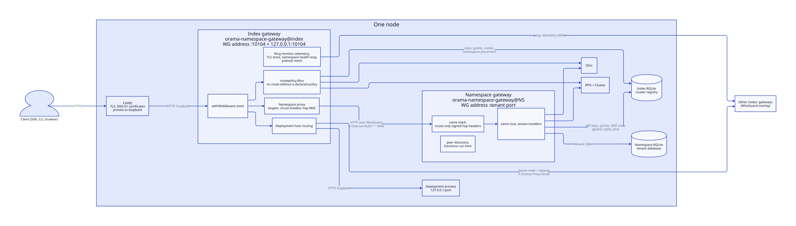
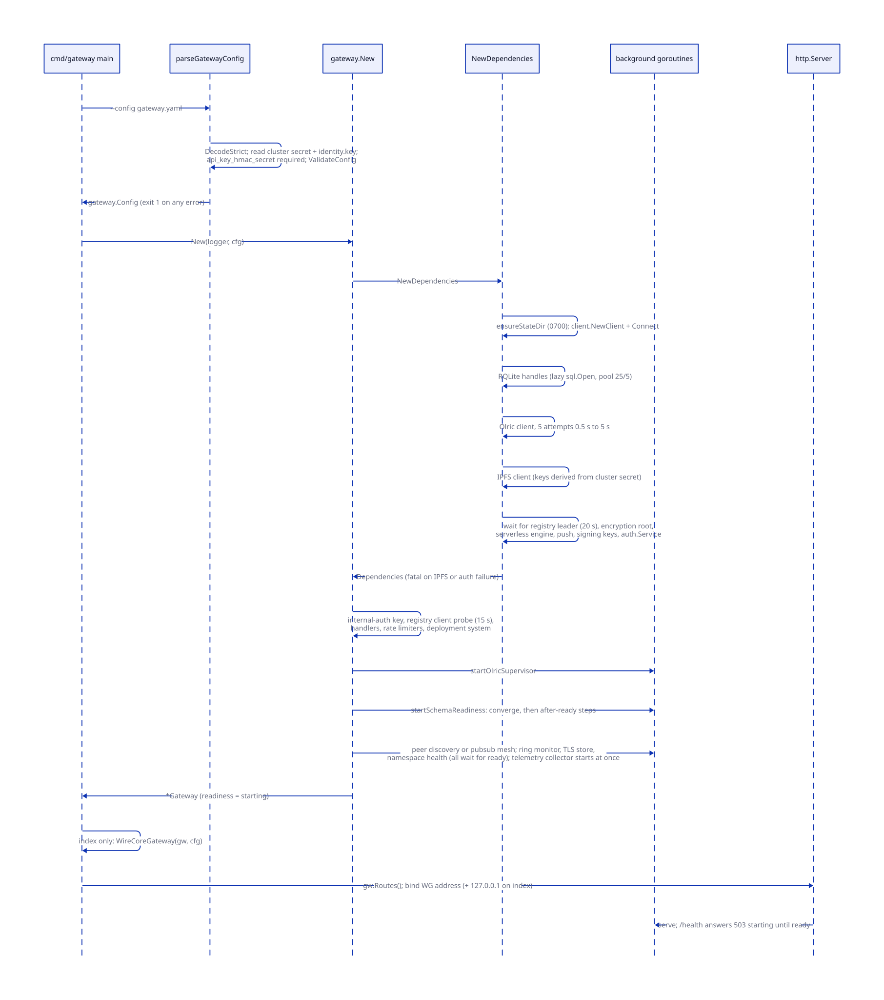
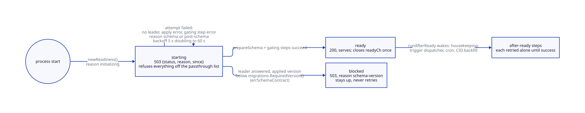
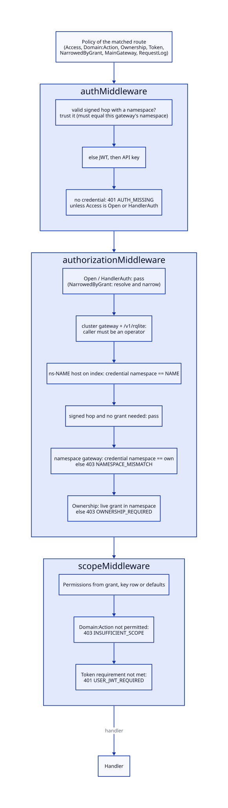
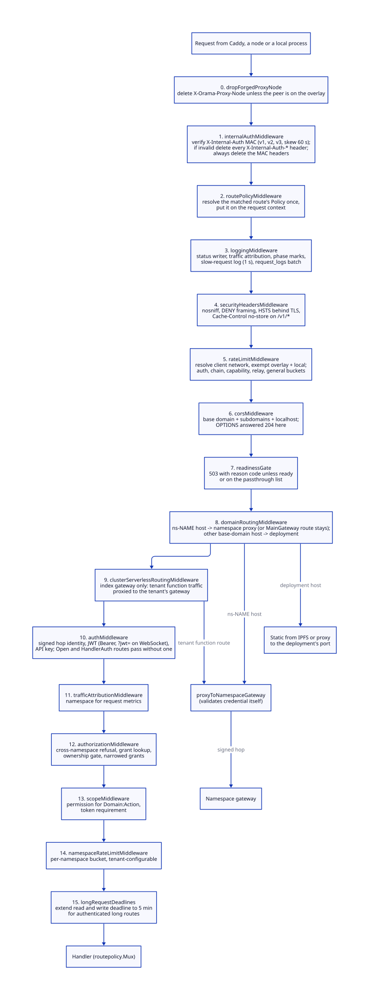
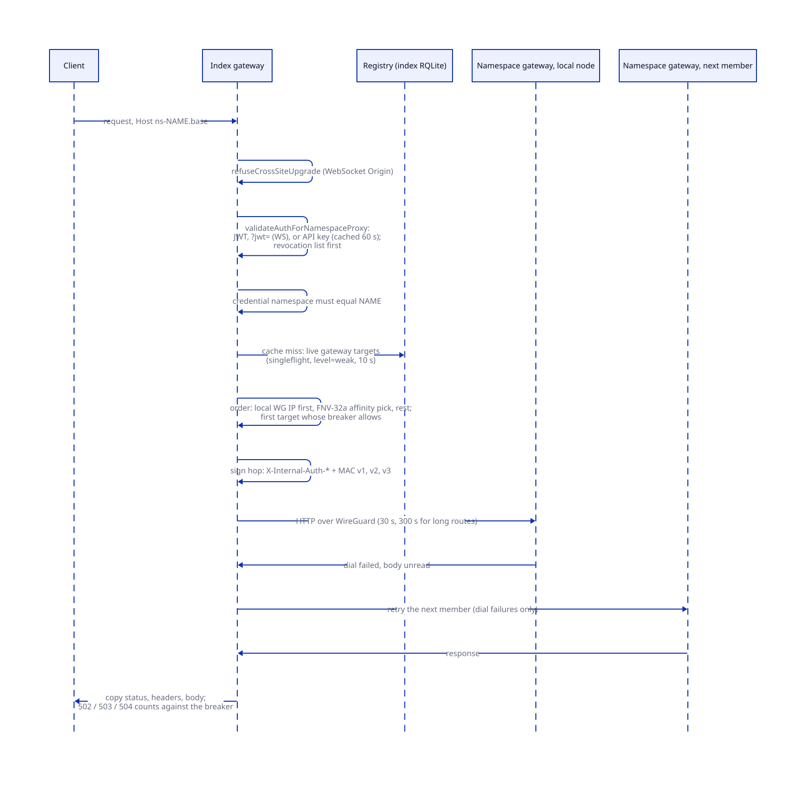
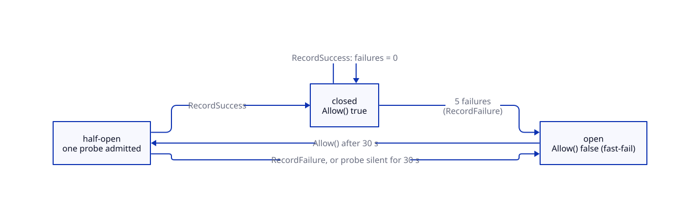
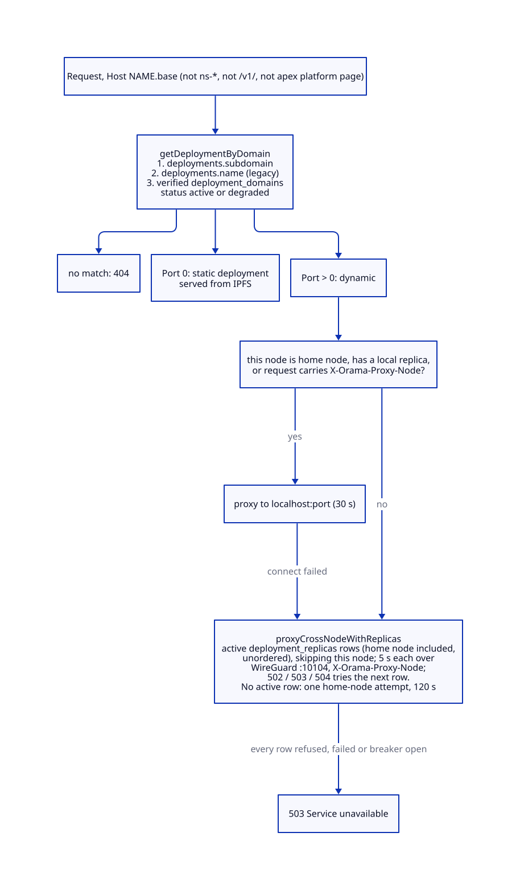

# Gateway architecture

> **At a glance.**
>
> - **What:** one Go binary, `core/cmd/gateway`, in two roles. As the index gateway (`client_namespace: index`, one per node) it is the cluster's HTTP entry point behind Caddy: it runs a fixed middleware stack, proxies tenant traffic to the right namespace gateway, serves deployments by host name and hosts the control-plane routes that need the cluster registry. As a namespace gateway (one per tenant namespace per node) it is the same code against the tenant's own RQLite, and it trusts only requests that carry a signed hop from an index gateway of the same cluster.
> - **Key numbers:** index gateway on port 10104 (WireGuard address and `127.0.0.1`); server read 60 s, write 120 s, 5 min for authenticated long transfers; credential cache 60 s; hop MAC skew 60 s; breaker opens at 5 failures for 30 s; namespace proxy 30 s (300 s on long routes); schema retry 5 s to 60 s; general rate limit 10,000 per minute, burst 5,000, per client network; credential endpoints 30 per minute, burst 10.
> - **Code:** `core/pkg/gateway/` (about 65,000 lines with its handler packages), `core/pkg/gatewayspec/`, `core/cmd/gateway/`, `core/pkg/gateway/handlers/operator/`, `core/pkg/gateway/handlers/chainread/`.
> - **Depends on:** [system shape](02-system-shape.md) (port map), [the node as a supervisor](04-the-node-as-a-supervisor.md) (how the unit starts), [cluster state](07-cluster-state.md) (the registry), [membership and failure detection](08-membership-and-failure-detection.md) (the ring monitor it hosts) and [namespaces](09-namespaces.md) (tenant placement).



## Why it exists

A client of Orama sees one HTTPS name per cluster and one per namespace (`ns-<name>.<base domain>`). Behind those names sit a registry database, a tenant database per namespace, a cache, an object store, a pub/sub mesh, a function engine, deployed applications and a set of node-to-node coordination routes. The gateway decides, for every request, whose credential it carries, which namespace it belongs to, which node answers it and what happens when that node is down.

Four constraints shaped it.

First, tenant isolation is physical. A namespace owns its RQLite, Olric and gateway processes ([namespaces](09-namespaces.md)), so the gateway that serves a tenant must be the tenant's own process, with the tenant's database as its database. But credentials, grants and the node list live in the cluster registry, which a tenant must never be able to write. The same binary therefore runs in two roles, and the predicates that tell them apart (`isNamespaceGateway`, `servesNamedNamespace`, `servesCoreRegistry`) decide which database each query goes to.

Second, public TLS is Caddy's job. The gateway never binds 80 or 443 (`core/cmd/gateway/main.go`). Every public request reaches it from `127.0.0.1`, so no gate may use the source address as evidence (`core/pkg/gateway/internal_auth_hop.go` records the incident that taught this).

Third, a gateway must start in a cluster that is itself still starting. After a power loss the local RQLite has no leader for seconds or minutes; during a rolling upgrade a node's schema may be one version behind its binary. The gateway listens, says why it cannot serve yet, and converges without an operator.

Fourth, the set of routes is a contract. More than a hundred routes each need an answer to "who may call this". The gateway declares it once per route in a table, refuses to register a route without an entry, and has a test that fails when a route and its documentation disagree.

## The model

**Index gateway.** The process `orama-namespace-gateway@index` that runs on every node, with `client_namespace: index`. Its database is the cluster registry (the index RQLite). It listens on the node's WireGuard address and on loopback, both at port 10104 (`core/cmd/gateway/listen.go:listenAddrs`, `core/pkg/constants/ports.go`). Caddy proxies every public request to the loopback listener; other nodes reach the overlay listener. It is also called the cluster gateway or main gateway in code and comments, and its namespace is the lobby namespace `default` for ownership purposes (`core/pkg/gateway/core_registry_guard.go:ownNamespace`).

**Namespace gateway.** The process `orama-namespace-gateway@<namespace>`, three per namespace, each on the WireGuard address of its node at the `gateway_http_port` of the namespace's port block. Its `rqlite_dsn` is the tenant's RQLite and its `global_rqlite_dsn` is the registry. It never receives a public request directly: the index gateway proxies to it.

**Role predicates.** Three functions encode the role and they are deliberately different questions.

| Predicate | True when | Used for |
|---|---|---|
| `isNamespaceGateway(cfg)` | `global_rqlite_dsn` is set and differs from `rqlite_dsn` | which database holds the registry; migrations tracker; whether the ring monitor, telemetry and TLS store run (`core/pkg/gateway/config.go`) |
| `servesNamedNamespace(ns)` | `client_namespace` is not empty, `default` or `index` | peer discovery versus pub/sub mesh; which signing key file is read (`core/pkg/gateway/gateway_state.go`) |
| `servesCoreRegistry()` | `ownNamespace` is the lobby, that is the gateway is the index | the raw-database operator guard, the SQL guard (`core/pkg/gateway/core_registry_guard.go`), serverless routing, and the hop's namespace check |

**Registry.** The index RQLite: `api_keys`, `principals`, `grants`, `namespaces`, `dns_nodes`, `namespace_clusters`, `namespace_port_allocations`, `deployments`, `operators`, `cluster_settings`, `invite_tokens`, `dns_records`. A namespace gateway reaches it through `deps.GlobalORMClient` and `g.authClient`; for the index gateway it is its own database.

**Policy.** What a route requires of its caller, declared in `core/pkg/gateway/route_policy.go:buildRoutePolicies` as a `routepolicy.Policy` (fields below). [Authorization](14-authorization.md) owns the meaning of domains, roles and grants; this chapter owns how the gateway looks the policy up and enforces it.

**Hop.** A request the index gateway has authenticated and forwards to a namespace gateway, carrying the verified identity in `X-Internal-Auth-*` headers and a MAC over them. The receiver believes the headers only if the MAC verifies.

**Target.** One live gateway of a namespace: a WireGuard address and a port, read from the registry by `namespaceGatewayTargetsQuery`.

**Passthrough.** The short list of paths a gateway answers even when it is not ready (`readinessPassthrough`).

**Route families.** The routes group by who built the handler. This chapter owns the platform and operator families and the plumbing for every other family; the other chapters own their handlers.

| Family | Routes | Handlers owned by |
|---|---|---|
| Health, version, status | `/health`, `/v1/health`, `/status`, `/v1/status`, `/v1/version`, `/v1/schema-status`, `/v1/internal/ping` | this chapter |
| Operator and network | `/v1/operator/*`, `/v1/network/*`, `/v1/node/status`, `/v1/node/command`, `/v1/node/logs`, `/v1/node/leave` | this chapter (`/v1/node/*` is the OramaOS agent family, not covered in this book) |
| Cluster edge services | `/v1/internal/tls/check`, `/v1/internal/acme/*`, `/v1/internal/tls-store`, `/v1/internal/telemetry`, `/v1/operator/telemetry*` | this chapter; the stores they front are in [TLS and certificates](25-tls-and-certificates.md) and [observability](32-observability.md) |
| Chain read proxy | `/v1/chain/` | this chapter (`handlers/chainread`) |
| Anonymity proxies | `/v1/proxy/anon`, `/v1/proxy/tunnel`, `/v1/proxy/relay` | this chapter, over the Tor client in [anonymity and Tor](../vol2/38-anonymity-and-tor.md) |
| Auth and sessions | `/v1/auth/*`, `/v1/audit` | [identity](13-identity.md) |
| Keys, members, grants | `/v1/namespace/keys*`, `/v1/namespace/members*`, `/v1/deployments/grants` | [authorization](14-authorization.md) |
| Node enrolment and mesh | `/v1/internal/join`, `/v1/node/enroll` | [the WireGuard mesh](06-the-wireguard-mesh.md) |
| Node self-registration | `/v1/internal/node/*` | [inter-node trust](15-inter-node-trust.md) |
| Namespace lifecycle | `/v1/namespaces`, `/v1/namespace/list`, `/v1/namespace/delete`, `/v1/internal/namespace/*` | [namespaces](09-namespaces.md) |
| Deployments | `/v1/deployments/*`, `/v1/internal/deployments/replica/*` | [app deployments](11-app-deployments.md) |
| Databases | `/v1/rqlite/*`, `/v1/db/sqlite/*`, `/v1/namespace/backup`, `/v1/namespace/restore*` | [database](17-database.md) |
| Cache, storage, pub/sub | `/v1/cache/*`, `/v1/storage/*`, `/v1/internal/storage/evict`, `/v1/pubsub/*` | [cache](18-cache.md), [storage](19-storage.md), [pub/sub](20-pubsub.md) |
| Functions | `/v1/functions*`, `/v1/invoke/`, `/v1/serverless/*` | [serverless functions](21-serverless.md) |
| Push, WebRTC | `/v1/push/*`, `/v1/webrtc/*`, `/v1/namespace/push-credentials*`, `/v1/namespace/webrtc/*` | [push notifications](22-push-notifications.md), [WebRTC](23-webrtc.md) |
| Rate-limit config, vault | `/v1/namespace/rate-limit`, `/v1/vault/*` | [rate limits and egress controls](27-rate-limits-and-egress-controls.md), [vault](28-vault.md) |

The full generated list is in [the gateway route appendix](../appendices/c-gateway-routes.md).

## How it works

### The process and its configuration

`core/cmd/gateway/main.go` does four things: parse the configuration, call `gateway.New`, wire the namespace machinery if this is the index gateway, and serve.

The configuration is a YAML file named by `--config` (an absolute path written by the namespace spawner), decoded strictly by `parseGatewayConfig` (`core/cmd/gateway/config.go`): an unknown key is an error. Its function-local struct `yamlCfg` mirrors `gatewayspec.GatewayYAMLConfig` (`core/pkg/gatewayspec/spec.go`), the type the spawner marshals. Nothing links them at compile time; the one test decodes the spawner's type into a six-field copy of `yamlCfg` (`core/cmd/gateway/config_ntfy_test.go:TestSpawnedGatewayConfig_loadsNtfyBaseURL`), so a key on one side only fails at gateway start. `gatewayspec` also holds the spawner's input (`InstanceConfig`) and the `GatewayInstance` record, and imports nothing from `pkg/gateway` or `pkg/namespace`, so both can depend on it without a cycle.

What the parser requires:

- `cluster_secret_path` is mandatory. The gateway reads the cluster secret from it and derives the orama directory (two directories up) and from there the node's identity key `data/identity.key`, whose peer id becomes `Config.NodePeerID`. Without it, home-node assignment, deployment placement, host TURN and leader locality would match no node, so the process exits.
- `api_key_hmac_secret` is mandatory: a gateway without it cannot authenticate keys stored as HMAC-SHA256 hashes.
- `enable_https: true` is a startup error. The key is accepted only so that a leftover YAML does not fail strict decoding.
- `state_dir` must be absolute and non-empty.
- `domain_name` becomes both `DomainName` and `BaseDomain`. It must be a lowercase domain of at least two labels (`config_validate.go:validateBaseDomain`), because it is matched as a case-sensitive suffix to decide which hosts get a certificate and which origins CORS admits.
- `relay_allowed_suffixes` entries must not be public suffixes.
- `bootstrap_peers` must be multiaddrs with `/tcp/<port>` and `/p2p/<id>` and no duplicates.
- `rqlite_dsn` must be an http or https URL with a host; there is no default, because rqlited binds only its WireGuard address.
- When `webrtc.enabled` is set, `sfu_port` and `turn_secret` are required.

The cluster secret and HMAC secret are checked first, one at a time. `Config.ValidateConfig` then returns every other problem at once and the binary prints them all before exiting 1.

Listeners are chosen by `listenAddrs`. A namespace gateway binds exactly `listen_addr`, which the spawner sets to the node's WireGuard address and the namespace's port. The index gateway must be given an address inside 10.0.0.0/24 and binds it plus `127.0.0.1` on the same port; an index YAML that still says `:10104` is refused rather than bound, because an all-interface bind put the control plane on the public interface behind only the firewall. `orama-node` rewrites the YAML on its next reconcile and restarts the unit.

The server is `net/http` with `ReadHeaderTimeout` 10 s, `ReadTimeout` 60 s, `WriteTimeout` 120 s (`constants.GatewayServerWriteTimeout`), `IdleTimeout` 120 s and `MaxHeaderBytes` 1 MiB. On SIGINT or SIGTERM it calls `Shutdown` with 10 s and then `gw.Close()`. There is no limit on concurrent connections; the systemd unit sets `LimitNOFILE=65536` and `MemoryMax=1G` (`core/systemd/orama-namespace-gateway@.service`).

### Assembly

`gateway.New` (`core/pkg/gateway/gateway.go`) builds the process in a fixed order. Several steps are fatal and several deliberately are not.



1. **`NewDependencies`** (`core/pkg/gateway/dependencies.go`). It creates the state directory (0700, `gateway_state.go:ensureStateDir`), then builds and connects the libp2p network client with `DatabaseReadLevel = weak`: reads go to the leader, because an auth decision must see a grant the leader has acknowledged. Then `initializeBackends`:
   - **RQLite handles.** `sql.Open("rqlite", dsn)` is lazy; the DSN carries the credentials and `disableClusterDiscovery=true&level=weak`. Pool: 25 open, 5 idle, 5 min lifetime, 2 min idle. The ORM HTTP gateway (`/v1/rqlite`) has a 30 s timeout. A namespace gateway opens a second handle, `GlobalORMClient`, on the registry (5 open, 2 idle); on the index gateway it is the same object as `ORMClient`. A handle that fails to open is logged and the gateway starts, reporting itself not ready.
   - **Olric.** Servers come from `olric_servers`, else from libp2p peer discovery, else the local index Olric. The initial connection retries 5 times with a 0.5 s to 5 s backoff. Failure is logged and the supervisor (below) takes over.
   - **IPFS.** Cluster and Kubo credentials are derived from the cluster secret. Endpoints come from the YAML, else node configs on disk, else `http://localhost:10108` and `http://localhost:10107`; timeout 60 s, replication factor 3. A derivation or construction failure is fatal.
   - **Serverless engine and auth service** (`initializeServerless`). It waits up to 20 s for a registry leader, loads the encryption root (`bootstrapEncryptionRoot`: the registry is the source, the state directory a cache, the node's `secrets/` a seed; a failure is returned, never replaced by the cluster secret), then builds the secrets manager, push manager, host functions, the WASM engine (memory 128 MiB default and 256 MiB maximum, timeout 30 s default and 60 s maximum, module cache 100), the trigger dispatcher, the cron scheduler (30 s tick) and the persistent WebSocket manager (cap 5,000). Then it loads the signing keys and builds `auth.Service`. A failure is fatal: a gateway without an auth service used to serve `/health` with every `/v1/auth/*` route missing. A one-off backfill 2 min after start (10 min cap) re-pins every active function's WASM cluster-wide (`RepinAllWASM`), since IPFS garbage collection once deleted unpinned modules.
2. **Hop key and registry client.** `internalAuthKey(cfg.ClusterSecret)` derives the hop MAC key (HKDF purpose `internal-auth-hop`). Without a cluster secret the gateway logs a warning, trusts no internal-auth header and refuses to proxy authenticated requests. A namespace gateway then opens `g.authClient` on the registry (`connectAPIKeyRegistry`) and proves it with a 15 s `SELECT 1 FROM api_keys LIMIT 1`. A failure is fatal, with the DSN password redacted: falling back to the tenant's own `api_keys` table would authenticate against rows the tenant can write.
3. **Handlers.** Pub/sub, push, WebRTC (TURN credentials need only the TURN secret, signalling a local SFU port, so they are gated separately), cache, storage, auth, rate limiters, WireGuard, node API, join, enroll, vault and operator, then the deployment system, which is built only when the registry handle, IPFS and the environment codec all exist. Its health checker runs only on the index gateway.
4. **Background work.** `startOlricSupervisor`, `startSchemaReadiness`, and the role-specific loops listed under [services that run only on one role](#services-that-run-only-on-one-role). Everything that touches the schema first calls `AwaitReady`.

After `New` returns, `main` calls `namespacehandlers.WireCoreGateway` on the index gateway (`core/pkg/gateway/handlers/namespace/core_wire.go`). It builds the namespace `ClusterManager` and installs it through the setters `SetClusterProvisioner`, `SetNodeRecoverer`, `SetWebRTCManager`, `SetSpawnHandler`, `SetNamespaceDeleteHandler`, `SetNamespaceOperatorRemoveHandler`, `SetNamespaceListHandler` and `SetNamespaceCreateHandler`. `Routes()` runs after that, so the namespace-lifecycle routes are mounted on the index gateway and are absent (404) on a namespace gateway. The ring monitor's callbacks therefore check `gw.nodeRecoverer != nil` when an event fires.

### Readiness

A gateway reports its own start-up state separately from the health of what it talks to (`core/pkg/gateway/readiness.go`).



| State | Meaning | HTTP |
|---|---|---|
| `starting` | Listening; the schema is not yet at the required version, or gating start-up work is unfinished. Retried for the life of the process. | 503 |
| `ready` | Schema at the required version and gating work done. | 200 |
| `blocked` | A leader answered and the applied schema version is below `migrations.RequiredVersion()`. Retrying cannot fix it. | 503 |

Public reason codes, which are all an unauthenticated caller learns: `initializing`, `schema`, `post-schema`, `schema-version`. The error text of the last attempt stays in the log. The refusal body is `{status, reason, since, error: "gateway is <state>"}`.

`convergeSchema` runs `prepareSchema` and the gating post-schema steps in a loop. `prepareSchema` waits for a leader-routed read (20 s per attempt, `defaultRQLiteReadyTimeout`), applies the embedded migrations (30 s, `defaultSchemaApplyTimeout`) and checks the contract. On a namespace gateway the migrations run under an isolated tracker table (`orama_schema_migrations`), because the namespace's own `schema_migrations` belongs to the tenant (`rqlite.ApplyEmbeddedMigrationsNamespace`). Only one failure is permanent: `errSchemaContract`, raised when a leader answered and the applied version is lower than required, or when there is no database handle at all. Everything else, including a failure to read the version, retries with a backoff that starts at 5 s and doubles to 60 s; treating "cannot read" as "behind" would let a 200 ms leader hiccup latch a namespace into `blocked`.

The gating steps (`post_schema.go:postSchemaSteps`) run inside the loop with a 5 min cap per pass:

1. publish this gateway's signing key to the registry (a token signed with an unpublished key is refused by every other gateway);
2. on a namespace gateway, delete leftover plaintext `ak_` rows from the tenant's own `api_keys` table (`tenant_key_cleanup.go`);
3. when an HMAC secret is configured, hash any plaintext keys in the registry.

The after-ready steps (`afterReadySteps`) run once the gateway is ready, each on its own goroutine, each retried with the same backoff until it succeeds: revoke API keys of deleted namespaces, on the index gateway retire unused index signing keys and start the signing-key heartbeat, back-fill push token fingerprints, start the storage CID reference back-fill, start the pub/sub trigger dispatcher, start the cron scheduler. A failing housekeeping step must not hold up the dispatcher or scheduler, so none of these gates readiness.

While not ready, `readinessGate` answers 503 to everything except `readinessPassthrough`: `/health`, `/v1/health`, `/status`, `/v1/status`, `/v1/version`, `/v1/internal/ping`, `/v1/internal/tls/check`, the telemetry report path, the status page assets and `/.well-known/acme-challenge/`. These only read. The list is deliberately not the `Open` routes: many write (`/v1/auth/verify` inserts refresh tokens), and a gateway whose schema is behind its binary must not keep writing to it. The gate sits inside CORS, so a browser can read the 503 and its reason.

### Routing and the policy table

`Routes()` (`core/pkg/gateway/routes.go`) creates a `routepolicy.Mux` over the table and registers every handler on it. `Mux.Handle` panics if the pattern has no declared policy, and `RegisterAll` checks every pattern a handler package reports (the ORM gateway and the serverless handlers compose their own). The policy of a request is looked up by feeding the request to a `ServeMux` holding the declared patterns, so the policy is chosen by exactly the rules that choose the handler. A request that matches nothing gets the zero policy, which requires a credential and grants nothing: an unmatched path is closed, not open.

Policy fields, as the gateway uses them:

- **`Access`.** `Credential` (the zero value) needs an API key or JWT. `Open` is reachable by anyone: health, version, status, the key set, the login handshake, the chain proxy, the TLS check, the ping and `/v1/invoke/`. `HandlerAuth` means the handler authenticates the caller itself, so the middleware must not resolve a credential first: invite tokens, coordination MACs on the other internal routes, capability-opened WebSockets and the relayed download. Both make `Anonymous()` true.
- **`Domain` and `Action`.** What the route does, for the scope gate (`Domain:Action`, for example `deploy:write`, `operator:read`, `secrets:write`). The wildcard policy `policyUnrestricted` is used only for `/v1/operator/invite`.
- **`Ownership`.** The caller must hold a live grant in the namespace. This is also what resolves the grant onto the request for the data paths.
- **`Token`.** `AnyCredential`, `AnyToken` (some JWT, so a leaked bare key is inert), `WalletToken` (a signed-in user) or `PrincipalToken` (a user or a deployed app's workload token, never a key). An admin caller is exempt.
- **`NarrowedByGrant`.** An `Open` route whose handler applies the caller's resource selector (`/v1/invoke/`).
- **`MainGateway`.** Keep the route on the index gateway even when the request arrives on an `ns-<name>` host. Used for deployments (a deployment's unit is this node's systemd, which only the index gateway may drive), key and member management, namespace deletion, namespace list, operator-list routes, telemetry and node self-registration: anything whose data is in the registry that a namespace gateway's database lacks.
- **`RequestLog`.** `LogFull`, `LogNoAddress` (the request log row is written with an empty address) or `LogNone` (no row, no access-log line; only a count by status). The relayed-fetch routes use the last two.

`AddDynamic` declares a policy that depends on the request, for a pattern whose handler dispatches on the rest of the path. `/v1/functions/` asks the serverless package's own parser (`IsFunctionAction`) which operation it is; an earlier version read the path suffix, so `/v1/functions/secrets/invoke` was treated as an invocation. `/v1/storage/unpin/` requires a principal token except for `DELETE`, which accepts any token. `/v1/network/status` and `/v1/network/peers` require an operator unless the request carries a coordination MAC.

`TestRoutePolicy_everyRegisteredRouteIsDeclared` and `TestRoutePolicy_thePublicSetIsTheOneThatWasReviewed` (`core/pkg/gateway/route_policy_test.go`) keep the table honest in the other direction: adding an `Open` route fails the build until the reviewed set is edited too.



### The middleware stack

`withMiddleware` (`core/pkg/gateway/middleware.go`) wraps the mux; `Routes` then wraps the result in `dropForgedProxyNode`. Outermost first:



| # | Middleware | What it does |
|---|---|---|
| 0 | `dropForgedProxyNode` | Deletes `X-Orama-Proxy-Node` unless the peer is on the overlay. The header means a peer already routed this deployment request; a client able to set it could run an update outside the home node's lock. |
| 1 | `internalAuthMiddleware` | Verifies the hop MAC. Without a valid one every `X-Internal-Auth-*` header is deleted, so nothing below asks whether they are authentic. The MAC headers are always deleted, so deployed apps never see them. |
| 2 | `routePolicyMiddleware` | Resolves the matched route's `Policy` once and puts it on the context; the four readers below cannot disagree. |
| 3 | `loggingMiddleware` | Records status and bytes, attaches the traffic slot and request phases, logs the request, records metrics, logs a per-phase breakdown for requests over 1 s (`slowRequestThreshold`; not WebSocket upgrades) and enqueues a `request_logs` row. A `LogNone` route is only counted. |
| 4 | `securityHeadersMiddleware` | `X-Content-Type-Options: nosniff`, `X-Frame-Options: DENY`, `X-XSS-Protection: 0`, `Referrer-Policy`, `Permissions-Policy`, HSTS when behind TLS; and `Cache-Control: no-store` plus `Pragma: no-cache` on every `/v1/` response whose handler chose no `Cache-Control` of its own. |
| 5 | `rateLimitMiddleware` | Resolves the client network from the peer address (`clientkey.Resolve`), exempts overlay and local traffic, then applies the buckets in the rate-limit table below. |
| 6 | `corsMiddleware` | Echoes the origin if its host is the base domain, a subdomain, `localhost` or `127.0.0.1`; otherwise answers with `https://<base domain>`, which a browser then refuses. Methods `GET, PUT, POST, DELETE, OPTIONS`, headers `Content-Type, Authorization, X-API-Key`, max age 600. `OPTIONS` is answered 204 here. No `Allow-Credentials`. |
| 7 | `readinessGate` | See above. |
| 8 | `domainRoutingMiddleware` | For hosts under the base domain: `ns-<name>` goes to the namespace proxy (unless the route is `MainGateway`); `/v1/` and `/.well-known/` pass; the apex serves only platform pages; any other host is looked up as a deployment. |
| 9 | `clusterServerlessRoutingMiddleware` | Index gateway only; see below. |
| 10 | `authMiddleware` | Resolves the credential. |
| 11 | `trafficAttributionMiddleware` | Notes the namespace for the request metrics, so refusals by later gates are attributed too. |
| 12 | `authorizationMiddleware` | Cross-namespace refusal, grant lookup, ownership gate. |
| 13 | `scopeMiddleware` | Permission and token requirement. |
| 14 | `namespaceRateLimitMiddleware` | Per-namespace bucket. |
| 15 | `longRequestDeadlines` | For authenticated callers on long routes, extends the connection's read and write deadlines to 5 min. |

#### Credential resolution

`authMiddleware` tries, in order:

1. **A signed hop.** If `X-Internal-Auth-Validated: true` survived step 1 and names a namespace, the gateway trusts it: the namespace, JWT subject, custom claims, token times, device and session are rebuilt into `ctxKeyJWT`, and the forwarded scopes are parsed. The one check beyond the MAC is that a namespace gateway refuses an identity forwarded for a different namespace than its own (a stale target row sending one tenant's traffic to another's gateway). The JWT is not re-verified; namespace gateways hold their own signing keys. A validated header with no namespace asserts nothing, and the request authenticates on its own credentials.
2. **A Bearer JWT** with three dot-separated parts, verified by `authService.ParseAndVerifyJWT`. On a non-anonymous route a revoked, expired or unverifiable-revocation result answers `AUTH_REVOKED` (401), `AUTH_EXPIRED` (401) or `AUTH_UNAVAILABLE` (503) rather than falling through to the key path, which would only report an unknown credential; any other verification failure does fall through. A JWT whose subject is a stored API key additionally has its scopes re-read from the key's row (`withExchangedKeyScopes`): the scopes claim copied into the token at mint time is not the authority.
3. **A JWT in `?jwt=`**, on WebSocket upgrades only, at most 4,096 bytes. After verification the parameter is stripped from the request so it does not travel to the namespace gateway or its logs. Only an expired token or an unreadable revocation list is answered specially here; a revoked or invalid one falls through and, with no key, ends as `AUTH_MISSING`.
4. **An API key** from `Authorization: Bearer`, `ApiKey`, `X-API-Key`, or `?api_key=` / `?token=` on WebSocket upgrades. Deprecated spellings are marked with a response header and audited on first use per namespace (`auth_deprecation.go`). `lookupAPIKeyEntry` consults the replicated revocation list first (stale bound 10 s, refreshed every 5 s), then the credential cache, then the registry (`apiKeyByStoredSQL`: not revoked, `expires_at` in the future, namespace joined).

With no credential, an `Open` or `HandlerAuth` route passes and any other route answers `AUTH_MISSING` (401). [Identity](13-identity.md) covers the tokens and keys themselves.

The credential cache (`middlewareCache`, TTL `CredentialStaleness` = 60 s) holds key to (namespace, scopes) and bounds how long narrowing a key takes to bite; revocation is not bounded by it, because the revocation list is checked first. A wallet's grant is read through a 10 s cache on the data plane (`narrowedGrantTTL`) and live on control-plane routes.

#### Authorization and scope

`authorizationMiddleware` skips anonymous routes (resolving the grant first when the route is `NarrowedByGrant`), then:

1. On the index gateway, refuses `/v1/rqlite*` to anyone who is not on the operator list (`requireOperatorForCoreRegistry`). The registry is an operator's to read; a tenant's admin key must not export it.
2. For a route the index gateway serves on an `ns-<name>` host, requires the credential's namespace to equal the host's (`credentialServesHostNamespace`).
3. If the request is a signed hop and `forwardedCallerNeedsGrant` says its forwarded identity already answers the route (a key's scopes, a wallet on the data plane with a cached grant), passes.
4. On a namespace gateway, refuses a credential of another namespace (`NAMESPACE_MISMATCH`, 403).
5. If the route requires ownership, looks up the live grant for the credential's principal in the registry (`grantDB`: the registry client when one is configured, else the gateway's client), under both the hashed and raw key spellings, and refuses with `OWNERSHIP_REQUIRED` (403) when there is none. The gate first runs `INSERT OR IGNORE INTO namespaces` so the namespace row exists. The grant is attached to the request.

`scopeMiddleware` computes the caller's `PermissionSet` once (`callerPermissions`: the grant if one was resolved, else the key row's scopes, else the defaults for a signed-in user with no grant, else nothing), stores it in the context for the handler, requires `Domain:Action` to be permitted at the domain level (`INSUFFICIENT_SCOPE`, 403, with `required_scope` and `required_permission`) and then the route's token requirement (`USER_JWT_REQUIRED`, 401). The lobby namespace holds nothing: a lobby session reaches only routes that ask for no permission.

#### Rate limits

`configureRateLimiters` (`gateway.go`) creates the buckets. [Rate limits](27-rate-limits-and-egress-controls.md) explains client-network resolution and the bucket arithmetic; the numbers are here because they are this gateway's configuration.

| Bucket | Per minute | Burst | Applies to |
|---|---|---|---|
| general | 10,000 | 5,000 | every request not exempt |
| credential | 30 | 10 | `/v1/auth/challenge`, `verify`, `api-key`, `token`, `refresh`, the device endpoints (`isAuthRateLimitPath`) |
| chain query | 120 | 30 | `/v1/chain/query/` |
| chain simulate | 30 per client, 1,200 per route | 10, 200 | `POST /v1/chain/simulate` |
| chain broadcast | 12 per client, 600 per route | 4, 100 | `POST /v1/chain/broadcast` |
| capability upgrade | 60 | 20 | function WebSocket opened with a capability |
| relay stream | 30 | 10 | `/v1/proxy/relay` |
| WebRTC join | 60 | 20 | per signed-in identity, inside the handler |
| namespace | 10,000 (tenant-configurable up to 100,000) | 5,000 (up to 50,000) | after auth, per namespace (`ratelimit.Manager`) |

Buckets are token buckets keyed by the client's network (an IPv6 client by its /64), dropped after 10 min idle. A refusal is 429 with `Retry-After` (60 s for credentials, 10 s for chain queries, 5 s general) and, on all but the general bucket, the RPC error envelope with `RATE_LIMITED`. The state is in memory per process: a client spread across three nodes gets three buckets.

#### Logging and metrics

Every request produces an access-log line, a queued `request_logs` entry and a traffic sample. `requestLogBatcher` flushes every 5 s or at 100 entries with one multi-row `INSERT INTO request_logs`, one `DELETE` of rows older than 7 days and, for API keys seen, an `UPDATE api_keys SET last_used_at`. The traffic recorder (`pkg/telemetry/traffic`) keeps a one-minute window per namespace for the node report, excluding the health, ping and telemetry paths so the metrics do not measure the monitor. A request is attributed to the namespace that auth or domain routing resolved, else to the gateway's own `client_namespace`.

`request_phases.go` records four marks (routing, auth, targets, upstream); a request slower than 1 s logs each phase's milliseconds and the remainder, because a soak once saw authenticated requests stall for seconds while the namespace gateway answered in milliseconds.

### Namespace proxying

When a request arrives on `ns-<name>.<base domain>` and its route is not `MainGateway`, `handleNamespaceGatewayRequest` runs `proxyToNamespaceGateway`.



1. **Cross-site WebSocket check.** `refuseCrossSiteUpgrade` discards the client's `X-Forwarded-Host` and applies the same Origin check the upgrader would, before any registry read, so the refusal does not depend on a backend being up.
2. **Validate the credential here**, against the registry (`validateAuthForNamespaceProxy`): JWT, `?jwt=` on upgrades, or API key. The namespace gateway cannot validate keys, because they live only in the registry. No credential on a non-anonymous route is a 401 here, with a diagnostic log line, not a silent forward the namespace gateway would reject opaquely. The credential's namespace must equal the host's name.
3. **Find targets.** The cache (`mwCache`, 60 s) is tried first. On a miss `namespaceGatewayTargets` runs `namespaceGatewayTargetsQuery` against the registry at `level=weak` (the leader, not a follower that may not yet have applied a fresh namespace). It selects gateway members whose cluster is `ready` or `degraded`, whose `namespace_cluster_nodes` row is `running` and whose `dns_nodes` row is `active`. Selecting on the per-node status rather than the cluster rollup lets a degraded namespace keep serving from its healthy members; an earlier version required `ready`, and one failed gateway took the tenant offline. Concurrent misses share one read (`singleflight`, detached from the first caller's context, bounded to 10 s). A registry error is a retryable 503 `SERVICE_UNAVAILABLE`, never a 404: a client with a live tenant must not be told it does not exist. No rows is a 404 `Namespace gateway not found`.
4. **Order the targets.** Sort by address and port for determinism; put the target on this node's WireGuard IP first; then the FNV-32a hash of `namespace|credential` (the API key, else the Authorization header, else the client address) modulo the target count; then the rest. Affinity keeps one caller's WebSocket subscribe and publish on one member.
5. **Pick the first target whose circuit breaker allows a request** (below). If none does, 503 `SERVICE_UNAVAILABLE` with the message "all upstream circuits are open".
6. **Sign the hop.** `namespaceProxyRequest` copies the request, sets `X-Forwarded-For` (the attributed client address), `X-Forwarded-Proto`, `X-Forwarded-Host` and `X-Original-Host`, strips inbound `X-Internal-Auth-*` headers, writes the validated namespace, subject, claims, token times, device, session and key scopes, and stamps all three MAC versions. Without a cluster secret the proxy answers 503 rather than send an assertion it cannot back.
7. **Send.** An `http.Client` with the shared transport (200 idle connections, 20 per host, 90 s idle) and a whole-request timeout of 30 s, or 300 s (`longProxyTimeout`) on the long routes: storage upload and pin, whole-database moves, function deploy and function invocation (`isLongRunningProxyPath`). Request bodies over the limit of their path (restore, import) are refused with 413 before a byte is sent (`refuseOversizedProxyBody`). A validated caller on a long route also gets the 5 min server-side deadline extension, since the server's 60 s read timeout would cut a slow upload off first.
8. **Fail over.** If the dial fails, the next member whose circuit allows it is tried, but only while nothing has been read from the request body (`undialedBody`) and the failure is a dial failure (`isDialFailure`: a `net.OpError` with `Op == "dial"`). A request that reached a member is never retried on another, whatever the method; a client that went away is not counted against any member.
9. **Answer.** On success, copy status, headers and body, leaving out the internal `X-Orama-Function-Origin` marker. A 502, 503 or 504 from the member counts as a breaker failure (`isUpstreamFailure`) unless the response carries that marker, which the namespace gateway's invoke handler sets on every function outcome: a function's raw HTTP status, or `FUNCTION_UNAVAILABLE`, says nothing about the gateway. Anything else counts as a success. With no response, a timeout is 504 `TIMEOUT` with a message that names the function budget for invocations and warns that "a write may already have taken effect" otherwise; any other error is 503 `SERVICE_UNAVAILABLE`. Both count against the member's breaker, except a client that went away or a request body the client failed to deliver (`undialedBody.failedRead`), which count for nothing and give back a half-open probe slot (`Abandon`).

**WebSocket upgrades** take the same steps up to 6, then `proxyNamespaceWebSocket`: dial the member (10 s), write the original request to it, hijack the client connection, flush any buffered bytes and copy both ways until one side closes. A failed dial tries the next member; a tunnel counts as the member's success as soon as it is set up, not when it ends (`tunnelWebSocket`'s `onEstablished`), so a WebSocket that is a half-open probe decides at once; a handshake that fails after the dial counts as a failure; when no member accepts, the client gets a retryable `NAMESPACE_GATEWAY_UNAVAILABLE`.

**Circuit breaker.** `CircuitBreakerRegistry` holds one `CircuitBreaker` per key; the namespace proxy keys by namespace and member, `ns:<namespace>@<member IP>` (`namespaceBreakerKey`), so one tenant's failing gateway opens only its own breaker, and deployment hops key by `node:<IP>`. The breakers of a namespace's gateways are bounded by namespaces x members: when the proxy reads a namespace's members from the registry, `retainBreakers` drops those of members no longer listed.



A breaker opens after 5 failures (`defaultFailureThreshold`; any success resets the count to zero, so these are consecutive) and stays open 30 s (`defaultOpenDuration`). It then admits exactly one probe; every other caller is refused until the probe reports. If the probe does not report an outcome within 30 s (`defaultHalfOpenTimeout`), the breaker re-opens rather than hold the slot forever; a failed probe re-opens at once; a request that ends without saying anything about the member calls `Abandon`, which gives the slot back. The namespace health loop prunes breakers idle for 30 min, every 5 min. Every transition goes to the registry's observer, which logs it (`logBreakerTransition`: namespace, node, failures, last error; a breaker that keeps failing its probes logs one cycle per `breakerCycleLogInterval`, 5 min), and `Gateway.breakersReport` puts the breakers that are not closed into the node report (`breakers`, capped at `report.MaxBreakersReported`), where `checkNodeBreakers` raises a warning alert per target node.

### Serverless routing on the index gateway

The index gateway does not run tenant functions: its database is the registry, whose namespace-placed tables hold every tenant's rows side by side, and a function's SQL guard is a denylist of platform tables that cannot tell one tenant's row from another's. `clusterServerlessRoutingMiddleware` (`core/pkg/gateway/serverless_routing.go`) therefore sends serverless traffic for any namespace but `default` to that namespace's gateway through the `proxyToNamespaceGateway` path an `ns-` host takes.

The routes are the ones the serverless handlers register (read from `serverlesshandlers.Routes()`, so the two lists cannot disagree). Which namespace: the path of `POST /v1/invoke/<namespace>/<function>`, else `?namespace=`, else the credential's, else nothing: an anonymous caller then gets a 400 telling them to name the namespace, and a credentialed route a 401. The middleware sits above `authMiddleware` because the proxy validates the credential itself. The function host calls refuse a foreign namespace's database independently (`functionDatabaseNamespace` returns the empty string for the lobby), so a function row already in the registry and fired by a trigger gets no database either.

### Deployment host routing

A request whose host is under the base domain, is not `ns-`, not a `/v1/` or `/.well-known/` path and not an apex platform page (`/status`, `/health`, the status assets) is looked up as a deployment (`domainRoutingMiddleware`, `getDeploymentByDomain`).



The lookup runs on the registry through the gateway client, in this order: `deployments.subdomain` equal to the single label (`<name>-<random>`), then `deployments.name` (legacy `<name>`), then a verified row in `deployment_domains` (a custom domain). Only `active` or `degraded` deployments match. No match is a 404. A match is attributed to the deployment's namespace; port 0 means a static deployment served from IPFS by the static handler; any other port is a process on some node.

`proxyToDynamicDeployment` handles the dynamic case. If this node is the home node, has a replica of the deployment (`GetReplicaPort`), or the request already carries `X-Orama-Proxy-Node`, it proxies to `localhost:<port>` with a 30 s timeout. If not, `proxyCrossNodeWithReplicas` reads the deployment's active `deployment_replicas` rows (the home node has one, flagged primary; the query has no ordering), skips this node, and tries each over the overlay at the index gateway port with `X-Orama-Proxy-Node` set, so the receiver serves locally, and the original `Host` kept, so its host routing finds the same deployment. Every attempt has 5 s and a `node:<IP>` breaker, and a 502, 503 or 504 moves on to the next row. Only when there is no replica manager or no active row does it make one attempt at the home node under the 120 s `constants.GatewayProxyTimeout`. A failed local proxy tries the replicas before answering 503, and WebSocket upgrades follow the same order through `proxyWebSocket`. `X-Internal-Auth-*` headers are deleted before forwarding: the app has no reason to see them.

Management routes for a deployment use `withHomeNodeProxy` (`delete`, `logs`, `stats`) or `withHomeNodeOnly` (`update`, `rollback`, `env/set`) (`routes.go`). Both read the deployment named in the query and, if this node is not its home node, forward the request in one 120 s hop (`proxyCrossNodeWithin`). `withHomeNodeProxy` falls back to running locally when the home node does not answer (a read can be answered anywhere, and `delete` takes the per-deployment lock wherever it runs, so a deployment whose home node is gone for good can still be deleted). `withHomeNodeOnly` refuses with 503 and `Retry-After: 5` instead: an update, rollback or environment change runs under the home node's lock and version stamps. Those routes extend the entry gateway's write deadline to 390 s (`constants.GatewayDeploymentWriteBudget`) and give the hop 360 s (`GatewayDeploymentProxyTimeout`), so each nested wait is shorter than the one around it (`core/pkg/constants/timeouts.go`).

### Internal routes

Routes under `/v1/internal/` are node-to-node. They are not reachable by clients: some are 404 to anyone without a MAC, so the route does not confirm it exists. Each authenticates in its own handler; the middleware sees them as `HandlerAuth` (or `Open` for the ping and TLS check).

| Route | Caller | Authentication in the handler |
|---|---|---|
| `/v1/internal/ping` | ring monitor of a peer | none; returns `status: ok` and passes the readiness gate |
| `/v1/internal/telemetry` | a peer's cluster gateway | coordination MAC and a WireGuard-peer source (`verifyCoordination`) |
| `/v1/internal/namespace/repair` | a peer | coordination v2 MAC, because the route changes state and v1 names no audience |
| `/v1/internal/namespace/spawn` | a peer | coordination v2 MAC ([namespaces](09-namespaces.md)) |
| `/v1/internal/secrets/reencrypt` | the rotating gateway | signed stamp (`secrets_rotate.go:handleInternalReencrypt`) |
| `/v1/internal/storage/evict` | a peer | signed stamp ([storage](19-storage.md)) |
| `/v1/internal/push/ntfy/` | a peer | coordination v2 MAC covering the body, audience this node (`push_ntfy_internal.go`) |
| `/v1/internal/webrtc/events` | a namespace's SFU | MAC under a key derived from the namespace's TURN secret |
| `/v1/internal/deployments/replica/*` | the home node | signed stamp ([app deployments](11-app-deployments.md)) |
| `/v1/internal/node/register`, `heartbeat`, `enrol-key` | a node | per-node signature ([inter-node trust](15-inter-node-trust.md)) |
| `/v1/internal/join`, `/v1/node/enroll` | a joining node | invite token ([the WireGuard mesh](06-the-wireguard-mesh.md)) |
| `/v1/internal/acme/present`, `cleanup` | this node's Caddy | MAC under the ACME challenge key, over the body (`acme_auth.go`); writes only `_acme-challenge` TXT records under the base domain |
| `/v1/internal/tls-store` | this node's Caddy | coordination v2 stamp under the store's MAC key, loopback only |
| `/v1/internal/tls/check` | this node's Caddy | none; admits any name equal to or under the base domain |

`verifyCoordination` requires two things: the request's peer address is in the WireGuard subnet, and it carries a MAC derived from the cluster secret (`core/pkg/gateway/coordination.go`). The MAC is the credential; being on the overlay is not, since every namespace's services are on that mesh. [Inter-node trust](15-inter-node-trust.md) defines the stamps.

### The hop MAC

The hop headers exist because the index gateway validated the credential and the namespace gateway cannot. They were once believed on the strength of the source IP, and the source IP of every public request is `127.0.0.1`: an Internet client could send `X-Internal-Auth-Validated: true`, a namespace and `X-Internal-Auth-Scopes: admin` and be an admin of any namespace.

`core/pkg/gateway/internal_auth_hop.go` defines three versions. The payload is a newline-joined string: version label, upper-cased method, path, namespace, subject, custom claims, scopes, then each later version's fields, then the Unix timestamp. v1 covers the first set; v2 adds the token's `exp`, `iat` and `jti` (so an open WebSocket ends with its token or its revocation); v3 adds device and session. The header is `<unix seconds>.<hex hmac-sha256>`, keyed by HKDF of the cluster secret (purpose `internal-auth-hop`). A signer stamps all three versions; a verifier judges a request by the newest MAC it carries, with no fallback to an older one, and deletes the fields that version does not cover. Timestamps more than 60 s from the receiver's clock, either way, fail. A hop from an older index gateway carries no token expiry, so `hopTokenTimes` gives its claims the longest life a token can have (1 hour).

The MAC binds method and path, so a stamp captured on a GET cannot be replayed on a DELETE or another path. It does not bind the host, the query string or the body, and carries no nonce: inside its 60 s window a captured stamp can be replayed to any gateway of the named namespace on the same method and path. Stripping a newer MAC to downgrade a hop needs a position inside the mesh, and every node there holds the secret every version is keyed from.

### Operator routes

`core/pkg/gateway/handlers/operator/` serves `/v1/operator/*` for the people who run the cluster.

**Who is an operator.** A wallet in the `operators` table, compared case-insensitively (`IsOperator`). `requireOperator` resolves the caller's wallet (`WalletFromRequest`): the JWT subject if it is a wallet; for an API key or key-exchanged JWT, the wallet that holds the `owner` grant of the key's namespace. It answers 401 when no wallet is found, 503 when the table cannot be read (not knowing is not permission) and 403 `NOT_AN_OPERATOR` otherwise. An admin key of an operator's namespace therefore acts as that operator; an admin key of any other namespace is refused. The scope gate asks for `operator:read` or `operator:write` first, so a runtime key never reaches the handler.

**Routes.**

| Route | Method | What |
|---|---|---|
| `/v1/operator/invite` | POST | Mint a cluster invite: 32 random bytes, hex-encoded, stored as `sha256:<hex>` in `invite_tokens`; expiry default and maximum 1 hour; the response holds the only copy. Policy is `policyUnrestricted`, because the token hands out every secret the cluster holds. Audited. |
| `/v1/operator/operators[/wallet]` | GET, POST, DELETE | List, add and remove operators. Removal is one `DELETE` guarded by a count greater than 1, so two concurrent removals cannot empty the list (409 `LAST_OPERATOR`); an empty list would lock out the API with no way back. Audited. |
| `/v1/operator/settings[/setting]` | GET, PUT | `namespace_creation` (`operators`, `allowlist`, `open`; default `operators`) and `max_namespaces_per_wallet` (1 to 10,000; default 10), stored in `cluster_settings`. `LoadCreationPolicy` refuses a stored value the binary cannot enforce instead of treating it as open. |
| `/v1/operator/creators[/wallet]` | GET, POST, DELETE | The allowlist consulted when creation is `allowlist`; an empty list denies everyone. |
| `/v1/operator/nodes` | GET | The operator's `dns_nodes` rows (`operator_wallet`), optionally for one `env`. |
| `/v1/operator/node/register` | POST | Tag an existing node with the operator's wallet, environment, role (`node`, `nameserver` or `nameserver-nsN`) and SSH user. The `UPDATE` matches only unclaimed rows or the caller's own. Audited. |
| `/v1/operator/rotate-signing-key`, `rotate-secrets` | POST | Rotate this gateway's signing key, or re-encrypt stored secrets (optionally under a new encryption root) through `/v1/internal/secrets/reencrypt`; see [secrets and keys](16-secrets-and-keys.md). |
| `/v1/operator/health` | GET | The full health report with each hosted namespace. |
| `/v1/operator/telemetry`, `/stream` | GET | The cluster snapshot, one-shot and as server-sent events. |
| `/v1/operator/namespaces/remove` | POST | Remove a namespace whose owner is gone ([namespaces](09-namespaces.md)). |

All of them are `MainGateway` (`operatorListRoute`): the operator list is in the registry, and a namespace gateway's database has it stripped. `/v1/network/status`, `/peers`, `/connect` and `/disconnect` follow the same operator rule, except that a peer node may read status and peers with a coordination MAC (IPFS Cluster discovery does).

### Services that run only on one role

The index gateway hosts loops unrelated to serving HTTP, because it already holds the registry handle and the node's peer id.

| Service | Role | What |
|---|---|---|
| Ring monitor | index | `peerhealth.Monitor`, probe 10 s, K = 3, wired to the namespace `ClusterManager` through `OnNodeSuspect`, `OnNodeDead` and `OnNodeRecovered` ([membership](08-membership-and-failure-detection.md)). |
| Telemetry | index | `startTelemetry`: this node's report every 10 s (collection capped at 60 s), peers' reports fetched with a coordination MAC (4 s per peer, 16 in parallel, snapshot cached 5 s, a report stale after 90 s), and an uptime recorder. Feeds `/v1/operator/telemetry` and the public status ([observability](32-observability.md)). |
| TLS store | index | `startTLSStore`: imports this node's pre-existing Caddy certificates once, then answers Caddy's storage calls and exports the `*.<base>` pair for the shared TURN server. Until the import succeeds it answers 503, so Caddy cannot start and re-order certificates the cluster already has. |
| Pub/sub mesh | index | `PubsubMesh.Run`: every 15 s register this node's pub/sub service in `_pubsub_mesh_peers` (TTL 2 min, kept 24 h) and have it dial its successors in peer-id order and allowlist its predecessors, so GossipSub forms one connected graph. |
| Namespace health loop | both | Every 30 s probe each namespace allocated to this node (RQLite and Olric by TCP, the gateway by `GET /v1/health`, 2 s each); every 5 min, on the RQLite leader only, ask the `ClusterManager` to repair any `ready` or `degraded` namespace with fewer running services than configured; every 5 min prune idle breakers. |
| Peer discovery | namespace | `PeerDiscovery`: register this gateway's libp2p address in `_namespace_libp2p_peers` (heartbeat 30 s) and dial the others seen in the last 5 min (every 60 s, 10 s per dial). |
| Deployment health checker | index | Checks and restarts every deployment replica on the node, once per node. |
| Pin sweep | both | `StartPinSweep`: every 15 min, take the cluster lock `ipfs-pin-sweep` (TTL 30 min) and re-allocate under-replicated IPFS content. |
| Auth housekeeping | both | Prune expired revocations (hourly) and the audit trail (every 6 h); reap unclaimed challenge nonces (every 10 min). |

The namespace health loop's DNS side is level-triggered, which matters for a stuck record. Three consecutive unhealthy probes (about 90 s) withdraw this node's `A` records for `ns-<name>` and `*.ns-<name>` by setting `is_active = 0`, but only while another node still advertises the name: the guard is a subquery inside the same `UPDATE` (`withdrawNamespaceHostRecordSQL`), so two nodes withdrawing at once cannot remove the last two. Three consecutive healthy probes restore a record this process withdrew; a record a peer disabled is re-enabled only after sitting untouched for 10 min (`staleDisableReclaimAfter`), so a live suspect verdict is not overridden. Unhealthy is narrow: the probe checks the RQLite and Olric ports by TCP and the gateway's own readiness, so a gateway that answers `degraded` because IPFS is down stays in DNS, while a closed Olric port, a `blocked` gateway or a `starting` one is withdrawn.

### The supervised Olric client

`startOlricSupervisor` runs for the life of the process in two states. Connected: `Health` every 10 s; after 3 consecutive failures it drops the client and the cache handlers, so `/v1/cache/*` answers 503 instead of returning transport errors from a stale client. Disconnected: `olric.NewClient` with a backoff from 5 s doubling to 30 s. The cache routes always register and look the handler up on every call (`cacheGetHandler` and its siblings), so a reconnect needs no restart.

### Health, status and the public status page

`/health` and `/v1/health` run seven checks in parallel under a 5 s budget: RQLite ping, Olric health, IPFS health, libp2p peer count, the Tor SOCKS port, vault-guardian (a TCP connect to its WireGuard-address port, 2 s) and the `wg0` interface. The report is cached 5 s. RQLite or vault in `error` makes the node `unhealthy`; any other `error` makes it `degraded`; `unavailable` (never configured, or Tor stopped) is not an error. The HTTP status is 200 only when `healthy`. An anonymous caller gets the overall status, the server start time and each check's status; latencies, errors and the hosted namespaces are at `/v1/operator/health`. A gateway that is not ready answers the readiness body instead.

`/status` returns the public status page to a browser (`Accept: text/html`; `Vary: Accept`) and the same JSON as `/v1/status` otherwise. The page (`core/pkg/gateway/statuspage/`) is static, under a Content-Security-Policy that allows only its own script, style and origin. `/v1/status` is `Cache-Control: public, max-age=5` and shows overall state, node counts, service states with 90-day uptime, the chain's height, block time and validator shares, and network request and error rates and p95 latency, naming no node (`cluster.PublicStatus`). Concurrent requests share one build (`singleflight`, 20 s cap), cached 5 s, a failed build included, so a slow registry costs one attempt per window; with no snapshot the view says `unknown`.

### The chain read proxy

`/v1/chain/` is an open allowlisting proxy for the explorer and for wallets (`core/pkg/gateway/handlers/chainread/`). It builds one upstream URL per allowlisted route and never forwards the caller's path. Upstreams are the node's CometBFT RPC, the SDK REST API and the chain indexer on loopback (or the `orama-global` network namespace address where global services are co-located), overridable with `ORAMA_CHAIN_RPC_URL`, `ORAMA_CHAIN_REST_URL` and `ORAMA_CHAIN_INDEX_URL`. Paths with `..`, backslashes, encoded characters or a non-canonical form, and queries containing `;`, are refused; redirects are not followed. Limits: 10 s upstream timeout, 8 MiB response, 16 module queries, 8 simulations and 16 broadcasts in flight, 1 MiB per transaction. A misconfigured upstream URL mounts a handler that answers every request 503. Route semantics are in [chain architecture](../vol2/39-chain-architecture.md).

### Anonymity proxies

`/v1/proxy/anon` performs one HTTP request (body up to 10 MB, timeout up to 60 s) through the node's Tor SOCKS port for a signed-in user. `/v1/proxy/tunnel` carries an opaque TCP stream over a WebSocket, so TLS runs end to end and the gateway sees only host and port. A tunnel lasts at most 30 min, closes after 2 min idle and relays at most 256 MiB per direction; there are 24 per user and 512 per node, and the circuit selector handed to Tor is an HMAC of the caller's identity under a node-local secret, so Tor never receives a wallet address. `/v1/proxy/relay` is the same tunnel with the identity removed and the destination pinned to `relay_allowed_suffixes` (default the base domain), port 443 and plain LDH hostnames matched on whole labels (`relay_destination.go`), so a client can fetch from a serving node without that node learning its address. It is `Open`, `MainGateway` and `LogNone`, limited to 30 streams per minute per address, with its own pool of 128 streams per node and 4 per address, each ending at 5 min or 64 MiB per direction. The Tor client is in [anonymity and Tor](../vol2/38-anonymity-and-tor.md).

### The error model

A response carries one of three error shapes, by origin.

| Shape | Written by | Used for |
|---|---|---|
| `{"error": message}` | `writeError` | plain failures from gateway handlers |
| `{"error", "code", "hint", ...}` | `writeAuthError` (`auth_errors.go`) | every credential, namespace, scope and operator refusal |
| `{"ok": false, "error": {code, message, retryable, retry_after}}` | `httputil.WriteRPCError` | rate limits, proxy failures, readiness-adjacent 503s, function errors |

The auth codes are a contract the SDK switches on: `AUTH_MISSING`, `AUTH_INVALID_KEY`, `AUTH_REVOKED`, `AUTH_UNAVAILABLE` (503, `Retry-After: 2`), `AUTH_EXPIRED`, `USER_JWT_REQUIRED`, `INSUFFICIENT_SCOPE`, `NAMESPACE_MISMATCH`, `OWNERSHIP_REQUIRED`, `ORIGIN_NOT_ALLOWED`, `NOT_AN_OPERATOR` and `DESTINATION_NOT_ALLOWED`. The list only grows. A 401 carries `WWW-Authenticate: Bearer realm="gateway"`. The envelope codes used here are `RATE_LIMITED`, `SERVICE_UNAVAILABLE`, `TIMEOUT`, `NAMESPACE_GATEWAY_UNAVAILABLE`, `VALIDATION_FAILED` and `PAYLOAD_TOO_LARGE`. The readiness refusal is its own body.

### Route documentation as a test

`docs/API_SURFACE.md` assigns every route to a client (SDK, CLI, `direct` or `internal`). `TestEveryRegisteredRouteIsDocumented` (`core/pkg/gateway/api_surface_test.go`) parses `routes.go` and the serverless `routes.go` for literal `mux.Handle` and `mux.HandleFunc` patterns, adds the ORM gateway's list, and fails in both directions: a registered route missing from the document, or a documented route no longer registered. The table has 177 rows; its header prose still says 172.

## State it owns

The gateway keeps almost no durable state of its own.

| State | Where | Writer | Readers |
|---|---|---|---|
| `jwt-signing-key.pem`, `jwt-eddsa-key.pem`, encryption-root cache | `<oramaDir>/data/namespaces/<ns>/gateway/` (0700) on a namespace gateway; on the index gateway the keys arrive as systemd credentials from `gatewaykeys.Dir` and any copy in the state directory is deleted (`sealedKey`) | this gateway at first boot; a rotation | this gateway |
| `legacy-signing-key-retired-at` | the state directory (0600) | this gateway, once, when it replaces a cluster-derived key | this gateway |
| `request_logs` | the database of the gateway's client: the registry on the index gateway, the tenant's RQLite on a namespace gateway | `requestLogBatcher` (7 days kept) | operators |
| `_namespace_libp2p_peers` | the namespace's RQLite, created by `PeerDiscovery.initTable` | each namespace gateway | namespace gateways |
| `_pubsub_mesh_peers` | the registry, created by `PubsubMesh.initTable` on every pass | each index gateway | index gateways |
| `dns_records` rows for `ns-<name>` and `*.ns-<name>` | the registry | the namespace health loop sets `is_active`; namespace code creates them | CoreDNS |
| `invite_tokens`, `operators`, `namespace_creators`, `cluster_settings` | the registry | `handlers/operator` | `handlers/operator`, the join and namespace-create handlers |
| Credential cache (60 s), grant cache (10 s), namespace-target cache (60 s) | memory | `middlewareCache`, `grantCache` | the gateway process |
| Circuit breakers, rate-limit buckets, health cache (5 s), public status cache (5 s) | memory | the gateway process | the gateway process |
| Readiness state and reason | memory | `convergeSchema` | `readinessGate`, `/health` |
| Listeners | 10104 on the WireGuard address and loopback (index); `gateway_http_port` on the WireGuard address (namespace) | `cmd/gateway` | Caddy, peers |

The registry tables it reads for others are defined by the migrations in [cluster state](07-cluster-state.md).

## Lifecycle

**Boot.** `orama-node` writes the YAML and the systemd instance; the unit orders after the WireGuard, RQLite and Olric units with `Wants`, not `Requires`, so a database restart does not bounce the gateway, and `StartLimitIntervalSec=0` spares a transient failure a `reset-failed`. The process validates its configuration, builds its dependencies and listens while `starting`; it is `ready` when the registry has a leader, the migrations are applied and its signing key is published. Fatal at start: bad configuration, no cluster secret or identity key, no state directory, IPFS credential derivation, the auth service or signing key failing, a namespace gateway unable to read the registry, an unbindable listener. Retried: no RQLite leader, a migration failure, Olric down.

**Rolling upgrade.** Mixed versions meet in three places. The hop MAC is stamped in all three versions and judged by the newest present, so old and new gateways accept each other's hops (an old hop gets default token times). A binary whose embedded migrations are newer than the database waits as `starting` until the leader has applied them; one whose required version exceeds what a leader reports goes `blocked`, is withdrawn from DNS after three failed probes, and is routed around by the proxy's breaker until it is migrated or rolled back. The YAML is decoded strictly, so a spawner that writes a key an older gateway binary does not know makes that gateway fail at start. Upgrades restart one node at a time ([rolling upgrades](31-rolling-upgrades.md)), and the namespace proxy fails over around a member that is down.

**Restart.** Everything in memory is rebuilt and WebSockets close; JWTs stay valid because the signing keys are on disk and published. Empty caches cost registry reads for a minute.

**Node loss.** Callers of that node's addresses time out until DNS stops advertising it. The other index gateways drop the member from namespace targets once its `dns_nodes` row is not `active` or its `namespace_cluster_nodes` row is not `running`; until then, up to 60 s of cached targets are tried, and the breaker and dial-failure failover route around it.

**Shutdown.** `server.Shutdown` waits up to 10 s for in-flight requests, then `Close` cancels the gateway context, flushes and stops the pub/sub aggregator (5 s), stops the cron scheduler and dispatcher, drains persistent WebSocket instances (30 s), closes the serverless engine (5 s), the network client, the database handle, Olric (5 s) and IPFS (5 s).

## Failure modes

| Trigger | What the system does | What you observe |
|---|---|---|
| Index RQLite has no leader (restart, partition) | Every gateway on the node stays `starting` or, if ready, fails leader reads; credential-cache hits keep working for up to 60 s | `/health` 503 `starting`, reason `schema`; later `AUTH_UNAVAILABLE` (503, `Retry-After: 2`) once the revocation list is older than 10 s and cannot reload |
| Binary newer than schema, leader reachable | `blocked`, never retries; DNS withdraws the node | `/health` 503 `blocked`, reason `schema-version`; log "Gateway will not serve" |
| Namespace gateway cannot reach the registry at boot | Process exits; systemd restarts it every 5 s | unit restarts; log "... no safe store to use instead" |
| State directory missing or not writable at start | Fatal in `ensureStateDir` or key creation; systemd restarts every 5 s | unit restart loop; the error names the directory |
| One namespace member down | Dial failure fails over to the next member; 5 consecutive 502/503/504 open that address's breaker for 30 s | brief latency; `namespace gateway proxy request failed` log lines; the namespace stays up |
| No member usable | All circuits open: retryable 503 "all upstream circuits are open". Target read fails: retryable 503 "could not be looked up right now", never 404. No live gateway: 404 `Namespace gateway not found` | the status shown |
| Slow or hung namespace gateway | 504 `TIMEOUT` after 30 s (300 s on long routes); not retried | body warns a write may have taken effect |
| Olric down | After 3 failed probes (30 s) cache routes answer 503; reconnect with backoff. On a namespace gateway the DNS probe sees the closed Olric port and withdraws the node after three probes | `cache service unavailable`; `olric` check `unavailable` or `error` in `/health` |
| IPFS or cache check failing | Node reports `degraded` (503 on `/health`); the DNS probe reads only readiness, so it stays in DNS | `/health` `degraded` |
| Clock skew over 60 s between nodes | Hop MACs fail and the namespace gateway discards the hop headers; a request that still carries its credential re-authenticates against the registry (extra reads), but a WebSocket whose `?jwt=` was stripped for the hop has none left | extra registry load; 401 on such WebSockets; "dropped unauthenticated internal-auth headers" warnings |
| Bad input | Cross-site WebSocket upgrade: 403 `ORIGIN_NOT_ALLOWED` before any registry read. Rate limit exceeded: 429 with `Retry-After` | 403; 429 (the credential bucket is 30 per minute) |
| Registry unreadable for deployment host lookup | Read as "no deployment" | 404 on the deployment's host (Known gaps) |
| Grant read fails on an ownership-gated route | The gate reads the error as "no grant" | 403 `OWNERSHIP_REQUIRED`, not a retryable 503 (Known gaps) |
| Deployment on another node answers slowly | Each forwarded attempt is cut at 5 s and the next replica is tried | 503 "Service unavailable" |

## Trust and security

**Boundaries.** There are four.

1. *Internet to Caddy to index gateway.* The source address is always `127.0.0.1`; the gateway never uses it as evidence. Every X-Internal-Auth header from this side is deleted unless it carries a valid MAC, and no MAC can be produced without the cluster secret.
2. *Index gateway to namespace gateway.* The namespace gateway believes the hop MAC. It also refuses an identity forwarded for another namespace.
3. *Node to node over the overlay.* Coordination MACs plus a WireGuard source check. Every node holds the cluster secret, so any node can sign for any other: the MAC proves cluster membership, not node identity ([inter-node trust](15-inter-node-trust.md) covers the per-node signatures).
4. *Tenant to platform.* A namespace gateway's database is the tenant's. The SQL guard (`sqlguard.Check`) filters raw SQL on `/v1/rqlite` so it cannot name platform tables; the cluster gateway installs no guard because every request that reaches its `/v1/rqlite` has already passed the operator check.

**Positions.**

| Attacker | Can | Cannot |
|---|---|---|
| Anonymous Internet client | Use `Open` routes: status, version, challenge and verify, the chain proxy and the relay; each rate-limited by network | Forge a hop; read an error with an address or peer id (`/health` and `/status` are redacted); reach `/v1/internal/*` (the node's own routes answer 404) |
| Holder of a runtime API key | Call routes its row's scopes cover; data plane only with a principal token | Mint keys, read the audit trail, reach `/v1/operator/*`, export a database, act on another namespace (`NAMESPACE_MISMATCH`) |
| Namespace admin or owner | Control plane of its own namespace; hand out grants | Read the registry, claim a node another operator holds, create namespaces unless the cluster policy lets it |
| Operator wallet | Everything under `/v1/operator/*`, including an invite that hands out every cluster secret | Be removed as the last operator |
| A process on the node | Reach the loopback listener | Pass a route that needs a MAC without the cluster secret |
| A node (holds the cluster secret) | Sign a hop for any namespace and any identity; sign coordination calls | Be stopped by this layer; the hop is the weakest link by design: every node can impersonate every identity ([inter-node trust](15-inter-node-trust.md)) |

**Secrets handling.** The gateway never returns or logs the cluster secret, the HMAC secret, the encryption root or RQLite credentials; DSN passwords are redacted from boot errors (`rqlite.RedactDSN`). Invite tokens are stored hashed and returned once. API keys are stored as HMAC-SHA256; the raw key lives only in memory (credential cache, request context, the pending log batch). Readiness refusals carry a code, not the underlying error. The unit (`core/systemd/orama-namespace-gateway@.service`) runs as `orama` under `ProtectSystem=strict`; `secrets/` is an empty tmpfs with only the cluster secret and the encryption-root files bound in, and the writable paths are the namespace's own directory plus the shared deployment and SQLite trees.

**What is not defended.** The hop MAC is replayable inside 60 s on the same method and path. Tenants share one breaker per node address. `/v1/internal/tls/check` answers yes to every name under the base domain.

## Limits and scale

| Dimension | Limit | Source |
|---|---|---|
| Request headers | 1 MiB; 10 s to read | `cmd/gateway/main.go` |
| Server read / write | 60 s / 120 s; 5 min on authenticated long transfers | `constants.GatewayServerWriteTimeout`, `httputil.TransferBudget` |
| Namespace proxy | 30 s; 300 s on long routes; 200 idle connections, 20 per host | `middleware.go`, `namespace_proxy_limits.go` |
| Request rates | the rate-limit table above | `configureRateLimiters`, `gateway.go` |
| Deployment forward to another node | 5 s per replica attempt; 120 s for the single home-node attempt | `middleware.go:proxyCrossNodeToIP` |
| Registry reads per request | 0 on a warm cache; 1 to 3 on a deployment host; several on an ownership-gated route | middleware |
| Concurrent connections | no limit set by the process; 65,536 descriptors; 1 GiB memory | unit file |
| Functions | memory 128 MiB default, 256 MiB maximum; timeout 30 s default, 60 s maximum | `initializeServerless` |
| Anonymity tunnels | 24 per user, 512 per node | `anon_tunnel_handler.go` |
| WebSocket sessions swept | every 5 s | `wssession.SweepInterval` |

At ten times the load the first bottleneck is the registry leader, not the gateway. Every cache miss on a key, grant or target is a leader read over the mesh, and every request-log flush, ownership-gate insert and DNS record update is a Raft write; one leader serves every node's gateways. The 60 s and 10 s caches make the steady state cheap, but a deployment host request does an uncached lookup (up to three queries), so a busy static site costs leader reads proportional to its traffic. The second limit is that rate limits are per process: three gateways give a client three buckets. At ten times the fleet, target lookups stay one query per namespace per minute per node, a telemetry snapshot costs one request per peer (16 in parallel), and `reconcileNamespaces` walks every ready namespace every 5 min on the leader.

## Design decisions

### One binary, two roles

*Chosen:* the same gateway code runs as index and namespace gateway, switched by configuration. *Rejected:* a separate tenant binary. *Why:* a tenant's gateway must run the full API against its own database with identical middleware and errors. The cost is that every cluster-only concern must be gated (`MainGateway`, `servesCoreRegistry`), and a mistake lets a tenant reach the registry.

### A declared policy per route, enforced at registration

*Chosen:* a table of policies and a mux that panics on an undeclared pattern, plus a test over every registered route. *Rejected:* three hand-maintained lists of path prefixes in the middleware. *Why:* the lists drifted, and twice a route matched none of them (`/v1/node/enroll` could not work; `/v1/operator/*` was reachable with any key).

### Signed hop instead of trusting the overlay

*Chosen:* the index gateway authenticates the caller once and forwards identity with a MAC. *Rejected:* trusting `X-Internal-Auth-*` from internal source addresses; making each namespace gateway validate credentials itself. *Why:* source addresses are always loopback behind Caddy, and a namespace gateway cannot hold the registry's API keys. The hop costs one authentication per request instead of two and keeps the registry out of tenant processes, at the price of a cluster-wide forging key.

### Readiness as a state, not a start-up error

*Chosen:* listen immediately; report `starting` or `blocked` with a stable reason; refuse everything off the passthrough list. *Rejected:* exiting on a missing leader and relying on systemd to restart. *Why:* "no leader yet" says nothing about this gateway, a crash loop hides the reason, and a gateway on an unmigrated schema returned cryptic SQL errors. Separating the permanent case (`blocked`) from the transient makes a slow election during an upgrade harmless.

### Fail closed on the registry

*Chosen:* a namespace gateway that cannot reach the registry exits; the data-plane grant resolution treats a grant it cannot read as an error, not "no grant" (the ownership gate does not, see Known gaps); an unreadable operator list is a 503. *Rejected:* falling back to the local database or to the cluster secret as an encryption root. *Why:* the local database is the tenant's, and a fallback authenticates against rows the tenant controls.

### Fail over only before a byte is sent

*Chosen:* retry another namespace member only on a dial failure with an unread body. *Rejected:* retrying any 5xx or idempotent method. *Why:* a request that reached a member may have taken effect; the proxy cannot know, so the caller decides.

### Level-triggered DNS reconciliation

*Chosen:* every 30 s compare the local probe with this node's DNS rows and fix the difference, after three consecutive probes in each direction and with a last-record guard in SQL. *Rejected:* acting on health transitions. *Why:* transitions live in memory, and a restart lost the one that would have re-enabled a record (the row then stayed disabled for ever).

## Known gaps

- **`api_key_id` and `last_used_at` are never recorded for hashed keys (bug).** `core/pkg/gateway/request_log_batcher.go:flush` resolves `request_logs.api_key_id` with `SELECT id, key FROM api_keys WHERE key IN (...)` using the raw key that `authMiddleware` stored in the request context, but `api_keys.key` holds the HMAC-SHA256 hash (`api_key_hmac_secret` is mandatory, `core/cmd/gateway/config.go`), so nothing matches. Every row is written with a null key id, and `api_keys.last_used_at`, which the key listing under `/v1/namespace/keys` returns, is never updated. On a namespace gateway the query also runs against the tenant's database, not the registry.
- **Namespace proxy responses carry duplicate headers (bug).** `core/pkg/gateway/middleware.go:proxyToNamespaceGateway` copies every upstream header with `Add` after `corsMiddleware` and `securityHeadersMiddleware` have `Set` their own, and the namespace gateway runs the same middleware. A browser therefore sees two `Access-Control-Allow-Origin` values, which it rejects, and doubled `X-Frame-Options`, `X-Content-Type-Options` and HSTS. No test covers the headers through the proxy.
- **The function timeout limit contradicts the proxy budget.** `core/pkg/gateway/dependencies.go:initializeServerless` caps `MaxTimeoutSeconds` at 60, and deploys above it are refused, yet `core/pkg/gateway/middleware.go:proxyTimeoutMessage` tells callers to raise a function's timeout "in function.yaml (max 300s)" and `core/pkg/gateway/namespace_proxy_limits.go:longProxyTimeout` is 300 s.
- **Unbounded deployment host lookups that hide registry errors.** `core/pkg/gateway/middleware.go:getDeploymentByDomain` runs up to three uncached leader reads per request and never returns an error: a query failure reads as "no match", so a registry outage answers 404 on every deployment host instead of a retryable 503, and the 500 branch in `domainRoutingMiddleware` is unreachable.
- **Dead code.** `TCPSNIGateway` (`core/pkg/gateway/tcp_sni_gateway.go`), `HTTPGateway` (`core/pkg/gateway/http_gateway.go`), `LimitedListener` (`core/pkg/gateway/connlimit.go`), `PushNotificationService` (`core/pkg/gateway/push_notifications.go`) and `InstanceSpawner` (`core/pkg/gateway/instance_spawner.go`, used only by tests; the file's `gatewayspec` type aliases are still imported by them) have no production caller. `/v1/auth/jwks` duplicates `/.well-known/jwks.json`.
- **Silent degradation.** A malformed `olric_timeout` or `ipfs_timeout` takes the default (`core/cmd/gateway/config.go`); a failed native gorqlite dial falls back to a client without atomic batches (`core/pkg/gateway/dependencies.go:initializeRQLite`); IPFS endpoints fall back to localhost (`initializeIPFS`); `core/pkg/gateway/handlers/operator/register.go:HandleRegister` logs and continues when the `wireguard_peers` update fails after the `dns_nodes` row was tagged.
- **Namespace gateways run the namespace health loop against empty tables.** `core/pkg/gateway/namespace_health.go:startNamespaceHealthLoop` is not gated on role; a tenant database holds the core tables but nothing writes `namespace_clusters` there, so it probes nothing. A comment in `gateway.go` says reconciliation runs hourly; the code runs it every 5 min.
- **`Close` leaves work running.** `core/pkg/gateway/lifecycle.go:Close` never calls `requestLogBatcher.Stop` (up to 5 s of buffered request logs are lost) or `PeerDiscovery.Stop` (its loops run under a background context `Close` does not cancel, so a stopped namespace gateway stays registered for up to 5 min), and never disconnects `authClient` or closes the registry SQL handle.
- **The ownership gate hides grant read failures and writes.** In `core/pkg/gateway/middleware.go:authorizationMiddleware`, the `grantFor` closure turns any error from `GrantIn` into "no grant", so a registry fault on an ownership-gated route answers 403 `OWNERSHIP_REQUIRED` instead of a retryable 503 (`lookupRequestGrant` does this correctly for other routes). A failed `INSERT OR IGNORE INTO namespaces`, run on every such request, answers 500 with the database error text.
- **Deployment forwarding to another node is cut at 5 s and does not replay the body.** `core/pkg/gateway/middleware.go:proxyCrossNodeToIP` gives every replica row, the home node's included, a 5 s timeout, and each attempt passes the same inbound `r.Body`, which an earlier attempt may have consumed. The 120 s `GatewayProxyTimeout` applies only when no replica row exists.
- **The gateway YAML is declared twice.** `core/pkg/gatewayspec/spec.go:GatewayYAMLConfig` and the function-local `yamlCfg` in `core/cmd/gateway/config.go` are kept in step by hand; no test decodes the whole spawned file with the real parser.
- **Stale documents.** `docs/ARCHITECTURE.md` omits four gates from its Middleware Stack list and names `startOlricReconnectLoop` (now `startOlricSupervisor`); `docs/API_SURFACE.md` states 172 routes against 177 rows.

## Verify it yourself

**Unit tests.**

```bash
cd core && go test ./pkg/gateway/... ./pkg/gatewayspec/... ./cmd/gateway/...
```

- Readiness: `core/pkg/gateway/readiness_test.go` (`TestConvergeSchema_retriesUntilALeaderAppears`, `TestConvergeSchema_stopsOnASchemaContractViolation`, `TestReadinessGate`).
- Policy: `core/pkg/gateway/route_policy_test.go` (`TestRoutePolicy_everyRegisteredRouteIsDeclared`, `TestRoutePolicy_thePublicSetIsTheOneThatWasReviewed`); the whole chain in `middleware_chain_test.go` (`TestChain_anonymous`, `TestChain_aRuntimeKeyGetsItsOwnGrantsAndNoMore`).
- Hop: `core/pkg/gateway/internal_auth_hop_test.go`, `internal_auth_test.go`.
- Proxy: `namespace_proxy_failover_test.go` (`TestNamespaceProxy_aRefusedMemberFailsOverToTheNext`, `TestNamespaceProxy_aReachedMemberIsNotRetried`), `namespace_targets_test.go`, `circuit_breaker_test.go` (`TestHalfOpenProbeThatNeverReportsReopens`), `namespace_breaker_test.go` (`TestNamespaceProxy_aFailingGatewayDoesNotOpenAnotherNamespacesCircuit`), `serverless_routing_test.go`.
- Start-up: `gateway_state_test.go` (`TestEnsureStateDir_createsItPrivate`, `TestInitializeBackends_serverlessFailureIsFatal`), `olric_supervisor_test.go`, `core/cmd/gateway/listen_test.go` (`TestListenAddrs_indexGatewayRefusesEveryInterface`).
- Surface: `api_surface_test.go` (`TestEveryRegisteredRouteIsDocumented`); operator handlers in `core/pkg/gateway/handlers/operator/`.

**Fleet e2e.** `e2e/features/gateway-middleware/` (forged hop headers on every kind of host, CORS, security headers, the status page, WebSocket Origin), `e2e/features/gateway-middleware-chaos/` (credential bucket, forwarded-for handling, breaker failover), `e2e/features/internal-routes-audit/` (node-to-node routes refused to clients, `NOT_AN_OPERATOR`), `e2e/features/network-routes/` and `e2e/features/smoke/`. The owner runs them with `make e2e-fleet`.

**Live, read-only.**

```bash
curl -s https://<node>/v1/version
curl -s https://<node>/health
curl -s https://<base domain>/v1/status
curl -si -H 'Origin: https://app.<base domain>' https://<base domain>/v1/auth/whoami
```

`/health` shows `starting` with a reason while a node converges; `/v1/auth/whoami` without a credential shows the `AUTH_MISSING` body with its hint and the CORS headers. With an operator wallet, `orama monitor report` and `/v1/operator/health` show each node's checks and namespaces. In the index registry, `SELECT fqdn, value, is_active, updated_at FROM dns_records WHERE fqdn LIKE 'ns-%'` shows which nodes the namespace health loop advertises.
