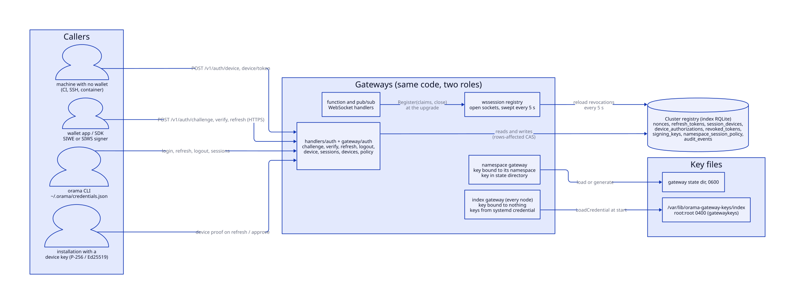
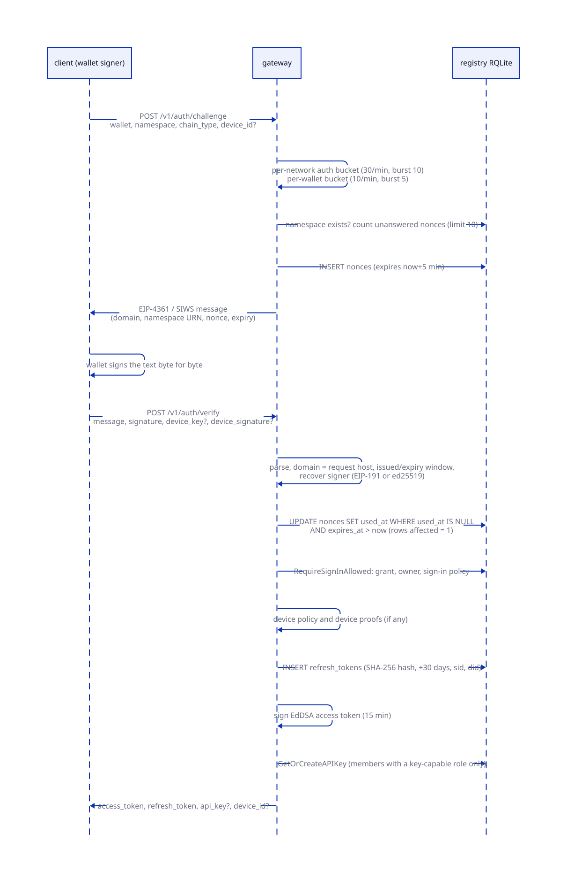
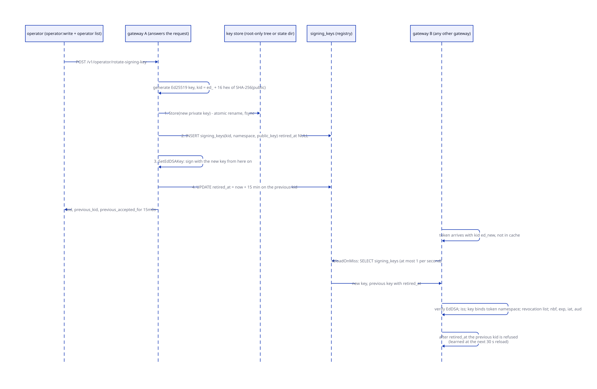
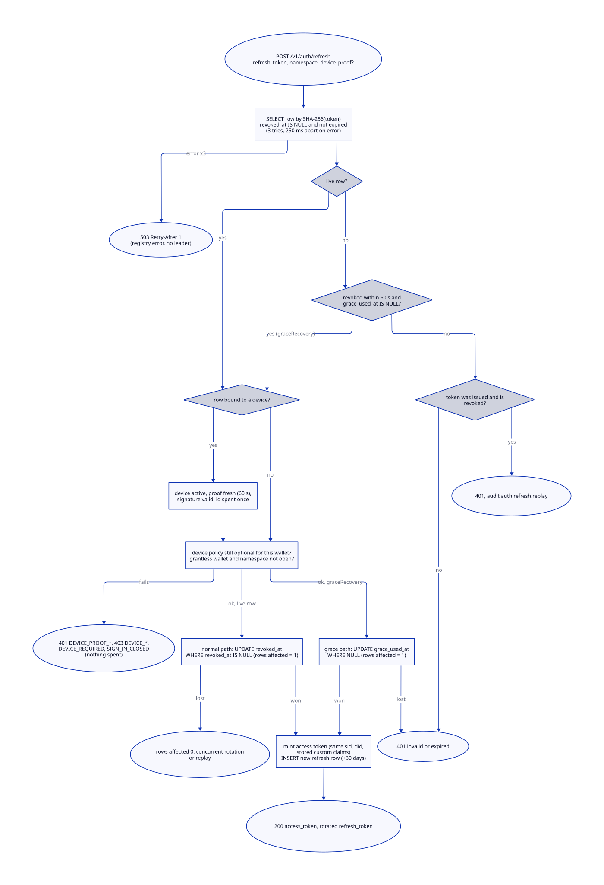
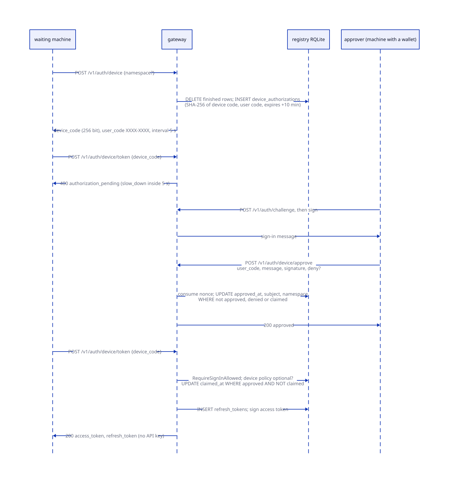
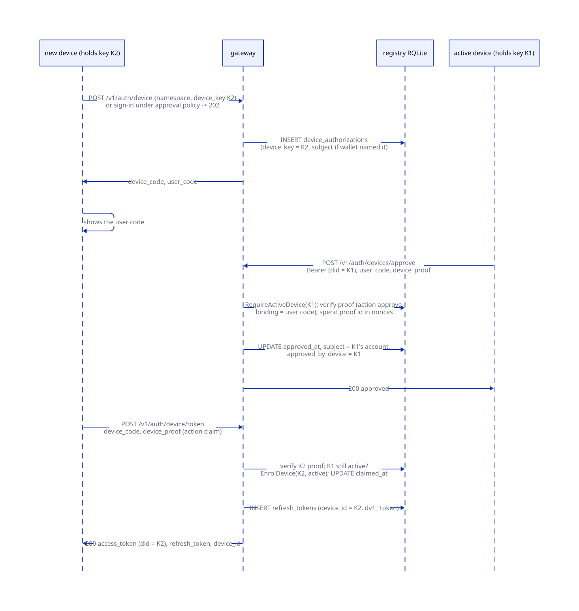
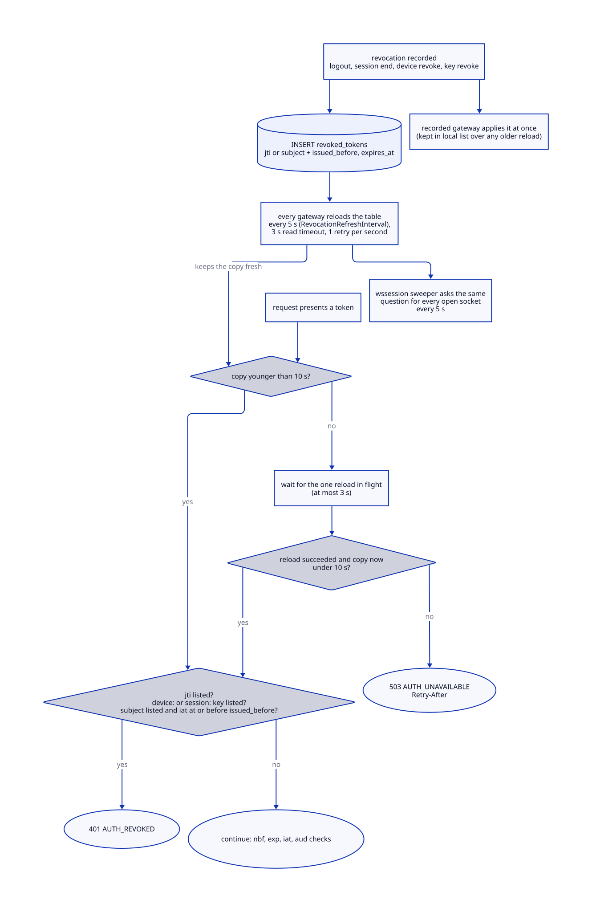
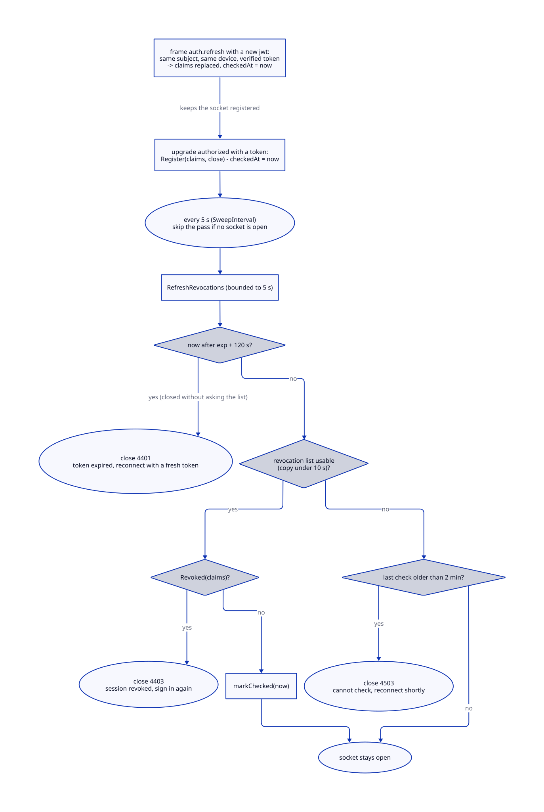
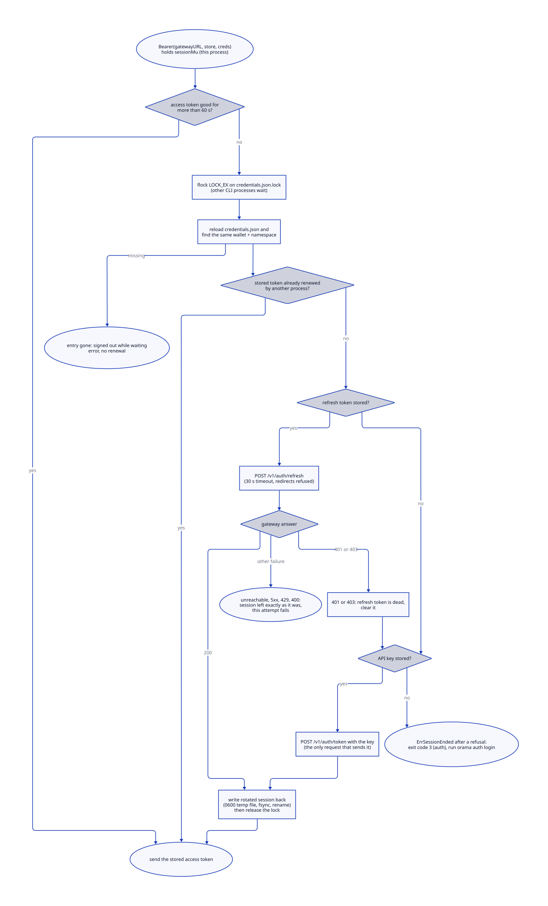

# Identity

> **At a glance.**
>
> - **What:** how a caller becomes a known subject at the gateway, and how that knowledge is withdrawn. A wallet signs an EIP-4361 (EVM) or SIWS (Solana) message the gateway issued; the gateway spends the nonce inside it once and answers with a 15 minute EdDSA access token and a 30 day refresh token that rotates on every use. A session may be bound to a device key (RFC 7638 thumbprint, RFC 8628 login for machines with no wallet). Every token is checked against a revocation list that each gateway reloads every 5 s and that fails closed; open WebSockets are re-checked by a sweeper. Each gateway signs with its own Ed25519 key, published to the cluster registry. The CLI keeps its session in a file-locked store.
> - **Key numbers:** challenge good for 5 min, at most 10 unanswered per wallet and namespace; access token 15 min, verified with 60 s of skew; refresh token 30 days, 60 s single-use reuse grace after rotation; device proof valid for 60 s and spent once; pending device login 10 min, polled no faster than every 5 s; revocation staleness bound 10 s (reload every 5 s); signing keys re-read every 30 s and on an unknown `kid` at most once a second; unused index key retired after 24 h; WebSocket close codes 4401, 4403, 4503.
> - **Code:** `core/pkg/gateway/auth/` (service, challenge, nonce, jwt, signing keys, revocation, sessions, devices, policies), `core/pkg/gateway/auth/siw/`, `core/pkg/gateway/handlers/auth/`, `core/pkg/gateway/wssession/`, `core/pkg/gatewaykeys/`, and the client half of `core/pkg/auth/`.
> - **Depends on:** [cluster state](07-cluster-state.md) for the registry RQLite every identity row lives in, [privilege and filesystem trust](05-privilege-and-filesystem-trust.md) for the root-only key tree, and [gateway architecture](12-gateway-architecture.md) for the middleware that calls into this chapter. What a verified subject may do is [authorization](14-authorization.md); how nodes trust each other is [inter-node trust](15-inter-node-trust.md).



## Why it exists

A gateway that serves many tenants has to answer one question on every request: who is this, and has anything happened since we last said yes? Three constraints shape the answer.

First, the people who matter hold keys, not passwords. A wallet is the only identity a person brings; there is no sign-up, no password, no cookie. A signature is a permanent credential unless something makes it single-use, so the system must turn "this key signed these bytes" into "this key logged in once, to this host, for this namespace, before this deadline". That is the job of the signed message and the nonce table.

Second, a token that verifies on its signature alone cannot be taken back. The gateway answers requests on many nodes from memory, with no database read per request, yet a revoked session has to stop everywhere within seconds. The compromise is a short-lived token plus a small replicated list that every gateway keeps in memory and refuses to answer from once it is older than a bound. Sockets, which are authorized once and then stay open, need a second mechanism.

Third, the signing key is itself a target. The first design derived one Ed25519 key from the cluster secret and every gateway used it, so any node, or any compromised namespace gateway, could mint a token for any tenant, and there was nothing to rotate to. Now each gateway holds a key of its own, tenant keys are bound to their namespace, and the index gateway's keys live in a root-only tree its tenants cannot read.

Every table in this chapter is a cluster-registry table, out of reach of tenant SQL (`core/pkg/rqlite/schema_placement.go`, `core/pkg/sqlguard/sqlguard.go`; see [one schema, two placements](07-cluster-state.md#one-schema-two-placements)).

## The model

### Vocabulary

**Wallet and subject.** The identity is a wallet address. The JWT `sub` is its stored form: an EVM address is lower-cased, because its case carries only the EIP-55 checksum; a Solana address is base58 and kept as signed (`core/pkg/gateway/auth/service.go:NormalizeWallet`).

**Namespace and the lobby.** A sign-in names one namespace. `default` is the lobby (`core/pkg/gateway/auth/ownership.go:LobbyNamespace`): it belongs to nobody, needs no grant, issues no API key, binds no device, and a session there reaches only the routes that need no permission, chiefly `POST /v1/namespaces`.

**Challenge and nonce.** The challenge is the text the wallet signs. Its nonce is 256 random bits as 64 hex characters, recorded in `nonces` and spent by one conditional `UPDATE`.

**Access token.** A JWT with `alg` `EdDSA`, a `kid`, and claims `iss` (`orama-gateway`), `sub`, `aud` (`gateway`), `iat`, `nbf`, `exp`, `jti`, `namespace`, optional `did`, `sid` and `custom`. It lives 15 minutes (`core/pkg/gateway/auth/jwt.go:AccessTokenLifetime`).

**Refresh token and session.** A refresh token is 32 random bytes in base64url, stored as a SHA-256 hash, valid 30 days, replaced on every use. A **session** is the chain of rows one sign-in starts; its id (`sid`, 128 random bits) is minted at sign-in and survives every rotation, so ending the session refuses every access token it minted.

**Device and device proof.** A device is a key pair one installation holds, P-256 or Ed25519; its id (`did`) is the RFC 7638 thumbprint of the public key. It is `pending`, `active` or `revoked`, and a revoked row is a permanent tombstone. A proof is a short signed statement that the device is performing one action on one credential now.

**Pending login.** A row in `device_authorizations`: an RFC 8628 login waiting for approval, or a device link waiting for one of the account's devices.

**Signing key.** An Ed25519 key a gateway signs with, with a `kid` derived from its public key, an optional namespace it is bound to, and a `retired_at`. The set of published keys is `signing_keys`.

**Revocation list.** The in-memory copy of `revoked_tokens`: entries for one `jti`, for every token issued to a subject before an instant, for a device (`device:` prefix) or a session (`session:` prefix).

**Session policy and sign-in policy.** Two per-namespace columns of `namespace_session_policy`. The device policy (`optional`, `required`, `approval`) says what a sign-in that binds no device may get; the sign-in policy (`members`, `open`) says whether a wallet holding no grant may sign in.

### Where the code lives

| Package | Owns |
|---|---|
| `core/pkg/gateway/auth/siw/` | The message grammar: render, strict parse, domain and freshness checks. No database, no HTTP. |
| `core/pkg/gateway/auth/` | The auth `Service`: challenge and nonce, signature verification, token minting and verification, refresh rotation, sessions, devices, device authorization, the two policies, signing keys, the revocation list, audit writes. |
| `core/pkg/gateway/handlers/auth/` | The HTTP surface: challenge, verify, refresh, logout, token exchange, device, devices, sessions, policy, whoami, renew, and the error codes. |
| `core/pkg/gateway/wssession/` | The registry of open sockets and the sweeper that closes them. |
| `core/pkg/gatewaykeys/` | The root-only tree that holds the index gateway's two key files. |
| `core/pkg/auth/` | Two halves. The client half is this chapter: credential store, session renewal, RootWallet login, device login, gateway error classification. The node half (coordination MACs, node keys, node API stamps, the hop helpers) belongs to [inter-node trust](15-inter-node-trust.md) and is not repeated here. |

Three things in this chapter's directories are owned elsewhere. Grants, roles, scoped API keys, workload tokens and `audit_events` reading are in `core/pkg/gateway/auth/grants.go`, `permission.go`, `scoped_keys.go`, `keyformat.go`, `workload.go` and the audit handler, and are explained in [authorization](14-authorization.md). The middleware that extracts a token from a request and calls `ParseAndVerifyJWT` is in [gateway architecture](12-gateway-architecture.md#the-middleware-stack), and the table of refusal codes (the sign-in and device codes included) is in [authorization](14-authorization.md#refusals-and-the-error-code-table). The `X-Internal-Auth-*` headers that carry a verified identity from the index gateway to a namespace gateway are [inter-node trust](15-inter-node-trust.md#the-internal-auth-hop).

### The HTTP surface

The routes this chapter explains, with what the route policy requires of the caller (`core/pkg/gateway/route_policy.go`; the policy table itself is in [gateway architecture](12-gateway-architecture.md)). "Open" means no credential is needed because the request carries its own proof.

| Route | Caller | What it does |
|---|---|---|
| `POST /v1/auth/challenge`, `POST /v1/auth/verify` | open | Issue the signed message; spend it and open a session. |
| `POST /v1/auth/refresh` | open (the refresh token is the credential) | Rotate a refresh token. |
| `POST /v1/auth/logout` | open (`all` needs a JWT) | Burn a refresh token, or every session of the subject. |
| `POST /v1/auth/api-key` | open (a signed message) | Mint a wallet's API key without opening a session; refused `DEVICE_REQUIRED` under `required` and `approval`. |
| `POST /v1/auth/device`, `/device/approve`, `/device/token` | open | RFC 8628 login and device link. |
| `GET /v1/auth/jwks`, `GET /.well-known/jwks.json` | open | The published verification keys. |
| `POST /v1/auth/token`, `GET /v1/auth/whoami` | any credential | Exchange an API key for a 15 minute JWT whose `sub` is the key's hash and whose `custom.scopes` is the key's grant set ([authorization](14-authorization.md)); say who the credential is. |
| `GET /v1/auth/sessions`, `DELETE /v1/auth/sessions/{id}` | JWT of a wallet | List and end the wallet's own sessions. |
| `GET /v1/auth/devices`, `DELETE /v1/auth/devices/{id}`, `POST /v1/auth/devices/approve` | JWT of a wallet | List, revoke and approve devices. |
| `POST /v1/auth/renew` | a workload token | Renew a workload token; not a user session ([authorization](14-authorization.md)). |
| `GET`, `PUT /v1/namespace/session-policy` | `namespace:write` | Read and set the two policies. |
| `GET /v1/namespace/devices`, `DELETE /v1/namespace/devices/{id}` | `members:write` | List and revoke any account's devices. |
| `POST /v1/operator/rotate-signing-key` | `operator:write` and the operator list | Rotate the answering gateway's key. |

Nine of these routes mint or exchange credentials and share one per-network rate bucket: challenge, verify, api-key, token, refresh, device, device/approve, device/token and devices/approve (described under [issuing a challenge](#issuing-a-challenge)).

## How it works

### Wallet sign-in



#### The signed message

The gateway never asks a wallet to sign a bare nonce: a signature over opaque bytes would make any signature the wallet ever produced a login. The message is EIP-4361, or its Solana counterpart, which is the same grammar with one word changed in the header line (`core/pkg/gateway/auth/siw/siw.go`):

```text
gateway.example.net wants you to sign in with your Ethereum account:
0x52908400098527886E0F7030069857D2E4169EE7

Sign in to the anchat namespace on Orama.

URI: https://gateway.example.net
Version: 1
Chain ID: 1
Nonce: 3c1f0b9a7d5e2468b0c4a1f39e8d7c6b5a49382716f0e1d2c3b4a5968778695a
Issued At: 2026-10-09T10:00:00Z
Expiration Time: 2026-10-09T10:05:00Z
Resources:
- urn:orama:namespace:anchat
- urn:orama:device:Zk5xw0m3Qm5gJmXk0tTg5l7N0m1b0cX2y9a8d7e6f5g
```

The **domain** is the host the client connected to, so a signature collected by another site fails here (`siw.Message.CheckDomain`). The **namespace URN** is in the signed bytes, and the gateway reads the namespace from the message, never from the request body beside it (`core/pkg/gateway/auth/challenge.go:NamespaceOf`); zero or two namespace resources are refused. The optional **device URN** names the device a sign-in binds (`DeviceOf`; two are refused). The **timestamps** make the message state its own five minute deadline (`ChallengeTTL`).

`siw.Parse` is strict. Labelled lines must come in a fixed order, a statement with a line break is refused (it could forge the fields below), the domain must be a bare host, an Ethereum address must be EIP-55 checksummed, a Solana address base58 of 32 to 44 characters, the nonce at least 8 alphanumerics (Orama issues 64 hex). The chain is read from the header (`Ethereum` or `Solana`), so a caller cannot pick the cheaper verification. The mandatory Chain ID is meaningless for an off-chain sign-in; Orama writes `1` for EVM and `mainnet` for Solana.

"The domain" depends on the gateway. The index gateway names the `Host` header without its port; Caddy passes `Host` through and sets `X-Forwarded-Proto` itself, so the header is the public name (`core/pkg/gateway/handlers/auth/origin.go:requestOrigin`). A namespace gateway is reached over WireGuard with `Host` rewritten to an overlay address, so it names the fixed public host `ns-<namespace>.<base domain>` from its own configuration (`SetPublicHost`) and signs in to its own namespace only (`signsInTo`): a challenge for another namespace is `403`, a verify is `AUTH_DOMAIN_MISMATCH`.

#### Issuing a challenge

`POST /v1/auth/challenge` is open. A gateway-wide bucket for credential endpoints applies first: 30 requests a minute, burst 10, per client network (an IPv6 client is its /64), shared by challenge, verify, API-key, token, refresh and the device endpoints (`core/pkg/gateway/rate_limit_key.go:isAuthRateLimitPath`; chapter 27, rate limits and egress controls). Then the handler:

1. Reads at most 64 KiB; requires a wallet of at most 128 bytes; on a namespace gateway refuses another namespace with `403`; parses the chain (`ETH` or `SOL`, empty meaning ETH); resolves the origin.
2. Applies a per-wallet bucket of 10 a minute, burst 5, whoever asks (`core/pkg/gateway/handlers/auth/wallet_rate_limit.go`). The wallet in the body is not the caller's to prove and each challenge writes a replicated row, so limiting the address alone caps one client, not a distributed grind against one victim. In memory per gateway, idle buckets dropped after 30 min; refusal is `429`, `Retry-After: 60`.
3. A `device_id` that is not a key thumbprint is refused. `CreateChallenge` canonicalises the address, draws 32 random bytes as the nonce, stamps `Issued At` to the second, renders and validates the message, and writes the row last, so a challenge that cannot be rendered leaves nothing behind.
4. `insertNonce` resolves the namespace without creating it (`404 NAMESPACE_UNKNOWN`; a challenge used to create the namespace, so anyone could squat a name), counts the wallet's unexpired unanswered challenges and refuses at 10 (`nonce_limits.go:maxOutstandingNonces`, `429 TOO_MANY_CHALLENGES`, `Retry-After: 300`), then inserts the normalised wallet, nonce, free-text `purpose` and an `expires_at` of now plus 300 s computed by the database.

The message's expiry and the row's `expires_at` are the same five minutes, checked independently: the message against the gateway's clock, the row against the database's.

#### Verifying and spending the nonce

`POST /v1/auth/verify` carries the message verbatim and the signature. The shared first stage is `handlers/auth/signin.go:signIn`:

1. `VerifySignedMessage`: parse; domain equals the request host; freshness (`Issued At` at most 30 s ahead, `Not Before` likewise, `Expiration Time` not passed, no tolerance at the expiry); signature. Ethereum is EIP-191 `personal_sign`: a 65-byte hex signature (`0x` optional, `v` of 27 or 28 normalised), the public key recovered and its address compared case-insensitively with the message's. Solana is 64 raw ed25519 bytes in base64 over the raw message, checked against the base58-decoded address, which must be 32 bytes (`service.go:verifyEthSignature`, `verifySolSignature`).
2. `NamespaceOf` and `signsInTo`.
3. `ConsumeNonce` (`core/pkg/gateway/auth/nonce.go`), which makes the signature a single login:

```sql
UPDATE nonces SET used_at = datetime('now')
 WHERE namespace_id = ? AND wallet = ? AND nonce = ?
   AND used_at IS NULL AND expires_at > datetime('now')
```

The affected-row count is the lock: two concurrent requests with one nonce race on the `UPDATE` and one sees 1. A row without an expiry fails the comparison and is unusable. Without the low-level rqlite client, which exposes the count, the service refuses (`ErrNonceConsumeNotConfigured`) rather than degrade to a non-atomic update. A registry error is `ErrNonceTransient`, answered `503`, not a bad signature. Unknown, spent and expired nonces share one code, `AUTH_CHALLENGE_INVALID`, so the endpoint is no oracle for which wallets hold challenges. The unique index on namespace, wallet and nonce binds a nonce to its wallet and namespace.

The nonce is spent before the sign-in gate, so a wallet the namespace refuses has burned its challenge. A reaper deletes rows expired or used more than an hour ago, every 10 minutes (`nonce_limits.go:StartNonceReaper`).

#### The sign-in gate

`RequireSignInAllowed` (`core/pkg/gateway/auth/ownership.go`) decides whether the wallet may hold a session in the namespace:

| Case | Result |
|---|---|
| The lobby | allowed; no grant, no key |
| A live grant (not revoked, not expired, principal not disabled) | allowed |
| No grant, namespace has no owner | `NAMESPACE_UNOWNED` (403): nobody may sign in to it |
| No grant, owner exists, sign-in policy `open` (read fresh, not from the cache) | allowed as an **end user**: grantless, no key, writes nothing |
| No grant, owner exists, sign-in policy `members` | `NAMESPACE_NOT_OWNED` (403) |

Signing in never writes ownership. It used to claim: the first wallet to reach a namespace with no owner became its owner, so `default` belonged to whichever wallet signed in first on each cluster. Only creating a namespace writes an owner grant. The gate runs in the handler before anything is issued, and again inside `IssueDeviceTokens`, which every path that hands out a session passes through (device-link claims and RFC 8628 claims included), so a namespace that closed sign-in between the two refuses the session.

#### What a sign-in returns

After the gate the handler resolves the device binding (below), `IssueDeviceTokens` mints the session, and `signInKey` decides whether an API key rides along. The body holds `access_token`, `token_type`, `expires_in`, `refresh_token`, `subject`, `namespace`, `nonce`, `signature_verified`, and conditionally `api_key` and `device_id`.

No key is returned in the lobby, for a device-bound sign-in (the device is the credential; a key for the whole account would outlive revoking it), or for a wallet whose role holds nothing a key can carry: a `reader`, a `developer`, a grantless end user (`ErrNoKeyForRole` is swallowed and the session stands alone). Every other sign-in mints a new API key row, 90 days (`core/pkg/gateway/auth/scoped_keys.go:KeyLifetime`), without revoking the wallet's previous key, which is probably deployed; an owner or admin gets a control-plane (`sk`) key and a runtime member a data-plane (`rk`) one ([authorization](14-authorization.md)). A second device under the `approval` policy gets `202` with `status: pending_approval` and codes for the device-link flow instead of a session.

### Access tokens

#### Minting

`GenerateBoundJWT` (`core/pkg/gateway/auth/jwt.go`) builds the claims above with a 128-bit random `jti` and signs with the gateway's Ed25519 key; it falls back to RSA only when no Ed25519 key was set, which cannot happen in a running gateway. `did`, `sid` and `jti` are gateway-controlled: the custom map has those names removed however it arrived.

**Custom claims.** A namespace can deploy a function named `auth-claims-provider` to add claims, such as a stable account id, to its users' tokens. The gateway invokes it once, at sign-in, with the wallet and namespace (`core/pkg/gateway/claims_provider.go`). It is fail-open by contract: a missing, slow, erroring or malformed provider yields no claims and never breaks authentication. The call has a 2 s timeout, is retried up to 3 attempts with a 150 ms pause only on a cold WASM fetch timeout, and the output is sanitised (`sanitizeProviderClaims`): a reply over 4096 bytes is discarded whole; otherwise it must be a JSON object, non-string values are dropped, and at most 16 claims and 4096 bytes of keys and values together are kept, taken in sorted key order so truncation is deterministic, with `sub`, `iss`, `aud`, `iat`, `nbf`, `exp`, `namespace`, `custom`, `scopes`, `jti`, `did`, `sid` dropped. `scopes` is the authoritative grant set of the API-key exchange, and a tenant must not be able to put it in an end user's token.

The claims are stored with the refresh row and replayed on every rotation, so a refresh never calls the provider. Two repairs cover a provider that failed at the wrong moment: if it returns nothing at sign-in but the wallet previously held claims in a live refresh row, those are reused so the wallet's devices do not fragment across two identities (`service.go:reuseLastKnownClaims`); if a session's stored claims are empty and a provider exists, the next refresh re-resolves them. The cost is that a provider cannot take a claim away from a wallet that ever had it until that wallet's live rows end.

#### Verifying

`ParseAndVerifyJWT` runs these checks in order:

1. Three dot-separated parts, each base64url (unpadded); the header's `alg` must be `RS256` or `EdDSA`.
2. The key is selected by `kid` and the algorithm is then cross-checked against the key, never the other way round. A `kid` in the Ed25519 set must come with `EdDSA`; a `kid` equal to the gateway's own RSA key id must come with `RS256`. A token with no `kid`, or one naming a key this gateway does not have, is `unknown key ID`. There used to be a branch that verified a token with no `kid` against the RSA key.
3. `iss` is `orama-gateway`.
4. The key's namespace binding admits the token's `namespace` claim (`SigningKey.Binds`, case-insensitive). A namespace gateway's key signing a claim for another tenant is refused here, on every gateway, including the one that signed it.
5. The revocation list (below). An unreadable list is `ErrRevocationsUnavailable`.
6. `nbf` not more than 60 s ahead, `exp` not more than 60 s past (so a token is accepted for up to 15 minutes and 60 seconds), `iat` not more than 60 s ahead, `aud` equal to `gateway`.

Because the revocation check precedes the time checks, an expired token presented while the revocation list cannot be read is answered `503`, not `401`. Verification costs one Ed25519 verification and a few map lookups; no request touches the database unless a cache has gone stale.

### Signing keys

#### One key per gateway

Every gateway process holds its own Ed25519 key. Its `kid` is `ed_` plus the first 16 hex characters of the SHA-256 of the public key, so two gateways cannot collide and nobody chooses one (`core/pkg/gateway/auth/signing_keys.go:KeyIDFor`).

Where the private half lives depends on the role:

- **The index gateway** (one per node) reads two PEM files from the credentials directory systemd hands the unit, `jwt-signing-key.pem` (RSA-2048, PKCS#1) and `jwt-eddsa-key.pem` (Ed25519, PKCS#8). They are `root:root` `0400` in `/var/lib/orama-gateway-keys/index`, loaded by `LoadCredential=` into that unit alone; the tenant gateways run as the same `orama` user and cannot open the tree ([gateway signing keys](05-privilege-and-filesystem-trust.md#gateway-signing-keys)). `orama node install` and `upgrade` call `gatewaykeys.Ensure`, which never replaces a key that exists (that would invalidate every token it signed), carries forward a copy an older release left in the state directory, and otherwise generates one (`core/pkg/gatewaykeys/keys.go:Ensure`). The tree accepts only those two names, refuses a PEM over 16 KiB, a PKCS#1 RSA key under 2048 bits or an Ed25519 file that is not PKCS#8, and syncs the directory after the rename (`Write`, `MaxPEM`). A missing credential is a broken install, not a first boot: the gateway refuses to start rather than generate a key that would change on every restart, and it deletes any stale copy from the state directory, which a tenant gateway could read (`core/pkg/gateway/signing_key.go:sealedKey`).
- **A namespace gateway** keeps `jwt-eddsa-key.pem` and `jwt-signing-key.pem` in its own state directory, mode 0600, generated on first boot. A key file that cannot be parsed stops the gateway, the RSA file as well as the Ed25519 one: a silent replacement would invalidate every token it issued and overwrite the only copy of a key that might be recoverable (`signing_key.go:loadOrCreateEdSigningKey`). Writes go through a synced temporary file and a rename, so a crash leaves the old key or the new one (`core/pkg/gateway/auth/signing_keys.go:PersistSigningKey`).

#### Binding to a namespace

The index gateway's key is bound to nothing (`signing_keys.namespace` is `NULL`): the index gateway is the control plane, and `orama auth login --namespace X` against it signs for `X`. A namespace gateway's key is bound to its namespace. A token signed with a bound key is accepted only if its `namespace` claim matches, which is what stops a compromised tenant gateway minting for another tenant. The binding is enforced by the verifier, so it holds even if the signer lies.

#### Publishing and reading

A gateway publishes its public key to the cluster registry, not to a tenant database it may also hold, in a post-schema step that gates readiness: until the key is published the gateway mints nothing (`core/pkg/gateway/post_schema.go`). Publishing is an upsert that clears `retired_at` and stamps `last_seen_at`, so a restart is cheap and revives a key a peer retired.

Every gateway caches everything published (`signing_keys.go:SigningKeys`):

- **Reload every 30 s** (`signingKeyReloadInterval`), in the background, one read at a time, at least 1 s apart. A verification is answered from the cache while a reload runs, unless the cache is older than 60 s or never loaded; then it waits, bounded by a 3 s read timeout. The read runs in a goroutine abandoned at the deadline, because the registry client does not honour its context; at most one abandoned read exists.
- **A failed read keeps what is known** and does not make the set fresh. Forgetting every key because one query failed would refuse every token in the cluster; during a registry outage the revocation list, which refuses at 10 s, is what stops verification.
- **An unknown `ed_` key forces a reload**, at most once a second and serialised. A namespace gateway publishes moments before its first token is presented anywhere, and waiting for the periodic reload refused those tokens on every gateway that had loaded earlier. A `kid` without the prefix, or a key that is present but retired, never triggers one.
- **Local keys survive a reload** even when unpublished: the gateway's own and the legacy one below.

`GET /v1/auth/jwks` (and `/.well-known/jwks.json`, a duplicate) serves the RSA key and every live Ed25519 key as an `OKP` JWK with an extra `namespace` member, so a client verifying locally can refuse a token whose claim disagrees. Both routes are open.

#### The RSA key and the cluster-derived key

Two earlier keys remain. The **RSA key** is loaded by every gateway (2048 bits minimum, enforced in `NewService`), appears in the JWKS, and would verify an RS256 token with its `kid`. Nothing signs with it once the Ed25519 key is set and it never rotates, yet `IssueDeviceTokens` refuses with "signing key unavailable" when it is nil.

The **cluster-derived key** is the Ed25519 key HKDF-derived from the cluster secret (label `orama-jwt-eddsa-v1`) that 0.122.x nodes used. A key file equal to it is replaced on load. Tokens minted before the upgrade must keep working across it, so the derived public key is added as verify-only until a deadline of first-arming time plus one access-token lifetime, written once to `legacy-signing-key-retired-at` in the state directory and read back on every later boot (`core/pkg/gateway/legacy_signing_key.go:armLegacyClusterKey`). Measuring the window from each boot re-armed a key every node can compute for as long as a gateway restarted at least once per token lifetime. A gateway that never held the derived key records it retired at once.

#### Key rotation



`orama operator rotate-signing-key` calls `POST /v1/operator/rotate-signing-key`, which needs `operator:write` and a wallet on the operator list (`core/pkg/gateway/signing_key_routes.go`). `Service.Rotate` orders its steps so a failure leaves a consistent state:

1. **Store** the new key where the next boot reads: the state directory for a tenant gateway; for the index gateway the root-only tree, through the helper's `gateway-key put` (`core/pkg/privhelper/gateway_key.go:PutGatewayKey`). The index gateway never writes its state directory: a tenant gateway can read it, and the next boot loads the credential, so the rotation would be undone.
2. **Publish** the public key before anything is signed with it. If publishing fails the previous key is written back, so disk always matches what the gateway signs with.
3. **Switch** signing to the new key.
4. **Retire** the previous key at now plus 15 minutes. Both are accepted for one access-token lifetime; nobody is signed out; other gateways learn the retirement time at their next 30 s reload.

Rotation is local to the gateway that answers. Every node runs an index gateway with its own unbound key, the CLI sends one request to whichever gateway the URL reaches, and there is no flag to name a node.

#### Upkeep

After readiness an index gateway retires every unbound key other than its own that nobody has stamped for 24 hours (`unusedKeyRetention`, longer than any token those keys could have signed), retrying that step until it succeeds; only then does it start the heartbeat that stamps its own key's `last_seen_at` every 10 minutes (`signing_keys_upkeep.go:signingKeyHeartbeatInterval`, `core/pkg/gateway/post_schema.go:afterReadySteps`). Older releases published a new unbound key on every restart and never retired it, and each such key would verify a token for any namespace if its private half turned up. A live peer's key is never in that state, and a restarted peer's key comes back through the upsert. Namespace-bound keys are not retired by this sweep: they belong to a tenant's gateway, which the index gateway cannot vouch for.

### Refresh tokens and sessions



#### Storage and minting

A refresh token is `mintRefreshToken`: 32 random bytes in unpadded base64url. The database holds `SHA-256(token)`, the namespace, the subject, `audience` `gateway`, `expires_at` of now plus 30 days, the stored custom claims, the device id (`NULL` for the account alone) and the session id (`core/pkg/gateway/auth/session_refresh.go:insertRefreshTokenSQL`). A device-bound refresh token carries the prefix `dv1_` and is hashed under a domain string of its own (`orama-device-bound-refresh-v1:`). A gateway that predates devices hashes a presented token bare, so it can never find a device-bound row, and therefore can never rotate one without the device's proof, which is what it would otherwise do during a rolling upgrade, quietly turning the session into one bound to the account alone.

Each rotation inserts a new row with a fresh 30 days, so a session lasts as long as it is used at least once every 30 days.

#### Refresh rotation

`Service.RefreshToken` (`core/pkg/gateway/auth/service.go`) is the algorithm in the diagram. Its decisions:

- **Transient is not invalid.** The token lookup retries 3 times, 250 ms apart; a namespace-resolution error or a failed write is transient at once. If the registry still errors the answer is `503` with `Retry-After: 1`, never `401`: during a rolling restart the RQLite leader is briefly absent, and a 401 forced a full wallet sign-in on a client that could not perform one (a locked phone answering a VoIP wake).
- **Reuse grace.** With no live row, a token revoked within the last 60 s whose `grace_used_at` is still `NULL` is accepted once more, recovering a client whose rotation response was lost (RFC 9700 section 4.13.2). It is claimed by a compare-and-swap on `grace_used_at`, and an explicit logout, session end, device revoke or revoke-all burns the slot, so a token someone deliberately revoked is never recovered.
- **Replay.** A token that is neither live nor within its grace but exists revoked in this namespace is a spent token presented again: `ErrRefreshTokenReplay`. Losing the revoke compare-and-swap (below) to a concurrent rotation of the same live token gives the same error, so two clients racing with one token look like a thief. Either way the answer is a `401`, a log warning and an `auth.refresh.replay` audit row. A token nobody issued, or one that merely expired, is the same `401`, recorded as an ordinary failed `auth.refresh`.
- **Checks before anything is spent.** Device and policy checks run after the lookup and before either compare-and-swap: a device-bound session needs its device still `active` and a valid proof, an account-level session in a namespace that now requires devices is `DEVICE_REQUIRED`, and a grantless wallet in a namespace that is not open is `SIGN_IN_CLOSED`. A caller who cannot show the device cannot burn the rotation or the grace of the client that can.
- **The compare-and-swap** is `UPDATE refresh_tokens SET revoked_at = now WHERE token = ? AND revoked_at IS NULL`; zero rows means a concurrent rotation or a replay. On the grace path the grace claim is the lock.
- **The new pair** keeps the session's `sid`, `did` and stored claims; a new row is inserted under the same `sid`. A crash between the revoke and the insert leaves a revoked token and no successor, which degrades to a sign-in and never to a double use. A session issued before sessions carried an id gets one at its first refresh.

Refresh-time policy reads come from a 5 s cache (`devicePolicyStaleness`, equal to the revocation refresh interval); paths that issue a credential read the policy fresh.

#### Listing, ending and logging out

`GET /v1/auth/sessions` lists the calling wallet's live refresh rows in the caller's namespace: row id, subject, audience, timestamps, device id. It never returns a token (a list that did would turn a 15 minute access token into a 30 day one) and needs a JWT, because an API key does not name a wallet.

`DELETE /v1/auth/sessions/{id}` ends one session; the subject is in the `WHERE` clause, so the ownership check cannot be skipped by a refactor. It revokes every row carrying the `sid`, grace slots included (spending a grace would mint a new row under the same session), then puts `session:<sid>` on the revocation list for one hour, so the access tokens already minted and the sockets they hold stop within the list's bound. A session that predates session ids can only have its row ended, and the response warns that access tokens already minted work for up to 15 minutes. A device-bound caller needs a proof for `end-session` over the row id.

`POST /v1/auth/logout` is open, so a refresh-token holder can end its own session. With `refresh_token` it burns that token, grace slot included, and revokes the presented access token by `jti` when there is one. With `all` it needs a JWT: it revokes every live refresh row of the subject in every namespace and puts the subject on the list, under its raw name and its API-key hash, for one hour. It does not revoke a single session's other access tokens by `sid` (known gaps).

### Devices

#### Keys and ids

A device key is a public JWK (`core/pkg/gateway/auth/devicekey.go:ParseDeviceKey`) of at most 1024 bytes: `EC` / `P-256` with 32-byte `x` and `y`, or `OKP` / `Ed25519` with a 32-byte `x`, in strict unpadded base64url. A JWK carrying `d` is refused, since a client that sent its private key has leaked it. A P-256 point is parsed with `ecdsa.ParseUncompressedPublicKey`, which refuses an off-curve point. An Ed25519 key of small order is refused against libsodium's seven-encoding blocklist, because the identity point verifies a forged signature for every message. The stored form is the canonical JWK with exactly the members the thumbprint covers, and the device id is `base64url(SHA-256(canonical))`, 43 characters (RFC 7638), so a client names only a device whose key it presents. Ed25519 signatures are 64 bytes; ES256 is accepted as the 64-byte `r‖s` of JOSE (WebCrypto, CryptoKit) and as ASN.1 DER (Android Keystore, SecKey). A device label is stripped of control and format characters (bidirectional overrides, zero-width joiners) and cut to 64 characters.

#### Enrolment and states

`EnrolDevice` (`session_devices.go`) inserts with `ON CONFLICT(id) DO NOTHING` and reads the affected-row count to tell a new device from an existing one, because a read-back through the local node can miss a write the leader acknowledged but this follower has not applied. An existing device keeps its state, except that a `pending` one asked to be `active` is activated by a compare-and-swap on `state = 'pending'`. It is refused for another account (`DEVICE_KEY_TAKEN`: the primary key is the thumbprint alone, so a key belongs to one account in one namespace) and for a revoked device (`DEVICE_REVOKED`, permanently).

#### Signing in with a device

The challenge request carries `device_id`; the message then names `urn:orama:device:<id>`. The verify request adds `device_key` and `device_signature`, the device's signature over the same message bytes. `provenDeviceKey` requires both or neither, the key's thumbprint to equal the id the signed message names, and the signature to verify. The wallet's signature says which device it lets in; the device's says the key is really there; neither alone binds anything. One spent nonce covers both. The lobby binds no device.

The namespace's device policy then decides the device's state (see the policies below). With `approval` and an account that already has an active device, the new device is enrolled `pending` and the sign-in answers `202` with codes for the device-link flow.

#### Device proofs

After sign-in, a device-bound session proves it still holds the key with a statement (`core/pkg/gateway/auth/device_proof.go:DeviceProofMessage`), signed over these lines joined by newlines:

```text
orama-device-proof-v1
<action>
<namespace>
<binding>
<iat>
<id>
```

The action is `refresh`, `approve`, `claim`, `revoke` or `end-session`; the binding is the credential the proof travels with (the refresh token, the user code, the device code, the device id being revoked, the session row id), so a proof cannot be moved onto another credential. `VerifyDeviceProof` checks, in this order: the proof exists; its `id` matches `[A-Za-z0-9_-]` with 16 to 128 characters; `iat` is within 60 s of the gateway's clock; the signature verifies; and only then is the id spent. The id is inserted into the `nonces` table under the wallet name `device:<device id>` with purpose `device-proof:<action>`, an expiry of 120 s, and an `ON CONFLICT DO NOTHING` whose affected-row count decides who spent it. Signature before spend means a stranger cannot burn a device's ids by presenting garbage. It is DPoP's shape without DPoP's HTTP-method binding, since each action has exactly one endpoint.

#### Revoking a device

`RevokeDevice` (`device_revoke.go`) is repeatable, so a half-finished revocation is completed by trying again. It tombstones the row (never deleted, so the key can never enrol again, by the device or by anyone who copied its public key); revokes every refresh row of the device, grace slots included; and puts `device:<id>` on the list for 7 days, which refuses every access token bound to it, every socket opened with one and every capability it issued (a capability lives up to seven days; see [authorization](14-authorization.md)). The account's other devices are untouched.

Any session of the account may revoke a device (`GET /v1/auth/devices` lists them, revoked ones included, marking the caller's own), with two conditions on a session bound to a device: that device must itself still be `active`, and it must show its proof for `revoke`, so an access token lifted off one phone cannot sign the account out of the others. A session bound to no device is the wallet's own and needs none. A namespace operator with the members-write permission lists and revokes any account's devices (`/v1/namespace/devices`): under `approval`, an account that lost its only device has nothing left that can approve a new one, and a wallet signature alone cannot, by design. With no active device left, the user's next sign-in enrols its device as the first.

#### The two policies

`namespace_session_policy` has one row per namespace; no row means `optional` and `members`.

| Device policy | A sign-in that binds no device | A new device's first sign-in |
|---|---|---|
| `optional` (default) | session bound to the account | active |
| `required` | refused, `DEVICE_REQUIRED` | active |
| `approval` | refused, `DEVICE_REQUIRED` | active if the account's first, otherwise `pending` |

A wallet whose grant is `owner`, `admin` or `developer` is held to `optional` whatever the namespace says (`DevicePolicyFor`): the people who operate a namespace sign in from the CLI, which holds no device key, and whoever holds such a wallet can change the policy anyway. Under `required` and `approval` no other path hands an end user a device-less credential: `POST /v1/auth/api-key`, approving a plain RFC 8628 login, and refreshing a device-less session all answer `DEVICE_REQUIRED`.

Setting `required` or `approval` also revokes every API key an end user's sign-in minted in the namespace (`session_policy_keys.go`): one recursive statement finds each such wallet's current key and the chain it rotated from, skipping wallets with a live control-plane grant and keys expired longer than an exchanged token lives, and each key is revoked the normal way so its exchanged tokens stop too. If the sweep stops partway the policy stays set and audited, and the answer is `503 POLICY_SWEEP_INCOMPLETE` with the count; repeating the request finishes it.

### Machines with no wallet



A server over SSH, a container and a CI runner have no wallet. The device authorization grant (RFC 8628) splits the login in two (`core/pkg/gateway/auth/device.go`, handlers in `device_handler.go`).

`POST /v1/auth/device` is open. It prunes finished rows and inserts a pending login. The **device code** is 32 random bytes, returned once and stored only as its SHA-256; it is the waiting machine's credential. The **user code** is `XXXX-XXXX` from the 24-character alphabet `BCDFGHJKMNPQRTVWXYZ23467` (no character reads as another), about 1.1e11 codes, stored as written because the approver looks the row up by it. A login lasts 10 minutes.

`POST /v1/auth/device/approve` costs a wallet signature over a fresh gateway challenge, verified by the same `signIn` as `/v1/auth/verify`; refusing costs the same as approving. The approval is a compare-and-swap on `approved_at` that also requires the row to be undenied, unclaimed and keyless, and the namespace the waiting machine asked for to match the approver's. Where the device policy is not `optional`, approving a plain login is refused `DEVICE_REQUIRED`, since its session is bound to no device.

`POST /v1/auth/device/token` is the poll. RFC 8628's outcomes are `400` bodies with an `error` to switch on: `authorization_pending`, `slow_down` (a poll inside 5 s of the last, judged after the terminal states so an approved client is not told to wait), `expired_token`, `access_denied`, `invalid_grant`; `already_approved` is `409`. An approved login first re-runs the sign-in gate and the device policy as the namespace is now, and a failure leaves it collectable. The claim is a compare-and-swap on `claimed_at`, so a device code collects a session exactly once, and the session carries no API key. There is no `verification_uri`: no web page exists, and `orama auth approve <code>` is the client.

#### Linking a device from a device



The same table serves device links, with the waiting device's public key recorded at the start (`device_link.go`). **Seedless linking**: a new device with no wallet starts a login carrying `device_key` and takes its account from whoever approves. **New-device approval**: an `approval`-policy sign-in leaves the device pending and starts the login with the account already named. Either way the approver is an *active device of the account*, proving it holds its key with a proof for `approve` over the user code and presenting its own bearer token (`POST /v1/auth/devices/approve`). A wallet signature cannot approve a link (`ErrDeviceLinkNeedsDevice`) and a device cannot approve a plain login; a named account can be refused by its wallet only. Collecting takes the new device's proof for `claim` over the device code, so the codes alone collect nothing, and the approving device must still be active then: revoking a stolen approver reaches the device it let in. The collected session is bound to the new key.

### Sign-in policy

The sign-in policy decides who may sign in at all. `members` (the default) admits only wallets holding a grant. `open` also admits a wallet that holds none, as an end user: it gets a session and nothing else, and signing in writes no grant, principal or claim on the namespace. An application whose public users each sign in with their own wallet cannot invite them one by one, so the owner opens the namespace (`orama namespace session-policy --sign-in open`, or `PUT /v1/namespace/session-policy`, which needs `namespace:write`). The lobby refuses a policy, and a namespace with no owner stays closed whatever it says.

Closing sign-in refuses every new session at once, because every issuing path reads the policy as recorded now. A session already issued ends at its next refresh, which `checkSignInStillOpen` refuses with `SIGN_IN_CLOSED` for a wallet that holds no grant, whether it never had one or its grant was revoked, expired or disabled, so removing a member from a `members` namespace ends that member's sessions within one access-token lifetime; the policy comes from the 5 s cache, but before ending a session the gateway re-reads it fresh, so a cached `members` read made just before the owner opened sign-in elsewhere cannot end a session entitled to go on. An access token already issued lives out its 15 minutes. A `PUT` may carry `device_policy`, `sign_in` or both, validated before either is written; closing is written first and opening last, so a failure between them leaves the namespace closed, never open under a device policy the request meant to replace.

### Revocation



A JWT verifies on its signature alone, so something must say that a valid-looking token has to stop working. `revoked_tokens` (migration 047) holds a `jti` that names one token, or a `subject` with an `issued_before` instant that denies every token issued to it up to then. The subject column also carries `device:<id>` and `session:<id>`, which no wallet or key can collide with. Each row has an `expires_at`, when the last token it could deny has itself expired; rows past it are deleted hourly.

| Event | Entry | Kept |
|---|---|---|
| Logout of one session | the presented token's `jti` | until its `exp` |
| Logout of every session | subject, under its raw and hashed names | 1 h |
| End one session | `session:<sid>` | 1 h |
| Revoke a device | `device:<id>` | 7 days |
| Revoke an API key | the key's subject ([authorization](14-authorization.md)) | 1 h |

`Denies` matches as follows. A `jti` entry denies that token. A `device:` or `session:` entry denies any token carrying that `did` or `sid`, whenever minted, since neither can mint another after the revocation. A subject entry denies a token whose `iat` is at or before `issued_before`; the boundary is inclusive because `iat` has one-second resolution and a token minted in the same second is what a revoking operator means to catch, at the price that a sign-in in that second must be retried. A token minted after the revocation is a new grant and is not covered. Subjects match lower-cased on both sides.

**The bound.** `RevocationStaleness` is 10 s and the list reloads at half that (5 s), because a copy is as old as the read that filled it began: one interval plus the reload itself. Per request:

- A copy under 10 s answers without waiting; if it is older than 5 s the request also starts a reload when none runs. Only a copy of 10 s or more, or none, waits, for the reload already in flight and for at most the 3 s read timeout. If the copy is still not under 10 s the answer is `ErrRevocationsUnavailable`, `503 AUTH_UNAVAILABLE` with `Retry-After`. Unknown is never "not revoked".
- A failed or hung reload keeps the old list and never ages it. It does not clear it either: forgetting revocations because one query failed would revive every revoked token.
- Attempts are at most one a second; the read runs in a goroutine abandoned at its deadline, with at most one abandoned read alive; a read that finishes late never replaces a newer list (a sequence number decides).
- A revocation this gateway recorded itself applies at once and is re-applied over any reload whose read began before the write committed, so the revoking gateway is never the last to honour it.
- The error text never says why the registry could not be read; the cause is in the log. A `Service` built without a list refuses in the same way.

API keys have no `iat`, so `DeniesSubject` denies on any live entry for the key's name, which closes the one-minute window the key cache would otherwise open.

### Open WebSockets



A WebSocket is authorized once, at the upgrade; without more, a socket opened with a 15 minute token would serve as long as the client kept it. Every function socket (stateless or persistent) and pub/sub subscription opened with a token registers in the gateway's `wssession.Registry` with a copy of the token's claims (`core/pkg/gateway/wssession/registry.go:Register`). A socket opened with an API key or no credential has no claims, registers nothing, and is not re-checked: revoking a key stops it opening sockets, not the ones it has. A socket opened with a capability registers under claims built from the capability (`core/pkg/gateway/capability/capability.go:RevocationClaims`: a `jti` derived from its namespace and id, its issuing device as `did`, its expiry as `exp`), so revoking the capability or its device closes it; it holds no account, so it cannot take an `auth.refresh`.

A sweeper runs every 5 s (`SweepInterval`, the revocation refresh interval). On a gateway with at least one registered socket it reloads the list and judges each socket:

| Close code | Cause |
|---|---|
| 4401 | `exp` plus 120 s (`ExpiryGrace`) passed and the token was not refreshed on the socket. Closed without asking the list, so a hung registry never delays it. |
| 4403 | The list denies the socket's claims (jti, subject, session or device). |
| 4503 | The list could not vouch for the socket for 2 minutes (`maxUncheckedSocketAge`). |

The 120 s covers clock skew and a client refreshing its token on the socket. Once per pass the sweeper asks whether the list is usable, from the copy it holds; if not, no socket is judged that pass and each is held only until its last successful check is two minutes old. That is about twelve times the request bound: long enough that a blip which heals by itself does not make every client reconnect at once, short enough that a session revoked during an outage cannot stay open as long as the outage. Closes run 64 at a time, each with a 1 s close-frame timeout.

A persistent function socket may send an `auth.refresh` control frame with a new JWT (`handlers/serverless/ws_persistent_handler.go:handleAuthRefresh`). The token is verified like any other, `Socket.CheckRefresh` requires the socket to hold an account with the same `sub` and the same `did`, and `Refresh` replaces the claims and counts as a check. A refresh keeps a socket open; it never hands it to somebody else.

### The command-line client

The client half of `core/pkg/auth/` is how `orama` holds a session.

**Which gateway.** `ResolveGatewayURL` reads `ORAMA_API_URL`, then `ORAMA_GATEWAY_URL`, then `ORAMA_GATEWAY`, then the active entry of `~/.orama/environments.json`. There is no built-in default: a hardcoded fallback once sent a misconfigured shell to devnet, with credentials looked up for a gateway nobody asked for. Credentials are keyed on this URL.

**The store.** `~/.orama/credentials.json` (directory 0700, file 0600) is version `2.0`: per gateway, a list of credentials and a default index. A credential is keyed by wallet and namespace (keying on the wallet alone made a second namespace's login destroy the first's tokens) and holds the access token and its expiry, the refresh token, an API key if one came back, and the namespace gateway URL. A legacy file with one credential per gateway (version `1.0` or `2.0`) is converted on load and written back under the lock. A save writes a 0600 temporary file, syncs and renames it over the old one.

**The lock.** Every change takes an exclusive `flock` on `credentials.json.lock` (`O_NOFOLLOW`; the kernel drops it if the holder dies; non-unix builds refuse). `UpdateEnhancedCredentials` loads the store as it is now, applies a function and saves, so two commands changing different entries both land. The function must not lock again: `flock` is per open file description, so a holder that locks twice waits on itself.

**Renewal.** `Bearer` returns an access token with more than 60 s left, renewing when it must.



A refresh token rotates on use, so two renewals presenting the token they both loaded would make the second look like a replay. The decision is therefore made on what is on disk now: under `sessionMu` (this process) and the file lock (every process) the stored session is read again, a renewal another process already made is used as it is, and a new one is written back before unlocking (`session_sync.go:renewStoredSession`). The lock is held for one refresh at most, bounded by a 30 s HTTP timeout; redirects are refused, since Go forwards `Authorization` to a subdomain or plain http.

Only the gateway refusing the refresh token, `401` or `403`, ends the session. Unreachable, `5xx` (`/v1/auth/refresh` answers `503` while the RQLite leader moves), `429` and `400` leave the stored session untouched. After a refusal the refresh token is cleared; a stored API key (from a credential file an older CLI wrote) is then exchanged at `/v1/auth/token`, the only request that sends it; otherwise the result is `ErrSessionEnded` and exit code 3, the same as a missing login (`cmd/orama/internal/shared/api.go:renewedBearer`). `ORAMA_TOKEN` is the CI credential: a JWT-shaped value (two dots, prefix `ey`) is sent as is, anything else is exchanged once per run (`BearerFromEnv`).

**Login.** With a RootWallet agent on the machine, `PerformRootWalletAuthentication` runs: a 3 s status call to `RW_AGENT_SOCK` (only "nothing listens" means absent; an agent that is present and slow is treated as present, because the opposite once sent a login into a ten minute device-login wait for an approval nobody was asked for); the EVM address from the agent; the namespace from `--namespace` or a prompt, blank meaning the lobby; a challenge with `chain_type` fixed to `ETH`; then `acceptLoginChallenge` before the wallet sees the text (not a build-archive signing request, a valid sign-in message for this gateway's host and this wallet, inside its own lifetime with 2 minutes of skew); the agent signs byte for byte, with a 120 s approval wait plus 30 s of CLI patience; and `POST /v1/auth/verify`. The session is stored; an API key, when one comes back, is stored but presented only to be exchanged and only when there is no session to renew. A `202` carries a poll URL for a namespace cluster still provisioning, polled every 5 s for up to 120 s.

With no agent, `deviceLogin` starts an RFC 8628 login, prints the user code and polls at the interval the gateway named, adding one interval on each `slow_down`; `orama auth approve <code>` approves from a machine with a wallet (`--deny` refuses). `--device-key` belongs to the RootWallet path, not to this one: it takes an Ed25519 private JWK (RFC 8037: `d` is the 32-byte seed, `x` its public key), keeps the private half in the process, asks for a challenge naming the device, and sends the public half and the device's signature with the wallet's; without a reachable agent the command refuses (`cmd/orama/internal/login_device.go:loadLoginDevice`, `core/pkg/auth/rootwallet.go:verifySignature`). `orama auth logout` ends the session on the gateway, presenting the access token so that token is revoked too, then clears the local file even if the gateway was unreachable and says so; `--all` ends every session of the wallet.

**Reading refusals.** `GatewayErrorFrom` accepts both error shapes the gateway uses and maps codes such as `AUTH_REVOKED`, `AUTH_EXPIRED` and `NAMESPACE_MISMATCH` to a sentence that says what to do. The codes are duplicated in the CLI, not imported, because it talks to gateways it was not built alongside: an unknown code falls through to the gateway's own sentence, and a body that is not an error shape becomes an error naming the HTTP status.

## State it owns

| What | Where | Holds | Written by | Read by |
|---|---|---|---|---|
| `nonces` | registry | One row per challenge (wallet, nonce, purpose, `expires_at`, `used_at`), and one per spent device-proof id (wallet `device:` plus the device id, purpose `device-proof:` plus the action). Unique on namespace, wallet, nonce. | `CreateChallenge`, `ConsumeNonce`, `spendDeviceProof` | the same; reaped every 10 min once used or expired for an hour |
| `refresh_tokens` | registry | Hash of each refresh token, subject, `expires_at` (30 d), `revoked_at`, `grace_used_at`, `custom_claims`, `device_id`, `session_id`. One row per rotation. | `IssueDeviceTokens`, `RefreshToken`, `RevokeToken`, `EndSession`, `RevokeDevice` | `RefreshToken`, `ListSessions`; deleted only with its namespace |
| `session_devices` | registry | Thumbprint id, namespace, subject, public JWK, label, state (`pending`, `active`, `revoked`), approver, timestamps. Never deleted. | `EnrolDevice`, `RevokeDevice` | refresh, proofs, push dispatch (`RevokedDevices`) |
| `device_authorizations` | registry | Pending logins: hashed device code, user code, namespace, subject, `approved_at`, `denied_at`, `claimed_at`, `last_polled_at`, `expires_at`, device key, label, approving device. | the RFC 8628 and device-link flows | the same; pruned whenever a new login starts |
| `namespace_session_policy` | registry | Per namespace: `device_policy`, `sign_in`, `updated_by`, `updated_at`. | `SetDevicePolicy`, `SetSignInPolicy` | sign-in, refresh, every credential-issuing path |
| `revoked_tokens` | registry | `jti` or subject, `issued_before`, `expires_at`, reason. | `RevocationList.insert` | every gateway's reload |
| `signing_keys` | registry | `kid`, bound namespace or NULL, algorithm, public key, `retired_at`, `last_seen_at`. | `Publish`, `Retire`, `Stamp`, `RetireUnusedKeys` | every gateway's `SigningKeys` cache, the JWKS |
| `audit_events` | registry | The sign-in, refresh, replay, logout, device and policy events of this chapter ([the audit trail](14-authorization.md#the-audit-trail)). | `AuditLog.Record` | `GET /v1/audit` |
| Index gateway key files | `/var/lib/orama-gateway-keys/index/` | `jwt-signing-key.pem`, `jwt-eddsa-key.pem`, root `0400`. | `gatewaykeys.Ensure`, helper `gateway-key put` | systemd `LoadCredential=` |
| Namespace gateway key files | the gateway's state directory | The same two names, 0600. `legacy-signing-key-retired-at` beside them. | first boot, rotation | the gateway |
| In-memory structures | per gateway | The revocation list (by-`jti` and by-subject maps, local inserts), the signing-key cache, the policy caches (5 s), the challenge buckets (30 min idle expiry), the socket registry (a claims copy per token-opened socket). | verification, reloads, upgrade handlers | every verification, the sweeper |
| `~/.orama/credentials.json` and `.lock` | client machine | Credential store v2.0, 0600; the lock file. | `orama auth` | every `orama` command |

All eight tables are cluster-registry only ([one schema, two placements](07-cluster-state.md#one-schema-two-placements)): a copy in a tenant database would be state its subject can rewrite and the rest of the cluster never sees. The SQL guard refuses tenant statements that name them.

## Lifecycle

**Boot.** The gateway loads its keys: an index gateway from the credentials directory (failing to start if either file is missing), a namespace gateway from its state directory, generating on first boot. A key on disk equal to the cluster-derived one is replaced and the legacy key armed once. After the schema is up the gateway publishes its key, and readiness waits for it. The nonce reaper and the revocation and audit pruners start with the gateway; after readiness an index gateway retires unused index keys once and starts its 10 minute key heartbeat; the socket sweeper idles until a socket registers. The first authenticated request waits for the first load of the revocation list and the key cache.

**Normal operation.** Verification is local: one signature check, the revocation list, the key cache. Each gateway reads the revocation table about every 5 s while it has traffic or sockets, and the key table every 30 s. Sign-ins and refreshes are registry writes through the RQLite leader.

**Rolling upgrade.** Identity rows are written to be safe between versions. A device-bound refresh token has a `dv1_` prefix and a domain-separated hash, so a gateway that predates devices cannot find or rotate it. One that predates device policy signs in without a device and approves links with a wallet signature, so set a session policy and ship device-binding clients only when every gateway runs this version. The legacy cluster-derived key keeps tokens minted before the upgrade valid for 15 minutes after the first boot that replaced it. A refresh that lands while the RQLite leader moves is `503` with `Retry-After`, and clients keep their session and retry.

**Restart.** Keys persist; the same `kid` is republished and un-retired if a peer retired it. The revocation list, key cache, policy caches and challenge buckets start empty and reload on the first request. Open sockets drop and clients reconnect with their refresh token.

**Node loss.** The lost node's index key stops being stamped and another index gateway retires it after 24 hours. A namespace gateway replaced on another node generates a new key bound to the same namespace; the old key row stays published. Sessions and pending logins are registry rows and survive any one node.

## Failure modes

| Trigger | What the system does | What you observe |
|---|---|---|
| Registry has no RQLite leader | Challenge, verify, refresh fail to write. Refresh and nonce consumption answer `503`, not `401`. Verification of tokens keeps working from memory for up to 10 s, then every credentialed request is refused. | `503` with `Retry-After`; `AUTH_UNAVAILABLE`; clients keep their session. |
| Revocation reload hangs | One abandoned read at most; the old list keeps answering while younger than 10 s. | After 10 s, `503 AUTH_UNAVAILABLE`; sockets are closed `4503` once 2 min unchecked. Expired sockets still close `4401`. |
| Signing-key read fails | Cached keys stay in use but are not refreshed. A token with an unknown new `kid` is refused until a read succeeds. | Warning in the gateway log; a new namespace gateway's tokens refused elsewhere. |
| Client replays a rotated refresh token | After the 60 s single-use grace, `401` and an `auth.refresh.replay` audit row. The session is not revoked. | The legitimate client is signed out if the thief refreshed first. |
| Device proof missing, stale or reused | Refused before the rotation or the grace is spent. | `401 DEVICE_PROOF_REQUIRED` or `DEVICE_PROOF_INVALID`. |
| Device revoked | Row tombstoned, refresh tokens revoked, `device:<id>` on the revocation list for 7 days. | Tokens `401` within 10 s; sockets closed `4403`; key can never sign in again. |
| Clock skew between client and gateway | A message issued more than 30 s ahead of the gateway is refused; a proof outside 60 s is refused; a token is accepted 60 s either side of its times. | `AUTH_MESSAGE_EXPIRED`; `DEVICE_PROOF_INVALID`. |
| Namespace closes sign-in | New sessions refused at once; a grantless wallet's refresh refused. | `NAMESPACE_NOT_OWNED`; `SIGN_IN_CLOSED`. |
| Challenge flood against one wallet | 10 per minute (burst 5) per wallet per gateway, 10 unanswered per namespace. | `429` with `Retry-After` 60 or 300. |
| Signing key file unreadable | The gateway refuses to start; it does not generate a replacement. | Start failure naming the file. |
| Key rotation fails on publish | The previous key is restored on disk. | `500`; the log on that node names the cause. |
| Sign-in key sweep stops partway | Policy set and audited; remaining keys revoked on a repeat. | `503 POLICY_SWEEP_INCOMPLETE` with a count. |

## Trust and security

**The anonymous network.** Anyone can ask for a challenge, submit a verify, start a device login and read the JWKS. Without a wallet signature over a message naming the host they reached, an existing namespace and a live nonce they obtain no token. They can write up to 10 live nonce rows per wallet and namespace, pending-login rows and audit rows (known gaps), behind a 30 per minute per-network bucket. The JWKS lists every namespace that has a gateway key.

**A stolen access token** is good for at most 15 minutes and 60 s and is revocable by `jti`, session, device or subject. It cannot refresh. For a device-bound session it cannot revoke a device or end a session without the device's proof.

**A stolen refresh token.** For an account-level session it refreshes until the legitimate client does; then one of them is refused as a replay, whichever came second. The gateway records the replay but does not end the session the other party holds. For a device-bound session the token alone is useless: refreshing needs a fresh proof, a failed attempt spends nothing, and the `dv1_` marking keeps an older gateway from rotating it without the proof.

**A stolen device key** refreshes, approves links and revokes devices until the account revokes it, which is one call and takes effect everywhere within 10 s.

**A compromised tenant gateway or stolen tenant key** mints for its own namespace only, because the verifier checks the binding. It cannot read the index gateway's keys, which are in a tree its uid cannot open. This chapter does not restrict which gateway process may write which row of `signing_keys`; that boundary is the registry credential the gateway holds ([cluster state](07-cluster-state.md#access-endpoints-credentials-consistency)).

**A tenant's own code.** Its SQL cannot name the identity tables. A claims provider it deploys is sanitised and cannot set gateway-controlled names. It can open its namespace to unknown wallets, who then hold the no-grant permission set and nothing else.

**Root on a node** reads that node's index keys and can write the registry. Its key is unbound but is one of N separate files.

**Secrets at rest.** Refresh tokens and device codes are stored hashed; sessions are listed without tokens; the audit trail stores a wallet as itself and any other subject as a fingerprint, because a token exchanged from an API key carries the key's stored hash as its subject; the revocation error text carries no registry address. The user code is the one secret stored as written.

**The wallet is the root.** Whoever controls the wallet key signs in wherever it holds a grant, and can approve any pending device login with its own signature: a wallet that learns a waiting machine's user code can approve that machine into the approver's own account. RFC 8628 has the same property; here it is limited by the 10 minute life, the per-network bucket and the signature each attempt costs.

## Limits and scale

| Quantity | Value | Anchor |
|---|---|---|
| Challenge lifetime; unanswered per wallet and namespace | 5 min; 10 | `core/pkg/gateway/auth/challenge.go:ChallengeTTL`, `core/pkg/gateway/auth/nonce_limits.go:maxOutstandingNonces` |
| Challenges per wallet per gateway | 10 a minute, burst 5 | `core/pkg/gateway/handlers/auth/wallet_rate_limit.go` |
| Credential endpoints per client network | 30 a minute, burst 10 | `core/pkg/gateway/gateway.go` |
| Access token | 15 min, accepted 60 s past `exp` | `core/pkg/gateway/auth/jwt.go:AccessTokenLifetime` |
| Refresh token; reuse grace | 30 d from each rotation; 60 s, once | `core/pkg/gateway/auth/service.go:refreshReuseGrace` |
| Device proof window; ids kept | 60 s; 120 s | `core/pkg/gateway/auth/device_proof.go:DeviceProofWindow` |
| Pending device login; poll interval | 10 min; 5 s | `core/pkg/gateway/auth/device.go:DeviceCodeLifetime` |
| Revocation bound; reload; read timeout | 10 s; 5 s; 3 s | `core/pkg/gateway/auth/revocation.go:RevocationStaleness` |
| Signing-key reload; stale; miss reload | 30 s; 60 s; 1 s | `core/pkg/gateway/auth/signing_keys.go:signingKeyReloadInterval` |
| Unused index key retirement; heartbeat | 24 h; 10 min | `core/pkg/gateway/auth/signing_keys_upkeep.go:unusedKeyRetention` |
| Socket sweep; expiry grace; unchecked cap | 5 s; 120 s; 2 min | `core/pkg/gateway/wssession/registry.go:SweepInterval` |
| Audit retention | 90 d, 5000 rows per 6 h pass | `core/pkg/gateway/auth/audit.go:AuditRetention` |

**What scales with what.** Verification is constant per request and touches no database in steady state. The registry sees one revocation read per gateway per 5 s while there is traffic and one key read per gateway per 30 s; both grow with the number of gateways (an index gateway per node, three per namespace), not with request rate. Sign-in and refresh are registry writes. A refresh costs three replicated writes after a few reads (the revoke, the new row and the audit row, which is written inline), once per session per 15 minutes; a sign-in costs eight or more (nonce insert and claim, refresh row, key row and its links, two audit rows). A million active sessions would be about three million Raft writes per 15 minutes, roughly 3,300 a second, which is arithmetic on these constants and not a measurement; it would saturate a single-leader registry first. Table growth is second: `refresh_tokens` gets a row per rotation and nothing deletes it, while `nonces`, `revoked_tokens`, `device_authorizations` and `audit_events` are reaped.

**At 10x.** Ten times the nodes is ten times the index gateways, so ten times the unbound keys, key and revocation reads, and JWKS entries; ten times the namespaces adds three bound keys each. Each read is small; the cost is cache size and reload time, not request latency. The sweeper is linear in open sockets per pass and never reads the registry per socket; a mass revocation drains at 64 closes at a time.

## Design decisions

### A signed message instead of a signed nonce

*Chosen:* an EIP-4361 / SIWS message carrying domain, namespace, nonce and deadline. *Rejected:* a bare 32-byte nonce, the first design. *Why:* a bare signature is a context-free credential and the wallet dialog showed an opaque string. The domain makes a signature useless elsewhere, the namespace is read from the signed bytes, and the nonce row remains the arbiter of single use (`core/pkg/gateway/auth/challenge.go`).

### Single use by a conditional UPDATE and its row count

*Chosen:* `UPDATE ... WHERE used_at IS NULL AND expires_at > now`, the affected-row count as the lock, failing closed without the low-level client. *Rejected:* select then update. *Why:* two concurrent requests cannot both win (`core/pkg/gateway/auth/nonce.go:ConsumeNonce`). Refresh rotation, the reuse grace, device approval and claim, and device proofs use the same pattern.

### A key per gateway, published, bound to its namespace

*Chosen:* each gateway generates its key, publishes the public half, and the verifier enforces the tenant binding. *Rejected:* a key HKDF-derived from the cluster secret. *Why:* every node held the secret and so the key that signs for every namespace, and one derivation has one output, so nothing to rotate to. The derived key survives as verify-only for one token lifetime (`core/pkg/gateway/auth/signing_keys.go`).

### A revocation list that fails closed with a hard bound

*Chosen:* an in-memory list reloaded every 5 s and refused when older than 10 s. *Rejected:* a database read per request, and a list that fails open or ages forever. *Why:* a flat bound operators can quote; a reload interval equal to the bound would not hold, since a copy is as old as the read that filled it began (`core/pkg/gateway/auth/revocation.go`).

### Rotating refresh tokens with a bounded grace

*Chosen:* 15 minute access, 30 day refresh rotated on use, one 60 s reuse. *Rejected:* strict one-shot rotation. *Why:* a lost rotation response dead-ended in a wallet sign-in, impossible on a locked phone; the grace is short and single-use so a stolen token cannot be replayed at leisure (`core/pkg/gateway/auth/service.go:RefreshToken`).

### Device ids are thumbprints; proofs name an action and a credential

*Chosen:* RFC 7638 ids and proofs bound to action, namespace, credential, time and a spent id. *Rejected:* DPoP's HTTP-method binding, and client-stated ids. *Why:* each action has one endpoint, so the action name does the work, and a computed id means a client names only a device whose key it holds (`core/pkg/gateway/auth/device_proof.go`).

### A lobby instead of claiming on first sign-in

*Chosen:* `default` belongs to nobody; creating a namespace is the only writer of an owner grant. *Rejected:* the first wallet to sign in owns the namespace. *Why:* `default` ended up belonging to whichever wallet came first on each cluster (`core/pkg/gateway/auth/ownership.go:RequireSignInAllowed`).

### Identity in the registry, resolved per call

*Chosen:* every table here is cluster-only and each service resolves the registry at call time. *Rejected:* a handle captured at construction. *Why:* a namespace gateway learns where its registry is after it starts, so a captured handle wrote keys and sessions into the tenant's own database, where the index never saw them and the tenant could rewrite them (`core/pkg/gateway/auth/service.go:registryDatabase`).

### Sweep open sockets

*Chosen:* register token-opened sockets and re-ask the list every 5 s with explicit close codes. *Rejected:* closing at token expiry, and per-frame validation. *Why:* clients refresh a token on the open socket, so expiry carries a grace, and a revocation recorded anywhere reaches every gateway's sockets inside the list's bound (`core/pkg/gateway/wssession/registry.go`).

## Known gaps

- **The CLI cannot refresh a device-bound session.** `orama auth login --device-key` enrols the device and the gateway issues a `dv1_` refresh token, but `refreshSession` sends only the refresh token and namespace, never the `device_proof` the gateway reads (`core/pkg/auth/session.go:refreshSession`, `core/pkg/gateway/handlers/auth/types.go:RefreshRequest`), and the CLI keeps the device key only for the length of the login command. The first renewal, 15 minutes later, gets `DEVICE_PROOF_REQUIRED` (401); `refreshTokenRejected` reads every 401 as a dead refresh token, clears it, and with no API key (a device-bound sign-in returns none) the result is `ErrSessionEnded`, exit code 3, and a new sign-in. The fleet e2e asserts the enrolment and the token prefix, not a renewal.
- **Refresh-token replay does not revoke the session.** A spent token outside its grace, or a lost race on the revoke, is a `401`, a warning and an audit row (`core/pkg/gateway/auth/service.go:RefreshToken`); nothing revokes the rows or the `sid` of the session that holds the newer token, although `RevocationList.RevokeSessionID` already revokes a whole session by `sid`. If a thief refreshes first, the legitimate client is refused as the replayer and the thief's chain continues until its owner signs in again and ends it. RFC 9700 describes revoking the family.
- **`refresh_tokens` is never pruned.** Every rotation inserts a row, and neither expiry nor revocation deletes it; only deleting the namespace does (`namespaceFKChildren`), so the replicated table grows by up to 96 rows per continuously active session per day. `device_authorizations` is swept only when a new login starts.
- **Deleting a namespace leaves identity rows.** `namespaceFKChildren` lists `nonces` and `refresh_tokens` but not `session_devices`, `device_authorizations` or `namespace_session_policy`, and cascades do not fire (`core/pkg/gateway/handlers/namespace/delete_handler.go:namespaceFKChildren`; migration 060 declares the cascade). `signing_keys` is not cleaned either (`cleanupGlobalTables` does not list it). A device key left enrolled under a deleted namespace answers `DEVICE_KEY_TAKEN` everywhere else, and the namespace's bound signing key stays published and live, so a namespace later created under the same name accepts any token signed with that key.
- **Rotation is per gateway and the operator cannot choose which.** `Service.Rotate` changes only the key of the gateway that answers; the CLI sends one request to whichever gateway the URL reaches (`core/cmd/orama/internal/cmd/operatorcmd/operator.go`), so the other index gateways keep their keys. The RSA key never rotates.
- **Namespace-bound keys are never retired, except by a rotation on the gateway that holds them.** `RetireUnusedKeys` touches only unbound keys (`core/pkg/gateway/auth/signing_keys_upkeep.go:RetireUnusedKeys`) and `Rotate` is the only other caller of `Retire`, so a namespace gateway that moves or is replaced generates a new key and leaves its old one published and live for that namespace for ever.
- **The RSA key is vestigial but required.** Nothing signs with it after boot, yet `IssueDeviceTokens` fails without it (`core/pkg/gateway/auth/service.go:IssueDeviceTokens`).
- **The JWKS discloses every namespace that has a gateway key.** Bound keys carry the namespace name and the route is open (`core/pkg/gateway/auth/jwt.go:JWKSHandler`).
- **Logout does not end the session.** With a refresh token it burns that one row and revokes the presented access token by `jti`, not by `sid` (`core/pkg/gateway/handlers/auth/jwt_handler.go:LogoutHandler`, `core/pkg/gateway/auth/service.go:RevokeToken`). An earlier access token of the session lives out its 15 minutes, and the predecessor of the burned token, if it was rotated less than 60 s ago and its grace is unspent, can still be exchanged once for a new pair under the same `sid`. `DELETE /v1/auth/sessions/{id}` is the call that ends a session.
- **Failed unauthenticated attempts write replicated audit rows.** A bad verify, a refused challenge and a refused refresh each record an event, although the comment in `audit.go` says a refused request is deliberately not recorded so that nobody can fill a replicated table. Only the per-network bucket bounds it, and the pruner deletes at most 5000 rows per 6 hours (`core/pkg/gateway/handlers/auth/signin.go:recordSignInFailure`, `core/pkg/gateway/auth/audit.go:AuditRetention`). `docs/AUTH.md` says failures are recorded; the code does so.
- **A challenge's `purpose` is stored unbounded**, as free text inside the 64 KiB body, for up to ten live rows per wallet (`core/pkg/gateway/auth/service.go:insertNonce`).
- **A code comment overstates the user-code space.** It says 28 characters and about 3.7e11 codes; the alphabet has 24 and the space is about 1.1e11 (`core/pkg/gateway/auth/device.go:deviceUserCodeAlphabet`).
- **Solana sign-in has no CLI path.** `orama auth login` signs only with the RootWallet EVM key (`core/pkg/auth/rootwallet.go:requestChallenge`).

## Verify it yourself

**Unit tests.**

```bash
cd core && go test ./pkg/gateway/auth/... ./pkg/gateway/wssession/... ./pkg/gatewaykeys/... ./pkg/gateway/handlers/auth/... ./pkg/auth/...
```

- Message and nonce: `core/pkg/gateway/auth/siw/siw_test.go`, `core/pkg/gateway/auth/challenge_test.go`, `core/pkg/gateway/auth/nonce_test.go` (`TestConsumeNonce_ConcurrentClaimsYieldExactlyOneWinner`, `TestConsumeNonce_RefusesWithoutAtomicSingleUse`), `core/pkg/gateway/auth/nonce_limits_test.go`.
- Refresh: `core/pkg/gateway/auth/refresh_rotation_test.go` (`TestRefreshToken_ConcurrentRotation_exactlyOneWins`, `TestRefreshToken_reuseGrace_singleUse_secondAttemptIs401`, `TestRevokeToken_burnsGrace_blocksLogoutBypass`).
- Keys: `core/pkg/gateway/auth/signing_keys_test.go` (`TestParseAndVerifyJWT_refusesATokenSignedForAnotherNamespace`, `TestRotate_restoresTheKeyInUseWhenPublishFails`, `TestSigningKeys_unknownKidsReloadAtMostOncePerInterval`), `core/pkg/gateway/auth/signing_keys_upkeep_test.go`, `core/pkg/gatewaykeys/keys_test.go`.
- Revocation: `core/pkg/gateway/auth/revocation_failclosed_test.go` (`TestRevocationList_aListOlderThanTheBoundThatCannotBeRefreshedRefuses`), `core/pkg/gateway/auth/revocation_bounds_test.go`, `core/pkg/gateway/auth/jwt_revocation_test.go`.
- Devices: `core/pkg/gateway/auth/devicekey_test.go`, `core/pkg/gateway/auth/device_hardening_test.go` (`TestIssueDeviceTokens_aDeviceBoundRefreshTokenIsInvisibleToTheBareHash`), `core/pkg/gateway/auth/device_link_test.go`, `core/pkg/gateway/auth/sign_in_policy_test.go`.
- Sockets: `core/pkg/gateway/wssession/registry_test.go` (`TestSweep_closesASocketUncheckedPastTheCap`, `TestSweep_underAHungRegistryClosesExpiredSocketsPromptlyWithOneProbe`).
- CLI: `core/pkg/auth/session_singleflight_test.go`, `core/pkg/auth/session_renewal_test.go`.

**Fleet e2e.** `e2e/features/auth-signin/` (challenge shape, nonce single use, JWKS and namespace-bound keys, forged tokens, refresh rotation and replay, logout reach, the lobby, the CLI's renewal under injected faults and flock single flight), `e2e/features/auth-devices/` (RFC 8628, enrolment, proofs, approval and linking, revocation reaching every gateway, socket closure with 4403), `e2e/features/auth-cluster-admin/` (`TestRotateSigningKey_oneLifetimeOverlap`, sign-in rate limits) and `e2e/features/auth-capability-ws/`. The owner runs them with `make e2e-fleet`.

**Live, read-only.**

```bash
orama auth whoami              # who the gateway thinks you are, asked of the gateway
orama auth sessions            # your live sessions, by id, without tokens
curl -s https://GATEWAY/v1/auth/jwks   # every live signing key and the namespace it is bound to
```

Against the index registry:

```sql
SELECT kid, namespace, retired_at, last_seen_at FROM signing_keys ORDER BY created_at;
SELECT count(*) FROM revoked_tokens;
SELECT id, state, subject, created_at FROM session_devices ORDER BY created_at DESC LIMIT 20;
SELECT namespace_id, device_policy, sign_in FROM namespace_session_policy;
SELECT count(*), sum(revoked_at IS NULL) FROM refresh_tokens;
```

The gateway log (`orama node logs`) records "refresh token replay" warnings, "closed a WebSocket whose token no longer authorizes it" with the code, and "could not reload the token revocations" while the list ages toward its bound. `orama audit --action auth.refresh.replay` shows replays.
