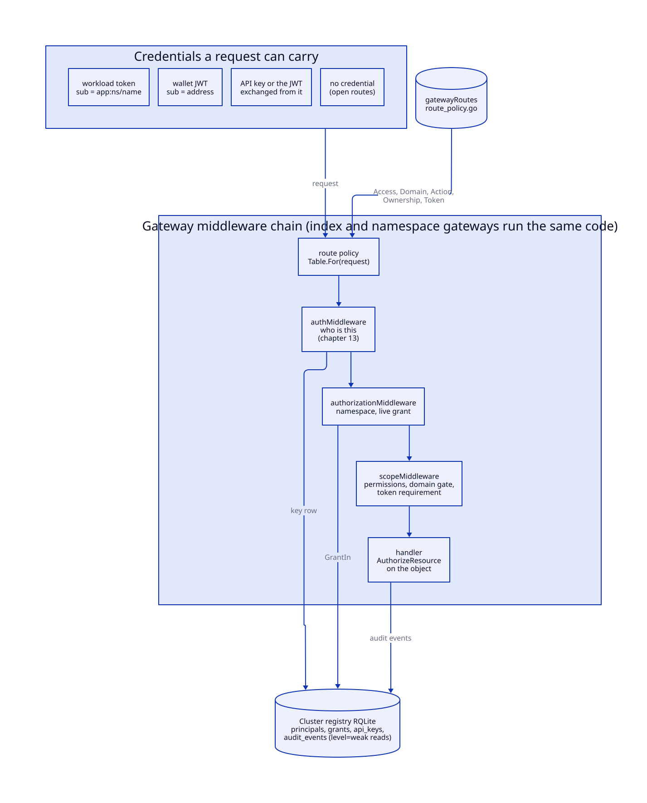
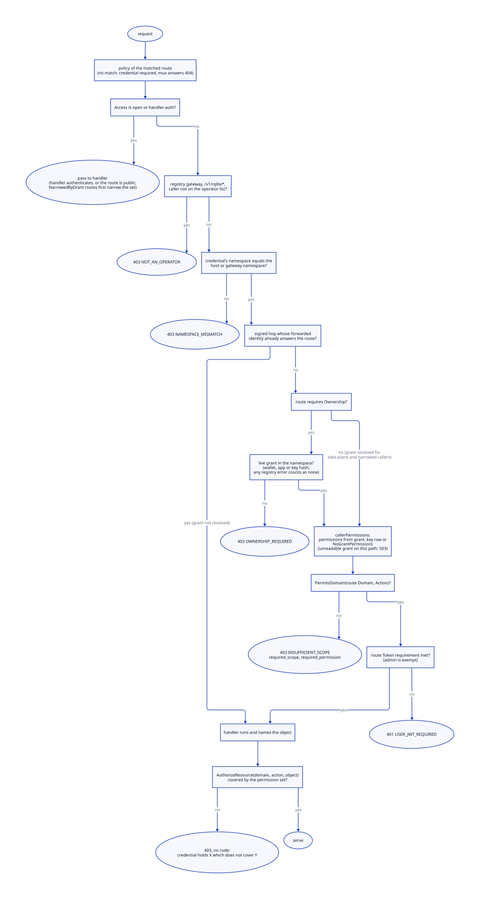
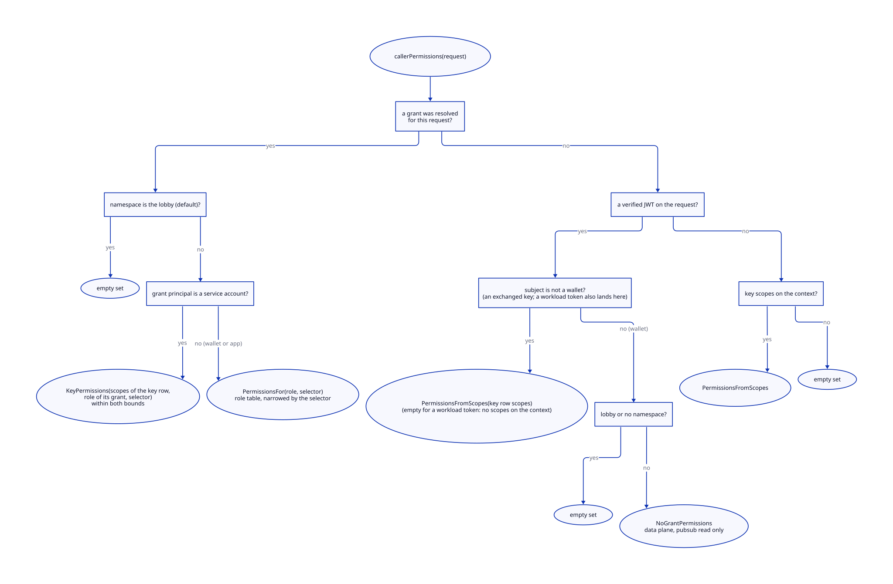
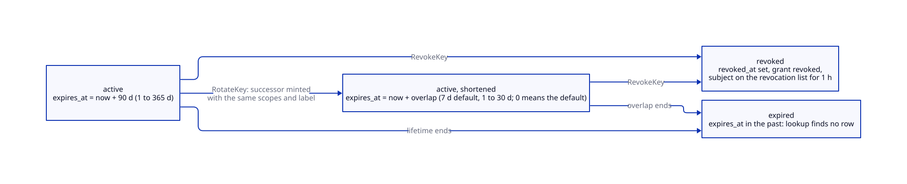
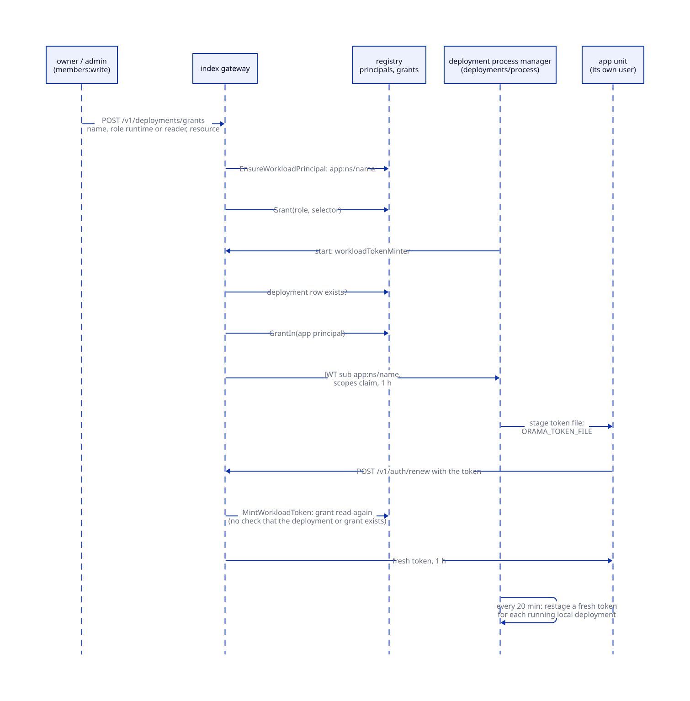

# Authorization

> **At a glance.**
>
> - **What:** the rules that decide what an authenticated caller may do. A credential (a wallet session, an API key, or a deployed app's workload token) is mapped to a set of permissions of the form `domain:action:resource`. The set comes from a live grant in the cluster registry (a role in a namespace, optionally narrowed to a resource and optionally expiring), from the key's own row, or from a fixed default for a signed-in wallet with no grant. Every route declares what it needs in one table, and the check runs twice: a gate by domain and action before the handler, and a check by object inside it.
> - **Key numbers:** 14 permission domains, 5 roles; 177 declared route patterns, 24 open and 26 authenticated by their own handler (`core/pkg/gateway/route_policy.go:buildRoutePolicies`); a wallet's data-plane grant is cached 10 s, a key's row 60 s; keys live 90 days by default and at most 365, rotation overlaps 7 days by default and at most 30; a workload token lives 1 h; audit events are kept 90 days.
> - **Code:** `core/pkg/gateway/auth/` (permissions, grants, keys, workload tokens, audit), `core/pkg/gateway/routepolicy/`, and the gates in `core/pkg/gateway/` (`scope_policy.go`, `forwarded_grant.go`, `narrowed_grant.go`, `middleware.go:authorizationMiddleware`, `members_routes.go`, `keys_routes.go`, `app_grants_routes.go`).
> - **Depends on:** [identity](13-identity.md) for who the caller is (sign-in, tokens, sessions, revocation), [gateway architecture](12-gateway-architecture.md) for the middleware stack this chapter's gates sit in, and [cluster state](07-cluster-state.md) for the registry RQLite where grants live.



## Why it exists

Identity answers "who is this". The gateway must also answer, on every request, "may this caller do this, here, to this object". Three facts shaped the answer.

First, one namespace has callers of very different trust. The owner and the people who run the application hold the control plane (deployments, secrets, the raw database, who else is a member). The application's own code and its end users hold the data plane (storage, pub/sub, cache, push, function calls). A key shipped in a browser or mobile bundle is public the moment it ships, so it must not reach the control plane or turn into a logged-in user.

Second, authority has to be changeable after it is handed out: a member is demoted, a key leaks, a deployment is compromised. A token is valid until it expires, so what it carried at mint time cannot be the answer. The gateway reads authority from the registry on every request, through short caches whose lifetimes are named constants, and treats the token as identity only.

Third, the old design could not express what was wanted. A key stored eight flat scope words (seven data-plane ones and `admin`, which covered the whole control plane, 58 routes) while a grant carried `domain:pattern` selectors; neither could express the other. There could be no `developer` role, because every control-plane route required `admin`, and a grant could not be narrowed to a table or deployment without holding `admin` elsewhere (`core/pkg/gateway/auth/permission.go`, the package comment). The current model is one sentence: in this domain, this action, on this resource. A scope word is the case where action and resource are `*`; `admin` is where all three are.

Nothing may be reachable by accident. A route nobody declared a policy for cannot be registered, an unknown role grants nothing, an unreadable selector authorises nothing, and a grant that cannot be read refuses the request instead of widening it.

## The model

**Principal.** Who holds a grant: a row in `principals` with a `type` and an `identifier`, unique together (`core/migrations/050_principals_and_grants.sql`). There are three types: `wallet` (the identifier is the normalised address; an EVM address is lower-cased, a Solana address kept as signed), `service_account` (an API key, identified by its stored hash) and `app` (a deployed application, `app:<namespace>/<name>`). `core/pkg/gateway/auth/grants.go:PrincipalType` and `core/pkg/gateway/auth/workload.go:PrincipalApp` define them.

**Credential.** What the request carries: a wallet JWT (subject = address), an API key or the JWT exchanged from one (subject = the key's stored form), a workload token (subject = the app principal), or nothing ([identity](13-identity.md#access-tokens) covers verification). A subject is classified positively as a wallet (`core/pkg/gateway/auth/keyformat.go:IsWalletSubject`: a `0x` prefix, or 32 to 44 base58 characters); anything else is read as a key, which holds only what its row says. No key can pass as a wallet: a raw key contains an underscore, which is not base58, and none begins `0x`; the stored HMAC form is 64 hex digits, longer than any address.

**Grant.** What a principal may do in one namespace: a row in `grants` with a role, an optional resource selector, an optional expiry, and the creator. A grant is live when `revoked_at` is null, `expires_at` is null or in the future, and the principal's `disabled_at` is null. Revoking sets `revoked_at`; the row stays.

**Role.** A named permission set. The roles, weakest first (`core/pkg/gateway/auth/grants.go:roleRank`):

| Role | Permissions (`core/pkg/gateway/auth/permission_legacy.go:Permissions`) |
|---|---|
| `reader` | none: only the routes that ask for no permission |
| `runtime` | the data plane: `storage`, `pubsub`, `cache`, `push`, `webrtc`, `proxy` in every action, and `fn:invoke` |
| `developer` | the data plane, plus `db`, `deploy` and `secrets` in every action, plus `fn:manage`; not `members`, `namespace`, `audit` or `operator` |
| `admin` | `*:*:*` |
| `owner` | `*:*:*`; exactly one wallet per namespace; the only role that may transfer the namespace |

A role the binary does not know (a newer gateway may have written one) grants nothing.

**Permission.** `domain:action:resource` (`core/pkg/gateway/auth/permission.go:Permission`). The domains:

| Domain | Plane | Covers |
|---|---|---|
| `storage` | data | objects in IPFS: upload, get, pin, unpin, fetch capabilities |
| `pubsub` | data | topics: publish, subscribe, presence |
| `cache` | data | keys in a distributed map |
| `push` | data | device registration, topics, sends |
| `webrtc` | data | TURN credentials, signalling, rooms |
| `proxy` | data | the anonymity tunnel |
| `fn` | data | functions: `invoke` runs one, `manage` deploys, deletes and configures; `read` lists WebSocket connections |
| `db` | control | the tenant's SQLite databases, raw RQLite export and import, namespace restore |
| `deploy` | control | deployments, their domains and logs |
| `secrets` | control | deployment environment, push credentials, namespace backup |
| `members` | control | grants, API keys, deployment grants, session devices of users |
| `namespace` | control | a namespace's own settings (rate limit, session policy, WebRTC switches) and its deletion |
| `audit` | control | the audit trail |
| `operator` | control | the cluster itself: nodes, telemetry, settings, key rotation, invites |

The actions are `read`, `write`, `invoke`, `manage` and `*`. `invoke` and `manage` exist because running a function and changing it are different authorities and neither is a read or a write of the same thing. `*` in any position matches anything in it.

**Permission set.** The permissions a credential holds on this request (`core/pkg/gateway/auth/permission.go:PermissionSet`). It is computed once per request and carried on the context.

**Scope word.** The legacy storage format. A key row still stores a comma-separated list of eight words in `api_keys.scopes` (`admin`, `invoke`, `storage`, `push`, `webrtc`, `proxy`, `pubsub`, `cache`; `core/pkg/gateway/auth/scopes.go`). `core/pkg/gateway/auth/permission_legacy.go:PermissionsFromScopes` is the one place that turns them into permissions: `admin` is `*:*:*`, a data-plane word is its whole domain, and `invoke` is `fn:invoke:*`, never `fn:manage`. An unrecognised word contributes nothing.

**Selector.** A string on a grant that narrows it to part of a namespace: `storage:avatars/*`, `pubsub:topic=chat.*`, `fn:name=checkout`, `cache:key=sessions/*`. It becomes one permission (`core/pkg/gateway/auth/permission_legacy.go:PermissionFromSelector`).

**Route policy.** What a route requires, declared once in a table (`core/pkg/gateway/routepolicy/policy.go:Policy`): the access class, a domain and action, whether the caller must hold a grant in the namespace, and what kind of token it must present.

**Lobby.** The namespace `default`, which belongs to nobody. A wallet that signs in without naming a namespace stands there. It holds no permission and no grant, and reaches only routes that ask for none, chiefly `POST /v1/namespaces`, which creates a namespace and makes the caller its owner (`core/pkg/gateway/auth/ownership.go:LobbyNamespace`).

**End user.** A wallet with no grant that signed in to a namespace whose owner opened sign-in: a session and nothing more, with no grant, membership or key. It holds `NoGrantPermissions`: the data plane except publishing to pub/sub (`core/pkg/gateway/auth/permission.go:NoGrantPermissions`).

**Operator.** A wallet on the cluster's `operators` list. Operator status is separate from any grant: it is checked in the handler of `/v1/operator/*` routes and on the raw-database routes of the index gateway ([operator routes](12-gateway-architecture.md#operator-routes)). For an API key the wallet checked is the owner of the key's namespace, not the key ([Operators](#operators)).

## How it works

### The route policy table

Every route the gateway serves is declared in `core/pkg/gateway/route_policy.go:buildRoutePolicies`, which builds a `routepolicy.Table` once at package initialisation. It replaced three hand-maintained lists of path prefixes (`isPublicPath`, `requiredScope`, `requiresNamespaceOwnership`) that nothing tied to the routes they described. Two incidents show the cost: `/v1/node/enroll` was exempted from the scope check but never added to the public list, so the key middleware refused its invite token as a bad API key; and `/v1/operator/*` matched none of the lists, so a key out of a public app bundle could mint a cluster invite (`core/pkg/gateway/routepolicy/policy.go`, package comment).

The policy fields ([routing and the policy table](12-gateway-architecture.md#routing-and-the-policy-table) in chapter 12 lists all of them; the ones that matter for authorization):

| Field | Meaning |
|---|---|
| `Access` | `Credential` (zero value: a key or JWT must resolve), `Open` (anyone), `HandlerAuth` (the handler authenticates the caller, so the middleware must not try). `Open` and `HandlerAuth` both skip the authorization and scope gates. |
| `Domain`, `Action` | What the route does. Empty means any valid credential. Strings, not the auth package's types, because a policy table must not depend on what it describes. |
| `Ownership` | The caller must hold a live grant in the namespace; this also resolves the grant onto the request. |
| `Token` | `AnyCredential` (a bare key suffices), `AnyToken` (some JWT: possession of a key proven by an exchange), `WalletToken` (a logged-in wallet), `PrincipalToken` (a logged-in wallet or a deployed app's own token, never a key). |
| `NarrowedByGrant` | An `Open` route whose handler applies the caller's selector (`/v1/invoke/`). |

The declared patterns split into 24 `Open`, 26 `HandlerAuth` and 127 that require a credential (a pattern with a request-dependent policy counts once, under the policy of a `GET`). Of the 127, 42 also require ownership, 15 are operator routes and 23 are deployment routes. Examples: `/v1/deployments/env/set` is `secrets:write`; `/v1/deployments/grants` is `members:write`, because handing a deployment authority is handing out authority; `/v1/db/sqlite/query` is `db:write`, because the endpoint runs whatever SQL the caller sends; `/v1/functions` is owned `fn:manage`; `/v1/audit` is `audit:read`, because the trail names a namespace's wallets and when they sign in. Only `/v1/operator/invite` asks for `*:*:*` (`policyUnrestricted`), because a cluster invite hands out every secret the cluster holds.

The fail-closed properties are structural, not conventional:

- `Table.For` hands a request that matches no declared pattern the zero `Policy`: a credential is required and no grant reaches anything. The mux then answers 404, and an unmatched path is never an open one.
- `Table` matches by feeding the request to a `http.ServeMux` holding the declared patterns, so the policy is chosen by exactly the rules that choose the handler. A path the mux would only reach through a redirect (needing cleaning, or the wrong case) resolves to nothing.
- `Mux.Handle` panics on a pattern with no declared policy, and `Table.Add` panics on a pattern declared twice (`core/pkg/gateway/routepolicy/policy.go:Mux`).
- `core/pkg/gateway/route_policy_test.go:TestRoutePolicy_thePublicSetIsTheOneThatWasReviewed` fails the build when an `Open` route is added without editing the reviewed set.

`AddDynamic` declares a policy that depends on the request. `/v1/functions/` asks the serverless package's own parser which operation it is (`core/pkg/gateway/route_policy.go:functionRoutePolicy`): invoke is `Open` with `NarrowedByGrant`, a capability-opened WebSocket is `HandlerAuth`, `ws` is owned `fn:invoke`, and everything else (deploy, delete, logs, triggers, secrets) is owned `fn:manage`. An earlier version read the path suffix, so `/v1/functions/secrets/invoke` counted as an invocation.

### The decision pipeline

[Chapter 12](12-gateway-architecture.md#the-middleware-stack) lists the full middleware stack. Three of its stages decide authorization, in this order. The policy is resolved once before any of them (`routePolicyMiddleware`) and read from the context, so the three cannot disagree.



**Authentication** (`authMiddleware`, [credential resolution](12-gateway-architecture.md#credential-resolution)) sets the credential on the context: the JWT claims, or the API key and the namespace and scope set from its row. On an `Open` or `HandlerAuth` route a missing or unknown credential passes through; on any other route it is refused (`AUTH_MISSING`, `AUTH_INVALID_KEY`, `AUTH_REVOKED`, `AUTH_EXPIRED`, `AUTH_UNAVAILABLE`; how tokens are verified is [identity](13-identity.md#access-tokens)). A failed registry read while looking up a key is reported as `AUTH_INVALID_KEY` (Known gaps).

**The authorization gate** (`core/pkg/gateway/middleware.go:authorizationMiddleware`) runs these steps in order:

1. An anonymous route passes. If its policy has `NarrowedByGrant` and a credential is present, the caller's grant is resolved first and, when it carries a selector, the narrowed permission set is put on the context, so a wallet narrowed to `fn:name=checkout` is held to it on a route open to everyone. This step only takes access away.
2. On the gateway that serves the cluster registry, `/v1/rqlite*` is refused to anyone not on the operator list (`core/pkg/gateway/core_registry_guard.go:requireOperatorForCoreRegistry`, `NOT_AN_OPERATOR`). It runs before the signed-hop shortcut, because a hop's MAC says a gateway authenticated the caller, not that the caller is an operator.
3. For a route the index gateway serves on an `ns-<name>` host, the credential's namespace must equal the host's.
4. If the request is a signed hop and `forwardedCallerNeedsGrant` says the forwarded identity already answers the route, the gate passes. The hop carries who the caller is and a key's scopes, not the grant. A key's scopes are its authority on a route that resolves no grant; a wallet's authority is its grant, so a wallet needs it resolved on every route that asks for a permission (`core/pkg/gateway/forwarded_grant.go:forwardedCallerNeedsGrant`).
5. On a namespace gateway, a credential of another namespace is refused (`NAMESPACE_MISMATCH`).
6. A route without `Ownership` still resolves the caller's grant when `forwardedCallerNeedsGrant` says one is needed, and carries it on the request; a forwarded wallet on an owned data-plane route takes this cached path instead of step 7. The data plane reads the grant through a cache, a control route live (below). A grant that cannot be read answers a plain 503, never the data plane (`core/pkg/gateway/narrowed_grant.go:refuseUnreadableGrant`).
7. A route with `Ownership` first runs `INSERT OR IGNORE INTO namespaces` and reads the namespace id (a failed insert answers 500 with the error text, a failed read `403 NAMESPACE_MISMATCH`), then looks the caller's grant up and refuses with `OWNERSHIP_REQUIRED` when there is none. The lookup tries a key's hashed form before the raw form (rolling-upgrade legacy) and a wallet's normalised form before the presented one, and a wallet JWT with no grant falls back to the API key it also presented. Any `GrantIn` error counts as no grant (Known gaps). The grant travels with the request.

**The scope gate** (`core/pkg/gateway/scope_policy.go:scopeMiddleware`) never authorises on its own; it only tightens. For a non-anonymous route it computes the caller's permission set (`callerPermissions`, next section), stores it on the context, and asks two independent questions:

- Does the set reach the route's domain and action at all (`PermissionSet.PermitsDomain`)? If not, `403 INSUFFICIENT_SCOPE` with `required_scope` (the domain) and `required_permission` (for example `pubsub:write:*`) in the body, so a client that lacks a permission can read which one.
- Does the caller present the kind of token the route requires (`hasRequiredToken`)? An admin caller (`PermissionSet.IsAdmin`: a permission with all three parts `*`) is exempt, because the requirement exists to make a leaked data-plane key inert and an admin credential is not one. Otherwise `AnyToken` needs any verified JWT, `WalletToken` a JWT whose subject is a wallet, and `PrincipalToken` a wallet JWT or a workload JWT. Failure is `401 USER_JWT_REQUIRED`. The two checks are independent: creating a namespace needs a wallet and no permission.

Which routes ask for which token follows from what each protects. `storage` and `webrtc` require a principal token (a logged-in wallet or a deployed app, never a key), so a runtime key extracted from a client reaches neither. `proxy` requires a wallet, because the tunnel is an end user's anonymity. `pubsub`, `push` and `cache` accept a bare key. `DELETE /v1/storage/unpin/` requires only some token (`AnyToken`), so a userless server-side reclaim job can prove it holds a storage key by exchanging it. `POST /v1/namespaces` and `GET /v1/namespace/list` require a wallet and no grant.

**The handler** is the third stage, and asks the object question (next sections).

### Where a request's permissions come from

`callerPermissions` is the single path from "a credential" to "a permission set". It replaced three paths that could disagree (an exchanged-key JWT carried an authoritative `scopes` claim, a wallet JWT used the resolved grant, a bare key used the scope set on the context), which made narrowing a grant bite at once for a wallet and only at the next token for a key. A token says who you are; what you may do is read from the grant.



In order (`core/pkg/gateway/scope_policy.go:callerPermissions`):

1. If a grant was resolved for this request:
   - in the lobby, the empty set (a cluster from before ownership was fixed may still record a grant for whichever wallet signed in first);
   - for a service account, `KeyPermissions(scopes of the key row, role of its grant, selector)`: the scopes say what the key reaches and the role bounds it, because a key's role is only ever `runtime` or `admin` and a key minted for `invoke` alone would otherwise hold a runtime role's whole data plane;
   - for a wallet or an app, `PermissionsFor(role, selector)`.
2. Otherwise, if a JWT was verified: a key subject gets `PermissionsFromScopes` of the key's row (not the claim copied into the token); a wallet in the lobby, or with no namespace, gets the empty set (a lobby session used to receive the data plane, so every signed-in wallet shared the index namespace's cache and pub/sub); any other wallet gets `NoGrantPermissions`.
3. Otherwise, if only a bare key's scopes are on the context, `PermissionsFromScopes` of them.
4. Otherwise nothing.

`PermissionsFor` applies the selector rule. A grant with no selector is the whole role. A grant with one holds exactly the one permission its selector describes, and only if the role reached it at the domain level (a `storage:avatars/*` selector on a `reader` yields the empty set); a selector that cannot be parsed yields the empty set. A selector therefore only narrows, and a narrowed grant holds nothing outside its own domain: a wallet narrowed to `pubsub:topic=chat.*` can no longer touch storage or the cache (`core/pkg/gateway/narrowed_grant_test.go:TestForwardedDataPlane_aSelectorInAnotherDomainDoesNotReachTheCache`).

### Permissions: grammar and matching

`ParsePermission` reads `<domain>:<action>:<resource>`; a two-part form `<domain>:<resource>` means every action and a bare domain means everything in it. Limits: at most 256 characters, printable ASCII, no spaces. Domain and action are lower-cased and checked against the closed lists above, so a typo is a refusal and not a permission that never matches; the resource is case-sensitive. `ParsePermission` has no production caller: grants parse selectors (`ParseSelector`) and code builds permissions. It exists for tests and the documented grammar.

`Permission.Permits(Resource)` is the object question. Domain and action match case-insensitively, a `*` in either position matches anything, and the resource is a glob where `*` stands for any run of characters including `/` (`core/pkg/gateway/auth/authorize.go:matchGlob`). `*` crosses the separator on purpose: `avatars/*` must cover `avatars/2026/03/me.png`, and a rule that stopped at `/` would quietly grant less than it appears to. There is no `?` and no character class.

Two rules make the check conservative:

- A request that names no object (`Resource.Name == ""`) is covered only by a permission whose resource is `*`: a CID this namespace recorded no name for, or an upload with no name, is something nothing could name, and "I could not work out what you are touching" is not a reason to allow it.
- The gate and the handler ask different questions of the same set. The gate asks `PermitsDomain` before the handler knows which object is meant; the handler asks `Permits` once it does. They used to be one question, which is how an unnamed object slipped through.

An empty `Resource.Action` matches a permission of any action, which is how the function invoke handler, which passes no action, is covered by `fn:invoke:checkout`.

### The object check in the handlers

`core/pkg/gateway/auth/authorize.go:AuthorizeResource` reads the permission set the scope gate put on the context and asks `Permits` for the object; a request with no set never went through the gate (a public route) and is not narrowed. Four data paths call it, each deciding what the name is:

| Domain | Name matched | Actions | Notes |
|---|---|---|---|
| `storage` | the name the object was uploaded with, normalised | read for get; write for upload, pin, unpin | `core/pkg/gateway/handlers/storage/authorize.go:authorizeCID` looks up the name recorded for a CID in `ipfs_content_ownership`. A CID with no recorded name is refused for a narrowed grant; a failed lookup is a 503. |
| `pubsub` | the topic | read to subscribe, write to publish | publish, publish-batch and the subscribe WebSocket; a frame sent on a socket the caller may not write to is not published |
| `cache` | `<map>/<key>` (`cache/authorize.go:cacheResourceName`) | read for get, mget, scan; write for put, delete | `mget` is all or nothing, because a silently narrowed answer looks like keys that were not set; `scan` filters, because its answer is the set it returns |
| `fn` | the function name | none | HTTP invoke and the invoke WebSocket. A function a caller may run that calls another through `function_invoke` runs that one as its own code; the selector bounds the entry points |

A storage name is normalised before it is compared (`core/pkg/gateway/auth/selector.go:NormalizeStoragePath`): empty segments and `.` are dropped, so `/avatars/me.png` and `avatars//me.png` are one object, and a name is at most 1,024 characters. `..` is refused, not resolved: a storage name is a label, and resolving `avatars/../keys/x` would let it match `avatars/*` while naming something else. A cache key is not a path and is not normalised: `sessions/../tokens/x` is a key named `../tokens/x` in the `sessions` map, and the map is what the grant names.

A refusal by `AuthorizeResource` is `403` with `{"error": "this credential holds X, which does not cover domain:action:name"}` and no `code` (see Known gaps).

### Roles and grants

A member holds one live grant per namespace. The write path (`core/pkg/gateway/auth/grants.go:writeGrant`):

1. `Grant` refuses an owner grant outright. Ownership is established by creating a namespace and moved by `TransferOwnership`; any other path to it is how the namespace-takeover bug worked.
2. The role must be one of the five, and the identifier is normalised (`NormalizeWallet`): a wallet in two capitalisations would be two principals.
3. A selector, if present, must parse (`ParseSelector`), its domain must be one of the four enforced ones (`SelectorEnforced`), and the role must hold the scope word the selector narrows (`Role.Scopes`; empty for `developer`, so a developer can carry no selector: Known gaps). A narrowing the data path does not apply is refused at write time, with a message naming the domains that are applied: otherwise `orama members list` would show a narrowed grant that authorises nothing.
4. The principal row is created if absent (`INSERT OR IGNORE`). An expiry must then be in the future (the HTTP route takes `expires_in_hours` between 1 and 8,760), and the grant row is inserted.
5. `keepNewestGrant` revokes every other live non-owner grant the principal holds in the namespace, in one statement keyed on the newest id, so two writes racing for one principal keep the same row. Writing a grant therefore replaces: `orama members add` is also how a role is changed or a selector removed. It used to add a row beside the old one, and a member demoted from admin to reader stayed an admin.
6. A unique-index conflict (`idx_grants_one_live`: one live grant per principal, namespace, role and selector) lands in `regrant`, which makes the existing row the grant in place: its expiry is set to the one asked for, and every other row is retired only after the surviving one is right, so the principal is never left without a grant.

Two partial unique indexes carry the invariants in the database rather than in code that must remember (`core/migrations/050_principals_and_grants.sql`): `idx_grants_one_owner` (one live `owner` grant per namespace) and `idx_grants_one_live`.

`RevokeGrant` sets `revoked_at` and never deletes: what somebody was once allowed to do is the question an incident asks. The owner cannot be revoked (`ErrOwnerCannotBeRemoved`, 409 on the route). It needs the RQLite client for an affected-row count; without one a revoke is indistinguishable from a no-op, so it refuses to run. `GrantIn`, the read every authenticated request makes, is one join of `grants` and `principals` filtered to live rows, owner role first, then the newest id.

`TransferOwnership` is one operation, never a revoke and a grant, because a namespace with no owner is claimable by whoever signs in next. It first writes an `admin` grant for the outgoing owner (so a handover does not lock the owner out), then moves the owner row to the new wallet with a single `UPDATE grants SET principal_id = ?`, then retires whatever the new owner held before. The route requires `grant.Role == owner`, since an admin who could transfer could take the namespace (`core/pkg/gateway/members_routes.go:transferNamespace`), and validates both wallets as real addresses (`siw.IsWalletAddress`): a namespace handed to a string no wallet can sign in as is lost.

The HTTP surface (all `members:write`, owned, on the index gateway; bodies are capped at 4,096 bytes, 1,024 for transfer):

| Route | CLI | Effect |
|---|---|---|
| `GET /v1/namespace/members` | `orama members list` | live grants, strongest role first; a row with a selector carries `enforced` |
| `POST /v1/namespace/members` | `orama members add <wallet> --role --resource --expires-in-hours` | write a grant |
| `DELETE /v1/namespace/members/{wallet}` | `orama members remove` | revoke |
| `POST /v1/namespace/members/transfer` | `orama members transfer` | owner only |

`GET /v1/auth/whoami` answers "what am I allowed to do here": the principal type, the role, the legacy `grants` list, the selector and the grant's expiry (`core/pkg/gateway/handlers/auth/wallet_handler.go:describePrincipal`). A subject with no grant gets `role: null`, not an error: a wallet removed from a namespace still holds a valid token until it expires. A failed registry read gets the same answer.

### Selectors

Four domains apply selectors (`core/pkg/gateway/auth/selector.go:enforcedDomains`):

| Selector | Translated permission | Applied to |
|---|---|---|
| `storage:avatars/*` | `storage:*:avatars/*` | upload, get, pin, unpin |
| `pubsub:topic=chat.*` | `pubsub:*:chat.*` | publish, publish-batch, subscribe |
| `fn:name=checkout` | `fn:invoke:checkout` | function invocation, HTTP and WebSocket |
| `cache:key=sessions/*` | `cache:*:sessions/*` | get, mget, put, delete, scan |

The translation (`PermissionFromSelector`) strips the keyed prefix (`topic=`, `name=`, `key=`, `table=`), maps a trailing `:read` or `:write` to the action (`db:table=posts:read` is `db:read:posts`), and fixes the action of `fn` selectors to `invoke`, since managing functions was part of `admin`, which a selector could not narrow. A selector is at most 256 printable ASCII characters.

Two domains that look narrowable are not. `db` has no enforcing data path: nothing parses a statement for the tables it touches (the SQL guard is a denylist, see [the SQL guard](17-database.md#the-sql-guard)). `push` has nothing to name: a send names a user and optionally a channel, and rotating topics are random ids. Both are refused when the grant is written. That is the only filter: `PermissionsFor` does not consult `SelectorEnforced`, so a `db` or `push` selector already in a row (no write path creates one) would become a narrowed permission that the gate reads at the domain level and no handler narrows further. The other control-plane domains are not selector domains.

A stored selector this binary cannot parse authorises nothing (`Grant.Permits` returns an error, `PermissionsFor` the empty set). The alternative, ignoring the selector and handing over the whole role, would turn "may write to `storage:avatars/*`" into "may write to all storage" silently.

### Pub/sub reserved topics

Topics under `_orama/` belong to the platform (today `_orama/webrtc/<room>`, the WebRTC membership events); the prefix is matched case-insensitively (`core/pkg/gateway/handlers/pubsub/reserved_topic.go:isReservedTopic`).

Nobody may publish to a reserved topic through a route (`403 PUBSUB_RESERVED_TOPIC`; the platform publishes in-process), and publish routes refuse a payload carrying an `_orama` key (`PUBSUB_RESERVED_KEY`). A wallet with no grant may not subscribe to one and does not see it listed; a credential that can write pub/sub on the topic (`holdsTopicGrant`) may. A runtime key ships inside the applications that use it, so every user of such an application can read every room's membership with it; an application that needs membership private keeps it behind functions.

### Wallets with no grant

`NoGrantPermissions` is the set `callerPermissions` hands a signed-in wallet in a tenant namespace that has no grant for it: the data plane with one loss, `pubsub:read:*` instead of `pubsub:*:*`. Otherwise any end user could publish to any topic of the namespace, including those the application's functions publish authoritative events on (bugboard #733). The refusal is `403 INSUFFICIENT_SCOPE` with `required_permission: pubsub:write:*` and a message naming the two remedies: grant the wallet pub/sub write (a runtime grant, or `pubsub:topic=chat.*`), or publish from a function (`core/pkg/gateway/scope_policy.go:refusedPermissionMessage`). Announcing presence on a subscribe socket publishes `presence.join` and `presence.leave`, so it needs write too.

Whether such a wallet may sign in at all is the sign-in gate (`RequireSignInAllowed`): a wallet with a live grant is let in, a namespace with no owner refuses everyone (`NAMESPACE_UNOWNED`), and otherwise the namespace's `sign_in` policy decides: `members` (the default; `NAMESPACE_NOT_OWNED`) or `open` (the wallet is an end user, and no key is minted: `ROLE_HAS_NO_KEY`). The policy and `SIGN_IN_CLOSED` belong to [identity](13-identity.md#sign-in-policy).

### API keys

**Format.** `orama_<type>_<payload>_<checksum>`, all base62 (`core/pkg/gateway/auth/keyformat.go:NewKey`). The type is `sk` for a key whose scopes include `admin` and `rk` for one that holds only the data plane; it tells whoever finds the string how bad the leak is, and does not decide authority, the scopes column does. The payload is 24 random bytes (192 bits). The checksum is CRC32 of the body, which is not a security property: it is meant to let a client or secret scanner recognise a key offline and a mistyped one be refused without a lookup, and nothing on the request path checks it (Known gaps). The key names no namespace: it used to be `ak_<24 base64url>:<namespace>`, so a key pasted into an issue or log line published which tenant it belonged to. `ak_` keys remain live rows until swept (`IsLegacyKey`, `RevokeAllLegacy`).

**Storage.** The key is stored as an HMAC-SHA256 hex digest under the gateway's `api_key_hmac_secret` and shown once, at creation (`core/pkg/gateway/auth/service.go:HashAPIKey`; with no secret configured it returns the key unchanged, a rolling-upgrade accommodation). `KeyFingerprint` (`key_` plus 12 hex digits of SHA-256) names a key in a log or response, because `HashAPIKey` would echo the credential on a gateway missing the secret.

**Authority.** The `scopes` column, written at mint time from a validated list (`NormalizeGrants` refuses an unknown word). Profiles are the ergonomic spelling (`ProfileGrants`): `admin` is `admin`; `app-runtime` (also `runtime`, `app`) is `invoke`, `storage`, `push`, `webrtc`, `proxy`; `invoke-only` is `invoke`. `app-runtime` omits `pubsub` and `cache` on purpose; a key that uses them is minted with them named. A key also gets a grant in its namespace (a `service_account` principal, role `admin` if its scopes include `admin`, else `runtime`; `RoleForScopes`), which is how the ownership gate recognises it. The grant is membership, not permission: `KeyPermissions` intersects it with the scopes.

**Lifetime.** Every key expires: 90 days by default, at most 365 (`core/pkg/gateway/auth/scoped_keys.go:KeyLifetime`, `MaxKeyLifetime`). A key that lives forever is not on offer, because that is what migration 051 exists to end, and past a year an expiry does nothing a revocation would not do better. The lookup SQL excludes revoked and expired rows (`core/pkg/gateway/middleware.go:apiKeyByStoredSQL`).



**Rotation.** `RotateKey` mints a successor with the same scopes and label, records `rotated_from`, and shortens the original's expiry to the overlap: 7 days by default (also for `overlap_days: 0`), at most 30 (`DefaultRotationOverlap`, `MaxRotationOverlap`). The original is not revoked, because revoking it as the new key is minted is an outage with no window to roll the new one out. The shortening only shortens (`expires_at > new expiry` in the `WHERE`). Revoking is the way to end a key now. A wallet's login mint likewise leaves the wallet's previous key alive and records the succession.

**Revocation.** `RevokeKey` sets `revoked_at` (the row is kept), revokes the key's service-account grant, and records a subject revocation under the key's hash for `maxExchangedTokenLifetime` (1 h), so the JWTs already exchanged from it, which verify on their signature alone, stop too. A token minted afterwards is a new grant and is not covered. If the grant or subject revocation fails, the error says the key is revoked but a stale path may still match it. The revocation list's mechanics (reload every 5 s, 10 s staleness bound, fail closed) are in [identity](13-identity.md#revocation).

**Exchange.** A key can be exchanged for a JWT (`/v1/auth/token`) whose subject is the key's stored form, never the raw key, because a JWT payload is only base64 and a 15-minute token travels further than a 90-day credential should. The token copies the key's scopes into a claim, which the gateway ignores: it re-reads the row on every request (`exchangedKeyScopes`).

**Management.** `POST/GET /v1/namespace/keys`, `DELETE /v1/namespace/keys/{id}`, `POST /v1/namespace/keys/{id}/rotate` and `POST /v1/namespace/keys/revoke-legacy` are `members:write`, owned and `MainGateway`, because keys live only in the cluster registry. The namespace comes from the caller's credential, never the request, and nothing limits which scopes the caller may mint: an `admin` member can mint an `admin` key. Create and rotate take `expires_in_days` (1 to 365), rotate also `overlap_days`; the CLI is `orama namespace keys create|list|rotate|revoke`.

**Sending a credential.** A key goes in `Authorization: Bearer`; the accepted spellings, the WebSocket-only query forms and the deprecation headers are in [credential resolution](12-gateway-architecture.md#credential-resolution). A Bearer value with two dots is a JWT and no key contains a dot (`core/pkg/gateway/auth/apikey_request.go:APIKeyAndFormFromRequest`).

### Workload identity

A deployed application is a principal of type `app`, with grants its owner chooses, and holds a token instead of a key. Before this, an app received `PORT`, its namespace and its gateway's URL and no credential, so every app that talked to the platform carried a pasted key: an application compromise was a namespace takeover, and nothing the workload did was attributable to it.



- **Granting.** `POST /v1/deployments/grants {name, role, resource}` (`members:write`; `orama app grants set`) records the principal (`EnsureWorkloadPrincipal`) and writes a grant. The route accepts only `runtime` and `reader`: an app with the control plane could deploy over itself, mint keys and read the raw database (`core/pkg/gateway/app_grants_routes.go:setAppGrant`). The restriction is in the route; `Service.Grant` accepts any role but `owner` for an app. A deployment nobody has granted anything reaches nothing, because starting every deployment with the data plane would be the permanent key it replaces. The route does not check that the deployment exists, and no route removes an app grant: `reader` replaces one.
- **Minting.** `MintWorkloadToken` issues a JWT with subject `app:<namespace>/<name>`, a namespace claim and a `scopes` claim holding the grant at that moment, valid for `WorkloadTokenLifetime` (1 h). No grant, or a failed grant read, yields an empty set, never the data plane (`workloadScopes`). At start the gateway mints only for a deployment whose row exists (`core/pkg/gateway/workload_token.go:workloadTokenMinter`).
- **Staging.** systemd stages the token from a file only the gateway can write, exposed to the app at `$ORAMA_TOKEN_FILE`. The gateway mints a fresh token whenever it starts the unit, and every 20 minutes restages one for each running local deployment without restarting anything (`core/pkg/deployments/health/token_refresh.go:tokenRefreshInterval`), paced at 50 ms per deployment, so a staged token has at least 40 minutes left. A gateway-driven restart while the registry is unreachable uses the staged token only if more than 5 minutes remain (`core/pkg/deployments/process/manager.go:WorkloadTokenRestartMargin`).
- **Renewal.** The app calls `POST /v1/auth/renew` with the token it holds. `RenewWorkloadToken` accepts only a workload's own token (subject `app:`, namespace equal to the claim's) and mints a successor from a fresh grant read. It checks neither that the deployment nor that the grant still exists: a renewal after the grant was removed yields a token that reaches nothing, but nothing writes a revocation entry for an app subject, so a chain renewed within each hour does not end (Known gaps). A user session is renewed by its rotating refresh token instead; letting any access token mint its own successor would make a stolen one good forever.
- **Authority at request time.** The token's `scopes` claim is not read. The gateway resolves the app's grant on every route under the app principal, through the 10-second data-plane cache, which for a workload is also keyed by the token's `jti` and `iat`, so a new token reads the grant live. A selector narrows the app as it does a wallet. A grant that does not cover the route is `403` (an app invoking a function it holds no grant for is `403 FORBIDDEN`, the shared RPC code, not one of the auth codes below); `401` is for a caller with no identity. An app's token is good in its own namespace only.

Storage and WebRTC accept a workload token as they accept a wallet (`PrincipalToken`), and the app's grant decides what it reaches. The anonymity proxy and tunnel, and creating or listing namespaces, stay a person's.

### Operators

Operator status gates the cluster's own routes ([operator routes](12-gateway-architecture.md#operator-routes)). `/v1/operator/*` routes ask the scope gate for `operator:read` or `operator:write` (the invite for `*:*:*`), and the handler then requires the caller's wallet to be on the `operators` table (`core/pkg/gateway/handlers/operator/authorize.go:IsOperator`, case-insensitive). The wallet is the JWT subject if it is a wallet; for an API key or key-exchanged JWT it is the wallet that owns the key's namespace (`handler.go:resolveWalletFromAPIKey`), so an admin key of an operator's namespace is an operator credential (Known gaps). A permission set cannot say "is on the operator list", hence both layers. An unreadable list answers 503, an empty one `NOT_AN_OPERATOR`. The same check guards the raw-database routes of the gateway that serves the registry.

### Consistency and caching

Authorization state lives in the cluster registry (the index gateway's RQLite), never in a tenant's database: a tenant's owner can export that database whole and replace it by import, so anything the platform kept there would be state its subject can rewrite and the rest of the cluster never sees. A namespace gateway reaches the registry through a second client (`grantDB`), and a test fails when a migration creates a table nobody has placed in one database.

Both clients that read the registry (`core/pkg/gateway/dependencies.go:gatewayClientConfig`, and the one a namespace gateway builds for the index registry, `core/pkg/gateway/gateway.go:registryClientConfig`) read at RQLite `level=weak`, which routes the read to the leader. A follower's replica would answer 403 to a grant `orama members add` had just had the leader acknowledge, on the member's first sign-in on another node. The cost is one hop to the leader (about 1 to 2 ms over WireGuard) and, while the cluster has no leader, failing reads instead of stale ones: a control plane that answers late is preferred to one that answers with what it has not caught up on.

How long a change takes to land:

| Change | Takes effect |
|---|---|
| Revoking a key | at once on the gateway that records it, within 10 s on every other: the revocation list is consulted before any cache |
| Narrowing a key (a revoked grant, an edited row) | within 60 s on every gateway that had seen it: `CredentialStaleness` is the middleware cache's TTL (`core/pkg/gateway/middleware_cache.go`) and is a promise rather than a tuning knob |
| A key expiring | the lookup SQL stops matching it; a cached entry can serve it for up to 60 s |
| A wallet's or app's grant, role or selector changing, on the data plane | within 10 s on every node (`narrowedGrantTTL`) |
| The same, on a control route and on routes that resolve a grant live | on the next request |
| An end user of an open namespace losing sign-in | its session is refused at its next refresh |
| A deployment's grant changing | data plane: within 10 s (a new token reads live, see Workload identity); control route: the next request |

The 10 s data-plane cache exists because a grant read is registry round trips (about 300 ms, per `narrowed_grant.go`) on the hot path. `grantCache` holds up to 4,096 entries keyed by namespace and subject and caches "no grant" too; a failed read is never cached. Concurrent misses for one key collapse into one registry read on a context detached from the first caller, bounded at 10 s (`singleflight`). A full cache drops expired entries, then one arbitrary live one; it used to be emptied, which let a caller cycling through wallets flush every other caller's entry.

### Refusals and the error-code table

Every credential, namespace, scope and operator refusal carries `{error, code, hint}` (`core/pkg/gateway/auth_errors.go:writeAuthError`), plus fields that make it actionable (`required_scope`, `required_permission`, `namespace`, `credential_namespace`). A 401 carries `WWW-Authenticate: Bearer realm="gateway"`; a 503 carries `Retry-After`. The code is the contract: the SDK switches on it, and the list only grows.

`core/pkg/gateway/auth_codes_doc_test.go:TestAuthCodes_areAllInTheDocs` reads the constants of seven source files and fails when a code is a string constant there and absent from the documentation. This table is the complete list, re-verified against those files and every emission site for the HTTP status; the one code outside the seven files is `RATE_LIMITED`, from `core/pkg/httputil/rpc_error.go:ErrCodeRateLimited`.

**Credentials and authorization** (`core/pkg/gateway/auth_errors.go`):

| Code | HTTP | Means |
|---|---|---|
| `AUTH_MISSING` | 401 (403 at the ownership gate when the route needs an identity and the credential carries none) | no credential was presented |
| `AUTH_INVALID_KEY` | 401 | the key is not one this cluster knows (never issued, expired, or its registry lookup failed on a cache miss) |
| `AUTH_REVOKED` | 401 | the credential was revoked; sign in again or use a new key |
| `AUTH_UNAVAILABLE` | 503, `Retry-After: 2` | the gateway could not tell whether the credential was revoked (the revocation list is older than its 10 s bound and the registry cannot be read); retry with the same credential |
| `AUTH_EXPIRED` | 401 | the access token expired; refresh it. Every auth path answers it: the gateway middleware, the namespace proxy and the serverless router; an expired token is never reported as `AUTH_MISSING` |
| `USER_JWT_REQUIRED` | 401 | the route needs a logged-in user (on storage and WebRTC a deployed app's own token also qualifies); a key alone is not enough. Also the anonymity tunnel's refusal of a non-user |
| `INSUFFICIENT_SCOPE` | 403 | the credential lacks a permission; `required_scope` is the domain and `required_permission` the full `domain:action:resource` |
| `NAMESPACE_MISMATCH` | 403 | the credential belongs to another namespace, or its namespace could not be resolved |
| `ORIGIN_NOT_ALLOWED` | 403 | a WebSocket upgrade whose `Origin` is not this host or a name under it |
| `OWNERSHIP_REQUIRED` | 403 | the credential holds no grant in this namespace; also a non-owner asking to transfer the namespace or to export or import its whole database |
| `NOT_AN_OPERATOR` | 403 | the wallet is not on the cluster's operator list |
| `DESTINATION_NOT_ALLOWED` | 403 | the anonymity proxy refused the destination (private or local addresses) |

**The relay** (`core/pkg/gateway/relay_errors.go`, and `RATE_LIMITED` from the shared RPC envelope):

| Code | HTTP | Means |
|---|---|---|
| `RELAY_DESTINATION_NOT_ALLOWED` | 400 | the relay reaches only a host under its allowed suffixes, on port 443, never an IP literal |
| `RELAY_UNAVAILABLE` | 503 | the relay could not carry the stream: Tor is down on the node, or the destination was not reached through it; it never connects directly |
| `RATE_LIMITED` | 429, `Retry-After` | too many relay streams from this address (per minute, or open at once) or on this node |

**Fetch capabilities** (`core/pkg/gateway/handlers/storage/fetch_cap_errors.go`):

| Code | HTTP | Means |
|---|---|---|
| `FETCH_CAP_MISSING` | 401 | a relayed download carries no `X-Orama-Fetch-Cap` header |
| `FETCH_CAP_INVALID` | 403 | the capability is forged, expired, for another CID or namespace, or not a fetch capability; one code for all of them, since which it was is of use only to somebody probing |
| `FETCH_CAP_REVOKED` | 403 | the capability, or the device that issued it, was revoked |
| `FETCH_CAP_REVOKE_KEY_INVALID` | 403 | a revoke by id without the `revoke_key` the mint returned for that id, or with another one |
| `FETCH_CAP_NOT_ALONE` | 400 | a fetch capability arrived beside a credential, which would tie the fetch to an account |
| `FETCH_CAP_DEVICE_REQUIRED` | 403 | a capability was minted from a session bound to no device (an API key or a workload token has none) |
| `FETCH_CAP_UNAVAILABLE` | 503, `Retry-After` | the gateway could not check or revoke the capability right now |

**Signing in** (`core/pkg/gateway/handlers/auth/signin_errors.go`, `challenge_errors.go`, `errors.go`). "Your signature did not verify" and "you signed the wrong message" are different problems:

| Code | HTTP | Means |
|---|---|---|
| `AUTH_MESSAGE_MALFORMED` | 401 | the message is not a Sign-In-With message this gateway can read |
| `AUTH_DOMAIN_MISMATCH` | 401 | the message names a domain this gateway does not serve |
| `AUTH_MESSAGE_EXPIRED` | 401 | the message is outside its own issued-at, not-before or expiry window |
| `AUTH_SIGNATURE_INVALID` | 401 | the signature does not recover the address in the message |
| `AUTH_CHALLENGE_INVALID` | 401 | the nonce is unknown, already used, or expired (one code for all three, so the endpoint is not an oracle for which wallets hold outstanding challenges) |
| `NAMESPACE_UNKNOWN` | 404 | no such namespace; `orama namespace create` makes one |
| `NAMESPACE_NOT_OWNED` | 403 | the namespace belongs to another wallet and the wallet holds no grant in it while the namespace's `sign_in` is `members` |
| `NAMESPACE_UNOWNED` | 403 | the namespace has no owner, so nobody may sign in to it |
| `NAMESPACE_HAS_NO_KEYS` | 403 | the lobby namespace has no keys; create a namespace first |
| `ROLE_HAS_NO_KEY` | 403 | a key was asked for by a member whose role a key cannot carry (`reader`, `developer`), or by an end user of an open namespace who holds no grant |
| `SIGN_IN_CLOSED` | 403 | the wallet holds no grant (never invited, or revoked, expired or disabled) and the namespace is not open: its session was refused a refresh. Issuing a new session is refused `NAMESPACE_NOT_OWNED` |
| `TOO_MANY_CHALLENGES` | 429, `Retry-After: 300` | the wallet holds as many unanswered challenges as it is allowed |

**Device-bound sessions** (`core/pkg/gateway/handlers/auth/device_errors.go`). The next move differs: sign a proof, ask another device, or accept that this key is done:

| Code | HTTP | Means |
|---|---|---|
| `DEVICE_REQUIRED` | 403 | the namespace requires sessions bound to a device |
| `DEVICE_KEY_INVALID` | 400 | the key is not a P-256 or Ed25519 public JWK, or is not the device the message names |
| `DEVICE_SIGNATURE_INVALID` | 401 | the device's signature over the sign-in message does not verify |
| `DEVICE_PROOF_REQUIRED` | 401 | a device-bound credential was presented without the device's proof |
| `DEVICE_PROOF_INVALID` | 401 | the proof is stale, reused, or not the device's |
| `DEVICE_REVOKED` | 403 | the device was revoked; its key can never hold a session again |
| `DEVICE_PENDING` | 403 (202 on sign-in) | the device waits for another of the account's devices to approve it |
| `DEVICE_NOT_FOUND` | 404 | the account has no such device |
| `DEVICE_KEY_TAKEN` | 403 | the key is enrolled for another account |
| `POLICY_SWEEP_INCOMPLETE` | 503 | the session policy is set, but revoking the end users' existing sign-in keys stopped partway; repeat the `PUT` |

Refusals that carry no code: the object check of the data paths (`403 {"error"}`), an unreadable grant on a data-plane or control route (`503 {"error"}`), and the pub/sub reserved-topic refusals, whose codes (`PUBSUB_RESERVED_TOPIC`, `PUBSUB_RESERVED_KEY`) sit in the pub/sub handlers, not in the seven files the test reads. The TypeScript SDK mirrors the codes as a typed error hierarchy ([SDKs](36-sdks.md)).

### The audit trail

`audit_events` holds what changed and who changed it (`core/pkg/gateway/auth/audit.go`). The 34 recorded actions (`AuditActions`) cover sign-in and its steps (`auth.challenge`, `auth.verify`, `auth.refresh`, `auth.refresh.replay`, `auth.logout`), device logins and revocations (`auth.device.*`), keys (`key.issue`, `key.revoke`, `key.rotate`, `key.revoke_all`), grants (`grant.add`, `grant.revoke`, `namespace.transfer`), namespace life (`namespace.create`, `.delete`, `.operator_remove`, `.backup`, `.restore`, `.session_policy`, `.sign_in_policy`), secrets, functions and deployments set and deleted, `operator.action`, `node.register`, `node.key.enrol` and `auth.legacy_credential`. A new action must be added to the list, which lets the `action` filter refuse a typo instead of returning an empty page.

Design points that matter for security:

- **Refusals are not recorded.** One row per 401 or 403 at the gates would let anyone with a network connection fill a table replicated to every node, so the record is of rare acts. The node heartbeat is not recorded for the same reason. Failed sign-ins are the exception ([identity's known gaps](13-identity.md#known-gaps)).
- **A write failure never fails the request.** The record is evidence, not a control; refusing a login because the audit row could not be written would turn a database blip into an outage. The failure is logged with "the audit trail has a hole in it".
- **The actor is never a credential.** A wallet is recorded as itself; anything else as `key:` plus 16 hex digits of the SHA-256 of the subject (`RedactSubject`), because every holder of `audit:read` can read the trail. Metadata is never a credential. The user agent is attacker-controlled text and is truncated. Fields are capped at 512 bytes, metadata at 2,048.
- **Retention.** 90 days. A pruner deletes in batches of 5,000 every 6 hours, because one enormous `DELETE` is a Raft entry every node applies at once (`AuditRetention`, `auditPruneInterval`, `auditPruneBatch`). That is at most 20,000 rows a day, so the table is bounded only while events arrive more slowly than that.
- **Reading.** `GET /v1/audit` (`audit:read`) returns the caller's namespace's events, newest first, 50 by default and 200 at most, with `action`, `principal` and `since` filters. The namespace comes from the credential, never the query string. `orama audit` and `orama audit --follow` use it.

## State it owns

| State | Holds | Writer | Reader | Where |
|---|---|---|---|---|
| `principals` | wallets, service accounts and apps: `type`, `identifier`, `disabled_at` | `ensurePrincipal`, the namespace create handler (`core/pkg/gateway/handlers/namespace/create_handler.go:CreateHandler`) | `GrantIn`, `ListMembers`, the owner lookup | cluster registry; migration `050` |
| `grants` | role, selector, expiry, `revoked_at` per principal and namespace; one live owner per namespace | `writeGrant`, `RevokeGrant`, `TransferOwnership`, `grantServiceAccount`, `revokeServiceAccount`, the namespace create handler | every authenticated request, through `GrantIn` | cluster registry; migration `050` |
| `api_keys` | HMAC of the key, label, scopes, `expires_at`, `rotated_from`, `revoked_at`, `last_used_at` | `IssueScopedKey`, `GetOrCreateAPIKey`, `RotateKey`, `RevokeKey` | `lookupAPIKeyEntry`, `ListKeys` | cluster registry; migration `051` |
| `audit_events` | namespace, actor, action, resource, result, ip, user agent, metadata, time | `AuditLog.Record` | `GET /v1/audit` | cluster registry; migration `048`; pruned at 90 days |
| revocation entries for a key's subject | the key's hash, for 1 h | `RevokeKey`, `RevokeAllLegacy` | the revocation list ([identity](13-identity.md#revocation)) | cluster registry |
| route policy table | one `Policy` per declared pattern | built at package initialisation | every request | memory, `gatewayRoutes` |
| grant cache | the grant (or its absence) per namespace and subject, 10 s, 4,096 entries | `cachedRequestGrant` | the data-plane gate | memory of each gateway process |
| credential cache | key to namespace and scopes, 60 s | `lookupAPIKeyEntry` | `authMiddleware` | memory of each gateway process |
| workload token file | the staged JWT of one deployment | the deployment process manager | the app, through `$ORAMA_TOKEN_FILE` | the deployment's unit |
| `namespace_ownership` | the pre-050 ownership table, unread | nothing since migration 050 (expand only); no later migration drops it | nothing | cluster registry |

## Lifecycle

**Boot.** `gatewayRoutes` is built at package initialisation, so a duplicated pattern panics before the process listens, and `Routes()` panics on a route registered without a policy. A namespace gateway that cannot reach the registry fails to start rather than fall back to its tenant database. The audit pruner starts when a database is available.

**Normal operation.** Per request: resolve the policy, authenticate, authorize, check scope, run the handler, check the object. The audit log is written for rare events only.

**Rolling upgrade.** Migration 050 is expand-only: `namespace_ownership` stays in place, unread by the new release, because old gateways read and write it on every ownership check during the rollout; an owner an old gateway records exists only in the old table. A role written by a newer gateway reads as no permissions on an older one (`Role.Permissions` returns the empty set for an unknown role), so a new role fails closed. Key rows in an older format keep authenticating, since lookup is by stored hash. A selector an older binary cannot read authorises nothing.

**Restart.** Nothing here is held only in memory: the caches start empty and refill from the registry, and the revocation list reloads before it answers ([identity](13-identity.md#revocation)). A restart changes no one's authority.

**Node loss.** Reads go to the registry leader. While the index RQLite has no leader (an election takes a few seconds) grant and key reads fail and the gateway answers 503 where it can tell the difference; cached credentials keep working for their TTL.

## Failure modes

| Trigger | What the system does | What you observe |
|---|---|---|
| Registry has no leader or does not answer, grant read on a route resolved by `lookupRequestGrant` | The request is refused; the grant read is not cached | `503` "the caller's grant could not be read right now; retry shortly", no code |
| The same, on a route that goes through the ownership gate | `GrantIn` errors read as "no grant"; a failed namespace-id read reads as no namespace | `403 OWNERSHIP_REQUIRED` or `403 NAMESPACE_MISMATCH` (Known gaps) |
| Key lookup fails on a cache miss | The error is not told apart from an unknown key unless it is the revocation list's | `401 AUTH_INVALID_KEY`; once the revocation list is more than 10 s old, `503 AUTH_UNAVAILABLE` with `Retry-After: 2` |
| Revocation list unreadable for more than 10 s | Credentials cannot be checked and are refused | `503 AUTH_UNAVAILABLE` on every authenticated route |
| Grant revoked, role changed or selector narrowed | Data plane: next read after the 10 s cache. Control: next request | the caller goes from allowed to `403 INSUFFICIENT_SCOPE`, `OWNERSHIP_REQUIRED` or a selector refusal |
| Key leaked | `RevokeKey` ends the key, its grant and its exchanged tokens | `401 AUTH_REVOKED` or `AUTH_INVALID_KEY` within 10 s on every gateway |
| Key expires | The lookup no longer matches the row | `401 AUTH_INVALID_KEY`; up to 60 s of cached acceptance |
| Selector unreadable | `PermissionsFor` returns the empty set; `Grant.Permits` refuses | every request of that grant is refused |
| A narrowed grant hits a request with no nameable object | Refused, since only `*` covers an unnamed object | `403` from the handler; for a storage CID whose name cannot be read, `503` |
| Owner transfer fails midway | The old owner already holds admin; the owner row is moved by one statement | the namespace is never ownerless; the old owner holds owner and admin until the move |
| Clock skew between a gateway and the RQLite node | Expiries are written from the gateway's clock and compared with SQLite's `datetime('now')` on the node that serves the read | key and grant lifetimes shift by the skew |
| Admin key in a namespace owned by an operator | The key resolves to the owner wallet, which is on the list | the key passes the operator check, including `/v1/operator/invite` and the registry's raw-database routes (Known gaps) |

## Trust and security

**An unauthenticated client** reaches the 24 open routes, the login handshake and anything a handler authenticates itself; every other route needs a credential, and an undeclared route cannot register. The open set is reviewed by name in a test. It includes `/v1/chain/` (a bounded, allowlisted proxy), `/v1/proxy/relay` (a destination-pinned tunnel, rate limited by address) and `/v1/invoke/`, where the invoker decides whether the caller may run the function.

**The holder of a runtime key**, for instance one extracted from a browser bundle, holds at most the data-plane scopes its row names. It cannot reach the control plane, cannot reach `storage`, `webrtc` or `proxy` without a wallet or workload token, and cannot become a logged-in user (`hasWalletJWT` classifies a subject positively as a wallet). It can do what the application's own users can do through it: `pubsub`, `push` and `cache` on a bare key, and read every reserved `_orama/` topic.

**An end user with a wallet in an open namespace** holds `NoGrantPermissions`: nothing on the control plane, no publishing to pub/sub unless the application grants it or publishes from a function. Signing in writes nothing and gives no key.

**A member** holds a role. A `developer` can build and run but not decide who else may, change the namespace's settings, read the audit trail or touch the cluster. An `admin` can do everything but be the owner: it cannot remove or transfer the owner (`core/pkg/gateway/members_routes.go:transferNamespace`). An admin may add and remove other admins and mint `admin` keys; ownership is the only authority a grant cannot create.

**A tenant with raw SQL** cannot write the platform's authorization state: `grants`, `principals` and `api_keys` are authoritative only in the cluster registry, and the SQL guard on a namespace gateway refuses statements naming the platform tables that do share a tenant's database. Nobody is exempt, owner and admins included: an admin who could write `api_keys` would bypass minting and its scope checks, and one who could write `grants` would bypass the owner-only transfer. Whole-database export and import are the owner's alone (`refuseWholeDatabaseToNonOwner`), because a snapshot is every row and no statement filter sees it. A gateway with no configuration is treated as a namespace gateway, so the failure is refusal.

**A deployed application** holds exactly what its owner granted it, with a one-hour token, and cannot be granted the control plane. Compromising the app is not a namespace takeover.

**An admin key in an operator's namespace** is an operator credential, because an API key resolves to the wallet that owns its namespace and that wallet is on the list. With the default namespace-creation policy (`operators`, `core/pkg/gateway/handlers/operator/policy.go:DefaultCreation`) every namespace is owned by an operator, so a namespace `admin` can mint an `admin` key and cross from the tenant boundary into the cluster's: `/v1/operator/invite` (every secret the cluster holds), `rotate-secrets`, `operators` and the registry's `/v1/rqlite` export and import all accept it. The model has no separate operator credential (Known gaps).

**A node, or anything holding the cluster secret,** can forge the hop that tells a namespace gateway who the caller is, which is why that header is MAC'd and why a wallet's grant is still resolved there ([inter-node trust](15-inter-node-trust.md#the-internal-auth-hop)). A compromised node can write the registry, and so a grant. Authorization here protects tenants from each other and from the Internet, not from a compromised node.

**What the check does not hide.** A refusal reveals the held permission set to the caller, which is the caller's own data. Fetch capability, challenge and sign-in failures collapse several causes into one code, so a probe learns nothing about which check failed.

## Limits and scale

| Quantity | Value | Source |
|---|---|---|
| Permission or selector length | 256 characters, printable ASCII | `core/pkg/gateway/auth/selector.go:maxSelectorLength` |
| Storage name length | 1,024 characters | `maxStoragePathLength` |
| Key lifetime | 90 days default, 365 maximum | `KeyLifetime`, `MaxKeyLifetime` |
| Rotation overlap | 7 days default, 30 maximum | `DefaultRotationOverlap`, `MaxRotationOverlap` |
| Subject revocation of a revoked key | 1 h | `maxExchangedTokenLifetime` |
| Grant expiry on a member | 1 to 8,760 hours | `members_routes.go:maxGrantHours` |
| Wallet grant cache | 10 s, 4,096 entries, shared lookup bounded at 10 s | `narrowedGrantTTL`, `narrowedGrantCacheMax`, `grantLookupTimeout` |
| Credential cache | 60 s | `CredentialStaleness` |
| Workload token | 1 h; restaged every 20 min at 50 ms per deployment; restart needs more than 5 min left | `WorkloadTokenLifetime`, `tokenRefreshInterval`, `WorkloadTokenRestartMargin` |
| Audit page | 50 default, 200 maximum; kept 90 days; pruned 5,000 rows every 6 h | `audit_handler.go`, `AuditRetention` |

**Cost of a request.** A data-plane request from a wallet costs a map lookup in the grant cache and one registry read per namespace and wallet per 10 s per gateway. An owned control-plane route goes through the ownership gate: several registry round trips (about 300 ms, in the code's own estimate) and, on the direct path, a Raft write, because the gate runs `INSERT OR IGNORE INTO namespaces` first ([chapter 12's known gaps](12-gateway-architecture.md#known-gaps)). Those routes are low volume. A key request costs a revocation-list check in memory, the credential cache, and a registry read per key per minute per gateway.

**At 10x the fleet or load.** Grant and key tables scale with members, not requests. Registry reads scale with active callers divided by the TTL, times the gateways that see them. A namespace with open sign-in and more than 4,096 distinct active wallets within 10 s on one gateway overflows the cache, which evicts one arbitrary live entry per insert, so each request then costs a registry read; single-flight collapses only concurrent misses for one key. The first bottleneck is the registry leader, because reads are at `level=weak`. The audit table is pruned at up to 20,000 rows a day.

## Design decisions

### One permission model, not scopes and selectors

*Chosen:* every credential holds `domain:action:resource` permissions; scope words and selectors are storage formats translated in one place (`permission_legacy.go`). *Rejected:* eight scope words plus a separate selector grammar. *Why:* they could not express each other, so there could be no `developer` role. Storage kept its shape, so every row stayed valid, and the round trip is tested per legacy word so no key gains access on the deploy that ships it.

### Authority is read from the grant, not the token

*Chosen:* a token states identity; `callerPermissions` reads authority from the grant on every request. *Rejected:* an authoritative `scopes` claim in the JWT. *Why:* a claim cannot change until the token expires.

### A narrowed grant holds exactly its selector

*Chosen:* a grant with a selector holds the one permission the selector describes, if the role reached it. *Rejected:* a selector as a filter over the whole role. *Why:* a filter leaves a "narrowed" wallet holding the rest of the role.

### The check happens twice

*Chosen:* a gate by domain and action, then an object check in the handler. *Rejected:* one check at the gate. *Why:* the gate runs before anything has parsed the request, so one check must allow the whole domain or parse every body.

### Fail closed on anything unknown

*Chosen:* an unmatched route requires a credential and grants nothing; an unknown role, selector or scope word grants nothing; an unreadable grant refuses. *Rejected:* defaulting to the data plane when a lookup fails. *Why:* reading a failure as "no grant" would widen a narrowed grant while the registry is unreachable. The cost is availability during an election. The ownership gate does not yet follow the rule (Known gaps).

### Soft revocation and mandatory key expiry

*Chosen:* soft revocation (`revoked_at`, rows kept), mandatory key expiry (90 days) and rotation that shortens the original to an overlap. *Rejected:* deleting, non-expiring keys, replace-on-rotate. *Why:* what somebody was once allowed to do is the question an incident asks; a key that works until someone remembers to revoke it is one nobody remembers; and revoking the old key as the new one appears is an outage.

### Workloads get identity, and no grants by default

*Chosen:* an `app` principal with a short-lived, renewable token and an empty grant until the owner grants `runtime` or `reader`. *Rejected:* a namespace key per deployment, or the data plane by default. *Why:* a pasted key makes an application compromise a namespace takeover and makes nothing a workload does attributable to it.

### Auth reads go to the leader

*Chosen:* the registry clients read at `level=weak`. *Rejected:* follower reads (`level=none`). *Why:* a new member's first sign-in on a lagging node answered 403.

### The audit trail records acts, not refusals, and never blocks

*Chosen:* rare events only, best-effort. *Rejected:* a row per refusal; failing the request when the audit write fails. *Why:* a row per 401 lets anyone fill a Raft-replicated table, and an audit outage must not become an authentication outage.

## Known gaps

- **An admin key in an operator-owned namespace is an operator credential (bug, HIGH).** `core/pkg/gateway/handlers/operator/handler.go:resolveWalletFromAPIKey` resolves an API key to the wallet that owns its namespace, and both `requireOperator` and the registry guard (`requireOperatorForCoreRegistry`) test that wallet against the operator list; the key's `*:*:*` satisfies the scope gate's `operator:*`. The comment in `authorize.go` intends the opposite (an admin key of a non-operator is refused), which holds only when the owner is no operator. Impact: the key can mint a cluster invite (every cluster secret), rotate secrets and the signing key, add operators, and export or overwrite the registry. Any namespace `admin`, deliberately not the owner, can mint such a key (`createNamespaceKey` limits no scope), so a tenant role escalates to cluster operator; a wallet JWT is judged by its own address, and runtime keys, end users and apps cannot. The default creation policy is `operators`, so on a default cluster every namespace qualifies. Fix: a separate operator credential, or a wallet JWT required on `/v1/operator/*` and the registry's `/v1/rqlite*`.
- **A `developer` grant cannot carry a selector, and its legacy views are empty (bug).** `Role.Scopes` (`core/pkg/gateway/auth/grants.go:Scopes`) returns the empty set for `developer`, which has no scope words. `writeGrant` checks the selector against it, so `orama members add <wallet> --role developer --resource storage:avatars/*` is refused ("role developer does not hold the storage grant") although `Role.Permissions` gives a developer all of storage. `Grant.Scopes` is empty too, so `GET /v1/auth/whoami` reports `"grants": []` for a developer (`core/pkg/gateway/handlers/auth/wallet_handler.go:describePrincipal`). Authorization is unaffected, since it uses `Permissions`.
- **Registry read failures in the ownership gate read as "no grant" (bug).** In `core/pkg/gateway/middleware.go:authorizationMiddleware` the `grantFor` closure returns a grant only when `GrantIn` succeeds and treats every other outcome, a registry error included, as none, where `lookupRequestGrant` separates `ErrNotAMember` from a failed read. On a route with `Ownership`, an election or outage answers `403 OWNERSHIP_REQUIRED` where the caller should retry (a failed namespace-id read, `403 NAMESPACE_MISMATCH`). The gate, and the members, keys and app-grant routes, also write the raw error text of a failed registry call into a 500. `describePrincipal` and `workloadScopes` likewise turn a failed read into "no grant".
- **A key lookup failure is reported as an unknown key (bug).** `authMiddleware` answers `401 AUTH_INVALID_KEY` for any `lookupAPIKeyEntry` error except the revocation list being unavailable, and `exchangedKeyScopes` does the same for an exchanged token, so a registry failure on a cache miss reads as "not a key this cluster knows". Once the revocation list is 10 s old, `AUTH_UNAVAILABLE` takes over.
- **The key checksum is not used on the request path.** `ParseKey` and `LooksLikeKey` have one production caller, the plaintext-key migration (`core/pkg/gateway/auth/migrate_apikeys.go`). `docs/AUTH.md` says a mistyped key is refused without a lookup; in the code it goes through the revocation check, the cache and a registry query. Offline recognition by a secret scanner depends on a scanner pattern no code in this repository registers.
- **Resource refusals carry no code.** The object check in the storage, pub/sub, cache and function handlers answers `403 {"error": "..."}` with no `code` or `hint`, and an unreadable grant answers a codeless 503, although the error table promises a code for every refusal and the SDK cannot switch on these.
- **The rotation error message contradicts the code.** `core/pkg/gateway/keys_routes.go:rotationOverlap` maps `overlap_days: 0` to the default 7 days, while the error for a negative value says "0 ends the old key immediately". Ending a key now is `revoke`.
- **`principals.disabled_at` has no writer.** `GrantIn`, `ListMembers` and the device-policy sweep (`session_policy_keys.go`) filter on it and no code sets it, so a principal can be disabled only by direct SQL on the registry.
- **The contract migration for `namespace_ownership` was never written.** `core/migrations/050_principals_and_grants.sql` says the old table "is contracted in the next one", re-running the backfill and dropping it; migrations 051 to 076 do neither, so the table remains in every registry (`core/pkg/rqlite/schema_placement.go` still calls it "the next release drops it").
- **App grants are not cleaned up, and a workload token cannot be ended.** No route removes an app grant (`reader` replaces one), and deleting a deployment leaves its principal and grant, which a redeploy under the same name inherits. `RenewWorkloadToken` checks neither the deployment nor the grant and nothing writes a revocation entry for an app subject, so a token captured from a node renews indefinitely while its grant stands. `Service.Grant` does not restrict an app's role (only `setAppGrant` does). `setAppGrant` also records `grant.add` after `writeGrant` already did, so each app grant writes two audit rows, and its response says the grant applies "on the deployment's next token renewal", true of the retired `scopes` claim and not of the live read.
- **`jwt_handler.go` keeps a key lookup without the expiry predicate.** The fallback in `core/pkg/gateway/handlers/auth/jwt_handler.go` (taken when the middleware resolved no namespace) selects `api_keys` with `revoked_at IS NULL` and no `expires_at` condition, unlike `apiKeyByStoredSQL`; the middleware normally resolves the namespace first.
- **Selectors of unenforced domains are filtered only at write time, and the serverless invoker still reads an exchanged token's claim.** `PermissionsFor` never calls `SelectorEnforced` (see Selectors), and `getCallerHasInvokeFromRequest` in `core/pkg/gateway/handlers/serverless/types.go` falls back to the `scopes` claim of an exchanged-key token after the row-derived scopes; the two differ only if a key row was edited by SQL, since nothing edits `scopes`.
- **Stale comments contradict the code.** `core/pkg/gateway/auth/selector.go` says nothing enforces a selector (four domains do); `core/migrations/050_principals_and_grants.sql` says `developer` is not a role; `grants.go` says the only principal types are wallet and service account (`app` exists); `middleware_cache.go` says an empty scopes column means "grandfather=admin" (it means nothing); `docs/AUTH.md` says `INSUFFICIENT_SCOPE` carries only `required_scope` (it also carries `required_permission`).
- **Functions have no identity of their own.** Host calls run on the gateway's handles, so what a function does is not attributable to the function. A selector on `fn:name=` bounds the entry points a caller reaches, not what a function it may run does when it calls another.

## Verify it yourself

**Unit tests.**

```bash
cd core && go test ./pkg/gateway/auth/... ./pkg/gateway/routepolicy/...
cd core && go test ./pkg/gateway/ -run 'TestRoutePolicy|TestCallerPermissions|TestForwardedDataPlane|TestNoGrant|TestHasRequiredToken|TestCredentialStaleness|TestAuthCodes'
```

- `core/pkg/gateway/auth/permission_test.go`: `TestPermissionsFromScopes_giveEachLegacyWordExactlyWhatItHad`, `TestPermissionsFor_narrowsAndNeverWidens`, `TestRolePermissions`, `TestPermits_aRequestWithNoObjectAsksAboutTheDomain`, `TestIsAdmin_meansEveryPermissionAndNotAWildcardSomewhere`; `keyformat_test.go` (`TestNewKey_carriesNoNamespace`, `TestParseKey_refuses`, `TestIsWalletSubject`); `workload_test.go` (`TestMintWorkloadToken_grantsNothingUntilSomethingIsGranted`, `TestRenewWorkloadToken_picksUpAGrantThatWasTakenAway`); also `selector_test.go`, `grants_sqlite_test.go`, `ownership_test.go`, `audit_coverage_test.go`.
- `core/pkg/gateway/routepolicy/policy_test.go`: `TestTable_unmatchedPathGetsTheClosedPolicy`, `TestMux_registeringAnUndeclaredRoutePanics`. `core/pkg/gateway/route_policy_test.go`: `TestRoutePolicy_everyRegisteredRouteIsDeclared`, `TestRoutePolicy_thePublicSetIsTheOneThatWasReviewed`, `TestRoutePolicy_onlyMintingAnInviteAsksForEverything`.
- `core/pkg/gateway/scope_policy_test.go`: `TestCallerPermissions_readsTheGrantAndNotTheToken`, `TestCallerPermissions_lobbySessionHoldsNothing`, `TestHasRequiredToken_principalTokenAdmitsAUserOrAnApp`. `narrowed_grant_test.go` and `role_data_plane_test.go` (the grant cache and data-plane role rules), `no_grant_publish_test.go` (the grantless wallet), and `auth_codes_doc_test.go:TestAuthCodes_areAllInTheDocs` (the error-code table above).

**Fleet e2e.** `e2e/features/auth-keys-roles/` exercises key format, lifetime and rotation, the role matrix over every policy class, selectors on pub/sub, cache and storage, members and ownership transfer, app grants, and the audit trail. `e2e/features/auth-cluster-admin/` covers the operator routes, `e2e/features/auth-signin/` the sign-in policy and the lobby. The owner runs these with `make e2e-fleet`.

**Live, read-only.**

```bash
orama auth whoami                                  # the principal, its role, its selector and expiry
orama members list                                 # who holds which role; enforced says whether a selector is applied
orama namespace keys list                          # id, scopes, expires_at, rotated_from, last_used_at; never the key
orama app grants list                              # what each deployment may reach
orama audit --action grant.add --since 2026-10-01T00:00:00Z
```

On a node, against the index registry (an operator's view; the tables are not in any tenant database):

```sql
SELECT p.type, p.identifier, g.role, g.resource, g.expires_at, g.revoked_at
  FROM grants g JOIN principals p ON p.id = g.principal_id
 WHERE g.namespace_id = (SELECT id FROM namespaces WHERE name = 'my-namespace')
 ORDER BY g.id;
SELECT id, name, scopes, expires_at, rotated_from, revoked_at FROM api_keys ORDER BY id DESC LIMIT 20;
```
