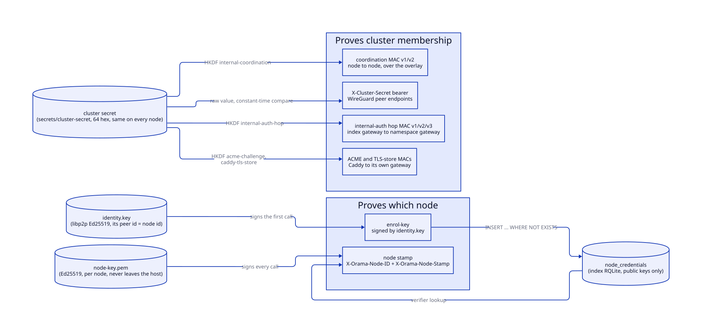
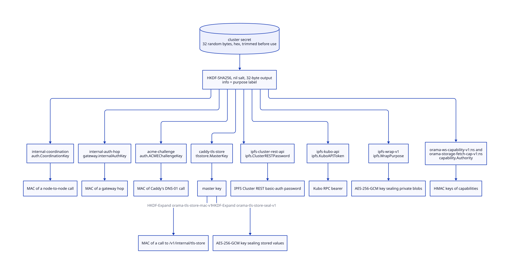
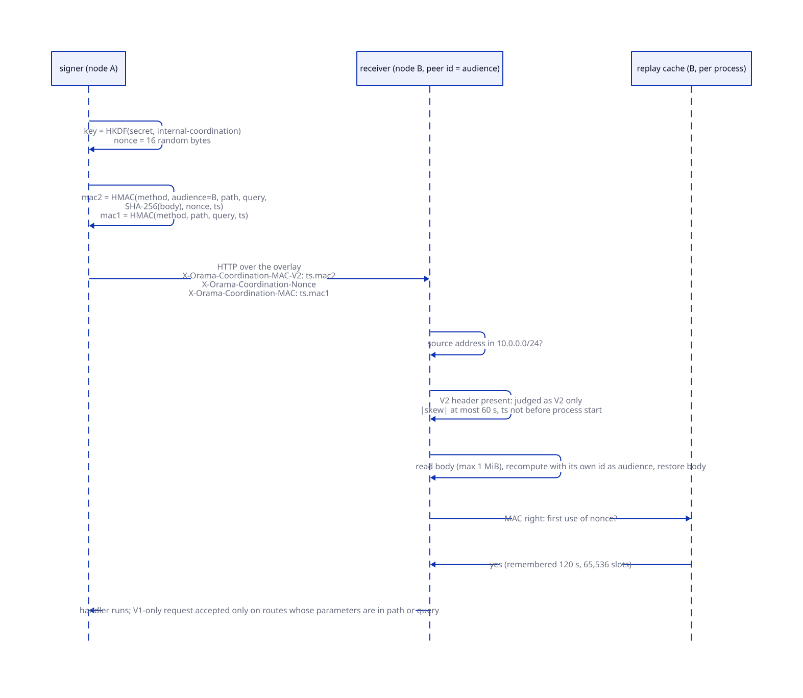
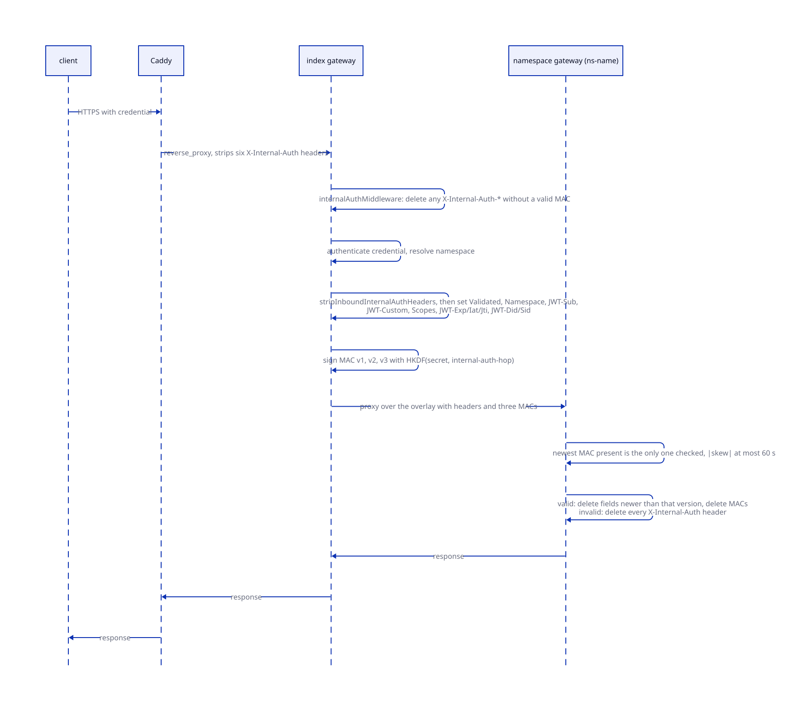
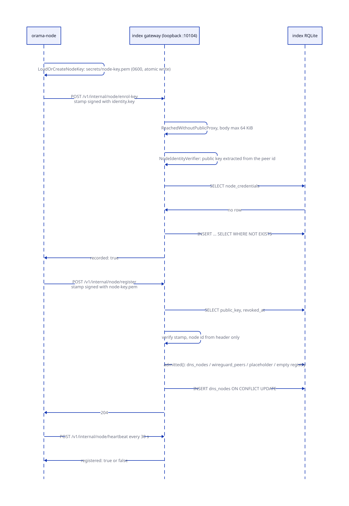
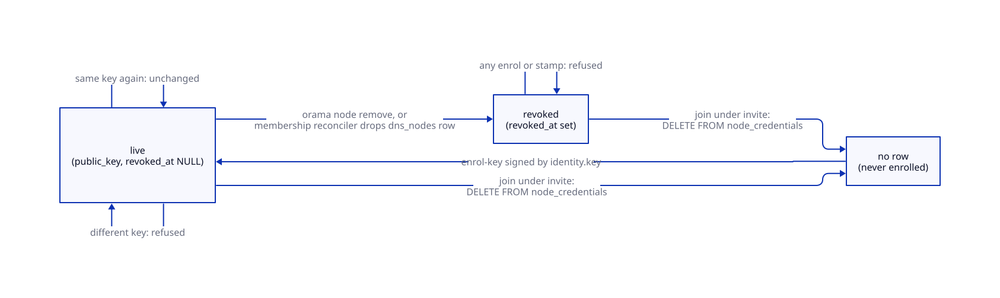
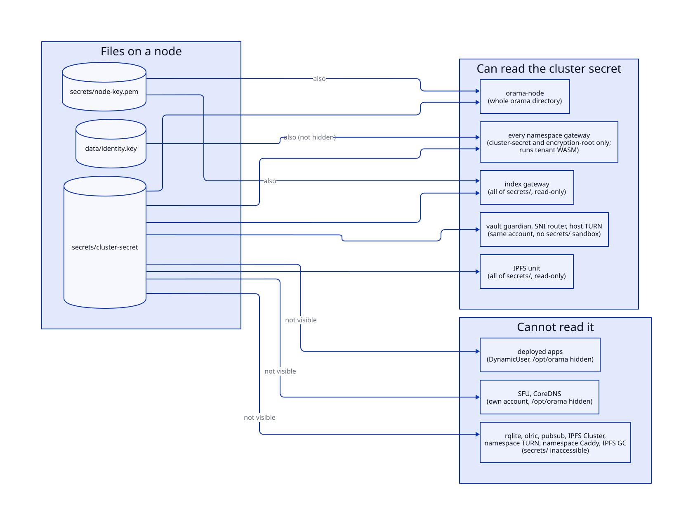

# Inter-node trust

> **At a glance.**
>
> - **What:** how one Orama component proves to another that it belongs to the cluster, and, for the one class of calls where that is not enough, which node it is. Membership is proved with MACs keyed from a single shared value, the cluster secret. Identity is proved with Ed25519 signatures from a key each node generates and never shares. The two never substitute for each other: nothing derived from the cluster secret is accepted where a node must prove which node it is.
> - **Key numbers:** every stamp is valid for 60 s either side of the receiver's clock. Coordination v2 carries a 16-byte nonce, remembers 65,536 nonces for 120 s and reads at most 1 MiB of body. Node-API calls carry at most 64 KiB, run every 30 s per node and time out after 10 s. The cluster secret is 32 random bytes (64 hex characters); every derived key is 32 bytes (HKDF-SHA256, nil salt, the purpose string as info).
> - **Code:** `core/pkg/auth/` (stamps and keys), `core/pkg/nodeapi/`, `core/pkg/gateway/handlers/nodeapi/`, `core/pkg/node/coreapi/`, `core/pkg/gateway/internal_auth_hop.go`, `core/pkg/encryption/`, `core/cmd/identity/`.
> - **Depends on:** [the WireGuard mesh](06-the-wireguard-mesh.md) for the overlay these calls travel on and for the join that hands a node the cluster secret, [cluster state](07-cluster-state.md) for the index RQLite that holds `node_credentials`, [membership and failure detection](08-membership-and-failure-detection.md) for revocation on departure, and [secrets and keys](16-secrets-and-keys.md) for the encryption root, which is a different thing from the cluster secret.



## Why it exists

Every node in a cluster is a peer of every other. They spawn each other's namespace services, evict each other's blobs, read each other's telemetry, record themselves in a registry that DNS and placement route on, and forward authenticated requests to each other's gateways. All of it travels over the WireGuard overlay, and the overlay is not a credential: every namespace's services sit on the same mesh, so any tenant workload that can reach a node's gateway port has an overlay source address. The code says so repeatedly in the comments of `core/pkg/auth/coordination.go`, because the first version of these calls was authenticated by a constant header value plus a source-address check, and both were public.

Two different questions are hidden inside "is this call legitimate".

1. **Does the caller belong to this cluster?** A tenant process on the mesh does not. Any node does. This question is answered by a MAC keyed from the cluster secret, which every node holds because the join hands it over.
2. **Which node is the caller?** The first answer cannot give this. Every node holds the same key, so any node can sign for any other. For most calls that is acceptable: the call carries its own parameters, and a node that is already a Raft member can do worse directly. For one class of call it is not: a node recording itself in the registry that the whole cluster routes traffic on. A compromised node must not be able to register as another node, lock the real one out, or resurrect a retired machine. That question is answered by a per-node Ed25519 key.

The constraints that shaped the result:

- **No new secret distribution.** The join bundle already hands a machine every shared secret the cluster has (`core/pkg/gateway/handlers/join/handler.go:readJoinSecrets`). Adding a per-node private key to it would recreate the problem the key exists to solve, so the node key is generated on the node and only its public half travels.
- **No trust-on-first-use.** A key that the cluster accepts the first time it sees it would let any holder of the cluster secret enrol a key for a node id that has not booted yet. The enrolment is therefore authenticated by something the cluster can check without being told anything in advance: the public key a libp2p peer id carries inside itself.
- **Rolling upgrades.** Nodes of two builds coexist for the length of a rollout, so the MAC formats are versioned and a signer writes every version beside the others.
- **No dependency on the thing being protected.** The checks run in the gateway on every node, with the secret read from a file, so they work while Raft has no leader.

## The model

**Cluster secret.** One value shared by every node of a cluster: 32 random bytes written as 64 hex characters to `<orama>/secrets/cluster-secret` at the first install (`core/pkg/install/config.go:EnsureClusterSecret`), copied to every joining node in the join response. It is also the IPFS Cluster private-network key, so it is a flat fleet-wide value that is never rotated in practice. It is not the encryption root: the root starts as a copy of the cluster secret and is a separate, rotatable input (chapter 16). Which processes can read the file is narrower than "every node" and wider than "the node process"; [who holds the cluster secret](#who-holds-the-cluster-secret) lists them. Every reader trims whitespace before use, because one node's copy with a trailing newline would derive a different key than another's and every call between them would fail with no visible reason (`core/pkg/auth/coordination.go:CoordinationKey`, `core/cmd/gateway/config.go:loadNodeIdentity`).

**Purpose label.** The HKDF `info` string that separates one derived key from another (`core/pkg/secrets/encrypt.go:DeriveKey`). Two labels give unrelated keys, so a MAC made for one purpose never verifies for another.

**Audience.** The libp2p peer id of the node a coordination request is for. The signer names it; the verifier uses its own configured id (`core/pkg/gateway/config.go`, field `NodePeerID`) and never anything in the request.

**Node id.** The node's libp2p peer id, the same identifier `dns_nodes`, `wireguard_peers` and `node_credentials` are keyed on. It is derived from the Ed25519 public key in `<orama>/data/identity.key`. For Ed25519 the peer id embeds the public key itself, which is what makes the enrolment proof possible.

**Node key.** A second Ed25519 key per node, in `<orama>/secrets/node-key.pem`, generated by the node on first use. The cluster records only its public half in `node_credentials`. It signs every node-API call after the first.

**Stamp.** A proof attached to a request in headers. There are four families, all with the same shape (a Unix timestamp, a MAC or signature over a payload that names the method, the path and everything the receiver will act on, a window of 60 s):

| Stamp | Headers | Keyed from | Proves |
|---|---|---|---|
| Coordination v1 / v2 / v3 | `X-Orama-Coordination-MAC`, `-MAC-V2`, `-MAC-V3`, `-Nonce` | `HKDF(secret, "internal-coordination")` | the sender is a cluster member |
| Internal-auth hop v1 / v2 / v3 | `X-Internal-Auth-MAC`, `-MAC-V2`, `-MAC-V3` | `HKDF(secret, "internal-auth-hop")` | the sender is a gateway of this cluster that authenticated the asserted identity |
| ACME / TLS-store | `X-Orama-Coordination-MAC` (ACME, unnonced), `X-Orama-ACME-MAC-V2` and `X-Orama-ACME-Nonce` (ACME, nonced), `-MAC-V2` (store) | `HKDF(secret, "acme-challenge")`, `HKDF(secret, "caddy-tls-store")` | the sender holds a key file that install gave Caddy (`root:orama 0640`, so any process in the `orama` group can read it) |
| Node stamp | `X-Orama-Node-ID`, `X-Orama-Node-Stamp`, `X-Orama-Node-Stamp-V2`, `X-Orama-Node-Nonce` | the node's own Ed25519 key | the sender is this specific node |

**Membership versus identity.** The first three families prove membership. Only the node stamp proves identity. The distinction is the organising idea of this chapter.

## How it works

### Deriving keys from the cluster secret

`secrets.DeriveKey(ikm, purpose)` runs HKDF with SHA-256, a nil salt (legal in RFC 5869 for high-entropy input, and kept so existing ciphertext stays readable), the purpose as `info`, and reads 32 bytes (`core/pkg/secrets/encrypt.go:DeriveKey`). The labels that derive from the cluster secret and carry trust or authentication are these:



| Label | Derived by | Used as |
|---|---|---|
| `internal-coordination` | `core/pkg/auth/coordination.go:CoordinationKey` | MAC key of node-to-node calls |
| `internal-auth-hop` | `core/pkg/gateway/internal_auth_hop.go:internalAuthKey` | MAC key of the gateway-to-gateway hop |
| `acme-challenge` | `core/pkg/auth/acme.go:ACMEChallengeKey` | MAC key of Caddy's DNS-01 present and cleanup calls |
| `caddy-tls-store` | `core/pkg/tlsstore/keys.go:MasterKey` | master key, split by HKDF-Expand into `orama-tls-store-mac-v1` (call MAC) and `orama-tls-store-seal-v1` (value sealing) |
| `ipfs-cluster-rest-api` | `core/pkg/ipfs/cluster_auth.go:ClusterRESTPassword` | basic-auth password of the IPFS Cluster REST API (user `orama`) |
| `ipfs-kubo-api` | `core/pkg/ipfs/kubo_auth.go:KuboAPIToken` | bearer of the Kubo RPC API |
| `ipfs-wrap-v1` | `core/pkg/ipfs/wrap.go:WrapPurpose` | AES-256-GCM key sealing private blobs before they are added to IPFS |
| `orama-ws-capability-v1:<namespace>`, `orama-storage-fetch-cap-v1:<namespace>` and the fetch tag and revoke variants | `core/pkg/gateway/capability/capability.go:keyFor`, `core/pkg/gateway/capability/fetchcap.go` | per-namespace HMAC keys of WebSocket and storage-fetch capabilities |

Three things are deliberately not on this list. The Ed25519 key that signs JWTs used to be `HKDF(secret, "orama-jwt-eddsa-v1")`; every node could compute it and so mint any namespace's tokens, so each gateway now generates its own and the old label survives only to verify tokens minted before the upgrade for one token lifetime (`core/pkg/gateway/signing_key.go:jwtEdDSADerivePurpose`). The SFU control key derives from a namespace's TURN secret, not the cluster secret (`core/pkg/sfu/ctrlauth/ticket.go`). Storage encryption of stored rows uses the encryption root (chapter 16).

Each consumer has its own label by design, and the code comments give the reason in every case: Caddy faces the internet, so the key it holds (`acme-challenge`) must not be the coordination key, which would let a compromised Caddy ask any node to spawn or tear down namespaces; the Kubo bearer and the Cluster password are different values so that one leaked credential does not open the other service.

### Coordination MAC v2

Coordination is a node asking another to do something: spawn or stop a namespace's services, repair a cluster, fetch telemetry or network status, re-encrypt secrets, evict a blob, set up a deployment replica, relay a push message.



**Signing.** `auth.SignCoordination(key, request, now, audience)` (`core/pkg/auth/coordination_v2.go:SignCoordination`) refuses to sign with an empty key or an empty audience: a stamp that names no node would be accepted by any node. It reads the request body once and puts an identical one back, so a request built without `GetBody` is signed over exactly what it sends. It draws a 16-byte nonce from `crypto/rand`, then computes `HMAC-SHA256(key, payload)` over these newline-joined fields:

```text
orama-coordination-v2
METHOD
audience (peer id of the receiving node)
path
raw query
hex(SHA-256(body))
nonce (hex)
unix seconds
```

The result goes in `X-Orama-Coordination-MAC-V2` as `<unix seconds>.<hex mac>`, the nonce in `X-Orama-Coordination-Nonce`. Beside it the signer writes the v1 header `X-Orama-Coordination-MAC`, an HMAC over `orama-coordination-v1`, method, path, query and time only (`core/pkg/auth/coordination.go:coordinationPayload`), so a peer still on the previous build keeps accepting the request.

**Verifying.** `auth.CheckCoordination(key, request, now, audience)` returns the version the request verified under (`core/pkg/auth/coordination_v2.go:CheckCoordination`). The rules:

1. No key on this side, or a missing, malformed, stale or future stamp, is false. The window is 60 s in each direction (`coordinationMaxSkew`).
2. If the v2 header is present the request is judged as v2 and nothing else. A v2 stamp that fails is never retried as v1, because a request whose body was swapped still carries the v1 stamp it was signed with.
3. The verifier's audience comes from its own configuration. A verifier that does not know its own peer id refuses every v2 stamp.
4. The stamp must have been made after this process started (`madeAfterProcessStart`). The nonce cache is per process and empty after a restart, so a stamp made before the start cannot be told from a replay of one the previous process already served. The threshold uses the monotonic clock, so stepping the wall clock backwards neither moves it nor refuses all traffic. The price is that a sender whose clock runs behind the receiver's retries in the first seconds after the receiver restarts.
5. The nonce must be exactly 16 hex-decoded bytes.
6. The body is read (at most `CoordinationMaxBody`, 1 MiB, which is the spawn handler's own cap), hashed, and restored for the handler.
7. The MAC is compared with `hmac.Equal`.
8. Only then is the nonce consumed (`replayCache.firstUse`). The cache keeps 65,536 nonces for 120 s, twice the skew window, and is insertion-ordered. When it is full of unexpired nonces it refuses new ones instead of forgetting old ones: forgetting would turn a flood of valid requests into a way to reopen replay, and only a holder of the cluster secret can produce a valid request. The nonce is consumed after the MAC check so that nothing without the key can fill the cache.

**Which routes demand v2.** A route that changes state, or whose parameters travel in the body, calls `VerifyCoordinationV2`, which is `CheckCoordination` requiring version 2 (`core/pkg/auth/coordination_v2.go:VerifyCoordinationV2`). A route whose every parameter is in the method, path or query accepts v1 as well while `AcceptLegacyCoordinationMAC` is true (it is; see Known gaps).

| Route | Check | Where |
|---|---|---|
| `/v1/internal/namespace/spawn` (every action) | v2 + overlay source + `node_id` must equal this node | `core/pkg/gateway/handlers/namespace/spawn_handler.go` |
| `/v1/internal/namespace/repair` | v2 + overlay source | `core/pkg/gateway/gateway.go:namespaceClusterRepairHandler` |
| `/v1/internal/secrets/reencrypt` | v2 + overlay source; refused when the pushed root is older than the gateway's | `core/pkg/gateway/secrets_rotate.go` |
| `/v1/internal/deployments/replica/*` | v2 + overlay source | `core/pkg/gateway/handlers/deployments/coordination.go` |
| `/v1/internal/push/ntfy/` | v2 + overlay source | `core/pkg/gateway/push_ntfy_internal.go` |
| `/v1/internal/tls-store` | v2 with audience `caddy-tls-store` and the store's own MAC key; loopback only; 404 on a namespace gateway (`isNamespaceGateway`) | `core/pkg/gateway/tls_store_handler.go`, `core/pkg/tlsstore/keys.go:MACAudience` |
| `/v1/internal/telemetry`, network status and detail | v1 or v2 + overlay source | `core/pkg/gateway/telemetry_handlers.go`, `core/pkg/gateway/network_detail_auth.go:authorizeNetworkDetail` |
| `/v1/internal/storage/evict` | v1 or v2 + overlay source (`?cid=` is in the query) | `core/pkg/gateway/handlers/storage/evict_handler.go:isInternalStorageRequest` |

The overlay-source check (`auth.IsWireGuardPeer`, the `10.0.0.0/24` subnet) stays in front of the MAC. It is not the credential; it costs nothing and narrows who can even attempt a forgery (`core/pkg/gateway/coordination.go`).

### Newer stamps, and the legacy floor

**Coordination v3: one process, not just one node.** The v2 audience is a node. The index gateway and every namespace gateway on a node share its peer id but not its nonce cache, so a v2 stamp for a route several of them serve (`/v1/internal/secrets/reencrypt`) could be replayed once to a sibling process inside the 60-second window. The v3 stamp (`X-Orama-Coordination-MAC-V3`, label `orama-coordination-v3`, `core/pkg/auth/coordination_v3.go`) is the v2 payload with the **port** of the process the request is for after the audience. The signer takes the port from the URL it sends to (the scheme's default when the URL names none); the verifier takes it from the local address of the connection the request arrived on (`http.LocalAddrContextKey`), never from the `Host` header, so a replayer cannot choose it. Every coordination caller signs v3 beside v2 and v1 with one nonce, and a verifier that sees a v3 header checks only that: a v3 stamp that fails is never retried as v2. Callers reach the process directly (WireGuard address and port, or loopback for Caddy's TLS store); a hop that rewrites the port would break the match. `orama namespace repair` signs for the audience of its own node's gateway, which it reads from `node.id` in `node.yaml` (install writes the public peer id of the identity key there); it never opens `identity.key`, and a node whose `node.id` is not a peer id is refused with the way out (`orama node upgrade`, whose Phase 4 rewrites `node.yaml`) rather than signed for under a guess.

**Nonced ACME and node stamps.** The ACME stamp (`X-Orama-ACME-MAC-V2`, label `orama-acme-v2`, `auth.SignACME`) covers the method, path, query, the SHA-256 of the body, a random 128-bit nonce in `X-Orama-ACME-Nonce` and the time, under `HKDF(secret, "acme-challenge")`. It is good for one call: the gateway remembers the nonce for two minutes, in a bounded cache filled only by calls whose MAC is right, and refuses a stamp made before the gateway process started, so a captured cleanup cannot be replayed to delete a TXT record mid-challenge. The node stamp likewise has a nonced form (`X-Orama-Node-Stamp-V2` and `X-Orama-Node-Nonce`, label `orama-node-api-v2`) over the same fields and a nonce, remembered for two minutes; an enrolment, which is checked against the key inside the peer id (any machine can produce one for an id it made up), is remembered in a cache of its own so a flood of those cannot fill the one heartbeats use. A request carrying a nonced stamp is checked only against it.

**Rolling upgrade.** Each signer also writes the older stamp (`SignACME` the unnonced coordination MAC, `SignNodeAPI` the previous node stamp, coordination v3 signers v2 and v1), and a gateway accepts a call with only the older one while the matching switch is true: `auth.AcceptLegacyACMEMAC`, `auth.AcceptLegacyNodeStamp`, `auth.AcceptLegacyCoordinationV2` and `auth.AcceptLegacyCoordinationMAC`, each for one release. Caddy and the gateway on a node come from the same archive but are restarted one after the other, so either can be the older. While a switch is set, a captured older stamp can be replayed inside its window (a v2 stamp captured for one gateway process can be replayed once to a sibling process on the same node, and a stamp verified as v3 is not accepted again as v2, because the nonce is shared). Each switch is removed, with its header, in the release after the one that introduces the newer stamp.

**The legacy floor (`auth.LegacyFloor`).** Accepting an older stamp beside the newer one lets anyone who captured a request strip the nonced stamp and the nonce and replay it in the older form. So a verifier accepts the older forms (v1 and v2 coordination, the unnonced ACME and node stamps) only while some node of the cluster may still sign nothing else. Each node reports the stamp level it signs on registering and on every heartbeat (`dns_nodes.stamp_level`; `auth.StampLevelLegacy` 0 is the default and a node that never reported, `auth.StampLevelNonced` 1; a removed node's row is retired). The level is the node's own statement, never inferred from release numbers, which are not comparable across the network's version lines (a 0.122.x build compares as newer than 0.3.1 and signs only the older stamps). The gateways read the levels from the registry, cached for 30 seconds; past that the last answer is served while one goroutine reads again, so a slow registry never holds a request, and only the first call, which has no answer, waits. Each reading that leaves the older forms accepted logs at warn level the ids and levels of the nodes below the nonced level, so an operator can see which node holds the floor open. Once every registered, not retired, node reports the nonced level, the older forms are refused and no longer written. A reported level counts only while it was written together with the node's latest register or heartbeat (`dns_nodes.stamp_level_at` is not older than `last_seen`, both set in one statement by a build that has the field): a build from before the field, as after an auto-update rollback, refreshes `last_seen` with a statement that names neither column, so the node counts as level 0 from its first heartbeat whatever level it last reported, and a heartbeat that carries a lower level replaces the recorded one the same way. One node below the nonced level, one that is down and not removed, or one on a registry gateway too old to record the field keeps the older forms accepted: remove dead nodes. A node can hold the floor down only by what it reports; it cannot lower the protection by reporting a high level. Routes that treat a stamped request as another node's (the network status routes) recognise any stamp generation (`auth.HasCoordinationStamp`), because the v3 stamp alone is what a nonced node writes. If the registry cannot be read the last answer stands, and with none yet the older forms stay accepted and the failure is logged; a process that installs no floor (a CLI, a test) behaves as before. The compile-time `AcceptLegacy*` constants say what the build can accept; the floor says what it does.

After the MAC, the spawn handler still validates every field: the namespace against the naming rules, the node id as a single path component, and for `spawn-rqlite` every address as an IP literal and port and the join verify URL as exactly `http://<ip>:<port>` on one of the join hosts (`core/pkg/gateway/handlers/namespace/spawn_validate.go`). Those values become directories and are substituted into a unit's shell script, so a holder of the cluster secret could otherwise run a command as `orama` on the receiver. Membership authenticates the caller; it does not make the request safe.

### The internal-auth hop

The index gateway authenticates a public request (a JWT, an API key) and, when the request belongs to a tenant namespace, proxies it to a namespace gateway on the overlay. The namespace gateway does not re-authenticate; it believes a set of `X-Internal-Auth-*` headers the index gateway attaches. A request from the internet can carry any header it likes, and every public request reaches the gateway from `127.0.0.1` because Caddy terminates TLS and proxies to localhost, so the source address says nothing. The headers therefore carry a MAC.



**What is asserted.** `X-Internal-Auth-Validated`, `-Namespace`, `-JWT-Sub`, `-JWT-Custom`, `-Scopes` (v1 fields), `-JWT-Exp`, `-JWT-Iat`, `-JWT-Jti` (added by v2, so a namespace gateway can hold a WebSocket to the token that opened it), and `-JWT-Did`, `-JWT-Sid` (added by v3, the device and session the token is bound to) (`core/pkg/gateway/middleware.go:setInternalAuthJWTHeaders`).

**Signing.** `signInternalAuthHeaders` sets all three MACs over the final header values, so it is called last. The payload for version v is `orama-internal-auth-v<v>`, the method, the path of the proxied request (not the inbound one), the v1 fields, every field added by versions up to v in order, and the timestamp (`core/pkg/gateway/internal_auth_hop.go:internalAuthPayload`). The key is `HKDF(secret, "internal-auth-hop")`. A gateway with no cluster secret derives no key; it logs that internal-auth headers will never be trusted and refuses to proxy an authenticated request with 503 rather than forwarding an assertion it cannot back.

**Stripping before asserting.** Before setting the trusted values, the proxy deletes whatever X-Internal-Auth headers the inbound request carried (`core/pkg/gateway/middleware.go:stripInboundInternalAuthHeaders`). Otherwise the header-copy loop would forward a forged `Validated: true` verbatim.

**Verifying.** `internalAuthMiddleware` is the outermost wrapper of `withMiddleware`, so it runs before anything that reads those headers (`core/pkg/gateway/internal_auth_hop.go:internalAuthMiddleware`). `verifyInternalAuthHeaders` finds the newest MAC the request carries (`newestHopVersion`) and judges the request by that one alone, with a 60 s skew window, and with no second chance under an older version. On success it deletes the fields that version does not cover, so a hop from an older index gateway is believed exactly as far as it was signed. On failure it deletes every X-Internal-Auth header (logging a warning if `Validated` was present) and carries on: a forged request is not rejected, it is simply treated as a request with no internal-auth headers and goes on to authenticate normally or be refused for having no credential. In both cases it deletes the MAC headers themselves, so a deployed app or an outbound proxy target never sees them.

**Mixed versions.** A hop that carries only the v1 MAC has no token times. `hopTokenTimes` gives it an expiry of `MaxTokenLifetime` (1 hour) from now and an issue time `RevocationStaleness` (10 s) in the past, so a socket opened through it still ends within the hour and a revocation the index gateway might not have held yet still reaches it (`core/pkg/gateway/internal_auth_hop.go:hopTokenTimes`). Refusing such a hop would have treated every signed-in request proxied by an older index gateway as anonymous for the whole rollout.

**Why accepting an older version costs nothing.** Stripping the newer MAC from a genuine hop requires a position inside the mesh, which is a node, and every node holds the secret all three versions are keyed from. Anyone who could downgrade a hop could sign one outright.

**Caddy as a second layer.** The Caddyfile generator emits `header_up -<name>` for a fixed list of headers in every `reverse_proxy` block (`core/pkg/install/installers/caddy.go:internalAuthHeaders`) so that two independent places must fail before a forged header is believed. The list has six entries (`Validated`, `Namespace`, `JWT-Sub`, `JWT-Custom`, `Scopes`, `MAC`); the v2 and v3 MACs and the five token headers are not in it. That is harmless, because the gateway deletes every X-Internal-Auth header whose MAC does not verify, but the second layer is incomplete (see Known gaps).

### The node stamp

Registering a node in `dns_nodes` is the one place identity matters. The row is a promise: `status = 'active' AND last_seen > ?` is what DNS, namespace placement and storage eviction route real traffic on. A node used to write its own row with the RQLite handle it holds, and nothing checked who made the row. It now asks the index gateway on the same host.



**Wire contract.** `core/pkg/nodeapi/wire.go` holds the three paths and the request and response shapes and imports nothing, so the gateway handler and the node client depend on one definition and the client's tests check agreement with the real handler: `POST /v1/internal/node/register`, `/heartbeat`, `/enrol-key`. `RegisterRequest` carries no node id. Which node a request is about comes from the stamp.

**The stamp.** `auth.SignNodeAPI(signer, request, nodeID, body, now)` sets `X-Orama-Node-ID` and `X-Orama-Node-Stamp: <unix seconds>.<hex signature>`. The signature covers these newline-joined fields (`core/pkg/auth/nodeapi.go:nodeAPIPayload`):

```text
orama-node-api-v1
METHOD
path
raw query
node id
hex(SHA-256(body))
unix seconds
```

The body is covered because the claim is in it (an address, an operator wallet, a public key); a stamp over method and path alone could be lifted onto a body of the attacker's choosing. The node id is covered so a stamp cannot be lifted onto a request about a different node.

**Verifying.** `auth.VerifyNodeAPI(verifierFor, request, body, now)` (`core/pkg/auth/nodeapi.go:VerifyNodeAPI`) returns the node id, an error and a boolean. It is false for every refusal reason (no id, no stamp, malformed stamp, outside 60 s in either direction, nothing that can verify for that node, a signature over a different request) and the caller learns none of them; the answer is a bare 401. The error is separate and is for the gateway log only: it means the question could not be answered, as when the registry cannot be read, so that a database outage does not read in the logs as someone forging stamps. The handler then requires the id to decode as a libp2p peer id, so a malformed one is never stored.

**Two verifiers, one rule each.** `Credentials.VerifierFor` answers for every call except enrolment: a node with a live row in `node_credentials` is verified against that key and nothing else, and a node with no live row (never enrolled, or revoked) is verified against nothing at all (`core/pkg/gateway/handlers/nodeapi/credentials.go:VerifierFor`). There is no fallback between the cases. Nothing derived from the cluster secret is accepted, so a machine holding every shared secret the cluster has still cannot speak as a node it is not. `auth.NodeIdentityVerifier` answers for enrolment only (below).

**Enrolment without trust-on-first-use.** At every start the node builds its core-API client lazily (`core/pkg/node/core_api.go:coreAPIClient`): it loads or creates `node-key.pem` (`core/pkg/auth/nodekey.go:LoadOrCreateNodeKey`), builds the client with the key and its libp2p private key, and calls `EnrolKey` before anything else. The enrol call is signed with the libp2p identity (`auth.NodeIdentitySigner`) and the gateway verifies it with `NodeIdentityVerifier`, which decodes the claimed node id as a peer id and extracts the public key from it (`core/pkg/auth/nodeapi.go:NodeIdentityVerifier`). An id from which no key can be extracted (an older hashed identity) is refused, because treating it as verified would make the check optional for anyone able to produce one. The consequence: the only machine that can enrol a key for node X is the one holding X's libp2p identity. Without this, a compromised node could enrol its own key for a node id that has not booted yet, sign as that node from then on, and lock the real machine out permanently, because re-keying is refused.

`Credentials.Enrol` (`core/pkg/gateway/handlers/nodeapi/credentials.go:Enrol`) then applies four rules:

- the key must parse as a base64 32-byte Ed25519 public key;
- a revoked node gets nothing ("this node was retired; re-admitting it is an operator action");
- a live node presenting a different key is refused: the cluster cannot tell a rotation from a takeover, so it refuses both;
- the same key again is `unchanged`, which is the normal answer, since a node re-asserts its key on every start.

The insert is `INSERT ... SELECT ... WHERE NOT EXISTS`, not an upsert. An upsert would be the takeover the check refuses, written in SQL, and the table is replicated, so the read above the insert is not a lock; the conditional insert settles a race and a caller whose insert affected zero rows is told it did not establish the key. Enrolment failures are audited (`node.key.enrol`); a first enrolment is audited as a success; an unchanged re-assertion is not.

**Re-enrolment.** If the cluster answers 401 to a node's own-key call, the client enrols again and retries once (`core/pkg/node/coreapi/client.go:post`). The row can vanish under a running node: a registry restored from a backup taken before the node enrolled, an operator clearing it. Without this the node would be refused every 30 s forever and reaped out of DNS. It is safe because enrolment needs the libp2p identity. It retries once so that a cluster refusing for any other reason surfaces that refusal.

**Admission.** A key proves who holds it, not that the cluster let that node in. Without a further check, a caller that reached the endpoints could invent a libp2p identity, enrol a key for it and register a `dns_nodes` row, entering placement and DNS as a node nobody admitted. `admitted` (`core/pkg/gateway/handlers/nodeapi/admission.go:admitted`) refuses registration with 403 and an audit line unless one of these holds:

1. the node is in `dns_nodes` and not retired, meaning its `last_seen` is not the sentinel `1970-01-01 00:00:00` that `orama node remove` writes (`core/pkg/constants/node_retirement.go:RetiredNodeLastSeen`); this covers every existing node, a restart and a rolling upgrade;
2. a `wireguard_peers` row exists under its id, which only the join under an operator-minted invite or the OramaOS enrolment under a token create for a new node;
3. for an OramaOS node, enrolled before it had a libp2p identity: its peer row exists at the overlay address it claims under the placeholder id `node-<overlay address>` (`core/pkg/overlay/alloc.go:PlaceholderNodeID`), the request's source is that address (the sender's over the mesh, this host's on loopback, resolved by `sourceOverlayIP`), and no other live node holds the address;
4. the registry is empty: the genesis node, which nothing can have admitted.

A registry that cannot be read refuses with 503, and the node retries. Enrolment itself is not gated by admission: it records only that a holder of a libp2p identity holds a node key, which nothing routes on.

**Validation at the boundary.** Registration validates the claim where it lands (`core/pkg/gateway/handlers/nodeapi/handler.go:validate`): both addresses must parse and be neither loopback, unspecified nor multicast (a node that could not work out its own address once invented `127.0.0.1` and was then handed out as active); `region` is required; `ssh_user` must match `^[a-z_][a-z0-9_-]{0,31}$`, because the operator CLI concatenates it into `<user>@<host>` for ssh(1) and a leading `-` is an option (`-oProxyCommand=` would run a command on the operator's machine, which holds the RootWallet and the fleet's SSH keys); `region`, `environment` and `operator_wallet` are at most 256 characters with no newline, carriage return or NUL. `internal_ip` must equal the overlay address the cluster allocated this node in `wireguard_peers` (`overlayAddressAgrees`), since every other node dials that address for Raft, namespace membership and eviction; a node with no peer row yet is not checked against anything. `role` and the heartbeat's `role` and `environment` are not validated (see Known gaps). The first node to register in an empty cluster has its wallet recorded as the first operator, and only that: the SQL requires that this node stored a wallet, the operator list is empty and `dns_nodes` has exactly one row (`recordOperatorSQL`).

**Reachability filter.** Caddy reverse-proxies every path of a node's domains to the gateway on loopback, so without a check these endpoints would be reachable from the internet. `ReachedWithoutPublicProxy` accepts a WireGuard-peer source, or a loopback source with no `X-Forwarded-For`, and the handler answers 404 otherwise, before the method check, so the route's existence is not confirmed (`core/pkg/auth/internal_auth.go:ReachedWithoutPublicProxy`). The comment on the function is explicit that this authenticates nothing: every process on the host passes it, a tenant deployment included. The stamp is the credential.

**Heartbeat.** Every 30 s the node posts a heartbeat carrying its installed role and environment (`core/pkg/node/dns_registration.go:startDNSHeartbeat`). The handler re-asserts `status = 'active'` and refreshes `last_seen`, which heals a node reaped to `inactive` in a restart window. It answers `registered: false` when no row matched, and the node then registers. A driver that cannot report the affected count is treated as not registered. Heartbeats are not audited: tens of thousands of replicated rows a day would only say a live node is live, and `dns_nodes.last_seen` answers that question.

### Revocation and re-admission



A credential row has three states: absent, live and revoked.

- **Revoke, never delete.** Departure writes `revoked_at` on the row. The membership reconciler revokes before it drops the node's `dns_nodes` row, in the same loop, so a crash between the two leaves the safe half done (`core/pkg/node/membership/reconciler.go`). `orama node remove` revokes through its retirement plan (`core/cmd/orama/internal/production/clusterops/retire.go:RetirementPlan`). Deleting would send the machine back to the not-yet-enrolled path, from which its own identity could register it again. A revoked row verifies nothing and accepts no enrolment, so a retired machine's disk stops being a credential at once, not at the next cluster secret rotation (which never happens).
- **Re-admission is the join.** A rebuilt machine, or one that lost `node-key.pem` while keeping `identity.key`, would otherwise be locked out for good. `/v1/internal/join` deletes any recorded credential for the joining peer id (`core/pkg/gateway/handlers/join/handler.go:forgetNodeCredential`) and treats a failure as fatal, so the node does not come up unable to register with nothing at the join to say why. Re-admission therefore needs an operator-minted single-use invite and the machine's own libp2p identity: see [the join handler](06-the-wireguard-mesh.md#the-join-handler).

### Key files on the node

`node-key.pem` is PKCS#8 PEM, created with `O_EXCL` under a pid-suffixed temporary name, synced, renamed and the directory synced, so the file is either absent or complete (`core/pkg/auth/nodekey.go:writeNodeKey`). A half-written key would be worse than none: the next start would fail to parse it and refuse to re-key, correctly, since a silent re-key would be refused by the cluster. A file that exists and cannot be read or parsed is an error, never a reason to generate a second key. `LoadOrCreateNodeKey` also refuses a file with any group or other permission bit (`refuseIfReadable`), because restoring from a backup or an unpacking deploy can leave a readable copy, and the file is the node's identity. The path is `NodeKeyPath(oramaDir)`, `<orama>/secrets/node-key.pem`, mode `0600`.

### The libp2p identity

`core/pkg/encryption/identity.go` is misnamed: it is not encryption, it is the libp2p identity generator. `GenerateIdentity` makes an Ed25519 key pair (the 2048 argument is ignored for Ed25519), `SaveIdentity` writes the marshalled private key at mode `0600` in a `0700` directory, `LoadIdentity` reads it back and derives the peer id. The same package serves the node, the SDK client, the pubsub tool and the gateway (`core/pkg/client/client.go`, `core/cmd/gateway/config.go:nodePeerID`).

The installer creates the node's identity once, at `<orama>/data/identity.key` (`core/pkg/install/config.go:EnsureNodeIdentity`), and refuses to replace one that does not parse: the peer id keys this machine in every cluster record, so a new one would orphan all of it. `core/cmd/identity/main.go` is a thin command over the same package (`-output` writes a key, `-display-only` prints a peer id). It is built and shipped to `/usr/local/bin/identity` (`core/pkg/install/prebuilt.go`), but nothing in the repository calls it; node setup does not shell out to it.

`core/pkg/node/libp2p.go:loadOrCreateIdentity`, which the running node uses, is more permissive than the installer (see Known gaps): it generates and saves a new key whenever the file cannot be loaded, for any reason.

The identity does three jobs: it is the libp2p transport identity, its peer id is the node id in every table, and, through the key the id embeds, it is the root of the enrolment proof. Its gateway-side consumer, `loadNodeIdentity`, derives the audience (`NodePeerID`) every coordination verifier uses from it, which is why the gateway YAML carries `cluster_secret_path`: the secret path locates both the secret and the identity file next to it.

## State it owns

| State | Holds | Written by | Read by | Where |
|---|---|---|---|---|
| `secrets/cluster-secret` | the cluster secret, 64 hex characters, mode `0600` | install (genesis), join response | every gateway, every CLI that signs, the node | `<orama>/secrets/` |
| `secrets/node-key.pem` | this node's Ed25519 private key, mode `0600` | `LoadOrCreateNodeKey` on first use | the core-API client | `<orama>/secrets/` |
| `data/identity.key` | libp2p private key; its peer id is the node id | `EnsureNodeIdentity`, `encryption.SaveIdentity` | libp2p host, gateway config loader | `<orama>/data/` |
| `node_credentials` | `node_id`, `public_key` (base64 of 32 bytes), `enrolled_at`, `revoked_at` | `Credentials.Enrol`; revoked by the reconciler and `orama node remove`; deleted by the join | every gateway's `VerifierFor` | index RQLite, `core/migrations/055_node_credentials.sql` |
| replay cache | up to 65,536 nonces for 120 s | `CheckCoordination` | the same | memory of each gateway process |
| `coordinationProcessStart` | process start, monotonic | package init | `madeAfterProcessStart` | memory |
| audit rows `node.register`, `node.key.enrol` | actor, result, metadata | the node-API handler | operators | the registry audit log |
| `dns_nodes`, `wireguard_peers`, `operators` | the registry rows the handler writes or reads for admission | node-API handler, join | placement, DNS, the CLI | index RQLite |

The placement of `node_credentials` is declared in `core/pkg/rqlite/schema_placement.go` as a cluster-plane platform table, and `core/pkg/sqlguard/sqlguard.go` lists it as protected, so a tenant's SQL cannot name it.

## Lifecycle

**Genesis.** The first node generates the cluster secret and its libp2p identity at install. When its gateway is up, the node builds the core-API client, generates `node-key.pem`, enrols it, and registers. The registry is empty, so admission passes, and its operator wallet becomes the first operator.

**Join.** The join response carries the cluster secret and the other shared secrets. The join handler deletes any stale credential for the peer id and writes the peer row. The new node starts, enrols (identity-signed), registers (admitted by the peer row) and heartbeats.

**Normal operation.** Every 30 s each node heartbeats through its own local index gateway: a `SELECT` on `node_credentials` and an `UPDATE` on `dns_nodes`. Coordination, hop and Caddy calls carry fresh stamps each time; none of them is cached.

**Restart.** The node re-asserts its key (answer `unchanged`). The coordination replay cache is empty, so stamps made before the new process started are refused for the first seconds. The client calls the index gateway on loopback (`constants.LocalGatewayURL`, port 10104), and the node's DNS registration already waits for that gateway, so this adds no boot ordering. During a rolling upgrade one node can come up new against a gateway still running old code; its calls answer 404 until the gateway is bounced, and the 30 s heartbeat recovers it (package comment of `core/pkg/node/coreapi/client.go`).

**Rolling upgrade (mixed versions).** A signer writes every version of the coordination and hop MACs, so an older receiver verifies the one it knows. A newer receiver judges a hop by the newest MAC present and strips what that version does not cover. State-changing coordination routes require v2, so an old signer that sends v1 only is refused there for the length of the window, which the rollout order has to respect. While the fleet is mixed, a not-yet-upgraded node's spawn request, replica setup, update, rollback, teardown and env call, and secrets re-encrypt fan-out to an upgraded node are refused `401` or `403`, and so are an upgraded node's to a node still on the previous build that knows neither the audience nor the stamped replica routes. Namespace and deployment create and delete (and `orama maint operator rotate-secrets`) are paused during a rolling upgrade, and after the last node is upgraded `namespace_pending_cleanup` is checked for draining (a teardown refused meanwhile is recorded there and replayed by the tenant reconciler).

**Node loss.** A silent node stops heartbeating; after 120 s any node's reaper marks it `inactive` (`core/pkg/node/dns_registration.go:cleanupStaleNodeRecords`). Its credential stays live until the membership reconciler decides the machine is gone: the node has a Raft eviction tombstone, is absent from discovery, has not been seen for 30 minutes, and the tombstone is at least 6 hours old (`core/pkg/node/membership/plan.go:TombstoneGrace`; chapter 8). Only then is the credential revoked and the `dns_nodes` row dropped. A node that is silent without having been evicted keeps a live credential indefinitely.

**Retirement.** `orama node remove` revokes the key in the same plan that clears DNS, nameserver, namespace and port rows.

## Failure modes

| Trigger | What the system does | What you observe |
|---|---|---|
| Clock skew over 60 s between two nodes | Every stamp between them is refused in both directions | coordination calls fail with 401; spawn and repair stall; hop MAC mismatch makes a namespace gateway treat signed-in requests as anonymous |
| Cluster secret copy differs on one node (trailing newline, wrong file) | All derived keys differ; every MAC from or to the node fails; the secret is trimmed everywhere to prevent the newline case | the node's calls fail verification with no specific reason in the response |
| Peer id of the receiver unknown (no `NodePeerID`) | v2 stamps are refused outright | repair, spawn and re-encrypt answer 401 |
| Receiver restarts | Replay cache empty; stamps made before the new start are refused | a sender with a lagging clock retries for a few seconds |
| Replay cache full of live nonces | New nonces are refused | v2 calls fail until entries expire (120 s); needs 65,536 valid requests in two minutes |
| Replay of a v2 stamp | Second use of the nonce is refused; a different audience or body fails the MAC | 401 |
| Body swapped on a captured request | v2 fails and is not retried as v1; on a v1-accepting route the v1 stamp covers no body | 401 on state-changing routes |
| `node-key.pem` mode wider than `0600` | `LoadOrCreateNodeKey` errors; the core-API client is not built; the boot supervisor retries | node never registers; reaped to `inactive` after 120 s |
| `node-key.pem` lost, identity kept | New key is refused (different key for a live node) | enrol answers 400 with "different key on record"; recovery is a join under a fresh invite |
| Row missing under a running node | 401 on the next call; the client re-enrols once and retries | brief refusals, then recovery |
| Node never admitted tries to register | 403 and an audit line `node.register` failure | `errNotAdmitted` text names the invite requirement |
| Registry unreadable during verify or admission | Verify fails (401, logged as an error, not a forgery warning); admission answers 503 | the node retries on its 30 s cycle |
| Gateway without the credential store | 503 "cannot authenticate a node" instead of serving unauthenticated | registration unavailable |
| Revoked node tries to enrol or sign | refused | 401 on stamps, 400 on enrol |
| Forged `X-Internal-Auth-*` from the internet | headers deleted in the middleware; the request authenticates normally or is refused | no effect; a warning line when `Validated` was present |
| Index gateway without a cluster secret | no hop key; refuses to proxy authenticated requests | 503 on namespace requests |
| `identity.key` unparseable or unreadable at node start | `loadOrCreateIdentity` generates and saves a new key without logging (Known gaps) | new peer id; registration answers 403 and the node is reaped to `inactive` after 120 s |
| Disk full | `writeNodeKey` fails on write or sync before the rename | the old state stays intact; the node does not register |

## Trust and security

### Who holds the cluster secret

The cluster secret is the root of every membership credential, so what matters is which processes can read `secrets/cluster-secret`. Namespace (tenant) gateways are among them. The sandbox of each unit decides:



| Process | Account | What it sees of `secrets/` | Source |
|---|---|---|---|
| `orama-node` | `orama` | everything: `ReadWritePaths` is the orama directory | `core/pkg/install/services.go:GenerateNodeService` |
| index gateway (`orama-namespace-gateway@index`) | `orama` | all of `secrets/`, read-only, including `node-key.pem` | `core/pkg/install/gateway_unit.go:IndexGatewayDropIn` |
| every namespace gateway (`orama-namespace-gateway@<ns>`) | `orama` | an empty tmpfs with `cluster-secret` and the `encryption-root` files bound in; `node-key.pem` is not visible. `data/identity.key` is readable (read-only filesystem, not hidden) | `core/systemd/orama-namespace-gateway@.service` |
| IPFS unit | `orama` | all of `secrets/`, read-only | `core/systemd/orama-namespace-ipfs@.service` |
| vault guardian, SNI router, host TURN | `orama` | no `secrets/` sandbox beyond `ProtectSystem=strict`, so the `0600` files owned by `orama` are readable | `core/systemd/orama-namespace-vault@.service` |
| rqlite, Olric, pubsub, IPFS Cluster, namespace TURN, namespace Caddy, IPFS GC | `orama` | `secrets/` is inaccessible | the same unit files |
| SFU, CoreDNS | their own accounts | `/opt/orama` is hidden | `core/pkg/systemd/isolation.go:isolatedServices` |
| deployed apps | a dynamic user each | `/opt/orama` is hidden except the app's own tree; outbound traffic to `10.0.0.0/8` is denied where the kernel enforces it | `core/systemd/orama-deploy-node@.service` |

A namespace gateway needs the secret to verify hop MACs and coordination stamps and to derive the capability keys of its own namespace, so it cannot be hidden from it. The gateway is also the process that runs a tenant's WASM functions and answers tenant HTTP, so a compromise of it (a bug in the host functions, a WASM escape, an SSRF or file-read in a handler) yields the secret. [Privilege and filesystem trust](05-privilege-and-filesystem-trust.md#per-service-accounts) adds that processes sharing the `orama` uid can read each other's `/proc/<pid>/environ` and `/proc/<pid>/root`, so the sandboxes above narrow the files a unit opens, not what a same-uid process can reach through `/proc`; the document lists that isolation as not finished.

What the secret allows, from the code in this chapter:

- Sign coordination stamps (v1 and v2, any audience): spawn, stop and tear down any namespace's services on any node, repair a namespace, relay a push message, evict a blob, set up or tear down a deployment replica, push a re-encrypt (`CheckSuccessor` refuses a root older than the gateway's), read telemetry and network status.
- Sign hop MACs: assert any namespace, JWT subject, scope set, device and session to any namespace gateway. The key is the same for every namespace. A namespace gateway refuses a hop whose asserted namespace is not its own (`CodeNamespaceMismatch` in `core/pkg/gateway/middleware.go`), but that compares the asserted value with the receiver's, and a forger asserts the receiver's, so one namespace's gateway can speak as the index gateway to another's.
- Derive the ACME, TLS-store, IPFS Cluster, Kubo, blob-wrapping and per-namespace capability keys (the table under [deriving keys](#deriving-keys-from-the-cluster-secret)). The TLS-store seal key decrypts the stored certificates.
- With the `encryption-root` files bound beside it, decrypt every stored secret of every namespace (chapter 16).

What it does not allow: signing a node stamp (needs a node's Ed25519 key, and a namespace gateway cannot read `node-key.pem`), enrolling a key for a node that already has a live row, and minting a JWT (each gateway signs with its own key).

**Positions.**

| Attacker holds | Can | Cannot |
|---|---|---|
| Internet access only | reach any route through Caddy | reach node-API routes (404 on the reachability filter); forge hop headers (deleted by Caddy for six names, then by the gateway); produce any MAC |
| A deployed app on a node (loopback; no overlay source where `IPAddressDeny` is enforced) | pass the reachability filter on loopback | produce a coordination, hop or node stamp: it cannot see `secrets/` (see [privilege and filesystem trust](05-privilege-and-filesystem-trust.md)); enrol a key (needs the libp2p identity, which it cannot read) |
| Code execution in a namespace gateway (a tenant's gateway, which runs tenant WASM) | everything in the next row, from an overlay source address, plus read the node's libp2p `identity.key` | register or heartbeat as its node (`node-key.pem` is not visible to it); replace a live node's key |
| The cluster secret (any node's disk, or any node) | sign coordination and hop MACs for any audience and namespace; spawn, stop and tear down namespaces on any node; read telemetry; forge hops and so assert any identity to a namespace gateway | register or heartbeat as another node (nothing derived from the secret is accepted); enrol a key for a node that has not booted (needs that node's libp2p identity) |
| One node's `node-key.pem` | speak as that node until it is revoked | speak as another node |
| One node's `identity.key` and the cluster secret | re-enrol only if the node has no live row (never enrolled or after a join clears it) | replace a live node's key |
| An operator (invite minting, `orama node remove`) | admit a machine, revoke a node | |

**What each mechanism proves and does not.** Coordination and hop MACs prove membership, not which node signed. Every node holds the key, so any node can sign for any other, can sign a hop asserting any namespace and any JWT subject, and can sign a spawn for any peer. This is a stated property, not an oversight: the node-principal work covered only the self-registration path. The audience closes one hole inside it: a stamp captured for node B does not verify at node C. The node stamp proves identity but covers only the three node-API calls. Because namespace gateways hold the cluster secret, "a node" in this paragraph includes every tenant's gateway process on every node.

**What stamps do not cover.** The hop MAC covers method, path and the asserted fields. It does not cover the query string or the body, and it has no nonce or audience, so a stamp captured inside its 60 s window can be replayed onto the same method and path, with any query and body, at any gateway of the namespace. The node stamp has no nonce either; the requests it can replay are the same register or heartbeat, which are idempotent. The ACME stamp covers method, path, query and body but has no nonce and no audience, so a captured present or cleanup call replays inside its window. v1 coordination stamps, on the routes that still accept them, carry no audience and no nonce. Capturing a stamp needs a position on the loopback or on the path between two gateways: the overlay is encrypted by WireGuard, loopback capture needs `CAP_NET_RAW`, which no unit file grants (the ambient capabilities are `CAP_NET_BIND_SERVICE` and, for `orama-node`, `CAP_NET_ADMIN`), and the hop MACs are deleted from the request before a deployed app or an outbound proxy target can see it. A holder of the cluster secret needs no capture for coordination or hop stamps, and the node and ACME replays have idempotent effects.

**Key hygiene.** All comparison is by `hmac.Equal` or `subtle.ConstantTimeCompare`. Error responses on node-API verification are one 401 for every cause. Stamps are checked before any state is read except the credential lookup. The unreadable-credential case is an error, never "no credential".

**Cross-plane writes remain.** A node is a member of the core Raft cluster and holds the RQLite credentials, so it can still write registry rows directly, and one still does: the reaper runs on every node every 30 s, marks other nodes `inactive` and deletes their system DNS A records, and a purge deletes the per-namespace A records of nodes silent for 15 minutes (`core/pkg/node/dns_registration.go:purgeInactiveNodeRecords`). The node-API endpoint is where a node's claim about itself is checked, not a wall around the table. Confining a node to its own rows needs it to stop being a member of the cluster that holds them, a topology change.

## Limits and scale

| Limit | Value | Anchor |
|---|---|---|
| Stamp window | 60 s either side | `coordinationMaxSkew`, `internalAuthMaxSkew`, `nodeAPIMaxSkew` |
| Replay cache | 65,536 nonces, 120 s | `core/pkg/auth/coordination_v2.go:coordinationReplayCapacity` |
| Coordination body read | 1 MiB | `CoordinationMaxBody` |
| Node-API body | 64 KiB | `core/pkg/gateway/handlers/nodeapi/handler.go:maxBodyBytes` |
| Node-API free-text field | 256 characters | `maxFieldLength` |
| Core-API client timeout | 10 s | `core/pkg/node/coreapi/client.go:requestTimeout` |
| Heartbeat period | 30 s | `core/pkg/node/dns_registration.go:startDNSHeartbeat` |
| Reap threshold | 120 s without heartbeat | `cleanupStaleNodeRecords` |
| Hop token fallback | 1 h expiry, issue time 10 s back | `hopTokenTimes` |

At ten times the fleet, stamp verification is local CPU (an HMAC or an Ed25519 verify) and does not grow. The first bottleneck is the registry write path: each node's heartbeat is one `SELECT` plus one replicated `UPDATE`, so N nodes produce N/30 Raft writes per second from heartbeats alone, and every node's reaper reads and may write over all of `dns_nodes` every 30 s. The replay cache is per process and sized above a fleet's coordination rate by orders of magnitude, since coordination is a handful of calls per namespace operation; it is not a limit until a single gateway receives thousands of v2 requests in two minutes, for example a mass re-encrypt fan-out. The fleet-wide cluster secret does not scale in the security sense: one disk gives the membership credential for every node, and its rotation is a maintenance window, not an operation the platform performs.

## Design decisions

### Two credentials, not one

*Chosen:* a shared-secret MAC for membership and a per-node Ed25519 key for identity, never substituted. *Rejected:* per-node keys on every internal route, and the shared secret on every route. *Why:* the shared secret proves membership cheaply on every route but cannot say which node signed; the migration comment (`core/migrations/055_node_credentials.sql`) names the cost on the registry path: a decommissioned node's disk stays a working credential for the whole fleet until the secret is rotated, which in practice does not happen. Per-node keys are applied where a forged identity does the most damage, the self-registration path, and not where every holder of the secret could already act directly.

### Enrolment proved by the peer id

*Chosen:* the enrol call is signed with the libp2p identity and verified against the key inside the peer id. *Rejected:* trust-on-first-use, and a token handed out at join. *Why:* a first-use window lets a compromised node pre-empt a node that has not booted; a join token needs the cluster to hold something that can be replayed. The peer id already carries a public key only the real machine can sign with.

### No fallback to the secret

*Chosen:* a node with no live key is verified against nothing. *Rejected:* fall back to the cluster-secret MAC for nodes that have not enrolled. *Why:* the fallback is exactly what would let a compromised node speak for another, and for a retired node it would make revocation meaningless (`core/pkg/gateway/handlers/nodeapi/credentials.go:Credentials`).

### Revoke instead of delete

*Chosen:* `revoked_at` tombstone, cleared only by an invite-authorised join. *Rejected:* deleting the row on departure. *Why:* deletion returns the machine to the not-yet-enrolled path, from which its own identity could register it again.

### Audience and body in the coordination MAC

*Chosen:* v2 covers the receiving node's peer id, the body hash and a nonce. *Rejected:* keeping method, path, query and time. *Why:* the spawn endpoint carries its action in the body, so every spawn request had the same v1 MAC input and a captured `stop` stamp could be replayed with a `teardown` body for another namespace.

### Versioned hop MACs judged by the newest

*Chosen:* each hop version adds fields; the signer writes all; the verifier trusts only the newest present and deletes uncovered fields. *Rejected:* one MAC that changes with every new field, and refusing hops from old index gateways. *Why:* a single format would break a rolling upgrade, and refusing would make every signed-in request from an old index gateway anonymous for its length.

### One label per consumer

*Chosen:* a separate HKDF label for each use, and a separate Caddy key. *Rejected:* one key for all internal HMACs. *Why:* Caddy terminates the internet's TLS; the key it holds must authorise one thing.

## Known gaps

- **The v1 coordination MAC is accepted.** `AcceptLegacyCoordinationMAC` is `true` (`core/pkg/auth/coordination_v2.go:AcceptLegacyCoordinationMAC`), although its comment says it is removed in the release after the one that introduced v2. Telemetry, network status and detail, and storage evict accept a stamp with no audience and no nonce, replayable at any node within 60 s, and anyone able to modify a request in flight can strip the v2 header to downgrade it on those routes. The routes are read-only or idempotent (an evict names its CID in the query, which v1 covers), and anyone positioned to capture the stamp on the encrypted overlay already holds the secret, so the consequence is a weaker guarantee rather than a known exploit.
- **A corrupt, unreadable or missing libp2p identity is silently replaced at node start.** `core/pkg/node/libp2p.go:loadOrCreateIdentity` calls `encryption.LoadIdentity` only when `os.Stat` succeeds, discards its error, and on any failure (unparseable file, permission error) or a missing file falls through to `GenerateIdentity` and `SaveIdentity`, which overwrites `identity.key`. It logs nothing. `core/pkg/install/config.go:EnsureNodeIdentity`, `core/cmd/gateway/config.go:nodePeerID` and `core/pkg/node/utils.go:readNodePeerID` all refuse the same situation. The effect is a new peer id for the machine: the new id has no `dns_nodes` or `wireguard_peers` row and the registry is not empty, so `admitted` answers 403 to its registration, while its enrolment succeeds and leaves an orphan `node_credentials` row. The node never registers, the reaper marks its old id `inactive`, and recovery is a join under a fresh invite. `core/pkg/node/node_test.go:TestLoadOrCreateIdentity` covers creation and persistence only.
- **Caddy strips only six of the hop headers, and this is not exploitable.** `core/pkg/install/installers/caddy.go:internalAuthHeaders` lists `Validated`, `Namespace`, `JWT-Sub`, `JWT-Custom`, `Scopes` and `MAC`. The v2 and v3 MACs and the `JWT-Exp`, `-Iat`, `-Jti`, `-Did` and `-Sid` headers reach the gateway from the internet. The gateway judges a request by the newest MAC it carries, so a forged v2 or v3 MAC fails verification, and `internalAuthMiddleware` then deletes every X-Internal-Auth header including the token fields (`core/pkg/gateway/internal_auth_hop.go:internalAuthMiddleware`); the proxy hop strips and re-sets them again (`stripInboundInternalAuthHeaders`). A tenant gateway verifies the same way, so a forged header cannot reach it as an assertion. What is lost is the defence in depth the comment on the list promises: a gateway bug that trusted a header before the middleware ran would not be caught by Caddy for the later fields.
- **The hop MAC and the node stamp are replayable inside their window.** Neither carries a nonce; the hop MAC also has no audience and covers neither the body nor the query string (`core/pkg/gateway/internal_auth_hop.go:internalAuthPayload`), and the ACME stamp has no nonce or audience (`core/pkg/auth/acme.go:acmePayload`). Exploitation needs a copy of a stamp, which travels over loopback or the encrypted overlay and is deleted before reaching a deployed app, so it needs a position that already holds the cluster secret or the host.
- **Namespace gateways hold the cluster secret.** The gateway of every tenant namespace reads `secrets/cluster-secret` (`core/systemd/orama-namespace-gateway@.service`), and so can derive the coordination and hop keys, spawn or tear down any namespace, and assert any identity to any namespace gateway ([who holds the cluster secret](#who-holds-the-cluster-secret)). A flaw that gives code execution in one tenant's gateway is cluster-wide. Per-namespace hop keys, or a hop credential that names its signer, are the structural fix; neither exists.
- **Membership credentials are fleet-wide and effectively never rotated.** The cluster secret is also the IPFS Cluster private-network key and the WireGuard peer bearer. Rotating it is a maintenance window the platform does not automate.
- **Nodes can write registry rows directly.** The reaper (`core/pkg/node/dns_registration.go:cleanupStaleNodeRecords`) runs on every node and marks other nodes inactive, a more powerful write than self-registration. The node-API check does not constrain it.
- **Role and environment are not validated.** `validate` in `core/pkg/gateway/handlers/nodeapi/handler.go` checks region, environment, operator wallet and `ssh_user` but not `role`, and `HandleHeartbeat` writes the heartbeat's `role` and `environment` with no length or character check beyond the 64 KiB body cap. A node can only change its own row, so the damage is a malformed value in its own role column.
- **The `identity` binary is unused.** `core/cmd/identity/main.go` ships to `/usr/local/bin/identity` but nothing calls it, and the package it wraps, `core/pkg/encryption`, is named for something it does not do.

## Verify it yourself

**Unit tests.**

- `cd core && go test ./pkg/auth/ -run 'TestCheckCoordination|TestVerifyCoordinationV2|TestSignCoordination|TestReplayCache|TestNodeAPI|TestReachedWithoutPublicProxy'` covers the coordination stamp (`core/pkg/auth/coordination_v2_test.go`), the node stamp (`core/pkg/auth/nodeapi_test.go`) and the key file (`core/pkg/auth/nodekey_test.go`).
- `go test ./pkg/gateway/ -run 'TestVerifyInternalAuthHeaders|TestInternalAuthMiddleware|TestEveryProxyHopSignsWhatItAsserts'` covers the hop (`core/pkg/gateway/internal_auth_hop_test.go`).
- `go test ./pkg/gateway/handlers/nodeapi/` covers credentials, enrolment races, admission and registration validation.
- `go test ./pkg/node/coreapi/` checks the client against the real handler through `core/pkg/nodeapi/`.

**Fleet e2e** (run by the owner with `make e2e-fleet`):

- `e2e/features/invite-join/identity_test.go:TestNodeIdentity_enrolledPublicHalfOnly`: every node has a mode `0600` key, the cluster holds exactly its public half, unrevoked, with no private material anywhere in `node_credentials`.
- `e2e/features/internal-routes-audit/`: every node-to-node route refuses the internet, a tenant session, an admin API key, spoofed forwarding headers, forged stamps and secrets, including `TestNodeRegister_aNeverAdmittedIdentityIsRefused`.
- `e2e/features/dns-tls/acme_refusal_test.go`: the DNS-01 endpoints refuse an unsigned call.

**Read-only on a live node.** `orama status report --env <env> --node <ip>` shows a node's services and whether it is registered; a node whose `node_credentials` row is missing or revoked is refused every 30 s and is reaped to `inactive` after 120 s. The e2e test `TestNodeIdentity_enrolledPublicHalfOnly` reads the registry through `infra.IndexQuery` (`e2e/features/internal/infra/rqlite.go:IndexQuery`); its `SELECT` on `node_credentials` is the exact query that checks a node's recorded key against the file on the node.
