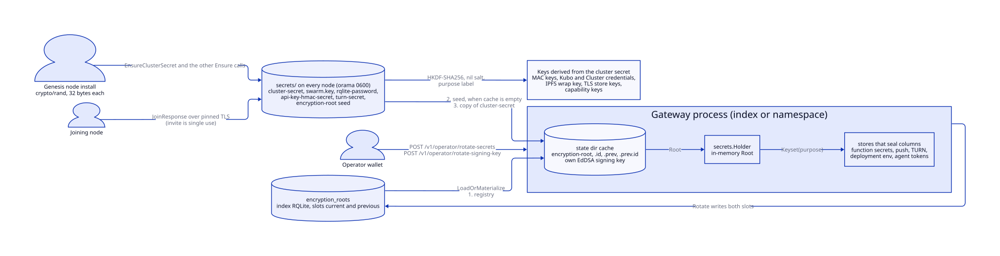
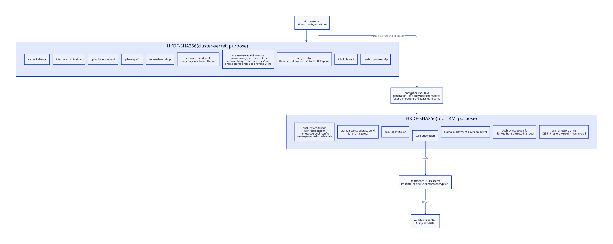
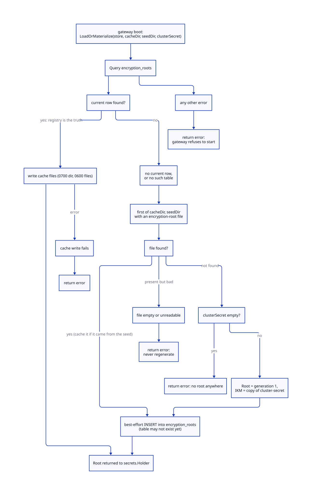
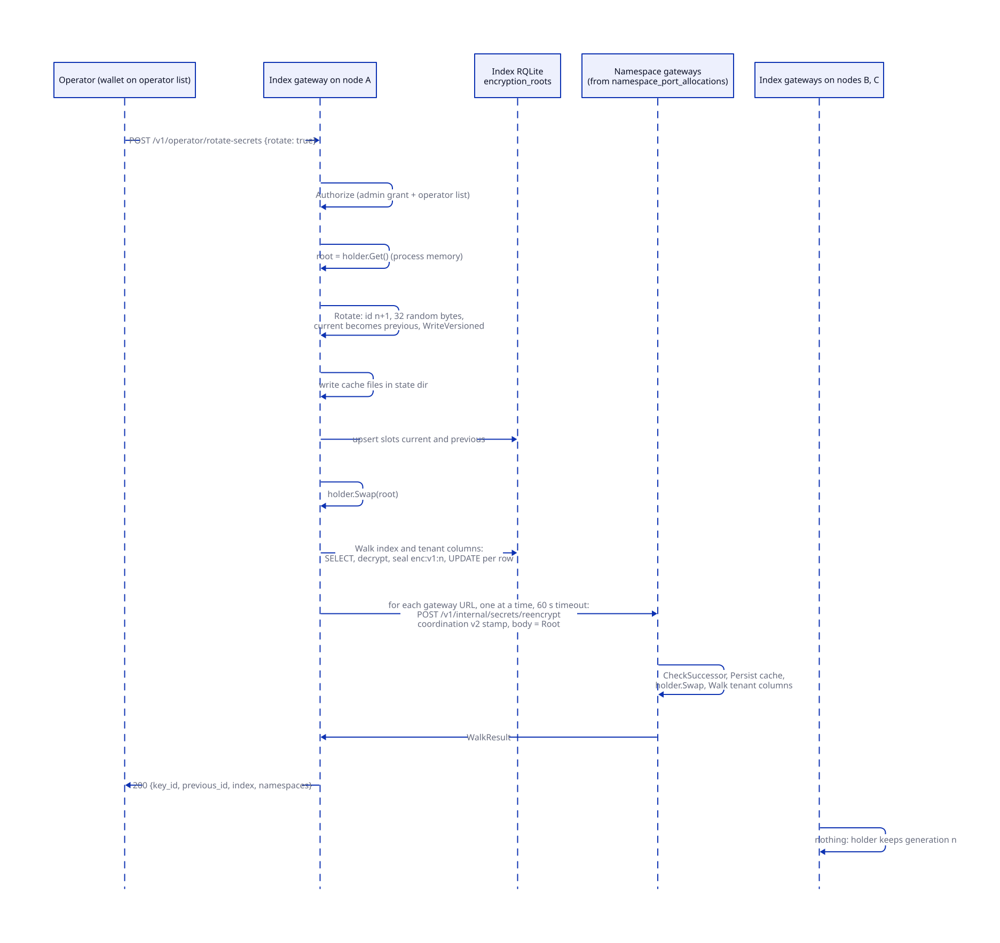
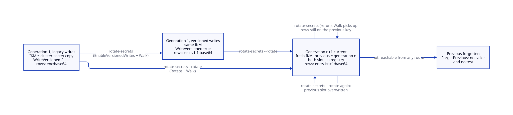
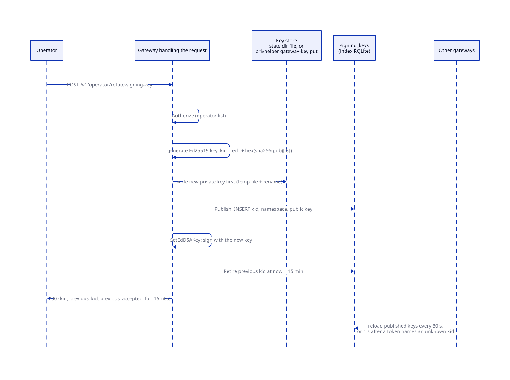

# Secrets and keys

> **At a glance.**
>
> - **What:** the cluster keeps three kinds of key material. Shared roots are random values the genesis node generates and every joiner receives (the cluster secret and a handful of others). Derived keys are HKDF-SHA256 outputs of a shared root and a purpose label, so every node computes the same key with nothing to distribute. Local keys are generated where they are used and never leave (gateway signing keys, node keys, WireGuard keys). `core/pkg/secrets/` is the one place that seals stored secrets: AES-256-GCM under keys derived from the encryption root, an IKM that started as a copy of the cluster secret and can now be rotated without touching IPFS Cluster or the mesh. This chapter also holds the inventory of every key and secret in the system.
> - **Key numbers:** AES-256-GCM, 12-byte random nonce, no associated data except in `enc:v2:`, which binds the row; HKDF-SHA256 with a nil salt, 32-byte outputs; envelopes `enc:` (legacy, still the default write), `enc:v1:<keyid>:` and `enc:v2:<keyid>:` (bound); generation ids are integers from 1; rotated roots are 32 random bytes (64 hex); gateway signing keys are Ed25519 with a 15 min overlap on rotation; the rotation fan-out calls each namespace gateway in turn with a 60 s timeout.
> - **Code:** `core/pkg/secrets/`, `core/pkg/gateway/secrets_rotate.go`, `core/pkg/gateway/gateway_state.go`, `core/pkg/gateway/signing_key_routes.go`, `core/pkg/gateway/auth/signing_keys.go`, `core/pkg/install/config.go` (secret generation), `core/cmd/orama/internal/cmd/operatorcmd/operator.go`.
> - **Depends on:** [privilege and filesystem trust](05-privilege-and-filesystem-trust.md) for who can read which file, [the WireGuard mesh](06-the-wireguard-mesh.md) for the join that distributes the roots, [cluster state](07-cluster-state.md) for the registry that holds the root, and [inter-node trust](15-inter-node-trust.md) for the MACs the cluster secret keys.



## Why it exists

A cluster accumulates secrets of very different kinds: tokens a tenant gave the platform (function secrets, APNs credentials, deployment environments), credentials the nodes use with each other (RQLite, IPFS, MAC keys), keys that sign what the cluster tells clients (JWTs, certificates), and keys that identify a machine. Four constraints shaped how Orama keeps them.

First, every node must compute the same key without asking anybody. There is no external key service and no leader that hands keys out at run time. The first design generated a key file per node and diverged: function secrets written on one node could not be read on another, and `get_secret` was broken for days (bugboard #837, cited in `core/pkg/gateway/secrets_key.go`). The fix was to derive keys from one shared value, so the install only has to copy one secret.

Second, stored secrets must be rotatable. They were encrypted under keys derived from the cluster secret, and the cluster secret is also IPFS Cluster's private-network key, and the root of every inter-node MAC (`core/pkg/ipfs/cluster.go`). Rotating it partitions the cluster. In practice it was never rotated. The encryption root exists to break that coupling.

Third, upgrades are rolling and mixed-version. A new binary must not write a format an old one cannot read, so the new envelope is opt-in per cluster and the operator turns it on after every gateway is upgraded.

Fourth, some keys must not be shared at all. A signing key derived from the cluster secret is a key every node, and every compromised tenant gateway, holds. Each gateway now generates its own signing key and publishes only the public half (`core/pkg/gateway/auth/signing_keys.go`).

## The model

**Cluster secret.** 32 bytes from `crypto/rand`, 64 hex characters, in `secrets/cluster-secret` on every node (`core/pkg/install/config.go:EnsureClusterSecret`). It is used raw in three places (IPFS Cluster's `cluster.secret`, the `X-Cluster-Secret` header of the peer-registration routes, and as the initial encryption root) and as HKDF input everywhere else.

**Encryption root.** The input keying material (IKM) from which every stored-ciphertext key is derived. A `Root` holds the current IKM and its id, the previous IKM and id while a rotation is in flight, and the `WriteVersioned` flag (`core/pkg/secrets/keyset.go:Root`). Generation 1 is a byte-for-byte copy of the cluster secret, so every row written before the root existed stays readable. Each rotation creates the next generation from 32 fresh random bytes.

**Generation and key id.** The root's `CurrentID` is a positive integer; `Rotate` assigns the next one, so the id is the generation (`core/pkg/secrets/generation.go:Generation`). The key id in a versioned envelope is the generation of the root that sealed it.

**Purpose.** A string label that selects one key out of a root: `DeriveKey(ikm, purpose)` is HKDF-SHA256 with the IKM, no salt and the purpose as the info string, 32 bytes out (`core/pkg/secrets/encrypt.go:DeriveKey`). The label is a domain separator and not a rotation handle. Editing a label in Go orphans every row sealed under it.

**Keyset.** The AES keys of one purpose derived from the current root and, while a rotation is in flight, the previous one. `Encrypt` seals under the current key; `Decrypt` opens a versioned envelope with the key whose id matches and a legacy envelope with the current key, then the previous (`core/pkg/secrets/keyset.go:Keyset`).

**Holder.** The process-wide, mutex-guarded `Root` of one gateway. Stores call `Holder.Keyset(purpose)` on each seal and open, so a swap takes effect without a restart. `Seal` and `Open` are the helpers stores use (`core/pkg/secrets/keyset.go:Holder`).

**Envelope.** The stored form of a ciphertext. Legacy: `enc:` followed by base64 of nonce, ciphertext and tag. Versioned: `enc:v1:<keyid>:` followed by the same base64. Bound: `enc:v2:<keyid>:` followed by the same base64, whose GCM additional data names the row it belongs to (today a deployment's environment, bound to its namespace and deployment id, [app deployments](11-app-deployments.md)), so the ciphertext opens nowhere else. Anything else is an error: `Decrypt` fails closed on unprefixed input rather than returning it as plaintext (`core/pkg/secrets/encrypt.go:ParseEnvelope`).

**Seed, cache and registry.** Three places a root lives. The registry table `encryption_roots` is the truth. Each gateway caches the root in its own state directory (`encryption-root`, `encryption-root.id`, and the two `.prev` files). The node's `secrets/` directory holds a seed that `orama maint node install` writes when a node joins; a gateway may read it and never writes it (`core/pkg/secrets/root.go:LoadOrMaterialize`).

**Walker.** The re-encryption pass. It reads every row of a fixed list of ciphertext columns, decrypts, re-seals under the current keyset and writes the row back (`core/pkg/secrets/walk.go:Walk`).

The derivation tree below is the part to remember: two roots, two families of purpose labels, and a third group of keys that are random and local.



## How it works

### Generating and distributing the shared roots

`Phase3GenerateSecrets` on the genesis node calls the `Ensure*` functions of `SecretGenerator` (`core/pkg/install/orchestrator.go:Phase3GenerateSecrets`). Each reads the file if it exists and has the right shape, and generates it otherwise: `EnsureClusterSecret`, `EnsureSwarmKey`, `EnsureRQLiteAuth`, `EnsureAPIKeyHMACSecret`, `EnsureSecretsEncryptionKey` and `EnsureTURNSecret` in `core/pkg/install/config.go`. Values are 32 bytes from `crypto/rand` as 64 hex characters (the swarm key is the same 32 bytes in upper-case hex inside the Kubo PSK header), written 0600 and, for all but the swarm key, chowned to the `orama` user inside a 0700 directory. The secrets directory is created 0700 (`core/pkg/install/provisioner.go`). The cluster secret, HMAC secret, secrets key and TURN secret are regenerated when the file's trimmed length is not 64, and a swarm key file without the PSK header is regenerated; the RQLite password is reused whenever it is non-empty. `Phase3GenerateSecrets` runs on `orama node upgrade` as well as install. The encryption-root loader, by contrast, never regenerates a file it cannot read (see "Loading the root").

The genesis install does not write an `encryption-root` file. The first index gateway to start materializes the root (below).

A joiner receives the roots in one response. `readJoinSecrets` reads the files from the minting node's `secrets/` directory and `JoinResponse` carries the cluster secret, swarm key, API key HMAC secret, RQLite password, serverless secrets key, TURN secret, encryption root and its id (`core/pkg/gateway/handlers/join/handler.go:JoinResponse`). The invite is single use and the TLS is pinned to the minting node's certificate ([the join handler](06-the-wireguard-mesh.md#the-join-handler)). The joiner writes each to `secrets/` with mode 0600 (`core/cmd/orama/internal/production/install/orchestrator.go`). If the minting node has no `encryption-root` file, as on a genesis node, the response sets the root to the cluster secret with id `1`.

### Derivation: HKDF with a purpose label

Every derived key is `HKDF-SHA256(ikm, salt = nil, info = purpose)`. A nil salt is legal for a high-entropy IKM (RFC 5869 substitutes a string of zero bytes) and it is kept deliberately: a salt would change every key, so adding one belongs inside a rotation (`core/pkg/secrets/encrypt.go:DeriveKey`). The IKM is the secret's text, not its decoded bytes: the 64 hex characters are fed to HKDF as 64 ASCII bytes.

Callers trim the secret before deriving. The secrets are read from files, and one node's copy with a trailing newline would derive a different key from its neighbour's, with every call between them failing a MAC for no visible reason. Most derivation sites call `strings.TrimSpace` for that reason (the hop key in `core/pkg/gateway/internal_auth_hop.go:internalAuthKey` does not), and the comment in `core/pkg/auth/coordination.go:CoordinationKey` cites the #837 incident.

Domain separation is by label. The labels are listed in the inventory below. Some keys are derived in two steps: the TLS store derives a master key with `caddy-tls-store`, then splits it with HKDF-Expand into a MAC key (`orama-tls-store-mac-v1`) and a sealing key (`orama-tls-store-seal-v1`), so the key that authenticates a call to the store is never the key that seals what it holds (`core/pkg/tlsstore/keys.go:DeriveKeys`). Capability keys carry the namespace in the label (`orama-ws-capability-v1:<ns>`), which separates tenants cryptographically and does not separate them by access, because every gateway holds the cluster secret (see "Trust and security").

### The envelopes

`Encrypt` draws a fresh 12-byte nonce from `crypto/rand`, seals with AES-256-GCM and no associated data, and base64-encodes nonce, ciphertext and the 16-byte tag. `EncryptVersioned` does the same and prefixes `enc:v1:<keyid>:`; it refuses an empty key id and one that contains `:`, CR or LF (`core/pkg/secrets/encrypt.go`).

`Keyset.Encrypt` writes the legacy form until `WriteVersioned` is set. The default is deliberate. A mixed-version cluster has gateways that cannot parse `enc:v1:`, so a new binary keeps writing `enc:` until an operator runs the rewrite after every gateway is upgraded (`core/pkg/secrets/keyset.go:Keyset`, `core/pkg/gateway/secrets_rotate.go:handleRotateSecrets`). An old binary reading a versioned row fails with a decode or decryption error rather than returning garbage, because the base64 does not parse or GCM authentication fails.

Reading is tolerant in one direction only. A legacy envelope tries the current key, then the previous, which is how a row sealed under generation n stays readable during the window after a rotation to n+1. A versioned envelope selects the key by id and fails with `no key for id` when the id is neither the current nor the previous generation.

Callers that still hold leftover plaintext in a column (deployment environments written before encryption, TURN secrets) test `IsEncrypted` themselves. `Decrypt` never accepts unprefixed input, and the walker seals such leftovers instead of refusing them (`core/pkg/secrets/walk.go:decryptForWalk`).

### Loading the root

`LoadOrMaterialize` runs once at gateway boot, from `bootstrapEncryptionRoot`, after the gateway has waited for the registry leader (`core/pkg/gateway/gateway_state.go:bootstrapEncryptionRoot`, `core/pkg/gateway/dependencies.go`). The order is registry, then the gateway's own cache, then the node's seed, then a copy of the cluster secret.



- **Registry.** `SELECT slot, key_id, ikm, write_versioned FROM encryption_roots`. A `current` row yields the root; a `previous` row adds the previous generation. If a current row exists, it is written to the cache and returned. A cache write that fails is an error. A missing row or a missing table falls through to the files. Any other registry error is returned: the registry is the truth, and a root read from a file while it cannot be asked may predate a rotation (`core/pkg/secrets/root.go:loadFromRegistry`).
- **Files.** The first directory with an `encryption-root` file wins, cache before seed. A file that exists but is empty or unreadable is an error, never a reason to invent a replacement: that is how IPFS Cluster was silently partitioned once, and it would orphan every stored secret here (`core/pkg/secrets/root.go:readSecretFile`). A root read from the seed is cached, and a root from either directory is saved to the registry, best effort, because the table may not exist yet (schema apply runs after the secrets manager is built).
- **Materialize.** With nothing anywhere, the root becomes generation 1 with the cluster secret as IKM, is written to the cache and saved to the registry. With no cluster secret either, the gateway refuses to start.

The registry is in the index RQLite and is placed in the cluster registry on purpose: a tenant copy would be a key-encryption key the tenant could rewrite, so `encryption_roots` is in the tenant SQL guard's deny list (`core/pkg/rqlite/schema_placement.go`, `core/pkg/sqlguard/sqlguard.go`). A namespace gateway reads and writes it through its registry handle (`core/pkg/gateway/secrets_rotate.go:registryStore`).

The cache files are written into a 0700 directory with 0600 files, and the previous-generation files are removed when there is no previous root (`core/pkg/secrets/root.go:writeFiles`).

### The walker

`Walk` takes a root and a list of `Column` entries (table, column, id columns, purpose) and, for each column, runs `SELECT <ids>, <column> FROM <table>`, then handles each row as follows (`core/pkg/secrets/walk.go:walkColumn`).

1. A blank value is skipped.
2. A value already on target is skipped. With `WriteVersioned` set, on target means `enc:v1:` with the current key id; without it, any legacy `enc:` envelope.
3. Otherwise decrypt (leftover plaintext passes through), re-seal with `Keyset.Encrypt`, and run `UPDATE <table> SET <column> = ? WHERE <id> = ? AND ...`.
4. A row that fails to decrypt, seal or write is recorded in `Failures` and left alone; the walk continues.

A table that does not exist counts as `Missing` and is not an error, since a tenant database holds only the tables of the features the tenant uses. The result (`scanned`, `rewrote`, `skipped`, `missing`, `failures`) is returned to the caller. The pass is idempotent because step 2 skips rows already on target.

Two lists define what is walked (`core/pkg/secrets/walk.go`).

| List | Table.column | Purpose label |
|---|---|---|
| `IndexColumns` (registry only) | `wireguard_peers.agent_token` | `node-agent-token` |
| | `deployments.environment` | `orama-deployment-environment-v1` |
| `NamespaceColumns` (tenant DB, and the registry on index gateways) | `function_secrets.encrypted_value` | `orama-secrets-encryption-v1` |
| | `push_devices.token_encrypted` | `push-device-tokens` |
| | `push_topics.token_encrypted` | `push-topic-tokens` |
| | `namespace_push_config.ntfy_auth_token_encrypted`, `.expo_access_token_encrypted` | `namespace-push-config` |
| | `namespace_push_credentials.credentials_json` | `namespace-push-credentials` |
| | `namespace_webrtc_config.turn_shared_secret` | `turn-encryption` |

`deployments` is listed with the registry because deployments live there. Walked as a tenant column, a rotation re-sealed an empty tenant copy and left every deployment's environment under the retired root (comment in `IndexColumns`). The index gateway walks both lists against its own database; a namespace gateway walks only `NamespaceColumns`.

### Rotating the encryption root

`orama maint operator rotate-secrets` posts `{"rotate": false}` and `orama maint operator rotate-secrets --rotate` posts `{"rotate": true}` to `POST /v1/operator/rotate-secrets` (`core/cmd/orama/internal/cmd/operatorcmd/operator.go`). The route needs the admin grant and a wallet on the cluster's operator list (`core/pkg/gateway/route_policy.go`). The handler reads at most 4 KiB of body and ignores a decode error, so a malformed body is the same as `{"rotate": false}` and performs the format rewrite.



The handler (`core/pkg/gateway/secrets_rotate.go:handleRotateSecrets`) does this, in order:

1. Authorize, then require a state directory.
2. Take the root from this process's `Holder`; if the holder is empty, run `LoadOrMaterialize`.
3. Without `rotate`, call `EnableVersionedWrites`: same IKM, `WriteVersioned` true, files and registry updated. This is the format rewrite. With `rotate`, call `Rotate`: next generation, 32 random bytes as 64 hex, the old current becomes previous, `WriteVersioned` true, written to the gateway's state directory and then to the registry (`core/pkg/secrets/root.go:Rotate`). `Rotate` writes the files before the registry, so a registry write error aborts with an error after the state directory already holds the new generation; the holder is not swapped and the registry still holds the old one.
4. Swap the new root into the holder.
5. Walk the local database: `NamespaceColumns` on a namespace gateway; `IndexColumns` plus `NamespaceColumns` on an index gateway.
6. On an index gateway, fan out. `fanoutReencrypt` selects every distinct `(namespace, node, internal ip, gateway port)` from `namespace_clusters`, `namespace_port_allocations` and `dns_nodes` (the address is `dns_nodes.internal_ip`, or the public `ip_address` when that is null), skips rows without an address or port, then for each distinct URL, one at a time, posts the whole `Root` as JSON to `http://<ip>:<port>/v1/internal/secrets/reencrypt` with a coordination v2 stamp whose audience is that node, under a 60 s client timeout that also bounds the receiver's walk (`core/pkg/gateway/secrets_rotate.go:fanoutReencrypt`). The overlay carries the request, so WireGuard provides the confidentiality and the stamp provides integrity and replay protection ([inter-node trust](15-inter-node-trust.md)).
7. Write an audit event (`secrets.rotate`, with the key id and whether the IKM changed) and return `key_id`, `previous_id`, `rotated`, the index `WalkResult` and one entry per namespace gateway.

`handleInternalReencrypt` is the receiving side. It accepts only a v2 coordination stamp from a source address in the WireGuard subnet, because the stamp must cover the body that carries key material. It reads at most 64 KiB, runs `CheckSuccessor`, writes the new root to its own cache before using it, swaps its holder and walks its own tenant database (`core/pkg/gateway/secrets_rotate.go:handleInternalReencrypt`). The order matters: a gateway that swapped to a root it could not persist would boot next time, with the registry unreachable, on the previous root and fail on everything sealed in between. The persist failure goes back to the index in the fan-out entry.

`CheckSuccessor` stops a captured fan-out being replayed after a later rotation. A pushed root is refused when its generation is lower than the receiver's, and when the generation is equal but the IKM differs ("one generation has one key"). An equal generation with the same IKM is accepted, because the same push also carries a format rewrite or the forgetting of the previous root, and because a failed fan-out is retried, but only with a previous root that is gone or the one the receiver holds (a push made before the previous root was forgotten would restore a retired key; a push with no previous root, which is how forgetting reaches a gateway, is accepted) and never with a lower write level (a level only goes up, so a push captured from before bound writes were enabled would have the receiver write what older readers cannot open) (`core/pkg/secrets/generation.go:CheckSuccessor`). A push more than one generation ahead means the receiver missed a fan-out, since a rotation advances by exactly one; it is not taken on the push's word. `ResolveSuccessor` reads the root from the registry, which is written before any push, and adopts it when it is at least the pushed generation and, at that generation, the pushed key, and when it would not lower the write level the receiver is at; otherwise the answer is `409`. Nothing needs a restart.

The state of the root across these operations is small.



`ForgetPrevious` exists in `core/pkg/secrets/root.go`; no route, command or test calls it. After a rotation the previous root stays in the registry and in every cache until a later rotation overwrites it (see "Known gaps").

### Rotating a gateway's signing key

Gateways sign JWTs with their own Ed25519 key. The key id is `ed_` plus the first 8 bytes of the SHA-256 of the public key in hex (`core/pkg/gateway/auth/signing_keys.go:KeyIDFor`), so nobody can choose one and two gateways cannot collide. A tenant gateway's key is bound to its namespace: a token it signs is refused unless its `namespace` claim matches. The index gateway's key is bound to nothing, because the index gateway mints the tokens the CLI signs in with for every namespace. Verifiers learn the public halves from the `signing_keys` table (`core/migrations/052_signing_keys.sql`), (with `last_seen_at`, added by `core/migrations/071_signing_keys_last_seen.sql`), which gateways reload every 30 s, and again at most once a second when a token names an unknown `ed_` key id.

`orama maint operator rotate-signing-key` posts to `POST /v1/operator/rotate-signing-key` (operator list required). The gateway that receives the request runs `Service.Rotate` (`core/pkg/gateway/auth/signing_keys.go`).



The sequence is chosen so that every failure leaves a consistent state.

1. Generate a new Ed25519 key.
2. Write the private key first, to a temporary file renamed into place. A tenant gateway writes `jwt-eddsa-key.pem` in its state directory. The index gateway stores it through the privileged helper into the root-only tree `/var/lib/orama-gateway-keys/index/`, never into its state directory, which a tenant gateway running as the same user can read (`core/pkg/gateway/signing_key.go:indexKeyStore`, [gateway signing keys](05-privilege-and-filesystem-trust.md#gateway-signing-keys)).
3. Publish the public key with `INSERT ... ON CONFLICT`. If this fails, the previous private key is written back, so what is on disk is what the gateway signs with.
4. Switch signing to the new key.
5. Retire the previous key id at now plus `AccessTokenLifetime` (15 min), so tokens already issued keep working for their remaining life and nobody is signed out. If this last step fails, the new key is live and the error says the previous one was not retired.

Rotation is local to the gateway that served the request. Each index gateway (one per node) has its own key, so rotating the control plane's keys on every node takes one request that lands on each. Index keys that no gateway has stamped for 24 hours are retired by a sweep that every index gateway runs once, after its schema is ready; a live gateway stamps its key every 10 minutes (`core/pkg/gateway/auth/signing_keys_upkeep.go:RetireUnusedKeys`).

On boot a gateway refuses an unreadable signing key instead of replacing it, because a replacement would silently invalidate every token it issued and overwrite the only copy of a recoverable key. A key file that equals the old cluster-derived key (every 0.122.x node wrote one) is replaced, and the derived key stays verify-only for one token lifetime, recorded once in `legacy-signing-key-retired-at` so a restart cannot re-arm it (`core/pkg/gateway/legacy_signing_key.go:armLegacyClusterKey`).

### Other rotations that exist

Tenant credentials rotate through their own commands and are described where they are issued ([identity](13-identity.md)).

- **API keys.** `orama namespace keys rotate` mints a successor with the same grants and shortens the original to an overlap: 7 days by default, 30 at most. Keys live 90 days by default and 365 at most (`core/pkg/gateway/auth/scoped_keys.go:DefaultRotationOverlap`). A revoked key is refused within seconds by the replicated revocation list.
- **Refresh tokens.** 32 random bytes, stored as a SHA-256 hash, valid 30 days, and replaced on use (`core/pkg/gateway/auth/session_refresh.go`).
- **Invite tokens.** Single use; the row holds a hash.

## State it owns

The first table lists the state this subsystem writes itself. The inventory that follows lists every key and secret in the system, grouped by how it is born, with the chapter that explains each.

| State | Holds | Written by | Read by | Where |
|---|---|---|---|---|
| `encryption_roots` | slots `current` and `previous`: key id, IKM in plaintext, `write_versioned`, `updated_at` | `LoadOrMaterialize`, `Rotate`, `EnableVersionedWrites` | every gateway at boot | index RQLite (`core/migrations/057_encryption_roots.sql`) |
| `encryption-root`, `.id`, `.prev`, `.prev.id` | a gateway's cached root | `writeFiles`, `Persist` | the same gateway at boot | `<oramaDir>/data/namespaces/<ns>/gateway/`, 0600 in a 0700 directory |
| `secrets/encryption-root`, `.id` | the node's seed root | `orama maint node install` on a join | gateways whose cache is empty, `enroll` and `core_wire` | `/opt/orama/.orama/secrets/`, 0600 |
| `signing_keys` | public keys, namespace binding, `retired_at`, `last_seen_at` | `Publish`, `Retire`, `Stamp` | every gateway (reload every 30 s) and the JWKS routes | index RQLite |
| `jwt-eddsa-key.pem`, `jwt-signing-key.pem` | a gateway's private signing keys | `PersistSigningKey`, privileged helper | that gateway | state directory, or `/var/lib/orama-gateway-keys/index/` for the index gateway |
| `legacy-signing-key-retired-at` | when the cluster-derived key stops verifying | `armLegacyClusterKey` | the same gateway | state directory, 0600 |
| sealed columns | ciphertext in the nine columns of the walker lists | stores and the walker | stores | registry and tenant databases |

### The key inventory

Columns: where the key lives, who can read it, how it comes to exist, how it rotates. Paths are under `/opt/orama/.orama/` unless absolute. "Orama daemons" are the units that run as the `orama` user ([per-service accounts](05-privilege-and-filesystem-trust.md#per-service-accounts)). A gateway unit sees only `cluster-secret` and the `encryption-root` files of `secrets/`; the index gateway's drop-in restores the whole directory because its join handler hands a joiner every secret (`core/systemd/orama-namespace-gateway@.service`, `core/pkg/install/gateway_unit.go`).

#### A. Shared random roots

| Key | Lives in | Readable by | Born | Rotation | See |
|---|---|---|---|---|---|
| `cluster-secret` | `secrets/cluster-secret`, 0600; also `cluster.secret` in IPFS Cluster `service.json`, 0600 | root, Orama daemons, every gateway unit, `orama-node` | genesis `EnsureClusterSecret`, 32 random bytes; copied to joiners | none. Changing it partitions IPFS Cluster and invalidates every key in group B at once | [15](15-inter-node-trust.md), [19](19-storage.md) |
| `swarm.key` | `secrets/swarm.key`, 0600; copy in the Kubo repository, 0600 (ipfs unit `ExecStartPre`) | root, Orama daemons (ipfs); not gateways | genesis `EnsureSwarmKey`, 32 random bytes in the Kubo PSK file format | none | [19](19-storage.md) |
| RQLite credentials | `secrets/rqlite-password`, `secrets/rqlite-auth.json`, instance copy; embedded in each gateway YAML (0600) and the CoreDNS Corefile (`root:orama-coredns` 0640) | root, Orama daemons, the CoreDNS account | genesis `EnsureRQLiteAuth`: user `orama`, 32 random bytes | none: an existing password is reused | [7](07-cluster-state.md#access-endpoints-credentials-consistency) |
| `api-key-hmac-secret` | `secrets/api-key-hmac-secret`, 0600; embedded in each namespace gateway YAML (0600) | root, Orama daemons, the gateway that holds the YAML | genesis `EnsureAPIKeyHMACSecret`, 32 random bytes | none. A new value would leave every stored key hash unmatchable | [13](13-identity.md) |
| `turn-secret` | `secrets/turn-secret`, 0600; rendered into `node.yaml` | root, Orama daemons | genesis `EnsureTURNSecret`, 32 random bytes | none | [23](23-webrtc.md) |
| encryption root | `encryption_roots` (truth); gateway cache; node seed | the registry's readers, each gateway, root and Orama daemons for the seed | generation 1 is a copy of the cluster secret; later generations are 32 random bytes | `orama maint operator rotate-secrets --rotate` | this chapter |
| `secrets-encryption-key` | `secrets/secrets-encryption-key`, 0600; rendered into gateway YAML | as above | genesis `EnsureSecretsEncryptionKey`, 32 random bytes | none, and unused: see "Known gaps" | this chapter |
| `olric-encryption-key` | only a field of `JoinResponse`; a joiner writes it if present | n/a | nothing generates it | n/a. Olric's YAML loader has no such field | [18](18-cache.md) |

#### B. Derived from the cluster secret

All are `HKDF-SHA256(cluster secret, label)`. None rotates on its own: they change if and only if the cluster secret does.

| Key | Label | Lives in | Readable by | See |
|---|---|---|---|---|
| Coordination MAC key (v1 and v2 stamps) | `internal-coordination` | computed in memory | every gateway and node | [15](15-inter-node-trust.md) |
| Internal-auth hop key | `internal-auth-hop` | computed in memory | every gateway | [12](12-gateway-architecture.md), [15](15-inter-node-trust.md) |
| ACME DNS-01 key | `acme-challenge` | `/etc/caddy/orama-acme.key`, `root:orama` 0640, written at install | Caddy, the gateway (derives its own) | [25](25-tls-and-certificates.md) |
| TLS store master key | `caddy-tls-store`, split by HKDF-Expand into `orama-tls-store-mac-v1` and `orama-tls-store-seal-v1` | `/etc/caddy/orama-tls-store.key`, `root:orama` 0640 | Caddy, the index gateway | [25](25-tls-and-certificates.md) |
| Kubo RPC bearer | `ipfs-kubo-api` | Kubo `API.Authorizations`; computed by gateways | Kubo, gateways, `orama node report` | [19](19-storage.md) |
| IPFS Cluster REST password | `ipfs-cluster-rest-api` | `service.json` `basic_auth_credentials` (0600) | Cluster, gateways, the inspector | [19](19-storage.md) |
| IPFS private-blob wrap key | `ipfs-wrap-v1` | computed in memory | every gateway | [19](19-storage.md) |
| WebSocket capability keys, per namespace | `orama-ws-capability-v1:<ns>` | computed in memory | every gateway | [21](21-serverless.md) |
| Storage fetch capability keys, per namespace | `orama-storage-fetch-cap-v1:<ns>`, `orama-storage-fetch-cap-tag-v1:<ns>`, `orama-storage-fetch-cap-revoke-v1:<ns>` | computed in memory | every gateway | [19](19-storage.md) |
| Push topic token fingerprint | `push-topic-token-fp` | computed in memory | every gateway | [22](22-push-notifications.md) |
| Legacy token signing key | `orama-jwt-eddsa-v1` | computed on one boot only | the gateway that migrated, for one token lifetime, verify-only | [13](13-identity.md) |

#### C. Derived from the encryption root

All are `HKDF-SHA256(root IKM, label)` and rotate with `rotate-secrets --rotate`, except where noted.

| Key | Label | Seals | See |
|---|---|---|---|
| Function secrets | `orama-secrets-encryption-v1` | `function_secrets.encrypted_value` | [21](21-serverless.md) |
| Push device tokens | `push-device-tokens` | `push_devices.token_encrypted` | [22](22-push-notifications.md) |
| Push topic tokens | `push-topic-tokens` | `push_topics.token_encrypted` | [22](22-push-notifications.md) |
| Push config | `namespace-push-config` | ntfy and Expo tokens in `namespace_push_config` | [22](22-push-notifications.md) |
| Push credentials | `namespace-push-credentials` | `namespace_push_credentials.credentials_json` (APNs and other provider material) | [22](22-push-notifications.md) |
| TURN shared secret | `turn-encryption` | `namespace_webrtc_config.turn_shared_secret` | [23](23-webrtc.md) |
| Node agent token | `node-agent-token` | `wireguard_peers.agent_token` | [6](06-the-wireguard-mesh.md#the-oramaos-enrolment-handler) |
| Deployment environment | `orama-deployment-environment-v1` | `deployments.environment` | [11](11-app-deployments.md) |
| Restore keypair | `orama-restore-v1:<ns>` | nothing: an X25519 keypair derived on demand, public half given to the owner, private half never stored | [17](17-database.md) |
| Push device token fingerprint | `push-device-token-fp` | nothing: an HMAC key; it is derived from the rotating root, which is a defect ("Known gaps") | [22](22-push-notifications.md) |

#### D. Generated where they are used

| Key | Lives in | Readable by | Born | Rotation | See |
|---|---|---|---|---|---|
| Tenant gateway EdDSA signing key | `data/namespaces/<ns>/gateway/jwt-eddsa-key.pem`, 0600, directory 0700 | that gateway; sibling tenant gateways on the host (same uid) | first boot, `ed25519.GenerateKey` | `rotate-signing-key` | [13](13-identity.md) |
| Index gateway EdDSA and RSA keys | `/var/lib/orama-gateway-keys/index/`, `root:root` 0400, loaded by `LoadCredential=` | root and the index gateway unit only | `ensureIndexGatewayKeys` at install and upgrade | EdDSA: `rotate-signing-key` through the helper. RSA: none | [5](05-privilege-and-filesystem-trust.md#gateway-signing-keys) |
| Tenant gateway RSA-2048 key | state directory `jwt-signing-key.pem`, 0600 | as the EdDSA key | first boot | none. Verifies tokens this gateway itself signed as RS256 | [13](13-identity.md) |
| Node key (Ed25519, PKCS#8) | `secrets/node-key.pem`, 0600 | root, `orama-node`; refused if group or world readable | first use, `LoadOrCreateNodeKey`; only the public half is enrolled | none in place; a re-join clears the recorded key | [4](04-the-node-as-a-supervisor.md#recording-the-node-in-the-registry) |
| libp2p identity (Ed25519) | `<data_dir>/identity.key`, 0600 | Orama daemons | install | none: a new identity is a new node | [4](04-the-node-as-a-supervisor.md#the-libp2p-host) |
| WireGuard private key | `/etc/wireguard/wg0.conf`, root 0600 | root | generated in process at genesis or join, never sent | none; re-join | [6](06-the-wireguard-mesh.md#genesis-and-the-interface-file) |
| Kubo and IPFS Cluster peer identities | their data directories | the daemons | their own first run | none; Orama reads only the public peer ids | [19](19-storage.md) |

#### E. Per-namespace and tenant material

| Key or secret | Lives in | Readable by | Born | Rotation | See |
|---|---|---|---|---|---|
| Namespace TURN shared secret | `namespace_webrtc_config.turn_shared_secret` sealed (`turn-encryption`); plaintext in the gateway and SFU configs | root, Orama daemons, the SFU account for its own file | 32 random bytes, base64, at WebRTC enable | none | [23](23-webrtc.md) |
| SFU control key | computed in memory by gateway and SFU | both | `HKDF(namespace TURN secret, "webrtc-sfu-control")` | with the TURN secret | [23](23-webrtc.md) |
| Deployment environment and workload token | `/var/lib/orama-deploy/orama-deploy-<instance>.env` and `.token`, written by the helper, root-only | root and the deployment's unit | the environment is tenant input; the token is a JWT the gateway mints | token refreshed by the gateway | [11](11-app-deployments.md) |
| API keys | `api_keys` as `HMAC-SHA256(secret, key)`; the raw key is shown once | the holder | minted by the gateway, `orama_<type>_<payload>_<checksum>` | `orama namespace keys rotate` | [13](13-identity.md) |
| Access token | not stored | the bearer | EdDSA JWT, 15 min | expires | [13](13-identity.md) |
| Refresh token | `refresh_tokens` as a SHA-256 hash | the holder | 32 random bytes, 30 days | replaced on use | [13](13-identity.md) |
| Device key | held by the client (Secure Enclave, StrongBox, WebCrypto); the gateway stores the public JWK | the client | device id is the RFC 7638 thumbprint | client side | [13](13-identity.md) |
| Invite token | `invite_tokens` as a hash | the minting operator | 32 random bytes | single use, 1 hour through the gateway | [6](06-the-wireguard-mesh.md#minting-an-invite) |
| Enrollment code | shown on the OramaOS console | the operator | 80 bits; keys AES-256-GCM via `HKDF(code, "orama-enrollment-seal-v1")` | single enrolment | [6](06-the-wireguard-mesh.md#the-oramaos-enrolment-handler) |

#### F. Edge

| Key | Lives in | Readable by | Born | Rotation | See |
|---|---|---|---|---|---|
| Certificate private keys and Caddy's ACME account | `tls_store` rows in the registry, each value sealed by Caddy (AES-256-GCM, the storage key path as associated data) | opening needs the cluster secret | Caddy | renewal by Caddy | [25](25-tls-and-certificates.md) |
| Exported wildcard pair | `data/tls/wildcard.key`, 0600 | the host TURN server | exported by the cluster gateway after checks | on renewal | [25](25-tls-and-certificates.md) |

#### G. Client side and offline

| Key | Lives in | Born | Rotation | See |
|---|---|---|---|---|
| CLI credentials | `~/.orama/credentials.json`, 0600, replaced by rename | sign-in | token expiry | [35](35-the-cli.md) |
| RootWallet seed and keys | the RootWallet agent (`~/.rootwallet/agent.sock`); the CLI asks for signatures and never holds the seed | the wallet | owner | [35](35-the-cli.md) |
| Namespace backup owner key | the owner's X25519 key; the cluster seals to the public half and never holds the private half | the owner | owner | [17](17-database.md) |
| Storage key and repair seed | the data owner; sealed into private storage deals (`core/pkg/storagefile/file.go`) | derived from the wallet seed | owner | [41](../vol2/41-storage-deals.md) |

#### H. Vault

| Key | Lives in | Born | Rotation | See |
|---|---|---|---|---|
| Guardian integrity key | `<data_dir>/integrity.key`, default `/opt/orama/.orama/data/vault`, 0600 | 32 random bytes on first start (`vault/src/guardian.zig:loadOrCreateIntegrityKey`) | none; a file that is the wrong size or unreadable is replaced, which makes every stored share fail its integrity check | [28](28-vault.md) |
| Guardian session secret | process memory only | 32 random bytes at each start | every restart | [28](28-vault.md) |

#### I. Trust anchors and the global layer

| Key | Lives in | Born | Rotation | See |
|---|---|---|---|---|
| Archive signers | `/etc/orama/archive-signers`, `root:root` 0644, public addresses (`core/pkg/archivetrust/anchor.go:AnchorPath`) | genesis from `--operator-wallet`, copied on join | a build signed by a trusted signer replaces the list | [29](29-build-signing-and-release.md) |
| TUF release root | `/etc/orama/release-root.json` (`core/pkg/releaseverify/file.go`) | placed by hand | no code rotates it | [29](29-build-signing-and-release.md) |
| Chain consensus key | `/var/lib/orama-global/chain/config/priv_validator_key.json`, 0600, with a sign floor in `validator-sign-floor.json` (`core/pkg/constants/chain.go:ChainValidatorKeyPath`) | chain init | migration only, sealed to an operator X25519 key by `export-key` | [39](../vol2/39-chain-architecture.md) |
| Chain node key, hot keys, operator key | `node_key.json` in the chain home; `hot-key` of the provider and archiver (0600); the operator key in the chain keyring | chain and global installs | owner | [37](../vol2/37-global-nodes.md) |
| Tor directory-authority identity key | offline, passphrase-encrypted, from `orama maint global tor ceremony` (`core/pkg/tornet/ceremony.go:KeyAuthorityIdentity`) | ceremony | the signing certificate is rotated offline with `tor-gencert --reuse` | [38](../vol2/38-anonymity-and-tor.md) |
| Global IPFS API token | `api-token` in the global IPFS home | global install | none | [37](../vol2/37-global-nodes.md) |

Secrets that are not keys: `ipfs-cluster-trusted-peers` holds peer ids, and the archive signer list holds public addresses.

## Lifecycle

**Genesis.** `Phase3GenerateSecrets` creates the group A files. No `encryption-root` file exists. The index gateway's first boot waits for the registry leader and runs `LoadOrMaterialize`: no registry row, no cache, no seed, so the root becomes generation 1 (a copy of the cluster secret), is cached in the gateway's state directory and saved to `encryption_roots`. The save is best effort and may fail because migration 057 has not applied yet; the next persist or boot writes the row.

**Join.** The minting node copies its `secrets/` files into the response. The joiner writes them, including the `encryption-root` seed, and starts. Its gateways read the registry for the root, so a joiner on a rotated cluster uses the current generation even though its seed is whatever the minting node's seed was.

**Boot and restart.** Every gateway runs `LoadOrMaterialize` before it builds the secrets manager, the push stores and the deployment codec. A failure stops the gateway: it used to fall back to a copy of the cluster secret, which on a rotated cluster is the wrong key, and every secret it then wrote was unreadable to the others (`core/pkg/gateway/gateway_state.go:bootstrapEncryptionRoot`). A restart changes nothing about the root; signing keys are read from disk and published again, which is a no-op for an existing key.

**Normal operation.** Stores call `Seal` and `Open` with the holder, and the keyset is derived on each call. Index gateways stamp their signing key every 10 minutes and reload published keys every 30 s.

**Format rewrite.** Run `orama maint operator rotate-secrets` once every gateway runs a binary that reads `enc:v1:`. It flips `WriteVersioned`, walks, and pushes the same root to namespace gateways.

**Rotation.** Run `orama maint operator rotate-secrets --rotate` after the same precondition. During the walk, every reader holds both generations. After the fan-out, rows are under generation n+1. The CLI documentation says the walker is idempotent and an interrupted run is repeated; that holds for a rerun without `--rotate`, since a second `--rotate` starts a new generation.

**Rolling upgrade.** Mixed versions are safe as long as nobody has run the rewrite: every binary writes and reads `enc:`. Once the rewrite or a rotation has run, an older gateway cannot read new rows. A namespace gateway on a binary that predates the reencrypt route answers the fan-out with an error entry and keeps its old root.

**Node loss and replacement.** Removing a node deletes its registry rows and revokes its node key ([membership](08-membership-and-failure-detection.md)). It rotates no shared secret: the cluster secret, swarm key, RQLite password, HMAC secret and TURN secret the node held stay valid, and the encryption root it held is valid until the next `--rotate`. A replacement node joins like any other.

## Failure modes

| Trigger | What the system does | What you observe |
|---|---|---|
| Registry unreachable or erroring at gateway boot | `LoadOrMaterialize` returns the error; the gateway does not start and does not fall back to the cache or seed | Gateway exits with `read the encryption root from the registry` |
| No row and no table yet (first boot, migration not applied) | Falls through to cache, seed, then the cluster secret; best-effort save | Gateway starts; the row appears after the next persist |
| `encryption-root` file empty or unreadable | Error; never regenerated | `refusing to invent a replacement` in the gateway log |
| Cache directory not writable | Error, even when the registry root was read | `cache the registry's encryption root` |
| `rotate-secrets --rotate` interrupted mid-walk (client disconnect, gateway crash) | Registry and cache already hold generation n+1 with n as previous; rows are mixed; reads work through the previous key | Rerun without `--rotate` finishes it and reports `rewrote` for the rows left. A second `--rotate` makes generation n+2 and drops n |
| A row fails to decrypt during the walk | Recorded in `failures`, row untouched, walk continues; the response is still 200 | `Failures: N` in the CLI summary; the list is in the JSON |
| Namespace gateway unreachable during fan-out | Error entry for that URL; the call still returns 200; its tenant rows stay under the previous root | An `error` field in the namespace results; the CLI does not print them |
| Fan-out stamp rejected (clock skew over 60 s, wrong audience, source outside the overlay) | The receiving gateway answers 401 and does not change its root | Error entry with the response text |
| Replay of an older rotation push | `CheckSuccessor` refuses | 409 `refusing the pushed encryption root: generation ... is older` |
| Sibling index gateway not restarted after `--rotate` | Its holder keeps generation n; it cannot open `enc:v1:n+1` rows and keeps sealing under n | `no key for id "n+1"` errors in deployments, agent tokens or push on that node, until its gateway restarts |
| Old binary reads a versioned row | The envelope does not parse, or GCM authentication fails | `failed to decode ciphertext` or `decryption failed (wrong key or corrupted data)` |
| Signing key write fails during rotation | Rotation stops before publishing | 500 with a pointer to the gateway log; nothing changed |
| Publish fails during rotation | The previous private key is written back | Error returned; if the restore also fails, the error says so |
| Retire fails during rotation | New key live; previous not retired | `the new key is live but the previous one was not retired` |
| Signing key file unreadable at boot | Gateway refuses to start | Error naming the file and how to move it aside |
| Index credential missing | Gateway refuses to start | Error naming the credential and `orama node upgrade` |
| Secret file with a trailing newline on one node | Every derivation trims, so keys agree | Nothing |
| Ciphertext moved to another row with the same purpose | Decrypts: there is no associated data | Nothing; see "Known gaps" |

## Trust and security

**Who holds the roots.** Every node holds the cluster secret, and so does every gateway unit: the unit template bind-mounts it with the encryption root files over an empty tmpfs (`core/systemd/orama-namespace-gateway@.service`). An attacker who controls a tenant's gateway process therefore holds the cluster secret and the current encryption root, and can compute every key in groups B and C. At-rest encryption protects Raft snapshots, backups, disk images and a stolen database file; it does not protect against a compromised gateway.

**Positions.**

- *Internet client.* Sees opaque tokens and the JWKS (public keys). Cannot reach the rotation routes without the admin grant and an operator wallet. API keys are verified against an HMAC and compared via the stored hash.
- *Tenant workload (a deployment).* Runs as a `DynamicUser`; its unit cannot read `secrets/`. It can reach loopback, which is why Kubo and IPFS Cluster require derived credentials.
- *Compromised tenant gateway.* Holds the cluster secret and encryption root. It can derive any namespace's capability key, forge the internal-auth hop and coordination stamps, and call `/v1/internal/secrets/reencrypt` on another gateway with any root of a higher generation, because the stamp proves only that the caller holds the cluster secret. It cannot sign tokens for other namespaces with its own key (the key is bound), but it can read sibling tenant gateways' signing keys from disk: they share a uid. Per-namespace users are the fix and are not implemented.
- *Compromised node (root).* Holds every file in group A, its node key and its WireGuard key. It can decrypt everything sealed under the encryption root.
- *Stolen snapshot or backup.* Holds the `encryption_roots` table in plaintext if it is a registry snapshot, and so every sealed column; a tenant database snapshot holds ciphertext and no root. A snapshot of the registry is the most sensitive artifact in the cluster. Certificates are the exception: the TLS store seals values before they reach the registry, under a key that needs the cluster secret.
- *Operator.* The rotation routes need the admin grant and a wallet on the operator list; both rotations write an audit event.

**What rotation buys.** `--rotate` makes a captured copy of the previous root unable to open new rows. It does not remove the previous root from the cluster (it stays in the registry's previous slot), and it does not affect anything in groups A and B.

**Decryption fails closed.** An unprefixed value is an error, an unknown key id is an error, and an unreadable root file stops the gateway.

**Integrity of the distribution.** Roots reach a joiner over invite-authenticated, certificate-pinned TLS and reach namespace gateways over the WireGuard overlay with a body-covering stamp. The fan-out carries key material in a JSON body over plain HTTP inside the tunnel.

## Limits and scale

- **Nonces.** Each seal draws a random 96-bit nonce under a key that is fixed per purpose and generation. Random nonces are safe to about 2^32 messages per key; a deployment would need billions of stored secrets under one purpose to approach it.
- **Walker.** `walkColumn` reads every row of a column into memory and writes one `UPDATE` per changed row, each a round trip to the leader, with no batching and no pagination. Cost is linear in sealed rows. At ten times today's row counts a rotation takes proportionally longer and holds one request open the whole time; the walk stops if the request's context ends.
- **Fan-out.** One gateway at a time with a 60 s timeout each, inside one HTTP request. The first bottleneck is this: with hundreds of namespaces times three gateways, and any unreachable gateway costing up to a minute, the request outlives any reasonable client timeout, and the unwalked rows stay readable only through the previous root.
- **Signing keys.** Each gateway reloads the whole `signing_keys` table every 30 s. The table grows by one row per gateway and per rotation; bound (tenant) keys are never swept.
- **Registry as dependency.** A gateway cannot start without the registry. The registry already is a boot dependency for schema and auth, so this adds none.

## Design decisions

### A separate encryption root, seeded from the cluster secret

*Chosen:* one IKM for all stored ciphertext, equal to the cluster secret at generation 1 and replaceable.
*Rejected:* rotating the cluster secret (it is IPFS Cluster's PSK and the peer API bearer, so rotation partitions the cluster); a random key per purpose in the registry (each needs distribution, and per-node key files diverged once); an external key service.
*Why:* generation 1 equals the old key, so nothing is re-encrypted at upgrade, and the first rotation is the first time anything changes.

### The registry is the truth, with a cache and a seed

*Chosen:* `encryption_roots` in the index RQLite, a per-gateway cache, a read-only seed.
*Rejected:* files only (nodes diverge after a rotation), a gateway-written seed (the unit's `secrets/` is read-only, so every write failed once).
*Why:* the registry gives all gateways one answer. In practice the cache is read only when the registry holds no row yet, because any registry error aborts boot (see "Known gaps").

### Legacy envelope stays the default write

*Chosen:* write `enc:` until an operator runs the rewrite.
*Rejected:* write `enc:v1:` from the first boot of the new binary.
*Why:* a rolling upgrade has old binaries that cannot parse the new form.

### A nil HKDF salt

*Chosen:* keep it.
*Rejected:* adding a salt now.
*Why:* it would change every derived key. A salt belongs inside a rotation (comment in `DeriveKey`).

### Each gateway signs with its own key

*Chosen:* a key per gateway, generated locally, public halves in `signing_keys`, namespace-bound for tenants.
*Rejected:* a key derived from the cluster secret.
*Why:* a derived key is a key every node holds, and it has one output, so there was nothing to rotate to.

### Never regenerate a secret that cannot be read

*Chosen:* an empty or unreadable root, signing key or node key is an error that names the file.
*Rejected:* generating a replacement and continuing.
*Why:* a silent replacement partitions IPFS Cluster, orphans stored ciphertext or invalidates every token.

## Known gaps

- **The node seed is never refreshed after a rotation, and two readers depend on it.** Only `orama maint node install` writes `secrets/encryption-root`; `Rotate` writes the gateway's state directory and the registry. `agentTokenKey` reads the seed (or the cluster secret) and so cannot open `wireguard_peers.agent_token` once the walk re-seals it under the new root (`core/pkg/gateway/handlers/enroll/agent_token.go:agentTokenKey`). The cluster manager derives `turn-encryption` once, at wiring, from the seed (`core/pkg/gateway/handlers/namespace/core_wire.go`), so after `--rotate` reading a namespace's WebRTC config fails with `failed to decrypt TURN secret` (`core/pkg/namespace/cluster_manager_webrtc.go`). Both call `secrets.Encrypt` and `Decrypt` with that fixed key and never consult the `Holder`. The format rewrite without `--rotate` is unaffected, because `Decrypt` accepts either envelope and the IKM is unchanged. A node that joins a rotated cluster also receives the minting node's stale seed (`core/pkg/gateway/handlers/join/handler.go:readJoinSecrets`), despite the comment in `LoadOrMaterialize`.
- **A rotation reaches only the gateway that handled it and namespace gateways.** `fanoutReencrypt` selects tenant gateways from `namespace_port_allocations`; the index gateways on other nodes never swap their holder, because nothing but the rotate handler and the reencrypt handler calls `Holder.Swap`. Until restarted they cannot open the new rows. Worse, `handleRotateSecrets` takes the base generation from the process's holder, not the registry: a rotation requested through a stale index gateway computes the same next id again, replaces the registry's current root with a new IKM and demotes the stale root to previous, which orphans every row sealed under the real current root (`core/pkg/gateway/secrets_rotate.go:handleRotateSecrets`). Two concurrent rotations race the same way; `saveToRegistry` is an unconditional upsert. A gateway left on generation n also keeps sealing new rows under n; unless a walk runs before the next rotation, which keeps only n+1 as previous, those rows become unreadable.
- **The previous root is never forgotten, and a second rotation can destroy data.** `ForgetPrevious` has no caller, so the previous IKM stays in the registry and in every cache. The CLI text says a disk holding only the previous root cannot open new rows; that is true of a disk without the registry, and false of any gateway cache or registry snapshot. A second `--rotate` overwrites the previous slot; any row the first walk missed (a failure, an unreachable gateway) becomes unreadable (`core/pkg/secrets/root.go:ForgetPrevious`, `core/pkg/secrets/root.go:Rotate`).
- **The push device-token fingerprint follows the rotating root.** `buildPushDispatcher` passes the encryption IKM to `NewRqliteDeviceStore`, which derives the fingerprint key from it, so after a rotation and restart new fingerprints no longer match the stored `token_fp` and token-exclusive eviction stops finding the previous owner of a token. The topic store avoids this by taking the cluster secret for its fingerprint key (`core/pkg/gateway/dependencies.go:buildPushDispatcher`, `core/pkg/push/device_store_rqlite.go:NewRqliteDeviceStore`, `core/pkg/push/topic_store_rqlite.go:NewRqliteTopicStore`).
- **The walker has no compare-and-swap.** The `UPDATE` matches on the id columns only, not on the ciphertext it read, so a gateway that writes a row between the walker's `SELECT` and its `UPDATE` loses the write: the walker puts back the old plaintext (`core/pkg/secrets/walk.go:walkColumn`).
- **Any holder of the cluster secret on the overlay can push a root.** `handleInternalReencrypt` accepts any higher-generation root, with any previous slot, from any caller with a v2 stamp for the receiver's node id and a WireGuard source address; nothing checks it against the registry (`core/pkg/gateway/secrets_rotate.go:handleInternalReencrypt`). A compromised tenant gateway can make another gateway cache and write under an attacker-chosen IKM, diverging it from the registry until that gateway restarts and reads the registry again.
- **No associated data.** Ciphertexts are not bound to their table, column or row, so a value can be moved to another row with the same purpose. The TLS store binds the key path and backups bind namespace, table and column; stored secrets do not (`core/pkg/secrets/encrypt.go:seal`). All namespaces also share the same stored-secret keys, so tenant separation of these values rests on database separation.
- **The root is stored in plaintext beside the data it protects.** `encryption_roots.ikm` is replicated by Raft and appears in every registry snapshot and backup.
- **Most shared secrets have no rotation.** Cluster secret, swarm key, RQLite password, API key HMAC secret and TURN secret can be changed only by editing files on every node. Removing a node does not rotate any of them.
- **Vestigial secrets.** `secrets-encryption-key` is generated, distributed and rendered into gateway YAML, but `resolveSecretsEncryptionKeyHex` ignores it whenever an encryption root exists, which is always (`core/pkg/gateway/secrets_key.go:resolveSecretsEncryptionKeyHex`). `olric-encryption-key` is a join field nothing generates or uses.
- **The cache is write-only in steady state.** `LoadOrMaterialize` consults the cache only when the registry has no row or table, but its comment says the cache serves a gateway that cannot reach the registry at boot; any other registry error is returned instead.
- **The rotation response hides failures.** The handler returns 200 with `failures` and per-namespace errors inside the body, and the CLI prints only the index counts (`core/cmd/orama/internal/cmd/operatorcmd/operator.go`).
- **The Vault guardian replaces a bad integrity key.** `loadOrCreateIntegrityKey` reads `integrity.key` with a 32-byte limit. A file that is shorter logs a warning; a file that is longer, or that cannot be read for any reason other than absence, is replaced without a log line. Every share stored under the old key then fails its integrity check. When the new key cannot be persisted the guardian runs on an ephemeral one and logs an error (`vault/src/guardian.zig:loadOrCreateIntegrityKey`).
- **A cluster secret of the wrong length is replaced.** `Phase3GenerateSecrets` runs on upgrade as well as install, and `EnsureClusterSecret` generates a new secret whenever the existing file's trimmed length is not 64, which would partition IPFS Cluster; the root loader refuses the same situation (`core/pkg/install/config.go:EnsureClusterSecret`).
- **RSA signing keys never rotate.** `jwt-signing-key.pem` is outside `rotate-signing-key`.
- **Tenant gateways can read each other's keys.** State directories are 0700 to the `orama` user, which every gateway shares.

## Verify it yourself

**Unit tests.**

```bash
cd core && go test ./pkg/secrets/... ./pkg/gateway/ -run 'Keyset|Rotate|Walk|LoadOrMaterialize|Holder|Successor|Generation|Resolve|IndexSigningKey|IndexRotation|EdSigningKey|BootstrapEncryptionRoot|InternalReencrypt'
```

- `core/pkg/secrets/encrypt_test.go`: `TestEncryptVersioned_roundTripAndKeyID`, `TestDecrypt_failsClosedOnPlaintext`, `TestDecryptAny_triesPrevious`, `TestEncryptVersioned_rejectsEmptyOrSeparatorKeyID`.
- `core/pkg/secrets/keyset_test.go`: `TestKeyset_legacyWriteThenVersionedRead`, `TestKeyset_rotateCannotOpenNewWithOld`, `TestHolder_swapIsVisible`.
- `core/pkg/secrets/root_test.go`: `TestLoadOrMaterialize_copiesClusterSecretAndDoesNotRegenerate`, `TestLoadOrMaterialize_registryWins`, `TestLoadOrMaterialize_unreachableRegistryIsAnError`, `TestRotate_newIKMCannotDeriveFromOld`.
- `core/pkg/secrets/generation_test.go`: `TestCheckSuccessor`. `core/pkg/secrets/walk_test.go`: `TestWalk_rewritesLegacyAndIsIdempotent`, `TestWalk_sealsPlaintextLeftovers`, `TestWalk_missingTableIsNotAnError`.
- `core/pkg/gateway/gateway_state_test.go`: `TestBootstrapEncryptionRoot_failsInsteadOfFallingBack`, `TestHandleInternalReencrypt_refusesARootItCannotPersist`.
- `core/pkg/gateway/signing_key_index_test.go`: `TestIndexRotation_storesInTheCredentialTreeAndSurvivesARestart`, `TestIndexKeyStore_reportsAFailedStoreAndNamesTheTree`. `core/pkg/gateway/signing_key_test.go`: `TestLoadOrCreateEdSigningKey_replacesTheClusterDerivedKey`, `TestLoadOrCreateEdSigningKey_refusesAnUnreadableKeyRatherThanReplacingIt`.

**Fleet e2e.** `e2e/features/auth-cluster-admin/` (`TestRotateSecrets_idempotent`, which runs the rewrite twice and expects the second to rewrite nothing, and `TestRotateSigningKey_oneLifetimeOverlap`); `e2e/features/namespace-backup-chaos/` rotates the root with `--rotate` and checks that the restore key changes; `e2e/features/security-audit/` (`TestSecrets_neverOnACommandLine`, `TestSecrets_filesAndTreesClosed`). No test runs `--rotate` and then reads agent tokens, TURN secrets or push fingerprints, which is why the gaps above were not caught.

**Live, read-only.** On a node, list the secrets directory and its modes, and read the registry (access path in [cluster state](07-cluster-state.md#access-endpoints-credentials-consistency)). Never select the `ikm` column.

```bash
sudo ls -l /opt/orama/.orama/secrets /var/lib/orama-gateway-keys/index
```

```sql
SELECT slot, key_id, write_versioned, updated_at FROM encryption_roots;
SELECT kid, namespace, retired_at, last_seen_at FROM signing_keys ORDER BY created_at;
```

In a tenant database, count rows by envelope to see whether a rewrite has run:

```sql
SELECT CASE WHEN encrypted_value LIKE 'enc:v1:%' THEN 'v1' ELSE 'legacy' END AS envelope, COUNT(*) FROM function_secrets GROUP BY 1;
```

The public signing keys are served at `/v1/auth/jwks` and `/.well-known/jwks.json` on any gateway; during a rotation window both the new and the previous `kid` are listed.
