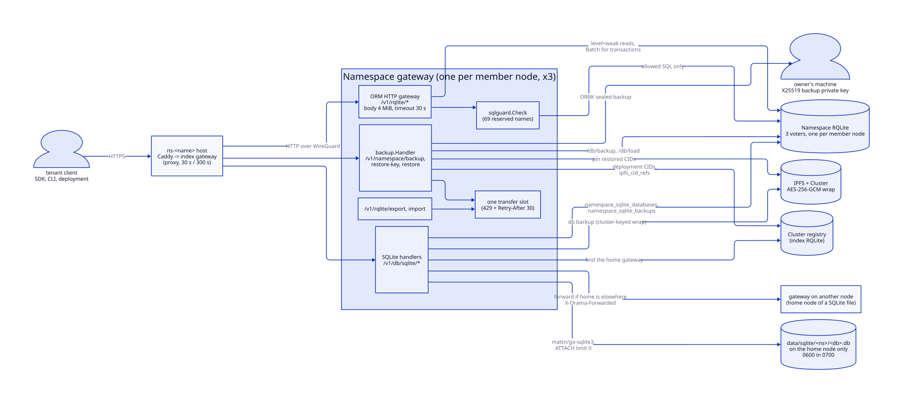
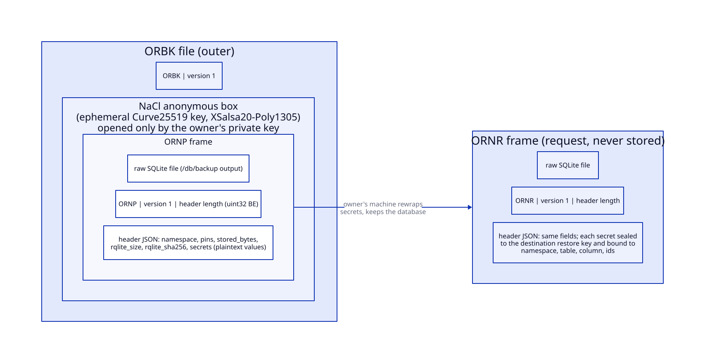
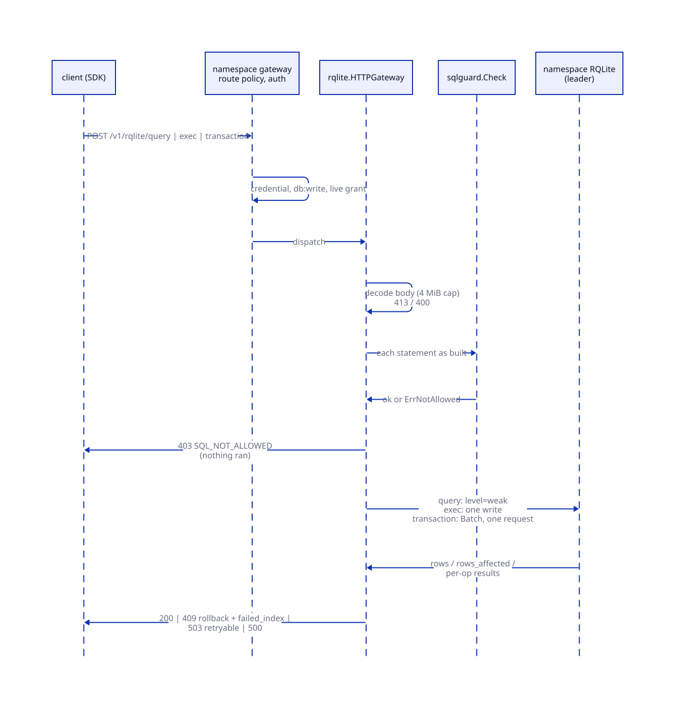
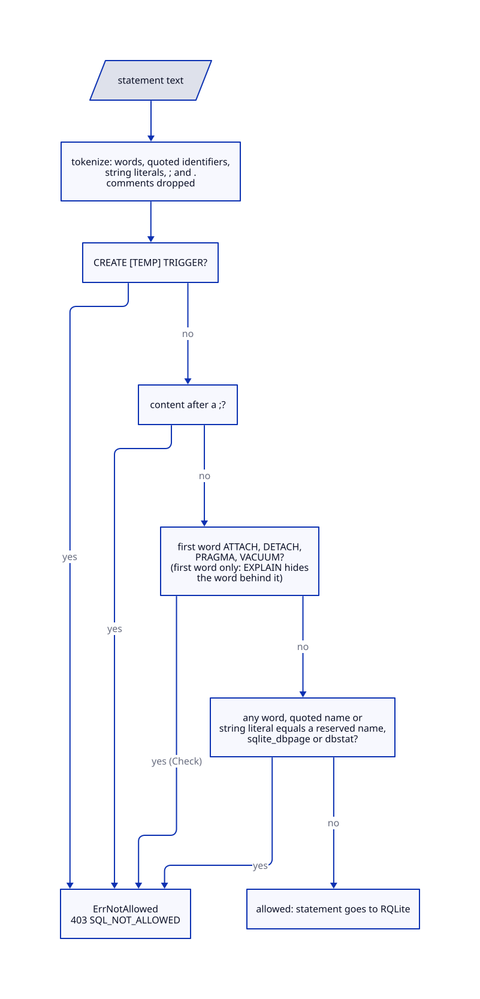
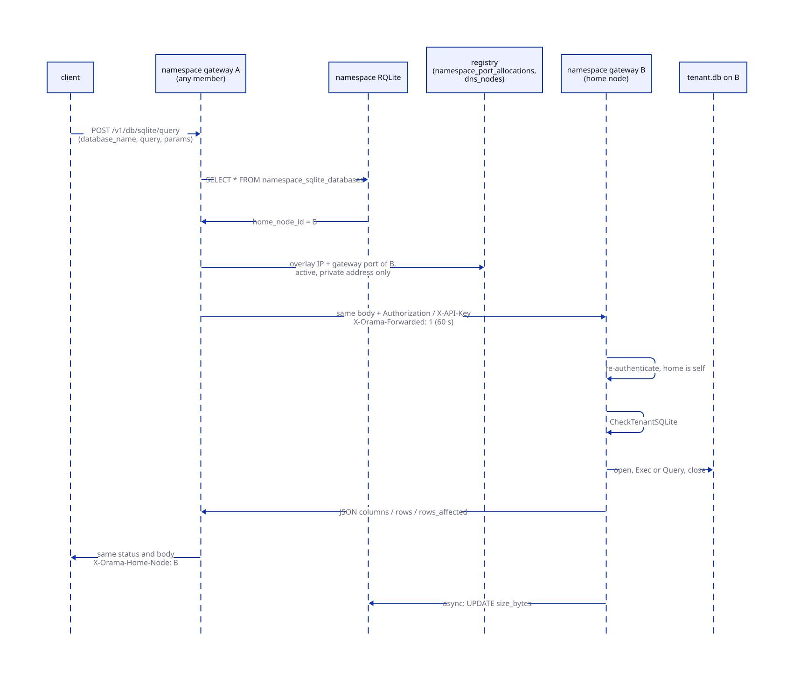
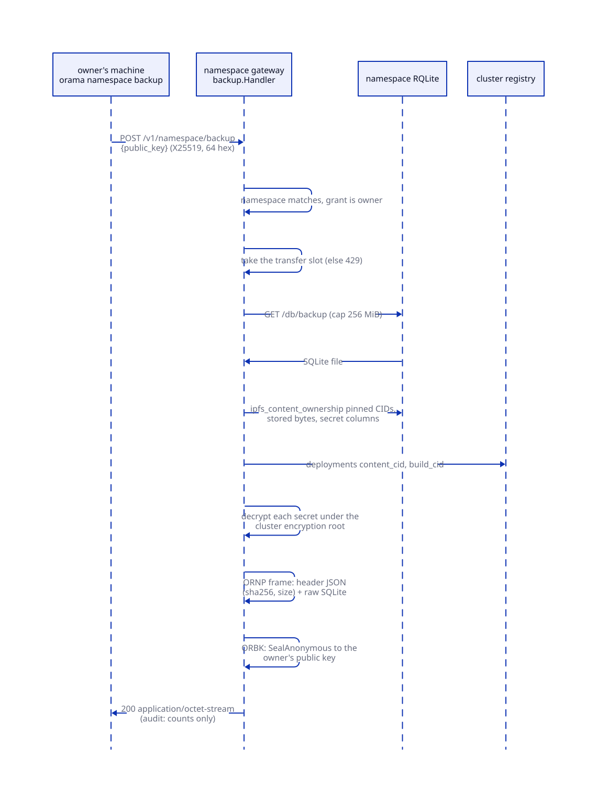
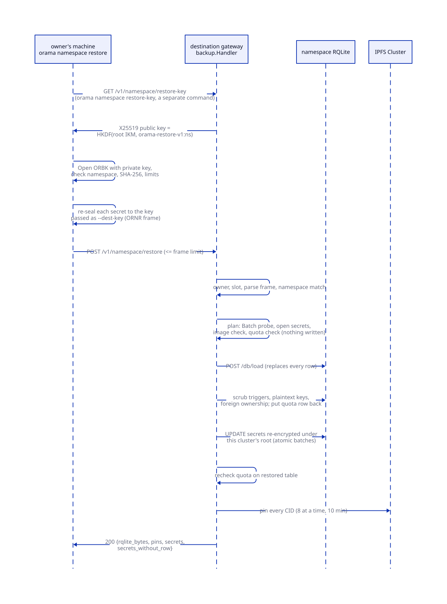

# Database

> **At a glance.**
>
> - **What:** the tenant-facing database service. A tenant has two kinds of database. The first is the namespace RQLite, a three-voter Raft group that is also the database the platform keeps its per-namespace rows in; tenants reach it through the ORM routes under `/v1/rqlite/` on their namespace gateway. The second is any number of SQLite files, each one file on one node, reached through `/v1/db/sqlite/` and forwarded to the node that holds the file. Because the first kind holds platform rows beside tenant rows, every statement a tenant sends goes through `core/pkg/sqlguard/`. Whole-database backup and restore (`core/pkg/nsbackup/`, `core/pkg/gateway/handlers/backup/`) seal a namespace to a key only the owner holds.
> - **Key numbers:** ORM request body 4 MiB, request timeout 30 s, at most 100 operations per transaction; 69 reserved table names; SQLite database names 1 to 64 characters of letters, digits, `_` and `-`, request body 1 MiB, forward timeout 60 s; backups and restores carry at most a 256 MiB database and 50,000 pins, run one at a time per gateway (429, `Retry-After` 30), with a 5 min transfer budget and a 15 min detached load; restore pins 8 CIDs at a time within 10 min.
> - **Code:** `core/pkg/sqlguard/`, `core/pkg/nsbackup/`, `core/pkg/gateway/handlers/sqlite/`, `core/pkg/gateway/handlers/backup/`, with the ORM gateway in `core/pkg/rqlite/gateway.go` and the export and import routes in `core/pkg/gateway/rqlite_backup_handler.go`.
> - **Depends on:** [cluster state](07-cluster-state.md) for the Raft mechanics and consistency levels, [namespaces](09-namespaces.md) for how the three-voter RQLite is provisioned, [the gateway](12-gateway-architecture.md) for the proxy and route policy, and [storage](19-storage.md) for the IPFS layer that holds SQLite backups.

## Why it exists

A tenant needs a database it can query from a browser, from a function and from a deployed process, and it needs to be able to take its data away. Three constraints shaped what exists.

First, Orama's design commitment is that tenants share no data layer. The tenant's relational store is therefore a Raft group of its own, one per namespace, running on the tenant's three member nodes. Chapter 9 explains how it is provisioned. This chapter starts where the gateway holds a handle on it.

Second, that same RQLite is not only the tenant's. The core migrations run in it, so the platform's per-namespace tables (function secrets, stored-object ownership, quotas, push and WebRTC configuration, the list of the tenant's SQLite files) sit in the same schema as the tenant's own tables, and the tenant's SQL runs with the rights of the connection that reads them. The package comment of `core/pkg/sqlguard/sqlguard.go` calls this "one database doing two jobs". The tables that decide identity (keys, grants, sessions) were moved out to the cluster registry, but 26 platform-trust tables remain (see [the model](#the-model)). Until the platform's own rows live somewhere tenant SQL cannot name, the statement is the only enforcement point, and the guard filters it.

Third, some applications want a plain embedded SQL file, with no Raft round trip and no cluster semantics. A SQLite file lives on one disk, so the service has to make one node the owner, route every request to it and say plainly what happens when that node is lost.

The last requirement is exit. A tenant that cannot get its data and its secrets out of a cluster is locked in, and a cluster operator who can read every backup is a trust problem. So a namespace backup is sealed to a public key the owner supplies. The cluster holds only that public key and cannot open what it wrote.

## The model

**Namespace RQLite.** The RQLite group started for a namespace by the tenant blueprint: three voters, one on each member node, listeners on the WireGuard address, authenticated by a basic-auth file ([namespaces](09-namespaces.md#rqlite)). A namespace gateway reaches the local member through `Config.RQLiteDSN`. It is the database of the tenant's application and the database of the namespace's platform rows.

**Cluster registry.** The index RQLite. A namespace gateway holds a second handle on it, `GlobalRQLiteDSN`, which is how a namespace gateway tells itself from the index gateway (`core/pkg/gateway/config.go:isNamespaceGateway`). Identity tables, deployments and cluster topology live only there ([cluster state](07-cluster-state.md#one-schema-two-placements)).

**Platform-trust table.** A table whose rows the platform acts on. `core/pkg/rqlite/schema_placement.go:tablePlacement` classifies every table the core migrations create by placement (cluster registry or namespace) and by trust (platform, tenant data, telemetry). The zero value is platform trust, so a table entered without thought is the guarded kind. Of the 39 tables placed in a namespace database, 26 are platform-trust (for example `functions`, `function_secrets`, `ipfs_content_ownership`, `namespace_quotas`, `namespaces`, `wireguard_peers`, `invite_tokens`), 10 are tenant data (for example `apps`, `push_devices`, `schema_migrations`) and 3 are telemetry (`function_invocations`, `function_logs`, `request_logs`).

**Reserved name.** One of the 69 names in `core/pkg/sqlguard/sqlguard.go:protectedTables`. A reserved name may not appear in tenant SQL in any role: as a table, a column, an alias, a parameter name or a string literal. A test, `TestProtectedTables_coverEveryPlatformTrustTable` in `core/pkg/sqlguard/sqlguard_test.go`, fails when a platform-trust table is missing from the list.

**ORM gateway.** `core/pkg/rqlite/gateway.go:HTTPGateway`, mounted at `/v1/rqlite` on every gateway (`core/pkg/gateway/route_policy.go:ormBasePath`). Nine routes expose the ORM client over JSON: `query`, `exec`, `find`, `find-one`, `select`, `transaction`, `schema`, `create-table`, `drop-table`. The SDK maps them to `db.query()`, `db.exec()`, `db.find()`, `db.transaction()` and the query builder (`sdk/src/db/client.ts`).

**Tenant SQLite database.** One file, `data/sqlite/<namespace>/<name>.db` under the node's Orama directory (`core/pkg/constants`, `SQLiteBaseDir`), plus one row in `namespace_sqlite_databases` naming its **home node**, the node whose disk holds the file.

**Namespace backup.** A single sealed file holding a snapshot of the namespace RQLite, the list of CIDs the namespace has pinned, and the namespace's secrets in plaintext, sealed with `nacl/box` `SealAnonymous` to the owner's X25519 public key. Three magics name its layers: `ORBK` is the outer sealed file, `ORNP` the payload frame inside it, `ORNR` the restore request an owner's machine builds from a payload.

**Restore key.** An X25519 key pair the destination gateway derives per namespace from its cluster's encryption root. Only the public half ever leaves the gateway.

## How it works

### Reaching the database

A tenant request addressed to `ns-<name>.<base domain>` reaches the index gateway of whatever node DNS handed out, which resolves the namespace's live gateways in the registry and proxies the request to one of them over the overlay ([the gateway](12-gateway-architecture.md#namespace-proxying)). The proxy budget is 30 s, raised to 300 s for the paths `core/pkg/gateway/middleware.go:isLongRunningProxyPath` names, which include the four whole-database routes (`core/pkg/gateway/namespace_proxy_limits.go:isWholeDatabasePath`) and not the SQLite routes. A SQLite query that reaches the index gateway first is therefore cut at 30 s there, whatever the forward's own 60 s allows. A member that cannot be dialled is skipped and the next is tried, as long as no byte of the body has been read. The namespace gateway authenticates the credential itself and then applies the route policy.

Every ORM route is declared once, from the list the ORM gateway reports (`core/pkg/gateway/route_policy.go:ormGatewayRoutes`), with the policy `owned(DomainDB, ActionWrite)`: the caller must hold `db:write` and a live grant in the namespace. A read is not cheaper than a write here, because the raw `query` route runs whatever SQL it is sent. The SQLite routes are `control(DomainDB, ...)`: `db:read` for list and backups, `db:write` for create, query, delete and backup, with no live-grant requirement. The two route families therefore differ in whether membership is checked, a difference [authorization](14-authorization.md) explains. No policy narrows a grant to a table: the selector vocabulary does not enforce `db:` selectors, and the comment in `core/pkg/gateway/auth/selector.go` says narrowing would need the statement parsed for the tables it touches.

### The ORM routes

`decodeBody` reads the JSON request body through `http.MaxBytesReader` at 4 MiB (`core/pkg/rqlite/gateway_body.go:MaxRequestBodyBytes`); a larger body is a 413 before a byte is parsed into a statement. The handler wraps the request context in a 30 s timeout, set where the gateway builds the ORM (`core/pkg/gateway/dependencies.go:initializeRQLite`).

The ORM client sits on a `database/sql` pool of at most 25 open and 5 idle connections, connections recycled at 5 min and idle ones at 2 min, over the `rqlite` driver. The DSN is rewritten with `disableClusterDiscovery=true&level=weak` (`appendRQLiteQueryParams`). `level=weak` is the default read consistency for tenant reads: a read goes to the leader and a leaderless node fails instead of serving stale rows. The comment above that function records why: with `level=none` a function that inserted and then selected could read the pre-write snapshot. Writes go to the leader whatever the level. [Cluster state](07-cluster-state.md#access-endpoints-credentials-consistency) defines all four consistency modes; tenant HTTP traffic uses only `weak`. The `none` connection the client also opens is used by serverless batch reads (chapter 21), never by these routes.

What each route does:

| Route | Behaviour |
|---|---|
| `query` | One statement through `Client.Query`. The answer is `items`, `count` and `columns` in SELECT order. |
| `exec` | One write statement. The answer is `rows_affected`, `last_insert_id`. |
| `find`, `find-one` | Table plus a criteria map. Keys must be plain column names, optionally qualified (`criteriaColumnRe`), because the key is written into the statement text. `find-one` answers 404 when no row matches. |
| `select` | A JSON query builder: table, alias, columns, joins, `where` fragments joined by AND or OR, group, order, limit, offset. `one=true` returns a single object. |
| `transaction` | Operations `exec` or `query`, or the legacy `statements` array of exec strings. |
| `schema` | `sqlite_master` name, type and DDL of every table and view not named `sqlite_%`. It runs without the guard, so the DDL of reserved tables is readable too. |
| `create-table`, `drop-table` | The schema text, or an identifier matched against `^[A-Za-z_][A-Za-z0-9_]*$`. |

Arguments are bound parameters, never interpolated. JSON numbers arrive as floats; `normalizeArgs` turns integral ones into `int64` so they match SQLite's integer affinity. The routes put no cap on the rows or bytes of an answer: the 10,000-row and 32 MiB caps (`core/pkg/rqlite/batch.go:MaxBatchQueryRowsPerOp`, `MaxBatchQueryTotalBytes`) belong to the serverless batch-read path, and the `query` operations of a `transaction` use none.

#### Transactions

`database/sql` transactions against the gorqlite driver are not real transactions (`Begin` and `Commit` are no-ops), so `transaction` goes through `Client.Batch` instead, which posts every write in one request to RQLite's `/db/execute?transaction` (`core/pkg/rqlite/batch.go:Batch`). Four properties follow from that implementation:

- **At most 100 operations** (`MaxBatchOps`). More is a 400 with code `TOO_MANY_STATEMENTS`.
- **Writes first, queries after.** Batch splits the operations into execs and queries. All execs run as one atomic request, in their original relative order. Only after that commits do the queries run, each as an ordinary read. A query operation therefore never sees the transaction's state in the middle and cannot feed a later write. A `query` operation is "read after commit", not "read inside the transaction".
- **Rollback is a 409.** A statement SQLite rejects rolls the whole batch back and answers `{status: "rollback", failed_index, error, code}` with HTTP 409, so a caller can branch on it.
- **Transport failures are 503 or 500, not 409.** A lost leader, a connection reset or an expired deadline produces no statement result. The batch carries the reason and a stable code (`BatchCodeUnavailable`, `BatchCodeDeadlineExceeded`) and answers 503. For a deadline or reset after the request was sent, whether the writes landed is unknown, and the response says so only through the code.

The guard runs on every operation before the batch is built; a refusal names the operation (`op 1: ...`) and nothing runs.

A gateway whose native gorqlite dial failed at start has no `Batch`; the client degrades to the stdlib-only form and every `transaction` call fails with `ErrNoNativeConnection` (`core/pkg/gateway/dependencies.go:initializeRQLite` logs the downgrade as a warning).

### The SQL guard

`core/pkg/sqlguard/sqlguard.go:Check` is the filter for tenant SQL aimed at a database that holds platform rows. It is installed on the ORM gateway of a namespace gateway (`core/pkg/gateway/core_registry_guard.go:ormSQLGuard`) and runs in front of the `db_query` and `db_execute` host calls of serverless functions (`core/pkg/serverless/hostfunctions/database.go`). The same guard is the building block of the image check and the scrub described later.

#### What it reads

The guard does not parse SQL. `tokenizeSQL` cuts the text into words, quoted identifiers in all four SQLite quoting styles (double quote, backtick, brackets and, as a string, single quote), string literals, semicolons and dots. Comments are discarded so a name cannot hide in one. The whitespace set is SQLite's plus vertical tab. The history of that choice sits in the comments: a missing form feed once let `FROM` followed by a form feed and a quoted name through (bugboard #425), and the test `TestCheck_refusesWhateverSQLiteReadsAsTheTable` in `core/pkg/sqlguard/sqlguard_sqlite_test.go` now uses SQLite itself as the oracle. It generates every separator byte, six statement templates and six ways to write the name, runs each against a real SQLite, and fails if SQLite accepts a statement the guard lets through.

`Check` then applies five rules, in the order of the token stream:

1. **No CREATE TRIGGER**, temporary or not. A trigger body is statements SQLite runs later on its own, which the guard never sees.
2. **One statement.** A semicolon followed by anything but more semicolons is refused.
3. **Denied first words:** `ATTACH`, `DETACH`, `PRAGMA` and `VACUUM`. They step outside the database or read engine state. Only the first word of the statement is judged, and `Check` does not look through a leading `EXPLAIN` (see below).
4. **No reserved name in any role.** A word or quoted identifier equal, after lower-casing and trimming, to one of the 69 names is refused, wherever it appears: table, column, alias or parameter. The guard does not track roles, because every attempt to track which positions SQLite reads as a table name missed one. The reserved set also contains the SQLite virtual tables `sqlite_dbpage` and `dbstat`, which read the file below the table level.
5. **No reserved name as a string literal.** SQLite reads a string literal as a name in `FROM 'api_keys'`, `FROM a, 'api_keys'`, `FROM ('api_keys')` and `UPDATE OR REPLACE 'api_keys'`. The literal is refused wherever it appears. A caller that needs the text as data binds it as an argument, which never reaches the SQL text.

The refusal is an `*sqlguard.ErrNotAllowed`; the ORM gateway turns it into HTTP 403 with `{"error": ..., "code": "SQL_NOT_ALLOWED"}` (`core/pkg/rqlite/gateway_guard.go:refuseSQL`). For `find` and `select` the guard reads the statement the query builder would produce, not the request fields, so a name hidden in a join condition or an order-by expression is seen.

#### What is reserved

The 69 names fall into groups, each with a stated reason in the source. Identity and authority: `api_keys`, `wallet_api_keys`, `refresh_tokens`, `nonces`, `principals`, `grants`, `signing_keys`, `operators`, `session_devices`, `device_authorizations`, `revoked_tokens`, `invite_tokens`, `node_credentials`, `encryption_roots`. Limits: `namespace_quotas`, `namespace_rate_limit_config`, `cluster_settings`. Topology and naming: the `namespace_*` cluster tables, `dns_records`, `dns_nodes`, `wireguard_peers`, `raft_evicted_nodes`, `tls_store`. What runs where: `deployments` and its satellites, `home_node_assignments`, `port_allocations`. What a trigger fires: `functions`, `function_cron_triggers`, `function_pubsub_triggers`, `function_db_triggers`, `function_secrets`, `function_env_vars`. Per-namespace configuration written by validating handlers: `namespace_push_config`, `namespace_webrtc_config`, `webrtc_settings`, `webrtc_admissions`, `namespace_sqlite_databases`, `namespace_sqlite_backups`. Content ownership: `ipfs_content_ownership`, `ipfs_cid_refs`. Two runtime tables created outside the migrations: `_pubsub_mesh_peers`, `_namespace_libp2p_peers`. The audit trail and the public uptime record are reserved because a record its own subject can rewrite is not a record.

The list is deliberately not every table. Generic names a tenant may already use as its own are left out, because reserving them would break working applications: the comment on `protectedTables` points at `apps`, which belongs to whoever wrote to it first. The reverse cost exists as well. A tenant application that owns a table called `functions`, `deployments`, `namespaces`, `grants` or `operators` is refused, because the platform's namespace copy shares the name. [Serverless](21-serverless.md) documents the list for tenants, and `TestProtectedTables_matchTheDocumentedList` keeps `docs/SERVERLESS.md` identical to the source.

#### Which database is guarded

Whether the guard is installed depends on which database the gateway serves, never on who calls. `servesCoreRegistry` is true when the gateway's own namespace is the lobby namespace `default`, the index gateway. There `ormSQLGuard` returns nil, because the raw routes are the registry, and `requireOperatorForCoreRegistry` refuses every `/v1/rqlite/` request that is not an operator's with `NOT_AN_OPERATOR`. If the operator list cannot be read the answer is 503, never a pass. On a namespace gateway nothing is exempt: owner and admin included, since an admin who could write `api_keys` directly would bypass the key-minting path and its scope checks. A gateway with no configuration counts as a namespace gateway, so the failure mode is refusal. The cluster registry is also never a function's database (`functionDatabaseNamespace`).

#### What it cannot do

The package comment states the admitted hole: a view or trigger created before the guard existed can still reach a protected table when queried by its own name, because the querying statement does not mention the protected table. The guard closes the direct path only. The paths that bring such objects in are closed separately: tenant SQL cannot create a trigger, `CREATE VIEW` over a reserved name is refused as a statement, and whole-database loads are checked as images (below). A trigger or view that predates the guard in a long-lived namespace is not removed by anything except a restore or import.

Four more limits come from the guard working on names and not on SQLite's grammar. None of them reaches a reserved table's rows.

- **Pragma functions are not judged.** `Check` has no rule for the table-valued pragma functions (`pragma_database_list` and the rest of the `pragma_*` family); `CheckTenantSQLite` holds them to the allowlist (`core/pkg/sqlguard/sqlguard.go:checkPragmaFunction`). They are read-only: SQLite refuses an argument that would set a value ("too many arguments"). `SELECT * FROM pragma_database_list` answers with the absolute path of the RQLite node's `db.sqlite`, which is the data-directory layout of the node that ran the statement. Its readers are the holders of `db:write` in the namespace and its function authors, over the ORM routes and the `db_query` host call. It is a disclosure of layout, not of data, and it needs another primitive to be of use; the other pragma functions return compile options, the function and module lists and the like.
- **Names assembled at run time are not names.** The guard compares tokens, so `pragma_table_info('gran' || 'ts')` passes and returns the column names and types of a reserved table. Only schema is exposed this way; the rows stay behind the name filter.
- **`EXPLAIN PRAGMA` passes.** A leading `EXPLAIN` makes `Check` judge `EXPLAIN` as the first word, not the pragma behind it, while SQLite applies a setting pragma when it compiles the statement (the comment on `statementTokens` records the same fact for the tenant check, which strips the prefix). `EXPLAIN PRAGMA hard_heap_limit=N` therefore sets the heap limit of the whole `rqlited` process that ran it. A caller with `db:write` can make the allocations of its own namespace's RQLite fail. The process is the namespace's own, so the damage is the caller's namespace, not another tenant's.
- **No table-level authorization.** A caller with `db:write` may run any statement that names no reserved table, against any non-reserved table in the namespace.

### Tenant SQLite databases

#### Create and the home node

`CreateDatabase` (`core/pkg/gateway/handlers/sqlite/create_handler.go`) takes the namespace from the request context, which the authentication middleware set, and a database name from a body capped at 1 MiB. A name must be 1 to 64 characters of letters, digits, `_` and `-` (`isValidDatabaseName`). The name becomes a path component, so nothing else is allowed. The home node is the gateway's own peer id, `Config.NodePeerID`: a SQLite file is a local file, so the node that served the create is its home, whichever of the three member nodes the proxy chose. Only a gateway with no peer id (single-node and test setups) falls back to `HomeNodeManager.AssignHomeNode`.

The file path is derived, never read back from the registry: `databasePath` joins the handler's base directory, the namespace and `<name>.db`. The `file_path` column records the absolute path at creation, but a database created before the move to `<oramaDir>/data/sqlite` recorded a path that no longer exists after an upgrade moved the tree, so the column is informational.

The handler creates the file, then the row. `createPrivateDBFile` creates the base and namespace directories with mode 0700 and narrows them if they already exist (nodes created them 0755 before), opens the file with `O_CREAT|O_NOFOLLOW` and mode 0600, and chmods it. SQLite gives the `-wal` and `-shm` files it creates later the database file's mode. `PRAGMA journal_mode=WAL` is set once, at creation; a failure to set it is logged as a warning and the create continues. Last, the handler inserts the row into `namespace_sqlite_databases` (`UNIQUE(namespace, database_name)`, migration 006; `created_by` holds the namespace name, not a wallet); if that fails it removes the file. The duplicate check before any of this treats every error from the registry read as "does not exist", and the file is opened without `O_EXCL` (see Known gaps).

These modes matter: they used to be 0644 and 0755, so any user on the host, a tenant's deployment included, could read every namespace's data. A deployment now runs as a dynamic user in a sandbox where `/opt/orama` is an empty tmpfs ([app deployments](11-app-deployments.md)), so the only door to a tenant SQLite file is the gateway.

#### Query

`QueryDatabase` decodes `database_name`, `query` and `params`, looks up the row, and compares `home_node_id` with its own peer id. If they differ it forwards (next section). On the home node the order is:

1. `os.Stat` the derived path; a missing file is 404 "not found on this node".
2. `rejectCrossDBSQL`, which calls `sqlguard.CheckTenantSQLite`.
3. `openTenantDB`, a connection on a driver registered as `sqlite3_tenant_noattach`. Its connect hook sets `SQLITE_LIMIT_ATTACHED` to 0, so ATTACH fails in the engine whatever the text says. Extension loading is off in the build, and `TestOpenTenantDB_loadExtensionDenied` asserts the engine refuses `load_extension`.
4. Execute. The statement is classified write or read by `isWriteQuery`, a prefix test against `INSERT`, `UPDATE`, `DELETE`, `CREATE`, `DROP`, `ALTER`, `TRUNCATE`, `REPLACE`, `ATTACH`, `DETACH`. The classification only chooses the response shape: `ExecContext` returns `rows_affected` and `last_insert_id`, `QueryContext` returns `columns` and `rows`. A `WITH ... INSERT` goes through the query path and runs; it just reports no affected rows. An `INSERT ... RETURNING` goes through the exec path and its rows are discarded. Safety does not depend on the classification.
5. The connection is closed. Every request opens and closes its own handle; there is no pool.

A statement error is a 400 whose body carries SQLite's message. The response is built whole in memory; there is no row cap and no statement timeout other than the request context. A failure to read the registry row, for any reason, is answered as 404 "Database not found" (`getDatabaseRecord` returns the error and the handler does not tell it from a missing row), so a namespace RQLite without a leader makes every SQLite route answer 404.

`CheckTenantSQLite` is a different filter from `Check`. A tenant SQLite file holds only the tenant's data, so the reserved names do not apply. What must be refused is every way to reach outside the file or into the serving process: control bytes (SQLite stops reading at a NUL, and a driver that splits the tail would see a second statement the guard did not), more than one statement, ATTACH and DETACH, `VACUUM INTO`, and any pragma not in `tenantAllowedPragmas`. That list holds 16 read-only or per-file pragmas such as `table_info`, `index_list`, `foreign_keys`, `user_version`, `integrity_check` and `page_count`. The list is an allowlist because a denylist missed `hard_heap_limit`, which sets SQLite's process-wide heap limit and lets one tenant fail every other tenant's query on the gateway, and `database_list`, which returns the file's absolute path. A leading `EXPLAIN` or `EXPLAIN QUERY PLAN` is stripped before the first word is judged, since SQLite applies a setting pragma while compiling it. Pragma functions are held to the same allowlist whether written as a word, a quoted name or a string literal.

#### Forwarding to the home node

`forwardToHome` (`core/pkg/gateway/handlers/sqlite/forward.go`) sends the original body to the gateway on the home node and writes that gateway's answer back, status and body unchanged, with `X-Orama-Home-Node` set. The same code serves query, delete and backup. It first refuses when `X-Orama-Forwarded` is already present: a forwarded request is served by the receiver or refused, never forwarded again, so a registry that names the wrong node cannot create a loop.

`homeGateway` finds the address. On a namespace gateway it runs `namespaceGatewayOnNodeQuery` against the cluster registry: the namespace's gateway port on that node from `namespace_port_allocations`, joined to `namespace_clusters` (status `ready` or `degraded`), to `namespace_cluster_nodes` (role `gateway`, status `running`) and to `dns_nodes` (status `active`). On the index gateway it reads `dns_nodes` and uses the index gateway port. The reason for a separate registry handle is in the code: a namespace gateway's own RQLite has a `dns_nodes` table that is permanently empty. The address must parse as a private or loopback IP, so the hop stays on the overlay. A registry row with a public address is rejected.

The forward is an HTTP request over the overlay with a 60 s context, carrying `Authorization` and `X-API-Key` from the original; the receiver authenticates the caller again, and a request that arrived with a key and left without it was refused there for a call the first node had accepted. A `?api_key=` parameter travels in the request URI. If the registry has no usable address, or the request was already forwarded, the caller gets 421 "Database is on a different node and this gateway could not reach it". If the home is addressable but does not answer, the caller gets 502. Serving from the local disk would be a different database, so neither case falls back.

#### Size accounting

After every query on the home node the handler starts `go h.updateDatabaseSize(...)`, which stats the main file and issues `UPDATE namespace_sqlite_databases SET size_bytes` to the namespace RQLite with a background context. That is one Raft write per successful SQLite query, reads included, on a goroutine whose context has no deadline of its own and that nothing bounds in number. The size excludes the `-wal` file. Nothing reads `size_bytes` to enforce a limit; it feeds `orama db list`.

#### List and delete

`ListDatabases` reads the namespace's rows ordered by creation, newest first. `DeleteDatabase` forwards to the home node like a query, deletes the registry row first and the files second. The order is documented in the code: a row without a file is a clear "not found" and can be recreated, while a file without a row is invisible to every command and occupies disk nobody can account for. It removes the database and its `-wal`, `-shm` and `-journal` sidecars (`sqliteSidecarSuffixes`), because a leftover `-wal` would replay a previous tenant's uncheckpointed writes into a database later created under the same name. A file already gone is not an error, so a delete is repeatable after a partial failure; the files that cannot be removed are all listed in one error, with the row already gone.

### SQLite backups

`BackupHandler` in `core/pkg/gateway/handlers/sqlite/backup_handler.go` (the `BackupDatabase` method, route `/v1/db/sqlite/backup`) forwards to the home node, opens the main database file and hands it to `ipfsClient.Add(ctx, file, name+".db")`, then records two rows: a history row in `namespace_sqlite_backups` (`backup_type` is always `manual`; the actor is the JWT subject, or the literal `api key`, because a raw key is never stored) and the pointer `backup_cid`, `last_backup_at` on the database row. `ListBackups` returns the 50 newest and is answered from the registry row, never forwarded. The backup route needs `db:write`, the list `db:read`.

This is not the owner-sealed backup. `Add` reads the whole file into memory with `io.ReadAll`, wraps it when the name does not end in `.tar.gz` or `.tgz` (AES-256-GCM under a key derived from the cluster secret, `core/pkg/ipfs/wrap.go:wrapPrivateBlob`, label `ipfs-wrap-v1`, envelope magic `ORMAW1`), builds a multipart body, and pins the result on every cluster peer (`core/pkg/ipfs/client.go:Add`, replication factor -1). The file at rest in IPFS is not plaintext, but the cluster can open it. [Storage](19-storage.md) owns that layer. Three things follow from how the handler is built:

- It uses neither SQLite's online backup API nor a lock, and it reads the main file only (see Known gaps).
- It writes no `ipfs_content_ownership` row. The CID is therefore not counted in the namespace's storage quota, is not in the pin list of a namespace backup, and cannot be fetched through `/v1/storage/get`, which serves only CIDs the namespace has a row for. Deleting the database does not unpin it either.
- It has no size limit and does not take the transfer slot. The gateway holds the file, its ciphertext and the multipart body at once, so a database of a few hundred MiB approaches the 1 GiB `MemoryMax` of the namespace gateway unit.

### Namespace backup

`POST /v1/namespace/backup` takes `{"public_key": "<64 hex>"}`, a body capped at 1 KiB. `authorize(requireOwner=true)` first checks that the credential's namespace is the gateway's and that the caller's grant is the namespace owner's: "an admin grant is not enough". The route policy additionally requires `secrets:read` and a live grant, because a backup contains every secret in the namespace (`core/pkg/gateway/route_policy.go`). `GET /v1/namespace/restore-key` is looser: its handler checks only the namespace, and the policy asks for `db:read` and a live grant, because the key it prints is public.

The handler takes the gateway's transfer slot (below), gives the response the five-minute transfer budget (`httputil.TransferBudget`), and calls `gather`:

1. **Snapshot.** `GET /db/backup` on the namespace RQLite, read through `io.LimitReader` at `MaxRQLiteBytes + 1`; one byte over fails with `ErrTooLarge`, which the handler answers as 413. The snapshot client does not follow redirects (a followed POST loses its body) and has a 5 min timeout.
2. **Pins.** Every CID in `ipfs_content_ownership` with `is_pinned = 1`, plus `content_cid` and `build_cid` of each of the namespace's deployments, which are read from the cluster registry because the namespace's own `deployments` table is an empty copy. Sorted, deduplicated, at most 50,000 (`MaxPins`).
3. **Stored bytes.** `SUM(size_bytes)` over the ownership rows, the figure the storage quota counts.
4. **Secrets.** For each column in `core/pkg/secrets/walk.go:NamespaceColumns` (function secrets, push device and topic tokens, push configuration and credentials, the TURN shared secret), the handler reads every row, decrypts any value that carries the encryption prefix under the cluster's encryption root and carries unprefixed legacy plaintext as it is. A value that fails to decrypt fails the whole backup with 500: "a backup that silently lacks a secret is how one is lost". Secrets are read after the snapshot, so every row in the snapshot has its secret; one inserted between the two is carried too and matches no row on restore.

The payload is then marshalled and sealed.

#### The formats

The sealed file is five bytes of clear text, `ORBK` and version byte 1, followed by one `nacl/box` anonymous box (`core/pkg/nsbackup/seal.go:Seal`). `SealAnonymous` generates an ephemeral Curve25519 key per file, so the box costs 48 bytes (a 32-byte public key and a 16-byte tag) and the recipient needs only its private key. The cluster, which has the recipient's public key and the ephemeral private key for a moment, cannot open the box afterwards.

Inside the box is the `ORNP` frame (`core/pkg/nsbackup/payload.go`): the four magic bytes, version 1, the header length as a big-endian uint32, a JSON header, then the raw SQLite file. The raw file is carried without base64 so a large database is not inflated by a third. The header holds the namespace, the pin list, the stored-byte count, the SQLite size and its SHA-256 as hex, and the secrets with their plaintext values. Readers use `DisallowUnknownFields` and refuse trailing data after the header, enforce `maxHeaderBytes` of 8 MiB (tens of thousands of secrets), and refuse a frame over `MaxFrameBytes` (256 MiB + 8 MiB + 9). `checkFrame` verifies that the recorded size and SHA-256 match the bytes, that the namespace name is valid, that the file starts with the 16-byte SQLite header, that pins are valid CIDs without duplicates, and that every secret names a column on the `NamespaceColumns` list with the right number of non-empty id values. That last check means a restore can never be made to write a secret anywhere else.

The gateway holds the frame whole: the comment says it holds about three copies of the snapshot while it seals one (the `/db/backup` read, the frame and the box). That is why the database cap is 256 MiB.

The CLI can also seal the file into a private storage deal (`orama namespace backup --deal-dir`, restored with `restore --from-deal`); that is a use of [storage](19-storage.md), not a different format. `orama namespace backup-seal` and `backup-open` apply `Seal` and `Open` to any file.

#### Audit

A successful backup or restore records an event with `Action` `namespace.backup` or `namespace.restore`, the actor, and metadata of counts only: `pins`, `secrets` and `rqlite_bytes`. What moved is recorded, never the content.

### Restore

The destination cluster's encryption root is not the source's, so the secrets cannot be restored as they are. A restore runs in two halves, split at the owner's machine.

**On the owner's machine** (`core/cmd/orama/internal/cmd/namespacecmd/restore.go:runRestore`): the destination's restore public key is an input, passed as `--dest-key`; `orama namespace restore-key` prints it from `GET /v1/namespace/restore-key`. The command opens the backup with the owner's private key from a key file (never the command line), unmarshals and verifies the frame, refuses if its namespace is not the `--namespace` given, and calls `Payload.Rewrap(dest)`. `Rewrap` seals each secret to the destination key as a `WrappedSecret`, with the namespace, table, column and ids inside the box and bound to it (`boundSecret`). On the destination, `OpenSecrets` checks that the opened box names the namespace and the row it was sent for, and fails the whole set with `ErrSecretMismatch` otherwise, so a secret cannot be moved to another row or another namespace and replayed. The result is an `ORNR` frame: same layout as `ORNP`, no backup key anywhere in it. Everything that can fail on the owner's machine fails before anything is sent.

The restore key is `RestoreKey(root, namespace)`: HKDF over the root's current IKM with the label `orama-restore-v1:<namespace>` produces a 32-byte X25519 scalar (`core/pkg/nsbackup/restore.go`). It differs for every namespace, it changes when the encryption root is rotated, and the private half is derived on demand and never stored. A frame sealed to a key from before a rotation is refused with `ErrNotForKey` and the message tells the owner to fetch the key again.

**On the destination gateway** (`core/pkg/gateway/handlers/backup/restore.go:RestoreHandler`):

1. Owner authorization, the transfer slot, the transfer budget.
2. `readRestore`. An announced `Content-Length` over `MaxRestoreBytes` is a 413 without reading the body; an unannounced body is read through `MaxBytesReader` and refused at the same size. The frame is decoded and verified; a namespace that is not the gateway's is 409.
3. `plan`, which writes nothing. It probes that the gateway's client can run atomic batches (`Batch` with `SELECT 1`; the stdlib-only client cannot, and finding that out after the load would leave a database whose secrets nobody can write, so it is a 503 before anything happens). It opens every secret with the namespace's restore key and re-encrypts it under this cluster's encryption root, producing the `UPDATE` statements. It checks the database image (below). It reads the destination's storage budget and refuses a backup whose logical bytes times the IPFS replication factor exceed it (`ErrOverQuota`, 413, "nothing was written").
4. `apply`, on a context detached from the request with a 15 min timeout (`loadContext`), so a client that disconnects after the load began does not stop the work. It calls `POST /db/load`, which replaces every row of the namespace RQLite; that one HTTP call is bounded by the snapshot client's own 5 min timeout (`core/pkg/gateway/rqlite_backup_handler.go:rqliteSnapshotTimeout`), and the 15 min covers the load, the scrub, the secrets and the pins together. Then it runs `finishLoad`, whether or not the load reported an error, because a failed load may still have been applied: the scrub, then the destination's own quota row back in place (below). Then it writes the re-encrypted secrets in atomic batches of `rqlite.MaxBatchOps` and counts the updates that matched no row (`SecretsWithoutRow`: secrets created on the source after the snapshot). It re-checks the quota against the restored ownership table, because the table, not the request header, is what the quota counts from now on. Last it pins every CID with 8 in flight (`pinConcurrency`) within `pinPhaseTimeout` of 10 min; the first failure cancels the rest.
5. The response gets a fresh transfer budget (`renewDeadlines`), so a long check, load and scrub that spent the original one does not turn a success into a cut connection. The answer is `{namespace, rqlite_bytes, pins, secrets, secrets_without_row}`.

A failure after the load leaves the loaded database and answers 502 "restore failed after the database was replaced; running the same restore again is safe". A restore is idempotent: it replaces the same rows, writes the same secrets and pins the same CIDs.

What a restore does not restore: the registry's rows. Keys, grants, sessions, deployments and their domains live in the cluster registry, so a restore neither brings back a key that was revoked nor removes one minted since, and it does not recreate deployments, only pins their content. A deployment's environment is a registry column (`core/pkg/secrets/walk.go:IndexColumns`), so a backup does not carry it either. The SQLite files of the namespace are not in a namespace backup at all.

### Checking an image before it is loaded

A restore or an import replaces every row of the namespace database, and the SQL guard, which filters statements, never sees them. Most of what an image can carry is inert, because keys, grants and sessions are read from the registry. Three things are not: a trigger, a view over a platform table (both run or are queried by statements that do not name the table), and an ownership row, since `/v1/storage/get` serves a CID to any namespace that holds a row for it.

`CheckImage` (`core/pkg/gateway/handlers/backup/image.go`) runs before RQLite sees the image, because afterwards all three gateways of the namespace serve tenant writes against it and a trigger would fire before any scrub could run. The image is spooled to a temporary file (`Spool`, which removes it on any read error) and opened read-only and immutable in the same SQLite the gateway links (`file:<path>?mode=ro&immutable=1`), with `PRAGMA trusted_schema = OFF` so nothing in its schema runs while it is read. The check takes at most 3 min (`imageCheckTimeout`) and refuses, with 400 and "nothing was written", an image that:

- does not begin with the 16-byte SQLite header, or fails `PRAGMA quick_check`;
- contains any trigger;
- contains a view for which `sqlguard.Check` of its stored definition refuses (a view over a reserved name);
- has an ownership row for this namespace whose CID the registry's `ipfs_content_ownership` reference counts (`ipfs_cid_refs`) record only against other namespaces. The table name is matched case-insensitively, as SQLite resolves it, and a table without the `cid` and `namespace` columns is refused with a message naming the column.

What it accepts is passive, so real older backups still restore: plaintext `api_keys` rows (a namespace gateway validates keys against the registry and reads none from its own database) and ownership rows of other namespaces (every read filters on the gateway's own namespace). An ownership row for a CID the registry has no record of at all is accepted too: a restore onto another cluster consists of such rows, and `docs/SECURITY.md` records the cost, that the namespace then already claims that CID. A registry that cannot answer is a 502, never a refusal of the image.

After every load `scrubLoadedImage` runs, detached, on the namespace database. It drops every trigger and every view the guard would refuse as a statement (names quoted as identifiers), deletes plaintext `api_keys` rows (`key LIKE 'ak_%' OR key LIKE 'orama_%'`, tolerating a database with no such table), and deletes ownership rows of other namespaces and rows for CIDs the registry records only against others, 500 CIDs per registry query. On an image that passed `CheckImage` it finds nothing to do; it is the backstop. Only then does `finishLoad` write the destination's `namespace_quotas` row back, or delete the row if there was none: a backup cannot bring its own quota, and the scrub comes first so no quota is written while a trigger could still fire on it.

What the scrub cannot do is check `size_bytes` of the ownership rows it keeps. No gateway call reports a pinned object's size, so an owner can understate its stored bytes to an opt-in quota by editing the backup (see Known gaps).

### Export and import

`GET /v1/rqlite/export` and `POST /v1/rqlite/import` proxy RQLite's own `/db/backup` and `/db/load` (`core/pkg/gateway/rqlite_backup_handler.go`). They are the same act as backup and restore without the sealing (the export is a raw SQLite file with no cap, the import must be sent as `application/octet-stream`), so on a namespace gateway they too require the owner (`refuseWholeDatabaseToNonOwner`, code `OWNERSHIP_REQUIRED`): with only `db:read` and `db:write` they used to be a developer's way to read every function secret and to write the rows the gateway trusts. Import on a namespace gateway spools the body under `MaxBytesReader` at 256 MiB (`rqliteImportMaxBytes`, an announced larger body is a 413 unread), runs `CheckImage`, calls `GuardLoad` to read the quota it must restore, loads, and then scrubs and restores the quota exactly as a restore does. On the index gateway the same route is an operator's replacement of the registry: streamed, uncapped, checked only for the SQLite header, because RQLite's `/db/load` also accepts a SQL dump and reads a body that is neither as an empty dump (200, nothing loaded).

All four whole-database routes share one `Slot`: a one-element channel per gateway process. `Begin` takes it or answers 429 with `Retry-After: 30` and "another backup, restore, export or import is running". The slot exists because each of these holds a snapshot in memory or keeps a connection to RQLite open for minutes. The slot is per gateway process, and a namespace has three of them, so three transfers can run in the namespace at once.

## State it owns

| State | Holds | Written by | Read by | Where |
|---|---|---|---|---|
| `namespace_sqlite_databases` | One row per tenant SQLite file: id, namespace, name, `home_node_id`, `file_path`, `size_bytes`, `backup_cid`, `last_backup_at`, `created_by` (the namespace name). `UNIQUE(namespace, database_name)` | SQLite create, query (size), backup, delete | SQLite handlers on every member gateway | Namespace RQLite |
| `namespace_sqlite_backups` | One row per backup: id, `database_id`, `backup_cid`, `size_bytes`, `backup_type`, `created_by`. The foreign key to the database row declares `ON DELETE CASCADE` | SQLite backup | `ListBackups` (50 newest) | Namespace RQLite |
| `data/sqlite/<namespace>/<name>.db` plus `-wal`, `-shm` | The tenant's file. Directories 0700, files 0600, owned by the gateway user | SQLite handlers on the home node only | The same | The home node's disk |
| `ipfs_content_ownership`, `namespace_quotas` | The pinned-object list and the storage budget that backup, restore and quota checks read and that restore replaces and puts back. `namespace_quotas.max_sqlite_databases` and the `current_*` usage columns are declared by migration 006 and read or written by no Go code | Storage handlers; restore (quota row) | Backup handler, storage handlers | Namespace RQLite |
| `ipfs_cid_refs`, `deployments` | Cross-namespace reference counts and deployment CIDs read for the pin list and the image check | Storage and deployment services | Backup handler | Cluster registry |
| Backup, restore and export transfer slot | One channel of capacity 1 | `Slot.Begin` | The four whole-database routes | Memory of each gateway process |
| Spooled image | A temporary file `orama-image-*.db`, mode 0600 by `os.CreateTemp`, removed on every path | `Spool` | `CheckImage`, `/db/load` | The gateway's temp directory |
| ORBK files, ORNR requests, owner private key | Sealed backups and the key that opens them | The owner | The owner | Never on the cluster |
| Restore key pair | Derived from the encryption root and the namespace on each call | `RestoreKey` | Restore and `restore-key` | Not stored |

The tracker table that records which core migrations a namespace database has applied, `orama_schema_migrations`, is owned by [cluster state](07-cluster-state.md#migrations). Its name is deliberately not `schema_migrations`, which near every tenant migrator uses for itself.

## Lifecycle

**Namespace provisioning.** When a namespace gateway starts, `prepareSchema` waits for a leader on its RQLite and applies the embedded core migrations through `ApplyEmbeddedMigrationsNamespace` under the cluster-wide migration lock. It strips statements that target cluster-only tables, `schema_migrations` and `subscriptions`. It then drops core's leftover `schema_migrations` when it has core's two-column tracker shape (a tenant's has a `name` column and stays), core's `subscriptions` only when it is empty and has core's exact shape, and a cluster-only table only when it is empty. A cluster-only table that holds rows is left in place with a warning, never dropped. The gateway then asserts the schema contract against the isolated tracker and refuses requests until it holds ([gateway](12-gateway-architecture.md)). The three gateways of a namespace start together and serialise on the lock.

**Normal operation.** ORM requests flow through the guard to the leader. SQLite requests flow to the home node. Backup and restore are operator-initiated; the cluster takes no backups of a namespace by itself, which the CLI help says in as many words.
**Rolling upgrade.** The migrations are expand-only where binaries overlap, so a namespace whose three gateways run different versions keeps working: a gateway may see a newer schema than it requires. Upgraded `protectedTables` apply per binary, so during the window a gateway on the older binary admits a name the newer one refuses. Backup frames carry `version 1` in each of the three magics; the reader refuses any other version.

**Restart.** The SQLite handlers hold no state: every request opens the file and closes it. A gateway restart loses only an in-flight transfer (the slot is memory) and any in-flight size update. A restart of the home node's gateway makes its databases unreachable for the duration, since no other node has the file.

**Node loss.** A lost namespace RQLite member is a Raft membership event handled by [reconciliation and recovery](10-reconciliation-and-recovery.md). A lost home node is different: the file is on that disk and nowhere else. The registry row still names the dead node, `dns_nodes.status` is no longer `active`, and every query, delete or backup of that database answers 421 until the namespace is deleted or someone restores the file by other means. Nothing in the code reassigns `home_node_id` or restores a file from a backup (see Known gaps).

**Deletion.** Deleting a namespace removes its rows and, on every node that hosts it, the SQLite directory of that namespace, scoped to directories whose marker names it ([namespaces](09-namespaces.md#teardown-and-deletion)).

## Failure modes

| Trigger | What the system does | What you observe |
|---|---|---|
| Namespace RQLite has no leader | `weak` reads and writes fail; transactions get no statement result and are classified `unavailable`. Every SQLite route reads its registry row first and cannot | ORM routes answer 503 with a code on transactions, 500 with the driver's message on the other routes. SQLite routes answer 404 "Database not found"; the files are intact |
| Request body over 4 MiB on an ORM route | Refused before parsing | 413 "request body exceeds the 4 MiB limit" |
| Tenant SQL names a reserved table, a second statement, a trigger or a PRAGMA | Refused before it reaches RQLite | 403 `SQL_NOT_ALLOWED` naming the reason; in a transaction, naming the operation |
| Transaction statement fails | Whole batch rolls back | 409 with `failed_index`, `error`, `code` |
| Transaction deadline or connection reset after send | Unknown whether the writes landed | 503 with `DEADLINE_EXCEEDED` or `UNAVAILABLE`; retry only what is idempotent |
| More than 100 operations in a transaction | Refused | 400 `TOO_MANY_STATEMENTS` |
| SQLite query on a non-home node, home reachable | Forwarded over the overlay, answer relayed | The home's status and body, plus `X-Orama-Home-Node` |
| Home node down or not `active` in the registry | No address, or no answer | 421 "could not reach it" or 502 "did not answer"; data is unreachable, not lost |
| Forward loop | `X-Orama-Forwarded` present, receiver is not home | 421 |
| SQLite file missing on the home | Stat fails | 404 "Database file not found on this node" |
| Tenant SQL tries ATTACH, `VACUUM INTO`, an unlisted pragma, a NUL byte, several statements | Refused by `CheckTenantSQLite`; ATTACH also fails in the engine | 400 with the reason |
| Second backup, restore, export or import on a gateway | Slot busy | 429 with `Retry-After: 30` |
| Database over 256 MiB, or over 50,000 pins | Backup refuses; restore frame refused | 413 |
| Backup cannot decrypt a stored secret | The whole backup fails | 500, detail in the gateway log |
| Wrong private key, truncated or corrupt file, other namespace | CLI stops before sending anything | Error naming the cause; the gateway also refuses a mismatched namespace with 409 |
| Restore secrets sealed to an old restore key (root rotated) | Plan fails, nothing written | 400 with "fetch it again with orama namespace restore-key" |
| Image damaged, or carrying a trigger, a bad view or foreign ownership | Refused before load | 400 "nothing was written" |
| RQLite client has no atomic batch | Plan fails | 503 before any write |
| Restore over the destination's storage budget | Refused before the load, or after it if the restored table is over | 413; the second case says the database was replaced and no CID was pinned |
| Failure after `POST /db/load` | Scrub and quota restore still run; the database stays loaded | 502 "running the same restore again is safe" |
| Client disconnects during a load | Load and scrub continue, detached for up to 15 min | Nothing visible to the client |
| Disk full on the home node | SQLite returns an error | 400 with the engine's message on a write |
| Two creates of one name race on one node | See Known gaps | Possible loss of the file |

## Trust and security

**Anonymous caller.** No access: every database route needs a credential, and the SQLite handlers refuse a request with no namespace in context.

**A member with `db:write` (the developer role).** Can run any SQL against the namespace RQLite and any SQLite file of the namespace that does not name a reserved table. The guard exists for this principal. It cannot read function secrets, forge ownership rows, write trigger tables, grants or quotas, or reach the registry, and it cannot export, import, back up or restore the database. Through the gaps in the name filter it can read the file path of the RQLite database (`pragma_database_list`), the schema of reserved tables, and set the heap limit of its own namespace's `rqlite` process (`EXPLAIN PRAGMA hard_heap_limit`). It can drop or rewrite its own namespace's tenant tables freely.

**A credential of another namespace.** A namespace gateway refuses a credential whose namespace is not its own; `authorize` in the backup handler does the same explicitly with 403, and SQLite lookups are keyed by the namespace the middleware resolved.

**The owner.** Only the owner may take or restore a backup, export or import. The owner's private backup key is never on the cluster. A backup is confidential to the cluster: a node that is compromised after the backup was taken cannot read it. Live data is a different matter. Anyone with root on a member node can read the namespace RQLite and the SQLite files; the encrypted-at-rest guarantees of the platform cover specific columns (`NamespaceColumns`) and the IPFS blobs, not the tenant's rows.

**A backup is sealed, not signed.** `SealAnonymous` authenticates no sender. The cluster, or anyone who knows the owner's public key, can produce a file that opens with the owner's private key. The SHA-256 in the header sits inside the box and detects corruption, not forgery. The restore path therefore treats the opened content as untrusted: it checks the namespace, the sizes, the column allowlist for secrets, and the image (triggers, views, foreign ownership), and it never takes a quota from the file. What a forged backup can still do is replace the tenant's rows with other rows of the tenant's own namespace, including its function code rows and `function_secrets`, "without the deploy path's validation" in the words of `docs/SECURITY.md`. Only an owner who restores a file of unknown origin is exposed to that. The restore request itself carries no signature either: its origin is the owner's credential on the HTTP call, not anything in the frame.

**The secrets in a backup.** They are in plaintext inside the box, because they were encrypted under the source cluster's root. On the owner's machine the opened payload holds them in the clear, and `orama namespace backup-open` writes a decrypted file with mode 0600. The owner's private key and any opened file are the owner's to protect.

**Another namespace's gateway process.** The SQLite directories are 0700 and 0600, which closes them to other users of the host and to deployments, but every namespace gateway runs as the same operating-system user and may write the shared `data/sqlite` tree ([namespaces](09-namespaces.md)). Isolation between the tenant SQLite files of two namespaces holds against requests, because every lookup is keyed by the namespace the middleware resolved, and not against code that runs inside a namespace gateway process.

**The cluster registry.** Never reachable through these routes by a tenant. The index gateway's `/v1/rqlite/` is operator-only; the SQLite forward reads the registry but only to find an address, and the address must be private.

**SQLite backups are wrapped with the cluster key, not the owner's.** The cluster can read them. Owner-sealed backups are the namespace backup; the per-database backup is a convenience whose CID is an IPFS object under the cluster's key, held by no ownership row, so no tenant route can fetch it.

**What the guard does not defend.** The guard is a name filter. It does not stop a statement that is expensive (a cross-join over a large table, a recursive CTE), a query that returns a very large result, or a write that deletes the tenant's own data. Those are limited by the 30 s timeout on the ORM route and by the rate limits of [chapter 27](27-rate-limits-and-egress-controls.md), not by this chapter's code.

## Limits and scale

| Limit | Value | Source |
|---|---|---|
| ORM request body | 4 MiB | `core/pkg/rqlite/gateway_body.go:MaxRequestBodyBytes` |
| ORM request timeout | 30 s | `core/pkg/gateway/dependencies.go:initializeRQLite` |
| ORM connection pool | 25 open, 5 idle, 5 min lifetime, 2 min idle | same |
| Operations per transaction | 100 | `core/pkg/rqlite/batch.go:MaxBatchOps` |
| SQLite database name | 1 to 64 of letters, digits, `_`, `-` | `isValidDatabaseName` |
| SQLite request body | 1 MiB | `QueryDatabase`, `CreateDatabase`, `DeleteDatabase`, `BackupDatabase` |
| SQLite forward | 60 s (30 s when the call came through the index gateway's proxy) | `forward.go:forwardToHome`, `middleware.go:isLongRunningProxyPath` |
| SQLite backups listed | 50 | `ListBackups` |
| Namespace backup database | 256 MiB | `core/pkg/nsbackup/payload.go:MaxRQLiteBytes` |
| Pins per backup | 50,000 | `MaxPins` |
| Backup header | 8 MiB | `maxHeaderBytes` |
| Backup request body | 1 KiB | `maxBackupRequestBytes` |
| Whole-database transfer | one at a time per gateway; 5 min budget; 300 s proxy | `Slot`, `httputil.TransferBudget`, `longProxyTimeout` |
| Load plus scrub, secrets and pins | 15 min, detached; each `/db/backup` or `/db/load` call to RQLite 5 min | `loadTimeout`, `rqliteSnapshotTimeout` |
| Image check | 3 min | `imageCheckTimeout` |
| Restore pins | 8 in flight, 10 min | `pinConcurrency`, `pinPhaseTimeout` |
| Scrub registry query | 500 CIDs | `scrubChunk` |

**First bottleneck.** The namespace RQLite is one Raft group with one leader. Every write, every `weak` read and every SQLite query's size update goes through that leader, so a tenant's write throughput is the throughput of one node's SQLite plus a majority round trip over WireGuard, and adding gateway replicas does not change it. At ten times the load the first thing to saturate is the leader: the per-query `UPDATE size_bytes` turns every SQLite read into a Raft write, and with no deduplication two hundred reads a second against one database are two hundred writes a second to the same row.

**Memory.** A 256 MiB database costs about three copies in the gateway during a backup, 768 MiB, against a 1 GiB `MemoryMax` on the namespace gateway unit ([namespaces](09-namespaces.md)). At the cap the transfer leaves about a quarter of the unit's memory for everything else the gateway does. A restore holds the request body once in memory (the decoded frame is a view of it) and spools the database to a temporary file for the image check. A per-database SQLite backup holds three copies of the file and has no cap.

**Data size.** The 256 MiB cap is a gateway memory decision, not an RQLite one. A namespace database over the cap cannot be backed up, restored or, on a namespace gateway, imported. It can still be exported raw, because the export is streamed and has no cap, but the file it produces cannot be imported back.

**SQLite scale.** A SQLite file has one node and one disk. Capacity is that disk; throughput is one SQLite connection per request with no pooling. Replication does not exist, so availability is the availability of one node. The `max_sqlite_databases` column default of 10 in `namespace_quotas` is never read by any Go code, and nothing creates the row, so the number of files per namespace is unbounded.

## Design decisions

### Filter statements by name, not by parsing

**Chosen:** a tokenizer that finds reserved names in any role and any quoting, refuses what it cannot judge (a second statement, a trigger, a PRAGMA) and has SQLite itself as the oracle in tests.
**Rejected:** a SQL parser that tracks which positions are table names, and a per-role denylist.
**Why:** the comments record that every list of positions "missed one" (bugboard #425). A mention anywhere is refused, and the cost, reserved generic names, is stated in documentation.

### Platform rows are guarded where they sit, and moved out where the code allows

**Chosen:** identity tables moved to the registry; the remaining 26 platform-trust tables stay in the namespace database and are protected by name and by owner-only whole-database operations.
**Rejected:** moving every platform table out in one step.
**Why:** the comment in `schema_placement.go` says a table moves only when the code that reads it demonstrably uses the registry handle, because moving a table a namespace gateway reads locally would turn a working query into "no such table". A test fails when a migration creates an unplaced table, and another when a platform-trust table is not reserved.

### Check the image before the load

**Chosen:** open the candidate file offline in SQLite, read-only and immutable with `trusted_schema` off, and refuse before RQLite loads it; scrub after, as a backstop.
**Rejected:** load, then clean.
**Why:** once loaded, every gateway of the namespace serves tenant writes against the image, and a trigger fires before any scrub can run. The scrub remains because a client can disconnect or RQLite can fail after the image was handed over.

### Seal to a key the cluster is given

**Chosen:** `SealAnonymous` to the owner's X25519 public key; the secrets travel decrypted inside the box and are re-sealed to the destination on the owner's machine.
**Rejected:** a backup encrypted under the cluster's own key; a key escrowed with the cluster.
**Why:** the commitment is that the cluster cannot open the owner's backup, including after the cluster changes (a rotated encryption root would make a cluster-keyed backup unreadable). The price is that the owner holds plaintext secrets while restoring and that nothing authenticates the file's origin.

### Per-namespace restore key from the encryption root

**Chosen:** derive the destination's restore key by HKDF from the root and the namespace, store nothing.
**Rejected:** a stored key pair per namespace.
**Why:** nothing to leak or back up, one key per namespace so a secret sealed for one namespace opens in no other, and rotation of the root invalidates old requests, which the error message turns into an instruction.

### The home node is the node that served the create

**Chosen:** the gateway that handles the create is the home; every other node forwards.
**Rejected:** replicating SQLite files, or choosing a home by capacity.
**Why:** the comment in `CreateDatabase` is plain: the file is local, so unlike deployments it cannot be load-balanced. The cost is the node-loss behaviour under Known gaps.

### Delete the row before the files

**Chosen:** remove the registry row, then the file and its sidecars, repeatably.
**Rejected:** files first.
**Why:** a row without a file is a clear "not found" and can be recreated; a file without a row is invisible and occupies disk nobody can account for.

### One transfer slot per gateway

**Chosen:** a capacity-1 channel shared by backup, restore, export and import.
**Rejected:** per-caller limits, a queue.
**Why:** each transfer holds a snapshot in memory or an RQLite connection open for minutes; one owner could otherwise run as many as the gateway would accept.

## Known gaps

- **A create can delete an existing database's file.** `CreateDatabase` treats any error from `getDatabaseRecord`, a registry read failure included, as "does not exist". It opens the file with `O_CREAT` and no `O_EXCL`, then inserts the row; when the insert fails on `UNIQUE(namespace, database_name)` it calls `os.Remove(dbPath)`. An RQLite outage, which fails the read and then the insert, or two concurrent creates of one name on one node, therefore removes the file of a database whose row exists, and leaves that row pointing at nothing (and, when another connection still holds the file, its `-wal` and `-shm`). Across nodes the cleanup removes only a local path, so the loss needs the same node. Location: `core/pkg/gateway/handlers/sqlite/create_handler.go:CreateDatabase`.
- **A failed WAL switch is a warning.** If `PRAGMA journal_mode=WAL` fails at create, the database is created in rollback-journal mode, and `docs/DEPLOYMENT_GUIDE.md` lists WAL as a property. Location: the same function.
- **SQLite files have one copy and no restore.** A lost home node makes its databases unreachable (421) with no reassignment of `home_node_id`, no replication, and no route that puts a file back from a `namespace_sqlite_backups` CID; the router registers create, query, list, delete, backup and backups only. The backup CID is held by no ownership row, so a tenant cannot download it through `/v1/storage/get` either. `orama db delete` tells the user to "restore from a backup with `orama db backups`", but that command lists CIDs. Locations: `core/pkg/gateway/routes.go`, `core/cmd/orama/internal/db/commands.go`.
- **The per-database backup reads the file with no lock and no checkpoint.** `BackupDatabase` copies the main database file while a request on the same node may be mid-write. In WAL mode a copy taken then can be torn, or miss committed pages that are still in the `-wal` (when the last connection closes, SQLite checkpoints and removes the `-wal`, so an idle database is copied whole). SQLite's online backup API, or `VACUUM INTO` a temporary file, would not have the problem. Location: `core/pkg/gateway/handlers/sqlite/backup_handler.go:BackupDatabase`.
- **The per-database backup is unbounded and unaccounted.** The file is read whole into memory three times over (`core/pkg/ipfs/client.go:AddLocal`), with no size cap and outside the transfer slot, in a unit limited to 1 GiB; it is pinned on every peer, counted in no quota, and kept after the database is deleted. Location: `core/pkg/gateway/handlers/sqlite/backup_handler.go:BackupDatabase`.
- **Deleting a SQLite database leaves its backup history.** The `ON DELETE CASCADE` on `namespace_sqlite_backups` never fires because rqlited runs without foreign keys, and `DeleteDatabase` deletes only the database row. History rows and the IPFS objects they name remain. Location: `core/pkg/gateway/handlers/sqlite/delete_handler.go:DeleteDatabase`.
- **A size update is a Raft write per query, unbounded.** `updateDatabaseSize` runs on a new goroutine with a background context after every successful SQLite query, reads included, and measures the main file only. `size_bytes` feeds `orama db list` and is enforced nowhere. Location: `core/pkg/gateway/handlers/sqlite/query_handler.go:updateDatabaseSize`.
- **No limits on SQLite databases.** `max_sqlite_databases` is declared with a default of 10 and no Go code reads it or creates a quota row; per-database size and result size are unbounded. Location: `core/migrations/006_namespace_sqlite.sql`, `core/pkg/gateway/handlers/sqlite/`.
- **`Check` does not judge pragma functions or a leading `EXPLAIN`.** `SELECT * FROM pragma_database_list` passes on the ORM routes and function host calls and returns the absolute path of the RQLite node's database file, to every `db:write` holder and function author of the namespace; `pragma_table_info('gran' || 'ts')` returns the columns of a reserved table; `EXPLAIN PRAGMA hard_heap_limit=N` sets the heap limit of the namespace's `rqlite` process. None exposes a row of a reserved table. `CheckTenantSQLite` has the rule and strips `EXPLAIN`. Location: `core/pkg/sqlguard/sqlguard.go:Check` against `checkPragmaFunction` and `statementTokens`.
- **A registry read error is reported as "not found".** `QueryDatabase`, `DeleteDatabase`, `BackupDatabase` and `ListBackups` answer 404 whatever `getDatabaseRecord` failed with, so an RQLite outage reads as a missing database. Location: `core/pkg/gateway/handlers/sqlite/create_handler.go:getDatabaseRecord`.
- **Views and triggers that predate the guard.** The guard cannot see them, and nothing removes them from a long-lived namespace database except a restore or import. Location: `core/pkg/sqlguard/sqlguard.go` package comment.
- **Platform rows remain in the tenant database.** 26 platform-trust tables are protected only by name. A restore or import writes the owner's rows in them, such as `functions` and `function_secrets`, as the image has them, without the deploy path's validation, and the `size_bytes` of kept ownership rows is the image's, so an owner can understate stored bytes to an opt-in quota. Location: `core/pkg/rqlite/schema_placement.go:tablePlacement`, `core/pkg/gateway/handlers/backup/scrub.go`.
- **No table-level authorization.** A `db:` selector is not enforced, so `db:write` is the whole database. Location: `core/pkg/gateway/auth/selector.go:enforcedDomains`.
- **A backup is not signed.** `nsbackup.Seal` authenticates no sender: `box.SealAnonymous` needs only the recipient's public key, so the cluster, which is given that key on every backup, or anyone else who holds it, can produce a file that opens and passes the SHA-256 check. Restore defends by checking the content, not the origin. Location: `core/pkg/nsbackup/seal.go:Seal`.
- **Backup memory at the cap.** Three copies of a 256 MiB snapshot is about 768 MiB in a gateway whose unit has a 1 GiB memory limit. Location: `core/pkg/nsbackup/payload.go:MaxRQLiteBytes`, `core/pkg/gateway/handlers/backup/backup.go:gather`.
- **A per-process transfer slot.** Three gateways serve a namespace, so three whole-database transfers can run at once against one RQLite. Location: `core/pkg/gateway/handlers/backup/handler.go:Slot`.
- **A scan error drops a SQLite row silently.** `QueryDatabase` logs "Failed to scan row" and continues, and an error from `rows.Err()` is returned in the body of a 200, so a result can be missing rows without an error status. Location: `core/pkg/gateway/handlers/sqlite/query_handler.go:QueryDatabase`.
- **`docs/DEPLOYMENT_GUIDE.md` shows a deployment opening the SQLite file by path.** The file is 0600 in a 0700 directory owned by the gateway user, and a deployment runs as a dynamic user without `/opt/orama`, so that example cannot work. Location: `docs/DEPLOYMENT_GUIDE.md`, the Go example in the full-stack section.

## Verify it yourself

**Unit tests.**

- Guard: `cd core && go test ./pkg/sqlguard/...`. `TestCheck_refusesWhateverSQLiteReadsAsTheTable` (the SQLite oracle), `TestProtectedTables_coverEveryPlatformTrustTable`, `TestProtectedTables_matchTheDocumentedList`.
- Backup formats and restore keys: `go test ./pkg/nsbackup/...` (`core/pkg/nsbackup/payload_test.go`, `restore_test.go`, `seal_test.go`).
- Backup and restore handlers: `go test ./pkg/gateway/handlers/backup/...`. `TestRestoreHandler_round_trip_onto_another_cluster`, `TestBackupHandler_cannot_be_opened_by_the_cluster`, `TestRestoreHandler_refusesACraftedImageBeforeLoadingIt`, `TestRestoreHandler_scrubsEvenWhenTheClientWentAwayOrTheLoadFailed`, `TestRestoreHandler_runs_one_at_a_time`, `TestRestoreHandler_keeps_the_destination_quota`.
- SQLite handlers: `go test ./pkg/gateway/handlers/sqlite/...`. `TestQueryDatabase_forwardsToTheHomeNode`, `TestQueryDatabase_aForwardedRequestIsNotForwardedAgain`, `TestQueryDatabase_doesNotForwardToAPublicAddress`, `TestCreatePrivateDBFile_readableByTheGatewayAlone`, `TestOpenTenantDB_attachDenied`.
- Placement: `go test ./pkg/rqlite/ -run 'Placement|TablesOfTrust'`.

**Fleet e2e.** `e2e/features/tenant-db/` covers every ORM route, atomic transactions (409 with the failing index, operation limit, legacy form), bound arguments that never execute, platform tables refused to every role, the cluster registry closed to tenants, and the SQLite lifecycle including 0600 and 0700 files and forwarding from every node. `e2e/features/namespace-backup/` covers the sealed ORBK file, a restore that brings back the rows of the moment, refusals before any write (wrong key, corrupt, truncated, another namespace), owner-only access, the size cap (413), the one-at-a-time slot (429), and export and import. `e2e/features/namespace-backup-chaos/` covers leader change and restore-key rotation. The owner runs the fleet suite.

**Live, read-only.**

- `orama db list` shows each database, its home node and size. `orama db query <name> "SELECT 1"` run from a different node's gateway returns the home's answer with `X-Orama-Home-Node` in the response headers.
- `orama namespace restore-key` prints the namespace's current restore public key; run it before and after a root rotation and the value changes.
- Against a namespace gateway, `POST /v1/rqlite/query` with `{"sql": "SELECT * FROM pragma_database_list"}` answers 200 with the path of the node's `db.sqlite`; the same text sent to `/v1/db/sqlite/query` is refused with 400.
- Against a namespace gateway: `POST /v1/rqlite/query` with `{"sql": "SELECT * FROM grants"}` answers 403 with `code: SQL_NOT_ALLOWED`; `{"sql": "SELECT 1; SELECT 2"}` answers 403 with "one call runs one statement".
- On the home node, `ls -ld /opt/orama/.orama/data/sqlite /opt/orama/.orama/data/sqlite/<namespace>` shows mode 0700 and `ls -l` of a file shows 0600.
- The namespace's own table list, `GET /v1/rqlite/schema`, lists every table with its DDL, reserved ones included; `GET /v1/schema-status` on each gateway shows the applied migration version against the required one.
