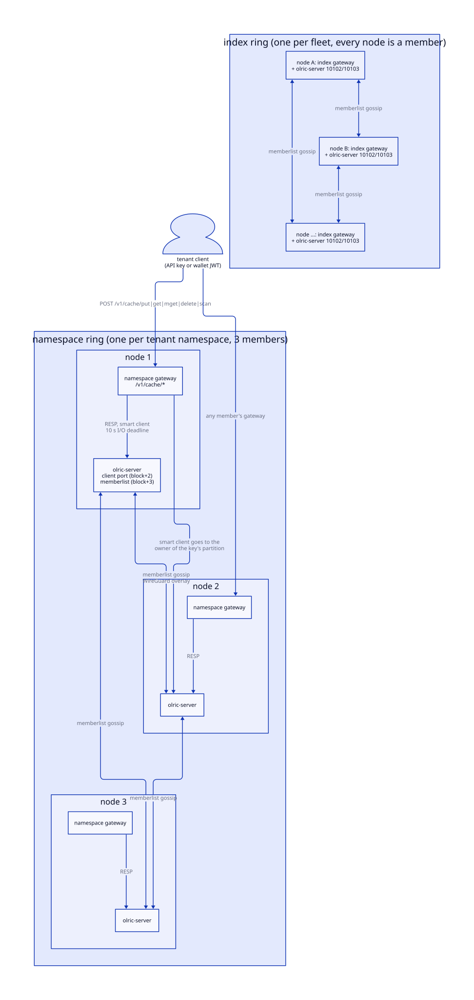
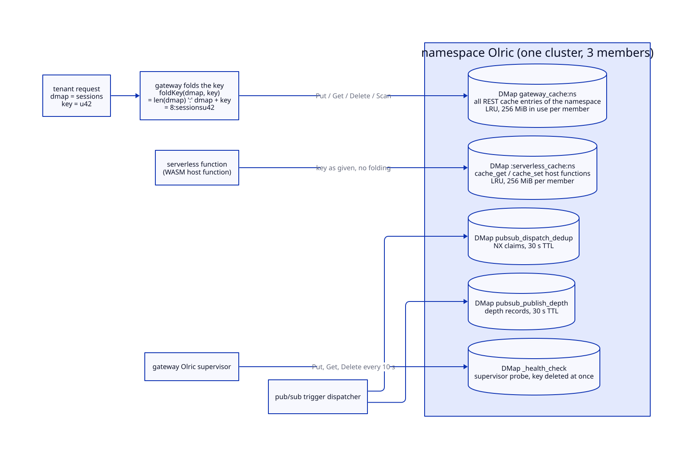
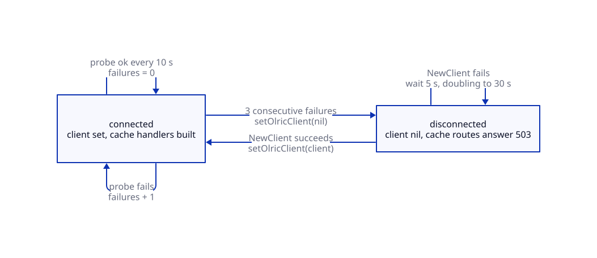
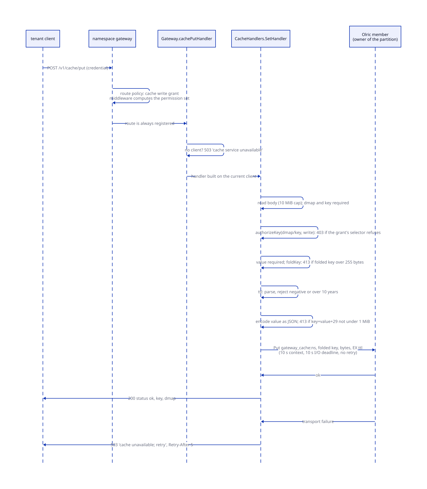
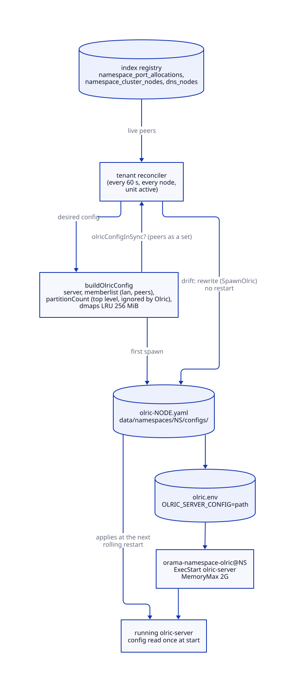

# Cache

> **At a glance.**
>
> - **What:** the cache is Olric v0.7.4, an in-memory distributed hash table, run as a set of independent rings. Every tenant namespace owns a private 3-member ring on its three nodes; the fleet shares one more ring, the index Olric, with a member on every node. A gateway reaches its ring through a cluster client and serves the tenant-facing `/v1/cache/*` REST routes from one Olric DMap per namespace. Nothing is replicated and nothing touches disk.
> - **Key numbers:** index ring on 10102 (client) and 10103 (memberlist); tenant rings on offsets 2 and 3 of a 5-port block in 10000-10099. LRU eviction once a DMap holds 256 MiB on a member. Unit `MemoryMax=2G`. Client I/O deadline 10 s, no retries, dial 5 s. Key at most 255 bytes, entry under 1 MiB, TTL at most 10 years. Gateway probes its client every 10 s and drops it after 3 failures; reconnect backoff 5 s doubling to 30 s. Replica count 1. Partition count 271 (the 12 the spawner writes is ignored).
> - **Code:** `core/pkg/olric/`, `core/pkg/gateway/handlers/cache/`, with the config writers in `core/pkg/namespace/systemd_spawner.go` and `core/pkg/install/config.go`, and the supervisor in `core/pkg/gateway/gateway.go`.
> - **Depends on:** [namespaces](09-namespaces.md) for the member placement and port blocks, [the WireGuard mesh](06-the-wireguard-mesh.md) for the only network Olric listens on, [the gateway](12-gateway-architecture.md) for the request path and the route policy table, and [authorization](14-authorization.md) for grants and key selectors.



## Why it exists

Tenants need a shared, fast, expiring key-value store that every one of their gateway processes sees identically. A namespace runs three gateways, one per member node, and a tenant request can land on any of them, so a per-process map would answer differently depending on the node. The platform has the same need internally: the pub/sub trigger dispatcher must make sure that when gossip delivers one published message to all three gateways exactly one of them invokes the trigger function (`core/pkg/serverless/triggers/dispatcher.go:claimDispatch`).

The constraints that shaped the design:

- **Tenants must not share memory or keys.** Each namespace gets its own Olric ring on its own ports, and inside the ring the gateway namespaces every key it writes. No tenant-chosen string ever becomes an Olric structure that can multiply memory use.
- **The process must not be killed by its own cache.** Olric's default is no eviction and no memory limit, so a cache in use used to grow until the systemd `MemoryMax=2G` killed the unit and every key went with it (`core/pkg/olric/limits.go`). Every Olric config Orama writes now sets LRU eviction and a per-DMap bound.
- **A broken cache must say so.** Olric speaks its own protocol on the client port and the Go client rebuilds most errors from message text alone. The gateway has to tell "the cache is down" (retry) from "your request is wrong" (do not retry) without help from Olric's error types.
- **The cache is not storage.** There is no replication, no persistence and no promise that a key written is a key readable later. The design takes that as given and spends its effort on keeping the failure honest (a 503, a 404) rather than on avoiding it.

## The model

**Olric.** A distributed in-memory hash table that partitions its key space over cluster members. Orama runs the upstream `olric-server` binary, built from the pinned tag `constants.OlricVersion = "v0.7.4"` (`core/pkg/constants/versions.go`, `core/cmd/orama/internal/build/builder.go:buildOlric`), and links the same version as a library (`core/go.mod`). The unit is `orama-namespace-olric@<instance>` (`core/systemd/orama-namespace-olric@.service`), `ExecStart=/usr/local/bin/olric-server`, with `OLRIC_SERVER_CONFIG` pointing at the YAML the node wrote.

**Member and ring.** One `olric-server` process is a member. The members that gossip with each other through memberlist form a ring, which is also Olric's word for a cluster. Orama runs two kinds:

| Ring | Instance | Members | Ports | Served by |
|---|---|---|---|---|
| Index ring | `orama-namespace-olric@index` | every node in the fleet | client 10102, memberlist 10103 (`core/pkg/constants/ports.go:OlricHTTPPort`) | the index gateway on each node |
| Tenant ring | `orama-namespace-olric@<namespace>` | the 3 nodes the namespace was placed on | offsets 2 and 3 of the namespace's 5-port block in 10000-10099 | the namespace's three gateways |

The constant is called `OlricHTTPPort` and the config key `server.bindPort`, but Olric 0.7 has no HTTP server. The client port speaks a Redis-compatible RESP protocol, so an HTTP GET there only ever reads a protocol error (`core/pkg/olric/probe.go:Members`, `core/pkg/namespace/readiness.go:olricReady`).

**Client port and memberlist port.** The client port carries gateway-to-member traffic (puts, gets, scans, the routing table). The memberlist port carries member-to-member gossip: failure detection and membership. The two are separate listeners with separate security properties, which matters in [Trust and security](#trust-and-security).

**DMap.** Olric's named map. Memory limits and eviction are set per DMap. The model's central rule follows from that: a namespace uses a small, fixed set of DMaps and never one per tenant-chosen name.

| DMap | Name | Written by | Notes |
|---|---|---|---|
| Tenant REST cache | `gateway_cache:<namespace>` | `/v1/cache/*` handlers | every tenant `dmap` folded into the key |
| Serverless cache | `:serverless_cache:<namespace>` | `cache_get`, `cache_set`, `cache_delete`, `cache_incr` host functions | keys as given by the function |
| Dispatch dedup | `pubsub_dispatch_dedup` | trigger dispatcher | NX claim, 30 s TTL |
| Publish depth | `pubsub_publish_depth` | trigger dispatcher | loop-guard records, 30 s TTL |
| Health | `_health_check` | the gateway's Olric client probe | a key per probe, deleted at once |

The last three have no namespace in their names because each tenant ring serves exactly one namespace.

**Smart client.** The gateway uses Olric's cluster client (`olriclib.NewClusterClient`). At construction it asks one of the configured addresses for the member list and the routing table, then sends each request straight to the primary owner of the key's partition. The routing table is refreshed once a minute (`DefaultRoutingTableFetchInterval` in olric v0.7.4 `cluster_client.go`); Orama passes no option to change it. The wrapper is `olric.Client` (`core/pkg/olric/client.go`); consumers that outlive a connection read the live client through `olric.Current` (`core/pkg/olric/current.go`).

**Folded key.** The Olric key of a tenant entry: the byte length of the tenant's dmap name, a colon, the name, then the tenant's key. The tenant dmap `sessions` and key `u42` are stored as `8:sessionsu42` (`core/pkg/gateway/handlers/cache/namespace_dmap.go:foldKey`).



## How it works

### The tenant ring: placement and configuration

A tenant ring is created as part of provisioning a namespace ([namespaces](09-namespaces.md#olric)). `ClusterManager.startOlricCluster` builds one `olric.InstanceConfig` per node and spawns all members concurrently, because a member started alone uses up its join attempts before its peers exist (`core/pkg/namespace/cluster_manager.go:startOlricCluster`). For each node the config carries the node's WireGuard address as both bind and advertise address, its two allocated ports, and the memberlist addresses of the other members as `PeerAddresses`. The YAML that results writes only the bind address: it has no `memberlist.advertiseAddr`, so memberlist advertises the address it binds, which is the same WireGuard address.

`SystemdSpawner.SpawnOlric` turns that into a file (`core/pkg/namespace/systemd_spawner.go:SpawnOlric`):

1. Both ports must be free (`ensurePortsFree`).
2. A bind address of `""` or `0.0.0.0` is replaced with the `wg0` address. A wildcard resolves to IPv6 on dual-stack hosts and breaks UDP gossip over WireGuard.
3. `buildOlricConfig` produces the YAML, written to `data/namespaces/<ns>/configs/olric-<node>.yaml`, and an env file sets `OLRIC_SERVER_CONFIG` to that path.
4. The unit starts and the spawner waits up to 30 s for it to be active.

The YAML has four parts (`core/pkg/namespace/systemd_spawner.go:buildOlricConfig`):

| Key | Value | Effect in Olric v0.7.4 |
|---|---|---|
| `server.bindAddr`, `server.bindPort` | node WireGuard address, client port | the RESP listener |
| `memberlist.environment` | `lan` | memberlist LAN timing profile (below) |
| `memberlist.bindAddr`, `bindPort`, `peers` | WireGuard address, memberlist port, the other members | gossip listener and join seeds |
| `dmaps.maxInuse`, `dmaps.evictionPolicy` | 268435456 (256 MiB), `LRU` | default for every DMap |
| `partitionCount` | 12 | ignored (see [Known gaps](#known-gaps)) |

Everything else is Olric's default, and several defaults matter. Verified by loading a config of this shape through `config.Load` of the pinned library: replica count 1, read and write quorum 1, member-count quorum 1, 271 partitions, no authentication, no memberlist secret key. The `lan` profile is memberlist's `DefaultLANConfig`: probe interval 1 s, probe timeout 500 ms, 3 indirect checks, suspicion multiplier 4, gossip every 200 ms to 3 nodes, a full state push/pull every 30 s.

The template that renders the index ring's config is `core/pkg/install/templates/olric.yaml`, filled by `core/pkg/install/config.go:GenerateOlricConfig` with the same LRU constants. It adds `memberlist.advertiseAddr` and omits `partitionCount`, so the effective partition count is the same 271.

### The index ring

The index ring is a single cluster across the whole fleet, so its size is the fleet size. Its config is a host file, `configs/olric/config.yaml`, written by install and rewritten by every upgrade (`core/pkg/install/orchestrator.go:Phase4GenerateConfigs`). Install binds the HTTP and memberlist listeners to the node's WireGuard address, uses memberlist environment `lan` and advertises the same address.

Seeds matter because Olric reads `memberlist.peers` only when it starts and joins. A joining node gets the seed list from the join response, which names the memberlist address of every WireGuard peer plus the contacted node (`core/pkg/gateway/handlers/join/handler.go:olricSeedPeers`). An upgrade rebuilds the seeds from the node's libp2p peers and the `AllowedIPs` lines of `wg0.conf` (`core/cmd/orama/internal/production/upgrade/nodeconfig.go:olricSeeds`). The comment there records why: an upgrade that wrote no peers made every node bootstrap a cluster of one, and a write on one node was then invisible to the others.

At boot the supervisor starts the index Olric from `startRQLiteLocal`, after the index RQLite unit (`core/pkg/node/rqlite.go:startRQLiteLocal`, [the node as a supervisor](04-the-node-as-a-supervisor.md)). `IndexSupervisor.EnsureOlric` uses the host YAML when it exists and falls back to `SpawnOlric` with the tenant-style config when it does not; either way it stops and disables the pre-factory `orama-olric.service` so two processes cannot fight for the port (`core/pkg/namespace/index.go:EnsureOlric`). The unit has no dependency on RQLite: Olric never reads the database, and an earlier `Requires=` on RQLite meant an RQLite restart dropped every cached entry on the node.

The index gateway's client address list is the node's own `<advertise host>:10102` (`core/pkg/node/gateway.go`). One address is enough, since the cluster client discovers the other members from the first one it reaches. Tenant gateways get all three members' client addresses (`core/pkg/namespace/cluster_manager.go:startGatewayCluster`).

### How a gateway connects and stays connected

Gateway construction calls `initializeOlric` (`core/pkg/gateway/dependencies.go:initializeOlric`). The server list is `olric_servers` from config; if that is empty, it is derived from the libp2p peer addresses and bootstrap peers with the Olric port appended (`discoverOlricServers`), and if even that yields nothing, `localhost:10102`. The first connection is attempted up to 5 times with backoff from 500 ms to 5 s. Failure is not fatal: the gateway starts with no cache client and the cache routes answer 503.

Independently, `startOlricSupervisor` runs for the life of the process (`core/pkg/gateway/gateway.go:startOlricSupervisor`). It has two states.



- **Connected.** Every 10 s (`olricProbeInterval`) it runs `Client.Health`: open DMap `_health_check`, put a unique key, read it back, compare, delete it, under a 5 s context. That context does not reach the socket (see [the timeout model](#the-clients-timeout-model)), so against a frozen member each call is bounded by the 10 s I/O deadline instead. Three consecutive failures (`olricUnhealthyThreshold`) drop the client.
- **Disconnected.** `olric.NewClient` is retried with a delay that starts at 5 s and doubles to a 30 s cap (`olricReconnectBase`, `olricReconnectMax`). Success installs the new client.

Dropping and installing go through `setOlricClient`, which under one lock sets both the gateway's client and `olric.Current`, and rebuilds or nils `cacheHandlers`. The cache routes are always registered, and each wrapper (`cachePutHandler` and its siblings) reads the current handler set per request, so a reconnect needs no restart. While there is no client every route answers 503 `cache service unavailable`.

The probe key is random, so it hashes to a random partition. With one of three members down, a single probe fails about a third of the time, and three in a row about once in twenty-seven rounds; a fully dead ring fails every probe. Probes run 10 s apart, so refused connections drop the client after about 20 s (probes at 0, 10 and 20 s), and a frozen ring, where each probe waits out the 10 s I/O deadline, after about 50 s.

`olric.Current` exists for the long-lived consumers. The serverless host functions and the pub/sub dispatcher are given a function that returns the current client on every operation (`core/pkg/gateway/dependencies.go`, the `deps.OlricCurrent.Underlying` arguments). A consumer that captured the client at start-up would hold a dead client after the first reconnect until the gateway restarted.

### The client's timeout model

`olric.OperationTimeout` is 10 s (`core/pkg/olric/client.go:OperationTimeout`). `clientConfig` sets the cluster client's read and write timeouts to it (a smaller `Config.Timeout` is honoured, a larger or zero one becomes 10 s), the dial timeout to 5 s and `MaxRetries` to -1, which disables retries.

The reason is in the comment on the constant. A context passed to `Put` or `Get` is not applied to the socket, because the library builds its Redis options without context-timeout support. Against a member that accepts the connection and never answers (a frozen process, a partition that drops packets) a call used to wait for the read timeout, twice with a retry, however short the caller's context was. The I/O deadline is therefore the only bound that works, and it is set where the client is built. Namespace gateways are configured with `OlricTimeout` of 30 s (`startGatewayCluster`), and the cap still reduces that to 10 s. The index gateway uses `http_gateway.olric_timeout` from the node config, default 10 s (`core/pkg/config/config.go`).

A test freezes a real listener and asserts the call fails inside the deadline (`core/pkg/olric/client_timeout_test.go:TestClient_silentMemberFailsWithinTheDeadline`).

### The REST handlers

`CacheHandlers` (`core/pkg/gateway/handlers/cache/types.go`) serves six routes, all `POST` with a JSON body except `health`:

| Route | Body | Result |
|---|---|---|
| `/v1/cache/put` | `dmap`, `key`, `value`, optional `ttl` | `200 {status, key, dmap}` |
| `/v1/cache/get` | `dmap`, `key` | `200 {key, value, dmap}` or 404 |
| `/v1/cache/mget` | `dmap`, `keys` | `200 {results, dmap}`, found keys only |
| `/v1/cache/delete` | `dmap`, `key` | `200` or 404 |
| `/v1/cache/scan` | `dmap`, optional `match` regex | `200 {keys, count, dmap}` |
| `/v1/cache/health` | none | `200 {status, service}` or 503 |

The route policy gives read routes (`health`, `get`, `mget`, `scan`) the cache read grant and write routes (`put`, `delete`) the cache write grant, with no ownership requirement and any credential type (`core/pkg/gateway/route_policy.go`). The SDK client is `sdk/src/cache/client.ts`.



#### Namespace isolation: one DMap, folded keys

`namespaceCache` opens the DMap `gateway_cache:<namespace>`, where the namespace comes from the request context that the gateway middleware set from the credential (`core/pkg/gateway/handlers/cache/namespace_dmap.go:namespaceCache`). An empty namespace is a 401.

The tenant's dmap name is not an Olric DMap. It is folded into the key as a length prefix. The length makes the encoding unambiguous: reading the digits up to the first colon says exactly where the name ends, whatever bytes the name and key contain, so no key of one tenant dmap can be read as a key of another and no dmap's prefix is a prefix of another's (`TestFoldKey_isUnambiguous`).

Why not one Olric DMap per tenant dmap, which is the obvious mapping? Olric bounds memory per DMap, and the tenant names its own dmaps. With a DMap per name the namespace's Olric had no bound at all: eight dmaps at the 256 MiB limit already reach the unit's 2G `MemoryMax`, and the kernel's OOM kill loses every key. With one DMap per namespace the whole tenant cache sits under one LRU limit however many dmaps the tenant makes (`TestCache_manyDMapsShareOneMemoryBound`).

The fold has a cost the tenant sees: Olric's key limit is 255 bytes and the dmap name shares it. A key in dmap `sessions` (prefix `8:sessions`, 10 bytes) is at most 245 bytes. `keyTooLargeMessage` tells the tenant the limit that applies to their dmap, and a dmap name so long that no key fits is refused with its own message.

`scan` lists keys by prefix. It asks Olric for keys matching `^` plus the regex-quoted prefix `dmapKeyPrefix(dmap)`, strips the prefix from each key, applies the caller's regex to the tenant-visible key, and drops keys the credential may not read (below). The caller's pattern is capped at 1 KiB (`MaxMatchBytes`) and compiled before the cache is asked. The cluster client's iterator walks every partition of the ring in turn (271), asking each partition's owners for a page of matching keys, so a scan costs a round trip per partition at least, whatever the DMap holds.

#### Values

A value is stored as its JSON encoding (`encodeStoredValue`). Olric keeps untyped bytes, and values used to be stored as text, so the string `"123"`, the number `123` and `true` were indistinguishable and a value could come back as something other than what was put. The JSON text carries the type. It is plain JSON rather than a tagged format on purpose: a gateway from before the change parses stored values as JSON, so the gateways of a rolling upgrade or a rollback agree on every entry. `decodeValueFromOlric` returns JSON when the bytes parse and the raw string otherwise, which is how entries written before the change are read. `value: null` is refused as 400 `value is required`, so `null` cannot be stored.

#### TTL

An empty, `"0"` or `"0s"` TTL means no expiry. Anything else is parsed by `time.ParseDuration`; a negative TTL or one over `olric.MaxEntryTTL` (10 years) is a 400 (`putOptionsForTTL`). The bound exists because Olric stores expiry as an absolute `UnixNano` computed as now plus the TTL, and a TTL of about 235 years overflows that sum: the entry is stored already expired while the write reports success (`core/pkg/olric/ttl.go`). The serverless `cache_set` applies the same bound in seconds (`core/pkg/serverless/hostfunctions/cache.go:CacheSet`).

#### Size limits, enforced before Olric

Olric refuses an entry its table cannot hold and a key of 256 bytes or more, but it reports that as a protocol error code that the gateway's client never registered (Olric registers the codes when it starts a server). The refusal arrived as an unrecognisable error and the tenant saw a 500 for a request that was merely too big. The gateway therefore checks first (`core/pkg/gateway/handlers/cache/limits.go`):

- folded key longer than 255 bytes: 413;
- key length plus stored value length plus 29 bytes of entry overhead must be under the 1 MiB kvstore table size (`OlricTableSizeBytes`, the default in the pinned Olric; the config sets no table size): otherwise 413;
- request body over 10 MiB: the body reader fails and the request is a 400 `invalid json body`.

If the table size is ever configured, `OlricTableSizeBytes` must change with it. `putFailure` still maps `ErrEntryTooLarge` and `ErrKeyTooLarge` to 413 for the case where the check and Olric disagree.

#### Delete and not-found

Deleting asks the key's owner whether the key exists before deleting it: `dm.Get`, then `dm.Delete`. Olric's own delete count cannot answer the question. A key whose partition another member owns is forwarded, deleted and reported as 0, and one the contacted member owns is reported as deleted whether or not it was there, so reading the count turned every delete of a remotely held key into "key not found" (`core/pkg/gateway/handlers/cache/delete_handler.go`, `TestDeleteHandler_aKeyOnAnyMemberDeletes`). The check and the delete are two round trips and not atomic: a key that expires between them is still answered 200.

`olric.IsKeyNotFound` recognises not-found by `errors.Is` or by comparing the message with the sentinel's text, for the same reason as the size codes: the cluster client turns an unregistered error code into a plain error carrying only the message (`core/pkg/olric/errors.go`).

### Authorization in the handlers

The gateway middleware decides whether a credential reaches the cache domain at all. The handler then asks the narrower question for the object. `authorizeKey` calls `gwauth.AuthorizeResource` with domain cache, the resource name `<dmap>/<key>` and an action (write for put and delete, read for get) (`core/pkg/gateway/handlers/cache/authorize.go`). A grant may carry a selector such as `cache:key=sessions/*`; with none, the call permits everything the scope gate already allowed. The name joins dmap and key with `/` so that a map-wide pattern like `sessions/*` is expressible, which a key-only comparison would not allow, and the glob `*` crosses the separator. Selector semantics belong to [authorization](14-authorization.md).

Two different rules apply to multi-key operations, on purpose:

- **mget is all or nothing.** `authorizeKeys` refuses the request if any key is outside the grant. A partial answer is indistinguishable from keys that were never set, so a narrowed result would read as a complete one.
- **scan filters.** A scan asks "what is here", so the answer is the set this credential may read. Keys outside the grant are dropped from the list, not refused.

Handlers run the authorization before they check that the cache client exists. A caller who may not touch a key is refused 403 whether or not the cache is up; a 503 would tell them the cache exists and is down, which they are not entitled to know. `scan` is the exception in order only: it validates the request shape first and authorizes per key as it iterates.

Which credentials hold the cache grant: a wallet JWT holds the whole data plane including cache (`core/pkg/gateway/auth/scopes.go:DataPlaneScopes`); the role `runtime` holds it and `reader` does not ([authorization](14-authorization.md)). The API-key profile `app-runtime` grants invoke, storage, push, webrtc and proxy only (`ProfileGrants`), so a key that must use the cache is minted with `cache` listed explicitly. The profile list in `ProfileGrants` and `DataPlaneScopes` differ on `pubsub` and `cache` for that reason.

### Mapping failures to answers

Every Olric error reaches a handler as an opaque error, so classification is by shape (`core/pkg/gateway/handlers/cache/unavailable.go:isCacheUnreachable`). An error is "the cache is unreachable" if it is a `net.Error`, a `context.DeadlineExceeded`, `olriclib.ErrConnRefused`, or its lower-cased text contains one of `timeout`, `deadline exceeded`, `connection refused`, `connection reset`, `broken pipe`, `unreachable`, `dial tcp` or `eof`. The text match exists because the client keeps nothing else: it rebuilds unregistered errors from the message.

| Condition | Status | Body |
|---|---|---|
| bad JSON, missing `dmap` or `key`, bad TTL, bad regex, null value | 400 | specific message |
| credential does not cover the key | 403 | the authorization error |
| no namespace in context | 401 | `namespace not found in context` |
| key or dmap absent | 404 | `key not found` |
| key, entry or pattern over a limit | 413 (pattern: 400) | names the limit |
| cache unreachable | 503 plus `Retry-After: 5` | `cache unavailable; retry` |
| no client at all | 503 | `Olric cache client not initialized` or `cache service unavailable` |
| method other than `POST` (all but `health`) | 405 | `method not allowed` |
| anything else | 500 | a constant message |

The log gets the Olric error text; the caller never does, because it can name member addresses on the overlay (`writeCacheFailure`, `putFailure`, `TestPutFailure_keepsInternalTextOut`).

### The serverless cache and the dispatcher's DMaps

Serverless functions reach the same ring through host functions (`core/pkg/serverless/hostfunctions/cache.go`). `cacheDMap` opens `:serverless_cache:<namespace>` using the namespace of the invocation, and refuses an empty namespace. The namespace is in the name even though a ring serves one namespace, as a second line of defence from the time one gateway ran every namespace's functions against one Olric; a gateway now runs only its own namespace's functions. With no client from `olric.Current`, host functions return `ErrCacheUnavailable`.

`CacheIncrBy` uses Olric's atomic `Incr`, creating the key at 0. Values are the raw bytes the function passes, not JSON, and the DMap is not the REST cache's, so a function and the REST routes never see each other's entries. Keys are used as given: there is no folding, no pre-check of key or entry size, and no selector. A function that exceeds a limit gets the raw Olric error wrapped in a `HostFunctionError`. [Serverless functions](21-serverless.md) covers the host function surface.

The pub/sub dispatcher uses two more DMaps through the same current client. `claimDispatch` does a put with NX and a 30 s TTL on a key derived from namespace, topic, payload hash and depth; the first gateway to write it dispatches, the others see `ErrKeyFound` and skip. It fails open: no client, an error opening the DMap, or any error other than key-found returns true, because a duplicate dispatch is better than a dropped wake-up, and it logs a rate-limited warning (`core/pkg/serverless/triggers/dispatcher.go:claimDispatch`). A per-process dedup guards against the same node dispatching twice when Olric is down (`core/pkg/serverless/triggers/local_dedup.go`). The depth records for the loop guard live in `pubsub_publish_depth` with the same 30 s TTL (`core/pkg/serverless/triggers/publish_depth.go`). [Pub/sub](20-pubsub.md) covers the trigger path.

### Keeping the config in step

The tenant reconciler repairs the rings ([reconciliation and recovery](10-reconciliation-and-recovery.md#the-tenant-sweep)). Every 60 s, on every node, its per-node leg computes the node's desired Olric config from the registry (the active members of the namespace, in the form `ip:memberlist port`, sorted) and calls `ReconcileOlric` (`core/pkg/namespace/tenant_reconciler.go`, `core/pkg/namespace/systemd_spawner.go:ReconcileOlric`).



`ReconcileOlric` reads the file on disk, parses it into the same struct and compares it with `buildOlricConfig` output through `olricConfigInSync`. Peers are compared as a set, not a list, because their order comes from a database query and means nothing to Olric; comparing slices reported drift on every sweep and would have restarted the cache in a loop. A duplicate on disk is still drift. If the config is in sync nothing happens. If it drifted, `SpawnOlric` rewrites the file and starts the unit with `StartService`, which does nothing to a unit that is already running.

The reconcile deliberately does not restart Olric. The service is clustered and stateful, the same reconcile runs on every node, and restarting a cache as a side effect would drop its keys. A running member also does not need the new peer list: memberlist drops a departed peer by itself and `memberlist.peers` is read only when Olric joins. The sweep runs only for a unit that is active; a stopped one is started by the restore leg of the same sweep with a freshly written config. The namespace gateway, by contrast, is restarted onto its rewritten config (`ReconcileGatewayMembership`), so its client address list follows the membership at once while the ring's own peer list does not. The cost is that a rewritten config, including a changed memory limit, takes effect at the member's next deliberate restart. Before this existed, a replaced namespace member left the survivors' peer lists naming the dead overlay address indefinitely, and the next restart tried to join it.

If the config file is missing, `ReconcileOlric` returns an error rather than guessing: a missing file belongs to the cold-spawn path.

### Readiness and restart ordering

`olricClusterDriver.Ready` calls `olricReady`, which connects an Olric cluster client to the member's client port and asks for its stats (`core/pkg/namespace/readiness.go:olricReady`). It does not assert membership: a one-node namespace has one member, and a multi-node namespace converges after the processes are up. The probe is bounded at 3 s per attempt inside the 60 s readiness window. It replaced a fixed 5 s sleep that was too long on a fast node and wrong on a slow one.

During a rolling upgrade `StartServicesOrdered` restarts a node's tenant units as rqlite, then olric, then gateway, and after starting each namespace's Olric waits up to 30 s for its memberlist port to accept a TCP connection before the gateway starts (`core/cmd/orama/internal/utils/systemd.go`, `core/cmd/orama/internal/utils/olric_ready.go`). The wait reads the namespace's Olric config to find the bind address, because the ring binds the WireGuard address only and a dial to localhost never connects. Running out of the wait is a warning, not a failure: the gateway's supervisor reconnects anyway. [Rolling upgrades](31-rolling-upgrades.md) places this step in the sequence.

### Health signals

- **Gateway.** `/v1/health` and `/status` include an `olric` entry from `Client.Health`: `unavailable` with no client, else ok or failed with latency (`core/pkg/gateway/status_handlers.go`). `/v1/cache/health` reports the same probe.
- **Namespace health.** Each index gateway probes every namespace it hosts every 30 s with a TCP dial to the Olric client port on its WireGuard address, as one of the three services (rqlite, Olric, gateway) whose unhealthy streak withdraws the node's namespace DNS records ([membership](08-membership-and-failure-detection.md#the-nodes-own-dns-self-management), `core/pkg/gateway/namespace_health.go`).
- **Node report.** `collectOlric` reports the index Olric: unit active, memberlist port listening, `NRestarts`, resident memory (the first `olric-server` process `ps` lists, which on a node hosting tenant rings need not be the index one), counts of error, suspicion and memberlist join/leave lines among the last 200 journal lines of the past hour (Olric logs at its default debug level), and the member list obtained by an Olric client call to the address in the node config (`core/pkg/telemetry/report/olric.go:collectOlric`). Alerts fire for a service down, memberlist down, any suspicion, more than 5 join/leave events, more than 20 errors, more than 3 restarts, resident memory over 500 MB, and a member count lower than the number of active nodes (`core/pkg/telemetry/cluster/alerts_node_services.go:checkNodeOlric`, `core/pkg/telemetry/cluster/alerts_cluster.go:checkOlricMemberConsistency`). [Observability](32-observability.md) covers the pipeline.

## State it owns

Olric holds no durable state. The state below is the configuration and registry rows that describe the rings, and the in-memory structures of the gateway client.

| State | Holds | Written by | Read by | Where |
|---|---|---|---|---|
| Olric table data | all cached entries | `olric-server` | `olric-server` | process memory only; no data directory is passed |
| `configs/olric/config.yaml` | index ring config | install and upgrade | `olric-server`, `EnsureOlric` | `~/.orama/configs/olric/` |
| `olric-<node>.yaml` | tenant ring config | `SpawnOlric`, `ReconcileOlric` | `olric-server`, `ReconcileOlric`, upgrade wait | `data/namespaces/<ns>/configs/` |
| `olric.env` | `OLRIC_SERVER_CONFIG` path | `systemd.Manager.GenerateEnvFile` | the unit | `/var/lib/orama-unit-env/<instance>/` |
| `namespace_port_allocations` | `olric_http_port`, `olric_memberlist_port` per node and namespace | namespace provisioning | reconciler, health, gateway config | index RQLite |
| `namespace_cluster_nodes` | the node's `olric` role row per cluster | provisioning, recovery | reconciler, status | index RQLite |
| `gateway_cache:<ns>` and 4 other DMaps | see [The model](#the-model) | gateways | gateways | member memory |
| `olric.Client`, `olric.Current` | the live cluster client, routing table snapshot | supervisor | handlers, host functions, dispatcher | gateway process |
| Olric ports | client and memberlist listeners | `olric-server` | gateways, peers | index: 10102 and 10103; tenant: offsets 2 and 3 of the block |

[Appendix A](../appendices/a-port-map.md) lists the port ranges.

## Lifecycle

**Provisioning.** Olric is the second service of the tenant blueprint, started after RQLite and before the gateway on all three nodes concurrently, then gated by `olricReady` on each node ([namespaces](09-namespaces.md#service-drivers)). Gateways are configured with all three client addresses.

**Boot of an existing node.** The boot supervisor starts the index Olric after the index RQLite unit; the tenant reconciler starts any tenant unit that is not running within a sweep (60 s). A node that restarts finds an empty member: Olric has no persisted state. It joins through `memberlist.peers`, receives its partitions' ownership from the cluster, and starts empty.

**Normal operation.** Gateways probe every 10 s. Memberlist runs failure detection among members on the `lan` profile. The reconciler checks config drift every 60 s.

**Rolling upgrade.** Upgrades restart one node at a time (the fleet gate is in [rolling upgrades](31-rolling-upgrades.md)). Mixed versions are safe at the cache boundary for two reasons: the stored value encoding is plain JSON that older gateways read identically, and the Olric binary is the same pinned tag unless the release bumps `OlricVersion`. A config rewritten by the new build (a changed LRU limit, say) applies to a member only when that member restarts, which the upgrade does as part of its turn. The key layout is not version-tolerant: gateways from before the one-DMap fold read per-dmap Olric DMaps, so while a namespace's gateways are on mixed sides of that change they see different entries. Every restart empties that member's share of the ring: with replica count 1 the keys it owned are gone. A cache user sees misses and re-populates.

**Replacing a member.** When recovery replaces a dead namespace node, the new member is spawned with the surviving members' memberlist addresses as peers, and the survivors' gateways are reconfigured to the new client address list; the survivors' Olric configs are rewritten by the next reconcile sweep and apply at their next restart (`core/pkg/namespace/cluster_recovery.go`, [reconciliation and recovery](10-reconciliation-and-recovery.md#dead-node-handledeadnode-and-replaceclusternode)).

**Teardown.** Deleting a namespace stops and removes its Olric unit with the rest of the cluster; the memory goes with the process.

**Node loss.** The dead node's keys are lost (no replicas). Memberlist marks it suspect and then dead and reassigns its partitions; the gateways' cached routing tables point at the dead owner until the next refresh (at most a minute), so requests for keys in those partitions fail as 503 until then. The e2e test `TestOlricChaos_memberLossServedAndRejoined` stops one member and asserts the others keep serving, the reconciler restarts the member within a sweep, and the rejoined node's gateway serves what was written while it was away.

## Failure modes

| Trigger | What the system does | What you observe |
|---|---|---|
| One tenant member's Olric process dies | Memberlist detects it (about one probe round plus a suspicion timeout of about 4 s on a 3-member ring); partitions move to survivors; the reconciler restarts the unit within 60 s | 503 for keys whose partition owner was the dead member until the routing table refreshes; its keys read as 404 afterwards; `olric.log_suspicions` and member-count alerts |
| Every member frozen or partitioned | Calls hit the 10 s I/O deadline; after 3 failed probes each gateway drops its client | 503 `cache unavailable; retry` with `Retry-After: 5`, then `cache service unavailable` while disconnected; `/v1/health` shows `olric: unavailable`; reconnect without a gateway restart |
| Gateway starts before Olric is up | 5 init attempts, then the supervisor retries from 5 s to 30 s | cache routes 503 until it connects; `Olric cache client reconnect failed` warnings |
| Memory reaches `maxInuse` on a member | LRU evicts least recently used keys of that DMap (sampled, approximate) | older keys read as 404 well before their TTL |
| Resident memory reaches `MemoryMax=2G` | The kernel OOM-kills the process; `Restart=always`, `RestartSec=5s`; `MemorySwapMax=0` | `NRestarts` rises, the member rejoins empty, restart-count and memory alerts |
| Oversize key or entry | Refused in the gateway before Olric | 413 naming the limit |
| Unreachable peer address in `memberlist.peers` | At start memberlist tries the seeds, up to 10 attempts at 1 s intervals, and joins if any one answers | slow join if some seeds are dead; members that are alive still join |
| No seed answers within the join attempts | Olric logs `Forming a new Olric cluster` and runs as a ring of one; the library never retries the join | that member holds its own keys; gateways pointed at it see a different cache from the other members' until it restarts; no tenant-ring check notices |
| Config drift (peer list, limits) | Reconcile rewrites the file, does not restart | log line `Olric config drifted from desired`; a changed limit not yet in force |
| Clock skew between members | Expiry is an absolute `UnixNano` set when the entry is written (`core/pkg/olric/ttl.go`); an entry judged on another member's clock after its partition moves expires early or late by the skew | entries expiring off by the skew |
| Disk full | Olric writes no data to disk; its only output is the journal | no cache effect |
| Slow peer | A slow owner makes calls to its partitions run to the 10 s deadline; `mget` visits keys one at a time inside a 30 s context | slow responses; 503 past the deadline |
| Bad input | Rejected before Olric | 400, 413, 404 as in the table above |

## Trust and security

### Boundaries

The cache has three boundaries, from outermost in.

**Tenant to gateway.** The tenant is authenticated by API key or wallet JWT; the gateway resolves the credential's namespace; the route policy requires the cache grant; the handler applies key selectors. A credential for another namespace is refused (`NAMESPACE_MISMATCH`, asserted in `e2e/features/cache/access_test.go:TestCacheIsolation_otherNamespaceRefused`). A tenant cannot name an Olric DMap, a member or a key outside its folded prefix: the namespace comes from the credential and the dmap name only ever becomes a key prefix.

**Gateway to Olric.** This hop has no authentication and no encryption of its own. The client is configured with an empty `Authentication`, and the server configs set no password. Olric v0.7.4 supports a password (`authentication.password` in its YAML loader, `NOAUTH` on the wire); Orama does not use it. The only protection is that the client port binds the node's WireGuard address, not a public one, and the firewall admits the overlay only on `wg0` (`core/pkg/install/firewall.go`).

**Member to member.** Memberlist gossip and the partition transfer between members are not encrypted or authenticated by Olric either.

### Encryption of memberlist: the answer

`docs/SECURITY.md` contradicts itself on this. The "Olric Gossip Encryption (Step 1.8)" section says the YAML loader has no `encryptionKey`, the plumbing that shipped a generated key was removed, and the control is the WireGuard overlay. The same file's rollout plan lists "Olric encryption (simultaneous restart)" under Batch 3, and its list of residual risks says "v0.7.0 YAML has no `encryptionKey`". Resolution from code:

1. **The version is v0.7.4, not v0.7.0.** `core/pkg/constants/versions.go:OlricVersion` is `v0.7.4`; the build installs `olric-server@v0.7.4`; `core/go.mod` requires the same. The v0.7.0 text is stale.
2. **The loader has no key field.** The memberlist section of the YAML loader in the pinned library lists environment, bind and advertise address and port, interface, compression, join retry, peers, and the memberlist timing knobs, plus `gossipVerifyIncoming` and `gossipVerifyOutgoing`. It has no secret-key field, and the library never references a keyring. A config of the shape Orama writes, loaded through `config.Load`, yields an empty `MemberlistConfig.SecretKey`. Setting a key needs an embedding program that builds `config.Config` in Go. Orama runs the stock `olric-server`.
3. **The verify flags do nothing without a key.** Memberlist defaults `GossipVerifyIncoming` and `GossipVerifyOutgoing` to true, but they only govern messages that are or are not encrypted; with no key nothing is encrypted and nothing is checked.
4. **Dead plumbing remains.** The join response type still declares `olric_encryption_key`, marked unused, and the install orchestrator writes `secrets/olric-encryption-key` if a response ever carries one (`core/pkg/gateway/handlers/join/handler.go:OlricEncryptionKey`, `core/cmd/orama/internal/production/install/orchestrator.go`). Nothing populates the field.

So memberlist traffic is unencrypted and unauthenticated at the Olric layer. Confidentiality and peer admission are WireGuard's: the traffic is encrypted on the overlay and a packet sourced from 10.0.0.0/24 on `wg0` proves the sender holds a mesh key ([the WireGuard mesh](06-the-wireguard-mesh.md)).

### What each attacker can do

| Position | Can | Cannot |
|---|---|---|
| Tenant with a valid credential | read, write, delete, scan its own namespace's cache within its grant and selectors; fill its cache until LRU evicts. A signed-in wallet with no grant in the namespace holds the whole cache (`core/pkg/gateway/auth/permission.go:NoGrantPermissions`), so every end user of an application can read and overwrite every key of its cache unless the application issues grants with selectors; in the index namespace, a wallet session holds nothing | name another namespace's keys; create DMaps; exceed 256 MiB of in-use memory per member in the REST DMap |
| Tenant with a credential of another namespace | nothing on this namespace | any cache route (`NAMESPACE_MISMATCH`) |
| Tenant code on a node (deployment, WASM) | reach Olric only through the host functions, for its own namespace | dial the overlay: deployment units set `IPAddressDeny` for the private ranges and WASM `http_fetch` refuses overlay addresses at the socket ([rate limits and egress controls](27-rate-limits-and-egress-controls.md), `docs/SECURITY.md`) |
| A process on any overlay node with an overlay source address | connect to any ring's client port and read, write and flush any namespace's cache, or pre-claim dispatch dedup keys to suppress a trigger; join a memberlist as a member | be stopped by Olric: no password, and the firewall admits the whole overlay on `wg0` |
| An off-overlay network attacker | nothing; the ports bind WireGuard addresses and ufw denies other sources | read gossip: it is inside WireGuard |
| A compromised node (root) | everything above, plus the process memory of its members | |

The isolation between namespaces is therefore enforced at the gateway (credential namespace, DMap name, key prefix) and by the network fence around tenant code, not by Olric. A node's other daemons share the `orama` account with `olric-server`, so the unit's own sandbox is what separates them (`ProtectSystem=strict`, `NoNewPrivileges`, `InaccessiblePaths=/opt/orama/.orama/secrets`, `ReadWritePaths` limited to the namespace's data directory and logs; `core/systemd/orama-namespace-olric@.service`).

### Supply chain

The binary is built by `go get` of the pinned tag in a scratch module with `GONOSUMDB=*` and `GOPROXY=https://proxy.golang.org|direct`, then cross-compiled (`core/cmd/orama/internal/build/builder.go:buildOlric`). The module checksum database is not consulted for it, so the integrity of `olric-server` and its dependencies rests on the release signing of the resulting bundle, not on `sum.golang.org` ([build, signing and release](29-build-signing-and-release.md)). The memberlist version in that binary is whatever the Olric tag's `go.mod` requires (v0.5.3 for v0.7.4), which can differ from the memberlist version in `core/go.mod`.

## Limits and scale

| Limit | Value | Source |
|---|---|---|
| Key length | 255 bytes, shared with the dmap name and its length prefix | `core/pkg/gateway/handlers/cache/limits.go:MaxKeyBytes` |
| Entry (key + value + 29) | under 1 MiB | `OlricTableSizeBytes` |
| Request body | 10 MiB | `http.MaxBytesReader` in each handler |
| Scan pattern | 1 KiB | `MaxMatchBytes` |
| TTL | 0 (none) to 10 years | `core/pkg/olric/ttl.go:MaxEntryTTL` |
| In-use memory | 256 MiB per DMap per member, LRU | `core/pkg/olric/limits.go:DMapMaxInuseBytes` |
| Process memory | `MemoryMax=2G`, no swap | the unit file |
| Handler contexts | 10 s for put, get, delete; 30 s for mget and scan; 5 s health | handler sources |
| Client I/O | 10 s read and write, 5 s dial, no retries | `core/pkg/olric/client.go` |

Capacity of a tenant ring is about three members times 256 MiB of in-use bytes per DMap that tenants can fill. Two DMaps are tenant-fillable: the REST cache and the serverless cache, so up to 512 MiB per member counts against the 2G ceiling, before the overhead that the in-use figure leaves out (Olric's runtime, memberlist, deleted entries awaiting compaction). The platform's three other DMaps hold 30 s records.

At 10x:

- **A bigger fleet.** The index ring is one memberlist cluster across the fleet. Memberlist's gossip and probe load grow slowly with ring size, but the full state push/pull every 30 s, the routing table every client refreshes once a minute, and the routing table push (every minute by default) all grow with member count and partition count. The index ring has no cap on membership. Tenant rings do not grow with the fleet: N is three per namespace.
- **More tenants.** Each namespace adds one `olric-server` per member node, with its own two ports and up to 2G of `MemoryMax`. Memory is not reserved, so many busy namespaces on one node can together exceed the machine's RAM; the first bottleneck is host memory, not ports (the 5-port blocks in 10000-10099 cap the count of namespaces first; see [namespaces](09-namespaces.md#port-blocks)).
- **More traffic.** Each request is one round trip from the gateway to the key's owner plus, for `mget`, one per key in sequence, and a scan walks all 271 partitions in turn. The first request-level bottleneck is `mget` and `scan`: `mget` walks keys one at a time and `scan` collects every matching key into a slice before it answers, bounded only by the DMap size.
- **Hot keys.** A key lives on one primary; there are no replicas to read from. A hot key loads one member.

## Design decisions

### One DMap per namespace, tenant dmap folded into the key

*Chosen:* the REST cache is the single Olric DMap `gateway_cache:<namespace>`; the tenant dmap name is a length-prefixed key prefix. *Rejected:* an Olric DMap per tenant dmap name. *Why:* Olric bounds memory per DMap and tenants choose names, so a DMap per name left the ring with no bound; eight dmaps at the limit reached the unit's 2G and an OOM kill lost every key. The fold keeps one LRU limit over the whole tenant cache at the price of sharing 255 key bytes with the name (`core/pkg/gateway/handlers/cache/namespace_dmap.go`).

### The I/O deadline is the timeout, and there are no retries

*Chosen:* read and write deadlines of 10 s on the socket, `MaxRetries = -1`. *Rejected:* relying on request contexts, and the library's default retries. *Why:* the library does not apply the context to the socket, and a retry doubles the wait on an unreachable member. The gateway answers 503 and lets the caller retry (`core/pkg/olric/client.go:clientConfig`).

### Enforce Olric's limits in the gateway

*Chosen:* the handler checks key length and entry size before the put, and returns 413. *Rejected:* letting Olric refuse. *Why:* Olric's refusal arrives as a protocol error code the gateway's client never registers, so it is indistinguishable from a cache fault and a tenant saw a 500 "cache unavailable" for a request that was too large (`core/pkg/gateway/handlers/cache/limits.go`).

### Drop the client after three failed probes

*Chosen:* the supervisor sets the client to nil after 3 consecutive failures, so handlers answer a clean 503. *Rejected:* keeping a client that cannot reach anything. *Why:* a stale client returned transport errors on every request while `/health` still said healthy. The previous design connected once and was armed only when the first connect failed; the supervisor covers the common case of Olric up at start and dying later (`core/pkg/gateway/gateway.go`).

### Rewrite the Olric config, never restart it from reconcile

*Chosen:* drift is written to disk and applies at the next rolling restart. *Rejected:* restarting on drift. *Why:* Olric is stateful and clustered, the same reconcile runs on every node, and a restart is a loss of keys (`core/pkg/namespace/systemd_spawner.go:ReconcileOlric`). The cost is that a limit change is not in force until restart.

### Typed values as plain JSON

*Chosen:* the stored bytes are the JSON of the value. *Rejected:* a tagged or wrapped format. *Why:* strings, numbers and booleans round-trip exactly, and gateways before the change read the same bytes as JSON, so mixed-version gateways and a rollback agree on every entry (`core/pkg/gateway/handlers/cache/types.go:encodeStoredValue`).

### Authorization shape follows the question asked

*Chosen:* `mget` refuses the whole request if any key is outside the grant; `scan` filters; a refused caller is told 403 before anyone is told the cache is down. *Rejected:* filtering `mget`, and checking availability first. *Why:* a narrowed `mget` answer looks like unset keys, and a 503 to an unauthorized caller leaks that the cache exists (`core/pkg/gateway/handlers/cache/authorize.go`).

## Known gaps

- **`partitionCount: 12` is silently ignored.** `buildOlricConfig` writes it as a top-level key, but the Olric YAML loader reads the partition count only from `server.partitionCount`, and unknown keys are discarded. Every tenant ring runs on 271 partitions, not 12; the comment on `olricPartitionCount` also states Olric's default as 256, while the library's is 271. No test notices: `TestBuildOlricConfig_boundsEveryDMapWithLRU` loads the file but asserts only the DMap limits, and the fixture in `core/cmd/orama/internal/utils/systemd_test.go` carries the same wrong layout. Code: `core/pkg/namespace/systemd_spawner.go:olricPartitionCount`.
- **No replication.** Replica count is 1 and the quorums are 1, because the config sets none of them. Losing or restarting a member loses the keys it owns; hot keys have one owner. Code: `core/pkg/namespace/systemd_spawner.go:olricConfig`.
- **The Olric client port and memberlist are unauthenticated and unencrypted.** Any process with an overlay source address can read or write any namespace's cache. The client port could be protected: Olric's `authentication.password` exists in v0.7.4 and is unused. Memberlist cannot: the YAML loader has no secret-key field, so encrypting gossip needs a program that embeds Olric. Code: `core/pkg/olric/client.go:clientConfig`, `core/pkg/namespace/systemd_spawner.go:olricConfig`.
- **`docs/SECURITY.md` contradicts itself on Olric encryption** (Step 1.8 says the plumbing is removed; the rollout plan still lists "Olric encryption" under Batch 3, and the residual-risks list says v0.7.0 where the pinned version is v0.7.4). The code state is described in [Trust and security](#trust-and-security).
- **Dead encryption plumbing.** `core/pkg/gateway/handlers/join/handler.go:OlricEncryptionKey` is a join-response field nothing sets, and `core/cmd/orama/internal/production/install/orchestrator.go` still writes `secrets/olric-encryption-key` if it is non-empty.
- **`mget` hides transport failures.** Any `Get` error other than not-found, and any value that fails to decode, skips the key silently: an unreachable or timed-out owner part-way through returns 200 with a narrowed `results` array, where `get` answers 503 for the same condition. That is the failure the authorization path avoids on purpose. Code: `core/pkg/gateway/handlers/cache/get_handler.go:MultiGetHandler`. When no key is found, `results` is JSON `null`, not an empty array; `scan` has the same shape for `keys`.
- **`scan` cannot see errors.** Olric's iterator interface has `Next`, `Key` and `Close` and no error accessor: when a page fetch fails the library logs it and `Next` returns false, and the same happens when the 30 s context ends. A scan cut short by a member failure or a timeout therefore returns a truncated key list with 200. Only a failure to start the scan reaches the handler (503 or 500). Code: `core/pkg/gateway/handlers/cache/list_handler.go:ScanHandler`.
- **The serverless cache has no size pre-check.** Keys and entries over Olric's limits return the raw Olric error to the function; and the dmap-wide and per-key grant selectors of the REST cache do not exist there. Code: `core/pkg/serverless/hostfunctions/cache.go`.
- **Config changes need a restart that nothing schedules.** A rewritten limit or peer list is applied only at the member's next restart; there is no signal that a member runs a config different from the file. Code: `core/pkg/namespace/systemd_spawner.go:ReconcileOlric`.
- **A member that finds no seed runs alone for good.** Olric tries the `memberlist.peers` seeds 10 times at 1 s intervals, then forms a ring of one and never retries the join. Orama sets no join option, nothing rejoins such a member, and the only membership check (`checkOlricMemberConsistency`) covers the index ring, not tenant rings. Code: `core/pkg/namespace/systemd_spawner.go:buildOlricConfig`.
- **The node report's Olric memory is not the index Olric's.** `collectOlric` reads the first line of `ps -C olric-server`, which is any `olric-server` on the node, tenant rings included, while the rest of the report and its 500 MB alert are about the index unit. Code: `core/pkg/telemetry/report/olric.go:collectOlric`.
- **Stale routing after member loss.** The cluster client refreshes its routing table once a minute, so requests for a dead owner's partitions fail until the next refresh. The refresh interval is not configured. Code: `core/pkg/olric/client.go:NewClient`.
- **The `app-runtime` key profile carries no cache grant**, so a key minted from it cannot use `/v1/cache/*`, while `runtime` role members and wallet sessions can. The grant list is explicit but easy to miss. Code: `core/pkg/gateway/auth/scopes.go:ProfileGrants`.

## Verify it yourself

**Unit tests.** `cd core && go test ./pkg/olric/... ./pkg/gateway/handlers/cache/... ./pkg/namespace/ -run 'Olric|Cache|Fold|Dmap'`:

- `core/pkg/olric/client_timeout_test.go` freezes a listener and asserts the I/O deadline.
- `core/pkg/olric/errors_test.go` covers key-found and not-found recognition.
- `core/pkg/gateway/handlers/cache/namespace_dmap_test.go` covers the shared memory bound, dmap separation, key folding and the key limit.
- `core/pkg/gateway/handlers/cache/limits_test.go`, `ttl_test.go` and `roundtrip_test.go` cover the size limits, TTL bounds and typed values against a real Olric from `core/pkg/olric/olrictest/olrictest.go`.
- `core/pkg/gateway/handlers/cache/authorize_test.go` covers selectors, all-or-nothing `mget` and the unnarrowed grant.
- `core/pkg/gateway/handlers/cache/unavailable_test.go` and `delete_cluster_test.go` cover the 503 mapping and cross-member delete.
- `core/pkg/namespace/olric_limits_test.go` loads the spawner's config through Olric's own loader and checks drift detection.

**Fleet e2e.** `e2e/features/cache/` exercises every route through each node's gateway: types, TTL, mget and scan semantics, hostile input, roles, key selectors, revocation, namespace isolation and cross-node consistency. `e2e/features/cache-chaos/` stops a member, freezes every member to check the 503 and in-place reconnect, and crashes every member to prove the cache is memory-only. The owner runs `make e2e-fleet`.

**Read-only checks on a node.**

```bash
# unit and its sandbox
systemctl cat orama-namespace-olric@index
# the config a ring runs (index host file; tenant file under data/namespaces/<ns>/configs/)
cat /opt/orama/.orama/configs/olric/config.yaml
# members and coordinator, from the report the node writes
orama monitor report --env <env> --node <ip>
# journal of one namespace's Olric
orama node logs orama-namespace-olric@<namespace>
# fleet checks: service active, memberlist port, restarts, suspicions, flapping, memory, member consistency
orama inspect --env <env> --subsystem olric
# the gateway's view of its client
curl -s https://<namespace-gateway>/v1/cache/health -H 'Authorization: Bearer <runtime or wallet token>'
```

The checks behind `orama inspect` are in `core/pkg/inspector/checks/olric.go:CheckOlric`.
