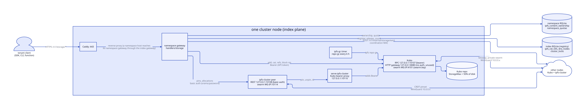
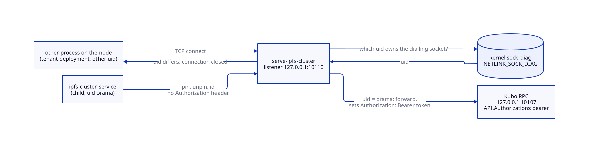
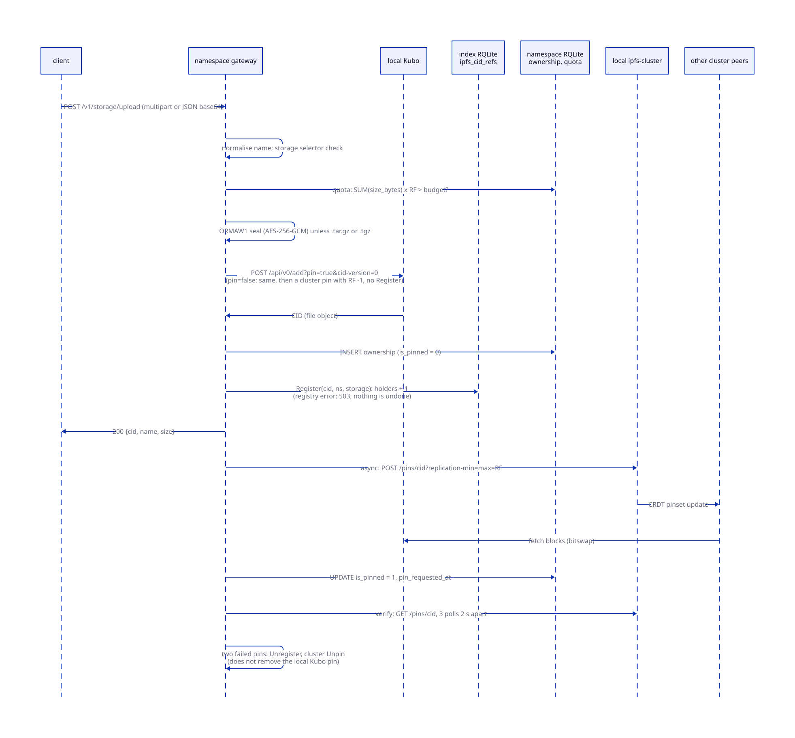
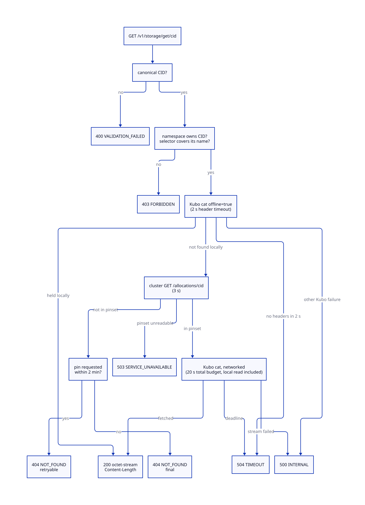
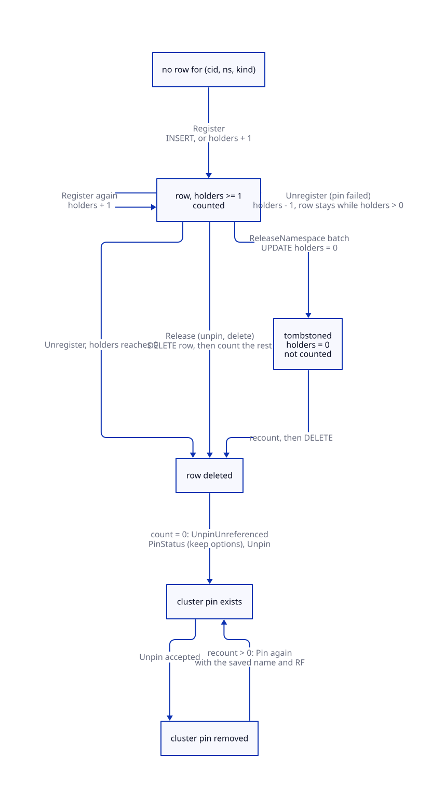
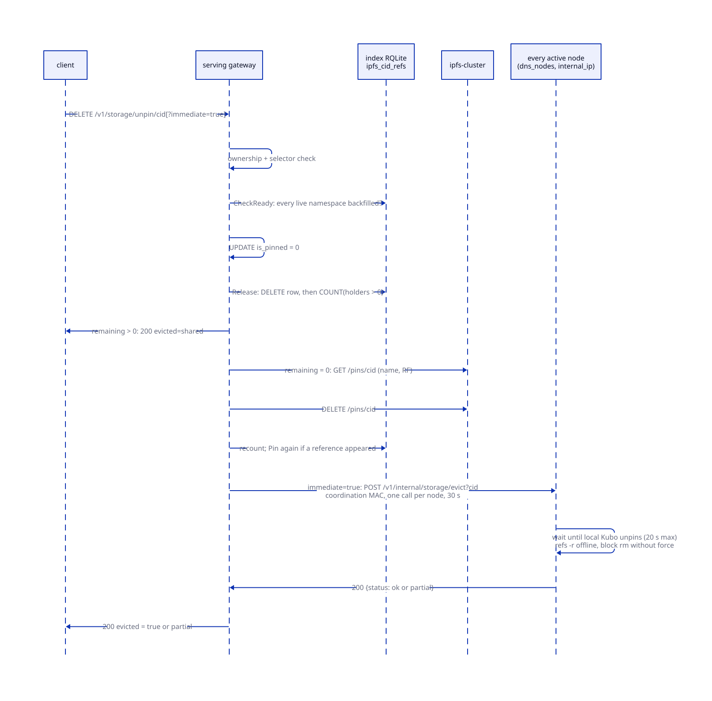
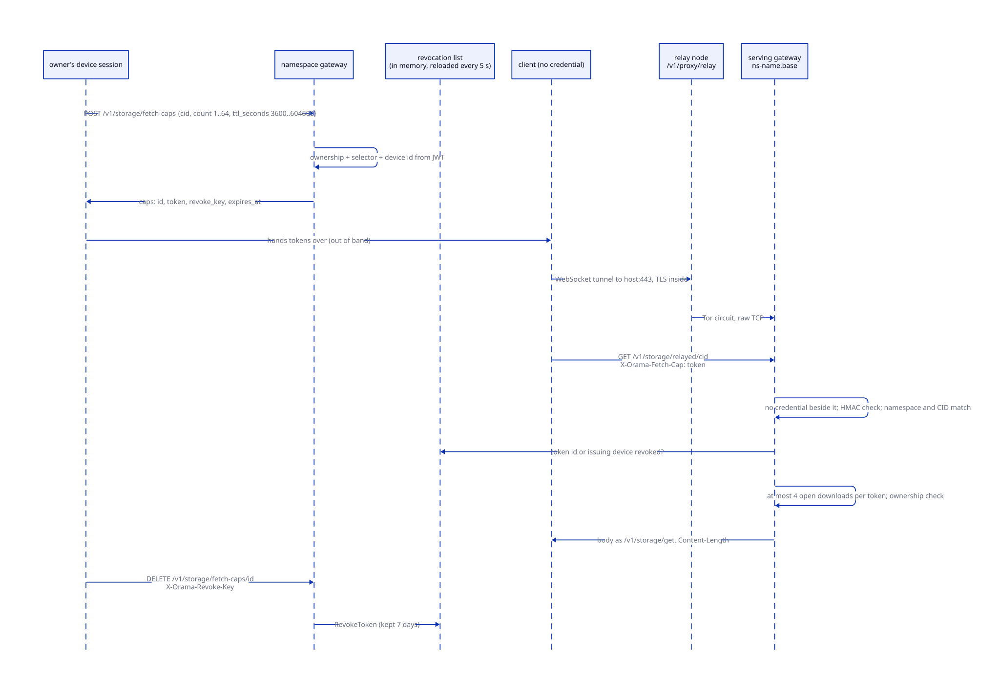

# Storage

> **At a glance.**
>
> - **What:** tenant object storage built from one shared IPFS layer per cluster. Every index node runs a Kubo daemon (private swarm) and an IPFS Cluster peer (CRDT consensus), and every gateway, index or namespace, talks to the pair on its own node. The gateway (`core/pkg/gateway/handlers/storage/`) adds what IPFS does not have: per-namespace ownership, a cluster-wide reference count that decides when a shared pin may be removed, quotas, name-scoped grants, sealing of private blobs, and download capabilities that carry no identity.
> - **Key numbers:** replication factor 3; Kubo RPC `127.0.0.1:10107` (bearer), cluster REST `127.0.0.1:10108` (basic auth), bearer proxy `127.0.0.1:10110`, cluster swarm 10114 and Kubo swarm 4101 on the WireGuard address; JSON upload body 1 MiB, multipart memory 32 MiB, no overall size cap; download fetch budget 20 s; pin sweep every 15 min; `ipfs repo gc` every 6 h; `Datastore.StorageMax` 50 percent of the disk, floor 10 GB; fetch capabilities live 1 h to 7 d, 1 to 64 per mint.
> - **Code:** `core/pkg/ipfs/`, `core/pkg/gateway/handlers/storage/`, `core/pkg/gateway/capability/`; wiring in `core/pkg/gateway/dependencies.go`, `core/pkg/gateway/pin_sweep.go`, `core/pkg/node/`, `core/pkg/namespace/index_host.go`; install side in `core/pkg/install/installers/ipfs.go` and `ipfs_cluster.go`.
> - **Depends on:** [cluster state](07-cluster-state.md) for the registry, [namespaces](09-namespaces.md) for the tenant database, [inter-node trust](15-inter-node-trust.md) for the coordination MAC and key derivation, [authorization](14-authorization.md) for grants and selectors.



## Why it exists

A tenant needs to put bytes somewhere that survives the loss of a node, address them by content, and give them back later. Orama already runs a fleet of nodes joined by a private WireGuard overlay, so the obvious design is to replicate blobs across those nodes rather than to rent an object store. IPFS gives content addressing and block exchange; IPFS Cluster gives a replicated pinset on top of it. The same layer also holds things that are not tenant files: function WASM, static site directories, deployment tarballs and namespace backups all reach IPFS through the same client ([app deployments](11-app-deployments.md), [serverless functions](21-serverless.md)).

IPFS alone is wrong for a multi-tenant platform in five ways, and the chapter is mostly about how Orama closes them.

1. **There is one pin per CID, however many tenants hold it.** IPFS Cluster keeps a single pinset entry per content identifier. If tenant A and tenant B hold the same bytes and A unpins, the pin disappears for B. The platform needs a reference count that is visible to every namespace gateway, and a namespace's own database cannot provide it because it holds only that namespace's rows.
2. **IPFS has no tenants.** Anyone who knows a CID can read the block. Ownership has to be a table the gateway consults before it asks IPFS anything, and a CID must not become an oracle for what other tenants store.
3. **The local APIs are full control of the node.** Kubo's RPC can pin, unpin, connect and read any block, and the cluster REST API can unpin any tenant's content. Both bind loopback, and a tenant deployment is allowed to open connections to loopback (the gateway reaches the deployment from there). Loopback is not a lock, so both need credentials, and ipfs-cluster cannot send one of them.
4. **Unpinning does not delete.** Blocks leave a node only when garbage collection runs. A privacy delete needs an explicit, verified eviction on every node.
5. **Nothing re-allocates.** A cluster pin fixes its replica count at pin time. When a node is discarded, every CID it held stays below its replication factor until something pins again.

Two further constraints shaped the code. The upload response must not wait for replication, because a pin that has to reach three WireGuard peers can take longer than the proxy budget; and every decision that can destroy another tenant's data (the last-reference unpin) must refuse when the evidence is incomplete, because a leaked pin is recoverable and a deleted blob is not.

## The model

**CID.** The content identifier Kubo returns for an import. Orama imports with `cid-version=0` and `hash=sha2-256` (`core/pkg/ipfs/client.go:addViaKubo`). A CID that a caller supplies passes `ipfs.CanonicalCID` in four places: download, relayed download, fetch-capability mint and the `storage_fetch_cap_mint` host function. It parses the string and requires that re-encoding gives back the same string. An identity multihash can carry arbitrary bytes and one CID has several spellings, so only one spelling may reach IPFS or a capability (`core/pkg/ipfs/canonical_cid.go`). Pin, unpin and status do not check the spelling; they match the string against the ownership row, which only ever holds the CID Kubo returned.

**Pin.** An entry in the IPFS Cluster pinset. It names a CID, an optional name, and `replication-min` and `replication-max`, which Orama always sets equal. A value of 3 asks the cluster to choose three peers; -1 means every peer. Each allocated peer then pins the DAG in its own Kubo.

**Local pin.** A recursive pin held by one Kubo directly, created by `add?pin=true`. The cluster does not manage it.

**Ownership row.** One row of `ipfs_content_ownership` per `(cid, namespace)`: the name the uploader gave, the logical size, an `is_pinned` flag, the upload time and the time of the last pin request. It lives in the namespace's own RQLite and is what every read, pin, unpin and status call checks first (`core/pkg/gateway/handlers/storage/handlers.go:checkCIDOwnership`).

**Reference.** One row of `ipfs_cid_refs` per `(cid, namespace, kind)` with a `holders` counter. `kind` is `storage` for a pin made through `/v1/storage` and `deployment` for a CID a deployment serves. The table lives in the index RQLite (the cluster registry), and only gateway handlers write it. The reference count of a CID is the number of rows with `holders` above zero.

**Last reference.** The state in which a release leaves the count at zero. Only then may the shared cluster pin be removed.

**Wrap.** A private blob sealed with AES-256-GCM before it reaches Kubo, behind the six-byte magic `ORMAW1`.

**Fetch capability.** A bearer token that lets whoever holds it read one CID of one namespace until a deadline, with no account behind it. It is an HMAC over a payload, not a row ([fetch capabilities](#fetch-capabilities)).

**Process roles on a node.**

| Process | Unit | Listens | Run as |
|---|---|---|---|
| Kubo daemon | `orama-namespace-ipfs@index` | RPC `127.0.0.1:10107`, HTTP gateway `127.0.0.1:8080`, swarm `WG-IP:4101` | `orama` |
| Cluster peer, run by `orama serve-ipfs-cluster` | `orama-namespace-ipfs-cluster@index` | REST `127.0.0.1:10108`, Kubo proxy `127.0.0.1:10110`, swarm `WG-IP:10114` | `orama` |
| Repo GC | `orama-namespace-ipfs-gc@index` (timer and oneshot) | none | `orama` |

The daemon starts with `--enable-pubsub-experiment`; nothing in Orama uses it. The ports are `core/pkg/constants/ports.go` and `core/pkg/constants/urls.go`. Kubo is v0.43.1 and IPFS Cluster is v1.1.6 (`core/pkg/constants/versions.go`). All three units belong to the index plane, so they run on every node whatever namespaces it hosts ([namespaces](09-namespaces.md)); a tenant namespace has no IPFS process of its own. Tenant gateways reach the node's pair through the YAML endpoints or, failing that, `http://localhost:10108` and `http://localhost:10107` (`core/pkg/gateway/dependencies.go:initializeIPFS`).

The private plane described here is separate from the public IPFS network that global nodes run (`orama-global-ipfs`, swarm 31010, no swarm key). Chain storage deals are a different system again.

**Chain storage deals.** The chain's `x/storage` module sells paid, proven storage: private, public-pin and archive deals with piece proofs, settled in the chain's token. It shares neither a database, a pinset nor a code path with this chapter. Everything below is the free, per-cluster storage that a namespace gets with its account. Deals are covered in [storage deals](../vol2/41-storage-deals.md).

## How it works

### The IPFS layer on a node

**The private swarm.** Install generates one 32-byte swarm key per cluster (`core/pkg/install/config.go:EnsureSwarmKey`) and copies it into each Kubo repo as `swarm.key`; the join handshake distributes it ([install and upgrade](30-install-and-upgrade.md)). A Kubo without it completes no handshake with the others. The installer then writes the rest of the repo config on every install and upgrade (`core/pkg/install/installers/ipfs.go:InitializeRepo`):

- RPC and HTTP gateway bind `127.0.0.1`; the swarm binds the node's WireGuard address on 4101, so the swarm is unreachable from the public interface by construction.
- `AutoConf`, `AutoTLS` and the WebSocket transport are off; `Bootstrap`, `Routing.DelegatedRouters`, `Ipns.DelegatedPublishers` and `DNS.Resolvers` are emptied; `Swarm.AddrFilters` and `Addresses.NoAnnounce` are cleared, because the `server` profile would otherwise block the 10.0.0.x addresses the swarm runs on.
- `Routing.Type` is `none`. A private swarm has no DHT; with `dht`, pin and `repo gc` call `StartProviding`, wait for DHT servers that do not exist, hold Kubo's pin lock, and stall every later pin (`ipfs.go:privateSwarmRoutingType`). Block exchange therefore runs only between peers that are already connected.
- `API.Authorizations` holds one entry, user `orama`, secret `bearer:<token>`, allowed path `/api/v0`.

**Peer connectivity.** With no DHT and no bootstrap, peers must be told about each other. Two loops on every node do it. `ipfsSwarmSyncLoop` reads `wireguard_peers.ipfs_peer_id` and runs `swarm connect` to `/ip4/<wg-ip>/tcp/4101/p2p/<id>` for every peer it is not already connected to, 30 s after boot and every 60 s after (`core/pkg/node/ipfs_swarm_sync.go`). The connection-monitoring loop (a 30 s tick) calls `DiscoverClusterPeers` on every second tick, once a minute: it asks each active node's gateway for `/v1/network/status`, stamped with the coordination MAC for that node, reads its IPFS and cluster peer ids and addresses, writes the cluster addresses into `service.json` `peer_addresses` and merges the Kubo peers into `Peering.Peers`, adding them to the running daemon through `swarm/peering/add` (`core/pkg/ipfs/cluster_peer.go`, `core/pkg/node/monitoring.go`). The target list comes from the registry (`dns_nodes`), not from the libp2p peerstore, because the peerstore can hold several ids for one overlay address and the stamp must be signed for the node's own id.

**The cluster peer.** `ClusterConfigManager.EnsureConfig` owns four fields of `service.json`: the peer name (the host name), the secret, the CRDT cluster name `orama-cluster`, and `trusted_peers` set to `["*"]`; the discovery loop above also rewrites `peer_addresses` (`core/pkg/ipfs/cluster.go`). Install owns everything else, including every listener (`core/pkg/install/installers/ipfs_cluster.go:updateConfig`): the cluster swarm on the WireGuard address, mDNS off (`mdns_interval` 0 s), the REST API on loopback with basic auth, the `ipfsproxy` section deleted (it would be an unauthenticated copy of the Kubo API that hijacks pin and unpin), and the Kubo connector pointed at the bearer proxy. `service.json` is written `0600` because it holds the secret and the REST password.

The cluster secret is 64 hex characters (32 random bytes), shared fleet-wide, and is the key of the cluster's libp2p private network. `loadOrGenerateClusterSecret` generates one only when the file is absent and the node has no cluster identity; a secret of the wrong length, an unreadable file, or a missing file on a node that has joined before is a fatal error, because inventing a new secret silently partitions the node from every peer while every local check stays green (`core/pkg/ipfs/cluster_util.go`).

`trusted_peers: ["*"]` needs its reason. Cluster CRDT silently drops writes from peers a node does not trust. The earlier allowlist was built from a file that a joining node appended itself to but that no existing node learned the joiner from, so a pin or unpin served by any node other than the bootstrap node applied locally and was discarded everywhere else, with HTTP 200 and divergent pinsets. Membership is already gated by the cluster secret, the overlay and invite tokens, so the allowlist added no barrier ([inter-node trust](15-inter-node-trust.md)). The trusted-peers file is still maintained, but only so that the join handshake can give a joiner the peer list.

### Credentials for the local APIs

Both credentials are derived from the cluster secret with HKDF-SHA256 (nil salt, the purpose string as info) and hex-encoded, each under its own purpose so the two are not interchangeable ([inter-node trust](15-inter-node-trust.md#deriving-keys-from-the-cluster-secret)).

| Credential | Purpose string | Presented to | How |
|---|---|---|---|
| Cluster REST password | `ipfs-cluster-rest-api` | cluster REST `:10108` | basic auth, user `orama` |
| Kubo RPC token | `ipfs-kubo-api` | Kubo RPC `:10107` | `Authorization: Bearer` |
| Wrap key | `ipfs-wrap-v1` | nobody; local to the gateway | AES-256-GCM key |

The gateway's HTTP client attaches each credential by host: `apiAuthTransport` adds basic auth to requests for the cluster host and the bearer to requests for the Kubo host, and to nothing else, so Kubo never sees the cluster password (`core/pkg/ipfs/cluster_auth.go`). Constructing the client with a credential and a URL that has no host is an error, since the credential would go nowhere. Secrets are trimmed before derivation, so a trailing newline in one node's copy cannot give it a different password.

### The Kubo bearer proxy

ipfs-cluster v1.1.6 dials Kubo with no `Authorization` header, and its config has no field for one. `orama serve-ipfs-cluster` therefore sits between them (`core/pkg/ipfs/kubo_proxy.go:ServeCluster`):

1. It derives the token from `CLUSTER_SECRET` in its environment and polls Kubo's `/api/v0/id` with it until Kubo answers 200. A 401 ends the wait at once, since retrying cannot fix a wrong bearer. The wait is bounded by 30 s.
2. It listens on `127.0.0.1:10110`, IPv4 loopback only. Any other address is refused at startup, because the proxy adds Kubo's bearer and must not be reachable off the node.
3. It runs `ipfs-cluster-service daemon` as a child and forwards every request to `127.0.0.1:10107` with the bearer set, replacing whatever the caller sent. The inbound request's context is the upstream request's, so a cancelled pin cancels at Kubo.



The proxy is a TCP listener rather than a unix socket on purpose. For a `/unix` multiaddress the connector uses a transport that ignores request cancellation, so `pin_timeout` never fires; a pin of content no peer holds then keeps Kubo's pin lock indefinitely and every `repo gc` times out behind it. With `/ip4` the connector uses `net/http`'s transport, which closes the connection on cancel.

TCP has no file mode, so the access check is per connection (`core/pkg/ipfs/kubo_proxy_owner.go`). For each accepted connection the listener asks the kernel, through a `NETLINK_SOCK_DIAG` `SOCK_DIAG_BY_FAMILY` query naming the exact four-tuple, which uid owns the dialling socket, and closes the connection unless it equals the proxy's own uid. The orama user already holds the cluster secret the token is derived from, so nothing is lost by admitting it; a tenant deployment runs as a dynamic user with another uid and is refused. One query per connection costs the same however many sockets the node has, and cannot miss the row the way parsing `/proc/net/tcp` could, since the kernel serves that table in resumable chunks. A connection whose owner cannot be read is refused, not admitted; on non-Linux systems every connection is refused. The query has a 2 s receive timeout. Refusals are written to the unit's journal.

### Upload and pin

`POST /v1/storage/upload` takes either multipart form data (field `file`, optional field `pin`) or a JSON body `name` and `data` (base64) limited to 1 MiB. A multipart upload pins unless `pin` is present and is anything other than the case-insensitive string `true` (`pin=1` does not pin); a JSON upload always pins. Multipart parsing keeps 32 MiB in memory and spills the rest to temporary files. The handler's sequence (`core/pkg/gateway/handlers/storage/upload_handler.go:UploadHandler`) is:



1. **Namespace.** The namespace comes from the request context; none is `401`.
2. **Name.** `NormalizeStoragePath` trims, drops empty and `.` segments, rejects `..`, and caps the name at 1024 bytes. For a multipart upload the name is the part's filename, which Go's multipart reader reduces to its last path element, so only a JSON upload can name a nested path such as `avatars/me.png`. The result is what the storage selector compares and what the ownership row records (`core/pkg/gateway/auth/selector.go`). A grant narrowed to `storage:avatars/*` is checked against this name with the write action, in the handler, because the route-level gate only decides whether the credential may reach storage at all ([authorization](14-authorization.md)).
3. **Quota.** If the namespace has a budget, the handler computes `(logical bytes used + this upload) x RF` and answers `413 STORAGE_QUOTA_EXCEEDED` when that exceeds it ([quotas](#quotas)).
4. **Import.** With `pin` true the handler calls `AddLocal`: the bytes are read fully into memory, sealed when the name warrants it, and sent to the local Kubo's `/api/v0/add?pin=true&cid-version=0&hash=sha2-256`. Kubo, not the cluster, builds the DAG. The cluster's own `/add` streams bytes through `block/put`, and in Kubo 0.38 that could store a chunk under a different CID than the DAG links while returning 200, after which `cat` failed with "failed to fetch all nodes". When the name has a slash, Kubo returns one object per directory and then the file, so `fileCIDFromAdd` picks the object whose name equals the one sent rather than the last. With `pin` false the handler calls `Add`, which is `AddLocal` followed by a cluster pin of replication -1 ([known gaps](#known-gaps)). `AddLocal` returns the original size, not the DAG size.
5. **Record.** An `INSERT ... ON CONFLICT(cid, namespace) DO UPDATE SET pin_requested_at` writes the ownership row with `is_pinned` false. A re-upload keeps the row and its first `uploaded_at`, and refreshes `pin_requested_at`.
6. **Register.** For a pinned upload the handler calls `Register(cid, namespace, "storage")` in the registry, which inserts the row or adds one to `holders`. It runs before the pin is requested so that another namespace unpinning the same bytes at this instant already counts this reference. If the registry cannot be written the handler answers `503`: the content was stored but could not be registered.
7. **Answer.** `200 {cid, name, size}` goes out before the pin exists.
8. **Pin in the background.** `pinAsync` calls the cluster's `POST /pins/<cid>?replication-min=3&replication-max=3&name=...`. On failure it retries once after 2 s. On the second failure it takes back its registration (`Unregister`, which subtracts one holder and deletes the row only at zero) and calls `Unpin` on the cluster, meant to give back the origin node's local pin ([known gaps](#known-gaps)). On success it sets `is_pinned` and `pin_requested_at` (the error of that update is discarded), then polls `PinStatus` three times, 2 s apart, and logs a warning if the pin is not `pinned` yet. The poll changes nothing.

The reason for importing locally and pinning once is in the code: an earlier version pinned everywhere first and narrowed afterwards, which made every other peer start fetching the content and then cancel and unpin it. That churn held the cluster's pin slots while a function deploy waited for its WASM to be pinned (stagenet, 2026-10-03).

`POST /v1/storage/pin` pins a CID the namespace already owns. It checks ownership, the selector (write) and the quota with zero additional bytes, registers the reference, pins synchronously with the configured factor, and on failure drops the registration. It cannot pin an arbitrary CID, so a namespace cannot use the platform to fetch and hold content it never uploaded.

`GET /v1/storage/status/<cid>` returns the cluster's view of the pin. `PinStatus` reads `GET /pins/<cid>`, which returns a per-peer map. Peers that report `remote` hold no replica and are ignored; the rest decide the answer. The aggregate is `pinned` only when every allocated peer reports pinned, `error` if any peer failed, `pinning` if any is still working, and `unknown` when no allocated peer reported (`core/pkg/ipfs/client.go:aggregatePinStatus`). The rule is deliberately pessimistic: the cluster's `POST /pins` returns before the asynchronous per-peer pinning finishes, and a caller deciding whether a function's WASM is durable must never be told "pinned" on a guess (bugboard #137). A namespace that does not own the CID gets exactly the answer for a CID nobody pinned, `404 pin not found`, so the endpoint is no oracle.

### Sealing private blobs

Before an import, `AddLocal` seals the plaintext when `wrapPrivateBlob(name)` holds, which is every name except those ending in `.tar.gz` or `.tgz` (`core/pkg/ipfs/wrap.go`). The envelope is the six bytes `ORMAW1`, a 12-byte random nonce, and the AES-256-GCM ciphertext with its tag, with `ORMAW1` as additional authenticated data. The key is `HKDF(cluster secret, "ipfs-wrap-v1")` and is the same on every node of the cluster. Reads open the envelope in the client (`openBlob`): content without the magic passes through unchanged, so objects stored before sealing existed still read; content with the magic and no key is an error.

What the wrap protects: the bytes inside every node's Kubo repo, and what any process or operator sees if it reads a block directly or fetches a CID from the Kubo HTTP gateway. What it does not do: separate tenants. The key is cluster-wide, and the gateway decrypts for any namespace that passes the ownership check, which is why the tables behind that check are on the SQL guard's refused list ([trust and security](#trust-and-security)).

Three consequences follow from the code. Tarballs and directories are not wrapped: deployment tarballs and static sites are plain IPFS objects, and a tenant who names a stored file `x.tar.gz` opts that file out of sealing. The nonce is random, so identical plaintext uploaded twice gets two different CIDs; cross-tenant deduplication therefore exists only for unwrapped content, and a re-upload of the same file by the same tenant stores it again. And a gateway built without a cluster secret has no wrap key and would store plaintext; in production the gateway refuses to start without the secret, so the case is a test configuration.

### Download

`GET /v1/storage/get/<cid>` runs these steps (`core/pkg/gateway/handlers/storage/download_handler.go`):



1. The CID must be canonical (`400 VALIDATION_FAILED` otherwise).
2. The namespace must own it, and the grant's selector must cover its recorded name with the read action. A CID with no recorded name is a refusal for a narrowed grant, because "I could not work out what you are touching" is not a reason to allow it; a grant without a selector is unaffected.
3. `GetStored` tries the local blocks first: a `cat?offline=true` with a 2 s wait for response headers. The header timeout stops a wedged daemon eating the whole budget, and expiring it is a `504 TIMEOUT`, not a miss. The body is bounded only by the request's context, which carries the 20 s fetch budget of step 6, so an object this node holds but cannot read in 20 s fails with the same `504`.
4. Kubo answers an offline `cat` of a block it does not hold with HTTP 500 and the text "not found locally", never 404 (verified against 0.43.1), and a failure partway through a streamed DAG arrives only in the `X-Stream-Error` trailer after a 200. Both are handled: `streamErrorBody` turns a trailer error into a read error so a truncated object is never served as success, and an offline miss at any depth is `errContentNotFound`.
5. Only on a local miss does the client ask the cluster whether anyone is meant to hold the CID: `GET /allocations/<cid>` on the local peer with a 3 s bound. A CID that is not in the pinset cannot be found by a network fetch, which could only run out its deadline, so the answer is `404 NOT_FOUND` at once. Before this a missing CID cost the client 30 s and a `TIMEOUT` that looked like a slow read (bugboard #414).
6. A CID in the pinset is fetched through Kubo's normal path, peers included, inside a 20 s budget (`storageFetchTimeout`) chosen to sit below the main gateway's 30 s proxy budget so that the failure is classified instead of cut off. The content is buffered in full, unsealed, and sent as `application/octet-stream` with `Content-Disposition: attachment` and a `Content-Length`. The handler ignores `Range`: a range request gets the whole object with `200`.

The error classification is part of the contract. `NOT_FOUND` after the pin-propagation window is final. `NOT_FOUND` marked retryable means the pin was requested less than 2 minutes ago (`pinPropagationWindow`), and the pinset, being CRDT state, may not have reached this peer yet; `pin_requested_at` exists for exactly this, because `uploaded_at` is the first upload and does not move when identical content is uploaded again. `SERVICE_UNAVAILABLE` means the cluster peer could not answer. `TIMEOUT` (504) means the fetch ran out of time, either the 2 s wait for Kubo's headers on the local read or the 20 s budget. Anything else, including a stream that fails partway, is an opaque `500` naming only the CID; the detail goes to the log.

### Reference counting and the last-reference unpin

This is the part of the design that exists because IPFS Cluster keeps one pin per CID. The rule, in the words of the migration that introduced it: removing that pin is correct only when the last namespace holding the CID lets go, and a namespace gateway can read only its own database, so a count made there never saw another tenant's reference (`core/migrations/064_ipfs_cid_refs.sql`).



The index is `ipfs_cid_refs` in the registry, declared cluster-placed in `core/pkg/rqlite/schema_placement.go` so that a copy in a tenant database, which the tenant could rewrite, can never be the count. Its operations (`core/pkg/gateway/handlers/storage/cidrefs.go`):

| Operation | SQL effect | Used by |
|---|---|---|
| `Register` | insert, or `holders = holders + 1` | upload, pin, deployment create |
| `Unregister` | `holders = holders - 1`, then delete rows with `holders <= 0` | a pin that did not happen |
| `Release` | `DELETE` the row, then `COUNT` rows with `holders > 0` | unpin, deployment update and delete |
| `Count` | `COUNT` rows with `holders > 0` | evict, deferred unpins, restore check |
| `ReleaseNamespace` | batches: set `holders = 0`, recount, delete | namespace delete |

`holders` exists because two requests in one namespace can register the same content. If the first fails and deleted the row, it would delete the reference the second depends on (`core/migrations/065_ipfs_cid_refs_holders.sql`). A release, by contrast, removes the row outright: the namespace lets go of the CID however many times it registered it.

**Release then count.** `Release` deletes first and counts second. The registry is linearizable, so of any set of concurrent releases the one whose delete lands last counts zero, and no release can count zero while another reference is recorded. A check-then-delete would let two namespaces each see the other's reference and both keep a pin nobody owns.

**Remove, recount, restore.** `UnpinUnreferenced` runs once a release counted zero. It reads the pin's name and replication from the cluster, issues the unpin, and counts again. A namespace may have registered the CID and asked for its pin after the first count and before the unpin; the pin request was then a no-op on a pin that still stood, and the unpin removes the pin that namespace relies on. If the second count is above zero, the pin is put back with its saved options. If the recount itself fails, the pin is put back too, and the error says so. The choice is after-the-fact repair over a lease every registration would have to check: it needs nothing from `Register`, and its only cost is that a CID that just gained a holder is unpinned and pinned again, so the content may be briefly unreplicated. It is never deleted by this path, because blocks leave a node only by GC or the explicit eviction, which counts again. The saved replication is the number of allocated peers, because `PinStatus` does not fill the replication fields.

**Fail safe.** An unpin that cannot decide does not unpin. If the registry cannot be read, `UnpinHandler` answers `200` with `evicted: "skipped"` and leaves the cluster pin; the namespace is already logically unpinned (`is_pinned` false). If the cluster pin cannot be read before removal, the pin is not removed blind. The `skipped` answer is not free of side effects: the ownership row is already marked unpinned, and if the registry error came after the delete the reference is gone while the pin stays, and if it came before the delete the reference stays while the owner believes it let go. A client does not retry a `200`, so the leak waits for the next unpin of that CID. `isAlreadyUnpinned` matches only the cluster's exact phrases "not part of the pinset" and "not pinned"; a bare 404 is ambiguous and is never swallowed, since a still-pinned CID reported as gone would be orphaned (bugboard #140, #151).

**Readiness gate and backfill.** A gateway from before the index existed left no rows, so deciding "last reference" from a partial index would call live content unreferenced. `CheckReady` therefore requires that every live namespace has a `backfilled` marker row (`cid = ''`, `kind = 'backfilled'`) in the index. Namespaces whose cluster is being torn down, or never became ready, hold no content and are not waited for; a namespace whose cluster was ready and is now failed keeps blocking, because its content is real. `StartCIDRefBackfill` loads a namespace's existing pins and its deployments' content and build CIDs once, writes the marker, and retries with exponential backoff from 5 s to 5 min. A namespace with more than 1,000,000 pinned ownership rows, or more than 1,000,000 deployment CIDs (each source is bounded on its own), is not loaded partially: the backfill fails permanently, the gateway logs one error, and every gateway's unpins stay refused until an operator resolves it. While the index is not ready, `DELETE /v1/storage/unpin` answers `503` retryable. The other callers of the release (deployment update and delete, through `UnpinIfLastRef`) cannot return an error to a tenant, so a release that leaves nothing is remembered in memory (at most 100,000 CIDs; when full, nothing is remembered and the pin stays) and applied every 30 s once the index is ready, after a recount. The memory is the process's: a restart inside the window loses it and the pin stays.

**Unpin variants.** `DELETE /v1/storage/unpin/<cid>` returns one of `evicted: "shared"` (another reference stands, or the pin was restored), `"skipped"` (not requested, or the check could not run), `"true"` and `"partial"` (below). A CID already absent from the pinset is `200` with `already_unpinned: true`, so a retention job re-unpinning gone CIDs does not error. The route accepts an exchanged key token as well as a user token, so a server-side reclaim job with no logged-in user can run it; it can only drop the namespace's own pins ([authorization](14-authorization.md)).

**Namespace delete** releases every reference the namespace holds in batches of 500 CIDs, at most 200 batches per call, tombstoning, recounting, then deleting, and unpins the orphans; an orphan whose unpin fails is logged and its pin stays. A larger namespace returns `ErrNamespaceRefsRemain` and the delete is retried (`core/pkg/gateway/handlers/namespace/delete_handler.go:unpinNamespaceContent`).

### Immediate eviction

An unpin removes the pin; the blocks stay until the next GC, up to six hours. For a privacy delete, `?immediate=true` evicts the blocks cluster-wide.



After the last-reference unpin the serving gateway counts again (so a shared CID is never evicted) and then fans out to every `dns_nodes` row with `status = 'active'` and an `internal_ip`, reading the topology from the registry handle, not the namespace database: a namespace gateway's own RQLite has an empty `dns_nodes` table, and reading it there once made every eviction target nobody and report `partial` forever. Each call is `POST http://<wg-ip>:10104/v1/internal/storage/evict?cid=<cid>`, concurrently, each bounded to 30 s, stamped with a coordination MAC signed for that node's peer id. The CID is in the query string because that is the part the MAC covers; the body repeats it for nodes that predate the MAC and is not read.

On the receiving node `EvictHandler` requires both a WireGuard source address and a valid MAC (the overlay alone is no credential, since every tenant's services are on it), then runs `Client.EvictLocal`:

1. **Wait for the local unpin.** IPFS Cluster's unpin returns when the removal reaches its consensus log; each peer's Kubo unpins afterwards. The fan-out fires immediately, and `block rm` without `--force` correctly refuses pinned blocks, so the first version reported a permanent `partial` on a healthy cluster. `waitForLocalUnpin` now polls `pin/ls` every 250 ms for up to 20 s.
2. **Enumerate.** `refs -r -u` with `offline=true` lists the DAG's descendants. Offline matters: without it, enumerating a DAG the node does not hold blocks until the deadline. A "not found locally" answer is success with zero blocks, since with RF 3 on a larger cluster most nodes hold nothing.
3. **Remove.** `block/rm` for every descendant and the root, never with `force`, so a block still in another pinned DAG is left intact. An already-absent block is success.

The node answers `200` with `status` `ok` or `partial` and the removed count. The fan-out reports `"true"` only when every targeted node's body says `ok`; a status code alone is not the signal, because the endpoint answers 200 for a partial removal too. A node that cannot be reached, answers non-200, or reports `partial` makes the whole answer `"partial"`. Eviction never fails the unpin: the pin is already gone.

### The pin sweep

`Pin` fixes replica bounds at pin time and nothing revisits them. `StartPinSweep` runs in every gateway (`core/pkg/gateway/pin_sweep.go`). Every 15 minutes it tries to take the cluster lock `ipfs-pin-sweep` (TTL 30 min, zero wait) in the gateway's own database, so a gateway that finds the lock held skips the round. The holder lists the cluster's pinset (`GET /pins`, a newline-delimited JSON stream), reads `PinStatus` of each CID, and re-issues `Pin` with the configured factor and the CID's name for every CID whose `PinnedPeers` is below it. `PinnedPeers` counts only peers reporting `pinned`; a peer that is queued, pinning or in error is not a replica, which is how a CID one failure from loss would otherwise read as healthy. Healthy CIDs are left alone, one CID that fails (60 s per re-pin) does not stop the sweep, and a CID whose status cannot be read is counted failed and retried at the next interval. Re-issuing a pin is what makes ipfs-cluster re-run allocation against the peers that are alive.

### Fetch capabilities

A relayed fetch is worth having only if the node that serves the object never learns who asked, and a JWT or API key names its holder. A fetch capability says "whoever holds this may read this CID of this namespace until T". The Tor relay that carries the connection is in [anonymity and Tor](../vol2/38-anonymity-and-tor.md); this section covers the token and the route.



**The token.** `Authority.MintFetch` builds a JSON payload and appends an HMAC-SHA256 (`core/pkg/gateway/capability/fetchcap.go`). The wire form is `base64url(payload) + "." + base64url(mac)`; a token longer than 2048 bytes is refused before parsing.

| Field | Meaning |
|---|---|
| `v` | version, 1 |
| `ns` | namespace |
| `cid` | the exact canonical CID |
| `id` | 16 random bytes, hex |
| `rt` | revocation tag: the issuing device id sealed with AES-256-GCM |
| `iat`, `exp` | issued and expiry, Unix seconds |

The MAC key is `HKDF(cluster secret, "orama-storage-fetch-cap-v1:" + namespace)`. The verifier derives the key from the namespace it serves, never from the one the token claims, so a token from another namespace fails the MAC. Because the purpose strings differ, a fetch capability never verifies as the WebSocket capability the same package issues, and the reverse. The tag key uses `orama-storage-fetch-cap-tag-v1:` and a fresh nonce per token, so two tokens of one device share nothing a reader can compare, yet a gateway can open the tag in memory and ask whether the device was revoked. A WebSocket capability, by contrast, names its issuer in the clear (`iss`), which is acceptable for a mailbox socket and would be a join key across fetches here.

**Minting** is `POST /v1/storage/fetch-caps` with `cid`, `count` (1 to 64) and `ttl_seconds` (3600 to 604800). The caller must pass the download authorization (ownership and selector, read) and must hold a device-bound session: the revocation tag needs a device id, so an API key or a workload token, which have none, get `403 FETCH_CAP_DEVICE_REQUIRED`. The response carries, per token, its `id`, the `token`, an `expires_at` and a `revoke_key`: the hex HMAC-SHA256 of the id under a per-namespace key of its own. The body of a mint request is limited to 4 KiB and unknown fields are refused. Each token in a batch has its own id so a sender spends one per fetch and the serving node cannot join two fetches by the token. Functions mint the same tokens through the `storage_fetch_cap_mint` host function (`core/pkg/serverless/hostfunctions/fetch_caps.go`).

**Using** one is `GET /v1/storage/relayed/<cid>` with `X-Orama-Fetch-Cap` and nothing else (`core/pkg/gateway/handlers/storage/relayed_download.go`). The order is the point: the cheapest refusals come first and nothing is read until the token is accepted.

1. No header is `401 FETCH_CAP_MISSING`.
2. A non-canonical CID in the path is `400`.
3. Any credential beside the token (JWT, API key, scopes, grants, an `Authorization` header) is `400 FETCH_CAP_NOT_ALONE`, because a credential would tie the fetch to an account.
4. One HMAC and a field check: a forged, expired, wrong-CID, wrong-namespace or wrong-kind token is one `403 FETCH_CAP_INVALID`, so the code tells a prober nothing. The namespace is the one this gateway serves, which is why the route works on `ns-<name>.<base>`; the index gateway serves no namespace and answers `FETCH_CAP_INVALID`.
5. The revocation list is consulted: revoked is `403 FETCH_CAP_REVOKED`, because the holder has something to act on (ask for another). A revocation list that cannot be read is `503 FETCH_CAP_UNAVAILABLE` with `Retry-After: 2`, never "not revoked".
6. At most 4 downloads per token may be open on a gateway (`429`). The counter is in the gateway process.
7. Only now does the request reach the registry (ownership) and IPFS, and it is served exactly as `/v1/storage/get`.

The route is declared `LogNoAddress`: the serving node keeps the access row without the client address, since the address it sees is a Tor exit.

**Revoking** is `DELETE /v1/storage/fetch-caps/<id>` with the `revoke_key` in `X-Orama-Revoke-Key`, compared in constant time, or by revoking the issuing device, which refuses every token it issued. An id is a string any caller can invent, and each revocation is a row every gateway reloads, so without the proof a caller could fill the table with invented ids. A revoke by id keeps its row for the longest a token lives (7 days), since the token's expiry is not known there. The list is reloaded every 5 s and a revocation takes effect within 10 s (`core/pkg/gateway/auth/revocation.go:RevocationStaleness`, [authorization](14-authorization.md)). Revoking an already-revoked id writes no second row.

**WebSocket capabilities** (`core/pkg/gateway/capability/capability.go`) are the same construction for a different resource: "whoever holds this may open function F's socket in namespace N for resource R until T", lifetime one minute to seven days, resource at most 256 bytes, key purpose `orama-ws-capability-v1:` plus the namespace. A function mints them with the issuing device's session; the socket layer in [serverless functions](21-serverless.md) checks them. They live here because the issuer type does both.

### Quotas

A namespace's storage budget is `namespace_quotas.max_storage_bytes`, in raw, replication-inclusive bytes, in the namespace's own database. Enforcement is opt-in: no row, or a non-positive value, means unlimited (`handlers.go:getNamespaceStorageBudget`, bugboard #141). Upload and pin compute `(SUM(size_bytes) over the namespace's ownership rows + new bytes) x RF` where RF is the configured factor (3 if unset), and answer `413 STORAGE_QUOTA_EXCEEDED` above the budget. `inputSize` is the server-observed byte count, not a client field. A quota lookup that fails is fail-open: the upload proceeds and the handler logs a warning. Nothing in the repository writes a quota row except the namespace restore, which reads the destination's budget before the load and puts it back afterwards, so that a backup cannot bring its own quota (`core/pkg/gateway/handlers/backup/quota.go`).

## State it owns

| Item | Holds | Writer | Reader | Location |
|---|---|---|---|---|
| `ipfs_content_ownership` | `(cid, namespace)`: name, `size_bytes`, `is_pinned`, `uploaded_at`, `uploaded_by`, `pin_requested_at` | storage handlers | storage handlers, backup, namespace backup | namespace RQLite (migrations 008, 058) |
| `namespace_quotas` | `max_storage_bytes` (and unrelated limits) | an operator; restore puts it back | storage handlers, backup | namespace RQLite (migration 006) |
| `ipfs_cid_refs` | `(cid, namespace, kind)`, `holders`, `created_at`; marker rows with `cid = ''` | storage and deployment handlers, backfill | unpin, evict, readiness | index RQLite (migrations 064, 065) |
| `cluster_locks`, name `ipfs-pin-sweep` | the sweep lock | the sweeping gateway | other gateways | the gateway's own database |
| `dns_nodes` | active nodes and their overlay addresses | node heartbeat | eviction fan-out, peer discovery | index RQLite |
| `wireguard_peers.ipfs_peer_id` | each node's Kubo peer id | node registration | swarm sync | index RQLite |
| Kubo repo | blocks, pins, `config`, `swarm.key` (0600) | Kubo, install | Kubo | `/opt/orama/.orama/data/ipfs/repo` |
| Cluster dir | `service.json` (0600), `identity.json`, CRDT state | install, `ClusterConfigManager`, ipfs-cluster | ipfs-cluster | `/opt/orama/.orama/data/ipfs-cluster` |
| `secrets/cluster-secret` | 64 hex characters, fleet-wide | install, join handshake | everything that derives a credential | `/opt/orama/.orama/secrets/` |
| `secrets/swarm.key` | Kubo private network key | install, join handshake | `ipfs@` pre-start copy | same directory |
| `secrets/ipfs-cluster-trusted-peers` | cluster peer ids, for the join handshake | `ClusterConfigManager` | join handshake | same directory |
| Deferred unpins | CIDs awaiting readiness, at most 100,000 | unpin handler | backfill loop | gateway memory |
| Fetch stream counters | open downloads per capability id | relayed handler | relayed handler | gateway memory |
| Revocation rows | `cap:<ns>:<id>` and device revocations | issuer | every gateway | registry, cached in memory |

`ipfs_content_ownership`, `namespace_quotas` and `ipfs_cid_refs` are on the SQL guard's refused list for tenant SQL, because a tenant that could write them could read another tenant's content or lift its cap (`core/pkg/sqlguard/sqlguard.go`, `core/pkg/gateway/core_registry_guard.go`). The ownership row survives an unpin: only `is_pinned` flips, so a namespace keeps the record that it once stored a CID.

## Lifecycle

**Boot.** The `storage` component calls `EnsureIPFS`, `EnsureIPFSCluster` and `EnsureIPFSGC` in that order (`core/pkg/node/index_host.go:startIndexStorage`, `core/pkg/namespace/index_host.go`). `EnsureIPFSCluster` reads the cluster secret and fails if it is missing or empty; it used to start the daemon with an empty secret, which runs a private network keyed by nothing, handshakes with no peer and reports healthy. `rqlite-local` and the gateway depend on `storage`, so storage starts first; `storage` does not depend on `ipfs-cluster-config`, so a node whose `service.json` cannot be written still runs its daemon, degraded visibly. Install and upgrade, not the node, write every listener in `service.json`, and the node reports a missing file instead of inventing one. `ipfs@` copies `swarm.key` into the repo before the daemon starts if it is absent; `ipfs-cluster@` and `ipfs-gc@` both `Require` `ipfs@`, so stopping the daemon stops them. systemd does not undo a stop job, so `storage-watch` (a component whose health check fails while any of the three is inactive) reconciles the units again ([the node as a supervisor](04-the-node-as-a-supervisor.md)). The gateway builds the client, logs a warning if the cluster has fewer peers than the replication factor, builds the storage handlers, wires fetch capabilities if it has a secret, and refuses unpins (`HoldUntilCIDRefBackfill`) until its backfill has run after the schema is ready.

**Normal operation.** Uploads, pins, downloads and unpins as above; swarm sync and peer discovery every 60 s; the pin sweep every 15 min; GC every 6 h. The GC timer uses `OnActiveSec=20min`, `OnUnitActiveSec=6h` and `RandomizedDelaySec=30min`, not `OnBootSec`: on a host that booted long ago a boot-relative deadline had already passed, so every restart of the timer fired GC at once, while the daemon was still starting. On a namespace's node the oneshot runs `orama node ipfs-gc` against the running daemon, with the address and the bearer (`IPFS_API`, `IPFS_API_AUTH`) in its environment file and never on a command line; it cancels the request on SIGTERM and exits 0, and refuses an address that is not on the host. It has a 1800 s start timeout and `Requires` the daemon. It collects every unpinned block whatever `StorageMax` says, because the daemon does not run with `--enable-gc`. That also sweeps blocks fetched by networked reads and never pinned here.

**Rolling upgrade.** Upgrade re-runs the installers, which rewrite the Kubo config (loopback binds, bearer, `StorageMax`, routing) and the cluster `service.json` listeners, auth and connector, so a node whose API was rebound to `0.0.0.0` is bound back ([install and upgrade](30-install-and-upgrade.md), [rolling upgrades](31-rolling-upgrades.md)). During a rolling upgrade from a release without the reference index, each upgraded namespace gateway runs its backfill; until every live namespace has its marker, unpins cluster-wide answer `503` or are deferred, and uploads and downloads are unaffected. The internal evict route accepts both the v1 and v2 coordination stamps, so mixed-version gateways evict each other's calls ([inter-node trust](15-inter-node-trust.md#coordination-mac-v2)). Restarting a node restarts its Kubo and cluster peer; the other nodes keep serving from their own pairs.

**Restart.** The pinset is CRDT state replicated to every peer, so a restarted peer catches up from the others. Its Kubo repo is intact, so blocks it held are still there. A pin made on the peer while it was down is applied when it is back. Pins are not lost on a single restart; the in-memory deferred unpins and fetch counters are.

**Node loss.** The cluster does not re-allocate on its own. A discarded node leaves every CID it held below its replication factor until the pin sweep notices it (within 15 min plus the sweep's duration) and re-issues the pin. The dead node's `wireguard_peers` and `dns_nodes` rows are removed by the membership reconciler ([membership and failure detection](08-membership-and-failure-detection.md)), after which peer discovery drops its addresses from `peer_addresses` on the next pass. A node that joins later receives only allocations made after it joined.

## Failure modes

| Trigger | What the system does | What you observe |
|---|---|---|
| Local Kubo down | Uploads fail at import; a download of content not already buffered fails; the cluster peer stops with the daemon; `storage-watch` starts the units again | `500` on upload and download from that node, `/health` degraded (503) with IPFS failing; other nodes unaffected; monitor alert "IPFS daemon down" |
| Local cluster peer down, Kubo up | Imports succeed; pins fail, so the async pin gives up and drops its reference; downloads of locally held blocks still work, others fail the pinset lookup | `503 SERVICE_UNAVAILABLE` "storage cluster could not be reached" on download misses; log "async pin retry failed, giving up"; "IPFS cluster down" alert |
| Index RQLite without quorum | Uploads of pinned content fail at registration; unpins are refused; downloads fail the ownership read when the namespace database is also down | `503` "could not be registered for pinning" on upload; unpin `503` retryable; the imported bytes stay in this node's Kubo (see known gaps) |
| Namespace RQLite without a leader | Ownership reads fail | `503` retryable on get, pin, unpin, status; never a `500` (`writeStoreError`) |
| Registry readable but a namespace not backfilled | `CheckReady` fails; unpins refused or deferred | `503` naming the count of namespaces, not their names; the log names them |
| Backfill source over 1,000,000 references | Backfill fails permanently; every gateway's unpins are refused | `503` "still being built"; one error log naming the namespace |
| Cluster secret differs on one node | That node completes no handshake with any peer; pins never replicate in either direction | Healthy local checks; log of a generic connection failure; `ipfs_peer_id` never connects |
| Cluster secret file missing on a joined node | The cluster unit refuses to start | Unit start error naming the file and "restore it from another node" |
| Wrong Kubo bearer | `waitForKubo` fails at once | Cluster unit exits with "kubo refused the bearer (401)" |
| Disk full | `repo gc` runs every 6 h and removes unpinned blocks, but pinned content is not reclaimable; nothing refuses an import before the disk is full, because `StorageMax` is advisory; Kubo writes fail | Import errors (`500` on upload); the report's `RepoUsePct`, repo size as a percentage of `StorageMax` (half the disk), warns above 90 and is critical above 95, so the alert fires well before the disk fills |
| `repo gc` blocked behind a stuck pin | GC outlasts its 1800 s start timeout and frees nothing | Alert after 30 min naming the active pin or gc command |
| Kubo accepts the connection but does not answer | A download waits 2 s for headers on the local read, then fails; an upload waits for the client's 60 s timeout | `504 TIMEOUT` on download; `500` on upload |
| Slow or partitioned peer | Pins to it stay `pinning`; networked reads wait for its blocks | `status` reports `pinning` or `error`; download `TIMEOUT` at 20 s |
| Pin of a CID no peer holds | The aggregate stays pinning; a networked cat runs out its deadline | `504 TIMEOUT`; the pinset check turns an unpinned CID into an immediate `NOT_FOUND` |
| Clock skew between nodes | Coordination stamps outside the skew window are refused, so eviction fan-out calls fail | `evicted: "partial"` and a warning per node ([inter-node trust](15-inter-node-trust.md)) |
| Eviction target unreachable or slow | The fan-out waits at most 30 s per node, concurrently | `evicted: "partial"`; blocks survive there until GC |
| Malformed input | Non-canonical CID, bad base64, bad JSON, `..` in a name, count or TTL out of range | `400` with a message; JSON bodies over 1 MiB fail decode |
| Unauthorized or foreign CID | Ownership or selector check fails before IPFS is asked | `403`; status for a foreign CID is `404 pin not found` |
| Fetch capability forged, expired, wrong CID or wrong namespace | One HMAC, then refusal | `403 FETCH_CAP_INVALID` |
| Revocation list unreadable | The capability cannot be judged | `503 FETCH_CAP_UNAVAILABLE`, `Retry-After: 2` |
| Gateway without cluster secret | Fetch-capability routes answer 503 and say why | `FETCH_CAP_UNAVAILABLE` "it has no cluster secret" |

## Trust and security

**An unauthenticated client** reaches nothing. Every storage route requires a credential, and upload, get, pin, status and fetch-cap routes additionally require a principal's token (a logged-in user or a deployed app's workload token), so an extracted runtime API key alone reaches none of them. Unpin accepts an exchanged key token so that a server-side reclaim job can run. The exception is `/v1/storage/relayed/`, whose whole authorization is the capability, checked by the handler before anything is read ([authorization](14-authorization.md), `core/pkg/gateway/route_policy.go`).

**A tenant with a valid credential** is confined to its namespace by the ownership row and, inside it, by the grant's storage selector. It can read, pin and unpin only CIDs it uploaded; it cannot pin a CID by hash that it never stored; it learns nothing about other tenants' CIDs from `status`; and the cluster pin it shares with another tenant survives its unpin. Selector matching is on the normalised name, where `..` is refused rather than resolved, because resolving it is how `avatars/../keys/x` would match `avatars/*` while naming something else.

**A tenant with SQL access to its own database** can write any table there, including tables of the platform. The SQL guard refuses writes to `ipfs_content_ownership`, `namespace_quotas` and the other platform tables, because a forged ownership row would make `/v1/storage/get` decrypt another tenant's blob for it. The reference count is in the registry, which no tenant database can reach. The one place a reference is copied from tenant-writable tables is the one-time backfill, which runs once per namespace and refuses a namespace over the bound; a row forged into those tables before the upgrade cannot be told from a real one.

**A tenant deployment on a node** runs as a dynamic user that may open loopback connections. The Kubo RPC requires the bearer, the cluster REST API requires basic auth, the bearer proxy admits only the `orama` uid by asking the kernel, and `service.json`, the repo `config` and the secrets are `0600`. The cluster's `ipfsproxy` API is deleted. The Kubo HTTP gateway on `127.0.0.1:8080` is not covered by any of these ([known gaps](#known-gaps)).

**A peer on the overlay** cannot join the cluster without the cluster secret and the swarm key. Inter-node calls that change state, the evict route, require a coordination MAC for the receiving node's peer id and a WireGuard source address; the overlay alone is refused.

**Credentials in logs and errors.** Upload, pin and status error responses include the underlying error text; download, unpin and the capability routes do not ([known gaps](#known-gaps)). The Kubo token and cluster password are never logged.

**Fetch capabilities in the hands of an attacker.** A leaked token reads one CID of one namespace until it expires, is revoked or its device is revoked, at most four streams at a time per gateway, with the namespace's own rate limit above that. A token cannot be altered or extended. Single use is not enforced, since the serving gateways share no state. An id alone cannot be revoked, so an attacker who can only invent ids cannot write revocation rows.

## Limits and scale

| Limit | Value | Source |
|---|---|---|
| Replication factor | 3 (config `replication_factor`, default 3) | `core/pkg/config/config.go`, `dependencies.go:initializeIPFS` |
| JSON upload body | 1 MiB (about 768 KiB of content) | `upload_handler.go` |
| Multipart | 32 MiB in memory, then temporary files, no total cap | `upload_handler.go` |
| Download | whole object buffered in memory; the whole read, local or networked, must finish in 20 s | `download_handler.go:storageFetchTimeout` |
| Storage name | 1024 bytes | `auth/selector.go:maxStoragePathLength` |
| Gateway memory | `MemoryMax=1G` for a gateway, 4G for Kubo, 2G for the cluster peer | `core/systemd/` units |
| Client timeout | 60 s default, for a whole call including the body, so one import or cluster call cannot take longer | `ipfs.Config.Timeout` |
| Proxy budget to a namespace gateway | 300 s for upload and pin, 30 s for the other storage routes | `middleware.go:isLongRunningProxyPath`, `namespace_proxy_limits.go:longProxyTimeout` |
| Pin sweep | 15 min interval, 30 min lock TTL | `pin_sweep.go` |
| Pinset lookup | 3 s | `get_stored.go:pinsetLookupTimeout` |
| Pin propagation window | 2 min | `download_handler.go:pinPropagationWindow` |
| Registry round trip | 5 s | `cidrefs.go:refQueryTimeout` |
| Backfill | up to 1,000,000 refs, insert chunk 100, retry 5 s to 5 min | `cidrefs.go` |
| Deferred unpins | 100,000, applied every 30 s | `cidrefs.go` |
| Namespace release | 500 CIDs per batch, 200 batches | `cidrefs.go` |
| Eviction | 20 s wait for local unpin, 250 ms poll, 30 s per node | `client.go`, `evict_handler.go` |
| Fetch capabilities | 1 to 64 per mint, TTL 1 h to 7 d, 4 open downloads per token per gateway | `capability/fetchcap.go`, `relayed_download.go` |
| GC | first run 20 min after the timer starts, then every 6 h, up to 30 min random delay | `ipfs-gc@.timer` |
| `Datastore.StorageMax` | 50 percent of the disk, floor 10 GB | `installers/ipfs.go:ipfsStorageMaxForDisk` |

**What breaks at 10x.** The first bottleneck is memory in the gateway, not IPFS. Every upload is held in memory at least three times (the multipart or decoded body, the bytes read by `AddLocal`, and the sealed copy, plus the multipart request built for Kubo), no total size is enforced, and a gateway has 1 GiB; a few concurrent large uploads exhaust it. Time bounds the size only indirectly: the 60 s client call that carries the bytes to Kubo and the 20 s download budget cap what one request can move, whatever its size. Downloads are buffered whole for the same reason (the `Content-Length` is known before the first byte is sent, which a relayed TLS stream uses to detect truncation). Streaming would need a length-aware path.

The second bottleneck is the pin sweep. The lock is in the gateway's own database, which for a namespace gateway is the namespace's RQLite, so one sweep runs per namespace cluster and one for the index per interval, and each lists the whole cluster pinset and reads `PinStatus` of every CID. With K namespaces the cluster does K plus one full sweeps every 15 minutes, each O(pins) cluster API calls. The comment above the sweep, "exactly one does the work per interval", is true per database.

Third, replication is fixed at pin time and never rebalances: adding nodes does not move existing data, and the cluster allocator's choices decide which nodes fill first, with `StorageMax` only an advisory watermark. At 10x the fleet, `GET /peers` and the per-CID status calls, which contact every peer, grow with it. Fourth, the reference index adds one registry write per upload and pin and a read per unpin, all through the index RQLite's leader; at high pin rates the registry's write path, shared with everything else the registry holds, is the shared resource.

## Design decisions

### A reference count in the registry, not a flag in the tenant database

*Chosen:* `ipfs_cid_refs` in the index RQLite, written only by gateway handlers, with `holders` and a release-then-count order. *Rejected:* counting `ipfs_content_ownership` rows across namespaces; a per-namespace pin made distinguishable in the cluster. *Why:* a namespace gateway can read only its own database, so the first tenant to unpin shared content deleted the pin out from under the others; and a tenant-writable table cannot hold a count that decides another tenant's data. The registry is linearizable, which is what makes the release-then-count ordering atomic.

### After-the-fact repair of the unpin race

*Chosen:* unpin, recount, and re-pin with the saved options when a reference appeared in between. *Rejected:* a lease that every registration checks. *Why:* a lease needs a change in `Register` and a clock; repair needs neither and costs only a brief under-replication of a CID that just gained a holder.

### Refuse to decide rather than leak or delete

*Chosen:* unpins are refused or deferred whenever the index is not provably complete, and an unpin that cannot count leaves the pin. *Rejected:* unpinning on a best-effort count. *Why:* a leaked pin is recoverable by a later unpin and by GC bookkeeping; a deleted blob is not.

### Import through Kubo, pin through the cluster

*Chosen:* `AddLocal` through Kubo's `/add`, then one cluster `Pin` with the replication factor. *Rejected:* the cluster's own `/add`; pinning everywhere and narrowing. *Why:* the cluster's add path could store a chunk under a different CID than the DAG links while returning 200, and the narrowing churned every peer's pin slots.

### A TCP proxy with a kernel owner check for the Kubo bearer

*Chosen:* `serve-ipfs-cluster` on `127.0.0.1:10110`, admitting by `sock_diag`-reported uid. *Rejected:* a unix socket with file permissions; patching ipfs-cluster; leaving Kubo's RPC open on loopback. *Why:* the connector cannot cancel a unix-socket request, which disables its timeouts and stalls GC; ipfs-cluster v1.1.6 has no header field; and loopback is reachable by tenant code.

### Credentials derived from the cluster secret

*Chosen:* Kubo bearer, cluster REST password and wrap key as HKDF outputs under distinct purposes. *Rejected:* per-node generated credentials. *Why:* every consumer already holds the secret, so nothing new needs distributing or keeping in step, and anything that can derive the credential could already speak for the cluster.

### Trust every authenticated cluster peer

*Chosen:* CRDT `trusted_peers: ["*"]`. *Rejected:* a per-peer allowlist. *Why:* the allowlist failed open on reads and silently dropped writes from any node the others had not learned, and added no barrier beyond the secret, the overlay and invite tokens.

### Randomised sealing over deduplication

*Chosen:* a fresh nonce per blob, so equal plaintexts get different CIDs. *Rejected:* convergent encryption. *Why:* the code does not say; the effect is that a CID reveals nothing about whether two tenants stored the same file, at the price of no cross-tenant deduplication for sealed content.

### Immediate eviction by waiting on the real signal

*Chosen:* poll the node's own `pin/ls` until the cluster unpin has reached it, then `block rm` without force. *Rejected:* a fixed sleep; `--force`. *Why:* cluster unpin returns before each peer's Kubo unpins, and `--force` would delete a block still shared with another pinned DAG.

### Capabilities as MACs, not rows

*Chosen:* a self-contained token checked with one HMAC, and a revocation list for the exceptions. *Rejected:* a table of issued tokens. *Why:* the serving node must not need to record which token fetched what, a stranger's token must cost one HMAC and no registry read, and tokens must verify on any gateway of the namespace.

## Known gaps

- **The local pin of a failed upload is never given back, and the attempt can unpin another tenant's content.** `AddLocal` imports with `pin=true`, a recursive pin in the origin node's Kubo that the cluster does not track. When the registry write fails, `UploadHandler` answers 503 and does nothing further: the pin stays and the ownership row stays with `is_pinned` false. After two failed cluster pins, `pinAsync` calls `Unpin`, a cluster `DELETE /pins/<cid>` (`core/pkg/ipfs/client.go:Unpin`), which cannot remove a pin the cluster never held. No code in the private plane removes a Kubo pin directly (`pin/ls` is the only pin call), and `repo gc` collects only unpinned blocks, so the blocks stay. The retry of a sealed upload has a new CID, so the first stays. The same `Unpin` also bypasses the reference index: if another namespace references the same CID (possible only for unsealed names, since a sealed blob has a random nonce) and the cluster recovers between the failed pins and the unpin, the call removes that namespace's pin, where `UnpinUnreferenced` would have counted first (`core/pkg/gateway/handlers/storage/upload_handler.go:pinAsync`). The test for this path uses a mock cluster client (`core/pkg/gateway/handlers/storage/authorize_test.go:TestPinAsync_aPinThatNeverSucceedsGivesBackTheLocalCopy`). Whether a cluster that did not allocate a successful pin to the origin node ever releases the origin's local pin was not verified against a live fleet; if it does not, `EvictLocal` also reports `partial` for that node, since `waitForLocalUnpin` times out on the surviving pin.
- **A failed ownership write loses the object.** `recordCIDOwnership` failure is logged as non-fatal and the upload answers 200, then registers a reference and pins. The bytes are pinned, but the owner cannot download, pin or unpin them, and the reference holds other tenants' unpins of that CID back (`upload_handler.go:UploadHandler`). Re-uploading identical bytes writes the row and repairs it; a sealed re-upload has a new CID and does not. Only namespace deletion releases the stranded reference.
- **Quota usage never decreases.** `getNamespaceStorageUsage` sums `size_bytes` over every ownership row, and unpin leaves the row (only `is_pinned` flips), so an unpinned object still counts against the budget (`handlers.go:getNamespaceStorageUsage`, `unpin_handler.go:UnpinHandler`). Quota is also fail-open on a lookup error, racy under concurrent uploads, and has no operator command or API to set it. The comment in `UploadHandler` says the ledger holds the DAG size; `AddLocal` records the original plaintext size. No code deletes an ownership row except namespace deletion and a restore that replaces the database, so a budget is freed only by deleting the namespace.
- **No size limit on upload or download, and everything is buffered.** Multipart bodies have no cap, `AddLocal` reads the whole file into memory and sealing and the multipart request copy it, and downloads are buffered whole, against a 1 GiB gateway (`core/pkg/ipfs/client.go:AddLocal`, `core/pkg/gateway/namespace_proxy_limits.go:proxyBodyLimit` returns no limit for storage paths).
- **`pin=false` still pins on every peer, and the pin is unprotected.** `UploadHandler` uses `Add` when `pin` is not `true`, which pins with replication -1 and registers no reference. The object is replicated on every peer but counted neither by the index nor by the quota's RF factor, and the sweep never narrows it. Because no reference exists, another namespace that holds the same unsealed CID (for example an identical `.tar.gz`) and unpins it counts zero and removes the shared cluster pin, which deletes the `pin=false` object's pin under its owner. `TestUploadHandler_unpinnedUploadKeepsAdd` pins the behaviour (`core/pkg/gateway/handlers/storage/upload_handler.go:UploadHandler`).
- **Pin sweeps are per database.** The sweep's lock is `ipfs-pin-sweep` in the gateway's own database, so every namespace cluster sweeps the whole pinset independently (`core/pkg/gateway/pin_sweep.go:runPinSweep`).
- **No rebalancing.** Replica bounds are fixed at pin time; a node that joins receives only later allocations, and pins made with replication -1 are never narrowed. `StorageMax` is an advisory watermark (the daemon runs without `--enable-gc`), so nothing evicts by quota pressure.
- **Kubo's HTTP gateway is unauthenticated and reachable by tenant deployments.** `API.Authorizations` guards only the RPC. The read-only gateway binds `127.0.0.1:8080` (`core/pkg/install/installers/ipfs.go:configureAddresses`) and nothing in Orama uses it. Any process on the node can reach it, tenant deployments included, since they run as dynamic users that may open loopback connections (the reason the bearer proxy checks uids). A process that knows a CID can `GET /ipfs/<cid>` with no credential: it skips the ownership row, the grant selector, the quota and the access log of `/v1/storage`, and for a block the node does not hold Kubo fetches it from the private swarm, so it can also make the node pull and cache data until the next GC. Sealed blobs come back as ciphertext, but deployment source, static sites and `.tar.gz` objects are plaintext. CIDs are 256-bit hashes and no tenant route returns another tenant's CID, so reaching another tenant's object takes learning its CID or holding the same unsealed bytes. The exposure is a bypass of per-grant selectors for CIDs a tenant already knows plus node resource use, not an enumeration channel.
- **Sealing is optional and cluster-wide.** The client chooses by file name whether a blob is sealed (`core/pkg/ipfs/wrap.go:wrapPrivateBlob`); the key is derived from the cluster secret, so there is no rotation without replacing the secret, and a gateway built with no secret would store plaintext.
- **Directory pins are single-replica and swallow errors.** `AddDirectory` pins with replication 1 and logs a warning if the pin fails, returning success (`core/pkg/ipfs/client.go:AddDirectory`). The sweep raises replication to 3 within 15 minutes only if the pin exists.
- **Internal error text reaches tenants.** Upload (`failed to add content: ...`), pin (`failed to pin: ...`) and status (`failed to get status: ...`) put the underlying error into a 500 body. That error can name the Kubo or cluster URL (`127.0.0.1:10107`, `localhost:10108`) and carries the upstream response body verbatim, not only Kubo's message (`core/pkg/gateway/handlers/storage/upload_handler.go:UploadHandler`, `pin_handler.go:PinHandler`, `status_handler.go:writePinStatus`). No credential is in these strings. Download, unpin and the capability routes keep the detail in the log.
- **Deferred unpins and capability stream counters are in memory.** A gateway restart in the window loses the former and resets the latter; single use of a capability is not enforced.
- **Replication fields of `status` are zero.** `PinStatus` leaves `ReplicationMin` and `ReplicationMax` at 0 because `GlobalPinInfo` does not carry them, so `UnpinUnreferenced` restores a pin at the number of allocated peers, not at the options it had.
- **A skipped unpin can leave a stale reference or an unreferenced pin.** `UnpinHandler` marks the ownership row unpinned before it releases the reference. When the registry then fails, it answers `200` with `evicted: "skipped"`: the delete may or may not have landed, so the reference may keep holding other tenants' unpins back, or the pin may stand with no reference. Nothing retries it (`core/pkg/gateway/handlers/storage/unpin_handler.go:UnpinHandler`).
- **Stale unit comment.** `core/systemd/orama-namespace-ipfs-cluster@.service` says the proxy reads socket owners from `/proc/net/tcp`; the code asks `sock_diag` (`core/pkg/ipfs/kubo_proxy_owner_linux.go`).

## Verify it yourself

**Unit tests.** The packages run offline against stub servers.

```bash
cd core && go test ./pkg/ipfs/... ./pkg/gateway/handlers/storage/... ./pkg/gateway/capability/...
```

- `core/pkg/ipfs/get_stored_test.go`: local hit never asks the cluster, a CID not in the pinset is final, a stalled pinset is bounded.
- `core/pkg/ipfs/client_test.go`: pin status aggregation, `EvictLocal` waits for the local unpin and never uses `force`, offline reads fall through only on a miss.
- `core/pkg/ipfs/kubo_proxy_test.go`, `kubo_proxy_owner_test.go`: another uid's socket is refused, an unknown owner is refused, the bearer replaces the caller's.
- `core/pkg/ipfs/repin_test.go`: only under-replicated CIDs are re-pinned, a pinning peer is not a replica, one failure does not stop the sweep.
- `core/pkg/gateway/handlers/storage/cidrefs_test.go`, `cidrefs_lifecycle_test.go`, `cidrefs_round2_test.go`, `cidrefs_round3_test.go`: concurrent releases remove the pin exactly once, a registrant between count and unpin keeps its pin, readiness gating, backfill bounds.
- `core/pkg/gateway/handlers/storage/evict_test.go`: a partial node body is not `"true"`, MAC and WireGuard checks, one CID per MAC.
- `core/pkg/gateway/handlers/storage/fetch_caps_test.go`, `core/pkg/gateway/capability/fetchcap_test.go`: one refusal for every bad token, revocation by id needs the revoke key.

**Fleet e2e features** (the owner runs them with `make e2e-fleet`): `e2e/features/storage/` (upload, download on every node, pin, status, unpin, immediate reclaim, shared content, `ORMAW1` sealing in Kubo, the bearer, cluster basic auth, the proxy's uid check, the GC timer, `StorageMax`), `e2e/features/storage-chaos/` (a node's daemon down, return to RF 3), `e2e/features/relayed-fetch/` (mint, relayed fetch, refusals, revocation).

**Read-only checks on a live cluster.** Query the index RQLite (see [cluster state](07-cluster-state.md)) for the index and the sweep lock:

```sql
SELECT namespace, kind, COUNT(*) FROM ipfs_cid_refs WHERE holders > 0 GROUP BY namespace, kind;
SELECT namespace FROM namespaces n WHERE NOT EXISTS (SELECT 1 FROM ipfs_cid_refs r WHERE r.namespace = n.name AND r.cid = '' AND r.kind = 'backfilled');
SELECT name, holder FROM cluster_locks WHERE name = 'ipfs-pin-sweep';
```

The first shows who holds what; the second lists the namespaces that block unpins; the third shows who is sweeping now (per database, so the index registry shows only the index's lock). In a namespace database, `SELECT cid, name, size_bytes, is_pinned FROM ipfs_content_ownership` lists a tenant's objects, and `SELECT max_storage_bytes FROM namespace_quotas` shows whether a budget is set.

`./bin/orama status report --env <env> --node <ip>` includes the node's IPFS section: daemon and cluster activity, swarm and cluster peer counts, the swarm key, whether `Bootstrap` is empty, repo use against `StorageMax`, cluster errors, and the oldest active pin or gc command (`core/pkg/telemetry/report/ipfs.go`). From a client, `GET /v1/storage/status/<cid>` shows the allocated peers and the aggregate state, and an unpin with `?immediate=true` returns `evicted` as `true`, `partial`, `shared` or `skipped`.
