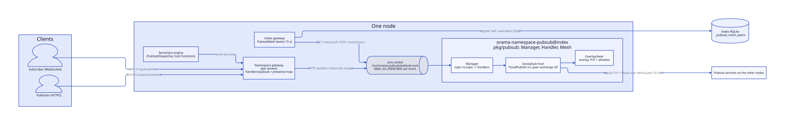
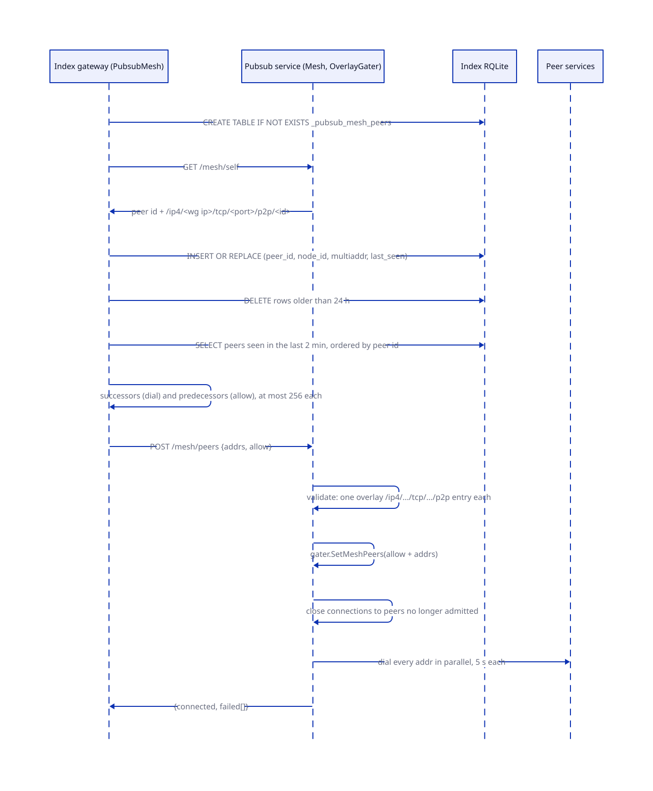
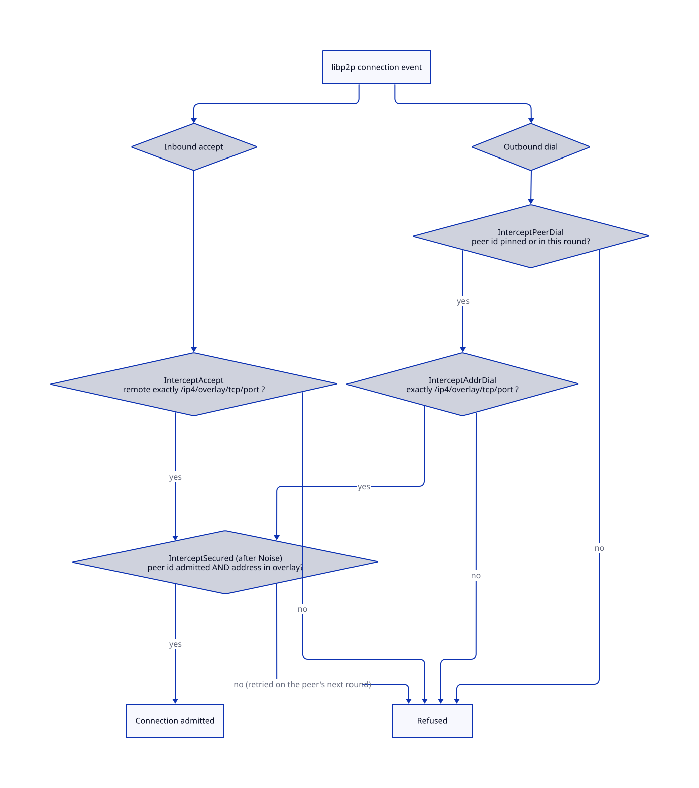
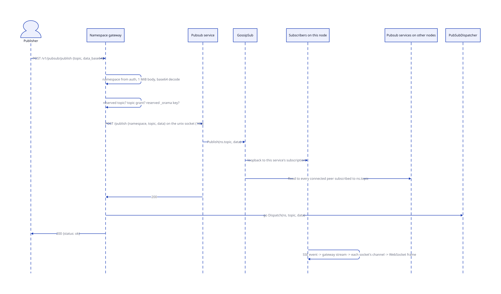
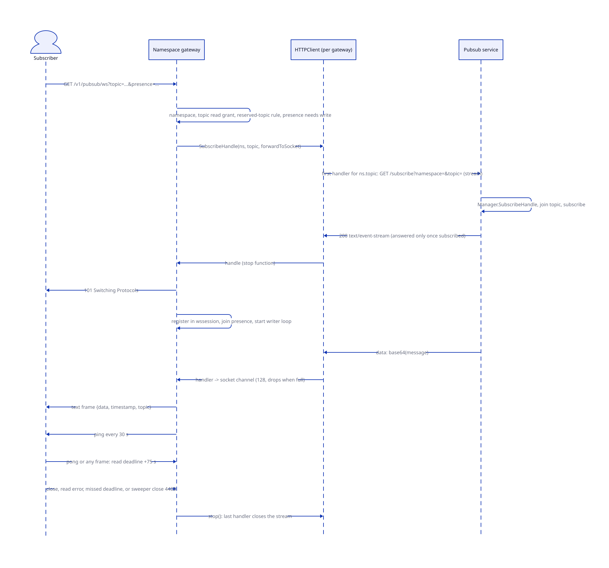

# Pub/sub

> **At a glance.**
>
> - **What:** a per-node GossipSub service, `orama-namespace-pubsub@index`, that every tenant on the node shares. Gateways reach it over a unix socket, publish through it, and subscribe through one server-sent-event stream per namespace and topic. The services of all nodes become one GossipSub mesh because the index gateway of each node registers its service in the cluster registry and tells it which peers to dial. Tenants see three things: publish and publish-batch over HTTPS, a subscribe WebSocket with optional presence, and serverless triggers on topics.
> - **Key numbers:** socket `/run/orama-pubsub/pubsub.sock`, mode `0600` in a `0700` directory, uid checked with `SO_PEERCRED`; mesh round every 15 s, registration believed for 2 min and kept for 24 h, at most 256 peers dialled and 256 allowed per round, dial timeout 5 s; publish answered once the local service holds the message, 504 after 10 s; 1 MiB request body on publish, 100 messages and 16 MiB body on publish-batch; subscriber socket pinged every 30 s with a 75 s read deadline; topic name on the wire is `namespace.topic`; GossipSub peer exchange off, flood publish on.
> - **Code:** `core/pkg/pubsub/`, `core/cmd/pubsub/`, `core/pkg/gateway/handlers/pubsub/`, with the mesh driver in `core/pkg/gateway/pubsub_mesh.go` and the trigger dispatcher in `core/pkg/serverless/triggers/`.
> - **Depends on:** [the WireGuard mesh](06-the-wireguard-mesh.md) for the only network the service listens on, [cluster state](07-cluster-state.md) for the registry table, [the gateway](12-gateway-architecture.md) for the request path and [authorization](14-authorization.md) for grants and topic selectors.



## Why it exists

Applications on Orama need fan-out that is cheaper than polling a database: chat messages, presence, wake-ups, and the membership events of a call. The requirement has three parts. A message published through any gateway of a namespace must reach every subscriber of the topic, whichever node their socket is on. Tenants must not see each other's topics although they share the same machines. And the transport must not open a new path onto the public internet or onto the tenants' own processes.

The design splits the problem across three processes that each do one thing. The gateway authenticates the caller, resolves the namespace and enforces grants. A per-node service, `orama-namespace-pubsub@index`, owns the libp2p host and the GossipSub router and knows nothing about tenants except the namespace string it is given. A small control loop in the index gateway tells each service where the others are, because no configuration names another node's service: each service listens on its own WireGuard address, on a port the OS picks, under an identity of its own (`core/pkg/pubsub/mesh.go`, package comment on `Mesh`).

The service replaced two earlier arrangements, both visible in comments. Its API was a loopback TCP port, `127.0.0.1:10105`, which every process on the node could use for any namespace (`core/pkg/pubsub/socket.go`, top comment). Its libp2p host listened on every interface, which put it on the public address with only the firewall in front (`core/cmd/pubsub/main.go:overlayListenAddr`). Both are closed in the current code, and the rest of this chapter describes the closed form.

Delivery is deliberately weak. The system is at-most-once, keeps nothing, replays nothing and orders only one publisher's sequential messages. It is a realtime signalling layer. Anything a tenant must not lose goes into its database first.

## The model

**Service.** The process `core/cmd/pubsub/main.go`, installed as `/opt/orama/bin/pubsub` and run as the template unit `orama-namespace-pubsub@index` (`core/systemd/orama-namespace-pubsub@.service`). One per node, started by the `pubsub` component of the node's boot graph after the libp2p component ([the node as a supervisor](04-the-node-as-a-supervisor.md)); the gateway component depends on it. Every namespace on the node shares it.

**Manager.** The service's in-process pub/sub core (`core/pkg/pubsub/manager.go:Manager`). It maps a namespaced topic to a GossipSub topic handle and to one subscription with a set of handlers. The service builds it with an empty default namespace, so every call must name one.

**Namespaced topic.** The string `namespace.topic`, built with `fmt.Sprintf("%s.%s", ns, topic)` in every Manager operation (`core/pkg/pubsub/publish.go:Publish`, `core/pkg/pubsub/subscriptions.go:SubscribeHandle`). Namespace names are 2 to 40 characters of lowercase letters, digits and hyphens, starting and ending with a letter or digit (`core/pkg/gateway/handlers/namespace/create_handler.go`), so they never contain a dot and the first dot of a wire topic always ends the namespace. The topic part is an opaque string.

**Bus.** The interface the rest of the code uses for pub/sub (`core/pkg/pubsub/bus.go:Bus`): subscribe, subscribe with a removal handle, publish, publish batch, publish same payload to many topics, unsubscribe, list topics. The gateways use `HTTPClient`, which speaks to the service. `ClientAdapter` is the in-process implementation over a Manager. The service itself uses a Manager directly; the adapter's only production user is the node process's own router (see below), and the tests.

**Handler API.** The HTTP interface of the service on its socket (`core/pkg/pubsub/httpapi.go:Handler`): `GET /health`, `POST /publish`, `POST /publish-batch`, `GET /topics`, `GET /subscribe` (an event stream), and with the mesh option `GET /mesh/self` and `POST /mesh/peers`. It trusts the namespace in the request, so it must only be served on a listener that admits the gateways alone.

**Mesh registration.** A row of `_pubsub_mesh_peers` in the index RQLite: peer id, node id, multiaddr, last seen (`core/pkg/gateway/pubsub_mesh.go:PubsubMesh`). The mesh driver is a loop in the index gateway of each node.

**Overlay gater.** The libp2p connection gate of the service's host (`core/pkg/pubsub/gater.go:OverlayGater`). It admits a connection only if the remote address is a plain TCP address inside the WireGuard prefix and the remote peer id is on an allowlist.

**Subscriber socket.** A WebSocket opened with `GET /v1/pubsub/ws?topic=...` on a gateway, tied to one topic of the caller's namespace (`core/pkg/gateway/handlers/pubsub/subscribe_handler.go:WebsocketHandler`).

**Presence.** An optional per-socket membership record on the gateway, announced to the topic as `presence.join` and `presence.leave` messages.

**The other GossipSub.** The node process `orama-node` also builds a GossipSub router on its own libp2p host (`core/pkg/node/libp2p.go`). It is a different instance, with peer exchange on, and it is not part of the application pub/sub path. [Known gaps](#known-gaps) says what it is used for.

## How it works

### The service process

`core/cmd/pubsub/main.go` starts in this order.

1. It reads two environment variables from the unit's environment file: `IDENTITY_PATH` and `BOOTSTRAP_PEERS`, a comma-separated list of multiaddrs of the node libp2p hosts. `EnsurePubsub` writes the file, with the identity in `namespaces/index/pubsub/identity.key`, the one directory the sandboxed unit may write (`core/pkg/namespace/index.go:EnsurePubsub`).
2. It computes its listen address with `overlayListenAddr`: `/ip4/<this node's WireGuard address>/tcp/0`. The address comes from `wireguard.GetIP` and must lie inside the overlay prefix. With no overlay address the process exits with an error instead of listening on every interface, and `Restart=always` with `RestartSec=5s` retries it.
3. It builds the gater and pins every bootstrap peer id in it.
4. It builds the libp2p host with the gater, Noise as the only security transport and the default muxers. The host identity is loaded from `IDENTITY_PATH`; if the load fails for any reason, a missing and an unparseable file alike, a new Ed25519 identity is generated and saved over it (mode `0600`). Without `IDENTITY_PATH` the identity is random per start.
5. It creates GossipSub with `WithPeerExchange(false)` and `WithFloodPublish(true)` (`core/cmd/pubsub/main.go:gossipSubOptions`). Everything else is the library default (go-libp2p-pubsub v0.18.0 in `core/go.mod`): mesh degree 6 with bounds 5 and 12, a 1 s heartbeat, history 5 windows of which 3 are gossiped, a 1 MiB maximum message, and a 120 s cache of seen message ids.
6. It dials each bootstrap peer once. A failure is a warning. The bootstrap peers play no further role: the application mesh comes from the registry, and the node hosts carry no application topic.
7. It listens on the unix socket and serves the handler API with `ReadHeaderTimeout` of 10 s.

On SIGINT or SIGTERM it shuts the HTTP server down with a 5 s budget, then closes the Manager and the host.

### The unix socket and the peer check

`core/pkg/pubsub/socket.go:ListenSocket` removes a stale socket file left by a previous run, refuses to replace anything that is not a socket, listens, and sets the file mode `0600`. The unit declares `RuntimeDirectory=orama-pubsub` with mode `0700`, which creates `/run/orama-pubsub/` for the socket on every start.

The listener wraps every accepted connection in a credential check. `peerCredListener.Accept` reads the peer's uid from the kernel with `SO_PEERCRED` on Linux (`core/pkg/pubsub/peercred_linux.go:peerUID`) and drops the connection unless it equals the service's own uid. The kernel reports the credentials the peer had when it connected. The check does not depend on the directory and file modes being right; the modes only stop others from connecting at all. macOS reads `LOCAL_PEERCRED` so the code runs on a developer machine; any other platform refuses every connection. The uid, not the pid or the binary, is the identity: pubsub and every gateway run as `orama` today, and none of them is in `isolatedServices` ([privilege and filesystem trust](05-privilege-and-filesystem-trust.md)). Moving either to its own account would make the check refuse the gateways.

### Namespacing and the Manager

`Manager.Publish` computes `namespace.topic`, joins the GossipSub topic if it has not (`core/pkg/pubsub/topics.go:getOrCreateTopic` keeps one handle per name for the process lifetime) and calls the library's publish with the caller's context. The namespace comes from the request context (`WithNamespace`, key `CtxKeyNamespaceOverride`), or from the Manager's default if the context carries none.

There is no wait for the mesh. An earlier version polled for topic peers for up to 2 s before each publish; on a topology where most application topics have no remote peer, that cost every publish its full timeout. The router runs with flood publish, which sends a message directly to every connected peer known to be subscribed to the topic, mesh or not, and a subscriber in the same service receives it by loopback (`core/pkg/pubsub/publish.go`, comment in `Publish`).

`PublishBatch` publishes messages in parallel under a semaphore of `defaultBatchConcurrency` (32). The default is fail-fast: the first error cancels the rest through an errgroup. With `BestEffort` every message is attempted and the failures come back as a `BatchError` mapping topic to error. `PublishSame` builds a batch of one payload over many topics. `MaxBatchSize` is 100, enforced by the gateway handler and not by the Manager.

### Subscriptions and handler fan-out

`Manager.SubscribeHandle` keeps one GossipSub subscription per namespaced topic. A second handler on the same topic is added to the existing subscription under the manager lock, so the last remover cannot end the subscription in between. The returned function removes exactly that handler, is idempotent, and cancels the subscription when the last handler leaves (`remover`). A goroutine reads the subscription and calls every handler for each message; handler errors do not stop the others.

One payload never reaches handlers: the literal `PEER_DISCOVERY_PING` is dropped (see below). A subscriber in another namespace never sees a message either, because its wire topic string differs.

`ListTopics` returns the topics this Manager is subscribed to in one namespace, found by prefix match on `namespace.`. It is a view of this node's subscriptions, not of the cluster.

### Peer discovery pings

After a new subscription the Manager starts `announceTopicInterest` (`core/pkg/pubsub/discovery_integration.go`). It publishes `PEER_DISCOVERY_PING` on the topic while the topic has no remote peers: up to 10 attempts, 1 s timeout each, sleeping 100 ms times the attempt number (100 ms, then 200 ms, up to 1 s; the code's 2 s cap is never reached), stopping as soon as a peer appears. It then checks every 15 s for 20 ticks, about 5 minutes, and pings again whenever the peer list is empty. A companion `monitorTopicPeers` polls every 5 s for 30 s and does nothing with the result. Subscribers filter the ping in `SubscribeHandle`, so applications never see it, and a tenant message whose bytes are exactly `PEER_DISCOVERY_PING` is dropped the same way. The ping cannot help discovery: it is only sent while the topic has no remote peer, and flood publish sends only to peers known to be subscribed, so it reaches the local subscription and nothing else.

### The HTTP API and the event stream

`POST /publish` takes `namespace`, `topic` and a base64 `data`; an empty topic or namespace, an undecodable body or bad base64 is 400, any publish error is 500 with the error text. An empty `data` is accepted and publishes an empty message. No endpoint limits the request body. `POST /publish-batch` takes a namespace, messages and `best_effort`; bad base64 in any message is 400, any publish error, a `BatchError` included, is 500. `GET /topics?namespace=` returns a sorted JSON list, `[]` when empty.

`GET /subscribe?namespace=&topic=` subscribes with `SubscribeHandle` first and only then writes the response headers, so a client whose request has returned is subscribed and a failure arrives as a status code. It streams `text/event-stream` events of the form `data: <base64>` followed by a blank line. The handler pushes into a channel of 32 and drops the message when the channel is full, so a stalled consumer loses messages instead of stalling the router. The stream ends when the client's request context ends, and the deferred stop removes the handler.

### The gateway's client: one stream per topic

Each gateway process holds one `HTTPClient` (`core/pkg/pubsub/httpclient.go`) built from the socket path and the gateway's namespace. It dials the socket through a custom transport; the URL host is a placeholder. Publishes use an HTTP client with a 10 s timeout. `ListTopics` is a GET with the namespace as a query parameter.

For subscriptions it keeps a map from `namespace.topic` to a stream (`core/pkg/pubsub/httpclient_subscribe.go:stream`). The first subscriber for a key creates the stream and opens `GET /subscribe` in a goroutine; later subscribers join the stream's handler set. `Subscribe` returns only after the service has answered, bounded by 10 s for the answer and by the caller's context for its own wait. A reader goroutine (`feed`) decodes events line by line with a scanner whose buffer maximum is 1 MiB, so a line, `data: ` plus the base64, must be under 1,048,576 bytes, which is a message of at most 786,426 bytes. It calls every handler in turn, in that goroutine, so a slow handler delays every other handler of the topic and, once the service's 32-slot channel fills, loses messages. `SubscribeHandle` returns a removal function; the stream closes when the last handler leaves. `Unsubscribe` removes the most recent handler added through plain `Subscribe`. When the stream ends for any reason other than a deliberate close (the service restarted, the socket broke, a line was too long), the client deletes it, logs `subscribe stream ended; its handlers no longer receive` with the scanner's error and does nothing else. The next `Subscribe` on that key opens a fresh stream; the handlers that were attached stay on the dead one. Nothing re-opens it for the handlers already attached. [Known gaps](#known-gaps) follows this to its consequences.

### Mesh formation

The index gateway of each node runs `PubsubMesh.Run` once the gateway is ready and then every `pubsubMeshInterval` of 15 s (`core/pkg/gateway/pubsub_mesh.go`). Tenant gateways do not run it: the condition in the gateway constructor is `!servesNamedNamespace(cfg.ClientNamespace)`, a deps client and a registry handle. Each pass has a 30 s budget (`pubsubMeshCallTimeout`).



A pass does this.

1. `CREATE TABLE IF NOT EXISTS _pubsub_mesh_peers` with columns `peer_id` (primary key), `node_id`, `multiaddr`, `last_seen` (unix seconds). The statement runs on every pass, because a single failed attempt at boot, for example during a leader election mid-upgrade, once ended the mesh for the life of the gateway.
2. `GET /mesh/self` on the local service. `Mesh.Self` lists the host's listen addresses and keeps the TCP ones inside the overlay prefix, formatted `/ip4/<overlay ip>/tcp/<port>/p2p/<peer id>`. A host listening on no such address is an error: advertising one would hand other nodes an address they cannot use.
3. `INSERT OR REPLACE` of the first address with `last_seen` set to the gateway's clock, then `DELETE` of rows older than 24 h (`pubsubMeshRetention`, for services whose identity changed and left an old row).
4. `SELECT` of the other services whose `last_seen` is within 2 min (`pubsubMeshPeerTTL`), ordered by peer id.
5. The sorted list is cut into two lists with the ring helpers (`ringSuccessors`, `ringPredecessors`). The successors are the peers after this one in peer-id order, wrapping, and are dialled. The predecessors are the peers before it, nearest first, wrapping, and are only allowed to connect in. Each list holds at most `MaxMeshPeers` (256) entries.
6. `POST /mesh/peers` with `addrs` and `allow`.

The two-list design makes any dial succeed. If A dials B, then B is among A's first 256 successors, so A is among B's first 256 predecessors, so B's allowlist contains A, at any fleet size. For a fleet of at most 257 nodes every service dials all others. Beyond that each service connects to up to 512 neighbours on the id ring, and GossipSub needs a connected graph, not every pair.

`Mesh.ConnectPeers` handles the request (`core/pkg/pubsub/mesh.go`). More than 256 entries in either list is refused whole with 400. Every entry is parsed as exactly one `/ip4/<ip>/tcp/<port>/p2p/<id>` address inside the overlay prefix, naming a peer; anything else, and the host itself, is dropped, and a bad entry is reported in `failed` with the others still processed. It then replaces the gater's mesh allowlist with the union of the `allow` and `addrs` peers, closes every connection to a peer the gater no longer admits, and dials the `addrs` peers in parallel with a 5 s timeout each, skipping peers already connected. It answers `connected` and `failed[]`. The gateway logs each failed peer and retries on the next pass while the peer stays registered. An empty registry still sends a round with empty lists, which clears the allowlist.

Replacing the allowlist each round is what removes a departed peer. The gate only judges new connections, so `closeUnadmitted` cuts the existing ones. A peer that connects before the local gateway has named it is refused at the handshake and connects on its own next round.

### The connection gate



The gater implements the libp2p `ConnectionGater` interface. A dial passes `InterceptPeerDial` (the peer id is pinned or in the last round) and `InterceptAddrDial` (the address is exactly `/ip4/<overlay ip>/tcp/<port>`, optionally followed by `/p2p/<id>`). An accept passes `InterceptAccept` on the same address test before any handshake. After the security handshake `InterceptSecured` requires both the peer id on the allowlist and the address in the overlay, in either direction. The address test counts protocol components: a relay circuit, a websocket or QUIC layered on an overlay address does not pass, and neither does loopback, a public address, IPv6 or DNS, whatever GossipSub or the peerstore holds for the peer. The allowlist has two parts: the pinned bootstrap peers, kept for the life of the gate, and the mesh peers, replaced every round.

### Publishing through the gateway

`POST /v1/pubsub/publish` takes `topic` and `data_base64` (`core/pkg/gateway/handlers/pubsub/publish_handler.go:PublishHandler`).



1. The route policy has already authenticated the caller and required the `pubsub` write permission ([the route policy table](14-authorization.md#the-route-policy-table)). The handler reads the namespace from the request context and answers 403 `namespace not resolved` without one.
2. The body is limited to 1 MiB with `MaxBytesReader`, and must carry a topic and non-empty data. The data must decode as standard base64. The 1 MiB applies to the JSON body, so the data itself is at most about 786,000 bytes.
3. A topic under the reserved prefix `_orama/` (compared case-insensitively) is 403 `PUBSUB_RESERVED_TOPIC`, for every caller ([reserved topics](14-authorization.md#pubsub-reserved-topics)).
4. If the credential is narrowed by a topic selector, `authorizeTopic` asks `AuthorizeResource` for write on that topic; a refusal is 403 ([selectors](14-authorization.md#selectors)).
5. A payload that is a JSON object with a top-level key `_orama` (compared case-insensitively, after trimming whitespace and one byte-order mark) is 400 `PUBSUB_RESERVED_KEY`; a payload that starts as an object but does not parse as strict JSON, for example with trailing commas or nesting past Go's limit, is 400 `PUBSUB_INVALID_OBJECT` because a lenient subscriber might still read the key. A payload that is not an object is never an envelope. The platform stamps `_orama` on events it publishes itself, so a subscriber may trust it.
6. The handler calls the Bus with internal auth and the namespace override, under a context with `publishTimeout`, 10 s. The HTTP client posts to the service's `/publish`, and the service publishes into GossipSub and answers 200. The answer means the local service holds the message, not that anyone received it.
7. On success the handler starts the serverless trigger dispatch in a goroutine and answers `200 {"status":"ok"}`. On failure it logs a pointer to the unit and answers 504 if the 10 s expired (`publish of ... was not confirmed within 10s and may not have been delivered; retry it`) or 503 otherwise, a client that hung up included (`... the pub/sub service is unavailable on this node; retry it`). No trigger is dispatched on a failure. A 504 does not prove the message was not published, which is why the text says "may". The tenant is told to retry and nothing about the node.

Publishing inside the request is what gives ordering. One client's sequential publishes to a topic reach one service in the order they were acknowledged, and the service hands them to GossipSub in that order. Publishes from different clients have no relative order, and delivery after the 200 is asynchronous.

`POST /v1/pubsub/publish-batch` accepts `messages` of topic and base64 data, and `best_effort` (`PublishBatchHandler`). The body limit is 16 MiB, at most 100 messages (`MaxPublishBatchSize`), each at most 1 MiB decoded (`MaxPerMessageBytes`). Every message is decoded and checked (topic present, base64, size, reserved topic, topic grant, reserved key) before any is published, because a half-refused batch is worse than a refused one. The Bus call then publishes them in parallel and the answer follows the same 200, 503, 504 rules. A best-effort batch where some messages fail returns the `BatchError` through the error path, so the HTTP status is 503 although other messages were delivered, and no trigger is dispatched for any of them. After a success the handler dispatches triggers for every message of the batch.

### Subscribing through the gateway

`GET /v1/pubsub/ws?topic=...` is a WebSocket (`WebsocketHandler`).



Before the upgrade, so that a refusal is a plain HTTP status and not a close frame, the handler resolves the namespace, requires `topic`, checks the topic read grant, and applies the reserved-topic rule: a caller with no write grant on the topic cannot subscribe to a `_orama/` topic. If the query asks for presence it requires a `member_id` and also the write grant, because presence publishes.

Then it subscribes, still before the upgrade. `SubscribeHandle` on the gateway's client returns once the service holds the subscription, so nothing published after the socket opens can be missed, and a service that cannot subscribe is a 503 `pubsub subscribe failed` rather than a socket that silently receives nothing. The handler is `forwardToSocket`, which pushes into a channel of 128 and drops the message with a warning when the channel is full, because a slow client must not block the stream shared by every socket on the topic.

After the upgrade the socket is registered in the gateway's session registry with the token's claims, so the sweeper can close it with code 4401 when the token has expired past its 120 s grace, 4403 when the session is revoked, and 4503 when the revocation list cannot be read for two minutes ([the gateway](12-gateway-architecture.md)). The sweep runs every 5 s, half of the 10 s revocation staleness bound (`core/pkg/gateway/wssession/registry.go`, `core/pkg/gateway/auth/revocation.go`). The origin of a browser request must equal the request host (taken from `X-Forwarded-Host` when a proxy rewrote `Host`) or be a subdomain of it; requests without an `Origin` header are allowed (`core/pkg/gateway/handlers/pubsub/ws_client.go:checkWSOrigin`).

Two goroutines then serve the socket. The writer loop writes each queued message as a text frame with a write deadline of 30 s, pings every 30 s with a 5 s control deadline, and ends the connection when a write or ping fails. The frame is a JSON envelope:

```json
{"data": "<base64 payload>", "timestamp": 1760000000000, "topic": "chat.room1"}
```

The topic is the tenant's own, without the namespace prefix, and the timestamp is the gateway's clock in milliseconds when it writes the frame, not the publish time. The reader loop sets a read deadline of 75 s and moves it forward on every frame, pongs included. 75 s is two missed pings plus slack, and it must exceed the 30 s interval. A read error, a close, a missed deadline or a sweeper close ends the reader, which cancels the writer and runs the deferred leave and unsubscribe, so the stream handler and presence entry are always removed.

Frames the client sends are publishes to the same topic, with conditions. The raw bytes of a text or binary frame are the payload; there is no base64 and no JSON wrapper, and a frame has no size limit (the gateway sets no read limit on the socket). A JSON object whose `type` is `ping` is a client heartbeat and is dropped. The frame is refused with the text frame `publish_error` when the socket may not publish or when the payload carries the reserved key or is an unreadable object. The socket may publish only if the topic is not reserved and the caller holds a write grant on it, decided once at upgrade (`mayPublish`), so a subscriber-only caller cannot write by sending a frame. A frame publish goes straight to the Bus; it does not run the HTTP path's trigger dispatch, so only the dispatcher's own subscription can fire a concrete-topic trigger for it. A failed publish also produces `publish_error`.

### Presence

With `presence=true&member_id=...` (optionally `member_meta` as JSON) the handler adds a `PresenceMember` to an in-memory map keyed by `namespace.topic` and publishes `presence.join` on the topic. The event is a normal message, so every subscriber in the cluster, the joiner included, receives it:

```json
{"type": "presence.join", "member_id": "alice", "timestamp": 1760000000, "meta": {}}
```

When the socket ends the entry is removed and `presence.leave` is published. `GET /v1/pubsub/presence?topic=` returns `topic`, `members` (each with `member_id`, `joined_at` in unix seconds and `meta`) and `count` for the members registered on this gateway process. The member's `timestamp` in the events is also in seconds, where the socket envelope's is in milliseconds. The member id and meta are the client's own words; the platform does not bind them to the authenticated principal.

### Serverless triggers

A function can be bound to a topic pattern; the rows live in the namespace database as `function_pubsub_triggers`. [Serverless functions](21-serverless.md) owns the engine; this is how pub/sub feeds it.

The gateway's `firePublishTriggers` calls `PubSubDispatcher.Dispatch` at depth 0 after a successful HTTP publish or batch element. Separately, the dispatcher subscribes through the same Bus to every literal trigger topic. It reconciles its subscriptions against the trigger table when the gateway starts, when a trigger or function is added or removed through the gateway, and every 60 s (`dispatcherRefreshInterval`), so messages published from inside functions, by the platform or through a socket reach concrete-topic triggers over the loopback path. A host function that publishes also dispatches wildcard triggers on its own gateway. The same message can therefore arrive twice on one gateway (the HTTP hook and the subscription) and once on every other gateway that subscribed, so a dispatch first claims the key of namespace, topic, payload hash and depth: in process (30 s, at most 4,096 entries, `localDedupCache`) and then cluster-wide in the namespace's Olric (`NX` put with a 30 s expiry); the first claim fires the function. Both claims fail open: with Olric absent or erroring the dispatch fires, so a duplicate is possible and a lost trigger is not. A chain of functions that republish stops at `maxTriggerDepth` 5, the depth riding beside the message in a record (local, and in the namespace's Olric for 30 s) because the wire format carries only the payload. The subscription handler runs the dispatch inline in the stream's reader goroutine, which also feeds any socket on that topic. Wildcard patterns are not subscribed, since GossipSub has no wildcard subscription: they fire only for HTTP publishes and for function publishes on the same gateway.

## State it owns

| Item | Holds | Written by | Read by | Where |
|---|---|---|---|---|
| `/run/orama-pubsub/pubsub.sock` | the service API | the service (`ListenSocket`) | every gateway on the node, as the same uid | tmpfs, `0600` in a `0700` directory made by the unit |
| `identity.key` | the service's libp2p private key | the service on first start | the service | `namespaces/index/pubsub/` under the data directory, `0600` |
| `pubsub.env` | `IDENTITY_PATH`, `BOOTSTRAP_PEERS`, plus `PUBSUB_LISTEN` and `NODE_ID` that nothing reads | `EnsurePubsub` | systemd, the service | `/var/lib/orama-unit-env/index/` |
| `_pubsub_mesh_peers` | peer id, node id, multiaddr, last seen | each index gateway, for its own node | every index gateway | index RQLite, created at runtime, on the tenant SQL refused list (`core/pkg/sqlguard/sqlguard.go`) |
| `Manager.topics`, `subscriptions` | joined topics (never released while the process lives), handler sets, reference counts | the service | the service | memory |
| `OverlayGater` allowlists | pinned peers and the latest round | `Pin`, `SetMeshPeers` | the libp2p host | memory |
| `HTTPClient.streams` | one upstream stream per namespace and topic | the gateway process | the gateway process | memory |
| `presenceMembers` | members per `namespace.topic` | the subscribe handler | the presence handler | gateway memory |
| `wssession` registry | open subscriber sockets and their tokens | the subscribe handler | the sweeper | gateway memory |
| Dispatch dedup and depth records | claims and published depth | `PubSubDispatcher`, the publish host function | `PubSubDispatcher` | gateway memory and the namespace Olric (dmaps `pubsub_dispatch_dedup`, `pubsub_publish_depth`), 30 s |
| `function_pubsub_triggers` | topic pattern per function | the serverless trigger routes | the dispatcher | the namespace database ([serverless functions](21-serverless.md)) |

Nothing about messages is stored: no queue, log or offset exists anywhere in this subsystem. The reserved port `PubsubAPIPort` 10105 (`core/pkg/constants/ports.go`) is allocated to the index and listed in the port map ([port map](../appendices/a-port-map.md)), but the service no longer binds it.

## Lifecycle

**Boot.** `orama-node` starts the pubsub component after its libp2p component and before the gateway ([the node as a supervisor](04-the-node-as-a-supervisor.md)). The unit is ordered after `orama-namespace-wireguard@index`, because the service refuses to start without the overlay address. `StartLimitIntervalSec=0` means a failing start is retried every 5 s with no rate limit. The index gateway starts its mesh loop when it is ready, so the first registration and the first dials happen within one pass of the gateway being ready. A new node therefore joins the mesh about one round (15 s) after its gateway is up, plus the time for the other nodes to see its row: each of them dials or allows it on its own next round.

**Normal operation.** Per node, one registry write every 15 s and one read of the whole table. Per subscribed topic one GossipSub subscription, one event stream from gateway to service, and the discovery pings while the topic has no remote peer.

**Rolling upgrade.** The service is restarted by the supervisor with the node. The service keeps its peer id because the identity file persists, but its TCP port changes, since it is picked by the OS. The gateway registers the new address within one pass (at most 15 s), the other nodes' next rounds dial it, so cross-node delivery to and from that node resumes after up to about 30 s. The `allow` field of `POST /mesh/peers` is optional, so a gateway of an older release that sends none leaves its service admitting only the peers it dials itself. Subscriptions are the weak point: the gateway's event streams end with the service and are not re-established ([Known gaps](#known-gaps)), so subscriber sockets and the dispatcher's subscriptions on that node stay silent until they are recreated.

**Restart of a gateway.** All its sockets close with the process. The service sees the event streams end, removes the handlers and cancels subscriptions that have none. Presence entries of that gateway disappear from its memory without any `presence.leave` being published.

**Node loss.** The row stops being refreshed. After 2 min the other gateways stop listing it, and at their next round `SetMeshPeers` no longer admits it and `closeUnadmitted` cuts the connection. GossipSub drops the peer from its meshes when the connection closes. The row is deleted after 24 h.

**Namespace deletion.** Nothing in the service is namespace-aware, so topics of a removed namespace disappear when their last handler leaves.

## Failure modes

| Trigger | What the system does | What you observe |
|---|---|---|
| Pubsub service down on a node | Publishes through that node's gateways fail; the mesh loop fails each pass; sockets already open stop receiving (see gaps). The unit restarts every 5 s. | `503 ... the pub/sub service is unavailable on this node`; gateway log `pubsub mesh: reconcile failed, will retry` with a pointer to the unit; `subscribe stream ended` warnings |
| Service accepts but is slow | The gateway waits 10 s | `504 ... was not confirmed within 10s and may not have been delivered` |
| No overlay address at start | The service exits at once and is retried every 5 s | unit in a restart loop with `pubsub listens on this node's WireGuard address, and it has none` |
| Registry unreachable or between leaders | The pass fails; existing connections and the allowlist stay as the last good round left them | warning per pass; no change in delivery until peers change |
| Peer down | The dial fails and is reported; retried every round while the row is fresh | the peer in the `failed` list, logged as `peer unreachable, will retry while it stays registered` |
| WireGuard partition between two nodes | The TCP connection breaks once the transport notices, GossipSub drops the peer, and the next round redials (a dial to a peer still counted as connected is skipped) | cross-node delivery between the two stops until the tunnel returns and the connection is rebuilt, within one round of the old connection closing |
| Clock skew between nodes beyond 2 min | `last_seen` is written with the writer's clock and judged with the reader's. A node whose clock is more than 2 min behind looks expired to all others and is neither dialled nor allowed. A node more than 2 min ahead sees every other row as expired, names no peer, and its gate refuses the others when they dial it. | that node's subscribers receive only same-node traffic; no error is raised |
| Slow WebSocket client | Messages are dropped when its 128-slot channel is full; a write that takes more than 30 s ends the socket | `pubsub ws: client slow, dropping message` warnings |
| Slow stream consumer inside the service | The 32-slot channel of the event stream drops messages | silent loss; no log line |
| Client stops answering pings | The 75 s read deadline ends the socket; subscription and presence are removed | close of the connection, `presence.leave` published |
| Token expires or is revoked | The sweeper closes the socket with 4401, 4403 or 4503 | close frame with the code and reason |
| Bad input | Missing topic, bad base64, oversize body, reserved topic, reserved key or too many messages is refused before anything is published | 400 or 403 with a `code` for the reserved cases |
| Non-overlay or unknown peer connects to the service | Refused by the gate, before the handshake for a bad address and at the handshake for an unknown id | nothing published; the peer retries on its own schedule |
| Message too large for GossipSub (the encoded RPC over 1 MiB) | The publishing service delivers it to its own subscribers and drops the RPC when sending it to each peer | local subscribers see it, remote ones do not, the publisher gets 200; see gaps |
| Event line over 1 MiB on a gateway's stream | `feed` stops with `bufio.Scanner: token too long`, the stream is deleted | every socket and the dispatcher on that topic on that gateway go silent; warning `subscribe stream ended`; see gaps |
| Disk full | The service writes nothing but the identity key at first start; the gateway's pubsub state is in memory | no effect on delivery |

## Trust and security

**The socket boundary.** The service API trusts the namespace in every request. What keeps it from being a cross-tenant hole is that only processes running as the service's uid can connect: the gateways, and the other cluster daemons that share the `orama` account. A process the tenant controls, including a deployed application, runs under a different identity and is refused by the kernel-reported uid, and root is refused as well. The gateway is the party that binds a request to a namespace, taking it from the authenticated credential, never from the request body. A compromised gateway process could name any namespace, so the isolation of tenants from each other here is the isolation of their gateway processes ([privilege and filesystem trust](05-privilege-and-filesystem-trust.md)).

**The network boundary.** The service's libp2p host listens only on its node's WireGuard address. Its gate admits only plain TCP overlay addresses and only peer ids the local gateway named in the latest round, so a node that is on the overlay but not in the registry, or not yet named, cannot connect. WireGuard admits every node, so the gate adds the distinction between a node and a pubsub peer. Peer exchange is off, so a peer cannot hand the host addresses to dial; the mesh is only what the registry says. Transport is Noise over TCP with Ed25519 peer identities, and GossipSub's default message signing is on.

**What a peer inside the mesh can do.** A peer that passes the gate is a cluster node, which already holds the cluster secret and registry credentials. It can subscribe to and publish on any `namespace.topic`: the topic prefix is a naming convention inside the mesh, not an access control. There is no libp2p pre-shared key on this host, no per-namespace mesh, and no signed envelope that a subscriber's gateway verifies. The dispatcher's source comment records the consequence for triggers: a node in the mesh can fire another tenant's concrete-topic trigger by publishing to its topic.

**Registry integrity.** A row in `_pubsub_mesh_peers` names an address that every service dials, so a forged row would point nodes at a host of the forger's choice. The table is on the tenant SQL refused list, so tenant SQL cannot write it. The service additionally refuses any entry outside the overlay.

**Tenant-facing authentication.** All five routes are data-plane routes accepting any credential (`AnyCredential` in `core/pkg/gateway/route_policy.go`), read for socket, topics and presence, write for publish and batch. Beyond the coarse permission, three finer rules apply: a topic selector such as `pubsub:topic=chat.*` narrows publish, batch and subscribe; a signed-in wallet with no grant may subscribe but not publish (`INSUFFICIENT_SCOPE`, [wallets with no grant](14-authorization.md#wallets-with-no-grant)); the `_orama/` prefix and the `_orama` key belong to the platform. The selector is not applied to the topics listing or to presence ([Known gaps](#known-gaps)).

**Spoofing within a topic.** A caller with publish rights can publish any JSON without the reserved key, including a body shaped like a presence event, and a presence member id is whatever the client sent. Applications that rely on who said what carry their own signature inside the payload. The publish host function of serverless functions checks neither the reserved topic nor the reserved key nor a size (`core/pkg/serverless/hostfunctions/pubsub.go:PubSubPublish`): a function is the tenant's own code, so the `_orama` stamp proves only that the tenant's code or the platform wrote it, never that an end user did not.

**Information leaks.** Error bodies to tenants name the topic and a retry hint but not the node, the unit or the socket; the operator-facing detail goes to the gateway log. A tenant cannot see another namespace's topics: `ListTopics` filters by the namespace prefix before it returns, and the gateway drops `_orama/` topics from the listing for a caller with no write grant.

## Limits and scale

| Limit | Value | Source |
|---|---|---|
| Publish request body | 1 MiB (data about 786,000 bytes) | `core/pkg/gateway/handlers/pubsub/publish_handler.go:PublishHandler` |
| Batch | 100 messages, 16 MiB body, 1 MiB per message | `MaxPublishBatchSize`, `MaxPerMessageBytes` |
| Batch concurrency inside the service | 32 | `core/pkg/pubsub/publish.go:defaultBatchConcurrency` |
| Publish hand-off | 10 s | `defaultPublishTimeout`, `requestTimeout` |
| Subscriber channel, gateway | 128 messages | `WebsocketHandler` |
| Event stream channel, service | 32 messages | `core/pkg/pubsub/httpapi.go:Handler` |
| Event line read by the gateway | under 1 MiB, a message of at most 786,426 bytes | `core/pkg/pubsub/httpclient_subscribe.go:feed` |
| Publishes per function invocation | 1,000 | `core/pkg/serverless/hostfunctions/pubsub.go:maxPublishesPerInvocation` |
| WebSocket ping, read deadline, write deadline | 30 s, 75 s, 30 s | `defaultWSPingInterval`, `defaultWSPongWait`, `wsWriteTimeout` |
| Mesh round, registration TTL, retention | 15 s, 2 min, 24 h | `core/pkg/gateway/pubsub_mesh.go` |
| Peers per mesh round | 256 dialled, 256 allowed | `core/pkg/pubsub/mesh.go:MaxMeshPeers` |
| GossipSub maximum RPC | 1 MiB including the message envelope, library default | go-libp2p-pubsub v0.18.0 |
| Open files for the service | 65,536 | unit `LimitNOFILE` |

**Delivery guarantees.** At most once. A message published before the remote service has learned of a new subscription is not delivered to it, because flood publish sends only to peers known to be subscribed; the fleet tests wait for a subscription to become reachable before asserting delivery (`warmUp` in `e2e/features/pubsub/ws_test.go`). There is no replay on reconnect.

**Cost at ten times the size.** The first bottleneck is the registry. Every node writes one row every 15 s, so a fleet of N nodes adds N/15 raft writes per second to the index RQLite, and each node reads all N rows, so N squared / 15 rows per second are read. Both are small at the current fleet and the writes go through the single index leader. The second is connection count: up to 257 nodes every service connects to every other, giving N(N-1)/2 TCP connections cluster-wide, and beyond that 512 neighbours each. The third is topic state. GossipSub announces every subscription to every connected peer, and each peer keeps the subscription set of every other, so with per-conversation topics the cost is topics times nodes in memory and in subscription RPCs, even for topics whose subscribers sit on one node. The fourth is per-topic discovery pinging: a topic with no remote peer publishes up to 30 pings in its first 5 minutes, to nobody. The fifth is service memory: `Manager.topics` keeps a handle for every topic ever published or subscribed to, so a tenant that publishes to unbounded distinct topic names grows the service until it restarts. Delivery fan-out itself scales with the number of nodes that have subscribers, since flood publish sends to each, not with the number of subscribers.

## Design decisions

### A service per node, outside the gateway

*Chosen:* one pubsub process per node, reached by the gateways over a local API. *Rejected:* a GossipSub router inside every gateway (the node process still carries a router of its own, for the unrelated `monitoring` topic). *Why:* the code states the shape, not the motive. The `Bus` comment names the two implementations, an in-process one and a local client for the gateways. The visible effects are that every tenant's gateway on a node shares one router, one set of mesh connections and one set of subscriptions per topic, that the libp2p host has one identity and one listen address to gate, and that a gateway restart does not tear the mesh down.

### A unix socket with a uid check, not loopback TCP

*Chosen:* a socket in a `0700` runtime directory, `0600`, with `SO_PEERCRED`. *Rejected:* `127.0.0.1:10105`. *Why:* every process on the node, a tenant deployment included, is on loopback, and the API takes the namespace from the request (`core/pkg/pubsub/socket.go`, top comment). The peer check does not rely on the file modes.

### The registry drives the mesh

*Chosen:* the gateway publishes the service address in the cluster registry and tells the service whom to dial and allow, every 15 s. *Rejected:* configuring peers, libp2p discovery, and GossipSub peer exchange. *Why:* a service's address is an OS-picked overlay port under its own identity, which no configuration knows, and the node libp2p hosts the service bootstraps from do not carry app topics (`core/pkg/pubsub/mesh.go`, comment on `Mesh`). Peer exchange lets a pruning peer hand the host addresses to dial, which the gate would have to refuse anyway (`core/cmd/pubsub/main.go:gossipSubOptions`). The registry is already shared, replicated and authoritative for membership.

### Successors dialled, predecessors allowed

*Chosen:* two lists per round, bounded at 256 each, cut from the peer-id ring. *Rejected:* a single list of peers to dial. *Why:* the service refuses a longer list than 256, GossipSub needs a connected graph and not all pairs, and with a single dial list an inbound connection from a peer outside the list would be refused by the gate. The ring guarantees that whoever dials a node is on its allowlist at any fleet size (`core/pkg/gateway/pubsub_mesh.go`, comment above `ringPredecessors`).

### Answer the publish after the local hand-off

*Chosen:* the HTTP response waits for the service's 200, and does not wait for the mesh. *Rejected:* a gateway that pushes to its own sockets in addition, and a wait for mesh formation. *Why:* one path to every subscriber makes delivery exactly once per message per socket and gives one client's publishes an order; answering after the hand-off tells the publisher about a service that is down (`core/pkg/gateway/handlers/pubsub/publish_handler.go`, comment in `PublishHandler`). The mesh wait cost 2 s per publish on topics without remote peers, and flood publish makes it unnecessary (`core/pkg/pubsub/publish.go`).

### Subscribe before upgrading the WebSocket

*Chosen:* the service subscription exists before the HTTP upgrade. *Rejected:* upgrading first and subscribing in the background. *Why:* nothing published after the socket opens can be missed, and a failed subscription is a 503 the client can act on instead of a socket that never receives (`WebsocketHandler`, comment before `SubscribeHandle`).

### The topic prefix in a shared mesh

*Chosen:* namespace isolation by the `namespace.` prefix and by the gateways' use of it; one mesh for all tenants. *Rejected:* a pre-shared key or a mesh per namespace. *Why:* the security documentation lists per-namespace topic authorization and a pre-shared key as not enforced, and the dispatcher's source comment names a per-namespace key or signed envelopes as the mitigation that would be needed. Today a single mesh costs one set of connections instead of one per tenant.

### Fail closed on the reserved key

*Chosen:* a publish whose payload starts as a JSON object that does not parse strictly is refused. *Rejected:* publishing it unchecked. *Why:* a more lenient subscriber, for example one that strips a byte-order mark, may still read the reserved key, and the key means "the platform sent this" (`core/pkg/gateway/handlers/pubsub/reserved.go:classifyEnvelope`).

## Known gaps

- **A restart of the pubsub service leaves existing subscribers deaf.** When the event stream from the service ends, `HTTPClient` deletes the stream, logs a warning and never re-opens it for the handlers attached to it (`core/pkg/pubsub/httpclient_subscribe.go:feed`). The subscriber WebSockets stay open and receive nothing until the client reconnects, and the gateway does not close them. The same happens to the trigger dispatcher: `Refresh` decides what to subscribe from its own `subscribedKeys` set, which still holds the topic, so it skips it and concrete-topic triggers stop firing on that gateway until the gateway restarts or the trigger is removed and added again (`core/pkg/serverless/triggers/dispatcher.go:Refresh`). A rolling upgrade restarts every service. This is a bug.
- **A message of 786,427 bytes or more kills the stream it is delivered on.** The service writes it as one base64 line and the gateway's scanner accepts lines under 1 MiB, so `feed` stops with `bufio.Scanner: token too long`, which ends the stream for every socket and the dispatcher on that topic on that gateway, and every gateway that receives the message does the same. The single publish route cannot produce such a message: its 1 MiB body limit keeps the data to at most 786,408 bytes. Publish-batch accepts messages of up to 1 MiB (`core/pkg/gateway/handlers/pubsub/publish_handler.go:MaxPerMessageBytes`), a socket frame has no limit, and the publish host function has none. The publisher is not told. This is a bug.
- **Messages near or over 1 MiB reach only the publishing node.** `Topic.Publish` does not check the size; the router drops, when sending, any RPC over 1 MiB, the envelope included, so remote services never get it. A batch message, a socket frame or a function publish in that range reaches subscribers on the publishing node and none elsewhere, and the publisher gets a 200. The subscribe handler sets no WebSocket read limit (`core/pkg/gateway/handlers/pubsub/subscribe_handler.go:readerLoop`), and the service API has no body limit, being reachable by gateways only.
- **The topics listing and the presence endpoint ignore topic selectors.** A credential narrowed to `pubsub:topic=chat.*` is refused on publish and subscribe to other topics, but `TopicsHandler` lists every topic the node's service holds for the namespace and `PresenceHandler` returns the member ids and meta of any topic it names; neither calls `authorizeTopic` (`core/pkg/gateway/handlers/pubsub/publish_handler.go:TopicsHandler`, `core/pkg/gateway/handlers/pubsub/presence_handler.go:PresenceHandler`). The route gate admits such a credential because its narrowed permission is still in the `pubsub` domain. This is a metadata leak inside one namespace.
- **Presence is per gateway process and has no expiry.** `GET /v1/pubsub/presence` lists only members whose sockets are on the gateway that answers, although join and leave events reach the whole cluster, and a namespace has one gateway per member node. A gateway that crashes publishes no `presence.leave`, so subscribers keep the member forever (`core/pkg/gateway/handlers/pubsub/types.go:PubSubHandlers`).
- **No per-namespace authorization inside the mesh.** Any peer that passes the gate may publish and subscribe on any `namespace.topic`, and no signature on a message binds it to a tenant. A node in the mesh can fire another tenant's concrete-topic trigger. The security documentation lists this as not enforced.
- **The registry compares clocks of different nodes.** `last_seen` is a unix time written by one gateway and compared by the others with the 2 min TTL (`core/pkg/gateway/pubsub_mesh.go:registeredPeers`), so a node more than 2 min behind is invisible to the mesh, and one more than 2 min ahead sees no peer, without an error either way.
- **A stale reservation of port 10105 and an unread variable.** `EnsurePubsub` writes `PUBSUB_LISTEN` as `127.0.0.1:10105` and `NODE_ID`, and its comment says the service listens there; `core/cmd/pubsub/main.go` reads neither, and nothing binds the port (`core/pkg/namespace/index.go:EnsurePubsub`, `core/pkg/constants/ports.go:PubsubAPIPort`).
- **A tenant message equal to `PEER_DISCOVERY_PING` is dropped.** The filter is on the payload bytes, not on a message property (`core/pkg/pubsub/subscriptions.go:SubscribeHandle`). `monitorTopicPeers` in `core/pkg/pubsub/discovery_integration.go` polls and discards the result.
- **The bootstrap dial serves no application purpose.** The service pins and dials the node libp2p hosts once at start, but those hosts carry no application topic, so delivery never depends on the connection; a failure is a warning and is never retried (`core/cmd/pubsub/main.go`).
- **The service never releases a topic handle.** `getOrCreateTopic` joins a topic and keeps the handle until the process ends; unsubscribing cancels the subscription and not the handle, so memory grows with the number of distinct topic names ever used (`core/pkg/pubsub/topics.go:getOrCreateTopic`).
- **One handler's slowness stalls its topic's stream.** `feed` calls the handlers one after another in a single goroutine, and the dispatcher's handler does Olric and database work inline, so a slow dispatch delays the sockets on that topic and, with the service's 32-slot channel full, loses their messages (`core/pkg/pubsub/httpclient_subscribe.go:feed`).
- **A second GossipSub with peer exchange on runs in `orama-node`.** The node process builds its own router and publishes a node-metrics message to a topic named `monitoring` every monitoring tick; nothing in the repository subscribes to it (`core/pkg/node/libp2p.go`, `core/pkg/node/monitoring.go:announceMetrics`).
- **Delivery is at most once with no persistence.** This is a property and not a defect, listed so no tenant relies on more.

## Verify it yourself

**Unit tests.**

| Command | What it covers |
|---|---|
| `cd core && go test ./pkg/pubsub/...` | Manager namespacing and reference counting, batch publish semantics, the HTTP API and `HTTPClient` stream sharing, the unix socket peer check (`TestPeerCredListener_dropsAnotherUser`), the gater (`TestOverlayGater_aPeerDroppedFromTheRoundIsNoLongerAdmitted`), the mesh (`TestMesh_servicesOnTwoNodesDeliverToEachOther`, `TestMesh_aPeerNamedOnlyInAllowCanConnectIn`) |
| `cd core && go test ./cmd/pubsub/...` | the overlay listen address, bootstrap parsing, the router options |
| `cd core && go test ./pkg/gateway/handlers/pubsub/...` | publish and batch handlers, reserved topics and keys, WebSocket liveness, presence, authorization narrowing |
| `cd core && go test ./pkg/gateway -run 'TestPubsubMesh\|TestRing'` | the registry driver, TTL and retention, successors and predecessors (`TestRing_whoeverDialsANodeIsOnItsAllowList`) |

**Fleet e2e.** The feature `e2e/features/pubsub/` covers same-node and cross-node delivery, exactly-once delivery, large messages, batch limits, presence, reconnect without replay, roles, scoped keys, topic selectors, revocation closing a socket with 4403, namespace isolation, hostile topic names, and the socket's mode and uid check from a node shell (`TestPubsubSocket_onlyTheServiceUserIsServed`). The serverless features cover the trigger depth limit. The owner runs `make e2e-fleet`.

**Read-only inspection on a node.**

```sh
# as the orama user: the service answers, lists a namespace's topics, and reports its address
curl --unix-socket /run/orama-pubsub/pubsub.sock http://pubsub/health
curl --unix-socket /run/orama-pubsub/pubsub.sock "http://pubsub/topics?namespace=<namespace>"
curl --unix-socket /run/orama-pubsub/pubsub.sock http://pubsub/mesh/self
```

```sql
-- against the index RQLite (port 10100): one fresh row per node, last_seen within the last 15 s
SELECT node_id, peer_id, multiaddr, last_seen FROM _pubsub_mesh_peers ORDER BY peer_id;
```

`orama status report --env <env>` includes the state of `orama-namespace-pubsub@index` on every node. A gateway that cannot reach its service logs `pubsub mesh: reconcile failed, will retry`; a stream that ended logs `subscribe stream ended; its handlers no longer receive`.
