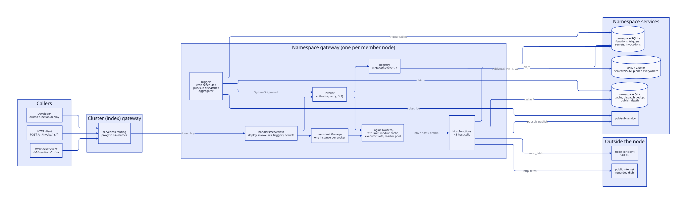
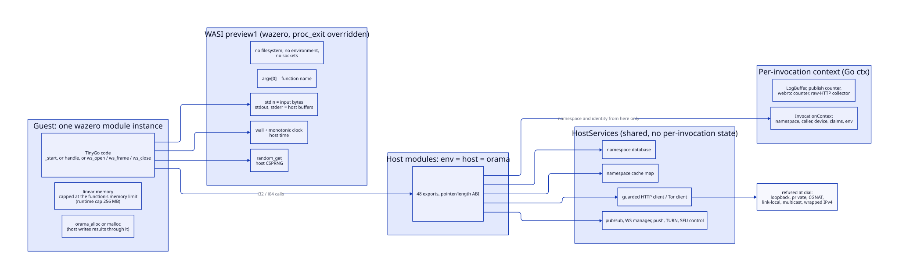
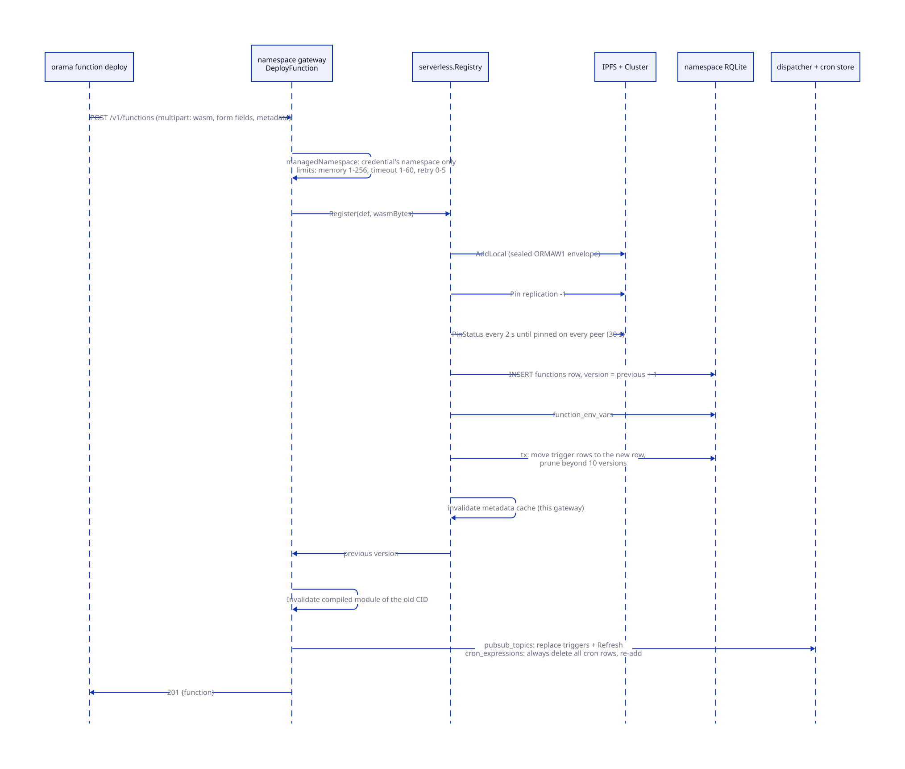
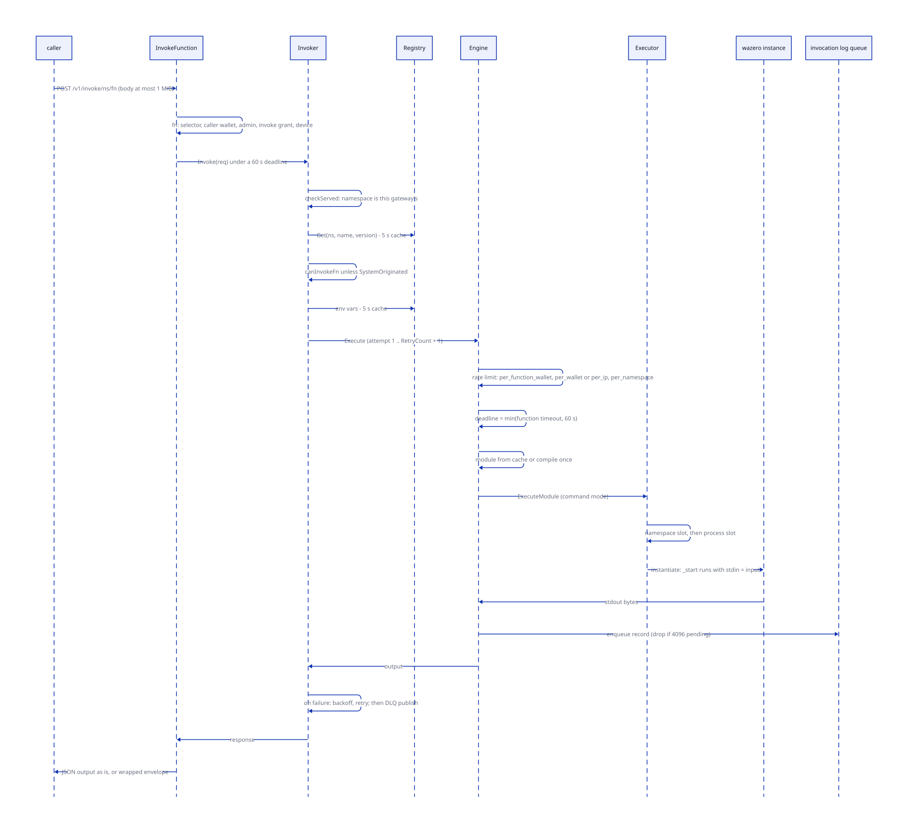
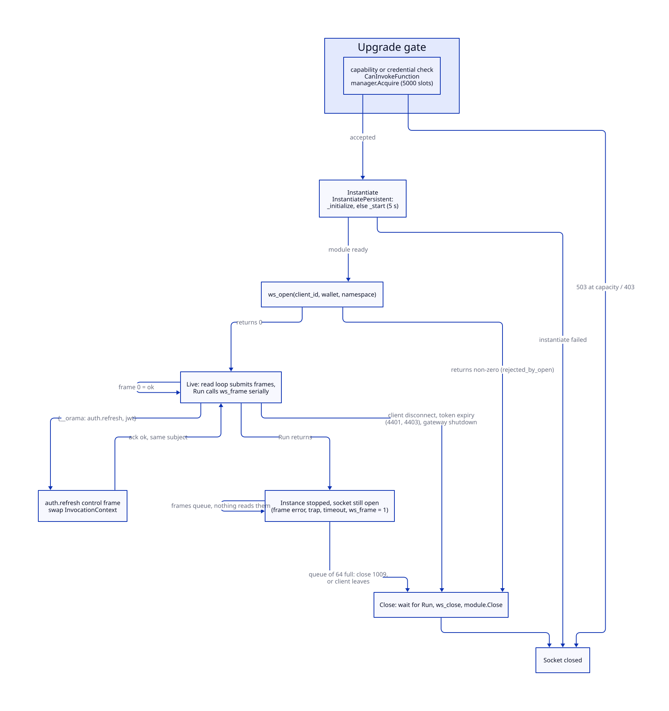
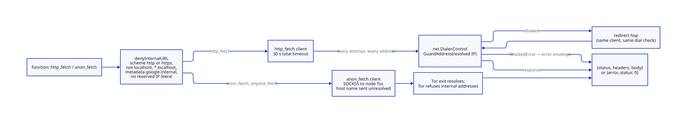
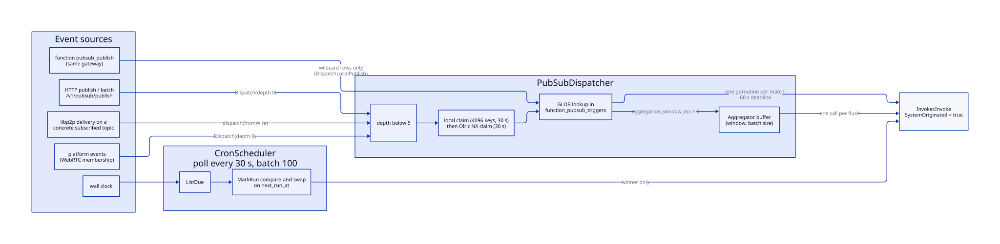
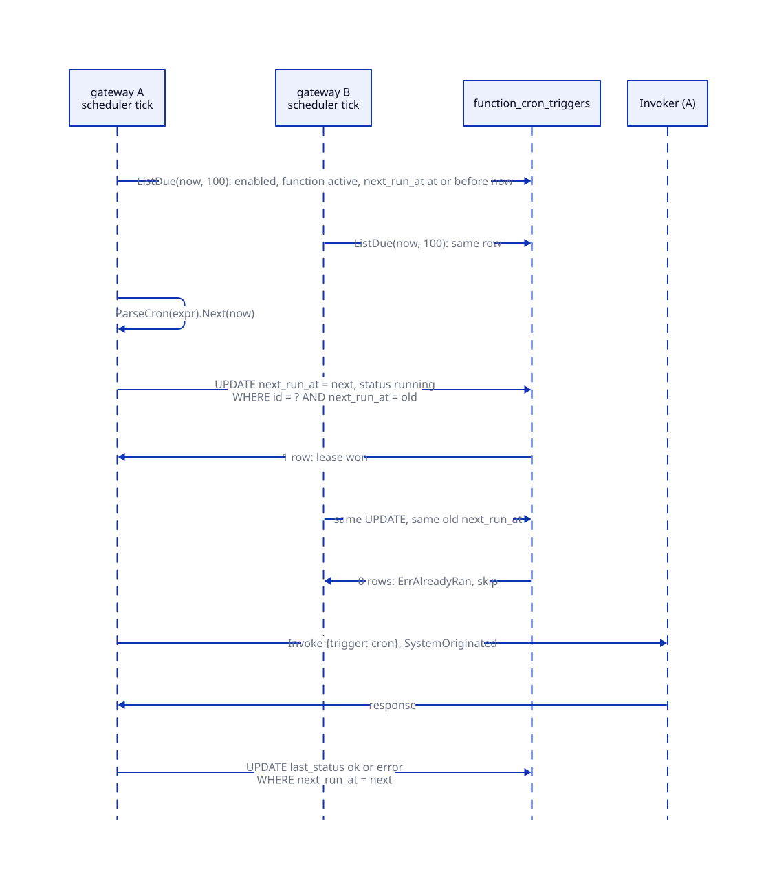
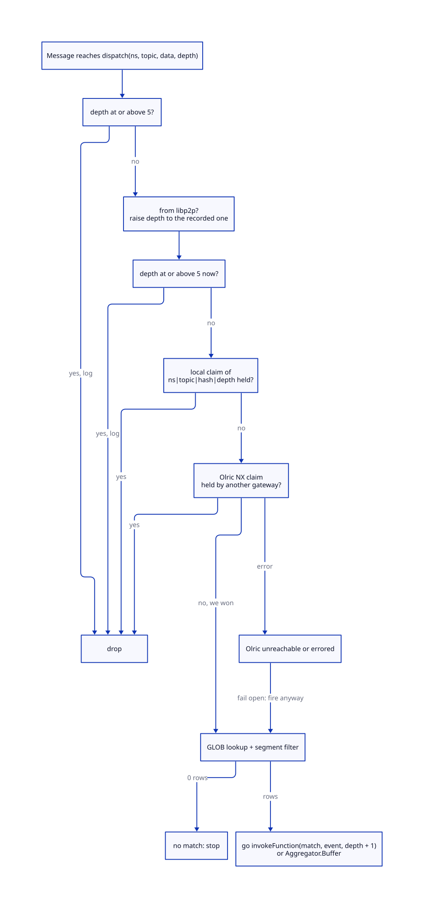

# Serverless functions

> **At a glance.**
>
> - **What:** tenant code compiled to WebAssembly and run by the namespace's own gateway inside a wazero runtime. A function is a TinyGo program in one of three shapes: a command that reads JSON on stdin and writes JSON on stdout, a reactor with a `handle` export whose cold start is paid ahead of the request, or a persistent instance bound to one WebSocket. It reaches the platform only through 48 host functions, all registered under the three module names `env`, `host` and `orama`. Functions run on request (HTTP, WebSocket), on a cron row, on a pub/sub message, or when another function calls them.
> - **Key numbers:** memory 1 to 256 MB (default 64 MB), timeout 1 to 60 s (default 30 s), retries 0 to 5, invoke body 1 MiB, 10 retained versions per function, module cache 100, 10 concurrent instantiations per gateway and 5 per namespace, 5,000 persistent sockets, 64 queued frames per socket, 100 statements per database batch, 1,000 publishes per invocation, trigger depth 5, dispatch dedup 30 s, cron poll 30 s, invocation-log queue 4,096.
> - **Code:** `core/pkg/serverless/` (engine, executor, registry, invoker, rate limiter, triggers, aggregator, persistent instances, WebSocket manager, bridge, host functions), `core/pkg/gateway/handlers/serverless/` (HTTP and WebSocket handlers), `core/sdk/fn/` (the function SDK).
> - **Depends on:** [gateway architecture](12-gateway-architecture.md) for routing and readiness, [identity](13-identity.md) and [authorization](14-authorization.md) for who may call, [the database](17-database.md), [the cache](18-cache.md), [storage](19-storage.md) and [pub/sub](20-pubsub.md) for what the host functions reach.



## Why it exists

A tenant application needs server-side logic that runs close to its data, scales with its traffic and cannot hurt its neighbours. Orama gives tenants a sandboxed function that runs inside the gateway they already use, rather than a process of their own.

Four constraints shaped the implementation.

A function is untrusted code inside a trusted process: the namespace gateway, which also holds the namespace's database handle, its Olric client and push credentials. Everything a function does passes through a host function, and every host function takes its namespace and caller from the invocation, never from the guest's arguments.

A gateway has no cheap way to bound guest CPU, because wazero has no fuel metering. The bounds that exist are the deadline, the memory cap, a slot semaphore, per-invocation budgets on the host calls that fan out, and rate limits on how often an invocation may start.

Tenant functions must not share a database with other tenants. The cluster gateway once ran every namespace's functions against the cluster registry, where all tenants' `functions`, `deployments` and `namespaces` rows sit side by side, and a function could rename another tenant's namespace. Since bugboard #427 a gateway runs only its own namespace's functions (`core/pkg/serverless/invoke.go:checkServed`, `core/pkg/serverless/hostfunctions/database_access.go:checkDatabaseAccess`).

A cold TinyGo start is slow: the code records about 550 ms for the `_initialize` of a reactor module (`core/pkg/serverless/reactor_pool.go`). The engine therefore compiles each module once and, for reactor modules, warms one-shot instances before the request arrives.

## The model

**Function.** A row in `functions`, keyed by `(namespace, name, version)`, pointing at a WASM binary by CID (`core/pkg/serverless/types.go:Function`). It carries limits (`memory_limit_mb`, `timeout_seconds`), flags (`is_public`, `is_internal`, `ws_persistent`, `raw_http_response`, `ws_auth`), a retry policy and an optional DLQ topic. Environment variables live in `function_env_vars`, keyed by the row's id.

**Version.** Every deploy inserts a new row with the next version number. The current version is the highest `active` one. `name@N` runs exactly version N. The registry keeps 10 versions.

**Namespace gateway.** The gateway process that serves one namespace on one member node; a namespace has three (see [namespaces](09-namespaces.md)). Each runs its own engine, caches and trigger loops, sharing only the database, Olric and IPFS.

**Invocation.** One run of one function version. It owns an `InvocationContext` (namespace, function, request id, caller wallet, JWT subject, device id, claims, admin and invoke-grant bits, trigger type and depth, WebSocket client id, environment) that rides the Go context into every host call. The shared `HostFunctions` object keeps no per-invocation state (`core/pkg/serverless/hostfunctions/types.go:HostFunctions`).

**Execution modes.**

| Mode | Built as | Exports | One instance serves | Memory limit |
|---|---|---|---|---|
| Command | TinyGo `wasi`, default | `_start` | one call; created, run, closed | the function's own `memory_limit_mb`, enforced by a capped allocator |
| Reactor | `-buildmode=c-shared` | `handle`, `_initialize`, `malloc`, no `_start` | one call; pre-warmed, then closed | runtime-wide 256 MB only |
| Persistent | `-buildmode=c-shared`, `ws_persistent: true` | `ws_open`, `ws_frame`, `ws_close`, `orama_alloc` or `malloc`, plus `_initialize` or `_start` | one WebSocket for its lifetime | runtime-wide 256 MB only |

The engine tells a reactor from a command by the compiled module's exports: `handle` and `_initialize` present and `_start` absent (`core/pkg/serverless/engine.go:moduleIsReactor`). A persistent function is selected by the `ws_persistent` flag on the row, not by its exports.

**Host module.** The set of 48 functions the runtime exports to the guest. They are registered once per runtime under three module names (`env`, `host`, `orama`) that resolve to the same table. A guest that imports from any other module fails to instantiate (`core/pkg/serverless/engine.go:registerHostModule`).

**Packed value (P64).** The way host functions return a byte string: an `i64` whose high 32 bits are a guest pointer and whose low 32 bits are the length. The host allocated the buffer in the guest with the guest's own `orama_alloc` or `malloc`. A return of 0 means no result, which is also what an empty string looks like (`core/pkg/serverless/execution/executor.go:WriteToGuest`).

**Trigger.** What starts an invocation without a caller: a cron row or a pub/sub pattern. Database triggers, timers and background jobs exist as types and tables but nothing runs them (see [Known gaps](#known-gaps)).

**System-originated.** An invocation the gateway itself started for a trigger or the claims provider. It skips the per-caller check because authorization happened when the trigger was registered. Only gateway-internal dispatchers set the flag, and it is copied down a `function_invoke` chain (`core/pkg/serverless/invoke.go:InvokeRequest`).



The sandbox is fixed by how the module is instantiated. A guest gets its input on stdin and returns output on stdout (host buffers), `argv[0]` set to its name, the host wall clock and monotonic clock, and the host CSPRNG for `random_get`. It gets no filesystem, no environment, no sockets and no way to name another module (`core/pkg/serverless/execution/executor.go:ExecuteModule`). The clocks and the random source are set explicitly because wazero's defaults are a frozen 2022 timestamp and a deterministic generator, both once shipped by accident (bugboard #27 and #120; `core/pkg/serverless/execution/walltime_test.go`, `core/pkg/serverless/execution/randsource_test.go`).

## How it works

### Where a function runs

A function runs on the gateway of the namespace that owns it, against that namespace's own database. The rule is enforced in three places.

1. `Invoker.Invoke` refuses any namespace other than the gateway's own (`core/pkg/serverless/invoke.go:checkServed`). The refusal wraps both `ErrFunctionNotFound` and `ErrNamespaceNotServed`, so it covers every path that reaches the invoker: HTTP, WebSocket, cron, pub/sub, the JWT claims provider and a nested `function_invoke`.
2. The database host functions each begin with `checkDatabaseAccess`: the invocation must carry a namespace, the gateway must have been configured with a database namespace, and the two must be equal. On the cluster gateway the configured namespace is empty, because its database is the registry, so no function there gets a database, including the `default` namespace's own (`core/pkg/gateway/core_registry_guard.go:functionDatabaseNamespace`).
3. The cluster gateway proxies tenant serverless traffic to the tenant's gateway before the handlers see it. The namespace comes from the path (`/v1/invoke/<namespace>/<function>`), else from `?namespace=`, else from the credential. A request that names none and carries no credential is refused (`core/pkg/gateway/serverless_routing.go:clusterServerlessRoutingMiddleware`). [Gateway architecture](12-gateway-architecture.md#serverless-routing-on-the-index-gateway) covers the proxy hop.

The management routes act on the credential's namespace only. A deploy, list, delete, enable, disable, trigger or secret request that names another namespace through the metadata, a form field, `?namespace=` or an `X-Namespace` header is refused with 403 rather than redirected (`core/pkg/gateway/handlers/serverless/namespace_scope.go:managedNamespace`). Invoking is the one operation that can name a namespace in the URL, because an anonymous caller of a public function has to say whose it is.

### Building a function

`orama function init <name>` writes `function.go`, `function.yaml`, a `go.mod` and a copy of the SDK from `core/sdk/fn/fn.go`, embedded in the CLI as `sdk.FnSource` (`core/sdk/sdk.go`); the copy exists because the SDK's import path is not one a function module can fetch. `orama function build` runs `tinygo build -o function.wasm -target wasi .`, adding `-buildmode=c-shared` when `function.yaml` sets `ws_persistent` or `reactor` (`core/cmd/orama/internal/functions/build.go:tinygoBuildArgs`). Reactor mode is a build property only: the deploy does not carry it and the engine detects it from the exports. `orama function deploy` builds only when `function.wasm` is absent and uploads a stale binary as it is.

The SDK is small. `fn.Run(handler)` reads all of stdin, calls the handler and writes its output to stdout. If the handler returns an error, `Run` writes `{"error": "..."}` and calls `os.Exit(1)`. The non-zero exit makes wazero's instantiation fail, and the executor returns only the instantiate error and discards stdout (`core/pkg/serverless/execution/executor.go:ExecuteModule`), so the JSON error never reaches the caller: the response is a 500 `FUNCTION_EXECUTION_FAILED` carrying the exit code. A function that wants to return an error writes a normal body and exits 0.

### Deploying

`POST /v1/functions` takes `multipart/form-data` (the JSON-with-base64 form is refused). The form carries the `wasm` file, `name`, `is_public`, `is_internal`, `memory_limit_mb`, `timeout_seconds`, `retry_count`, `retry_delay_seconds`, and a `metadata` JSON field for everything that has no form field: `env_vars`, `ws_persistent`, `ws_idle_timeout_sec`, `ws_max_frame_bytes`, `ws_max_inflight_per_conn`, `raw_http_response`, `ws_auth`, `dlq_topic`, `pubsub_topics` and `cron_expressions` (`core/pkg/gateway/handlers/serverless/deploy_handler.go:DeployFunction`). The CLI sends the first seven plus `env_vars`, the `ws_*` settings, `raw_http_response` and `ws_auth`. It sends no `dlq_topic`, `pubsub_topics` or `cron_expressions`.



The handler validates limits from the form and the metadata against the gateway's ceilings: memory 1 to 256 MB, timeout 1 to 60 s, retry count 0 to 5 (`core/pkg/gateway/handlers/serverless/deploy_limits.go:validateDefinitionLimits`, values from `core/pkg/gateway/dependencies.go:initializeServerless`). A bad value is refused 400 naming the field. An absent field is stored as the registry default: 64 MB, 30 s, a 5 s retry delay (`core/pkg/serverless/registry.go:Register`); the engine's 128 MB default applies only to a row with no stored limit. The gateway does not check that the upload is a WASM module (the CLI checks the magic bytes), so a corrupt upload fails at its first invocation.

`Registry.Register` then does five things in order.

1. **Upload.** `ipfs.AddLocal` imports the bytes into the local Kubo, sealed in the `ORMAW1` envelope under the cluster-wide wrap key when the client has one (AES-256-GCM with a random nonce, see [storage](19-storage.md#sealing-private-blobs)). The CID is therefore of the ciphertext, and deploying the same bytes twice yields two CIDs.
2. **Pin everywhere.** `Pin` with replication factor -1 pins the CID on every IPFS Cluster peer, and `verifyPinnedEverywhere` polls the pin status every 2 s for up to 30 s until the cluster reports it pinned. A timeout fails the deploy. The reasons are bugboard #137 (a gateway on a node without the block timed out) and a garbage collection that deleted functions pinned only with RF 3 (`core/pkg/serverless/registry.go:uploadWASM`). The check covers the peers the cluster reports for the CID; a peer that is down may be absent from that list, and the startup backfill re-covers it.
3. **Insert the row.** `INSERT INTO functions` with `version = previous + 1`. The table's key is `(namespace, name, version)` (migration `core/migrations/068_function_versions.sql`), so two concurrent deploys cannot both claim a version: one insert fails and the caller sees a deploy error.
4. **Save the environment.** Existing rows for the new id are deleted, then each variable is inserted in its own statement.
5. **Adopt version state.** One transaction moves every trigger row (`function_cron_triggers`, `function_pubsub_triggers`, `function_db_triggers`, `function_timers`) from the earlier versions onto the new row, then prunes: versions older than the newest 10 are deleted, their env vars are dropped, and their invocations, logs and jobs are re-pointed at the oldest retained version so history by name survives (`core/pkg/serverless/registry_versions.go:adoptVersionState`).

Steps 3 to 5 are separate statements. A gateway that dies between 3 and 5 leaves a new, active, highest version with no environment and with its triggers still on the old row.

After `Register` the handler invalidates the old CID's compiled module and reactor pool on this gateway, then registers triggers from the definition. Pub/sub: if `pubsub_topics` is non-empty it deletes all pub/sub triggers of the function and adds the listed topics, then refreshes the dispatcher. Cron: it always deletes every cron trigger of the function and re-adds those in `cron_expressions` (deduplicated). A bad expression is logged and skipped; the deploy still answers 201. The consequence is stated under [Known gaps](#known-gaps): the CLI sends no cron expressions, so a CLI deploy removes the cron triggers added earlier with `orama function triggers add --schedule`.

The registry caches function rows and environment maps for 5 s (`registryCacheTTL`) and invalidates only its own gateway's cache on deploy, enable, disable and delete, so another gateway of the namespace serves the previous row for up to 5 s. Misses are not cached. `Delete` is a soft delete: rows keep status `deleted`, the pins stay, and `SetEnabled` skips them so `enable` cannot undo a delete. `RepinAllWASM` runs once per gateway start, 2 min after boot, with a 10 min budget, as the backfill for functions deployed before the pin-everywhere rule.

### Invoking a function over HTTP

`POST /v1/functions/<name>/invoke` and `POST /v1/invoke/<namespace>/<name>[@version]` end in the same handler, `InvokeFunction`. The route policy leaves both open so that a public function needs no credential; the decision is the invoker's (`core/pkg/gateway/route_policy.go:functionRoutePolicy`).



The handler reads the body through a 1 MiB limit, derives the caller from verified sources only (a wallet JWT subject, else the namespace name for an API key; a client-supplied wallet header is never read), and calls `Invoker.Invoke` under a 60 s context. A grant narrowed to `fn:name=<function>` is checked first and only removes access.

`Invoke` then runs in this order.

1. **Served-namespace check.** See above.
2. **Registry lookup.** Version 0 is the highest `active` row; a version number is that exact row if active.
3. **Authorization**, unless the request is system-originated or the call is a capability socket that opens this function (`core/pkg/serverless/invoke.go:canInvokeFn`):
   - an `is_internal` function is refused to anyone who is not an admin;
   - otherwise a public function is allowed;
   - otherwise an admin is allowed;
   - otherwise a caller with no wallet is refused;
   - otherwise the caller needs the invoke grant.
   The HTTP layer counts as holding the invoke grant: an admin, an API key or exchanged token with the `invoke` scope, a deployed app whose current grant includes it, or any signed-in wallet. A storage-only key does not. An identified caller refused here gets 403.
4. **Environment.** The function's variables are read through the 5 s cache. A read failure is logged and the function runs with an empty environment.
5. **Execute with retry.** `RetryCount + 1` attempts. Between attempts the delay is `retry_delay_seconds` doubled per attempt and capped at 5 min; the code comment says "with jitter", but there is none. A timeout, a memory or payload refusal, a not-found and a WASM fetch timeout are not retried; execution errors and unknown errors are, and so is a `RateLimitedError`, which matches none of those exclusions (see [Known gaps](#known-gaps)). After the last failure, if the function has a `dlq_topic`, the invoker publishes a `DLQMessage` (function, request id, input, error, trigger type, caller wallet) to that topic.

The response is the function's stdout. If it is valid JSON of any kind, including `null`, a number or a string, it is returned as is with `Content-Type: application/json`; otherwise it is wrapped as `{request_id, output, status, duration_ms}`. `X-Request-ID` and `X-Duration-Ms` are always set. A function deployed with `raw_http_response` may call `set_http_response` to replace all of that with a verbatim status, headers and body (at most 64 headers and 8 MiB, status 100 to 599). The gateway drops response headers the function sets that it owns: `x-request-id`, `x-duration-ms`, the hop-by-hop framing headers, and anything starting with `x-internal-` or `x-orama-`.

Errors use the canonical envelope. The status mapping is in `classifyInvokeError`: a cold WASM fetch timeout is 503 `FUNCTION_UNAVAILABLE` (retryable); not found is 404; a timeout, memory or rate refusal is 429 `RATE_LIMITED` (retryable); unauthorized is 401, or 403 for an identified caller; everything else is 500 `FUNCTION_EXECUTION_FAILED`. Because `ErrTimeout` is classed as resource exhaustion, a function that runs past its deadline answers 429, not 504; the 504 `TIMEOUT` appears only when the namespace proxy's own 300 s budget expires first.

### The engine

One `Engine` exists per gateway and owns one wazero runtime. The runtime is configured with `WithCloseOnContextDone(true)`, so a guest is interrupted when its context ends and its module is closed, and `WithMemoryLimitPages(MaxMemoryLimitMB * 16)`, which is 4,096 pages or 256 MB for any memory a module could grow (`core/pkg/serverless/engine.go:NewEngine`). The gateway sets the engine's limits to default 128 MB, maximum 256 MB, default timeout 30 s, maximum 60 s, module cache 100 and slow-invoke threshold 1 s; `MaxConcurrentExecutions` keeps its default of 10 and every other field its default.

**WASI with an overridden `proc_exit`.** TinyGo's `_start` ends with `proc_exit(0)`, and stock wazero closes the module on exit, which would leave a persistent function with no `ws_open` to call. The engine instantiates WASI with its own `proc_exit` that panics `ExitError(0)` without closing the module for code 0 and closes it for any other code (`core/pkg/serverless/engine.go:persistentFriendlyProcExit`). wazero treats exit 0 from `_start` as success. The override applies to every function; the executor closes command-mode instances itself.

**Compile once.** `getOrCompileModule` asks the module cache for the CID. The cache is an LRU of 100 compiled modules with a single-flight per CID: N simultaneous first calls share one compile, a waiter whose leader's context ended recomputes under its own, and a panicking compile releases its waiters and frees the CID (`core/pkg/serverless/cache/module_cache.go:GetOrCompute`). The leader fetches the bytes with `Registry.GetWASMBytes`: three attempts of at most 4 s each, spaced 250 ms and 500 ms apart, each reading the local Kubo offline first (2 s) and the network after; if all fail, one re-pin-and-wait recovery of at most 10 s and a final read. Failure is `ErrWASMFetchTimeout`. The fetched bytes are compiled, and a module that declares a maximum memory above 256 MB is refused. If compilation itself fails the error is replaced by the constant `ErrCompilationFailed`, so the wazero diagnostic is not kept. There is no on-disk compilation cache; every gateway restart recompiles.

**Execute.** `Engine.Execute` runs the rate limiter, creates the deadline (the function's timeout, clamped to 60 s), builds the invocation's context (a `LogBuffer`, the `InvocationContext`, a publish counter, a WebRTC counter and, for raw-HTTP functions, a response collector) and branches on the compiled module.

**Command mode.** `Executor.ExecuteModule` configures an anonymous instance (name `""`, so concurrent calls of one function never collide on a module name; bug #221), with stdin as the input bytes, stdout and stderr as host buffers, `argv[0]` the function name, real clocks and the host CSPRNG. It then does three things before `InstantiateModule` runs `_start`.

- *Memory.* A module whose exported memory's minimum already exceeds the function's limit is refused. Otherwise the instance gets `cappedAllocator`: each memory is a buffer that refuses to grow past the limit, so `memory.grow` returns -1 to the guest, which is how a guest sees out of memory. A memory whose starting size is refused makes wazero panic while slicing the buffer; the executor recovers that one panic and reports that the module's memory needs more than the limit (`core/pkg/serverless/execution/memorylimit.go`).
- *Slots.* The call takes its namespace's slot first and then a process-wide slot, both released when the instance returns. The process-wide semaphore holds `MaxConcurrentExecutions` (10) and each namespace gets half of it (5). Taking the namespace slot first means a burst from one tenant queues on its own slot without holding process tokens, so it cannot starve other namespaces (`core/pkg/serverless/execution/executor.go:acquire`). Waiting for a slot spends the invocation's deadline. A namespace gateway serves one namespace, so in practice its command-mode concurrency is 5.
- *Output.* After `_start` returns, stdout is the result. A non-zero exit or a trap is an instantiate error and discards stdout.

Reactor and persistent instances skip the slots and the per-function memory cap.

**Records.** Every `Execute` ends in `logInvocation`, which does not write: it builds an `InvocationRecord` and enqueues it on a bounded queue of 4,096 drained by one worker with a 10 s per-record timeout. A full queue drops the record and counts it. The worker writes `function_invocations` and batches log lines into multi-row inserts of at most 100 (`core/pkg/serverless/registry.go:Log`), which took 0.5 to 3 s of cross-region Raft latency off every reply (bugboard feat-27). An invocation slower than 1 s logs one warning splitting rate-limit, module load, instantiate and run milliseconds.

### Reactor mode and the warm pool

A reactor module exports `handle(ptr, len)`, takes its input as bytes in guest memory and returns a packed i64 whose low 32 bits are the output pointer and whose high 32 bits are the length. This is the reverse of the packing host functions use for their return values (pointer high, length low). The host allocates the input through the guest's `malloc` and frees it through `free`; if the module exports no `malloc`, a non-empty input is not copied and `handle` is called with pointer 0 (`core/pkg/serverless/execution/executor.go:CallHandleFunction`).

`reactorPool` keeps up to 2 initialized one-shot instances per compiled CID (`reactorWarmTarget`) for up to 64 CIDs (`reactorMaxModules`, least recently used evicted and its instances closed). `Acquire` pops a ready instance if there is one and always starts background warming toward the target. An empty pool is not an error: the call instantiates and runs `_initialize` synchronously and the cost is attributed to the instantiate phase of the slow-invoke log. Each instance serves exactly one `handle` call and is closed after it, so the isolation is that of a fresh instance per call; the pool changes when the cold start happens, not whether instances are shared (`core/pkg/serverless/reactor_pool.go`).

Warming has no caller. The warm-time context is an empty `InvocationContext`, so a host call from `_initialize` that needs a namespace (database, cache) is refused and the guest's `init()` must not depend on identity; per-caller work belongs in `handle`. A warm takes at most 10 s, `_initialize` at most 5 s. A deploy drops the old CID's pool, though a stale pool could never be served because every deploy has a new CID.

### Persistent WebSocket instances

A function with `ws_persistent` is selected at the upgrade of `GET /v1/functions/<name>/ws` (`core/pkg/gateway/handlers/serverless/ws_handler.go:HandleWebSocket`). The decision to allow the socket is `CanInvokeFunction`, the same function as the HTTP path, evaluated before the upgrade because the persistent path builds its own invocation context and never calls `Invoke`.



The handler acquires a slot from `persistent.Manager` (5,000 per gateway; a full manager answers 503 before the upgrade and never evicts a live socket), upgrades, registers the client with the WebSocket manager and the bridge, builds the invocation context once for the connection, and registers the socket with the gateway's session registry so its token is re-checked by the sweeper ([identity](13-identity.md#open-websockets); the sweep runs every 5 s, and 4401 and 4403 are the close codes). `Engine.InstantiatePersistent` then compiles through the same cache and instantiates a named module (`<function>-<client id>`) with start functions disabled, runs `_initialize` or, if absent, `_start` (a runaway initializer is cut off after 5 s) and treats `ExitError(0)` from `_start` as success.

The instance wrapper requires `ws_open`, `ws_frame`, `ws_close` and `orama_alloc` or `malloc`. The ABI:

| Export | Called | Arguments | Result |
|---|---|---|---|
| `ws_open(ptr, len)` | once, synchronously, before frames are read | JSON `client_id`, `wallet`, `namespace`, `headers` (never populated) | 0 accept, non-zero reject (`rejected_by_open`) |
| `ws_frame(ptr, len)` | once per application frame, serially | the frame bytes | 0 continue, 1 stop |
| `ws_close(ptr, len)` | once, best effort | the reason: `client_disconnect`, `server_shutdown`, `idle_timeout`, `handler_error` or `rejected_by_open` | none |

Every entry into the module goes through one mutex, `callMu`. wazero instances are not goroutine-safe: two goroutines inside one instance cause a Go runtime fatal that no `recover` catches and that kills the whole gateway. The frame loop and `Close` once ran concurrently while a frame unwound. `Close` now waits for the frame loop (frame timeout plus a 2 s grace) before `ws_close`, and `module.Close` takes the mutex too (`core/pkg/serverless/persistent/instance.go:callExport`).

The read loop submits each frame to a channel of 64 (`ws_max_inflight_per_conn`); a full channel closes the socket with 1009. Each frame runs under a timeout equal to the function's timeout, with a fresh publish counter, WebRTC counter and discarded log buffer per frame. Persistent frames write no `function_invocations` rows. A frame that exceeds its timeout has its module closed by wazero.

A frame containing the bytes `"__orama"` is parsed by the gateway as a control frame before it reaches the guest. `auth.refresh` carries a new JWT. The gateway verifies it (an unreadable revocation list is a retryable refusal, not a verdict), requires the token's namespace to equal the function's and its subject and device to equal the socket's current token's, and only then swaps the instance's `InvocationContext` and the socket's expiry atomically; a host call in flight keeps the identity it started with. The new context copies the admin bit, invoke grant and client address, takes claims from the new token and carries no environment (see [Known gaps](#known-gaps)). The gateway answers `__orama_ack` with `ok` true and the subject, or an error ack. A socket held to an API key or a capability cannot refresh.

The persistent socket pings every 30 s and expects a pong within 60 s, as the stateless one does. Shutdown gives every instance `ws_close` within a shared 30 s budget (`persistent.Manager.ShutdownAll`), at least 100 ms each.

### Stateless sockets

A function without `ws_persistent` runs one invocation per frame, serially, each under a 30 s context, with the identity captured at the upgrade. The reply is `request_id`, `status`, `duration_ms` plus `output` (parsed as JSON if it parses) or `error`, `code` and `retryable`. The server pings every 30 s and expects a pong within 60 s (`ws_handler.go:handleStatelessWebSocket`). Both socket kinds check `Origin`: none (non-browser) is allowed; otherwise it must name the request's host or a subdomain of it, taking the host from `X-Forwarded-Host` because the namespace proxy rewrites `Host` (`checkWSOrigin`).

A function that sets `ws_auth: capability` may also be opened with a capability instead of a credential. Before the upgrade the gateway verifies the token, checks its revocation and its issuing device, and requires the function to be active, not internal and still declaring `ws_auth: capability`. At most 16 sockets per capability are open on a gateway. The socket reports no wallet, subject, device or claims, and nested `function_invoke` calls carry no caller, so they reach only public functions. A capability names a function, not a version: it opens the live one, and a request that pins a version (`name@3`) is refused. A forged, expired or misdirected token, a pinned version, and a function that is gone, disabled or not accepting capabilities all get the same 403, so a probe learns nothing about which check failed or which functions exist; a revoked capability is told so. Only a `GET` upgrade of exactly `/v1/functions/{fn}/ws` is read this way (`core/pkg/gateway/handlers/serverless/ws_capability.go:checkCapability`). The token format is in [storage](19-storage.md#fetch-capabilities). `GET /v1/serverless/ws/connections` lists the gateway's open sockets with frame and byte counters.

### Identity inside a function

A function has no identity of its own: no key, no token. What it sees is the caller's. `get_caller_wallet` is the wallet JWT subject, else the namespace's name when the credential is an API key (a pseudo-identity), else empty. `get_caller_jwt_subject` is the verified Bearer token's subject whatever else the request carried; a function that must bind to the signed identity uses it. `get_caller_device_id` is the token's `did`, the RFC 7638 thumbprint of the key the device proved at sign-in. Everything a function does to the platform is done as the namespace, and a trigger-started function has no caller at all.

The platform treats a function as the namespace's own code, so host calls do not re-check the caller: `ws_send` does not check a client id belongs to the caller, `storage_fetch_cap_mint` mints for any CID of the namespace, `webrtc_kick` removes any user. The check is the one that decided whether the caller could run the function.

### Rate limiting

Admission to a run is a token-bucket check in the engine, at the start of `Execute` and before the module is loaded. `MultiTierLimiter` evaluates up to four tiers in order and the first refusal wins (`core/pkg/serverless/ratelimit.go:AllowRequest`).

| Scope | Key | Sustained | Burst | When |
|---|---|---|---|---|
| `per_function_wallet` | namespace, function, wallet | the override | its own | only if an override is set and there is a wallet |
| `per_wallet` | namespace, wallet | 600 a minute (10/s) | 60 | a wallet, which includes the namespace-name pseudo-wallet of an API key |
| `per_ip` | namespace, address | 120 a minute (2/s) | 30 | no wallet and an address |
| `per_namespace` | namespace | 250,000 a minute | 6,000 | always |

The per-namespace rate is the engine's `GlobalRateLimitPerMinute` (250,000), which the gateway installs as the namespace ceiling (`core/pkg/gateway/dependencies.go`). Each tier holds its buckets in a 16-shard LRU of 100,000 keys; an evicted bucket resets. A refusal returns `RateLimitedError` with the scope and the wait until a token exists, which the HTTP handler serves as 429 with a `Retry-After`.

The charge is per `Execute`, not per request. A retry is charged again. A nested `function_invoke` is charged again, as the original caller. Triggers carry no wallet and no address, so they pay only the namespace tier. The per-function override is never set by the engine, so the first tier is dormant. All API-key callers of a namespace share one wallet key, so an application that serves its users with one API key shares a single 10-per-second bucket for all of them. Buckets are per gateway, not per namespace.

### Secrets, environment and logs

`get_secret` reads `function_secrets` in the namespace's database. The value is sealed with the encryption-root keyset (purpose `orama-secrets-encryption-v1`), so every gateway derives the same key and a rotation needs no restart ([secrets and keys](16-secrets-and-keys.md)). Secrets belong to the namespace: any function can read any secret. If the manager cannot be built, `get_secret` returns nothing and the gateway still starts. Environment variables are plain text in `function_env_vars`, for configuration rather than credentials.

`log_info` and `log_error` append to the invocation's `LogBuffer` (1,000 entries, 16 KiB each) and write the line to the gateway log. The buffer rides the context because a shared slice once leaked one invocation's lines into another's record (bugboard #108).

### The host-function ABI

Every host function is a Go method on `Engine` registered by `registerHostModule` under `env`, `host` and `orama` (`core/pkg/serverless/engine.go`) and implemented against `HostServices` (`core/pkg/serverless/types.go:HostServices`) by `HostFunctions` (`core/pkg/serverless/hostfunctions/`). `env` is canonical; `host` and `orama` are aliases of the same table, kept because deployed code uses them. wazero resolves imports at instantiation, so an import the gateway does not export fails every invocation with `module[X] not instantiated`, including a call added in a newer release on a gateway still running the older one.

**Calling convention.**

- The guest passes bytes as two `i32` parameters, a pointer and a length into its linear memory. In the tables `s` stands for such a pair, so `get_env(s key)` is `(i32, i32) -> i64`. Structured arguments are JSON bytes.
- A byte string comes back as a P64. The host allocates the buffer with the guest's `orama_alloc` export, or `malloc`, and never frees it: a command or reactor instance is discarded after the call, a persistent instance keeps the allocation until it closes. A module with neither export gets 0.
- 0 is the only failure signal for a P64, and also what an empty string looks like. Calls returning `i32` use 1 for success and 0 for failure, except `db_execute`, which returns the affected rows truncated to 32 bits.
- A bad pointer makes the call return 0. A refusal or invalid argument is logged with the function name and returned as 0, unless the call has an envelope carrying `error` and `code`.
- Namespace and identity come from the invocation context. No parameter names a namespace.

**Capability** in the tables is what the call needs in order to work and the authority it exercises; every function in a namespace gets the same host surface.

**Identity and context.**

| Module | Name | Signature | Capability | Limits and failure |
|---|---|---|---|---|
| env, host, orama | `get_caller_wallet` | `() -> P64` | the invocation | Subject of a wallet token; the namespace name for an API key; empty for a trigger |
| env, host, orama | `get_caller_jwt_subject` | `() -> P64` | the invocation | `sub` of the verified Bearer token, whatever else the request carried; empty if none |
| env, host, orama | `get_caller_device_id` | `() -> P64` | the invocation | The token's `did`; empty for an account-bound session, an API key or no credential |
| env, host, orama | `get_caller_capability` | `() -> P64` | a socket opened on a capability | JSON `cap_id`, `resource`, `issuer_device`, `expires_at`; empty for a credential; not passed to nested invokes |
| env, host, orama | `get_caller_claim` | `(s name) -> P64` | the invocation | Custom claim value; empty if absent. The claims provider cannot set `sub`, `scopes`, `did`, `jti`, `sid` and other reserved keys |
| env, host, orama | `get_request_id` | `() -> P64` | the invocation | UUID chosen once per `Invoke`; retries share it |
| env, host, orama | `get_ws_client_id` | `() -> P64` | a WebSocket invocation | Empty for HTTP and triggers; inherited by `function_invoke` children |
| env, host, orama | `get_env` | `(s key) -> P64` | the function's variables | Empty when unset; always empty in a persistent function |
| env, host, orama | `get_secret` | `(s name) -> P64` | the namespace's secrets | 0 when missing, undecryptable or no secrets manager; no log line |

**Database.** All seven need the gateway's database to belong to the invocation's namespace (a namespace gateway). Every statement passes the SQL guard ([the SQL guard](17-database.md#the-sql-guard)).

| Module | Name | Signature | Capability | Limits and failure |
|---|---|---|---|---|
| env, host, orama | `db_query` | `(s sql, s args) -> P64` | namespace database, read | JSON array of row objects. Any failure, including a guard refusal, is 0 |
| env, host, orama | `db_query_v2` | `(s sql, s args) -> P64` | namespace database, read | `rows`, `error`, `code`. A guard or access refusal is 0 |
| env, host, orama | `db_execute` | `(s sql, s args) -> i32` | namespace database, write | Rows affected; 0 for no rows and for any error |
| env, host, orama | `db_execute_v2` | `(s sql, s args) -> P64` | namespace database, write | `rows_affected`, `last_insert_id`, `error`, `code`. A guard or access refusal is 0 |
| env, host, orama | `db_transaction` | `(s ops) -> P64` | namespace database, write | At most 100 ops, each `kind` `exec` or `query`; execs are one atomic request, queries run after commit. Result has `results`, `committed`, `failed_index`, `error`, `code`. A host-level failure returns the same shape with `committed` false |
| env, host, orama | `db_query_batch` | `(s ops) -> P64` | namespace database, read | At most 100 queries in one round trip; 10,000 rows per op and 32 MiB per batch; 10 s deadline. `consistency` `weak` (default, leader) or `none` (local); `freshness` 1 ms to 24 h only with `none`; stale reads return `stale_rejected` |
| env, host, orama | `exec_and_publish` | `(s ops, s topic, s data) -> P64` | namespace database and pub/sub | At most 98 ops, because the sequence upsert and read take two of the 100 (99 or 100 ops fail as `TOO_MANY_STATEMENTS`); on commit publishes `data` with `{{seq}}` replaced, without recording trigger depth or firing wildcard triggers; counts one of the 1,000 publishes, checked before the write. Result adds `seq`, `published`, `publish_error` |

**Cache.** The namespace's own Olric map, named `:serverless_cache:<namespace>` (a name the HTTP cache API cannot produce).

| Module | Name | Signature | Capability | Limits and failure |
|---|---|---|---|---|
| env, host, orama | `cache_get` | `(s key) -> P64` | namespace cache | 0 on a miss and on an error; only errors are logged |
| env, host, orama | `cache_set` | `(s key, s value, i64 ttl_seconds) -> ()` | namespace cache | `ttl` 0 is no expiry; negative or above 10 years is refused; no return value, so a failure is only logged |
| env, host, orama | `cache_delete` | `(s key) -> i32` | namespace cache | 1 if the key is gone, including never set; 0 on failure |
| env, host, orama | `cache_incr` | `(s key) -> i64` | namespace cache | Atomic increment by 1 from 0; 0 on failure |
| env, host, orama | `cache_incr_by` | `(s key, i64 delta) -> i64` | namespace cache | Atomic; a non-numeric existing value fails; 0 on failure, indistinguishable from a counter at 0 |

**Outbound HTTP and the response.**

| Module | Name | Signature | Capability | Limits and failure |
|---|---|---|---|---|
| env, host, orama | `http_fetch` | `(s method, s url, s headers, s body) -> P64` | egress to the public internet | Headers a JSON object. 30 s total; http and https only; every dial is checked (below). Result `status`, `headers`, `body`, or `error` with `status` 0 |
| env, host, orama | `anon_fetch` | `(s method, s url, s headers, s body) -> P64` | the node's Tor client | As `http_fetch`; every connection goes to Tor on `127.0.0.1:9050`, no fallback; Tor down is `status` 0 |
| env, host, orama | `anyone_fetch` | `(s method, s url, s headers, s body) -> P64` | the node's Tor client | Deprecated alias of `anon_fetch`, kept because deployed modules import it |
| env, host, orama | `set_http_response` | `(i32 status, s headers, s body) -> i32` | a function deployed with `raw_http_response` | Status 100 to 599, 64 headers, 8 MiB body; the last call wins; 0 for any other function |

**Pub/sub, sockets and ephemeral state.**

| Module | Name | Signature | Capability | Limits and failure |
|---|---|---|---|---|
| env, host, orama | `pubsub_publish` | `(s topic, s data) -> i32` | namespace pub/sub | 1,000 publishes per invocation or per socket frame, across this call, the batch and `exec_and_publish`. Records the trigger depth first, then fires wildcard triggers on this gateway |
| env, host, orama | `pubsub_publish_batch` | `(s msgs) -> i32` | namespace pub/sub | JSON array of `topic` and `data_base64`, at most 100; first error fails the call; wildcard dispatch once per distinct topic |
| env, host, orama | `ws_pubsub_bridge` | `(s client_id, s topic) -> i32` | a WebSocket of the same namespace | Client's namespace must equal the function's; 1,000 topics per client; one libp2p subscription per namespace and topic, reference counted. Cleaned on disconnect |
| env, host, orama | `ws_pubsub_unbridge` | `(s client_id, s topic) -> i32` | the bridge | Idempotent |
| env, host, orama | `ws_send` | `(s client_id, s data) -> i32` | a connected WebSocket on this gateway | Empty id means the invocation's client. Text frame; no ownership check; 0 if the client is unknown |
| env, host, orama | `ws_broadcast` | `(s topic, s data) -> i32` | sockets subscribed in the WebSocket manager | Reaches no one today: nothing subscribes a socket to a manager topic, and the call returns 1 when there are no subscribers |
| env, host, orama | `ephemeral_state_set` | `(s topic, s key, s payload, i64 ttl_ms) -> i32` | a WebSocket client in the invocation | Payload 16 KiB; 256 keys per client; `ttl_ms` default 60 s, maximum 30 min; publishes `ephemeral.set` |
| env, host, orama | `ephemeral_state_clear` | `(s topic, s key) -> i32` | a WebSocket client in the invocation | Idempotent; clearing a key another client owns is a no-op returning 1 |
| env, host, orama | `ephemeral_state_list` | `(s topic) -> P64` | the namespace | Read-only, no client needed; lists only the entries held by this gateway |

**Push, TURN and WebRTC.**

| Module | Name | Signature | Capability | Limits and failure |
|---|---|---|---|---|
| env, host, orama | `push_send` | `(s user_id, s msg) -> i32` | push for the namespace | `msg` JSON at most 16 KiB (`title`, `body`, `channel`, `priority`, `badge`, `sound`, `data`, `target_provider`, `exclude_provider`, `message_id`). Returns 1 when push is not configured |
| env, host, orama | `push_send_v2` | `(s user_id, s msg) -> P64` | push for the namespace | Per-device envelope `ok`, `devices_attempted`, `devices_succeeded`, `results`; unconfigured is an `ok` envelope with no devices |
| env, host, orama | `push_send_topic` | `(s topic_id, s msg) -> P64` | push topics of the namespace | `topic_id` is the lowercase hex SHA-256 of the device's topic secret; an unknown topic is `ok` false with reason `TopicNotFound` |
| env, host, orama | `turn_credentials` | `() -> P64` | the gateway's TURN secret | `configured`, `username`, `password`, `ttl` (24 h), `uris`, `namespace`; `configured` false without a secret |
| env, host, orama | `webrtc_admit` | `(s room, s user, s device, i64 ttl_seconds) -> P64` | the namespace's WebRTC controller | Controller bound 1 s to 24 h; `room`, `user`, `device` bounded; 100 `webrtc_*` calls per invocation |
| env, host, orama | `webrtc_kick` | `(s room, s user) -> i32` | the namespace's WebRTC controller | Revokes admissions then closes on every SFU; 1 only if both worked; repeat is safe |
| env, host, orama | `webrtc_mute` | `(s room, s user, i32 muted) -> i32` | the namespace's WebRTC controller | Non-zero mutes; recorded so a rejoin stays muted |

**Capabilities and stored objects.** These need a session bound to a device: the issuing device is the caller's `did`, and a capability is revoked with the device that issued it.

| Module | Name | Signature | Capability | Limits and failure |
|---|---|---|---|---|
| env, host, orama | `capability_mint` | `(s resource, i64 ttl_seconds) -> P64` | a device-bound caller; the issuer needs the cluster secret | Opens this function's own socket; `resource` at most 256 bytes; lifetime 60 s to 7 days; result `token`, `cap_id`, `resource`, `issuer_device`, `expires_at` |
| env, host, orama | `capability_revoke` | `(s token) -> i32` | the namespace's capabilities | The token proves the namespace was issued it; 1 including for one already revoked; 0 for a foreign token |
| env, host, orama | `storage_fetch_cap_mint` | `(s cid, i32 count, i64 ttl_seconds) -> P64` | a device-bound caller; any CID of the namespace | Canonical CID; `count` 1 to 64; lifetime 1 h to 7 days; result `namespace`, `cid`, `caps` with `id`, `token`, `revoke_key`, `expires_at` |

**Composition and logging.**

| Module | Name | Signature | Capability | Limits and failure |
|---|---|---|---|---|
| env, host, orama | `function_invoke` | `(s name, s payload) -> P64` | the invocation's namespace and caller | Runs the live version synchronously through `Invoker.Invoke`, so it is authorized, rate-limited and retried like any call and holds a slot while the child runs. Bounded by the parent's deadline; not by trigger depth. 0 on any failure; an authorization refusal logs at error |
| env, host, orama | `function_invoke_async` | `(s name, s payload) -> i32` | the invocation's namespace and caller | Returns 1 when accepted; at most 256 in flight per gateway, 30 s each, on a context detached from the frame; the result is discarded, the child answers through `ws_send` |
| env, host, orama | `log_info` | `(s message) -> ()` | the invocation | Truncated at 16 KiB; 1,000 entries per invocation |
| env, host, orama | `log_error` | `(s message) -> ()` | the invocation | As `log_info` |

That is 48 exports. `StoragePut` and `StorageGet` exist on `HostFunctions` but are not exported, so a function cannot read or write IPFS directly; `EnqueueBackground` and `ScheduleOnce` are stubs and not exported either.

### Outbound HTTP and the egress guard

A function's outbound request is controlled by the tenant and made from the cluster's own network. A URL check cannot protect that: a name is not an address, the answer can change between check and connect, and a redirect goes somewhere the first URL never named. The guard therefore sits where the address is final.



`doFetch` first runs `denyInternalURL`, which settles what text alone can: a parseable host, scheme `http` or `https`, not `localhost`, `*.localhost` or `metadata.google.internal`, and no reserved IP literal. Then the client dials through `net.Dialer.Control`, which receives the concrete address about to be connected, once per attempt, for every address the resolver returned and for every redirect hop. `GuardAddress` refuses loopback, private, link-local, unspecified and multicast addresses and everything in `netguard.Ranges`: carrier-grade NAT, the benchmarking and IETF blocks (the chain namespace lives in `198.18.0.0/24`), `240.0.0.0/4` and the IPv6 forms that embed an IPv4 host (`core/pkg/netguard/netguard.go`). A refusal reaches the guest as an envelope with `error` and `status` 0. The client has no proxy, a 30 s total timeout and a 10 s dial timeout.

`anon_fetch` uses a client whose transport dials the node's Tor SOCKS port for every connection and sends the host name unresolved, so the exit does DNS. The same `denyInternalURL` runs first, and Tor refuses private and local addresses itself (`ClientRejectInternalAddresses`), including on redirects. With Tor down the call returns `status` 0; there is no direct path (`core/pkg/anonproxy/socks.go`). Neither client limits the response body: it is read fully into gateway memory, bounded by the 30 s timeout.

### Triggers

Two kinds of trigger run. Both start a system-originated invocation with no caller, and the function's rate limit, retry and DLQ apply as for any call.



#### Cron

A trigger row holds a cron expression, `next_run_at`, `last_run_at`, `last_status` and `last_error`. Expressions have 5 fields (minute to day of week) or 6 (seconds first). Each field accepts `*`, an integer, a comma list, `a-b`, `a-b/n` and `*/n`; day of week is 0 to 7 with 0 and 7 both Sunday; month and weekday names, `?` and `L` are not accepted. Time is UTC. Day of month and day of week must both match, where Vixie cron matches either when both are restricted. The search for the next slot gives up after 5 years, so an impossible date such as 31 February is rejected when the trigger is added (`core/pkg/serverless/triggers/cron_parser.go:ParseCron`).



Every gateway runs a `CronScheduler`, started after the gateway is ready, with a 30 s poll and a batch of 100 (`core/pkg/gateway/dependencies.go`, `core/pkg/serverless/triggers/cron_scheduler.go`). It runs a tick immediately at start and then every interval. A tick reads due rows (`enabled`, the function `active`, `next_run_at` at or before now) in `next_run_at` order and handles them one after another. For each it computes the next slot from now and claims the row with `UPDATE ... SET next_run_at = next, last_status = 'running' WHERE id = ? AND next_run_at = old`. One row affected means this gateway won; zero means another gateway advanced it first, and the loser skips silently. The winner invokes the function with the input `{"trigger":"cron"}` and then writes the final status under a second compare-and-swap on the new `next_run_at`.

The claim happens before the invocation, so a crash between them loses a slot rather than repeating it, and the cursor advances even when the function fails. A due row fires once per tick however many slots elapsed: `*/5 * * * * *` fires at most once per 30 s poll, and a gateway that was down fires each overdue row once on its first tick, never a backlog. The tick is sequential, so a 60 s function delays every later row in the batch. The engine's `CronPollInterval` is not read by the gateway; 30 s is a constant in `initializeServerless`. A bad stored expression disables its row by pushing `next_run_at` out a year.

#### Pub/sub

A trigger row holds a topic pattern, written to both `topic` (so older gateways can read it during a rolling upgrade) and `topic_pattern`, and two aggregation columns (`core/pkg/serverless/triggers/pubsub_store.go`). A pattern is at most 256 bytes with balanced brackets. Matching is two passes: SQLite `GLOB` selects candidate rows of active functions in the namespace, then `PatternMatches` removes over-matches. `*` matches any run except `:` (it still crosses `/` and `.`), `**` crosses `:`, `?` is one character, `[abc]` and `[!abc]` are classes.

The dispatcher gets messages from four places and treats them differently.

| Source | Path | Depth passed |
|---|---|---|
| HTTP publish and publish-batch | `PubSubHandlers` calls `Dispatch` after the publish succeeds, on the receiving gateway | 0 |
| A message on a subscribed concrete topic | the dispatcher's own libp2p subscription, on every gateway of the namespace | recovered from the depth ledger |
| A platform event (WebRTC membership) | `publishPlatformEvent` calls `Dispatch` | 0 |
| A function's `pubsub_publish` | `DispatchLocalPublish`: wildcard rows only, on this gateway | the invocation's depth |

The dispatcher subscribes to libp2p once per distinct `(namespace, pattern)` for every pattern without a glob character, and re-syncs with the trigger table every 60 s and after every trigger add, remove or deploy. GossipSub has no wildcard subscription, so a wildcard trigger fires only for HTTP publishes handled by this gateway and publishes made by a function on this gateway; a publish from another gateway's function or from a socket frame does not reach it. [Pub/sub](20-pubsub.md#serverless-triggers) describes the publish side.



`dispatch` applies these steps (`core/pkg/serverless/triggers/dispatcher.go:dispatch`).

1. If the depth is 5 or more, log and drop.
2. For a message from libp2p, raise the depth to the one the publishing function recorded.
3. Claim the key `namespace|topic|sha256(payload)[:16]|depth` locally: a 4,096-entry map with a 30 s TTL that fails open when full of live entries. A second claim of the same key on this node drops the message; this absorbs gossip self-delivery.
4. Claim the same key in the namespace's Olric DMap `pubsub_dispatch_dedup` with `NX` and a 30 s expiry. The first gateway to write wins and the others drop the message. If Olric is absent or errors, the claim fails open and the function fires on every gateway that saw the message; a degraded-dedup warning is logged at most once a minute.
5. Look up matches. No match ends the dispatch.
6. For each match either buffer the event in the aggregator or start `invokeFunction` in a goroutine with a 60 s deadline and depth plus one.

The claim runs before the match lookup, so every HTTP publish costs a local map insert, an Olric write and one leader-routed database read, whether or not the namespace has a trigger. The key is the payload hash, not a message id, so two byte-identical publishes within 30 s collapse into one invocation; depth is in the key so a function republishing the same bytes one level deeper is a new dispatch.

The event the function receives is `{"topic", "data", "namespace", "trigger_depth", "timestamp"}`, with `data` the published bytes embedded as raw JSON and `timestamp` in Unix seconds. Because `data` is embedded without encoding, a payload that is not valid JSON makes the marshal fail: the trigger does not fire and the dispatcher logs an error.

**Depth.** A function that republishes into a topic that triggers itself would loop, so `maxTriggerDepth` is 5: the handler of a top-level publish runs at depth 1 and a dispatch is refused at depth 5 or more. The libp2p wire format carries only the payload, so a function's publish carries its depth beside the message. Before publishing, the host records the invocation's depth under the dispatch key in a gateway-local ledger (65,536 entries, 30 s) and, when the namespace has Olric, in the DMap `pubsub_publish_depth`; the receiving dispatcher reads it back and dispatches at no less than that depth. A record only raises a depth; a message nothing recorded (anything a client publishes) starts at 0; a publish whose depth cannot be recorded is refused rather than sent with the chain restarted. `function_invoke` copies the parent's depth. A `function_invoke` cycle that publishes nothing is bounded only by the deadline and the slots.

**Aggregation.** A trigger with `aggregation_window_ms` above 0 (at most 60,000) and `aggregation_max_batch_size` (at most 1,000, default 100) buffers events per `(namespace, function, trigger)` in gateway memory. The first event starts a timer; the buffer flushes when the window ends or the batch fills, and the function is called once with `{"batched": true, "events": [...]}` stamped with the first event's depth. Buffers are not replicated and a crash loses them; an orderly shutdown flushes them for up to 5 s (`core/pkg/gateway/lifecycle.go:Close`). One event whose data is not valid JSON makes the whole batch fail to marshal and drops it. No route sets the aggregation columns (`AddWithAggregation` has no caller).

### Ephemeral state and the socket bridge

Two primitives let a function drive what a socket client sees without being called per message.

`ws_pubsub_bridge(client_id, topic)` subscribes a socket to a pub/sub topic: one libp2p subscription per `(namespace, topic)`, reference counted by the bridged clients, forwarding each message to each client without invoking the function. The client's namespace is recorded at the upgrade and the call is refused if it differs from the function's. By default the client receives the publisher's bytes unchanged; a socket opened with `?pubsub_delivery=stamped` receives `_orama` `pubsub.message` frames with the platform-delivered `topic` and the payload as `data_base64`, so it need not trust a topic field the publisher wrote (bugboard #733). A bridge may name a platform topic such as `_orama/webrtc/<room>`; the platform does not narrow that.

`EphemeralStore` holds short-lived state (typing, presence, a cursor) keyed by `(namespace, topic, key)` in gateway memory, owned by the WebSocket client that set it. A set publishes an `_orama` `ephemeral.set` event on the topic; an explicit clear, a TTL expiry (sweeper every 10 s) or the owner's disconnect publishes `ephemeral.clear` with reason `explicit`, `expired` or `disconnect`. The disconnect hook sits on the WebSocket manager, so both socket kinds are covered with no lag. A different client setting the same key takes ownership. Because the store is per gateway, `ephemeral_state_list` shows only entries whose owners are connected to the gateway that answers, while the events reach subscribers cluster-wide.

## State it owns

A function owns no port, file or process. Its state is rows in the namespace's database, bytes in IPFS, keys in the namespace's Olric, and memory in each namespace gateway.

| Item | Holds | Written by | Read by | Where |
|---|---|---|---|---|
| `functions` | one row per `(namespace, name, version)`: CID, limits, flags, status | `Register`, `SetEnabled`, `Delete` | invoker, handlers, schedulers | namespace RQLite |
| `function_env_vars` | plain-text variables per row id | `Register` | invoker (5 s cache) | namespace RQLite |
| `function_secrets` | sealed secrets per `(namespace, name)` | secrets routes | `get_secret` | namespace RQLite |
| `function_cron_triggers` | expression, `next_run_at`, last status | triggers route, deploy | every gateway's scheduler | namespace RQLite |
| `function_pubsub_triggers` | `topic`, `topic_pattern`, aggregation columns | triggers route, deploy | dispatcher | namespace RQLite |
| `function_invocations`, `function_logs` | one record per `Execute`, log lines | log queue worker | `function logs` | namespace RQLite |
| `namespace_publish_seq` | next sequence per namespace | `exec_and_publish` | same | namespace RQLite |
| `function_db_triggers`, `function_timers`, `function_jobs`, `function_db_change_tracking`, `function_rate_limits` | nothing; created by migration 004 and never written | none | none | namespace RQLite |
| Function WASM | sealed bytes, pinned on every cluster peer | `uploadWASM` | `GetWASMBytes` | IPFS and IPFS Cluster |
| `:serverless_cache:<ns>` | the cache host functions' keys | `cache_*` | `cache_*` | namespace Olric |
| `pubsub_dispatch_dedup`, `pubsub_publish_depth` | 30 s claims and depth records | dispatcher, `pubsub_publish` | dispatcher | namespace Olric |
| Gateway memory | compiled modules, reactor pools, persistent instances, socket and bridge tables, ephemeral state, aggregator buffers, dedup and depth ledgers, registry cache, rate buckets, log queue (sizes in Limits and scale) | the engine | the engine | each namespace gateway |

## Lifecycle

**Boot.** Building the serverless engine is fatal for a gateway, because it also builds the auth service (`core/pkg/gateway/dependencies.go:initializeBackends`). `initializeServerless` waits for the registry leader, loads the encryption root, builds the secrets manager (a failure only disables `get_secret`), host functions, engine, invoker, dispatcher and scheduler, and registers the handlers. The dispatcher's subscriptions and the scheduler start as post-schema steps once the gateway is ready, retried until they succeed (`core/pkg/gateway/post_schema.go`). Nothing is precompiled (`Engine.Precompile` and `EnablePrewarm` have no caller), so the first call of each function on a gateway fetches and compiles it. A goroutine re-pins every active function's CID two minutes after boot.

**Rolling upgrade.** The three gateways of a namespace restart one at a time and run mixed versions. Function rows and WASM are untouched. A function that imports a host call added in the newer release fails to instantiate on gateways still on the older one (the docs record `cache_delete` and `get_caller_device_id` as 0.200.0 imports). The cache map was renamed to `:serverless_cache:<namespace>` in 0.200.0, so old and new gateways read different maps. The trigger table writes the legacy `topic` column beside `topic_pattern` for older readers. Cron and dispatch claims are compare-and-set or `NX` writes, so mixed versions cannot double-fire a slot. Each restart closes the gateway's persistent sockets after a shared 30 s `ws_close` budget; clients reconnect, usually to another gateway.

**Restart.** A restarting gateway loses its compiled modules (recompiled on demand), warm instances, ephemeral state, aggregator buffers (flushed for up to 5 s on an orderly stop), local dedup, rate buckets and queued invocation records (flushed for up to 5 s). Shutdown runs aggregator flush, scheduler stop, dispatcher stop, persistent drain and engine close, in that order, before the database and Olric connections close (`core/pkg/gateway/lifecycle.go:Close`).

**Node loss.** The namespace's other two gateways keep serving; proxied requests and sockets on the dead node fail and are retried elsewhere. A cron slot claimed by the dead gateway and not yet invoked is lost, and a pub/sub message only it claimed is not redelivered. A replacement member starts cold and reads the WASM from IPFS, where it is pinned everywhere ([reconciliation and recovery](10-reconciliation-and-recovery.md)).

## Failure modes

| Trigger | What the system does | What you observe |
|---|---|---|
| WASM block not on this node's Kubo | Three bounded reads, then one re-pin and a final read | 503 `FUNCTION_UNAVAILABLE`, retryable; not retried by the invoker |
| Pin does not converge during a deploy | `verifyPinnedEverywhere` fails after 30 s; no row is inserted | Deploy 500 `FUNCTION_DEPLOY_FAILED` naming the CID and pin counts |
| Namespace database has no leader | Reads served from the 5 s cache; past it the registry read fails; deploys and list return 503 | Invoke 500 with the store error; management 503 retryable |
| Invocation exceeds its deadline | wazero closes the module; status `timeout` | 429 `RATE_LIMITED` (retryable), record status `timeout` |
| Guest grows past its memory limit | `memory.grow` returns -1; the guest traps | 500 `FUNCTION_EXECUTION_FAILED` |
| All 5 namespace slots busy | The call waits for a slot against its own deadline | Latency, then a timeout |
| Rate limit | `RateLimitedError` before the module loads | 429 with `Retry-After` and `scope=`; on a stateless socket the frame reports `FUNCTION_EXECUTION_FAILED`, not retryable |
| Invoke body over 1 MiB | The body is cut at 1 MiB without an error | The function receives truncated input |
| Corrupt or unsupported WASM | Compilation fails; the cause is dropped | Every call 500; the log shows only `WASM compilation failed` |
| Olric down | `cache_*` return 0; dispatch claims fail open; recording a depth for a triggered publish fails | Duplicate trigger invocations; a function's publish at depth 1 or more returns 0 |
| Pub/sub service restarted | The dispatcher keeps its subscription handles and receives nothing | Concrete-topic triggers silent on that gateway until restart ([pub/sub](20-pubsub.md#known-gaps)) |
| Tor down | `anon_fetch` dial fails | Envelope `status` 0 naming the SOCKS address; no direct request |
| Egress to an internal address | The dial is refused | Envelope `error` naming the address, `status` 0 |
| Persistent frame traps or times out | wazero closes the module; `Run` returns | Socket stays open and silent; 1009 after 64 more frames |
| Slow WebSocket client | `ws_send` blocks in a write with no deadline, holding that connection's lock | The calling frame outlives its deadline; other senders to that client queue |
| Invocation-log queue full | New records are dropped and counted | Warning every 30 s; gaps in `function logs` |
| Gateway crash mid-invocation | Nothing persisted for the call | Client error; cron slot or aggregated batch lost |
| Clock skew between gateways | Cron due-ness uses each gateway's clock, the claim compares the stored value | Early or late fire by the skew; no double fire |

## Trust and security

**Who can run what.** An anonymous caller can invoke public functions, limited to 2 per second (burst 30) per attributable address. It cannot deploy, read logs or secrets, or open a socket without a capability. A signed-in wallet with no grant can invoke any private, non-internal function, because the HTTP layer counts any wallet subject as holding `invoke`. An API key needs the `invoke` scope. Management needs the function-manage grant of the credential's own namespace; another namespace is refused, not redirected.

**What a malicious function can do.** It can burn CPU until its deadline, hold slots, allocate up to its memory cap, publish 1,000 messages per invocation and call WebRTC control 100 times. It can read and write its namespace's database except the platform tables the guard names ([the SQL guard](17-database.md#the-sql-guard)), read every secret of its namespace, push to any user of the namespace, fetch from the public internet or through Tor, and invoke any function of the namespace as the caller. It cannot reach another namespace's database, cache or secrets, a reserved address, a file, an environment variable or a socket, and it cannot name a namespace in a host call. A function that forwards user-controlled JSON into `pubsub_publish` can put the reserved `_orama` key on a topic, because the reserved-key check lives in the HTTP publish routes and the host publish path does not apply it.

**Operator and gateway process.** The WASM is sealed with a key derived from the cluster secret, which every node holds, and the gateway decrypts it to compile. Function secrets are sealed with a key from the encryption root, which every gateway holds. `log_info` text goes to the gateway journal in clear. A compromised namespace gateway is the tenant's isolation boundary, as for every other service in this book.

**Other tenants.** On the shared libp2p mesh a node can publish to another tenant's `namespace.topic` and fire its concrete-topic trigger, and nothing in the triggered function distinguishes that from a real publish ([pub/sub](20-pubsub.md#trust-and-security)).

**Sockets.** A function socket is authorized at the upgrade and then held to its token: the sweeper closes it with 4401 once the token has been expired for 120 s and with 4403 when the token, session or subject is revoked.

## Limits and scale

| What | Value | Anchor |
|---|---|---|
| Memory per function | 1 to 256 MB, default 64 | `deploy_limits.go`, `registry.go:Register` |
| Timeout | 1 to 60 s, default 30; HTTP invoke context 60 s; stateless frame 30 s; trigger 60 s | `dependencies.go`, `invoke_handler.go`, `dispatcher.go` |
| Retries | 0 to 5; delay doubles, capped at 5 min | `invoke.go:calculateBackoff` |
| Invoke body | 1 MiB (truncated) | `invoke_handler.go:InvokeFunction` |
| Versions kept | 10 | `registry_versions.go:MaxRetainedFunctionVersions` |
| Compiled modules | 100, LRU | `module_cache.go` |
| Command-mode concurrency | 10 per gateway, 5 per namespace | `executor.go:NewExecutor` |
| Reactor pool | 2 per CID, 64 CIDs | `engine.go:reactorWarmTarget` |
| Persistent sockets | 5,000 per gateway, 64 queued frames each | `persistent/manager.go`, `instance.go` |
| Sockets per capability | 16 per gateway | `ws_capability.go:maxSocketsPerCapability` |
| Database batch | 100 statements, 10,000 rows per query op, 32 MiB, 10 s | `rqlite/batch.go` |
| Publishes per invocation | 1,000; batch 100 | `hostfunctions/pubsub.go` |
| Rate limits | 10/s per wallet (burst 60), 2/s per address (30), 250,000/min per namespace (6,000) | `ratelimit.go`, `dependencies.go` |

At 10 times the invocation rate the first limit reached is the five command-mode slots of a namespace gateway: each call holds a slot through instantiation and `_start`, and a cold TinyGo start is a large fraction of a call. Callers see the wait as latency and then as 429 at their deadline. The next limit is the namespace RQLite: every non-persistent invocation enqueues an invocation record, each database host call is a leader-routed read or a Raft write, and every HTTP publish costs a trigger lookup. The log queue drops past 4,096 pending records rather than slowing replies, and `function_invocations` is never pruned, so its size grows with traffic. At 10 times the fleet size nothing in the engine changes: each namespace has its own three gateways and its own database. The module cache holds 100 compiled modules per gateway, so a namespace with more hot functions than that recompiles on every miss.

## Design decisions

### A gateway runs only its own namespace's functions

*Chosen:* the invoker refuses a foreign namespace, the cluster gateway proxies tenant traffic away, and no function gets a database there. *Rejected:* a SQL denylist as the only fence. *Why:* the registry holds every tenant's rows side by side, and a table-name denylist cannot tell tenant A's row from B's (bugboard #427).

### One instance per call, with the cold start moved, not shared

*Chosen:* a fresh instance for every command and reactor call; the pool warms one-shot instances ahead of time. *Rejected:* reusing instances. *Why:* reuse would carry guest memory between callers; the pool buys the 550 ms of `_initialize` without sharing state (`core/pkg/serverless/reactor_pool.go`).

### Identity and logs ride the context

*Chosen:* identity, log buffer and counters ride the Go context per invocation. *Rejected:* fields on the shared `HostFunctions`. *Why:* concurrent invocations overwrote each other's identity, a cross-tenant leak (bugboard #348), and shared a log slice (#108).

### The egress guard sits at the dial

*Chosen:* check the resolved address in `Dialer.Control`, for every attempt and redirect hop. *Rejected:* parsing the URL. *Why:* a name that resolves to `10.0.0.x` passed the URL check and reached the overlay.

### `anon_fetch` never falls back

*Chosen:* an unavailable proxy is a `status` 0 envelope. *Rejected:* a direct request. *Why:* a function that asked for anonymity must fail loudly, not leak the gateway's address.

### Pin the WASM on every peer and verify it

*Chosen:* replication -1 and a 30 s confirmation that fails the deploy. *Rejected:* RF 3 with a fire-and-forget pin. *Why:* bugboard #137 and a garbage-collection loss on 2026-06-24.

### A compare-and-swap on `next_run_at` as the cron lease

*Chosen:* the claim UPDATE is conditional on the value `ListDue` read. *Rejected:* a lease table. *Why:* a lost slot after a crash is cheaper than a second table with its own expiry (`core/pkg/serverless/triggers/cron_scheduler.go`).

### Dispatch dedup fails open

*Chosen:* a duplicate invocation when Olric is unavailable. *Rejected:* dropping the message. *Why:* a duplicate push harms less than a dropped wake-up (bugboard #30, #555).

### Trigger depth beside the message

*Chosen:* a ledger keyed by the dispatch key. *Rejected:* an envelope around the payload. *Why:* subscribers see exactly what was published, and nothing a tenant controls can lower a depth.

### Telemetry off the reply path

*Chosen:* a bounded queue that drops. *Rejected:* a synchronous insert. *Why:* a cross-region Raft write cost 0.5 to 3 s per reply (bugboard feat-27).

## Known gaps

- **A CLI deploy deletes the function's cron triggers.** `DeployFunction` always calls `RemoveByFunction` for cron and re-adds only `cron_expressions` from the metadata; the CLI never sends them, so a schedule added with `orama function triggers add --schedule` is gone after the next `orama function deploy` (`core/pkg/gateway/handlers/serverless/deploy_handler.go:DeployFunction`, `core/cmd/orama/internal/functions/helpers.go:uploadWASMFunction`). This is a bug.
- **A persistent socket outlives its instance.** When `ws_frame` returns 1, a frame traps or times out, `Run` returns and nothing tells the handler, so the socket stays open while frames queue unread until 64 are pending (`core/pkg/serverless/persistent/instance.go:Run`, `core/pkg/gateway/handlers/serverless/ws_persistent_handler.go:handlePersistentWebSocket`). This is a bug.
- **Persistent functions get no environment.** The connection's `InvocationContext` is built without `EnvVars`, and the refreshed one too, so `get_env` is always empty (`ws_persistent_handler.go:buildPersistentInvocationContext`). This is a bug.
- **`ws_idle_timeout_sec` and `ws_max_frame_bytes` are stored and never enforced**, and no function socket sets a read limit, so a frame of any size is read (`core/pkg/serverless/registry.go:Register`).
- **Database triggers, timers and background jobs do not run.** Types, tables and config fields exist (`DBTrigger`, `Timer`, `JobManager`, `JobWorkers`, `TimerPollInterval`, `DBPollInterval`, `EnablePrewarm`); `EnqueueBackground` and `ScheduleOnce` return "not implemented" (`core/pkg/serverless/hostfunctions/logging.go`).
- **`ws_broadcast` reaches no one**, and aggregation cannot be configured: nothing calls `WSManager.Subscribe` (`core/pkg/serverless/websocket.go:Broadcast`) and `AddWithAggregation` has no caller (`core/pkg/serverless/triggers/pubsub_store.go`).
- **A rate-limit refusal is mis-typed.** `RateLimitedError` does not satisfy `errors.Is(err, ErrRateLimited)`, so the invoker retries it when `retry_count` is above 0 and a stateless socket reports it as a non-retryable execution failure (`core/pkg/serverless/ratelimit.go:RateLimitedError`, `core/pkg/gateway/handlers/serverless/invoke_handler.go:classifyInvokeError`). This is a bug.
- **API-key callers share one wallet bucket.** Their wallet is the namespace name, so all of them draw from a single 10 per second bucket; the per-function tier is never set (`core/pkg/serverless/engine.go:Execute`).
- **`exec_and_publish` can hand two callers the same sequence**, because it is read in a separate query after the commit and a concurrent commit can advance it first (`core/pkg/rqlite/batch.go:BatchWithSeq`). It also publishes without recording trigger depth, so a trigger chain through it restarts at depth 0. This is a bug.
- **The claims provider tests the wrong sentinel.** `errors.Is(err, registry.ErrFunctionNotFound)` never matches the invoker's `serverless.ErrFunctionNotFound`, so a namespace with no provider logs a rate-limited warning on sign-in; `core/pkg/serverless/registry/` is otherwise an unused second registry (`core/pkg/gateway/claims_provider.go:ResolveClaims`).
- **Sizes are bounded by the deadline, not by a limit.** Guest stdout, `http_fetch` response bodies and WebSocket frames are read fully into gateway memory (`core/pkg/serverless/execution/executor.go:ExecuteModule`, `core/pkg/serverless/hostfunctions/http.go:doFetch`).
- **Telemetry grows without bound.** Nothing prunes `function_invocations` or `function_logs`, `LogRetention` is unread, and `input_size` and `memory_used_mb` are never set.
- **Triggers need JSON, and wildcards are gateway-local.** A payload that is not valid JSON fails the event marshal and never fires, and one such event drops a whole aggregated batch (`core/pkg/serverless/triggers/dispatcher.go:dispatch`).
- **`function_invoke` holds a slot for the child.** Five concurrent command-mode parents each calling a command-mode child can occupy every namespace slot until their deadlines (`core/pkg/serverless/execution/executor.go:acquire`).
- **Socket writes are not serialized.** The handlers write replies with `conn.WriteMessage` while `WSManager.Send` writes under its own lock, so a `ws_send` can interleave with a reply (`core/pkg/serverless/websocket.go:Send`).
- **Persistent instances leak guest allocations.** `callExport` and `WriteToGuest` never free, and persistent and reactor modules have only the runtime-wide 256 MB cap (`core/pkg/serverless/persistent/instance.go:callExport`).
- **The 300 s timeout appears in the CLI and the proxy message.** The gateway refuses above 60 s (`core/cmd/orama/internal/functions/helpers.go:LoadConfig`, `core/pkg/gateway/middleware.go:proxyTimeoutMessage`).
- **Deploy is not atomic, and pins outlive versions.** A gateway that dies between the version insert and the trigger hand-over leaves a version without its triggers or environment (`core/pkg/serverless/registry.go:Register`), and nothing unpins the CID of a pruned or deleted version.

## Verify it yourself

**Unit tests.** `cd core && go test ./pkg/serverless/... ./pkg/gateway/handlers/serverless/...`. The ones that pin the mechanisms above: `TestExecuteModule_growOverFunctionLimitFailsInvocation` (memory cap), `TestAcquire_aQueuedBurstDoesNotStarveAnotherNamespace` (slots), `TestGetOrCompute_concurrentColdCallersShareOneCompile` (module cache), `TestReactorPool_oneShot_notReused` (isolation), `TestInstance_callExport_neverConcurrent` (persistent safety), `TestMultiTier_per_namespace_ceiling` (rate limits), `TestMarkRun_compareAndSwapWins` (cron lease), `TestDispatch_aChainOfTriggeredRepublishesStopsAtTheLimit` (depth), `TestClaimDispatch_loserOfTheClusterClaimSkips` (dedup), `TestGuardedHTTPClient_refusesARedirectToAnInternalAddress` (egress).

**Fleet end to end.** The `serverless` feature (`e2e/features/serverless/`) deploys TinyGo fixtures through the CLI and covers the access matrix, `name@N`, the timeout-to-429 mapping, memory, per-namespace concurrency, nested invokes, the SSRF matrix, cache atomics, the SQL guard, batch limits, ephemeral state, cron once per slot and the depth limit. `cli-function` covers the command surface. The owner runs the fleet suite.

**Read-only against a live namespace.**

```sh
orama function list
orama function get my-function
orama function versions my-function
orama function triggers list my-function
orama function logs my-function
```

`GET /v1/serverless/ws/connections` on the namespace gateway lists its open function sockets with frame and byte counters. `GET /v1/functions/<name>/logs?wasm_only=1` returns only the lines the function wrote. A gateway's journal carries `slow serverless invocation` warnings with the per-phase split, `PubSub dispatch dedup degraded` when Olric is unreachable, and `invocation log queue full` when records are being dropped.
