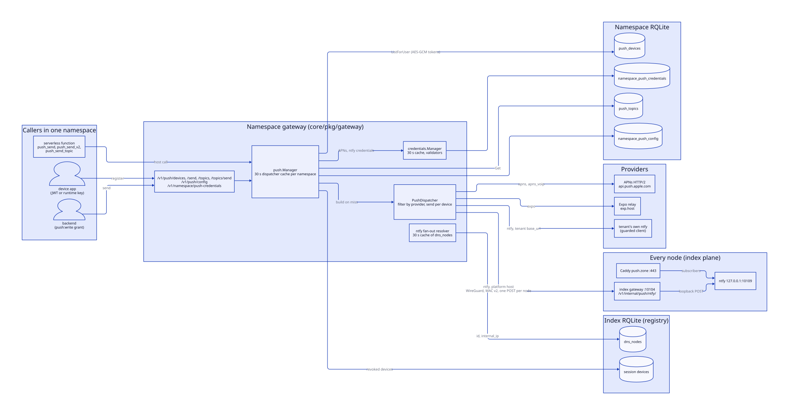
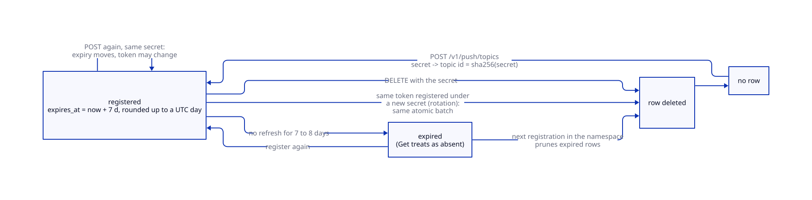
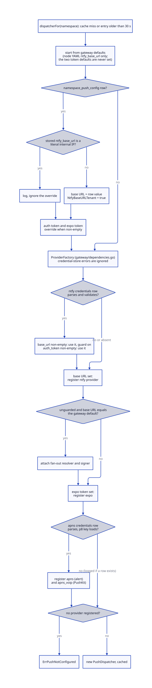
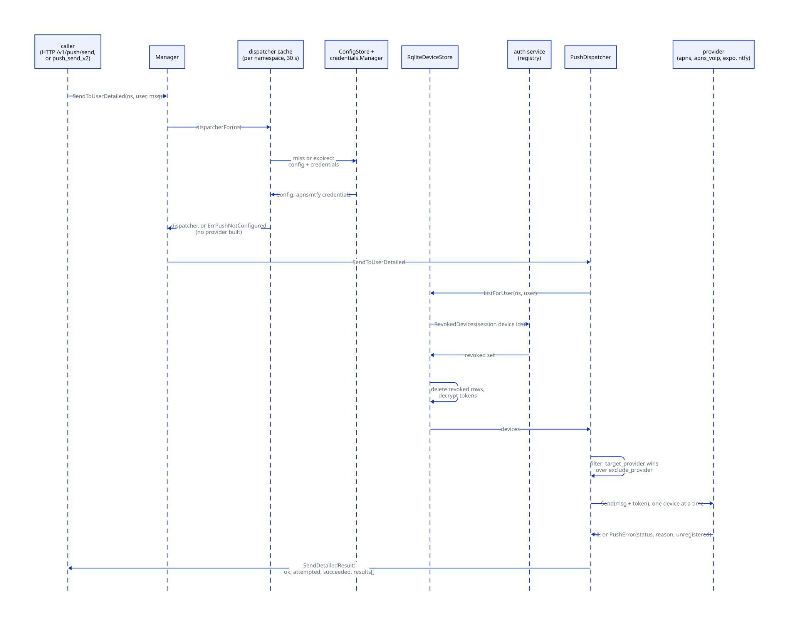
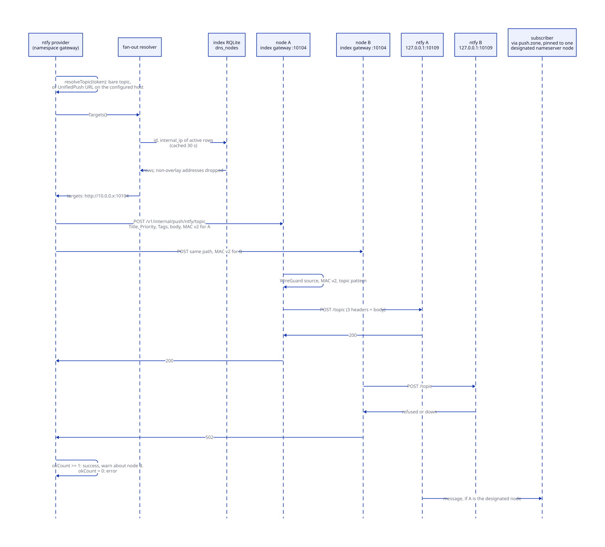

# Push notifications

> **At a glance.**
>
> - **What:** a per-namespace push service. Devices register a provider token (APNs, Expo or an ntfy topic) either under an account (`push_devices`) or under a rotating, account-free topic (`push_topics`). Backends and serverless functions send to an account or a topic. A `push.Manager` builds one `PushDispatcher` per namespace from that namespace's own credentials and routes each device's message to its provider. Every node runs a loopback ntfy server, and a publish to the platform ntfy is fanned out to all of them over WireGuard.
> - **Key numbers:** dispatcher and credential caches live 30 s (256 and 1024 entries); topic registrations live 7 to 8 days; topic secret 16 to 64 bytes; provider token at most 512 bytes; send body at most 64 KiB; provider timeouts APNs 10 s, Expo 10 s, ntfy 5 s; VoIP pushes expire after 30 s; ntfy listens on `127.0.0.1:10109` and the fan-out relay on index gateway port 10104; `push.<zone>` is one A record (TTL 60 s) on one designated nameserver node; coordination stamps are valid for 60 s.
> - **Code:** `core/pkg/push/` (dispatcher, manager, stores, SSRF guard, redaction), `core/pkg/push/credentials/`, `core/pkg/push/providers/` (`apns`, `expo`, `ntfy`), `core/pkg/gateway/handlers/push/` (HTTP), and the wiring in `core/pkg/gateway/dependencies.go`, `core/pkg/gateway/push_fanout.go` and `core/pkg/gateway/push_ntfy_internal.go`.
> - **Depends on:** [the gateway](12-gateway-architecture.md) for routing and the internal-route rules, [authorization](14-authorization.md) for the push grants, [inter-node trust](15-inter-node-trust.md) for the coordination MAC, [secrets and keys](16-secrets-and-keys.md) for the sealing envelope and rotation, and [the database](17-database.md) for the namespace RQLite.



## Why it exists

A tenant app needs to wake a phone. The three ways to do that are owned by three different parties: Apple (APNs), Google by way of Expo's relay, and an open protocol (ntfy, which doubles as a UnifiedPush distributor for Android devices without Google Play Services). Each has its own credentials, its own payload format, its own failure vocabulary and its own idea of what a device identifier is.

Orama's constraints shape the service:

- **No platform-owned provider identity.** The platform holds no Apple developer account. Each namespace brings its own APNs key, and the platform only stores it, sealed, and signs with it. Two tenants never share a provider credential, and a tenant can point ntfy at its own server.
- **Tenancy.** Everything a tenant registers lives in that tenant's namespace RQLite ([namespaces](09-namespaces.md)). A function sending a push can only reach its own namespace, because the namespace comes from the invocation context and never from the guest.
- **A push is a side effect of other work.** The callers are serverless functions and backends handling a message or a call. A function must not break because a namespace has no push provider yet, so the host functions degrade to a no-op envelope rather than an error.
- **Privacy.** A provider token is a stable identifier of a physical device. The service seals tokens at rest, never returns them, scrubs them from error text, and offers a registration mode (rotating topics) in which the gateway stores no account behind a token.
- **ntfy is a per-node server with no shared store.** The platform runs one ntfy on every node. A subscriber's long-lived stream stays on the node its DNS answer named, and a message published to one node is not on any other. The nameserver nodes pin `push.<zone>` to one designated node so subscribers converge ([where subscribers connect](#where-subscribers-connect)), but a publisher cannot know which node that is at the moment it sends, and the designation moves when the node fails. The service therefore publishes to all nodes, over the WireGuard overlay and never over the public host.

## The model

**Namespace.** The unit of everything here. Devices, topics, configuration, credentials and the dispatcher cache are all keyed by namespace.

**Provider.** A named backend that implements `push.PushProvider` (`Name()` and `Send(ctx, msg)`). Four names exist: `apns` (alert), `apns_voip` (PushKit and CallKit incoming-call signals), `expo` and `ntfy`. The registration handlers accept exactly these four (`core/pkg/gateway/handlers/push/validation.go:validProviders`).

**Device.** A row in `push_devices`: `(namespace, user_id, device_id)` is unique, and the row carries a provider name and a sealed token. `user_id` is the `account_id` custom claim of the caller's JWT when present, and the JWT subject (the wallet) otherwise (`core/pkg/gateway/handlers/push/types.go:resolveCallerUserID`). A registration may also carry the `did` of the session device it was made from.

**Topic.** A row in `push_topics`: `(namespace, topic_id)` with a provider, a sealed token and an expiry. The `topic_id` is the lowercase hex SHA-256 of a secret the device chose. The row has no user column. A push topic is unrelated to an ntfy topic: it is an address the gateway resolves to one device, whatever that device's provider is.

**Message.** `push.PushMessage` is provider-neutral: title, body, data, badge, sound, channel, priority, a collapse `MessageID`, and two dispatcher-side filters (`TargetProvider`, `ExcludeProvider`). Providers ignore the filters.

**Manager.** `push.Manager` (`core/pkg/push/manager.go:Manager`) is the only entry point for sending. It resolves a namespace's effective configuration, builds and caches a dispatcher, and exposes the device store, topic store and config store to the HTTP handlers.

**Dispatcher.** `push.PushDispatcher` holds a name-to-provider map and a device store. It lists a user's devices, filters them, and sends to each through its provider, returning one `DeviceSendResult` per device.

**Configuration sources.** A namespace's providers come from three places, merged when the dispatcher is built:

| Source | Table | Written through | Holds |
|---|---|---|---|
| Gateway defaults | none (node YAML `http_gateway.ntfy_base_url`) | the installer, as `https://push.<zone>` | the platform ntfy URL |
| Legacy config | `namespace_push_config` | `/v1/push/config` | ntfy base URL, ntfy auth token, Expo token |
| Credentials | `namespace_push_credentials` | `/v1/namespace/push-credentials/` plus the provider name | APNs key material, ntfy base URL and auth token |

## How it works

### Registering devices

`POST /v1/push/devices` binds a provider token to the caller. The handler (`core/pkg/gateway/handlers/push/handlers.go:RegisterDeviceHandler`) requires a resolved namespace and a JWT identity: a bare API key resolves to no user and gets 401, because a device must belong to a real user. It reads at most 4096 bytes of body, trims `device_id`, `provider` and `token`, and rejects an unknown provider, an empty token or one longer than 512 bytes (`MaxTokenBytes`). The session device comes from the verified `did` claim and never from the body.

`RqliteDeviceStore.Upsert` (`core/pkg/push/device_store_rqlite.go`) then does four things:

1. Seals the token with AES-256-GCM under the purpose key `push-device-tokens`.
2. Computes `token_fp`, an HMAC-SHA256 of the plaintext token under a second key, purpose `push-device-token-fp`. The sealed form carries a random nonce and cannot be compared in SQL; the fingerprint can.
3. Upserts on `(namespace, user_id, device_id)`. A conflict keeps the original row id and `created_at` and replaces provider, token, fingerprint, platform, version and session device.
4. Reads the row id back and runs `evictOtherOwnersOfToken`: `DELETE FROM push_devices WHERE namespace = ? AND token_fp = ? AND id != ?`. A physical token has one owner per namespace, and the most recent registration wins. The earlier rowid-ordered version of this rule failed for an account that re-registered, because it kept its old low rowid and never evicted newer stale rows; the keeper is now the row just written.

The response returns the row id and the `device_id`, so a client can `DELETE /v1/push/devices/` plus the id without listing first. `GET` lists the caller's devices without tokens. `DELETE` first lists the caller's own devices and deletes only when the id is among them; any other id answers 404, so the route does not reveal whether an id exists in another scope.

Because the same physical token string under two different providers has one fingerprint, the eviction rule is by token, not by token and provider. An iPhone's alert token and its PushKit token are different strings, so `apns` and `apns_voip` rows coexist (conventionally under distinct `device_id` values, such as the base id plus `:voip`).

### Device-bound sessions

A session minted for a device carries `did`. The registration stores it in `session_device_id` (migration 060). `ListForUser` calls `dropRevokedDeviceRows` (`core/pkg/push/session_devices.go`), which collects the distinct session device ids on the user's rows and asks the registry, through a `SessionDeviceGate` the gateway wires from `AuthService.RevokedDevices`, which of them are revoked. An id the namespace never issued counts as revoked. Revoked rows are removed from the result and deleted from the table by `DeleteForSessionDevice`. The check therefore runs on every send and every list, on whichever gateway handles it, and nothing has to clean up after a revocation ([identity](13-identity.md#revoking-a-device)).

The gate fails closed in both directions. A store with device-bound rows and no gate refuses to list, and a registry error fails the list, rather than wake a device that may have been revoked. Rows registered from a session bound to no device have an empty `session_device_id` (stored as NULL) and are never checked.

### Registering rotating topics

The account path leaves a lasting account-to-device mapping in `push_devices`. The topic path (FEAT-265) stores a device under an address the device chose:

1. The device generates a random secret of 16 to 64 bytes, hex-encoded (32 to 128 characters).
2. The topic id is the lowercase hex SHA-256 of the decoded secret (`core/pkg/push/topic.go:TopicIDFromSecret`). The device gives the id to whoever may push to it and keeps the secret.
3. `POST /v1/push/topics` carries `topic_secret`, `provider` and `token`. `DELETE /v1/push/topics` carries the secret. Both derive the id from the secret; a wrong secret names a different topic and `DELETE` answers 404.
4. `POST /v1/push/topics/send` and the `push_send_topic` host function carry only the id.

The handlers (`core/pkg/gateway/handlers/push/topics.go`) never read the caller's identity. The route policy decides who may call, and possession of the secret decides which topic the call acts on. Nothing about the caller is stored or logged beside a topic, and the topic id is not logged.

`RqliteTopicStore.Register` (`core/pkg/push/topic_store_rqlite.go`) runs one atomic RQLite batch of two statements. The first deletes every other topic in the namespace whose `token_fp` equals this token's fingerprint or whose `expires_at` has passed. The second upserts this topic. Either both happen or neither. A rotation (a new secret registering the same provider token) therefore removes the previous topic in the same write, and expired rows are pruned only when some device registers, because there is no background sweeper.

The stored expiry is `now + 7 days` (`TopicTTL`) rounded up to the next multiple of 24 hours since the epoch, that is to a UTC midnight (`TopicExpiryGranularity`, `expiryFrom`). A registration therefore lives 7 to 8 days, and the stored time does not record the second the device registered, which could otherwise be joined against request logs. `Get` treats a row with `expires_at` in the past as absent, whether or not a later registration has deleted it.

The topic table is built to carry as little as possible. It has no user, subject, wallet or created-at column; it is `WITHOUT ROWID`, so rows are stored in topic-id order rather than insertion order; the token fingerprint is keyed with the namespace mixed in (`namespace`, a zero byte, `token`), so two namespaces' fingerprints cannot be joined; and its key purposes (`push-topic-tokens`, `push-topic-token-fp`) differ from the device table's, so a ciphertext copied from `push_devices` does not decrypt under the topic key.



### Building a namespace's dispatcher

`Manager.dispatcherFor` returns a cached `PushDispatcher` for the namespace or builds one. The cache is an LRU of 256 namespaces, and an entry older than 30 s (`cacheEntryTTL`) is dropped on access and rebuilt. The TTL is the only cross-gateway invalidation: an HTTP write on gateway A calls `Invalidate` locally, and gateway B picks the change up within 30 s with no broadcast layer. A build runs outside the lock, so requests that arrive together after an expiry each build a dispatcher; the first to finish is cached and the others discard theirs in its favour.

`buildDispatcher` resolves the effective configuration:

1. Start from the gateway defaults.
2. If `namespace_push_config` has a row, override field by field with its non-empty values. A stored `ntfy_base_url` that is a literal internal address is dropped with a warning (`IsInternalBaseURL`), and a surviving one sets `NtfyBaseURLTenant`, which later decides how the connection is guarded.
3. Call the `ProviderFactory`, which `buildPushDispatcher` in `core/pkg/gateway/dependencies.go` supplies. The factory reads the credentials, through the credential manager, and returns the providers:
   - **ntfy**, when a base URL ends up set. A parseable `ntfy` credentials row overrides the base URL (marking it tenant-supplied) and the auth token. A row that fails validation is logged and ignored entirely.
   - **expo**, when an Expo access token is set. Only a namespace's `/v1/push/config` row can supply one: the gateway default token has no source in node configuration.
   - **apns** and **apns_voip**, both, when an `apns` credentials row parses and its p8 key loads. There is no YAML fallback for APNs.
4. A factory that returns no provider yields `ErrPushNotConfigured`. A config-store failure is returned as an error and is not cached. A credential-store failure inside the factory is not: the factory reads `credManager.Get` with an `err == nil` guard, so an unreadable `ntfy` or `apns` row simply yields no override or no APNs provider, with no log line, and that dispatcher is cached for 30 s.

On a node installed by `orama maint node install`, the default `ntfy_base_url` is always set, so every namespace gets the platform ntfy provider and `ErrPushNotConfigured` appears only on a gateway started without that key.



The legacy dispatcher kept on the gateway for code that predates the manager is built only when gateway defaults exist and is used only when no manager is wired. In practice the manager exists whenever push initialised at all.

### The send path

`Manager.SendToUserDetailed` and `SendToTopicDetailed` are the two entry points. Both obtain the namespace dispatcher first, so a namespace with no provider fails with `ErrPushNotConfigured` before any device is read.

For an account send, the dispatcher lists the user's devices (decrypting each token and dropping revoked-session rows), then calls `filterDevicesByProvider`. `TargetProvider` keeps only devices whose provider equals it. `ExcludeProvider` drops devices whose provider equals it. When both are set the target wins and the exclusion is ignored, because combining them is ambiguous and the positive filter is the narrower. The filters exist so a chat-alert path can send to `apns` without ringing the same phone's `apns_voip` registration, and a call path can do the reverse. Only the host functions carry them (`target_provider` and `exclude_provider` in the JSON argument); the HTTP send routes have no field for either and always fan out to every device.

For a topic send, the manager loads the live topic, builds a one-device list from its provider and token, and sends through the same code.

`sendToDevice` looks the device's provider up in the dispatcher's map. A device whose provider is not registered in this namespace (for example `apns` after the APNs credentials were deleted) is not sent to. It gets a result with reason `UnknownProvider`, a warning is logged, and the aggregate is not `ok`. Otherwise the provider's `Send` runs with the device token copied into the message. Sends are sequential, one device after another, within the caller's context.

Every result is a `DeviceSendResult`: device id, provider, success, HTTP status, reason, message, an `unregistered` flag. A successful send reports status 200. A failed send always has a non-empty reason: the provider's, or the error text when no HTTP exchange happened. `failedSend` extracts a `PushError` with `errors.As` and scrubs the message (see [redaction](#redaction)). Every failure is logged at Warn as `push: provider send failed`. The aggregate `SendDetailedResult` reports `ok` (true when every attempted device succeeded), the counts and the results. A user with no devices is `ok` with zero attempted.

The callers differ in how much of this they see:

| Caller | Entry | Result the caller sees |
|---|---|---|
| `POST /v1/push/send` | `SendToUser` | 200, or 503 when not configured, or 502 `one or more devices failed` with no detail (also when listing the devices failed) |
| `POST /v1/push/topics/send` | `SendToTopicDetailed` | 200, 404 for an unknown or expired topic, 502 when delivery failed, 503 when not configured |
| `push_send` | `SendToUser` | success or a host function error; a no-op `nil` when not configured |
| `push_send_v2` | `SendToUserDetailed` | the full JSON envelope |
| `push_send_topic` | `SendToTopicDetailed` | the full JSON envelope; an unknown topic is `ok: false` with one `TopicNotFound` result flagged unregistered |



When push is not configured, the host functions return `{"ok":true,"devices_attempted":0,"devices_succeeded":0,"results":[]}` (`core/pkg/serverless/hostfunctions/push.go`), so a function behaves the same in a namespace with push and one without. The guest cannot choose the namespace: `pushNamespace` takes it from the server-side invocation context, and the call fails when the context has none. The guest's JSON argument is capped at 16 KiB.

### The HTTP surface

| Route | Methods | Policy (chapter 14) | Handler |
|---|---|---|---|
| `/v1/push/devices` | GET, POST | data plane, `push:write`, ownership, any credential | `ListDevicesHandler`, `RegisterDeviceHandler` |
| `/v1/push/devices/` plus id | DELETE | same | `DeleteDeviceHandler` |
| `/v1/push/topics` | POST, DELETE | same | `RegisterTopicHandler`, `UnregisterTopicHandler` |
| `/v1/push/send` | POST | owned, `push:write` | `SendHandler` |
| `/v1/push/topics/send` | POST | owned, `push:write` | `SendTopicHandler` |
| `/v1/push/config` | GET, PUT or POST, DELETE | owned, `secrets:write` | `GetConfigHandler`, `PutConfigHandler`, `DeleteConfigHandler` |
| `/v1/namespace/push-credentials` | GET | owned, `secrets:write` | `CredentialsSummaryHandler` |
| `/v1/namespace/push-credentials/` plus provider | GET, PUT or POST, DELETE | owned, `secrets:write` | `CredentialsByProviderHandler` |
| `/v1/internal/push/ntfy/` plus topic | POST | handler auth, main gateway only | `handleInternalNtfyPublish` |

The policy lives in `core/pkg/gateway/route_policy.go`. The table has one entry per path, so a read of the credentials routes is held to the same grant as a write: a push credential is a secret, not a push. The three routes that send to a user or a topic are owned, so the caller needs a live grant in the namespace as well as the `push:write` permission; the `runtime` role carries `push:write` ([authorization](14-authorization.md#roles-and-grants)). `SendHandler` also needs a resolved identity (`resolveAdminCaller`), which for an API key is the string `apikey:` plus the namespace, never the key.

The routes are registered unconditionally. When the gateway has no push handlers at all (push initialisation failed), each entry point answers 503 with the `SERVICE_UNAVAILABLE` code and one fixed message (`core/pkg/gateway/push_routes.go:pushNotConfiguredMessage`). That is a different 503 from the one `SendHandler` returns for a namespace with no provider, which carries the plain `error` JSON body of the push handlers.

Request bodies are bounded: 4096 bytes for device and topic registration, 64 KiB for sends (`maxSendBodyBytes`), 16 KiB for `/v1/push/config`, 32 KiB for credentials.

### Credentials

The credentials package (`core/pkg/push/credentials/`) is provider-agnostic. A row is `(namespace, provider)` with an opaque JSON document sealed under the purpose `namespace-push-credentials`. It never looks inside the JSON. Each provider package supplies a `Validator`:

- `Validate(raw)` runs at PUT and returns a message the tenant sees in a 400.
- `Redact(raw)` runs at GET and returns a view with each secret replaced by a `has_<field>` boolean.

The gateway registers the APNs and ntfy validators at construction (`pushcreds.Register`). A provider with no registered validator answers PUT, GET and DELETE with 400 and the supported list, so supporting another provider is one package and one `Register` call, with no migration and no new route. `GET /v1/namespace/push-credentials` returns the configured providers and the supported ones.

**APNs** (`core/pkg/push/providers/apns/credentials.go`) requires a 10-character `team_id` and `key_id`, a reverse-DNS `bundle_id` (contains a dot), a `p8_key` containing `BEGIN PRIVATE KEY`, and `environment` of `sandbox` or `production`. The PUT checks the key only for the `BEGIN PRIVATE KEY` text. It is neither parsed nor tried against Apple, so a malformed key is stored and fails when the dispatcher is built (`apns provider construction failed` in the gateway log, repeated at every rebuild), and an environment that does not match the build channel shows up as `BadDeviceToken` at the first send.

**ntfy** (`core/pkg/push/providers/ntfy/credentials.go`) takes `base_url`, `auth_token`, `topic_mode` and `topic_secret`, all optional. `topic_mode` must be `opaque`, `path` or `user`, and `opaque` requires a `topic_secret`. The gateway only validates and stores these two fields. It never derives a topic from them: the ntfy provider publishes to whatever token the device registered. They are a convention between a tenant's client and its own topic derivation.

The read side is `credentials.Manager`: an LRU of 1024 `(namespace, provider)` entries with a 30 s TTL. A missing row is cached as a negative entry, so a namespace that does not use a provider does not hit RQLite on every send. A store error is returned, not swallowed, because a missing credential must not silently drop a message. A PUT or DELETE invalidates the credential cache entry and the namespace's dispatcher on the gateway that handled it; other gateways wait out their TTLs, so a rotated APNs key takes effect cluster-wide within 30 s for the credential cache plus up to another 30 s for the dispatcher built from it.

### APNs

`apns.Provider` (`core/pkg/push/providers/apns/apns.go`) wraps `github.com/sideshow/apns2` with a token (p8) client, to `api.push.apple.com` for `production` and the development host for `sandbox`. Each send has a 10 s timeout and propagates context cancellation to the HTTP/2 stream.

Per kind:

| | `apns` (alert) | `apns_voip` |
|---|---|---|
| `apns-topic` | the bundle id | bundle id plus `.voip` |
| `apns-push-type` | `alert` | `voip` |
| Empty content | refused with `ErrEmptyContent` | allowed (CallKit UI comes from the data dictionary) |
| Priority | 10 if the message is high priority, else 5 | always 10 (Apple rejects 5 for VoIP) |
| Expiration | APNs default store-and-forward | 30 s after the send (`voipPushExpiry`) |
| Custom data | nested under a top-level `body` object | top level, beside `aps` |

The empty-content refusal exists because Apple answers 200 to an alert push with nothing to display and drops it, which looked like a successful delivery. A payload counts as content when it has a title, a body, a positive badge, a sound or a truthy `content_available`. The VoIP expiry prevents APNs from storing a call invite and delivering it minutes later as a phantom missed call. The data nesting for alerts matches how `expo-notifications` reads `userInfo["body"]` on iOS; sibling keys of `aps` would never reach the JS client. The reserved keys `aps` and `content_available` are excluded from custom data, so a tenant cannot overwrite the `aps` dictionary.

`channel` becomes `thread-id`. `MessageID` becomes `apns-collapse-id`, truncated to 64 bytes. A non-200 response becomes a `PushError` with status and Apple's reason. HTTP 410 sets `Unregistered` and wraps the sentinel `ErrDeviceUnregistered`. Transport errors have the request URL removed with `RedactRequestURL`, because the URL carries the device token. Each response is logged at Info with the status, reason, APNs id and the first eight characters of the token.

### Expo

`expo.Provider` posts one message to `https://exp.host/--/api/v2/push/send` with an optional bearer token. It sets `mutableContent`, defaults the sound to `default`, maps high priority to `high`, `channel` to `channelId` and `MessageID` to `collapseId`. Anything other than HTTP 200, an unparsable response, or any ticket whose status is not `ok` is an error. It reads at most 16 KiB of the response. It never sets `Unregistered`: a ticket with an error status, including Expo's `DeviceNotRegistered`, becomes a plain error whose text is the ticket message, with no HTTP status or reason. A bare-array response, which older Expo versions returned, is also accepted.

### ntfy

An ntfy device token is one of two forms. A bare topic is escaped segment by segment. A UnifiedPush endpoint (a full `http` or `https` URL handed to the app by its distributor) is accepted only when its scheme and host equal those of the configured base URL, and then only its path is kept as the topic, dropping any query and fragment. A device token therefore can only ever publish to the configured push host.

`Send` builds the body from `Body`, or from the JSON of `Data` when `Body` is empty, because the body is the only payload ntfy relays to subscribers. Custom `X-` headers are not relayed by ntfy, so badge and arbitrary data cannot travel as headers. It sets `Title`, `Priority` (`high` for high priority, `default` when the message says normal, nothing when unset; both send entry points always set one of the two) and `Tags` (from the channel). A direct publish adds `Authorization: Bearer` when an auth token is set. Any status of 400 or above is an error that quotes at most 512 bytes of ntfy's reply.

With a fan-out resolver configured (the platform ntfy only, see below), `sendFanout` publishes to every target concurrently with one goroutine each and counts the results. At least one acceptance is success; a node that failed is named, with a fingerprint of the topic (the first 12 hex characters of its SHA-256) rather than the topic, in a warning, because a subscriber pinned to that node misses the message. If the resolver fails, returns no nodes, or every node refuses, the send fails. There is no fallback to the public push host.

### Fan-out across nodes



Every node runs `orama-namespace-ntfy@index` (a systemd template instance, started by the index supervisor after Caddy, `core/pkg/namespace/index_host.go:EnsureNtfy`), bound to `127.0.0.1:10109`, with Caddy proxying `push.<zone>` to it for subscribers. The instances share nothing: a message published to one node's ntfy is on that node only.

The resolver (`core/pkg/gateway/push_fanout.go:ntfyFanoutResolver`) reads `id` and `internal_ip` from the active rows of `dns_nodes` in the cluster registry. It must read the registry handle: a namespace gateway's own RQLite has an empty `dns_nodes`, and every push once failed with no active nodes for that reason. A row whose `internal_ip` is empty or outside the overlay prefix `10.0.0.0/24` is skipped, so a publish is never sent in plaintext to a public address. The list is cached for 30 s. Each target is `http://<internal_ip>:10104`, the node's index gateway.

The provider POSTs to `/v1/internal/push/ntfy/` plus the topic, with the three publish headers, and stamps each request with a v2 coordination MAC whose audience is the target's libp2p peer id (`auth.SignCoordination`; the key is derived from the cluster secret per call, so a gateway without one fails every send with that reason). The MAC covers method, audience, path, query, a SHA-256 of the body and a single-use nonce ([coordination MAC v2](15-inter-node-trust.md#coordination-mac-v2)). The body is part of the MAC because the body is the notification.

The relay (`core/pkg/gateway/push_ntfy_internal.go:handleInternalNtfyPublish`) runs on the main gateway only. It accepts POST only, caps the body at 64 KiB, and requires a WireGuard source address and a valid v2 stamp for its own peer id (a v1 stamp is not enough for this route). The topic must match `^[-_A-Za-z0-9]{1,64}(/[-_A-Za-z0-9]{1,64})?$`: one segment of letters, digits, underscore and hyphen up to 64 characters, optionally followed by a sequence id of the same kind. The pattern exists because ntfy 2.28 reads `POST /topic/sequence-id` as a publish to the topic that updates an earlier message, so a token such as `T/x` delivers to `T`; anything with more segments would address a different ntfy route than publish. The relay forwards only `Title`, `Priority` and `Tags`, so a peer cannot reach Actions, Attach or Email. It posts to `127.0.0.1:10109` with a 5 s timeout. The tenant's ntfy auth token is not sent on this hop: the node-local ntfy is loopback-only and unauthenticated. A local ntfy that does not answer, or refuses, becomes 502 with the node's port and unit name in the message.

Fan-out is attached only when the gateway has a registry handle and a default base URL, and the provider uses that default and is not guarded (`ntfyCfg.BaseURL == cfg.NtfyBaseURL` and not tenant-supplied). A namespace that points ntfy at its own server publishes to that one server.

#### Where subscribers connect

Subscribers reach ntfy through `push.<zone>`, and the zone's wildcard record lists every nameserver node, so by itself it would round-robin them over several instances. Each nameserver node therefore also runs `pinPushDesignated` (`core/pkg/node/dns_registration.go`) on its 30 s DNS heartbeat tick, whenever its own edge is serving. The function selects the nameserver whose `dns_nodes` row is active and last seen within 90 s and whose IP sorts lowest as a string, and writes one exact `push.<zone>` A record for it with TTL 60 s. An exact record beats the wildcard, so every resolver gets that one address. The function then deletes any other `push.<zone>` A record. There is no election: every nameserver computes the same answer from the same registry rows, and when the designated node stops heartbeating the next tick on another nameserver moves the record. With no healthy nameserver the wildcard round-robin is left in place.

The pin and the fan-out solve different halves of the same problem. The pin makes subscribers share an instance. The fan-out puts every message on the designated instance without the publisher having to know which it is, and on the other nodes too, so after a failover the new instance's 15-minute cache holds the recent messages for a client that resubscribes with a time-based `since`. Non-nameserver nodes run an ntfy and are fan-out targets, but nothing resolves to them.

### Guarding tenant-supplied servers

A tenant may set `ntfy_base_url`, either in credentials or in the legacy config. Left unchecked, the gateway's sender becomes an SSRF proxy to cloud metadata, the WireGuard mesh or loopback. Three layers apply, and all use the shared range list in `core/pkg/netguard/` (loopback, private, link-local including the metadata address, CGNAT, the benchmarking block that holds the co-located chain namespace, multicast, and the IPv6 forms that embed an IPv4 host):

1. **At PUT** (`CheckBaseURLResolvable`). The scheme must be `http` or `https`, the host must not be a reserved literal, and a non-standard numeric host (decimal, hex or octal IPv4) is refused outright because `net.Dial` accepts forms `net.ParseIP` does not. A hostname is resolved with a 5 s bound, and every address must be non-reserved. A host that does not resolve is refused: the check fails closed.
2. **At build** (`IsInternalBaseURL`, and `CheckBaseURLSyntax` through credential parsing). Literal-only and DNS-free, so it is safe on the hot path. It catches a URL stored before the guard existed.
3. **At dial.** A provider built from a tenant URL uses `netguard.NewHTTPClient`, which checks every address actually connected to, after resolution, and does not follow redirects. This is the check that survives DNS rebinding after layers 1 and 2. Provenance decides, not the URL: the operator's default (the loopback ntfy) is unguarded because it is the operator's.

### Redaction

A provider's transport error is a `*url.Error` whose text contains the request URL, and that URL carries the device token (`/3/device/<token>` for APNs) or the ntfy topic. Per-device results go back to a calling function, and for a topic send the function may relay them to a sender who must never learn the token. Redaction therefore happens at both ends. The APNs and ntfy providers call `push.RedactRequestURL` where they make the error, which keeps the operation and the cause (so `errors.Is` still finds a deadline) and replaces the URL with `[request-url]`. The Expo provider does not: its URL is a constant that carries no token, and its transport errors keep it until the dispatcher's scrub removes it. The dispatcher's `redactFailureText` additionally replaces any occurrence of the URL or of the token itself in the text it logs and reports (`[request-url]`, `[device-token]`).

### Operator install

`orama maint node install` and `upgrade` install ntfy on every node with no flag to turn it off (`core/pkg/install/installers/ntfy.go`). The release is pinned to 2.28.0 with a SHA-256 for each architecture recorded in the source, not read from the release's own checksum file, so a release altered after upload is refused. The installer writes `/etc/ntfy/server.yml` (`generateServerYAML`):

| Key | Value | Reason in the file |
|---|---|---|
| `listen-http` | `127.0.0.1:10109` | Caddy is the only public path |
| `behind-proxy` | true | trust Caddy's `X-Forwarded-*` for visitor identity |
| `cache-file`, `cache-duration` | `/run/ntfy/cache.db`, 15 m | replay for a reconnecting client |
| `keepalive-interval` | 25 s | mobile NATs drop idle streams; the default 45 s is too long |
| `attachment-cache-dir`, size limit | empty, 0 | payloads are small JSON; attachments are off |
| `visitor-request-limit-burst`, `-replenish` | 60, 5 s | operator abuse cap |
| `visitor-message-daily-limit` | 100000 | operator abuse cap |
| `web-root` | `disable` | no public web UI |
| `auth-file` | none | ntfy 2.28 with no auth file does not default to deny |

The unit (`core/systemd/orama-namespace-ntfy@.service`) runs as the `ntfy` user with `NoNewPrivileges`, `ProtectSystem=strict`, `ReadWritePaths=/var/lib/ntfy`, a runtime directory `/run/ntfy`, `MemoryDenyWriteExecute`, no restart limit and `Restart=always`. The index supervisor skips the unit when `/usr/local/bin/ntfy` is absent. Caddy's `push.<zone>` block is emitted on every node, where `<zone>` is the base domain, and the gateways' default `ntfy_base_url` is `https://push.<zone>` by the same derivation. The host's value is carried into every namespace gateway it spawns, including after WebRTC restarts ([namespaces](09-namespaces.md)).

## State it owns

| State | Holds | Writer | Reader | Where |
|---|---|---|---|---|
| `push_devices` | per-account registrations: provider, sealed token, `token_fp`, `session_device_id` | `RqliteDeviceStore`; backfill of `token_fp`; session device deletes | dispatcher, handlers | namespace RQLite, migrations 023, 033, 060 |
| `push_topics` | per-topic registrations: provider, sealed token, `token_fp`, `expires_at`; no account column | `RqliteTopicStore` (atomic batch) | topic sends | namespace RQLite, migration 059; on the SQL guard's reserved list |
| `namespace_push_config` | legacy ntfy URL, sealed ntfy token, sealed Expo token, audit | `/v1/push/config` | dispatcher build | namespace RQLite, migration 026 |
| `namespace_push_credentials` | sealed provider JSON per `(namespace, provider)`, audit | credentials handler | credential manager | namespace RQLite, migration 028; on the SQL guard's reserved list |
| Dispatcher cache | one `PushDispatcher` per namespace, 30 s, 256 entries | `Manager.dispatcherFor`, `Invalidate` | send path | memory of each gateway |
| Credential cache | decoded credentials and negative entries, 30 s, 1024 entries | `credentials.Manager.Get`, `Invalidate` | provider factory, GET handler | memory of each gateway |
| Validator registry | provider name to `Validator` | `pushcreds.Register` at construction | credentials handler | memory of each gateway |
| Fan-out target list | node id and overlay URL, 30 s | `ntfyFanoutResolver.Targets` | ntfy provider | memory of each namespace gateway |
| Coordination replay cache | seen nonces, 2 minutes, 65536 entries | the verifier | the relay | memory of each index gateway ([inter-node trust](15-inter-node-trust.md)) |
| Key material | `push-device-tokens`, `push-device-token-fp`, `push-topic-tokens`, `push-topic-token-fp`, `namespace-push-config`, `namespace-push-credentials` | derived from the encryption root or cluster secret ([secrets and keys](16-secrets-and-keys.md)) | the stores | memory; nothing is persisted by this chapter |
| ntfy | binary, `server.yml`, `/var/lib/ntfy`, `/run/ntfy/cache.db` | installer, ntfy | ntfy | each node's disk and tmpfs; the cache is per node and lost with `/run` |
| `orama-namespace-ntfy@index` | the ntfy process on `127.0.0.1:10109` | index supervisor | relay, Caddy | each node |
| `push.<zone>` A record | the designated node's address, TTL 60 s | `pinPushDesignated` on each nameserver node | CoreDNS, subscribers | `dns_records` in the index registry ([DNS and nameservers](24-dns-and-nameservers.md)) |

The token columns are on the secrets walk (`core/pkg/secrets/walk.go`), so `orama maint operator rotate-secrets` re-encrypts `push_devices`, `push_topics`, `namespace_push_config` and `namespace_push_credentials`. The device store's fingerprint key derives from the encryption root's IKM. The topic store takes the cluster secret for its fingerprint and the IKM for its encryption: the walk cannot recompute fingerprints, so a fingerprint that changed with the rotating key would stop matching, and a rotated topic would no longer replace the device's previous one.

## Lifecycle

**Boot.** `buildPushDispatcher` runs during gateway dependency construction. It builds the device, config and credential stores, registers the two validators, builds the manager, and finally builds the topic store and attaches it. The topic store needs the cluster secret, so an empty cluster secret makes the whole function fail after the rest was built, and the gateway keeps none of it; the gateway logs `push notifications disabled (init failed)`, continues, and every push route answers the fixed 503. A post-schema step (`core/pkg/gateway/post_schema.go`) calls `BackfillTokenFP`, which fills a missing `token_fp` on pre-migration rows. It does not evict. The gateway then installs the session device gate if the device store supports it.

**Normal operation.** Dispatchers are built lazily at the first send in a namespace and rebuilt every 30 s of use. Subscribers hold streams to a node's ntfy through Caddy. Publishers fan out.

**Configuration change.** A write to config or credentials invalidates the local caches immediately. Other gateways converge within their TTLs.

**Rolling upgrade.** Extract can be parallel and restart is serial ([rolling upgrades](31-rolling-upgrades.md)). During mixed versions, a node on an older build has no `/v1/push/topics` routes and rejects them, and an older engine cannot instantiate a module that imports `push_send_topic`; the topic routes and functions should be used only after every node runs the new build. A node on a build without the relay route answers 404 to a fan-out request, which counts as that node's failure and is tolerated while another node accepts. The fan-out signer sends the v2 stamp and, beside it, the v1 stamp; the relay accepts v2 only, so the stamp format does not decide whether a mixed fleet works, the presence of the route does.

**Restart.** A gateway restart empties the caches; the next send rebuilds. A node's ntfy restart loses its 15-minute message cache because it lives in `/run`. The device and topic rows survive because they are in RQLite.

**Node loss.** The node heartbeats `dns_nodes` every 30 s and is marked inactive after 120 s without one ([DNS and nameservers](24-dns-and-nameservers.md)); the fan-out list follows within its 30 s cache. Until then the node is a target that fails and is logged as a partial failure. If it was the designated push node, it stops being a candidate once its `last_seen` is 90 s old, the next DNS tick on another nameserver moves the `push.<zone>` record, and subscribers reconnect to the new address once the 60 s TTL expires. Messages published meanwhile reached the other nodes' caches.

## Failure modes

| Trigger | What the system does | What you observe |
|---|---|---|
| Push initialisation fails (empty cluster secret, store error) | No push handlers; host functions return the no-op | every push route 503 `SERVICE_UNAVAILABLE`; gateway log `push notifications disabled (init failed)` |
| Gateway has no default `ntfy_base_url` and the namespace has no config or credentials | `dispatcherFor` returns `ErrPushNotConfigured` | `/v1/push/send` and `/topics/send` 503; functions get `ok:true` with zero attempted; registration still works |
| Device registered with a provider that has no credentials | result with reason `UnknownProvider`, warning logged | `/v1/push/send` 502; `push_send_v2` shows `ok:false` |
| Credentials row fails validation or the p8 key does not parse, at build | logged, ignored (APNs missing, or ntfy falls back to the default) | `apns credentials parse failed`, `apns provider construction failed` or `ntfy credentials parse failed` in the gateway log |
| Credential store unreadable at build | the provider is left out for that dispatcher's 30 s, with no log line | sends to its devices get `UnknownProvider`, or the ntfy default is used |
| APNs reports 410 | `Unregistered` is set in the result; the row is not deleted | `unregistered:true` in the envelope; the caller must remove the device |
| APNs environment mismatch | APNs answers 403 `BadDeviceToken` | `http_status:403` with that reason, at send time |
| Empty alert (no title, body, badge, sound, content-available) | `ErrEmptyContent` before any request | reason text names the empty payload |
| Provider slow | each send bounded by its timeout; devices are sent one after another | latency adds up with the number of devices |
| Registry unreachable during fan-out | resolver error returned; the send fails | `ntfy: resolve push nodes for fan-out` in the result reason |
| Registry unreachable while listing device-bound rows | the list fails | send returns an error; `list devices` in the log |
| One node's relay or ntfy down | that target fails, others deliver | success, plus a warning naming the failed node and the topic fingerprint; subscribers connected to that node miss the message, and normally all of them are on the designated node |
| Every node refuses | send fails | `ntfy: fan-out to all N push nodes failed` |
| Clock skew over 60 s between a gateway and a node | that node's relay refuses the stamp | 401 from that target; counted as a node failure |
| Relay request replayed | nonce already seen | 401 |
| ntfy binary absent on a node | supervisor skips the unit; the node stays a target | that target answers 502 naming port 10109 and the unit |
| Tenant URL resolves to an internal address | refused at PUT, or at dial | 400 `ntfy_base_url rejected`, or a dial error with the request URL redacted |
| Token cannot be decrypted (key mismatch) | the device is skipped with a warning; a topic send errors | fewer devices attempted than registered; topic send 500 |
| Namespace RQLite refuses the write | registration returns 500, nothing changed | `registration failed` |
| Eviction statement fails after a device upsert | registration succeeds, warning logged | two owners of one token until the next registration |
| Bad input | 400 with the reason | unknown provider, empty or oversized token, topic secret out of bounds, malformed topic id |
| Wrong topic secret on DELETE | 404 | indistinguishable from an unregistered topic |

## Trust and security

**Who may call what.** Device and topic registration need the `push:write` data-plane grant with ownership; the data plane here accepts any credential kind, but device registration additionally needs a JWT identity, while topic registration reads no identity at all. Sends and credential writes are owned routes. A runtime API key holds `push:write`, so a leaked runtime key can send a push to any user or topic in its namespace. That is a property of the role model rather than a push bug, and it is why the `SendHandler` comment about an admin-only check is stale ([authorization](14-authorization.md)).

**What an attacker can and cannot do.**

- *An outsider on the internet.* Can reach `push.<zone>` and publish to or subscribe to any ntfy topic whose name they know: ntfy has no auth file here, so a topic name is a bearer secret for both reading and writing. With opaque topics that name is a hash; with `path` or `user` modes it is guessable. Cannot reach the relay route: it needs a WireGuard source and a MAC keyed from the cluster secret.
- *A tenant with a runtime key.* Can send to anyone in its namespace and register devices or topics. Cannot send to another namespace (the namespace is resolved from the key, or from the invocation context for functions). Cannot read a provider token: no route returns one, and `Redact` replaces secrets with booleans.
- *A tenant pointing ntfy at its own server.* Cannot reach internal addresses (three guard layers) and cannot get redirected there. The gateway also never forwards the tenant's token to a platform node.
- *A holder of another device's provider token.* Can register it under their own identity or topic secret and take over its delivery until the device re-registers. The one-token-one-owner rule is last writer wins, on both tables.
- *A topic id holder (a contact).* Can send to the topic. Cannot re-point or delete it: presenting the id as a secret hashes to a different topic.
- *A tenant with SQL access to the namespace database.* The SQL guard (`core/pkg/sqlguard/sqlguard.go`) refuses statements that name `push_topics`, `namespace_push_config` or `namespace_push_credentials`, both from a function's `db_query` and `db_execute` and from the `/v1/rqlite/*` SQL routes of a namespace gateway. `push_devices` is deliberately on the reachable list, so such SQL can read its sealed rows (ciphertext, not tokens), delete them or insert rows. `/v1/rqlite/export` returns all four tables without the statement guard, still sealed, and is held to the owner's grant.
- *An operator with the encryption root or the cluster secret.* Can decrypt every token and every credential. The sealing protects against database-dump exfiltration, not against the operators.
- *A compromised node.* Holds the cluster secret and can sign any coordination request, so it can publish to every node's ntfy. Coordination MAC v2 narrows what a captured stamp can do (audience, body, nonce), but it is not node identity ([inter-node trust](15-inter-node-trust.md)).

**Secret handling.** Tokens and credentials are sealed with AES-256-GCM under per-purpose keys ([secrets and keys](16-secrets-and-keys.md#the-envelopes)). `GET /v1/push/devices` omits tokens. Redaction scrubs tokens and URLs from errors and logs; the ntfy provider logs only a topic fingerprint; the topic store takes no logger at all, because nothing it could log about a topic is worth putting next to a caller. The APNs provider does log the first eight characters of the device token on each response, and the ntfy relay echoes at most 512 bytes of ntfy's refusal to the publishing node.

**What topics do not hide.** The provider token is stable across topic rotations. Anyone with the namespace database and the encryption root can link successive topics of one device through it, and if the same token is also registered on the account path the two can be linked by decrypting both. Rotation hides the device from senders, not from the platform. Revoking an account's device cannot reach its topic registrations, because nothing ties a topic to an account; a lost device's topics lapse within 8 days, or the device removes them.

## Limits and scale

| Quantity | Value | Source |
|---|---|---|
| Dispatcher cache | 256 namespaces, 30 s | `core/pkg/push/manager.go:defaultCacheCap` |
| Credential cache | 1024 entries, 30 s | `core/pkg/push/credentials/types.go:defaultCacheCap` |
| Provider token | 512 bytes | `core/pkg/gateway/handlers/push/validation.go:MaxTokenBytes` |
| Topic secret | 16 to 64 bytes, hex | `core/pkg/push/topic.go:TopicSecretMinBytes` |
| Topic lifetime | 7 to 8 days | `core/pkg/push/topic.go:TopicTTL` |
| Registration body | 4096 bytes | `core/pkg/gateway/handlers/push/validation.go:maxRegisterBodyBytes` |
| Send body, function argument | 64 KiB, 16 KiB | `maxSendBodyBytes`, `hostfunctions.MaxPushSendArgsBytes` |
| Config and credential bodies | 16 KiB, 32 KiB | `MaxConfigBodyBytes`, `MaxCredentialsBodyBytes` |
| Timeouts | APNs 10 s, Expo 10 s, ntfy 5 s, relay hop 5 s, DNS check 5 s | provider packages, `push_ntfy_internal.go`, `url_guard.go` |
| Relay body | 64 KiB | `maxNtfyRelayBody` |
| Fan-out target cache | 30 s | `defaultNtfyFanoutTTL` |
| Coordination skew | 60 s | `core/pkg/auth/coordination.go:coordinationMaxSkew` |
| ntfy | 60 burst then 1 per 5 s per visitor, 100000 messages per day, 15 min cache | `generateServerYAML` |

Two limits are by design: a registration has no per-namespace row cap, and the per-client and per-namespace gateway rate limits are the only throttle on push routes ([rate limits](27-rate-limits-and-egress-controls.md)). There is no per-provider send rate limit, no queue, no retry and no delivery receipt: a send is one synchronous attempt per device, and the caller owns any retry.

**At 10x.** The first bottleneck is the synchronous, sequential send. A push to a user with many devices pays each device's latency in turn, and the HTTP request or function invocation holds for the whole time; with APNs at up to 10 s per device a slow provider stalls a handler. The second is the fan-out: each ntfy publish costs one signed HTTP request per node, and each node's ntfy stores each message, so ntfy traffic grows as publishes times nodes, not publishes. That is cheap at three nodes and linear in fleet size beyond that. Third, the dispatcher rebuild every 30 s per active namespace constructs new provider clients; for APNs that means a new HTTP/2 connection and a new provider JWT each time (see Known gaps). Fourth, a user whose registrations are bound to session devices costs one registry read per send, to ask which of those devices are revoked. The ntfy visitor limit (60 burst, one request per 5 s sustained) is a per-visitor limit inside ntfy. The relay posts from loopback with no `X-Forwarded-For` header, and no test in this repository shows how ntfy keys those requests; if it keys them as one visitor, the ceiling for platform ntfy delivery on a node is about 0.2 publishes per second after the burst.

## Design decisions

### A dispatcher per namespace, expired by TTL

*Chosen:* the manager builds a dispatcher from a namespace's own configuration and caches it for 30 s, with local invalidation on writes. *Rejected:* one global dispatcher with global provider credentials, and a pub/sub broadcast to invalidate caches. *Why:* credentials are per tenant, so providers must be built per tenant; a bounded TTL gives the cluster the same staleness guarantee as `pkg/ratelimit` without a broadcast layer (comments on `Manager`).

### A generic credential store and a validator per provider

*Chosen:* one table of opaque sealed JSON per `(namespace, provider)`, validated and redacted by the provider package. *Rejected:* a column per provider in `namespace_push_config`. *Why:* adding a provider needs one package and one `Register` call, with no migration, no new route and no change to the handler (package comment, `core/pkg/push/credentials/types.go`). The legacy table remains for ntfy and Expo, and the new store takes precedence field by field.

### Token fingerprint instead of comparing ciphertext

*Chosen:* a keyed HMAC of the plaintext token beside the AES-GCM ciphertext. *Rejected:* a deterministic cipher, or decrypting all rows to compare. *Why:* GCM with a random nonce is the right way to seal, and it cannot be matched in SQL. The fingerprint makes one-token-one-owner a single indexed DELETE, and it is keyed so it is not a dictionary-attackable hash of the token. It has a separate purpose from the encryption key so the two cannot be confused.

### Topics keyed on a hash of a device-held secret

*Chosen:* the topic id is SHA-256 of a secret that never reaches storage, with no account column, a day-granular expiry, `WITHOUT ROWID`, and a namespace-bound fingerprint. *Rejected:* a topic row linked to the account and a revocation path through the account. *Why:* the account path leaves a lasting account-to-device mapping. This path is meant for apps that do not want the gateway to hold one, at the cost that account-level revocation cannot reach a topic (it lapses by expiry).

### Fan-out to every node over the overlay, with a signed relay

*Chosen:* publish to each node's index gateway over WireGuard with a v2 coordination MAC, relay to the loopback ntfy, succeed when one node accepts. *Rejected:* publishing at the public `push.<zone>` host (reaches whichever node DNS names), a shared message store, and a fallback to the public host when fan-out fails. *Why:* the instances share nothing and the designated node changes when it fails, so only publishing to all of them reaches the subscribers' node without the publisher knowing which it is; a MAC over the body keeps the loopback ntfy, which has no auth, from becoming an open publish endpoint for anything on the mesh; a fallback would silently reintroduce single-node delivery, which is the bug the fan-out fixes.

### Success if any node accepts

*Chosen:* a partial fan-out is success with a warning. *Rejected:* require all nodes. *Why:* a down node should not fail every push in the cluster, and unless the failed node is the designated one the subscribers' node is among the reachable ones. The cost is stated in the warning: a subscriber pinned to a failed node misses the message, and nothing retries.

### One designated push node, computed without election

*Chosen:* every nameserver node derives the same designated node from registry rows (lowest IP of the active nameservers seen within 90 s) and writes one exact `push.<zone>` A record, replacing the others. *Rejected:* leaving `push.<zone>` on the wildcard round-robin, and electing a leader to choose. *Why:* the comment on `pinPushDesignated` records that with round-robin a publish and a long-lived subscriber landed on different instances and never met (0 of 5 cross-node deliveries measured); a pure function of shared state needs no coordination and fails over when the node stops heartbeating. The cost is that all push subscribers share one node's ntfy, and the record changes only after the 90 s staleness window and the 60 s TTL.

### Guard by provenance and at dial time

*Chosen:* the connection guard is chosen by where the base URL came from, and it checks the dialed address. *Rejected:* validating the URL only at PUT. *Why:* a hostname can be re-pointed after it passes a DNS check, and a redirect can move a request. Only a check of the address actually connected to survives both. The operator's loopback default is correct for the platform and would fail the same check.

### Silent no-op for functions when unconfigured

*Chosen:* `push_send` returns success and `push_send_v2` and `push_send_topic` return an `ok` envelope with nothing attempted when no provider exists. *Rejected:* an error. *Why:* a function written for a namespace with push must run unchanged in one without it (comment on `PushSend`). The cost is that a misconfigured namespace looks healthy from the function's side; the envelope's zero attempted count is the only signal.

### Redaction at the source and the sink

*Chosen:* providers strip the request URL where the error is made, and the dispatcher scrubs what it reports. *Rejected:* trusting each provider. *Why:* a new provider can forget; a second layer at the one place all results pass is cheap and covers it.

## Known gaps

- **APNs provider tokens are minted far more often than Apple allows.** `Manager` rebuilds a namespace's dispatcher on the first send after 30 s, and `buildProvider` (`core/pkg/push/providers/apns/apns.go`) creates a fresh `apns2` token client per kind on each rebuild. The library signs a provider JWT on a client's first push and opens its own HTTP/2 transport, so a namespace with steady traffic mints a new JWT and a new connection about every 30 s per kind in use. Apple documents a minimum of 20 minutes between provider token refreshes and answers `TooManyProviderTokenUpdates` (429) beyond it. The `Provider` comment and the factory comment in `core/pkg/gateway/dependencies.go:buildPushDispatcher` say the alert and VoIP providers share a JWT signer; the code does not share one.
- **Dead tokens are never removed.** Only APNs sets `Unregistered`; Expo (`core/pkg/push/providers/expo/expo.go`) reports an error ticket, including `DeviceNotRegistered`, as a plain error, and ntfy has no equivalent. No code deletes a device on `Unregistered`. `DELETE /v1/push/devices/` is scoped to the caller's own devices and needs a JWT, so a backend holding only an API key cannot remove a user's device over HTTP; a function can only do it with `db_execute` on `push_devices`. A topic's sender holds no secret to remove it, so a dead token's topic lapses with its expiry.
- **Device token fingerprints are keyed from the rotating encryption root.** `RqliteDeviceStore` derives `token_fp` from the IKM it was constructed with (`core/pkg/push/device_store_rqlite.go:NewRqliteDeviceStore`). A secrets rotate re-encrypts `token_encrypted` but cannot recompute fingerprints (`core/pkg/secrets/walk.go` lists no fingerprint column), and `BackfillTokenFP` fills only missing ones. After a rotate and a gateway restart the store keys new fingerprints under the new root, so one-token-one-owner stops matching rows registered before the rotate until each re-registers. The topic store avoids this by keying from the cluster secret.
- **A credential-store failure silently drops a provider.** The provider factory ignores the error from `credentials.Manager.Get` (`core/pkg/gateway/dependencies.go:buildPushDispatcher`), although the manager returns it so that a missing credential cannot drop a message unnoticed. The dispatcher is built without that provider and cached for 30 s, and nothing is logged.
- **Sends are sequential.** `sendToDevicesDetailed` (`core/pkg/push/dispatcher.go`) sends one device after another within the caller's request, so a user with many devices, or one slow provider, holds the handler or function for the sum of the timeouts.
- **No retry, queue, delivery receipt or per-provider send limit.** A failed send is reported once and lost. The tenant guide lists the per-provider limit as a follow-up.
- **The HTTP send gives no per-device detail.** `SendHandler` (`core/pkg/gateway/handlers/push/handlers.go`) returns 502 `one or more devices failed` for any failure, including `UnknownProvider` and a failure to list the devices, while a function gets the envelope. Deleting APNs credentials turns every send to a user with an `apns` device into a 502; the tenant guide describes those devices as skipped.
- **Stored but unused `topic_mode` and `topic_secret`.** The ntfy credentials validate and redact them, but nothing in the gateway reads either (`core/pkg/push/providers/ntfy/credentials.go`).
- **Unset gateway defaults.** `gateway.Config.NtfyAuthToken` and `ExpoAccessToken` (`core/pkg/gateway/config.go`) feed `push.Defaults`, but no node configuration key or code sets them. Only `ntfy_base_url` reaches a gateway, so the platform ntfy is unauthenticated by design and Expo exists only through per-namespace config.
- **A tenant `base_url` equal to the platform host loses fan-out.** The tenant-supplied flag disables fan-out even when the URL is the platform's own `push.<zone>`, so the publish goes through a guarded client to whatever address DNS returns. That is normally the designated node, where the subscribers are, so delivery usually works; the other nodes get no copy, and a subscriber still connected to a previous designated node during a failover misses the message (`core/pkg/gateway/dependencies.go:buildPushDispatcher`).
- **Fan-out targets every active node, including ones that cannot serve.** The target list is every active `dns_nodes` row with an overlay address. A node whose ntfy binary is missing runs no unit (`EnsureNtfy` skips it) and fails every relay with 502, and a node that is not a nameserver runs an ntfy nothing resolves to.
- **Fan-out has no durability.** A node that is down misses the message permanently, and each node's cache is in `/run/ntfy`, which is tmpfs: a restart of ntfy empties it. A client recovering across nodes must use `since` with a time, not a message id, because ids are per instance.
- **Token eviction is two statements, and a failure is only logged.** `Upsert` writes the row, reads its id back, then evicts other owners. If the read-back or the eviction fails, registration still succeeds and two rows can share a token until the next registration. The topic store does the equivalent in one atomic batch.
- **Misleading and stale text.** `pushNotConfiguredMessage` tells the reader to set `ntfy_base_url` or `expo_access_token` in the gateway config, but the handlers are absent only when initialisation failed (for example an empty cluster secret), and a namespace with no provider gets a different 503. The `Validate` comment in `core/pkg/push/providers/ntfy/credentials.go` says the DNS check fails open; `CheckBaseURLResolvable` fails closed. The `SendHandler` comment says it accepts any JWT caller; the route policy is the gate. The header of `credentials_handler.go` says API-key callers are rejected; `resolveAdminCaller` accepts the namespace's key identity. Migration 033 says the fingerprint key derives from the cluster secret and that the backfill runs in the store constructor; the key derives from the encryption root and the backfill runs in a post-schema step.
- **Dead code.** The legacy `PushNotificationService` in `core/pkg/gateway/push_notifications.go` has no caller, and `Manager.IsConfigured` is called only from tests.
- **Device tokens appear in part in logs.** The APNs provider logs eight characters of the token on each response (`tokenPrefix`).

## Verify it yourself

**Unit tests.**

```bash
cd core && go test ./pkg/push/... ./pkg/gateway/handlers/push/... ./pkg/gateway/ -run 'Push|Ntfy|Fanout'
```

- `core/pkg/push/manager_test.go`: `TestManager_namespace_config_overrides_defaults`, `TestManager_invalidate_forces_rebuild`, `TestManager_per_namespace_isolation`, `TestManager_marksATenantSuppliedNtfyURL`.
- `core/pkg/push/dispatcher_target_provider_test.go`, `dispatcher_exclude_provider_test.go`, `dispatcher_reason_test.go`, `dispatcher_redact_test.go`: the filters, the guaranteed failure reason and the scrubbing.
- `core/pkg/push/device_store_token_exclusive_test.go`: `TestUpsert_tokenExclusive_evictsOlderOwner`, `TestUpsert_tokenExclusive_namespaceScoped`, `TestListForUser_dropsTheRegistrationsOfRevokedDevices`, `TestListForUser_refusesDeviceBoundRowsItCannotCheck`.
- `core/pkg/push/topic_store_rqlite_test.go`: `TestRqliteTopicStore_Register_rotationReplacesPreviousTopic`, `TestRqliteTopicStore_Register_failedUpsertKeepsPreviousTopic`, `TestRqliteTopicStore_tableHasNoIdentityOrTimeColumn`, `TestRqliteTopicStore_secretsRotateKeepsReadAndEviction`, `TestExpiryFrom_roundsUpToGranularity`.
- `core/pkg/push/url_guard_test.go`: `TestCheckBaseURLSyntax`, `TestCheckBaseURLResolvable`.
- `core/pkg/push/providers/ntfy/ntfy_test.go`: `TestSend_fanout_publishesToAllNodesSigned`, `TestSend_fanout_oneNodeDown_stillSucceeds`, `TestSend_fanout_noNodes_returnsErrorWithoutPublishingElsewhere`, `TestSend_unifiedPush_endpoint_rejects_foreign_host`.
- `core/pkg/push/providers/apns/apns_test.go`: `TestBuildAPSPayload_alertNestsDataUnderBody`, `TestBuildAPSPayload_voipKeepsDataTopLevel`, `TestSend_EmptyContentRejected`, `TestSend_Gone410ReturnsSentinel`.
- `core/pkg/node/dns_push_pin_test.go`: `TestPinPushDesignated_picksLowestHealthyNameserver`, `TestPinPushDesignated_failsOverAndPrunes`, `TestPinPushDesignated_noHealthyNameserver_leavesWildcard`.
- `core/pkg/gateway/push_ntfy_internal_test.go`: `TestHandleInternalNtfyPublish_refuses`, `TestHandleInternalNtfyPublish_replayedStampRefused`, `TestNtfyTopicPattern_onlyTheTopicAndSequenceForms`. `core/pkg/gateway/push_fanout_test.go`: the resolver and signer.

**Fleet e2e.** `e2e/features/push/` (`TestCredentials_apnsLifecycle`, `TestTopics_registerRefreshRotateRemove`, `TestDevices_revokedDeviceRegistrationDropped`, `TestNtfy_selfHostedDeliveryEveryNode`, `TestNtfy_topicWithSlashIsASequenceID`, `TestSend_statusCodes`). APNs and Expo delivery are not exercised: they need a provider mock reachable from the nodes. The owner runs these with `make e2e-fleet`.

**Live, read-only.** Read what a namespace has configured without touching a token. On a namespace's RQLite:

```sql
SELECT namespace, provider, updated_at, updated_by FROM namespace_push_credentials;
SELECT namespace, ntfy_base_url, updated_at FROM namespace_push_config;
SELECT provider, count(*) FROM push_devices GROUP BY provider;
SELECT count(*), min(expires_at), max(expires_at) FROM push_topics;
```

On the index registry, `SELECT id, internal_ip, status FROM dns_nodes WHERE status = 'active'` is the fan-out target list, and `SELECT value, ttl FROM dns_records WHERE fqdn = 'push.<zone>.' AND record_type = 'A'` is the designated push node. On a node, `orama node logs orama-namespace-ntfy@index` shows the local ntfy and `orama node logs orama-namespace-gateway@<namespace>` shows a namespace gateway's push lines. The lines to look for are `push subsystem initialized`, `push default provider: ntfy`, `ntfy fan-out partial failure`, `push: provider send failed` and `push: dropping device with unregistered provider`.
