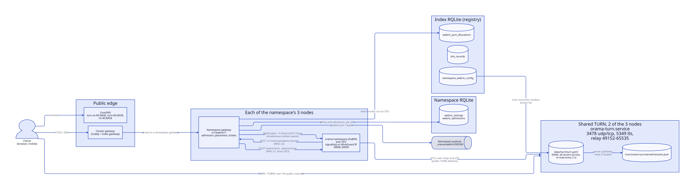
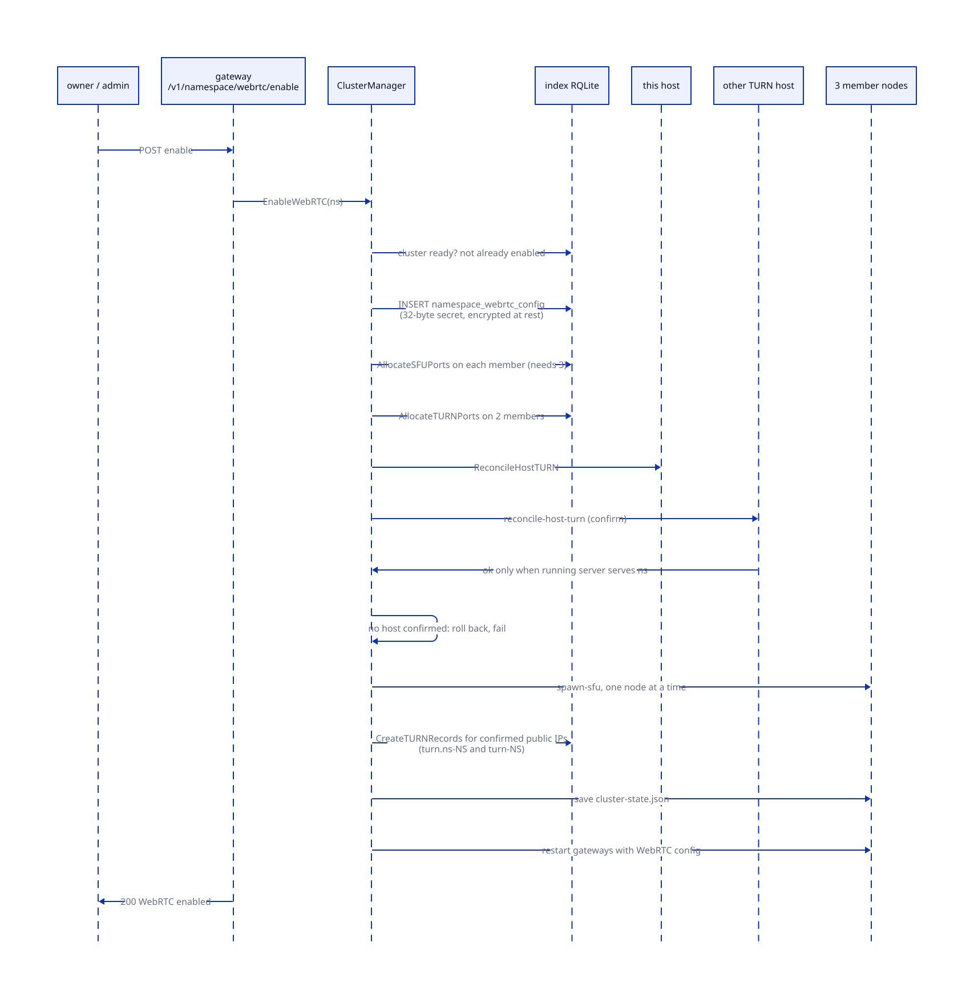
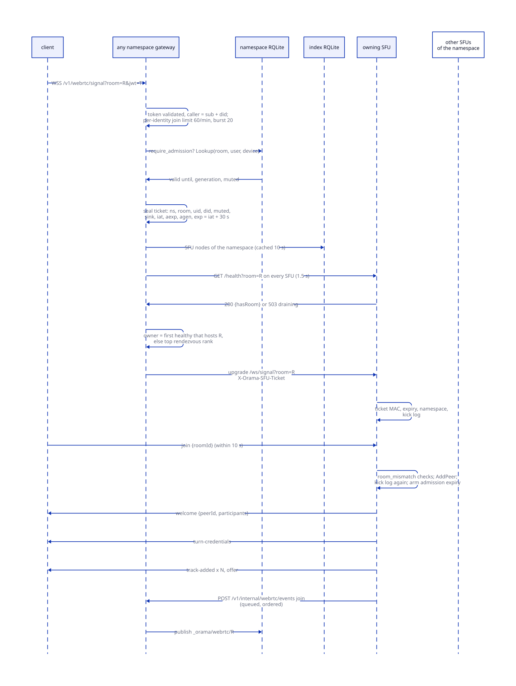
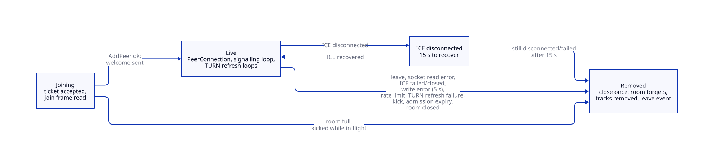
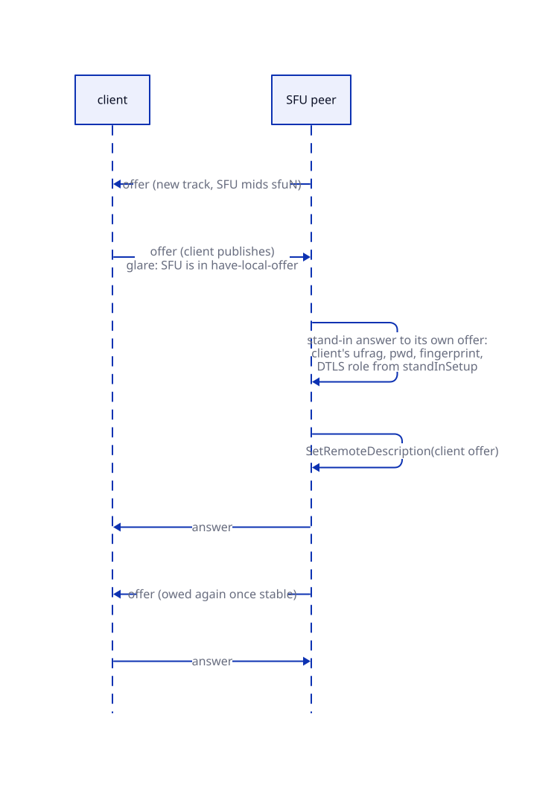
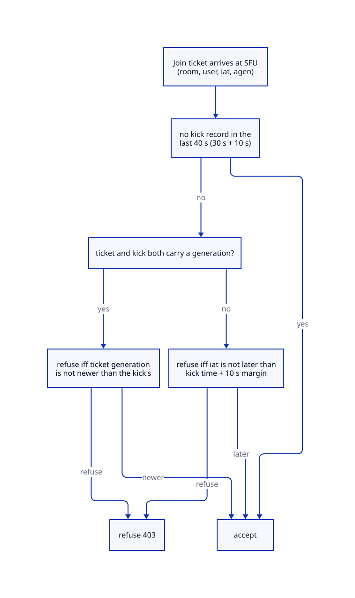
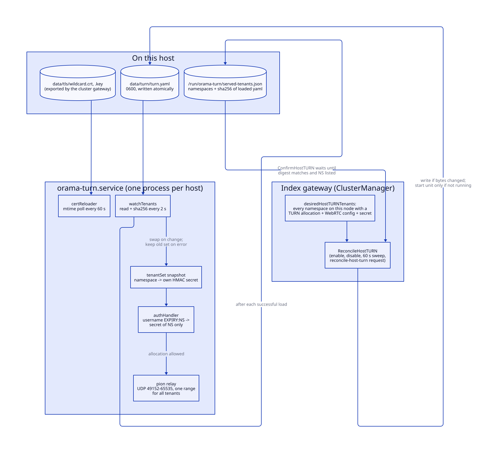
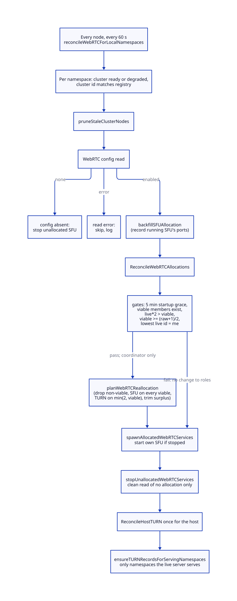

# WebRTC

> **At a glance.**
>
> - **What:** an opt-in, per-namespace real-time media service. Each WebRTC-enabled namespace runs one pion selective forwarding unit (SFU) on each of its three member nodes, and shares one TURN relay process per host with every other namespace on that host. A room lives in exactly one SFU process, chosen by a computed rendezvous hash. A namespace gateway authenticates the user, judges admission against the namespace's own database, signs a 30 s join ticket, and proxies the signalling WebSocket to the SFU. The SFU takes every identity decision from that ticket and nothing from the client.
> - **Key numbers:** SFU signalling on the WireGuard address, one TCP port per namespace per node in 30000-30099; 500 UDP media ports per namespace per node in 20000-29999; shared TURN on 3478 UDP and TCP, TURNS on 5349, relay range 49152-65535 for all tenants; join ticket 30 s; control and event MACs accepted within 60 s and refused on second use; at most 100 peers per room; signalling allowance 40 messages then 10 per second; keyframe requests spaced 500 ms per track; REST TURN credentials 24 h; SFU-signalled credentials 600 s by default, refreshed at 80 %; TURN tenant list re-read every 2 s; wildcard certificate re-read every 60 s; role reconciler every 60 s; admissions 1 s to 24 h.
> - **Code:** `core/pkg/sfu/`, `core/pkg/sfu/ctrlauth/`, `core/pkg/turn/`, `core/pkg/gateway/handlers/webrtc/`, `core/cmd/sfu/`, `core/cmd/turn/`, and the lifecycle half in `core/pkg/namespace/` (`cluster_manager_webrtc.go`, `host_turn.go`, `webrtc_port_allocator.go`).
> - **Depends on:** [namespaces](09-namespaces.md) for the cluster and its nodes, [reconciliation and recovery](10-reconciliation-and-recovery.md) for the sweep it joins, [the gateway](12-gateway-architecture.md) for the proxy and policy table, [identity](13-identity.md) for the token, [TLS and certificates](25-tls-and-certificates.md) for the wildcard, and [pub/sub](20-pubsub.md) for the membership topic. Stealth TURN over port 443 is [chapter 26](26-sni-routing-and-stealth-turn.md).



## Why it exists

A tenant that wants voice, video or screen sharing needs three things the rest of the platform does not provide. It needs a relay that browsers and phones behind restrictive networks can reach. It needs a server that fans one participant's media out to the others, because a mesh of direct connections does not scale past a handful of people. And it needs control over who is in a room, which the application, not the platform, decides.

Four constraints shaped it.

First, no internal traffic on the public internet, with one exception that media forces. The SFU's signalling socket binds the WireGuard address and is reachable only from the namespace's gateways. The media itself has to cross the public edge, because the clients are on the public internet. The design puts that edge in TURN, a small authenticated process with its own port range, and forces the SFU's own ICE agent through it.

Second, tenants share hosts. TURN binds the well-known ports 3478 and 5349, which are exclusive per host. The first design ran one TURN process per namespace; the second namespace to enable WebRTC on a node crash-looped on bind, and on a small fleet later namespaces got no relay at all (bugboard #283, recorded in `core/pkg/turn/config.go:Config`). Giving each namespace its own ports was rejected because arbitrary high ports are exactly what restrictive networks block, and those networks hold the users who most need a relay. So one TURN process serves every namespace on a host, and the isolation boundary moved from the process to the credential: a per-namespace HMAC secret.

Third, a room is stateful. Its participants, tracks and RTP flows live in one process's memory, so every peer of a call must reach the same SFU even though DNS round-robins them across the namespace's gateways. The placement rule has to be computed on every gateway without coordination, because a shared lease would put a Raft write on every first join.

Fourth, the namespace owns its policy. Who may join, who is removed and who is muted are decisions of the tenant's own serverless functions. Those decisions have to reach a process (the SFU) that the tenant's code cannot call directly, and the process has to enforce them even against a modified client.

## The model

**Namespace WebRTC.** An opt-in feature of a ready namespace cluster. It exists when a row in `namespace_webrtc_config` has `enabled = 1`. Enabling it generates the namespace's TURN secret and allocates ports and units (`core/pkg/namespace/cluster_manager_webrtc.go:EnableWebRTC`).

**SFU.** The selective forwarding unit: `orama-namespace-sfu@<namespace>`, one process per member node, built on pion WebRTC v4.2.22 (`core/go.mod`). It terminates a WebRTC PeerConnection per client, receives each client's published tracks, and forwards the RTP packets to every other client's PeerConnection without decoding them.

**Room.** A set of peers in one SFU process, named by a room id of 1 to 128 printable ASCII characters, none of them a space (`core/pkg/sfu/roomid/roomid.go:Validate`). The gateway and the SFU apply the same function, so they cannot disagree about a name. A room has no row anywhere: it exists while a peer is in it, and for 60 s after the last one leaves.

**Peer.** One client connection in a room. It carries an id (a UUID the SFU makes), the user id and device id the gateway authenticated, and a PeerConnection. A user connected from two devices is two peers.

**Owner.** The one SFU that hosts a room. It is not stored. Every gateway computes it (see Room placement).

**Join ticket.** A signed statement from a namespace gateway to an SFU: who this socket is, which room it may join, whether the namespace has muted them, when the admission it rests on ends, and where to report membership. The SFU accepts nothing else as identity (`core/pkg/sfu/ctrlauth/ticket.go:Ticket`).

**Admission.** A row the namespace's own functions write with the `webrtc_admit` host function, granting a user entry to a room for a bounded time, optionally from one device. A namespace that sets `require_admission` admits no one else.

**TURN tenant.** A namespace that the host's shared TURN process serves, with its own HMAC secret (`core/pkg/turn/config.go:TenantConfig`).

**TURN credential.** A username of the form `EXPIRY:NAMESPACE` and a password that is the base64 HMAC-SHA1 of the username under the namespace's secret (`core/pkg/turn/server.go:GenerateCredentials`). The namespace in the username selects the secret that checks the password.

**Control key.** The key the gateway and the SFU of one namespace share for tickets, control requests and membership events. It is HKDF-derived from the namespace's TURN secret under the purpose `webrtc-sfu-control` (`core/pkg/sfu/ctrlauth/ticket.go:Key`), so it is unrelated to the key material that signs TURN credentials even though both come from one secret.

**Role.** A row in `webrtc_port_allocations` saying that a node runs an SFU or holds a TURN allocation for a namespace. The table, not any file, is the authority for who runs what.

## How it works

### The three processes and one gateway handler

Four pieces cooperate; three of them are processes.

The **namespace gateway** is the ordinary tenant gateway ([gateway architecture](12-gateway-architecture.md)). When it has an SFU port or a TURN secret configured, it constructs `WebRTCHandlers` (`core/pkg/gateway/gateway.go`, the block calling `NewWebRTCHandlers`). The credentials route is registered when the gateway holds a TURN secret; the signalling, rooms, settings and events routes are registered when the gateway has an SFU port above zero (`shouldRegisterWebRTCRoutes`, `shouldServeTURNCredentials`). The two are decoupled so a gateway without a local SFU still mints credentials and places rooms on other nodes.

The **SFU** (`core/cmd/sfu/main.go`) loads a strict-decoded YAML config, listens on one HTTP address, and serves four routes: the WebSocket `/ws/signal`, the readiness probe `/health`, and the control routes `/admin/kick` and `/admin/mute`. On SIGTERM it drains for 30 s (`Server.Drain`), then closes every room.

The **TURN server** (`core/cmd/turn/main.go`) is a pion TURN v5 server wrapped in a tenant table. It starts one UDP and one TCP listener on the same address, an optional TLS listener, and a watcher that re-reads its config every 2 s.

The **host reconciler** lives in the index gateway's `ClusterManager`, not in the SFU or TURN processes. It allocates ports, writes the TURN tenant file, starts units and publishes DNS. The index gateway wires it at start (`core/pkg/gateway/handlers/namespace/core_wire.go`, which calls `StartWebRTCReconciler`).

### Enabling WebRTC

`EnableWebRTC` runs on the index gateway that received `POST /v1/namespace/webrtc/enable`. The route requires a namespace-write grant (`core/pkg/gateway/route_policy.go`).



1. The cluster must exist, be `ready` and not already have an enabled WebRTC config row. The enabled check passes when the read of that row fails, so a registry error does not stop the call here.
2. It generates 32 random bytes and stores their base64 as `turn_shared_secret`, encrypted at rest with the TURN encryption key when the node has one (`secrets.Encrypt`). The row also records `turn_credential_ttl` (600, `DefaultTURNCredentialTTL`), `sfu_node_count` 3 and `turn_node_count` 2.
3. It reads the member nodes (fewer than 3 is refused) and allocates SFU ports on all of them, then picks TURN nodes. `selectTURNNodes` takes the first two rows the member query returns (it groups by node id). It does not look at capacity or at existing TURN tenants, because under the shared model occupancy is no longer a reason to skip a host. When fewer than two exist, `turn_node_count` is rewritten to the number actually obtained so `webrtc/status` does not report relays that do not exist.
4. It calls `ReconcileHostTURN` on this host, then sends a `reconcile-host-turn` spawn request to each other TURN host, and keeps only the hosts whose reply says the running server serves the namespace (see Shared TURN). If no host confirms, the enablement is rolled back and fails.
5. It spawns the SFU on each member node in turn: it writes the SFU config, writes the unit's env file, starts `orama-namespace-sfu@<ns>` and waits up to 30 s for it to become active (`core/pkg/namespace/systemd_spawner.go:SpawnSFULocked`, under the namespace lock that `SpawnSFU` takes).
6. It publishes TURN DNS: two round-robin A names pointing at the public IPs of the confirmed TURN hosts, `turn.ns-<ns>.<base>` for plain TURN and `turn-<ns>.<base>` for TURNS (`core/pkg/namespace/dns_manager.go:CreateTURNRecords`). Both have TTL 60.
7. It writes `cluster-state.json` on every node with the SFU ports, the TURN domain and the secret (mode 0600), then restarts every member's namespace gateway concurrently with `WebRTCEnabled`, the SFU port, the TURN domain and the secret in its config.

Once the member nodes are read, a failure in the port allocation, the host TURN step, an SFU spawn or the DNS step runs `cleanupWebRTCOnError`: mark the config disabled first, tear down SFU units, free the ports of units that are gone, delete the config row, and tell every TURN host that was asked to drop the namespace under a fresh 30 s context, so a cancelled request cannot skip the release. Two exits skip it: a failed member read and a cluster of fewer than three members both return after the config row was inserted. The other way out is success with a defect: the state write and the gateway restarts of step 7 only log their failures, so a call that returns success can leave a gateway without the WebRTC routes (both under Known gaps).

### The SFU's configuration and process

The SFU config is `core/pkg/sfu/config.go:Config`: `listen_addr`, `namespace`, the media port range, `turn_servers`, `turn_secret`, `turn_credential_ttl` and `rqlite_dsn`. `Config.Validate` rejects an empty listen address, namespace, secret or DSN, a media range that is not positive or whose end is not above its start, a non-positive credential TTL, and a TURN list that is empty or has an empty host or a port outside 1 to 65535. It does not check that the listen address is on the overlay. The spawner supplies the node's internal address, and the sweep declines to start an SFU when `cluster-state.json` has an empty one, because `:30000` would bind every interface. The spawner writes it mode 0640 owned by `orama` with group `orama-sfu`, atomically, because it carries the TURN secret.

The unit (`core/systemd/orama-namespace-sfu@.service`) runs as its own account `orama-sfu` once per-service accounts are on (the shipped template says `orama`; `core/pkg/systemd/isolation.go:RenderNamespaceUnit` rewrites it), with `ProtectSystem=strict`, `NoNewPrivileges`, `PrivateDevices`, `RestrictNamespaces`, an empty `/opt/orama` tmpfs through which it sees only its namespace's `configs/` directory read-only, `MemoryMax=2G`, `MemorySwapMax=0`, `LimitNOFILE=65536` and `TimeoutStopSec=45s`. It runs `/usr/local/bin/sfu`, a world-executable copy, because `/opt/orama/bin` is not readable by `orama-sfu`. It writes nothing. See [privilege and filesystem trust](05-privilege-and-filesystem-trust.md) for the account model.

The pion API each room builds (`core/pkg/sfu/room_manager.go:newWebRTCAPI`) registers Opus (payload 111, 48 kHz stereo, in-band FEC), VP8 (96) and H.264 (125, packetization mode 1, profile-level-id 42001f), with the RTCP feedback types `goog-remb`, `ccm fir`, `nack` and `nack pli` on video. It adds three interceptors: the NACK responder, the NACK generator, and pion's interval PLI receiver, which asks every incoming video stream for a keyframe once when the stream appears and then every 3 s (interceptor v0.1.49 default). The settings engine restricts the SFU's local UDP sockets to the namespace's media range. There is no simulcast, no SVC and no bandwidth estimation of its own (`goog-remb` is advertised, but no interceptor sends REMB): the SFU forwards what it receives.

### Signalling: the join path

The client opens `wss://ns-<ns>.<base>/v1/webrtc/signal`. The cluster gateway proxies the socket to one of the namespace's gateways, failing over to the next member if the dial fails ([gateway architecture](12-gateway-architecture.md)). A browser cannot set headers on an upgrade, so the access token goes in `?jwt=` (`core/pkg/gateway/middleware.go`). The remaining steps run in `SignalHandler` (`core/pkg/gateway/handlers/webrtc/signal.go`).



1. **Per-identity limit.** `webrtcJoinAllowed` allows 60 sockets a minute with a burst of 20, keyed on the token subject (`core/pkg/gateway/webrtc_join_limit.go`). It keys on the subject, not the address, because the namespace gateway sees only the overlay address of the gateway that proxied the client; a token whose subject is an API-key exchange has no end-user subject and falls back to the client address, and internal traffic is not limited. Over the limit the answer is 429 with `Retry-After: 10`. A join costs the gateway a registry read and a health probe per SFU node, so a reconnect loop must not turn into SFU load.
2. **Room name.** With `?room=<id>` the gateway validates it and decides at the upgrade; the socket is then piped through as raw TCP. Without it the gateway upgrades the socket itself, waits up to 5 s for the first frame, requires a text `join` frame of at most 4096 bytes naming a valid room, and later replays that frame to the SFU (`core/pkg/gateway/handlers/webrtc/signal_join.go`). Frames after the join are capped at 1 MiB on this path.
3. **Authorize.** `authorizeJoin` reads the identity from the context the auth middleware set: the token subject and, when the session is bound to one, the `did` claim (`identity.go:callerOf`). It never reads a header or the join frame, which a client controls. It then checks admission (next section) and signs a ticket.
4. **Place.** `ownerOf` ranks and probes the SFUs (see Room placement).
5. **Proxy.** The gateway sets `X-Orama-SFU-Ticket`, replacing whatever the client sent under that name, rewrites the path to `/ws/signal` and proxies to the owner's `<WireGuard IP>:<port>`.
6. **SFU upgrade check.** A draining SFU answers 503 before it reads anything. Otherwise `openTicket` verifies the MAC, the expiry, that the ticket's namespace is this SFU's, and that the kick log does not refuse it (Kick and mute). The failures are 401, 401, 403 and 403.
7. **Join frame.** The SFU gives the client 10 s (`joinReadTimeout`) to send `join`. The `roomId` must be valid, must equal the `?room=` query when one is present, and must equal the ticket's room. A `userId` in the frame is ignored. A mismatch answers `room_mismatch` and closes.
8. **Join.** `joinRoom` creates or finds the room, creates the peer with the ticket's user and device, adds it (which builds its PeerConnection and reports the join event), checks the kick log a second time because a kick can land between the upgrade and the join frame, arms the admission-expiry timer, sends `welcome` with the participant list, applies any newer mute (`settleMute`), sends `turn-credentials`, sends the room's existing tracks as one batch, and starts the credential refresh loop. Then the signalling loop runs.

The client protocol is JSON text frames `type` plus `data`. Client to server: `join`, `leave`, `offer`, `answer`, `ice-candidate`, `audio-state`, `video-state`. Server to client: `welcome`, `participant-joined`, `participant-left`, `track-added`, `track-removed`, `turn-credentials`, `refresh-credentials`, `server-draining`, `participant-state`, `kicked`, `error`, and the SFU's own `offer`, `answer` and `ice-candidate` (`core/pkg/sfu/signaling.go`). An unknown type is answered with an `error` frame `unknown_message` and the socket stays open. The SFU sets no read limit on its socket (see Known gaps).

### Admission

`core/pkg/gateway/handlers/webrtc/admission_store.go:AdmissionStore` reads and writes two tables of the **namespace's own** database (migrations 073 and 075), checked on the join path of whichever namespace gateway takes the join. No SFU holds any of it, so it survives an SFU restart and is identical whichever node owns the room, and no cluster-wide write sits on the join path.

`webrtc_settings (namespace PK, require_admission, updated_at)` holds the policy, set by `PUT /v1/webrtc/config` with body `{"require_admission": true|false}` (a namespace-write grant, body capped at 1024 bytes). `webrtc_admissions` has primary key `(namespace, room, user_id, device_id)` and columns `expires_at`, `revoked_at`, `muted`, `created_at` and `generation`. Times are unix seconds. A `device_id` of `''` admits the user from any device; a device id admits that device only. A session bound to no device matches only the `''` row.

`checkAdmission` reads the policy and the user's admission on every join. With the policy off, the ticket carries only the mute flag. With it on:

| State of the rows that apply | Outcome |
|---|---|
| A valid row (not revoked, `expires_at` in the future) | Ticket carries the latest `expires_at` as `aexp`, the newest valid generation as `agen`, and the mute flag |
| Only revoked rows | 403 `WEBRTC_ADMISSION_REVOKED` (frame code `admission_revoked`) |
| Only expired rows | 403 `WEBRTC_ADMISSION_EXPIRED` (`admission_expired`) |
| No row | 403 `WEBRTC_ADMISSION_REQUIRED` (`admission_required`) |
| Store unreadable | 503 retryable, frame `admission_unavailable` |
| Table shape wrong | 500, not retryable, naming the table and what to fix |

The error appears as a typed HTTP 403 for the `?room=` path and as an `error` frame plus a close for the join-frame path. A gateway that cannot read the records refuses the join; it never admits on a guess.

Migrations create the tables with `IF NOT EXISTS`, so a namespace whose database already had a table of the same name keeps the tenant's table. `ensureSchema` therefore checks both tables' columns and primary keys on first use and after any failure (`admission_schema.go`); a foreign table is refused with an error naming the table and the fix, and a platform table lacking only `generation` is reported as migration 075 not yet applied (the gateway applies it on start).

**The admission's end holds for a live session.** The ticket carries `aexp`. The SFU arms a timer (`endAtAdmissionExpiry`) and, when it fires, sends `kicked` with code `admission_expired`, closes the peer, and reports the leave with reason `expired`. Admitting the user again does not lengthen a session already open, because the open session is bound by the ticket it joined with. The client rejoins to pick up a new end. A namespace that does not require admission has no end to hold.

**Admit** (`control.go:Admit`) accepts a TTL of 1 s to 24 h (`MaxAdmissionTTL`) and a user or device id of at most 256 bytes. Before writing it deletes this namespace's admissions that ended (expired or revoked) more than 60 s ago (`generationRetention`), except that a muted admission is kept until 7 days after its expiry (`mutedRetention`) so re-admitting a muted user does not unmute them. It then upserts the row with `revoked_at = NULL` and the next generation: one more than the highest generation the user has in the room on any device, computed inside the same statement (`nextGeneration`). Generations only grow.

### Room placement

A room's owner is a pure function of data every gateway can read, plus live health (`core/pkg/gateway/handlers/webrtc/placement.go`).

1. **List.** `registrySFUDirectory` reads the namespace's `sfu` rows of `webrtc_port_allocations`, joined to `dns_nodes` with `status = 'active'` and a non-empty `internal_ip`, from the cluster registry, not the tenant database, and caches the result for 10 s (`core/pkg/gateway/sfu_directory.go`). A failed refresh returns the error; it does not return an old list, because a stale set could place a room on a node the registry no longer lists. There is no public-IP fallback: the SFU binds only the overlay.
2. **Rank.** `rankSFUNodes` sorts the nodes by descending SHA-256 of `namespace`, a NUL, `room`, a NUL and the node id, taking the first 8 bytes as a big-endian integer. This is rendezvous (highest-random-weight) hashing: every gateway computes the same order, and removing a node moves only the rooms that node ranked first.
3. **Probe.** Every node is probed in parallel with `GET /health?room=<id>`, 1.5 s timeout (`sfuProbeTimeout`), no environment proxy, no redirects. A `200` is healthy. A draining SFU answers `503`, and so does not count. The body's `hasRoom` says whether the room has at least one participant there.
4. **Pick.** `pickSFUOwner` returns the first node in rank order that is healthy and already hosts the room; with no live room, the top-ranked healthy node. With no healthy node it returns `ErrNoHealthySFU`.

Nothing is written on the join path, so there is no lease to expire, no stale row naming a dead node and no registry write per join. The cost is one small health request per SFU node over WireGuard, three by design (see Design decisions).

| Event | Result |
|---|---|
| Two gateways, same room, same instant | Both rank identically and both find no live room, so both pick the same node |
| Owner stops or drains | It fails its probe. Peers get `server-draining` or a closed socket, reconnect through any gateway and land on the next-ranked healthy node |
| Owner returns while the call lives elsewhere | Not taken back: hosting the room beats rank |
| SFU added or removed | Only rooms whose top rank changed can move, and a live room stays on the node that hosts it |
| No SFU registered, none healthy, or the registry unreadable | 503 with a message that names the cause. There is no fallback to the local SFU, which would split the call |

The error text names the remedy: `orama namespace enable webrtc` when no SFU is registered, `orama namespace webrtc-status` when none is ready (`signal.go:ownerErrorMessage`). A network partition between one gateway and the owner makes that gateway rank the owner down and pick another node, splitting the room until the probe views agree (Known gaps).

### Rooms, peers and tracks

`RoomManager.GetOrCreateRoom` builds one pion API per room. A room allows at most 100 peers (`maxRoomPeers`); the 101st gets `join_failed` ("room is full"). When the last peer leaves, a timer of 60 s (`emptyRoomTTL`) removes the room if it is still empty.

**A peer's PeerConnection is relay-only.** `InitPeerConnection` sets the ICE transport policy to `relay` unless a test sets `allowDirectICE`. The SFU therefore gathers only relay candidates, from its own TURN allocation, and its media leaves the node by way of the public TURN address. The client's policy is not enforced by the SFU; what the SFU enforces is that its own end is reachable only through TURN.

**Publishing.** When a client's track arrives (`OnTrack`), the peer starts reading its RTCP and calls `BroadcastTrack`. That creates a `TrackLocalStaticRTP` with the same codec, id `<kind>-<source peer id>` and stream id the source peer id, records it in the room's `publishedTracks` with a keyframe limiter, starts `forwardRTP`, and adds the track to every other peer's PeerConnection, announcing each with `track-added`.

**Forwarding.** `forwardRTP` (`core/pkg/sfu/forward.go`) reads packets into an 8192-byte buffer and writes them to the local track, which fans each packet out to every subscriber binding. A write error never ends the loop, because the error comes from one binding and the others already received the packet. A `drop` function, set only for audio tracks, is asked per packet: a muted publisher's packets are read and discarded on the server, whatever the client does.

**Subscribing.** A new joiner gets all existing tracks inside one batch (`StartTrackBatch`/`EndTrackBatch`), so it takes one renegotiation, not one per track. Each added transceiver is given an SFU-owned mid `sfu<N>` before any offer can number it, so a mid the client picks for its own new m-line can never collide with one the SFU chose.



**Leaving.** `RemovePeer` deletes the peer, reports a leave event under the room lock, removes the peer's published tracks, removes their senders from every other peer's PeerConnection, closes the peer, broadcasts `participant-left` and `track-removed`, and starts the empty-room timer if the room is now empty.

**Keyframes.** A subscriber that needs a keyframe sends PLI or FIR on the RTP sender of the track it receives. The SFU reads that RTCP for every subscribed track (`readSenderRTCP`; reading is also what drains the sender's buffer, which the NACK responder needs) and relays one PLI to the publisher through `Room.RequestKeyframe`. `keyframeLimiter` spaces PLIs for one track at least 500 ms apart: the first goes immediately, a request inside the interval is deferred to its end, and further requests during the deferral share it. N subscribers therefore cost the publisher one keyframe per interval, not N. A new subscriber's negotiation gets 300 ms to settle (`keyframeSettle`) before the SFU asks for keyframes of every video track. The 3 s interval PLI from the interceptor is separate and is not limited by this, so each video publisher is asked for a keyframe at least every 3 s whatever its subscribers do.

### Negotiation and glare

The SFU offers whenever it has something to tell the client (a track to subscribe to, a track removed, an ICE restart). The client offers when it publishes. Both can happen at once, which is glare. The SFU is the polite peer because AnChat's iOS client cannot be (its rollback breaks audio).



Every SDP exchange of a peer runs under `sigMu`, so offers and answers never interleave and a pion callback cannot offer in the middle of answering. Whether an offer is owed is kept apart in `negotiationPending`: it is set whenever something needs offering and cleared only when an offer is actually created, so a yielded offer's changes are still owed afterwards. `flushOffer` sends the owed offer only when the connection is `stable` and no track batch is being assembled.

pion v4.2.22 has no rollback: its signalling state table leaves `have-local-offer` only through an answer. The SFU therefore resolves glare in `yieldToClientOfferLocked`:

1. It builds a stand-in answer to its own pending offer by creating a throwaway PeerConnection, letting it answer, and rewriting the answer's ICE ufrag, ICE password and DTLS fingerprint to those of the client's current remote description, or of the crossing offer when it has none yet (`standInAnswer`). A throwaway client's own parameters would redirect ICE and DTLS to nobody.
2. It sets the DTLS role in the stand-in (`standInSetup`). Once a negotiation completed, the established role is kept. Before that, the role follows the client's crossing offer: `a=setup:active` makes the SFU the DTLS server, anything else (`actpass`) makes it the DTLS client.
3. It applies the stand-in as a remote answer, which returns it to `stable` without withdrawing the tracks. Then it applies the client's offer, answers it, and offers again.

Each yield costs a PeerConnection, so a peer may force at most 6 yields a minute (`glareYieldsPerWindow`), and offers plus ICE candidates share a token bucket of 40 tokens refilled at 10 per second (`core/pkg/sfu/ratelimit.go`). A peer that exceeds either gets an `error` frame `rate_limited` and is removed. Answers are not limited. A yield that succeeds sends the client no error frame.

### Credentials and TURN refresh

Three credential paths exist, with different lifetimes because they have different refresh behaviour.

| Path | TTL | Refreshed? | Why |
|---|---|---|---|
| `POST /v1/webrtc/turn/credentials` and the `turn_credentials` host function | 24 h (`turn.DefaultCredentialTTL`) | No | They mint once at call setup; once the credential expires the TURN server rejects the allocation refresh and a relay-only call dies. A lifetime shorter than a call tore the call down when it ran out (bugboard #155) |
| SFU `turn-credentials` and `refresh-credentials` frames | `turn_credential_ttl`, 600 s by default | Yes, at 80 % of the TTL (480 s) over the signalling socket | A short life bounds replay of a leaked credential, and the refresh path is under the SFU's control |
| The SFU's own PeerConnection | 24 h | Yes, at 80 % (19.2 h) | It never leaves the SFU |

The third path needs care. pion's TURN client refreshes an allocation with the credential it was created with, and the TURN server rejects an expired one. `SetConfiguration` with new ICE servers affects only the next gathering, never an existing allocation. So `turnRefreshLoop` (`core/pkg/sfu/turn_refresh.go`) waits `sfuTURNRefreshInterval`, swaps in a fresh credential once no ICE gathering is running (waiting up to 30 s, polling every 100 ms, because `SetConfiguration` races a gathering inside pion), and requests an offer with an ICE restart, which gathers a new allocation authenticated with the new credential. If the swap fails, the peer is disconnected so the client rejoins on a fresh credential rather than keeping a call whose media silently stops.

Every credential path builds `EXPIRY:NAMESPACE` with `GenerateCredentials`. The URIs differ by path. The REST handler returns `turn:<turn.ns-NS.BASE>:3478?transport=udp`, the same with `transport=tcp`, `turns:<turn-NS.BASE>:5349`, and, when the namespace has stealth enabled, `turns:<cdn-HASH.BASE>:443` ([chapter 26](26-sni-routing-and-stealth-turn.md)). The SFU-signalled credentials use the two-label `turn.ns-NS.BASE` host for `turn:` and for `turns:`, and carry no stealth URI. The `turn_credentials` host function does the same for the hosts but appends the stealth URI when the namespace has stealth enabled (Known gaps).

### Membership events

Every join and leave is posted to a namespace gateway, which publishes it on the namespace's pub/sub topic `_orama/webrtc/<room>` (`core/pkg/gateway/handlers/webrtc/events.go`). Subscribers receive:

```json
{"_orama":"webrtc.join","room":"standup","user_id":"0xabc","device_id":"d1","peer_id":"uuid","at":"2026-10-06T10:00:00.123Z"}
```

A leave has type `webrtc.leave` and a `reason`: `left` (the client left or its connection failed), `kicked`, `expired`, or `closed` (the SFU shut the room down). The platform stamps the reserved `_orama` key, which no pub/sub publish route accepts from a caller, and the whole `_orama/` prefix is reserved ([pub/sub](20-pubsub.md)).

The SFU has no pub/sub of its own, and the gateway a socket came through dies together with the socket, so it cannot receive its own peers' leaves. The `reporter` (`core/pkg/sfu/membership.go`) therefore remembers the gateways it has seen tickets from (the ticket's `sink`, at most 8, each for 10 min) and delivers to the most recently seen one that answers. One queue of 1024 events, drained by one goroutine, keeps a peer's join before its leave; the send is under the lock that closes the queue and never blocks. The same single goroutine means a gateway that does not answer delays every event behind it, by up to 3 s for each remembered gateway tried. A post times out after 3 s. A gateway that answers with a status below 500 and refuses (bad MAC) ends the attempt: that is a misconfiguration another gateway would share, so the SFU logs an error naming it and does not try the next. Delivery is at most once: with no gateway answering, the event is dropped and logged, and a full queue drops events. Subscribers can resynchronise from the `participants` list of a `welcome`. At shutdown `Close` waits up to 3 s for the queue.

The join event is reported under the room's peer lock in `AddPeer`, and the leave under the same lock in `RemovePeer`, which orders a peer's two events against each other. The sink must be an `http` URL on the WireGuard overlay (`ctrlauth.ValidateSink`), because reports carry a MAC over plain HTTP, so they go to the overlay or nowhere. A gateway that does not listen on an overlay address (a development gateway) reports nowhere and logs why.

### Kick and mute

`webrtc_kick(room, user)` and `webrtc_mute(room, user, muted)` are host functions of the namespace's serverless runtime ([serverless](21-serverless.md)); each invocation may make at most 100 `webrtc_*` calls (`maxWebRTCCallsPerInvocation`), and a function acts only on its own namespace. Both go through `WebRTCHandlers` (`control.go`).

**Kick** first revokes: `Revoke` sets `revoked_at` on every admission of the user to the room and returns the highest generation the user holds there. The revocation is the part that keeps the user out; the next step closes the live connection. It then sends `POST /admin/kick` with body `{room, user_id, at_ms, admit_gen}` to **every** SFU of the namespace, not only the room's owner. Placement is decided by health probes, so an SFU that missed one while it hosted the room would be passed over, and a call to the owner alone would land on an SFU with no such peer and do nothing, silently. Every SFU also keeps its own kick log, so every SFU must be told. The calls run concurrently with a 5 s timeout each, and the error names each SFU that could not be reached or refused, and says the revocation stands.

On the SFU, `handleKick` records the kick before it looks for the peer (`record` precedes `KickUser`), so a join that finds no kick in the log has its peer in the room before the kick looks for it. The SFU removes every peer of that user, each after a `kicked` frame with code `removed`, and reports the leave with reason `kicked`.

The kick log decides what to do with a ticket that was issued before the kick but arrives after it.



A kick is remembered for `kickWindow`, a ticket's 30 s life plus a 10 s clock margin. When the ticket and the kick both carry a generation, the ticket is refused exactly when its generation is not newer than the kick's. No clock is involved, so a user admitted again right after a kick, whose ticket has a newer generation, joins at once. Otherwise (a namespace without admission, a ticket on an admission that predates generations, a kick from an older gateway), the SFU refuses a ticket that arrives within the window unless the ticket's issue time is more than 10 s later than the kick's. There a user re-admitted within about 10 s of a kick can be refused once and rejoin. A kick that carries no generation puts the entry back on the clock rule, which stops a ticket of an admission made between two kicks from slipping through the second.

**Mute** records the state on the user's admissions with `SetMuted` so it holds on rejoin, then sends `POST /admin/mute` with `{room, user_id, muted, at_ms}` to every SFU. The SFU's mute log (`mutelog.go`) keeps the latest state per user and room for the same 40 s window and rejects a request older than the one on record. A join whose ticket was issued at or before the logged change (plus the margin) takes the logged state instead of the ticket's snapshot, and `settleMute` reads the log after the peer is in the room and once more after applying, which closes the race with a mute landing between the two. The mute is enforced per RTP packet: `peer.muted` is read by `forwardRTP` for every audio packet, so a client that keeps publishing, or modifies itself to, is silent to the room. The room is told with a `participant-state` frame whose `forced` is true. A mute is judged by the gateways' clocks alone, with no generation, because it is a state and not a revocation.

Unlike a kick, a mute with no admission on record has nothing to keep it on: it lasts as long as the SFU's log window plus the connection.

### The control channel authentication

Three things cross between a namespace's gateway and its SFUs, and each carries a MAC under the control key (`core/pkg/sfu/ctrlauth/`). The SFU listens on the overlay, where every namespace's services live, so being on the overlay proves nothing about who is calling.

| Message | Direction | Header | Covers |
|---|---|---|---|
| Join ticket | gateway to SFU, on the upgrade | `X-Orama-SFU-Ticket` | `base64url(json) "." hex(HMAC-SHA256)` of the namespace, room, uid, did, muted flag, event sink, issue time, admission end, generation, expiry |
| Control request (kick, mute) | gateway to SFU | `X-Orama-SFU-MAC` | Target, method, path, timestamp, nonce, SHA-256 of body |
| Membership event | SFU to gateway | `X-Orama-SFU-MAC` | Same, with the gateway's sink URL as the target |

A request stamp is `<unix seconds>.<hex nonce>.<hex HMAC>` with a 16-byte random nonce, version tag `orama-sfu-control-v2`. The receiver verifies the MAC, requires the timestamp within 60 s either way, and then records the nonce and signature in a `ReplayGuard`, a bounded LRU of 8192 stamps that expire after twice the skew. A second use of a stamp is refused (`ErrReplayed`). Only stamps that verified are remembered, so only a holder of the key can fill the guard. The target is part of the MAC because every SFU and every gateway of a namespace shares the key and keeps its own guard: a stamp captured on its way to one would otherwise verify, once, at another. For a control request the target is the SFU's `listen_addr`; for an event, the sink URL.

The secret is trimmed before derivation because it is read from files, and a trailing newline on one end would derive a different key and fail every call with no visible reason. A revoked admission is refused at the next ticket. A ticket is not single-use: only request stamps pass through a replay guard, so a leaked ticket can open sockets, for the one user and room it names, until its 30 s life ends. The SFU judges expiry by its own clock, so a gateway more than 30 s behind it issues tickets that arrive already expired and every join through it gets 401; a request MAC tolerates 60 s.

### Shared TURN

`orama-turn.service` is a host-level unit running `/opt/orama/bin/turn --config /opt/orama/.orama/data/turn/turn.yaml` as the `orama` user with `CAP_NET_BIND_SERVICE` as its only capability. It has `ProtectSystem=strict`, `NoNewPrivileges`, `PrivateDevices`, `MemoryMax=1G`, `LimitNOFILE=65536`, `Restart=always`, and a runtime directory `/run/orama-turn` mode 0750. It is `PartOf=orama-node.service`, so a restart of the node cycles it and drops every tenant's relays. The unit file keeps that deliberately: letting TURN outlive the node would leave an old relay binary running after an upgrade, because the rolling restart only walks namespace units. It has no start limit, so a transient failure never needs a human to reset it.



#### The tenant table

`core/pkg/turn/config.go:Config` holds the listen address (`0.0.0.0:3478`), the optional TURNS address (`0.0.0.0:5349`) and its cert and key paths, the public IP advertised in allocations, the realm (the base domain), the relay range, and a list of `Tenants`, each `{namespace, auth_secret}` plus optional stealth fields. `Validate` rejects an empty or invalid public IP, an empty realm, no tenants, a tenant with no secret, a namespace listed twice, and a relay range under 100 ports (a zero listen port is deliberately allowed, an idiom for tests; production spawns are guarded by `turnPortBlockSpawnable`). A duplicate is refused because which secret authorizes the namespace would be order-dependent. The legacy single-tenant form (`namespace` plus `auth_secret`) is normalized into one tenant by `ResolvedTenants`; callers must use it rather than the raw fields.

The config is decoded strictly by `ParseConfig`, directly into `Config`, so the struct's own YAML tags are the one definition of the contract between the reconciler that writes the file and the binary that reads it. It used to be a mirror struct in `cmd/turn`, and every new field crashed the binary at startup until someone duplicated it.

#### Authentication

`authHandler` is the pion TURN auth callback. It splits the username at the first `:` into expiry and namespace, requires the expiry to be an integer greater than now, looks up **that namespace's** secret in the current tenant snapshot, and returns the long-term-credential key derived from the username, the realm and `GeneratePassword(secret, username)`. A namespace the server does not serve is rejected; a lookup miss never falls back to another tenant's secret. A tenant whose secret is empty is not authorized. The password check itself is pion's: it compares the client's message integrity against the key.

The consequence is the isolation boundary. A client of namespace A cannot allocate under B's name, because A's secret does not produce a valid HMAC for B's username, and it cannot invent an unserved name. Both are tested end to end (`e2e/features/webrtc/credentials_test.go:TestTURN_relayOnlyAuth`).

#### Hot tenant changes

The watcher (`core/pkg/turn/tenant_reload.go:watchTenants`) loads once at start, then every `TenantReloadInterval` of 2 s reads the file and hashes it. It rebuilds the tenant set only when the SHA-256 changed, because mtime and size cannot be trusted (a same-size rewrite inside the filesystem's timestamp granularity looks untouched, and a rotated secret would go unseen). A reload parses and validates with the same rules as startup, then swaps an immutable `tenantSet` under a lock. A failed reload keeps the previous set: a half-written or briefly unreadable config must never revoke tenants that are working. A failure is logged once per distinct error. Only the tenant set reloads; listeners, ports and the relay range are fixed for the process lifetime.

Restarting would drop every other tenant's relays, which is why none of this requires a restart.

After every successful load the server atomically writes `/run/orama-turn/served-tenants.json` (`{namespaces, config_sha256}`, mode 0640, no secrets). A starting process deletes any leftover first, and `RuntimeDirectory` makes systemd remove the file when the unit stops, so a dead server leaves no claim behind.

#### The host reconciler

`ReconcileHostTURN` (`core/pkg/namespace/host_turn.go`) derives the host's tenant set from the registry. It walks `cluster-state.json` of every namespace on the node, resolves each to its cluster through the registry (a stale state file for a deprovisioned namespace names a cluster that no longer exists and would otherwise drop a live tenant), requires a TURN allocation for this node and a WebRTC config with a secret, and sorts the result so an unchanged set produces an identical file.

It then renders a `turn.Config`: public IP from `dns_nodes.ip_address` for this node (a missing one refuses the write, because an empty IP crash-loops the server, bugboard #846), realm the base domain, and the relay range `49152`-`65535`. That is the host-wide range. The per-namespace 800-port block in `webrtc_port_allocations` is a record of which namespaces hold TURN on which node and is deliberately not the relay range, because one process has one range; the range also equals what the firewall opens, so the two cannot drift. TURNS is enabled only if the cluster's wildcard certificate has been exported (see TURNS certificate); otherwise `turn_listen_addr` stays empty and clients use plain TURN on 3478.

The file is written atomically, mode 0600, owned by `orama` (it holds every tenant's secret), only if the bytes changed. Every reconcile re-adds the relay range to the firewall. When the unit is not running the reconciler then retires any pre-shared per-namespace TURN unit (which would hold 3478) and starts `orama-turn`. When it is running and the file changed, nothing is restarted. When the node holds no TURN allocation at all, it stops the unit and deletes the file, because the file holds secrets and an empty set means "stop here", not "serve nobody". An unreadable tenant allocation or WebRTC config changes nothing: "cannot ask" is not "no tenants". The per-namespace cluster lookup is the exception: an error there is skipped like a stale state file (Known gaps).

It returns the namespaces it configured. Callers advertise DNS for exactly those, because holding an allocation is not the same as being served: a namespace with no secret is dropped from the file, and a failed write leaves the previous set running.

`ConfirmHostTURN` (the `reconcile-host-turn` spawn action, 30 s timeout) goes further: it reconciles, then polls every 200 ms for up to 6 s until the unit is active, the digest in `served-tenants.json` equals the SHA-256 of the file on disk, and the namespace is in the published list. A written file only means the server will serve a namespace on its next tick, and a client pointed at it earlier is refused. `ReleaseHostTURN` is weaker: it returns nil once the reconciled list no longer names the namespace, without waiting for the running server to reload, so the namespace's secret stays valid in the running process for up to one 2 s tick.

#### TURNS certificate

`certReloader` serves TURNS through a `GetCertificate` callback and polls the certificate file's mtime (not the key's) every 60 s. On change it reloads; a failed load keeps the previous certificate, so a renewal that momentarily presents a half-written or mismatched pair cannot take TURNS down. A restart is avoided because it would drop every relay. The TLS listener uses a minimum of TLS 1.2.

The certificate is the cluster's `*.<base>` wildcard, exported by the cluster gateway to `data/tls/wildcard.crt` and `wildcard.key` (`core/pkg/namespace/systemd_spawner.go:resolveTURNSCert`; the export belongs to [TLS and certificates](25-tls-and-certificates.md)). The reconciler checks only that both exported files exist, not that they parse; a pair the server cannot load at its start stops it from starting. There is no other source, and a self-signed certificate is never served: browsers reject it, and for a stealth host a rejected certificate is indistinguishable from censorship. The wildcard covers one label, so TURNS uses the single-label `turn-<ns>.<base>` (`turn.TLSHostForNamespace`, single-label only because namespace names are validated to `[a-z0-9-]`), while plain TURN, which needs no certificate, keeps the two-label `turn.ns-<ns>.<base>`.

### Role reconciliation

SFU and TURN roles are recorded in `webrtc_port_allocations`, and every node runs a 60 s sweep that keeps reality matching it (`StartWebRTCReconciler`, `webrtcReconcileInterval`).



Node replacement migrates a namespace's core roles but originally left the WebRTC allocations on the departed machine (bugboard #161): one TURN role sat on a node removed weeks earlier and the replacement held none. The sweep prevents that.

Per namespace on this node, in order:

1. **Guard.** The cluster must be `ready` or `degraded`, and the cluster id in `cluster-state.json` must equal the registry's for that name. A deprovisioned and re-created namespace can leave a stale state file whose id returns "no rows" cleanly, which the stop sweep would read as proof of revocation.
2. **Prune** permanently gone cluster-node rows, then **re-advertise** this node's `ns-<ns>` DNS record if its gateway answers `/v1/health`.
3. **Read the WebRTC config.** An error skips the namespace. No config means any running SFU without an allocation is an orphan of a failed teardown and is stopped on positive evidence. Config present continues.
4. **Backfill.** `backfillSFUAllocation` records the ports the running SFU is configured to bind (read from `sfu-<node>.yaml`) as a row if none exists, because the allocator hands out ports from the rows. A unit holding ports without a row would have them given to the next namespace, whose SFU would then crash-loop on "address already in use". A config that is not one of the allocator's 500-port blocks, a row naming other ports, or ports another cluster holds are logged as errors and the unit is left alone.
5. **Reallocate** (`ReconcileWebRTCAllocations`), coordinator only (below).
6. **Start, then stop.** Start the SFU this node holds an allocation for when its unit is stopped; then stop what it no longer holds. In that order, so a role that moved here is serving before DNS advertises it. The start is skipped when `cluster-state.json` lacks the node's overlay address or tenant RQLite port, and while a failed start is backed off.

After all namespaces, `ReconcileHostTURN` runs once for the host and TURN DNS is ensured only for namespaces the live server serves (`ensureTURNRecordsForServingNamespaces`). DNS never points at a relay that is not up.

**Reallocation is coordinated without a lock.** Allocation is cluster-wide state, and concurrent reconcilers could double-allocate a role, so one node applies the plan per sweep: the lowest-sorted live member. Every node computes the same answer from the same membership read. A node applies a plan only if all of these hold:

- it is past a 5 min startup grace (`webrtcReconcileStartupGrace`), so its first read of the cluster cannot look like a mass outage;
- the viable set is not empty;
- `live * 2 > viable` (`webrtcReconcileQuorumOK`), a strict majority, so a partitioned minority cannot conclude it is the last survivor;
- the viable set is at least half of every recorded member, `viable >= (raw + 1) / 2` (`webrtcReconcileMajorityHeld`), because a lone survivor after a mass outage always passes the first check;
- it is the lowest-sorted live member.

Viable means a member that is active or was seen within `webrtcMemberGracePeriod` of 10 min. Live is the subset with `status = 'active'`. Both come from one query (`webrtcViableMemberSQL`), so live is structurally a subset of viable; two reads let a node flip between them and break the quorum arithmetic (bugboard #170). Revocation follows viability, not a raw heartbeat: a 120 s heartbeat gap during a rolling restart must not move a relay.

`planWebRTCReallocation` is a pure function. It drops roles on nodes that are not viable members, gives an SFU role to every live member that lacks one, brings TURN up to `min(turn_node_count, viable members)`, and, if two overlapping majorities both added a relay, trims the surplus by dropping the highest-sorted holders so every node chooses identically. The reconciler writes only the allocation rows. Each node converges its own units on its own sweep. The blunt alternative, disable and enable, regenerates the TURN secret and invalidates every client credential in flight.

**Stopping needs positive evidence.** Starting can fail and is backed off; stopping is immediate, so the stop path is the conservative one. `stopUnallocatedWebRTCServices` acts only on a clean read that returned no allocation row. A read error, an empty local node id or an empty cluster id leaves the service alone, because a transient registry failure must not become a fleet-wide WebRTC outage. The decision is taken again under the namespace's lock before the unit is retired, so an enable that allocated in between is not undone. A unit in any state but inactive is retired (crash-looping units do not read as active), as is an inactive one whose env file remains, because `orama node upgrade` rediscovers units by env file.

**Starting is backed off.** `spawnSFUIfDown` runs under the namespace lock and re-reads the config under it. It refuses when the cluster is not serving, when the unit is `activating`, `deactivating` or `reloading` (a stop in flight is a teardown, and `start` would cancel it), and when the unit's state cannot be read. A failed start suppresses retries for 10 min (`webrtcSpawnBackoff`), because each attempt blocks up to 30 s and namespaces are swept serially.

### Disabling WebRTC

`DisableWebRTC` marks the config `enabled = 0` **before** stopping anything. Every node's reconciler starts the units of a namespace whose config says enabled, and the SFU takes up to 45 s to stop; a start issued meanwhile cancelled the stop job and the teardown failed with "Job canceled". It then tears down the SFU on every node concurrently. Run one after another it took 117 s on three nodes, past the gateway's 120 s write timeout, and surfaced as a bare 502. On each node the unit is stopped and disabled and its env file and `sfu-<node>.yaml` removed. A stop whose command returns while the unit is still `deactivating` is waited for up to `stopWaitDeadline`.

It does **not** stop TURN. The namespace leaves the host's tenant list when `ReconcileHostTURN` rewrites the file after the allocation and config are deleted, and the host process stops only when its last tenant leaves. The call rewrites only this host's list. Every other TURN host drops the namespace on its next sweep, up to 60 s later, and until then its running server still accepts the namespace's credentials (an enablement that rolls back, by contrast, tells each host to release). The only per-namespace TURN unit that can still exist is the retired `orama-namespace-turn@<ns>`, which the `teardown-turn` spawn action removes.

A unit that could not be torn down keeps its allocation row, because it still holds those ports and freeing the row would let the next namespace be handed the same ones. The failed teardown is recorded in `namespace_pending_cleanup` and replayed by the tenant reconciler ([reconciliation and recovery](10-reconciliation-and-recovery.md)); allocating ports on a node deletes a teardown still owed there, so a late replay cannot remove an SFU just started. Running the disable again finishes a namespace whose first attempt left allocations.

### The surface for operators and tenants

The routes (`core/pkg/gateway/routes.go`, `route_policy.go`) and who may call them:

| Route | Policy |
|---|---|
| `POST /v1/webrtc/turn/credentials` | Data plane, domain `webrtc`, read, ownership, a principal's token |
| `GET /v1/webrtc/signal` (WebSocket) | Same |
| `GET /v1/webrtc/rooms` | Same. Returns the local SFU's `/health` body (status, room count), nothing per room |
| `GET`, `PUT /v1/webrtc/config` | Control plane, namespace write |
| `POST /v1/internal/webrtc/events` | No credential: the handler requires the MAC |
| `POST /v1/namespace/webrtc/enable`, `disable`, `stealth/enable`, `stealth/disable` | Control plane, namespace write |
| `GET /v1/namespace/webrtc/status` | Any valid credential. Returns the config row without the secret |

The data-plane routes require a signed-in user's token or a deployed app's workload token; an API key alone is refused, which makes a runtime key extracted from an app bundle worthless against them ([authorization](14-authorization.md)). Responses carry `Permissions-Policy: camera=(self), microphone=(self), geolocation=()` (`core/pkg/gateway/middleware.go`).

### The firewall

Install opens, on a node that hosts TURN, `3478/udp`, `3478/tcp`, `5349/tcp` and the relay range `49152:65535/udp` (`core/pkg/install/firewall.go:GenerateRules`). Because the root-level firewall phase runs only at install and upgrade, a node that gains a TURN allocation between upgrades would relay behind a closed firewall (clients reach ICE `checking` and never connect, bugboard #846), so `ReconcileHostTURN` re-adds the relay range through the privileged helper before starting the unit. SFU ports are not opened: signalling is WireGuard-internal, and the media sockets are reached only through TURN allocations. The stealth listener on 443 is described in [chapter 26](26-sni-routing-and-stealth-turn.md).

## State it owns

| Item | Holds | Writer | Reader | Where |
|---|---|---|---|---|
| `namespace_webrtc_config` | One row per namespace: `enabled`, encrypted `turn_shared_secret`, `turn_credential_ttl` (600), `sfu_node_count`, `turn_node_count`, `stealth_enabled`, enabler | `EnableWebRTC`, `DisableWebRTC`, stealth toggles | Host reconciler, gateways at spawn, status route | Index RQLite (migrations 018, 030) |
| `webrtc_port_allocations` | One row per node and service: SFU signalling port and media range, or TURN listener ports and a relay block | `WebRTCPortAllocator`, the reconciler | SFU directory, host TURN reconciler, port allocator | Index RQLite (migrations 018, 067) |
| `webrtc_rooms` | Nothing: placement is computed. Created by migration 018, emptied on disable and namespace delete | Deletes only | No reader | Index RQLite |
| `webrtc_settings`, `webrtc_admissions` | Admission policy; admissions with expiry, revocation, mute, generation | Namespace gateway handlers (`AdmissionStore`) | Namespace gateways on every join | The namespace's own RQLite (migrations 073, 075) |
| `data/turn/turn.yaml` | Every tenant's HMAC secret, relay range, cert paths | Index gateway (`writeHostTURNConfig`), mode 0600 | `orama-turn` | Each TURN host |
| `/run/orama-turn/served-tenants.json` | Loaded namespaces and the config digest | `orama-turn` | Host reconciler, telemetry | Each TURN host; removed on unit stop |
| `data/namespaces/<ns>/configs/sfu-<node>.yaml` | SFU config incl. TURN secret and DB DSN | Spawner, mode 0640, group `orama-sfu` | The SFU; the backfill | Each member node |
| `data/namespaces/<ns>/cluster-state.json` | `has_sfu`, SFU and TURN blocks, TURN domain and secret | `updateClusterStateWithWebRTC`, mode 0600 | Cold-boot restore, host reconciler | Each member node |
| `dns_records` for `turn.ns-<ns>.<base>`, `turn-<ns>.<base>` | A records, TTL 60, tag `namespace-turn:<ns>` | `CreateTURNRecords`, `EnsureTURNRecordForNode` | CoreDNS | Index RQLite |
| `namespace_pending_cleanup` | Teardowns owed to unreachable nodes | `DisableWebRTC` | Tenant reconciler | Index RQLite |
| SFU memory: rooms, peers, tracks, kick and mute logs, replay guard, event queue | Everything live | The SFU | The SFU | Process memory, lost on restart |
| TURN memory: tenant snapshot, allocations, cert reloaders | Everything live | `orama-turn` | `orama-turn` | Process memory, lost on restart |

The SFU holds no durable state: a restart empties rooms and both logs, and clients rejoin.

## Lifecycle

**Boot.** The SFU and TURN units are started by the host reconciler and by the node's disk-based restore, after the namespace's RQLite and Olric (the SFU unit has `Wants=` the namespace Olric and the WireGuard unit). `cluster-state.json` carries `has_sfu`, the SFU ports and the TURN secret so a node whose registry is not yet reachable can still restore its gateway. The index gateway starts `StartWebRTCReconciler` at wiring; the first sweep runs 60 s later, and a node reshapes no allocations until it has run for 5 min.

**Normal operation.** The SFU serves joins, TURN serves allocations, the 60 s sweep converges roles, units and DNS, and credentials refresh over the socket at 480 s.

**Rolling upgrade, mixed versions.** The mismatch cases are all clean refusals with no state to repair.

- An upgraded SFU refuses a ticketless upgrade (401), and placement does not know versions, so until every node of the namespace is upgraded, some joins fail: any join placed on an upgraded SFU through a not-yet-upgraded gateway. The client's retry lands once the gateway is upgraded.
- An old SFU does not serve `/admin/kick` or `/admin/mute`, so a kick from an upgraded gateway fails for that SFU while the revocation stands.
- The MAC changed to `orama-sfu-control-v2`: an SFU and a gateway on different releases refuse each other's kicks, mutes and events, so a namespace's nodes are upgraded together.
- The generation (migration 075) crosses releases safely: an older SFU ignores the extra field and judges by the clocks.
- A TURN host on a release without `reconcile-host-turn` answers "unknown action" and advertises itself on its own sweep once it serves.

Upgrade the namespace's nodes one at a time and do not judge it healthy mid-upgrade by joins alone ([rolling upgrades](31-rolling-upgrades.md)). A restart of `orama-node` cycles `orama-turn` through `PartOf=`, dropping every tenant's relays on that host.

**Restart of the SFU.** `SIGTERM` makes `Drain` set the draining flag (new upgrades get 503, `/health` returns 503), broadcast `server-draining` with the timeout to every room, and wait 30 s. Then `Close` closes all rooms, which reports a leave with reason `closed` for each peer, flushes the event queue for up to 3 s, and shuts the HTTP server down within 5 s. Clients reconnect, and placement sends them to the next-ranked healthy SFU. The unit allows 45 s to stop.

**Node loss.** Peers behind the lost SFU lose their sockets; they rejoin through any gateway and land on the next-ranked healthy node. After the 10 min viability grace the coordinator drops the dead node's roles and gives TURN and SFU roles to a live member, whose own sweep starts them. DNS follows only after the new TURN host serves the namespace.

## Failure modes

| Trigger | What the system does | What you observe |
|---|---|---|
| SFU process dies mid-call | Systemd restarts it (`Restart=always`, 5 s). Rooms in memory are lost. Peers' sockets close | Clients reconnect; the room reforms on the same or the next node; leave events with `left` may be lost (at-most-once delivery) |
| SFU draining | `/health` 503; peers get `server-draining` | New joins are placed elsewhere; log line "SFU draining started" |
| No SFU registered | Join refused 503 | Message names `orama namespace enable webrtc` |
| No SFU healthy | Join refused 503 | Message names `orama namespace webrtc-status`; `ErrNoHealthySFU` in the gateway log |
| Registry unreadable at join | 503, no fallback to the local SFU | "cannot place the room on an SFU: the SFU registry is unavailable" |
| Namespace DB unreadable at join | 503 retryable `admission_unavailable` | Gateway log "WebRTC admission check failed" |
| Admission table is a tenant's own | 500 naming the table | Every join refused until the table is renamed or dropped and migrations reapplied |
| Gateway clock more than 30 s behind the SFU | Tickets arrive expired; every join through that gateway refused | 401 "join ticket has expired" in the SFU log |
| Forged, expired, or other-namespace ticket | 401 or 403 at the upgrade | "Signalling upgrade refused" warnings |
| Client floods offers or candidates | `rate_limited` error frame, peer removed | Log "Closing peer for exceeding its signaling rate limit" |
| Client stops reading its socket | The 5 s write deadline fails the write; the peer is disconnected | Log "failed to write ... disconnecting it" |
| ICE disconnects | 15 s to recover, then the peer is removed | Log "Peer did not reconnect within timeout" |
| SFU's own TURN credential swap fails | Peer disconnected so the client rejoins | Log "TURN credential refresh failed, disconnecting peer" |
| Room has 100 peers | 101st refused `join_failed` | Error frame "room is full" |
| Kick cannot reach one SFU | Revocation stands; the function's host call returns an error naming the SFU | Host call error "revoked, but their connection could not be closed" |
| No gateway answers membership events | Events dropped and logged | Log "Membership event not delivered"; subscribers miss a leave |
| Event queue full (1024) | Event dropped | Log "delivery queue is full" |
| TURN config unreadable or invalid on reload | Previous tenant set kept; failure logged once | Log "TURN tenant reload failed" |
| TURN config write fails (disk full, bad permissions) | Previous set keeps serving; namespace not advertised | `ReconcileHostTURN` returns the error; no DNS from this host this sweep |
| Wildcard certificate not exported | TURNS off; plain TURN on 3478 works | Log "No CA-valid wildcard cert for the shared TURN server" |
| Wildcard files exist but the server cannot load them at start | The process exits and systemd restarts it every 5 s; no tenant on the host has a relay | `orama-turn` restart loop, "failed to load TLS cert/key" |
| A signed-in client sends one oversized frame on the `?room=` path | The SFU buffers the frame; at `MemoryMax=2G` the kernel kills the process and every room on the node drops (Known gaps) | `orama-namespace-sfu@NS` restarted by systemd after an OOM kill |
| Registry unreadable during the sweep | The SFU stop sweep and the allocation reconcile change nothing. `ReconcileHostTURN` is the exception when its per-namespace cluster lookup errors (Known gaps) | "cannot ask" logs; no outage, or the host's TURN stops |
| Partition: node cut off past 10 min | Its roles move to live members; heal converges | DNS follows the new TURN host |
| Lone survivor after a mass outage | Does not self-elect | "majority of recorded cluster membership is not viable" |
| Clock skew beyond 60 s between SFU and gateway | Control requests and events fail MAC | 401 on `/admin/*`; "Membership event not delivered" |

## Trust and security

**A client** holding a valid token can join any room its admission allows, publish up to the codec set, and send signalling. It cannot say who it is: the `userId` in a join frame is ignored, and the identity comes from the ticket. It cannot reach an SFU without the gateway: the SFU listens on the WireGuard address and refuses an upgrade with no valid ticket, a bad MAC, an expired ticket, or a ticket for another namespace. It cannot join a room other than the ticket's. It cannot keep sending audio after a mute, because the SFU drops those packets per packet. It cannot outlive its admission's end. A runtime API key alone reaches none of the WebRTC routes. It can send the SFU a frame of any size on the `?room=` path (Known gaps), and it can reuse its ticket for the 30 s the ticket lives.

**A user of another namespace on the same host** has its own TURN secret and its own SFU key. A TURN credential for namespace A with B's name in the username has an invalid password under B's secret. An SFU of one namespace can neither forge a ticket for another nor report into it, because the control key is derived from the namespace's secret. A request stamp is bound to its target, so a captured kick for one SFU does not verify at another SFU of the same namespace. What namespaces do share on a host is the TURN process, its relay port range and its bandwidth: there is no per-tenant port quota or rate limit (Limits and scale).

**A TURN client** with a valid credential for any served namespace can ask the relay to send UDP to any peer address. `core/pkg/turn/server.go:NewServer` sets no pion `PermissionHandler`, and pion's default admits every peer, so the loopback and overlay addresses of the TURN host are reachable from a relay port (Known gaps).

**A process on the overlay** can reach an SFU's port but cannot make it act: the upgrade needs a ticket, the control routes need a MAC, and replays are refused. `/health` needs no credential and says whether a named room has participants there. The ticket check comes before the WebSocket upgrade, so a bare overlay process cannot send the oversized frame either; that needs a client the gateway let through.

**A local user on a node** cannot read the TURN secrets: `turn.yaml` and `cluster-state.json` are mode 0600, the SFU config is 0640 with group `orama-sfu`, and the older per-namespace TURN configs, which were 0644, are deleted on every sweep (`removeLegacyTURNConfig`). The shared TURN process holds every tenant's secret and reads the wildcard private key, so a parsing bug in the relay path would otherwise be a host-wide compromise; the unit therefore runs unprivileged with only `CAP_NET_BIND_SERVICE`, `ProtectSystem=strict` and `PrivateDevices`.

**The membership topic.** The `_orama/` prefix is reserved: no publish route accepts it from any caller and the `_orama` key is stamped by the platform. A subscriber to `_orama/webrtc/<room>` needs a grant that can write pub/sub on the topic; a runtime API key has one, and a runtime key is shipped inside applications. An application that wants membership private from its users keeps it behind functions and republishes on a topic of its own, and a function that bridges the topic to a user must fix the topic itself, never take it from the request ([pub/sub](20-pubsub.md)).

**Secrets.** The TURN secret is 32 random bytes, stored encrypted at rest in the registry when the node has the TURN encryption key ([secrets and keys](16-secrets-and-keys.md)), and held in plaintext in four on-disk places: the TURN host's `turn.yaml`, each member's `sfu-<node>.yaml`, each member's `cluster-state.json`, and the namespace gateway's config. The status route never serialises it (`json:"-"`). The log lines for issued credentials include the username (which holds the expiry and namespace) and never the password.

A leaked REST credential is valid for up to 24 h and gives a relay allocation in its namespace; an SFU-signalled one lasts 600 s by default.

## Limits and scale

| Limit | Value | Source |
|---|---|---|
| Peers per room | 100 | `core/pkg/sfu/room.go:maxRoomPeers` |
| Rooms per SFU | not limited; each room builds its own pion API | `core/pkg/sfu/room_manager.go:GetOrCreateRoom` |
| Frame size on the SFU socket | not limited | `core/pkg/sfu/server.go:signalingLoop` |
| WebRTC-enabled namespaces per node, by SFU media ports | 20 (10000 ports / 500) | `core/pkg/namespace/types.go`, `findAvailablePortBlock` |
| Same, by SFU signalling ports | 100 | |
| Same, by TURN relay blocks | 20 (16384 ports / 800) | |
| Join frame | 4096 bytes; frames after join 1 MiB on the join-frame path | `signal_join.go` |
| Joins per identity | 60 per minute, burst 20 | `webrtc_join_limit.go` |
| Offers and candidates per peer | burst 40, 10 per second | `ratelimit.go` |
| SFU yields to glare per peer | 6 per minute | |
| Membership event queue | 1024, at-most-once | `membership.go` |
| Replay guard | 8192 stamps | `ctrlauth/replay.go` |
| Admission TTL | 1 s to 24 h | `control.go:MaxAdmissionTTL` |
| Host calls per function invocation | 100 | `hostfunctions/webrtc.go` |
| TURN relay ports per host | 16384, one UDP port per allocation | `host_turn.go` |
| TURN tenants reloaded | every 2 s | `tenant_reload.go` |

The first bottleneck is allocation of namespaces to ports, not media. At 500 media ports an SFU's local UDP range admits on the order of hundreds of PeerConnections for one namespace on one node (each relay-only PeerConnection needs at least one local port, an inference from how the range is applied, not a measured figure), and every host has 16384 relay UDP ports shared by all tenants, consumed one per allocation. A call with N participants through an SFU needs an SFU-side relay allocation per participant, so a single host's relay range is exhausted by roughly 16000 SFU-side allocations before counting clients that also relay. The per-node count of namespaces that can enable WebRTC is capped by the 20 blocks of the SFU media range and again by the 20 blocks of the TURN relay range (a bookkeeping block, not a real range, but the allocator enforces it). A 21st namespace on a node gets `ErrNoWebRTCPortsAvailable`.

At 10x the load: join cost is one registry read (cached 10 s) and one health probe per SFU node, so it scales with participants, not rooms. SFU work scales with forwarded RTP: every published packet is written once per subscriber with no simulcast to shed load, so a room of N publishers and N subscribers is N times N-1 streams, and one process's CPU and `MemoryMax=2G` bound a large room. TURN has no per-tenant quota or bandwidth accounting, so one busy tenant can starve the shared relay range for the others on its host, and the SFU's media crosses the public TURN address even when the relay is the same node.

## Design decisions

### One TURN process per host, not per namespace

**Chosen:** one `orama-turn` per host, tenants told apart by the namespace in the credential, each with its own HMAC secret, the list re-read every 2 s. **Rejected:** a TURN per namespace on high ports; a TURN per namespace on the well-known ports. **Why:** the well-known ports are exclusive per host, and high ports are blocked by the networks whose users most need a relay. The cost is a wider blast radius (a restart drops every tenant's relays, hence the hot reload) and one process holding every secret on the host, which the unit's hardening addresses.

### Placement is computed, not recorded

**Chosen:** rendezvous hash of namespace, room and node id over the healthy SFUs, preferring the node that already hosts the room. **Rejected:** a `webrtc_rooms` row written on first join. **Why:** a conditional insert is a Raft write per first join and needs heartbeats to expire ownership; computing costs three small probes. The table survives only as an unused artefact (`core/migrations/018_webrtc_services.sql`).

### Identity and policy come from a signed ticket

**Chosen:** the gateway signs a 30 s ticket; the SFU trusts nothing from the client or from overlay membership. **Rejected:** a client-named user id (the original join frame). **Why:** the overlay carries every namespace's services and a client controls its frames. The ticket also carries the mute flag and the admission's end, so enforcement is the SFU's.

### A kick compares generations, not clocks

**Chosen:** a monotonic admission generation on the ticket and the kick; clocks only as a fallback. **Rejected:** comparing the kicking gateway's clock with the ticket-issuing gateway's. **Why:** two gateways' clocks cannot tell a ticket under the revoked admission from one under the admission that replaced it a moment later; a user re-admitted right after a kick was refused for ten seconds (migration 075 records this).

### Kick and mute go to every SFU

**Chosen:** a fan-out to all SFUs, each with its own log. **Rejected:** calling the room's owner. **Why:** the owner is chosen by health probes, so the SFU a gateway believes owns the room may not host the peer.

### The SFU is the polite peer and answers for the client

**Chosen:** on glare, answer the SFU's own offer with a stand-in, apply the client's offer, offer again. **Rejected:** requiring the client to implement rollback; a pion rollback. **Why:** the iOS client's rollback breaks audio, and pion v4.2.22 refuses rollback. The code comments that the stand-in becomes a plain rollback if pion grows it (`core/pkg/sfu/glare.go`).

### The SFU's media goes out through TURN

**Chosen:** relay-only ICE for the SFU's own PeerConnections, through the namespace's public TURN address. **Rejected:** host candidates on the SFU. **Why:** the SFU binds only the overlay; exposing it would add a public listener on every member node and open its media range in the firewall. The cost is that every forwarded stream crosses a TURN allocation, even when the relay is on the same host.

### TURN credentials differ by use

**Chosen:** 24 h one-shot, 600 s refreshed for signalled, 24 h refreshed by ICE restart for the SFU's own. **Rejected:** one TTL. **Why:** a credential that cannot be refreshed must outlast any call; one that can be refreshed should be short.

### Stop only on positive evidence

**Chosen:** the stop path acts on a clean read of "no allocation" under the namespace lock; start is backed off. **Rejected:** treating a failed read as absence. **Why:** a ten-second registry blip must not stop every relay on the fleet, and nothing restarts them quickly.

## Known gaps

- **No read limit on the SFU signalling socket.** `core/pkg/sfu/join.go:readJoin` and `core/pkg/sfu/server.go:signalingLoop` call `ReadMessage` without `SetReadLimit`, and gorilla's default is no limit. On the `?room=` path the gateway is a raw TCP tunnel (`core/pkg/gateway/middleware.go:tunnelWebSocket`), so a client the gateway lets through (a valid token, and an admission where the namespace requires one) can send one arbitrarily large frame, which the SFU buffers in memory. The unit's `MemoryMax=2G` then kills the process and every room on the node. The join-frame path caps frames at 1 MiB (`core/pkg/gateway/handlers/webrtc/signal_join.go:pipeFrameMaxBytes`); the direct path does not.
- **SFU-signalled and host-function TURN URIs name a TURNS host the wildcard certificate does not cover.** Three places hand the SFU `turn.ns-<ns>.<base>` for both `turn:` and `turns:`: `core/pkg/namespace/cluster_manager_webrtc.go:EnableWebRTC`, `core/pkg/namespace/cluster_manager_webrtc.go:spawnSFUIfDown` and the boot restore in `core/pkg/namespace/cluster_manager.go:restoreClusterFromState`. `core/pkg/serverless/hostfunctions/turn.go:buildTURNURIs` does the same for the `turn_credentials` host function. The `*.<base>` wildcard does not cover that two-label host, so a client that validates TURNS from those credentials fails the handshake and is left with the plain `turn:` URIs, which a network that passes only TLS ports blocks. The REST handler uses the single-label host (`core/pkg/gateway/handlers/webrtc/credentials.go:CredentialsHandler`). The SFU's URIs also omit the stealth rung, so clients that take credentials from the signalling socket never learn the `turns:<cdn-hash>:443` address.
- **A peer can publish one track per kind.** `core/pkg/sfu/room_tracks.go:BroadcastTrack` names the local track `<kind>-<source peer id>`, and `publishedTracks` is keyed by that id. A second video track from the same peer (a camera plus a screen share) replaces the registry entry while the first stays attached to every subscriber, so both tracks carry one id and one stream id, a joiner that arrives later receives only the newer one (`SendExistingTracksTo`), and every keyframe request for either track is sent for the newer track's SSRC. `core/pkg/sfu/peer_rtcp.go:readRTCP` derives the same collided id.
- **The SFU requires a database DSN it never uses.** `core/pkg/sfu/config.go:Validate` rejects an empty `rqlite_dsn`, and `core/pkg/namespace/systemd_spawner.go:SpawnSFULocked` injects the RQLite password into it, but nothing under `core/pkg/sfu/` or `core/cmd/sfu/` reads it. The SFU's config file holds a database credential for no purpose. `webrtc_rooms` is likewise created by migration 018 and deleted by `DisableWebRTC`, namespace deletion and `core/pkg/namespace/cluster_manager.go`, but nothing reads it.
- **A refused enablement can leave its config row.** `EnableWebRTC` inserts the `namespace_webrtc_config` row before it reads the member nodes, and the node-read failure and the `fewer than 3 nodes` refusal return without `cleanupWebRTCOnError` (`core/pkg/namespace/cluster_manager_webrtc.go:EnableWebRTC`). The namespace then reads as enabled with no allocations and a repeat enable returns `ErrWebRTCAlreadyEnabled`. The 60 s sweep does not undo this: it allocates roles to the members that exist and starts their SFUs, but no state file is written and no gateway is restarted with the WebRTC config, so the routes stay absent until a gateway restarts. Only `DisableWebRTC` clears it.
- **Enablement reports success when its last two steps fail.** `core/pkg/namespace/cluster_manager_webrtc.go:updateClusterStateWithWebRTC` and `restartGatewaysWithWebRTC` return nothing and log their errors, so `EnableWebRTC` returns nil with a gateway that never registered the WebRTC routes.
- **Host TURN stops on a registry read error.** `core/pkg/namespace/host_turn.go:desiredHostTURNTenants` treats an error from `GetClusterByNamespace` like a stale state file and skips the namespace. During a registry outage every namespace is skipped, the tenant list is empty, and `ReconcileHostTURN` stops `orama-turn` and deletes its config (`stopHostTURNAndLegacyUnits`), which drops every relay on the host. The allocation and config reads in the same function return their errors instead. The test for this path covers only the allocation read.
- **TURN relays to any peer address.** `core/pkg/turn/server.go:NewServer` passes no `PermissionHandler` to pion, whose default admits every peer. A holder of any served namespace's credential can send UDP from a relay port to the TURN host's loopback and overlay addresses. The unit sets no `IPAddressDeny`.
- **A removed TURN tenant keeps its live allocations.** `core/pkg/turn/tenant_reload.go:applyTenantConfig` swaps the secret table only; nothing closes the allocations the tenant already holds. They end when a `Refresh` fails authentication or the allocation lifetime lapses.
- **An SFU can bind a public address.** `core/pkg/namespace/cluster_manager_webrtc.go:getClusterNodesWithIPs` reads `COALESCE(dn.internal_ip, dn.ip_address)`, so a node with no recorded internal address gets an SFU listening on its public address, which the SFU directory then excludes (`core/pkg/gateway/sfu_directory.go:sfuNodesQuery`). `core/pkg/sfu/config.go:Validate` does not check the address.
- **Event delivery is at most once.** `core/pkg/sfu/membership.go:reporter` drops events when no gateway answers or the queue is full. A subscriber that misses a leave sees a participant that is gone until the next `welcome` resynchronises it.
- **A partition splits a room.** A partition between one gateway and the owning SFU makes that gateway rank the owner down and pick another node (`core/pkg/gateway/handlers/webrtc/placement.go:pickSFUOwner`); peers behind different gateways meet in different processes until probe views agree.
- **TURN placement ignores capacity.** `core/pkg/namespace/cluster_manager_webrtc.go:selectTURNNodes` takes the first two members the query returns. `website/src/docs/operator/webrtc-operations.mdx` says nodes are "selected by capacity"; that is no longer true.
- **No per-tenant TURN quota, and a tenant cap that is bookkeeping.** `core/pkg/turn/server.go` authorizes but does not account relay ports or bandwidth per tenant, and the 800-port per-namespace block in `core/pkg/namespace/webrtc_port_allocator.go:AllocateTURNPorts` limits a node to 20 TURN tenants without bounding any tenant's actual relay use.
- **Kick falls back to clocks without admission.** For a namespace that does not require admission, or a kick from an older gateway, `core/pkg/sfu/kicklog.go:refuses` compares two gateways' clocks, so a user re-admitted within about 10 s of a kick can be refused once.
- **The reconciler runs inside the index gateway.** `core/pkg/gateway/handlers/namespace/core_wire.go` starts it, so a node whose index gateway is down neither reconciles host TURN nor starts an SFU it was newly allocated.
- **Stale documentation.** `website/src/docs/operator/stealth-turn.mdx` shows a REST credential `ttl` of 600; the code issues 86400.

## Verify it yourself

**Unit tests.**

- SFU: `cd core && go test ./pkg/sfu/...`. Notable tests are `core/pkg/sfu/glare_test.go` (stand-in answers and DTLS roles), `core/pkg/sfu/admission_enforce_test.go` (ticket and kick enforcement), `core/pkg/sfu/mutelog_test.go`, `core/pkg/sfu/ratelimit_test.go`, `core/pkg/sfu/turn_refresh_test.go`, `core/pkg/sfu/membership_test.go`, and `core/pkg/sfu/ctrlauth/ctrlauth_test.go`.
- TURN: `go test ./pkg/turn/...`. `core/pkg/turn/multitenant_test.go` covers secret isolation; `core/pkg/turn/tenant_reload_test.go` covers reload, bad config and watcher cleanup; `core/pkg/turn/served_tenants_test.go` covers the published file.
- Gateway handlers: `go test ./pkg/gateway/handlers/webrtc/...` for placement (`placement_test.go`), admission store and hardening, join authorization and events.

**Fleet end-to-end.** `e2e/features/webrtc/` covers SFU on every member bound to WireGuard only, the shared TURN with its 0600 file and 32-byte secret, TURNS with the wildcard, REST credentials and their access rules, TURN allocation only with the namespace's HMAC, real RTP between headless peers relay-only (1:1 and group), the 600 s credential refreshed at 80 %, a call that outlasts the SFU's own relay credential, offer glare, the keyframe relay, stealth enable and disable, and the full admission, kick, mute and event behaviour. `e2e/features/webrtc-chaos/` covers an SFU draining, a node partitioned past the grace losing its TURN role, and signalling-socket failover. The owner runs these with `make e2e-fleet`.

**Read-only commands on a live fleet.**

```bash
orama namespace webrtc-status --namespace NS
orama status report --env ENV
orama maint inspect --env ENV
```

`webrtc-status` returns the config row without the secret; the monitor report carries per-namespace `sfu_up` (the unit is active) and `turn_up` (the host's shared server is running and lists the namespace as a tenant); the inspector checks SFU coverage on 3 nodes and TURN on 2 (`core/pkg/inspector/checks/webrtc.go`).

On a node:

```bash
sudo orama node logs orama-namespace-sfu@NS -f
sudo orama node logs turn -f
cat /run/orama-turn/served-tenants.json
curl -s "http://10.0.0.X:30000/health?room=standup"
```

The last two read what the running TURN loaded and what an SFU reports for a room; `10.0.0.X:30000` is a placeholder for the SFU's WireGuard address and its allocated signalling port.
