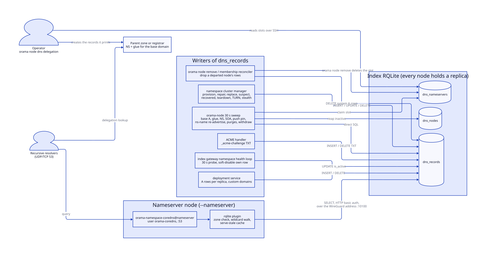
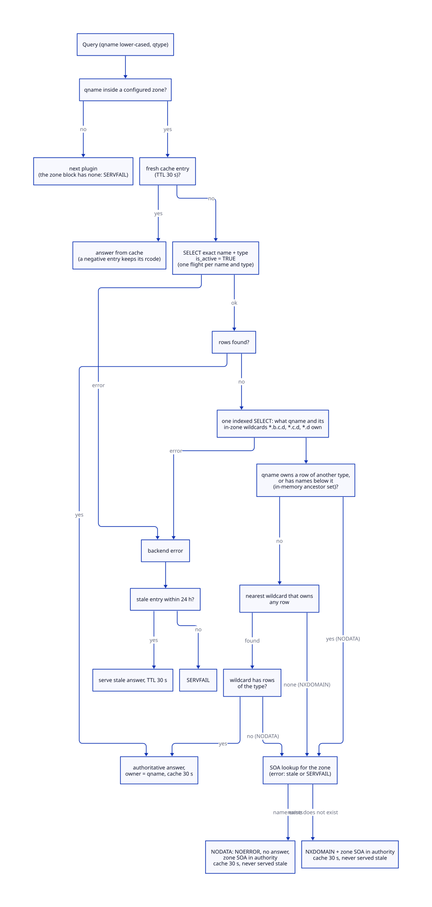
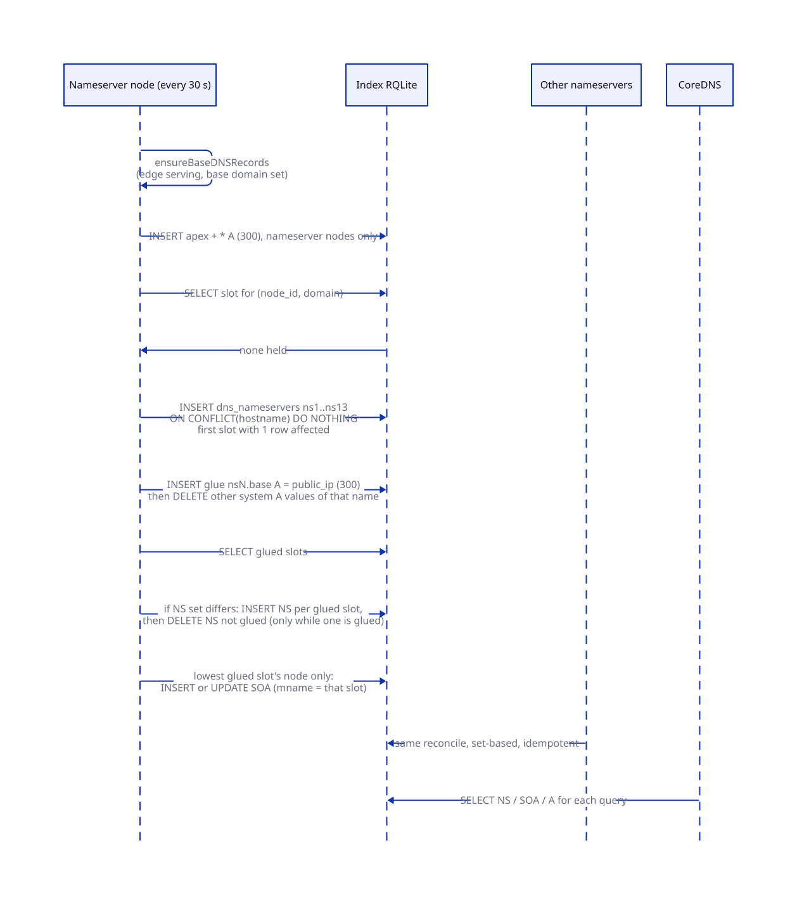
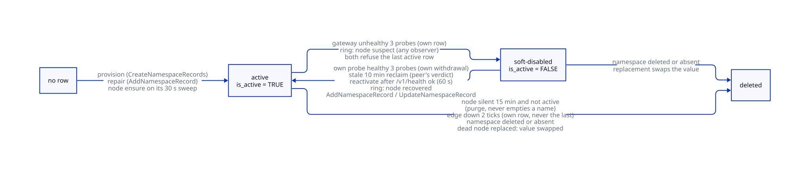
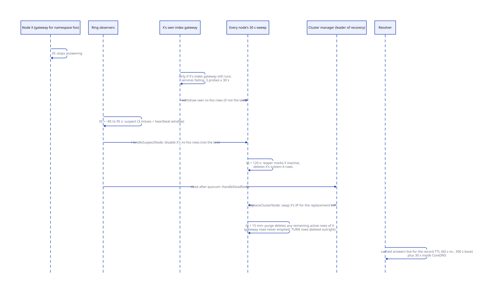

# DNS and nameservers

> **At a glance.**
>
> - **What:** a cluster answers for its own base domain. CoreDNS, built with a custom `rqlite` plugin, runs on every node installed with `--nameserver` and serves zone data straight out of the `dns_records` table in the index RQLite. Nothing is written to a zone file. Many independent code paths insert, flip or delete rows in that one table, and the plugin turns whatever it finds into authoritative answers.
> - **Key numbers:** CoreDNS 1.14.7 on port 53 (UDP and TCP) as `orama-namespace-coredns@nameserver`. Plugin cache 10,000 entries, 30 s TTL, answers served stale for up to 24 h when the backend is unreachable (stale TTL 30 s), NXDOMAIN and NODATA cached 30 s and never stale, wildcard answers stale for at most 5 min. Health ping of the backend every 5 s, query timeout 10 s. Record TTLs: 300 s for base names, glue, NS, SOA and deployments; 60 s for `ns-<name>`, TURN, stealth TURN, `push` and ACME TXT. Up to 13 nameserver slots. Node sweep every 30 s; silent 120 s means `inactive`; silent 15 min and non-active means its namespace records are purged.
> - **Code:** `core/pkg/coredns/rqlite/` (the plugin), `core/pkg/node/dns_registration.go`, `core/pkg/node/dns_nameservers.go`, `core/pkg/node/dns_withdraw.go`, `core/pkg/node/dns_orphan_purge.go` (node-side writers), `core/pkg/namespace/dns_manager.go` (cluster-manager writer), `core/pkg/gateway/namespace_health.go` (health-driven withdrawal), `core/pkg/install/installers/coredns.go` (Corefile), `core/cmd/orama/internal/production/dnsdelegation/` (delegation check).
> - **Depends on:** [the node as a supervisor](04-the-node-as-a-supervisor.md), [membership and failure detection](08-membership-and-failure-detection.md), [namespaces](09-namespaces.md), [cluster state](07-cluster-state.md).



## Why it exists

Every public name an Orama cluster hands out is a name under its base domain: the apex, `ns-<namespace>.<base>` for a tenant's gateway, `*.ns-<namespace>.<base>` for that tenant's deployments, `turn-<namespace>.<base>` for its relay, one name per app deployment. The set changes whenever a namespace is created, a node is replaced or a service fails. A hosted DNS provider would make the cluster depend on an account and an API token outside the fleet, and would turn every membership change into an API call that can fail halfway. The ACME DNS-01 challenge that issues the cluster's wildcard certificate also needs to write a TXT record into the very zone the certificate authority will query, so the authority for the zone and the certificate issuer must be the same system ([TLS and certificates](25-tls-and-certificates.md)).

So the cluster is its own authoritative DNS. The constraints that shaped the design:

- **The registry is already replicated and already holds the truth.** Which nodes are alive, which namespaces exist and which node serves each of them are rows in the index RQLite. Putting the DNS data in the same database means a record and the fact it describes can be changed in one place, and every nameserver sees the same zone without a transfer protocol.
- **Writers are many and uncoordinated.** Any node can notice that a peer is dead or that its own gateway is unhealthy. Requiring a leader for DNS edits would make DNS repair depend on the machinery that is failing. The writers are therefore idempotent statements that are safe to run on every node, and the dangerous ones (anything that removes an address) carry their own guard inside the SQL.
- **DNS is the last thing that may fail.** The names an operator needs to reach a broken fleet are in the same database that is broken. The plugin serves stale answers from memory when the registry is unreachable, so a lost Raft leader does not take the zone offline.
- **The resolver faces the internet.** It runs as its own account in a filesystem sandbox, and it is not an open recursive resolver.

## The model

**Base domain.** The one DNS name the cluster is authoritative for, for example `stagenet.example.org`. The installer writes it as the zone of the Corefile, and the plugin treats it as the only zone (`core/pkg/install/installers/coredns.go:generateCorefile`). Every other name in this chapter is a name under it.

**Nameserver node.** A node installed with `--nameserver`. It is recorded in `preferences.yaml` as `nameserver: true` (`core/pkg/node/dns_registration.go:isNameserverPreference`), runs CoreDNS, and also runs the Caddy edge. A node that has additionally claimed a slot is a nameserver node in the registry's eyes (`isNameserverNode` reads `dns_nameservers`). Only those publish the apex and wildcard records.

**Slot.** A row of `dns_nameservers`: `hostname` (`ns1` to `ns13`), the holder's peer id, its public IP and the domain. A slot is the stable identity of a nameserver. The cluster publishes one NS record per slot that has glue.

**Glue.** The A record `nsN.<base>` that gives a slot its public address. It is written by the slot's holder and is the proof that the slot may be published.

**Record, tag and owner.** A row of `dns_records` (`fqdn`, `record_type`, `value`, `ttl`, `namespace`, `deployment_id`, `node_id`, `is_active`, `created_by`). The `namespace` column is an ownership tag rather than a tenant name. The tags in use are `system`, `acme`, `namespace:<name>`, `namespace-turn:<name>`, `namespace-turn-stealth:<name>`, and the plain tenant name that deployment records carry. Every purge and withdrawal selects by tag, so a rule written for one family of records cannot touch another.

**Soft disable.** Setting `is_active = FALSE` on a row. The plugin ignores such a row, the row stays, and the purges leave it alone. It is the reversible way to take one address out of a round robin.

**Round robin.** A name with several A rows, one per node serving it. The plugin returns all active rows in the order the database returns them, with no weighting and no health knowledge of its own.

**Withdrawal.** Removing or disabling one node's address from a name, by that node, a peer or the ring monitor.

The records the zone serves, by family:

| Name | Type | Value | TTL | Tag (`namespace`) | Written by |
|---|---|---|---|---|---|
| `<base>.` | A | each nameserver node's public IP | 300 | `system` | the node (`ensureBaseDNSRecords`) |
| `*.<base>.` | A | the same IPs | 300 | `system` | the node |
| `<node-domain>.`, `*.<node-domain>.` | A | that node's public IP | 300 | `system` | the node, on every node, when `node.domain` differs from the base |
| `nsN.<base>.` | A | slot holder's public IP (glue) | 300 | `system` | the slot holder |
| `<base>.` | NS | `nsN.<base>.` for every glued slot | 300 | `system` | any node (set-based) |
| `<base>.` | SOA | primary = lowest glued slot | 300 | `system` | the holder of the lowest glued slot |
| `push.<base>.` | A | the healthy nameserver with the lowest IP in text order | 60 | `system` | any nameserver node |
| `ns-<name>.<base>.`, `*.ns-<name>.<base>.` | A | public IP of each node running the namespace's gateway | 60 | `namespace:<name>` | cluster manager and every serving node |
| `turn.ns-<name>.<base>.`, `turn-<name>.<base>.` | A | public IP of each TURN node | 60 | `namespace-turn:<name>` | cluster manager and every TURN node |
| `cdn-<hash>.<base>.` | A | the same TURN nodes | 60 | `namespace-turn-stealth:<name>` | cluster manager and every TURN node |
| `<subdomain>.<base>.` | A | public IP of the deployment's home node and replicas | 300 | the tenant name | deployment service |
| custom domain | A | the deployment's home node | 300 | empty | deployment service |
| `_acme-challenge.<host>.` | TXT | a DNS-01 token | 60 | `acme` | ACME handler |

The plugin understands six record types: A, AAAA, CNAME, TXT, NS and SOA (`core/pkg/coredns/rqlite/backend.go:parseValue`). No code writes an AAAA or CNAME row today. Everything is IPv4.

## How it works

### The resolution path

A query for the zone arrives at CoreDNS on port 53 over UDP or TCP. The server block for the base domain contains one data plugin (`rqlite`) plus `log` and `errors`, and nothing else: CoreDNS's own `cache`, `forward`, `health` and `prometheus` plugins are not enabled in it. The plugin's `ServeDNS` (`core/pkg/coredns/rqlite/plugin.go:ServeDNS`) does the following.



1. **Zone check.** `isOurZone` compares the query name with the configured zones. A name outside them is passed to the next plugin. The zone block has none, so such a query would end in SERVFAIL; in practice CoreDNS routes it to the other server block first (see below).
2. **Cache lookup.** The cache key is the lower-cased query name plus the numeric type. A fresh entry (younger than 30 s) is returned as is, with its stored response code, so a cached NXDOMAIN is replayed as NXDOMAIN, a cached NODATA as NODATA, and neither as an empty success of the wrong kind.
3. **Exact match.** The backend runs one parameterised SELECT against the index RQLite: `fqdn = ? AND record_type = ? AND is_active = TRUE` (`Backend.Query`). The query name is lower-cased and made absolute first. Rows whose value does not parse (a bad IPv4, a short SOA) are logged and skipped, never returned.
4. **What do the name and its wildcards own, and does anything live below it?** With no exact rows of the type, one more indexed SELECT reads every active row of the name and of its in-zone wildcard candidates together (`Backend.Owners`, `fqdn IN (...)`). Candidates stop at the edge of the most specific zone the name is in, so a sub-zone is never answered from its parent's wildcard. A negative answer therefore costs three queries (typed, owners, SOA) however deep the name is; an answer from the name's own rows costs one, from a wildcard two. Whether a name has names below it is answered from memory (`Backend.HasBelow`, `ancestorSet` in `names.go`), not by the database: the question is a suffix match with no index, and the query comes from the internet with any name in it, so asking the table would be an unauthenticated full scan per distinct random name. The set holds every proper ancestor of every active record's name (a `*.<name>` row makes `<name>` one), one entry per distinct ancestor: at most labels x records, in practice about one per record because siblings share parents, so tens of MB at 10x the platform's record count. It is rebuilt from `SELECT DISTINCT fqdn FROM dns_records WHERE is_active = TRUE` on every health tick (the `refresh` option; one table scan per period whatever the query rate, a failed rebuild marks the backend unhealthy), and an indexed lookup that finds a row adds that row's ancestors at once. A name that owns a row of another type, or has names below it (an empty non-terminal, RFC 8020), is answered from itself only, so a wildcard never stands in for it (RFC 4592) and the answer is NODATA (step 7). The answer lags the table by at most one refresh period: a name whose only descendants are new, and which this node has not itself served, is NXDOMAIN until the next tick; one whose descendants are all gone stays NODATA until then. Empty non-terminals are rare (the platform's names are owned or wildcard-covered), so that lag is acceptable.
5. **Wildcard walk.** A name that owns nothing and has nothing below it drops one label at a time: for `a.b.c.d.` the candidates are `*.b.c.d.`, then `*.c.d.`, then `*.d.` (`wildcardCandidates`), and the walk stops once a candidate falls outside the configured zone. Taken nearest first, a candidate with rows of the type is the answer; one with rows of another type ends the walk with NODATA (the nearest wildcard that owns any row decides, a farther one is not consulted). This is how `turn.ns-anchat.<base>`, which sits two labels below the base, finds the `*.ns-anchat.<base>` rows, and how an unknown name falls through to `*.<base>`, the nameserver nodes. The answer is always owned by the original query name, never the wildcard. An earlier version built a single `*.label.label` candidate and dropped the TLD for longer names, which made every per-namespace sub-name unresolvable; the e2e test `TestZone_wildcardWalksOutward` pins depths 2, 3 and 6.
6. **Answer.** Rows become resource records with the stored TTL. The message is authoritative and goes into the cache for 30 s.
7. **No rows.** The plugin answers with the zone's own SOA in the authority section, read from `dns_records` (`zoneSOA`): owner the apex, TTL the lesser of the row's TTL and the SOA minimum field, as RFC 2308 asks. The rcode depends on whether the name exists (`handleNegative`): NOERROR with an empty answer (NODATA) when it owns a row of another type, has names below it, is the apex, or the nearest wildcard covers it, NXDOMAIN when nothing does. The two are not interchangeable: a resolver that gets NXDOMAIN for a name's AAAA concludes the name does not exist and caches that for every type (RFC 8020), so the next A lookup of a name that is being served fails with "no such host"; the plugin did exactly that until it learned NODATA, and `TestZone_missingTypeIsNoDataNotNXDOMAIN` pins the fix. The base zone carries `*.<base>`, so a name under it that nothing else owns exists and a type the wildcard lacks is NODATA there. The negative answer is cached for 30 s (`NegativeTTL`) with its own rcode and is never served stale. A zone with no SOA row is a SERVFAIL with the message "a nameserver writes it once it holds a glued slot": the plugin used to invent an SOA naming `ns1`, which named a primary that might not exist.
8. **Backend error.** Any error from the SELECT, in the exact match, the owners read or the SOA read, goes to `serveStaleOrFail`. A failed owners read is therefore a stale answer or SERVFAIL, never a guessed NXDOMAIN. A reply with no `results` at all (the database did not run the statement) is an error too, not an empty answer. Concurrent identical misses share one resolution (`singleflight` on name and type). The log line for a failure is written at most once per `BackendErrorLogInterval` (10 s) with a count of the lines it suppressed, so an outage does not write a line per query.

### The cache and serve-stale

`core/pkg/coredns/rqlite/cache.go:Cache` is an in-process map with a mutex. Each entry carries two deadlines: `expiresAt` (fresh until, 30 s after insertion, the `ttl` option) and `staleUntil` (usable until, `StaleWindow` = 24 h after insertion). Only a fresh entry is served on the normal path. After a backend error the plugin looks for an entry that is expired but within `staleUntil`, rewrites every answer TTL to `StaleTTL` = 30 s, marks the reply authoritative, and logs a warning that names the cause. A resolver that receives it comes back after 30 s and gets the real answer as soon as the backend recovers.

Three rules keep this from hiding real changes:

- **Stale is for failures only.** `GetStale` is called after the backend has failed; a successful query always wins, so a changed record is never hidden by an old entry.
- **A negative answer is never stale.** `SetNegative` sets `staleUntil = expiresAt`. "This name does not exist" is the answer most likely to be wrong soon (a namespace being provisioned), and serving it for a day would keep a new record invisible.
- **Eviction removes what is closest to unusable, in constant time.** Entries sit in one queue per class (own answers, wildcard answers, negative answers), each ordered by `staleUntil` because every entry of a class has the same window; at 10,000 entries `evictOldest` takes the oldest of the three queue fronts. Negative entries (30 s) go first, then wildcard answers (`WildcardStaleWindow`, 5 min), then own answers (24 h), so a flood of random names, which resolve through a wildcard and would fill the cache with answers of their own, cannot displace the entries for names that exist. The price is that a wildcard-covered name such as `turn.ns-<name>.<base>` survives a database outage for minutes, not a day. A background goroutine deletes unusable entries every minute.

The negative cache exists for amplification control: a flood of random subdomains would otherwise turn every query into a round trip to the index RQLite.

### The backend

`core/pkg/coredns/rqlite/client.go:RQLiteClient` posts the query to `<dsn>/db/query` as JSON with HTTP basic auth, over a transport with 10 idle connections and a 10 s request timeout. The DSN is the index RQLite on this node's WireGuard address, port 10100, written by the installer from `discovery.http_adv_address` in `node.yaml` ([the node as a supervisor](04-the-node-as-a-supervisor.md#starting-the-index-rqlite)). The request carries no `level` parameter, so rqlite applies its default, `weak`, which a follower forwards to the leader (`core/pkg/rqlite/adapter.go:adapterReadConsistencyLevel` documents the behaviour). Every cache miss on every nameserver is therefore a leader read, and it fails when there is no leader. `rqlited` binds only the overlay address and always requires auth, so the Corefile carries a username and the cluster-wide password. The plugin refuses to load without `dsn`.

`NewBackend` pings with `SELECT 1` (5 s timeout) and reads the names the zone holds (the ancestor set) before the plugin is registered. If either fails, plugin setup fails and CoreDNS exits; systemd restarts it every 5 s without a start limit. After startup a goroutine pings every `refresh` (5 s in the generated Corefile) and flips a `healthy` flag that `Ready()` reports. `Query` does not consult the flag: every cache miss attempts the SELECT, and fails after at most 10 s when the backend hangs. The refresh option controls that ping and the rebuild of the ancestor set that follows it (step 4); nothing else is refreshed on a timer.

### The Corefile and the unit

The installer writes `/etc/coredns/Corefile` during `Phase4GenerateConfigs`, which runs on both install and upgrade, so every upgrade regenerates it. It has two server blocks:

```text
<base> {
    rqlite {
        dsn http://<wg-ip>:10100
        refresh 5s
        ttl 30
        cache_size 10000
        username orama
        password <cluster rqlite password>
    }
    log
    errors
}

. {
    acl { allow net 127.0.0.0/8 ::1/128 ; block }
    forward . 8.8.8.8 8.8.4.4 1.1.1.1
    cache 300
    errors
}
```

The second block gives the node's own processes (apt, Caddy's ACME propagation check, the gateway) recursion. It shares the single listener on purpose: a socket bound to `127.0.0.1:53` takes every packet addressed to loopback, which sent the node's own zone out to a public resolver and made the DNS-01 propagation check see stale or negative answers until it timed out. With one listener, a name in the zone matches the authoritative block and everything else reaches the `acl`, which refuses non-loopback clients. The node is not an open resolver; `TestZone_notAnOpenResolver` and `TestZone_localRecursionStillWorks` cover both sides. The comment in the Corefile warns against adding CoreDNS's own `cache` to the zone block: it would cache NXDOMAIN and break ACME DNS-01.

The unit `core/systemd/orama-namespace-coredns@.service` runs `/usr/local/bin/coredns -conf /etc/coredns/Corefile` with `Restart=always`, `RestartSec=5s`, `StartLimitIntervalSec=0`, `MemoryMax=1G`, `LimitNOFILE=65536`, and `CAP_NET_BIND_SERVICE` as the only capability. Its isolation is described under Trust and security. It is started by `orama-node`, not by a person: the `nameserver` component calls `EnsureCoreDNS` once `rqlite-local` is up ([the node as a supervisor](04-the-node-as-a-supervisor.md#the-boot-graph)), after checking that the binary and the Corefile exist, and stops and disables a leftover legacy `coredns.service` first. The nameserver blueprint in `core/pkg/namespace/blueprint.go:BlueprintNameserver` describes CoreDNS on fixed port 53 but is declarative; no production code walks it ([namespaces](09-namespaces.md#blueprints)).

### The build

CoreDNS is not installed from a package. `orama maint build` clones `coredns/coredns` at the tag `v` plus `constants.CoreDNSVersion` (1.14.7), copies the `.go` files of `core/pkg/coredns/rqlite/` (not its `_test.go` files, whose SQLite driver the CoreDNS tree must not resolve) into the clone's `plugin/rqlite/`, refuses the checkout unless its HEAD is the pinned `constants.CoreDNSCommit`, writes a `plugin.cfg` that lists the standard plugins with `rqlite:rqlite` last, runs `go mod tidy` (which only completes the `go.sum` for the plugin's imports; CoreDNS already requires the `miekg/dns` and `go.uber.org/zap` versions the plugin uses), `go generate`, and cross-compiles a static binary (`CGO_ENABLED=0`, `-trimpath`) for the target architecture (`core/cmd/orama/internal/build/coredns.go:buildCoreDNS`). The binary ships in the release archive to `/usr/local/bin/coredns` ([build, signing and release](29-build-signing-and-release.md)). A node that is not a nameserver carries the binary and a Corefile but never starts the unit. On a nameserver the install switches off systemd-resolved's stub listener so port 53 is free, replaces `/etc/resolv.conf` with `nameserver 127.0.0.1` and `nameserver 8.8.8.8` so the node resolves through its own CoreDNS and the second block's forwarder (`core/pkg/install/prebuilt.go:freeResolverPort`, `core/pkg/install/installers/coredns.go:DisableResolvedStubListener`); every node also loses systemd-resolved's LLMNR and mDNS listeners. The Corefile is written on every node, nameserver or not.

### The writers

Every path that changes `dns_records` is listed here with what it writes, when, and what protects it. The node-side writers run on every node each 30 s tick of the heartbeat described in [the DNS heartbeat](04-the-node-as-a-supervisor.md#the-dns-heartbeat); this chapter adds the record-level semantics.

#### Base records and the edge promise

`ensureBaseDNSRecords` runs only while the node's edge serves (Caddy, and the SNI router when enabled, are active). Nameserver nodes insert the apex and `*.<base>` A rows with their own public IP; every node inserts the per-node domain and its wildcard when `node.domain` differs from the base. The insert is `ON CONFLICT(fqdn, record_type, value) DO NOTHING`, so it only ever adds this node's own address. The public IP is `node.public_ip` from `node.yaml`, validated, and the node refuses to publish anything without it. A private address in a system or deployment A row is deleted on every tick by `cleanupPrivateIPRecords` (10/8, 172.16/12, 192.168/16, 127.0.0.1), a self-heal for old releases that wrote WireGuard addresses.

The apex and wildcard are written only after the node holds a slot, and the slot is claimed later in the same call, so a new nameserver's glue, NS and SOA appear on its first sweep and its apex and wildcard rows on the second.

When the edge check fails two ticks in a row (`edgeDownTicks`), `withdrawFromDNS` deletes the node's own system A rows for the base names and from every `ns-<name>` and `*.ns-<name>` round robin, each statement guarded by `EXISTS (another active row for the same name)` so it can never empty a name (`core/pkg/node/dns_withdraw.go`). Glue, NS, SOA and TURN rows stay: TURN does not pass through Caddy. The next tick that finds the edge up re-adds everything. One failed check is a Caddy restart, not an outage. Slot claims, the NS and SOA reconcile, the push pin and the namespace re-advertise all live inside the advertise step, so a node whose edge is down stops running them until the edge returns; the purges and the reaper still run.

#### Nameserver slots, glue, NS and SOA



`claimNameserverSlot` (`core/pkg/node/dns_nameservers.go`) gives a nameserver node the slot it already holds, else the lowest free one. It inserts `ns1`, then `ns2`, up to `maxNameserverSlots` = 13, each with `ON CONFLICT(hostname) DO NOTHING`, and takes the first insert that affects a row. The primary key on `hostname` is what makes concurrent claimants safe: Raft serialises the inserts and exactly one wins each slot. Thirteen is the number of NS records with glue that still fit a classic 512-byte referral, which is also what limits the number of root servers. If all 13 are held the claim fails with a message that names `orama node remove` as the way to free one.

Having a slot, the node writes glue: `INSERT ... ON CONFLICT DO UPDATE` for `nsN.<base>` with its IP, then deletes any other system A value of that name. The order matters: a slot without glue drops out of the NS set, so the new address is written before the old one is pruned. A held slot is refreshed only when its stored address or its glue differs from the node's current address, so the steady state writes nothing.

`reconcileNameserverRecords` then derives the apex from the slots. Every node runs it every sweep:

- **NS.** The wanted set is the `nsN.<base>.` of every slot whose glue row exists, is active and equals the slot's address (`slotGluedSQL`). The node reads the current NS rows and the wanted set, and writes only when they differ: it inserts the missing names, then deletes the others. The delete is conditional on at least one glued slot existing. When every nameserver has missed its heartbeat at once and no slot is glued, the last known NS set stays, because a zone with no NS records serves nothing.
- **SOA.** Only the node that holds the lowest glued slot rewrites the SOA, because the serial is the writer's Unix time and two writers would leave two rows. The value is `nsK.<base>. admin.<base>. <unix time> 3600 1800 604800 300`: refresh 1 h, retry 30 min, expire 7 days, minimum 300 s. `ensureSOA` changes the row in place and collapses duplicates; it never deletes and re-inserts, because the zone would have no SOA in between. When the primary is unchanged it writes nothing.

A slot is not released by a missed heartbeat. The reaper below marks a silent node inactive and drops its base A rows but leaves its slot and glue, because freeing the slot drops the glue and the zone's delegation with it. The slot goes when the operator runs `orama node remove`, whose retirement plan marks the node inactive, deletes its system A rows (which includes its glue, since glue is a system A row at the node's IP), and deletes its `dns_nameservers` row; the next sweep's NS reconcile then drops the NS record (`core/cmd/orama/internal/production/clusterops/retire.go:RetirementPlan`).

#### The push pin

`pinPushDesignated` makes `push.<base>` resolve to exactly one healthy nameserver: the first public IP among slots whose node has an active `dns_nodes` row seen in the last 90 s, ordered as text (`ORDER BY ip_address`, so `100.x` sorts before `20.x`). Every nameserver node computes the same value without an election, upserts the row (TTL 60) and deletes every other A row for the name, which is also the failover step. The shared ntfy tier keeps no cross-node state, so a publisher and a subscriber must meet on one instance ([push notifications](22-push-notifications.md)). With no healthy nameserver the pin does nothing and the base wildcard serves the name.

#### Node identification names

When `dns.node_names_zone` is set in `node.yaml`, every node of the cluster that answers the zone runs `nodenames.Syncer` (`core/pkg/nodenames/sync.go`, started from `startDNSRegistration` by `startNodeNamesSync`, `core/pkg/node/dns_node_names.go`). The zone is a dedicated sub-zone strictly below `http_gateway.base_domain` (`ValidateDNS`, `core/pkg/config/validate/dns.go`, stops the node at start otherwise): a claimed name is untrusted input, and under the base domain it would sit next to the hostnames the cluster publishes (`push`, `ns-<namespace>`, a node's name). Once every `SyncInterval` (60 s) the syncer asks the co-located chain node whether it is catching up, pages the chain's `orama.nodes.v1.Query/NodeNames` through that node's RPC (1,000 names a page, resumed by the previous page's key), builds the records the zone must hold, and reconciles them against the rows tagged `namespace = 'node-names'`: a name is one `A` or `AAAA` row per literal public IP of the named node, TTL 300, and nothing else (no NS, no glue).

The statements are keyed on (fqdn, type, value): an insert is `ON CONFLICT DO NOTHING`, a reactivation and a delete name the tag, and several nodes writing the same difference leave the same rows. Adds and reactivations run before deletes, so a name whose node moved is never empty. Four rules keep chain-controlled data from damaging the zone. Nothing is written unless the whole list was read: a page key that repeats, a list over `MaxPages` (1,000 pages) or a failed page leaves the zone as it was. Nothing is removed while the chain node reports `catching_up` or its `latest_block_time` is more than `MaxBlockAge` (five minutes) old, and one pass removes at most `MaxRemovalsNumerator/MaxRemovalsDenominator` (a quarter) of the rows the syncer owns, or `MinRemovalsPerPass` (50) of a small zone, so a stale or truncated read costs a minute and the next correct read restores it. A name is refused when its fqdn already has a row of another owner (`selectForeignSQL`), when its label is malformed, is one of the chain's reserved names (mirrored in `reserved.go`, with a test that reads the chain's source), or is a nameserver or seed label, and an address in a private or reserved range (`netguard.Reserved`) is refused; each is logged once. One pass writes at most `MaxWritesPerPass` (2,000) rows, in transactions of `BatchSize` (100) through `rqlite.ExecBatch`, one request each; a database-rejected row is reported and its batch is sent again without it. The next pass starts a second later when rows or time ran out (`nextWait`), a whole interval later otherwise. `is_active` is read by `truthy`, because the rqlite driver returns a JSON number and SQLite's returns a bool.

#### Namespace records

A namespace has three families of records, all with TTL 60.

**Gateway host.** `ns-<name>.<base>.` and `*.ns-<name>.<base>.` carry one A row per node running a gateway for the namespace. Provisioning writes them (`CreateNamespaceRecords`, called from `createDNSRecords`) with additive upserts, one pair per gateway node; a bare delete-and-insert of the whole name once raced the per-node ensure and wiped a round robin another node had just refilled. The upsert re-enables a soft-disabled row, because "advertise this node" is an explicit decision. Provisioning is described in [namespaces](09-namespaces.md#dns).

**TURN.** When WebRTC is enabled, `CreateTURNRecords` makes `turn.ns-<name>.<base>.` (plain UDP and TCP TURN) and `turn-<name>.<base>.` (TURNS) exactly the set of confirmed TURN node IPs: it deletes tagged rows whose value is not in the set and inserts missing ones, so a run beside the per-node reconciler converges. The TURNS host is a single label below the base on purpose, so the wildcard certificate covers it; the two-label legacy host cannot get a certificate a browser accepts.

**Stealth TURN.** `CreateStealthTURNRecords` publishes `cdn-<hash>.<base>.`, where the hash is 6 bytes of SHA-256 of the namespace name in hex (`core/pkg/turn/stealth.go:StealthHostForNamespace`), so the TLS server name never identifies the application ([SNI routing and stealth TURN](26-sni-routing-and-stealth-turn.md)). Before writing, it refuses when any row for that name belongs to another tag, so a second namespace cannot attach addresses to the first one's stealth identity.

The per-node counterparts are what make the rest of the lifecycle safe, and they are additive and self-limiting:

- `ensureNamespaceHostRecords` (node sweep, after the heartbeat) inserts this node's own `ns-` and `*.ns-` rows for every namespace in which it is a running gateway member, in one statement per prefix. The statement skips clusters in `failed` or `deprovisioning` and namespaces absent from `namespaces`. It never forces `is_active`, so a row that was soft-disabled stays disabled.
- `EnsureNamespaceHostRecordActiveForNode` (cluster manager, every 60 s on each node) is the explicit reverse: once the node's own tenant gateway answers `GET /v1/health` on its WireGuard address, it re-enables that node's own row. A node asserting a fact about itself with positive evidence may override a disable that was based on an earlier suspicion.
- `EnsureTURNRecordForNode` (cluster manager, per TURN node) adds this node's TURN and stealth rows, reading before writing: in rqlite an insert that adds zero rows is still a replicated, fsync'd Raft entry, and this runs per node per namespace every 60 s.
- `retractForeignTURNRecords` (node sweep) deletes this node's own TURN rows for namespaces in which `webrtc_port_allocations` gives it no TURN role. The value is the node's own IP, so a node can retract only itself.

Teardown removes all three families by tag after deleting the cluster's membership rows (`removeClusterServingRecords`). Membership goes first because every node's sweep re-advertises itself for each cluster it is a running member of; deleting the rows first leaves nothing to re-add.

#### Deployment and ACME rows

The deployment service writes one A row (TTL 300) per replica node's public IP under `<subdomain>.<base>.`, tagged with the tenant name and the deployment id, via an upsert that also reactivates the row ([app deployments](11-app-deployments.md)). Deleting a deployment or a namespace deletes by `deployment_id`. A verified custom domain gets an A row for the customer's own name pointing at the home node; CoreDNS answers only for its configured zone, so that row is never served unless the custom domain is inside the zone, which the domain handler refuses.

The index gateway's ACME handlers insert and delete TXT rows with TTL 60 under the tag `acme` for `_acme-challenge` names inside the zone, and only after a MAC over the request verifies ([TLS and certificates](25-tls-and-certificates.md)). Because each row is unique on (name, type, value), concurrent challenges from several nodes coexist, and cleanup deletes only the caller's own value.

### Health-driven withdrawal and recovery

Three independent mechanisms turn a node's failure into a DNS change, and they overlap on purpose. The owner's probe and the ring monitor soft-disable a gateway row and refuse to disable the last active row of a name. The reaper and purges delete, and only the gateway-host purge keeps the last row (the edge promise above deletes too, with the same guard).

**The owner's own probe.** The index gateway on each node runs `startNamespaceHealthLoop`: after a 5 s start-up delay and then every 30 s it probes each namespace the node hosts, reading the node's rows in `namespace_port_allocations` for clusters in `ready` or `degraded` status. RQLite and Olric are checked by a 2 s TCP dial to the WireGuard address; the gateway by `GET /v1/health` on the same address with a 2 s timeout, because a tenant gateway does not listen on loopback and a TCP dial cannot tell a gateway that is up from one that has not loaded its schema. A 200 is `ok`. A 503 whose body says `starting` (waiting for its schema) is `starting`; `blocked` (schema below what the binary needs) is `error`. The other 503 states, `degraded` and `unhealthy`, count as `ok`: they describe a subsystem such as IPFS or the cache, and withdrawing a node for that would turn one unavailable subsystem into an unavailable node. `aggregateNamespaceStatus` calls the namespace `unhealthy` if any service is in error, else `starting` if any is starting, else `healthy`. The same loop also runs, every 5 minutes on the RQLite leader only, a repair check for under-provisioned namespaces ([reconciliation and recovery](10-reconciliation-and-recovery.md)).

`reconcileLocalNamespaceDNS` counts consecutive probes per namespace. After 3 non-healthy probes (`unhealthyProbesBeforeDNSWithdraw`, about 90 s) it runs `withdrawNamespaceHostRecordSQL` on this node's own two rows, whose `WHERE` clause includes `(SELECT COUNT(*) ... is_active = 1) > 1`. The count and the write are one statement because every node probes independently; two nodes each reading a count of 2 and then each disabling would leave the namespace with no answer. The fqdn is remembered in `selfDisabled`. After 3 healthy probes (`healthyProbesBeforeDNSReclaim`) a row this process withdrew is re-enabled immediately. A row that someone else disabled is reclaimed only after it has sat untouched for `staleDisableReclaimAfter` = 10 min, so a ring monitor that still holds the node as suspect, and keeps rewriting `updated_at`, is not overridden.

**The ring monitor.** When a node becomes suspect to the ring ([membership and failure detection](08-membership-and-failure-detection.md#what-each-verdict-does)), the observer calls `HandleSuspectNode`, which disables that node's `ns-` and `*.ns-` rows for every cluster it belongs to, using the same guarded UPDATE (`DisableNamespaceRecord`, one statement per name, each guarded on its own count). A `recovered` verdict calls `EnableNamespaceRecord`. A `dead` verdict leads to `ReplaceClusterNode`, which swaps the dead node's IP for the replacement's with `UpdateNamespaceRecord`; if the old row is already gone, the update falls back to an additive insert so the replacement is advertised either way. A repair that adds a node to an under-provisioned cluster calls `AddNamespaceRecord` ([reconciliation and recovery](10-reconciliation-and-recovery.md#dead-node-handledeadnode-and-replaceclusternode)).

**The node reaper and the purges.** The maintenance part of each sweep ([the DNS heartbeat](04-the-node-as-a-supervisor.md#the-dns-heartbeat)) is the slowest and the broadest net:

- `reapInactiveNodeDNS` marks nodes whose `last_seen` is older than 120 s `inactive` and deletes their A rows at the base names (`namespace = 'system'`, matched by value). It does not touch glue, NS or `push`.
- `purgeInactiveNodeRecords` runs three statements. The TURN purge deletes TURN and stealth rows whose value is the IP of a node that is non-active and silent since a cutoff 15 minutes ago (`purgeStaleAfter`); the cutoff is computed in Go and bound as a parameter, because rqlite replicates the statement and a clock function in a predicate could match different rows on different replicas. The namespace-host purge does the same for active `namespace:` rows but only while another active row remains for the same name whose address is not itself purgeable. The orphan purge deletes every per-namespace row whose namespace is not in `namespaces`.
- An IP still held by an active node is never purged (`NOT IN` over active nodes' addresses), so a reused address keeps its rows. The inner select filters empty and null addresses explicitly: one NULL in a `NOT IN` list would turn the whole predicate into NULL and disable the purge.

The two purges differ in whether they may empty a name, and the reason is recoverability. A TURN name left empty is not NXDOMAIN, because the wildcard walk finds `*.ns-<name>.<base>` for `turn.ns-<name>` and `*.<base>` for `turn-<name>` and `cdn-<hash>`, so it resolves to gateway or nameserver nodes that run no TURN. The code comment argues that a relay that resolves nowhere is no worse than a dead address; with the wildcards the failure is a timeout either way. What makes the unguarded purge acceptable is that each live TURN node re-adds itself within a minute. An emptied gateway host is worse: `ns-<name>` would not return NXDOMAIN but fall through to the base wildcard, to the nameserver nodes, which may not host that namespace. Clients would connect, pass TLS on the wildcard certificate, and reach the wrong backend, which is harder to diagnose than an outage. So the guard keeps a sole record that points at a departed node.



### Delegation

The parent zone must delegate the base domain to the cluster, or nothing above works. Which address holds `ns1` is decided at run time by whichever node claimed it first, so the operator cannot know in advance. `orama node dns delegation --env <env>` reads the slots from the registry over SSH on the environment's first node, using the query in `dnsdelegation.Query` (slots whose glue exists and matches), validates each row (an `nsN` hostname, a public IPv4, a DNS name) because the output is typed into a registrar, and prints the NS records and glue in zone-file form. It then asks the system resolver whether the parent zone returns them and reports each missing NS, missing glue or glue that points at a different address as a finding (`missing-ns`, `missing-glue`, `wrong-glue`). The verdict and findings are stored per domain in the environment's `environments.json`. A resolver failure (timeout, SERVFAIL) is reported as unverified and stores nothing. With `--cloudflare-token-file` it creates or updates the NS and glue records in the parent zone at Cloudflare first. For a whole registered domain the records live at the registry; for a subdomain they are ordinary records in the parent zone, which is the only option with a registrar that does not allow custom nameservers.

Delegation comes before certificates. The genesis node's certificate is issued by DNS-01, and the certificate authority finds the cluster's CoreDNS through the delegation, so Caddy retries until the operator has created the records. The order of install steps is in [install and upgrade](30-install-and-upgrade.md).

## State it owns

| What | Where | Written by | Read by |
|---|---|---|---|
| `dns_records` | index RQLite, migrations `005` and `009` (unique on fqdn, type, value) | every writer in this chapter | the plugin, the delegation query, the node sweeps |
| Node-name rows in `dns_records` | the same table, tagged `namespace = 'node-names'` | `nodenames.Syncer` on every node of the cluster that sets `dns.node_names_zone` | the plugin |
| `dns_nameservers` | index RQLite, migration `011` (primary key `hostname`, unique on node and domain) | `claimNameserverSlot`, `orama node remove` | the node (NS and SOA reconcile, push pin), the CLI |
| `dns_nodes` | index RQLite | the index gateway on the node's signed request, the reaper | liveness predicates of every purge, the push pin |
| Plugin cache | CoreDNS process memory, 10,000 entries | the plugin | the plugin; lost on restart |
| Backend `healthy` flag | CoreDNS process memory | the 5 s ping | `Ready()` only |
| `selfDisabled`, `healthyStreak`, `unhealthyStreak` | index gateway memory | `reconcileLocalNamespaceDNS` | the same; reset on restart |
| `/etc/coredns/Corefile` | each node, `root:orama-coredns`, mode 0640 | the installer on install and upgrade | CoreDNS at start |
| `preferences.yaml` (`nameserver: true`) | each node | the installer | `isNameserverPreference`, `startNameserver` |
| Delegation result per domain | operator's `environments.json` | `orama node dns delegation` | the operator |
| Port 53 TCP and UDP | nameserver nodes only | `ufw allow 53` in the firewall rules when `IsNameserver` | the internet |

Nothing about DNS lives on disk besides the Corefile; the zone is the table.

## Lifecycle

**Install.** `orama maint node install --nameserver` (or `orama node setup --role nameserver`) disables the systemd-resolved stub listener, writes the Corefile with the base domain as the zone, records `nameserver: true` and opens port 53. Install writes no zone records. Thirty seconds after `orama-node` registers, the first sweep claims a slot, writes glue, NS and SOA; the operator then runs the delegation command.

**Normal operation.** Every 30 s each node runs the heartbeat, the advertisement of its own records while its edge serves, and the maintenance purges. Every 30 s the index gateway probes the namespaces it hosts. Every 60 s the cluster manager re-asserts the node's active gateway and TURN rows. CoreDNS answers from a 30-second cache and reads the registry on a miss.

**Namespace created or deleted.** Creation writes the gateway pair per gateway node; WebRTC enable adds TURN and stealth rows; deletion removes membership first and then the rows by tag. A row leaked by a failed provision is removed by the orphan purge on the next sweep.

**Node added.** The new node registers, and from its first sweep appears in the base round robin (nameserver nodes) and in each namespace round robin it serves. A new nameserver gets the lowest free slot; the operator must re-run the delegation command and add the new records to the parent zone.

**Restart of one node.** The node stops heartbeating. For about a minute and a half nothing changes in DNS. If the node is back inside that window, observers write no suspect verdict. After that the ring disables its namespace rows (never the last), and the reaper at 120 s drops its base rows. On return, `ensureBaseDNSRecords` re-adds the base rows on the first tick whose edge check passes. The namespace rows come back by whichever path fires first: the reactivation after the tenant gateway answers `/v1/health` (up to 60 s, and only after the gateway has loaded its schema), `HandleSuspectRecovery` on the ring's recovered verdict, or the owner's restore after 3 healthy probes. The owner's restore remembers only what its own process withdrew, which a restart forgets, so after a restart the other two paths and the 10-minute stale reclaim are what bring the row back. For several minutes a restarted node can be serving traffic and absent from DNS.

**Rolling upgrade (mixed versions).** The writers are SQL statements with no versioned wire format between nodes. An old node's sweep and a new node's sweep may both run; the statements are idempotent and set-based, so they converge on the same rows. The orphan purge was added after the others and is described in its own comment as safe to leave to new nodes: old nodes simply do not run it. CoreDNS is restarted with the node, so its cache is empty after a restart and a restart during an index outage has nothing to serve stale.

**Node loss.** See the timeline below.



## Failure modes

| Trigger | What the system does | What you observe |
|---|---|---|
| Index RQLite has no leader | The plugin's SELECT fails; answers come from the stale cache for up to 24 h at TTL 30. Names never queried before the outage, and NXDOMAIN, get SERVFAIL. | Warning "Backend unreachable; serving a stale answer" in the CoreDNS journal; SERVFAIL for names not in cache |
| Index RQLite unreachable when CoreDNS starts | Plugin setup fails on the first ping; CoreDNS exits and systemd restarts it every 5 s until RQLite answers | Unit restarts; the inspector's `dns.coredns_restarts` check; no DNS from that node, other nameservers unaffected |
| Index RQLite hangs instead of refusing | Each cache miss waits up to 10 s, then falls to stale or SERVFAIL | Slow answers from that node; resolvers retry another nameserver |
| Caddy stops on a node | After 2 ticks (about 60 s) the node removes its base and `ns-` rows, keeps heartbeating, keeps glue and NS; the next tick with the edge up re-adds them | Log line "kept out of DNS until it does"; resolvers that cached the address keep it for 300 s (base) or 60 s (`ns-`) |
| A node's tenant gateway crash-loops | After 3 failed probes (about 90 s) the node soft-disables its own `ns-` rows, unless they are the last | Log "Withdrew this node from a namespace DNS round-robin"; rows with `is_active = 0` |
| All nodes of a namespace unhealthy | Every node's guard refuses to disable the last active row; the name keeps answering | Log "Namespace is unhealthy on this node but its record is the last one advertised; keeping it" |
| Node silent for 120 s | Reaper marks it `inactive`, drops its base A rows; slot, glue and NS stay | Zone still lists its `nsN` and NS; `orama node dns delegation` still prints it |
| Node silent over 15 min, non-active | Purges delete its active namespace rows if another live row remains; TURN rows unconditionally. Until then its TURN rows stay (the ring disables only gateway rows) | Rows disappear; a sole remaining row for a departed node stays; relay clients can resolve a dead TURN address for up to 15 minutes plus the 60 s TTL |
| Node removed with `orama node remove` | System rows and glue deleted, slot freed, NS dropped on the next sweep | Delegation output shrinks; the parent zone must be edited by hand |
| All 13 slots held | The 14th nameserver's claim fails with a message naming `orama node remove`; it serves CoreDNS but never gets NS or glue | Warning each sweep from `ensureBaseDNSRecords` |
| `node.public_ip` missing or invalid | The node refuses to register or publish any record | Error naming the file and `orama node upgrade --public-ip` |
| Two writers race on one name | Unique key and in-statement guards: one wins, the other is a no-op; a plain insert collision is the loser's error | Nothing, or one logged error from the losing writer |
| Random-subdomain flood | Wildcard-matched names each take a cache slot; NXDOMAIN and NODATA names are cached 30 s; misses reach the RQLite | CoreDNS query log volume; index RQLite read load |
| Clock skew between nodes | The 15-minute cutoff is bound from the purging node's clock; `last_seen` is written by the registry clock | A skewed purger could purge early or late by the skew |
| Zone has no SOA (no slot glued yet) | NXDOMAIN becomes SERVFAIL with an explanatory log | Resolvers see SERVFAIL for missing names until a nameserver publishes |

## Trust and security

**What is public.** Everything in the zone is public by definition. A record is an address that is already reachable. The zone is not a secret store, and nothing tenant-private goes in it except the existence and hashed-name pattern of stealth hosts.

**The resolver process.** CoreDNS is an internet-facing parser of attacker-controlled packets that also holds the password of the cluster's registry. The install gives it its own account, `orama-coredns` (the unit template says `orama` and install rewrites it), because it needs only one file. `/opt/orama` is an empty read-only tmpfs inside its mount namespace (`TemporaryFileSystem=/opt/orama:ro`), so a compromised resolver sees no secret, config or tenant file there whatever their modes. It also runs with `ProtectSystem=strict`, `ProtectHome`, `NoNewPrivileges`, `PrivateDevices`, `RestrictNamespaces`, `ProtectProc=invisible`, a one-capability bounding set and `MemoryMax=1G` ([privilege and filesystem trust](05-privilege-and-filesystem-trust.md)). The Corefile is `root:orama-coredns` 0640. Its content is the catch: the password is the single `orama` user of the index RQLite, whose auth file grants `all`. A compromise of CoreDNS therefore yields full read and write on the registry, not read-only access to one table (see Known gaps). The password travels over HTTP, but to the node's own overlay address.

**Who can write the zone.** Whoever holds the index RQLite credential: every node's `orama-node`, the gateways, and an operator's SSH. The node-side sweeps write with that shared credential, not with a per-request signature; only the `dns_nodes` row goes through the signed node API ([the node as a supervisor](04-the-node-as-a-supervisor.md#recording-the-node-in-the-registry)). A compromised member can therefore redirect any name in the zone, including `ns-<name>` and the apex, to its own address; with the wildcard certificate private key that is a full man in the middle, and certificate issuance is a separate boundary ([TLS and certificates](25-tls-and-certificates.md)). Tenants cannot write the zone: the platform tables are denied to tenant SQL (`core/pkg/sqlguard/sqlguard.go` lists `dns_records`, `dns_nodes` and `dns_nameservers`), and a tenant's own RQLite is not the index.

**ACME writes.** The two ACME endpoints accept only a body-covering MAC under a key derived for that purpose, and write only `_acme-challenge` TXT rows inside the zone with valid host labels (`core/pkg/gateway/acme_auth.go:acmeChallengeFQDN`). A caller cannot use them to plant an A record.

**Positions.**

- *Internet attacker:* can query. Cannot recurse through the node: the `acl` refuses non-loopback clients on everything outside the zone. Can enumerate nothing beyond what queries reveal, since there is no zone transfer (the `transfer` plugin is compiled in and not configured, and no secondary exists). Can drive load; there is no rate limit in the Corefile, and UDP amplification is bounded by the small answers, not by a control.
- *Off-path attacker:* DNSSEC is not deployed, so a forged response to a recursive resolver is not detectable by validators. TCP is served.
- *Tenant:* can influence the zone only through the platform APIs that write on its behalf: namespace and deployment lifecycle, custom-domain verification, WebRTC enable. The stealth-host check blocks claiming another namespace's stealth name; a deployment subdomain carries a random suffix.
- *Node with a slot:* can publish its own address under its own `nsN`; claiming another slot requires a free one.
- *Parent zone operator:* decides whether the delegation exists at all.

**Logging.** The zone block uses `log` with no arguments, so CoreDNS writes every query (client address, name, type, response code) to the journal. That is an observability aid, and also a record of who asked what.

## Limits and scale

| Quantity | Value | Source |
|---|---|---|
| Nameserver slots | 13 | `maxNameserverSlots` |
| Plugin cache entries | 10,000 (`cache_size`) | Corefile, `NewCache` |
| Fresh TTL / negative TTL / stale TTL / stale window (own answers / wildcard answers) | 30 s / 30 s / 30 s / 24 h / 5 min | `cache.go` |
| Backend health ping / query timeout | 5 s / 10 s | Corefile `refresh`, `NewRQLiteClient` |
| Backend connection pool | 10 idle connections per host | `NewRQLiteClient` |
| Record TTLs | 300 s base, glue, NS, SOA, deployments; 60 s namespace, TURN, stealth, push, ACME | writers above |
| Node-name sync period / pass timeout / writes per pass (rows per request) / pages per pass / removals per pass | 60 s / 45 s / 2,000 (100) / 1,000 (1,000 names each) / a quarter of the rows owned, at least 50 | `nodenames.SyncInterval`, `SyncTimeout`, `MaxWritesPerPass`, `MaxPages`, `MaxRemovalsNumerator`, `MinRemovalsPerPass` |
| Sweep, probe, reconcile periods | 30 s, 30 s, 60 s | `startDNSHeartbeat`, `startNamespaceHealthLoop`, `webrtcReconcileInterval` |
| Inactive after / purge after | 120 s / 15 min | `reapInactiveNodeDNS`, `purgeStaleAfter` |
| Withdraw / restore damping | 3 probes each (about 90 s) | `namespace_health.go` |
| Stale-disable reclaim | 10 min | `staleDisableReclaimAfter` |
| Memory | 1 GiB cap on the unit | unit file |

**What a change costs end to end.** From the moment a row changes in the registry, a client may still use the old address for up to 30 s inside CoreDNS plus the TTL at the resolver: 60 s for namespace names, 300 s for base names. The plugin does not decrement TTLs of cached answers, so a cached answer is sent with its full original TTL and a resolver can hold it up to the TTL plus the 30 s it has already spent in the cache.

**First bottleneck.** Cache misses are leader reads, so adding nameservers does not spread them; the 30 s cache is what bounds the load. Writes are the first hard limit. On a nameserver node whose `node.domain` equals the base domain, a steady-state tick issues 11 write statements (private-address cleanup 1, apex and wildcard 2, push pin 2, namespace re-advertise 2, TURN retraction 1, purges 3), plus the heartbeat through the gateway, and each is a Raft write even when it matches nothing ([the node as a supervisor](04-the-node-as-a-supervisor.md#limits-and-scale)). At 10 times today's fleet the same loops would write ten times as often through one leader. The set-based NS reconcile avoids the problem by reading before it writes; the other statements do not.

**Cache and misses.** A miss costs one indexed SELECT for an answer from the name's own rows, two from a wildcard, three for a negative answer (typed, owners, SOA), whatever the depth of the name; nothing a query does scans the table. Concurrent identical misses are one resolution. The table is read in full once per refresh period (the distinct names, for the ancestor set), whatever the query rate. The cache is per process and per type, and answers are stored under the query name, so a wildcard-matched name occupies its own entry. Rate limiting at the edge is not done (see Known gaps).

**Round robin size.** A namespace has three gateway nodes, so an `ns-` name has three rows. The base wildcard has one row per nameserver node, at most 13. Nothing in the plugin limits answer size beyond what CoreDNS's UDP truncation does.

**Node names.** At ten times today's fleet the sync keeps one to two rows per claimed name and reads one page of 1,000 names per pass for every thousand names, from the node's own chain RPC; the diff is small once the zone is up to date, so a steady-state pass is reads only. A claim or release reaches DNS within a pass plus the 300 s TTL. Each of the cluster's nodes runs the read, so the chain sees as many reads as nodes, a minute apart.

**Fleet size.** The registry holds one row per record, not per query. Ten times the namespaces is ten times the namespace rows (two gateway names per node, up to three TURN and stealth names), still a small table. Deployment rows grow with deployments times replicas.

## Design decisions

### The zone is a SQL table, served by a plugin

*Chosen:* a CoreDNS plugin that queries `dns_records` on the index RQLite, with a 30 s cache. *Rejected:* zone files rendered by a controller; a hosted DNS provider's API; a separate DNS database. *Why:* the registry already holds the facts and already replicates; every nameserver sees the same zone with no transfer protocol and no leader; and DNS-01 can write a TXT row and have it answered a second later (the handler waits 100 ms) without a reload.

### Idempotent per-node writers, with guards inside the statement

*Chosen:* every node runs every sweep; deletions are keyed on the node's own value or on a predicate that includes the guard (`EXISTS` another active row, `COUNT(*) greater than 1`). *Rejected:* a leader that owns the zone; read-then-write in Go. *Why:* a leader for DNS would make DNS repair depend on the machinery that is failing, and a COUNT followed by an UPDATE lets two observers each see two rows and each disable one. The comments name both incidents.

### Soft disable for health, delete for departure

*Chosen:* health decisions flip `is_active`; a row is deleted only for a departed node, a gone namespace or an explicit teardown. *Rejected:* delete on every health blip. *Why:* a flap is cheap to undo with a flag and expensive to undo by re-creation, and keeping the row preserves the identity that the recovery paths re-enable. The cost is that dark rows of nodes that never come back persist (see Known gaps).

### Never empty a name

*Chosen:* gateway-host withdrawals and purges require another active row. *Rejected:* strict removal of dead addresses. *Why:* an empty `ns-<name>` falls through to the base wildcard and silently misroutes to nodes that do not host the namespace. A dead address in a round robin is a visible, retried failure; a wrong backend behind a valid certificate is not.

### Serve stale for 24 hours, but never stale NXDOMAIN

*Chosen:* positive answers survive an outage up to a day at TTL 30; negative answers do not survive their 30 s. *Rejected:* SERVFAIL on any backend error, which was the first behaviour. *Why:* an index RQLite without a leader took every name offline, including the ones used to repair it. A day-old address is almost always right; a day-old "does not exist" hides a namespace that was created an hour ago.

### Slots decide the NS set, glue gates publication

*Chosen:* NS records are derived from glued slots; slots are released only by explicit removal; the SOA primary is the lowest glued slot. *Rejected:* a fixed `ns1` to `ns3`, which published NS names that resolved nowhere on a smaller cluster; releasing a slot on a missed heartbeat, which drops the zone's glue during a rolling restart. *Why:* the delegation at the parent zone is typed by hand and cannot change on every blip, so the cluster's published NS must follow slots, and a slot must outlive a restart.

### Own account and empty `/opt/orama` for CoreDNS

*Chosen:* a dedicated `orama-coredns` account, the Corefile as its only file, an empty tmpfs where the orama tree would be. *Rejected:* running as the shared `orama` account. *Why:* the only process that parses hostile packets on a public port should hold nothing else; the residual risk is the credential in the Corefile.

## Known gaps

- **A wildcard is chosen without the closest-encloser rule.** `lookup` takes the nearest `*.<ancestor>` that owns any row, but RFC 4592 only lets a wildcard cover a name when no name between them exists. If `y.<base>` exists and owns no `*.y.<base>`, a query for `x.y.<base>` is answered from `*.<base>` where the RFC asks for NXDOMAIN. Namespaces write both `ns-<name>.<base>` and `*.ns-<name>.<base>`, so the zone the platform writes does not hit it. Code: `core/pkg/coredns/rqlite/plugin.go:lookup`.
- **The empty-non-terminal answer is as old as the last refresh.** `HasBelow` is answered from a set rebuilt on the health tick and extended by the lookups a node serves, so a name whose only descendants are new is NXDOMAIN on a node that has not served one of them until the next tick, and a name whose descendants are gone stays NODATA until then. The rebuild reads every distinct active name once per period, which is the table's size in transfer. Code: `core/pkg/coredns/rqlite/names.go:HasBelow`.
- **Backend outage at start-up is total.** CoreDNS exits when the first ping fails, and the stale cache is in memory, so a restart during an index outage has nothing to serve. Code: `core/pkg/coredns/rqlite/backend.go:NewBackend`.
- **The health flag gates nothing.** `Query` never checks `healthy`, so a hung RQLite costs every cache miss the full 10 s timeout, and `Ready()` is not consulted because no `ready` plugin is configured. `Query` also holds the backend's read lock for the whole HTTP round trip, so the health goroutine's write lock waits for in-flight queries and holds new ones behind it. Code: `core/pkg/coredns/rqlite/backend.go:Query`.
- **Cached answers keep their full TTL, and misses are not coalesced.** The cache returns the stored message unchanged, so a resolver can hold an answer for TTL plus up to 30 s, and a popular expired name fans out to many SELECTs. Code: `core/pkg/coredns/rqlite/cache.go:Get`.
- **No metrics.** The hit, miss and stale counters (`Stats`, `StaleServed`) have no reader, the Corefile enables no `prometheus` or `health`, and serve-stale is visible only as a warning in the journal. Code: `core/pkg/coredns/rqlite/cache.go:StaleServed`.
- **The resolver holds the registry's full-power credential. Severity: high, with a low-probability precondition.** The Corefile password is the cluster's only RQLite user, with permission `all`, and the plugin needs one SELECT. The same auth file is copied into every namespace RQLite (`core/pkg/rqlite/authfile.go:InstallAuthFile`), so the password also opens every tenant database. CoreDNS is the one Orama process that parses unauthenticated packets on a public port, and its unit restricts the filesystem but not the network (no `IPAddressAllow`), so code execution inside it reaches every RQLite on the overlay with write access: it can rewrite `dns_records` (redirecting `ns-<name>` or the apex, with ACME), read or alter platform tables and read tenant data. The precondition is a memory-safety or logic bug in a Go DNS server, which is why this is not critical. A dedicated user limited to queries would remove the write half; rqlite grants by operation, not by table, so the read half would remain. Code: `core/pkg/install/config.go` (auth file), `core/pkg/install/installers/coredns.go:generateCorefile`.
- **Every query is logged.** The zone block's `log` writes client address and name for every query to the journal. Code: `core/pkg/install/installers/coredns.go:generateCorefile`.
- **The namespace health loop also starts on tenant gateways, where it reads empty tables.** The start condition omits the `isNamespaceGateway` test the ring monitor has, and a tenant gateway's `sqlDB` is the namespace RQLite, where `namespace_port_allocations` is empty, so its probes find nothing to do. The note on `dns_records` in the placement table says a namespace gateway writes it there, which the code does not do. Code: `core/pkg/gateway/gateway.go`, `core/pkg/gateway/namespace_health.go:probeLocalNamespaces`, `core/pkg/rqlite/schema_placement.go`.
- **Dark rows of a departed node are never purged.** Both purges ignore `is_active = FALSE` rows, and a retirement deletes only system rows, so soft-disabled `ns-` rows of a node that never returns stay until a replacement swaps the value (`UpdateNamespaceRecord`) or the namespace is deleted. Code: `core/pkg/node/dns_registration.go:purgeInactiveNamespaceHostRecordsSQL`.
- **A purged TURN name falls through to the wildcards.** `purgeInactiveTURNRecordsSQL` may empty `turn.ns-<name>`, `turn-<name>` and `cdn-<hash>`, and its comment assumes the name then resolves nowhere. With `*.ns-<name>.<base>` and `*.<base>` present it resolves to gateway or nameserver nodes that run no TURN. Code: `core/pkg/node/dns_registration.go:purgeInactiveTURNRecordsSQL`.
- **Automatic departure does not free the nameserver slot.** The membership reconciler drops the node's system A rows and `dns_nodes` row but not its `dns_nameservers` row, and `claimNameserverSlot` never takes a slot from another holder; `releaseNameserverSlot` has no caller outside tests. Only `orama node remove` frees a slot. The primary key on `hostname` alone also means a second base domain would share one slot numbering. Code: `core/pkg/node/membership/reconciler.go`, `core/pkg/node/dns_nameservers.go:releaseNameserverSlot`, `core/migrations/011_dns_nameservers.sql`.
- **Three cluster-manager helpers swallow errors.** `EnableNamespaceRecord` discards each UPDATE's result and always returns nil, so `HandleSuspectRecovery` logs "Re-enabled" and counts the record even when the write failed. `UpdateNamespaceRecord` logs a failed UPDATE or replacement insert and continues, and always returns nil, so `ReplaceClusterNode` cannot tell that the replacement was never advertised. `CreateStealthTURNRecords` ignores the failure of its delete before the plain inserts. Code: `core/pkg/namespace/dns_manager.go:EnableNamespaceRecord`, `core/pkg/namespace/dns_manager.go:UpdateNamespaceRecord`, `core/pkg/namespace/dns_manager.go:CreateStealthTURNRecords`.
- **A restart forgets which rows the owner withdrew.** `selfDisabled` is in memory, so after the gateway restarts a disabled row comes back only through the 60 s reactivation, the ring's recovered verdict, or the 10-minute stale reclaim. Code: `core/pkg/gateway/namespace_health.go:reconcileLocalNamespaceDNS`.
- **Zone writes use a shared credential, not a per-node signature.** Any node can rewrite any record. Code: `core/pkg/node/dns_registration.go:ensureBaseDNSRecords`.
- **No DNSSEC and no rate limiting.** Neither is configured. The plugin bounds what one query can cost the database (indexed lookups, a coalesced miss, a short negative cache), but a flood of distinct names still reaches the index rqlite as up to three indexed reads each; limiting queries per client address at the edge is a follow-up. Code: `core/pkg/install/installers/coredns.go:generateCorefile`.
- **Stale text next to the code.** `core/pkg/coredns/README.md` describes a Corefile with `ttl 300`, `health :8080` and `prometheus :9153`, a manual build and four nameservers, none of which the installer produces. `core/systemd/orama-namespace-coredns@.service` mentions an RQLite DSN on `localhost:5001`. The comment on `purgeInactiveNamespaceHostRecordsSQL` cites a `getWildcardName` function that is now `wildcardCandidates`.

## Verify it yourself

**Unit tests.**

- `core/pkg/coredns/rqlite/plugin_nodata_test.go` (the zone is a real in-memory SQLite that runs the plugin's statements): `TestServeDNS_existingNameWithoutTheTypeIsNoData`, `TestServeDNS_wildcardAnswersItsType`, `TestServeDNS_absentNameIsNXDOMAINForEveryType`, `TestServeDNS_withdrawnNamespaceIsNXDOMAIN`, `TestServeDNS_existingNameIsNotCoveredByAWildcard`, `TestServeDNS_emptyNonTerminalIsNotCoveredByAWildcard`, `TestServeDNS_nearestWildcardWithoutTheTypeIsNoData`, `TestServeDNS_cachedNegativeAnswersKeepTheirRcode`, `TestServeDNS_ownersQueryFailureIsAServerFailure`, `TestServeDNS_noDataWithoutZoneSOAIsAServerFailure`, `TestServeDNS_queryCountIsConstantInTheNameDepth`, `TestServeDNS_ownersQueryNamesOnlyTheZonesCandidates`.
- `core/pkg/coredns/rqlite/names_test.go`: `TestParentName`, `TestAncestorsOf_labelBoundariesAndSharing`, `TestAncestorSet_isBoundedByRecordsAndShrinksWithThem`, `TestAncestorSet_concurrentLearnAndReplaceAreSafe`, `TestHasBelow_followsTheTableAtEachRefresh`, `TestHasBelow_isLearnedFromAnIndexedLookup`, `TestServeDNS_inactiveRowsDoNotMakeANameExist`, `TestServeDNS_aMissNeverScansTheTable`.
- `core/pkg/coredns/rqlite/plugin_resilience_test.go`: `TestServeDNS_aReplyWithNoResultsIsAServerFailureNotNXDOMAIN`, `TestServeDNS_cachesEachAnswerWithTheLifetimeOfItsSource`, `TestServeDNS_concurrentIdenticalMissesShareOneResolution`, `TestServeDNS_aDeadBackendLogsOncePerInterval`, `TestServeDNS_aSubZoneIsNotAnsweredFromItsParentsWildcard`.
- `core/pkg/coredns/rqlite/cache_test.go`: `TestCache_expiredAnswerIsNotFreshButIsStillUsable`, `TestCache_negativeAnswerIsCachedButNeverServedStale`, `TestCache_evictionPrefersTheLeastUsableEntry`, `TestCache_wildcardAnswersAreEvictedFirstAndDoNotOutliveTheirWindow`, `TestCache_aFloodOfWildcardNamesDoesNotDisplaceRealEntries`, `TestCache_evictionOrderAndQueueConsistency`, `TestCache_insertIntoAFullCacheIsNotLinear` (and `BenchmarkCache_insertIntoAFullCache`).
- `core/pkg/coredns/rqlite/plugin_test.go`: `TestWildcardCandidates_walksOutward`. `core/pkg/coredns/rqlite/plugin_nxdomain_test.go`: `TestHandleNXDomain_carriesTheZonesOwnSOA`, `TestHandleNXDomain_usesTheMostSpecificZone`, `TestHandleNXDomain_zoneWithoutSOAIsAServerFailure`, `TestHandleNXDomain_backendDownIsAServerFailure`.
- `core/pkg/node/dns_nameservers_test.go`: `TestClaimNameserverSlot_claimsLowestFreeSlotAndWritesGlue`, `TestReconcileNameserverRecords_publishesExactlyTheGluedSlots`, `TestReconcileNameserverRecords_soaFollowsThePrimarySlot`, `TestReconcileNameserverRecords_noGluedSlotKeepsTheLastSet`.
- `core/pkg/node/dns_purge_test.go`: `TestPurgeInactiveNamespaceHostRecords_neverEmptiesTheFqdn`, `TestPurgeInactiveNamespaceHostRecords_disabledRowIsNotASurvivor`, `TestStaleCutoff_matchesSQLiteClockAndHonorsWindow`. `core/pkg/node/dns_orphan_purge_test.go`: `TestPurgeOrphanedNamespaceRecords_neverTouchesALiveNamespace`. `core/pkg/node/dns_withdraw_test.go`: `TestWithdrawOwnRecords_neverEmptiesAName`. `core/pkg/node/dns_heartbeat_tick_test.go`: `TestHeartbeatTick_oneDownTickIsARestartNotAnOutage`.
- `core/pkg/namespace/dns_manager_test.go`: `TestDisableNamespaceRecord_guardIsInsideTheStatement`, `TestCreateNamespaceRecords_isAdditive`, `TestAddNamespaceRecord_revivesASoftDisabledRow`. `core/pkg/namespace/dns_reactivate_test.go`: `TestReactivateNamespaceHostRecord_doesNotTouchOtherNodes`.

Run one package with `cd core && go test ./pkg/coredns/rqlite/...`.

**Fleet e2e.** `e2e/features/dns-tls/` (`zone_test.go`, `namespace_dns_test.go`, `cli_test.go`, `nodes_test.go`) asks every nameserver directly for SOA, NS, glue, apex and wildcard records, checks the outward wildcard walk, case folding, UDP and TCP, no open recursion, the namespace and TURN hosts, the delegation output, the CoreDNS account and the empty `/opt/orama`. `e2e/features/dns-tls-chaos/` covers serve-stale with the backend unreachable (`TestStale_backendUnreachableServesCachedAnswers`) and the Caddy-down withdrawal (`TestEdgePromise_caddyDownLeavesTheRoundRobin`). The owner runs the suite; do not run it yourself.

**Read-only commands on a live cluster.**

```text
dig @<nameserver-ip> <base> SOA +norecurse
dig @<nameserver-ip> <base> NS +norecurse
dig @<nameserver-ip> ns-<namespace>.<base> A +norecurse
orama node dns delegation --env <env>
orama node dns delegation --env <env> --json
orama maint inspect --env <env> --subsystem dns
orama node logs coredns --since -1h
orama node logs node --since -1h | grep -E 'namespace DNS round-robin'
```

And, against the index RQLite with the credentials in `/opt/orama/.orama/secrets`:

```text
SELECT fqdn, record_type, value, ttl, namespace, is_active FROM dns_records ORDER BY fqdn;
SELECT hostname, node_id, ip_address, domain FROM dns_nameservers ORDER BY hostname;
SELECT id, ip_address, status, last_seen FROM dns_nodes ORDER BY id;
```

The inspector's `dns` subsystem checks the unit, the ports, the Corefile, memory and restart count, recent error lines, SOA, NS, wildcard and base A resolution on the local nameserver, certificate expiry and that every nameserver runs CoreDNS ([observability](32-observability.md)).
