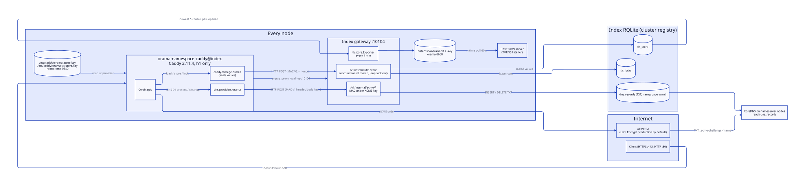
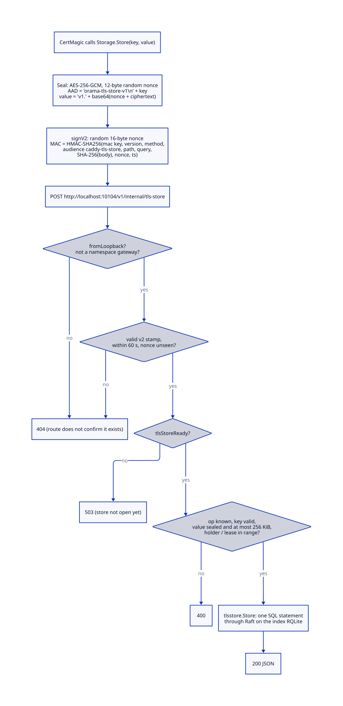
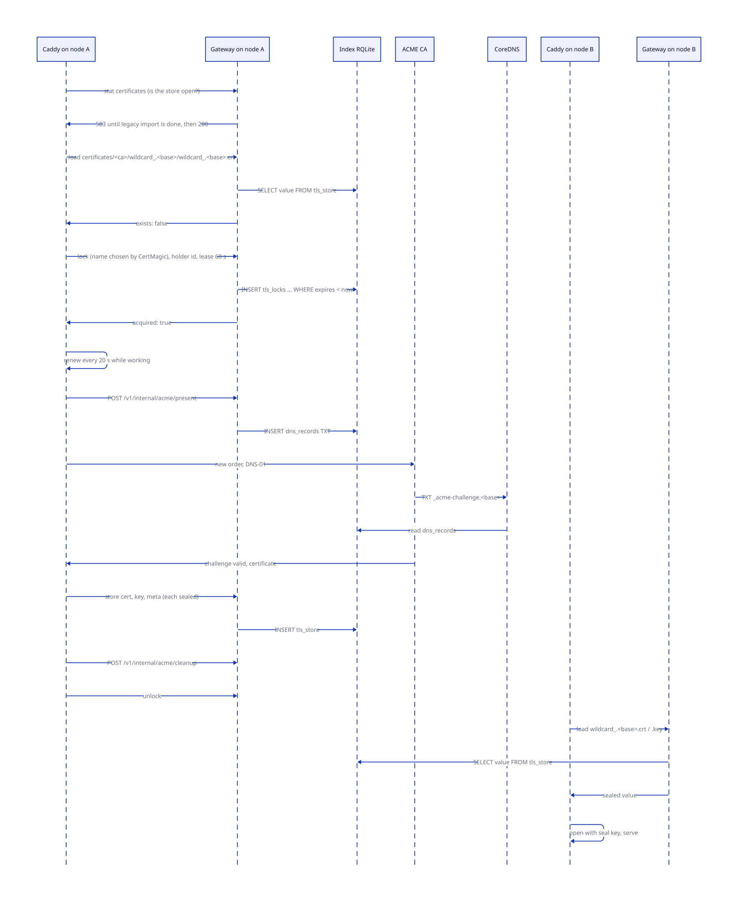
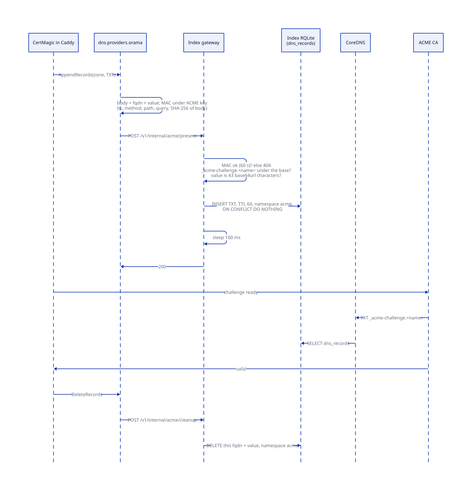
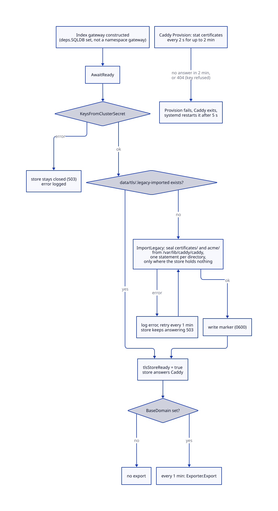
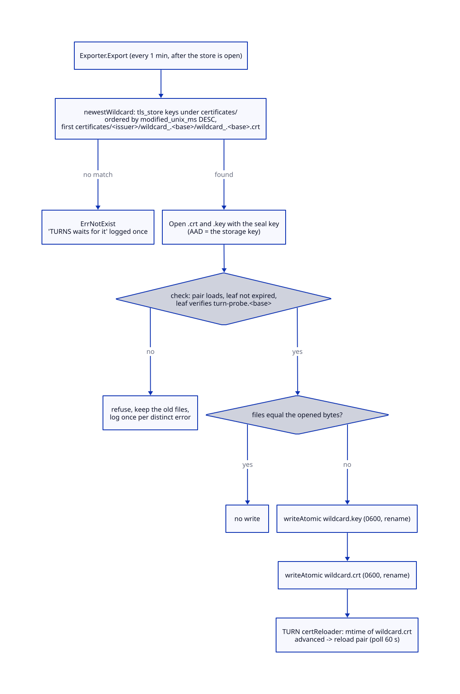

# TLS and certificates

> **At a glance.**
>
> - **What:** every node terminates public TLS in its own Caddy (`orama-namespace-caddy@index`), built by `orama build` with two Orama modules from `caddy/`. `dns.providers.orama` answers ACME DNS-01 challenges by asking the local index gateway to publish a TXT record in the cluster's own DNS. `caddy.storage.orama` keeps Caddy's certificates, ACME account and locks in the cluster registry through the same gateway, sealed, so the cluster obtains each certificate once and every node serves it. The install step renders the Caddyfile and the two key files; the cluster gateway exports the `*.<base>` pair to disk for the shared TURN server.
> - **Key numbers:** Caddy 2.11.4, HTTP/1.1 only, no UDP 443; gateway upstream `localhost:10104`; store route `/v1/internal/tls-store`, ACME routes `/v1/internal/acme/present` and `/cleanup`; stamp skew 60 s; value cap 256 KiB sealed, key cap 1024 bytes, body cap 1 MiB, lease cap 2 h; lock lease 60 s renewed every 20 s, polled every 2 s; Caddy waits 2 min for the store; wildcard export every 1 min; TURN reloader polls every 60 s; ACME CA defaults to Let's Encrypt production.
> - **Code:** `caddy/` (own Go module), `core/pkg/tlsstore/`, `core/pkg/install/installers/caddy.go`, `core/pkg/gateway/tls_store_handler.go`, `core/pkg/gateway/tls_export.go`, `core/pkg/gateway/acme_auth.go`, `core/pkg/tlsutil/`, `core/pkg/certutil/`.
> - **Depends on:** [DNS and nameservers](24-dns-and-nameservers.md) for the TXT records the CA reads, [inter-node trust](15-inter-node-trust.md) for the coordination stamp, [secrets and keys](16-secrets-and-keys.md) for the cluster secret the keys derive from, [cluster state](07-cluster-state.md) for the registry that holds the store, and [install and upgrade](30-install-and-upgrade.md) for the installer that writes everything.



## Why it exists

A cluster is reached by name, over HTTPS, by browsers, mobile libraries and the SDKs. Every name under the cluster's base domain must present a certificate a stock client trusts, with no per-tenant or per-node setup: namespace gateways (`ns-<name>.<base>`), deployed apps (`<app>.<base>`), TURN hosts (`turn-<ns>.<base>`), the status page, and each node's own `node-xxxxxx.<base>`. That is a wildcard, and a public CA issues a wildcard only against a DNS-01 challenge: proof of control by a TXT record at `_acme-challenge.<base>`. The cluster runs its own authoritative DNS, so the TXT record has to be written into the registry that CoreDNS reads, not into a third-party DNS API.

Two further constraints shaped the code.

First, the CA's rate limit. Let's Encrypt issues at most five certificates per week for one set of names (`core/migrations/076_tls_store.sql`, header comment). When every node's Caddy kept certificates on its own disk, every node obtained its own copy of the same `*.<base>` and `<base>` certificates. A five-node cluster spent the whole week's allowance in one install, and the next join, reinstall or rebuild got nothing. The fix is one certificate per name per cluster, obtained by one node and loaded by the rest, which needs storage every node reads and a lock that orders concurrent obtainers.

Second, Caddy faces the internet. A Caddy that can publish any DNS record, or read the cluster's secrets, is a bigger prize than a Caddy that can do exactly what ACME needs. So Caddy gets two narrow keys derived from the cluster secret, each authorising one thing, and the gateway refuses everything else it asks for.

Other processes need the wildcard too. The shared TURN server terminates TLS itself on its TURNS listener and its stealth hosts, and it cannot ask Caddy for a certificate, so the store has a second reader that writes the wildcard to disk.

## The model

**Site.** A block in the Caddyfile. The installer renders one TLS site per name: `*.<base>`, `<base>`, and, in one case each, the node's own domain and `push.<base>`. CertMagic, the library inside Caddy, manages one certificate per site name. A cluster therefore holds one certificate per name, not one certificate in total: the wildcard and the apex are separate certificates, each obtained once and shared.

**DNS provider module.** `dns.providers.orama` (`caddy/provider.go:Provider`). CertMagic's DNS-01 solver calls it to add and remove TXT records. It signs a request to the index gateway and does nothing else; it holds no DNS credentials.

**Storage module.** `caddy.storage.orama` (`caddy/storage.go:Storage`). It implements CertMagic's storage interface, plus lock-lease renewal, over HTTP calls to the index gateway. Every value it stores is sealed before it leaves the Caddy process.

**Store.** The pair of registry tables `tls_store` (key, sealed value, size, modified time) and `tls_locks` (name, holder, expiry), implemented by `core/pkg/tlsstore/store.go:Store`. Keys are the slash-separated paths CertMagic uses (`certificates/<issuer>/<name>/<name>.crt`, `acme/...`), treated as a directory tree.

**Master key, MAC key, seal key.** One 32-byte master key is derived from the cluster secret and written to `/etc/caddy/orama-tls-store.key`. Two further keys are derived from it: a MAC key that authenticates a call to the store and a seal key that encrypts what the store holds. The key that authenticates is never the key that encrypts (`core/pkg/tlsstore/keys.go`).

**ACME key.** A separate 32-byte key, derived from the cluster secret with the purpose `acme-challenge`, written to `/etc/caddy/orama-acme.key`. It authorises one thing: publishing and removing `_acme-challenge` TXT records under the base domain (`core/pkg/auth/acme.go:ACMEChallengeKey`).

**Sealed value.** `v1.` followed by base64 of a 12-byte nonce and an AES-256-GCM ciphertext, with the storage key bound in as associated data (`core/pkg/tlsstore/seal.go:Seal`).

**Lock.** A named lease with a holder id. CertMagic takes one around each obtain or renew so two nodes do not order the same certificate.

**Exporter.** `core/pkg/tlsstore/export.go:Exporter`. Reads the newest `*.<base>` pair from the store, opens it, validates it and writes `wildcard.crt` and `wildcard.key` for TURN.

**Scoped trust.** The client side of TLS. `core/pkg/tlsutil/` builds the `tls.Config` every Orama HTTP client uses and lets a client trust a private CA for one cluster's domain without trusting it elsewhere. It is unrelated to what Caddy serves and is covered at the end of How it works.

## How it works

### How the Caddy binary is built

`orama build` compiles Caddy from the repository's `caddy/` module, which links Caddy with the two Orama modules: `go build -mod=readonly ./cmd/caddy` (`core/cmd/orama/internal/build/thirdparty.go:buildCaddy`). The version is `constants.CaddyVersion` in `core/pkg/constants/versions.go`. The build fails if the `caddy/` directory is absent. The binary lands in the release archive and install puts it at `/usr/bin/caddy` (`core/pkg/install/prebuilt.go`).

`caddy/` is its own Go module (`github.com/DeBrosOfficial/caddy-orama`, with `caddy/v2 v2.11.4`, `certmagic v0.25.3`, `libdns v1.1.1`), so it cannot import `core`. That has a cost: the wire formats, the key derivation and the sealing are written twice, in `caddy/crypto.go` and in `core/pkg/tlsstore` and `core/pkg/auth`. Both sides carry the same test vectors, so editing one copy fails the other's tests: `caddy/vectors_test.go` (`TestStoreKeys_matchCore`, `TestOpenValue_theCoreVector`, `TestCoordinationV2MAC_matchesCore`, `TestProviderSign_matchesCore`, `TestMaxLease_matchesCore`) against `core/pkg/tlsstore/vectors_test.go` (`TestDeriveKeys_matchesTheCaddyModule`, `TestOpen_aValueTheCaddyModuleSealed`). The root `make test` runs the `caddy-test` target beside the core tests.

### The Caddyfile the installer renders

Install phase 4 calls `ConfigureCaddy` after writing `node.yaml`, the Corefile and the ntfy config (`core/pkg/install/orchestrator.go`, the block commented "Configure Caddy"). The inputs are the node's domain (else the base domain), the contact email `admin@<that domain>`, the ACME endpoint `http://localhost:10104/v1/internal/acme`, the base domain, the ACME CA and the cluster secret. `CaddyInstaller.Configure` writes, in this order, `/etc/caddy/orama-acme.key`, `/etc/caddy/orama-tls-store.key` and then `/etc/caddy/Caddyfile` (`core/pkg/install/installers/caddy.go:Configure`). The keys go first because a Caddyfile that names a missing key file stops Caddy from loading any config. Both key files are written 0600 and then handed to the `orama` group, ending `root:orama 0640` inside `/etc/caddy` (`restrictToGroup`).

For a node `node1.dbrs.space` in a cluster with base `dbrs.space` and the default CA, `generateCaddyfile` produces this (the proxy blocks are abbreviated here; each repeats the six `header_up` lines):

```
{
    email admin@node1.dbrs.space
    admin unix//run/orama-caddy/admin.sock|0600
    acme_ca https://acme-v02.api.letsencrypt.org/directory
    storage orama {
        endpoint http://localhost:10104/v1/internal/tls-store
        key_file /etc/caddy/orama-tls-store.key
    }
    servers {
        protocols h1
    }
}

*.dbrs.space {
    tls {
        issuer acme {
            dns orama {
                endpoint http://localhost:10104/v1/internal/acme
                key_file /etc/caddy/orama-acme.key
            }
        }
    }
    reverse_proxy localhost:10104 {
        header_up -X-Internal-Auth-Validated
        header_up -X-Internal-Auth-Namespace
        header_up -X-Internal-Auth-JWT-Sub
        header_up -X-Internal-Auth-JWT-Custom
        header_up -X-Internal-Auth-Scopes
        header_up -X-Internal-Auth-MAC
    }
}

dbrs.space {
    (the same tls and reverse_proxy blocks)
}

http://*.dbrs.space {
    (reverse_proxy only)
}

http://dbrs.space {
    (reverse_proxy only)
}

push.dbrs.space {
    (the same tls block; reverse_proxy localhost:10109, same header_up lines)
}

:80 {
    (reverse_proxy only)
}
```

Each part has a reason in the code.

- **The global block.** `email` is the ACME account contact. `admin unix//run/orama-caddy/admin.sock|0600` moves Caddy's admin API off the default `localhost:2019`, where any process on the host could load a config that proxies anywhere or read the certificates' private keys, onto a socket in the unit's `RuntimeDirectory=orama-caddy` (mode 0700), itself 0600 (`CaddyAdminSocket`). `acme_ca` is always written, as Let's Encrypt production when no other CA is set, so a Caddy release cannot change the CA by changing its own default. `storage orama` points CertMagic at the store. When the node runs the SNI router, one more line, `https_port 8443`, moves Caddy's HTTPS listener off 443 ([SNI routing and stealth TURN](26-sni-routing-and-stealth-turn.md)); with the router off the output is byte-identical to the file above.
- **The sites.** The hosts are `*.<base>` and `<base>`. The node's own domain gets a site only if it is not exactly one label under the base (`isOneLabelUnder`): `node-xxxxxx.<base>` is covered by the wildcard, while `a.node1.<base>` or a domain under another registered domain gets a site and a certificate of its own. There is no wildcard under a node domain, because nothing routes a name there and a per-node certificate would spend the weekly limit. With no base domain configured, the node domain is the base. The `push.<base>` site (self-hosted ntfy) is emitted on every node, with the same `tls` block and an upstream of `localhost:10109`; it is a separate site, so CertMagic manages its name on its own.
- **The `tls` block.** `issuer acme { dns orama { ... } }` forces the DNS-01 solver with the Orama provider for every site. There is no HTTP-01 and no TLS-ALPN-01 challenge and no self-signed fallback.
- **The `http://` sites and `:80`.** Naming a site with the `http://` scheme stops Caddy from adding its automatic HTTP-to-HTTPS redirect for that name. The gateway therefore stays reachable over plain HTTP when certificates are unavailable, for example under a CA rate limit, and the `:80` catch-all proxies any other plain-HTTP request, such as one by IP address, to the gateway.
- **`protocols h1`.** Caddy serves HTTP/1.1 only. HTTP/3 would bind UDP 443, which the TURN relay needs. HTTP/2 is off because it forbids the `Connection: Upgrade` and `Upgrade: websocket` headers (RFC 7540 section 8.1.2.2): a WebSocket upgrade sent over an h2 connection reaches the gateway as a plain GET, the gateway's `isWebSocketUpgrade` check fails, and the query-string `?api_key=` and `?jwt=` WebSocket auth fallback is ignored, producing 401 (bug 249, comment in `generateCaddyfile`). RFC 8441 would fix it, but mobile WebSocket libraries do not implement it. The cost is no h2 multiplexing on plain REST; the dominant workloads, REST over keep-alive and single-connection WebSockets, gain little from it. `TestTLS_onlyHTTP11ByALPN` in the fleet suite offers h2 and checks the node never agrees to it.
- **The `header_up -X-Internal-Auth-*` lines.** The gateway trusts six `X-Internal-Auth-*` headers when they arrive with a valid MAC (chapter 12 and [inter-node trust](15-inter-node-trust.md)). Caddy is where the internet ends and reverse-proxies to localhost, so forged headers would travel with every public request; Caddy strips them a hop before the gateway's own MAC check. The list is `internalAuthHeaders`, and `TestInternalAuthHeadersMatchTheGateway` keeps it equal to the gateway's.

The Caddyfile is regenerated by every install and upgrade. The CA is the one setting that persists: `--acme-ca` (`letsencrypt`, `letsencrypt-staging` or an https directory URL) is recorded as `tls.acme_ca` in `node.yaml`, and a regeneration without the flag re-reads it, so a staging cluster does not silently return to production and spend the limits staging exists to protect (`core/pkg/install/config.go:ACMECA`). A value read back is validated again, and `ValidateACMECA` refuses spaces, braces and quotes because the value lands in the global block of a file root writes. A joining node adopts the cluster's CA when it passes none (`useClusterACMECA` in the install orchestrator).

### The Caddy unit

Caddy runs as `orama-namespace-caddy@index.service` under the `orama` user (`core/systemd/orama-namespace-caddy@.service`). `orama-node` starts it with the vault and the optional SNI router in `startIndexEdgeServing` (`core/pkg/node/index_host.go`, `core/pkg/namespace/index_host.go:EnsureCaddy`), and registering the node in DNS depends on it ([DNS and nameservers](24-dns-and-nameservers.md)). The unit is ordered after the index gateway and the nameserver CoreDNS but does not gate on either: Caddy retries upstreams and ACME itself, and its storage module waits for the store (below). Its sandbox is `ProtectSystem=strict`, `ProtectHome`, `NoNewPrivileges`, `PrivateDevices`, `RestrictNamespaces`, `InaccessiblePaths=/opt/orama/.orama/secrets`, write access only to the log directory, `/var/lib/caddy` and `/etc/caddy`, and only `CAP_NET_BIND_SERVICE`. `XDG_DATA_HOME=/var/lib/caddy` is where file storage used to live and where the legacy import reads. `Restart=always` with `RestartSec=5s` is what turns a failed provision into a retry. The resource limits are `MemoryMax=2G` and `TasksMax=512`. The comment records why the task limit is a cgroup limit and not `LimitNPROC`: that limit counts every thread the `orama` user owns, and a node full of namespaces pushed the total over 512, the Go runtime could not start a thread, and every HTTPS request on the node failed.

### How a call reaches the store



Every CertMagic storage operation is one HTTP POST from `Storage.call` to `http://localhost:10104/v1/internal/tls-store`. The body is JSON: `op` (`load`, `stat`, `store`, `delete`, `list`, `lock`, `renew`, `unlock`), `key`, `value`, `recursive`, `holder` and `lease_ms`. The answer carries `exists`, `value`, `keys`, `size`, `modified_ms`, `terminal` and `acquired`.

**Sealing.** `Storage.Store` seals the value with AES-256-GCM before the call, using a fresh 12-byte nonce, with `orama-tls-store-v1\n` plus the storage key as associated data. A value moved to another key does not open, so a certificate's private key put where another certificate's is read fails authentication (`TestOpen_refusesAValueStoredUnderAnotherKey`). `Storage.Load` opens the value after the call. The gateway never holds the seal key for this path: it stores what Caddy sealed and returns it.

**Stamping.** `signV2` draws a 16-byte random nonce and sets two headers: `X-Orama-Coordination-Nonce`, and `X-Orama-Coordination-MAC-V2` as `<unix seconds>.<hex HMAC-SHA256>`. The MAC covers, newline-joined, the version string `orama-coordination-v2`, the upper-cased method, the audience `caddy-tls-store`, the path, the query, the hex SHA-256 of the body, the nonce and the timestamp. The audience is a constant, not a node id: these calls never leave the node, and the key authorises nothing else.

**Gating.** `tlsStoreHandler` (`core/pkg/gateway/tls_store_handler.go`) answers 404 unless every one of these holds, in this order: the method is POST; the gateway is not a namespace gateway; the TCP peer is loopback (`fromLoopback`); and `VerifyCoordinationV2` accepts the stamp. Verification refuses a timestamp more than 60 s from now in either direction, a stamp made before this gateway process started (the replay cache is per process and empty after a restart), a malformed nonce, a MAC over a different request, and a nonce already seen (the cache holds 65,536 nonces for 120 s and refuses new ones rather than forgetting old ones when full). The 404 is deliberate: the route does not confirm it exists. After the stamp, the handler answers 503 until `tlsStoreReady` is set. The readiness middleware sits in front of all this: while the gateway is not `Ready`, the store route (which is not in `readinessPassthrough`) answers 503 with a reason code, like every route but a short list.

**Validation.** `checkTLSStoreRequest` accepts only the eight ops; requires a valid key for every op except a `list` with no key (the whole store); requires a `store` value to be a sealed value of at most 256 KiB (`tlsstore.IsSealed`: prefix, base64, at least a nonce and a tag), so a plaintext certificate or key is refused before it reaches the registry; requires a `lock`, `renew` or `unlock` holder of exactly 32 lower-case hex characters; and requires a lease in (0, 2 h]. `ValidKey` allows 1 to 1024 bytes of printable ASCII, rejects backslash, and rejects empty, `.` and `..` path components, so a key cannot escape the namespace of the table.

**Execution.** `runTLSStoreOp` maps each op onto `tlsstore.Store`:

- `Load` is one `SELECT value`. A miss is `200` with `exists: false` (an answer), not an error status.
- `Put` is an `INSERT ... ON CONFLICT(key) DO UPDATE`, one Raft entry.
- `Delete` removes the key and everything under it with `key = ? OR substr(key, 1, n) = key + "/"`.
- `Stat` finds the key itself or any key below it: a key with children is a directory (`IsTerminal` false), a stored key is terminal.
- `List` returns every key under a prefix (recursive) or each direct child once, sorted. Prefix compares use `substr` and not `LIKE`, because `LIKE` folds ASCII case and `certificates/Foo` would match `certificates/foo/...` (`TestStore_prefixesAreCaseSensitive`).
- Sizes and times come back from RQLite as `float64`, which database/sql will not scan into an `int64` for a millisecond timestamp; `integer` converts exactly (`TestInteger_readsWhatRQLiteReturns`).

An error maps to 503 `TLS store unavailable`, except a lock the caller does not hold, which is 409.

**What Caddy does with each answer.** Anything other than 200 is an error, never "absent". 409 becomes `errLockNotHeld`; 404 becomes `errRefused` with a message that the gateway does not accept this node's key or is not a cluster gateway; other statuses quote at most 256 bytes of the body. `Load` retries up to 3 times, 1 s apart, on a transient failure (CertMagic does not retry the first load of a name it starts managing, and leaves a name whose load failed unmanaged until Caddy restarts). `Exists` has no error return in CertMagic's interface, so it asks twice before answering false, and logs the failure. A refusal read as "no certificate yet" would make this node order a certificate the cluster already has, which is the exact failure the store exists to prevent.

### Locks



CertMagic takes a lock around each obtain or renew. `Storage.Lock` draws a random 16-byte holder id and loops: send `lock` with a 60 s lease; if `acquired` is true, record the lock and return; otherwise wait 2 s and ask again, until the context ends. `TryLock` is one statement through Raft:

```sql
INSERT INTO tls_locks (name, holder, expires_unix_ms) VALUES (?, ?, ?)
ON CONFLICT(name) DO UPDATE SET holder = excluded.holder, expires_unix_ms = excluded.expires_unix_ms
WHERE tls_locks.expires_unix_ms < ?
```

Raft orders two nodes racing for a free lock, and only one changes the row (`RowsAffected` is 1). An expired lease is taken over by the same statement: its holder stopped renewing. A holder that is alive renews every `lockLease/3`, 20 s, with a 10 s timeout per renewal, by `renew`, which updates the row only where the holder matches. A renewal answered 409 is logged as a lost lock ("its lease ran out and another node took it") and the renewer stops. A renewal that fails for any other reason is logged and retried at the next tick. CertMagic can also ask for a longer lease through `RenewLockLease`; the request is clamped to between 60 s and 2 h. `Unlock` stops the renewer and deletes the row where holder matches.

The expiry is set and compared with the clock of the gateway that handled the call, which is the local gateway of each node. Locks therefore assume the nodes' clocks agree within the 40 s between a renewal and the lease running out. A larger skew can let two nodes obtain the same certificate at once, which costs one extra issuance and no corruption (`docs/SECURITY.md`, "Certificates").

### DNS-01 through the gateway



For the wildcard, CertMagic asks `dns.providers.orama` to append a TXT record. `Provider.AppendRecords` handles only TXT records; `call` posts `{"fqdn": "<name>.<zone>", "value": "<token>"}` to `<endpoint>/present` (and `/cleanup` for `DeleteRecords`) with a 30 s client timeout, and treats any status but 200 as failure. `GetRecords` and `SetRecords` return nothing, because ACME does not use them.

The stamp is a simpler MAC than the store's. `sign` sets `X-Orama-Coordination-MAC` to `<ts>.<hex HMAC-SHA256>` over `orama-coordination-v2`, the method, the path, the query, the hex SHA-256 of the body and the timestamp, under the ACME key. The body hash is the point: the older MAC covered method, path and query only, and these endpoints take the record they publish from the body, so a MAC captured for one TXT record could be replayed with another name. There is no nonce and no audience.

The gateway side is `core/pkg/gateway/acme_auth.go` and `acme_handler.go`. `acmeChallengeRequest` reads at most 1 MiB, verifies the MAC with `VerifyACME` (60 s skew) and answers 404 to an unauthenticated caller, then decodes the body and applies two checks that bound what a holder of the key can do:

- `acmeChallengeFQDN` lower-cases the name, requires the `_acme-challenge.` prefix, requires the rest to be the base domain or a name under it, and requires every label to match a host-name label. It returns the dot-terminated form `dns_records` stores. A gateway with no base domain publishes nothing.
- The value must match `^[A-Za-z0-9_-]{43}$`: a base64url SHA-256 digest, as RFC 8555 section 8.4 defines a DNS-01 answer.

`acmePresentHandler` inserts a TXT row into `dns_records` with TTL 60, namespace `acme`, created by `system`, `ON CONFLICT DO NOTHING`. The unique constraint on `(fqdn, record_type, value)` matters here: the apex and the wildcard are validated against the same name, `_acme-challenge.<base>`, with different values, and several nodes may run challenges for the same name concurrently, so the table holds several TXT values at one name. The handler then sleeps 100 ms for CoreDNS, which reads the registry, to see the row, and answers 200. `acmeCleanupHandler` deletes only the row with this call's value, namespace `acme`, so one node finishing does not remove another node's challenge. The gateway answers through the index registry's `client.WithInternalAuth` context, with no per-user check; the MAC is the whole authorisation. Both routes are `Open` in the route policy because the key is not an API key, and the handler authenticates ([gateway architecture](12-gateway-architecture.md)).

The CA then queries the cluster's nameservers for the TXT record. CoreDNS answers it from `dns_records` ([DNS and nameservers](24-dns-and-nameservers.md)), so DNS-01 needs the zone delegated to the cluster's nameservers before the first issuance.

### Opening the store on a node



The store is not open when the gateway starts. `Gateway` construction launches a goroutine that waits for `AwaitReady` and then calls `startTLSStore`, only on the index gateway (`deps.SQLDB != nil && !isNamespaceGateway(cfg)`, `core/pkg/gateway/gateway.go`). A tenant gateway's database is its tenant's and holds no store.

`startTLSStore` derives the keys from the cluster secret, which fails with a clear error if the node has none, and requires a `DataDir` to record the import in. If either is missing it logs an error and returns, leaving the store closed. Then it imports, once per node, the certificates this node's Caddy kept on disk before the shared store existed.

**Legacy import.** `Store.ImportLegacy` reads the `certificates/` and `acme/` trees of `/var/lib/caddy/caddy` (`LegacyCaddyStorageDir`, Caddy's file storage under `XDG_DATA_HOME`), seals each file under the key Caddy's file storage gave it (its path below the directory), and inserts it. Locks and OCSP staples are not state and are not imported. The rules are written for a failure that costs a week:

- A node upgraded from a release that kept certificates on disk must not make its first Caddy find an empty store, or it would order certificates the cluster already has.
- Every file is opened through `os.Root`, which refuses a path or symlink that leaves the directory, so a file swapped for a symlink between the walk and the read cannot make the gateway seal something outside Caddy's storage. Symlinks are skipped and reported. A key that fails `ValidKey`, a non-regular file, and a file over 256 KiB (before or after sealing) are skipped with a reason.
- Each directory is imported whole or not at all, in one `INSERT ... SELECT ... WHERE NOT EXISTS (keys under this directory)` statement, so one Raft entry. Every node held its own certificate and key for the same name, and a certificate from one node beside the key of another does not load. A directory the store already has anything under is left as it is: the first node to import a name wins, and every node then serves that copy.
- A file that vanishes during the walk is an error, not a skipped file, so an import is never recorded as done with a name half stored.

On success the gateway writes `data/tls/.legacy-imported` (0600) under its data directory and does not import again. On failure it logs an error, retries every minute, and the store keeps answering 503. Caddy's `Provision` therefore does not complete, Caddy exits and systemd restarts it, rather than spending the CA's limits.

Only after the import does `tlsStoreReady` flip and the store start answering Caddy. If the cluster has a base domain, the gateway then starts the export loop below.

### Waiting for the store, from Caddy's side

`Storage.Provision` reads the master key (`readHexKey`: hex, non-empty), derives the MAC and seal keys (`storeKeys`), refuses an empty endpoint or key file, and then calls `waitForStore`. Caddy starts managing its certificates right after provisioning, and a name whose certificate could not be read at that moment is left unmanaged, logged and never retried, so the node would serve no TLS for it until Caddy restarted. So provisioning blocks: it sends a `stat certificates` every 2 s, up to 2 min (`storeWait`), and treats an answer without an `exists` field as "not the cluster's store". A 404 (`errRefused`) ends the wait at once, since waiting does not change a wrong key. If the store does not open in 2 min, `Provision` fails, Caddy exits, and `Restart=always` starts it again 5 s later. A Caddy that is already running keeps serving the certificates it loaded through a gateway outage.

### Exporting the wildcard for TURN



TURN terminates TLS itself on its TURNS listener (5349) and, when stealth is on, on stealth hosts, and every host it answers for is a single label under the base, so the `*.<base>` certificate covers all of them. Caddy keeps its certificates in the store, not on disk, so the cluster gateway writes the pair. `exportTLSOnce` runs `Exporter.Export` once a minute (`tlsExportInterval`):

1. `newestWildcard` lists the store's `certificates/` keys, newest first by modification time, and takes the first of the form `certificates/<issuer>/wildcard_.<base>/wildcard_.<base>.crt`, exactly four components, from whichever issuer stored it. Caddy obtains and renews only from the configured CA, so the newest is the one it renews; reading by newest also survives a change of CA. No match is `ErrNotExist`, logged once as "TURNS waits for it".
2. It loads and opens the `.crt` and the matching `.key` with the seal key.
3. `check` refuses a pair TURN could not serve: `tls.X509KeyPair` must accept them as a pair, the leaf must not be expired, and the leaf must verify the host `turn-probe.<base>`, proving it covers a single label.
4. If the files on disk already equal the opened bytes, nothing is written. Otherwise `writeAtomic` writes the key and then the certificate, each through a temp file chmod 0600 in `data/tls/` and a rename, so a reader never sees a partial file. The key goes first: the TURN reloader watches the certificate file's modification time, so it never reads a new certificate with the old key.

The paths come from `constants.WildcardCertPath` and `WildcardKeyPath`: `<oramaDir>/data/tls/wildcard.crt` and `wildcard.key`. They do not depend on the CA that issued the pair. The loop logs a state when it changes (`missing`, an error text, `exported`) and not every minute.

The consumer is the host TURN server (`core/pkg/turn/cert_reloader.go:certReloader`). It loads the pair at start, and a goroutine polls the certificate's modification time every 60 s (`turnCertReloadInterval`); on an advance it reloads the pair and swaps it in, keeping the old certificate if the new pair fails to load. No restart is needed, which matters because a restart would tear down every active relay. When the namespace spawner builds a TURN configuration it requires the exported files to exist (`core/pkg/namespace/systemd_spawner.go:exportedWildcard`); with no wildcard exported it returns an error and TURNS stays off, and it never falls back to a self-signed certificate, since a client rejects one and a stealth host with an invalid certificate is indistinguishable from a blocked one. The stealth host must be exactly one label under the base (`isSingleLabelSubdomain`).

### Client-side trust: tlsutil

`core/pkg/tlsutil/` is the TLS configuration of Orama's own HTTP clients (the CLI, the rqlite admin client, readiness probes, netguard's transport, the auth flows). It has three parts.

**The shared transport.** `NewHTTPClient(timeout)` returns a client over one process-wide `http.Transport` with `IdleConnTimeout` 90 s, rebuilt only when the scoped roots change. Before this, each call built a new transport, and the rqlite admin client, readiness probes and health checks, which call it per request, left one parked keep-alive connection per call: about ten a minute on a node, each a goroutine at both ends, until the process restarted (bugboard 2729).

**Root CAs.** `GetTLSConfig` returns a config with `MinVersion` TLS 1.2. At package init it loads a CA bundle from `ORAMA_CA_CERT_PATH` (default `/etc/orama/ca.crt`), if the file exists, into `RootCAs`. A set `RootCAs` replaces the system roots for every host the process talks to; that is the reason the next mechanism exists.

**Scoped roots.** `TrustCAForDomain(domain, caFile)` records a CA pool for a domain and every name under it, in addition to the system roots, and bumps a generation counter. A test cluster on the Let's Encrypt staging CA, or a private cluster with its own CA, is otherwise unreachable. `crypto/tls` takes one root pool per config, so `withScopedRoots` moves chain verification into `VerifyConnection`: it sets `InsecureSkipVerify` (only to turn off the built-in check this replaces) and verifies the leaf itself with the server name as `DNSName`, first against the base roots (the system roots, or the bundle), then against the pool scoped to that name. The match is on whole labels: `example.com` scopes `a.example.com` and not `notexample.com` (`TestWithScopedRoots_matchesWholeLabels`). A peer with no certificate, or a connection with no server name, is refused (`TestVerifyScoped_refusesWhatItCannotCheck`). With no scoped roots the config is returned unchanged.

The CLI loads each configured environment's `ca_file` with `TrustEnvironmentCAs` and then calls `InstallScopedRoots`, which applies the scoped roots to `http.DefaultTransport` so clients built without their own transport verify the same way (`core/cmd/orama/internal/environment.go`).

## State it owns

| What | Where | Written by | Read by |
|---|---|---|---|
| Certificates, private keys, ACME account and meta, sealed (`certificates/...`, `acme/...`) | `tls_store` table, index RQLite (`key`, `value`, `size`, `modified_unix_ms`) | Caddy, through the index gateway | Caddy on every node; the exporter |
| Lock leases | `tls_locks` table, index RQLite (`name`, `holder`, `expires_unix_ms`) | Caddy, through the index gateway | the same statements that take and renew them |
| ACME challenge TXT records | `dns_records`, namespace `acme`, TTL 60 | `acmePresentHandler`, `acmeCleanupHandler` | CoreDNS; the CA |
| Store master key (hex) | `/etc/caddy/orama-tls-store.key`, `root:orama` 0640 | install (`writeCaddyTLSStoreKey`) | Caddy at provision; the gateway derives its own copy |
| ACME key (hex) | `/etc/caddy/orama-acme.key`, `root:orama` 0640 | install (`writeCaddyACMEKey`) | Caddy at provision; the gateway derives its own copy |
| Caddyfile | `/etc/caddy/Caddyfile`, 0644 | install and upgrade | Caddy (`caddy run`, `caddy reload`) |
| Caddy admin socket | `/run/orama-caddy/admin.sock`, 0600, in a 0700 runtime directory | Caddy | `caddy reload`, as the `orama` user |
| Caddy runtime config autosave | `/var/lib/caddy/config` (`XDG_CONFIG_HOME`) | Caddy | Caddy |
| Legacy Caddy file storage | `/var/lib/caddy/caddy/{certificates,acme}` | older releases | `ImportLegacy`, once |
| Import marker | `<oramaDir>/data/tls/.legacy-imported`, 0600 | the cluster gateway | the cluster gateway |
| Exported wildcard pair | `<oramaDir>/data/tls/wildcard.crt` and `wildcard.key`, 0600 | the exporter, every node, every minute | the host TURN server |
| Gateway in-memory | `tlsStoreReady` flag; the coordination nonce cache (65,536 nonces, 120 s) | the gateway | the gateway |
| Client trust | scoped-root map and shared transport, in process; `ca_file` per environment in the CLI environment config; `/etc/orama/ca.crt` | `TrustCAForDomain`; `orama env add --ca-file` | every Orama HTTP client |
| ACME CA | `tls.acme_ca` in `node.yaml` | install and upgrade `--acme-ca` | install, to render `acme_ca` |

## Lifecycle

**Install.** The installer writes the keys and the Caddyfile (phase 4), opens ports 80 and 443 in the firewall (`core/pkg/install/firewall.go`), creates `/var/lib/caddy` owned by `orama` (`ensureCaddyDataDir`), and installs the Caddy unit. On first boot of the node, `orama-node` starts the index gateway and Caddy. Caddy's `Provision` blocks on the store; the gateway's `startTLSStore` runs the legacy import (nothing on a fresh node) and opens the store; Caddy proceeds. On the first node of a new cluster, CertMagic finds no certificate, takes the lock, runs DNS-01 for the wildcard and the apex through the gateway and CoreDNS, stores the results and releases the lock. Nodes that join later find the certificates in the store and issue nothing. A reinstall of an existing node does the same: it loads.

**Normal operation.** CertMagic renews in the background, well before expiry ("certificates are renewed weeks before they expire", `core/pkg/gateway/tls_export.go`), under the same lock, from whichever node's maintenance loop gets there first. Other nodes' Caddy instances load the renewed certificate from the store. The exporter notices a changed wildcard within a minute and the TURN reloader within another minute.

**Rolling upgrade.** The Caddy binary and the gateway ship in one archive, so a node does not run a new Caddy against an old gateway. The sequence on a node upgraded from a release with file storage is: the new gateway starts, imports the old certificates sealed, opens the store; the new Caddy, which waits up to 2 min for the store, then finds them. Where the first node's import wins, the others serve that copy once they import or load; an old-release node that still uses file storage keeps its own certificate until upgraded, so the fleet briefly serves different leaf certificates for the same name, which is harmless. If Caddy restarts before the gateway is open, it waits; if the gateway needs more than 2 min, Caddy exits and is restarted every 5 s until it can start. The Caddyfile is rewritten on upgrade; `caddy reload` is available through the unit's `ExecReload`.

**Restart.** A restarted gateway has an empty nonce cache and refuses stamps made before it started, so Caddy's first store call in the same second may be refused with 404; `waitForStore` and `Load` retry it, and a lock poll tries again every 2 s. A restarted Caddy waits for the store and then loads every certificate it manages from the registry. A restarted index RQLite voter leaves reads and writes to the store to the other voters.

**Node loss.** The store lives in the replicated registry, so a lost node loses no certificate. A lock held by a lost node expires within 60 s of its last renewal and the next node's poll takes it. A node whose Caddy is down is withdrawn from DNS after 2 consecutive failed heartbeat checks (`edgeDownTicks` in `core/pkg/node/dns_registration.go`) so clients are not sent to a closed port.

## Failure modes

| Trigger | What the system does | What you observe |
|---|---|---|
| Gateway not up when Caddy starts | `waitForStore` polls every 2 s for 2 min, then `Provision` fails and Caddy exits; systemd restarts it after 5 s | `orama-namespace-caddy@index` restarting; log "waiting for the cluster's certificate store"; node out of DNS after 2 failed edge checks |
| Legacy import fails | The store keeps answering 503; the gateway retries every minute; Caddy cannot provision | gateway error "Could not import this node's certificates into the cluster's store"; Caddy restart loop |
| Index RQLite has no leader or quorum | Store calls fail with 503; no issuance or renewal; a running Caddy keeps serving the certificates it loaded | renewal errors only close to expiry; handshakes keep working |
| Wrong or missing store key on the node | The gateway answers 404; `errRefused` ends the wait at once and Provision fails | Caddy exits with "does not accept this node's TLS store key, or is not a cluster gateway" |
| Cluster secret differs between Caddy and gateway (key file from another cluster) | The stamp fails: 404. A value sealed by another cluster does not open: "does not open with this cluster's key" | Caddy cannot load; exporter reports the same error |
| CA rate limit reached | Obtain fails; CertMagic retries with backoff; HTTPS for that name fails; plain HTTP still reaches the gateway through the `http://` sites | handshake errors for the name; HTTP on :80 works |
| DNS-01 fails: zone not delegated, CoreDNS down on all nameservers, TXT not visible | The CA marks the challenge invalid; the provider has already got 200 from `present` | order fails; `dns_records` rows in namespace `acme` may remain until `cleanup` runs |
| Unsigned, foreign-key or replayed store call | 404, no body | the route looks absent; the gateway logs nothing for stamp failures |
| Out-of-zone, malformed or wrong-length ACME record | 400 with the reason; nothing written | `present` refused |
| Lock holder crashes | Lease runs out after 60 s; another node takes it and obtains the certificate | one extra wait of up to a minute |
| Clock skew between nodes above 40 s | Two nodes may hold the same lock and both obtain | one wasted issuance against the weekly limit |
| Disk full on a node | Caddy's store is remote, so certificates are unaffected; the exporter's write fails and is logged, TURN keeps the old pair | exporter warning; TURNS serves the previous certificate |
| Exported pair invalid (expired, mismatched, not a wildcard) | `check` refuses it, the old files stay | exporter warning once per distinct error |
| Wildcard not yet obtained | `ErrNotExist`; TURNS stays off on new TURN instances | log "TURNS waits for it" |
| Slow gateway | each call has a 30 s timeout; a lock renewal has 10 s | renewal errors logged; the lock may be lost if renewals miss for 60 s |
| Name not covered (custom domain, two labels under the base, an IP) | No certificate is available; the handshake fails | TLS error for that SNI; `:80` still proxies |

## Trust and security

**Who can reach the store.** Only a process on the node that holds the MAC key and sends a fresh coordination v2 stamp for audience `caddy-tls-store`, from loopback, to the cluster gateway. The key is the whole cluster's: a stamp captured on one node is valid for every node's gateway for 60 s, but is refused by any gateway that has seen the nonce, and it can only reach the store. The audience is not node-bound, so loopback is what ties a call to its node. The key file is `root:orama` 0640, readable by every process running as `orama`, which includes the gateways and namespace services but not a tenant's deployment unit, which runs under a user of its own. The gateway derives the same key from the cluster secret it already holds, so reading the file adds no capability a gateway lacks.

**What the store holds.** Every value is sealed under a key derived from the cluster secret before it leaves Caddy. The registry's rows, its Raft log, its snapshots and its backups therefore never contain a private key in clear. The gateway refuses any unsealed value. Anyone who holds the cluster secret can open the store; that is the same trust a joining node is given for the swarm key and the RQLite password. The store does not weaken the key's exposure: before sharing, every node already held a key valid for `*.<base>`, and one key shared by every node lets a compromised node impersonate the cluster's hosts exactly as its own key did.

**What the ACME key can do.** Publish and remove TXT records named `_acme-challenge.<base-or-subdomain>` with a 43-character base64url value. Because the key is separate from the coordination key, a compromised Caddy cannot ask another node to spawn or repair a namespace, and cannot write a record that is not a challenge. What it can still do: get a certificate for any name under the base domain issued to whoever controls the validation, because publishing the TXT is what a CA accepts as proof. The key is therefore as sensitive as the zone, and is derived and stored like the store key.

**Attacker positions.**

- *Internet.* Reaches only Caddy on 80 and 443. Forged `X-Internal-Auth-*` headers are stripped by Caddy and ignored by the gateway without a MAC. The store and ACME routes are reachable through Caddy as ordinary proxied paths, but answer 404 without a stamp. A request proxied by Caddy reaches the gateway from loopback, so the loopback test does not stop it; the stamp does.
- *A local process on the node.* A tenant deployment runs under its own user and cannot read `/etc/caddy`. It can reach the gateway on loopback and the Caddy listener, but without the key cannot make a valid call. It cannot reach Caddy's admin API, which is a 0600 socket in a 0700 directory.
- *A process running as `orama`.* Can read both key files and therefore write the store and publish challenge records. This is the shared-account limit: Caddy runs as `orama` like the gateway ([privilege and filesystem trust](05-privilege-and-filesystem-trust.md)).
- *Another cluster node.* Holds the same cluster secret. Can read any certificate and key and obtain certificates. That is the cluster's trust model.
- *The CA.* Trusted as any ACME CA is; a staging CA issues certificates no public client trusts, and `--acme-ca` on a production cluster is an operator decision that the node does not guard beyond requiring https and a clean value.

**Admin API.** Not on a TCP port. A host process cannot load a config or read private keys through it.

**Client side.** The CLI does not set `InsecureSkipVerify` for public certificates. Scoped trust never relaxes verification for a name outside the scoped domain. `ORAMA_CA_CERT_PATH` replaces the system roots for every host and is a blunt tool; scoped roots exist for that reason.

## Limits and scale

| Limit | Value | Source |
|---|---|---|
| Store key length | 1024 bytes | `core/pkg/tlsstore/store.go:MaxKeyLen` |
| Sealed value | 256 KiB | `MaxValueLen` |
| Lock lease | at most 2 h; Caddy asks 60 s | `MaxLease`; `caddy/storage.go:lockLease` |
| Lock renewal | every 20 s, 10 s timeout | `lockLease/3`, `renewTimeout` |
| Lock poll | every 2 s | `lockPoll` |
| Request body | 1 MiB | `CoordinationMaxBody`, `acmeRequestMaxBytes` |
| Response read by Caddy | 4 MiB | `maxResponse` |
| Per-call timeout | 30 s | `callTimeout` |
| Store wait at boot | 2 min, polled 2 s | `storeWait`, `storePoll` |
| Load retries | 3, 1 s apart | `loadAttempts`, `loadRetryGap` |
| Stamp skew | 60 s either way | `coordinationMaxSkew` |
| Nonce cache | 65,536 entries for 120 s | `coordinationReplayCapacity`, `coordinationReplayTTL` |
| Wildcard export | every 1 min | `tlsExportInterval` |
| TURN reload poll | every 60 s | `turnCertReloadInterval` |
| CA issuance | five per week per name set (Let's Encrypt) | `076_tls_store.sql` |

The store is tiny. A cluster has a handful of names, and each name holds a certificate, a key and metadata, a few kilobytes, so `tls_store` has a few rows per name. Reads are single-row selects. The only Raft writes are stores at issuance and renewal, lock takes and renewals, and imports.

The first things that grow with the fleet are lock polls and the exporter. While one node holds an issuance lock, every other node whose Caddy wants the same lock polls `lock` every 2 s, and each poll is a Raft write through the index RQLite: at 100 nodes that is about 50 writes per second for the minutes an issuance takes, and only while an obtain is in flight, since nodes that find the certificate in the store do not take the lock. The exporter runs on every node once a minute and reads one prefix listing and two values. Neither is a bottleneck at 10x.

The real ceiling is the CA. Each name that gets a site spends the weekly limit once. The design keeps this constant in the node count: adding nodes adds no issuance. It grows with the number of distinct names, not with nodes or tenants, because tenants are covered by the wildcard. Two-label names under the base are not covered (below). A node domain outside the wildcard adds a certificate per such node, which is why the installer only emits that site when needed.

Caddy itself is bounded by `MemoryMax=2G`, `TasksMax=512` and `LimitNOFILE=1048576`.

## Design decisions

### One certificate per name per cluster, in the registry

**Chosen:** Caddy's storage is the index registry, reached through the local index gateway; the first node to need a certificate obtains it under a lease lock and every node loads it.
**Rejected:** per-node file storage (the previous behaviour); copying certificates between nodes over SSH or WireGuard on a schedule.
**Why:** per-node storage spent the CA's weekly limit with every node and every reinstall (`076_tls_store.sql`). The registry is already replicated, backed up and reachable by every node, and Raft already orders writers, so the lock needs no new consensus.

### A caddy module, not a sidecar

**Chosen:** two modules compiled into Caddy, in a separate Go module.
**Rejected:** a generic HTTP-01/lego sidecar writing files for Caddy; a core package imported into Caddy.
**Why:** CertMagic already has the storage and DNS-provider interfaces, including lock-lease renewal, so a module is the narrowest fit. A separate module avoids pulling the whole `core` dependency graph into the Caddy build. The price is duplicated wire formats, bounded by shared test vectors.

### DNS-01 only, through the cluster's own DNS

**Chosen:** `issuer acme { dns orama }` for every site, with the TXT record written to the registry.
**Rejected:** HTTP-01 or TLS-ALPN-01; a third-party DNS provider's API.
**Why:** a wildcard requires DNS-01. The cluster is its own authoritative DNS, so the record can be written directly and no external DNS credential exists to leak. The code carries a readiness passthrough for `/.well-known/acme-challenge/`, left from HTTP-01 times, that nothing in the current Caddyfile uses.

### Two keys, both derived, each narrow

**Chosen:** an ACME key and a store master key (split into a MAC and a seal key), each derived from the cluster secret with a distinct purpose; none is the coordination key.
**Rejected:** giving Caddy the coordination key; one key for MAC and seal.
**Why:** Caddy faces the internet. The coordination key can make other nodes spawn namespaces, so a compromised Caddy holding it would reach the whole cluster. And a key that authenticates a call must not also decrypt what the call returns.

### Seal in Caddy, store opaque

**Chosen:** values are sealed in the Caddy process with the storage key as associated data; the gateway stores them without opening them and refuses a value that is not sealed.
**Rejected:** relying on the registry's own protection.
**Why:** RQLite snapshots, the Raft log and backups copy every row. Sealing means none of them ever holds a private key in clear, and binding the storage key stops a value from being swapped between keys.

### A failure is never absence

**Chosen:** the gateway answers `200 exists:false` for a missing key and an error status for everything else; the module treats every non-200 as an error; provisioning blocks until the store answers.
**Rejected:** treating an unreachable store as "empty".
**Why:** a certificate wrongly believed absent is ordered again, and the weekly limit is the scarce resource. A name whose first load fails is left unmanaged by CertMagic until restart, so the module waits and retries instead.

### Import before open

**Chosen:** the store answers 503 until the node's old on-disk certificates are imported, whole directories at a time, first import wins.
**Rejected:** letting Caddy start against an empty store and obtaining again; importing file by file.
**Why:** a cluster installed within the last week cannot get new certificates, and file-by-file import could pair one node's certificate with another node's key.

### HTTP/1.1 only

**Chosen:** `protocols h1`.
**Rejected:** h2 and h3.
**Why:** h2 strips WebSocket upgrade headers and breaks query-string WebSocket auth for clients without RFC 8441; h3 takes UDP 443 from TURN. See the Caddyfile section for the full reasoning.

### A wildcard export for TURN, not a second ACME client

**Chosen:** the cluster gateway reads the wildcard out of the store and writes it to disk every minute; the TURN server hot-reloads it.
**Rejected:** a TURN-side ACME client; reading Caddy's file storage.
**Why:** one issuer avoids a second set of CA limits and a second DNS-01 path. The store is the only copy, and the file is the sole place a process outside Caddy reads a private key, with a defined mode and an atomic write order.

## Known gaps

- **`core/pkg/certutil` is dead code.** `core/pkg/certutil/cert_manager.go:CertificateManager` generates a 4096-bit RSA CA (10 years) and 2048-bit node certificates (5 years, with `*.orama.network` names in some cases). No file in the repository imports it; only its serial test uses it. It should be deleted.
- **`tlsutil` trust-listing code has no caller.** `core/pkg/tlsutil/client.go:ShouldSkipTLSVerify`, `GetTrustedDomains`, the default `*.orama.network` entry and the `ORAMA_TRUSTED_TLS_DOMAINS` variable are exercised only by tests. Nothing skips verification (`NewHTTPClientForDomain` ignores its hostname argument), but the names and the default entry read as if `orama.network` skipped verification.
- **`/v1/internal/tls/check` is wired but unused.** `core/pkg/gateway/status_handlers.go:tlsCheckHandler` answers 200 for the base domain and any name ending in it, at any depth, with no authentication, and is on the readiness passthrough list. The generated Caddyfile has no `on_demand_tls`, so nothing calls it. A comment in the fleet feature `e2e/features/dns-tls/tls_test.go` still describes on-demand TLS. The handler also accepts depth the certificate cannot cover.
- **No certificate path for custom domains.** A deployment's custom domain can be verified by TXT record ([app deployments](11-app-deployments.md)), but the Caddyfile has no site for it and no on-demand issuance, so HTTPS to it fails the handshake. Plain HTTP reaches the gateway through `:80`.
- **Names two labels under the base have no certificate.** The wildcard covers one label. The code takes care to keep TURN hosts at one label (`core/pkg/turn/stealth.go:TLSHostForNamespace`), but the Caddyfile has no site for anything deeper, and the gateway's TLS check would accept it.
- **The ACME stamp has no nonce and no audience.** `core/pkg/auth/acme.go:VerifyACME` accepts an identical request again for 60 s. The body hash prevents substituting a different record; it does not prevent replaying the same one. A replayed `present` is idempotent; a replayed `cleanup` removes only the record it names. The header carries the v1 name (`X-Orama-Coordination-MAC`) with a v2-named payload.
- **A fixed sleep stands in for propagation.** `core/pkg/gateway/acme_handler.go:acmePresentHandler` sleeps 100 ms for CoreDNS to see the new row instead of polling a readiness indicator; any wait for propagation across nameservers is left to CertMagic.
- **Lock correctness depends on clock agreement.** `core/pkg/tlsstore/locks.go:TryLock` stamps and compares expiry with the local gateway's clock; a skew above 40 s between nodes can let two nodes issue the same certificate. Renewal failures other than a lost lock are only logged (`caddy/locks.go`), and nothing aborts an in-flight obtain whose lock was lost.
- **`Exists` can answer false on a failing store.** CertMagic's interface has no error return, so `caddy/storage.go:Exists` returns false after two failed attempts, which can lead CertMagic to order a certificate the store already holds.
- **Caddy runs as the shared `orama` account.** `core/pkg/systemd/isolation.go` names an `orama-caddy` identity but `isolatedServices` lists only CoreDNS and the SFU, so both key files are readable by every process of the `orama` user.
- **Keys are read once.** The Caddy modules read their key files at provision. Rotating the cluster secret needs a Caddy restart; nothing re-derives the keys in a running Caddy.
- **The CA is not guarded.** `--acme-ca` accepts any https directory URL on a production cluster; the store keeps certificates from any issuer and the exporter takes the newest, so a change of CA is a one-way, unannounced switch.

## Verify it yourself

**Unit tests.**

- `cd caddy && go test ./...` runs the module tests: `TestStorage_aRefusalIsNeverAbsence`, `TestStorage_lockIsExclusiveAcrossInstances`, `TestStorage_waitsForTheStoreToOpen`, `TestStorage_loadRidesOutATransientFailure`, and the shared vectors in `caddy/vectors_test.go`.
- `cd core && go test ./pkg/tlsstore/...` runs the store: `TestTryLock_oneHolderAtATime`, `TestTryLock_takesAnExpiredLease`, `TestImportLegacy_aDirectoryIsImportedWholeOrNotAtAll`, `TestImportLegacy_neverFollowsASymlinkOut`, `TestExport_refusesWhatTURNCouldNotServe`, `TestOpen_refusesAValueStoredUnderAnotherKey`, and the vectors in `core/pkg/tlsstore/vectors_test.go`.
- `cd core && go test ./pkg/install/installers/ -run GenerateCaddyfile` covers the Caddyfile: `TestGenerateCaddyfile_DisablesHTTP2`, `TestGenerateCaddyfile_servesTheClustersNamesOnly`, `TestGenerateCaddyfile_usesTheClustersStore`, `TestGenerateCaddyfile_adminAPIIsAPrivateSocket`, `TestGenerateCaddyfile_ACMECAIsAlwaysAGlobalOption`, `TestGenerateCaddyfile_StripsInternalAuthHeaders`.
- `cd core && go test ./pkg/gateway/ -run 'ACME|TLSStore'` covers the gateway routes (`core/pkg/gateway/tls_store_handler_test.go`, `core/pkg/gateway/acme_handler_test.go`).
- `cd core && go test ./pkg/tlsutil/...` covers scoped roots and the shared transport.

**Fleet e2e.** The feature `e2e/features/dns-tls/` exercises the subsystem on a real fleet: `TestTLS_everyNodeServesTheClustersOneCertificate`, `TestTLS_everyNodeServesCertsForBaseAndWildcard`, `TestTLS_versionsTwelveAndThirteen`, `TestTLS_onlyHTTP11ByALPN`, `TestTLS_foreignNamesGetNoCertificate`, `TestTLSStore_refusesCallsNotFromCaddy`, `TestTLSStore_holdsTheWildcardSealed`, `TestTLSStore_exportedWildcardIsTheServedOne`, and the ACME refusal cases in `e2e/features/dns-tls/acme_refusal_test.go`. `e2e/features/dns-tls-chaos/` covers `TestEdgePromise_caddyDownLeavesTheRoundRobin`. The owner runs the fleet suite with `make e2e-fleet`.

**Read-only on a live node.**

```
# the rendered Caddyfile and the key file modes
cat /etc/caddy/Caddyfile
ls -l /etc/caddy/orama-acme.key /etc/caddy/orama-tls-store.key

# the certificate each node serves for the wildcard and the apex (compare the fingerprints across nodes)
openssl s_client -connect <node-ip>:443 -servername <base> </dev/null 2>/dev/null | openssl x509 -noout -fingerprint -sha256 -dates
openssl s_client -connect <node-ip>:443 -servername test.<base> </dev/null 2>/dev/null | openssl x509 -noout -fingerprint -sha256 -dates

# protocol: offers h2 and http/1.1, expects http/1.1
openssl s_client -connect <node-ip>:443 -servername <base> -alpn h2,http/1.1 </dev/null 2>/dev/null | grep -i alpn

# the exported wildcard that TURN reads
openssl x509 -in /opt/orama/.orama/data/tls/wildcard.crt -noout -subject -enddate
```

The unit's logs are `orama node logs caddy` (the CLI's name for it), which also shows `waiting for the cluster's certificate store` after a restart.
