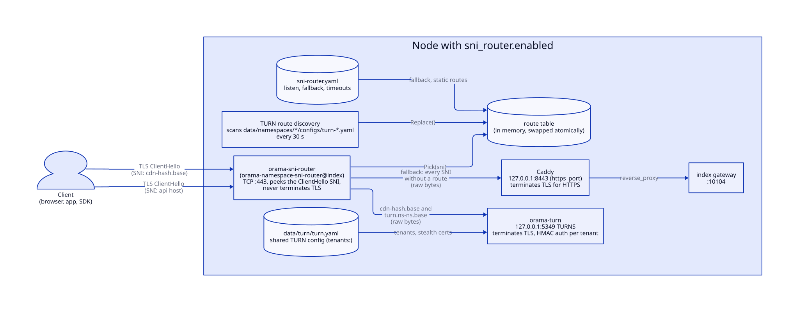
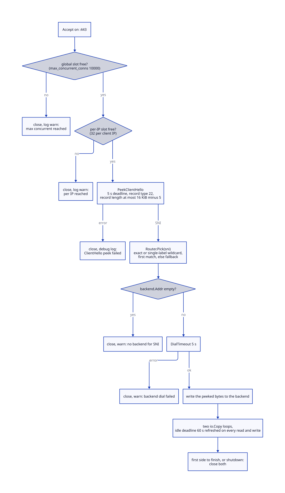
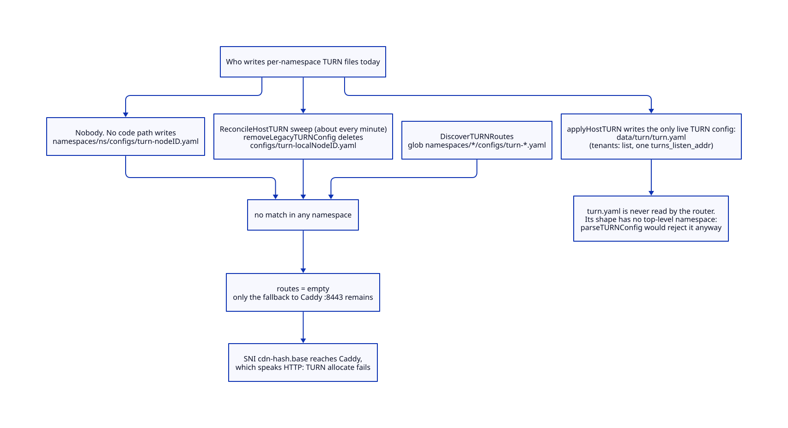
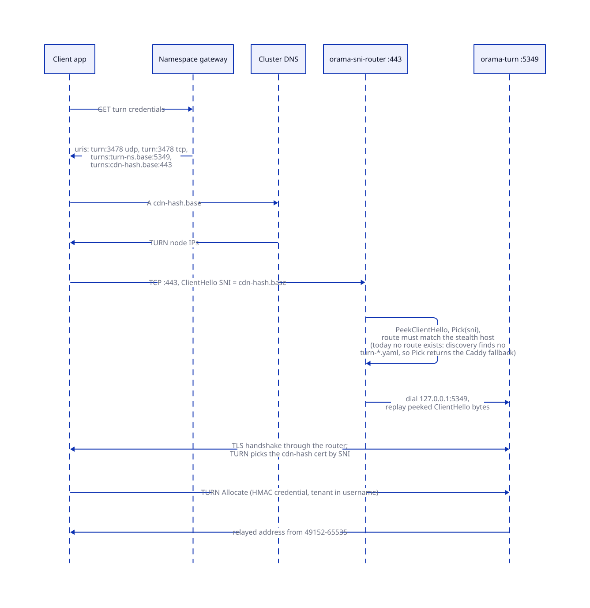
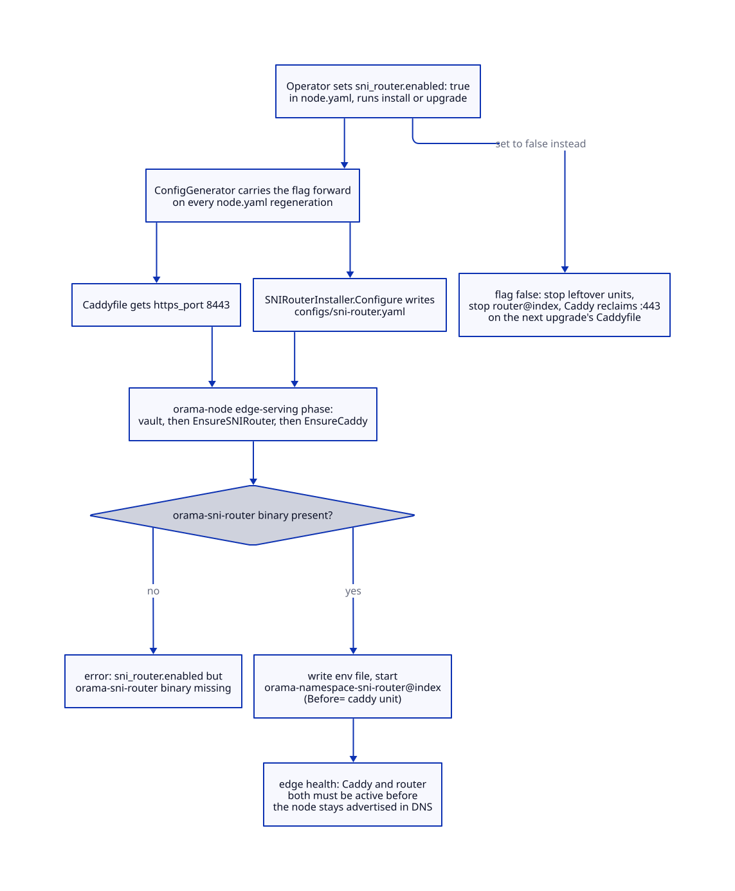

# SNI routing and stealth TURN

> **At a glance.**
>
> - **What:** an opt-in TCP router that takes over port 443 on a node, reads only the unencrypted SNI of each TLS ClientHello, and forwards the still-encrypted stream either to Caddy (every ordinary HTTPS host) or to the node's shared TURN server (the neutral stealth host `cdn-<hash>.<base>`). Its purpose is to let WebRTC relay traffic ride on a port and a handshake that look like ordinary HTTPS to a censoring network. **Verdict on the lead in this chapter's brief: stealth TURN routing is broken today.** The router discovers TURN backends by scanning per-namespace `turn-*.yaml` files that no code writes any more and that the cluster manager deletes as legacy, so on every node that enables the router the discovered route table is empty and the stealth host falls through to Caddy ([the verdict](#verdict-is-stealth-turn-routing-broken-today)).
> - **Key numbers:** router listens on `:443`; Caddy moves to `127.0.0.1:8443`; shared TURNS listener `:5349`; ClientHello deadline 5 s; backend dial 5 s; idle deadline 60 s; 10,000 concurrent connections; 32 connections per client IP; 16 KiB ClientHello cap; route rescan every 30 s; stealth label is `cdn-` plus 12 hex characters of `sha256(namespace)`.
> - **Code:** `core/pkg/sniproxy/`, `core/cmd/sni-router/`, with the surrounding wiring in `core/pkg/install/installers/sni_router.go`, `core/pkg/namespace/index_host.go`, `core/pkg/namespace/cluster_manager_stealth.go`, `core/pkg/namespace/host_turn.go` and `core/pkg/turn/`.
> - **Depends on:** [WebRTC](23-webrtc.md) for the shared TURN server and the credential ladder, [TLS and certificates](25-tls-and-certificates.md) for the wildcard certificate both termination points present, [DNS and nameservers](24-dns-and-nameservers.md) for the stealth A records, and [the node as a supervisor](04-the-node-as-a-supervisor.md) for how the unit is started.



## Why it exists

TURN is the part of WebRTC that relays media when two peers cannot reach each other directly. A TURN server speaks STUN framing over UDP or TCP on port 3478, or over TLS on port 5349. Those are exactly the ports that restrictive networks block first, because they are the standard VoIP ports. A user behind such a network can sign in over HTTPS, signal over a WebSocket, and still never get audio, because every relay candidate the gateway offered points at a blocked port.

Three constraints shaped the router (`core/pkg/sniproxy/sni.go`, package comment; `website/src/docs/operator/stealth-turn.mdx`):

1. **The traffic must look like HTTPS.** The only port that is almost never blocked is 443, and a passive observer sees the TLS ClientHello in clear, including the SNI. Port 443 is therefore not enough: the SNI string must also reveal nothing about the application. A host such as `cdn.ns-anchat.<base>` would hand a filter the exact namespace to block, so the stealth label is a hash (`core/pkg/turn/stealth.go:StealthHostForNamespace`).
2. **Caddy already owns 443.** Every node runs Caddy as its public HTTPS terminator. Something has to share the port. The router does so without terminating TLS, which keeps all private keys in the two processes that already hold them (Caddy and the TURN server) and gives the router no TLS material to leak ("Zero TLS material on the proxy", `core/pkg/sniproxy/sni.go`, package comment).
3. **It must not disturb nodes that do not need it.** Moving Caddy to another port changes the failure surface of every HTTPS request, so the router is off by default and chosen per node (`core/pkg/install/templates/node.yaml`, the `sni_router` block).

The router is deliberately small. It is a bounded ClientHello parser, a route table and a byte pump, about 1,000 lines in `core/pkg/sniproxy/` plus a 320-line binary. All policy (which namespace has a stealth host, which certificate it presents, which DNS records point at it) lives elsewhere and is described here only as far as the router depends on it.

## The model

**SNI router.** The binary `orama-sni-router` (`core/cmd/sni-router/main.go`) running as the template unit `orama-namespace-sni-router@index`. One per node, and only on nodes whose `node.yaml` has `sni_router.enabled: true`. It is built as `bin/orama-sni-router` (`core/Makefile`, `core/cmd/orama/internal/build/builder.go`).

**ClientHello peek.** The first TLS record of a connection, read without consuming it from the router's point of view: the router reads the bytes, extracts the SNI, and later replays every byte it read to the chosen backend, so the backend sees an untouched stream (`core/pkg/sniproxy/sni.go:PeekClientHello`).

**Route.** A pair of an SNI pattern and a backend (`core/pkg/sniproxy/router.go:Route`). A pattern is an exact host or `*.suffix`, which matches exactly one extra label ("single-label like DNS wildcards").

**Backend.** A dial target: a network (default `tcp`), an address, and a name used in logs only (`core/pkg/sniproxy/router.go:Backend`).

**Fallback.** The backend used when no route matches or when the ClientHello carries no SNI. In every config the installer writes, it is Caddy at `127.0.0.1:8443` (`core/pkg/install/installers/caddy.go:CaddyHTTPSPortBehindSNI`).

**Stealth host.** `cdn-<12 hex>.<base>` where the hex is the first 6 bytes of `sha256(namespace)` (`core/pkg/turn/stealth.go:StealthHostForNamespace`). It is one label under the base domain, so the cluster's `*.<base>` wildcard certificate covers it. It is deterministic, so the cluster manager, the gateway, DNS and the TURN server all derive it without coordination.

**TURN hosts of a namespace.** Three names, each for a different purpose:

| Name | Derived by | Used for | Reaches |
|---|---|---|---|
| `turn.ns-<ns>.<base>` | `core/pkg/namespace/dns_manager.go:CreateTURNRecords` | plain TURN on 3478 udp and tcp | `orama-turn` directly |
| `turn-<ns>.<base>` | `core/pkg/turn/stealth.go:TLSHostForNamespace` | TURNS on 5349 | `orama-turn` directly |
| `cdn-<hash>.<base>` | `core/pkg/turn/stealth.go:StealthHostForNamespace` | TURNS on 443 | the router, then `orama-turn` 5349 |

**Stealth enabled.** A per-namespace flag, `namespace_webrtc_config.stealth_enabled`, flipped by `orama namespace enable|disable webrtc-stealth` (`core/pkg/namespace/cluster_manager_stealth.go`). The flag makes the gateway advertise `turns:cdn-<hash>.<base>:443` as the last rung of the URI ladder and puts the stealth host and certificate into the shared TURN config.

**Discovery.** The router's mechanism for learning which namespaces have a TURNS listener: scan the namespaces directory for `turn-*.yaml`, parse the port out of `turns_listen_addr`, emit two routes per namespace (`core/pkg/sniproxy/discovery.go:DiscoverTURNRoutes`). This is the mechanism that no longer sees any input; see the verdict below.

## How it works

### Peeking the ClientHello

`PeekClientHello` reads through a `bufio.Reader` sized at `MaxClientHelloBytes`, 16 KiB, under a read deadline (`core/pkg/sniproxy/sni.go`). The algorithm:

1. Peek 5 bytes. Byte 0 must be 22 (a TLS handshake record); anything else is an error ("not a TLS handshake record"). Bytes 3 and 4 are the record length. A length of zero or one that makes the whole record exceed 16 KiB is rejected.
2. Peek the whole record, then parse it as a ClientHello: handshake type 1, 3 length bytes, version and 32 bytes of random, session id, cipher suites, compression methods, then the extension block. A hello with no extension block returns `ErrNoSNI`.
3. Walk the extensions until type 0 (`server_name`). Inside it, take the first `host_name` entry (name type 0) and lowercase it. A hello with extensions but no `server_name` also returns `ErrNoSNI`.
4. Drain the peeked bytes out of the buffer and return them with the SNI, for replay.

Three properties follow from the code. The parse is a pure bounds-checked cursor (`reader.readByte`, `readUint16`, `readBytes` all return `io.ErrUnexpectedEOF` rather than slicing out of range), so a malformed hello is an error, never a panic. The router sees only the first TLS record: a ClientHello fragmented across two records, which TLS permits, has a record length smaller than the handshake length and fails the parse. And a missing SNI is an error from `PeekClientHello`, not a trigger for the fallback: the server's `handle` closes the connection on any peek error (next section), so the comment on `Router.Pick` ("or if sni is empty") describes a path the server never takes. A client that connects to `:443` by IP address, without SNI, is dropped.

Encrypted ClientHello (ECH) is not handled. With ECH the outer SNI is a public name the client chose and the real name is encrypted, so the router would route on the outer name. The code has no ECH logic and nothing in the repository mentions it.

### Handling one connection



`Server.Serve` accepts in a loop (`core/pkg/sniproxy/server.go`). Admission is two non-blocking semaphores. The global one is a channel of capacity `MaxConcurrentConns`; when it is full the connection is closed and a warning logged. The per-IP one is a channel of capacity `MaxConnsPerIP`, created on first sight of an address in a map; when it is full the global slot is released and the connection closed. Both defaults are set in `NewServer`: 10,000 and 32. The installer writes `max_concurrent_conns: 10000` explicitly; the per-IP cap and the idle timeout are not config fields of the binary (`yamlConfig` in `core/cmd/sni-router/main.go` has no such keys, and `main` passes neither to `NewServer`), so 32 and 60 s are fixed.

`handle` then runs the connection:

1. `PeekClientHello` with `ClientHelloTimeout` (5 s). Any error closes the connection with a debug log "ClientHello peek failed". This is the slowloris bound: a client that never finishes its hello holds a slot for 5 s.
2. `Router.Pick(sni)` under a read lock: lowercase the SNI, walk the routes in order, return the first whose pattern matches, else the fallback (`core/pkg/sniproxy/router.go`). A backend with an empty address closes the connection with a warning.
3. `net.DialTimeout` to the backend (5 s). Failure closes the connection with the warning "backend dial failed".
4. Write the peeked bytes to the backend. This is why the backend, Caddy or TURN, sees a normal ClientHello.
5. Two `io.Copy` goroutines pump bytes in each direction. Both ends are wrapped in `idleConn`, which resets the read or write deadline to 60 s on every operation, so a stalled peer cannot hold a backend slot forever (bugboard 117, cited in the code). When either copy returns, or the server shuts down, both connections are closed and the second goroutine is drained.

There is no half-close handling: the first direction to finish tears both down. TLS closes with an alert in both directions, so this is correct for the two backends in use.

The router never inspects past the ClientHello and never talks TLS, so it cannot tell a TURN allocation from an HTTPS request once the route is chosen. That is the stealth property: the byte stream a censor sees on the wire from the client to the node is a TLS 1.2 or 1.3 session to port 443 with a plausible `cdn-` SNI, indistinguishable at this layer from any other session on that port.

### Routes: the static table and the reloader

The route table is a slice behind a `sync.RWMutex` (`core/pkg/sniproxy/router.go:Router`). `Replace` swaps the whole slice and the fallback in one critical section, so in-flight connections are never affected and a half-updated table is never visible. The comment says "lock-free" for reads; the code takes a read lock, which is non-blocking in practice but not lock-free.

Static routes come from the `routes:` list of `sni-router.yaml`. The binary supports two modes, chosen at startup by whether `turn_discovery.namespaces_dir` is set (`core/cmd/sni-router/main.go:discoveryEnabled`):

- **Without discovery**, a `FileRouteReloader` polls the config file's mtime every 30 s (`core/pkg/sniproxy/reloader.go:DefaultRouteReloadInterval`) and re-applies the file's routes when it advances. A read error keeps the old table. A briefly missing file (an atomic rename) is retried next tick.
- **With discovery**, a `TURNRouteDiscoverer` takes over (next section) and re-reads the config file on every rescan too, because its `StaticRoutes` closure calls `loadConfig` each time. Editing `routes:` therefore still takes effect within one rescan interval.

Startup is stricter than steady state. In either mode the first `Apply` is synchronous and a failure is fatal (`os.Exit(1)`): a router that cannot read its own config or, with discovery, cannot read the namespaces directory refuses to start. Afterwards a failure keeps the previous routes and logs a warning, rate-limited to one per 5 minutes (`core/pkg/sniproxy/discoverer.go:discoveryWarnInterval`).

The config is decoded strictly (`config.DecodeStrict`), so an unknown key is an error, and validated: `listen` and `fallback.addr` are required, every route needs `match` and `backend.addr`, and `namespaces_dir` and `base_domain` must be set together (`core/cmd/sni-router/main.go:validateConfig`).

### Discovery: the intended mechanism

`DiscoverTURNRoutes` is a pure function of the filesystem (`core/pkg/sniproxy/discovery.go`):

1. Read the namespaces directory (`<oramaDir>/data/namespaces`). Failing to read it is an error; the caller keeps the old routes.
2. For each subdirectory, glob `configs/turn-*.yaml` and walk the matches in glob order. The first file that yields a route pair ends the namespace's scan; a file that is skipped (below) lets the walk continue to the next.
3. Parse it as a `turn.Config`. Skip it, with a warning, if it is unreadable, has no `namespace`, or has an invalid `turns_listen_addr`. Skip it silently if `turns_listen_addr` is empty (TURNS disabled).
4. Emit two routes to `127.0.0.1:<port from turns_listen_addr>`: `turn.StealthHostForNamespace(namespace, base)` and `turn.ns-<namespace>.<base>`, both with the backend name `turn-stealth-<namespace>`.
5. Sort all routes by match string, so the result is deterministic.

`mergeRoutes` puts the static routes first and drops any discovered route whose lowercased match equals a static one: static wins on conflict, and because `Pick` is first-match, static routes also win by order.

The design assumed one TURN process per namespace on a distinct port, each described by its own YAML file under its namespace's directory. That assumption is the subject of the next section.

### Verdict: is stealth TURN routing broken today?

**Yes. On the current tree, enabling the SNI router does not make the stealth TURN host reachable.** The evidence, end to end:



1. **The router reads only one place.** `turnConfigGlob` is `configs/turn-*.yaml` under each directory of `<oramaDir>/data/namespaces` (`core/pkg/sniproxy/discovery.go`). The installer writes that directory into `turn_discovery.namespaces_dir`, and writes `routes: []` ("every TURNS route is auto-discovered", `core/pkg/install/installers/sni_router.go:generateConfig`). The router has no other source of TURN backends.

2. **Nothing writes those files.** Outside comments, tests and the router's own glob, the only non-test code in `core/` that names the file pattern `turn-<node>.yaml` is the cleanup in `core/pkg/namespace/host_turn.go:removeLegacyTURNConfig`, which builds `configs/turn-<localNodeID>.yaml` in order to delete it. The per-namespace spawn that used to write the file was replaced when TURN became one shared server per host (bugboard 283, commit 0e136588).

3. **The only live TURN config is elsewhere and has a different shape.** `applyHostTURN` writes `/opt/orama/.orama/data/turn/turn.yaml` (`core/pkg/constants/paths.go:HostTURNConfigPath`), which `orama-turn.service` reads. It holds `listen_addr`, `public_ip`, `realm`, relay range, one `turns_listen_addr` for the whole host, and a `tenants:` list (`core/pkg/turn/config.go:Config`). It has no top-level `namespace`. Even if the router were pointed at it, `parseTURNConfig` would reject it with "turn config has empty namespace".

4. **The cleanup actively removes any leftover.** `stopLegacyPerNamespaceTURN` runs in every `ReconcileHostTURN`, which the WebRTC reconcile sweep calls every 60 s (`core/pkg/namespace/cluster_manager_webrtc.go:webrtcReconcileInterval`), and calls `removeLegacyTURNConfig` for every namespace in `cluster-state.json`, whether or not the legacy unit was stopped. A file named for this node that survives from before the migration is deleted within a minute of the node running current code. The delete is narrower than the router's glob: it removes only `turn-<localNodeID>.yaml` and only under namespaces that have a `cluster-state.json` here, so a `turn-<otherNodeID>.yaml` left by a node that kept its disk but changed its node ID would survive and still be discovered. Nothing in the code creates that situation; it is a hole in the cleanup, not a working path.

5. **The result is an empty discovered table.** With no matching file in any namespace, `DiscoverTURNRoutes` returns no routes without error. `Apply` installs the static routes (none) and the Caddy fallback. The router logs nothing unusual: an empty scan is not a failure.

6. **What a stealth client therefore sees.** Its ClientHello carries `cdn-<hash>.<base>`, no route matches, `Pick` returns the fallback, and the stream reaches Caddy on `127.0.0.1:8443`. Caddy holds the `*.<base>` wildcard certificate, so the TLS handshake can complete and look healthy. The client then sends STUN framing to an HTTP server and the allocation never succeeds. This last step is derived from the code (Caddy is an HTTP server and the router passes bytes verbatim); this chapter did not observe it on a live fleet.

7. **Nothing in the test suites catches it.** The discovery tests build the legacy on-disk shape by hand (`core/pkg/sniproxy/discovery_test.go:writeTURNConfig`, "the on-disk shape the namespace spawner produces") and pass. The fleet e2e `TestStealth_enableDisableOrRollBack` asserts that the credentials response gains and loses the `turns:cdn-...:443` URI; it never dials port 443 (`e2e/features/webrtc/stealth_test.go`). The URI is advertised from a database flag and a gateway config string, independently of whether anything serves it.

The comments in `core/pkg/namespace/cluster_manager_stealth.go` ("the SNI router on :443 discovers the route ... from the TURN config files on disk") still describe the pre-283 design. The stealth ladder rung, the DNS records and the TURN-side certificate selection all work, which makes the failure silent: every control-plane step reports success.

What is not broken: plain TURN on 3478 and TURNS on 5349 are served by the shared server directly and do not pass through the router, so a namespace with stealth enabled keeps its baseline relay ladder. Only the 443 rung is dead, and only on nodes that enabled the router. On nodes that did not enable it, the rung is also dead, for a simpler reason: Caddy owns 443 and the stealth host reaches Caddy.

A repair needs the router to learn the stealth hosts from the shared config (one `turns_listen_addr`, the `stealth_domain` of every tenant) instead of from per-namespace files. That is a code change in `core/pkg/sniproxy/discovery.go` and the matching installer comment; it is recorded under Known gaps.

### The shared TURN side of the stealth path

The router is half of the path. The other half is the shared TURN server, and it is intact.



`orama-turn.service` is one process per host (`core/systemd/orama-turn.service`), configured from the 0600 file `data/turn/turn.yaml` written by `core/pkg/namespace/host_turn.go:writeHostTURNConfig`. Each tenant entry carries `stealth_domain`, `tls_stealth_cert_path` and `tls_stealth_key_path` when stealth is enabled for it. `desiredHostTURNTenants` fills them in from the exported wildcard (`core/pkg/namespace/systemd_spawner.go:resolveStealthCert`), which accepts the stealth host only if it is exactly one label under the base domain. If the wildcard is not exported yet, the tenant is served without stealth and a warning is logged; the code never falls back to a self-signed certificate, because "a cert clients reject is indistinguishable from being blocked".

The TURN server builds a `tls.Config` whose `GetCertificate` chooses by ClientHello SNI: a tenant's stealth host maps to that tenant's certificate reloader, every other name gets the primary certificate (`core/pkg/turn/server.go:newGetCertificateMulti`, `core/pkg/turn/tenant_reload.go`). Two tenants claiming the same stealth host is refused for the later one. The server re-reads its config every 2 s (`core/pkg/turn/tenant_reload.go:TenantReloadInterval`) and each certificate file every 60 s, so enabling stealth for one namespace never restarts the process and never drops another namespace's relays.

Important for the router: the stealth connection ends at the same TLS listener as `turns:...:5349`, the one `turns_listen_addr` for the host. The router needs to know exactly one backend address per node, `127.0.0.1:5349`, for all stealth hosts. TURN authenticates the allocation by the HMAC credential, not by which SNI the client used, so the SNI only selects a certificate.

The gateway side of the ladder is in `core/pkg/gateway/handlers/webrtc/credentials.go`: `turn:<host>:3478?transport=udp`, `turn:<host>:3478?transport=tcp`, `turns:<tls-host>:5349`, and, when the namespace gateway config has `turn_stealth_domain`, `turns:<stealth-host>:443` last. Browsers iterate that list, so a user whose network blocks the first three reaches the fourth. The same ladder is built for serverless functions in `core/pkg/serverless/hostfunctions/turn.go:buildTURNURIs`.

### Enabling stealth for a namespace

`orama namespace enable webrtc-stealth` posts to `/v1/namespace/webrtc/stealth/enable`, handled by `ClusterManager.EnableWebRTCStealth` (`core/pkg/namespace/cluster_manager_stealth.go`):

1. Require WebRTC enabled and stealth not already enabled (`ErrWebRTCStealthAlreadyEnabled` answers 409).
2. Collect the namespace's TURN allocations and the public IPs of those nodes.
3. `CreateStealthTURNRecords`: A records for the stealth host, tagged `namespace-turn-stealth:<ns>`. It refuses a host that another namespace already claims, which guards the truncated-hash collision case (`core/pkg/namespace/dns_manager.go`).
4. Set `stealth_enabled = 1`.
5. `respawnTURNWithStealth` validates every TURN allocation against live membership and calls `ReconcileHostTURN` on the node handling the request, so the shared config gains the tenant's stealth entry. Other TURN hosts apply it from their own reconcile. If this fails, `rollbackStealthEnable` clears the flag and deletes the DNS records.
6. `refreshStateAndGateways` rewrites `cluster-state.json` with the stealth domain and restarts the namespace gateways so `turn.credentials` advertises the new rung.

Disabling reverses the order: flag off, host reconcile, delete the DNS records, refresh gateways. TURN and the baseline ladder keep running. The `respawn` in the function names is historical: since the shared server it performs no restart.

The CLI prints that this "provisions a Let's Encrypt cert for the neutral stealth host and may take up to ~2 minutes" (`core/cmd/orama/internal/namespace_commands.go`). No certificate is provisioned for the stealth host; the wildcard is reused. The message is stale.

Note that step 5 acts on the receiving node's own TURN allocation. Hosts that did not receive the request converge through the 60-second WebRTC reconcile; between enable and convergence the DNS records already point at them.

### Enabling the router on a node



The switch is `sni_router.enabled` in `node.yaml` (`core/pkg/config/config.go:SNIRouterConfig`). The config generator reads the existing file on every regeneration and carries the value forward, so an upgrade never silently turns the router off (`core/pkg/install/config.go:readExistingSNIRouterEnabled`). The template default for a fresh install is `false`.

During install or upgrade, when the flag is true (`core/pkg/install/orchestrator.go`, the Caddy and router configuration phase):

1. `EnableCaddySNIRouterMode` makes the Caddyfile emit `https_port 8443` in its global options. The default is no such line, so Caddy binds 443 as before (`core/pkg/install/installers/caddy.go:CaddyHTTPSPortBehindSNI`). HTTP on port 80 is unaffected and Caddy's other global options (DNS-01 storage in the cluster's shared store, HTTP/1.1 only) are unchanged.
2. `SNIRouterInstaller.Configure` writes `<oramaDir>/configs/sni-router.yaml` with mode `0644` through the root-only `rootfs` writer. Fixed contents: `listen: ":443"`, `client_hello_timeout: 5s`, `backend_dial_timeout: 5s`, `max_concurrent_conns: 10000`, `fallback` Caddy at `127.0.0.1:8443`, `turn_discovery` with the namespaces directory, the base domain and `rescan_interval: 30s`, and `routes: []`. Installing again overwrites the file; there is no merge, so operator-added static routes are lost on the next install or upgrade.

At node start the supervisor runs the edge-serving phase: vault, then `IndexSupervisor.EnsureSNIRouter`, then Caddy (`core/pkg/node/index_host.go:startIndexEdgeServing`). `EnsureSNIRouter` stops the pre-migration `orama-sni-router.service` if present, checks for the `orama-sni-router` binary under `/opt/orama/bin`, writes the unit's environment file and starts `orama-namespace-sni-router@index` (`core/pkg/namespace/index_host.go`). A missing binary is an error that fails the phase, not a silent skip. The unit is ordered `Before=orama-namespace-caddy@%i.service` and `PartOf=orama-node.service`, runs as the `orama` user with only `CAP_NET_BIND_SERVICE`, `NoNewPrivileges`, `ProtectSystem=strict` and `Restart=always` with `RestartSec=5s`, and has no start limit (`core/systemd/orama-namespace-sni-router@.service`).

When the flag is false, `EnsureSNIRouter` stops and disables the leftover legacy unit, stops `orama-namespace-sni-router@index` if it is active and disables the leftover. Caddy gets the 443 binding back only when the next install or upgrade regenerates the Caddyfile without `https_port`; flipping the flag and restarting `orama-node` alone leaves Caddy on 8443 with no router in front of it. The rollback path is therefore flag, then upgrade, not flag then restart.

The router is part of the node's public-serving promise. `EdgeServing` lists Caddy and, when the flag is set, the router unit as the units that must be active for the node's DNS records to stay advertised (`core/pkg/namespace/index_host.go:edgeUnits`). After 2 consecutive failed 30-second heartbeat ticks (`core/pkg/node/dns_registration.go:edgeDownTicks`) the node withdraws its records. A router that crash-loops therefore takes its node out of DNS; this is the intended fail-closed behaviour, since a node whose 443 is dead should not receive traffic.

## State it owns

| What | Where | Writer | Reader |
|---|---|---|---|
| `sni_router.enabled` | `node.yaml`, `<oramaDir>/configs/node.yaml` | operator, carried forward by `core/pkg/install/config.go` | `orama-node` (`n.config.SNIRouter.Enabled`), the installer |
| Router config | `<oramaDir>/configs/sni-router.yaml`, `0644` | `SNIRouterInstaller.Configure` (root, install and upgrade) | `orama-sni-router` at start and on every rescan or reload |
| Route table and fallback | memory of the router process | `Router.Replace` from the discoverer or reloader | `Router.Pick` per connection |
| Per-IP slots | memory, a map from client IP to a channel; entries are never removed | `Server.ipSlot` | `Server.Serve` |
| Unit and env file | `orama-namespace-sni-router@index`, `/var/lib/orama-unit-env/index/sni-router.env` (optional) | `EnsureSNIRouter` | systemd |
| Listening socket | TCP `:443` (all interfaces) | `net.Listen` in `core/cmd/sni-router/main.go` | the Internet |
| Caddy listener | `127.0.0.1:8443` per the router's fallback; Caddy itself binds `https_port 8443` on its default addresses | Caddyfile | the router |
| Stealth flag | `namespace_webrtc_config.stealth_enabled` in the namespace RQLite | `setStealthEnabled` | `stealthDomainFor`, gateway config |
| Stealth DNS records | index RQLite `dns_records`, tag `namespace-turn-stealth:<ns>` | `CreateStealthTURNRecords`, `EnsureTURNRecordForNode` | CoreDNS |
| Shared TURN config | `/opt/orama/.orama/data/turn/turn.yaml`, `0600` | `writeHostTURNConfig` | `orama-turn.service` |
| Legacy per-namespace TURN config | `<namespaces>/<ns>/configs/turn-<node>.yaml` | nobody; deleted by `removeLegacyTURNConfig` | the router's discovery (finds nothing) |

The router holds no durable state. A restart rebuilds the table from the config file and the scan within one startup `Apply`. A connection in flight at restart is closed (`KillMode=mixed`, `TimeoutStopSec=15s`).

## Lifecycle

**Boot.** `orama-node` reaches the edge-serving phase after the index gateway is up. It starts the router, then Caddy. The unit's `Before=` makes systemd start the router first when both are being started together. Between the two starts, 443 accepts connections that the router forwards to a Caddy that is not yet listening on 8443; those connections fail with "backend dial failed" and clients retry. The window is as short as Caddy's start.

**Normal operation.** The discoverer rescans every 30 s. Each scan costs one directory read plus one glob per namespace, and replaces the table even when nothing changed. On the current tree the scan finds no files, so the table is empty after the first scan.

**Rolling upgrade, mixed versions.** The router, Caddy's listener move and the TURN config are all node-local; nothing is exchanged between nodes, so there is no wire protocol to version. During a rolling upgrade a node that already runs a build without the legacy files and a node that still has them differ only in what their local scans find. The one cross-node effect is DNS: the stealth host resolves to every TURN node of a namespace (round-robin), including nodes that do not run the router or have not yet converged their shared config, so a fraction of stealth connection attempts lands on a node that cannot serve them until the whole fleet has the flag and the config.

**Restart of the router.** `Restart=always` with a 5 s delay. All proxied connections drop, including live TURN-over-443 relays and every in-progress HTTPS connection on that node, since the router fronts all HTTPS. Clients reconnect. Because the router is in the 443 data path for all traffic, a router restart is as disruptive to the node as a Caddy restart.

**Node loss.** The node's DNS records are withdrawn when its edge check fails for 2 ticks; clients on cached answers retry other addresses. Stealth TURN has no state to migrate: a client that loses its relay re-allocates through another node's 443.

**Decommission.** The wipe path stops and removes `orama-sni-router` and the binary (`core/cmd/orama/internal/production/decommission/wipe.go`).

## Failure modes

| Trigger | What the system does | What you observe |
|---|---|---|
| Stealth host requested, no route (the current state) | `Pick` returns the fallback; bytes go to Caddy on 8443 | TLS handshake succeeds with the wildcard certificate, then TURN allocate times out; no router log line |
| Namespaces directory unreadable at start | router exits 1 | unit restarts every 5 s; `Failed to install initial routes` in the journal |
| Namespaces directory unreadable later | previous routes kept | `TURN route discovery failed; keeping current routes`, at most once per 5 minutes |
| `sni-router.yaml` invalid at start | router exits 1 with the validation errors on stderr | crash loop |
| `sni-router.yaml` edited to invalid | previous routes and fallback kept | `TURN route discovery failed` warning |
| One malformed `turn-*.yaml` | that file skipped, others unaffected | `parse turn config failed` warning per scan |
| Client sends no SNI, or plain HTTP, or a fragmented hello | connection closed | `ClientHello peek failed` at debug level only |
| Client never completes the hello | closed after 5 s | the same debug line |
| Caddy unit active but not listening on 8443 | every ordinary HTTPS connection fails | `backend dial failed` warnings; the node's edge check stays green because it tests only that the units are active |
| TURN not listening (or no TLS because the wildcard is not exported) | stealth connections fail at dial | `backend dial failed` for the TURN address, once routes exist |
| 10,000 connections open | new connections closed immediately | `max concurrent connections reached, dropping` |
| 32 connections from one address | the 33rd closed | `max connections per IP reached, dropping` |
| Stalled peer | closed after 60 s without a read or write | none |
| Router crash-loop | after 2 failed edge ticks the node withdraws its DNS records | the node disappears from round-robin; `orama monitor` shows the unit down |
| Router enabled on a node whose Caddy was not regenerated | both try to bind 443; the later one fails | whichever starts second crash-loops |
| Clock skew | not used; the router has no timestamps beyond local deadlines | none |
| Disk full | the router writes only to the journal; start fails if the config cannot be read | journal errors |

## Trust and security

**What the router can see.** It sees the client's IP, the SNI, and the ClientHello bytes. It sees no plaintext afterwards and holds no keys. A compromise of the router process yields traffic metadata and the ability to redirect connections, not decrypted traffic or certificate private keys, since those live in Caddy and the TURN server and the router's code never opens a certificate or key file. The unit runs as the unprivileged `orama` user with a one-capability bounding set.

**What it hides from the network.** The SNI stays visible, as in any TLS 1.2 or 1.3 session without ECH. The stealth host's label reveals neither the namespace nor that the endpoint is TURN: 12 hex characters of a SHA-256 truncated to 6 bytes. This is blandness, not secrecy: anyone who knows a namespace name can compute its stealth host (`core/pkg/turn/stealth.go`), and the DNS records for the stealth host are public, so the full set of stealth hosts and their IPs is enumerable by anyone who can guess namespace names. A censor that wants to block the technique generally, rather than a namespace, can block any SNI starting with `cdn-` plus 12 hex characters, or block the node IPs.

**What it does not hide.** The server's TLS fingerprint is the TURN server's Go `crypto/tls` behaviour, not Caddy's; the two differ in cipher selection and extension handling, so an active prober that connects to a stealth host and compares it against an ordinary host can tell them apart. Traffic analysis (a long-lived stream carrying small bidirectional packets at media rates) is not disguised at all. The design goal is to defeat blocking by port and by SNI, not an adversary that fingerprints flows.

**Authentication.** The stealth path adds no authentication of its own. A TURN allocation still needs an HMAC-SHA1 credential minted by the namespace gateway for that namespace (`{expiry}:{namespace}`), verified against the namespace's own secret (`core/pkg/turn/config.go:TenantSecret`). The SNI only chooses which certificate the server presents; a client using namespace A's stealth host with namespace B's credential is authenticated as B, because the credential carries the tenant, not the SNI.

**Positions.**

| Attacker | Can | Cannot |
|---|---|---|
| Passive on-path | see client IP, node IP, SNI, record sizes and timing | read content, tell TURN from HTTPS by port or by SNI alone |
| Active on-path | block by IP or by `cdn-` pattern; reset connections | decrypt or inject without the certificate key |
| Remote client | open 32 connections per address and 10,000 in total; hold each up to 5 s before a hello and 60 s idle | reach a backend other than those in the route table; reach TURN without a valid credential |
| Co-tenant on the node | read the world-readable router config (`0644`), which holds no secret | read the shared TURN config (`0600`, owner `orama`) |
| Local user on the node | nothing the router adds: it listens on a public port and forwards to loopback | |

**Source address.** The router connects to Caddy and TURN from `127.0.0.1`, and it does not speak the PROXY protocol (no such code exists under `core/`). The consequence is described under Limits and scale.

## Limits and scale

| Limit | Value | Source |
|---|---|---|
| Concurrent connections | 10,000 | `core/pkg/sniproxy/server.go:Config`, `core/pkg/install/installers/sni_router.go` |
| Connections per client IP | 32, not configurable | `core/pkg/sniproxy/server.go:NewServer` |
| ClientHello size | 16 KiB including the 5-byte header | `core/pkg/sniproxy/sni.go:MaxClientHelloBytes` |
| ClientHello deadline | 5 s | `Config.ClientHelloTimeout` |
| Backend dial | 5 s | `Config.BackendDialTimeout` |
| Idle | 60 s per read or write | `core/pkg/sniproxy/server.go:idleConn` |
| Rescan or reload | 30 s | `DefaultDiscoveryRescanInterval`, `DefaultRouteReloadInterval` |
| Open files | 65,536 | `LimitNOFILE` in the unit |
| Routes per namespace | 2 (stealth host and `turn.ns-` alias) | `discoverNamespaceRoutes` |

Each proxied connection uses two sockets (client and backend) and two goroutines, so 10,000 connections need 20,000 descriptors and the unit's 65,536 is not the first limit; the connection cap is.

**Per-IP cap and shared addresses.** The 32-connection limit counts every connection to port 443 from an address, not only stealth ones, because once the router is enabled it fronts all HTTPS. Users behind carrier-grade NAT, the population stealth TURN is for, share addresses. A busy office or mobile gateway with more than 32 simultaneous HTTPS and WebSocket connections to the node is refused at the router. The per-IP map also never evicts: one channel per distinct address ever seen stays in memory for the life of the process. At 10x the traffic that is a slow memory growth proportional to distinct client addresses, not to connections.

**Client address loss.** Caddy and the gateway receive every connection from `127.0.0.1`, because the router terminates the TCP connection and opens a new one. Caddy appends its peer to `X-Forwarded-For`, so the last entry the gateway reads is `127.0.0.1`. `core/pkg/gateway/clientkey/clientkey.go:Resolve` treats a loopback peer with a forwarded entry as the entry's address, so every public client behind a router-enabled node resolves to the bucket for `127.0.0.1`: rate-limit buckets keyed by client are shared across all clients of that node, and request logs and namespace affinity attribute every request to loopback. This follows from the code paths named here and was not observed on a fleet. See [rate limits and egress controls](27-rate-limits-and-egress-controls.md) for the buckets affected.

**First bottleneck.** Single-threaded accept is not a limit at these rates; the first bottleneck is the per-IP cap for NAT users, then the global 10,000. The router adds one extra loopback hop and one extra copy of every byte of HTTPS traffic through two userspace `io.Copy` loops. For HTTPS the cost is small relative to TLS; for media relay it is a second hop in the user-space data path on top of TURN's own.

At 10x the fleet, nothing in the router scales with fleet size: it is per node and has no cluster state. Discovery cost scales with the number of namespaces on a node (one glob each every 30 s).

## Design decisions

### Pass the bytes through instead of terminating TLS

*Chosen:* peek the ClientHello and forward ciphertext. *Rejected:* terminate TLS in the router and re-encrypt or forward in clear. *Why:* the router would need the wildcard private key and a copy of every tenant's stealth certificate; TURN already terminates its own TLS and Caddy its own. The comment in `core/pkg/turn/config.go:Config` states the model: "The stealth endpoint is an SNI-router passthrough, NOT a separate TURN server".

### Caddy moves, the router takes 443

*Chosen:* move Caddy to 8443 and put the router on 443 as the fallback's front door. *Rejected:* leave Caddy on 443 and give TURN another public port, or let Caddy do the SNI split. *Why:* the whole point is port 443. Nothing in the repository's Caddy build (`caddy/` holds only the storage and DNS-01 provider modules) forwards raw TLS streams by SNI. The cost is that every HTTPS connection now crosses the router, which is why its failure takes the node out of DNS and why client addresses are lost to Caddy.

### Opt-in per node

*Chosen:* a default-off `node.yaml` flag carried forward across regeneration. *Rejected:* always on. *Why:* the router changes the HTTPS path on every node it runs on. Nodes whose operators do not need stealth keep Caddy on 443. The flag is per node because only TURN-hosting nodes need it, though nothing in the code ties the flag to TURN placement.

### A bland hashed host instead of a readable one

*Chosen:* `cdn-` plus 12 hex of `sha256(namespace)`. *Rejected:* a readable `cdn.ns-<namespace>` form. *Why:* an SNI that contains the namespace tells a filter which application to block. Twelve hex characters keep collisions negligible at platform scale (`core/pkg/turn/stealth.go:stealthHostHashBytes`), and `CreateStealthTURNRecords` refuses a host already claimed by another namespace as a defence against the rest. The human-readable `turn.ns-<ns>` alias exists for operators.

### Static routes win

*Chosen:* operator routes precede and override discovered ones. *Rejected:* discovered wins. *Why:* an operator who writes a route for a host wants it honoured. In practice the installer emits no static routes and rewrites the file on every upgrade, so the override has no users today.

### Keep the old routes on a scan error

*Chosen:* a failed rescan leaves the table untouched and warns at most every 5 minutes. *Rejected:* clear the table or exit. *Why:* "a filesystem hiccup must never blackhole live :443 traffic" (`core/pkg/sniproxy/discoverer.go`). This is the one tolerated degrade, justified because 443 carries all the node's HTTPS. The same property also means a vanished source of truth is not noticed: an empty scan is success, which is how the verdict above stays silent.

### A fixed 32 per-IP cap

*Chosen:* a constant default with no config key. *Rejected:* a tunable. *Why:* the code states no reason beyond a per-IP bound on resource use (`core/pkg/sniproxy/sni.go`, design goals). It is a weak decision for the NAT users the feature serves; see Limits and scale.

## Known gaps

- **Stealth TURN routing is broken (bug).** `core/pkg/sniproxy/discovery.go:DiscoverTURNRoutes` scans `configs/turn-*.yaml` under each namespace directory; since TURN became one shared server per host, no code writes those files and `core/pkg/namespace/host_turn.go:removeLegacyTURNConfig` deletes any that remain. The router's table has no TURN routes and `turns:cdn-<hash>.<base>:443` reaches Caddy. The URI is still advertised, DNS still resolves, and the e2e test passes because it never connects. Fix direction: derive routes from the shared TURN config (`data/turn/turn.yaml`, one listener port, tenants' `stealth_domain`), rewrite `core/pkg/sniproxy/discovery_test.go` to the shared shape, and add a fleet e2e that dials the stealth host on 443 and completes an allocation.
- **Stale text.** The comments in `core/pkg/install/installers/sni_router.go:generateConfig`, `core/cmd/sni-router/main.go` and `core/pkg/namespace/cluster_manager_stealth.go`, and the CLI message in `core/cmd/orama/internal/namespace_commands.go` (a Let's Encrypt certificate for the stealth host) describe the removed per-namespace design.
- **Client address is lost behind the router.** There is no PROXY protocol or equivalent; Caddy and the gateway see `127.0.0.1` for every connection, so per-client rate limiting and request attribution collapse to one key on router-enabled nodes (`core/pkg/gateway/clientkey/clientkey.go:Resolve`). Not observed live.
- **Missing SNI is dropped, not sent to the fallback.** `PeekClientHello` returns `ErrNoSNI` and `Server.handle` closes the connection, contradicting the `Router.Pick` comment and making direct-by-IP HTTPS to a router node fail.
- **Per-IP cap is fixed at 32 and its map never shrinks** (`core/pkg/sniproxy/server.go:ipSlot`). It counts all HTTPS, not only stealth, and punishes NAT users.
- **No ECH handling and no multi-record ClientHello support.** A hello split across TLS records is rejected; the router routes on the outer SNI only.
- **Dead code: `core/pkg/gateway/tcp_sni_gateway.go`.** `TCPSNIGateway` is a TLS-terminating, SNI-routing TCP server configured by `gateway.sni` (`core/pkg/config/gateway_config.go:SNIConfig`). Nothing constructs it outside its own file. It is the earlier design for SNI routing of internal services such as RQLite Raft and is unrelated to the router in this chapter.
- **Install overwrites `sni-router.yaml`.** Operator static routes do not survive an upgrade, which makes the static-routes feature unusable in practice.
- **Rollback needs an upgrade.** Setting the flag to false stops the router but leaves Caddy on 8443 until the Caddyfile is regenerated; `website/src/docs/operator/stealth-turn.mdx` describes this as the rollback path but does not say that a restart alone leaves 443 unserved.
- **The blueprint does not model the move.** The Caddy entry in `core/pkg/namespace/blueprint.go` declares fixed ports 80 and 443 (`IndexCaddyHTTPSPort`) while a router-enabled Caddy binds 8443; the router entry declares 443, which is correct.
- **The edge check tests units, not paths.** `core/pkg/namespace/index_host.go:EdgeServing` asks whether the Caddy and router units are active, not whether the router can dial Caddy on 8443 or a TURN backend, so a node whose Caddy is active but not bound to 8443 stays advertised.

## Verify it yourself

**Unit tests.**

```bash
cd core && go test ./pkg/sniproxy/... ./pkg/install/installers/... ./pkg/turn/... ./pkg/install/...
```

- `core/pkg/sniproxy/sni_test.go`: `TestPeekClientHello_returns_sni`, `TestPeekClientHello_lowercases_sni`, `TestPeekClientHello_non_tls_returns_error`, `TestPeekClientHello_short_record_returns_error`, `TestPeekClientHello_concurrent_safe`.
- `core/pkg/sniproxy/router_test.go`: exact, wildcard, case-insensitive matching, atomic `Replace` (`TestRouter_replace_atomic`).
- `core/pkg/sniproxy/server_test.go`: `TestServer_routes_TLS_to_correct_backend`, `TestServer_no_backend_drops_connection`, `TestServer_perIPCap`.
- `core/pkg/sniproxy/discovery_test.go` and `discoverer_test.go`: discovery against a fixture directory (`TestDiscoverTURNRoutes_scansFixtureDir`), merge precedence, and keeping routes on error. These tests lay out the legacy per-namespace files and are the reason the break is not caught.
- `core/pkg/install/installers/sni_router_test.go` and `core/pkg/install/sni_router_test.go`: the generated config and the flag carry-forward (`TestGenerateNodeConfig_preservesSNIRouterEnabled`).
- `core/pkg/turn/stealth_server_test.go`: certificate selection by SNI (`TestGetCertificate_stealthSNISelectsStealthCert`); `core/pkg/turn/stealth_test.go`: the hash host does not leak the namespace (`TestStealthHostForNamespace_namespaceNotLeaked`).

**Fleet e2e.** `e2e/features/webrtc/` covers enabling and disabling stealth and the advertised ladder (`TestStealth_enableDisableOrRollBack`), but does not dial 443. `e2e/features/install/units_test.go` lists the router unit. The owner runs these with `make e2e-fleet`.

**Live, read-only.** On a node with the router enabled:

```bash
orama node logs orama-namespace-sni-router@index
cat /opt/orama/.orama/configs/sni-router.yaml
ls /opt/orama/.orama/data/namespaces/*/configs/ | grep turn-
sudo cat /opt/orama/.orama/data/turn/turn.yaml
```

The router log shows `Loaded SNI router configuration` and `SNI router listening`; the `routes` count it logs is the number of static routes in the file, which is 0. The directory listing shows no `turn-*.yaml` file, which confirms the router has nothing to discover. The shared TURN config (read as the `orama` user) lists `tenants:` with a `stealth_domain` per stealth namespace. To confirm the verdict from a client, resolve the stealth host from `orama namespace` output or the credentials response, then run `openssl s_client -connect <node-ip>:443 -servername cdn-<hash>.<base>`: the handshake completes with the wildcard certificate, and a TURN allocate over it does not.
