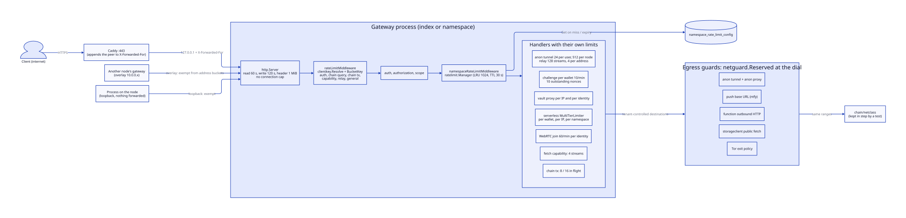
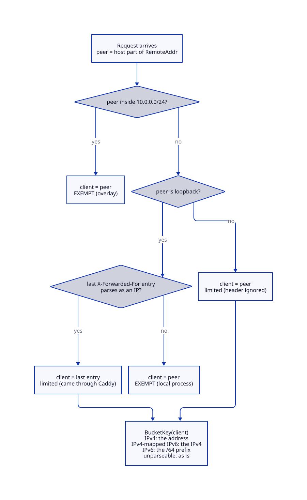
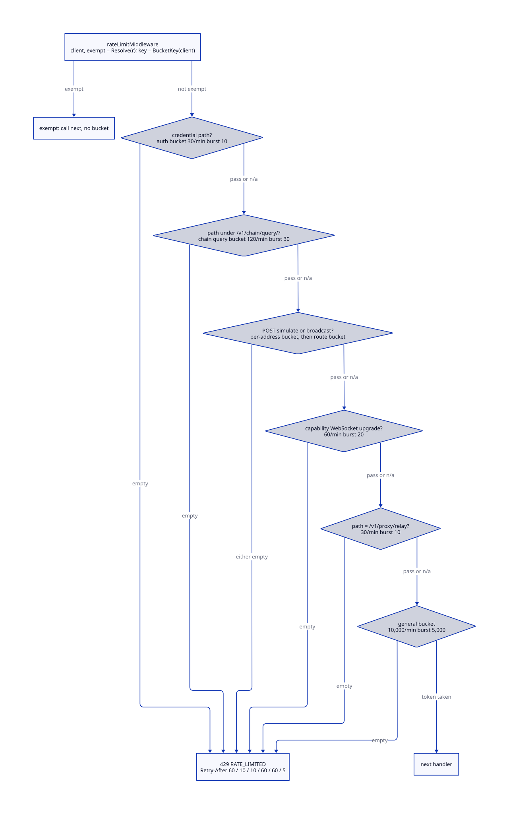
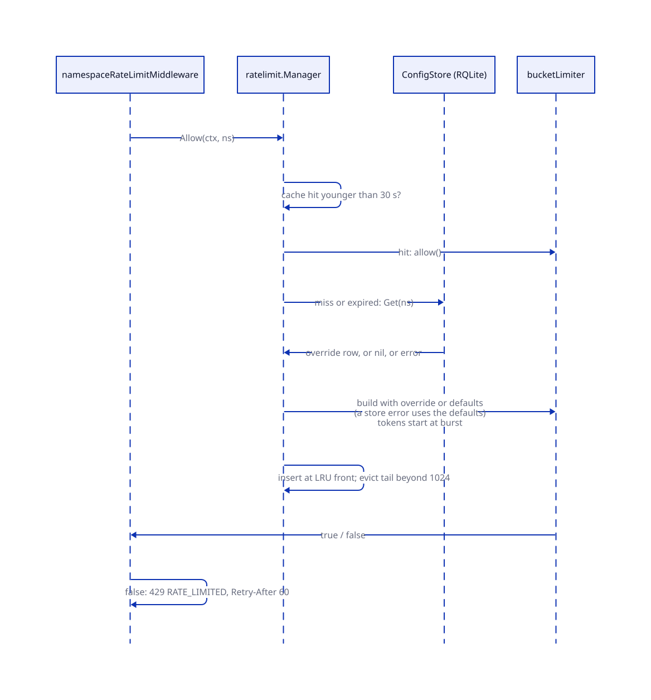
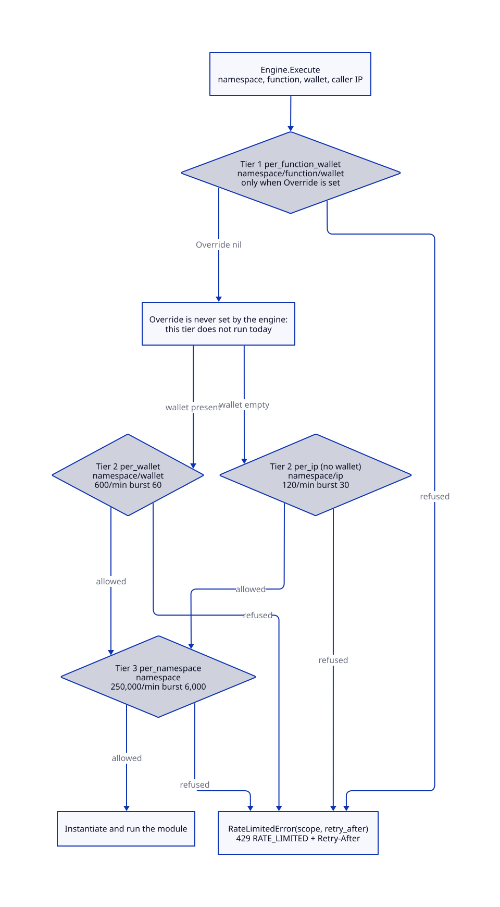
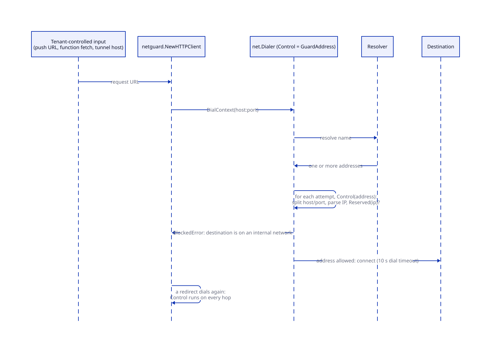

# Rate limits and egress controls

> **At a glance.**
>
> - **What:** two groups of controls that bound what a caller can make the platform do. Rate limits and concurrency caps bound how much load a client, a wallet, a namespace or a capability can put on a gateway, a function engine, an SFU or the chain. Egress controls bound where tenant-controlled code and tenant-supplied URLs may connect: one list of reserved address ranges (`core/pkg/netguard/`) is checked at the moment of dialing by push, function HTTP, the anonymity tunnel and the Tor exit policy.
> - **Key numbers:** general bucket 10,000 per minute, burst 5,000, per client network; credential endpoints 30 per minute, burst 10; per-namespace bucket 10,000 per minute, burst 5,000 by default, tenant-settable up to 100,000 and 50,000; bucket entries swept after 10 min idle; namespace limiter cache 1,024 entries with a 30 s lifetime; IPv6 clients limited as their /64; overlay and local-process callers exempt; 33 reserved ranges in the egress list.
> - **Code:** `core/pkg/gateway/rate_limiter.go`, `core/pkg/gateway/rate_limit_key.go`, `core/pkg/gateway/chain_tx_limit.go`, `core/pkg/gateway/webrtc_join_limit.go`, `core/pkg/gateway/clientkey/`, `core/pkg/ratelimit/`, `core/pkg/gateway/handlers/ratelimit/`, `core/pkg/netguard/`, and the limiters that live next to the thing they protect (listed in [the complete list of limiters](#the-complete-list-of-limiters)).
> - **Depends on:** [gateway architecture](12-gateway-architecture.md) for the middleware order, [identity](13-identity.md) for the credential endpoints, [the WireGuard mesh](06-the-wireguard-mesh.md) for the overlay that is exempt, and [TLS and certificates](25-tls-and-certificates.md) for Caddy in front of the gateway.



## Why it exists

A gateway is the one process that stands between the public internet and a shared registry, a shared function runtime, shared Tor circuits and a shared chain endpoint. Several of its routes are cheap to call and expensive to serve: a challenge writes a replicated nonce row, a signature check runs elliptic-curve recovery, a chain query runs on the node's chain process, a join probes every SFU. Without a bound, the first client that loops on one of them takes the capacity of every other client, and for the credential routes the loop is also an attack.

Two constraints shaped the design.

First, the limiter has to key on something the caller cannot choose. The first implementation keyed on the first `X-Forwarded-For` entry and exempted every address in the WireGuard subnet. A caller could write that header, so one header value removed all rate limiting, including from the endpoints that mint credentials. The rewrite keys on the TCP peer, and trusts a forwarded address only from the one proxy that appends a trustworthy value (`core/pkg/gateway/clientkey/clientkey.go`, the comment above `Resolve`).

Second, tenants run code and name URLs, and the node they run on sits on the cluster's own network. A function that fetches `http://10.0.0.5/` reaches the overlay that carries RQLite, Olric and every other namespace's services. A push base URL that resolves to `169.254.169.254` reaches the cloud metadata service. Checking the URL string cannot work: a name is not an address, the resolver decides what it becomes, the answer can change between the check and the connection, and a redirect can lead somewhere the first URL never named. The check belongs at the connection, where the address is final (`core/pkg/serverless/hostfunctions/egress.go`, package comment).

The rest of the chapter follows from those two. The limiters are small token buckets and counters held in memory, one per gateway process, because a shared counter would put a registry round trip on every request. The egress guard is one list, in one package, used by every component that dials a tenant-controlled destination, so a range added for one is refused by all.

## The model

**Client network.** The identity a bucket is charged to. It is the TCP peer address of the request, or, when the peer is the local reverse proxy, the last `X-Forwarded-For` entry. An IPv4 client is its address; an IPv6 client is its /64 prefix; an IPv4-mapped IPv6 address is its IPv4 form (`core/pkg/gateway/clientkey/clientkey.go:BucketKey`).

**Exempt traffic.** Requests from another node over the overlay (peer inside `10.0.0.0/24`) and from a process on the same machine that reached the gateway with nothing forwarded. They draw on no address bucket.

**Token bucket.** A bucket holds up to `burst` tokens and refills at `rate` tokens per second, where the configuration is stated per minute. A request takes one token or is refused. The first request of a new key finds a full bucket (`burst - 1` after it takes its token). Every bucket in this chapter except the sliding windows named below is this structure.

**Bucket.** One limiter with its own rate and burst, keyed by something: a client network, a wallet, a namespace, a route. A request can be checked against several buckets in sequence; the first empty one refuses it.

**Concurrency cap.** A counter or semaphore of things in flight (tunnels, streams, downloads, signed-transaction calls). It bounds how many a caller holds at once, where a bucket bounds how fast they start.

**Operator ceiling.** The largest per-namespace rate a tenant may set for itself: 100,000 requests per minute and a burst of 50,000 (`core/pkg/gateway/gateway.go`, the `rlDefaults` value).

**Reserved address.** An IP that no tenant-reachable connection may target. The set is `net.IP`'s own predicates (loopback, private, link-local, multicast, unspecified) plus 33 CIDRs (`core/pkg/netguard/netguard.go:Ranges`).

**Guarded dial.** A connection made through a `net.Dialer` whose `Control` function is `netguard.GuardAddress`, so every socket address the OS is about to connect to is checked after resolution.

## How it works

### Finding the client

`clientkey.Resolve` answers two questions for a request: whom to charge, and whether the request is internal traffic exempt from limits. It reads the peer from `RemoteAddr`, never from a header, and follows this order.



1. A peer inside the WireGuard subnet (`auth.WireGuardSubnet`, `10.0.0.0/24`) is another node's service. The client is the peer and the request is exempt. The mesh is not reachable from outside.
2. A loopback peer with a parseable last `X-Forwarded-For` entry came through Caddy. The client is that entry and the request is not exempt. Everything before the last entry is whatever the caller claimed, so it is ignored. Every public request reaches the gateway from `127.0.0.1`, so exempting loopback would exempt the internet.
3. A loopback peer with nothing forwarded (or an unparseable value) is a process on this node, for example a service talking to the index gateway. The request is exempt.
4. Any other peer is a direct connection from off the node. The client is the peer and `X-Forwarded-For` is ignored entirely.

`BucketKey` then turns the client into the map key. An IPv6 subscriber is routinely handed a whole /64 and can source requests from any address in it, so a bucket per address would give one client 2^64 of them. The /64 is the smallest network a single host can be assumed to own (`ipv6BucketBits = 64`).

`clientkey.Attribute` answers the other question: whom to name in the request log, the audit trail, namespace affinity and the `X-Forwarded-For` handed to proxied services. It trusts the last forwarded entry from two peers, the local reverse proxy and another node's gateway on the mesh (which forwards one value it resolved itself), and never exempts. Anything else is the client, and neither the first entry nor `X-Real-IP` is read. The cluster gateway, its auth audit, the serverless handlers and the vault proxy share these functions, so no handler keeps its own reading of the header.

### The gateway-wide buckets

`rateLimitMiddleware` sits fifth in the stack, after the internal-auth gate, route policy, logging and security headers, and before CORS, readiness, routing and authentication (the full order is in [the middleware stack](12-gateway-architecture.md#the-middleware-stack)). It runs before authentication on purpose: the credential routes are among the ones it protects. `configureRateLimiters` creates the buckets once per gateway, so their relative sizes are decided in one place.

For a non-exempt request the middleware computes the bucket key once and checks the buckets below in order. The first empty bucket answers 429.



| Order | Bucket | Applies to | Per minute | Burst | Retry-After |
|---|---|---|---|---|---|
| 1 | credential | `/v1/auth/challenge`, `verify`, `api-key`, `token`, `refresh`, `device`, `device/approve`, `device/token`, `devices/approve` | 30 | 10 | 60 s |
| 2 | chain query | any path under `/v1/chain/query/` | 120 | 30 | 10 s |
| 3 | chain transaction, per client | `POST /v1/chain/simulate` | 30 | 10 | 10 s |
| 3 | chain transaction, per client | `POST /v1/chain/broadcast` | 12 | 4 | 10 s |
| 3 | chain transaction, whole route | simulate / broadcast | 1,200 / 600 | 200 / 100 | 10 s |
| 4 | capability upgrade | a function WebSocket upgrade that carries a capability | 60 | 20 | 60 s |
| 5 | relay stream | `/v1/proxy/relay` | 30 | 10 | 60 s |
| 6 | general | everything else, and everything that passed the above | 10,000 | 5,000 | 5 s |

The numbers come from `core/pkg/gateway/gateway.go:configureRateLimiters` and the constants next to each route (`core/pkg/gateway/rate_limit_key.go:chainQueriesPerMinute`, `core/pkg/gateway/chain_tx_limit.go`, `core/pkg/gateway/ws_capability.go:capabilityUpgradesPerMinute`, `core/pkg/gateway/relay_tunnel_handler.go:relayStreamsPerMinute`). A request on a special path passes through its own bucket and then through the general one; the general bucket is the floor for all non-exempt traffic.

Each choice has a reason in the code.

**Credentials.** A challenge writes a nonce row and a verify runs signature recovery. A person signing in makes two or three calls; 30 a minute with a burst of 10 is far above that and far below what grinding needs, while the general bucket is no obstacle to grinding at all. The nine paths are one bucket, shared across them, so alternating endpoints does not multiply the allowance (`core/pkg/gateway/rate_limit_key.go:isAuthRateLimitPath`).

**Chain query.** Each request runs a query on the node's chain process. The explorer does not use the route, so a person browsing is nowhere near 120 a minute.

**Chain simulate and broadcast.** A wallet with no node of its own simulates and broadcasts through the gateway. The chain already makes a spam transaction cost its sender a fee, so the gateway bounds load only. Each route has two buckets: one per client network and one for the whole route on this gateway, so many addresses together cannot lift the load either. `chainTxLimiter.allow` takes from the client bucket first and from the route bucket only if the client bucket allowed, so one noisy address cannot use up the route. A broadcast is a write that reaches every validator's mempool, so its buckets are the tighter. Only a `POST` draws on these buckets (`chainTxLimiterFor`).

**Capability upgrade and relay.** A capability-opened WebSocket carries no credential and the relay takes none, so the address is all that can be limited. On a namespace gateway the peer is the overlay address of the cluster gateway that proxied the request, which is exempt; these buckets are therefore effective on the gateway that sees the client.

**Responses.** The credential, chain, capability and relay refusals use the RPC error envelope (`RATE_LIMITED`, `retryable: true`, `retry_after`) through `httputil.WriteRPCError`. The general bucket answers a plain-text `rate limit exceeded` with `Retry-After: 5`.

**Bucket state.** `RateLimiter` holds a map from key to `{tokens, lastCheck}` behind one mutex. A new key starts with `burst - 1` tokens. `StartCleanup(5 min, 10 min)` removes entries idle for 10 minutes. All state is per gateway process: a client spread over the three gateways of a cluster draws on three sets of buckets.

### Per-gateway scope

No bucket in this chapter is shared between gateways. A shared counter would put a registry write or a mesh round trip on every request, and the buckets would stop working when the registry leader is unavailable. The cost is that the effective cluster-wide rate for a client or a namespace is N times the configured rate, where N is the number of gateways it can reach. A tenant who needs a cluster-wide cap sets the per-gateway value to the cap divided by N (`core/pkg/ratelimit/types.go`, comment on `Config`). `GET /v1/namespace/rate-limit` returns `"scope": "per-gateway"` in every answer so a tenant sees this in the data.

### The per-namespace limit

`namespaceRateLimitMiddleware` is the fourteenth step of the stack, after authentication, authorization and the scope gate, so the namespace is known from the credential. It reads `CtxKeyNamespaceOverride` from the request context; if it is empty the request passes. Otherwise it asks `ratelimit.Manager.Allow(ctx, namespace)` and answers 429 `RATE_LIMITED` with `Retry-After: 60` when the bucket is empty.

Requests to a tenant's `ns-<name>` host are proxied by domain routing, which runs above authentication, so on the cluster gateway they never reach this step; the namespace gateway that serves them charges the namespace. A request served by the cluster gateway itself under a tenant credential is charged there.



`Manager` keeps a map and a linked list of compiled limiters, one per namespace.

1. On a hit younger than `cacheEntryTTL` (30 s) it moves the entry to the front and returns the limiter.
2. On a miss or an expired entry it calls `ConfigStore.Get`. A row in `namespace_rate_limit_config` overrides the defaults (only positive fields; a zero field keeps the default). A store error is logged and the defaults are used: the manager prefers letting a request through under the safe default to refusing it because the config table is briefly unavailable.
3. It builds a fresh token bucket from the resulting rate and burst, with the bucket full, inserts it at the front and evicts from the back beyond `defaultCacheCap` (1,024).
4. If two goroutines build at once, the second returns the first one's limiter, so a namespace has one limiter.

The 30 s lifetime bounds how long a changed configuration can be invisible on a gateway that did not handle the `PUT`, without a broadcast layer. The `PUT` and `DELETE` handlers call `Invalidate(namespace)` so the gateway that took the change applies it at once. The defaults are 10,000 per minute and burst 5,000, and `Defaults.Sane` replaces non-positive values with those numbers, because a zero rate would let every request through.

`namespace_rate_limit_config` has one row per namespace (`namespace`, `requests_per_minute`, `burst`, `updated_at`, `updated_by`; migration `core/migrations/027_namespace_rate_limit_config.sql`). It lives in the namespace's own database but is platform-owned: `core/pkg/sqlguard/sqlguard.go` refuses tenant SQL that touches the table, because writing it would lift the caller's own ceiling.

### Tenant configuration

`/v1/namespace/rate-limit` is a control route in the `namespace` domain with `write` action (`core/pkg/gateway/route_policy.go`), so the route policy decides who may call it ([authorization](14-authorization.md)). The handler additionally requires a JWT subject (`401` without one).

| Method | Effect |
|---|---|
| `GET` | Returns the effective values, `source` (`override` or `default`), `scope`, the operator maxima and the audit fields. |
| `PUT` or `POST` | Body `requests_per_minute` and `burst`, both required and positive, at most 1 KiB. Rejected `400` when either exceeds the operator ceiling (100,000 and 50,000). Upserts the row in one statement, records the caller's subject in `updated_by`, invalidates the local cache entry. |
| `DELETE` | Removes the row (idempotent) and returns the defaults. |

The handlers answer `503` when the gateway has no store.

### Failure handling of the limiters

Every limiter is in process memory. A restart empties them, which gives every client a full burst. The only limiter with an external dependency is the namespace manager, and it fails open to its defaults. No limiter blocks on I/O on the request path except the manager's `Get` on a miss, which runs on the request's own context.

### Serverless invocation tiers

The function engine has its own limiter, because a gateway request that reaches `POST /v1/functions/.../invoke` or a function WebSocket is charged once more per invocation. `serverless.MultiTierLimiter` checks up to four scopes in order, and the first refusal wins (`core/pkg/serverless/ratelimit.go:AllowRequest`).



| Scope | Key | Per minute | Burst |
|---|---|---|---|
| `per_function_wallet` | namespace, function, wallet | the function's own value, only if it declares one | its own, default one tenth of the rate (at least 1) |
| `per_wallet` | namespace, wallet | 600 | 60 |
| `per_ip` | namespace, address; only when the caller has no wallet | 120 | 30 |
| `per_namespace` | namespace | 250,000 | 6,000 |

Buckets live in four sharded LRU maps of at most 100,000 entries each (16 shards); an evicted bucket is a limit reset for that key. The namespace tier takes its rate from `serverless.Config.GlobalRateLimitPerMinute` (default 250,000; `core/pkg/gateway/dependencies.go` copies it into `LimiterConfig.PerNamespacePerMinute`) while its burst stays at the limiter default of 6,000. A refusal is `RateLimitedError` carrying the scope and the time until a token is available; the invoke handlers answer `429`, `RATE_LIMITED`, and the same value in `Retry-After` and the envelope's `retry_after` (`core/pkg/gateway/handlers/serverless/invoke_handler.go`). The per-IP key uses `clientkey.Attribute`. [Serverless functions](21-serverless.md) covers the engine around the limiter.

Per-invocation budgets exist beside the buckets. Because the WASM runtime has no fuel metering and the buckets gate invocation frequency, not host-call volume, a function may publish at most 1,000 pub/sub messages per invocation (`core/pkg/serverless/hostfunctions/pubsub.go:maxPublishesPerInvocation`), a batch publish takes at most 100 entries (`pubsub.MaxBatchSize`), and at most 256 asynchronous invocations are in flight (`core/pkg/serverless/hostfunctions/context.go:asyncInvokeMaxInFlight`).

### Challenge and nonce limits

The sign-in challenge is public, writes a replicated row for whatever wallet the body names, and the caller need not own it. Three limits apply in sequence.

1. The credential bucket above (per client network).
2. A per-wallet bucket: 10 challenges a minute, burst 5, keyed by the lower-cased wallet from the body, whoever asks (`core/pkg/gateway/handlers/auth/wallet_rate_limit.go:walletLimiter`). It caps a distributed grind against one victim's wallet, which would otherwise fill the nonce table for that wallet and push out the challenge the victim is about to answer. The refusal is `429`, `Retry-After: 60`, a plain error body. Idle wallet buckets are dropped after 30 minutes.
3. A ceiling of 10 unanswered, unexpired nonces per wallet and namespace (`core/pkg/gateway/auth/nonce_limits.go:maxOutstandingNonces`). The count runs in the registry before the insert; a count that cannot be made is an error, never permission to skip the ceiling. The refusal is `429 TOO_MANY_CHALLENGES`, `Retry-After: 300`.

Challenges live five minutes (`ChallengeTTL`). A reaper (`StartNonceReaper`) deletes expired rows and used rows older than one hour every 10 minutes, so the table is bounded by the issue rate and not by history. [Identity](13-identity.md#issuing-a-challenge) covers the sign-in flow these limits guard.

### Connection and stream caps

These are concurrency caps. They protect descriptors, memory and Tor circuits, not request rate.

| Cap | Value | Where |
|---|---|---|
| Anonymity tunnel per user | 24 concurrent | `core/pkg/gateway/anon_tunnel_handler.go:tunnelMaxPerUser` |
| Anonymity tunnel per node | 512 concurrent | `tunnelMaxTotal` |
| Tunnel lifetime, idle, bytes | 30 min, 2 min idle, 256 MiB each direction | `tunnelMaxDuration`, `tunnelIdleTimeout`, `tunnelMaxBytes` |
| Tunnel destination ports | 80 and 443 only | `tunnelAllowedPorts` |
| Relay streams per node | 128, apart from the tunnel pool | `core/pkg/gateway/relay_tunnel_handler.go:relayMaxStreams` |
| Relay streams per client network | 4 at once | `relayMaxStreamsPerAddress` |
| Relay stream size, lifetime | 64 MiB each direction, 5 min | `relayMaxBytes`, `relayMaxDuration` |
| Relayed downloads per fetch capability | 4 at once | `core/pkg/gateway/handlers/storage/relayed_download.go:maxConcurrentPerFetchCap` |
| Signed-transaction calls in flight | simulate 8, broadcast 16; the rest `503` with `Retry-After: 2` | `core/pkg/gateway/handlers/chainread/tx.go:simulateMaxConcurrent` |
| Signed transaction size | 1 MiB (CometBFT's default `max_tx_bytes`) | `core/pkg/gateway/handlers/chainread/tx.go:txMaxBytes` |
| WebRTC join per identity | 60 a minute, burst 20; keyed by wallet subject, else by client network | `core/pkg/gateway/webrtc_join_limit.go:webrtcJoinAllowed` |
| SFU signalling per peer | bucket of 40, refill 10 a second, offers and ICE candidates; 6 glare yields a minute; exceeding either closes the socket | `core/pkg/sfu/ratelimit.go:signalLimiter` |
| SNI router connections | 10,000 total, 32 per source IP | `core/pkg/sniproxy/server.go:MaxConnsPerIP` |
| Gateway HTTP server | header read 10 s, read 60 s, write 120 s, idle 120 s, headers 1 MiB; no connection cap | `core/cmd/gateway/main.go` |
| Namespace gateway unit | `LimitNOFILE=65536`, `MemoryMax=1G` | `core/systemd/orama-namespace-gateway@.service` |

The tunnel and relay caps sit in different pools. An authenticated tunnel needs the `proxy` grant and a wallet JWT; the relay takes no credential and reaches only hosts under its allowed suffixes on port 443. The relay's per-address cap exists because the bucket bounds how fast streams open, and without a cap a patient client could hold the whole 128-stream pool for the stream lifetime. [Gateway architecture](12-gateway-architecture.md#anonymity-proxies) covers what the two proxies do; the Tor side is in [anonymity and Tor](../vol2/38-anonymity-and-tor.md).

A tunnel or relay stream counts against a per-node pool, not a per-cluster one, so a user can hold 24 tunnels on each node they can reach.

The vault proxy has two limiters of its own, because a password or seed guess is cheap to repeat. A per-source-address limiter (60 pulls and 30 pushes a minute, burst equal to a minute's budget) catches many identities from one address; a per-identity limiter (30 pushes and 120 pulls an hour, burst one sixth of that) catches one identity from many addresses (`core/pkg/gateway/handlers/vault/ratelimit.go:IPRateLimiter`, `core/pkg/gateway/handlers/vault/rate_limiter.go:IdentityRateLimiter`). Each address uses `clientkey.Resolve` and `BucketKey`, the same resolution as the gateway's own buckets. The Zig guardian behind it has a third limit, a fixed window of 120 requests per 60 seconds per peer address (`vault/src/server/listener.zig:RATE_LIMIT_MAX`). See [vault](28-vault.md).

### The complete list of limiters

The table lists every limiter in the system. "Owner" names the chapter that explains the mechanism around it; this chapter explains the arithmetic and the client resolution.

| Limiter | Key | Limit | Scope | Where | Owner |
|---|---|---|---|---|---|
| General request bucket | client network | 10,000 / min, burst 5,000 | per gateway process | `core/pkg/gateway/gateway.go:configureRateLimiters` | this chapter, [12](12-gateway-architecture.md#rate-limits) |
| Credential bucket | client network | 30 / min, burst 10 | per gateway | `core/pkg/gateway/rate_limit_key.go:isAuthRateLimitPath` | this chapter, [13](13-identity.md#issuing-a-challenge) |
| Chain query bucket | client network | 120 / min, burst 30 | per gateway | `core/pkg/gateway/rate_limit_key.go:chainQueriesPerMinute` | this chapter, [39](../vol2/39-chain-architecture.md) |
| Chain simulate buckets | client network; whole route | 30 / min burst 10; 1,200 / min burst 200 | per gateway | `core/pkg/gateway/chain_tx_limit.go:chainTxLimiter` | this chapter |
| Chain broadcast buckets | client network; whole route | 12 / min burst 4; 600 / min burst 100 | per gateway | `core/pkg/gateway/chain_tx_limit.go:chainTxLimiter` | this chapter |
| Chain tx calls in flight | route | 8 simulate, 16 broadcast | per gateway | `core/pkg/gateway/handlers/chainread/tx.go:simulateMaxConcurrent` | this chapter |
| Capability upgrade bucket | client network | 60 / min, burst 20 | per gateway | `core/pkg/gateway/ws_capability.go:capabilityUpgradesPerMinute` | this chapter, [14](14-authorization.md) |
| Relay stream bucket | client network | 30 / min, burst 10 | per gateway | `core/pkg/gateway/relay_tunnel_handler.go:relayStreamsPerMinute` | this chapter, [12](12-gateway-architecture.md#anonymity-proxies) |
| Relay stream caps | node; client network | 128 total; 4 per address | per node | `core/pkg/gateway/relay_tunnel_handler.go:relayMaxStreams` | this chapter |
| Anonymity tunnel caps | wallet; node | 24 per user; 512 per node | per node | `core/pkg/gateway/anon_tunnel_handler.go:tunnelLimiter` | this chapter, [38](../vol2/38-anonymity-and-tor.md) |
| Fetch capability streams | capability id | 4 at once | per gateway | `core/pkg/gateway/handlers/storage/relayed_download.go:fetchCounter` | [19](19-storage.md) |
| Per-namespace bucket | namespace | 10,000 / min, burst 5,000; tenant-set up to 100,000 / 50,000 | per gateway | `core/pkg/ratelimit/manager.go:Manager` | this chapter |
| Wallet challenge bucket | wallet in body | 10 / min, burst 5 | per gateway | `core/pkg/gateway/handlers/auth/wallet_rate_limit.go:walletLimiter` | this chapter, [13](13-identity.md#issuing-a-challenge) |
| Outstanding nonces | wallet and namespace | 10 unanswered | cluster (counted in the registry) | `core/pkg/gateway/auth/nonce_limits.go:maxOutstandingNonces` | this chapter, [13](13-identity.md#issuing-a-challenge) |
| WebRTC join bucket | wallet subject, else client network | 60 / min, burst 20 | per gateway | `core/pkg/gateway/webrtc_join_limit.go:webrtcJoinAllowed` | [23](23-webrtc.md) |
| SFU signalling bucket and glare window | peer | 40 burst + 10 / s; 6 yields / min | per SFU peer | `core/pkg/sfu/ratelimit.go:signalLimiter` | [23](23-webrtc.md) |
| Serverless tiers | namespace/function/wallet; namespace/wallet; namespace/address; namespace | see the serverless table above | per gateway | `core/pkg/serverless/ratelimit.go:MultiTierLimiter` | this chapter, [21](21-serverless.md) |
| Serverless per-invocation budgets | invocation | 1,000 publishes; 256 async in flight | per invocation / per process | `core/pkg/serverless/hostfunctions/pubsub.go:maxPublishesPerInvocation` | [21](21-serverless.md), [20](20-pubsub.md) |
| Vault proxy per address | client network | 60 pulls, 30 pushes / min | per gateway | `core/pkg/gateway/handlers/vault/ratelimit.go:IPRateLimiter` | [28](28-vault.md) |
| Vault proxy per identity | identity hash | 120 pulls, 30 pushes / hour | per gateway | `core/pkg/gateway/handlers/vault/rate_limiter.go:IdentityRateLimiter` | [28](28-vault.md) |
| Vault guardian per peer | TCP peer address | 120 / 60 s fixed window | per guardian | `vault/src/server/listener.zig:RATE_LIMIT_MAX` | [28](28-vault.md) |
| SNI router connections | total; source IP | 10,000; 32 | per router | `core/pkg/sniproxy/server.go:MaxConnsPerIP` | [26](26-sni-routing-and-stealth-turn.md) |
| Push | none of its own | uses the gateway and namespace buckets above | per gateway | no code of its own | [22](22-push-notifications.md) |
| Gateway connection cap | listener | 10,000 (`LimitedListener`); not applied to the running gateway | per listener | `core/pkg/gateway/connlimit.go:LimitedListener` | this chapter, Known gaps |
| Chain base fee | gas | per-gas base fee advanced by block fullness | chain-wide | `chain/x/fees/keeper/abci.go:AdvanceBaseFee` | [40](../vol2/40-economics.md) |
| Chain validator minimum gas price | transaction | validator-local mempool admission | per validator | `chain/x/fees/ante/fee_decorator.go:checkValidatorMinGasPrice` | [39](../vol2/39-chain-architecture.md) |
| Chain replica releases | provider | 2 per epoch by default | chain-wide | `chain/x/storage/types/params.go:DefaultMaxReleasesPerEpoch` | [41](../vol2/41-storage-deals.md) |

The Push row has no code location because push has no limiter of its own; the push registration and send routes are throttled only by the gateway-wide and per-namespace buckets ([push notifications](22-push-notifications.md)).

Three entries in the table are not requests per second. The three chain rows are protocol rules that make an action cost something or happen at most so often: a transaction pays at least the base fee, a validator may add a stricter local minimum, and a provider may drop at most two replicas per epoch. The gateway's chain buckets exist because those rules protect the chain, not the gateway in front of it.

### Egress controls

The egress half of the chapter is one package. `core/pkg/netguard/netguard.go` holds `Ranges`, the CIDRs refused beyond what `net.IP`'s predicates cover: the unspecified, private, CGNAT, loopback, link-local, IETF-assignment, documentation, benchmarking (`198.18.0.0/15`, where the co-located chain namespace lives), multicast and reserved IPv4 blocks, and the IPv6 forms (loopback, unspecified, IPv4-compatible and IPv4-mapped, NAT64, discard, Teredo-range assignments, 6to4, documentation, segment-routing SIDs, unique-local, link-local, site-local, multicast) that embed or alias an IPv4 host. `Reserved(ip)` is true for a nil address, for anything in `net.IP`'s own predicates, and for anything in `Ranges` after unmapping an IPv4-mapped address.



`GuardAddress` is the `net.Dialer.Control` hook. The OS calls it after resolution with the concrete `host:port` the socket is about to connect to, once per attempt, for every address the resolver returned, and for every hop of a redirect. It splits the address, parses the IP and refuses (a `BlockedError` naming the address) if the address does not parse or is reserved. A name that resolves, or is rebound, to an internal address is therefore refused at the connection, and no check made on a string earlier can be bypassed by the resolver. `NewHTTPClient(timeout)` wraps a dialer with this hook (10 s dial timeout, 30 s keep-alive), TLS handshake timeout 10 s, idle connection timeout 90 s and at most 100 idle connections.

The same list is used at five places.

| Consumer | How it uses the list | Code |
|---|---|---|
| Function outbound HTTP | Every function's HTTP client is `netguard.NewHTTPClient(httpTimeout)`, default 30 s. | `core/pkg/serverless/hostfunctions/egress.go:newGuardedHTTPClient` |
| Push base URL | A tenant-set ntfy URL is checked when set (`CheckBaseURLResolvable`: scheme, literal address, non-standard numeric encodings such as decimal, hex and octal, then resolution with a 5 s limit, failing closed on a name that does not resolve) and again at every send: the tenant's server is reached through `NewHTTPClient`, which also covers DNS rebinding after the check, and the client refuses any redirect. The operator's own ntfy on loopback is trusted and does not go through the guard. | `core/pkg/push/url_guard.go:CheckBaseURLResolvable`, `core/pkg/push/providers/ntfy/ntfy.go` |
| Anonymity tunnel | The target is validated for form, a literal address must be public (`!Reserved`), `localhost` and `.localhost` are refused, and the port must be 80 or 443. The host is not resolved on the gateway: the name goes to the Tor exit verbatim, which is also why a name that resolves to a private address cannot reach this node's network. | `core/pkg/gateway/anon_tunnel_handler.go:parseTunnelTarget` |
| Anonymous request proxy | A literal private or local host in the URL is refused (`CodeDestinationNotAllowed`); names are resolved at the exit. | `core/pkg/gateway/anon_proxy_handler.go:isPrivateOrLocalHost` |
| Tor exit policy | An exit relay refuses every IPv4 range in `Ranges` plus the abuse-prone ports (25, 465, 587, 119, 135-139, 445, 563, 1214, 4661-4666, 6346-6429, 6699, 6881-6999) and exits no IPv6. Tor refuses most private ranges by default; the shared list adds `100.64.0.0/10` and `198.18.0.0/15`. | `core/pkg/tornet/exitpolicy.go:ExitPolicyLines` |
| Public storage fetch, relay address checks | `storageclient.IsPublic` and `tornet.PublicIPv4` are `!Reserved`. | `core/pkg/storageclient/public_http.go:IsPublic`, `core/pkg/tornet/network.go:PublicIPv4` |

The chain module cannot import core, so `chain/netclass` classifies the same ranges separately for endpoint validation, the node network identity and the repair fetcher (`chain/netclass/netclass.go:IsPublic`). A test in the chain module reads `Ranges` out of the core source file and fails when `netclass` refuses a range that `netguard` does not list (`chain/netclass/netclass_test.go:TestNetclassRangesAreCoveredByCoreNetguard`). The other direction is allowed to differ: `netguard` also lists AS112, AMT and the IPv6 loopback and unspecified addresses.

The test reads `netguard.go` with a regular expression that expects one CIDR per line in `Ranges`, which is why the file comment says to keep one CIDR per line and nothing else in the list.

### What the egress guard does not cover

The guard bounds destinations, not volume. A function may fetch any public address at the rate its invocation allowance gives it, and the guard says nothing about the content. The anonymity tunnel and the relay are the exceptions: they have byte, duration and stream caps (the table above). Function outbound traffic is bounded by the function's timeout and memory limit and by the per-invocation request count the engine sets, not by a bandwidth cap; see [serverless functions](21-serverless.md).

## State it owns

| State | Holds | Writer | Reader | Lives in |
|---|---|---|---|---|
| `namespace_rate_limit_config` | tenant override of rate and burst per namespace, with `updated_by` | `PUT`/`DELETE /v1/namespace/rate-limit` through the store | `ratelimit.Manager` on a miss or expiry; the `GET` handler | the namespace's own RQLite database (platform-owned; tenant SQL refused by `sqlguard`) |
| Namespace limiter cache | up to 1,024 compiled token buckets with build time | `Manager.getOrBuild`, `Invalidate` | `Manager.Allow` | memory of each gateway |
| `rateLimiter`, `authRateLimiter`, `capabilityRateLimiter`, `relayRateLimiter`, `chainQueryRateLimiter`, `webrtcJoinRateLimiter` | key to `{tokens, lastCheck}` maps | `rateLimitMiddleware`, `webrtcJoinAllowed` | the same | memory of each gateway; swept every 5 min, entries idle 10 min dropped |
| `chainSimulateLimiter`, `chainBroadcastLimiter` | a per-client map and a one-key route bucket each | `rateLimitMiddleware` | the same | memory of each gateway |
| `tunnelLimiter`, `relayService.perAddr`, `fetchCounter.open` | counts per user, per address, per capability | acquire and release in the handlers | the same | memory of each gateway |
| `walletLimiter` | wallet to bucket | `handlers/auth` challenge handler | the same | memory; idle buckets dropped after 30 min |
| `nonces` rows | issued challenges, counted for the 10-outstanding ceiling | `CreateChallenge`, the reaper | `checkOutstandingNonces` | index registry (RQLite) |
| `MultiTierLimiter` | four sharded LRU bucket maps, 100,000 entries each | `AllowRequest` | the same | memory of each gateway |
| `netguard.Ranges` and its parsed prefixes | the reserved list | compiled in | every guarded dial | the binary |

The only durable state is two registry tables: the per-namespace override and the nonce rows. Everything else resets on restart.

## Lifecycle

**Boot.** `gateway.New` calls `configureRateLimiters` and builds `ratelimit.Manager` with the compiled defaults and operator ceiling. With an ORM client it wires `NewRqliteConfigStore`; without one (tests, standalone) the manager has no store and returns the defaults for every namespace, and the configuration endpoint answers `503`. The nonce reaper starts with the gateway context. Each limiter's cleanup goroutine starts at creation.

**Normal operation.** Requests draw tokens. Tenant configuration changes apply at once on the gateway that handled the `PUT`, and within 30 s on the others.

**Rolling upgrade.** The limiters are not versioned or shared, so a mixed-version cluster has no compatibility problem. A restarted gateway starts every client with a full burst, so a rolling restart briefly lets each client spend one burst per restarted gateway.

**Restart of the gateway.** All limiter state is lost, with the effect above. Nonce rows survive, so the 10-outstanding ceiling is unaffected.

**Node loss.** A lost gateway removes its buckets. Clients that were sent to it by DNS are re-sent to the others, which hold their own, fuller buckets for those clients.

**Shutdown.** `Gateway.Close` stops the cleanup goroutines of the general, chain query and WebRTC join limiters. The others are not stopped explicitly; the process exits (see Known gaps).

## Failure modes

| Trigger | What the system does | What you observe |
|---|---|---|
| Client exceeds a bucket | The first empty bucket refuses the request; nothing downstream runs. | `429`; `Retry-After` of 60, 10 or 5 s by bucket; `RATE_LIMITED` envelope except on the general bucket. |
| Forged `X-Forwarded-For` from the internet | Ignored for a direct connection; only the last entry counts behind Caddy, and a forged earlier entry is never the key. | The forger is charged its own address; the credential bucket still applies. |
| Forged header from a local process claiming to be a client | A loopback peer with a forwarded value is limited as that value, not exempt. | The caller is limited. |
| RQLite unavailable when the namespace manager misses | The defaults are used and a warning is logged. | A tenant's tightened limit is not applied until the store answers; requests are not refused for it. |
| Nonce count cannot be made | The challenge fails with an error; the ceiling is not skipped. | `5xx` on `POST /v1/auth/challenge` while the registry is down. |
| Gateway restart | All buckets start full. | A brief burst of accepted traffic per client. |
| Many source addresses | One map entry per address or /64 until swept; entries idle 10 min are dropped every 5 min. | Gateway memory grows with distinct active clients in the last 10 minutes. |
| IPv6 client rotates addresses within a /64 | One bucket for the whole /64. | The rotation does not raise the rate. |
| A function dials an internal address, directly, by name, by rebinding or by redirect | The dial control refuses the socket. | A `BlockedError`, "destination ... is on an internal network and is not reachable from here", returned to the function. |
| Tunnel pool full | `acquire` refuses before any dial. | An error naming the node maximum of 512 or the user maximum of 24. |
| Relay pool full or address at its cap | `429 RATE_LIMITED` with `Retry-After: 60`. | The relay error body names which cap. |
| Signed-transaction slots all busy | `503` with `Retry-After: 2`. | The wallet retries. |
| Slow client holding a connection | No per-connection cap; header, read, write and idle timeouts close it. | Connections held up to 60 s to read and 120 s to write on ordinary routes. |
| Clock skew | Buckets use the monotonic wall clock of one process; skew between nodes has no effect. The nonce ceiling uses the database's clock. | None. |

## Trust and security

**The caller chooses nothing the limiter keys on.** The peer address is the only input a caller cannot write. The forwarded-for header is read only from loopback, and only its last entry, because Caddy appends the address it is talking to. A caller sending `X-Forwarded-For: 10.0.0.5` through Caddy produces the entries `10.0.0.5, <real address>`; the real address is the key. The tests `TestRateLimitClient_aForgedForwardedForDoesNotExempt` and `TestRateLimitClient_theWholeChainCanBeForged` pin this.

**An attacker on the overlay.** A peer inside `10.0.0.0/24` is exempt from the address buckets. The overlay is reachable only by nodes holding a WireGuard key, and the internal routes that matter additionally require a signed hop ([inter-node trust](15-inter-node-trust.md)). A compromised node can therefore send unlimited traffic to any gateway. The limiters are a defence against the public internet and tenants, not against a node.

**An attacker on the node.** A local process that reaches the gateway on loopback with nothing forwarded is exempt from the address buckets, so any code that can run on the node and dial loopback is not limited by them; the per-namespace and per-invocation limits apply once it authenticates ([privilege and filesystem trust](05-privilege-and-filesystem-trust.md) covers what runs where).

**A tenant against its own limit.** A tenant may raise its limit only to the ceiling and only through an authenticated route; `sqlguard` refuses tenant SQL that would write `namespace_rate_limit_config` directly. The ceiling itself is compiled in.

**A tenant against the platform's network.** Function HTTP, push URLs and the anonymity tunnel cannot reach the overlay, loopback, link-local (cloud metadata), CGNAT or the chain namespace's benchmarking block, whatever name or redirect is used, because the check runs on the final socket address. A literal address in a push URL is refused when it is set, so the mistake is visible to the tenant at configuration time.

**The tunnel as an SSRF primitive.** A tunnel accepts an arbitrary `host:port`. The port allow-list (80, 443), the literal-address check, and the fact that name resolution happens at the exit (whose exit policy refuses the reserved ranges) keep it from reaching mail submission, databases or the mesh.

**What an attacker cannot do with the headers.** A caller cannot choose another client's bucket, cannot exempt itself, and cannot create a namespace or a challenge row without paying the credential and wallet buckets. A distributed attacker spreading over many addresses and many wallets is limited by the per-route and per-namespace buckets and by the chain's fees, not by the per-address buckets.

**Secrets.** No limiter holds a secret. The tunnel isolation key is a node-local HMAC and is covered in the gateway chapter.

## Limits and scale

The hard numbers are in the tables above. Three sets matter for scale.

**Memory.** Each address bucket is a map entry holding a key string and two numbers. A gateway holds one entry per distinct client seen in the last 10 to 15 minutes per limiter, and no cap bounds the maps, so memory grows linearly with the number of distinct active clients; the namespace gateway's `MemoryMax=1G` is the backstop. The serverless buckets are capped (100,000 entries per scope), the namespace manager is capped (1,024), and the pure counters (tunnels, streams, downloads) hold one entry per holder.

**Cluster-wide rates.** Every rate is per gateway. At 10x the fleet, a client that reaches more gateways draws proportionally more in total; the per-gateway numbers do not change, and the cluster-wide ceiling for the general bucket is 10,000 times the number of gateways per minute. The control that stays cluster-wide at any size is the nonce ceiling (it counts rows in the registry) and the chain's fee.

**First bottleneck.** At the current scale the first limit a real client meets is the credential bucket behind a shared address: every user behind one office or carrier NAT shares one IPv4 bucket of 30 a minute, burst 10, and users of one IPv6 /64 share another. A burst of simultaneous sign-ins from one site, such as an event, is refused after ten. The second is the per-wallet challenge bucket for an app that issues a challenge per page load.

At 10x load on the namespace limiter, the `Get` on every cache miss and every 30 s per active namespace is the cost. With 1,024 cached namespaces and a 30 s lifetime a gateway makes at most about 34 store reads a second, which a namespace database serves from its leader without strain. A gateway serving more than 1,024 active namespaces evicts and rebuilds continuously (see Known gaps for what a rebuild does to the bucket).

## Design decisions

### Key on the peer, trust one proxy

*Chosen:* the TCP peer is the client; `X-Forwarded-For` counts only from loopback, and only its last entry. *Rejected:* the first forwarded entry, and exempting the whole WireGuard subnet and loopback by address alone. *Why:* the first entry is written by the caller, and an exemption by address becomes an exemption by header once the address can be forged. The comment above `Resolve` records that one header removed all limiting from the credential endpoints.

### Limit the /64, not the address

*Chosen:* an IPv6 client is limited as its /64. *Rejected:* a bucket per IPv6 address. *Why:* a subscriber holding a /64 can source requests from 2^64 addresses, so per-address buckets give it unlimited fresh ones.

### Per-gateway buckets, no shared state

*Chosen:* every bucket is in the memory of one gateway; the effective cluster rate is N times the configured one, and the response says so. *Rejected:* a shared bucket store. *Why:* it is simple and fast, survives gateway-to-gateway partitions, and does not put the registry on the hot path. The cost is documented in `core/pkg/ratelimit/types.go` and surfaced to tenants as `scope`.

### Fail open on the limit's own configuration

*Chosen:* a failed config read applies the defaults. *Rejected:* refusing the request. *Why:* the limiter protects the service; a briefly unavailable config table must not take the service down. The nonce ceiling is the opposite case and fails closed (an uncountable ceiling is not skipped), because that limit protects a replicated table from being filled.

### A separate bucket for what is expensive

*Chosen:* credential, chain query, chain transaction, capability upgrade and relay each get a bucket sized to their cost, in front of the general one. *Rejected:* one bucket for everything. *Why:* the general limit is sized for static routes and is no obstacle to grinding a signature check.

### Two buckets for a transaction route

*Chosen:* per client network and per route, with the client bucket consulted first. *Rejected:* a per-client bucket alone. *Why:* many addresses together can still lift the load; a route bucket bounds the sum, and consulting the client bucket first means a noisy address cannot drain it for others.

### Guard the dial, not the string

*Chosen:* a `net.Dialer.Control` hook on the final socket address. *Rejected:* parsing the URL host and resolving it before the request. *Why:* the resolver, a rebind or a redirect can change the answer after the check. The earlier check on a function's URL passed `http://rqlite.internal/`.

### One list for core and one for the chain, tested

*Chosen:* `netguard.Ranges` in core, `netclass` in the chain, and a test that fails when the chain's list is not a subset of core's. *Rejected:* one shared module. *Why:* core cannot import the chain module and the chain should not import core; the test makes drift a build failure instead of a review item.

## Known gaps

- **The per-namespace bucket resets every 30 seconds.** `Manager.getOrBuild` drops an entry older than `cacheEntryTTL` and builds a new `bucketLimiter` whose tokens start at `burst`. A busy namespace therefore gets a full burst back every 30 s regardless of its history: at the defaults it can pass about 5,000 requests of burst plus 5,000 of refill per 30 s, about twice the configured 10,000 a minute, and a tightly configured tenant (60 a minute, burst 60) can pass about 90 per 30 s. The same reset happens when the LRU evicts a namespace (more than 1,024 active). The TTL is meant to refresh configuration, not the token count. `core/pkg/ratelimit/manager.go:getOrBuild`.
- **The operator ceiling is compiled in.** The comments in `gateway.go` and `routes.go` say operators can change the ceiling and defaults in the gateway YAML, but `rlDefaults` is a literal and no configuration field feeds it. The `ErrAboveOperatorCap` branch in the `PUT` handler is unreachable, because `Upsert` never returns it. `core/pkg/gateway/gateway.go`, `core/pkg/gateway/handlers/ratelimit/handler.go:PutConfigHandler`.
- **The running gateway has no connection cap.** `LimitedListener` and its 10,000 limit are used only by `HTTPGateway.Start`, which no production code constructs. `core/cmd/gateway/main.go` serves on plain listeners, so open connections are bounded only by the timeouts and the namespace gateway's `LimitNOFILE=65536`. `core/pkg/gateway/connlimit.go:LimitedListener`. The same file blocks `Accept` when full rather than refusing, which would be the behaviour if it were wired.
- **Behind the SNI router every public client shares one bucket.** The router forwards raw bytes with no PROXY protocol, so Caddy on :8443 sees the router's loopback address as the peer, appends it to `X-Forwarded-For`, and `Resolve` returns `127.0.0.1` as the client, not exempt. On a node that opted in to stealth TURN, all internet clients of that node would share one general bucket and one 30-a-minute credential bucket. Derived from the code of `core/pkg/sniproxy/server.go` and `core/pkg/gateway/clientkey/clientkey.go:Resolve`; not exercised on a live node for this book. The SNI router's own per-IP slot map also never removes an address once seen (`core/pkg/sniproxy/server.go:ipSlot`).
- **Serverless tier 1 does not run.** `RateLimitRequest.Override` is never set: the engine builds the request without it, and no function manifest field feeds `PerFunctionRateLimit`. A function cannot declare its own limit, despite the type, the table in `docs/SERVERLESS.md`, and the unused `function_rate_limits` table in migration 004. `core/pkg/serverless/engine.go`, `core/pkg/serverless/ratelimit.go`.
- **Serverless per-IP keys are not /64 buckets.** The anonymous caller's key is `clientkey.Attribute`, not `BucketKey`, so an IPv6 caller rotating addresses inside its prefix gets a fresh `per_ip` bucket for each. The per-namespace tier still caps the total. `core/pkg/gateway/handlers/serverless/invoke_handler.go:extractRemoteIP`.
- **`docs/SERVERLESS.md` states 60,000 a minute for the namespace tier.** The code sets 250,000 with a burst of 6,000 (`GlobalRateLimitPerMinute` copied into `PerNamespacePerMinute`). The code is what this chapter states.
- **Dead limiter code.** `isInternalIP`, the package-level `wireGuardNet` in `core/pkg/gateway/rate_limiter.go`, and `NamespaceRateLimiter` have no production caller: the manager is always set, so the legacy limiter is never selected. `core/pkg/gateway/rate_limiter.go`.
- **Cleanup goroutines are not stopped.** `Gateway.Close` stops three limiters' sweeps; the credential, capability, relay and both chain transaction limiters keep theirs. Harmless at process exit, a leak in tests that build many gateways. `core/pkg/gateway/lifecycle.go`.
- **The general bucket's refusal is plain text,** unlike every other refusal, so an SDK cannot read `retry_after` from it. `core/pkg/gateway/rate_limiter.go:rateLimitMiddleware`.
- **The vault guardian limits by TCP peer.** The gateway reaches guardians over the overlay, so the guardian sees the gateway node's address, not the client's: the 120-a-minute window is shared by every client served through one gateway node, and the guardian formats a peer address as IPv4 only. `vault/src/server/listener.zig`.
- **Credential and challenge limits are per gateway.** An attacker that spreads over the cluster's gateways multiplies the 30-a-minute credential bucket and the 10-a-minute wallet bucket by the gateway count. The 10-outstanding nonce ceiling is the only cluster-wide limit on this path.
- **Overlay and local callers are never limited.** A compromised node or a tenant deployment dialing the gateway on loopback has no address bucket. Only the per-namespace and per-invocation limits apply once it authenticates.

## Verify it yourself

**Unit tests.**

```bash
cd core && go test ./pkg/ratelimit/... ./pkg/netguard/... ./pkg/gateway/clientkey/... ./pkg/gateway/handlers/ratelimit/...
cd core && go test ./pkg/gateway/ -run 'RateLimit|ChainTx|BucketKey|WebRTCJoin'
cd chain && go test ./netclass/...
```

- `core/pkg/gateway/clientkey/clientkey_test.go`: `TestResolve_keepsItsRateLimitSemantics`, `TestAttribute`.
- `core/pkg/gateway/rate_limit_key_test.go`: the forging cases (`TestRateLimitClient_aForgedForwardedForDoesNotExempt`, `TestRateLimitClient_theWholeChainCanBeForged`, `TestRateLimitClient_aDirectCallerCannotForward`, `TestRateLimitClient_theOverlayIsExempt`, `TestRateLimitClient_aLocalCallerIsExemptOnlyWithNothingForwarded`), the bucket-key cases (`TestBucketKey_ipv6ClientsShareTheirSlash64`, `TestRateLimitMiddleware_everyBucketIsTheIPv6Slash64`) and the relative sizes (`TestAuthRateLimiterIsMuchTighterThanTheGeneralOne`).
- `core/pkg/gateway/chain_tx_limit_test.go`: `TestChainTxRoutes_theRouteBucketBoundsAllAddressesTogether`, `TestChainTxRoutes_areConfiguredAndTighterThanTheGeneralBucket`.
- `core/pkg/ratelimit/manager_test.go`: `TestManager_Allow_perNamespaceOverride`, `TestManager_Allow_storeErrorFallsBackToDefaults`, `TestManager_Invalidate_rebuildsWithNewConfig`, `TestManager_concurrentBuilds_oneCanonicalLimiter`.
- `core/pkg/gateway/handlers/ratelimit/handler_test.go` for the ceiling and the response shape; `core/pkg/netguard/netguard_test.go:TestReserved`; `core/pkg/serverless/hostfunctions/egress_reserved_test.go` and `core/pkg/gateway/anon_tunnel_reserved_test.go` for the consumers.
- `chain/netclass/netclass_test.go:TestNetclassRangesAreCoveredByCoreNetguard` for the cross-module check.

**Fleet e2e.** `e2e/features/gateway-middleware-chaos/` floods the credential bucket per address and per gateway, checks that a spoofed `X-Forwarded-For` does not move the bucket, the per-wallet challenge bucket, and that loopback with a forwarding header is limited while the overlay is exempt. `e2e/features/auth-capability-ws-chaos/` covers the capability upgrade bucket and `e2e/features/chain-wallet-routes/` the transaction routes. The owner runs these with `make e2e-fleet`.

**Live, read-only.** A tenant reads its own effective limit with the CLI or the SDK against `GET /v1/namespace/rate-limit`; the response carries `source`, `scope` and the operator maxima. On the registry, the override table is queryable from the namespace's database:

```sql
SELECT namespace, requests_per_minute, burst, updated_at, updated_by FROM namespace_rate_limit_config;
```

To see a bucket, send a burst against a route and read the `429` answer: the general bucket answers plain text with `Retry-After: 5`, the others an envelope with `code` `RATE_LIMITED` and `retry_after`. The gateway log (`orama node logs`, see `docs/MONITORING.md`) records a failed config read as "rate-limit config Get failed; using defaults". A refused egress shows in a function's result as the `BlockedError` message above.
