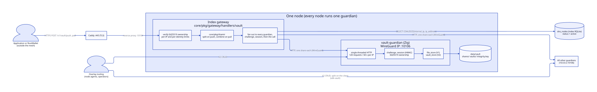
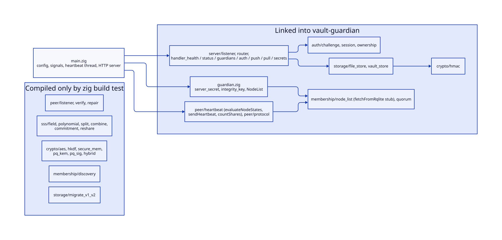
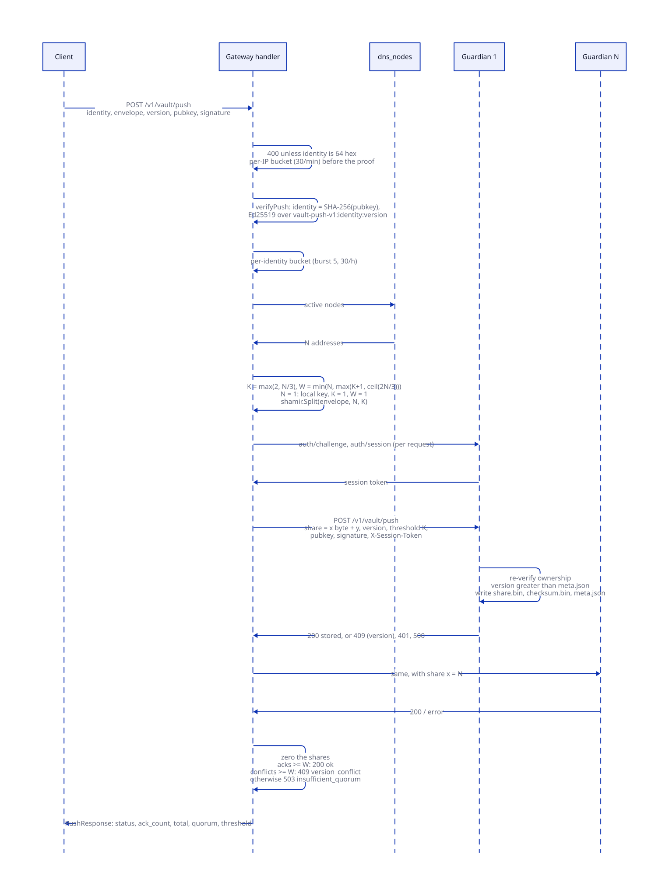
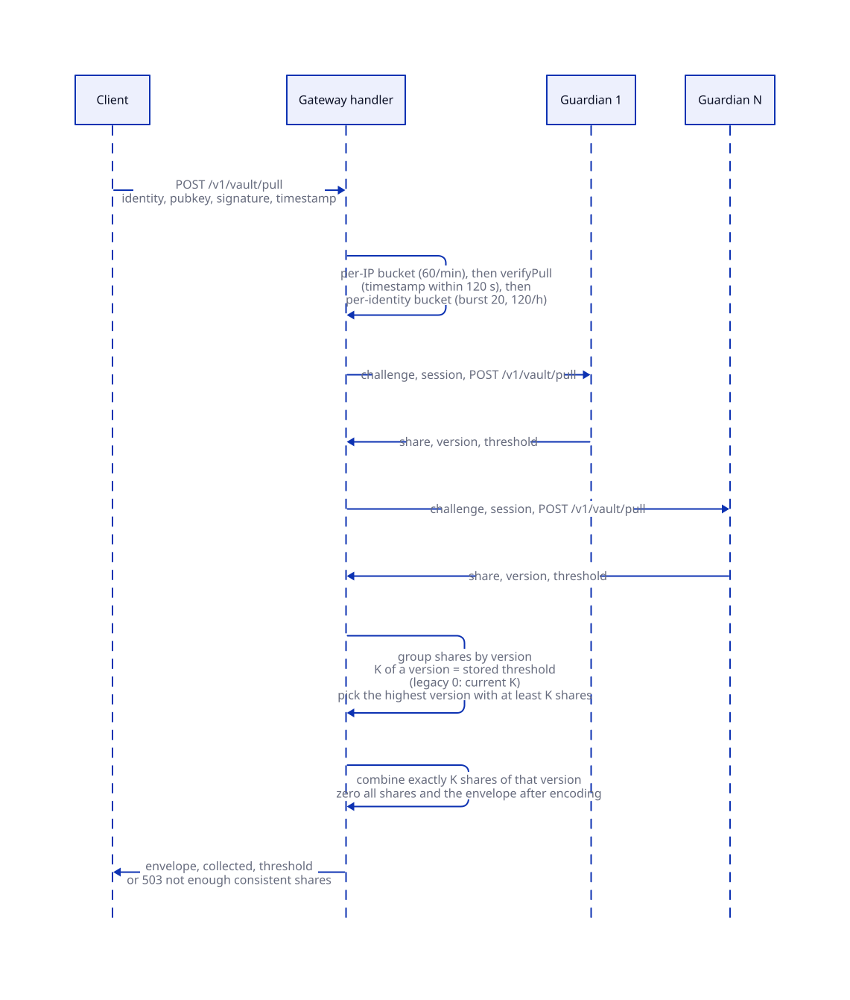
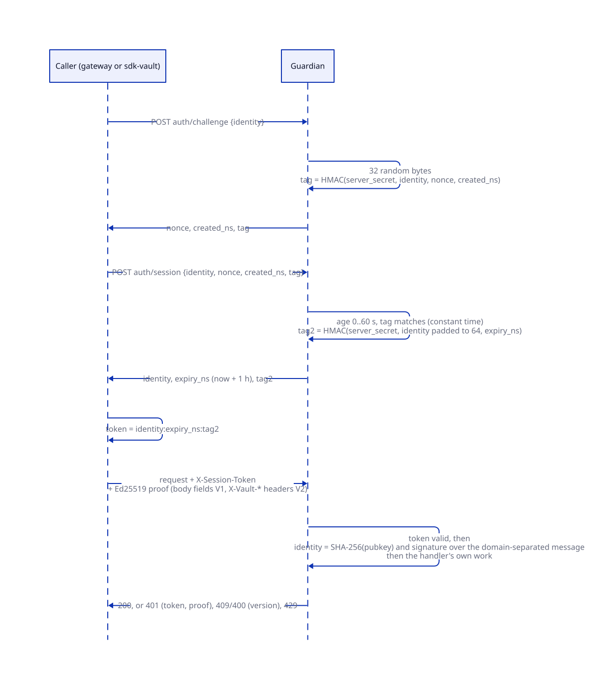
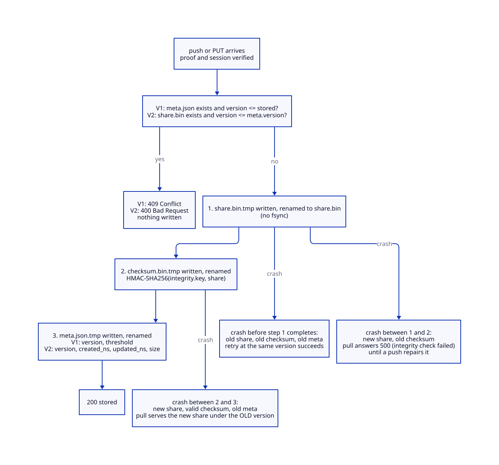

# Vault

> **At a glance.**
>
> - **What:** a distributed store for small encrypted secrets, built on Shamir's Secret Sharing over GF(2^8). Every node runs a `vault-guardian` daemon (Zig) that stores one share per secret and nothing else. Applications reach it through the gateway's `/v1/vault/push` and `/v1/vault/pull`, where the gateway process splits and combines in its own memory; tooling inside the WireGuard mesh reaches the guardians directly through the `sdk-vault` client, which splits and combines on the client. The guardians do not yet know about each other: peer discovery, the peer protocol, re-sharing and verification are written and unit-tested but not wired into the daemon.
> - **Key numbers:** guardian on the node's WireGuard address, port 10106 (`VaultHTTPPort`); read threshold K = max(2, floor(N/3)), write quorum W = min(N, max(K+1, ceil(2N/3))) for N active guardians; share at most 512 KiB (an envelope at most 512 KiB minus one byte); push body 1 MiB, pull body 4 KiB; challenge valid 60 s, session 1 h, pull timestamp skew 120 s; guardian rate limit 120 requests per 60 s per source IP; gateway per-IP 30 pushes and 60 pulls per minute, per-identity 30 pushes and 120 pulls per hour; per-guardian HTTP timeout 5 s, fan-out budget 15 s; V2 limits 1,000 secrets per identity, names of 128 characters.
> - **Code:** `vault/src/` (Zig 0.15.2), `core/pkg/gateway/handlers/vault/` (gateway proxy), `core/pkg/shamir/` (Go Shamir), `sdk-vault/src/` (TypeScript client).
> - **Depends on:** [the WireGuard mesh](06-the-wireguard-mesh.md) for the only network the guardians listen on, [membership and failure detection](08-membership-and-failure-detection.md) for the `dns_nodes` rows the gateway reads as the guardian list, [gateway architecture](12-gateway-architecture.md) for the routes and the middleware around them, [the node as a supervisor](04-the-node-as-a-supervisor.md) for how the unit is started, and [identity](13-identity.md) for the contrast with wallet sign-in (vault identities are a separate scheme).



## Why it exists

A wallet client needs somewhere to keep an encrypted backup of its key material, such that losing the device does not lose the wallet and no operator can read it. The code names the use: an identity is derived from a seed or password, and the blob the vault stores is ciphertext that only the owner can decrypt (`core/pkg/gateway/handlers/vault/ratelimit.go`, comment on the per-IP limits; `core/pkg/gateway/handlers/vault/pull_handler.go:HandlePull`, comment on the password oracle). Operator tooling and node agents have the same need for small secrets that must outlive any one machine.

Three constraints shaped the design.

First, no single machine may hold a usable copy. Shamir sharing gives that unconditionally: fewer than K shares are statistically independent of the secret, whatever the attacker's computing power. The price is that every guardian stores a share the size of the secret, and that K guardians colluding recover it.

Second, the store must survive the loss of nodes without an operator doing anything. All-node replication does that: every active node holds one share of every secret, so up to N minus K guardians can be destroyed before a read fails. The same choice means the guardian set is the fleet, with no placement or routing logic.

Third, applications live outside the mesh. Guardians bind a WireGuard address, so a browser or a phone cannot reach them (`sdk-vault/src/index.ts`, header comment). The gateway therefore speaks to the guardians on the application's behalf and runs the Shamir split itself, so a client makes one HTTPS call. The consequence is stated plainly in the code and in the old docs: the gateway process holds the reconstructed envelope in memory for the length of a pull. Whether that matters depends on what the envelope is. By design it is ciphertext produced by the client, so the gateway handles an encrypted blob and never the key.

The guardians are written in Zig because the binary is a static musl executable with no runtime dependency (`vault/build.zig`, `core/cmd/orama/internal/build/builder.go:buildVaultGuardian`). The code gives no other reason.

## The model

**Guardian.** One `vault-guardian` process per node. It is a plain HTTP server with a file store behind it. It does not split, combine or encrypt anything: it receives a share, checks who sent it, and writes bytes. Every active `dns_nodes` row is assumed to run a guardian; nothing checks.

**Identity.** A 64-character hex string equal to SHA-256 of an Ed25519 public key. The identity names the owner and the directory the shares live in. There is no registration: any key pair is an identity, and the first successful push creates it.

**Envelope.** The opaque byte string a client stores through the gateway. The gateway sees it whole during a push and a pull.

**Share.** What one guardian stores: a one-byte x coordinate (1 to 255) followed by the y bytes, one per envelope byte. The gateway sends shares as `[x][y...]`, so a share is one byte longer than the envelope. `sdk-vault` uses the same encoding.

**V1 and V2.** Two guardian APIs with two storage layouts.

| | V1 | V2 |
|---|---|---|
| Routes on the guardian | `/v1/vault/push`, `/v1/vault/pull` | `/v2/vault/secrets` (list), `/v2/vault/secrets/NAME` (PUT, GET, DELETE) |
| Unit of storage | one share per identity | up to 1,000 named secrets per identity |
| Who splits and combines | the gateway (Go) | the client (`sdk-vault`, TypeScript) |
| Ownership proof | in the JSON body (`pubkey`, `signature`) | in headers (`X-Vault-Pubkey`, `X-Vault-Signature`, `X-Vault-Timestamp`) |
| Stored metadata | `meta.json` with version and threshold | `meta.json` with version, created, updated, size |
| Stale version | 409 Conflict | 400 Bad Request |
| Reached from | the gateway, over the overlay | tooling on the overlay |

**Ownership proof.** An Ed25519 signature over a domain-separated ASCII message, together with the public key, such that SHA-256 of the key equals the identity. The messages are `vault-push-v1:IDENTITY:VERSION`, `vault-pull-v1:IDENTITY:TIMESTAMP`, `vault-secret-put-v1:IDENTITY:NAME:VERSION`, `vault-secret-get-v1:IDENTITY:NAME:TIMESTAMP`, `vault-secret-delete-v1:IDENTITY:NAME:TIMESTAMP` and `vault-secret-list-v1:IDENTITY:TIMESTAMP` (`vault/src/auth/ownership.zig`, `core/pkg/gateway/handlers/vault/ownership.go`, `sdk-vault/src/crypto/ownership.ts`). Push and put sign the version, so a captured signature cannot be replayed for a different version. Pull, get, delete and list sign a timestamp that must be within 120 s of the verifier's clock.

**Session.** A guardian-issued HMAC token that every V1 and V2 data call must carry in `X-Session-Token`. It proves the caller completed a challenge on this guardian. It does not prove anything about the identity (see Trust and security).

**K and W.** K is the read threshold: the number of shares needed to reconstruct. W is the write quorum: the number of guardians that must acknowledge before a write is reported stored. For N active guardians, K = max(2, floor(N/3)) and W = min(N, max(K+1, ceil(2N/3))). The invariant W greater than K is what makes a reported write recoverable (`core/pkg/shamir/shamir.go:WriteQuorum`). The three implementations of these formulas must agree exactly: `vault/src/membership/quorum.zig`, `core/pkg/shamir/shamir.go` and `sdk-vault/src/quorum.ts`.

**Version.** A client-chosen unsigned 64-bit counter per identity (V1) or per secret (V2). A guardian accepts a write only when its version is strictly greater than the stored one.

**Local key.** The single-guardian case. With N equal to 1 Shamir cannot run (the split requires K of at least 2 and N of at least K), so the gateway stores the envelope as the whole share with K = 1 and W = 1. That is not secret sharing: one disk holds the ciphertext (`core/pkg/gateway/handlers/vault/local_key.go`).

The Zig tree contains more than the daemon links. The diagram separates what `vault-guardian` actually compiles from what only `zig build test` builds; the split matters for every claim in the rest of the chapter.



## How it works

### Shamir over GF(2^8)

The field is GF(2^8) with the AES polynomial x^8 + x^4 + x^3 + x + 1 (0x11B) and generator 3. Addition and subtraction are XOR. Multiplication is a lookup in a 512-entry exp table and a 256-entry log table: `mul(a, b) = exp[log[a] + log[b]]`, with the exp table doubled so the sum needs no reduction modulo 255. Inverse is `exp[255 - log[a]]`, and division by zero is an error (`vault/src/sss/field.zig`, `core/pkg/shamir/field.go`, `sdk-vault/src/crypto/shamir.ts`). The Zig tables are built at compile time, the Go tables in `init`, the TypeScript tables in an immediately invoked function.

Splitting treats each byte of the secret independently. For each byte it draws K-1 random coefficients from the operating system's CSPRNG, sets the constant term to the secret byte, and evaluates the degree K-1 polynomial at x = 1 to N with Horner's method (`vault/src/sss/split.zig:split`, `vault/src/sss/polynomial.zig:evaluate`, `core/pkg/shamir/shamir.go:Split`). x = 0 is never used, because p(0) is the secret. N is at most 255. K must be at least 2, N at least K, and the secret non-empty. The coefficient buffer is zeroed on exit.

Combining is Lagrange interpolation at 0. For each byte the code computes, for each share i, the basis value as the product over j different from i of x_j divided by (x_i XOR x_j), and sums y_i times that basis (`vault/src/sss/combine.zig:combine`, `core/pkg/shamir/shamir.go:Combine`). It rejects fewer than two shares, a zero x, mismatched lengths and duplicate x. It does not and cannot detect shares from different splits or fewer than the original K: Shamir has no redundancy check, so wrong input returns a wrong secret with no error. Every caller therefore has to choose a consistent read set itself, which is what the version grouping below does. The basis is recomputed inside the per-byte loop in all three implementations, so combining costs about K squared field operations per byte.

Cross-platform agreement is tested with fixed vectors: sampled exp-table entries, multiplication, inverse, division, polynomial evaluation and fixed-share combines appear in `vault/src/sss/test_cross_platform.zig` and `core/pkg/shamir/shamir_test.go`. The TypeScript tests (`sdk-vault/tests/unit/crypto/shamir.test.ts`) check round trips and subsets but carry no vectors. In the paths that run, the three implementations never meet: the gateway splits and combines in Go, `sdk-vault` in TypeScript, and the Zig `sss/` code is not linked into the daemon at all. Interoperability matters only for a direct client that reads V1 shares and combines them itself.

### Thresholds: K and W

The formulas are in the Model section. Worked values, from `core/pkg/shamir/shamir_test.go:TestWriteQuorum`:

| N | K | W | Guardians that may be down for reads | for writes |
|---|---|---|---|---|
| 1 | 1 (local key) | 1 | 0 | 0 |
| 2 | 2 | 2 | 0 | 0 |
| 3 | 2 | 3 | 1 | 0 |
| 5 | 2 | 4 | 3 | 1 |
| 9 | 3 | 6 | 6 | 3 |
| 14 | 4 | 10 | 10 | 4 |
| 100 | 33 | 67 | 67 | 33 |

The writes column is the fact operators trip over: with three guardians a single stopped guardian refuses every write, because W equals N. Reads survive. The fleet e2e asserts exactly this (`e2e/features/vault-chaos/chaos_test.go:TestGuardianDown_readsSurviveWritesRefused`).

K has a floor of 2 because K = 1 would let one guardian reconstruct alone. W has the floor K+1 because an earlier formula, ceil(2N/3) with K floored at 3, gave W = 2 and K = 3 at N = 3: a push reported successful stored fewer shares than a read needs, and the secret was unrecoverable with nothing at write time to say so. The code comments in all three implementations record that history.

K is chosen when a secret is written and travels with it where the format allows. V1 stores it in `meta.json`, and the gateway reads it back on a pull, so a fleet that grows or shrinks does not change how existing secrets are read (`core/pkg/gateway/handlers/vault/pull_handler.go:HandlePull`, `vault/src/storage/file_store.zig:V1Meta`). V2 does not store K; the client recomputes it from the guardian list it is configured with (see Known gaps).

The gateway computes N as the number of active `dns_nodes` rows. A node the registry still lists as active but whose guardian is down counts in N and is not reachable, so it lowers the ack count without lowering W.

### The gateway path: push



`HandlePush` (`core/pkg/gateway/handlers/vault/push_handler.go`) runs these steps in order, and the order is deliberate.

1. Read at most 1 MiB of body. A larger body is truncated, fails JSON parsing and is answered 400.
2. Require a 64-hex identity (400 otherwise).
3. Charge the per-source-IP bucket (30 pushes a minute, burst 30, `Retry-After: 60`). This runs before the signature check: a guesser who mints a valid signature for every guessed seed would never trip a limit that only counted authenticated requests, and the generic message "rate limited" does not reveal whether the identity exists.
4. Verify the ownership proof: identity equals SHA-256 of the key, signature valid over `vault-push-v1:IDENTITY:VERSION`. Failure is 401 "invalid ownership signature".
5. Decode the base64 envelope; empty is 400.
6. Charge the per-identity bucket (30 pushes an hour, burst 5, `Retry-After: 120`). It runs after verification so a third party cannot drain a victim's budget with forged requests.
7. `discoverGuardians`: `SELECT COALESCE(internal_ip, ip_address) FROM dns_nodes WHERE status = 'active'`, with internal authentication. An empty result is 503 "no guardian nodes available". Each address is paired with port 10106.
8. Compute K and W for N rows and split. For N = 1 the single share is the envelope with x = 1 and K = 1, and the gateway logs a warning.
9. Fan out to every guardian in parallel under a 15 s context. For each guardian: run the challenge and session exchange (two requests), then POST `/v1/vault/push` with the share (`[x][y]`, base64), the version, K, and the client's public key and signature, which the guardian verifies again. Guardian i receives share x = i+1 in the order the registry query returned rows; the order is not fixed, but x travels with the share so it does not need to be.
10. Count 2xx responses as acks and 409 responses as conflicts. Zero all share buffers.
11. Answer. Acks at least W: 200 with status `ok`, `ack_count`, `total`, `quorum`, `threshold`. Otherwise conflicts at least W: 409 `version_conflict`. Otherwise 503 `insufficient_quorum`.

A 503 does not mean nothing was written. The guardians that acked keep their shares at the new version, and if at least K of them hold it a later pull returns the newer envelope. The e2e asserts that the pull returns either the old or the new envelope and never anything else (`e2e/features/vault-chaos/chaos_test.go:mustPullOneOf`).

The proof is checked twice, once by the gateway and once by each guardian, so the guardian does not trust the gateway for authorization. The session handshake is run inline for every guardian on every request and never cached, because each guardian signs tokens with its own per-process secret that dies on restart (`core/pkg/gateway/handlers/vault/guardian_auth.go:authenticateGuardian`). A push or pull to N guardians therefore costs 3N HTTP requests.

### The gateway path: pull



`HandlePull` mirrors the push validation: body at most 4 KiB, 64-hex identity, per-IP bucket (60 pulls a minute, burst 60), ownership proof (timestamp within 120 s of the gateway's clock), per-identity bucket (120 pulls an hour, burst 20, `Retry-After: 30`), then discovery and a parallel fan-out that gets a session and POSTs `/v1/vault/pull` to each guardian.

Each guardian returns its share, the version it belongs to, and the threshold it was split with. The gateway then does the one thing that keeps the result correct. It groups the collected shares by version and takes the highest version that has at least its own stored K shares. For a share with no stored threshold (a legacy share, threshold 0) it falls back to the K computed from the current N. It combines exactly the first K shares of that version, zeroes every collected share and the reconstructed envelope after encoding, and returns the envelope with `collected` and `threshold`.

Grouping by version is what protects against a guardian that missed the last write. It still answers, with a share of an older split. Combining it with newer shares would reconstruct neither version and report no error. If no version has enough shares the answer is 503 "not enough consistent shares", with the number collected. A never-pushed identity gets the same 503, not a 404, because there is no read set (`e2e/features/vault/vault_test.go:TestPull_neverPushedIdentity`).

### Guardian authentication: sessions and ownership proofs



The guardian authenticates in two layers.

The session layer is HMAC-SHA256 under `server_secret`, 32 random bytes drawn at process start and never persisted (`vault/src/guardian.zig:Guardian`).

- `POST .../auth/challenge` with a 64-hex identity returns a fresh 32-byte nonce, `created_ns` (the guardian's wall clock in nanoseconds, a 128-bit integer) and `tag = HMAC(server_secret, identity ‖ nonce ‖ created_ns)`, with `created_ns` as 16 little-endian bytes (`vault/src/auth/challenge.zig:generateChallenge`).
- `POST .../auth/session` echoes those fields. The guardian recomputes the tag, requires the age to be between 0 and 60 s, compares in constant time, and returns `identity`, `expiry_ns` (now plus one hour) and `tag = HMAC(server_secret, identity padded to 64 bytes ‖ expiry_ns)` (`vault/src/auth/session.zig:issueToken`).
- The client builds the token `IDENTITY:EXPIRY_NS:TAG` itself and sends it as `X-Session-Token`. The guardian parses it, rebuilds the HMAC and checks the expiry (`vault/src/server/handler_auth.zig:validateSessionToken`).

Nothing is stored. A challenge can be exchanged any number of times inside its 60 s, and a token is valid until it expires or the guardian restarts. The two HMACs differ only by input length (112 bytes against 80), not by a label. This is fine because the layer is not what protects the data; see below.

The ownership layer is the one that does. Every V1 push and pull and every V2 call carries a public key and an Ed25519 signature, and the guardian checks that SHA-256 of the key equals the identity and that the signature verifies over the message for that operation (`vault/src/auth/ownership.zig`). The identity comparison is case-insensitive. Timestamps are accepted within 120 s either side (`PULL_MAX_SKEW_S`). Both layers are enforced whenever a `Guardian` object exists, which is always in the daemon; the `ctx.guardian == null` branches that skip them exist for unit tests.

On a V1 call the handler does not compare the identity in the session token with the identity in the body. That is harmless only because the ownership proof binds the body identity to a key. On a V2 call the identity comes from the token and the proof must match it.

### The guardian HTTP server

`vault/src/server/listener.zig:serve` is a single-threaded accept loop. It binds `listen_address:client_port`, sets a 1 s receive timeout on the listening socket so the loop can poll the shutdown flag, accepts one connection, serves it to completion, and closes it. Every response carries `Connection: close`.

For each connection it allocates two heap buffers of 1 MiB plus 16 KiB, reads until the headers end and `Content-Length` bytes of body have arrived (or the buffer fills), parses the request line and the headers it knows (`Content-Length`, `Authorization`, `X-Session-Token`, `X-Vault-Pubkey`, `X-Vault-Signature`, `X-Vault-Timestamp`), and calls `router.route`. A malformed request is 400, a handler error 500. There is no TLS: the transport is plain HTTP and the only confidentiality is the WireGuard tunnel under it.

A per-IP fixed-window limiter sits in front of routing: 120 requests per 60 s window per peer IPv4 address, answered `429 {"error":"rate limit exceeded"}`. Every endpoint counts, health and status included. Stale entries are swept every 60 s, at most 64 per sweep. Because the gateway makes three requests per guardian for each operation, one gateway can sustain about 40 operations a minute against a given guardian before that guardian starts refusing it, and the health and status probes of the monitoring path draw from the same budget.

Routes:

| Path | Method | Auth | Handler |
|---|---|---|---|
| `/v1/vault/health` | GET | none | status, version, share count, alive peers, `data_dir_ok` |
| `/v1/vault/status` | GET | none | version, data dir, client port, peer port |
| `/v1/vault/guardians` | GET | none | alive nodes, threshold, total |
| `/v1/vault/auth/challenge`, `/v1/vault/auth/session` | POST | none | the handshake |
| `/v1/vault/push`, `/v1/vault/pull` | POST | session and proof | V1 |
| `/v2/vault/auth/challenge`, `/v2/vault/auth/session` | POST | none | same handlers as V1 |
| `/v2/vault/secrets` | GET | session and proof | list |
| `/v2/vault/secrets/NAME` | PUT, GET, DELETE | session and proof | named secret |

The guardian's own `/v1/vault/health` reports `ok`, `degraded` (no alive peer) or `unhealthy` (data directory not accessible), always with HTTP 200 while the process runs. Because discovery is stubbed (below), a deployed guardian always reports `degraded` with `peers: 0`, and the fleet e2e asserts that (`e2e/features/vault/node_test.go:TestGuardian_documentedNotDone`). The gateway's probe treats any 2xx from a guardian's health as healthy, so "healthy" at the gateway level means "the HTTP server answers".

### Storage layout and the write order

The store is a directory tree under `data_dir`, default `/opt/orama/.orama/data/vault`:

```text
integrity.key                              32 bytes, 0600
shares/IDENTITY/share.bin                  V1 share
shares/IDENTITY/checksum.bin               HMAC-SHA256(integrity_key, share.bin)
shares/IDENTITY/meta.json                  {"version":N,"threshold":K}
vaults/IDENTITY/NAME/share.bin             V2 share
vaults/IDENTITY/NAME/checksum.bin          HMAC-SHA256(integrity_key, share.bin)
vaults/IDENTITY/NAME/meta.json             {"version":..,"created_ns":..,"updated_ns":..,"size":..}
```

`wrapped_dek1.bin` and `wrapped_dek2.bin` appear in a header comment of `vault/src/storage/file_store.zig` and nothing writes them.

The write is three atomic file replacements in a fixed order (`vault/src/storage/file_store.zig:writeShare`, `vault/src/storage/vault_store.zig:writeSecret`): `share.bin`, then `checksum.bin`, then `meta.json`. Each is written to a `.tmp` sibling and renamed over the target. There is no `fsync` of the file or the directory.



The comments call `meta.json` the commit marker, written last so that a share only counts once it lands. The code supports less than that. What the order does give is retry safety: the version check reads `meta.json`, so a push that crashed before the third step can be retried at the same version and succeeds. It does not hide the half-written share. A pull reads `share.bin` and `checksum.bin` and then reads `meta.json` with a fallback to version 0 and threshold 0 if it is missing or older; so a crash between the second and third step serves the new share under the old version, and a crash between the first and second serves a 500 (integrity check failed) until the next push repairs it.

The integrity key is created on first start with 32 random bytes, written to `integrity.key.tmp` with mode 0600 and renamed (`vault/src/guardian.zig:loadOrCreateIntegrityKey`). On a later start the key is read with a 32-byte limit; a file of any other size, or one that cannot be read, is replaced by a fresh key. If a new key cannot be persisted the guardian runs on an in-memory key and logs an error: shares written in that run fail their checksum after the next restart. Replacing the key never destroys share data, but every existing share then fails verification and a pull of it answers 500.

The checksum is a corruption detector. The key lives next to the data it protects, so anyone who can write the data directory can recompute a valid checksum. Shares are not encrypted at rest by the guardian; they are Shamir shares, and in the V1 flow of a ciphertext envelope.

V1 anti-rollback is a read of `meta.json` before the write: a version less than or equal to the stored one is 409 Conflict. V2 compares against the existing `meta.json` of that secret (400 on a stale version) and counts the identity's secret directories against the 1,000 limit before creating a new one. Single threading makes both checks race-free inside one guardian.

A V1 to V2 migration tool exists (`vault/src/storage/migrate_v1_v2.zig`: copies each `shares/IDENTITY` to `vaults/IDENTITY/default` and renames the source to `IDENTITY.migrated`). The daemon never calls it, and the copy it makes reads a `version` file that the current V1 writer no longer produces (V1 writes `meta.json`), so a migration would assign version 1 to everything.

### V2 named secrets and the sdk-vault client

`sdk-vault` (`@debros/orama-vault`, version 0.3.0) is for software on the mesh: node agents, operator tooling, RootWallet. It is published separately because applications cannot reach the guardians and used to carry its cryptography dependencies in every application bundle (`sdk-vault/src/index.ts`).

`VaultClient` (`sdk-vault/src/client.ts`) takes a list of guardian endpoints and a 32-byte Ed25519 seed. The identity is SHA-256 of the derived public key. The configured list is the unit of redundancy.

- **store(name, data, version).** Computes K and W from the configured list size, authenticates to every guardian in parallel, splits `data` into one share per configured guardian in configuration order (so a guardian that is down costs exactly its own share), and PUTs each share with the put-message signature, retrying up to three times with 200 ms and 400 ms backoff (`sdk-vault/src/transport/fanout.ts:withRetry`). It zeroes the shares in a `finally` block. Fewer than W acks throws `QuorumError`, carrying the per-guardian results. It does not return a flag: callers that did not inspect a returned `quorumMet` once believed an undurable write had succeeded.
- **retrieve(name).** Authenticates, signs one get message with a timestamp, GETs from every authenticated guardian with a 10 s timeout, groups shares by version, picks the newest version with at least K shares and combines all shares of that version. A newer version that lacks K shares is skipped in favour of the last complete one.
- **list().** Asks every authenticated guardian and returns a name only if at least K guardians report it, taking the newest version any of them reports. This is the condition under which the secret can be reconstructed. Asking one guardian, as the code once did, reports whatever that node alone happens to hold.
- **delete(name).** DELETEs on every guardian; fewer than W acks throws `QuorumError`, noting that enough shares remain to reconstruct.
- **AuthClient.** Runs the two-step handshake per guardian and caches the token until 30 s before expiry. The cache is only cleared by `clearSessions()`; a guardian restart invalidates cached tokens, and the next call fails with `AUTH` (not retried) until the cache is cleared.

The client does not encrypt: what it is given is what is split. It exports AES-256-GCM (random 96-bit nonce prepended, optional AAD) and HKDF-SHA256 helpers (`sdk-vault/src/crypto/aes.ts`, `hkdf.ts`) so callers can encrypt first; `VaultClient` itself does not call them. The key hierarchy in the old security document (a data key wrapped by two key-encryption keys derived from a mnemonic and from a username and passphrase) is not implemented in this repository. The guardians neither know nor care how the envelope was produced.

`GuardianClient` also has `push` and `pull` methods for V1. They send no session token and no proof, so a real guardian answers 401; they are not used by `VaultClient`.

### Guardian membership, heartbeats and the peer protocol

This is the part that is written and not running.

`membership/node_list.zig:NodeList` is the guardian's view of its peers: address, client port, a state of alive, suspect, dead or unknown, and the last-seen time. `fetchFromRqlite` is meant to fill it from the index RQLite. It ignores its arguments and returns an empty list without an error (`vault/src/membership/node_list.zig:fetchFromRqlite`). `Guardian.init` therefore gets a list of zero nodes; its fallback to a self-only list runs only when the fetch fails, which it never does, and the `rqlite_url` setting is read and unused. Everything built on the list sees no peers: `aliveCount` is 0, `readThreshold` reports 2, `/v1/vault/guardians` returns `{"guardians":[],"threshold":2,"total":0}`, and health is `degraded`.

A background thread in `main.zig` runs every 5 s. It calls `evaluateNodeStates` (alive to suspect after 15 s without a heartbeat, suspect to dead after 60 s), refreshes the share count with `countShares` (a full listing of `shares/` and `vaults/`, V1 identities plus V2 identities), and sends a heartbeat to each non-dead peer, of which there are none. The share count is written by this thread and read by the HTTP thread without synchronization.

The peer protocol (`vault/src/peer/protocol.zig`) is a binary TCP protocol for port 7501: a 6-byte header (version 1, message type, 4-byte big-endian payload length, at most 1 MiB), then heartbeat (18 bytes: IPv4, port, share count, timestamp), heartbeat ack, verify request (65 bytes: identity and its length), verify response (98 bytes: identity, length, has-share flag, a 32-byte hash) and the repair offer and accept types, which have no payload definition. `peer/listener.zig` serves heartbeat and verify. `main.zig` never imports it. The daemon logs "listening on ADDRESS:7501 (peer)" and nothing binds the port; the fleet e2e checks that nothing listens on 7501 (`e2e/features/vault/node_test.go:TestGuardian_documentedNotDone`). If it were started it would also be unauthenticated and bound to the same address as the client port.

`peer/verify.zig` asks a peer for its hash of a V1 share and compares. The hash is SHA-256 of the raw `share.bin`, not a Merkle root.

### Re-sharing and commitments

`sss/reshare.zig` implements the Herzberg, Jarecki, Krawczyk and Yung refresh. Each guardian i draws a random polynomial q_i of degree K-1 with q_i(0) = 0, sends q_i(j) to guardian j, and every guardian adds the sum of the deltas it received to its share. The secret is unchanged because each q_i vanishes at 0; old and new shares come from independent polynomials, so mixing an old share with new ones reconstructs garbage (`vault/src/sss/reshare.zig:generateDeltas`, `applyDeltas`; the integration test `proactive reshare` checks that mixing fails). `peer/repair.zig` holds the round state machine (idle, initiated, deltas sent, deltas received, applied, verified, failed), a 60 s round timeout, and a rule that triggers a round on a topology change or after 24 hours.

`sss/commitment.zig` builds a SHA-256 Merkle tree over `H(x ‖ y)` leaves, padded to a power of two with zero hashes, with proof generation and verification.

None of this is linked into the daemon. No code triggers a refresh, so shares are never rotated, a guardian that joins holds nothing for existing secrets until the owner pushes a new version, and a guardian that leaves takes its shares with it.

### Crypto primitives in the Zig tree

Only HMAC-SHA256 (`vault/src/crypto/hmac.zig`: compute, and a constant-time verify) and Ed25519 verification (from the Zig standard library, in `auth/ownership.zig`) are reachable from the daemon. The rest compiles for tests only:

- `aes.zig`: AES-256-GCM with a random 12-byte nonce.
- `hkdf.zig`: HKDF-SHA256 extract and expand.
- `secure_mem.zig`: a volatile zero-fill, `mlock` on Linux (failure is silently ignored) and a `SecureBuffer` wrapper. The daemon never uses it; the systemd unit grants `LimitMEMLOCK=67108864` but nothing locks memory, and `server_secret` and `integrity_key` are ordinary arrays zeroed at shutdown.
- `pq_kem.zig`, `pq_sig.zig`, `hybrid.zig`: described next.

### Post-quantum status

`pq_kem.zig` has the ML-KEM-768 sizes (public key 1,184, secret key 2,400, ciphertext 1,088, shared secret 32 bytes) and functions that produce random bytes. `encaps` derives the shared secret as HMAC of the first 32 bytes of the public key over a random ciphertext; `decaps` does the same with the secret key. The keys are independent random bytes, so the two sides never agree. `pq_sig.zig` has ML-DSA-65 sizes (public key 1,952, secret key 4,032, signature up to 3,309) and a `sign` that returns SHA-256 of the message; `verify` recomputes that hash, ignores the public key, and rejects a mismatch. Anyone can produce a valid "signature". `hybrid.zig` combines a working X25519 exchange with the KEM through HKDF (info `orama-hybrid-v1`, zero salt), and since the KEM half cannot agree, the hybrid does not either. Each stub logs a one-time warning.

There is no liboqs binding, no call to any of this from the daemon, and no post-quantum primitive in `core/pkg/shamir` or `sdk-vault`. The Shamir layer is information-theoretic and unaffected by quantum computers. What a quantum adversary changes is the Ed25519 ownership proof (forgeable with Shor's algorithm) and, for stored ciphertext, whatever the client's encryption is. The vault README's phrase "Post-quantum ready" describes interfaces, not protection.

### Deployment: how a guardian gets onto a node

`orama build` cross-compiles the guardian with `zig build-exe src/main.zig -O ReleaseSafe` for the target (not `zig build`, whose host build-runner fails to link on current macOS SDKs) and copies it to the archive's `bin/vault-guardian` (`core/cmd/orama/internal/build/builder.go:buildVaultGuardian`). The build refuses any zig that is not the same minor release as the `minimum_zig_version` in `vault/build.zig.zon`, currently 0.15.2, because Zig changes its language and standard library between minors (`core/cmd/orama/internal/build/zig.go:resolveZig`; override with `ORAMA_ZIG`).

At install, `GenerateVaultConfig` writes `data/vault/vault.yaml` (key=value lines, despite the extension) with `listen_address` set to the node's WireGuard address (127.0.0.1 if none is known), `client_port = 10106`, `peer_port = 7501`, the data directory and an unused `rqlite_url` (`core/pkg/install/config.go:GenerateVaultConfig`, called from `core/pkg/install/orchestrator.go`). The guardian therefore listens only on the overlay.

At run time `orama-node` starts `orama-namespace-vault@index` as part of edge serving, after the gateway and before Caddy: `startIndexEdgeServing` calls `EnsureVault`, which fails if `vault.yaml` is missing, stops the older `orama-vault.service` and starts the template unit (`core/pkg/node/index_host.go:startIndexEdgeServing`, `core/pkg/namespace/index_host.go:EnsureVault`). The unit (`core/systemd/orama-namespace-vault@.service`) runs `vault-guardian --config /opt/orama/.orama/data/vault/vault.yaml`, restarts always after 5 s with no start limit, and is hardened: `ProtectSystem=strict` with only the vault data directory writable, `ProtectHome`, `ProtectProc=invisible`, `NoNewPrivileges`, `PrivateDevices`, `PrivateTmp`, no kernel tunables or modules, `RestrictNamespaces`, `MemoryMax=512M`, `MemorySwapMax=0`. It is ordered after `orama-namespace-wireguard@index`; if the overlay address is not yet assigned the bind fails, the process exits 1 and systemd retries. Vault is one of the stateful services the supervisor never restarts as a side effect of changed inputs (`core/pkg/systemd/manager.go:statefulClusterServices`), and its unix user follows the per-uid split described in [privilege and filesystem trust](05-privilege-and-filesystem-trust.md).

The gateway reaches the guardians at `http://ADDRESS:10106` over the overlay. The index gateway's `/health` includes a 2 s TCP connect to the local guardian, and a failed vault check makes the node `unhealthy` (`core/pkg/gateway/status_handlers.go:vaultProbeTimeout`; see [gateway architecture](12-gateway-architecture.md)). Node telemetry reads `/v1/vault/status` and `/v1/vault/health` through the local gateway plus the unit's state, restart count, memory and log errors, and raises a critical alert when the unit is down or fewer than K guardians are healthy, and a warning when fewer than W are (`core/pkg/telemetry/report/vault.go:collectVault`, `core/pkg/telemetry/cluster/alerts_node_services.go:checkNodeVault`; see [observability](32-observability.md)).

## State it owns

| What | Where | Written by | Read by |
|---|---|---|---|
| V1 share, checksum, `meta.json` | `data_dir/shares/IDENTITY/` on every guardian | guardian push handler | guardian pull handler, `countShares` |
| V2 share, checksum, `meta.json` per secret | `data_dir/vaults/IDENTITY/NAME/` | guardian secrets handler | same handler, list, `countShares` |
| Integrity key | `data_dir/integrity.key`, 32 bytes, 0600 | first guardian start | every share read and write |
| Server secret | guardian process memory, 32 bytes | guardian start | challenge and session HMACs; lost on restart |
| Guardian node list | guardian process memory | `fetchFromRqlite` (empty), heartbeat thread | health, guardians, quorum helpers |
| Per-IP request counters | guardian process memory | listener | listener |
| `vault.yaml` | `data_dir/vault.yaml`, 0644 | install | guardian at start |
| Guardian list (derived) | `dns_nodes` in the index RQLite | node heartbeat ([membership](08-membership-and-failure-detection.md)) | `discoverGuardians` on every gateway request |
| Per-IP and per-identity token buckets | gateway process memory | vault handlers | vault handlers; per gateway, lost on restart |
| Client sessions | `AuthClient` memory | `sdk-vault` | `sdk-vault` |
| Unit and ports | `orama-namespace-vault@index`, 10106 on the WireGuard address, 7501 configured and unbound | supervisor | gateway, monitoring |

The vault owns no RQLite table, no Olric key, and no chain state. Everything durable is the guardians' directory trees.

## Lifecycle

**Install and first boot.** The data directory is created at provisioning, `vault.yaml` at configuration, the binary arrives with the archive. On first start the guardian creates the data directory if absent, draws `server_secret`, creates `integrity.key`, counts existing shares, installs SIGTERM and SIGINT handlers, starts the heartbeat thread and enters the accept loop. A bad config value for a port is a fatal error; an unreadable data directory is fatal.

**Normal operation.** Nothing happens between requests except the 5 s housekeeping thread. A push or pull causes 3 requests per guardian, each answered and closed.

**Graceful shutdown.** SIGTERM clears a flag. The accept loop wakes at least once a second, sees the flag, stops accepting, and `main` returns after joining the heartbeat thread, zeroing the secrets on the way out. A request in progress completes first. `TimeoutStopSec=30` bounds it.

**Restart of one guardian.** `server_secret` is new, so every session token it issued is invalid. The gateway never notices because it authenticates inline each time. `sdk-vault` clients with a cached token get 401 until they clear their sessions. Shares and the integrity key persist. During the restart the guardian is unreachable; at three guardians that refuses writes (W equals N) and keeps reads.

**Rolling upgrade (mixed versions).** The node upgrade replaces the binary and restarts the unit node by node ([rolling upgrades](31-rolling-upgrades.md)). The wire contracts between gateway and guardian are field-additive (`threshold` is optional on push and absent on legacy shares, which the gateway treats as "use the current K"). Writes are refused for the duration of each guardian's restart on fleets of three. The guardian version string is the constant "0.1.0" and does not change with the network version.

**Node loss.** After 120 s of silence the node's `dns_nodes` row goes inactive ([membership](08-membership-and-failure-detection.md)) and the gateway stops counting it in N. K and W recompute lower for new writes. Existing secrets keep their stored K. The lost node's shares are gone and nothing replaces them: reads remain possible while at least K holders of the latest version are alive.

**Node join.** The new guardian holds no shares. It receives shares only when an owner next pushes or puts a new version. Until then it counts in N and so raises W for new writes without having data for old ones.

**Decommission.** Removing a node's data directory removes that guardian's shares. There is no drain.

## Failure modes

| Trigger | What the system does | What you observe |
|---|---|---|
| One guardian process down, N = 3 | The fan-out gets no ack from it. Acks 2 less than W = 3, so the push is refused; pulls reconstruct from the other two (K = 2). Guardians that did ack keep the new version. | Push 503 `insufficient_quorum`; `/v1/vault/health` `degraded`; `/v1/vault/status` `healthy` 2 of 3; vault alert warning |
| Guardians down below K | Pull finds no version with enough shares | 503 "not enough consistent shares"; health `unavailable`; critical alert |
| No active `dns_nodes` rows | Discovery returns nothing | 503 "no guardian nodes available"; health `unavailable` |
| Partition between gateway and some guardians | Same as those guardians being down; each call times out at 5 s, the whole fan-out at 15 s | Slow 503 or slow success when quorum still holds |
| Stale guardian (missed the last write) | It answers with an older version; the gateway and the SDK group by version | Correct data; `collected` smaller than N |
| Push retried at the same version after a partial write | Guardians that already stored the version answer 409; the rest accept a share from a new split under the same version | Shares of two splits under one version; a later combine can return garbage with no error (see Known gaps) |
| Push at a stale version | Guardian 409 (V1) or 400 (V2) | Gateway 409 `version_conflict` when W guardians conflict |
| Wrong owner, bad signature, stale timestamp | Gateway or guardian refuses | 401 "invalid ownership signature" |
| Missing or expired session token at a guardian | Refused | 401 "session token required" or "invalid session token" |
| Guardian restarts | Tokens it issued stop validating | SDK calls fail with `AUTH` until `clearSessions`; the gateway is unaffected |
| Rate limit | Gateway 429 with `Retry-After` 60, 120 or 30; guardian 429 for the 121st request in a window | The affected guardian contributes no ack or share; enough of these look like an outage |
| Share larger than 512 KiB | Guardian 400 "share data too large"; gateway counts no ack | Push 503; the old envelope remains |
| Disk full or unwritable data dir | Guardian write returns 500 | No ack from that guardian; `data_dir_ok` false only if the directory is inaccessible, not when it is full |
| Crash during a write | See the storage-write diagram | A pull of that share is 500 (checksum) or serves the new share under the old version |
| `integrity.key` replaced or lost | Every existing share fails its checksum | Pull answers 500 for each identity on that guardian; the gateway skips it |
| Corrupt `share.bin` | Checksum mismatch | Pull 500 from that guardian; log line "integrity check failed" |
| Clock skew between nodes over 120 s | Pull timestamps signed by the client fail verification at a guardian whose clock differs from the gateway's | That guardian answers 401; looks like one guardian down |
| Slow or stalled client connection to a guardian | The single-threaded server serves one connection at a time | Other requests queue behind it; behaviour depends on the OS carrying the 1 s receive timeout to accepted sockets (see Known gaps) |
| Malformed body, bad identity, bad base64 | 400 from gateway or guardian before any storage | JSON error body |
| WireGuard address not yet assigned at boot | Bind fails, exit 1, systemd restarts every 5 s | Unit flapping until the overlay is up |

## Trust and security

**An anonymous caller on the internet** reaches the gateway routes `/v1/vault/push`, `/v1/vault/pull`, `/v1/vault/status` and `/v1/vault/health` (declared handler-authenticated in `core/pkg/gateway/route_policy.go`, so no API key is required). Push and pull need a valid Ed25519 proof for an identity the caller holds the key of. Status and health are open and reveal the guardian count, threshold and quorum. The caller cannot read or overwrite another identity, cannot choose a smaller version, and is bounded by the per-IP limits, which key on the peer address and trust `X-Forwarded-For` only from the local reverse proxy (`core/pkg/gateway/clientkey`; the fleet e2e rotates the header and still hits the limit). The caller can create identities freely: any key pair stores a share set of up to 512 KiB at 30 pushes a minute per address, with no quota, expiry or V1 delete.

**Anyone holding a key** and brute-forcing a seed or password sees one more thing: every guess is a different identity, so the per-identity limiter never fires. The per-IP limiter counts before the signature check for that reason. A pull for a guess that exists returns that victim's ciphertext, which the attacker must still decrypt offline; the replay window of a captured pull is 120 s and returns the same ciphertext (`core/pkg/gateway/handlers/vault/ownership.go:pullMaxSkewSeconds`).

**A process on the overlay** (a compromised node, or any peer of the mesh) reaches every guardian directly. It can run the handshake for any identity, because the session layer is not bound to key possession, and it can push, pull and list for any identity whose key it holds. It can also reach the unauthenticated `/v1/vault/status` (which includes the data directory path), `/v1/vault/health` and `/v1/vault/guardians`. Through the V2 name-handling bug in Known gaps, a caller with any registered identity can read and delete other identities' shares on that guardian. The guardian trusts the overlay's membership; the only authentication of the peer is WireGuard.

**A compromised gateway** sees every envelope in clear for the duration of a request, every share it generates, and the clients' signatures. It cannot forge a client signature for a request it did not see, and a replayed pull signature expires in 120 s. If clients send ciphertext, as the design intends, it sees an encrypted blob. It can choose not to store or to store garbage (guardians verify the proof, so garbage is attributable only to a key holder; the gateway holds no user key). Buffer wiping is partial: the Go code zeroes the share buffers and the reconstructed envelope, not the base64 strings, the request body or the per-guardian JSON.

**A compromised guardian host** reads `share.bin` files and `integrity.key`, learns which identities exist and their versions and sizes, and can rewrite any share and recompute its checksum. Fewer than K such hosts learn nothing about any secret. K of them (a third of the fleet, rounded down, with a floor of 2) can reconstruct every envelope they hold shares for, and the stored data is then only as safe as the client's encryption.

**Guardian operators in collusion** need K guardians, and K is N/3. This is the cost of choosing a low K for availability: a secret survives the loss of two thirds of the fleet and is exposed by the collusion of one third.

**Transport.** Gateway to guardian and client to guardian are plain HTTP inside WireGuard; there is no TLS between them. Clients reach the gateway over TLS at Caddy ([TLS and certificates](25-tls-and-certificates.md)).

**Timing and memory.** HMAC and challenge comparisons use an XOR accumulator. Field multiplication uses secret-indexed table lookups in all three implementations, so it is not constant-time against a cache-timing observer on the same host as the gateway or the client; the tables are 768 bytes. The Zig `secure_mem` module is not linked, so the daemon does not mlock or volatile-zero its keys beyond a plain `memset` at exit.

## Limits and scale

Hard numbers, all from code.

| Limit | Value | Source |
|---|---|---|
| Guardians | up to 255 (x is one byte, 0 excluded) | `vault/src/sss/split.zig` |
| Envelope through the gateway | 512 KiB minus 1 byte (share = x byte + envelope, share cap 512 KiB) | `vault/src/server/handler_push.zig:MAX_SHARE_SIZE`, `e2e/features/vault/vault_test.go:TestPush_largeEnvelope` |
| Gateway request bodies | push 1 MiB, pull 4 KiB | `core/pkg/gateway/handlers/vault/handlers.go` |
| Guardian request body | 1 MiB (push and put), 4 KiB (pull), buffer 1 MiB + 16 KiB | `vault/src/server/listener.zig` |
| V2 secrets per identity | 1,000 | `vault/src/storage/vault_store.zig:MAX_SECRETS_PER_IDENTITY` |
| V2 secret name | 1 to 128 of letters, digits, `_`, `-` | `vault/src/storage/vault_store.zig:validateSecretName` |
| Guardian request rate | 120 per 60 s per IPv4 | `vault/src/server/listener.zig:RATE_LIMIT_MAX` |
| Gateway per-IP | 30 pushes, 60 pulls per minute | `core/pkg/gateway/handlers/vault/ratelimit.go` |
| Gateway per-identity | 30 pushes (burst 5), 120 pulls (burst 20) per hour | `core/pkg/gateway/handlers/vault/handlers.go:NewHandlers` |
| Timeouts | 5 s per guardian call, 15 s per fan-out; SDK 10 s per request and per pull, 3 attempts | `handlers.go`, `sdk-vault/src/client.ts` |
| Process | `MemoryMax=512M`, no swap | the unit file |

The gateway's limiters are per gateway process. With G gateways the effective per-IP and per-identity budgets are up to G times larger when requests spread across them, and reset on restart.

**Per-operation cost.** A push or pull is 3N HTTP requests from one gateway, each opening a new connection (guardians close after one response). Gateway CPU is the Shamir work: a split costs N times (K-1) field multiplications per envelope byte, a combine about K squared per byte. At N = 3 with a kilobyte envelope that is negligible. At N = 100 and K = 33 a 512 KiB envelope needs about 1.7 billion multiplications to split and about 570 million to combine, seconds of CPU inside a request, plus 300 HTTP requests under a 15 s budget. These are counts from the code, not measurements.

**Storage.** All-node replication stores each secret on every node: per node, identities times (secret size + three small files and a directory); for the whole fleet that is N times as much. At a million identities of a kilobyte each, a guardian holds about a gigabyte of share data and several million inodes. The V1 count (`countShares`) lists both trees every 5 s, which is a million directory entries per pass at that size.

**First bottleneck at 10x.** The single-threaded guardian. Every request from every gateway queues on one accept loop that allocates two buffers of just over 1 MiB per connection, and the per-IP budget caps one gateway at about 40 operations a minute per guardian before it is refused. With ten times the gateways or the traffic, guardians answer 429 and quorum fails across the fleet, even though the data and the CPUs are idle. The second is growth of N: fan-out, Shamir cost and the W-of-N requirement all grow with the fleet, and nothing repairs a guardian that joins or leaves.

## Design decisions

### Split in the gateway for the application path

**Chosen:** the gateway splits on push and combines on pull, so a client makes one HTTPS call (`core/pkg/gateway/handlers/vault/handlers.go`, package comment). **Rejected:** reverse-proxying the guardian API so clients split locally (the vault README says the gateway is not a proxy of those endpoints). **Why:** guardians are overlay-only and applications cannot reach them. The cost is that the gateway holds the envelope in memory per request. The direct client remains for software on the mesh.

### All-node replication with an adaptive threshold

**Chosen:** one share per active node, K = max(2, floor(N/3)), W = min(N, max(K+1, ceil(2N/3))). **Rejected:** a fixed K (the old floor of 3), and placement on a subset of nodes. **Why:** no routing or rebalancing, fault tolerance grows with the fleet, and W greater than K guarantees a reported write is recoverable. The decision is written down in comments in all three implementations after the N = 3 incident described above.

### Persist K with the share and read by version

**Chosen:** V1 stores K in `meta.json`; the gateway and the SDK group shares by version and reconstruct only from one. **Rejected:** recomputing K from the current fleet size at read time. **Why:** fleet changes would otherwise silently brick existing backups or combine too few shares (`pull_handler.go`, comment above the grouping).

### A single guardian stores the envelope as a local key

**Chosen:** N = 1 gives K = W = 1, the envelope stored whole, with a log warning. **Rejected:** folding K = 1 into `AdaptiveThreshold`, which would let one guardian of a real fleet reconstruct. **Why:** an eval cluster has one machine; the combine step keys on the stored K so a 1-to-3 growth does not strand early envelopes (`core/pkg/gateway/handlers/vault/local_key.go`). A two-guardian fleet (K = W = 2) is refused when a tenant namespace is provisioned, because the vault would have no spare share ([namespaces](09-namespaces.md)).

### Ed25519 ownership on top of an HMAC session

**Chosen:** every data call carries a public key and a signature over an operation-specific message, bound to a version or a timestamp, checked by gateway and guardian. **Rejected:** the HMAC challenge alone, which "proved nothing about ownership" (`vault/src/auth/ownership.zig`, header comment): anyone who knew a 64-hex identity could read or overwrite it. **Why:** the identity is derived from a key the client controls; the signature is the only thing that ties a request to it. Timestamps instead of nonces keep the guardian stateless, and a replayed pull only re-fetches ciphertext.

### Per-IP limit before the proof, per-identity limit after

**Chosen:** two token-bucket limiters, the IP one first. **Why:** see the push steps. The identity limiter cannot see a brute force across many identities; the IP limiter cannot see one identity spread across addresses; the order prevents both an oracle and a budget-draining attack.

### Ephemeral session secret, persistent integrity key

**Chosen:** `server_secret` regenerated each boot; `integrity.key` persisted. **Rejected:** keying share checksums with the session secret, which made every share unreadable after any restart (`vault/src/guardian.zig`, comment above `integrity_key`). **Why:** sessions are cheap to re-acquire and should not survive restarts; checksums must.

### Authenticate to guardians per request

**Chosen:** the gateway runs the handshake with each guardian on every operation. **Rejected:** caching tokens. **Why:** each guardian signs with its own process secret, so a restart would invalidate a cache and add a failure mode; two extra round trips are acceptable for a debounced backup (`guardian_auth.go`, comment).

### Split over the configured set, not the reachable set

**Chosen (SDK):** `store` always makes one share per configured guardian. **Rejected:** splitting over whichever guardians answered. **Why:** the latter would reduce redundancy to whatever happened to be up and leave the absent guardians holding an older split (`sdk-vault/src/client.ts`, class comment).

### Throw instead of returning a quorum flag

**Chosen:** `QuorumError`. **Rejected:** `{ quorumMet: false }`. **Why:** a promise that resolves reads as success, and an undurable write was found unrecoverable later (`sdk-vault/src/errors.ts`).

### File per user, no database

**Chosen:** a directory tree with temp-and-rename writes. **Rejected:** SQLite, RQLite or any engine. **Why:** the guardian has no dependency and no query layer; sharding is by directory name. The cost is the three-file write that cannot be made atomic without more machinery (see Known gaps).

## Known gaps

- **Guardian discovery is a stub.** `vault/src/membership/node_list.zig:fetchFromRqlite` returns an empty list. Every guardian runs alone: `/v1/vault/health` is always `degraded`, `/v1/vault/guardians` is empty and advertises threshold 2, `rqlite_url` is unused, and the self-only fallback in `Guardian.init` is unreachable. The gateway does not depend on it (it reads `dns_nodes`), so the visible effect is misleading health data, not a functional outage.
- **The peer listener is never started.** `vault/src/main.zig` logs a peer listening line and binds nothing; port 7501 is configured in `vault.yaml` and unused. Heartbeat, verify and repair messages have no receiver.
- **No repair, re-sharing or share rotation.** `vault/src/peer/repair.zig` and `vault/src/sss/reshare.zig` are unit-tested and unreferenced. A guardian that joins holds nothing for existing secrets; a guardian that leaves takes its shares. Durability decays with fleet churn until the owner rewrites each secret. This is the largest functional gap.
- **V2 GET and DELETE do not validate the secret name (security bug).** `vault/src/server/handler_secrets.zig:handleGet` and `handleDelete` pass the path segment straight to `readSecret` and `deleteSecret`; only `handlePut` calls `validateSecretName`. A name such as `../OTHER_IDENTITY/NAME` resolves to another identity's secret directory. Reproduced against a locally built guardian: identity A, holding one secret of its own, read and then deleted identity B's secret with a correctly signed request for the traversing name (the signature covers whatever name is sent). The same path resolution means a name of `..` addresses the whole `vaults/` tree (a delete would remove every identity's V2 data) and `../../shares/IDENTITY` addresses a V1 share; those two were derived from the code, not run. Exposure is limited to callers that can reach port 10106, that is the overlay, because the gateway does not expose V2. Fix: validate the name in every V2 handler.
- **The sdk-vault session handshake loses precision on nanosecond clocks (bug).** The guardian returns `created_ns` and `expiry_ns` as exact 128-bit nanosecond integers and recomputes its HMAC over the value the client echoes. The client parses them as JavaScript numbers, which are exact only to 256 ns at this magnitude (`sdk-vault/src/transport/guardian.ts:requestChallenge`, `sdk-vault/src/auth.ts:AuthClient`). On a clock with microsecond granularity, as on macOS, the value round-trips and the handshake works (40 of 40 reproduced). Where the clock has nanosecond resolution, as Linux's does, a challenge survives the round trip only about once in 256 attempts; with 123 ns added to the clock in a scratch build, 40 of 40 were refused "invalid challenge". Production guardians run on Linux. No test or e2e drives `VaultClient` against a real guardian. The gateway path is unaffected because the Go handler uses 64-bit integers. Fix: parse these fields as strings or BigInt.
- **V2 does not persist K.** `vault/src/storage/vault_store.zig:SecretMeta` has no threshold, and `sdk-vault/src/client.ts:retrieve` computes K from the guardian list in the current configuration. If that list shrinks or grows between store and retrieve, K can drop below the K the secret was split with, and a combine of too few shares returns wrong bytes with no error.
- **Retrying a failed write at the same version can mix two splits.** A push that reached some guardians and failed quorum leaves those guardians at version v. A retry at v is refused (409) by them and accepted by the rest with a share from a new random split, so version v then holds shares of two polynomials. The gateway and the SDK group by version and combine the first K, which can return garbage silently. Clients must bump the version after any failure (`core/pkg/gateway/handlers/vault/push_handler.go:HandlePush`, `sdk-vault/src/client.ts:store`).
- **Writes are not crash-safe.** `file_store.zig:writeShare` and `vault_store.zig:writeSecret` replace three files with no `fsync`, and a pull serves `share.bin` whether or not `meta.json` agrees with it (version 0 if missing). The "commit marker" described in the comments protects retries, not readers. See the storage-write diagram.
- **The guardian server is single-threaded and sets no read deadline of its own.** A connection that sends nothing blocks the accept loop. With a build on macOS an idle connection stalled a health request for more than 8 s. On Linux the 1 s receive timeout set on the listening socket is expected to be inherited by accepted sockets, which bounds the stall to a second per connection; the code does not set it on the accepted socket and no test covers it (`vault/src/server/listener.zig:serve`).
- **The per-IP budget is shared by handshake, call and monitoring.** A gateway spends three guardian requests per operation, plus status and health probes, against 120 per minute per source address, so about 40 operations a minute per gateway per guardian. The gateway's own limit is per client IP, not per gateway, so many clients through one gateway can exceed it and receive 503 from missing acks.
- **The housekeeping thread scans the whole store every 5 s and shares memory without locks.** `vault/src/peer/heartbeat.zig:countShares` lists both trees to update `share_count`, which `/v1/vault/health` reads from the server thread unsynchronised. The scan grows with the number of identities.
- **No quota, expiry or deletion for V1.** Anyone can create identities and store up to 512 KiB each, per source IP at 30 a minute, on every guardian. There is no V1 delete route; removal is manual.
- **Case variants of an identity are distinct.** The hex check accepts upper and lower case, the ownership check compares case-insensitively, and storage paths, rate-limit buckets and the signed message use the string as sent. One key owns many directories and many per-identity budgets (`core/pkg/gateway/handlers/vault/handlers.go:isValidIdentity`). The per-IP limit still applies.
- **Tenant gateways.** The vault routes are registered wherever the vault handlers are built, and their guardian list comes from `dns_nodes`, which a tenant RQLite holds empty ([membership](08-membership-and-failure-detection.md)). Which database a tenant gateway's client reads is not established by this code path and no e2e exercises it.
- **The post-quantum modules provide nothing and are not linked.** `pq_kem.zig` cannot agree on a secret; `pq_sig.zig:verify` ignores the public key; `hybrid.zig` inherits the failure. The header comment of `pq_sig.zig` says verify always succeeds while the code rejects mismatches. The README claim "Post-quantum ready" overstates.
- **`secure_mem` is dead code in the daemon.** `LimitMEMLOCK` is set and nothing locks memory.
- **Dead and broken client code.** The gateway's `verifySecretPut`, `verifySecretGet`, `verifySecretDelete` and `verifySecretList` have no caller outside tests (`core/pkg/gateway/handlers/vault/ownership.go`). `sdk-vault`'s V1 `GuardianClient.push` and `pull` carry no authentication and would be refused.
- **The V1 to V2 migration tool is unused and reads a file V1 no longer writes** (`vault/src/storage/migrate_v1_v2.zig`).
- **Version strings.** `vault/src/main.zig`, `vault/src/server/handler_health.zig`, `vault/src/server/handler_status.zig` and `vault/build.zig.zon` hard-code 0.1.0; the network is 0.3.0. `--version` and the health body report the former.
- **Cross-platform vectors are one-sided.** Zig and Go test fixed vectors; `sdk-vault` tests only round trips. The vector file the Zig header names (`rootwallet/core/scripts/generate-test-vectors.ts`) is outside this repository.
- **The Zig source does not build on macOS.** `vault/src/main.zig` initialises a signal mask as `.{0}`, which is valid only where the mask is an array (Linux). The production build is a Linux cross-compile, so only local runs are affected.
- **Documentation drift.** `vault/docs/` and `vault/README.md` still describe port 7500 as the production port, a K of 3 for five nodes (the code gives 2), a V2 flow with no ownership proof, a 64 KiB request buffer, Merkle roots in the verify protocol, and a key-wrapping hierarchy that this repository does not implement; `website/src/docs/developer/vault.mdx` says each share is encrypted by the SDK, which it is not.

## Verify it yourself

**Unit tests.**

- Zig, 194 tests, including the integration lifecycle, tamper, reshare and cross-platform vector tests: `cd vault && zig build test` with a Zig 0.15 toolchain (`vault/src/tests.zig` is the entry point; `ORAMA_ZIG` selects the binary for `orama build`).
- Go: `cd core && go test ./pkg/shamir/ ./pkg/gateway/handlers/vault/`. The first holds the field, the round trips, `TestAdaptiveThreshold` and `TestWriteQuorum`; the second the local-key cases, ownership messages and both rate limiters. There is no handler-level push or pull test with fake guardians.
- TypeScript: `cd sdk-vault && pnpm test`. 78 pass and 3 are skipped; `client.test.ts` fakes the guardians.

**Fleet e2e** (the owner runs `make e2e-fleet`):

- `e2e/features/vault/`: push and pull round trip, monotonic versions with 409, the largest envelope, wrong owners and stale proofs, malformed input, per-identity limits, and on every node the guardian unit, overlay-only binding, a direct push refused without a session, and the documented not-done state (degraded health, empty guardian list, nothing on 7501).
- `e2e/features/vault-chaos/`: one guardian down on three (reads survive, writes refused 503, writes recover) and the per-address limit against a rotated `X-Forwarded-For`.

**Read-only commands on a node.**

```bash
orama node report --pretty                # as root: the vault section lists guardians, healthy, threshold, write quorum
curl -s http://localhost:10104/v1/vault/status   # through the local gateway: N, healthy, K, W
curl -s http://localhost:10104/v1/vault/health   # healthy, degraded or unavailable
```

From a node, the guardian directly: `curl -s http://WIREGUARD_ADDRESS:10106/v1/vault/health` returns `degraded` with `peers: 0` today, and `/v1/vault/guardians` returns an empty list. `ls /opt/orama/.orama/data/vault/shares | wc -l` counts V1 identities on that guardian.
