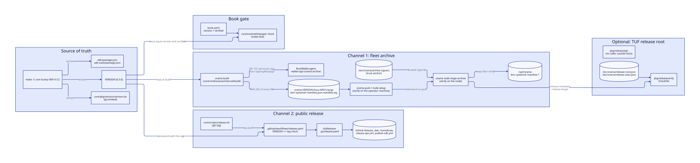
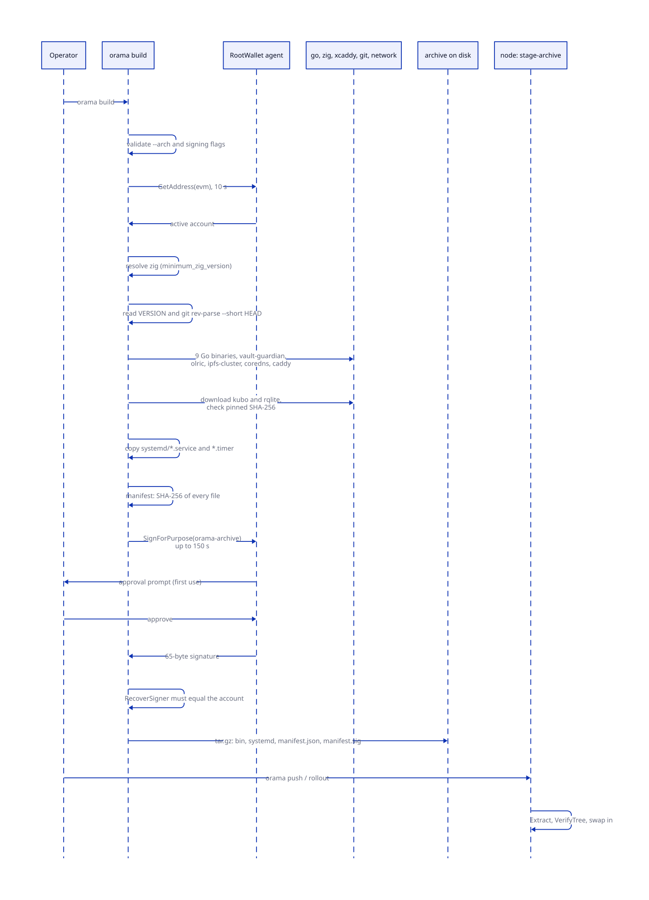
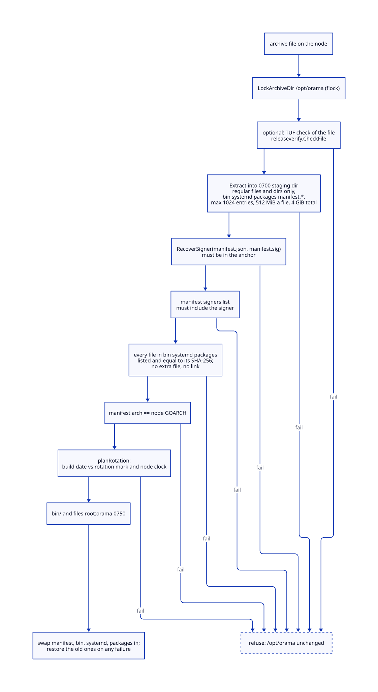
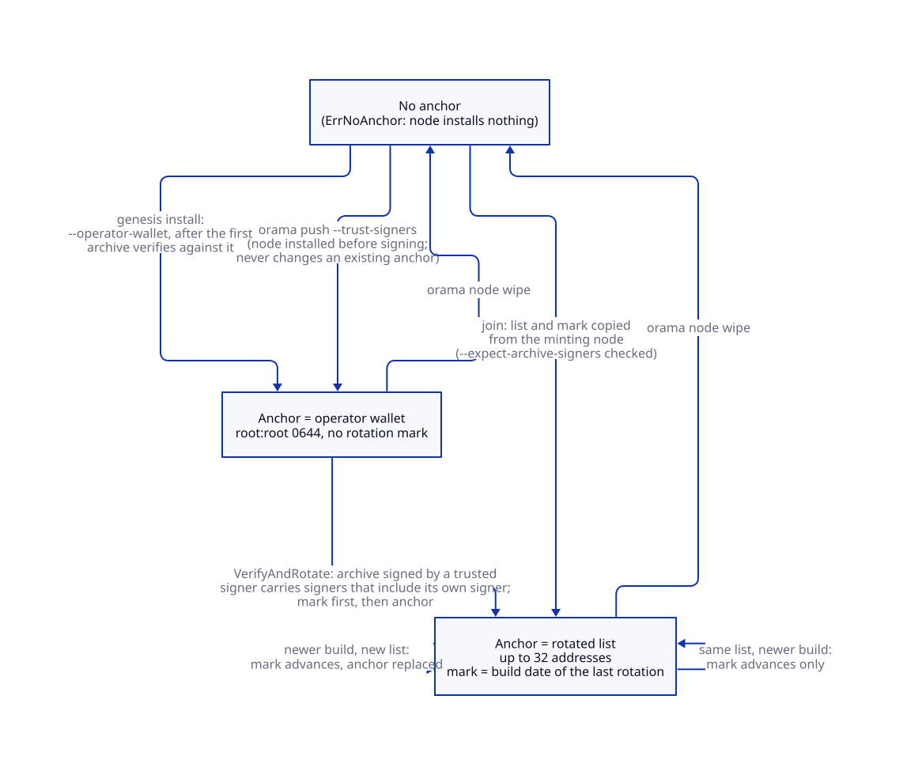
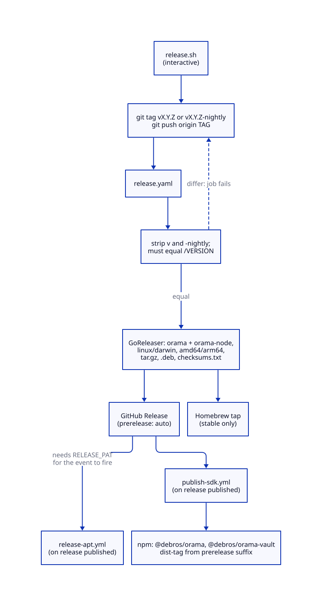
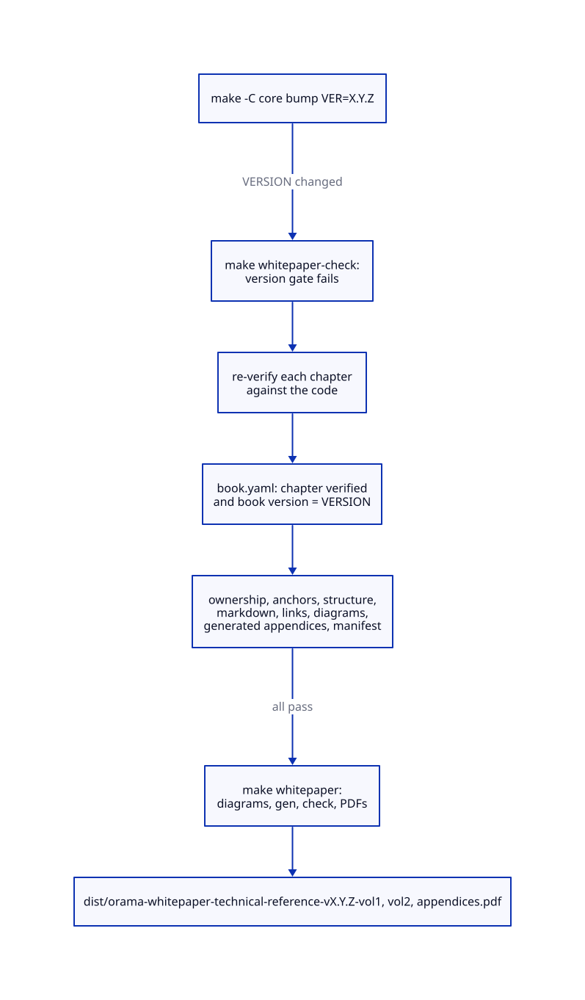

# Build, signing and release

> **At a glance.**
>
> - **What:** how one version number becomes software on a node, and how a node decides to run it. `/VERSION` is the only version. `orama build` cross-compiles 16 binaries and the systemd templates into one archive, lists the SHA-256 of every file in `manifest.json`, and has the operator's RootWallet sign that manifest with EIP-191. Every node holds a root-owned trust anchor (`/etc/orama/archive-signers`) and installs only an archive whose signature recovers to an address in it. A second, public channel (git tag, GoReleaser, apt, Homebrew, npm) ships the CLI and SDKs and is separate from the fleet. An optional TUF release root adds a second check on top of the wallet. The book you are reading has its own release gate, tied to the same `/VERSION`.
> - **Key numbers:** 16 binaries per archive; signing waits up to 150 s (120 s approval plus 30 s); at most 32 signers; extraction caps of 1,024 entries, 512 MiB per file and 4 GiB per archive; a rotation may be dated at most 1 h ahead of the node clock; 2 of 6 bundled third-party components are pinned by SHA-256; Go 1.27.1, zig 0.15.2.
> - **Code:** `core/pkg/archivetrust/`, `core/pkg/releasesign/`, `core/pkg/releaseverify/`, `core/pkg/version/`, `core/cmd/orama/internal/build/`, `core/scripts/`, `core/Makefile`, `.github/`, `.goreleaser.yaml`, `core/tools/whitepaper/`.
> - **Depends on:** [privilege and filesystem trust](05-privilege-and-filesystem-trust.md) for the `rootfs` writes the anchor uses, [secrets and keys](16-secrets-and-keys.md) for where the anchor sits among the node's keys, and [install and upgrade](30-install-and-upgrade.md) and [rolling upgrades](31-rolling-upgrades.md) for what happens after an archive is accepted.



## Why it exists

A node runs its services straight out of `/opt/orama/bin`, as the `orama` user, and several of them hold the keys of every tenant on the machine. Whoever decides which bytes land in that directory decides everything the node does. Three constraints shaped the pipeline.

First, a node never builds software. The binaries are cross-compiled once on the operator's machine and shipped as one archive, so a node cannot disagree with its neighbours about what it is running and cannot be made to compile attacker-chosen source. The installer once compiled `/opt/orama/src` when the manifest was missing; that path is gone and the verifier has no unsigned mode (`core/pkg/archivetrust/verify.go:VerifyTree`).

Second, a cluster trusts its operator and nobody else. There is no built-in signer, no DeBros key and no certificate authority. The first node's anchor is seeded from the operator's wallet, every later node copies it from the node that invited it, and a signed build may change the list. The deployment key and the signing key are the same RootWallet account that already logs the operator in and derives their SSH keys.

Third, one number has to name a release everywhere: the CLI, the node's report, the archive manifest, the SDK packages, the Debian package and this book. The version used to exist only as a `-ldflags` string, so any build outside `make build` reported `dev`, and a version gate that compares the CLI with a node was unenforceable (`core/pkg/version/version.go`, package comment). The fix is a single file, embedded in the binary, and a test that keeps the copies equal.

Two audiences need different things from a release. A fleet operator needs a signed, verifiable archive for machines they own. A developer or evaluator needs a `brew install` or an npm package. The code keeps them apart on purpose: the public channel never reaches a node, and the fleet channel never touches GitHub.

## The model

**Version.** The text of `/VERSION`, today `0.3.0`. Everything else is a copy or a consequence of it. The owner's rule is that versions come from `VERSION`, never from git tags. The rest of this chapter describes the code as it is, and the places where a tag still decides a number are listed under Known gaps.

**Embedded version.** `core/pkg/version/version.txt`, compiled in with `go:embed` and exposed as `version.Current`. A release build may override it with `-ldflags`; every other build path gets the embedded value.

**Archive.** A gzip tar named `orama-<version>-linux-<arch>.tar.gz` holding `bin/`, `systemd/`, an optional `packages/`, `manifest.json` and `manifest.sig` (`core/cmd/orama/internal/build/find.go:ArchiveName`). These five names are the only things an archive may install, and they are replaced as a unit (`core/pkg/archivetrust/verify.go:OwnedPaths`).

**Manifest.** `manifest.json`: version, commit, date, architecture, a map from file to SHA-256, and optionally a `signers` list (`core/pkg/archivetrust/verify.go:Manifest`). A checksum key without a slash names a file in `bin/`; any other key is a path under `systemd/` or `packages/`.

**Signing message.** The text the wallet actually signs: a fixed first line, the build's identity, the signer list it would install and the SHA-256 of the manifest bytes exactly as archived (`core/pkg/archivetrust/verify.go:SigningMessage`). Domain separation is the point. A signature the same wallet gave to a login challenge can never verify as a build signature, and the approval dialog shows a change of who is trusted.

**Trust anchor.** `/etc/orama/archive-signers`: lowercase `0x` EVM addresses, one per line, `root:root` 0644 in a root-owned directory. The signers.

**Rotation mark.** `/etc/orama/archive-signers.rotated`: the build date of the last signer rotation the node took. It is a replay floor, not a version.

**Release root.** An opt-in TUF root, `/etc/orama/release-root.json`, plus the rollback record `/etc/orama/release-seen.json`. It is checked in addition to the anchor, never instead of it.

**Channel.** The fleet channel is `orama build` then `orama push`, `orama node setup` or `orama node rollout`. The public channel is `core/scripts/release.sh`, the tag-triggered workflows and GoReleaser.

**Book gate.** `core/tools/whitepaper check`, run by `make test`: it fails when `book.yaml` is not stamped with `/VERSION`, or when an anchor, link, diagram or section of this book is wrong.

## How it works

### One version, four copies

`make -C core bump VER=X.Y.Z` writes four files and prints the next steps (`core/Makefile:bump`): `VERSION`, `core/pkg/version/version.txt`, `sdk/package.json` and `sdk-vault/package.json` (through `npm version --no-git-tag-version`). It does not commit, tag or touch `book.yaml`. Its last lines tell the operator to re-verify the book, because the book gate fails from that moment.

Nothing enforces that the four stay equal except tests and one warning:

- `TestEmbeddedVersionMatchesTheRepository` fails `go test ./pkg/version/` when `version.txt` differs from `VERSION`. CI runs it.
- The `version-sanity` job in `.github/workflows/ci.yml` compares `VERSION` with the two `package.json` files and emits a warning, not a failure.
- `release.yaml`, `release-apt.yml` and `publish-sdk.yml` each compare the tag with `VERSION` after stripping a leading `v` and a trailing `-nightly`, and fail on a difference.

Binaries learn the version in two ways, and a build uses both:

| Consumer | Source | Notes |
|---|---|---|
| `orama version` | `-X main.version` if set and not `dev`, else `version.Current` | `core/cmd/orama/version.go:resolveBuildInfo`. Commit and date come only from ldflags, never from Go's VCS stamp, which inside a git worktree names the main repository's HEAD. |
| `orama node report`, privhelper report | `version.Current` | the node's reported version, compared across nodes by the cluster telemetry alert `core/pkg/telemetry/cluster/alerts_cluster.go:checkBinaryVersion` |
| gateway `/v1/version` | `gateway.BuildVersion`, set only by ldflags | `dev` for a plain `go build ./cmd/gateway` |
| archive manifest | the text of `VERSION`, read by the builder | `core/cmd/orama/internal/build/builder.go:readVersion` |
| `sfu`, `turn`, `orama-sni-router` | `-X main.version` | the other binaries define no such variable, so the flag is a silent no-op |

`readVersion` looks for `VERSION` one directory above the module, then in it, and fails when neither exists or the file is empty. The comment states why: the version is part of what the signature covers, so a guessed `dev` would be signed as if it were real. `readCommit` runs `git rev-parse --short HEAD` with `GIT_DIR`, `GIT_WORK_TREE` and `GIT_COMMON_DIR` removed from the environment, because a push hook sets `GIT_DIR` and git then ignores the working directory and names a different repository's commit (`builder.go:withoutGitDir`).

#### How versions are ordered

`autoupdate.Compare` orders two dotted numeric versions. A leading `v` is ignored, a shorter version is padded with zeros (`0.3` equals `0.3.0`), and a segment must be a non-negative integer without leading zeros. Anything else is an error, so a version the code cannot order is never treated as newer (`core/pkg/autoupdate/decide.go:Compare`). A prerelease suffix is such a segment: `orama node autoupdate --current 0.3.0 --candidate 0.3.0-nightly` exits with `version "0.3.0-nightly" has a non-numeric segment "0-nightly"`. `Decide` is the only caller. Chapter 30 covers the policy around it (off, notify, auto, the maintenance window, validators never auto); what matters here is that `Upgrade` and `Apply` have no caller outside tests and `orama node autoupdate` only simulates a decision from flags, so nothing in the product installs a release by itself. The archive verifier does not compare versions at all (see Trust and security).

### Building the archive

`orama build` (`core/cmd/orama/internal/cmd/buildcmd/build.go`) runs `Builder.Build`. The order is chosen so that every cheap failure comes before the first compile:

1. `validateArch`: only `amd64` and `arm64`, a usage error otherwise.
2. `findProjectRoot`: walk up for a `go.mod` beside `cmd/orama`.
3. `signingPlan`: ask the RootWallet agent for its active EVM account (10 s timeout, never prompts). A locked or absent wallet fails here, in seconds, with the hint to unlock the desktop app or pass `--unsigned`. With `--signers`, check that the list includes the signing account.
4. `resolveZig`: find `zig` (`ORAMA_ZIG` or `PATH`), read `minimum_zig_version` from `vault/build.zig.zon` (0.15.2) and require the same major.minor release at or above that patch. Zig breaks its language between minors, and a mismatch used to surface two minutes in as a compile error inside the vault source.
5. Read `VERSION` and the commit; stamp the build date as UTC RFC 3339.

Then eight steps, printed as `[1/8]` to `[8/8]`:

| Step | Produces | How |
|---|---|---|
| 1 | `orama`, `orama-node`, `orama-privhelper`, `gateway`, `identity`, `sfu`, `turn`, `orama-sni-router`, `pubsub` | `go build -trimpath`, `-ldflags "-s -w -X main.version -X main.commit -X main.date"`; the gateway also gets `gateway.BuildVersion`, `BuildCommit`, `BuildTime` |
| 2 | `vault-guardian` | `zig build-exe src/main.zig -target <musl> -O ReleaseSafe` in `vault/` |
| 3 | `olric-server` | a throwaway module, `go get github.com/olric-data/olric/cmd/olric-server@v0.7.4`, `go build` |
| 4 | `ipfs-cluster-service` | the same, `ipfs-cluster@v1.1.6` |
| 5 | `coredns` | `git clone --depth 1 --branch v1.14.7`, copy `core/pkg/coredns/rqlite/*.go` into `plugin/rqlite`, write `plugin.cfg`, `go get` `miekg/dns` and `zap` at `latest`, `go mod tidy`, `go generate`, `go build` |
| 6 | `caddy` | `xcaddy build v2.11.4 --with github.com/DeBrosOfficial/caddy-orama=../caddy` (the DNS provider and certificate storage modules) |
| 7 | `ipfs` | Kubo v0.43.1 tarball from `dist.ipfs.tech`, SHA-256 checked, one file extracted |
| 8 | `rqlited` | RQLite 10.4.0 tarball from GitHub, SHA-256 checked, one file extracted |

The versions are constants in `core/pkg/constants/versions.go`. The two digests are in `core/pkg/constants/release_digests.go`, one per architecture. A download whose SHA-256 differs from the pin is refused with a message that it "is not the release the version pin names". A verified tarball is cached under the user cache directory (`orama-build-pinned/<sha>`), so a network blip on `dist.ipfs.tech` cannot fail a deploy for a file the machine already has; a cached copy that no longer matches is deleted and fetched again (`core/cmd/orama/internal/build/pinned_cache.go:fetchPinned`). Downloads time out after 5 minutes. A missing pin for the architecture is an error that names the file to edit.

Only the Kubo and RQLite tarballs are pinned. Olric, IPFS Cluster, CoreDNS and Caddy are built from source at a version tag, and their dependency graphs are resolved when the build runs (see Known gaps).

#### Why the gateway needs zig

The gateway links `mattn/go-sqlite3` for namespace SQLite databases. That driver is cgo; built with `CGO_ENABLED=0` it compiles to a stub whose every `Open` fails. So the gateway is the one Go binary built with cgo, cross-compiled through `zig cc -target x86_64-linux-musl` (or `aarch64-linux-musl`), with `-linkmode external -extldflags -static` and the tags `netgo,osusergo,sqlite_omit_load_extension` (`core/cmd/orama/internal/build/cgo.go`). The result is still a single static executable, with DNS and user lookups in pure Go. Every other Go binary is built with `CGO_ENABLED=0`. `TestOramaBinaries_EverySQLiteBinaryIsBuiltWithCGO` keeps the list honest. `zig` is therefore a build dependency for the whole archive, not just the vault.

#### Systemd templates and the manifest

Step 9 copies every `.service` and `.timer` file from `core/systemd/` (23 files today) into the archive's `systemd/` directory, flat. Step 10 hashes every file in `bin/`, `systemd/` and, if present, `packages/`. A content directory that holds a subdirectory is an error: the layout is flat by contract. The builder creates no `packages/` today, but the verifier and the installer handle one if an archive carries it. The manifest is rendered with `json.MarshalIndent`, whose map keys are sorted, so the same inputs give the same bytes.

### Signing

`sealManifest` renders the manifest once and signs those exact bytes (`core/cmd/orama/internal/build/sign.go`). The agent is the RootWallet desktop app's local socket (`RW_AGENT_SOCK`, default `~/.rootwallet/agent.sock`); the build never holds a key and never spawns the `rw` binary.

The message is the one in `archivetrust.SigningMessage`:

```
Orama build archive v1
version: <version>
commit: <commit>
arch: <arch>
date: <build date, RFC 3339>
signers: <the --signers rotation, comma separated, or none>
manifest sha256: <hex SHA-256 of manifest.json as archived>
```

A field with a character that is not printable (controls, line and paragraph separators, bidirectional overrides) is refused, because it could draw a fake line in the approval dialog. The agent signs it with EIP-191 `personal_sign` under the purpose `orama-archive` (`core/pkg/rwagent/client.go:PurposeOramaArchive`). The agent signs a message in this format only under that purpose and only for a caller holding the separate `wallet:sign:orama-archive` grant, and plain `wallet:sign`, which gateway login uses, refuses it. RootWallet asks the operator to approve `orama` for archive signing on first use, separately from `wallet:sign`. Approval is keyed to the hash of the calling binary, so every rebuilt `orama` is asked about once; the CLI waits up to `AgentApprovalTimeout` (120 s) plus 30 s.

Before the archive is written the build checks its own work with the node's verifier. `archivetrust.RecoverSigner` must return a valid address, and that address must equal the account the agent reported at step 3. A signature that nodes could not verify, or one made by a different account than the one that will be named in the log, fails the build instead of failing every install (`sign.go:sealManifest`).

`--unsigned` writes a manifest with no `manifest.sig`, prints that no node will install it, and exists for local inspection. `--signers 0xA,0xB` puts the list in the signed manifest. `--sign` is accepted and deprecated. `orama node rollout` and `orama sandbox` build with `Flags{Arch: "amd64"}`, so they always sign with the default account and never rotate; rotating is `orama build --signers` followed by `orama node rollout --no-build --archive <file>`.



### Extraction: reading an archive that is not trusted yet

Both the operator's machine and the node call `archivetrust.Extract` before anything is verified, so extraction is written as if the archive were hostile (`core/pkg/archivetrust/extract.go`):

- only regular files and directories; a link, device or FIFO is an error;
- a name must be a clean relative path, at most 2 segments deep, whose first segment is one of the five `OwnedPaths`;
- each name appears once; at most 1,024 entries; at most 512 MiB for one file; at most 4 GiB written in all;
- files are created with `O_EXCL` and mode 0600, then chmodded to the header's permission masked with 0755 (no setuid, nothing group or world writable); directories are 0755 whatever the umask.

Nothing extracted is trusted until `VerifyTree` says so.

### Verification

`VerifyTree(dir, trusted)` is the single decision function. Every caller (the build's own check, the operator-side upload preparation, `stage-archive`, install, upgrade, the sandbox) ends here. It runs, in order:

1. `trusted` must not be empty (`ErrNoAnchor`).
2. Read `manifest.json` (at most 1 MiB) and `manifest.sig` (at most 1 KiB). A missing signature says the archive is unsigned and names `orama build`.
3. `RecoverSigner`: Keccak-256 over the EIP-191 prefix, the message length and the message; a 65-byte signature whose `v` is 0/1 or the legacy 27/28; recover the public key; lowercase address. It must be in `trusted`, and the error names both the signer and the trusted list.
4. `manifestRotation`: if the manifest carries `signers`, they must normalise (distinct, valid, at most 32) and include the manifest's own signer.
5. `verifyContents`: the manifest must list at least one file; each key maps to a path in `bin/`, `systemd/` or `packages/` with a plain file name; two keys that alias one path are refused; every entry of the three content directories must be a regular file and must be listed (no extra file, no link, no symlinked content directory); then every listed file is opened without following links, must be at most 512 MiB, and must match its SHA-256.

The order matters: the signature is checked before the contents, and the contents are checked against the signed manifest, so nothing in the archive is outside the signature.

`VerifyIntegrity` is the same check against whoever signed it. A joining node uses it before it knows the cluster's signers, so the only thing left to fail after the join has spent the invite is the signer's membership in the list.

`Verify` adds the node-specific part: it reads the anchor, calls `VerifyTree`, requires `manifest.arch` to equal the node's `GOARCH`, and plans a rotation. It changes nothing. `VerifyAndRotate` is the same and then applies the rotation. `stage-archive` calls `Verify`; the installer's Phase 2b calls `VerifyAndRotate` (chapter 30).



### Staging on a node

`orama push` and `orama node rollout` upload the archive into a fresh `mktemp -d` directory on each node and run the node's installed CLI, `/usr/local/bin/orama node stage-archive`, never anything from the archive being pushed (`core/cmd/orama/internal/production/push/stage.go`). The steps:

1. `/opt/orama` must be a directory owned by root and not writable by others.
2. Take the exclusive `flock` on `/opt/orama/.archive.lock` (`archivetrust.LockArchiveDir`). Install and upgrade take the same lock, so neither sees the other's half-finished work.
3. Remove staging directories (`.archive-staging-*`, `.archive-cli-*`) a killed run left behind.
4. With `--release-metadata` and `--release-target`, copy the archive into the 0700 staging directory and check that copy against the TUF release root (below). Giving only one of the two flags is a usage error, never the wallet-only path.
5. Extract into the staging directory and `Verify`.
6. Make `bin/` and every file in it `root:orama` 0750. On a machine being set up for the first time the `orama` group does not exist yet and they stay `root:root` until install creates it.
7. `swapArchive`: move the five owned paths aside into `old/`, current manifest first, then move the verified ones in, new manifest last, and put everything back on any failure. A crash in the middle leaves a tree with no manifest, which install refuses rather than trusting a manifest beside binaries it does not describe.

A refused archive leaves `/opt/orama` exactly as it was. The directory also holds the node's data (`.orama/`), which is never part of `OwnedPaths`.

A first install has no installed CLI to verify with, so `orama node setup` and `orama node install --remote` verify on the operator's machine instead. `PrepareUpload` extracts to a private directory, verifies, and writes a canonical archive from the verified tree only: USTAR headers, a fixed order, regular files and directories, owned by nobody in particular. That file is what is uploaded, never the one the operator named, because `/tmp` is shared and another `tar` might read the original differently from the one that verified it. On the node a script extracts only `bin/orama` from the upload into a root-only directory, checks it against the SHA-256 the verified manifest lists, and runs that CLI's `stage-archive`.

`orama push --trust-signers 0xA` is the same path for a node installed before archives were signed, whose CLI has no `stage-archive`. It verifies on the operator's machine against the given addresses and creates a missing anchor on the node only after the archive has passed there.

### The trust anchor

The anchor is the one file whose integrity decides every other. `ReadAnchor` therefore refuses what anyone but root could have written (`core/pkg/archivetrust/anchor.go`):

- its directory must be a real directory (not a symlink), owned by `0:0`, and not writable by group or others;
- the file is opened with `O_NOFOLLOW` and `O_NONBLOCK`, and the checks are made on that descriptor, so it cannot be swapped between check and read: a regular file, owned `0:0`, no group or world write bit, at most 64 KiB;
- the contents are one lowercase `0x` plus 40 hex characters per line, no duplicates, not empty.

`WriteAnchor` normalises the list (mixed-case input must carry a valid EIP-55 checksum, which catches a mistyped character), writes atomically through `rootfs` without following a symlink (see [rootfs: root writes below an untrusted tree](05-privilege-and-filesystem-trust.md#rootfs-root-writes-below-an-untrusted-tree)), chowns the result to `root:root` and leaves it 0644. The mode is 0644 because the index gateway, which runs as `orama`, reads the list it hands to a joining node. A file in `/etc/orama` that someone other than root owns is refused rather than replaced: its owner could hold it open and write to the new contents.



#### Where the first list comes from

- **Genesis.** `orama node install` requires `--operator-wallet` (`orama node setup` passes the RootWallet address). `SeedGenesisArchiveSigners` verifies the archive in `/opt/orama` against that single wallet first, then removes any rotation mark an earlier cluster left, then writes the anchor. A mistyped wallet fails with nothing to undo. An existing anchor is kept only if it trusts exactly this wallet; any other is refused, because it belongs to an earlier cluster or was rotated (`core/pkg/install/archive_signers.go:SeedGenesisArchiveSigners`).
- **Join.** The joiner's request may carry `expected_archive_signers`; the minting node's gateway refuses a mismatch with 409 before the invite is spent or a peer row is written (`core/pkg/gateway/handlers/join/handler.go`). The response carries the minting node's list and its rotation mark. `TrustJoinedArchiveSigners` refuses an empty list, normalises it, compares it with `--expect-archive-signers` when given, refuses a mark dated more than 1 h ahead of the joiner's clock, then writes the mark first and the anchor second. Before the join spends the invite, `PreflightJoinArchive` has already checked the archive's presence, architecture and integrity.
- **Late creation.** `orama push --trust-signers` creates a missing anchor and never changes an existing one (`archivetrust.CreateAnchorIfMissing`).
- **Removal.** `orama node wipe` deletes the anchor and the mark.

The list the joiner receives is only as trustworthy as the minting node's gateway, which runs as `orama`, not root. `--expect-archive-signers` (which `setup` fills from the `--join-via` node's anchor read over SSH, or from the operator's wallet) is what closes that. A manual `orama node install --token` without it trusts what the minting node sends.

#### Rotation

A manifest that carries `signers` replaces the list on every node that verifies it. The rules:

- **The list must include the signer.** An archive then still verifies after the node rotates to its list, so an interrupted upgrade can be re-run and a join through a node that already rotated installs the same build. Retiring a key therefore takes two builds: the old key signs a list holding both keys, then the new key signs a list without the old one.
- **The signer must be trusted now.** A list in an archive signed by an untrusted signer is refused along with the archive.
- **Replay is blocked by a mark.** The mark records the build date of the last rotation the node took. `planRotation` reads it and decides:

| Condition | Result |
|---|---|
| list equals the anchor, build date not after the mark | nothing to do |
| list equals the anchor, build is newer | advance the mark only (this also repairs a failed mark write) |
| list differs, build is older than the mark | refused: an old build is being replayed |
| list differs, build date equals the mark | finish an interrupted rotation: write the anchor only |
| list differs, build is newer | write the mark, then the anchor |

- **Clock skew.** If a build would advance the mark and is dated more than `MaxRotationClockSkew` (1 h) ahead of the node's clock, it is refused, because a mark ahead of every clock would refuse every later rotation. A rotation whose manifest date is not RFC 3339 is refused.

The mark is written before the anchor, so a crash between the two is finished by running the same archive again: its date equals the mark and only the anchor write remains. `TestVerifyAndRotate_twoBuildRetirementAndNoReplay` and the neighbouring tests exercise each row.

### The TUF release root

`pkg/releaseverify` is the node-side client for a second, independent authority. It is opt-in: a node that has not adopted `/etc/orama/release-root.json` has nothing to check against, and `CheckFile` returns `ErrNoRoot` rather than falling back to the wallet check. The package ships no root and fetches nothing; the operator supplies a directory holding `timestamp.json`, `snapshot.json` and `targets.json`.

`CheckFile` (`core/pkg/releaseverify/file.go`):

1. Read the root and the three files, each at most 4 MiB.
2. Take an exclusive `flock` on `release-seen.json.lock`, held from reading the rollback record to writing it, so two checks cannot both read the old version and let the lower one land last.
3. Run the go-tuf client workflow with the clock set by the caller: root, then timestamp, snapshot and targets. An expired timestamp is `ErrFreeze`; a role signed by fewer keys than its threshold is `ErrThreshold`; a snapshot version lower than the recorded one is `ErrRollback` (an equal version is not); a target with no hash is refused.
4. Hash the open file descriptor, once from its start and never past the target's length, against the target's length and `sha256` or `sha512` digests; any other algorithm is refused. `ErrTargetHash` otherwise. The caller opens the file where nobody else can replace it, so the bytes checked are the bytes then used.
5. Only after all of that, raise the rollback record to the accepted snapshot, atomically (temporary file, fsync, rename). An unreadable record is an error, never zero, because zero would accept any replay.

Two commands use it: `orama node stage-archive --release-metadata --release-target` (an archive must be that target, and then also pass the wallet check) and `orama global stage-oramad` (a chain binary is placed in the cosmovisor layout only after it verifies as a target; see [global nodes](../vol2/37-global-nodes.md)). `orama node autoupdate` maps the same sentinel errors to refusals.

`pkg/releasesign` is the signing half: it builds the canonical-JSON `signed` section of TUF metadata, asks the agent to sign it under the purpose `orama-release` with a dedicated ed25519 key that only the agent holds (the grant `wallet:sign:orama-release` is per signature and never given to the headless agent), verifies the answer against the root's public key before attaching it, and replaces a signature under the same key id rather than adding a second. The payload opens with the `_type` key, so no plain signing request and no archive message can yield a release signature, and no release payload can yield an archive one. No production code calls it: only its tests do. No command writes `release-root.json`, signs metadata or rotates the root, and no node installs through this path unless an operator runs `stage-archive` or `stage-oramad` with metadata they obtained themselves. The fleet e2e feature `release-tuf` generates its metadata with `core/pkg/releaseverify/releasetest`.

### The public release channel

The public channel is a separate pipeline whose outputs a node never installs from.



**`release.sh`** (`core/scripts/release.sh`, `make -C core release`) is interactive. It requires a clean working tree, asks for stable or nightly, and computes a proposed next version from `git tag --list 'v*' --sort=-version:refname | head -1` by major, minor, patch or custom (a custom version must match `X.Y.Z`). A stable release asks whether the nightly-to-main pull request is merged, switches to `main`, and creates the annotated tag `vX.Y.Z`. A nightly release tags the tip of `nightly` as `vX.Y.Z-nightly`. Both ask for confirmation, then `git push origin <tag>`. It never reads `VERSION`.

**`release.yaml`** runs on any `v*` tag push (and on manual dispatch). Its first step compares the tag, minus `v` and a trailing `-nightly`, with `/VERSION` and fails with an instruction to run `make -C core bump` first. It then runs GoReleaser v2 with Go 1.27.1. A manual dispatch runs against a branch, so `GITHUB_REF_NAME` is a branch name and the comparison fails.

**GoReleaser** (`.goreleaser.yaml`) builds `orama` (linux and darwin, amd64 and arm64) and `orama-node` (linux), with `-s -w -X main.version={{.Version}} -X main.commit={{.ShortCommit}} -X main.date={{.Date}}`; writes `tar.gz` archives, two `.deb` packages (`orama` and `orama-node`, installed to `/usr/bin`) and a SHA-256 `checksums.txt`; publishes a GitHub Release (`prerelease: auto`, so a tag with a suffix is a prerelease) and, for stable tags only, a Homebrew formula to the tap. The workflow uses a personal access token when present, because a release created with the default `GITHUB_TOKEN` does not fire the `release: published` event that starts the next two workflows.

**`release-apt.yml`** runs on that event. It checks the tag against `VERSION` (only for the event, not for manual dispatch), builds `orama`, `orama-node` and `orama-gateway` with `CGO_ENABLED=0` for amd64 and arm64, packs a `.deb` named `orama` into `usr/local/bin`, builds a flat apt repository (`dpkg-scanpackages`, a plain `Release` file) and publishes it to the `apt/` directory of GitHub Pages.

**`publish-sdk.yml`** runs on the same event. It checks the tag against `VERSION`, installs with `pnpm install --frozen-lockfile`, and publishes `@debros/orama` (`sdk/`) and `@debros/orama-vault` (`sdk-vault/`) one at a time, stopping at the first failure so a broken build cannot publish half a release. The npm dist-tag follows the version, not the branch: a version containing a hyphen goes to `nightly`, anything else to `latest`. The rule exists because the old branch-based rule once left `latest` pointing at a stale prerelease. A manual dispatch can publish a given version and then creates the git tag `sdk/v<version>`.

None of this is signed by the wallet or the release root. A GitHub release carries only `checksums.txt`. The fleet does not read it: nodes install only wallet-signed archives.

### Continuous integration and supply-chain checks

`ci.yml` runs on pushes and pull requests to `main` and `nightly` (`concurrency` cancels superseded runs):

| Job | Runs |
|---|---|
| `go-test` | in `core/`: `go vet ./...`, `go test -race -timeout 5m ./...`, the contract tests with `-count=1`, and the generated-CLI-reference test |
| `agent-test` | in `os/agent`: vet, race tests, the enrolment seal vector, a linux build |
| `sdk-build`, `vault-sdk-build` | `pnpm install --frozen-lockfile`, lint, typecheck, build, unit tests |
| `vault-guardian` | zig 0.15.2, `zig build`, `zig build test` |
| `version-sanity` | the `VERSION` against the two `package.json` files, as a warning |

`security.yml` runs on pull requests and pushes to `main` and every Monday at 08:00 UTC: `pnpm audit --prod --audit-level=high` on `sdk/` after checking that the lockfile is committed and `.npmrc` sets `ignore-scripts=true`; and, for `core/`, `go mod verify` and `govulncheck ./...` (v1.8.0). `renovate.json` imposes a 30-day minimum release age on dependency updates, no automerge, and zero age for vulnerability alerts. The pull request template asks for `make test`, a test plan, and the distributed-system impact (Raft, WireGuard, Olric, startup order, rolling-upgrade compatibility).

The root `make test` is wider than CI: it adds the Caddy modules' tests, the fleet e2e lint, the e2e coverage gate and the harness unit tests, and the book gate (below). The scanners that cover the rest of the release (`govulncheck`, `staticcheck`, `gosec`, a secret scan of the tree and of the built archive, fuzz targets, the race detector on the busiest packages) belong to the fleet e2e feature `scanners`, which the owner runs with `make e2e-fleet`.

The repository also carries `core/.githooks/` (a pre-commit that would regenerate a changelog and a pre-push that runs `go test ./...` in `core/`), `core/scripts/install.sh` (builds the CLI with `make build`, copies it to `~/.local/bin` and adds that directory to the shell's PATH), `core/scripts/nodes.conf.example` (a local fallback inventory; `nodes.conf` is gitignored) and two operator scripts under `core/scripts/` (`monitor-webrtc.sh`, `patches/disable-caddy-http3.sh`). `core/.env.example` names two optional keys: `OPENROUTER_API_KEY` for `orama inspect --ai` and `ZEROSSL_API_KEY`. The hooks are inactive (see Known gaps).

### The book's release gate

This book is part of the release. `core/tools/whitepaper` (`make whitepaper-check`, part of the root `make test`) enforces the rule that the book describes the code at `/VERSION`:



1. `make -C core bump VER=X.Y.Z` changes `/VERSION`. From that moment the version gate fails: `book.yaml` `version`, and the `verified` stamp of every chapter, must equal `/VERSION` (`core/tools/whitepaper/check.go:checkVersion`). The failure names the stale chapters.
2. For each chapter, a person compares the chapter with the code at the new version: every claim, number, diagram and Known gap. Chapters are independent, so this parallelises.
3. Each chapter's `verified:` is set to the new version, then the book's `version:`.
4. `make whitepaper` runs `whitepaper-diagrams` (render stale D2 files with `d2 --layout elk --theme 0` and stamp the source SHA-256 into each SVG), `whitepaper-gen` (regenerate the appendices built from code: port map, schema, chain messages, configuration, known gaps, and the CLI reference through `make -C core docs`), `whitepaper-check`, and then `whitepaper build`, which typesets three PDFs through `pandoc` and `typst`: `dist/orama-whitepaper-technical-reference-v<version>-vol1.pdf`, `-vol2.pdf` and `-appendices.pdf`.

The gates, all run by `check` (`core/tools/whitepaper/check.go:runChecks`):

| Gate | Fails when |
|---|---|
| version | `book.yaml` `version` or a chapter's `verified` differs from `/VERSION` |
| ownership | a tracked file is explained by no chapter's `owns:` and is not excluded; an `owns:` entry is too broad, duplicated or matches nothing |
| anchors | a backticked path (`core/`, `chain/`, `vault/`, `sdk/`, `sdk-vault/`, `caddy/`, `e2e/`, `contracts/`, `docs/`, `website/`, `plans/`) does not exist, or its `:Identifier` does not appear in the file |
| structure | the title, At-a-glance block or the 11 section headings of a subsystem chapter depart from the contract |
| markdown | raw HTML, curly braces, a bare less-than sign, footnotes or heading attributes outside code |
| links | an image or link points at a missing file or heading |
| diagrams | an SVG is missing, stale against the SHA-256 of its D2 source, has no source, or no document embeds it |
| generated | a generated appendix differs from what the code produces now |
| manifest | a listed file is missing, or a book file is not listed |

The gate needs only Go and git; the PDF build needs `d2`, `pandoc` and `typst`. The gate is a mechanical check of the book's structure and of every code anchor. It cannot check that a sentence is still true; that is the human step 2, and the `verified:` stamp is the record that it happened.

## State it owns

| What | Where | Written by | Read by |
|---|---|---|---|
| The version | `VERSION`, `core/pkg/version/version.txt`, `sdk/package.json`, `sdk-vault/package.json` | `make bump` | the builder, every binary, CI, the book gate |
| Third-party versions | `core/pkg/constants/versions.go` | developers | the builder, installers |
| Pinned digests | `core/pkg/constants/release_digests.go` | developers | `fetchPinned`, `verifyPinnedSHA256` |
| Pinned tarball cache | `<user cache dir>/orama-build-pinned/<sha256>` | the builder | the builder |
| The archive | `/tmp/orama-<version>-linux-<arch>.tar.gz` by default | `orama build` | push, setup, rollout, sandbox |
| Trust anchor | `/etc/orama/archive-signers`, `root:root` 0644 | genesis install, join, `push --trust-signers`, a signed rotation | stage-archive, install, upgrade, the join handler |
| Rotation mark | `/etc/orama/archive-signers.rotated`, `root:root` 0644 | a rotation, a join | the same |
| Release root | `/etc/orama/release-root.json` | the operator, by hand | `releaseverify.CheckFile` |
| Rollback record | `/etc/orama/release-seen.json` and `.lock` | `CheckFile`, under `flock` | `CheckFile` |
| Installed archive | `/opt/orama/manifest.json`, `manifest.sig`, `bin/`, `systemd/`, `packages/` | `stage-archive` (swap) | install, upgrade, systemd units |
| Archive lock | `/opt/orama/.archive.lock`, 0600 | `LockArchiveDir` | stage-archive, install, upgrade |
| Staging leftovers | `/opt/orama/.archive-staging-*`, `.archive-cli-*` | stage-archive, setup | removed by the next run |
| Release tags and artifacts | git tags `v*`, GitHub Releases, GitHub Pages `apt/`, npm | `release.sh`, workflows | users of the public channel |
| Book stamps | `docs/whitepaper/technical-reference/book.yaml` | the person who re-verifies | the version gate |
| Rendered diagrams | `docs/whitepaper/technical-reference/diagrams/*.svg` | `make whitepaper-diagrams` | the diagram gate, the PDFs |

## Lifecycle

**Build time.** `bump`, commit, `orama build`. The operator unlocks the RootWallet desktop app first. The first build after a rebuild of `orama` waits for an approval prompt; later builds with the same binary do not.

**First install.** Setup verifies the archive on the operator's machine against their wallet, uploads the canonical re-pack, and the node creates its anchor from the wallet at genesis or copies it on join. The archive's signer must already be that wallet.

**Routine push.** The node's own installed CLI verifies the archive against the anchor, then swaps it in. A push to a node on a release from before archive signing needs `--trust-signers` once, because that node's CLI has no `stage-archive` and no anchor. The first upgrade to the release that introduced verification runs the previous release's unverifying code.

**Rolling upgrade (mixed versions).** Stage and upgrade are separate. Staging verifies against the current anchor and does not rotate; the upgrade's Phase 2b is what applies a signer rotation ([install and upgrade](30-install-and-upgrade.md)). During a rollout some nodes therefore still hold the old list. A build that rotates is accepted by an old-list node only if it is signed by a signer that node still trusts, and the include-yourself rule guarantees the same archive also verifies on a node that has already rotated. Do not retire a key in one build. Nothing in the verifier compares versions, so skew between nodes during a rollout is bounded by the rollout order, not by this layer ([rolling upgrades](31-rolling-upgrades.md)). A cross-node version mismatch is raised as a warning by the cluster telemetry alert `core/pkg/telemetry/cluster/alerts_cluster.go:checkBinaryVersion`.

**Restart.** Staging is restart-safe. A killed `stage-archive` leaves a `.archive-staging-*` directory that the next run deletes under the lock; a crash during the swap leaves no manifest, which install refuses. A restarted node needs no re-verification: the anchor is a file.

**Node loss.** Nothing about the archive is cluster state. A replacement node gets its anchor from the node that invites it, with the mark. `orama node wipe` removes both.

## Failure modes

| Trigger | What the system does | What you observe |
|---|---|---|
| RootWallet locked or not running during `orama build` | fails at the account lookup, before compiling | an error naming the agent and suggesting unlock or `--unsigned` |
| Approval not given within 150 s | the sign call fails; no archive is written | "sign the manifest with your RootWallet" |
| Wrong `zig` minor | the build refuses before compiling | the error names the vault's needed minor and `ORAMA_ZIG` |
| Pinned tarball digest differs | the download is refused and not cached | "is not the release the version pin names" |
| No `VERSION` file or no git repository | the build fails | an error naming the files tried, or the failed `git rev-parse` |
| Archive unsigned, or signed by an address not in the anchor | stage and install refuse; `/opt/orama` unchanged | "is unsigned (no manifest.sig)" or "which this node does not trust (it trusts ...)" |
| A file changed after signing, an extra file, a link | the verifier refuses | "does not match the signed manifest" or "is in the archive but not in its signed manifest" |
| Archive built for the other architecture | refused after the signature check | "built for linux/arm64 and this node is linux/amd64" |
| Anchor missing | every archive is refused | `ErrNoAnchor`, naming genesis, join and `push --trust-signers` |
| Anchor owned by a non-root user or writable by group or world | refused, the owner is named | "refusing to trust it", with the `chown` or `chmod` to run after checking |
| Rotation without its own signer | refused | "leaves out its own signer" |
| Replay of an older rotating build | refused | "an old build is being replayed" |
| Builder or node clock more than 1 h wrong | the rotating archive is refused | "more than 1h0m0s ahead of this node's clock" |
| `stage-archive` killed mid-run | the next run clears leftovers under the lock | none; a half-swapped tree has no manifest and install refuses it |
| Disk full during extract or swap | extract or the rename fails; the swap restores the previous paths | an error from the failed step |
| TUF: expired timestamp, lower snapshot, short signature set, changed target | the archive is refused; the rollback record is not raised | `timestamp freeze`, `snapshot rollback`, `signature threshold` or `target hash` |
| Tag does not match `VERSION` | the release workflow fails before building | "implies version ... but /VERSION says ..." |
| Fleet-version drift across nodes | no automatic action | a warning alert "Binary version mismatch" |

## Trust and security

**What an attacker can do in each position.**

- *Holds the operator's wallet (or the approved `orama` binary on an unlocked agent).* Can sign an archive that every node accepts, and can rotate the signer list. This is the root of trust by design; nothing else in the pipeline stops it. The agent's purpose and grant separation limit what a stolen login session can do, not what the wallet itself can do.
- *Holds the release host, the build machine's filesystem or the network between them, but not the wallet.* Can change the archive; the signature then fails. Cannot forge a signature. Can influence what is built before it is signed, because the build machine is trusted to compile what it signs; that is why the third-party gaps below matter.
- *Is root on one node.* Owns the anchor on that node. Cannot affect other nodes' anchors; a join response is the only way an anchor spreads, and it is checked against `--expect-archive-signers` when given.
- *Is the `orama` user on a node, or a tenant workload.* Cannot write the anchor, its directory, `/opt/orama` or the staging area: all are root-owned and checked by owner and mode on every read. The gateway can read the anchor and hand it to a joiner, and a compromised minting gateway could send a false list; `--expect-archive-signers` is the defence.
- *Can replace the archive between check and use.* Defeated by staging: the verified copy is the one extracted and verified, in a 0700 directory under a root-owned base; the upload is a canonical re-pack; TUF checks the descriptor that wrote the copy.
- *Sends a crafted tar.* Extraction refuses links, devices, traversal, duplicates and oversize, and sets modes explicitly.
- *Replays an old signed build.* Allowed: the signature proves who built an archive, not that it is the newest. A rollback to an older build signed by a trusted key is not refused. Replaying an old *rotation* is refused by the mark.
- *Obtains a signature for something else.* The message begins with a fixed domain line and is signed under a purpose the agent enforces both ways: a release payload cannot be signed as an archive, an archive message cannot be signed as a release, and a login challenge cannot be signed as either (`core/pkg/rwagent/client_test.go`).

**Secrets.** The build handles none. The wallet's seed never leaves the agent; the signature is public; the anchor holds public addresses. The `.env.example` keys are optional and not used by the build. `.gitleaks.toml` lists reviewed test vectors; the `scanners` feature scans the committed tree and the built archive.

**The public channel is outside this boundary.** A Debian package, a Homebrew formula or an npm package is trusted as far as GitHub and npm are, and the apt repository is unsigned (Known gaps).

## Limits and scale

| Quantity | Value | Where |
|---|---|---|
| Binaries per archive | 16 | `builder.go:oramaBinaries` and steps 2 to 8 |
| Systemd files | 23 | `core/systemd/` |
| Entries per archive | 1,024 | `extract.go:maxEntries` |
| One file | 512 MiB | `verify.go:MaxFileBytes` |
| Whole archive | 4 GiB | `extract.go:maxExtractedBytes` |
| Manifest / signature read | 1 MiB / 1 KiB | `verify.go:manifestLimit`, `signatureLimit` |
| Signers | 32 | `anchor.go:MaxSigners` |
| Anchor file | 64 KiB | `anchor.go:anchorFileLimit` |
| TUF metadata file | 4 MiB | `file.go:maxMetadataBytes` |
| Agent address lookup | 10 s | `sign.go:addressLookupTimeout` |
| Signature wait | 150 s | `sign.go:signTimeout` |
| Tarball download | 5 min | `archive.go:downloadFile` |
| Rotation clock skew | 1 h | `rotate.go:MaxRotationClockSkew` |
| Architectures | amd64, arm64 | `cgo.go:zigTargetFor` |

At 10x the fleet, verification costs nothing new: each node verifies its own copy, once per push and once per upgrade, and the signature is one ECDSA recovery plus hashing a few hundred MiB. The archive is signed once per build, not per node. The first bottleneck is the operator, in three places. One RootWallet signature per build is a human approval. One machine compiles all 16 binaries on every build with no incremental cache beyond the pinned tarballs, and the build downloads, clones and resolves from the network each time. And the single signing key is a single point of compromise and of loss; the 32-signer cap bounds a shared list, not the risk. Pushing to many nodes is the push layer's concern ([rolling upgrades](31-rolling-upgrades.md)). The public channel scales with GitHub Actions and has no per-node cost.

The book gate scales with the number of chapters and tracked files: it runs `git ls-files` once and reads every chapter. The human step of re-verification is linear in chapters and is the real cost of a release.

## Design decisions

### Sign the manifest, not the tarball

*Chosen:* the signature covers `manifest.json`, which lists the SHA-256 of every installed file; the verifier recomputes every hash. *Rejected:* a detached signature over the `.tar.gz`. *Why:* tar and gzip encodings are not canonical, so a verifier and an installer can read the same file differently, and a file added to the tar would be covered by the outer signature without anyone having listed it. A signed list of hashes is stable under re-packing, which is what lets the operator's machine upload a canonical archive made from the verified tree.

### The cluster trusts its operator's wallet, not a DeBros key

*Chosen:* the anchor is seeded from `--operator-wallet`, copied on join, rotated by signed builds. *Rejected:* a signer baked into the binary, or a certificate authority. *Why:* the code comment on the anchor and `website/src/docs/operator/signed-archives.mdx` state the position: no built-in signer; a cluster is the operator's. The cost is that key loss or compromise is the operator's problem, with rotation as the only tool.

### A domain-separated message with a purpose enforced by the agent

*Chosen:* a fixed first line, the full build identity and the signer list in the signed text, and a separate agent grant per purpose. *Rejected:* signing a bare digest. *Why:* a wallet signs for many applications; a signature over a hex string must never pass as a build signature, and the approval dialog should show a change of who is trusted.

### The verifier is the node's installed binary

*Chosen:* `stage-archive` runs the CLI already on the node, and a first install runs a CLI checked against the verified manifest. *Rejected:* running the new archive's own code to verify itself. *Why:* nothing from an unverified archive may run before the node's own binary has checked it.

### Fail closed on identity

*Chosen:* the build refuses without a readable `VERSION` or a git commit. *Rejected:* defaulting to `dev` or `unknown`. *Why:* the signature would attest an identity that is a guess.

### Two builds to retire a key

*Chosen:* a rotation must include its own signer. *Rejected:* a rotation to any list. *Why:* an archive that does not verify after its own rotation breaks every retry and every join through a node that already rotated.

### A rotation mark instead of a version comparison

*Chosen:* a build date floor for rotations only. *Rejected:* refusing every older build. *Why:* the code makes the weaker choice explicit: installing an older signed build is allowed, but an old signed build cannot put a retired key back into the anchor.

### Static musl through zig for cgo

*Chosen:* `zig cc` as the C toolchain for the gateway, the same compiler the vault needs. *Rejected:* a glibc cross toolchain, or `CGO_ENABLED=0` with a SQLite stub. *Why:* one toolchain, a single static executable per binary, and a gateway that can open tenant databases.

### TUF is an addition, not a replacement

*Chosen:* the release root is checked first and the wallet check still follows. *Rejected:* letting a release root stand in for the anchor. *Why:* the package comment says it: the default remains the operator wallet, and a node that has not adopted a root has nothing to check against and refuses to guess.

### Pin by digest what can be pinned

*Chosen:* SHA-256 pins for the two upstream tarballs, with a local cache. *Rejected:* trusting the download URL. *Why:* the bytes in a signed archive should be the release the version constant names.

## Known gaps

- **`release.sh` derives its version from git tags, not from `VERSION`.** `get_latest_version` reads `git tag --list 'v*' --sort=-version:refname`; today that is `v0.122.100-nightly`, which has no relation to `/VERSION` (0.3.0), so the proposed major, minor and patch bumps are all wrong. It never reads `VERSION`, never runs `bump`, and cannot know that the tag it creates will fail the VERSION check in `release.yaml` unless the operator typed the custom version that equals `VERSION`. Code: `core/scripts/release.sh:get_latest_version`.
- **GoReleaser takes the version from the tag.** `-X main.version={{.Version}}`, the archive and package names, and the Homebrew formula use the tag. The workflow check strips `-nightly`, so a nightly release of 0.3.0 is built and published as `0.3.0-nightly`. The public CLI then prints `0.3.0-nightly` from `orama version`, and `autoupdate.Compare` rejects that string as unorderable. Code: `.goreleaser.yaml`, `.github/workflows/release.yaml`, `core/pkg/autoupdate/decide.go:Compare`.
- **`release-apt.yml` and `publish-sdk.yml` take the version from the tag** (`github.event.release.tag_name`), and `release-apt.yml` on manual dispatch from a free-text input with no `VERSION` check. A nightly tag therefore publishes an npm version with a prerelease suffix that `VERSION` does not contain.
- **Other build paths derive versions from git tags.** `chain/Makefile` (`VERSION := git describe --tags --always --dirty`, stamped into `oramad version`), `e2e/scripts/chain-deploy.sh` (the same command), and `os/Makefile` (outside this book). With the repository's tags (`v0.122.x`) an `oramad` built for a 0.3.0 network reports a different version.
- **No release gate runs the fleet suite.** `plans/e2e-fleet.md` (P6) and the `scanners` feature claim that `release.sh` refuses a commit without a green fleet report; `release.sh` has no such check, and neither workflow runs tests. `release.yaml` builds any tagged commit. CI does not run the book gate, the Caddy tests, the e2e lint or the coverage gate (`make test` does), so an unstamped version bump or a broken anchor can reach `main`.
- **Third-party components are mostly unpinned.** Only Kubo and RQLite are checked by SHA-256. Olric and IPFS Cluster are fetched with `go get @version` into a temporary module with `GONOSUMDB=*`, which disables the checksum database for every module; CoreDNS is cloned by tag and gets `miekg/dns@latest` and `go.uber.org/zap@latest` plus `go mod tidy`; Caddy resolves through xcaddy. The signed archive attests the bytes that were built, not that they are reproducible. Code: `core/cmd/orama/internal/build/builder.go:buildOlric`, `buildIPFSCluster`, `buildCoreDNS`, `buildCaddy`.
- **A dirty working tree is signed as its clean commit.** `readCommit` is `git rev-parse --short HEAD`; `buildInfo.Dirty` exists but nothing sets it, so a build from uncommitted changes carries a commit that does not describe it and never prints "modified". Code: `core/cmd/orama/version.go:buildInfo`, `builder.go:readCommit`.
- **The build does not check `VERSION` against `version.txt`.** The manifest and the CLI's `-X main.version` come from `VERSION`; `orama node report` comes from the embedded copy. Only a unit test keeps them equal, so a hand edit of `VERSION` yields an archive whose manifest and node report disagree. Code: `builder.go:readVersion`, `core/pkg/version/version.go`.
- **`-X main.version` is a no-op for most binaries.** `orama-node`, `orama-privhelper`, `identity`, `pubsub` and `gateway` define no `main.version`, and `gateway.BuildVersion` is `dev` unless set by ldflags, so `/v1/version` of a gateway built with plain `go build` reports `dev`.
- **The TUF path is verify-only.** `core/pkg/releasesign` has no caller outside its tests; no command writes `/etc/orama/release-root.json`, signs release metadata, fetches it, rotates the root, or resets `release-seen.json`. A node that never adopts a root never uses it. Nothing in the product calls `autoupdate.Upgrade` either.
- **The public channel is unsigned and inconsistent.** GoReleaser publishes a `checksums.txt` with no signature. `release-apt.yml` imports `GPG_PRIVATE_KEY` but never signs the repository's `Release` file, so the apt repository is unsigned. GoReleaser's `orama` package (CLI only, `/usr/bin`) and `release-apt.yml`'s `orama` package (CLI, node and gateway, `/usr/local/bin`) share a package name at the same version with different contents and paths, and `orama-node` is in both. `release-apt.yml` builds the gateway with `CGO_ENABLED=0`, which links the SQLite stub.
- **`core/debian/` is dead and wrong.** No workflow or target uses it; `control` says `Version: 0.69.20` and the `postinst`, like the one in `release-apt.yml`, tells users to run `orama install`, which does not exist (`orama node install`).
- **`core/Makefile` advertises targets that do nothing.** `deps`, `tidy`, `fmt`, `vet` and `lint` are declared `.PHONY` and listed in `make help` but have no recipe, so `make lint` prints "Nothing to be done". `install-hooks` runs `scripts/install-hooks.sh`, which does not exist. `core/.githooks/pre-commit` needs `scripts/update_changelog.sh` and a `CHANGELOG.md`, neither of which exists, and nothing sets `core.hooksPath`. The comment above `docs:` is the stale tail of the `bump` comment.
- **Workflow actions are pinned inconsistently.** `release.yaml`, `release-apt.yml` and `publish-sdk.yml` pin actions by commit SHA; `ci.yml` and `security.yml` use mutable major tags (`actions/checkout@v7`).
- **The archive layout has an unused slot.** `packages/` is verified and installed if present, but no code writes one; `orama build --help` lists fewer binaries than the archive carries (it omits `orama-privhelper`, `pubsub`, `orama-sni-router` and `vault-guardian`).
- **A signed archive does not prove freshness.** A trusted signer's older build installs (a rollback); only a rotation is replay-protected. Code: `core/pkg/archivetrust/verify.go:VerifyTree`.
- **`orama node rollout` and `orama sandbox` cannot build for `arm64` or rotate signers.** They construct `Flags{Arch: "amd64"}` and nothing else. Code: `core/cmd/orama/internal/production/rollout/rollout.go:execute`.
- **The `verified:` stamp is manual.** The book gate proves anchors, structure and links; whether the prose still matches the code is a person's attestation.

## Verify it yourself

**Unit tests.** From `core/`:

```
go test ./pkg/archivetrust/ ./pkg/releasesign/ ./pkg/releaseverify/ ./pkg/version/ ./pkg/autoupdate/ ./cmd/orama/internal/build/
```

Useful names: `TestVerifyTree_tamperedFileIsRefused`, `TestVerifyTree_unlistedFileIsRefused`, `TestVerifyTree_symlinkedContentDirIsRefused`, `TestExtract_refusesEntriesAnArchiveMustNotHave`, `TestVerifyAndRotate_twoBuildRetirementAndNoReplay`, `TestVerifyAndRotate_resumesARotationInterruptedAfterTheMark`, `TestReadAnchor_refusesAGroupOrWorldWritableAnchor`, `TestBuild_signedArchiveVerifiesOnANode`, `TestBuild_agentSigningAsAnotherAccountFailsTheBuild`, `TestReadVersionAndCommit_failClosed`, `TestFetchPinned_aDownloadThatIsNotThePinnedReleaseIsRefusedAndNotCached`, `TestOramaBinaries_EverySQLiteBinaryIsBuiltWithCGO`, `TestCheckFile_rollbackAcrossRunsIsRefused`, `TestCheckFile_concurrentChecksKeepTheHighestSnapshot`, `TestSign_realClientRefusesTheArchivePurposeForReleases`, `TestEmbeddedVersionMatchesTheRepository`. The book gate has its own tests in `core/tools/whitepaper/gates_test.go`.

**Fleet e2e features** (run by the owner with `make e2e-fleet`): `release-checks` (the HEAD archive verifies, every node runs the binaries its signed manifest lists, the version agrees everywhere, the auto-update decision table), `release-tuf` (the release root refuses rollback, freeze, threshold, hash and unknown-target on both `stage-archive` and `stage-oramad`), `install` (archive trust on live nodes), `cli-sandbox-build` (`orama build` usage and refusals) and `scanners` (vulnerability, static analysis and secret scans of the tree and the archive). The coverage gate for them is `make e2e-coverage`.

**Read-only checks.**

```
cat VERSION core/pkg/version/version.txt
orama version
orama node autoupdate --current 0.3.0 --candidate v0.3.1
orama node autoupdate --current 0.3.0 --candidate 0.3.0-nightly
git tag --list 'v*' --sort=-version:refname | head -1
make whitepaper-check
```

The `autoupdate` command only prints a decision; the second form exits with the non-numeric-segment error. On a node, `cat /etc/orama/archive-signers`, `cat /etc/orama/archive-signers.rotated`, `ls -l /etc/orama` and `cat /opt/orama/manifest.json` show the anchor, its mark, their owners and modes, and the manifest that is installed. To inspect an archive without a node: `orama build --unsigned --output /tmp/inspect.tar.gz`, then `tar -xzOf /tmp/inspect.tar.gz manifest.json` (the checksums, the version and the commit); an unsigned archive has no `manifest.sig` and no node will install it.
