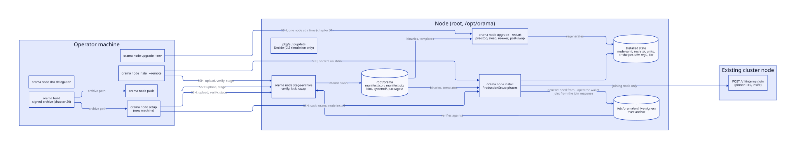
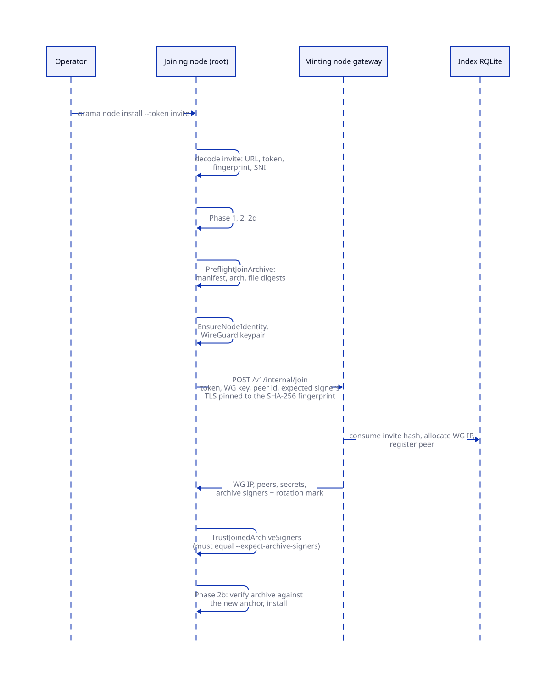
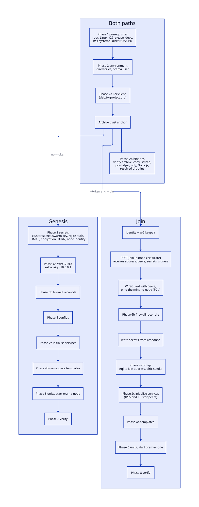
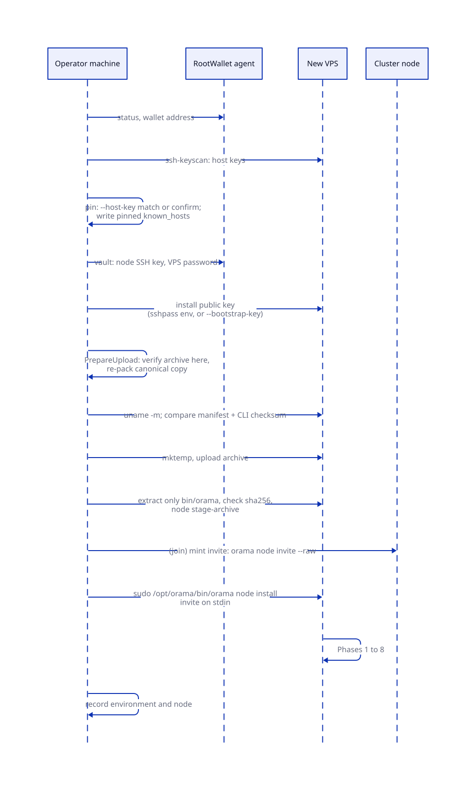
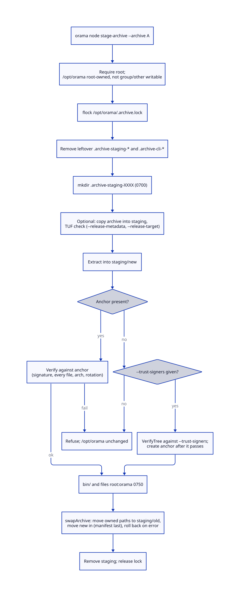
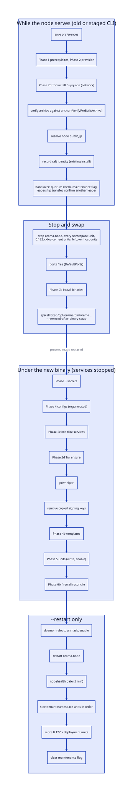
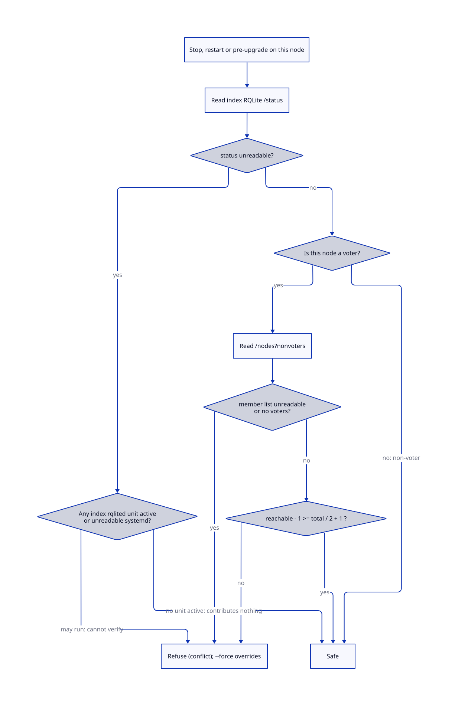
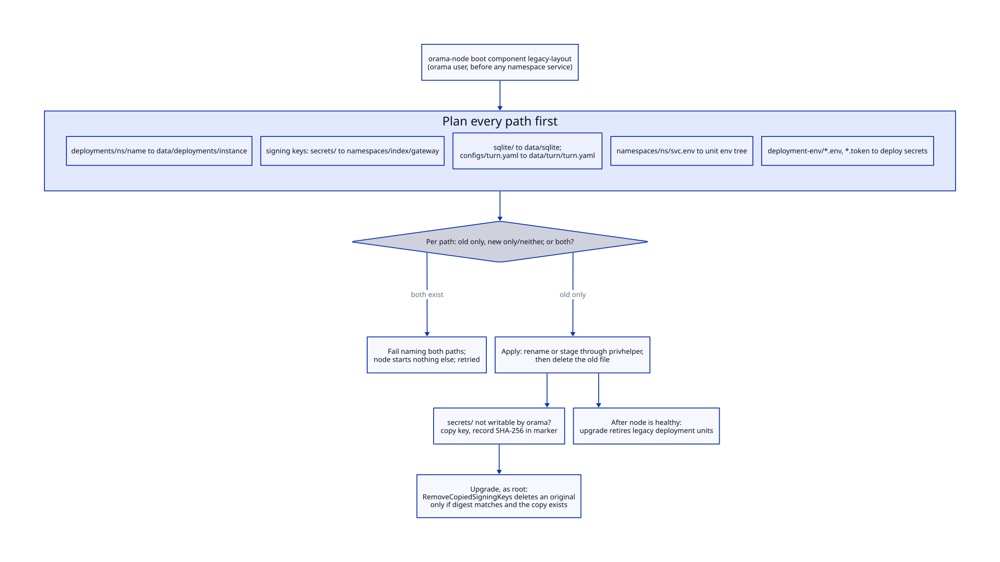
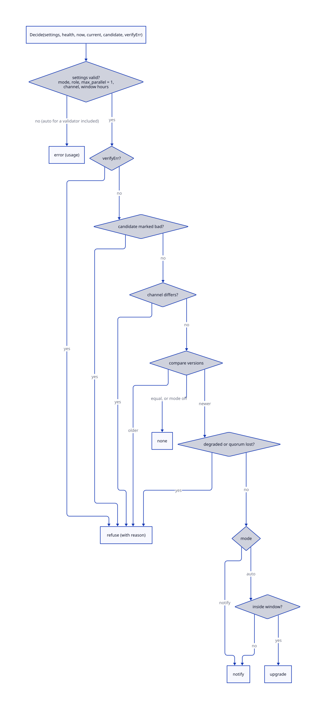
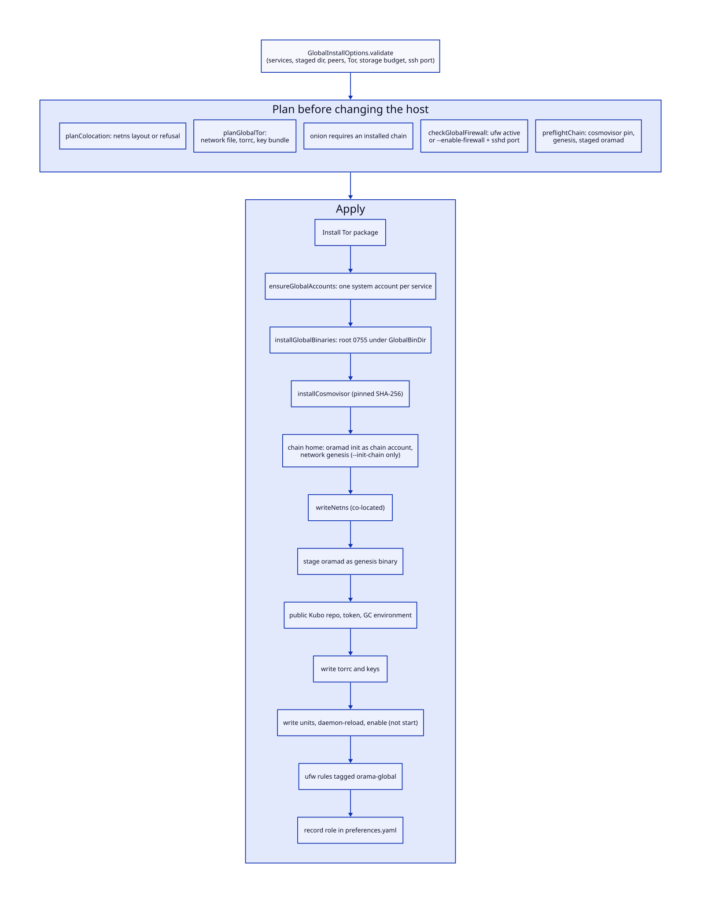

# Install and upgrade

> **At a glance.**
>
> - **What:** the code that turns a machine plus a signed build archive into a node, and a running node into a node on a newer release. Install is a fixed sequence of phases run as root by `orama maint node install`; upgrade is a stop, swap, re-exec and restart sequence run by `orama node upgrade`. Both read the archive extracted at `/opt/orama`, verify it against the node's trust anchor first, and finish by checking that the node serves. A separate path, `orama global install`, installs the global-layer services. Around them sit `orama setup`, the one command that joins fresh machines to a network, and the operator-side commands that put an archive on a node (`push`, `node setup`, `install --remote`), the lifecycle commands, the one-time move off the pre-0.200 on-disk layout, and the auto-update agent, which a timer runs on every node.
> - **Key numbers:** minimum 10 GiB free disk, 2 GiB RAM, 2 CPUs (4 CPUs, 8 GiB and 80 GiB plus the storage offered for the full profile of `orama setup`); supported OS Ubuntu 22.04, 24.04, 26.04 and Debian 12, 13; install verification budgets 60 s (supervisor), 3 min (rqlite), 60 s (`wg0`), 2 min (gateway); join POST timeout 30 s; WireGuard ping check 30 s; upgrade health gate 5 min per node; leadership hand-over waits 60 s for another leader; invite from `orama node setup` 15 min, from `orama node invite` 1 h by default; archive lock `/opt/orama/.archive.lock`.
> - **Code:** `core/pkg/install/`, `core/cmd/orama/internal/production/` (install, setup, enroll, upgrade, lifecycle, push, invite, dnsdelegation, status, logs, uninstall, unlock, clusterops), `core/pkg/legacylayout/`, `core/pkg/autoupdate/`, `core/pkg/updatepolicy/`, `core/pkg/updatenotice/`.
> - **Depends on:** [the node as a supervisor](04-the-node-as-a-supervisor.md) for what starts after install, [privilege and filesystem trust](05-privilege-and-filesystem-trust.md) for the helper and the rules for root below an untrusted tree, [the WireGuard mesh](06-the-wireguard-mesh.md) for the join handshake, [cluster state](07-cluster-state.md) for raft identity, and [build, signing and release](29-build-signing-and-release.md) for the archive. [Rolling upgrades](31-rolling-upgrades.md) orders upgrades across nodes; [recovery](33-recovery.md) covers `recover-raft`, raft id migration and decommissioning.

## Why it exists

A node is a systemd supervisor, a dozen pinned third-party daemons, an overlay interface, a firewall, a Tor client, a privileged helper, a set of unprivileged service accounts and a few hundred files whose owners and modes matter. Getting a machine into that state is a sequence of root actions against a machine nobody has audited. Three constraints shaped the code.

First, the root actions run against a tree an unprivileged user owns. Every daemon runs as the `orama` user (or its own account), and that user owns `/opt/orama/.orama`. Install and upgrade run as root and must read and write inside that tree. A symlink planted there by a compromised daemon would turn a root `chown` or `WriteFile` into a write anywhere. So the installer writes below `.orama` through `rootfs` anchored at the root-owned parent ([rootfs](05-privilege-and-filesystem-trust.md#rootfs-root-writes-below-an-untrusted-tree)), and the one migration that must walk the tree runs as the `orama` user inside `orama-node`, not as root.

Second, what is installed must be what the operator built. A node installs only from an archive whose manifest is signed by an address in `/etc/orama/archive-signers`. There is no compile-on-the-node mode and no unsigned mode: the installer once compiled whatever `/opt/orama/src` held with no signature check, and that path was deleted (`core/pkg/install/orchestrator.go:Phase2bInstallBinaries`).

Third, an upgrade runs on a live distributed system. It must not stop the raft leader without handing leadership over, must leave the node in a state a re-run can recover, and must not report success for a node that restarted into a crash loop. Most of the ordering in the upgrade orchestrator exists because an earlier version got one of these wrong; the code comments name the incidents.

## The model

**Build archive.** A tarball from `orama maint build`, extracted at `/opt/orama` so `manifest.json`, its signature, `bin/`, `systemd/` and `packages/` sit side by side. The manifest lists a SHA-256 per file and the architecture. Format and signing are [chapter 29](29-build-signing-and-release.md); here only the five *owned paths* a stage replaces together matter (`core/pkg/archivetrust/verify.go:OwnedPaths`).

**Trust anchor.** `/etc/orama/archive-signers`, one lowercase `0x` address per line, root-owned (`core/pkg/archivetrust/anchor.go:AnchorPath`). A genesis node creates it from `--operator-wallet`; a joining node takes it from the cluster; `orama maint push --trust-signers` creates it on a node that has none.

**`ProductionSetup`.** The type holding the install phases as methods (`core/pkg/install/orchestrator.go:ProductionSetup`). Install calls them in one order, upgrade calls the same methods in another.

**Phases.** Named steps with stable numbers in the log: 1 prerequisites, 2 environment, 2b binaries, 2c service initialisation, 2d Tor, 3 secrets, 4 configs, 4b namespace templates, 5 systemd units, 6a WireGuard, 6b firewall, 8 verification. There is no phase 7.

**Genesis and join.** A *genesis* install creates a cluster: no join address, every shared secret generated. A *join* install has a join address and a token (the invite carries the address) and receives the shared secrets from the cluster (`core/cmd/orama/internal/production/install/orchestrator.go:isJoiningNode`).

**Invite.** A single-use token wrapped with the URL of the node that minted it, the SHA-256 fingerprint of the certificate it serves, and the server name to present (`core/pkg/invite/`). The handshake is [chapter 6](06-the-wireguard-mesh.md#the-join-handshake).

**Preferences.** `.orama/preferences.yaml`: the saved `nameserver` flag, the `role` (`cluster` when empty, `global`, `both`) and the co-located network namespace name (`core/pkg/install/preferences.go:NodePreferences`). Upgrade reads the flag back so `--nameserver` need not be repeated. An install keeps the `role` and the namespace name a global install wrote (`core/pkg/install/preferences.go:PreferencesForInstall`); it used to overwrite the file and the node forgot it was co-located.

**Staging.** Putting a verified archive under `/opt/orama` without installing from it. `orama maint node stage-archive` does it on a node; `push`, `setup` and `install --remote` drive it over SSH.

**Re-exec.** The upgrade's hand-over from the CLI that started it to the CLI it just installed, by `syscall.Exec` with a marker flag, so the second half runs the new release's code.

**Legacy layout.** Where a 0.122.x node kept gateway keys, tenant SQLite, deployments, TURN config and unit environment files. `pkg/legacylayout` moves them to the current layout.

**Global install.** `orama global install`, the separate installer for the global-layer services. It shares `pkg/install`, the firewall and the preference types, and never touches the cluster services.

## How it works

### Entry points

| Command | Runs on | What it does | Code |
|---|---|---|---|
| `orama node setup` | operator machine | bootstrap a fresh VPS over SSH: key, archive, install | `core/cmd/orama/internal/production/setup/command.go:Run` |
| `orama maint node install` | the node, root | the install phases | `core/cmd/orama/internal/production/install/command.go:Run` |
| `orama maint node install --remote` | operator machine | the same over SSH against `--vps-ip` | `core/cmd/orama/internal/production/install/remote.go:RemoteOrchestrator` |
| `orama maint push` | operator machine | stage a verified archive on nodes | `core/cmd/orama/internal/production/push/push.go:Run` |
| `orama maint node stage-archive` | the node, root | verify and swap in an archive | `core/cmd/orama/internal/production/push/stage.go:Stage` |
| `orama node upgrade` | the node, root | upgrade this node | `core/cmd/orama/internal/production/upgrade/orchestrator.go:Orchestrator` |
| `orama node upgrade --env` | operator machine | plan and run a rolling upgrade ([chapter 31](31-rolling-upgrades.md)) | `core/cmd/orama/internal/production/upgrade/remote.go:RemoteUpgrader` |
| `orama maint rollout` | operator machine | build, push, rolling upgrade | `core/cmd/orama/internal/production/rollout/rollout.go:Run` |
| `orama node invite` | the node, root | mint a join invite | `core/cmd/orama/internal/production/invite/command.go:Run` |
| `start`, `stop`, `restart` | the node, root | lifecycle with a quorum guard | `core/cmd/orama/internal/production/lifecycle/` |
| `uninstall`, `status`, `logs` | the node | remove services; list units; read a journal | `core/cmd/orama/internal/production/uninstall/command.go:Handle` |
| `orama node dns delegation` | operator machine | print and check parent-zone NS records | `core/cmd/orama/internal/production/dnsdelegation/` |
| `enroll`, `unlock` | operator machine | the experimental OramaOS image, not covered in this book | `core/cmd/orama/internal/production/enroll/command.go:Run` |
| `orama global install` | the node, root | install global-layer services | `core/pkg/install/global_install_apply.go:InstallGlobal` |

`recover-raft`, `migrate-raft-id`, `remove` and `wipe` are [chapter 33](33-recovery.md). Commands are registered in `core/cmd/orama/internal/cmd/node/node.go`.

### Requirements checks (phase 1)

`Phase1CheckPrerequisites` runs first on install and, before anything is stopped, on upgrade. Each check passes or ends the run with an error naming what to fix (`core/pkg/install/orchestrator.go:Phase1CheckPrerequisites`).

1. Root and Linux.
2. A supported release in `supportedReleases`: Ubuntu 22.04 (`jammy`), 24.04 (`noble`), 26.04 (`resolute`), Debian 12 (`bookworm`), 13 (`trixie`). The list is exactly the releases the Tor Project publishes a suite for, because every node installs Tor. An unsupported release used to warn and fail minutes later in phase 2d (`core/pkg/install/checks.go:supportedReleases`).
3. Architecture `amd64`, `arm64` or `arm`; the archive's architecture must equal the node's, checked separately.
4. `curl`, `git`, `make`, `jq` and `speedtest-cli` installed with `apt-get` if missing, waiting up to 900 s for a dpkg lock, because a fresh cloud image runs unattended-upgrades on first boot (`core/pkg/install/checks.go:CheckAll`, `core/pkg/install/apt.go:aptCommand`).
5. Dynamic users resolve. Tenant deployments run as `DynamicUser=` units, which exist only through the `systemd` source in `nsswitch.conf`, and Debian 12's cloud image lacks it. `EnsureDynamicUserNSS` installs `libnss-systemd`, adds the source to the `passwd` and `group` lines (editing a symlinked file at its target through a synced temp file), and verifies both (`core/pkg/install/nss_systemd.go:EnsureDynamicUserNSS`).
6. At least 10 GiB free on the filesystem holding `/opt/orama`, 2 GiB total RAM, 2 CPUs (`core/pkg/install/checks.go:MinFreeDiskBytes`). `--skip-checks` skips these three and nothing else.

### Phase 2: the environment

`Phase2ProvisionEnvironment` creates the tree through `rootfs` (0755; the deployment and SQLite trees 0700, `secrets/` 0700): `configs/`, `data/` with `ipfs/repo`, `ipfs-cluster`, `rqlite`, `vault`, the namespaces, TURN and TLS directories, `logs/`, `tls-cache/`, `backups/`, `bin/`. The gateways' writable subtrees are created here because their units list them in `ReadWritePaths` and cannot create them (`core/pkg/install/provisioner.go:EnsureDirectoryStructure`). It then creates the `orama` system user (no home directory, shell `/usr/sbin/nologin`); on first creation only, it `chown -R`s the tree and locks `bin/` as `root:orama` 0750. A failure is fatal because the units say `User=orama` (`core/pkg/install/provisioner.go:EnsureOramaUser`).

### Phase 2d: the Tor client

Every node runs a client-only Tor, `orama-namespace-tor@index`, because `/v1/proxy/anon`, `/v1/proxy/tunnel` and `anon_fetch` exist on every node. `PhaseTorSetup` removes the legacy Anyone network if present, installs Tor from `deb.torproject.org` and writes the Orama torrc (`core/pkg/install/tor_setup.go:PhaseTorSetup`).

It masks the distro's `tor.service` and `tor@default.service` first so nothing races the Orama unit for the SOCKS port, and adds the apt source only when the one on disk is not exactly what it writes for the OS suite. The archive key is downloaded (60 s timeout, 256 KiB limit), imported into a throwaway gpg home, refused unless its primary key has the pinned fingerprint `A3C4F0F979CAA22CDBA8F512EE8CBC9E886DDD89`, and only that key, exported by fingerprint, reaches the keyring apt trusts (`core/pkg/install/installers/tor_keyring.go:installVerifiedKeyring`). The torrc is a client and nothing else: `SocksPort 127.0.0.1:9050 IsolateSOCKSAuth`, `ClientOnly 1`, `ORPort 0`, `DirPort 0`, `ExitRelay 0`, `ClientRejectInternalAddresses 1` (`core/pkg/install/installers/tor.go:GenerateTorrc`).

Phase 2d needs outbound HTTPS, so it runs early: on install before a join can spend the invite, on upgrade before anything is stopped. Failure is fatal; a node without Tor would serve those routes as 503s. After the swap, `PhaseTorEnsure` repeats it in *ensure* form, touching the network only if Tor is missing or its repository is stale. That covers the upgrade that replaces Anyone, whose pre-stop half ran a binary that knew nothing of Tor.

### The trust anchor at install

Before any binary is installed the node needs an anchor, and the archive must verify against it.

**Genesis.** `SeedGenesisArchiveSigners` verifies that the extracted archive is signed by `--operator-wallet` and only then writes the anchor, so a mistyped wallet leaves nothing to undo. An existing anchor is kept only if it trusts exactly that wallet (a re-run); any other is refused as left over from an earlier cluster. A genesis install without the wallet is refused by the flag check before anything changes (`core/pkg/install/archive_signers.go:SeedGenesisArchiveSigners`, `core/cmd/orama/internal/production/install/flags.go:requireGenesisWallet`).

**Join.** The cluster's signers arrive in the join response. Everything checkable without them is checked before the invite is spent (`PreflightJoinArchive`): the archive is present, built for this architecture, and every file matches its signed manifest, against `--expect-archive-signers` if given. After the response, `TrustJoinedArchiveSigners` requires the list to equal the expected one, rejects an empty list, validates the optional rotation timestamp and refuses one more than `MaxRotationClockSkew` (1 h) ahead of the node's clock, then writes the rotation mark first and the anchor second, so an anchor never stands without its replay floor (`core/pkg/install/archive_signers.go:TrustJoinedArchiveSigners`, `core/pkg/archivetrust/rotate.go:MaxRotationClockSkew`). `establishArchiveTrust` sequences the preflight, the join and the trust step in front of phase 2b (`core/cmd/orama/internal/production/install/orchestrator.go:establishArchiveTrust`).

### Phase 2b: installing binaries

`installFromPreBuilt` runs under the archive lock, an `flock` on `.archive.lock` that `stage-archive` also takes, so the files copied cannot be replaced after they were verified (`core/pkg/install/prebuilt.go:installFromPreBuilt`).

1. `verifyAndRotate` checks signature, every file digest and architecture against the anchor and applies a signed signer rotation the archive carries. The manifest it returns must deep-equal the one phase 2b detected, or the install is refused.
2. `apt-get install curl wget unzip sudo` (runtime dependencies only).
3. Up to twelve binaries named in the manifest are copied: `orama`, `orama-node`, `gateway`, `identity`, `sfu`, `turn`, `olric-server`, `ipfs`, `ipfs-cluster-service`, `rqlited`, `coredns` to `/usr/local/bin`, `caddy` to `/usr/bin`. A name absent from the manifest is skipped (CoreDNS on a non-nameserver). `copyBinary` removes the destination first, so replacing a running binary unlinks the old inode instead of failing with `ETXTBSY`. The Vault guardian stays in `/opt/orama/bin`.
4. `setcap cap_net_bind_service=+ep` on both `orama-node` paths and `/usr/bin/caddy`. Fatal.
5. The privileged helper (below).
6. ntfy, Node.js, and the systemd-resolved drop-ins: LLMNR and mDNS off on every node, and on a nameserver the stub listener off so CoreDNS can bind :53.

Third-party downloads are pinned by digest in code, not trusted to a checksum served beside the artifact. Node.js is `24.21.0`, unpacked under `/usr/local/lib/nodejs` and linked as `/usr/bin/node`, `npm`, `npx` (`core/pkg/install/installers/nodejs.go:nodeTarballSHA256`). ntfy is `2.28.0` (`ntfyTarballSHA256`). The daemons (rqlite 10.4.0, Olric v0.7.4, Kubo v0.43.1, IPFS Cluster v1.1.6, CoreDNS 1.14.7, Caddy 2.11.4) arrive in the archive and are checked by the manifest (`core/pkg/constants/versions.go`).

#### The privileged helper

`EnsurePrivHelper` copies `bin/orama-privhelper` to the helper path, verifies the copy is byte-identical (a truncated helper would fail only when the node needs root), sets root 0755, writes the socket and service units, reloads, enables and *restarts* the socket, and deletes the old wildcard sudoers file. Every step is fatal: every root action the running node takes goes through this socket (`core/pkg/install/privhelper.go:ensurePrivHelper`; the helper is [chapter 5](05-privilege-and-filesystem-trust.md#the-helper-socket-and-its-service-instances)). It runs at the end of phase 2b on install, and again after the re-exec on upgrade, because the pre-re-exec half of an upgrade is the previous release's code and cannot install what it does not know.

### The genesis install

`executeGenesisFlow` runs after phase 2b (`core/cmd/orama/internal/production/install/orchestrator.go:executeGenesisFlow`):

1. **Phase 3.** `Phase3GenerateSecrets` generates the cluster secret, swarm key, RQLite credentials, API-key HMAC secret, serverless secrets key, TURN secret and the node's libp2p identity ([chapter 16](16-secrets-and-keys.md#generating-and-distributing-the-shared-roots)).
2. **Phase 6a.** The first node self-assigns `10.0.0.1`, saves the public key to `secrets/wg-public-key`, writes `wg0.conf` with no peers and brings `wg0` up (`core/pkg/install/orchestrator.go:Phase6SetupWireGuard`).
3. **Phase 6b**, the firewall.
4. **Phase 4** with `10.0.0.1` as the advertise address, then `ValidateGeneratedConfig`, which strict-decodes `node.yaml` and runs the validator, so a bad file fails here and not at the supervisor's first boot.
5. **Phase 2c** initialises the IPFS repo, the IPFS Cluster identity and config (its peer id joins the trusted-peers file) and the RQLite data directory.
6. **Phase 4b**, **phase 5**, **phase 8**.

Templates precede units because phase 5 starts `orama-node`, whose first act is to start `orama-namespace-wireguard@index`; with no template, systemd answers *unit not found* and the supervisor exits. Install used to converge only through systemd's restart loop. Install seeds no DNS records: the zone's NS, SOA, glue and apex records are written by `orama-node`'s DNS component from the slots nameserver nodes claim ([DNS and nameservers](24-dns-and-nameservers.md)).

### The join install

`requestJoin` first creates the node identity: the peer id is how every store keys the machine, and a join that cannot name it forced the receiving node to invent a synthetic `node-<wgip>` id that matched no `dns_nodes` row. Then it generates a WireGuard key pair and POSTs the invite token, public key, public IP, peer id and expected signers (`core/pkg/gateway/handlers/join/handler.go:JoinRequest`).

`pinnedTLSConfig` refuses to build without a fingerprint, decodes it as a 32-byte SHA-256, sets `InsecureSkipVerify` (a node's certificate is issued for its own domain; there is no CA to chain to) and substitutes a `VerifyPeerCertificate` that compares the leaf certificate's SHA-256 to the pin. The URL names the minting node by address; the TLS server name and `Host` header are the site name the invite carries, because Caddy routes by `Host`. A 200 whose content type is not JSON is rejected, because Caddy answers an unknown `Host` with an empty 200. Timeout 30 s (`core/cmd/orama/internal/production/install/orchestrator.go:pinnedTLSConfig`).

The response carries the WireGuard address and peers, the secrets, the RQLite join address, Olric seeds, IPFS and Cluster peers, the base domain, the ACME directory and the signers. `executeJoinFlow` then:

1. Installs WireGuard, writes `wg0.conf` with the assigned address and peers, brings it up, and pings the *minting* node over the tunnel every 2 s for up to 30 s. Only that node is guaranteed to know the new key at once; the others learn it on the sync loop up to 60 s later.
2. Phase 6b, then writes the secrets.
3. Gives a non-nameserver without `--domain` the name `node-<6 random characters>.<base domain>`. Uses the cluster's ACME directory unless `--acme-ca` is given; an invalid value from the cluster fails the join, since it is written into the Caddyfile.
4. Phase 4 with the response's peers, join address and Olric seeds; phase 2c with the IPFS peers; phases 4b, 5, 8.

Secrets written: cluster secret, swarm key, HMAC secret, RQLite password (and the `rqlite-auth.json` that `rqlited -auth` reads, built locally), Olric key, serverless key, TURN secret, `encryption-root` with its id (the cluster secret with id `1` if the minting node has none), and the IPFS Cluster trusted peers. Every file is 0600 in a 0700 directory, written through `rootfs`.

### Minting an invite

`orama node invite` reads `node.domain` and `node.public_ip` from `node.yaml` (validated again as a public IPv4), draws 32 random bytes as the token and inserts its *hash* into `invite_tokens` with an expiry (default 1 h). A registry holding a usable invite would hold a key to every secret. The invite names this node by address (`https://<public_ip>`), not the domain, because DNS spreads a domain across every nameserver, each with its own certificate. The fingerprint is read from this node's own listener at `127.0.0.1:443` with its domain as server name, unverified: the joiner's pin is the check, so a staging certificate can still be pinned (`core/cmd/orama/internal/production/invite/command.go:Run`).

`setup` mints with `orama node invite --raw --expiry 15m0s` on a `--join-via` node over SSH, or through the gateway's operator API, and checks the result against `orama1_` plus base64url (or a bare 64-hex token) and decodes it before it enters a root command on the new node (`core/cmd/orama/internal/production/setup/command.go:inviteExpiry`).

### The firewall, swap and RAM hygiene (phase 6b)

`Phase6bSetupFirewall` calls `Reconcile` (`core/pkg/install/orchestrator.go:Phase6bSetupFirewall`). The desired state is:

- default deny incoming, allow outgoing; `22/tcp`, `51820/udp`, `80/tcp`, `443/tcp`; `53/tcp` and `53/udp` on nameservers; on a TURN-relaying node `3478/udp`, `3478/tcp`, `5349/tcp` and `49152:65535/udp`;
- `in on wg0 from 10.0.0.0/24`. A source address is not a credential: a packet sourced from the overlay range on the public interface can come from another tenant of the provider's network. Arriving through `wg0` means WireGuard authenticated the peer;
- IPv6 disabled by sysctl, persisted (no ip6tables rules exist);
- `ufw --force enable` and an iptables ACCEPT for the overlay on `wg0` at position 1 of `INPUT`, because ufw's `ct state invalid` drop runs first and conntrack misclassifies reordered tunnel packets (`core/pkg/install/firewall.go:GenerateRules`).

`Reconcile` never resets. It adds each desired allow rule with the comment `orama`, applies the other commands, then deletes tagged rules no longer wanted and a fixed list of exact untagged rules older releases added (`firewall_legacy.go:legacyAllowRules`: Anyone ports, old Olric and IPFS ports with their original comments, `443/udp`, the `/8` and `/24` overlay allows, the 800-port per-namespace TURN blocks). A rule on the SSH port and rules without the tag are never touched. The earlier design ran `ufw --force reset` first, leaving a node with services up firewalled to nothing and then to default-deny with no rules in between, which is why the TURN relay range needed its own re-add to survive an upgrade (bug 846).

Whether the node relays TURN is judged from files, because the TURN units are stopped by then: `data/turn/turn.yaml`, or on a node not yet moved, `configs/turn.yaml` or a per-namespace `turn.env`. A location that cannot be read is an error, never a "no": a false negative closes the relay (`core/pkg/install/orchestrator.go:hostRunsTURN`).

`Reconcile` also applies RAM hygiene: `swapoff -a` and masking `swap.target`; apport masked (its start writes `fs.suid_dumpable=2`); the `pkg/hardening` sysctls written, applied and *read back from `/proc` and compared*, because a later writer can change the live value; coredump `Storage=none` (`core/pkg/install/firewall.go:persistRAMHygiene`; [hardening](05-privilege-and-filesystem-trust.md#hardening-keeping-secrets-off-the-block-device)).

### Phase 4: configuration

`Phase4GenerateConfigs` refuses an empty base domain (no default; the installer once fell back to the node's own domain) and writes:

| Output | Content |
|---|---|
| `configs/node.yaml` (0600) | the node's configuration, including the RQLite password and two keys |
| `configs/olric/config.yaml` | Olric bound to the WireGuard address, memberlist 10103, seeds from the join response or upgrade |
| `data/vault/vault.yaml` | Vault guardian, bound to the WireGuard address |
| CoreDNS Corefile | zone = base domain, backend = the index RQLite ([chapter 24](24-dns-and-nameservers.md)) |
| Caddyfile | node domain (else base domain), the `push.<base>` ntfy block, ACME directory ([chapter 25](25-tls-and-certificates.md)) |
| `/etc/ntfy/server.yml` | `base_url https://push.<base>` ([chapter 22](22-push-notifications.md)) |
| `sni-router.yaml` | only if `sni_router.enabled`; Caddy moves to :8443 ([chapter 26](26-sni-routing-and-stealth-turn.md)) |

`GenerateNodeConfig` renders `core/pkg/install/templates/node.yaml` (`core/pkg/install/config.go:GenerateNodeConfig`):

- `node.id` and `http_gateway.node_name` are the libp2p peer id read back from the identity file. They used to be the first label of `--domain`, and a nameserver's domain is the base domain, so every nameserver got the same id.
- libp2p listens and every address advertises on the WireGuard address; `requireOverlayWGIP` refuses anything outside `10.0.0.0/24` (an empty one renders `/ip4//tcp/4001`; a public one would publish the swarm).
- `rqlite_join_address` has its port forced to the raft port 10101; with only bootstrap peers it is inferred from the first peer, and cleared if that equals the node's own raft address.
- RQLite credentials come from `EnsureRQLiteAuth`, which reuses the password and rewrites `rqlite-auth.json` every time so the two cannot disagree. `min_cluster_size` is 1 everywhere: gating on peer discovery deadlocked the WireGuard sync loop (needs RQLite) against RQLite (needs the peers).

**What survives regeneration.** Phase 4 runs on every upgrade and rewrites `node.yaml` from the template. Carried forward: `node.public_ip`, `tls.acme_ca` (an unreadable file is an error rather than a silent reset to production, which would spend rate limits), `sni_router.enabled`, and `turn_domain` and `sfu_port` of the `webrtc` block (the TURN secret comes from `secrets/turn-secret`). The upgrade's scan recovers peers, address, join address, domain and base domain. Nothing else is (Known gaps). A 0.3.0 install writes no `gateway.yaml`; the index gateway is `orama-namespace-gateway@index` and reads `node.yaml`.

### Phase 4b: templates, accounts and drop-ins

`InstallNamespaceTemplates` holds the archive lock and installs, in order (`core/pkg/install/services.go:InstallNamespaceTemplates`):

1. The index gateway's signing keys (`ensureIndexGatewayKeys`): kept if present, taken from the old state directory if an earlier release kept them there, generated only if neither exists. They must exist before the unit starts, because `LoadCredential=` has no optional form.
2. The index gateway's drop-in, for the `index` instance only: extra `ReadWritePaths`, a reset secrets view, the two keys as credentials. No tenant gateway gets it (`core/pkg/install/gateway_unit.go:IndexGatewayDropIn`).
3. The build sandbox: a drop-in for `orama-deploy-build@` denying the node's own public addresses, and `/etc/orama/build-resolv.conf` naming 1.1.1.1, 9.9.9.9 and 8.8.8.8 only. A packet to the node's own public address is routed over `lo`, and ufw accepts everything on `lo`, so a tenant's `npm install` could otherwise reach every service the node listens on. Rewritten each run so a changed `public_ip` is picked up (`core/pkg/install/build_sandbox.go:installBuildSandbox`).
4. Deployment bind drop-ins. The `orama-deploy-{node,npm,go}@` templates allow no bind and the gateway grants each deployment one port when it starts it. A deployment started before that would find itself unable to listen on its first restart, so each enabled unit gets a drop-in from the `PORT` in its environment file; a unit with no usable file gets none and is reported (`core/pkg/install/deploy_bind.go:deployBindMigration`).
5. The isolated service accounts, then every template unit (seventeen `orama-namespace-*@` templates, five `orama-deploy-*` templates and `orama-turn.service`), then the Corefile handed to the CoreDNS account's group.

Every template is required and the error names it. The two earlier copies logged a warning and continued past each failure, so a node missing half its templates finished installing, and when all failed the function returned nil.

Two namespace services have accounts of their own: CoreDNS as `orama-coredns`, SFU as `orama-sfu` (`core/pkg/systemd/isolation.go:isolatedServices`). `ensureServiceAccount` runs `useradd --system --user-group --no-create-home --shell /usr/sbin/nologin` (with `-g` if the group survived), telling "not found" (`getent` exit 2) from any other failure; `orama` joins `orama-sfu` so the spawner can hand the SFU its config. Group membership takes effect when `orama-node` next starts, hence accounts precede phase 5 ([per-service accounts](05-privilege-and-filesystem-trust.md#per-service-accounts)).

### Phase 5: systemd units

`Phase5WriteSystemdServices` writes the only host unit install owns (`core/pkg/install/orchestrator.go:Phase5WriteSystemdServices`):

1. `chown -R orama:orama` on `.orama`, re-lock `bin/`, hand existing SFU configs to `orama:orama-sfu` 0640.
2. Fail if `ipfs`, `ipfs-cluster-service` or `olric-server` is missing; create `/var/lib/caddy` (systemd refuses a unit whose `ReadWritePaths` entry is missing).
3. Write `orama-node.service`; delete the pre-namespace host units older installs wrote (`LegacyHostUnits`); install `/etc/logrotate.d/orama` (daily, 7 rotations, 200 MB, `copytruncate`, `su orama orama`, for the log files those old units appended to, one of which reached 2.7 GB).
4. Reload; enable `orama-node.service` and `orama-namespace-wireguard@index.service`; disable, never stop, `wg-quick@wg0.service` (stopping it runs `wg-quick down`).

`orama-node.service` is `Type=simple`, `User=orama`, `ProtectSystem=strict`, `ProtectHome=yes`, `PrivateDevices=yes`, `ProtectProc=invisible`, `RestrictNamespaces=yes`, `AmbientCapabilities=CAP_NET_ADMIN`, `Restart=always`, `RestartSec=5`, `StartLimitIntervalSec=0`, `TimeoutStopSec=60`, `MemoryMax=8G`, `MemorySwapMax=0`, `OOMScoreAdjust=-500`, `LimitNOFILE=65536`, logging to the journal (`core/pkg/install/services.go:GenerateNodeService`). `/etc/wireguard` is read-only to it: `wg-quick` runs `PostUp` as root, so a conf the `orama` user could write is root code execution. It logs to the journal because systemd opens `StandardOutput=append:` as PID 1 before dropping privileges, following symlinks, and the `orama` user owns the log directory. The start limit is off because the node degrades rather than exiting, so a restart is a real crash that systemd should keep retrying.

Install then starts `orama-node`. Upgrade writes and enables it and starts it once, in the restart step.

### Phase 8: verification

`Phase8Verify` waits, in dependency order, for four checks; the first that fails ends the install non-zero with a `VerifyFailure` naming it (`core/pkg/install/verify.go:Phase8Verify`):

| Check | Budget | Passes when |
|---|---|---|
| `orama-node.service` | 60 s | active and `NRestarts` is 0 |
| rqlite | 3 min | raft state `Leader` or `Follower` at the address and credentials in `node.yaml`, and for a joiner joined to its join address |
| `wg0` | 60 s | `wg show wg0` reports an interface |
| gateway | 2 min | `GET /health` on `localhost:10104` returns 200 |

Probes retry every 2 s and report the last diagnostic, not "timed out". The old version printed success after a partial template install and after a supervisor that started and exited; the operator, the CLI and the next node's join then proceeded on a node that was not up. The same readiness idea, `nodehealth`, gates the upgrade restart ([readiness](04-the-node-as-a-supervisor.md#readiness-nodehealth)).

### Setup and remote install

`orama node setup` goes from a fresh VPS to a running node. It needs an unlocked RootWallet agent (10 s check) and does (`core/cmd/orama/internal/production/setup/command.go:Run`):

1. Reads the operator wallet address (the `evm` account). It is the genesis trust anchor and the signer the archive is verified against.
2. Creates the node's SSH key in the vault (`<ip>/<user>`).
3. **Pins the host key.** `ssh-keyscan` collects ed25519, ecdsa and rsa keys; fingerprints are compared to `--host-key` or shown for confirmation against the provider's console. Only *matching* entries are trusted: trusting every key a host offers once one matched lets an on-path attacker pass the pin by offering the real key beside its own. The lines go to a private `known_hosts` for the run and into `~/.orama/known_hosts`, so a later `--join-via`, which refuses a first contact, knows the key.
4. Installs the public key with `--password` (vault password handed to `sshpass` in the `SSHPASS` environment variable, never argv) or `--bootstrap-key`, with `-F /dev/null`, `StrictHostKeyChecking=yes` and the pinned file. This credential can hand over the machine, so the key is pinned before it is sent.
5. Tests SSH and, for a non-root user, `sudo -n`.
6. **Puts exactly this build on the node** (`EnsureArchive`).
7. Mints the invite (join only) and runs `sudo /opt/orama/bin/orama maint node install ...` over SSH with the invite on stdin.
8. Records the node in the environment; after genesis, the environment with gateway `https://<base domain>`, leaving the active environment unchanged (switching it redirected every later command on a machine that operates several clusters).

`install --remote` is the same install for a reachable node. Whether an install happens here or over SSH was once inferred from `os.Geteuid()`, so one command line meant two things; `--remote` is explicit, and running without root and without it is refused (`core/cmd/orama/internal/production/install/command.go:Run`). The node-side command line comes from one list, `remoteInstallArgs`, because a hand-written list drifted and dropped `--ca-fingerprint`, leaving a laptop-driven join with nothing to pin. Arguments are shell-quoted unless made only of word characters, because an invite field carrying a quote once ran as root on the joining machine. The invite, cluster secret and swarm key travel as one JSON object on stdin behind the hidden `--secrets-stdin`, bounded at 64 KiB with unknown fields refused: an environment variable needs `AcceptEnv` and is dropped by `sudo`, and a file lands on the new disk (`core/cmd/orama/internal/production/install/secrets_stdin.go:readStdinSecrets`).

### `orama setup`: from fresh machines to a registered node

`orama setup` is the one command a newcomer runs. It takes the addresses of fresh machines and turns them into nodes of a network of the registry, with the global layer beside the cluster node and the operator, the nodes and the validator registered on the chain. `orama node setup` stays as a hidden alias that says so. The plan is a pure function (`core/cmd/orama/internal/setup/plan.go:BuildPlan`): the first address creates the cluster unless the environment already records nodes, the others join it, the first full node carries the operator's one validator, and the services are `chain`, `ipfs` and `provider`, with `relay` (and `exit` only on request) when the Tor network file is given. Every effect goes through a port (`core/cmd/orama/internal/setup/ports.go`), so the order and the decisions are tested against fakes; the real ports are SSH, the network registry, the release repository, the seeds' light-client routes, a chain REST session through an SSH tunnel, and the RootWallet.

The run (`core/cmd/orama/internal/setup/run.go:Run`) changes nothing until every check has passed: the agent is unlocked, the manifest is loaded and its genesis matches the pinned digest, the plan is confirmed, and every machine is enrolled and probed (`core/pkg/install/hardware.go:CheckHardware` refuses a machine below its profile's floor: 2 vCPU, 2 GiB and 10 GiB for `--cluster-only`; 4 vCPU, 8 GiB and 80 GiB plus the storage offered otherwise). Then, per architecture, `releasefetch` fetches the newest release of the network's channel and verifies it against the pinned TUF root, the RootWallet signs it (a fresh machine has no trust anchor, so `stage-archive --release-only` cannot be used on it), and each machine verifies and stages it with `EnsureArchive`. The cluster installs in turn, each join through an invite minted over SSH on a node already in, and the environment is recorded after each node. The global layer installs on up to four machines at once: the trust point is read through two seeds (`core/pkg/statesync/trust.go:Resolve`: the lower of their newest blocks less 100, accepted only if both give the same hash), `orama global install` writes the chain's configuration and joins by state sync, and setup polls the chain over SSH until it has caught up, ending early with the chain's log if its unit stays down. The cluster nodes are then restarted one at a time, each waiting for the health gate, with the node's quorum check bypassed only for a cluster of fewer than three nodes. The chain steps are sent one at a time, each after reading the chain (`core/cmd/orama/internal/setup/onchain.go:onchainPhase`): funds against a budget computed from the chain's parameters (the storage bond is the bond per GiB times the declared capacity), then operator, node, bonds, capacity, provider start and validator, each skipped when the chain already shows it. A faucet is requested only where the manifest says the network has one and a node of it is in the CLI configuration; otherwise the run stops with the exact amount and address. A private cluster's own domain (`--domain`) prints the NS and glue records once the cluster exists and polls DNS and the certificate at the end. The operator account is stored on the environment, so `orama status` shows it.

Because every step reads state first, the same command is a resume: a machine with `orama-node.service` skips the cluster, one with the chain unit skips the global layer, one with the release's manifest skips the upload.

### Staging an archive

Every route ends in the same node-side routine (`core/cmd/orama/internal/production/push/stage.go:stageArchive`). On the operator machine, `archivetrust.PrepareUpload` verifies the archive and writes a canonical re-pack from the verified tree; that is what is uploaded, never the file named. `--archive` is required because the newest archive in `/tmp` was often another checkout's build. On the node, as root:

1. `/opt/orama` must be root-owned and not group- or other-writable.
2. Take `.archive.lock` (exclusive `flock`), shared with install, upgrade, templates and the helper installer.
3. Remove staging directories a killed run left (`.archive-staging-*`, `.archive-cli-*`), then create `.archive-staging-XXXX` (0700) inside `/opt/orama`, on one filesystem so the renames are atomic.
4. Optionally the TUF release check (`--release-metadata` with `--release-target`): the archive is copied into staging and checked through the descriptor that wrote it, so the bytes checked are the bytes extracted. Failure refuses the archive; the wallet check is not tried instead.
5. Extract and verify. With an anchor, against it (signature, every file, architecture, rotation). With none and `--trust-signers`, against the given signers, writing the anchor only after it passes. An existing anchor that differs from `--trust-signers` is an error: the flag only creates a missing anchor.
6. `bin/` and its files `root:orama` 0750 (`root:root` on a machine whose `orama` group does not exist yet).
7. `swapArchive` moves the five owned paths into `staging/old`, then the new ones in. The manifest leaves first and arrives last, so a tree caught half-way by a crash has no manifest and install refuses it rather than trusting a manifest beside binaries it does not describe. Any failure restores what was there.

`orama maint push` runs this on each node with the node's own installed `orama`, so nothing from the archive runs before the node's binary checked it. A node with no such command or anchor (0.122.x) needs `--trust-signers`, which selects another route (`core/cmd/orama/internal/production/push/archive_cli.go:archiveCLIStage`): a script extracts only `bin/orama` into a fresh root-only `.archive-cli-XXXXXXXX` under `/opt/orama` (not `/tmp`, which may be `noexec`), refuses it unless it is a regular non-symlink file with the SHA-256 the verified manifest lists, and runs that CLI's `stage-archive`, which verifies again. The script travels base64-encoded into `bash -s`. Pushes go to one node at a time; a hub fan-out that copied each node's SSH key onto the hub was removed.

### The upgrade, step by step

`orama node upgrade --restart` runs `Orchestrator.Execute`. Every side effect is a function in `upgradeOps`, so tests check the order without a node (`core/cmd/orama/internal/production/upgrade/orchestrator.go:upgradeOps`). A failure names the step.

#### Group 1: while the node serves

A failure here leaves the node untouched.

1. **Preferences.** An explicit `--nameserver` (a pointer, so "not given" differs from `=false`) is saved; failure is fatal.
2. **Phases 1 and 2**, then **Tor** (phase 2d), which needs the network.
3. **Verify the archive.** `VerifyPreBuiltArchive` verifies the extracted archive against the anchor under the lock, including whether a signer rotation it carries would be accepted, and changes nothing. Phase 2b would refuse a bad archive after the stop; checking first means it never takes the node down.
4. **Resolve `node.public_ip`**: `--public-ip`, else the address `node.yaml` records, else the source address of the default route (a UDP "connect" to `8.8.8.8:80` sends nothing). Each must be a public IPv4 address, not private, carrier-grade NAT (100.64.0.0/10), loopback or link-local; the recorded value is rechecked because the `orama` user writes that file. A node behind NAT must be told. It is resolved here so a node without one fails still serving, and the result is passed to the re-exec'd process (`core/cmd/orama/internal/production/upgrade/public_ip.go:resolvePublicIP`).
5. **Record the raft identity** and 6. **hand over**, on an existing install only.

#### The hand-over

`lifecycle.HandlePreUpgrade` must run against the running node: the stop removes this voter, so the leader must step down before it, and afterwards there is no `rqlited` to read. As root (`core/cmd/orama/internal/production/lifecycle/pre_upgrade.go:HandlePreUpgrade`):

1. **Quorum check** (below). A warning aborts.
2. **Write the maintenance flag** `.orama/maintenance.flag` with the RFC 3339 time. Fatal on failure. Nothing reads it (Known gaps).
3. If an index `rqlited` may be running, **transfer leadership**. If this node still leads, abort: restarting a leader forces an election and fails in-flight writes.
4. **Transfer leadership on each tenant RQLite.** Endpoints come from the `rqlite.env` files in `/var/lib/orama-unit-env`, or in `data/namespaces/<ns>/` if that tree does not exist yet; reading only the new tree silently skipped every tenant on the upgrade that crosses layouts. A namespace the node serves (`cluster-state.json`) with RQLite data but no env file is an error; an unaddressable one or a failed transfer is a warning, since losing a tenant leader degrades that tenant, not the node's ability to restart.
5. **Confirm another node leads**, polling `nodehealth.Observe` every 2 s for up to 60 s until the reported leader id is non-empty and this node is not `Leader`. A cluster where this node stepped down and nobody was elected has no quorum, and is the one state where stopping is worse than doing nothing.

**The quorum guard.** `quorumVerdict` reads the index RQLite's `/status` and, for a voter, `/nodes?nonvoters&timeout=3s`, with a 5 s HTTP timeout. It fails closed: an unreadable status is unsafe unless no unit that could run an index `rqlited` is active (`orama-namespace-rqlite@index`, and on a 0.122.x node with no rqlite template also `orama-node`, which ran `rqlited` itself). A non-voter is always safe to stop. A voter whose member list cannot be read, or holds no voters, is refused. Otherwise: V configured voters, R reachable including this node; stopping leaves R minus 1 and quorum needs V divided by 2, rounded down, plus 1. Quorum is a majority of the *configured* voters, and stopping does not remove a node from the raft configuration. An earlier version computed over V minus 1 as though it had; on two voters it concluded "1 of 1, need 1" and allowed it (`core/cmd/orama/internal/production/lifecycle/quorum.go:evaluateQuorumSafety`). `stop` and `restart` run the same guard unless `--force`.

#### The raft identity capture

Before the stop, the upgrade records what the restarted node needs to rejoin under the same identity: raft id, the address its configuration holds it at, suffrage and the member addresses, read from the running `rqlited`, into marker files in the rqlite data directory and a membership record beside it (`core/cmd/orama/internal/production/upgrade/raft_identity.go:captureRaftIdentity`). The release that moves the index raft port changes the listen address; with the id and old address recorded the node restarts under the same id and the leader re-registers it ([raft identity](07-cluster-state.md#raft-identity)). A node without raft state records nothing. A node whose `rqlited` does not answer, as when an upgrade is re-run after it stopped the node, must already have both id and address recorded, or the upgrade stops before the stop; an id without an address (a crash between the two writes) would restart on a new address without joining and stay outside its configuration, so it is refused too. A recorded id that disagrees with the live one fails.

#### Group 2: stop and swap

`stopServices` stops `orama-node` first so it cannot restart what is being stopped, then every namespace unit systemd has loaded *in any state* (listing only running units missed one in "activating (auto-restart)" that systemd then started on the old binary), then 0.122.x deployment units, then leftover host units. Every stop is fatal. A fixed 3 s pause lets sockets close; the code calls it a drain pause, not a readiness wait.

No `peers.json` is written. The upgrade once wrote a recovery `peers.json` from the node list, taking each raft id for an address and leaving non-voters out; with raft ids that are peer ids, every upgraded node restarted into a configuration of addresses that do not exist. A restarting member rejoins from its own raft state; a node that lost it rejoins through its membership record.

`EnsurePortsAvailable` then tries to listen on nine ports (`DefaultPorts`) and names the process holding any it cannot (`ss`, then `lsof`). Phase 2b installs the binaries.

#### The re-exec

Phases 3 and 4 regenerate secrets, configs and units, so they must run the new release's code; run by the old binary, config changes took effect only on the next rollout (bug 15). `reexecAfterBinarySwap` replaces the process with `syscall.Exec` of `/opt/orama/bin/orama`, passing the original arguments, the resolved `--public-ip` and the hidden `--reexeced-after-binary-swap`; the new process skips everything before the swap. If the running binary already *is* that file (`os.SameFile`) it returns without exec'ing. A failure is fatal and says the services are stopped and to re-run.

The rolling upgrade runs the staged build's CLI from the start for the same reason: the installed CLI is the release being replaced, so the checks, hand-over, identity capture and stop would be the old release's code, and on 0.122.x that code writes a recovery `peers.json` and stops the leader without a hand-over (`core/cmd/orama/internal/production/upgrade/remote.go:upgradeScript`).

#### Group 3: under the new binary

With the services stopped: phase 3 (ensure secrets); phase 4 (regenerate configs; failure is fatal and says configs were left unchanged, where "existing configs preserved" was once a warning for an upgrade that upgraded nothing; Olric seeds are rebuilt from the peers in `node.yaml` and the `AllowedIPs` lines of `wg0.conf`, since an empty list makes each node bootstrap an Olric cluster of one, `core/cmd/orama/internal/production/upgrade/nodeconfig.go:olricSeeds`); phase 2c; phase 2d in ensure form; the helper; removal of copied signing keys; phase 4b; phase 5 (fatal: continuing means restarting into the old units); phase 6b, always (an upgrade has no skip flag; fatal, since a wrong rule set is a node exposed or partitioned).

#### Group 4: restart

Without `--restart` the orchestrator stops and prints that the upgrade is staged. With it (`core/cmd/orama/internal/production/upgrade/restart.go:restartServices`):

1. Reload; unmask and enable every unit `GetProductionServices` finds (`orama node stop` masks units).
2. `systemctl restart orama-node`. Fatal.
3. Wait for the node to rejoin with `nodehealth.WaitReady`, budget 5 min, `RequireLeaderKnown`, against the index RQLite where `node.yaml` says it binds and the gateway on `localhost:10104`. This replaces a poll that accepted any Leader or Follower, so a node 40,000 entries behind counted as healthy. Fatal: the gate exists to stop the rollout before the next voter restarts.
4. Start the *tenant* units in order (`rqlite`, `olric` with a wait for its memberlist port, `gateway`, `turn`, `sfu`). The index and nameserver instances are excluded: restarting them again took the gateway down seconds before the upgrade reported done (stagenet, 2026-10-04).
5. Retire the 0.122.x deployment units, then clear the maintenance flag last.

#### The remote command

`orama node upgrade --env` is an operator-machine entry: it prepares keys for every node (the preconditions read every node's raft state, even with `--node`), reads roles, builds and prints a plan, and executes only with `--yes`. Order and per-node gate are [chapter 31](31-rolling-upgrades.md). The node-side contract belongs here: each node gets a base64-encoded guard script piped into `bash -s` under `sudo`. It refuses unless `/etc/orama/archive-signers` exists and `/opt/orama`, `bin` and `bin/orama` exist, are not symlinks, and are root-owned and not group- or other-writable (a failed `find` fails closed), then `exec /opt/orama/bin/orama node upgrade --restart`, forwarding `--nameserver`, `--force`, `--skip-checks` and `--acme-ca` when set, not `--public-ip`, which is per node.

### Moving off the old layout

Release 0.200 changed where a node keeps files. On 0.122.x the index gateway ran inside `orama-node` and every gateway used the orama directory as its data directory, so keys, SQLite, deployments and TURN config sat under `.orama`, and unit env files in `data/namespaces/<ns>/<svc>.env`. Now every gateway is `orama-namespace-gateway@<ns>` and writes only under `data/`; unit env files are in root-owned `/var/lib/orama-unit-env`; deployment environments and tokens in root-only `/var/lib/orama-deploy`.

`pkg/legacylayout` carries a node across, inside `orama-node` as the `orama` user, in the `legacy-layout` boot component right after `data-dir` and before anything else starts (`core/pkg/node/legacy_layout.go:migrateLegacyLayout`). Root following symlinks the `orama` user planted would be a root write anywhere, which is why an earlier root-run migration was removed. What only root may write is handed to `orama-privhelper` as *contents*, never paths, through `PrivHelperStager`, which validates names again and writes with `O_NOFOLLOW`.

`Migrator.Run` plans every path before changing any, so a refusal leaves the node as it was and a second run does nothing (`core/pkg/legacylayout/migrate.go:Run`). Per path: only the old exists, move or stage it; only the new, or neither, nothing; **both**, fail naming both paths and start nothing else.

| Old (under `.orama`) | New | How |
|---|---|---|
| `secrets/jwt-signing-key.pem`, `jwt-eddsa-key.pem` | `data/namespaces/index/gateway/` | rename; copy if `secrets/` is not writable |
| `sqlite/` | `data/sqlite/` | rename |
| `configs/turn.yaml` | `data/turn/turn.yaml` | rename |
| `deployments/<ns>/<name>/` | `data/deployments/<instance>/` | owner marker `.orama-owner` written, then rename; its legacy unit's environment staged first |
| `data/namespaces/<ns>/<svc>.env` | `/var/lib/orama-unit-env/<ns>/<svc>.env` | read `O_NOFOLLOW`, staged through the helper, deleted |
| `deployment-env/orama-deploy-<instance>.env`, `.token` | `/var/lib/orama-deploy/` | same; empty directory removed |

- **Which env files move.** Twelve services read one today (`rqlite`, `olric`, `gateway`, `sfu`, `pubsub`, `ipfs`, `ipfs-cluster`, `ipfs-gc`, `vault`, `caddy`, `sni-router`, `coredns`). Five are obsolete and their files are *deleted, never staged*: `wireguard`, `tor`, `ntfy` (root or their own users; the helper refuses an env file for them), `anyone-client` (replaced by Tor) and `turn` (an env file in the new tree is what makes the node start `orama-namespace-turn@<ns>` against the shared server's :3478). Any other service fails the component. A new-tree file with identical contents is what an interrupted run leaves, so the old copy is deleted; different contents are a refusal.
- **Deployments.** The directory must be `deployments/<ns>/<name>/` and the pair must map to a valid instance (`process.InstanceName`, dots to hyphens); a file, a symlink or two deployments mapping to one instance fails before anything moves. The environment is parsed from the `Environment="KEY=value"` lines of the legacy unit, stripped of the platform's variables and of `ENTRY_POINT` (0.122.x wrote them from a tenant-writable row, so they are not the platform's to trust), and staged in the same pass that moves the directory and never again, or it would overwrite the environment the gateway writes at start. 0.122.x had no workload tokens.
- **Signing keys.** The node may be unable to rename the index gateway's keys out of `secrets/`, which install wrote as root. If `dirWritable` (`access(2)`) says no, it *copies* each key after recording the copy's SHA-256 in `legacy-signing-keys.copied` (atomic, directory synced; the marker first, so an interrupted copy repeats). The upgrade's `RemoveCopiedSigningKeys`, as root, opens `secrets/` with `O_NOFOLLOW` and deletes each of two fixed names only if its contents hash to the recorded digest *and* the copy exists; it walks, renames and chowns nothing. The marker and copy belong to the `orama` user, so they are evidence, not proof: forging both lets root delete two files whose contents that user could already read, and that is all (`core/pkg/install/legacy_signing_keys.go:removeCopiedSigningKeys`). On the upgrade that crosses layouts the node has not run yet, so the originals go with the next upgrade.

Rolling back to 0.122.x after a node has moved is unsupported: the old binary looks at the old paths, so its gateway starts with no signing keys (new ones invalidate every issued token) and no tenant databases, and upgrading again refuses on every path both layouts hold.

#### Retiring 0.122.x deployment units

0.122.x wrote a unit per deployment, `orama-deploy-<instance>.service`, into `/etc/systemd/system`. The upgrade stops them with everything else; once `orama-node` is back, `retireLegacyDeploymentUnits` stops, disables and deletes each and reloads once (`core/cmd/orama/internal/production/upgrade/legacy_units.go:retireLegacyDeploymentUnitsIn`). Left, such a unit would run from a directory that moved, hold the port the template instance needs, and keep the tenant's secrets in a world-readable file. Only names matching `legacylayout.LegacyDeploymentUnit` are touched; a regular file is removed through `rootfs` (which refuses a symlink), a mask by `systemctl unmask`, anything else fails with the path. Consequence: a 0.122.x deployment is stopped by the upgrade and stays stopped until redeployed, because its template unit needs a workload token only the gateway mints at start.

### Start, stop, restart, uninstall, status, logs

`stop` runs the quorum guard, stops namespace services, then `orama-node`, `orama-olric`, IPFS Cluster and IPFS, Vault and `coredns`, `caddy`, in groups with 2 s pauses, *masking* all first so `Restart=always` cannot revive them. `start` resets failed state, unmasks and re-enables, checks the ports of the units about to start, starts in dependency order and waits up to 3 min for `nodehealth`. `restart` is stop then start, and restarts exactly the `coredns` and `caddy` that were running, last, because `Requires=orama-node.service` propagates a stop to them but never a start, which once left `:443` dead until reboot (`core/cmd/orama/internal/utils/systemd.go:StartServicesOrdered`). `uninstall` asks for `yes`, stops and disables every namespace and host unit, deletes the templates, removes the legacy Anyone network and keeps `/opt/orama/.orama`. `status` lists the units `GetProductionServices` finds; it once probed four leftover units and printed four "Inactive" rows on a correct node. `logs` resolves an alias or unit name and runs `journalctl -u`, 50 lines by default.

### The auto-update agent

`orama-autoupdate.timer` runs `orama maint node autoupdate run` on every node (first run 10 minutes after boot, then 15 minutes after each run ends, with a randomised delay), which runs `autoupdate.Agent.Run` as root through `core/cmd/orama/internal/production/updateagent/run.go:Run` (`core/pkg/autoupdate/agent.go:Run`). Install enables the timer (`core/pkg/install/orchestrator.go`). One agent runs per machine, and its working directory is `/var/lib/orama-autoupdate`.

The policy is four `cluster_settings` rows whose keys, defaults and validation live in `core/pkg/updatepolicy/policy.go` (`auto_update` off, notify or auto; `update_channel`; `update_window`; `release_repo`), so the gateway that accepts a setting and the agent that reads it agree. `autoupdate.SettingsFrom` reads them; a stored value the policy refuses fails the run and is not read as the default. The default is `notify` on channel `stable`, with no repository, and the agent does nothing, and says why, until the cluster stored a repository and the node adopted a release root (`orama node trust add-root`). What a run found is kept in `/etc/orama/update-notice.json` (`core/pkg/updatenotice/notice.go`, states `available`, `refused` and `failed`), which the node report and `orama status` read.

`Decide` is a pure function (`core/pkg/autoupdate/decide.go:Decide`). In order:

1. Validate settings: mode `off`, `notify` or `auto`; role `cluster` or `validator`; `max_parallel` exactly 1 ("a second node upgrading at the same time is how a rollout loses quorum"); a channel; window hours 0 to 23.
2. Refuse on a verification failure (rollback, freeze, below-threshold signatures, hash mismatch).
3. Refuse a candidate marked bad, on another channel, or older than the current version.
4. `none` for an equal version or mode `off`.
5. `skip` for a validator on mode `auto`: the release is not installed here, upgrade it by hand with `orama maint global stage-oramad`. The command exits 0 and the agent records the release as skipped, which the rollout counts as done.
6. Refuse when the cluster is degraded or healthy voters are not a strict majority.
7. `notify` for mode `notify`; for `auto`, `upgrade` inside the window (hours, wrapping midnight, equal hours meaning always), else `notify`.

`Compare` orders dotted numeric versions and errors on a non-numeric or zero-padded segment, so a version it cannot order is never newer.

A run fetches the channel's metadata and verifies it against the adopted root and the node's rollback record (`core/pkg/autoupdate/source.go:Newest`), then asks `Decide` with the cluster's real state: the registry's members, the raft view from the node's RQLite and the `release_installs` rows (`core/pkg/autoupdate/cluster.go:ClusterHealth`; any `failed` row makes the release bad for every node). When `Decide` says `upgrade`, `NextNode` applies the rollout plan of `pkg/rollout` (followers before the leader, nameservers spaced) and names the first member without an `installed` row; any other node waits. The node then takes the cluster-wide `autoupdate` lock (`core/pkg/rqlite/clusterlock.go:AcquireOwnClusterLock`, held in the node's id with a 45-minute lease, `core/pkg/autoupdate/sqlstore.go:LockTTL`), judges again, downloads and verifies the archive, and writes an install intent to its journal before it changes anything.

The install (`core/pkg/autoupdate/install.go:Install`) is `Stage` (`orama maint node stage-archive --release-only`, keeping the release it replaces), `Upgrade` (the new release's own `orama node upgrade --restart`, within `UpgradeBudget`) and the health gate (`pkg/nodehealth`). A failure puts the previous release back, upgrades onto it, and gates again; the intent records that the rollback has begun first. A release that ran and failed is recorded as a `failed` row and reported; one that was refused before any service stopped (`ErrNotStarted`) is not blamed. A run killed in the middle is finished by the next run before it looks at the policy (`Agent.resume`). The time budgets are fitted inside the lease and the unit's `TimeoutStartSec` of one hour (`core/pkg/autoupdate/budgets.go`). A validator (a machine that runs the chain) is never installed automatically. `orama maint node autoupdate` without `run` prints the `Decide` result for values given as flags (`--mode`, `--current`, `--candidate`, `--degraded`, `--voters`, `--healthy-voters`, `--bad`, `--verify`, `--window`, `--role`) and installs nothing.

### DNS delegation

After genesis the parent zone must delegate to the cluster's nameservers, and which address holds which `nsN` is known only to the cluster, since nameserver nodes claim slots at run time. `orama node dns delegation --env` reads the slots from the environment's first node over SSH with a query selecting only slots whose glue record exists in `dns_records`, validates each row (`nsN`, public IPv4, a DNS name) because the output is typed into a registrar, prints the records, then asks DNS (30 s) whether the parent returns them, reporting `missing-ns`, `missing-glue` or `wrong-glue`. A resolver that cannot answer is an error and stores nothing. With `--cloudflare-token-file` it writes the records through the Cloudflare API and checks again (`core/cmd/orama/internal/production/dnsdelegation/delegation.go:Read`, `core/cmd/orama/internal/production/dnsdelegation/check.go:Check`). Install does not wait for delegation; `ValidateDNS` only prints that a nameserver's certificates come over DNS-01 from the cluster's own CoreDNS and so need the parent's delegation.

### The global-layer installer

`orama global install` serves machines running the global layer ([global nodes](../vol2/37-global-nodes.md), [anonymity and Tor](../vol2/38-anonymity-and-tor.md)). It enables units and does not start them (`orama global start` does, in order), and never restarts a cluster service. `InstallGlobal` is idempotent (`core/pkg/install/global_install_apply.go:InstallGlobal`).

Services: `chain`, `ipfs` (the public Kubo), `provider`, `archiver`, `indexer`, `repair`, and the Tor roles `dirauth`, `relay` (with `exit` as a policy) and `onion`; each is one main unit and one system account, and some run with companion units that start after it and stop before it: the public Kubo's garbage-collection oneshot and timer, a directory authority's archive timer, a relay's monitor timer (`orama maint global tor monitor`, which writes `monitor.json` with whether the consensus lists the relay, for the node report), and the onion service's tx gate, which has an account of its own (`globalServiceSpecs`). `ParseGlobalServices` enforces dependencies: anything reaching the chain needs `chain` in the same list (the relay and the directory authority are standalone and need no chain; the onion service may join a machine whose chain is installed); the provider needs `ipfs`; a repair delegate never runs beside a provider; a directory authority is already a relay, so the two never combine. Start order is chain, Kubo, provider, archiver, indexer, repair, then the Tor roles; stop reverses it.

Planning runs before the host changes: options (staged directory, `id@host:port` persistent peers, the public Kubo's storage budget, SSH port), the Tor plan (network file, torrc, the authority's key bundle, whose certificate must carry the published identity), the onion service's chain, the co-location layout, the firewall (ufw must be active, or `--enable-firewall` given with `sshd -T` confirming the SSH port, or enabling it would cut the session) and `preflightChain`: the staged cosmovisor tarball must match the SHA-256 pinned in code, and the staged `oramad` must match any genesis binary already in the layout.

Apply creates accounts, copies each staged binary to `GlobalBinDir` as root 0755 (the staged directory must be root's and not others'-writable; no symlink is followed), installs cosmovisor, and with `--init-chain` runs `oramad init` as the chain account and installs the *network's* genesis after checking its `chain_id` equals `--chain-id`. It never re-initialises a home that has a genesis (that discards a node's keys) and never overwrites a staged genesis binary with different bytes; that is `orama maint global stage-oramad --upgrade`. The public Kubo repo is initialised as its own account, version-checked as that account, with no swarm key, private ranges filtered and its RPC behind a bearer token one group can read.

With `--external-address` it also writes the chain's `config.toml` and `app.toml` (`core/pkg/install/chainconfig.go:RenderChainConfig`): the announced address, no peer exchange, Prometheus on loopback, custom pruning, a snapshot every 1,000 blocks (two kept), and for a joiner the `[statesync]` block with two light-client servers, a trusted height and hash and a 7-day trust period. A key the chain's template no longer has is an error.

With `--colocated` the services run in the `orama-global` network namespace so the machine can also be a cluster node (role `both`): the installer writes the namespace rulesets, the clients allowed to reach the chain's host-only ports (`--chain-client-user`), and the role and namespace name into `preferences.yaml`; its firewall rules become `ufw route` rules, since DNAT traffic is forwarded. Global rules carry the comment `orama-global`, so the cluster reconcile neither adds nor deletes them. On a machine with no cluster node it writes `role: global`, so `orama-node` boots the global graph only ([roles](04-the-node-as-a-supervisor.md#roles-cluster-global-and-both)).

## State it owns

| What | Where | Written by | Read by |
|---|---|---|---|
| Build archive | `/opt/orama/manifest.json`, signature, `bin/`, `systemd/`, `packages/` | `stage-archive`, root | install, upgrade, unit `ExecStart` |
| Archive lock; staging | `/opt/orama/.archive.lock`; `.archive-staging-*`, `.archive-cli-*` | stage, setup | stage, install, upgrade |
| Trust anchor, rotation mark | `/etc/orama/archive-signers` (0644, root) | genesis, join, `--trust-signers`, signed rotation | all verification; served to joiners |
| Preferences | `.orama/preferences.yaml` | install, upgrade, `global install` | upgrade, `orama-node` |
| Node config | `.orama/configs/node.yaml` (0600) | phase 4 | `orama-node`, gateways, upgrade's line scanner |
| Secrets, identity | `.orama/secrets/*` (0700/0600), `.orama/data/identity.key` | phase 3, join response | [chapter 16](16-secrets-and-keys.md); libp2p |
| Raft markers, membership record | index rqlite data directory | upgrade capture | RQLite start ([chapter 7](07-cluster-state.md)) |
| Maintenance flag | `.orama/maintenance.flag` | hand-over | nothing |
| Units, templates, drop-ins | `/etc/systemd/system` (incl. index gateway drop-in, build sandbox, deployment binds) | phases 4b, 5, helper | systemd |
| `wg0.conf` | `/etc/wireguard/wg0.conf` (0600) | phase 6a / join; peers by the helper | `wg-quick`, sync loop |
| Firewall, sysctl | ufw rules `orama`, `orama-global`; `99-orama-disable-ipv6.conf`, `99-orama-ram-hygiene.conf`; coredump config | phase 6b | ufw, kernel |
| Log rotation, resolved drop-ins | `/etc/logrotate.d/orama`, `/etc/systemd/resolved.conf.d/` | phases 5, 2b | logrotate, resolved |
| Tor | `tor.sources`, keyring, `/etc/orama/tor/torrc`, `/var/lib/orama-tor` | phase 2d | `orama-namespace-tor@index` |
| Key-copy marker | `legacy-signing-keys.copied` in the index gateway state directory | `legacylayout` | key remover |
| Operator side | `~/.orama/known_hosts`, `environments.json` | `setup`, `dns delegation` | later SSH commands |

## Lifecycle

**Boot.** `orama-node` is enabled and starts on every boot; `wg0` comes up on its own through `orama-namespace-wireguard@index`, enabled by install. It once existed only if the supervisor got as far as starting it, so a bad `node.yaml` left a node with no overlay, reachable only by public-IP SSH. The first start across 0.200 runs the layout migration before any other component.

**Install.** Both paths are re-runnable: secrets are reused, the anchor is kept if it matches, `wg0` is not bounced if up (`WireGuardProvisioner.Enable` checks `wg show` first), `Reconcile` converges. A re-run does not recover a *spent invite*: the token is consumed at the join request, so a join that fails afterwards needs a new invite and usually a clean node ([recovery](33-recovery.md)).

**Normal operation.** Install and upgrade are idle; `invite`, `status`, `logs` and `dns delegation` only read or mint.

**Rolling upgrade, mixed versions.** For as long as a rollout takes, nodes run two releases. This code contributes: the staged CLI runs each node's whole upgrade, so one node's sequence is one release; the leader steps down before its stop, so a planned stop never leaves the cluster leaderless; and the gate is `nodehealth` with a bound on index lag, so the next node waits until this one caught up. What may be refused during the window (coordination MAC versions, schema readiness) is [chapter 31](31-rolling-upgrades.md) and [chapter 15](15-inter-node-trust.md#coordination-mac-v2).

**Restart.** `restart` is stop plus start behind the guard; after an unplanned reboot systemd starts `orama-node` and what it supervises.

**Node loss.** A replacement is a new install that joins, keyed by its own peer id, so a reinstall on the same IP is a new node; removing the dead one first is [chapter 33](33-recovery.md).

## Failure modes

| Trigger | What the system does | What you observe |
|---|---|---|
| Unsupported OS, or disk/RAM/CPU below the floor | phase 1 error before changes | `OS ... is not supported (supported: ...)`; `--skip-checks` bypasses resources |
| No archive, bad signature, tampered file, wrong architecture | phase 2b (or the join preflight, before the invite is spent) refuses | error naming `manifest.json` or the failing check |
| Invite without a fingerprint, or a certificate that does not match | TLS fails before any request body is sent | `refusing to join without a certificate to pin`; `fingerprint mismatch` |
| Cluster's signers differ from `--expect-archive-signers` | minting node answers 409 before spending the token; joiner refuses the list | `refusing to trust a list the operator did not expect` |
| Join succeeds, tunnel not up in 30 s | install aborts; the invite is spent | `could not reach 10.0.0.x via WireGuard after 30s` |
| Rotation time more than 1 h ahead of the clock | join refuses the signers | `ahead of this node's clock` |
| A phase-8 component does not come up | install exits non-zero naming it | `rqlite did not become ready: ...` |
| dpkg lock held (first boot) | waits up to 900 s (300 s for Tor's apt calls) | slow phase 1 or 2d |
| Tor key fingerprint wrong, or network down | phase 2d fails; on upgrade the node is untouched | error naming `deb.torproject.org` |
| Stopping would break quorum, or cannot be judged | pre-upgrade aborts before the stop | `would break RQLite quorum`; `Cannot verify quorum safety` |
| No other node leads within 60 s | pre-upgrade aborts | `no other node took leadership within 1m0s` |
| Index `rqlited` down with raft state and id or address not recorded | upgrade stops before the stop | `start it and re-run` |
| `node.public_ip` unknown (NAT) | upgrade fails before the stop | `re-run with --public-ip` |
| A port in `DefaultPorts` busy after the stop | upgrade aborts, services stay stopped | ports and the holding process |
| Binary install fails | upgrade aborts, services stopped | failing step name; re-run `orama node upgrade --restart` |
| Re-exec fails | upgrade aborts, services stopped | message says so and to re-run |
| Phase 4 fails | upgrade aborts, services stopped, configs unchanged | `configs left unchanged` |
| 5 min health gate fails | upgrade fails; flag stays; rolling upgrade stops | `did not rejoin the cluster after its restart` |
| Tenant unit fails to start after the gate | warning only; completion reported | `Failed to restart orama-namespace-...` |
| A path exists on both layouts | `legacy-layout` fails naming both; node starts nothing else; retried | `refusing to merge or overwrite either` |
| Crash mid-swap | tree has no manifest; install refuses; next stage clears leftovers | `no build archive at /opt/orama` |
| `/opt/orama` or `bin/` writable by non-root | stage and the remote guard refuse | `is not root's alone` |
| Disk full during binary copy | `copyBinary` returns the error from `Close` | `failed to deploy pre-built binaries` |
| Install without root | refused, suggests `--remote` | usage error |
| Stale host key on `setup` | pinned `known_hosts` fails the connection; no credential sent | host key mismatch |

## Trust and security

*A network attacker between operator and a new VPS.* `setup` sends a password or uses a bootstrap key only to a host whose key matches `--host-key` or was confirmed by the operator against the provider's console. Only the matching entries are trusted; enrollment ssh runs with `-F /dev/null` and `StrictHostKeyChecking=yes`; the password is in `SSHPASS`, never argv.

*A network attacker between a joiner and the cluster.* The invite carries the SHA-256 of the minting node's leaf certificate and the client pins it. Without one it refuses to exist. The attacker needs that certificate's private key; the handshake signature is still verified under `InsecureSkipVerify`.

*A compromised minting node's gateway.* It runs as `orama` and serves the signer list. `--expect-archive-signers` makes a different list a refusal. `setup` always passes one: the anchor of the `--join-via` node read over the operator's own SSH (root-owned, unlike the gateway that serves the response), else the operator's wallet. A join with a bare token and no expectation trusts what the minting node sends.

*A malicious archive.* Nothing is installed from an archive that does not verify; verification happens in a private directory before `/opt/orama` changes and again under the lock before copying. A node with no anchor refuses to stage without `--trust-signers`; a differing `--trust-signers` is refused.

*The `orama` user, or any daemon running as it.* It can plant symlinks and write in `.orama`. Root touches that tree only through `rootfs`. It cannot replace a binary (`/opt/orama` is root's, `bin/` `root:orama` 0750), cannot edit `/etc/wireguard`, and where services have their own accounts cannot read another service's `/proc` environment. Its reach into root is the helper's allow-list ([chapter 5](05-privilege-and-filesystem-trust.md)). The signing-key remover shows the ceiling: forged evidence gets root to delete two named files.

*A tenant.* The build sandbox denies the node's public addresses and uses public resolvers only; deployment units bind only the port the gateway granted.

*Secrets.* The invite and legacy secrets use stdin for remote installs; the printed install command redacts the token. `node.yaml` is 0600 (every node installed before that had it world-readable; `rootfs.WriteFile` applies the mode to an existing file). `enroll` refuses a non-https gateway and never follows a redirect, because Go replays a request body on a 307 or 308 and the body carries the invite. Node.js, ntfy and cosmovisor are pinned by digest, Tor by key fingerprint.

*Not defended.* The operator's machine and the RootWallet agent are trusted: a compromised operator machine builds and signs what it likes, and a genesis node trusts the wallet the operator names.

## Limits and scale

- **Per node.** Install is bounded by apt (up to 900 s on a lock), the Tor repository and phase 8's budgets; expect minutes. An upgrade stops the whole node from the stop to the rejoin; the gate allows 5 min.
- **Serial by design.** `push` uploads to one node at a time from one machine; the rollout restarts one node at a time and waits for each. Time is linear in nodes: at 10 times the fleet, roughly 10 times as long, the push bounded by the operator's uplink, the rollout by each node's restart plus rejoin. That is deliberate for the rollout, which preserves quorum; for the push nothing but a single loop forbids parallel uploads.
- **Tenants.** Leadership transfer is sequential per namespace, so a node with many namespaces has a longer pre-upgrade step.
- **The guard reads one node's view** of `/nodes` with a 3 s server-side timeout; a large voter set or slow network can turn a safe stop into a refusal. It fails closed.
- **Joins fan out.** Every join adds a peer to every node's `wg0` (full mesh, [chapter 6](06-the-wireguard-mesh.md)); install does nothing to bound it.
- **Bounds.** Staged global binary 512 MiB; cosmovisor tarball 128 MiB; Node.js tarball 200 MiB; remote-install secrets 64 KiB.
- **First bottleneck.** For a fleet, the serial rollout; for a node, the 5 min gate when the index trails the leader ([chapter 31](31-rolling-upgrades.md) gives the lag bound).
- **Port check.** The post-stop check covers nine ports, not every port a node binds.

## Design decisions

### Install only from a verified archive

*Chosen:* install what is in `/opt/orama` after verifying it against the anchor. *Rejected:* compiling the source tree on the node; an unsigned mode. *Why:* the compile path installed whatever `/opt/orama/src` held with no check; an archive can be verified before any root action reads it.

### Pin before you send a credential

*Chosen:* pin the SSH host key before a password is sent and the minting node's certificate before the invite. *Rejected:* trust on first use; a join with a bare token. *Why:* both connections bootstrap every later trust relationship; the code removed the bare-token fallback rather than warning.

### Re-exec into the new binary

*Chosen:* the old binary does the pre-stop work and the stop, installs the new binary, and execs it. *Rejected:* running phases 3 to 6b with the old binary. *Why:* config changes then took effect only on the next rollout (bug 15). The rolling upgrade runs the staged CLI from the start.

### Hand over before the stop

*Chosen:* leadership transfer and "another leader exists" before the stop. *Rejected:* transferring after, or relying on shutdown transfer. *Why:* the stop removes the voter, and afterwards there is no `rqlited` to ask.

### Fail closed

*Chosen:* the guard treats an unreadable state as unsafe unless no `rqlited` can run, counts configured voters, and needs `--force` to override. *Rejected:* "safe" when it could not look; the threshold over V minus 1. *Why:* a guard against quorum loss must not read "I could not look" as "go ahead".

### Reconcile the firewall, never reset

*Chosen:* add the desired tagged rules, remove tagged rules no longer wanted plus a list of known-obsolete untagged ones. *Rejected:* `ufw --force reset` and rebuild. *Why:* the reset leaves a window with no rules on a node with services up.

### Migrate as the unprivileged user

*Chosen:* the layout migration runs in `orama-node` as `orama`; root-only writes go to the helper as contents. *Rejected:* a root-run migration walking the tree. *Why:* root following planted symlinks is a root write anywhere; a refusal also holds the node down so it cannot start on half of each layout.

### Verify at the end of install

*Chosen:* phase 8 gates the exit status on four readiness checks. *Rejected:* success after the last step ran. *Why:* the old banner followed a partial template install and a supervisor that exited.

### Secrets on stdin, artifacts pinned

*Chosen:* the invite and legacy secrets as one JSON object on stdin; Node.js, ntfy, cosmovisor and the Tor key pinned in code. *Rejected:* argv (visible in `ps` for the whole install), environment variables, files; distro Node.js; a checksum served beside the artifact. *Why:* a pipe exists only while read, and a release altered after upload, artifact and checksums together, is still refused.

### Enable global services, do not start them

*Chosen:* `global install` enables units and `global start` starts them in order. *Rejected:* starting at install. *Why:* the chain must be first, and a co-located install must never restart a cluster service.

## Known gaps

- **`--force` does nothing.** `install --force` and `upgrade --force` ("reconfigure") are stored in `ProductionSetup.forceReconfigure` and never read; the remote upgrade forwards the flag to a node where it is equally inert. `core/pkg/install/orchestrator.go:NewProductionSetup`.
- **The maintenance flag has no reader.** `HandlePreUpgrade` writes `.orama/maintenance.flag` to "keep this node out of rotation" and the upgrade clears it last, but nothing in the repository reads it. The `maintenance` lifecycle state discovery reads is announced separately by `orama-node` when it stops. A failed upgrade leaves a file that means nothing to anything. `core/cmd/orama/internal/production/lifecycle/pre_upgrade.go:maintenanceFlagPath`.
- **`HandlePostUpgrade` is dead code,** with no caller; the upgrade uses `ClearMaintenanceFlag` and its own restart. `core/cmd/orama/internal/production/lifecycle/post_upgrade.go:HandlePostUpgrade`.
- **`--skip-firewall` also skips RAM and IPv6 hardening; upgrade cannot skip the firewall.** Swap off, apport masked, the hardening sysctls, coredump `Storage=none` and the IPv6 disable are applied inside `Reconcile`, so an install with `--skip-firewall` lacks them until its first upgrade, which then installs and enables ufw on a node whose operator manages the firewall otherwise. `core/pkg/install/firewall.go:Reconcile`.
- **Operator edits to `node.yaml` are lost on every upgrade.** Only the fields under Phase 4 survive, and the template renders nothing else under `http_gateway`. `docs/DEV_DEPLOY.md` tells operators to add `http_gateway.relay_allowed_suffixes` and `ntfy_base_url` by hand; the next upgrade removes the first. The values the upgrade preserves are found by scanning lines, not decoding YAML, so a quoted, multi-line or reordered value can be misread. `core/pkg/install/config.go:GenerateNodeConfig`, `core/cmd/orama/internal/production/upgrade/nodeconfig.go:extractPeers`.
- **Install does not check that its ports are free,** although `docs/DEV_DEPLOY.md` says it does; only upgrade, `start` and `restart` do. The upgrade's list labels 4001 "IPFS Swarm" though it is the libp2p port (`constants.NodeLibP2PPort`); the IPFS swarm, 4101, is not checked. `core/cmd/orama/internal/utils/systemd.go:DefaultPorts`.
- **An upgrade without `--restart` leaves the node stopped,** with the flag set, while the closing message says services "have NOT been restarted". `core/cmd/orama/internal/production/upgrade/orchestrator.go:Execute`.
- **Tenant restart failures do not fail the upgrade.** After the gate, each failed start is a warning and completion is reported. `core/cmd/orama/internal/utils/systemd.go:StartServicesOrdered`.
- **Install ignores a failure to save preferences** (a warning), where upgrade treats it as fatal; the `nameserver` flag is then lost at the next upgrade unless repeated. `core/cmd/orama/internal/production/install/orchestrator.go:Execute`.
- **A joined node never writes `secrets/wg-public-key`.** Only the genesis path does; the join handler reads it when its own overlay address is missing from the peer list, and fails the request if it is absent. `core/pkg/install/orchestrator.go:Phase6SetupWireGuard`, `core/pkg/gateway/handlers/join/handler.go:defaultLocalWGPublicKey`.
- **`uninstall` and `stop` swallow errors.** `uninstall` runs every `systemctl` and removal unchecked and prints success; `stop` ignores the first stop error per unit. `core/cmd/orama/internal/production/uninstall/command.go:Handle`.
- **`rollout` builds amd64 only.** `Arch: "amd64"` is hard-coded; an arm64 fleet builds and pushes by hand. `core/cmd/orama/internal/production/rollout/rollout.go:execute`.
- **`orama setup` leaves a relay to `--tor-network`.** The network manifest pins no Tor network file, so without the file the nodes run the chain and the public storage only. `core/cmd/orama/internal/setup/plan.go:globalServices`.
- **`orama setup` cannot claim a node name.** `NameClaimer` is the port for the chain transaction that claims `<name>.<network>.orama.network`; no implementation exists, and the step reports "name claim not available on this chain yet". `core/cmd/orama/internal/setup/ports.go:NameClaimer`.
- **The faucet signs over SSH on a node of the network,** so only someone whose CLI has such a node can use it; every other operator is told the amount and address to fund. `core/cmd/orama/internal/setup/faucet.go:sshFaucet`.
- **The funds check counts the bank balance, not the earnings.** A bond can be paid from earnings, so an operator holding only earnings is told to fund the account. `core/cmd/orama/internal/setup/onchain.go:fund`.
- **A joiner always starts on the genesis binary.** A snapshot taken after a chain upgrade needs that upgrade's binary; the release metadata lists no upgrade heights, so setup ends the sync wait with the chain's log instead of staging it. `core/cmd/orama/internal/setup/phase_global.go:waitSynced`.
- **Machines are installed one after another for the cluster,** and only the global layer runs in parallel; a 20-machine run spends most of its time in the cluster joins. `core/cmd/orama/internal/setup/phase_cluster.go:clusterPhase`.
- **Phase 1 installs build tools it does not use.** `CheckAll` installs `git`, `make` and `speedtest-cli` although the archive path needs no compiler, and its `skipOptionalDeps` argument is ignored. `core/pkg/install/checks.go:CheckAll`.

## Verify it yourself

**Unit tests** (from `core/`): `go test ./pkg/install/... ./pkg/legacylayout/... ./pkg/autoupdate/... ./cmd/orama/internal/production/...`. The suites that pin the behaviour above:

- `core/pkg/install/verify_test.go` (phase 8), `firewall_test.go`, `firewall_legacy_test.go`, `firewall_ufw_test.go` (reconcile, legacy rules, tags), `firewall_ram_hygiene_test.go`, `archive_signers_test.go` (seeding, join trust, rotation skew), `service_accounts_test.go`, `service_isolation_order_test.go`, `root_symlink_test.go`, `public_ip_test.go`, `global_install_test.go`.
- `core/cmd/orama/internal/production/upgrade/execute_test.go` (order of the step groups), `orchestrator_reexec_test.go`, `raft_identity_test.go`, `stop_test.go`, `restart_test.go`, `legacy_units_test.go`, `remote_test.go`.
- `core/cmd/orama/internal/production/lifecycle/quorum_test.go` (arithmetic and fail-closed cases), `namespace_env_test.go`.
- `core/cmd/orama/internal/production/install/pinning_test.go`, `remote_args_test.go` (every flag forwarded), `secrets_symlink_test.go`; `core/cmd/orama/internal/production/push/stage_test.go` (swap and rollback); `core/cmd/orama/internal/production/setup/enrollment_test.go`.
- `core/pkg/legacylayout/migrate_test.go`, `keys_test.go`, `deployments_test.go`, `envfiles_test.go`; `core/pkg/autoupdate/decide_test.go`, `agent_test.go`, `install_test.go`, `resume_test.go`, `cluster_test.go`.

**Fleet e2e features** (run by the owner): `e2e/features/install/` (post-install audit of modes, ownership, firewall, units), `e2e/features/install-extra/` (fresh server setup, join, re-run, remove, wipe; flag and archive-trust refusals on a disposable node), `e2e/features/invite-join/` (invite contents, join refusals), `e2e/features/rollout-upgrade/` (leader last, halt and resume, N-1 to N under live traffic).

**Read-only commands:**

- `orama maint node install --dry-run --vps-ip <ip> --operator-wallet <addr> --base-domain <domain>` prints the plan and changes nothing.
- `orama node upgrade --env <env>` without `--yes` prints the rolling plan and restarts nothing.
- `orama node status`, `orama node doctor`, `orama node report` show units and health.
- `orama node dns delegation --env <env>` prints the NS and glue records and what DNS answers.
- `orama maint node autoupdate --current 0.3.0 --candidate 0.3.1 --mode auto --window 1-5` prints the policy decision.
- On a node: `cat /etc/orama/archive-signers`, `ls -ld /opt/orama /opt/orama/bin`, `cat /opt/orama/manifest.json`, `ufw status` (tagged rules and the `wg0` overlay rule).
