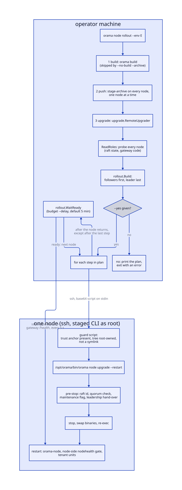
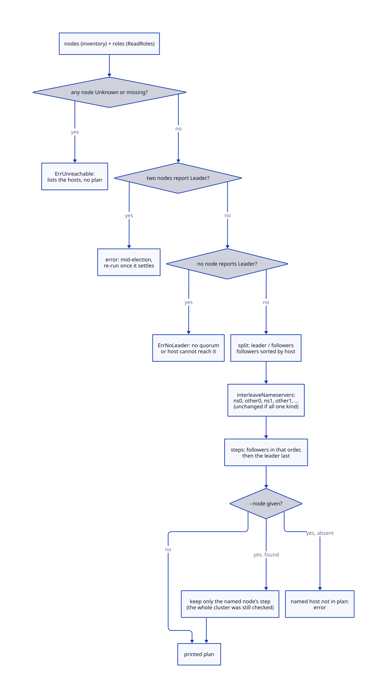
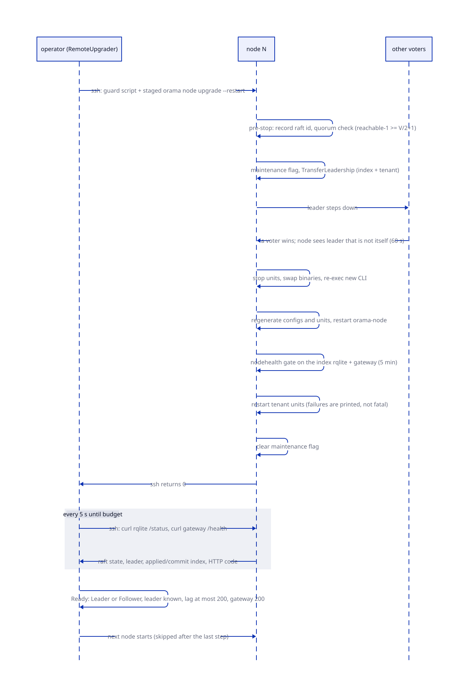
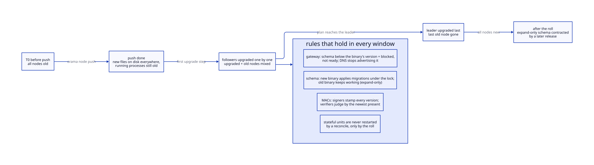

# Rolling upgrades

> **At a glance.**
>
> - **What:** a rolling upgrade moves a whole fleet to a new build one node at a time without losing quorum. The operator's machine reads every node's raft state over SSH, builds an ordered plan (followers first, the raft leader last, nameservers interleaved), prints it, and only with `--yes` walks it. Each step runs the staged build's own `node upgrade --restart` on the node, then holds the walk until that node is demonstrably carrying its share of the cluster again. Between the first push and the last restart the fleet runs two releases at once, and a set of compatibility rules in the schema, the MACs and the stored formats keeps that window safe.
> - **Key numbers:** one node at a time; per-node rejoin budget 5 min (`--delay`, `GateBudget`); gate polls every 5 s; a node is ready at raft state Leader or Follower, a known leader, an applied index at most 200 entries behind its commit index, and the index gateway answering `/health` with 200; node-side leadership hand-over waits up to 60 s; quorum is `V/2 + 1` of the V configured index voters, so a stop needs at least 3 voters and, with one already down, at least 5; at most 5 index voters.
> - **Code:** `core/pkg/rollout/` (plan and gate), `core/cmd/orama/internal/production/upgrade/remote.go` (the driver), `core/cmd/orama/internal/cmd/rolloutcmd/` and `core/cmd/orama/internal/production/rollout/` (`orama node rollout`), `core/pkg/nodehealth/` (the readiness predicate), with the compatibility rules spread over `core/pkg/gateway/`, `core/pkg/auth/`, `core/migrations/` and `core/pkg/secrets/`.
> - **Depends on:** [install and upgrade](30-install-and-upgrade.md) for what runs on each node, [cluster state](07-cluster-state.md) for the index RQLite and its migrations, [inter-node trust](15-inter-node-trust.md) for the MACs, [membership and failure detection](08-membership-and-failure-detection.md) for what the cluster does with a node that is down, and [build, signing and release](29-build-signing-and-release.md) for the archive.



## Why it exists

A node upgrade (chapter 30) stops a database voter, swaps binaries and starts the voter again. Done to one node it is routine. Done to a fleet it is the most dangerous thing an operator does to a running Orama cluster, for three reasons that the code has been rewritten around.

First, the index RQLite is a Raft group, and a Raft group stops committing writes the moment fewer than a majority of its voters are reachable. The registry in it holds every node, namespace, key and DNS row. Restarting two voters at once, or restarting a second voter while the first has not rejoined, is how a rolling upgrade becomes a `recover-raft`. The package comment of `core/pkg/rollout/plan.go` records the history: the rollout used to be a loop over the order nodes happened to appear in `nodes.conf`, separated by a fixed sleep, and the documentation claimed followers-first and leader-last although nothing implemented it. A sleep cannot tell a node that rejoined in 20 seconds from one that never came back, so the old rollout restarted the next voter either way.

Second, the order matters even when quorum survives. Restarting the leader first costs an election, and every node restarted after it finds a cluster that has just re-elected. Restarting the two healthy nameservers back to back takes the DNS zone offline. The plan therefore has to know who leads and who answers DNS, and it has to know it from the cluster, not from the inventory file.

Third, the fleet is not one version while the roll runs. `orama node push` stages the new archive on every node before the first restart, and the restarts then walk the fleet over many minutes. During that time a request, a coordination call or a migration can cross between old and new code in either direction. The schema, the MACs and the stored formats each carry a rule that makes the crossing safe, and a few places carry a rule the operator has to respect by hand.

The chapter has two halves. The orchestration (the plan, the SSH driver, the gate, `orama node rollout`) lives in two small packages and one file. The compatibility rules live all over the codebase and are collected here because no single package owns them.

## The model

**Rollout.** The whole operation against one environment: build, push, then the rolling upgrade. `orama node rollout --env E` runs all three (`core/cmd/orama/internal/production/rollout/rollout.go:execute`). `orama node upgrade --env E` runs only the third.

**Plan.** The ordered list of nodes the walk will upgrade, produced by `rollout.Build` from the node inventory and a map of each node's raft role (`core/pkg/rollout/plan.go:Plan`). Each `Step` carries the node, its role, whether it is a nameserver and a human-readable reason for its position, because an operator who approves a plan should be able to see why the order is the order.

**Role.** `Leader`, `Follower` or `unknown`, the node's state in the index RQLite's raft configuration at the moment of reading (`core/pkg/rollout/plan.go:RaftRole`). A node whose state could not be read is `unknown`, and `unknown` is never treated as a follower: a node that cannot be reached may be down, and upgrading on the assumption that it is a healthy follower is how a rollout removes the second-to-last voter.

**Gate.** The check between two steps that the node just upgraded is ready (`core/pkg/rollout/probe.go:WaitReady`). Readiness is a pure predicate over one observation, `nodehealth.Status.Ready`, shared with the node-side restart and install verification (`core/pkg/nodehealth/nodehealth.go`).

**Staged build.** The verified archive that `orama node push` put in `/opt/orama` on each node. The upgrade runs the CLI inside it, not the `orama` on the node's `PATH`, so every step of the node-side upgrade is the new release's code ([install and upgrade](30-install-and-upgrade.md)).

**Mixed-version window.** The interval during which at least two releases run in the same cluster. It opens at push, not at the first restart, because push replaces the files under `/opt/orama` while old processes keep running from their open inodes (`core/cmd/orama/internal/production/push/swap.go:swapArchive`). Any unit that restarts for its own reasons (a crash, an OOM kill, an operator) in that interval comes up new against peers that are still old. It closes when the last node is upgraded.

**Expand-only.** A schema or format change that an older binary can keep working beside. Every migration that overlaps a rollout follows the rule, and the migration that removes the old shape ships one release later.

**Voters, quorum and fault budget.** V is the number of voters in the index raft configuration, at most 5 by design (`core/pkg/rqlite/cluster_discovery_membership.go:MaxDefaultVoters`). Quorum is `V/2 + 1` with integer division. A rolling stop is safe when, with the target stopped, the reachable voters still meet quorum. The table in [Quorum arithmetic](#quorum-arithmetic) works it out.

## How it works

### The command surface

Two commands reach the rolling upgrade.

`orama node rollout --env E [--no-build --archive PATH] [--yes] [--delay SECONDS]` is the whole pipeline. `orama rollout` is the same command mounted at the top level; both come from one constructor, `rolloutcmd.NewCmd`, because the two used to be separate commands with different behaviour and only one of them left the leader for last (`core/cmd/orama/internal/cmd/rolloutcmd/rollout.go`). The flags are validated before anything runs: `--env` is required, `--no-build` needs `--archive`, and `--archive` without `--no-build` is refused because a rollout that builds rolls out what it built (`core/cmd/orama/internal/production/rollout/rollout.go:validate`). The three steps print as `Step 1/3` to `Step 3/3`.

1. **Build** (unless `--no-build`): the same builder `orama build` uses, for `linux/amd64`, signing the manifest with the operator's RootWallet ([build, signing and release](29-build-signing-and-release.md)).
2. **Push**: `push.Run` uploads the archive to each node in turn and runs `node stage-archive` there, which verifies it against the node's trust anchor and swaps it into `/opt/orama` ([install and upgrade](30-install-and-upgrade.md)). It is sequential, one SSH session per node, with the key the operator's wallet already opens the node with (`core/cmd/orama/internal/production/push/push.go:pushDirect`).
3. **Rolling upgrade**: `upgrade.Run` with the environment, the gate budget and `--yes`.

`orama node upgrade --env E [--node IP] [--yes] [--delay SECONDS] [--nameserver] [--force] [--skip-checks] [--acme-ca X]` is step 3 alone. With `--env` set, `upgrade.Run` hands over to the remote driver; without it, the command is the single-node upgrade of chapter 30 and needs root (`core/cmd/orama/internal/production/upgrade/command.go:Run`). The rollout command forwards only the environment, the delay and `--yes`; per-node flags (`--node`, `--nameserver`, `--force`, `--skip-checks`, `--acme-ca`) exist only on `orama node upgrade`.

Without `--yes`, the driver prints the plan and returns the error `re-run with --yes to execute this plan`. In a full rollout that means the build and the push have already happened by the time the plan is shown, and the command exits non-zero. The plan is the approval step; nothing is restarted until the operator re-runs with `--yes` (for a full rollout, with `--no-build --archive PATH` to skip the rebuild).

### Reading the cluster

`RemoteUpgrader.Execute` (`core/cmd/orama/internal/production/upgrade/remote.go:Execute`) does five things before it touches a node.

1. Resolves the inventory for the environment with `noderesolver.ResolveNodes`. The gateway's node API wins when it answers with nodes; the machines recorded on the environment at setup come next; `nodes.conf` is the last resort (`core/cmd/orama/internal/noderesolver/fallback.go:chooseNodes`).
2. If `--node` names a host that is not in the inventory, fails at once, before any key is resolved or any node is read.
3. Resolves an SSH key for every node, whether or not `--node` was given, with `remotessh.PrepareNodeKeys`. The safety preconditions read the raft state of every node. The function takes the keys from the RootWallet agent, writes them to a temporary directory with mode 0600, and returns a cleanup that overwrites and removes them; it also holds the agent's auto-lock window open for the length of the operation by touching the agent every 5 minutes (`core/pkg/rwagent/keepalive.go:DefaultKeepaliveInterval`). Without that, a rolling upgrade, which is twenty-odd minutes of SSH the agent never sees, locked the wallet partway through and stopped at the next gate waiting for someone to answer an unlock prompt (`core/pkg/remotessh/wallet.go:PrepareNodeKeys`). A Ctrl-C or SIGTERM removes the key files and then re-raises the signal.
4. Calls `rollout.ReadRoles`, which probes every node serially.
5. Calls `planRollout`, which builds the plan and, with `--node`, cuts it down to that node's step.

**The probe.** One SSH command per node reads two things on the node itself, so the operator's machine does not have to be on the overlay (`core/pkg/rollout/probe.go:probeCommand`): the index rqlited's `/status`, reached where `node.yaml` says it binds and with its credentials (`rqlite.NodeShellCurl`, 5 s timeout), and the HTTP status code of the index gateway's `http://localhost:10104/health` (`constants.GatewayAPIPort`, 5 s timeout). The command prints a single JSON object. A dead gateway is printed as a code, not a failed command, because a dead gateway is a health finding and an unreachable node is a different finding that needs a different message. `parseProbe` reads `store.raft.state`, the applied and commit indexes and the leader id; rqlite 8 and later report the leader under `store.leader.node_id` and leave `raft.leader_id` empty, so the parser falls back to the former.

SSH itself runs with a 10 s connect timeout and keepalives every 15 s, dropping the session after 4 missed (`core/pkg/remotessh/ssh.go:baseSSHOptions`). The probe goes through `inspector.RunSSH`, which retries connection-level failures up to 3 times, 2 s apart, and does not retry a command that ran and failed (`core/pkg/inspector/ssh.go:RunSSH`).

**Classifying.** `ReadRoles` maps the lower-cased raft state: `leader` to Leader, `follower` to Follower, anything else (Candidate, Shutdown, an empty string, a parse failure, an SSH error) to `unknown`. There is no third healthy state.

### Building the plan

`rollout.Build(nodes, roles)` applies four rules in this order (`core/pkg/rollout/plan.go:Build`).



1. **Refuse on an unknown node.** If any node has no role, or `unknown`, the result is `ErrUnreachable` naming the hosts, sorted. The reason in the error text: a rolling upgrade must not proceed on nodes whose health is unknown.
2. **Refuse on two leaders.** Two nodes reporting Leader means the reads straddled an election, and a plan built on a state that no longer exists is worse than none. The error says to re-run once the cluster settles.
3. **Refuse on no leader.** `ErrNoLeader` means no node reports itself leader and therefore the cluster has no quorum, or the operator's host cannot reach it. A rolling upgrade is the last thing to start against a cluster that cannot commit a write, so this is fatal, not "proceed in file order".
4. **Order.** Followers are sorted by host string, then `interleaveNameservers` alternates nameservers and non-nameservers (`ns0, other0, ns1, other1, ...`) so no two nameservers restart back to back while there is a non-nameserver to put between them. The leader is appended last. A node is a nameserver when its role in the inventory starts with `nameserver` (`core/pkg/inspector/config.go:IsNameserver`).

The sort is stable and by host string, so a plan printed twice is the same plan: the plan an operator approves is the plan that runs. It is a string sort, so `10.0.0.10` sorts before `10.0.0.2`. When the environment holds only nameservers (the 3+3 topology the code comments name), or no nameservers, there is nothing to interleave with and the order is plain host order; that is still correct, because the nodes restart one at a time and each waits on the gate for the previous one.

The printed plan looks like this (`Plan.String`):

```
Rolling upgrade plan (3 nodes, 3 nameservers):

  1. 10.0.0.1         nameserver-ns1         follower (nameserver — spaced so the zone keeps answering)
  2. 10.0.0.3         nameserver-ns3         follower (nameserver — spaced so the zone keeps answering)
  3. 10.0.0.2         nameserver-ns2         leader — last, after leadership transfer
```

**Why the leader goes last.** Every restart before it is a follower restart, which costs no election. The leader's own restart costs exactly one, which the node-side hand-over turns into an orderly transfer before the stop. The plan names the leader as it was when read. If leadership moves during the walk (a follower restart can occasionally trigger an election), the node that is leader at its turn still hands leadership over before its stop, because the node-side upgrade does not trust the plan's role: it asks its own rqlite.

**`--node`.** `planRollout` builds the plan for the whole cluster, then keeps only the named node's step. The questions "is there exactly one leader" and "is every node readable" are questions about the cluster, so they are asked of every node even when one node is named. Reading only the named node made a healthy cluster look leaderless whenever that node was a follower and refused the upgrade with "the cluster has no quorum" (bugboard 2721; `core/cmd/orama/internal/production/upgrade/remote_plan_test.go`). A named leader keeps its leader step. A host that is in the inventory but was somehow dropped from the plan yields `node X is not in the inventory`.

### Walking the plan

With `--yes`, `Execute` loops over the steps. For step *i* of *n* it prints the node, its inventory role and its raft role, then calls `upgradeNode`, which streams the SSH session to the operator's terminal.



**What runs on the node.** `upgradeCommand` builds a short shell script, base64-encodes it, and runs `printf %s <b64> | base64 -d | sudo bash -s` over SSH (`core/cmd/orama/internal/production/upgrade/remote.go:upgradeCommand`). The shell must decode it: piping the encoded text straight to `bash` runs the base64 itself as a command and the node never starts the upgrade. The script has two parts.

The guard (`upgradeScript`) runs as root before anything from the staged tree does. It refuses the upgrade with a message that names the `orama push` command to run, unless all of these hold:

- the trust anchor `/etc/orama/archive-signers` exists, because a node that was never pushed a signed build has no anchor and its `/opt/orama/bin/orama` is whatever its old release extracted;
- `/opt/orama`, `/opt/orama/bin` and the staged CLI each exist, are not symlinks, are owned by root and are writable by neither group nor others (`find ... -maxdepth 0` with `! -user root -o -perm -020 -o -perm -002`); a `find` that cannot inspect a path fails the guard rather than reading as "nothing wrong";
- the CLI is a regular file.

Then it runs `exec /opt/orama/bin/orama node upgrade --restart` plus the forwarded flags. The guard exists because the CLI is about to run as root, and a binary anyone but root could have replaced must not be.

The flags forwarded are `--nameserver` (tri-state: sent only if the operator set it, as `--nameserver` or `--nameserver=false`, otherwise the node keeps its saved preference), `--force`, `--skip-checks` and `--acme-ca` (resolved and validated locally to an https URL). `--public-ip` is deliberately not forwarded because it is per node: the upgrade resolves it from the node's recorded value or its default route (`upgradeArgs`).

Running the staged CLI, not `/usr/local/bin/orama`, is the point of the construction. The binary on the `PATH` is the release being replaced, and everything it runs before handing over to the new binary (the pre-stop checks, the leadership hand-over, recording the raft identity, the stop itself) would be the old release's code. The comment in `upgradeCommand` records the concrete failure: upgrading from 0.122.x, that code writes a recovery `peers.json` and stops the leader without a hand-over. Run from the staged build, the whole upgrade is the new release's code and its re-exec has nothing to hand over to.

**What the node does.** The sequence is chapter 30's ([install and upgrade](30-install-and-upgrade.md)); the parts that matter to the roll are these. Before anything is stopped, while the node still serves, `lifecycle.HandlePreUpgrade` (`core/cmd/orama/internal/production/lifecycle/pre_upgrade.go:HandlePreUpgrade`) checks quorum safety, writes the maintenance flag, asks the index rqlite to transfer leadership if this node leads it, does the same for every tenant rqlite, and then waits up to 60 s for a leader that is not itself (`leaderHandoverBudget`). A refusal at any point leaves the node serving and fails the upgrade. After the stop, swap and re-exec, `restartServices` restarts `orama-node`, waits on the same readiness predicate for 5 minutes (`clusterHealthBudget`, a constant that `--delay` does not change), restarts the tenant units, and clears the maintenance flag. The maintenance flag is cleared only once the node serves again, so a node that did not come back stays out of rotation.

**Failure of the step.** If the SSH command exits non-zero the loop returns `upgrade failed on <host>: ... Stopping rollout — N node(s) not upgraded`. The nodes after it have not been touched.

**The gate.** After a successful step that is not the last, the loop prints `Waiting for <host> to rejoin the cluster...` and calls `rollout.WaitReady` for that node with the budget from `--delay` (default 300 s; a value of zero or less falls back to `GateBudget`; `core/cmd/orama/internal/production/upgrade/remote.go:gateBudget`). `WaitReady` polls the node with the same probe as `ReadRoles` every 5 s (`GatePollInterval`, a variable only so tests can drive it) and evaluates `nodehealth.Status.Ready` with `MaxIndexLag: 200` and `RequireLeaderKnown: true`. The predicate (`core/pkg/nodehealth/nodehealth.go:Status`) passes only when all of the following hold:

| Check | Condition | Why |
|---|---|---|
| Raft state | `Leader` or `Follower` (case-insensitive) | Candidate, Shutdown and empty are not carrying a share |
| Leader known | `leader_id` non-empty (`RequireLeaderKnown`) | no leader means no quorum, and continuing is the exact mistake the package exists to prevent |
| Catch-up | `commit_index - applied_index` at most 200 (`GateIndexLag`) | a follower 40,000 entries behind carries no reads, and restarting the next voter then leaves one usable copy |
| Gateway | index gateway `/health` returned 200 | raft can be healthy while the gateway is not serving |

A timeout error carries the last observation, not the word "timeout": `<host> did not come back within 5m0s: raft state is "Candidate", want Leader or Follower`. What an operator needs is the next thing to look at. On a gate failure the loop stops with `The cluster still has its remaining voters; fix this node before continuing`.

The gate runs after every step except the last, because there is no next node to protect. The last node's own readiness is still enforced by the node-side wait inside `restartServices`. The same holds for a `--node` run, which has exactly one step.

When all steps pass, the driver prints `Rolling upgrade complete (N nodes)`. In a full rollout the command then prints `Rollout complete in <duration>`.

**Halting and resuming.** A halted rollout has no saved state. The remedy is to fix the node and run the same command again; the plan is rebuilt from the cluster's current state and every node is upgraded again, including those that finished in the previous run. The fleet e2e test `TestRollout_haltsOnABrokenNodeThenResumes` asserts that the nodes after a failed one are untouched, that leadership did not move, and that the re-run completes (`e2e/features/rollout-upgrade/rollout_test.go`).

### Quorum arithmetic

The node-side quorum check is what actually prevents a bad stop; the plan's one-at-a-time walk and the gate are what keep each check's input honest (`core/cmd/orama/internal/production/lifecycle/quorum.go:evaluateQuorumSafety`).

It reads the node's own `/status` and `/nodes?nonvoters&timeout=3s`. A non-voter is always safe to stop, since it never counts toward quorum. For a voter it counts V (configured voters, reachable or not) and R (voters reachable, this node included), and refuses unless `R - 1 >= V/2 + 1`. The threshold is over V, not over V minus one. Stopping a node does not remove it from the raft configuration; it only makes it unreachable, and membership shrinks only through an explicit remove. An earlier version computed the threshold over `V - 1` as though the node had been removed, and concluded on two voters that stopping one left "1 of 1, need 1"; Raft still requires 2 of 2 and the survivor cannot elect a leader.

| V (voters) | Quorum | Rolling stop with all up | Rolling stop with one already down | Further failures tolerated while idle |
|---|---|---|---|---|
| 1 | 1 | refused (0 remain, need 1) | n/a | 0 |
| 2 | 2 | refused (1 remains, need 2) | refused | 0 |
| 3 | 2 | allowed (2 remain) | refused (1 remains) | 1 |
| 4 | 3 | allowed (3 remain) | refused (2 remain) | 1 |
| 5 | 3 | allowed (4 remain) | allowed (3 remain) | 2 |

The consequence is stated plainly in the tests and nowhere else: a one- or two-voter index cluster cannot be rolled. The pre-stop check refuses, and nothing in the upgrade path overrides it. The `--force` of `orama node upgrade` means "reconfigure all settings" and is not a quorum override; the refusal text of `HandlePreUpgrade` points at `orama node stop --force`, which is a different command. A four-voter cluster has the fault budget of a three-voter one (one failure), which is why `MaxDefaultVoters` is 5 and the voter set does not run at even sizes ([cluster state](07-cluster-state.md)).

Two more rules make the check fail closed. If the status cannot be read and an index rqlited may be running (any of the units that can run one is active, or systemd cannot be asked), the stop is refused: "I could not look" is not "go ahead". The one explicit pass without a reading is when no unit that runs an index rqlited is active; then the node already contributes nothing to quorum. And a voter whose member list cannot be read, or reports no voters at all, is refused.

The check is per node and local. The plan's one-at-a-time rule is what keeps R large; the gate is what makes the next check see a node that has actually rejoined. Remove either and the check still refuses a stop that would break quorum, but it refuses it halfway through the roll, with a node already down.

**The tenant side of the arithmetic.** Each tenant namespace runs its own three-member rqlite (chapter 9), so each tolerates one member down. The rollout's gates read only the index rqlite and the index gateway. The node-side upgrade does restart each tenant rqlite after the index gate passes, and it transfers tenant leadership beforehand, but it does not wait for a tenant member to rejoin before the operator-side gate passes and the next node starts. The consequences are in [Known gaps](#known-gaps).

### Mixed-version compatibility rules

The window opens at push and closes after the last restart. Every rule below exists because a real overlap broke something or would have. They fall into five kinds.



#### Schema: expand-only, applied under a lock, enforced by readiness

Each gateway process applies the embedded migrations itself, on its own start, against the RQLite it belongs to: the index gateway against the registry, each tenant gateway against its namespace's RQLite under an isolated tracker (`core/pkg/gateway/dependencies.go:prepareSchema`). Migrations take the cluster-wide lock `schema-migrations` (TTL 10 min), re-read the applied set inside the lock, and apply each migration as one transaction with its tracker row, so N gateways that start together do not run the pending list N times and no migration is left half-applied ([cluster state](07-cluster-state.md#migrations); `core/pkg/rqlite/migrations.go`). The first new node to start applies the new schema to the shared database while old nodes are still running against it. That is why migrations that overlap a roll are expand-only:

- **038** adds a nullable `confirmed_at` to `wireguard_peers`; old binaries name their columns explicitly and never trip on it (`core/migrations/038_wireguard_peers_identity.sql`).
- **050** creates `principals` and `grants` and backfills them from `namespace_ownership`, and leaves `namespace_ownership` in place, because 0.122.x gateways read and write it on every ownership check and dropping it failed all of them for the whole window (`core/migrations/050_principals_and_grants.sql`; `core/pkg/rqlite/schema_placement.go` still carries the table "for the rolling window"). The two are not kept in step: an owner an old gateway records exists only in `namespace_ownership`, one the new gateway records only in `grants`. The contracting migration re-runs the backfill and drops the table.
- **051** adds `expires_at`, `rotated_from` and `principal_id` to `api_keys` in place and constrains nothing, since a table rebuild with NOT NULL columns failed every key an old gateway minted in the window. A key an old gateway mints during the roll has no expiry, which the new lookup does not match, so it works on old gateways only and stops at the end of the roll (`core/migrations/051_api_keys_v2.sql`).
- **069** and **070** give `namespace_pending_cleanup` a claim lease and an owner. An earlier gateway replays rows without claiming them and clears a row before it releases the ports the row kept. Next to a claiming gateway that can double-send a teardown and free a block twice, so the table must be empty before the first node of a roll that crosses 069 (`core/migrations/069_pending_cleanup_claim.sql`).
- **043** writes `scopes = 'admin'` onto every live key whose scopes were empty, because an empty column used to be read as admin and is read as no access now; an old binary still mints keys with no scopes at login, and a new binary denies them. A wallet that logs in against a not-yet-upgraded node during the roll can therefore come away with a key an upgraded node refuses (`core/migrations/043_single_namespace_owner.sql`).
- **044** deletes every invite token (they were stored in plaintext and SQLite cannot hash them) and caps lifetime at one hour; it is a cutover, not an overlap rule (`core/migrations/044_operators_and_invite_token_hashing.sql`).
- **071** stamps `last_seen_at` on each gateway's signing key. A peer still on the old build does not stamp its key, and an index gateway start retires unbound keys that nobody has stamped for 24 hours, so the roll has to finish inside that day (`core/migrations/071_signing_keys_last_seen.sql`).

The enforcement side is the schema contract. `migrations.RequiredVersion()` is the highest embedded migration number (76 in this build), and a gateway asserts that the applied version is at least that (`core/migrations/contract.go:AssertSchema`). The gateway does not die or serve when it is not. It runs a readiness state machine (`core/pkg/gateway/readiness.go`):

- `starting`: the schema work has not finished, almost always because the local rqlite has no leader. The gateway keeps retrying with 5 s backoff doubling to a 60 s cap (`convergeSchema`) and answers 503 `starting` to everything but a short read-only passthrough list (`/health`, `/v1/health`, `/status`, `/v1/status`, `/v1/version`, `/v1/internal/ping`, `/v1/internal/tls/check`, the hub report path, the status page assets and ACME HTTP-01 challenges).
- `ready`: the schema is at the required version.
- `blocked`: a leader answered and the schema is below what this binary requires. Retrying cannot fix it, so the gateway stays up with the reason visible and refuses everything outside the passthrough list. Something has to migrate the database or roll the binary back.

The distinction between starting and blocked is what makes a roll survivable. "The local rqlite has no leader yet" and "this database is behind the binary" used to be the same fatal error, so a slow follower during a rolling upgrade looked like schema drift. A failure to read the tracker (a lost leader, a deadline between the leader wait and the read) is classified as retryable, not as the contract violation, so a 200 ms hiccup cannot latch a gateway into `blocked` (`prepareSchema`).

The readiness state reaches the rest of the cluster. The DNS reconcile probes each local namespace gateway's `/v1/health` and reports `starting` as its own status and `blocked` as an error, so a gateway that cannot serve is not advertised, while subsystem degradation (a cache blip) is deliberately not a reason to withdraw a node (`core/pkg/gateway/namespace_health.go:probeGatewayReadiness`).

Two further expand-only habits appear in the stored shapes. The pubsub trigger writer fills both the legacy `topic` column and the new `topic_pattern` column so old binaries running concurrently keep reading triggers (`core/pkg/serverless/triggers/pubsub_store.go`). The API-key lookup tries the HMAC-hashed form first and the raw form second (`core/pkg/gateway/middleware.go`, "Dual lookup strategy for rolling upgrade").

#### MACs: signers write every version, verifiers read the newest

The node-to-node authentication versions follow one pattern: a signer stamps every version it knows, a verifier judges a request by the newest version present and never retries under an older one. The two MAC families are specified in [inter-node trust](15-inter-node-trust.md); here is what each does to the window.

- **Coordination MAC.** Every request is signed with both the v2 MAC (method, audience, path, query, body hash, nonce, time) and the v1 MAC (method, path, query, time), in two headers (`core/pkg/auth/coordination_v2.go:SignCoordination`). A not-yet-upgraded receiver reads only v1 and accepts it. An upgraded receiver sees the v2 header and verifies that, never falling back to v1 if v2 fails (`CheckCoordination`).
- **Which routes demand v2.** A route that changes state or carries its parameters in the body calls `VerifyCoordinationV2`: namespace spawn, namespace repair, the secrets re-encrypt fan-out, the push relay, the deployment replica routes and the TLS store. An old signer that sends only v1 is refused there, `401` or `403`, for the length of the window, in both directions: an upgraded node cannot spawn a namespace's services on an old node, and the reverse. A route whose every parameter is in the method, path or query (telemetry, network status and detail, storage evict) accepts v1 while `AcceptLegacyCoordinationMAC` is true, so `orama status` keeps working through the roll. The constant is `true` today and its comment says it is removed in the release after the one that introduced v2.
- **Practical rule.** Pause namespace create and delete, deployment replica operations, `orama operator rotate-secrets` and namespace repair for the duration of the roll. A teardown refused in the window is recorded in `namespace_pending_cleanup` and replayed by the tenant reconciler; after the last node check that the table drains.
- **Hop MAC.** The index gateway forwards a verified request to a namespace gateway in `X-Internal-Auth-*` headers carrying a MAC over what they assert. v1 covers the namespace, subject and grant set; v2 adds the token's `exp`, `iat` and `jti`; v3 adds the device and session. A signer stamps all three, so a namespace gateway that predates v3 still accepts what an upgraded index gateway sends; a verifier judges by the newest present and deletes whatever that version does not cover before anything reads it, and gives a hop with no token times the most time a token could have left, so a socket opened through it still ends (`core/pkg/gateway/internal_auth_hop.go`). A hop from an index gateway that predates v2 or v3 is therefore believed exactly as far as it was signed. Downgrading a hop needs a position inside the mesh, and every node there holds the secret every version is keyed from, so accepting the older MAC gives nobody anything they did not have.

#### Stored formats: write the old shape until the operator flips it

Encrypted values come in two envelopes, the legacy `enc:` and the key-id-carrying `enc:v1:`. A keyset writes the legacy form until an operator rotate, so a node still on the old build can read what a new binary writes (`core/pkg/secrets/keyset.go:Keyset`). `secrets.EnableVersionedWrites` flips the writers once the rollout is finished ([secrets and keys](16-secrets-and-keys.md)). The backup frames carry `version 1` in their magics and a reader refuses any other version, so a frame never changes shape under a rolling reader ([database](17-database.md)).

Authentication toward rqlite is rolled in two passes for the same reason. `rqlite_auth_file` (credentials in clients) and `rqlite_enforce_auth` (`-auth` on rqlited) are separate settings: the first ships to every node with enforcement off; only when the whole fleet carries credentials is enforcement turned on, followers first and the leader last. Doing both in one pass makes every peer on the old binary 401 on `/join`, `/status` and `/remove` in the middle of the roll, which looks exactly like raft breaking (`core/pkg/config/database_config.go:RQLiteEnforceAuth`).

Operator commands that run on a node (`orama node ...`) read `node.yaml` leniently: unknown keys are ignored, so a command from the new CLI still works against a `node.yaml` written by the previous release (`core/pkg/rqlite/endpoint.go:EndpointFromNodeConfig`).

#### Process lifecycle: a reconcile never restarts a stateful unit

A node running new code will, within seconds of coming up, regenerate env files and unit inputs for the services it supervises. If that reconcile restarted a running rqlite voter or Olric member whenever its inputs changed, the same reconcile on three nodes would restart three voters at once, which is the one thing a rolling procedure exists to prevent. `Manager.StartService` therefore never restarts a running unit of a clustered, stateful type (RQLite, Olric, IPFS, IPFS Cluster, Vault, WireGuard) as a side effect of changed inputs; it logs `Service inputs changed; they apply at its next rolling restart` once and leaves the unit running (`core/pkg/systemd/manager.go:restartsOnInputChange`). The new inputs take effect at the next deliberate restart, which is the rollout's.

The same logic puts the dependency order into the node-side restart: rqlite, then Olric, then the namespace gateway, because a gateway that starts before its Olric client can connect comes up with cache endpoints disabled until its reconnect loop succeeds. The wait on Olric's memberlist port is up to 30 s per namespace and a timeout is a warning (`core/cmd/orama/internal/utils/systemd.go:StartServicesOrdered`).

#### Observers: unknown is neither healthy nor unhealthy

The telemetry layer is written for the window. A node that answers but serves no telemetry is marked `Unknown` and counts neither for nor against any service in the cluster snapshot (`core/pkg/telemetry/cluster/snapshot.go`). The hub treats a node that has served no telemetry for longer than a bound as unreachable, so a node left on an old release does not drop out of the status page for good but a roll passes well within the bound (`core/pkg/telemetry/hub/aggregate.go`). The database-outage verdict accepts a leader named by any follower, because the leader is upgraded last, so for most of a roll it runs the older release and its gateway can be down while raft is fine (`core/pkg/telemetry/cluster/probes.go:databaseOutage`). The node report counts shared host-level TURN, because the per-namespace TURN unit it replaced would otherwise read as down on every node forever and silently drop TURN from the report the rolling-upgrade protocol relies on (`core/pkg/telemetry/report/namespaces.go`).

A node that restarts new against a gateway still running old has one visible symptom. The node registers through its local index gateway (`core/pkg/node/coreapi/client.go`). On the supported path the node and the gateway upgrade together, because the upgrade stops every namespace unit, the index gateway included, before swapping binaries. A node that restarts on its own between push and its turn comes up new against an old gateway, and its registration is answered 404 until the gateway is bounced; the 30 s heartbeat retries and it recovers when the roll reaches it.

#### Operator-owned rules

Some overlaps have no code defence and are documented as rules for the operator (`docs/DEV_DEPLOY.md`, "Mixed-version window" subsections):

- **Joins.** Upgrade the node that serves `/v1/internal/join` first and mint no invites during the roll. An old binary allocates the next WireGuard address with `max+1` and writes `INSERT OR REPLACE`, so it can overwrite a row a new binary just inserted and take its overlay address; which behaviour a join gets depends on which node answers.
- **TURN.** The new node code answers a host-side TURN confirmation only once the running `orama-turn` has loaded the namespace, which it proves by writing `/run/orama-turn/served-tenants.json`. Between the new `orama-node` and the restart of `orama-turn` a confirmation is refused after 6 s. Enable WebRTC after the roll.
- **rqlite v10.** The conversion of v8/v9 snapshots to v10's format on first start is one way. A v10 node cannot join a v9-or-older cluster, so add no node mid-roll, and finish every cluster (the index, then each tenant) before adding one. Code that reads a node's raft state looks in both `wsnapshots/` and `rsnapshots/` (`core/pkg/rqlite/raftstate.go`).
- **Signing keys.** Rotate the index gateway's signing key once the whole fleet is upgraded, one node at a time, and finish the roll within 24 hours of migration 071.

## State it owns

The rolling upgrade is stateless on the operator's machine and nearly stateless on the nodes. It owns no database table. What it touches is below.

| State | Where | Written by | Read by | Notes |
|---|---|---|---|---|
| Plan | process memory of `orama node upgrade` | `rollout.Build` | `RemoteUpgrader.Execute` | rebuilt on every run; nothing persists between a halt and a re-run |
| Raft roles | memory, from the probe | `rollout.ReadRoles` | `rollout.Build` | one SSH round trip per node |
| Temporary SSH keys | `orama-ssh-*` temp directory, mode 0600 | `remotessh.PrepareNodeKeys` | `ssh`, `scp` | overwritten and removed by cleanup, SIGINT or SIGTERM |
| Staged archive | `/opt/orama` (`bin/`, manifest) | `node stage-archive` during push | the guard script, then the upgrade | root-owned, verified against `/etc/orama/archive-signers` |
| Trust anchor | `/etc/orama/archive-signers` | install, or push with `--trust-signers` | the guard script | its absence refuses the upgrade |
| Maintenance flag | `/opt/orama/.orama/maintenance.flag` | `HandlePreUpgrade` | maintenance-aware components | RFC 3339 time; cleared by `ClearMaintenanceFlag` only after the node serves |
| Raft identity record | `raft-node-id`, `raft-adv-addr`, `data/cluster-membership.json` | the pre-stop step | the restarted rqlited | [install and upgrade](30-install-and-upgrade.md) |
| Migration lock | `cluster_locks` row `schema-migrations` | the first gateway to migrate | the other gateways | TTL 10 min |
| `namespace_pending_cleanup` | index RQLite | teardown callers | the tenant reconciler | the row a refused v2 teardown leaves behind, replayed after the roll |

## Lifecycle

**Normal rollout.** `orama node rollout --env E` builds, pushes, reads every node, prints the plan and exits with an error asking for `--yes`. The operator re-runs with `--yes` and `--no-build --archive PATH`. Each follower is upgraded and gated; the leader is upgraded last, after handing leadership over; the command prints `Rolling upgrade complete`.

**Mixed versions during the walk.** At step *k* of *n*, *k* nodes run the new release and *n - k* run the old one, with the leader old until the last step. Node-to-node traffic crosses releases in both directions, under the rules above. The cluster is as healthy as a cluster with one voter bouncing at a time: one voter is down for the length of its stop, swap and start, V - 1 serve, and quorum holds when V is at least 3.

**Restart of the operator's machine.** The command is not resumable; it is idempotent. If the operator's session dies partway, the nodes are in one of three states: not yet touched (running old), mid-upgrade, or upgraded. Re-running reads the cluster again; a node that was left stopped has no raft role and the plan refuses (`ErrUnreachable`) until it is brought back by hand.

**A node that fails its upgrade.** A refusal before the stop (quorum, hand-over, archive verification, no public IP) leaves the node serving and stops the roll. A failure after the stop leaves the node down with the maintenance flag set; the roll stops, the remaining voters keep the cluster alive, and the operator repairs the node and re-runs.

**Node loss during the roll.** If a different node dies while the walk is in progress, the pre-stop quorum check of the next node sees one voter already unreachable and refuses when V is 3 or 4 (table above). The roll halts with the cluster serving, and the dead voter is handled by [membership and failure detection](08-membership-and-failure-detection.md) and [recovery](33-recovery.md). With V of 5, one dead voter does not block the roll.

**Autoupdate.** The cluster-level auto-update policy is fixed at one node at a time (`Settings.MaxParallel` is 1 in `core/pkg/autoupdate/decide.go`) and takes the `autoupdate` cluster lock for rollouts (`core/pkg/autoupdate/sqlstore.go:LockName`, held through `core/pkg/rqlite/clusterlock.go:AcquireOwnClusterLock`). The operator-driven rollout in this chapter does not take it; see [the auto-update agent](30-install-and-upgrade.md#the-auto-update-agent) for what the agent does.

## Failure modes

| Trigger | What the system does | What you observe |
|---|---|---|
| A node is unreachable over SSH when the roles are read | `ReadRoles` marks it `unknown`; `Build` returns `ErrUnreachable` | `cannot plan a rolling upgrade of E: could not read the raft state of H ...`; nothing restarted |
| No leader (cluster has no quorum) | `Build` returns `ErrNoLeader` | `no node reports itself leader ... not starting a rolling upgrade` |
| Two leaders reported | `Build` refuses | `two nodes report themselves leader (A and B) — the cluster is mid-election; re-run once it settles` |
| Operator forgot `--yes` | the plan is printed, `Execute` returns an error | `re-run with --yes to execute this plan`; in `orama node rollout` the build and push have already run |
| `--node` names an unknown host | fails before any key or node is touched | `node H not found in E environment` |
| Staged tree not root's, a symlink, or no trust anchor | the guard script exits 1 on the node | `refusing to upgrade: ...; stage this release on it first: orama push ...`; the step fails and the roll stops |
| Pre-stop quorum check refuses | the node-side upgrade aborts before any stop | `UNSAFE: Stopping this node ... would break RQLite quorum: R of V configured voters would remain reachable, need Q`; roll stops, node serving |
| Leadership hand-over fails or nobody takes over within 60 s | the upgrade aborts before the stop | `UNSAFE: no other node took leadership within 1m0s`; roll stops, node serving |
| The upgraded node does not become ready within `--delay` | the roll stops; later nodes are untouched | `<H> did not come back within 5m0s: <last observation>` followed by the not-upgraded count |
| Node comes back as Follower but trails by more than 200 entries | the gate keeps polling until the budget runs out | `applied index A trails commit index C by N entries (limit 200) — still catching up` |
| Raft healthy but the index gateway returns non-200 (for example `blocked` on a schema below the binary's) | the gate fails after the budget | `raft is healthy but the gateway is not serving /health` |
| SSH session to a node dies silently | `ssh` gives up after 4 missed 15 s keepalives | `SSH to H failed`; the step fails |
| A node dies while the roll is running | the next pre-stop quorum check refuses when V is 3 or 4 | `would break RQLite quorum`; the roll halts with the cluster serving |
| RootWallet agent locks mid-roll | the keepalive touches the agent every 5 min so this does not happen under normal operation; if the agent is stopped, the next probe or step fails | `no SSH key` or agent errors from `remotessh` |
| Clock skew over 60 s between two nodes during the roll | coordination stamps between them are refused in both directions | namespace spawn and repair fail with 401 ([inter-node trust](15-inter-node-trust.md)) |
| A v1-only (old) node coordinates with a new node on a v2 route | the new node refuses | 401 or 403; the teardown is queued in `namespace_pending_cleanup` |
| A new gateway starts against a database below its schema version | the gateway goes `blocked` and refuses all but the passthrough routes | 503 `status: blocked`, `reason: schema-version`; DNS stops advertising the node's gateway |
| The local rqlite has no leader when the gateway starts | the gateway stays `starting`, retries with backoff up to 60 s | 503 `status: starting`; self-heals once a leader exists |
| A tenant unit fails to restart during the node-side restart | the failure is printed and the upgrade continues | `Failed to restart <unit>: ...` in the node's output only |

## Trust and security

The rollout is an operator-driven remote-root operation, so its trust model is mostly about what the operator's machine and the staged tree can do.

**The operator's machine.** It holds, for the length of the command, a private SSH key per node in a mode-0600 temporary directory. Keys come from the RootWallet agent and are removed on exit, on SIGINT and on SIGTERM; a SIGKILL or a crash leaves them behind. SSH host keys are checked with the options the node inventory carries (`inspector.Node.HostKeyOptions`). Nothing in the rollout copies one node's key to another: an earlier push fan-out copied keys onto a hub node and was removed (`core/cmd/orama/internal/production/push/push.go:ToNodes`).

**The staged tree.** The upgrade runs as root and executes the CLI in `/opt/orama/bin`. The guard script refuses it unless a trust anchor exists and the tree and CLI are root-owned, non-writable by group or others, and not symlinks. Push verified the archive's signature against the anchor before putting it there ([build, signing and release](29-build-signing-and-release.md)). The guard does not re-verify the signature at upgrade time; it verifies that nothing but root could have changed the files since. The signature check on the archive happens again on the node before anything is stopped (`verifyArchive` in the pre-stop steps), so a bad archive never takes the node down.

**What an attacker in each position can do.**

- With the operator's wallet: everything; the rollout is what the wallet is for.
- With a node's `orama`-group access (a compromised tenant gateway): the rollout does not read anything it writes. The probe is a command run by the SSH user; the readiness numbers come from the node's own rqlite and gateway, and a compromised node can lie about them. A node that lies healthy lets the walk proceed to the next node; the quorum check on the next node reads that node's own view and the live voters' reachability, so a single liar cannot force a quorum break.
- With a position on the mesh: can forge any coordination stamp that a cluster-secret holder can; see [inter-node trust](15-inter-node-trust.md). The mixed-version window changes this in one way: while `AcceptLegacyCoordinationMAC` is true, a v1 stamp is accepted on routes whose parameters are all in the method, path and query. That is bounded by the clock window (60 s), not by a nonce.
- With a captured v1 stamp: can replay it within 60 s onto the same method, path and query on a v1-accepting route. The state-changing routes require v2 (body hash, audience, single-use nonce), so a downgrade by stripping v2 does not help: a v2 header that fails is never retried as v1.

The probe's output is trusted only as far as the JSON it parses; garbage is an error that shows the first 200 characters, so an SSH banner or an HTML error page is recognisable and not interpreted (`core/pkg/rollout/probe.go:truncate`).

## Limits and scale

| Limit | Value | Source |
|---|---|---|
| Nodes upgraded in parallel | 1 | `RemoteUpgrader.Execute` loop |
| Per-node rejoin budget (operator-side) | 300 s default; `--delay` | `core/pkg/rollout/probe.go:GateBudget` |
| Per-node rejoin budget (node-side) | 5 min, fixed | `core/cmd/orama/internal/production/upgrade/restart.go:clusterHealthBudget` |
| Gate poll interval | 5 s | `GatePollInterval` |
| Applied-index lag allowed | 200 entries | `GateIndexLag`, `nodehealth.DefaultMaxIndexLag` |
| Leader hand-over wait | 60 s | `lifecycle.leaderHandoverBudget` |
| Probe timeouts | 5 s per curl; 10 s SSH connect; keepalive 15 s x 4 | `probeCommand`, `baseSSHOptions` |
| Index voters | at most 5 | `rqlite.MaxDefaultVoters` |
| Minimum voters for a rolling stop | 3 (5 to tolerate one already down) | `evaluateQuorumSafety` |
| Migration lock TTL | 10 min | `core/pkg/rqlite/migrations.go` |
| Replay-nonce cache (coordination v2) | 65,536 nonces for 120 s | `coordinationReplayCapacity`, `coordinationReplayTTL` |
| Signing-key retirement after the window | 24 h without a stamp | migration 071 |

**Scaling with fleet size.** Wall-clock time is linear in the node count. Each node costs its own stop, swap and start plus the gate, with the polling floor of one 5 s interval; the roles are read serially, so reading is a linear number of SSH round trips of up to a few seconds each. A fleet of 5 voters plus *m* non-voters takes 5 + *m* steps, and the non-voter steps are the cheapest, since a non-voter never counts toward quorum and its stop needs no hand-over.

**At 10x.** Three things give out in order. First, the serial walk: 10x the nodes is 10x the time with the window open for all of it, and the mixed-version rules hold only as long as the next release does not drop a compatibility shim before the previous roll has finished. Second, the serial role read: it probes every node before the first restart, so at a few hundred nodes the pre-flight alone takes minutes, and a single slow node blocks the plan. Third, the plan is blind to everything that is not the index RQLite: a larger fleet carries more tenant namespaces per node, and every one of them is restarted by the node-side step without a gate of its own. The first bottleneck is the gate coverage, not the arithmetic of the index quorum, which does not depend on fleet size (it depends on V, capped at 5).

A larger fleet would also want batching by failure domain, so that a roll could upgrade several non-voters at once. The plan has no notion of voter versus non-voter; every follower is a step.

## Design decisions

### Plan from the cluster, not from the inventory

**Chosen:** read every node's raft role over SSH and build the order from it (`rollout.ReadRoles`, `rollout.Build`).
**Rejected:** walk `nodes.conf` in file order with a fixed sleep, which is what the rollout did before.
**Why:** file order puts the leader anywhere in the walk and costs an election for each node after it. The inventory cannot know who leads, and a sleep cannot tell a rejoined node from a dead one. The plan is also what the operator approves, so it has to be derived from the thing it describes.

### Refuse on any unknown, never assume follower

**Chosen:** a node whose state cannot be read or parsed is `unknown`, and any unknown node refuses the plan (`ErrUnreachable`); no leader, or two leaders, refuses it.
**Rejected:** treat unreachable nodes as followers, or proceed in file order when no leader is found.
**Why:** both of those are the way a rollout removes the second-to-last voter. The cost is that an unrelated dead node blocks the roll until it is dealt with, which is the same cost as the quorum check would impose later, but paid before anything is stopped.

### A real health gate instead of a sleep

**Chosen:** `WaitReady` polls the node's own rqlite `/status` and gateway `/health` until the shared predicate passes or the budget runs out. `--delay` is the budget, not a pause.
**Rejected:** a fixed sleep between nodes, and a gate that logs a warning and continues. The previous gate queried a port nothing had listened on since the port migration, burned two minutes failing, printed "Continuing", and the rollout restarted the next voter (`core/pkg/nodehealth/nodehealth.go`, package comment).
**Why:** the gate's whole purpose is to stop the walk. A failing gate is fatal and its error says what it last saw.

### Probe over SSH on the node, not from the operator's machine

**Chosen:** the probe command runs `curl` on the node against its own rqlited and gateway.
**Rejected:** the operator's machine querying rqlite directly.
**Why:** the operator's machine is not on the WireGuard overlay and rqlite binds only there. Running on the node also uses the node's own credentials and its own `node.yaml`.

### Run the staged CLI, not the installed one

**Chosen:** the guard script, then `exec /opt/orama/bin/orama node upgrade --restart`.
**Rejected:** `orama node upgrade` from `PATH`.
**Why:** the installed CLI is the release being replaced; its pre-stop and stop code is the old code. From 0.122.x that code stopped the leader without a hand-over and wrote a recovery `peers.json` whose entries do not exist under peer-id raft ids. The cost is the guard and the need to push first.

### Expand-only schema, contract in a later release

**Chosen:** a migration that overlaps a roll adds, and the migration that removes the old shape ships in the next release (050, 051).
**Rejected:** a single migration that renames or drops, and a migration lock held across the whole roll.
**Why:** the first node to migrate changes the shared database under every old node still running. An old binary names its columns explicitly and survives additions; it does not survive a table rebuild or a drop. The price is that old and new rows coexist for a release and the contracting migration has to re-run the backfill.

### Signers stamp every version

**Chosen:** coordination MACs v1 and v2, hop MACs v1 to v3, the legacy encryption envelope: new code writes everything old code reads, and verifiers judge by the newest.
**Rejected:** a negotiated version, or a flag day.
**Why:** a roll has no moment at which all nodes agree. Dual stamping removes the need to know the receiver's version. Judging by the newest stamp and never falling back means an attacker cannot downgrade a request to a weaker MAC that the receiver would then accept.

### Do not restart stateful units in a reconcile

**Chosen:** the supervisor's reconcile leaves a running clustered unit alone when its inputs change.
**Rejected:** restart on any input change.
**Why:** every node runs the same reconcile at about the same time. The only restarts of voters and members are the ones the rollout makes, one at a time, behind a gate.

## Known gaps

- **The gate watches only the index.** The operator-side gate, and the node-side wait before it, read the index rqlite and the index gateway. Neither reads a tenant namespace's rqlite, Olric, gateway or the node's DNS answer. The node restarts its tenant units after the index gate, and the operator-side gate then passes at once, so the next node's pre-stop starts seconds after this node's tenant members were restarted, not after they rejoined. A tenant rqlite has three members and tolerates one; two overlapping restarts across two nodes can take one below quorum. Location: `core/pkg/rollout/probe.go:WaitReady`, `core/cmd/orama/internal/production/upgrade/restart.go:restartServices`.
- **Tenant restart failures are not fatal.** `StartServicesOrdered` prints `Failed to restart <unit>` and continues, and tenant leadership-transfer failures are warnings. A tenant unit that did not come back does not stop the roll. This runs against the project rule that an operation that failed must not log and continue. Location: `core/cmd/orama/internal/utils/systemd.go:StartServicesOrdered`, `core/cmd/orama/internal/production/lifecycle/pre_upgrade.go`.
- **One- and two-voter clusters cannot be rolled, and no override exists.** The quorum check refuses, `--force` on `node upgrade` is a different flag, and the refusal text suggests `orama node stop --force`. Location: `core/cmd/orama/internal/production/lifecycle/pre_upgrade.go:HandlePreUpgrade`, `core/cmd/orama/internal/production/lifecycle/quorum.go:evaluateQuorumSafety`.
- **`--delay` does not set the node-side wait.** The node-side health wait is the constant `clusterHealthBudget` of 5 minutes, and the last node of a roll is gated only by it. Location: `core/cmd/orama/internal/production/upgrade/restart.go:clusterHealthBudget`.
- **The readiness lag check compares a node with itself.** `Status.Ready` compares a node's applied index with its own commit index. The plan footer and the operator documentation say "caught up to the leader's commit index". A follower's commit index is what it has learned, so a follower that has not heard the leader's latest commit passes. Location: `core/pkg/nodehealth/nodehealth.go:Ready`, `core/pkg/rollout/plan.go:String`.
- **Nameserver spacing is not guaranteed.** `interleaveNameservers` alternates only while both lists last. With more nameservers than other nodes the surplus nameservers run back to back, and with only nameservers (the 3+3 topology) they all do. The real guarantee is the one-at-a-time walk and the gate, which does not check that the node's DNS answer is back (a restarted node is out of nameserver DNS for several minutes after it serves). Location: `core/pkg/rollout/plan.go:interleaveNameservers`.
- **No resume state.** A halted rollout is resumed by re-running, which upgrades every node again, including the ones that finished. The plan has no version filter. Location: `core/cmd/orama/internal/production/upgrade/remote.go:planRollout`.
- **No cross-version gate.** Nothing in the rollout compares the build being pushed with the version the cluster runs, or with a minimum supported predecessor. The comment in `core/pkg/version/version.go` says the CLI-versus-node match is a mandatory gate before a rolling upgrade; no code in the remote driver enforces it. The compatibility rules above hold for adjacent releases only by convention.
- **No concurrency control.** Two operators, or an operator and an auto-update, can walk the same fleet at the same time. The remote driver takes no cluster lock; the `autoupdate` lock exists for the auto-update path only. Location: `core/pkg/autoupdate/sqlstore.go:LockName`, `core/cmd/orama/internal/production/upgrade/remote.go:Execute`.
- **The window opens at push.** Push replaces `/opt/orama` on all nodes before the first restart, so a node that restarts for its own reasons comes up new against peers that are old, with no coordination. Location: `core/cmd/orama/internal/production/push/swap.go:swapArchive`.
- **Legacy coordination MAC is still on.** `AcceptLegacyCoordinationMAC` is `true`, and the code and its comments say it is removed in the release after the one that introduced v2. Until then, v1-accepting routes carry no body or nonce coverage. Location: `core/pkg/auth/coordination_v2.go:AcceptLegacyCoordinationMAC`.
- **A stale comment contradicts the code.** `core/pkg/auth/coordination.go` (and the comment on `AcceptLegacyCoordinationMAC`) lists namespace repair among the routes that still accept v1; `namespaceClusterRepairHandler` requires v2. Location: `core/pkg/gateway/gateway.go:namespaceClusterRepairHandler`.
- **An unreachable branch.** `ErrNoLeader.Unknown` is never set: `Build` returns `ErrUnreachable` before the no-leader check whenever any node is unknown, so the "N node(s) unreachable" message is dead. Location: `core/pkg/rollout/plan.go:ErrNoLeader`.
- **Operator rules without code enforcement.** Pausing namespace create and delete, deployment replica operations and invites during a roll, checking `namespace_pending_cleanup` is empty before crossing 069, and finishing within 24 hours of migration 071 are operator disciplines; nothing refuses an operation made during the window.

## Verify it yourself

**Unit tests.** `core/pkg/rollout/plan_test.go` covers the ordering and the refusals: `TestBuild_leader_goes_last` (every possible leader), `TestBuild_nameservers_are_spaced`, `TestBuild_all_nameservers_is_stable_and_leader_last`, `TestBuild_no_leader_refuses`, `TestBuild_unreachable_node_refuses`, `TestBuild_missing_role_entry_refuses`, `TestBuild_two_leaders_refuses`, `TestBuild_is_deterministic`. `core/pkg/rollout/probe_test.go` covers the probe parser and the gate: `TestParseProbe_rqlite8Leader`, `TestReadRoles_classifies_each_node`, `TestWaitReady_waits_for_the_node_to_rejoin`, `TestWaitReady_stuck_node_fails_with_the_reason`, `TestWaitReady_raft_healthy_but_gateway_dead_fails`. `core/cmd/orama/internal/production/upgrade/remote_plan_test.go` covers `--node` (`TestPlanRollout_filteredFollowerInHealthyCluster` is bugboard 2721's regression), and `remote_test.go` covers the remote script (`TestUpgradeScript_refusesANodeWithoutAnAnchor`, `TestUpgradeCommand_runsTheStagedCLI`, `TestUpgradeScript_isValidShell`). `core/cmd/orama/internal/production/lifecycle/quorum_test.go:TestEvaluateQuorumSafety` has the quorum table above, row for row. `core/pkg/nodehealth/nodehealth_test.go` covers the predicate.

```bash
cd core && go test ./pkg/rollout/... ./pkg/nodehealth/... ./cmd/orama/internal/production/upgrade/... ./cmd/orama/internal/production/lifecycle/...
```

**Fleet e2e.** `e2e/features/rollout-upgrade/` drives the CLI: `TestRollout_planPutsTheLeaderLastAndNeedsYes`, `TestRollout_haltsOnABrokenNodeThenResumes` (the halt and resume contract) and `TestUpgrade_previousReleaseToHeadUnderTraffic` (a fleet installed with the previous release rolled to HEAD under live namespace traffic, with at most a tenth of requests failing). `e2e/features/cli-env-auth-misc/rollout_test.go` covers the flag refusals (`TestRollout_refusesBadFlagsBeforeBuilding`). The owner runs the fleet suite with `make e2e-fleet`.

**Read-only commands against a live fleet.**

```bash
orama node upgrade --env devnet            # reads every node, prints the plan, restarts nothing
orama node upgrade --env devnet --node IP  # the same checks, cut down to one step
```

On a node, `sudo orama node schema status` shows the applied schema version against the binary's required one, and `curl -s localhost:10104/v1/health` (the index gateway) shows the readiness state, `starting`, `ready` or `blocked`, with its reason code when it is not ready. The registry query `SELECT namespace, node_id, action, attempts, claimed_until FROM namespace_pending_cleanup;` shows teardowns owed to a node after a roll. `orama status report --env devnet` shows the cluster after each step; nodes on an older release show as unknown rather than unhealthy.
