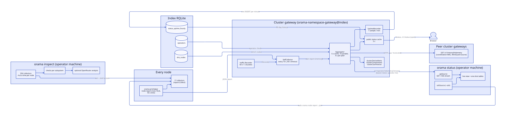
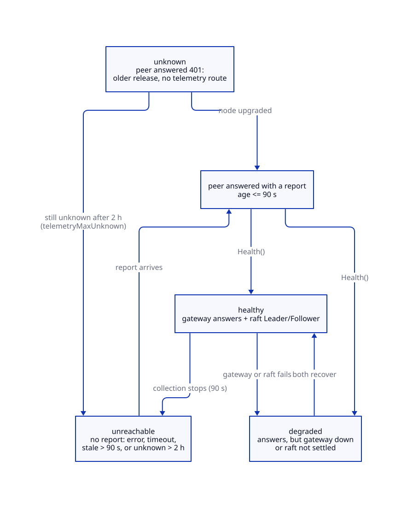
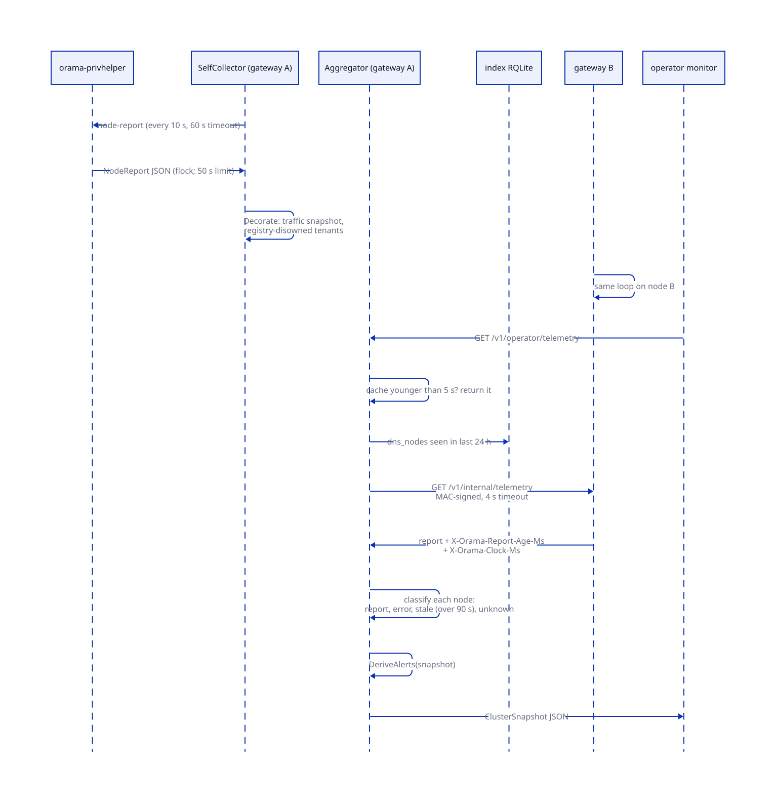
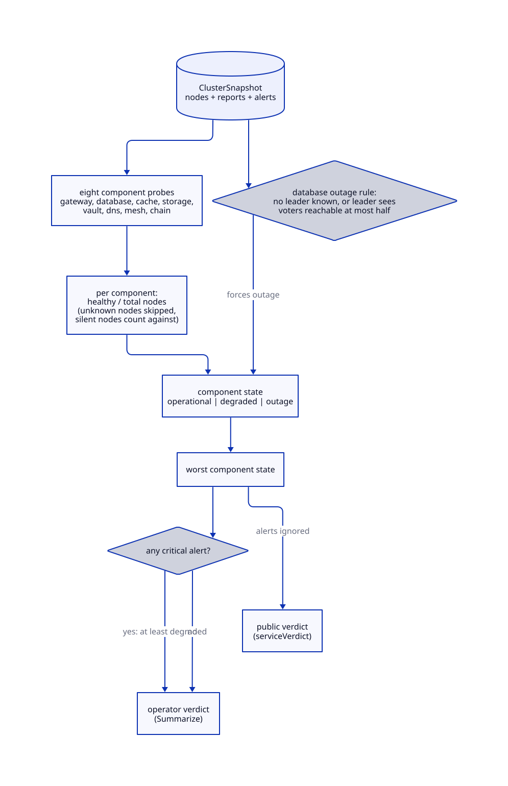
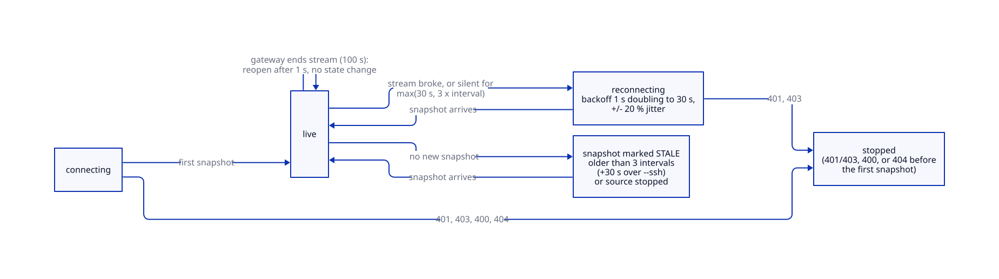
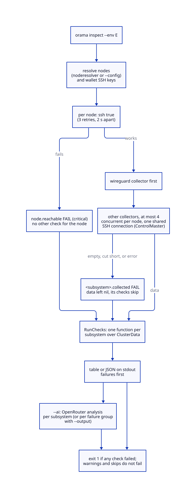

# Observability

> **At a glance.**
>
> - **What:** three instruments over one health model. Every node collects a JSON health report about itself (17 collectors, run as root through the privileged helper). The cluster gateway on each node gathers its peers' reports over WireGuard, derives alerts, component states and a verdict, and serves them to operators and, projected down to service states, to the public. `orama status` reads that view from an operator's machine, live or one aspect at a time. `orama maint inspect` is a separate tool that SSHes into every node and runs deeper deterministic checks. Logs are zap lines in the systemd journal.
> - **Key numbers:** node report every 10 s (60 s timeout; the helper cuts it at 50 s); a report older than 90 s counts as unreachable; peer fetch 4 s per peer, 16 in parallel, 15 s per assembly, snapshot cached 5 s; a node on an older release is `unknown` for up to 2 h; request metrics are a 60 s window of 1 s buckets with 24 latency buckets from 1 ms to 30 s; uptime is one sample a minute, kept 90 days; the live stream is 2 to 60 s per snapshot and ends after 100 s; the inspector runs at most 4 collectors at once per node.
> - **Code:** `core/pkg/telemetry/` (`report`, `hub`, `cluster`, `globalhealth`, `traffic`), `core/pkg/inspector/`, `core/pkg/logging/`, `core/cmd/orama/internal/monitor/`, wired in `core/pkg/gateway/telemetry.go`.
> - **Depends on:** [privilege and filesystem trust](05-privilege-and-filesystem-trust.md) for the root helper, [the WireGuard mesh](06-the-wireguard-mesh.md) for the peer path, [cluster state](07-cluster-state.md) for the registry, [membership and failure detection](08-membership-and-failure-detection.md) for the ring monitor, [the gateway](12-gateway-architecture.md) for the routes, [inter-node trust](15-inter-node-trust.md) for the coordination MAC.



## Why it exists

An operator needs three answers. *Is anything wrong now?* *What exactly is wrong?* *Has it been wrong?* The monitor answers the first from the nodes' own reports, the inspector the second from commands run on the nodes, and the uptime record and the journal the third. A fourth reader, anyone on the internet, needs a status page that says whether the network is up without learning which machines it runs on.

Four constraints shaped the design.

**A refresh must not cost a fleet of SSH sessions.** The first monitor SSHed into every node on every refresh. Its cost grew with the number of viewers, and every glance at health needed the operator's SSH keys. The hub's package comment states the replacement: each node collects its own report on a timer, and a request is answered from the reports the nodes already hold, so the cost does not grow with viewers and a node that stops answering shows up within one collection interval (`core/pkg/telemetry/hub/aggregate.go`).

**The collectors need root and the gateway does not run as root.** They read journals, `ss -p`, `ufw` and `wg`. The cluster gateway runs as the `orama` user, so it asks the privileged helper for a report ([the node report collector](05-privilege-and-filesystem-trust.md#the-node-report-collector)).

**The observer must not fail healthy.** A node whose collection loop stopped must not read as healthy for ever, a node on an older release must not read as down, and a collector that cannot reach its service must not report zero as a measurement. The monitor and the inspector handle these differently, and the differences are listed in [Monitor and inspector compared](#monitor-and-inspector-compared).

**Two audiences, two trust levels.** The full report carries addresses, ports, firewall rules and versions, which is a map of the cluster. The public view must name no node. Both are projections of the same snapshot, built by different functions (`core/pkg/telemetry/cluster/public.go:Public`, `core/pkg/telemetry/cluster/verdict.go:Summarize`).

The inspector exists because the monitor shows what each node says about itself in a fixed set of fields, while the inspector runs targeted commands, compares nodes against each other with finer thresholds, and works with no gateway at all.

## The model

**Node report.** One JSON document, `report.NodeReport`, describing one node at one moment: identity (`hostname`, `public_ip`, `wireguard_ip`, `version`), timing (`timestamp`, `collect_ms`), an `errors` list for collectors that panicked, and up to 17 sections (`core/pkg/telemetry/report/types.go:NodeReport`). Three fields are not collected but added by the cluster gateway that serves the report: `traffic`, `breakers` (its circuit breakers toward namespace gateways that are not closed, `Gateway.breakersReport`, raised as a warning by `checkNodeBreakers`) and `registry_disowned_tenants`.

**Collector.** A function that fills one section of a report. All 17 run in parallel inside `report.Collect`; a panic is caught per collector and recorded in `errors`, leaving that section nil (`core/pkg/telemetry/report/report.go:Collect`).

**Cluster gateway.** The index gateway, `orama-namespace-gateway@index`, which every node runs. It holds the registry connection and is the only gateway that monitors the cluster: a namespace gateway answers telemetry routes with 503 (`core/pkg/gateway/telemetry.go:clusterTelemetry`).

**Self report and peer report.** The self report is the one this node's gateway collected through the helper. A peer report is another node's self report, fetched over the mesh.

**Snapshot.** `cluster.ClusterSnapshot`: the time it was assembled, how long assembly took, one `CollectionStatus` per node, and the derived alerts. The monitor adds the environment name; the gateway does not know it (`core/pkg/telemetry/cluster/snapshot.go:ClusterSnapshot`).

**Collection status.** One node's entry in a snapshot: its public address, role and WireGuard address, the report or an error string, how old the report was, the node's measured clock offset, and an `unknown` flag.

**Node health.** A one-word judgement of a collection status (`core/pkg/telemetry/cluster/snapshot.go:Health`):

| Health | Meaning |
|---|---|
| `healthy` | a report came back, the node's gateway answers, and RQLite holds a Leader or Follower role |
| `degraded` | a report came back but the gateway is down or raft is not settled |
| `unreachable` | no usable report: an error, a timeout, a report older than 90 s, or a node that stayed `unknown` for over 2 h |
| `unknown` | the peer answered 401 on the telemetry route, so it runs a release that does not serve telemetry; it counts neither for nor against any service |



**Alert.** Severity (`critical`, `warning`, `info`), subsystem, node (a public address, or `cluster`), and a message. Alerts are derived, never stored.

**Component.** One service's health across the cluster: gateway, database, cache, storage, vault, DNS, mesh, chain. A component has a state (`operational`, `degraded`, `outage`, `unknown`), a count of healthy and total nodes, and a one-sentence summary.

**Verdict.** The one-line answer to "is everything fine?": the worst component state, made at least `degraded` by any critical alert, with a headline.

**Public status.** `cluster.PublicStatus`: the service-only projection of a snapshot, plus 90-day uptime, the chain's progress and the network's request load. It names no node.

**Inspector terms.** A check has an ID, a subsystem, a severity (`LOW`, `MEDIUM`, `HIGH`, `CRITICAL`) and a status (`pass`, `fail`, `warn`, `skip`): severity says how much a result matters, status what happened. The monitor's alerts have only the first axis.

## How it works

### The node report

`orama node report` runs the collectors and prints the JSON. Run as `orama`, it would miss most sections, so the cluster gateway calls `privhelper.NodeReport` instead, which asks the root helper for the `node-report` tool; the helper runs the same `report.Collect` as root (`core/pkg/privhelper/node_report.go:NodeReport`, `core/cmd/privhelper/nodereport.go:nodeReport`). The helper takes a non-blocking exclusive `flock` on `/run/orama-privhelper-node-report.lock`, so a second request while one runs fails with "a node report collection is already running" instead of queueing behind a hung one. It cuts a collection at 50 s, below the gateway's 60 s client timeout, so the gateway reads the helper's failure rather than its own, and a report whose encoded response would exceed `privhelper.MaxRequestBytes` (1 MiB) is an error, not a truncated read. Authorization is in [the node report collector](05-privilege-and-filesystem-trust.md#the-node-report-collector).

Every collector bounds itself: an external command gets 4 s, an HTTP request to a local service 3 s, and every response body is capped at 2 MiB. The collectors read loopback ports where any local process, a tenant deployment included, can bind a stopped service's port and answer with an endless body; a body over the cap is an error naming the URL, never a truncated read (`core/pkg/telemetry/report/report.go:readLocalBody`).

| Section | What it reads |
|---|---|
| `system` | `/proc` files, `free -m`, `df -h` on `/` and `/opt/orama` (the higher usage wins), `df -i /`, the last hour of the kernel journal for OOM kills. CPU steal sampled over 0.5 s from `/proc/stat`; pressure-stall `some avg60` for CPU, I/O and memory (-1 without PSI); whether systemd has `+BPF_FRAMEWORK`; the live values of the settings install hardened. About ten commands run one after another. |
| `services` | `systemctl show` and `is-enabled` for nine core units (`orama-node`; the index `olric`, `ipfs`, `ipfs-cluster`, `vault`, `tor`, `caddy` and `wireguard` instances; `orama-namespace-coredns@nameserver`) and for every `orama-namespace-*@*.service` unit file (templates skipped), in a 30 s budget; `systemctl --failed`. |
| `rqlite` | The node's own index RQLite, on its WireGuard address with the credentials in `node.yaml`: `/status`, `/nodes?nonvoters`, `/readyz`, a `level=strong` `SELECT 1` and `/debug/vars`, 3 s each. |
| `olric` | Unit state and restarts, a listener on memberlist port 10103 in `ss -tlnp`, RSS, three greps over the unit's last 200 journal lines, the member list through the Olric client. |
| `ipfs` | Unit states, swarm peers and repo stats from the Kubo RPC (bearer token), cluster peers from the Cluster REST API, versions, `swarm.key` presence, whether the bootstrap list is empty, and the oldest active `pin/add`, `pin/update` or `repo/gc` request from `/api/v0/diag/cmds` (the pin lock GC needs). |
| `vault` | `/v1/vault/status` (guardians, healthy, read threshold, write quorum) and `/v1/vault/health` on the local gateway, unit state, restarts, memory. |
| `gateway` | `/v1/health` (status and each subsystem) and `/v1/version` on the local index gateway. |
| `wireguard` | `/sys/class/net/wg0`, address, MTU, listen port, every peer from `wg show wg0 dump` (endpoint, allowed IPs, handshake, transfer), permissions of `wg0.conf`. |
| `dns` | Only where `/etc/coredns` exists. Unit states, ports 53, 80, 443, CoreDNS memory, restarts and error lines. SOA, NS, apex A and a wildcard A (`status-probe.<domain>`) are asked in-process of `127.0.0.1:53`, and certificate expiry for the apex and the wildcard is read from a TLS handshake to `127.0.0.1:443`. An expired certificate sets its own flag; days left of -1 means unreadable. |
| `tor` | Unit state, a listener on SOCKS port 9050, the bootstrap percentage from the unit's current-invocation journal (-1 when vacuumed), Anyone-network leftovers. |
| `network` | A ping to 8.8.8.8, default and `wg0` routes, `ss -s`, the retransmission rate from `/proc/net/snmp`, listening ports with processes, `ufw status numbered`. |
| `processes` | Zombies; orphans (parent PID 1, an Orama-looking name, not the main PID of a managed unit); lines matching `panic` or `fatal` among the last 500 of `orama-node`'s journal. |
| `namespaces` | Per namespace on the node: RQLite status and `/readyz`, the Olric port (block base plus 2), the gateway's `/v1/health` (base plus 4), the SFU unit, whether the host TURN serves it ([port blocks](09-namespaces.md#port-blocks)). |
| `deployments`, `serverless` | `orama-deploy-*` units loaded, running, failed; the index gateway's `/v1/health` as the WASM engine's state. |
| `chain`, `global` | Absent unless `orama-global-chain.service`, or a public Kubo, provider or relay unit, is installed. See below. |

**Restart loops.** A unit with more than 3 restarts that has been active for under 300 s, or never, is flagged `restart_loop_risk`. Supervised units carry `StartLimitIntervalSec=0`, so nothing parks a looping unit and the restart counter is the only signal ([the unit model](04-the-node-as-a-supervisor.md#the-unit-model); `core/pkg/telemetry/report/services.go:restartLoopRisk`).

**OOM kills.** The count covers the last hour of the kernel journal, not the time since boot, so one kill stops alerting an hour later. Each `Killed process` line is classified by the preceding `oom-kill:` summary: a memory-cgroup kill whose victim lives in an `orama-deploy-*` cgroup is a tenant at its own `MemoryMax` and is counted per deployment instance as `tenant_oom_kills`; everything else (a global OOM, a platform cgroup, a kill with no summary line) counts against the node. An unreadable kernel log gives `oom_kills_error`, not a zero (`core/pkg/telemetry/report/oom.go:ClassifyOOMKills`).

**The chain section.** It reads the CometBFT RPC on `127.0.0.1:31001` (`/status`, `/net_info`, `/num_unconfirmed_txs`, up to 10 pages of 100 `/validators`, the last 20 block headers) within 15 s. Whatever binds a loopback port writes this section, so every value is shape-checked: chain id `^[A-Za-z0-9._-]{1,64}$`, node version `^[A-Za-z0-9.+_-]{1,64}$`, validator addresses `^[0-9A-F]{40}$`, at most 1,000 validators. `/status` must carry this node's own CometBFT id, derived from `node_key.json` as CometBFT does (lower-case hex of the first 20 bytes of SHA-256 over the ed25519 public key), so a squatter on the port cannot pass as the chain. A failed query sets `responsive: false` and an error naming the query without echoing the value. With the node's consensus address known, an 8 s budget asks the REST API on `127.0.0.1:31003` for slashing parameters, signing info and the staking validator, giving the missed-block ratio, `min_signed_per_window`, `jailed` and `tombstoned`; a failure there sets `signing_error` and leaves `responsive` alone. On a machine that also runs the global network namespace the endpoints are the co-located ones (`core/pkg/telemetry/report/chain.go:collectChain`, `core/pkg/telemetry/report/chain_verify.go:chainNodeID`, `core/pkg/telemetry/report/chain_signing.go:fetchSigning`).

**The global section.** It lists which of the three global units are installed and their states. For an active public Kubo it reads `RepoSize` and `StorageMax` with the bearer in `/var/lib/orama-global/ipfs/api-token`, which is never copied into the report or an error. The provider and the Tor relay each write a `monitor.json` in their home directory; the collector reads it with `O_NOFOLLOW`, a 4,096-byte cap, strict JSON and a non-negative check on every count. The provider's file carries the hot-key balance (bank plus fee-only balance, in norama), unsettled proof misses, disk bytes and declared maximum, held and pending deal slots; the relay's carries only `in_consensus` ([Tor network](../vol2/38-anonymity-and-tor.md), [storage deals](../vol2/41-storage-deals.md)). A field the file omits is nil, not zero (`core/pkg/telemetry/report/global.go:collectGlobal`).

### Collection on the cluster gateway

`startTelemetry` runs on the index gateway only, under the same condition as the ring monitor: a peer id, a registry connection, and not a namespace gateway (`core/pkg/gateway/telemetry.go:startTelemetry`). It starts a `SelfCollector` immediately and an `UptimeRecorder` once the gateway is ready.

`SelfCollector.Run` collects, waits for a 10 s tick, and repeats; a collection that overruns the tick makes the next start at once. Each collection has a 60 s timeout (`telemetryCollectTimeout`). It calls `privhelper.NodeReport`, parses the JSON, then `Decorate` adds the gateway's `TrafficSnapshot()` and the namespaces the registry has disowned. A failed collection keeps the previous report: its timestamp shows how old it is and the error is logged as "node health collection failed". Before the first success `Latest` returns `ErrNoReportYet`, so a freshly started node's snapshot shows itself unreachable for up to a collection interval (`core/pkg/telemetry/hub/self.go:SelfCollector`).

### Fetching peer reports

The aggregator asks the registry for the nodes to cover: `dns_nodes` rows whose `last_seen` is within 24 h, ordered by id, with each node's public address, WireGuard address, role and status (`core/pkg/telemetry/hub/peers.go:DBPeerLister`). The 24 h window is longer than the ring monitor's 15 min on purpose: a node that dies must show as unreachable rather than vanish, and one silent for a day has been removed or replaced.

For each peer the aggregator calls `HTTPFetcher.Fetch` (`core/pkg/telemetry/hub/fetch.go:Fetch`):

1. The peer's `internal_ip` must parse and lie inside `10.0.0.0/24`. A registry row that points elsewhere must not route a signed request off the overlay, so any other address is an error, not a fetch.
2. `GET http://<wg-ip>:10104/v1/internal/telemetry`, signed with the coordination MAC whose key derives from the cluster secret and whose audience is the peer's node id ([coordination MAC v2](15-inter-node-trust.md#coordination-mac-v2)).
3. A 4 s client timeout, a 4 MiB body cap.

On the serving side, `internalTelemetryHandler` checks the MAC and the WireGuard source before anything else, so an unsigned request of any method is told the route does not exist (404). A valid GET returns the latest self report with two headers: `X-Orama-Report-Age-Ms`, how old the report is *on the serving node's clock*, and `X-Orama-Clock-Ms`, that clock in Unix milliseconds (`core/pkg/gateway/telemetry_handlers.go:internalTelemetryHandler`).

The headers answer two questions that one number would blur. Age decides whether a report is fresh; a peer with a wrong clock must still be judged correctly, so the peer computes it and the client bounds it to 24 h. The clock offset decides the skew alert: the client subtracts the midpoint of its send and receive times from the peer's clock, bounding the error by half the round trip. Report timestamps cannot serve, since nodes collect on their own timers and differ by up to an interval on synchronised clocks. A peer that sends no clock is left unmeasured and its report still counts.

The peer's status code maps to three different outcomes:

| Answer | Meaning |
|---|---|
| 200 with a valid age header | a report |
| 401 | the peer runs a release with no telemetry route, which the gateway of that release refuses as unauthenticated: `ErrPeerWithoutTelemetry`, shown as `unknown` |
| 404 | the peer has the route and refused the MAC, usually a different cluster secret: "does its cluster secret match this node's?" |
| anything else, a timeout, a connection error | a collection error naming the address and suggesting the WireGuard tunnel and the gateway unit |

This release answers a request it will not serve with 404 precisely so a 401 cannot be confused with it.

### Assembling a snapshot

`Aggregator.Snapshot` returns a snapshot no older than the 5 s cache. Freshness counts from when the assembly *finished*, not from when it started, so an assembly slowed by a peer timing out is not nearly expired before anyone reads it. Concurrent callers share one assembly through `singleflight`, and the assembly runs under its own 15 s timeout, independent of any caller's context, so a viewer that disconnects does not cancel the work others wait for. A request waits at most 20 s for it (`snapshotWait`).



`assemble` lists the peers, then collects each in a goroutine behind a semaphore of 16. The gateway's own node is read from memory; the others are fetched. `collectPeer` turns each outcome into a `CollectionStatus` (`core/pkg/telemetry/hub/aggregate.go:collectPeer`):

- A peer that answered 401 is `unknown`, and the aggregator remembers when it first saw that. Past `telemetryMaxUnknown`, 2 h, the node becomes an error ("has served no telemetry for over 2h0m0s: it still runs an older release; upgrade it"), so a node left on an old release cannot stay excused for ever. Any other answer clears the clock.
- A report older than `telemetryStaleAfter` is an error: "newest report is Ns old: this node's health collection has stopped". The bound is `3 * 10 s + 60 s = 90 s`: three missed collections plus one that hung to its timeout.
- Otherwise the report counts, even if the node's last collection failed (the age speaks for itself). It is copied first, because the self report is shared with every reader, and its `public_ip` is set from the registry, since a node does not know the address operators know it by.
When assembly finishes, `DeriveAlerts` runs over the snapshot ([the alert catalogue](#the-alert-catalogue)). If the registry cannot be read the assembly fails as a whole: operator routes answer 503 ("assemble cluster snapshot: ...") and the public status says it is unavailable.

### Judging nodes and components

`CollectionStatus.Health` gives the one-word node health in [the model](#the-model). `cluster.Components` judges eight services, each with a probe that says whether the node *applies* (runs the service) and whether it is *healthy* (`core/pkg/telemetry/cluster/components.go:componentDefs`, `core/pkg/telemetry/cluster/probes.go`):

| Component | A node is healthy when | Applies to |
|---|---|---|
| API Gateway | `/v1/health` answered 200 | every node |
| Database (RQLite) | RQLite responsive and in Leader or Follower | every node |
| Cache (Olric) | unit active and memberlist port listening | every node |
| Storage (IPFS) | daemon and cluster units active | every node |
| Secrets Vault | unit active and the guardian answers | every node |
| DNS & TLS | CoreDNS and Caddy both active | nameserver nodes only |
| Private Network (WireGuard) | `wg0` up and every peer handshaked within 180 s | every node |
| Orama L1 Chain | RPC answers, not catching up, last block under 60 s old | nodes that report a chain section |

The state follows from the counts: every applicable node healthy is `operational`, none is `outage`, anything between is `degraded`. A component no node runs is omitted. Three rules decide who is counted:

- A node that sent no report counts against every component it runs, because it serves none of them. For DNS it counts only if its role is a nameserver; for the chain, silent nodes are not counted at all, because placement is not predicted by role.
- An `unknown` node is skipped everywhere.
- DNS applies only to the nameserver role even when another node's report carries a DNS section: a node that once hosted a nameserver keeps `/etc/coredns` and reports CoreDNS stopped, and a five-node cluster with three nameservers reads `3 of 3`, not `3 of 5`.

The database is the one component judged by raft, because a count cannot see quorum: non-voters count toward it, and a leader's view knows voters that sent no report. `databaseOutage` says it is down in two cases: no leader is known and every node reported (a node leads, or a follower names its leader); or a leader's own report shows reachable voters at most half of its voters. Losing non-voters only degrades the database. If no leader is known but some node is silent or unknown, the snapshot cannot tell an election from a leader that did not report, so it is not called an outage. The leader is upgraded last in a rolling upgrade, so it runs an older release and has no report for most of a rollout, yet it is still known from its followers naming it.

### The verdict

`Summarize` takes the worst component state, counts critical, warning and info alerts, and, if any alert is critical, raises the state to at least `degraded`. The headline is one of "All systems operational" (with " · N warnings to look at" when warnings exist), "Outage: " plus the names of components in outage, "Degraded: " plus the names of degraded components (or "N critical problems" when no component is degraded), "Status unknown" or "No nodes to report on" (`core/pkg/telemetry/cluster/verdict.go`). Node counts in the verdict are nodes whose report came back over nodes whose state is known; unknown nodes are reported separately.

The public verdict is `serviceVerdict`: service states alone, no alerts. A firewall rule or an expiring certificate is for operators to act on; the public can neither see nor fix it.



### The alert catalogue

`DeriveAlerts` runs on the gateway for the telemetry API and in the monitor itself with `--ssh`; the same function, the same thresholds. It starts with collection failures, then, if at least one report exists, the cross-node checks, the per-node checks for every report, and the chain and global checks (`core/pkg/telemetry/cluster/alerts.go:DeriveAlerts`). Cluster-wide alerts name the node `cluster`.

Two pieces of context soften alerts. A node whose `orama-node` has been active for under 300 s is *joining*: another node's report of it as unreachable inside RQLite's node list becomes `info` ("recently joined, probe pending") instead of `critical`. And an inactive CoreDNS unit is not alerted on a node whose role is not nameserver.

**Collection and cross-node**

| Severity | Subsystem | Condition |
|---|---|---|
| info | collection | a node answered but serves no telemetry (older release) |
| critical | collection | "Collection failed: ..." (error, timeout, stale report, or unknown over 2 h) |
| critical | rqlite | no node reports Leader; or more than one does (split brain) |
| warning | rqlite | the reports name more than one distinct leader address; raft terms of responsive nodes more than 1 apart (term 0 ignored) |
| critical / warning | rqlite | quorum lost, responsive voters below N/2+1 (N counts responsive voters plus every reporter whose RQLite did not answer; total at least 2) / exactly at quorum |
| warning | rqlite | a follower's `last_contact` over 2 s (`rqlite.StalenessMaxLastContact`, the bound after which a gateway stops serving none-reads from it) |
| critical | rqlite | a node's last snapshot term is above its current term (see Failure modes) |
| critical | wireguard | a node has fewer peers than reporting nodes with `wg0` up, minus one |
| warning / critical | system | clock skew between the highest and lowest measured offsets over 5 s / over 60 s (at least two nodes measured); binary versions differ (warning) |
| warning | olric | a node's member count is below the number of nodes with an active Olric |
| critical / warning | ipfs | 0 swarm peers while 2 or more daemons run / fewer swarm peers than daemons minus one; fewer cluster peers than nodes with an active cluster (warning) |

The applied index is deliberately not compared across nodes: each report is collected at a slightly different moment, so under steady writes the spread counts the writes made between the reads, not lag (a healthy five-node stagenet read 101 apart).

**One node**

| Severity | Subsystem | Condition |
|---|---|---|
| critical | rqlite | not responding (nothing else is checked); state Shutdown; a member in its `/nodes` list unreachable (info if that member is joining) |
| warning | rqlite | `/readyz` or the strong read failed; state Candidate; FSM pending over 10; commit minus applied over 100; goroutines over 1,000; heap over 1,000 MB; `leader_not_found` or snapshot errors over 0 |
| info | rqlite | query plus execute errors over 0 |
| critical | wireguard | interface down; a peer never handshaked |
| warning | wireguard | a peer's handshake older than 180 s |
| warning | system | memory used (total minus available) over 90%; disk over 85%; 1-minute load over twice the CPU count; CPU steal over 20%; CPU pressure over 50%; the OOM count is unknown |
| critical | system | OOM kills of the node in the last hour; inodes over 95% (warning over 90%); panic or fatal lines in `orama-node`'s journal |
| info | system | tenant deployment OOM kills (never degrade a node); swap over 30%; zombies; orphan Orama processes |
| warning | security | systemd without `+BPF_FRAMEWORK`: tenant `SocketBindAllow` and `SocketBindDeny` are ignored on this node (Debian 12's systemd 252 lacks it) |
| warning | system | RAM hardening drifted: one alert per setting that no longer holds (`fs.suid_dumpable`, `kernel.core_pattern`, `kernel.yama.ptrace_scope`, swap in use, `apport.service`). Warning, not critical, so it does not turn the verdict degraded, though secret-bearing memory can reach disk until it is restored |
| critical / warning | service | a unit is `failed` or in a restart loop / in any other state than active or unknown, or listed by `systemctl --failed` |
| critical / warning | namespace | the registry assigns this node none of its tenant namespaces (orphan teardown is paused) / a namespace's gateway or RQLite is down here |
| critical | dns | CoreDNS down (nameserver only); Caddy down; port 53 not bound with CoreDNS active; port 443 not bound with Caddy active; a certificate expired |
| warning | dns | a certificate under 14 days from expiry; SOA, NS, apex A or wildcard A not resolving |
| critical | network | UFW inactive; an ALLOW rule for an internal port (10100, 10101, 10102, 10104, 10107, 10108) that does not mention `10.0.0.` |
| warning | network | no route to the internet; TCP retransmission over 5% |
| warning | tor | unit active but SOCKS port unbound; bootstrap below 100% (an unknown percentage is not an alert); Anyone leftovers |
| critical | olric, ipfs | Olric unit down or memberlist port not listening; IPFS daemon or cluster down, no swarm peers, swarm key missing, repo over 95% of `StorageMax` |
| warning | olric, ipfs | Olric suspects, more than 5 join or leave lines, more than 20 error lines, more than 3 restarts or over 500 MB; IPFS bootstrap list not empty, repo over 90%, cluster peer errors, a pin-lock request older than 30 min (the GC unit's `TimeoutStartSec`; after that GC times out having freed nothing) |
| critical / warning | vault | unit not running or guardians below the read threshold (`unavailable`) / not responding, below the write quorum (`degraded`), more than 3 restarts |
| critical / warning | gateway | not responding / health other than 200, or any health subsystem not `ok` |

**Chain and global** (`globalhealth.Evaluate`, shared with the inspector; subsystems `chain` and `global`):

| Severity | Condition |
|---|---|
| critical | the chain unit is failed, or active with an RPC that does not answer; the validator is jailed or tombstoned; the missed-block ratio reached `1 - min_signed_per_window`; the provider's hot-key balance is 0 norama, so it cannot pay for a proof |
| warning | the chain unit is inactive; a synced node is over 20 blocks behind the median responsive height (the lower median, so one node cannot set it), or has seen no block for 60 s, or has no peers while the validator set has more than one member; the missed-block ratio is at least half the threshold; the signing query failed with jail status and ratio unknown; a global unit is inactive (critical if failed); the public Kubo RPC did not answer or its repo is over `StorageMax`; unsettled proof misses; provider disk over its declared maximum; the relay reports it is not in the relay set |

A node that is catching up is not alerted for lag or a stale block, and a full node absent from the validator set is not an error (`core/pkg/telemetry/globalhealth/eval.go`).

### Request metrics

Every gateway process keeps a `traffic.Recorder`, fed by the logging middleware as the request leaves the chain and read as a `TrafficReport`. Only the cluster gateway's recorder reaches the node report (`Decorate`). Nothing is persisted; a restarted gateway starts from zero.

- **Window.** 60 buckets of one second, indexed by the time since the recorder was created, so a wall-clock step cannot scramble them. Rates divide by the time the window actually covers: since the first request when the gateway has served for under a minute, never under 1 s.
- **Counts.** Requests, 4xx, 5xx (500 and above), bytes, `error_rate` (5xx over requests), and `total_requests` since start.
- **Latency.** A fixed histogram of 24 inclusive upper bounds from 1 ms to 30 s (1, 2, 3, 5, 7.5, 10, 15, 25, 40, 60, 100, 150, 250, 400, 600 ms; 1, 1.5, 2.5, 4, 6, 10, 15, 20, 30 s) and an overflow bucket. A percentile is interpolated linearly inside its bucket, and one in the overflow bucket reports 30,000 ms. The bounds are x1.5 to x2 apart, so relative error is about the same at every scale. A WebSocket upgrade counts as a request but adds no latency sample, because its duration is the life of the connection.
- **Namespaces.** A request is attributed to the namespace that authentication or domain routing resolved, else to the gateway's `client_namespace`. Labels derive from attacker-controlled data (the Host of an `ns-<name>` request), so a label must match `[A-Za-z0-9][A-Za-z0-9_-]*` and be at most 64 bytes or it is counted as `(invalid)`; each second tracks at most 256 distinct labels and folds the rest into `(other)`. Memory is bounded at 60 times 257 entries however many names clients invent. A snapshot lists the 20 busiest. Paths and client addresses are never labels.
- **Exclusions.** The gateway's own plumbing, so monitoring does not measure itself: `/health`, `/v1/health`, `/v1/internal/ping`, and everything under `/v1/internal/telemetry` and `/v1/operator/telemetry`. A route whose policy is `LogNone` is counted by status only.
- **Slow requests.** A request of 1 s or more is also logged at warning level as "slow request" with the time of each step it took: `routing_ms`, `auth_ms`, `targets_ms`, `upstream_ms`, `rest_ms` (`core/pkg/gateway/traffic.go`, `core/pkg/gateway/request_phases.go`).

One mutex guards the ring; an observation costs under 100 ns uncontended, so one recorder sustains millions a second while the request it records costs a millisecond or more (`core/pkg/telemetry/traffic/recorder.go:Recorder`). The cluster totals sum rates and requests over the nodes that reported, weight the error rate by requests, and take the *worst node's* percentile: per-node summaries cannot be merged into an exact cluster percentile without shipping the histograms, so the figure is an upper bound (`core/cmd/orama/internal/monitor/view/traffic.go:AggregateTraffic`).

### The telemetry routes

| Route | Caller | Answer |
|---|---|---|
| `GET /v1/internal/telemetry` | a peer's cluster gateway | this node's latest self report; 404 without a valid MAC and WireGuard source |
| `GET /v1/operator/telemetry` | an operator | one `ClusterSnapshot` as JSON |
| `GET /v1/operator/telemetry/stream?interval=N` | an operator | `text/event-stream` |
| `GET /status`, `GET /v1/status` | anyone | the status page, and the public projection as JSON |

The operator routes are index-gateway-only (`MainGateway` in the route policy, because the registry that lists the nodes is only there). They ask the scope gate for `operator:read`, and the handler then requires the caller's wallet to be on the registry's `operators` table; an unreadable list answers 503, an empty one `NOT_AN_OPERATOR` ([operators](14-authorization.md#operators)). They are not in the readiness passthrough, so a gateway that is still starting answers 503. `/status`, `/v1/status`, the page's assets and `/v1/internal/telemetry` do pass through, because they only read.

**The stream.** Each event is `event: snapshot` with the snapshot as one line of JSON, or `event: error` with `{"error": "..."}`, with a `: keepalive` comment every 15 s and a snapshot sent at once on connect. `interval` is whole seconds from 2 to 60 (default 5); below 2 s the viewer would only receive the same cached snapshot, and anything else is a 400. The server ends the stream after 100 s, before the HTTP server's 120 s write timeout (`GatewayServerWriteTimeout`) could cut it mid-event; the client reconnects, which also re-checks that the caller is still an operator.

**The public projection.** `cluster.Public` builds `PublicStatus` from the snapshot and the uptime history (`core/pkg/telemetry/cluster/public.go:Public`): the overall state and headline from `serviceVerdict`; node counts (total excluding unknown, healthy, unknown); each component's state, summary, average uptime and one entry per UTC day; the chain as seen by the node at the **median** reported height, because one node's chain RPC, perhaps answered by something else on its loopback, must not set what the public sees (id, height, block age, average block time, mempool, total voting power, and each validator's consensus address, power and share, which are public on-chain data); and network traffic (summed requests per second, request-weighted 5xx rate, the worst node's p95). It carries no address, peer id, hostname, port or error text. `/v1/status` is `Cache-Control: public, max-age=5`; a namespace gateway answers it with `status` and `server` only. The view is built once per 5 s whatever the traffic, outside any lock, under a 20 s cap, and a failed build ("Status unavailable", state `unknown`) is cached for the same 5 s, so a slow registry costs one attempt per window.

**The page.** `/status` answers a browser (`Accept: text/html`) with a static page embedded in the gateway, and anything else with JSON. The page loads only its own script and stylesheet under a content security policy of `default-src 'none'` with `'self'` for scripts, styles and `connect-src`, and refreshes every 10 s. Each service shows its state and a 90-day uptime bar, one bar per UTC day: at least 99.9% green, at least 95% amber, below that red, no data grey. On the bare base domain the gateway serves `/status`, its assets and `/health` itself instead of looking for a deployment there ([health, status and the public status page](12-gateway-architecture.md#health-status-and-the-public-status-page); `core/pkg/gateway/statuspage/statuspage.go`).

### Uptime history

The `UptimeRecorder` wakes every minute on every cluster gateway, and exactly one of them writes: the active node with the lowest id in `dns_nodes`. When that node stops heartbeating, the registry marks it inactive ([the DNS heartbeat](04-the-node-as-a-supervisor.md#the-dns-heartbeat)) and the next node takes over. There is no election and no dependence on being the raft leader, because the choice is a pure function of rows every node can read (`core/pkg/telemetry/hub/recorder.go:IsUptimeWriter`).

The writer takes a snapshot (from the 5 s cache) and skips the minute if any node is `unknown`: the record is public and kept for 90 days, and what half a cluster says during a rolling upgrade is not the cluster's state. Otherwise it adds one minute to each component's current UTC hour in `status_uptime_hourly`, in **one** statement so the whole cluster costs one raft entry a minute:

```sql
INSERT INTO status_uptime_hourly (component, hour, operational_minutes, degraded_minutes, outage_minutes)
VALUES (...), (...)
ON CONFLICT(component, hour) DO UPDATE SET operational_minutes = operational_minutes + excluded.operational_minutes, ...
```

A component in state `unknown` is not recorded: nothing was observed. When the UTC minute is 0 it also deletes hours older than 90 days. A handover can leave a minute unrecorded or, rarely, record it twice; the page shows ratios, so either is a rounding error. History reads group by day, count a degraded minute as up (the service was serving), and the average over the window weighs each day by the minutes sampled in it, so a day recording started part-way through weighs less than a full one (`core/pkg/telemetry/hub/uptime.go:History`, `core/migrations/062_status_uptime.sql`).

### The monitor

`orama status --env E [view]` builds a `Source` and either streams it into a terminal UI or prints one view. `--node` narrows the fetched snapshot to the node with that public or WireGuard address together with the alerts about it (a node not in the snapshot is an error listing the ones that are). `--json` switches any one-shot view to JSON.

**Sources.** The API source is the default. `--ssh` selects the SSH source and nothing else does: when the API fails, the monitor stops with an error that says why and suggests `--ssh` (`core/cmd/orama/internal/monitor/source.go:NewSource`). `--config` names a `nodes.conf` and is refused without `--ssh`. The SSH source runs `sudo orama node report --json` on every node in parallel (30 s each), derives alerts locally with the same `DeriveAlerts`, and measures each node's clock offset from the report's timestamp and collect time. Request metrics are counted by gateways, so traffic is empty over SSH and report age is 0. With `--ssh` the live interval defaults to, and may not go below, 15 s, since every refresh SSHes into every node.

**The API client.** It resolves the environment's gateway and the credentials `orama auth login` stored, trusts the CAs of every other API command (`ORAMA_CA_CERT_PATH`, the environment's `ca_file`), bounds the connect (10 s), the TLS handshake (10 s) and the wait for headers (45 s, since the stream sends headers with its first snapshot, which a cold gateway takes up to 20 s to assemble), and **follows no redirect**: Go forwards a bearer on a redirect to a subdomain or plain HTTP, and the bearer is an operator credential (`core/cmd/orama/internal/monitor/api_http.go:newTelemetryHTTPClient`). The bearer is cached 30 s and renewed one caller at a time, because a renewal rotates the refresh token and two at once would end the session. A one-shot snapshot has a 60 s deadline; a snapshot or one stream event is capped at 64 MiB.

| Response | Exit code | Meaning |
|---|---|---|
| 400 | 2 (usage) | the request was refused as written, for example an interval outside 2 to 60 s |
| 401, 403 | 3 (auth) | credential not accepted (`orama network use E`, `orama auth login`) / wallet is not an operator |
| 404 | 4 (not found) | the gateway predates the telemetry API |
| 503, unreachable, too slow | 5 (unavailable) | not ready or unreachable; retry or use `--ssh` |

A missing credential or an ended session is an auth error. Failing to reach the gateway to renew a session, or a renewal answer that is not a 401 or 403 (a 5xx, a rate limit), is an outage and leaves the session intact, so a live view running through a rolling upgrade keeps its login.

**The live stream.** When the gateway ends a stream that delivered snapshots (every 100 s), the monitor reopens it after 1 s without changing what the view shows. Any other drop (the connection broke, or silence for longer than the larger of 30 s and three intervals with no keepalive) shows `reconnecting in Ns (attempt n)` and retries with a wait starting at 1 s, doubling to 30 s, spread plus or minus 20% so monitors do not reconnect in lockstep, and starting over after any connection that delivered a snapshot. A 401, 403 or 400 is not retried, nor is a 404 before the first snapshot; after one, a 404 is retried, because a reconnect may reach a gateway not yet upgraded.



**Old data is never shown as current.** Every view shows the snapshot's age. In the live view it is measured from when the snapshot arrived on this machine, so a gateway clock that differs from the operator's neither hides stale data nor flags fresh data, and it turns into `STALE: updated ... ago` once the snapshot is older than three intervals (plus 30 s with `--ssh`) or the source has stopped. A manual refresh (`r`) that returns an older snapshot than the stream's is dropped (`core/cmd/orama/internal/monitor/tui/link.go:isStale`).

**Terminal safety.** Every string from the cluster (hosts, alert messages, a gateway's error answers) and every error the monitor reports has control characters replaced with spaces and Unicode format characters (bidi overrides, zero-width) dropped, applied by reflection over every string and map key where snapshots enter the CLI, so no view has to remember to (`core/cmd/orama/internal/monitor/sanitize.go:sanitizeSnapshot`). Color is used only on a terminal with `NO_COLOR` unset.

**Views.** Every view starts with the verdict line, for example `✓ All systems operational · 3/3 nodes · updated 2s ago`, with alert counts when not operational. The one-shot subcommands are `cluster` (verdict, components, a row per node, top five alerts), `node`, `service`, `mesh` (peer counts against N-1, every link's handshake age), `dns`, `namespaces`, `alerts` (distinct alerts, most severe first, identical ones counted), `traffic`, `chain` and `report`. The live view has nine tabs (Overview, Nodes, Services, Traffic, Chain, Mesh, DNS, Namespaces, Alerts) moved with tab or `1` to `9`; enter opens a node's full report, `c`, `w`, `i`, `a` filter alerts by severity, `r` refreshes, `q` quits. The traffic tab keeps a sparkline of the last 60 cluster request rates for the session.

**Hints.** Under each critical and warning alert the views print a next step. For the subsystems `rqlite`, `olric`, `ipfs`, `dns`, `wireguard`, `system`, `network` and `tor` it is `orama maint inspect --env E --subsystem S`, with the runbook sections of `docs/COMMON_PROBLEMS.md` for rqlite, olric, wireguard, ipfs and namespace; for `collection`, the SSH monitor of that node; for `service`, `gateway` and `namespace`, `orama ssh <host> ... 'sudo orama node status'`; for `vault`, `orama status node`. A host goes into a command only if it parses as an IP address, because a hint is a command to paste into a shell and a self-reported hostname must not reach one. The `chain`, `global` and `security` subsystems have no hint (`core/cmd/orama/internal/monitor/view/hints.go:Hint`).

**The report document.** `orama status report` writes one JSON document for scripts, the lifecycle harness and language models: `meta` (environment, time, duration, node, healthy and failed counts), `summary` (`rqlite_leader`, `rqlite_quorum`, `wg_mesh_status`, `service_health`, alert counts, the verdict), `components`, `alerts`, and `nodes` with a `status` of `ok`, `degraded` (a critical alert names it) or `unreachable`, the report or error, and `report_age_sec`. Fields are only added, never renamed or removed, because `core/e2e/lifecycle` decodes it into the real `report.NodeReport` and its predicates read it; `report_contract_test.go` holds the contract (`core/cmd/orama/internal/monitor/display/report.go:fullReport`).

### The inspector

`orama maint inspect --env E` is a pipeline of four stages: collect over SSH in parallel, check with pure Go functions, report as a table or JSON, and optionally analyse the failures with a language model.



**Nodes and flags.** Nodes come from the resolver every other command uses (the network API, then `nodes.conf`) or from `--config`, a file of `environment|user@host|role` lines; SSH keys come from the RootWallet agent. Flags are validated before any node is contacted: an unknown `--subsystem` or `--format` or a timeout that is not positive is exit 2. Without that, a typo would select nothing and the run would collect from every node, check nothing and report success (`core/pkg/inspector/subsystems.go:ValidateSubsystems`).

**Collection.** `Collect` starts one goroutine per node, all at once; the context for the whole run is `--timeout` (30 s) plus 10 s, so the timeout bounds the collection, not each node. Setting up an SSH session is most of a collector's cost: on a CPU-starved VPS it took 1 to 4 s against 0.4 s over an open connection, and one node's collection once ran 49 s serially, so every subsystem of a healthy node was reported not collected. So a node's sessions share one connection (`ControlMaster=auto`, sockets in a private `/tmp/orama-inspect-*` directory removed at the end), its collectors run at most four at a time, and a first cheap session proves the node reachable. WireGuard goes first because the network probe pings its peers (`core/pkg/inspector/collector_run.go:runCollectors`). Each collector is a shell script printing sections separated by `===INSPECTOR_SEP===`, parsed in Go. A node takes 11 sessions, 12 on a nameserver: the probe, WireGuard, RQLite, Olric, IPFS, system, network, Tor, global, two for namespaces, and DNS on nameservers. A session is `ssh -n` with `BatchMode=yes`, `IdentitiesOnly=yes` and `ConnectTimeout=10`, retried up to three times 2 s apart on a connection-level failure; a remote command that ran and failed is never retried. Host keys are pinned when `orama node setup` recorded one (strict checking against that file only); otherwise the first key seen is accepted (`accept-new`). Ctrl-C or SIGTERM cancels the run and closes the shared connections first.

The scripts read root-owned files (`node.yaml`, namespace env files) with `sudo -n`. Because `rqlite.env` is writable by the `orama` user and the namespace probe runs as root, nothing read from it reaches the shell unvalidated: the namespace name must pass the namespace-name validator before it is embedded (a unit name that is not one is reported with no services), the sed extracts only an `IPv4:port`, and the port base must be all digits before any shell arithmetic, which would otherwise evaluate command substitutions (`core/pkg/inspector/collector.go:namespaceProbeScript`).

**Collection failures are not zeros.** This is the inspector's central rule. If the first session to a node fails, the node is *unreachable*: nothing is collected from it and it yields one critical `node.reachable` result, "could not collect from NODE: ERROR; every check on this node was skipped". No `wireguard`, `network`, `system` or `dns` check runs against it, so there is no "wg0 down" from a node the inspector merely could not read. If one subsystem's session returns nothing, or output cut short of the sections the collector reads, only that subsystem is affected: its data stays nil, its checks on that node skip, and one critical `<subsystem>.collected` result says why (a namespace failure is reported for both `namespace` and `webrtc`). Cross-node checks count only nodes whose data was collected. A service the command found `inactive` is still an ordinary failure of that service's check (`core/pkg/inspector/collector_errors.go:collectionResults`).

**Namespaces in transition.** The namespace collector also reads `namespace_clusters.status` and its age on the registry's clock. A namespace `provisioning` or `deprovisioning` for under 15 minutes is not judged (`ns.<name>.settled` and `ns.<name>.all_healthy` skip), because its services come up and go away node by node; the registry takes over an abandoned provisioning after 11 minutes and a teardown after 12. One in transition for 15 minutes or more is judged like any other and `ns.<name>.transition_stuck` (high) fails. An unreadable registry or stamp is judged as settled, never excused on a guess (`core/pkg/inspector/collector.go:InTransition`).

**Checks.** Each subsystem registers one function over `ClusterData`; `RunChecks` calls those selected. Subsystems: `rqlite`, `olric`, `ipfs`, `dns`, `wireguard` (alias `wg`), `system`, `network`, `namespace`, `tor`, `webrtc`, `global`.

| Subsystem | Per-node checks | Cross-node checks |
|---|---|---|
| `rqlite` | responsive; readyz; raft state (Candidate warns); leader known; peers equal the leader's `/nodes` count minus one; commit minus applied (pass to 2, warn to 100, fail above); FSM pending (warn to 10, fail above); follower last contact under 2 s; last log term equals term; DB applied index within 5 of FSM index; snapshot within 10,000 entries; goroutines (warn 200, fail 1,000); heap (warn 500 MB, fail 1,000 MB); every member reachable; strong read; `/debug/vars` counters | exactly one leader; terms (one apart warns, more fails); one leader id everywhere; versions; DB sizes within 5%; quorum from the leader's voter list |
| `olric` | unit; memberlist port; restarts (warn to 3); memory (warn 200 MB, fail 500 MB); log: members marked failed fail, suspicions warn, 5 or more join or leave lines warn, errors (warn 5, fail 20) | every node runs it; every memberlist port listening |
| `ipfs` | daemon; cluster; swarm peers (fail at 0, warn below nodes minus one); cluster peers and errors; repo (warn 80%, fail 95%); swarm key; empty bootstrap list | Kubo and Cluster versions equal; repo sizes within a factor of 2 |
| `dns` | CoreDNS; Caddy; ports 53, 80, 443; CoreDNS memory (warn 100 MB, fail 200 MB), restarts, log errors; Corefile; SOA, NS, wildcard, apex A; TLS days left (pass above 30, warn to 7, fail below) | every nameserver runs CoreDNS |
| `wireguard` | interface; service; address in `10.0.0.0/24`; port 51820; peers at least nodes minus one; MTU 1420; `wg0.conf` mode 600; every peer a `/32`; none with `0.0.0.0/0`; none never handshaked; handshakes under 5 min; traffic | peer counts and MTUs agree; no duplicate keys |
| `system` | core units; no failed Orama units (external failures warn); memory and disk (warn 80%, fail 90%); load against CPUs (warn above 1x, fail above 2x); OOM; swap 30%; inodes (warn 80%, fail 95%); UFW; `orama-node` runs as `orama`; panics; ports 10100, 10103, 10104, 10107 listening | |
| `network` | internet; default and `wg0` routes; connections (warn 5,000); TIME_WAIT (warn 10,000); retransmission (warn 2%, fail 10%); a 3-packet ping to every WireGuard peer | |
| `namespace` | RQLite up, state and ready; Olric port; gateway answers 200 to 499 | healthy on all nodes; RQLite quorum; stuck in transition |
| `tor` | unit; SOCKS port; bootstrap (an unknown percentage is a low-severity warning); Anyone leftovers | |
| `webrtc` | SFU and TURN units active | SFU on 3 nodes, TURN on 2 |
| `global` | the `globalhealth` results for chain and global units | |

**Severity and status.** Severity `CRITICAL` means a service is completely down, quorum is lost or there is no leader; `HIGH` a service is degraded; `MEDIUM` non-ideal but functional; `LOW` informational. The table sorts failures first, then warnings, passes and skips, by severity within each group, grouped by subsystem. `--format json` writes `summary` and every check. The report is on stdout and progress on stderr, so JSON is one document. The exit code is 1 exactly when a check *failed*; warnings and skips do not fail the command.

**Saved results and analysis.** `--output DIR` writes `DIR/ENV/TIMESTAMP/summary.md` and one file per subsystem (directory mode 0700), with failures grouped by check id and status across nodes. `--ai` sends the failures and warnings to OpenRouter (default model `moonshotai/kimi-k2.5`; key from `--api-key`, `OPENROUTER_API_KEY` or a `.env` in the working directory; 180 s per request). Without `--output` it makes one call per subsystem with issues, in parallel, each prompt holding a cluster overview, that subsystem's failed checks and raw context, the subsystems that fully passed and the collection errors; with `--output` it makes one call per unique failure group. A failed analysis is reported on stderr and never changes the result: the checks are the result, the analysis is commentary (`core/pkg/inspector/analyzer.go:Analyze`).

### Monitor and inspector compared

| | `orama status` | `orama maint inspect` |
|---|---|---|
| Data source | the gateway's operator telemetry (reports the nodes collected on their own timers); `--ssh`: one SSH call per node | 11 or 12 SSH sessions per node over one shared connection |
| Cost of a refresh | one cached snapshot; nodes pay one 10 s collection regardless of viewers | grows with nodes and runs only when invoked |
| Depends on a gateway | yes (SSH mode does not) | no |
| Subsystems | gateway, vault, processes, deployments, serverless and chain; WebRTC only as per-namespace SFU and TURN flags with no alert | rqlite, olric, ipfs, dns, wireguard, system, network, namespace, tor, webrtc, global; no vault, gateway or deployments |
| Failed read | a section's own error field where the collector records one; several IPFS fields read zero (see Known gaps) | a missing result, never a zero |
| Thresholds | one level per fact (memory 90%, disk 85%, handshake 180 s, IPFS repo 90 and 95%) | pass, warn and fail bands (memory 80 and 90%, disk 80 and 90%, handshake 300 s, repo 80 and 95%) |
| Memory used | total minus `MemAvailable` | the `used` column of `free -m` |
| Disk | the worse of `/` and `/opt/orama` | `/` only |

The two share one evaluator for chain and global alerts, one `oramaunit` rule for which failed units are Orama's, and the same OOM classifier.

### Logging

Every Orama Go process builds its logger the same way: `logging.NewColoredLogger(component, true)` returns a zap logger with a console encoder writing to **standard output** (the systemd journal) at debug level, with a short timestamp, a one-letter level (D, I, W, E) and the caller's file name. A `ColoredLogger` embeds `*zap.Logger` and adds `ComponentInfo`, `ComponentWarn`, `ComponentError` and `ComponentDebug`, which prefix the message with a bracketed tag in a per-component ANSI color: `NODE`, `RQLITE`, `LIBP2P`, `STORAGE`, `DATABASE`, `CLIENT`, `GENERAL`, `GATEWAY`, `SFU`, `TURN`, `SNI`. Structured detail rides in zap fields, not in the message (`core/pkg/logging/logger.go:NewColoredLogger`).

Because colors are always on, the journal holds escape codes, so a `grep` for a message must not include the tag. There is no log shipper and no central collection: logs are read per node and unit with `orama node logs <service>`, a wrapper over `journalctl` (`--follow`, `--lines`, and `--since` for a window) that takes a service alias or a full unit name (`orama-namespace-olric@anchat`). Several collectors above read the journal too (OOM kills, panics, Olric suspicions, Tor bootstrap), so what the journal retains bounds what the monitor can see.

## State it owns

| State | Holds | Writer | Reader | Where |
|---|---|---|---|---|
| Latest self report | this node's newest `NodeReport` and the last collection error | `SelfCollector` every 10 s | the aggregator, the internal route | memory of the index gateway |
| Snapshot cache, unknown clocks | the last `ClusterSnapshot` (5 s) and when each node was first seen serving no telemetry | `Aggregator` | operator routes, public status, uptime recorder | memory |
| Public status cache | the public view (5 s) and uptime history (60 s) | `statusHandler` | `/v1/status` | memory |
| `status_uptime_hourly` | minutes per component per UTC hour: `component`, `hour`, three minute counters | the uptime writer node, once a minute | `History` | index RQLite, migration 062, about 2,200 rows per component |
| Traffic ring | 60 one-second buckets of counts, latency histograms, per-namespace stats | the logging middleware | `TrafficSnapshot` | memory of each gateway process |
| Node-report lock | refuses overlapping collections | the root helper | the root helper | `/run/orama-privhelper-node-report.lock`, mode 0600 |
| `monitor.json` | provider and relay status | the provider and the relay unit | the `global` collector | `/var/lib/orama-global/provider/` and `/var/lib/orama-global/tor-relay/` |
| `dns_nodes`, `operators` | which nodes to cover; who may read | other chapters | the hub and the operator routes | index RQLite |
| Inspector output | `summary.md` and one file per subsystem | `WriteResults` | the operator | `DIR/ENV/TIMESTAMP/`, mode 0700 |
| Logs | zap lines | every Orama process | `orama node logs` | the systemd journal |

Nothing about alerts is stored. A snapshot and its alerts exist for 5 s in memory; the only history is the uptime table and the journal.

## Lifecycle

**Boot.** The self collector starts as soon as the cluster gateway is constructed; until its first report lands, the node's own entry in a snapshot is an error, "this node has not finished its first health collection yet". The uptime recorder waits for the gateway to be ready and samples a minute later. Operator routes answer 503 until ready; `/status`, `/v1/status` and the peer route answer while the gateway starts.

**Normal operation.** Each node collects every 10 s whether or not anyone watches. A snapshot is assembled only when someone asks: an operator, the public page (every 10 s per open browser, answered from the 5 s cache), and the uptime writer once a minute. Load grows with the nodes, and the audience adds almost nothing.

**Rolling upgrade (mixed versions).** A peer on a release without the route answers 401 and is `unknown`: an info alert, skipped by every component, left out of the verdict's node total, shown by the status page as upgrading, and no uptime is recorded for the minute. The version-mismatch warning fires while versions differ. A monitor reconnecting to a gateway not yet upgraded gets a 404, retried once the stream has worked. If the leader runs the older release (it is upgraded last), the database is still judged from the followers naming it. A node stuck on the old release becomes a critical collection failure after 2 h. The report format only grows, so new monitors read old reports and old monitors read new ones.

**Restart.** A restarted gateway loses its traffic window, its snapshot cache and its unknown clocks (the 2 h count restarts); the self report returns after one collection; the current hour's uptime row is added to, never replaced.

**Node loss.** A dead node's report ages and at 90 s it counts as unreachable (a critical collection failure, and against every component it runs). It stays in the snapshot for 24 h after its last heartbeat. If it was the uptime writer, the next node takes over once the registry marks it inactive, up to two minutes later (the reaper's 120 s in [membership and failure detection](08-membership-and-failure-detection.md)), leaving those minutes unrecorded. The ring monitor ([the suspicion-to-death state machine](08-membership-and-failure-detection.md#the-suspicion-to-death-state-machine)) and the namespace DNS self-management ([the node's own DNS self-management](08-membership-and-failure-detection.md#the-nodes-own-dns-self-management)) are separate in-cluster mechanisms that act on failure; the monitor only reports it.

## Failure modes

| Trigger | What the system does | What you observe |
|---|---|---|
| A node's collection hangs or the helper is down | the previous report is kept and ages; the helper's lock refuses an overlapping request; at 90 s the node counts unreachable | warning "node health collection failed" in the gateway journal; after 90 s a critical "Collection failed: newest report is Ns old" |
| The root helper socket is unavailable | the collection errors, naming `orama-privhelper` and its socket unit | the same, from the first interval |
| A peer's WireGuard tunnel is down | the fetch fails after 4 s | critical "gateway at 10.0.0.x did not answer (is its WireGuard tunnel up ...)" and WireGuard alerts from the other nodes |
| A peer has another cluster secret | it answers 404 | "refused the signed request (does its cluster secret match this node's?)" |
| A peer runs an older release | 401 on the route | `unknown`, info alert; critical after 2 h |
| A node's clock is off | its report age is still judged on its own clock; the offset is measured separately | a clock-skew warning past 5 s and critical past 60 s, never a false stale report |
| The registry has no leader or is unreachable | the peer list cannot be read; assembly fails | operator routes 503 "assemble cluster snapshot"; public status "Status unavailable" in state `unknown`; no uptime sample |
| A tenant binds a stopped service's loopback port | bodies capped at 2 MiB; the chain's node id must match; values shape-checked | an error naming the query, `responsive: false`, never a crash or a forged chain section |
| A recovery left a raft snapshot ahead of the term | a restarted or lagging node restores the stale snapshot and never catches up | critical "Raft snapshot term N is above the current term M ... do not restart rqlite" ([recovery](33-recovery.md)) |
| A cluster partition | each gateway reports from its side; there is no cross-gateway agreement | the minority side sees the others unreachable and no leader; the majority sees the minority unreachable |
| Inspector SSH to a node fails, or its output is cut short | one `node.reachable` failure with every other check skipped, or only that subsystem skipped | one critical line (`node.reachable` or `<subsystem>.collected`) instead of dozens of false failures |

## Trust and security

**Anonymous.** `/status`, `/v1/status` and `/health` are open. They show service states, uptime, node counts, chain progress, validator consensus addresses (public on-chain data) and the network's request load, and no address, peer id, hostname, port or error text; `/health` shows only each check's status, with detail at the operator-only `/v1/operator/health`. The page's content security policy allows nothing but its own origin.

**A wallet that is not an operator** is refused at the scope gate or by the handler (403) and gets no telemetry. **An operator** reads the full snapshot: every node's addresses, listening ports, firewall rules, versions and service states. That is a map of the cluster but no secret: the report never contains a cluster secret, key or token (the public Kubo token is read from its file and used, not copied; RQLite's credentials ride in the local request URL and `net/http` strips them from its errors). An operator cannot change anything through telemetry.

**A peer node.** Only a holder of the cluster secret can fetch a peer's report (MAC, WireGuard source), and the same holder could answer a fetch with a forged report: reports are not signed individually, only the channel is authenticated. The public view limits the damage a single lying node can do to what it can control: the chain view is the median node's, node counts are counts, and p95 is a maximum. An attacker with the cluster secret already controls the cluster. The fetcher also refuses to send a signed request to any address outside `10.0.0.0/24`, so a poisoned registry row cannot make a node send a MAC to the internet.

**A tenant on a node.** A tenant process can bind a stopped service's loopback port and feed a collector. The collectors defend by cap (2 MiB bodies), by shape (regular expressions on chain values; strict JSON, non-negative counts, `O_NOFOLLOW` and a size cap on the provider and relay files) and by identity (the chain's CometBFT id must derive from the node key). Tenant OOMs are classified so a tenant at its own limit never degrades the node. Text a hostile node or gateway sends toward an operator's terminal is cleaned of control characters; the bearer goes only to the gateway it was issued for, with redirects refused; a hint is built only from IP-address hosts.

**The helper.** `node-report` takes no arguments and no input, so there is nothing for a caller to steer, and only the node's own units may use it ([authorization](05-privilege-and-filesystem-trust.md#authorisation-who-may-run-what)).

**The inspector.** It uses the operator's wallet-derived SSH keys, pins host keys when `orama node setup` recorded them and otherwise trusts the first key it sees, and runs its scripts as the SSH user with `sudo -n`; values interpolated into a root shell are validated first. `--ai` sends data off the operator's machine to a third party: node addresses and roles, every failed or warning check message, the collection errors and the raw subsystem context, with no redaction. `--api-key` is visible in the process list and shell history. `orama maint inspect` also reads a `.env` file from the working directory ([Known gaps](#known-gaps)).

## Limits and scale

| Quantity | Value | Source |
|---|---|---|
| Self collection interval, timeout | 10 s, 60 s (helper: 50 s) | `core/pkg/gateway/telemetry.go` |
| Report becomes stale | 90 s | `telemetryStaleAfter` |
| Peer timeout, report cap | 4 s, 4 MiB | `telemetryPeerTimeout`, `maxReportBytes` |
| Peer concurrency, assembly bound | 16, 15 s | `telemetryMaxParallel`, `assembleTimeout` |
| Snapshot cache | 5 s | `telemetryCacheTTL` |
| Registry window for the node list | 24 h | `membershipWindow` |
| Unknown node becomes unreachable | 2 h | `telemetryMaxUnknown` |
| Encoded report through the helper | 1 MiB | `privhelper.MaxRequestBytes` |
| Stream interval, keepalive, duration | 2 to 60 s, 15 s, 100 s | `core/pkg/gateway/telemetry_handlers.go` |
| Snapshot the client accepts | 64 MiB | `maxSnapshotBytes` |
| Traffic window, labels per second, listed | 60 s, 256, 20 | `core/pkg/telemetry/traffic/recorder.go` |
| Uptime sample, history | 1 min, 90 days | `core/pkg/telemetry/hub/uptime.go` |
| Inspector collectors per node, SSH retries | 4, 3 at 2 s | `maxConcurrentCollectors`, `sshMaxRetries` |

**The first bottleneck is the fan-out when many gateways are watched.** Each gateway whose snapshot is requested fetches every peer's full report once per 5 s, and reports are tens of kilobytes (the cap's own comment). If every node serves status traffic at once, the mesh carries N times N-1 reports per 5 s: at 100 nodes and 30 KB each, about 59 MB/s across the overlay. Today only the uptime writer assembles on its own (once a minute), plus whichever gateways viewers and the public page hit, so the load is far below that. The remedy is structural: a compact per-node component summary for the public page, or one aggregator per region. The 15 s assembly at 16-way concurrency covers roughly 60 unresponsive peers (60 times 4 s over 16) before later peers are cut off and shown unreachable. A snapshot grows linearly with nodes and with the namespaces and services each reports, and every stream tick serialises it again for each viewer.

**Per-node collection grows with what the node hosts.** The services collector runs two commands per unit file serially, and the namespaces collector up to four probes per namespace serially with 3 to 4 s limits. A node hosting many namespaces with failing services approaches the helper's 50 s cut-off, after which no report is produced and the node ages to unreachable. Every node also issues a `level=strong` read each 10 s, which rqlite serves through the Raft log, so monitoring alone adds N log entries per 10 s to the index RQLite.

**The inspector scales with nodes, not with load.** It starts every node at once, so 100 nodes mean 100 connections and up to 400 concurrent sessions from the operator's machine, and its single run timeout turns a slow node into a collection failure. It is a tool for an operator at a keyboard, not a poller.

## Design decisions

### Nodes collect on a timer; viewers read the result

**Chosen:** each node produces its report every 10 s and every request is served from memory. **Rejected:** collecting on demand over SSH, as the first monitor did. **Why:** cost independent of the audience, no SSH credential for a health check, and a node that stops answering visible within one interval.

### The gateway pulls peers' reports over the mesh

**Chosen:** the cluster gateway fetches from each peer with a coordination-MAC-signed GET restricted to overlay addresses. **Rejected:** SSH from the gateway to the nodes. **Why:** the mesh and the MAC already are the trust path between nodes; SSH keys do not belong on a gateway.

### API first, SSH only when asked

**Chosen:** `--ssh` is the only way to the SSH path; the monitor never falls back to it. **Rejected:** switching to SSH when the API fails. **Why:** a gateway outage should be reported as one, not hidden behind a slower path with different semantics (no traffic, no report age).

### Age on the peer's clock, offset measured separately

**Chosen:** the peer reports the report's age and its clock; the client computes the offset from the round-trip midpoint. **Rejected:** comparing timestamps across nodes. **Why:** staleness and skew are different facts, and timestamps differ by up to a collection interval on synchronised clocks.

### A stale report is an outage, an old release is not

**Chosen:** a report over 90 s old is unreachable; a peer without the route is `unknown` for up to 2 h. **Why:** a collection loop that stopped must not read healthy and a rolling upgrade must not read as an outage; the 2 h bound keeps a forgotten node from being excused for ever.

### The database is judged by raft, not by counting nodes

**Chosen:** out when no leader is known and every node reported, or when the leader sees at most half its voters. **Rejected:** healthy over total nodes, like the other components. **Why:** a count cannot see quorum; non-voters count and a leader's view knows voters that sent no report.

### The public verdict ignores alerts

**Chosen:** service states alone, and the chain of the median node. **Why:** a firewall rule or an expiring certificate is for operators, and no single node should set what the public sees.

### Uptime is written by the lowest-id active node

**Chosen:** a pure function of `dns_nodes`, one INSERT a minute. **Rejected:** the raft leader, or an election. **Why:** no election and no dependence on the leader; the price is a handover gap of up to two minutes.

### The inspector never reads a failed collection as zero

**Chosen:** a reachability probe first, nil data for a failed subsystem, explicit `node.reachable` and `<subsystem>.collected` results. **Rejected:** parsing whatever came back. **Why:** a reset connection, a timeout and an empty script say nothing about the node's services, and "wg0 down" from a node that merely timed out sends an operator to fix the wrong thing.

### Four collectors per node over one SSH connection

**Chosen:** bounded concurrency over a shared master. **Rejected:** a session per collector, all at once. **Why:** the node being inspected is often the one that is struggling, and session setup was most of the cost.

## Known gaps

- **The inspector's UFW check passes when UFW is inactive (bug).** `core/pkg/inspector/collector.go:collectSystem` sets `UFWActive` with `strings.Contains(status, "active")`, and `Status: inactive` contains `active`, so `system.ufw` reports "ufw is active" on a node with the firewall off. The monitor's collector matches `Status: active` and is not affected.
- **`orama maint inspect` loads every key of `./.env` into the process environment.** `core/cmd/orama/internal/inspect_command.go:loadDotEnv` sets any variable the file defines that is not already set, not only `OPENROUTER_API_KEY`. Run from a directory an attacker controls, a `.env` can set variables the child `ssh` and `ping` processes and the RootWallet client honour (`RW_AGENT_SOCK`, `LD_PRELOAD`, `ORAMA_CA_CERT_PATH`).
- **The `logging` block of `node.yaml` is validated and never applied.** `core/pkg/config/logging_config.go:LoggingConfig` accepts `level`, `format` and `output_file`, but every process builds its logger with `core/pkg/logging/logger.go:NewColoredLogger(component, true)`: debug level, console format, standard output, colors on. `NewFileLogger` has no caller.
- **Several IPFS fields read zero when the Kubo RPC does not answer.** `core/pkg/telemetry/report/ipfs.go:collectIPFS` leaves `swarm_peer_count` at 0 and `bootstrap_empty` false when a request fails, so a daemon whose RPC timed out or whose token was unreadable raises "IPFS isolated" (critical) and "bootstrap list not empty" (warning). The inspector records a collection failure there instead.
- **Journal-count heuristics.** The Olric, vault and `orama-node` counts pipe the last 200 or 500 journal lines of the past hour through `grep -ciE` for `(error|ERR)` or `(panic|fatal)` (`core/pkg/telemetry/report/olric.go:collectOlric`, `core/pkg/telemetry/report/processes.go:collectProcesses`). The match is a case-insensitive substring, so `interrupt` counts as an error line, and on a chatty node a panic older than the last 500 lines is invisible. The panic count raises a critical alert.
- **A namespace gateway answering 5xx is not alerted by the monitor.** `core/pkg/telemetry/report/namespaces.go:collectNamespaceReport` sets `gateway_up` for any HTTP answer and `core/pkg/telemetry/cluster/alerts_node_services.go:checkNodeNamespaces` alerts only on `!GatewayUp`. The inspector counts only 200 to 499 as up; its probe also appends a stray `0` to a failing status (`curl -f` prints the code, then `|| echo 0` adds to it), so a 503 shows as `HTTP status=5030`.
- **The quorum views disagree.** `core/pkg/telemetry/cluster/alerts_cluster.go:checkRQLiteQuorum` counts only nodes that sent a report, so silent nodes are invisible to it; `core/cmd/orama/internal/monitor/display/report.go:computeQuorumStatus` (`summary.rqlite_quorum`) counts every reporting node as a voter. Two of three voters with no report produce collection failures and a degraded database, never "quorum lost".
- **The Caddy-down alert exists only on nameservers.** The `dns` section is collected only where `/etc/coredns` exists (`core/pkg/telemetry/report/report.go:collectors`), although the alert's comment says any node can host namespaces. A failed Caddy unit elsewhere is caught by the service alert only.
- **The internal-port firewall alert matches substrings.** `core/pkg/telemetry/cluster/alerts_node_services.go:checkNodeNetwork` flags an ALLOW rule containing a port number unless it contains `10.0.0.`; `110.0.0.5` contains that text, and a port number is matched inside longer numbers.
- **Namespace gateways keep a recorder nobody reads.** `core/pkg/gateway/gateway.go` creates a `traffic.Recorder` for every gateway; only the cluster gateway's reaches the node report. A namespace's traffic is counted where the request entered, at the index gateway's proxy.
- **The inspector's WebRTC checks cannot see a stopped SFU or TURN.** `core/pkg/inspector/checks/webrtc.go` emits results only for services that are up; a namespace whose SFU is down everywhere produces no result.
- **No alert delivery, no alert history, no metrics endpoint.** Alerts exist for 5 s in memory and only someone running the monitor sees them; nothing pages, emails or posts a webhook, and no Prometheus-style endpoint exposes traffic or node figures (the chain's own listener on port 31004 is not scraped). The only history is the 90-day uptime table.
- **Uptime handover has a gap and no health condition.** The writer is chosen from `dns_nodes.status` alone (`core/pkg/telemetry/hub/recorder.go:IsUptimeWriter`): a writer that heartbeats but cannot build a snapshot records nothing and no other node steps in, and a writer that dies is replaced only once the registry marks it inactive.
- **`docs/MONITORING.md` and `docs/INSPECTOR.md` are stale in places.** MONITORING.md says the report lists 10 core services (the code has 9 plus every namespace unit) and lists `global` among the subsystems that get an inspector hint (the code has none); INSPECTOR.md lists an applied-index convergence check that does not exist and counts 14 SSH sessions per node (the code runs 11 or 12).

## Verify it yourself

**Unit tests.** From `core/`:

```
go test ./pkg/telemetry/... ./pkg/inspector/... ./pkg/logging/... ./cmd/orama/internal/monitor/...
go test ./pkg/gateway/ -run 'Telemetry|Traffic'
go test ./cmd/privhelper/ -run NodeReport
```

The tests worth reading: `core/pkg/telemetry/hub/aggregate_test.go` (stale, unknown, cache, concurrency), `core/pkg/telemetry/hub/fetch_test.go` (status mapping, clock offset, overlay-only), `core/pkg/telemetry/cluster/components_test.go` (database outage, DNS applicability), `core/pkg/telemetry/cluster/public_test.go` (the projection names no node), `core/pkg/telemetry/report/system_oom_test.go`, `core/pkg/telemetry/report/chain_verify_test.go`, `core/cmd/orama/internal/monitor/display/report_contract_test.go` (the report schema as a contract), `core/cmd/orama/internal/monitor/watch_test.go` (reconnect), and `core/pkg/inspector/collector_errors_test.go` (unreachable and truncated collections).

**Fleet e2e.** `e2e/features/monitoring/` exercises every `orama status` view as a table and as JSON against a real fleet, the operator telemetry API over HTTP (401, 403, 200, the 5 s cache, the stream and its interval bounds), `--node`, the exit codes, `orama maint inspect` over SSH, and the public status JSON with its uptime history. `e2e/features/monitoring-chaos/` provokes alerts on purpose (clock skew past 5 s and 60 s, a failed unit, a stopped service, UFW disabled) and the ring detector. The owner runs the fleet suite.

**Live, read-only.**

```
orama status cluster --env ENV            # verdict, components, a row per node, top alerts
orama status alerts --env ENV --json      # every distinct alert with its hint
orama status node --env ENV --node 10.0.0.1
orama status traffic --env ENV
orama status report --env ENV | jq '.summary.verdict, .nodes[].report_age_sec'
orama status cluster --env ENV --ssh      # break-glass: reads the nodes directly
curl -s https://BASE_DOMAIN/v1/status | jq '.overall, .nodes, .components[0].history[-1]'
orama maint inspect --env ENV --subsystem rqlite,wg --format json | jq '.summary'
orama node logs node --since -30min | grep 'slow request'
```

On a node, `sudo orama node report --pretty` prints exactly what the collectors produce; the gateway gets the same document through the helper instead.
