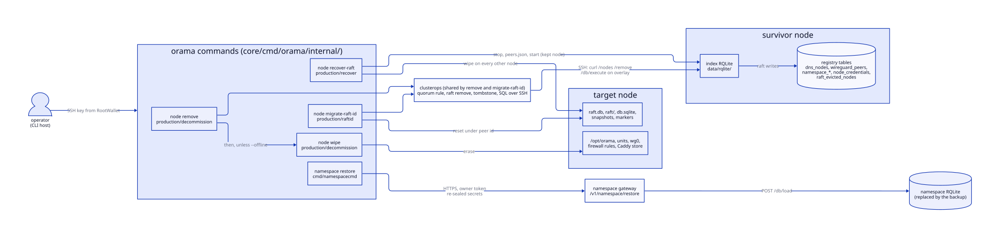
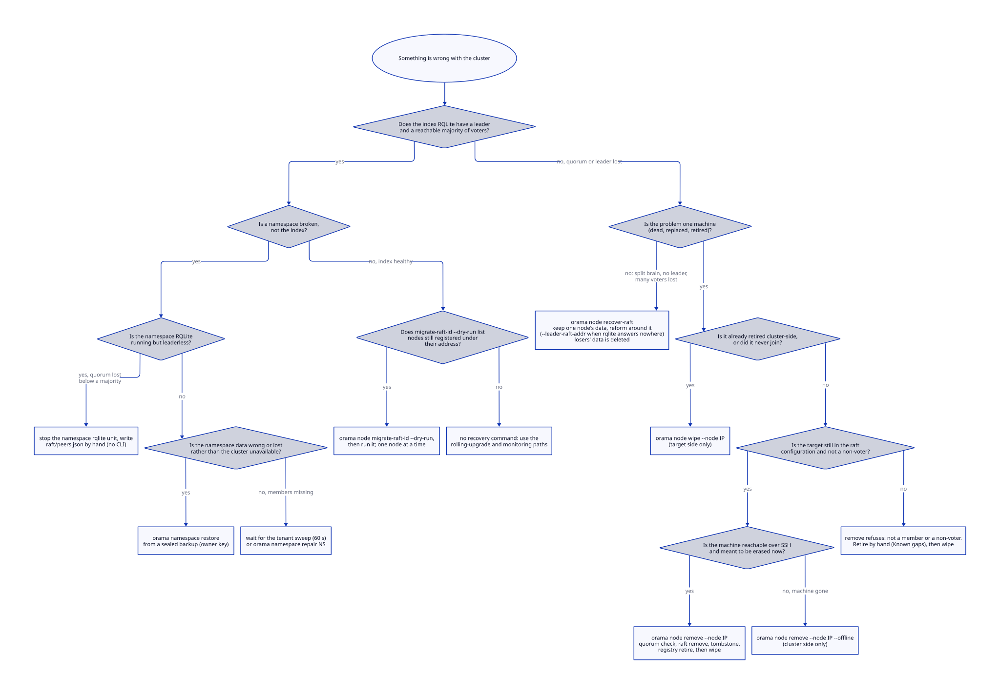
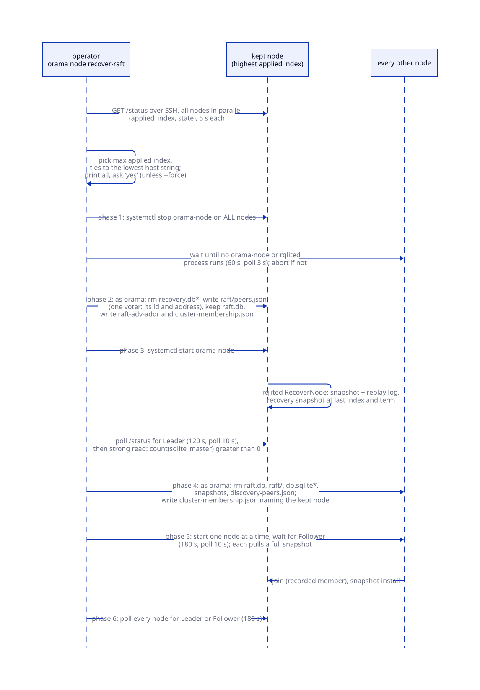
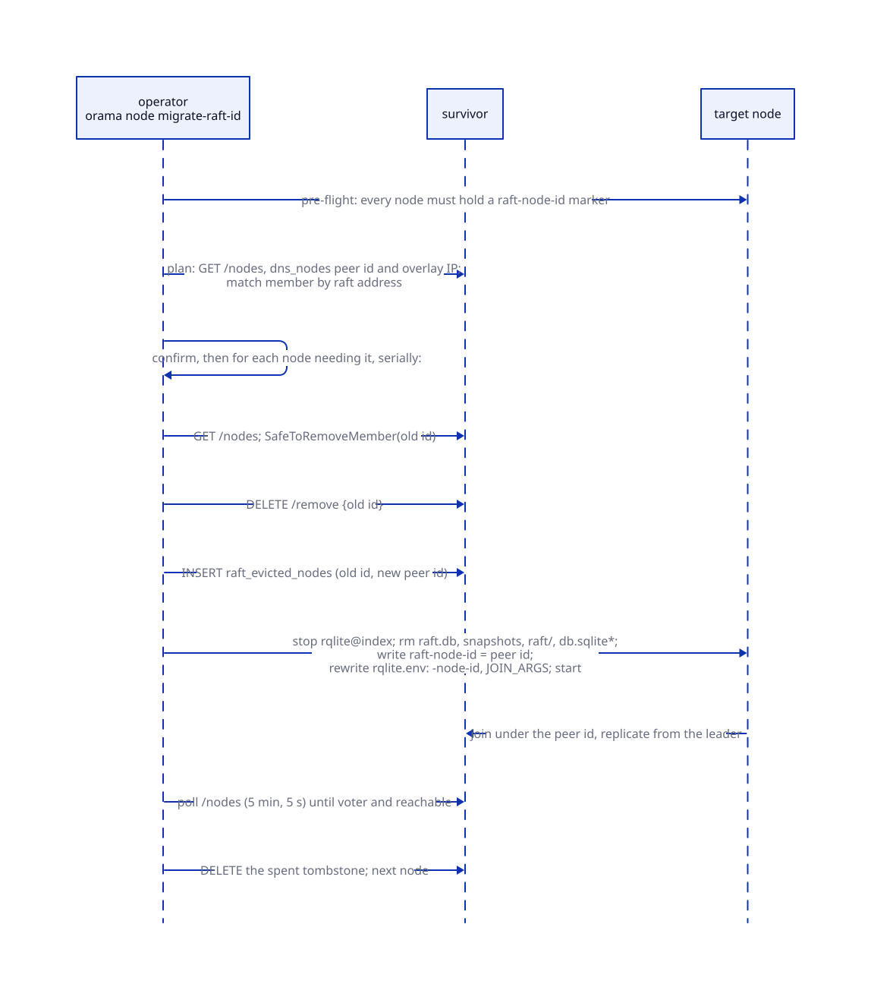
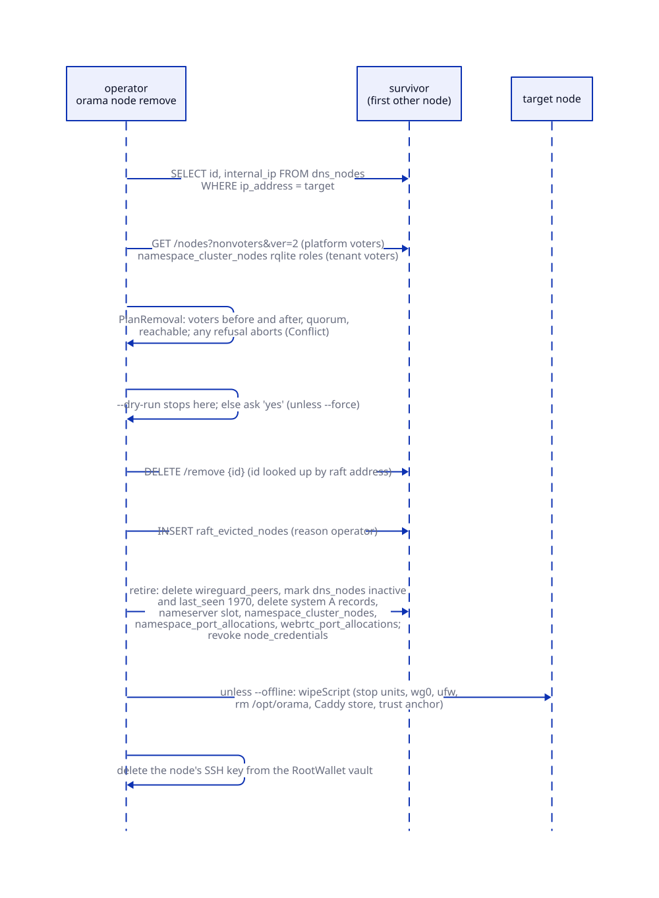

# Recovery

> **At a glance.**
>
> - **What:** the operator-driven mechanisms that change cluster membership or destroy and rebuild state when the automatic loops cannot or must not: `orama node recover-raft` (reform the index RQLite around one node's data, which is also how a cluster shrinks), `orama node migrate-raft-id` (move members from address ids to peer ids), `orama node remove` and `orama node wipe` (retire a node cluster-side, erase it target-side), the manual path for a namespace RQLite that lost quorum, and `orama namespace restore` (replace a namespace database from an owner-sealed backup). Each is a command run from an operator machine over SSH, and each is destructive in a different place.
> - **Key numbers:** applied index read with a 5 s curl per node; all nodes quiesced within 60 s (poll 3 s) or the recovery aborts before it deletes anything; kept node must report `Leader` within 120 s; each follower must report `Follower` within 180 s; final verify 180 s; migration rejoin wait 5 min (poll 5 s); eviction tombstone vetoes automatic re-adding for 24 h; index RQLite HTTP 10100, raft 10101; at most 5 platform voters.
> - **Code:** `core/cmd/orama/internal/production/recover/`, `core/cmd/orama/internal/production/raftid/`, `core/cmd/orama/internal/production/decommission/`, the shared `core/cmd/orama/internal/production/clusterops/`, and the quorum rule in `core/pkg/rqlite/eviction.go`.
> - **Depends on:** [cluster state](07-cluster-state.md) for the index RQLite and raft identity, [membership and failure detection](08-membership-and-failure-detection.md) for tombstones and the reconciler, [reconciliation and recovery](10-reconciliation-and-recovery.md) for the automatic namespace paths, [the database](17-database.md) for sealed backups.



## Why it exists

The cluster heals most faults without an operator. A restarted node rejoins its raft configuration, a dead voter is evicted on four independent signals, a dead namespace member is replaced by the tenant sweep. Those loops are deliberately conservative: each acts only on evidence that a machine is gone, and none will take the one step that is irreversible when the evidence is ambiguous. Three situations are therefore outside what they can do.

The first is a configuration that cannot elect: a majority of voters is gone for good, or the index cluster split into two clusters that each think they are the registry. Raft needs a quorum to change its own membership, so no automatic loop can repair it. Someone has to decide which copy of the data is the truth and discard the rest.

The second is a planned change of membership. Retiring a machine touches the raft configuration, the WireGuard mesh, the node registry, DNS, nameserver slots, every namespace the node served and the machine itself. Before the commands existed, an operator deleted a VPS and the cluster kept a configured raft voter, a WireGuard peer re-applied to every survivor every 60 s, and a registry row (`core/cmd/orama/internal/production/decommission/wipe.go`, package comment). The commands exist so that retirement is one checked operation, and so the quorum arithmetic is done by code instead of by an operator under pressure.

The third is a one-time identity change. rqlite keys a raft member by id and defaults the id to the advertise address, so identity followed routing. rqlite cannot rename a member, which makes the move to stable ids a migration an operator drives, not something an upgrade does silently (`core/cmd/orama/internal/production/raftid/migrate.go`, package comment).

Everything here shares one constraint: the operator's machine is outside the cluster. It reaches nodes over SSH with keys held in RootWallet, issues rqlite calls by running `curl` on a node against that node's overlay address, and so works when the gateways are down. The price is that these commands are the least automatic and the most consequential code in the CLI, and the book states plainly where they stop.

## The model

**Index cluster.** The RQLite that holds the registry (`dns_nodes`, `wireguard_peers`, `namespace_*`, `node_credentials`, `raft_evicted_nodes`). Its data directory is `/opt/orama/.orama/data/rqlite` on every node, its HTTP port is 10100 and its raft port 10101 (`core/pkg/constants/ports.go`). `recover-raft` and `migrate-raft-id` act on this cluster only.

**Survivor.** The node an operator command runs the cluster-side work from. It is never the target: a node cannot retire itself from a cluster it is leaving. The first node in the resolved list that is not the target is used, because every call goes to the survivor's local rqlite, which forwards writes to the leader (`core/cmd/orama/internal/production/clusterops/clusterops.go:PickSurvivor`).

**Kept node.** In `recover-raft`, the one node whose raft log, term and database survive. Every other node's copy is deleted.

**Applied index.** How far a node has put its raft log into its SQLite database, read from rqlite `/status`. It is the number that ranks candidates for the kept node (`core/cmd/orama/internal/production/recover/leader.go:PickLeader`).

**Recovery `peers.json`.** A file `raft/peers.json` in the rqlite data directory. rqlited treats its presence at start as an instruction to discard its persisted raft configuration and install the one in the file. Orama writes it only on the kept node, as a single-voter list (`recover.go:buildSingleNodePeersJSON`), and on a namespace RQLite in the automatic restore path ([reconciliation and recovery](10-reconciliation-and-recovery.md#raft-restore-peersjson-versus-join)).

**Markers.** Small files that say who a node is, kept beside the raft state so they are moved with it: `raft-node-id` (the id rqlited runs under), `raft-adv-addr` (the address the configuration last held the node at), and the membership record `cluster-membership.json` one directory up in `data/`. [Cluster state](07-cluster-state.md#raft-identity) defines them. Recovery has to write the first two correctly or the node starts outside its own configuration.

**Tombstone.** A row in `raft_evicted_nodes` saying a raft member was removed on purpose. Orphan recovery on the leader skips tombstoned nodes younger than 24 h (`core/pkg/rqlite/eviction.go:tombstoneTTL`); the membership reconciler reads them at any age ([membership and failure detection](08-membership-and-failure-detection.md#the-tombstone-lifecycle)).

**Retire.** The cluster-side half of removal: statements that take the node out of every registry store. **Wipe** is the target-side half: a script that erases the installation from the machine. `orama node remove` does retire then wipe; `orama node wipe` does only the second; `orama node remove --offline` does only the first (`decommission.go:execute`).

The table gives what each mechanism changes, what it needs first and what it cannot undo.

| Mechanism | Changes | Needs first | Cannot recover |
| --- | --- | --- | --- |
| `recover-raft` | Index raft configuration (to one voter, then grown back); raft state and database of every non-kept node | SSH to every node in the resolved list; at least the kept node's data intact | The data on every non-kept node; entries the kept node never received |
| `migrate-raft-id` | Raft id of one node at a time (address id to peer id); its raft state is discarded and re-replicated | Every node reachable and on a binary that records a raft id marker; quorum arithmetic passes per node | Nothing is lost if quorum holds; a failure between removal and rejoin leaves the node out until it is re-run |
| `remove` | Raft configuration, tombstone, WireGuard row, `dns_nodes`, DNS, nameserver slot, namespace memberships and ports, node key; then the machine | A survivor; every raft cluster the node votes in keeps its quorum after the removal | The machine's data (erased); a cluster that would lose quorum is refused, not forced |
| `wipe` | Only the target machine | SSH to the target | Anything on the machine; it tells the cluster nothing |
| Namespace `peers.json` (manual) | One namespace's raft configuration on the survivor | Shell on the one live member | Writes not replicated to the survivor |
| `namespace restore` | One namespace's RQLite contents, secrets and pins | The sealed backup and the owner's private key | Registry rows: keys, grants, sessions, deployments |

## How it works

### Choosing a mechanism



The tree encodes one rule: use the weakest mechanism that fits. A node that is merely down needs none of these; a restart rejoins it ([cluster state](07-cluster-state.md#lifecycle)). A degraded node is serving, and `recover-raft` is for the case where the index has no leader at all, not where one node reports `degraded` (`docs/DEV_DEPLOY.md`, "Recovery from Cluster Split"). A single machine that is gone is a `remove`, which needs the cluster to still have quorum, because it writes to the registry through the leader. Only when the registry itself cannot be written does the tree end in `recover-raft`.

The distinction between the platform and a namespace matters. `recover-raft` reforms the index cluster. A namespace RQLite is a separate raft group with its own members and quorum, and no command reforms it; its automatic and manual paths are below.

### What every command shares

All four node commands resolve their node list the same way (`core/cmd/orama/internal/noderesolver/fallback.go:chooseNodes`): the gateway's `GET /v1/operator/nodes` when it answers and returns nodes; otherwise the machines recorded on the environment at setup; otherwise `nodes.conf`. When the registry is down, which is the usual reason to run `recover-raft`, the list therefore comes from the local record. That list is the definition of "the survivors". A node that is dead but still listed makes `recover-raft` abort in its quiesce check (below); a node that is alive but missing from the list is not touched, keeps its old raft state, and is a split-brain hazard if it is started afterwards.

Keys come from RootWallet (`remotessh.PrepareNodeKeys`), so a locked wallet stops a command before it changes anything. Destructive commands print their plan and require the literal answer `yes` (`core/cmd/orama/internal/clierr/confirm.go:Confirm`); `--force` skips the prompt. Commands that write to a node's rqlite do so by running `curl` on the node against its own overlay address with credentials read from `node.yaml` on that node (`core/pkg/rqlite/shell.go:NodeShellCurl`), so credentials never cross the SSH line as arguments.

Root scripts that touch the rqlite data directory run the file operations as the `orama` user (`runuser -u orama --`). The directory belongs to that user, and a root `rm` or redirect there follows a symlink the user could plant; as `orama`, the script reaches only what rqlited already could (`recover.go:asOramaUser`, tested by `TestLeaderResetScript_writesOnlyAsTheOramaUser`).

### recover-raft



#### Choosing whose data survives

`chooseLeader` takes the node named by `--leader` or, without it, asks every node for `/status` in parallel and keeps the one with the highest `applied_index` (`recover/leader.go:PickLeader`). The reads are simultaneous on purpose: indexes read one at a time across several SSH round trips are seconds apart and, on a cluster still committing, not comparable. Unreachable nodes are excluded; if none answers the command stops and says to name one with `--leader`. Ties go to the lexicographically first host string, so the same cluster gives the same answer twice. The command prints each node's index and state and marks the one it will keep, then the prompt tells the operator that every other node's log and database will be deleted.

`--leader` skips the ranking and is checked only for membership in the environment. An operator who names a node has a reason, and this command exists for situations the automatic answer does not cover.

The ranking is by applied index, not by term. In an ordinary split the node with more applied entries has seen more committed writes, but the code does not compare terms or look at unapplied log tail, so the choice is a heuristic that a human is expected to read before typing `yes`.

#### Resolving the kept node's raft identity

The single entry written to `peers.json` needs two values that are not the same thing: the id rqlited runs under and the address it listens on. Writing an address as the id, or the reverse, leaves the node outside its own configuration (`recover.go:resolveLeaderRaft`).

The id is the content of the kept node's `raft-node-id` marker, read as the `orama` user. An absent marker means the node was started without `-node-id`, so its id is its address; a marker that exists and cannot be read fails the command instead of being folded into "absent" (`markerReadCommand`, `TestMarkerReadCommand_distinguishesMissingFromUnreadable`). The address comes from one of two places:

- With `--leader-raft-addr`, the operator's value, validated as a WireGuard `host:port` with an IP host (`rqlite.ValidateRaftAddress`). This is the path when quorum is already lost, because a node cannot report itself as `Leader` without a quorum.
- Without it, the live cluster: the named node must itself report `Leader`, and its `/nodes` response must have exactly one member with `leader == true`. Two leaders are refused as a split brain, and the id `/nodes` reports must equal the id the marker says, or the command stops before resetting anything.

If rqlite answers nowhere, the applied-index ranking has nothing to read, so both `--leader` and `--leader-raft-addr` must be given.

#### The six phases

**Phase 1, stop everything.** `systemctl stop orama-node` on every node in the list. The rqlite and tenant units are `PartOf=orama-node.service`, so the stop takes down the index RQLite and every namespace service on the node; WireGuard is deliberately not part of it and stays up (`core/systemd/orama-namespace-wireguard@.service`). A node that fails to stop gets `killall -9 orama-node rqlited`. Then the command polls every node for any `orama-node` or `rqlited` process, every 3 s for up to 60 s, and treats an SSH failure as "still running". If any node cannot be shown quiescent the command aborts before the destructive phases (`recover.go:waitAllStopped`). A lingering rqlited would hold `raft.db` open and race the leader reset.

**Phase 2, reset the kept node.** A root script refuses to run if `orama-node` is active, then, as `orama` (`leaderResetScript`):

1. removes `recovery.db*` and `restore-wal-*.tmp`, the scratch files an earlier recovery leaves behind. A stale `recovery.db-wal` makes the next recovery fail and the unit crash-loop (`core/pkg/rqlite/recovery_leftovers.go:RemoveRecoveryLeftovers`);
2. writes `raft/peers.json` holding one entry: the kept node's id and address, `non_voter` false;
3. writes `raft-adv-addr` with the address, so the restart does not read a stale marker as an address change and try to join members that no longer exist;
4. writes `cluster-membership.json` naming only the kept node, for the same reason (`pkg/namespace` `indexJoinTargets`).

It does not touch `raft.db`, the snapshots or `db.sqlite`.

**Phase 3, start the kept node and prove it.** `systemctl start orama-node`. The index supervisor sees a pending recovery `peers.json` (`core/pkg/rqlite/membership_record.go:HasRecoveryPeers`) and starts rqlited with no `-join`, because a join would contradict the operator's instruction (`core/pkg/namespace/index_bootstrap.go:indexJoinTargets`). rqlited restores the latest snapshot, replays every log entry after it from `raft.db`, writes a recovery snapshot at the last index and term, and compacts the log. The command polls `/status` every 10 s for up to 120 s for `Leader`, then runs a strong-consistency read, `SELECT count(*) FROM sqlite_master WHERE type='table'`. A failed read or zero tables aborts with the followers untouched: their copies are the only fallback if recovery silently lost data (`recover.go:phase3StartLeader`, `leaderTableCount`).

Keeping `raft.db` is deliberate. It is both the log and raft's stable store, which holds the current term. An earlier version deleted it. The recovered cluster then restarted at term 1 below its own recovery snapshot, and because rqlite orders snapshots by term first, that snapshot stayed "newest" for ever: every later snapshot was reaped as older, and a node that needed one was sent the stale snapshot and could never catch up (observed on stagenet, 2026-10-03; comment above `recover.go:rqliteRoot`). Entries committed after the last snapshot were lost too.

**Phase 4, wipe the other nodes.** Only after the kept node proved healthy. On each follower, as `orama`, after refusing if `orama-node` is active (`followerWipeScript`): delete `raft.db`, `raft/`, `db.sqlite` with its `-shm` and `-wal`, `wsnapshots/`, `rsnapshots/` and `discovery-peers.json`, then write a `cluster-membership.json` that names the kept node. It leaves `raft-node-id` in place, so the node rejoins under the id it already has. A failed wipe is fatal: starting that node later with a stale `raft.db` would reintroduce the pre-recovery configuration and split the cluster, and the command says not to start it.

**Phase 5, start the followers one at a time.** Each is started and polled every 10 s for up to 180 s for `Follower` before the next begins, so the kept node serves one full snapshot install at a time. With no raft state and a membership record naming the kept node, `indexJoinTargets` returns that node as the join address; the follower joins it as a new member and pulls the snapshot.

**Phase 6, verify.** Poll every node for 180 s until a leader is seen and every node reports `Leader` or `Follower`. The result is printed, not returned: an unsettled cluster prints a warning and the command still exits 0 (see [Known gaps](#known-gaps)). The next step is `orama monitor report --env <env> --ssh`, which reads the nodes directly because the gateways may not serve telemetry yet.

#### Cluster shrink

Shrink is the case where recovery runs with fewer nodes than the configuration lists, because machines are gone. It needs no separate code path. The resolved node list is the survivor set (above), so removing the dead machines from the environment record or `nodes.conf` before running the command defines the new cluster. The kept node's `peers.json` has one voter, the followers rejoin as new members, and the dead nodes are simply not in any configuration. Discovery's peer table is in memory (`core/pkg/rqlite/cluster_discovery.go`, `defaultInactivityLimit` of 2 h) and is rebuilt from live announcements after the kept node restarts, so a machine that never comes back is not offered to orphan recovery. A dead machine that is powered on later announces itself and orphan recovery re-adds it unless it was wiped.

What shrink leaves behind is the registry's memory of the dead nodes. `recover-raft` writes no tombstones and runs no retirement: `dns_nodes`, `wireguard_peers`, namespace memberships and DNS records for the departed machines are still in the preserved database. The membership reconciler removes them when its evidence rules agree the machines are gone ([membership and failure detection](08-membership-and-failure-detection.md#the-membership-reconciler)), and each namespace's own prune does the same for tenant memberships ([reconciliation and recovery](10-reconciliation-and-recovery.md#the-coordinator-leg-pruning-members-and-raft)). Retiring a dead machine explicitly with `remove --offline` is possible once the cluster has a quorum again, subject to the refusals below.

The same single-voter reset covers a cluster of one whose address changed: the configuration holds the node at the old address, there is no member to join, and `--leader-raft-addr <wg-ip>:10101` reforms the cluster at the new one.

#### What it recovers and what it does not

It recovers an available cluster: one leader, the kept node's registry intact, every other node a follower with a full copy. It does not recover the data on any other node, and takes no backup (the command's help text says so). It cannot recover writes the kept node never applied. It does not touch tenant namespace rqlite data, but phase 1 stops every namespace unit on every node, so every tenant is down from phase 1 until the node restarts and the tenant sweep restores them (60 s sweep, [reconciliation and recovery](10-reconciliation-and-recovery.md#per-node-leg-restore-and-drift)). The outage is of the whole node, not of the registry alone.

### migrate-raft-id



Raft ids derived from addresses mean that giving a machine a new overlay address mints a second member while the old one remains a voter nothing can reach. Two such events on five voters leave quorum at 3 of 7 with five live voters. The migration moves each member to its libp2p peer id, which survives an address change. It runs once per cluster (`orama node migrate-raft-id`, `--dry-run`, `--node` to narrow what is migrated).

**Pre-flight.** Every node in the environment must hold a `raft-node-id` marker, read over SSH (`raftid/migrate.go:requireStableIDSupport`). The marker is the probe that the node has booted a binary that understands stable ids. Migrating while one node is on the old binary would make it re-add every migrated node as a duplicate voter every five minutes through orphan recovery. An unreachable node blocks the whole run. `--node` narrows what is migrated, never who is checked or who drives the removal.

**Plan.** For each target the command reads the node's peer id and overlay address from `dns_nodes` and matches its raft address (`overlay:10101`) against `/nodes` to find the id it is registered under (`buildPlans`). A node already on its peer id is skipped. A target absent from the configuration is either mid-migration, when its own marker already holds the peer id and the plan resumes from the reset, or not a member, which is an error.

**One node, then the next.** For each node, in order (`migrateOne`):

1. `SafeToRemoveMember` on the current members. The planned-removal rule counts the target as leaving even though it answers; the eviction rule would refuse any live member, so using it made the migration unable to start.
2. `DELETE /remove` for the old id, then a tombstone for the old id carrying the new peer id, so orphan recovery does not re-add the old id. Remove first, then wipe: the other order would leave a node with no raft state still in the configuration, which would rejoin under its old id and make the migration a no-op.
3. On the target: stop `orama-namespace-rqlite@index`, delete `raft.db`, snapshots, `raft/`, `peers.json` and `db.sqlite*`, write the peer id into `raft-node-id`, rewrite `rqlite.env` so `EXTRA_ARGS` carries `-node-id <peer id>` and `JOIN_ARGS` points at the survivor's overlay HTTP address, start the unit (`resetScript`). The env file is in the root-owned unit-env tree and is written through `orama-privhelper run unitenv set`, not in place. Rewriting it is the whole point: with an empty data directory, no id and no join, rqlited would bootstrap a brand-new single-node cluster under its old address, elect itself leader of an empty database and nothing on the node would notice.
4. Wait up to 5 min (`rejoinTimeout`), polling `/nodes` every 5 s, until the node is present as a reachable voter under the new id. Presence alone is not enough: a member appears the instant the join commits, long before it has replicated, and returning then would remove the next voter while the last is catching up.
5. Delete the spent tombstone, so the eviction path does not read a dead row every tick.

Re-running is safe: nodes already stable are skipped, and an interrupted node resumes. On a failure the message says the cluster is intact and to re-run. After step 2 and before step 4 completes the node is out of the cluster, and the cluster has one fewer voter, which is why step 1 comes first and why nodes are never migrated in parallel.

### remove and wipe



#### The preflight

`orama node remove --node <public ip>` first reads the target's peer id and overlay address from `dns_nodes` on the survivor (`ResolveNodeRecord`), builds the target's raft address `overlay:10101`, and finds the raft id registered at that address (`decommission.go:resolveRaftID`, `clusterops.IDForAddr`). Removing by address on a cluster that had migrated to peer ids matched nothing and reported success, which is why the id is looked up.

Then `PlanRemoval` states the cost for every raft cluster the node votes in (`clusterops/preflight.go:PlanRemoval`): the platform cluster from `/nodes`, and each namespace from `namespace_cluster_nodes` rows with role `rqlite_leader` or `rqlite_follower` and status `running`, with reachability taken from the node's `dns_nodes.status`. Each cluster is a separate raft group with its own quorum, and checking the platform alone is how an operator once retired a node that held two of three voters for a namespace and learned of it when the namespace stopped accepting writes.

The verdict is one function used by every removal path, `rqlite.SafeToRemoveMember` (`core/pkg/rqlite/eviction.go`). Counting the target as gone whether or not it answers, it refuses when:

- the target is not in the configuration;
- the target is a non-voter ("removing it gains no quorum headroom");
- it is the last voter;
- the voters left would have fewer reachable members than their new quorum, `floor(n/2)+1`.

Any refusal prints the arithmetic per cluster and ends the command as a conflict; retrying unchanged is refused again. `--dry-run` prints the same plan, every retirement statement and the wipe it would do, and changes nothing.

#### Add before remove

The rule that a replacement joins first is operator discipline backed by arithmetic, not a check for a replacement. On a healthy three-voter cluster, removing one leaves two voters, quorum two, two reachable: allowed, with no fault tolerance left. With a fourth node joined first there are four voters and quorum three; removing the old one returns to three with headroom. The command cannot tell the two situations apart and has no minimum voter count. The joining side is [install and upgrade](30-install-and-upgrade.md); the new node is a voter only up to the cap of 5, chosen by lowest overlay IP (`core/pkg/rqlite/cluster_discovery_membership.go:computeVoterSet`).

#### Cluster-side steps

After confirmation, in order:

1. `DELETE /remove` with the raft id on the survivor, which forwards to the leader. The call is repeated against the quorum rule inside `clusterops.RemoveRaftMember`.
2. A tombstone with reason `operator`, written before anything else changes so nothing re-adds the node within the five minutes orphan recovery takes (`clusterops.WriteTombstone`, `core/migrations/037_raft_evicted_nodes.sql`).
3. The retirement plan, eight statements, each keyed on the node and idempotent so a half-finished retirement is finished by re-running (`clusterops/retire.go:RetirementPlan`):

| Step | Statement | Why it is this way |
| --- | --- | --- |
| Release the mesh address | Delete `wireguard_peers` by node id, or by the placeholder id `node-<overlay ip>` when the row still belongs to the node that held that address | An OramaOS node's row carries a placeholder id from enrolment; deleting by id alone left the machine on the mesh |
| Mark retired | `UPDATE dns_nodes` to `inactive`, `last_seen` to `1970-01-01 00:00:00` | Marked, not deleted: every DNS cleanup finds the node's IP through a `dns_nodes` row that is not active, and deleting the row strands the A records |
| Remove system DNS | Delete type A records in namespace `system` with the node's IP | The 120 s reaper only matches `status = 'active'` |
| Release the nameserver slot | Delete `dns_nameservers` | Frees the slot |
| Leave every namespace | Delete `namespace_cluster_nodes` | No reconciler removes it |
| Free ports | Delete `namespace_port_allocations` | Same |
| Free TURN and SFU | Delete `webrtc_port_allocations` | So those roles are re-placed |
| Revoke its key | `UPDATE node_credentials` set `revoked_at` | A revoked row verifies nothing and cannot be enrolled again |

The fixed 1970 date is not computed with `datetime('now', ...)` because rqlite replicates the statement text and each node applies it locally; a relative time would land differently on every replica (`clusterops/retire.go:retiredLastSeen`, `core/pkg/constants/node_retirement.go:RetiredNodeLastSeen`). The date also backdates the node past the DNS purge's stale window so the purge does not wait for it.

#### The wipe

Unless `--offline`, the target is then erased with the same script `orama node wipe` runs (`decommission/wipe.go:wipeScript`), and its SSH key is removed from the RootWallet vault (`forgetRetiredKey`). `--offline` skips the wipe for a VPS that is already deleted and still removes the key. If the wipe fails after the retirement, the cluster side stays done and the error says to re-run `orama node wipe`.

The script, in order:

1. Stops and disables every `orama-namespace-*` and `orama-deploy-*` unit instance. Template instances match none of the legacy host unit names, and `clean` once left them running under a deleted data directory.
2. Stops the privileged helper socket, so nothing reaches root through it during teardown.
3. Stops the supervisor and the legacy host units (`orama-node`, `orama-turn`, `orama-sni-router`, `caddy`, `coredns`, `ntfy`, and the older per-service names), and purges leftovers of the removed Anyone network if the node was never upgraded past it.
4. Kills stragglers by full path or binary name, anchored so an unrelated command line containing `ipfs` is not matched.
5. Removes the unit files, tears down `wg0` and `wg0.conf`, and deletes the ufw rules tagged `orama`, newest first. The rules for the ports `sshd` listens on stay, whoever added them, because the script runs over SSH; if `sshd -T` cannot be read, the firewall is left untouched.
6. Removes `/opt/orama`, the root-owned unit-env and deploy trees, the Caddy store (the node's TLS private keys and ACME account key), the archive trust anchor and its rotation mark, `/etc/coredns`, `/etc/caddy` and the temporary archives.
7. With `--nuclear`, also removes shared binaries and purges the Tor package and its apt source.

`rm -rf` is an unlink, not a cryptographic erase; provider disks remain readable, and the command says so. The `orama` user itself is not removed by this script. `orama node clean` is a deprecated alias for `wipe`.

`wipe` with no `--node` erases every node in the environment. With one node it prints that the cluster is told nothing and that a member should be removed instead, because the survivors keep counting it toward quorum.

#### Coming back

A retired node does not rejoin by itself. Its `dns_nodes` row has the 1970 `last_seen`, which the node API's admission check treats as retired, so a machine that still has its disk cannot register (`core/pkg/gateway/handlers/nodeapi/admission.go:admitted`), and its credential row is revoked. Re-admitting it is a join with a new invite, which deletes the old credential row so the new key can be recorded (`core/pkg/gateway/handlers/join/handler.go:forgetNodeCredential`; [inter-node trust](15-inter-node-trust.md#revocation-and-re-admission)). A node that lost `secrets/node-key.pem` but kept its identity key is refused for the same reason and is re-joined, not repaired by hand.

### Namespace raft

A namespace RQLite is a raft group whose ids are its `overlay:port` addresses. `recover-raft` does not touch it, and no node command reforms it. Two paths exist.

**Automatic.** When the namespace's RQLite unit is not running, the node's tenant sweep restores it. A node that holds raft state restarts into its own configuration and writes a recovery `peers.json` only when its recorded membership differs from the registry's authoritative member list. A node without raft state joins its recorded members and never bootstraps, and refuses to start when it has no member to join, naming the record file. These rules, and the `RepairCluster` that adds missing members, are [reconciliation and recovery](10-reconciliation-and-recovery.md#raft-restore-peersjson-versus-join) and [RepairCluster](10-reconciliation-and-recovery.md#repaircluster). `orama namespace repair <ns>`, run on a node, asks that node's gateway on its WireGuard address to run `RepairCluster` once (`core/cmd/orama/internal/cmd/namespacecmd/namespace.go`).

**Manual, for lost quorum.** The automatic paths act on an RQLite unit that is stopped. A namespace whose members are mostly gone but whose surviving rqlited is running and leaderless is not restored, and the removal of the dead members from its configuration is refused by the same arithmetic: `guardRaftRemoval` rejects a removal after which fewer than a quorum of survivors remain, and its error points at the manual procedure (`core/pkg/namespace/cluster_recovery.go:guardRaftRemoval`). The mechanism is the one the index uses: on the one live member, stop the namespace RQLite unit, write `raft/peers.json` in that namespace's rqlite data directory with a single voter whose id and address are its own `overlay:raft port`, and start the unit. rqlited consumes the file and renames it to `peers.info`. Leftover `recovery.db*` files must be removed first, as for the index. Afterwards the Olric peers and gateway `olric_servers` must stop naming dead members (the sweep rewrites them from live membership), and the registry rows of the dead members are retired. There is no CLI for any of this; the steps are a shell session on the node (see [Known gaps](#known-gaps)).

### Restoring from a sealed backup

`orama namespace restore` is the recovery for namespace data that is wrong or lost while the cluster is available, as opposed to a cluster that is unavailable. The CLI opens the sealed backup on the operator's machine with the owner's private key, re-seals its secrets to the destination gateway's restore key, and sends the result to the namespace's own gateway, which replaces the namespace RQLite with the backup, writes the secrets under its own cluster's encryption root and pins every CID. [The database](17-database.md#restore) owns the format and the gateway's order of operations; what matters for recovery is the boundary.

It recovers the namespace's own tables, its functions and their secrets, stored-object records, quotas and push and WebRTC settings. It does not recover registry rows: API keys, grants, sessions, deployments and their domains live in the cluster registry, so a restore neither brings back a key that was revoked nor removes one minted since, and does not recreate deployments, only pins their content. The namespace must already exist on the destination. A wrong key, a corrupt file or a backup of a different namespace stops on the operator's machine before anything is sent (`namespacecmd/restore.go:runRestore`, `buildRestore`). A restore is idempotent: after a failure past the load, running it again is safe. The cluster takes no backups by itself; the backup exists only if an owner ran `orama namespace backup`, optionally into a private storage deal.

The same file can restore to a different cluster. The restore key is derived per namespace from the destination's encryption root, so the secrets are unwrapped on the owner's machine and re-wrapped for the destination.

### What can and cannot be recovered

| Lost | Recoverable? | By what | Limit |
| --- | --- | --- | --- |
| One index voter, quorum intact | Yes | The cluster evicts it, or `remove` | The 24 h tombstone window; machine data is gone |
| Index quorum | Yes, to the kept node's last applied state | `recover-raft` | Every other node's data is deleted; there is no backup |
| Index database, all copies | No | Nothing; the registry has no off-cluster backup in this codebase | See [Known gaps](#known-gaps) |
| A node's raft state only | Yes | Restart (data present on the others); `recover-raft` for a cluster of one | A node with markers and no state and no peer to join refuses to start |
| A node's identity change | Yes | `migrate-raft-id` | One node at a time; quorum must hold |
| A namespace member | Yes | The tenant sweep, `orama namespace repair` | A one-node namespace cannot be replaced elsewhere |
| A namespace's quorum | Yes, to the survivor's last state | Manual `peers.json` | No CLI |
| Namespace database contents | Yes, to the backup's moment | `namespace restore` | Only if a sealed backup was taken; registry rows are not in it |
| IPFS blocks held only by a removed node | Partly | The pin sweep re-issues pins every 15 min for CIDs below their factor ([storage](19-storage.md#the-pin-sweep)) | A CID whose only replica was on the node is gone; a new node starts with an empty repo |
| TURN and SFU placements | Yes | Freed by `remove`; the WebRTC reconciler re-places them ([WebRTC](23-webrtc.md)) | Not part of the raft recovery |
| Nameserver glue at the registrar | No | `remove` releases the slot; the registrar entry is outside the cluster ([DNS](24-dns-and-nameservers.md)) | Manual |

## State it owns

| State | What it holds | Writer | Reader | Where |
| --- | --- | --- | --- | --- |
| `raft/peers.json` (index) | Recovery configuration, one voter | `recover-raft` phase 2 | rqlited at start; `HasRecoveryPeers` | `/opt/orama/.orama/data/rqlite/raft/` on the kept node |
| `raft.db`, `db.sqlite*`, `wsnapshots/`, `rsnapshots/` | Raft log and term, database, snapshots | rqlited | rqlited | `/opt/orama/.orama/data/rqlite/`; kept on the kept node, deleted on others |
| `raft-node-id` | Id rqlited runs under | `ResolveRaftIdentity`; the migration reset | `recover-raft` (reads), the migration pre-flight | beside `raft.db` |
| `raft-adv-addr` | Address the configuration last held the node at | `RecordClusterMembership`; `recover-raft` phase 2 | `indexJoinTargets` | beside `raft.db` |
| `cluster-membership.json` | First-seen time and member raft addresses | The membership recorder; `recover-raft` (kept node and followers) | `indexJoinTargets` | `/opt/orama/.orama/data/` |
| `discovery-peers.json` | Discovery's last peer list | Discovery; deleted by `recover-raft` on followers | Boot checks | `/opt/orama/.orama/data/rqlite/` |
| `raft_evicted_nodes` | Tombstones: node id, raft address, peer id, reason, who, when | Eviction, `remove`, `migrate-raft-id` | Orphan recovery, the membership reconciler | Index RQLite (migration 037) |
| Retirement targets | `wireguard_peers`, `dns_nodes`, `dns_records`, `dns_nameservers`, `namespace_cluster_nodes`, `namespace_port_allocations`, `webrtc_port_allocations`, `node_credentials` | `remove` | The reconcilers, DNS, admission | Index RQLite |
| `rqlite.env` for `index` | `-node-id` in `EXTRA_ARGS`, `JOIN_ARGS` | The migration reset via `orama-privhelper`; later regenerated by `EnsureRQLite` | The unit | Root-owned unit-env tree |
| RootWallet vault entry `user@host` | The node's SSH key | `orama node setup` | Every command here | The operator's vault; deleted by `remove` and `wipe` |

The recovery commands keep no state of their own. Interruption is handled by the shape of the operations: each step is keyed on the node and safe to repeat, and the destructive phases are ordered so the proof of health precedes the deletion.

## Lifecycle

**Normal operation.** None of these commands runs. The loops that make them rare run instead: dead-voter eviction, the membership reconciler, the tenant sweep ([reconciliation and recovery](10-reconciliation-and-recovery.md)).

**Rolling upgrade.** The migration is the one recovery mechanism that is part of an upgrade story: it must not start until every node has booted a binary that writes the `raft-node-id` marker, and the pre-flight refuses otherwise. In a mixed-version cluster an old-binary leader keys orphan recovery on the raft id alone and re-adds by address, so a migrated node is invisible to it. The index raft port moved from 7001 to 10101 in the upgrade from 0.122.x; each node restarts under its recorded id at the new address and joins the other recorded members so the leader re-registers it, which requires one voter changing address at a time. A majority changing address at once leaves no leader to re-register any of them, and that state is a `recover-raft` (`docs/DEV_DEPLOY.md`). See [rolling upgrades](31-rolling-upgrades.md).

**Restart.** A node restarted after `recover-raft` starts from its markers and, on followers, the membership record naming the kept node. A node restarted mid-migration with the old `rqlite.env` and no raft state is the silent single-node bootstrap the reset script exists to prevent; the script writes the env file before starting the unit.

**Node loss.** The automatic loops handle one voter. Two voters of three, or three of five, is `recover-raft`. A machine deleted by its provider is `remove --offline`, which needs the remaining cluster to keep quorum.

**Evidence and watching.** After any of these, `orama monitor report --env <env>` for the cluster and `--node <ip>` for one node are the checks the rolling-upgrade protocol requires between steps ([observability](32-observability.md)). The commands' own verification is weaker than that, as the gaps below describe.

## Failure modes

| Trigger | What the system does | What you observe |
| --- | --- | --- |
| `recover-raft`: a listed node is dead | Phase 1 cannot show it quiescent; the command aborts after 60 s before any destructive phase | `nodes still running orama-node/rqlited after 1m0s ... aborting before destructive phases`, though the node is merely unreachable |
| `recover-raft`: kept node does not become Leader in 120 s | Abort; followers untouched | `did not reach Leader state within 120s`, with the log path |
| `recover-raft`: kept node recovers with no tables | Abort before wiping followers | `recovered with an EMPTY schema` |
| `recover-raft`: a follower fails to wipe | The command ends, telling you not to start it | `do NOT start them (stale raft.db would cause split-brain)` |
| `recover-raft`: follower slow to join | Reported as failed after 180 s although it may still be syncing | `did not report Follower within timeout`, then `did not start/join cleanly` |
| `recover-raft`: explicit `--leader-raft-addr` of another node | Validated only for format; the kept node is written into `peers.json` with someone else's address | The kept node does not become Leader or elects itself outside its own configuration |
| `migrate-raft-id`: a node is on the old binary | Refused before any node is touched | `these nodes have not booted on a binary that supports stable raft ids` |
| `migrate-raft-id`: a node fails to rejoin in 5 min | Stops; the cluster has one fewer voter | `did not rejoin as a reachable voter`; re-run resumes |
| `migrate-raft-id`: a failure between removal and reset | The node is out of the cluster | `the old id was removed but the node could not be reset` |
| `remove`: a cluster would lose quorum | Refused, nothing changed | `refusing to remove ...: it would cost a cluster its quorum (see above)` with the per-cluster arithmetic |
| `remove`: target not in raft, or a non-voter | Refused with the same message, though no quorum is at stake | Reason line reads `not in the raft configuration` or `a non-voter` (see [Known gaps](#known-gaps)) |
| `remove`: wipe fails after retirement | Cluster side stays done | `the node was retired cluster-side but the wipe failed`; re-run `wipe` |
| `remove` or `wipe`: vault unreachable | The node is erased, the key stays in the vault | `is retired, but its SSH key is still in the vault`; quit the RootWallet app, then `rw vault ssh rm` |
| SSH to a node fails | That step fails; no step proceeds on an unknown | Per-command error naming the host |
| Network partition between operator and cluster | Same as SSH failure; destructive phases are gated on proof of quiescence or health | Aborts at the earliest gate |
| Disk full on the kept node | rqlited recovery fails; the leader never reaches `Leader` | Phase 3 timeout; check `rqlite-node.log` |
| Clock skew | No effect on these mechanisms; the retirement uses a fixed date, not a computed one | None |

## Trust and security

**The operator is root on every node.** These commands authenticate with SSH keys from RootWallet and run root scripts. Nothing in the cluster can verify the operator's judgement, which is why the destructive ones print what they will delete and require a typed `yes`.

**What the scripts defend against.** Values that reach a root shell are validated first: raft addresses must be IPs with a port, raft ids must be a libp2p peer id or an address (`rqlite.ValidateRaftID`), and the migration validates the peer id with the libp2p decoder and the join address as IPv4 `host:port`. Payloads travel base64-encoded to sidestep shell quoting, and SQL literals are escaped with `clusterops.SQLLiteral` because statements cannot be parameterised over SSH (`TestResetScript_singleQuotesHostileValues`). A `/nodes` response is parsed strictly before it can reach a `peers.json`: a malformed or poisoned reply fails before phase 1 stops the cluster.

**Privilege separation.** The rqlite data directory belongs to `orama`; the root scripts do file work in it as `orama` so a planted symlink cannot redirect a root write. The unit env file is root-owned and written only through the privilege helper ([privilege and filesystem trust](05-privilege-and-filesystem-trust.md)).

**What an attacker in each position can do.** An attacker with only network access to the cluster cannot reach any of this; the commands run from the operator's machine over SSH. An attacker who has a retired node's disk cannot make it a member again: its credential is revoked and its registry row fails the admission check. An attacker who can poison `/v1/operator/nodes` could add a host to the survivor list, but a host that is not truly a cluster node fails the checks (no rqlite answering `/status`) rather than being wiped, except for `wipe`, which erases whatever it is told to. The node list is therefore trusted for `wipe`.

**Secrets.** The `remove` and `wipe` scripts delete the Caddy store (TLS private keys, ACME account key) and the archive trust anchor, so a machine reused later does not serve an old certificate or trust an old cluster. Deletion is by unlink, not erase. The scripts never print credentials; rqlite basic auth is read on the node from `node.yaml`.

## Limits and scale

- **Per-node serial work.** `recover-raft` stops and wipes every node over SSH one after another, and starts followers one at a time with a 180 s budget each, so its duration grows linearly with the fleet. On a fleet of tens of index nodes the dominant cost is the serial follower start, each pulling a full snapshot of the registry.
- **Snapshot size.** Each follower pulls a full snapshot from the kept node. A registry that grows with tenants, deployments and events makes the 180 s per-follower budget the first thing to fail, and a node that exceeds it is reported failed though it is still syncing.
- **Voter cap.** Platform voters are the first 5 by overlay IP; beyond 5 nodes the rest are non-voters. This bounds the quorum arithmetic and also makes `remove` unusable on the non-voters (see [Known gaps](#known-gaps)).
- **Namespace count.** `PlanRemoval` reads every namespace's voter rows in one query, so the preflight is one query regardless of fleet size; the retirement is eight statements per node.
- **Migration.** Strictly one node at a time and a rejoin wait of up to 5 min per node, so `migrate-raft-id` takes up to 5 min per node on a healthy cluster and more if snapshots are large.
- **At 10x.** A fleet ten times larger has the same five voters. The first bottleneck is the serial follower start in `recover-raft`; the second is that the node list is the operator's record, and a stale record means a missed or dead node.

## Design decisions

### Keep the kept node's raft log and term

*Chosen:* write `peers.json`, keep `raft.db`, let rqlited replay the log. *Rejected:* delete `raft.db` and recover from the latest snapshot only. *Why:* `raft.db` is the stable store that holds the term; deleting it lost entries committed after the last snapshot and restarted the cluster at term 1 below its own recovery snapshot, after which no follower could catch up (`recover.go`, comment on the layout constants).

### Prove the kept node before touching any follower

*Chosen:* start the kept node, require `Leader` and a non-empty schema read, and only then wipe followers. *Rejected:* wipe everything in parallel with the reset. *Why:* the followers' copies are the only fallback if recovery silently lost data.

### Rank candidates by applied index, read at one instant

*Chosen:* parallel `/status` reads and `max(applied_index)`, printed for human review. *Rejected:* a required `--leader` the operator works out by hand. *Why:* the value decides which copy of the cluster survives, and computing it by hand across six nodes while quorum is lost is how the wrong node gets named.

### One quorum rule for eviction, removal and migration

*Chosen:* `SafeToRemoveMember` for planned removals, shared with the automatic eviction's arithmetic. *Rejected:* reusing the eviction rule as is. *Why:* the eviction rule vetoes a reachable target, which is right for an automatic eviction and made the migration unable to execute one step, since a migrating node always answers. Two implementations of a quorum rule is one too many.

### Check every raft cluster before the prompt

*Chosen:* quorum arithmetic for the platform and every namespace the node votes in, printed before confirmation. *Rejected:* checking the platform at the point of removal. *Why:* namespaces are separate raft groups.

### Retire by marking, not deleting, `dns_nodes`

*Chosen:* `inactive` plus a 1970 `last_seen`. *Rejected:* deleting the row. *Why:* every DNS cleanup finds a node's records through a non-active `dns_nodes` row; deleting it strands them, and the date lets the purge run immediately with its own guards.

### Revoke, do not delete, the node's key

*Chosen:* `revoked_at` on `node_credentials`. *Rejected:* delete the row. *Why:* a revoked row cannot be enrolled again, so the retired machine's disk stops being a credential and cannot re-admit itself; a deleted row would restore the first-use path. Re-admission is an explicit join.

### Remove first, then wipe, in the migration

*Chosen:* remove the old id and tombstone it, then reset the node. *Rejected:* wipe then remove. *Why:* a node with no raft state that is still in the configuration rejoins under its old id and the migration silently does nothing.

### Separate retire from wipe

*Chosen:* two halves, run together by `remove`, separately by `remove --offline` and `wipe`. *Rejected:* one erase command (`clean`). *Why:* a deleted VPS needs only the cluster side, an already retired one only the erase, and an erase alone left a configured voter, a mesh peer and a registry row.

## Known gaps

- **`remove` refuses a node that is not in the raft configuration, and a non-voter, with a quorum message.** `PlanRemoval` calls `SafeToRemoveMember`, which refuses a target absent from the configuration and a non-voter; the command treats any refusal as a lost quorum and stops before the retirement. A node already evicted by the dead-voter loop, and every node beyond the fifth voter, cannot be retired cluster-side with the command, and the branch in `RemoveRaftMember` that says "nothing to remove" cannot be reached. Code: `core/cmd/orama/internal/production/clusterops/preflight.go:impactFor`, `core/cmd/orama/internal/production/decommission/decommission.go:quorumRefusal`, `core/pkg/rqlite/eviction.go:quorumSurvivesRemoval`.
- **`remove` deletes a node's namespace memberships without removing it from the namespace raft.** The retirement deletes the `namespace_cluster_nodes` rows, and the only callers that remove a member from a namespace's raft configuration (`removeMemberFromRaft` in the prune, `removeDeadNodeFromRaft` in `ReplaceClusterNode`) work from those rows. A planned retirement of a live voter therefore leaves a configured namespace voter that never answers; the repair path later adds a replacement without removing it, so the voter count grows by one per retirement. Not verified against a live cluster. Code: `core/cmd/orama/internal/production/clusterops/retire.go:RetirementPlan`, `core/pkg/namespace/cluster_recovery.go:pruneStaleClusterNodes`.
- **The namespace lost-quorum recovery has no command.** The only procedure is a manual shell session; the refusal in `guardRaftRemoval` and the old runbook point to it, and no code writes the namespace `peers.json` for a running, leaderless survivor. Code: `core/pkg/namespace/cluster_recovery.go:guardRaftRemoval`, `core/pkg/namespace/raft_restore.go:needsPeersRecovery`.
- **`recover-raft` can exit 0 without a healthy cluster.** `phase6Verify` prints the unsettled state and returns nothing, so scripts cannot tell. Code: `core/cmd/orama/internal/production/recover/recover.go:phase6Verify`.
- **`recover-raft --force` without `--leader` has no human check on the pick.** The applied-index ranking is printed but, with `--force`, never reviewed, and it ranks by applied index only. Ties are broken by string order, so `10.0.0.10` sorts before `10.0.0.2`. Code: `core/cmd/orama/internal/production/recover/leader.go:PickLeader`.
- **`--leader-raft-addr` is not checked against the kept node.** Only the format is validated, unlike the live path, which cross-checks the id and the leader state. Code: `core/cmd/orama/internal/production/recover/recover.go:resolveLeaderRaft`.
- **A dead node in the list aborts `recover-raft`.** The quiesce check treats an unreachable host as running, so the operator must edit the node list before a shrink; the error does not say so. Code: `core/cmd/orama/internal/production/recover/recover.go:waitAllStopped`.
- **`recover-raft` uses raw `systemctl` and `killall -9`.** It bypasses the CLI's quorum guard on purpose, but also its ordering logic; the stop reaches every namespace unit on the node. Code: `core/cmd/orama/internal/production/recover/recover.go:phase1StopAll`.
- **The migration's join address can silently be a public IP.** `survivorOverlayIP` falls back to the survivor's public host when the node record cannot be read, and the value is then used as the join address after the old id has already been removed; the reset would fail to join. Code: `core/cmd/orama/internal/production/raftid/migrate.go:survivorOverlayIP`.
- **No minimum voter count and no replacement check.** `remove` allows a removal that leaves two voters with no fault tolerance; add-before-remove is discipline only. Code: `core/pkg/rqlite/eviction.go:quorumSurvivesRemoval`.
- **No off-cluster backup of the index registry.** `orama namespace backup` covers one namespace; there is no equivalent for the registry, so if every copy of the index database is lost, nothing in the codebase restores it. Code: `core/cmd/orama/internal/cmd/namespacecmd/backup.go`.
- **`POST /v1/node/leave` leaves raft alone.** The OramaOS graceful-departure route stops services, deletes the WireGuard peer row and removes the peer locally, but takes no raft action, writes no tombstone and does not retire the node. The experimental OramaOS image is not covered in this book. Code: `core/pkg/gateway/handlers/enroll/node_proxy.go:HandleNodeLeave`.
- **A comment and the schema disagree about tombstone reasons.** Migration 037 lists `decommission` as a reason; no code writes it, `remove` writes `operator`. Code: `core/migrations/037_raft_evicted_nodes.sql`, `core/cmd/orama/internal/production/clusterops/clusterops.go:WriteTombstone`.
- **`docs/NODE_REPLACEMENT.md` still describes manual DNS rewrites and labels namespace rebalancing "not automatic enough"**, which the retirement and the tenant sweep now do. It is the runbook this chapter absorbs and needs its own pass.

## Verify it yourself

Unit tests, run with `cd core && go test ./cmd/orama/internal/production/...`:

- Recovery: `TestPickFrom_keepsTheFurthestAhead`, `TestPickFrom_ignoresUnreachableNodes`, `TestPickFrom_tiesAreBrokenStably`, `TestBuildSingleNodePeersJSON_shape`, `TestLeaderResetScript_keepsTheRaftLogAndTerm`, `TestLeaderResetScript_clearsAnEarlierRecoverysLeftovers`, `TestFollowerWipeScript_writesOnlyAsTheOramaUser`, `TestParseLeaderRaft_addressIDs` in `core/cmd/orama/internal/production/recover/`.
- Migration: `TestRequireStableIDSupport_anUnreachableNodeBlocks`, `TestResetScript_carriesTheIdentityAndTheJoin`, `TestResetScript_writesEachTreeAsItsOwner` in `core/cmd/orama/internal/production/raftid/`.
- Removal: `TestImpactFor_refuses_when_the_survivors_cannot_reach_quorum`, `TestRetirementPlan_marks_dns_nodes_rather_than_deleting_it`, `TestRetirementPlan_covers_every_store_that_keeps_the_node`, `TestWipeFirewall_keepsEverySSHDPort`, `TestExecuteWipe_forgetsTheKeyOfAWipedNode` in `core/cmd/orama/internal/production/clusterops/` and `core/cmd/orama/internal/production/decommission/`.

Fleet e2e, run by the owner with `make e2e-fleet`:

- `e2e/features/rqlite-raft-destructive/` (`TestRecoverRaft_refusalsChangeNothing`, `TestRecoverRaft_afterQuorumLossKeepsTheLeadersData`, the quorum refusals for `stop` and `remove`).
- `e2e/features/rqlite-raft/` for the markers a node records.
- `e2e/features/cli-node-ops-readonly/` for `migrate-raft-id --dry-run`.
- `e2e/features/namespace-backup/` for backup, restore, the restore key and every refusal before a write.

Read-only checks on a live cluster:

```bash
orama node migrate-raft-id --env <env> --dry-run    # which nodes are on address ids
orama node remove --env <env> --node <ip> --dry-run  # quorum cost for every raft cluster, and the statements
orama monitor report --env <env> --ssh               # raft state of every node, read directly
```

On a node, the markers and the recovery file:

```bash
sudo ls /opt/orama/.orama/data/rqlite/ /opt/orama/.orama/data/rqlite/raft
sudo cat /opt/orama/.orama/data/rqlite/raft-node-id /opt/orama/.orama/data/rqlite/raft-adv-addr
sudo cat /opt/orama/.orama/data/cluster-membership.json
```
