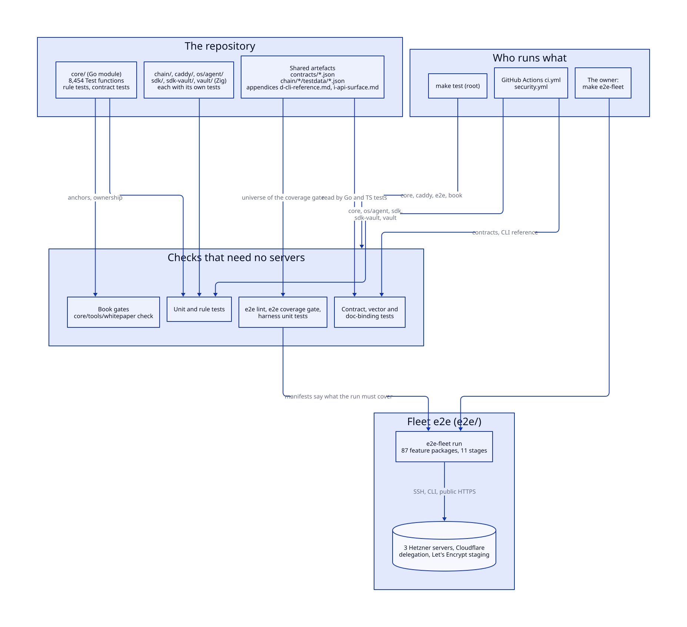
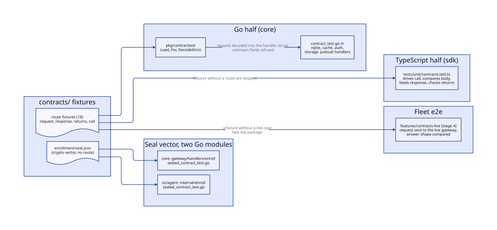
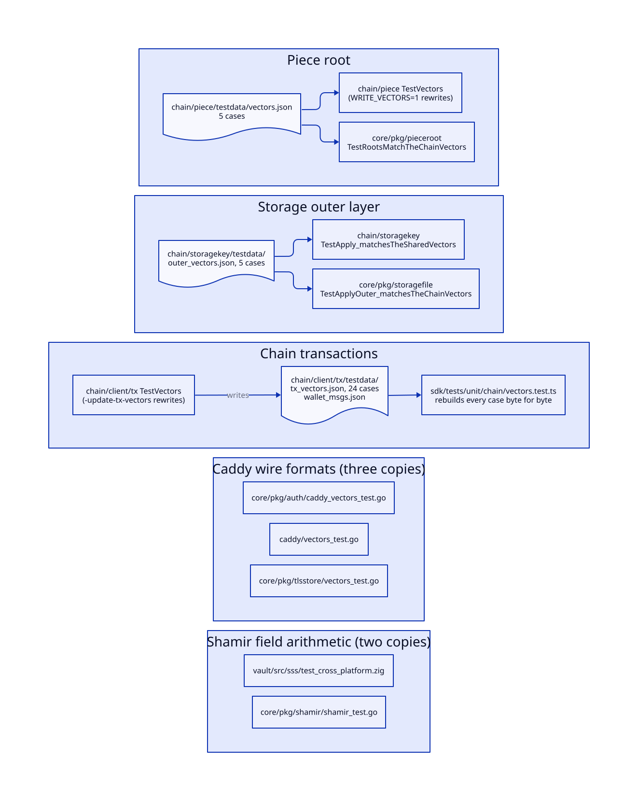
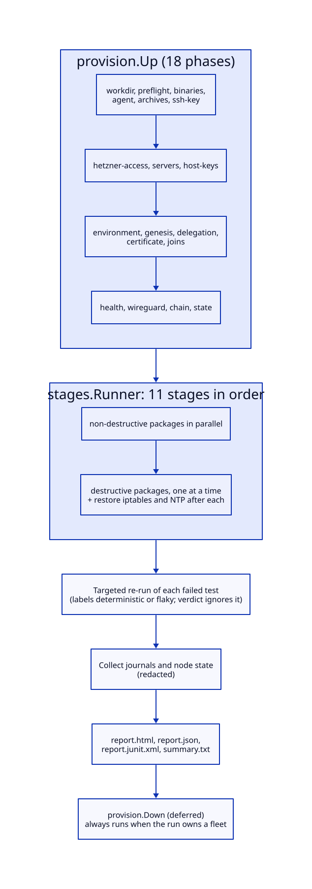
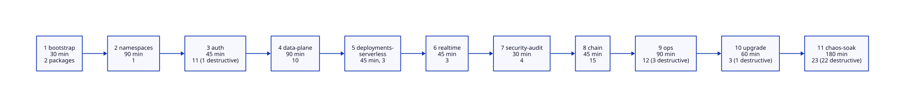
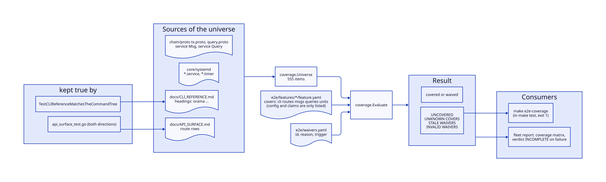
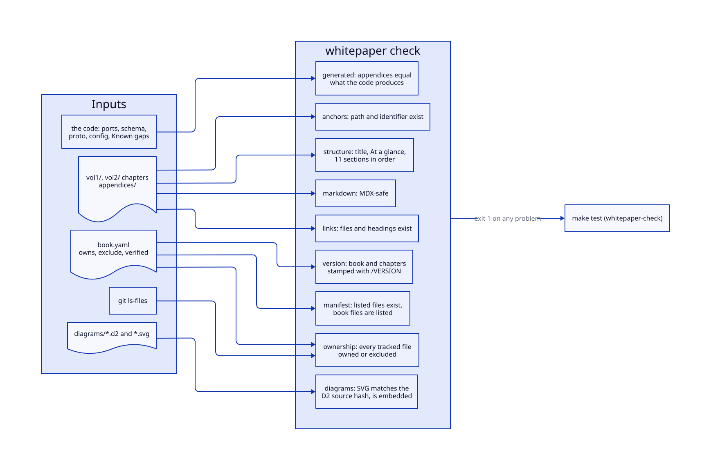
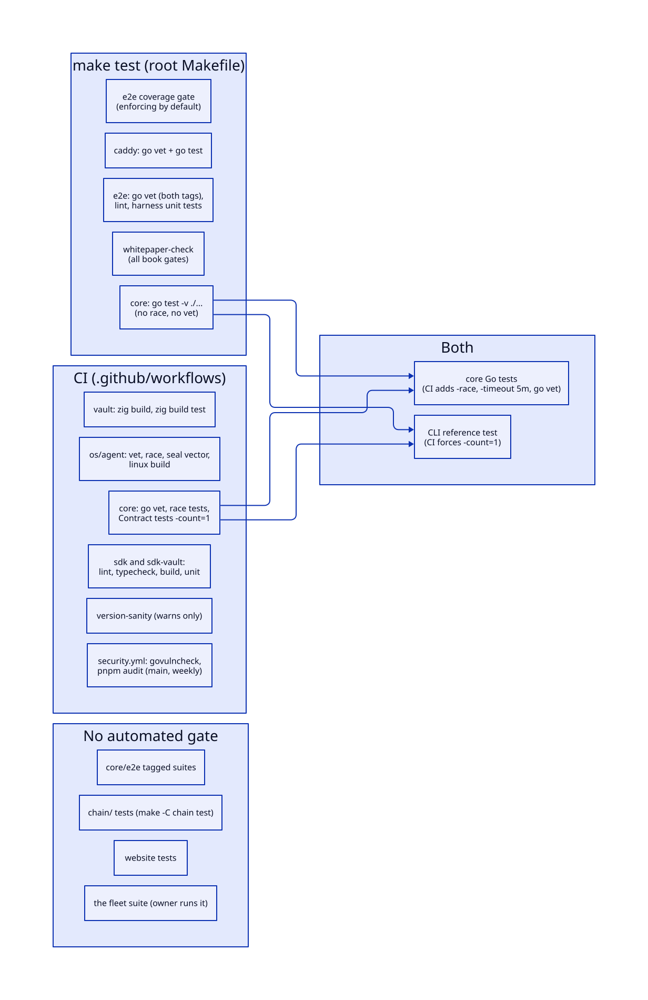
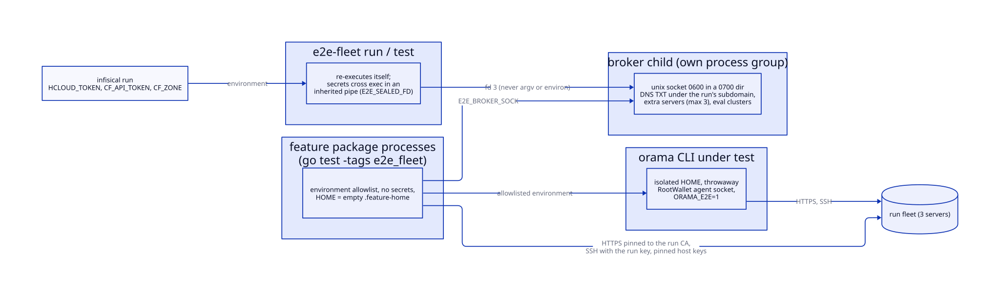

# Testing

> **At a glance.**
>
> - **What:** Orama is checked in layers that get more expensive as they get more real. Go unit tests and AST-walking rule tests run everywhere. Contract fixtures, cross-language vectors and doc-binding tests pin the places where two independent copies of one fact must agree. A set of gates that need no servers (the e2e lint, the e2e coverage gate, the book gates) keeps the manifests and documents complete. The fleet suite in `e2e/` is the release gate: it builds three fresh Hetzner servers, installs the cluster with the real CLI, runs 87 feature packages over 11 stages, writes a report and destroys everything.
> - **Key numbers:** 8,464 `func Test` declarations in 1,302 test files under `core/`; 19 files in `contracts/`; 87 fleet feature packages with 1,134 tests in 11 stages; a coverage universe of 555 items (232 CLI commands, 177 routes, 59 chain messages, 64 chain queries, 23 systemd units) with 1 waiver; stage budgets from 30 to 180 min and a worst-case plan of 5,465 min; 3 servers of type `cx23`; 16 concurrent namespaces; exit codes 0 PASS, 1 FAIL, 3 INCOMPLETE.
> - **Code:** `e2e/` (the fleet module), `core/e2e/` (older suites against an existing environment), `contracts/` and `core/pkg/contracttest/` (shared fixtures), `core/pkg/srcscan/` (source-walking tests), `core/tools/whitepaper/` (the book gates), `.github/workflows/` and the two Makefiles (what runs where).
> - **Depends on:** [the CLI](35-the-cli.md) and [the SDKs](36-sdks.md) for the surfaces the fixtures bind, [build, signing and release](29-build-signing-and-release.md) for the archive the fleet installs, [authorization](14-authorization.md) for the route policy the rule tests guard.



## Why it exists

Three properties of the code base shape how it is tested.

First, one fact often lives in two places that cannot import each other. The gateway and the TypeScript SDK share request bodies. The gateway and the OramaOS agent are separate Go modules that both compute an enrollment seal. Caddy's modules sign calls to the gateway with a construction written twice. The chain and the core both compute piece roots. A unit test written against one side cannot see the other side move, and the failure that results looks like a network problem in production. The fixtures and vectors below exist because "a field renamed on one side and not the other reached production" is a sentence the code comments use (`core/pkg/contracttest/contracttest.go`).

Second, documents are part of the interface. The CLI reference, the gateway route table and the authentication error codes are read by clients and by the coverage gate. A document that drifts is a wrong interface, so the tests generate or cross-check the documents instead of trusting authors.

Third, most failures that matter cannot be seen on one machine. Raft quorum, WireGuard mesh formation, ACME issuance through a real delegation, rolling upgrades and node loss only exist on several servers with real DNS. The change-287 stability audit's findings "all had to be established by reading code: nothing could observe them", which is the reason the lifecycle harness and later the fleet suite exist (`docs/DEV_DEPLOY.md`, "Lifecycle harness"). Such a run costs money and tens of minutes, so it is a release gate the owner runs, not a check every push pays for. The cheap layers have to make that expensive layer trustworthy: the coverage gate fails the cheap build when a shipped command or route has no fleet test, so completeness of the fleet suite is checked without servers.

## The model

**Unit test.** A Go, TypeScript or Zig test that needs no network and no other process. The bulk of the 8,464 core tests.

**Rule test.** A test that guards a property of all code, including code not yet written, by walking source instead of driving behaviour. `==` and `subtle.ConstantTimeCompare` give the same answers, so no behavioural test can tell them apart; a test that parses the package can. Nine tests in eight files use `core/pkg/srcscan/`, and several more walk files or route tables.

**Contract fixture.** A JSON file under `contracts/` holding one route's request, response and the SDK call that produces the request. Read by Go, TypeScript and the live fleet.

**Vector.** A fixed input with its expected output, checked into more than one implementation of the same construction.

**Doc binding.** A test that fails when a document and the code disagree: generated (the CLI reference), cross-checked in both directions (the route table), or executed (the cluster guide).

**Gate.** A command that exits non-zero on a violation: `make e2e-coverage`, `make e2e-lint`, `make whitepaper-check`. A report is not a gate; the fleet run's verdict becomes an exit code but only the owner reads it.

**Fleet, run, feature package.** The fleet is the three servers one run creates. A run is one `e2e-fleet run`, identified by an 8-character id of lowercase letters and digits (`e2e/harness/provision/config.go`). A feature package is one directory under `e2e/features/` (its name is the feature id): a `feature.yaml` manifest and `go test` files behind the build tag `e2e_fleet`.

**Manifest, covers, universe, waiver.** The manifest names the package's stage, whether it is destructive, what extra servers it needs, and under `covers:` the shipped things its tests exercise. The universe is every CLI command, route, chain message, chain query and systemd unit the code ships. A waiver (`e2e/waivers.yaml`) says why an item has no test yet and what event ends the excuse.

**Stage.** One of 11 ordered groups of packages with a shared time budget (`e2e/stages/stages.yaml`).

**Evidence, verdict.** Evidence is the redacted record of every CLI call, HTTP exchange and SSH command a test made. The verdict is PASS, INCOMPLETE (nothing failed, something was not covered) or FAIL.

### The layers

| Layer | Where | Needs | Run by |
|---|---|---|---|
| Unit and rule tests | `core/`, `chain/`, `caddy/`, `os/agent/`, `sdk/`, `sdk-vault/`, `vault/` | the toolchain | developer, `make test`, CI (module by module, see below) |
| Contract fixtures and vectors | `contracts/`, `chain/*/testdata/` | the toolchain | same |
| Doc bindings | `core/cmd/orama/`, `core/pkg/gateway/`, `sdk/tests/unit/`, `core/e2e/clusterguide/` | the toolchain | same |
| Fleet gates without servers | `e2e/lint/`, `e2e/harness/coverage/`, `e2e/harness/` unit tests | Go | `make test` |
| Book gates | `core/tools/whitepaper/` | Go and git | `make test` |
| Older suites | `core/e2e/` behind build tags | an existing environment | by hand |
| Fleet suite | `e2e/features/` | Hetzner and Cloudflare credentials | the owner, `make e2e-fleet` |

The sections below take each layer in turn and then say precisely which of them `make test` and CI run.

## How it works

### Unit tests and rule tests in core

`core/` has no test framework beyond `testing`. Files carry build tags only for platform code (`unix`, `linux`, and their negations) and for the opt-in suites: `netns_integration` for the co-located network namespace layout (`make -C core test-netns`, root and Linux only), `lifecycle`, `e2e`, `e2e_cluster` and `production`.

The rule tests are the part with a design behind them. `core/pkg/srcscan/srcscan.go:ParseNonTest` parses every non-test `.go` file directly in a directory, comments included, ignores build constraints, and returns the syntax trees by path. A directory that does not exist is an error satisfying `errors.Is(err, os.ErrNotExist)`. Each rule test then walks the trees for one property:

| Test | Property it holds |
|---|---|
| `TestEveryDispatchInThisPackageIsMarkedGatewayStarted` (`core/pkg/serverless/triggers/system_originated_test.go`) | every invocation the trigger package makes says it is gateway-started, so a cron fire is not refused at the caller check (the bug was a trigger failing "unauthorized" every minute for 19 hours) |
| `TestSystemOriginated_isOnlySetByGatewayInternalDispatchers` (`core/pkg/serverless/invoke_system_trigger_test.go`) | the system-originated flag, which skips the caller check, is set only by internal dispatchers |
| `TestEveryProxyHopSignsWhatItAsserts` (`core/pkg/gateway/internal_auth_hop_test.go`) | a proxy hop that sets the internal-auth headers also stamps a MAC over them |
| `TestEveryCredentialCallSiteReportsRefusalProperly` (`core/pkg/gateway/handlers/auth/credential_error_test.go`) | every handler that asks for a credential routes the refusal through one writer, so none turns a 403 into a 500 |
| `TestOwnershipIsCheckedBeforeAnythingIsIssued` (same file) | the namespace ownership check precedes issuing a token or provisioning a cluster, because a 403 after the fact leaves the damage behind |
| `TestRefusals_allGoThroughTheCodedWriter` (`core/pkg/gateway/auth_errors_test.go`) | a 401 or 403 always carries a code |
| `TestSimpleKeyRouteIsGone` (`core/pkg/gateway/simple_key_removed_test.go`) | the route that let a runtime key mint an admin key is not registered |
| `TestQueryStringCredentials_areReadInOnePlaceOnly` (`core/pkg/gateway/apikey_registry_test.go`) | an API key or token in a query string is read in one extractor only (`auth/apikey_request.go`) |

Other rule tests walk files without `srcscan`. `core/pkg/constants/no_legacy_ports_test.go:TestNoLegacyPortLiterals` walks every Go file under `core/` and fails on the pre-migration index ports 5001, 6001, 7001, 3320 and 4501 used as an address or a bare literal, comments included, with one allowed history file (`core/pkg/install/firewall_legacy.go`). The port move had left every operational tool that used a literal silently broken, and one failing unsafe. The route policy tests (`core/pkg/gateway/route_policy_test.go`) check that every registered route is declared in the policy table, that the set of public routes is the one that was reviewed, and that no public route carries a requirement that cannot run; `core/pkg/gateway/routepolicy/policy.go` itself panics at registration on an undeclared pattern, so the test and the panic cover the same table from two sides ([authorization](14-authorization.md) explains the table).

The shape of every rule test is the same: the comment names the incident, and the test walks the source because "the risk is a new dispatcher added later, and a new dispatcher is precisely what a test of the existing ones does not cover". The route-table tests guard against scanning nothing: `TestEveryRegisteredRouteIsDocumented` fails below 100 routes with "the collector is broken, not the gateway".

### Contract fixtures

`contracts/` holds 19 JSON files: `auth` (4), `cache` (4), `db` (7), `storage` (1), `pubsub` (1), `network` (1) and `enrollment` (1). Eighteen are route fixtures. A fixture records `route`, `method`, the SDK method name `sdk`, the Go struct `goStruct`, a `call` that tells the TypeScript test how to drive the SDK (null when no single call produces the request), the `request` body, the `response` body and what the SDK method `returns`. `contracts/README.md` documents the format.



Each fixture is read three times.

The Go half loads fixtures with `core/pkg/contracttest/contracttest.go:For` (by name prefix) and calls `Fixture.DecodeStrict`, which decodes `request` into the handler's own struct with `DisallowUnknownFields`. An unknown field means the SDK sends something the gateway silently drops. The five handler packages that own fixtures (`core/pkg/rqlite/contract_test.go`, and the `contract_test.go` files in the cache, auth, storage and pubsub handlers) switch on `fixture.Route` to pick the struct and call `t.Fatalf` on a route they do not know, so a new fixture cannot be added without teaching the Go side. A second test per package asserts the fields the handler needs actually arrive (a non-empty `sql`, a non-empty table), because a body can decode and still be refused. `contracttest.Dir` finds the fixtures by walking up to a directory holding both `contracts/` and `docs/`, since a directory named `contracts` under `core/` would be found first from any test under `core/pkg`.

The TypeScript half is `sdk/tests/unit/contracts.test.ts`. It builds a client over a fake `fetch`, drives the method named in `call`, asserts the body it sent equals `request`, feeds `response` back and asserts the result equals `returns`. It filters out any file without a `route`, which is how `enrollment/seal.json` stays in the same directory.

The live half is the fleet feature `contracts-live` (stage 4). It sends each fixture's request to the live gateway with only unusable placeholders replaced (a real wallet and signature, a real refresh token, a real CID, a Tor-reachable URL) and compares the answer's shape with `response`. A fixture without a live case fails the package, so a new contract cannot skip the live check (`e2e/features/contracts-live/feature.yaml`).

`contracts/network/proxy-anon.json` has no Go struct test: the anonymity proxy request is checked by the SDK and by the live fleet only.

`contracts/enrollment/seal.json` is a different kind of file. The gateway (`core/pkg/gateway/handlers/enroll/sealed_contract_test.go`) and the OramaOS agent (`os/agent/internal/enroll/sealed_contract_test.go`) are separate Go modules and each carries a copy of the seal. The vector names the algorithm (HKDF-SHA256 with no salt and info `orama-enrollment-seal-v1`, 32-byte output, AES-256-GCM, base64 of nonce, ciphertext and tag), a code, the derived key and a plaintext. Each side derives the key from the code and compares, and round-trips the plaintext. An agent that derived a different key would fail every enrollment in a way that looks like the network.

These tests read files above their Go module. Go's test cache keys on files inside the module, so a fixture-only edit leaves a cached pass in place. That is why `make -C core test-contracts` and the CI step both run `go test -count=1 -run Contract ./...`.

### Cross-language vectors

Vectors differ from fixtures in having no route. They pin a byte-level construction that exists in more than one language or module.



| Vector | File | Checked by | Regenerated by |
|---|---|---|---|
| Piece root and proofs (5 cases, 64 GiB proof size 1,856) | `chain/piece/testdata/vectors.json` | `chain/piece/piece_test.go:TestVectors`, `core/pkg/pieceroot/commit_test.go:TestRootsMatchTheChainVectors` | `WRITE_VECTORS=1 go test` in `chain/piece` |
| Storage outer layer (5 cases) | `chain/storagekey/testdata/outer_vectors.json` | `chain/storagekey/outer_test.go:TestApply_matchesTheSharedVectors`, `core/pkg/storagefile/outer_vectors_test.go:TestApplyOuter_matchesTheChainVectors` | no generator; edited with the construction |
| Chain transactions (24 cases, with the signing key, chain id, account number, sequence, gas and fee) | `chain/client/tx/testdata/tx_vectors.json`, `wallet_msgs.json` | `chain/client/tx/vectors_test.go`, `sdk/tests/unit/chain/vectors.test.ts` | `go test ./client/tx -run TestVectors -update-tx-vectors` in `chain/` |
| Caddy and tlsstore wire formats | constants repeated in `caddy/vectors_test.go`, `core/pkg/tlsstore/vectors_test.go`, `core/pkg/auth/caddy_vectors_test.go` | all three | by hand, in all three |
| Shamir field arithmetic | numbers repeated in `vault/src/sss/test_cross_platform.zig` and `core/pkg/shamir/shamir_test.go` | both | by hand |
| Enrollment seal | `contracts/enrollment/seal.json` | gateway and `os/agent` (above) | by hand |

The chain transaction vectors are the strongest. The Go builder writes every case: the unsigned `SignDoc`, the signature and the transaction bytes. The TypeScript test rebuilds each case with `LocalSigner` and requires the same bytes, requires at least 15 cases, and checks that a transaction fails verification under another chain id or account number. `wallet_msgs.json` lists every message the chain registers for the wallet, and the SDK must decode all of them.

The Caddy vectors exist because the Caddy module is its own Go module (`caddy/go.mod`) that cannot import core. It derives the store's MAC and seal keys from a 32-byte master key, opens a `v1.` sealed value that core produced, and computes the same coordination MAC (version 2) and ACME provider signature. Each copy says in a comment that it is mirrored, "a drift on either side fails a test instead of a renewal on a node". The values are repeated constants, not a shared file, so adding a vector in one place does not add it in the others. The same holds for Shamir: both Go and Zig tests carry sampled exp-table, multiplication, inverse, division, polynomial and Lagrange-combine values, and the Zig test names say the numbers came from the TypeScript implementation, which itself has no vectors ([the vault](28-vault.md) states the same).

### Doc-binding tests

| Document | Test | Mechanism |
|---|---|---|
| `docs/CLI_REFERENCE.md` | `core/cmd/orama/reference_test.go:TestCLIReferenceMatchesTheCommandTree` | renders the cobra tree and compares; `make -C core docs` rewrites it with `-update-cli-reference` |
| Appendix D of this book | `core/cmd/orama/book_reference_test.go:TestBookCLIReferenceMatchesTheCommandTree` | renders the same cobra tree for the book (MDX-safe, long help fenced) and compares; `make -C core docs` rewrites it together with `docs/CLI_REFERENCE.md` |
| `docs/API_SURFACE.md` | `core/pkg/gateway/api_surface_test.go` | `TestEveryRegisteredRouteIsDocumented`, `TestEveryDocumentedRouteExists`, `TestEveryDocumentedRouteHasAnOwner` (owner is one of SDK, CLI, internal, direct); routes are collected by parsing `core/pkg/gateway/routes.go`, the serverless `routes.go` and the rqlite gateway's own `Routes()` |
| `docs/AUTH.md` error codes | `core/pkg/gateway/auth_codes_doc_test.go:TestAuthCodes_areAllInTheDocs` | every UPPER_SNAKE wire code constant in seven Go files must appear in backticks |
| SDK error codes | `sdk/tests/unit/auth-codes-parity.test.ts` | reads three Go sources and requires the `AuthCode` list to name every code the gateway can send |
| SDK scopes | `sdk/tests/unit/scopes-parity.test.ts` | reads `core/pkg/gateway/auth/scopes.go`; the constants and the `knownGrants` map a mint request is validated against must match |
| SDK docs | `sdk/tests/unit/docs-parity.test.ts` | every method `docs/TS_SDK.md`, `sdk/README.md` and `sdk/QUICKSTART.md` name must exist on the client |
| `docs/RUN_YOUR_OWN_CLUSTER.md` | `core/e2e/clusterguide/guide_test.go:TestPlanMatchesTheGuideOnDisk` | parses the page's command blocks and requires them to equal `Plan()` in `core/e2e/clusterguide/plan.go`, with flags and example values the fixture can bind |
| claims in many documents | fleet features `docs-claims` and `docs-examples` (stage 9) | pure-file checks against the checkout and live checks against the fleet; every `orama` command line in a shell block is validated against the binary; whole Go programs are built against the checkout |

The generated CLI reference and the route table have a second use: they are the sources of the fleet coverage universe, so a command or route cannot exist without first being in a document that a test already forces to be true.

The cluster guide has a second half behind the build tag `e2e_cluster`. `make e2e-cluster` (root) runs `TestRunYourOwnClusterGuide_executedStepByStep` against machines you supply: it installs the first node, prints the delegation, joins two more, runs `orama network use`, `orama auth login`, `orama namespace create`, deploys a static site and checks `orama status --json`. It needs `E2E_CLUSTER_BASE_DOMAIN` (it exits 2 with usage without it) and a 100-minute timeout, and it is never part of `make test`. A `use-only` mode skips the install and runs the second half against an existing cluster, such as an `orama maint sandbox` cluster (five Hetzner servers, two of them nameservers on floating IPs, `core/cmd/orama/internal/sandbox/create.go:phase1ProvisionServers`).

### The older suites in core/e2e

`core/e2e/` predates the fleet suite and runs against an environment that already exists. Its tagged tests read the gateway URL from `ORAMA_GATEWAY_URL`, then `GATEWAY_URL`, then the active `orama` environment, then the gateway config (`core/e2e/env.go:GetGatewayURL`), sign in a fresh wallet to obtain an API key, and exercise `cluster`, `deployments`, `integration`, `shared` and (with the extra tag `production`) `production` packages. `core/Makefile` has one target per slice with its own timeout: `test-e2e` 30 min, `test-e2e-deployments` 15, `test-e2e-fullstack` 20, `test-e2e-https` 10, `test-e2e-shared` 10, `test-e2e-cluster` 15, `test-e2e-integration` 20, `test-e2e-production` 15, `test-e2e-quick` 5.

`core/e2e/lifecycle/` drives a real three-node cluster only through the `orama` CLI and observes it only through `orama status report --json` and `dig`: reboot one node, reboot all three, kill a voter, join a fourth, decommission, a rolling upgrade with one node broken, and the index RQLite down everywhere. Destroying a VM, breaking an upgrade and creating a VM have no CLI equivalent, so the operator supplies them as commands in `ORAMA_LIFECYCLE_DESTROY`, `ORAMA_LIFECYCLE_BREAK` and `ORAMA_LIFECYCLE_PROVISION`; a scenario whose hook is unset skips. The fleet runner maps these hooks to `e2e-fleet hook`. The convergence predicates (`Converged`, `LeaderAgreement`, `Forgotten`, `Serving`) carry no build tag and are unit-tested against recorded report shapes, so the harness cannot pass by asserting nothing. `make -C core test-lifecycle` refuses to run without `ORAMA_LIFECYCLE_ENV` and the harness refuses the names testnet and mainnet.

None of these suites is part of any automatic gate. Their untagged parts (the guide plan test, the lifecycle predicates) run in `go test ./...`.

### The fleet suite

`e2e/` is its own Go module (`e2e/go.mod`, module `github.com/DeBrosOfficial/network/e2e`) that replaces the core module with `../core`, so feature tests build the product's own code. The runner is `e2e/cmd/e2e-fleet` with the commands `run`, `provision`, `test`, `teardown`, `sweep`, `sweep-namespaces`, `report`, `coverage`, `target`, `hook` and an internal `broker-serve`.



#### Provisioning a fleet

`provision.Up` runs 18 phases in order, each of which can be planned without executing (`e2e/harness/provision/plan.go:phases`):

1. `workdir`: a 0700 work dir and artifact dir. The work dir defaults to `orama-e2e-<run>` under the temp dir and must be a real directory owned by the runner.
2. `preflight`: the Hetzner location (default `nbg1`) and server type (default `cx23`, at least 2 cores, 2 GB of memory and 10 GB of disk) exist, the project can hold three more servers within its limit (`E2E_SERVER_LIMIT`, default 10) and has none labelled with this run, and the Cloudflare zone holds no record under the run's subdomain.
3. `binaries`: builds the `orama` CLI from the checkout, and the previous release's CLI when `E2E_PREVIOUS_ARCHIVE` is `ref:` plus a git ref (any other value is an archive path that must be signed by the test wallet).
4. `agent`: `rw init` a random wallet and start `rw-agent-headless` with only the named binaries pre-approved ([the CLI](35-the-cli.md) covers the agent protocol). This wallet is the run's operator.
5. `archives`: `orama maint build` the HEAD archive, signed through the test agent, and the previous archive when configured.
6. `ssh-key`: an ed25519 key for the run and an empty `known_hosts`.
7. `hetzner-access`: registers the SSH key and a firewall that admits SSH only from the runner's CIDR (`E2E_RUNNER_CIDR`) unless `E2E_ALLOW_OPEN_SSH=1`.
8. `servers`: generates a host key for each server before it exists, passes it in user data, and creates `node-1` to `node-3` (plus an optional probe server in another location).
9. `host-keys`: confirms each sshd presents exactly the generated key.
10. `environment`: `orama network add e2e-<run>` with the gateway URL and a CA file, then `orama network use`.
11. `genesis`: `orama node setup --genesis` on `node-1` as a nameserver with `--acme-ca letsencrypt-staging` and the archive.
12. `delegation`: reads the claimed nameserver slots and writes NS and glue records for `e2e-<run>.dbrsteting.bid` at Cloudflare.
13. `certificate`: waits until `node-1` serves a staging certificate for the run's domain.
14. `joins`: `orama node setup --join-via node-1` for `node-2` then `node-3`, updating the delegation after each.
15. `health`: `orama auth login`, then polls `orama status report --json` until every node is healthy.
16. `wireguard`: reads each node's overlay address.
17. `chain`: `e2e/scripts/chain-deploy.sh up` installs co-hosted validators on the three nodes with the chain id `orama-devnet-e2e-<run>`, a 60 s epoch and a minimum of 5 blocks, plus the chain indexer beside each node.
18. `state`: writes the fleet state file.

With `E2E_INSTALL_PREVIOUS=1` the genesis and joins use the previous release's CLI and archive, so the upgrade stage starts from a real N-1 fleet. Any phase failure tears down what the run created. A checkpoint after every phase saves the state once there is something to tear down.

The harness is what makes this a test and not a script. The packages under `e2e/harness/` are:

| Package | Role |
|---|---|
| `provision`, `hetzner`, `cloudflare`, `agent`, `sshx` | create the fleet, the delegation, the throwaway wallet and the pinned-host-key SSH |
| `stages`, `gotest`, `manifest`, `coverage`, `report`, `artifacts`, `evidence` | plan and run stages, parse `go test -json`, load manifests, evaluate the gate, write the report, collect journals, record exchanges |
| `fleet`, `gw`, `oramacli`, `ns`, `wallet`, `monitor` | what tests call: node helpers with verified cleanup, the pinned HTTP and WebSocket client, the CLI under test, namespace per test, signing identities, the cluster-settled predicate |
| `eventually`, `runctx`, `pace` | readiness polling, run-wide cancellation, client-side pacing under the gateway's credential limits |
| `secrets`, `broker`, `config` | redaction, the credential broker and the allowlist guards |
| `nsledger`, `vulnaccept` | the namespace leak ledger and the accepted-vulnerability list |

#### Stages and packages



| Stage | Name | Budget | Packages | Destructive | Examples |
|---|---|---|---|---|---|
| 1 | bootstrap | 30 min | 2 | 0 | `smoke`, `bootstrap` |
| 2 | namespaces | 90 min | 1 | 0 | `namespaces` |
| 3 | auth | 45 min | 11 | 1 | `auth-signin`, `auth-devices`, `cli-function` |
| 4 | data-plane | 90 min | 10 | 0 | `cache`, `storage`, `pubsub`, `sdk-ts`, `contracts-live` |
| 5 | deployments-serverless | 45 min | 3 | 0 | `deployments`, `serverless` |
| 6 | realtime | 45 min | 3 | 0 | `webrtc`, `push`, `anon-tor` |
| 7 | security-audit | 30 min | 4 | 0 | `security-audit`, `dns-tls` |
| 8 | chain | 45 min | 15 | 0 | `chain-core`, `chain-shielded`, `tor-network` |
| 9 | ops | 90 min | 12 | 3 | `install`, `monitoring`, `perf`, `scanners`, `docs-claims` |
| 10 | upgrade | 60 min | 3 | 1 | `rollout-upgrade`, `release-tuf` |
| 11 | chaos-soak | 180 min | 23 | 22 | `chaos`, `soak`, `rqlite-raft-destructive` |

The runner executes each package as `go test -tags e2e_fleet -json -count=1 -timeout BUDGET ./features/ID` in its own process group (`e2e/harness/stages/runner.go`). Non-destructive packages of a stage run in parallel; each destructive package runs alone after them, and after every destructive package the runner deletes the run's tagged `iptables` rules from every node and turns NTP back on where a test left it off. A failure never stops a later stage.

When a package spends its budget the runner sends SIGINT to its process group, so running tests finish and their cleanups restore the fleet, and SIGKILL `StopGrace` later (10 min, `e2e/harness/stages/exec.go:StopGrace`). `go test`'s own `-timeout` is the budget plus the grace, because a `go test` panic runs no cleanups. After the stages the runner re-runs each failed test once, alone, each with a 15 min budget, only to label the failure deterministic or flaky. The verdict ignores the re-run: a failure that passes the second time is still a failure. `e2e-fleet test --stage N` replaces only that stage in `stages-state.json`; `--resume` skips stages already completed; `--features a,b` runs only those packages and keeps the others' results.

The budgets are sized from the packages' own bounds (comments in `e2e/stages/stages.yaml`): the `chaos` and `soak` packages together need more than 150 minutes in the worst case, so stage 11 has 180. The worst case of the whole plan is the sum over stages of (destructive packages plus one for the parallel group) times (budget plus grace): 5,465 min, and the run's servers carry a TTL label of that plus 3 h, about 94 h (`e2e/harness/stages/stages.go:WorstCase`, `e2e/cmd/e2e-fleet/ttl.go`).

#### The feature package contract

A package is a directory under `e2e/features/`, named by the feature id, with a `feature.yaml`, a `main_test.go` calling `harness.Main(m)` and tests. `harness.Main` reads `E2E_FLEET_STATE`. Under the runner `E2E_STRICT=1` is always set, and a package started without state exits 1 instead of skipping all its tests, so a misconfigured run cannot be green by skipping everything. Outside strict mode every test skips (`e2e/harness/harness.go:Main`).

The manifest is decoded with unknown keys refused and one YAML document only, so a typo such as `cover:` cannot silently cover nothing (`e2e/harness/manifest/manifest.go:Parse`). Every `covers` kind has a shape the entry must match (`e2e/harness/manifest/validate.go`), a feature must list at least one thing, and `requires.extra_nodes` is 0 to 3.

`make e2e-lint` runs `go vet` with and without the tag and `e2e/lint`, which parses every feature and fails on:

- a feature without a valid manifest, a `TestMain` that calls `harness.Main`, or any test;
- a file without `//go:build e2e_fleet`;
- a test not named `Test{Function}_{scenario}`, or a `Test` function with the wrong signature, or a function that looks like a test but is not named `Test...` (it would never run);
- `time.Sleep`, `time.After`, `time.NewTimer`, `time.Tick`, `time.NewTicker` or `time.AfterFunc`: wait with `eventually.Require`, `Eventually` or `Poll`;
- a bare `t.Skip`, `Skipf` or `SkipNow`: use `harness.SkipNotApplicable(t, reason)`, which the report counts as not covered;
- a poll closure that returns a condition with an error built unconditionally, and a `t.Context()` used inside `t.Cleanup` (it is cancelled before cleanups run, so the request would fail at once and the cleanup silently do nothing).

Beyond the lint, the README contract (`e2e/README.md`) states the rules the helpers enforce: real paths only (requests go to the public name through DNS with TLS pinned to the run's CA over HTTP/1.1, logins are real signatures, operator actions go through the CLI under test, SSH observes nodes and injects failures but never sets up state the product should set up); every helper that changes a node registers a cleanup that restores it and verifies the restore; one namespace per test; destructive tests live in `destructive: true` packages.

Namespaces are the shared resource. `ns.New` creates one as a fresh wallet, waits until provisioning says ready and a real request through `ns-NAME.BASE` succeeds, and deletes it at cleanup, verifying the teardown. Each takes one fleet-wide live slot, shared across all packages through locked files in `ns-slots/`. The default cap is 20 port blocks per node times 3 nodes, divided by 3 nodes per namespace, minus 4 of headroom: 16 on three nodes (`e2e/harness/ns/semaphore.go:DefaultMaxLive`), overridable with `E2E_MAX_LIVE_NAMESPACES`. A test that needs several namespaces takes all its slots at once with `ns.Hold`, so it never holds some while waiting for the rest.

Credential calls are paced. The gateway allows 30 credential operations a minute with a burst of 10 per client address per gateway, and 10 challenges a minute with a burst of 5 per wallet (`core/pkg/gateway/gateway.go:configureRateLimiters`, `core/pkg/gateway/handlers/auth/wallet_rate_limit.go`). The runner is one address running many packages, so the limiter stays at the product's values (it is itself under test) and the harness paces itself below them: 24 a minute burst 8, and 8 a minute burst 4, in a token bucket shared by every feature process and CLI call through `pace-state.json` (`e2e/harness/pace/pace.go`). A 429 on a paced request is a `PacingError`, never retried. Rate-limiter tests use an unpaced client and live in destructive packages so they run alone.

#### The coverage gate



`e2e/harness/coverage/enumerate.go:Universe` builds the list of everything that ships, from four sources: the `### orama ...` headings of `docs/CLI_REFERENCE.md` (group commands included, because `orama app` printing its subcommands is part of what ships), the route rows of `docs/API_SURFACE.md` (paths as written; the document has no method column), the `Msg` service of every `tx.proto` and the `Query` service of every `query.proto` under `chain/proto`, and the `.service` and `.timer` files in `core/systemd`. A missing source is an error and so is a source yielding nothing: an empty universe would pass by covering nothing.

`coverage.Evaluate` matches the universe against the manifests' `covers` and `e2e/waivers.yaml`. The gate fails on:

- an item in no manifest and no waiver (UNCOVERED);
- a `covers` entry of an enumerated kind that matches no shipped item (UNKNOWN COVERS: a typo, or a removed command);
- a waiver for an item that is covered, or that no longer ships (STALE WAIVERS);
- a waiver missing its reason or trigger, or listed twice (INVALID WAIVERS).

The `config` and `claims` kinds have no enumerator. They are listed in the report, not judged. The current result is 232 CLI commands, 59 messages, 64 queries and 177 routes all covered, and 22 of 23 units covered. The one waiver is `unit:orama-namespace-sni-router@.service`: the SNI router is off by default and the harness cannot write `node.yaml` before install.

`make e2e-coverage` runs `go run ./cmd/e2e-fleet coverage` with `E2E_COVERAGE_ENFORCE` defaulting to 1 in the root `Makefile`, and the command itself enforces when the variable is unset (`e2e/cmd/e2e-fleet/steps.go:coverageEnforced`). Setting it to 0 makes the command print the failure and exit 0. The gate sits in `make test`, so a new command, route, message or unit fails the build until a feature package covers it or a waiver explains why not. What the gate cannot see is whether a listed test exercises the thing it lists: `covers` is a declaration.

#### Evidence, redaction and the verdict

Every CLI invocation, HTTP or WebSocket exchange, SSH command, file transfer and port forward is appended to the package's evidence file (`evidence/stage-NN-ID/ID.jsonl`), attributed to the test. For a failed test the report shows its last ten records. Redaction (`e2e/harness/secrets/redact.go`) masks the run's secrets, every credential the run mints (kept in a 0600 token registry beside the state), each node's own secrets (cluster secret, RQLite password, the secrets encryption key, TURN and API-key HMAC secrets, the swarm key) read once per node before anything is collected, and recognised shapes: authorization and cookie headers, JSON members whose key names a token, password, secret or key, `KEY=value` forms, URL credentials, PEM private keys, WireGuard keys, 64-hex EVM keys, mnemonics, JWTs and Orama API keys. A redactor holds at most 10,000 literal values and 100,000 token values and fails closed past either; when it cannot be loaded, a package's output is replaced by `[withheld: redaction failed]`.

Before teardown the runner collects journals of every `orama-*`, `caddy*`, `coredns*` and `wg-quick@*` unit, `orama node report --json`, listeners, WireGuard state without keys, firewall, disk, clock and chain status from every node, and `orama status report --json` and `orama maint inspect` from the runner (`e2e/harness/artifacts/artifacts.go`). A node whose secrets cannot be read is not collected from.

The artifact directory ends up with `report.html`, `report.json`, `report.junit.xml`, `summary.txt` and optionally Bugboard drafts. The verdict (`e2e/harness/report/build.go:verdict`) is FAIL when any test fails, a package fails as a whole (build error, `TestMain` exit, timeout), a package-level or run-level error exists (a failed teardown included). It is INCOMPLETE when nothing failed but a feature produced no result or ran no test, or any test was skipped or never ran, or the coverage gate failed. Otherwise PASS. The exit codes are 0, 3 and 1 (2 for usage). A skipped subtest of a passing test counts. A package during which the host running the suite slept for 30 s or more fails with "the host running the suite was asleep" instead of being taken for a verdict on the fleet (`e2e/harness/stages/suspend.go:SuspendTolerance`); on macOS the runner holds `caffeinate` for its lifetime.

#### Leak control and teardown

A namespace left behind keeps its port blocks on every node, so three layers stand behind each test's own cleanup. The teardown retries until its budget and notices a delete that answered an error but took effect. The namespace ledger records every harness-generated `e2e-` name before the namespace exists, and after every package exits (pass, failure, budget cut or kill) the runner removes the recorded namespaces that still exist with `orama cluster namespace remove ... --force` as the run's operator (`e2e/cmd/e2e-fleet/nsleftovers.go`). Finally `e2e-fleet sweep-namespaces` removes what the ledgers of dead runners still hold, skipping run directories whose `run.lock` is held.

Teardown of servers runs from a `defer` and after SIGINT, SIGTERM and SIGHUP; a second signal does not interrupt it. It deletes by label, reading each resource back and refusing unless it carries `e2e-run=RUN` and the name `e2e-RUN-...`. The `e2e-ttl` label lets `e2e-fleet sweep` remove servers, firewalls and SSH keys of a crashed run only when they are past their own TTL; `--max-age` under one hour is refused without `--force`. `--keep-on-fail` keeps a non-PASS fleet for debugging, but never one that fails the run guards.

#### Scanners and the stagenet target

The `scanners` feature (stage 9) runs `govulncheck`, `staticcheck` and `gosec` (high severity, high confidence) on the `core`, `chain` and `e2e` modules, the audit of the SDKs' production dependencies, a secret scan of the tree and of the built archive, a fuzz smoke, and the race detector over the packages that start the most goroutines (gateway, rqlite, namespace, node). `govulncheck` and `staticcheck` are pinned and run with `go run`, so the toolchain that builds the modules builds the scanner. `staticcheck` is built from `e2e/features/scanners/staticcheck.mod`, which pins v0.8.1 with a newer `golang.org/x/tools` because Go 1.27.2 writes export data older x/tools cannot read, and it runs with `-f json`: the only findings it lets through are SA1019 deprecations in files `protoc-gen-grpc-gateway` v1 generated (`e2e/harness/staticfind`). Reachable vulnerabilities are compared with `e2e/features/scanners/govulncheck-accepted.yaml`: a reachable finding that is not listed fails, a listed entry no longer reported is stale and fails, and an entry whose `review_by` has passed or is more than 90 days away fails (`e2e/harness/vulnaccept/`). A scanner that is not installed is not covered, never a pass.

The same runner can test an existing cluster. `e2e-fleet target stagenet --out FILE` writes a state describing the five stagenet nodes from local files and `ssh-keyscan`; `test` then runs stages against it. On that target the runner only tests: it never creates, sweeps or destroys a server, holds no cloud credential, starts no broker, and tests that need an extra server, a probe, the DNS broker or a release archive skip with `SkipNotApplicable`. The state is accepted only if it matches the pins in `e2e/harness/config/stagenet.go` exactly (environment, base domain, chain id pattern, the five addresses, agent socket and paths). The live-namespace cap there defaults to 4 (`ns.StagenetMaxLive`), because sixteen starved the shared nodes on 2026-09-30. Stages 10 and 11 disturb a live cluster and run only on purpose.

### The book gates

The book you are reading is tested like code. `core/tools/whitepaper check` (run by `make whitepaper-check`, part of `make test`) loads `docs/whitepaper/technical-reference/book.yaml`, lists tracked files with `git ls-files`, and runs these gates (`docs/whitepaper/technical-reference/README.md`):



| Gate | Fails when |
|---|---|
| version | `book.yaml` version or any chapter's `verified` is not `/VERSION` |
| ownership | a tracked file is explained by no chapter (`owns:`) and not excluded, or an `owns:` entry is too broad, duplicated or matches no file |
| anchors | a backticked path or `path:Identifier` does not exist, or the identifier is not a word in the file |
| structure | a chapter's title, At-a-glance block or the 11 level-2 headings depart from the skeleton |
| markdown | raw HTML, curly braces or a bare less-than outside code, footnotes, heading attributes |
| links | a link or image points at a missing file or heading |
| diagrams | an SVG is missing, stale against the SHA-256 stamped into it from its D2 source, unused, or has no source |
| generated | an appendix built from the code (ports, schema, chain messages, configuration, Known gaps) differs from what the code produces now |
| manifest | a listed file is missing, or a book file is not listed |

`whitepaper gen` rewrites the generated appendices; `whitepaper diagrams` renders stale D2 files and stamps the hash; `whitepaper build` typesets the PDFs with `pandoc` and `typst`. The check itself needs only Go and git, because the diagram gate compares stamps and does not run `d2`. `make -C core bump VER=X.Y.Z` changes `/VERSION`, and from that moment the version gate fails until every chapter is re-verified and re-stamped, so the book cannot lag a release. The gates have their own unit tests (`core/tools/whitepaper/gates_test.go`, `generators_test.go`), which `go test ./...` in `core` runs.

### What runs where

`make test` at the repository root is `core-test caddy-test e2e-lint e2e-coverage e2e-test-unit whitepaper-check` (`Makefile`). CI is `.github/workflows/ci.yml` plus `security.yml`. They overlap on the core module and little else.



| Check | `make test` | CI |
|---|---|---|
| `core` `go vet ./...` | no | yes |
| `core` `go test ./...` | yes, `go test -v ./...` (no race detector, Go's default timeout) | yes, `go test -race -timeout 5m ./...` |
| Contract tests with `-count=1` | no (`make -C core test-contracts` by hand) | yes |
| CLI reference with `-count=1` | only inside `./...`, cacheable | yes |
| `os/agent` module: vet, race tests, seal vector, linux build | no | yes |
| `sdk`: lint, typecheck, build, unit tests | no | yes |
| `sdk-vault`: lint, typecheck, build, unit tests | no | yes |
| `vault` (Zig 0.15.2): `zig build`, `zig build test` | no | yes |
| `caddy`: vet and tests | yes | no |
| `e2e`: vet both ways, lint, harness unit tests | yes | no |
| E2E coverage gate | yes (enforcing) | no |
| Book gates | yes | no |
| `chain` tests | no | no |
| Website tests | no | no |
| `govulncheck` on `core`, `pnpm audit --prod` on `sdk` | no | `security.yml`: pull requests and pushes to `main`, and Mondays 08:00 UTC |
| `/VERSION` against the two `package.json` files | no (a core test checks `version.txt`) | warns only |

CI triggers on pushes and pull requests to `main` and `nightly`, with the concurrency group cancelling superseded runs; `security.yml` does not trigger on `nightly`. The release workflows run no tests: `release.yaml` and `release-apt.yml` check that `/VERSION` matches the tag and then build, and `publish-sdk.yml` runs typecheck, build and unit tests before publishing both npm packages. The fleet suite is run by the owner with `make e2e-fleet` (Infisical supplies the secrets and `E2E_RUNNER_CIDR` is required). `core/.githooks/pre-push` runs `go test ./...` in `core`.

## State it owns

| What | Where | Written by | Read by |
|---|---|---|---|
| Contract fixtures | `contracts/*/*.json` | developers | Go contract tests, `sdk/tests/unit/contracts.test.ts`, `contracts-live` |
| Vector files | `chain/piece/testdata/`, `chain/storagekey/testdata/`, `chain/client/tx/testdata/` | the chain tests that regenerate them | core and SDK tests |
| Generated CLI reference | `docs/CLI_REFERENCE.md` | `make -C core docs` | the reference test, the coverage universe, Appendix D |
| Feature manifests | `e2e/features/*/feature.yaml` | developers | lint, the stage planner, the coverage gate, the report |
| Stage plan | `e2e/stages/stages.yaml` | developers | the runner (ids must run 1 to 11) |
| Waivers | `e2e/waivers.yaml` | developers | the coverage gate |
| Accepted vulnerabilities | `e2e/features/scanners/govulncheck-accepted.yaml` | developers | the `scanners` feature |
| Test app fixtures | `e2e/apps/` (7 apps) | developers | deployment, serverless and SDK features |
| Fleet state | `state.json` in the work dir | `provision.Up` | every feature process, `teardown`, `report` |
| Work dir | `orama-e2e-RUN` under the temp dir, mode 0700 | the runner | broker socket, `ns-slots/`, `pace-state.json`, token registry, the feature HOME |
| Artifact dir | `gotest/`, `evidence/`, `collected/`, `stages-state.json`, report files | stage runner, collector, report | the owner |
| Cloud resources | servers, firewall and SSH key labelled `e2e-run` and `e2e-ttl`; DNS records under `e2e-RUN.dbrsteting.bid` | provisioning and the broker | teardown and sweep |
| Namespace ledger | `namespaces.ledger` in each package's evidence dir | `ns.UniqueName` | the post-package remover, `sweep-namespaces` |
| Run lock | `run.lock` in the run directory | `run`, `test` (shared flock) | `sweep-namespaces` |

## Lifecycle

**A change.** A developer edits code; the unit tests, rule tests, fixtures and doc bindings run with `go test ./...` in `core` (the pre-push hook does this). If a command, route, chain message or unit is added or removed, `docs/CLI_REFERENCE.md` or `docs/API_SURFACE.md` must change in the same commit or a doc-binding test fails, and `make test` additionally requires a covering fleet feature or a waiver. A change to a documented behaviour must update the matching chapter or the book gates fail.

**A pull request.** CI runs the module jobs in parallel on `ubuntu-latest`. Darwin and other non-Linux code paths (files tagged `!linux`) build and test only on the developer's machine.

**A release.** `make -C core bump` changes the version; the book gate fails until each chapter is re-verified. Tag-triggered workflows build but do not test. The owner runs `make e2e-fleet` against the commit; the INCOMPLETE and FAIL verdicts decide whether to release. Nothing in the tree enforces that (see Known gaps).

**A fleet run.** Boot is the 18 provisioning phases. Normal operation is the stages. An interrupt (Ctrl-C, SIGTERM, SIGHUP) cancels the context, running tests finish and clean up inside their grace period, no failure is re-run and teardown still runs. A crash of the runner leaves labelled resources that `sweep` removes after their TTL. A run whose first server fails to create tears down only if it registered something under its label, so a run id already in use by another fleet is refused and never torn down.

**Mixed versions.** The upgrade stage (10) installs HEAD over the fleet; with `E2E_INSTALL_PREVIOUS=1` the fleet starts on the previous release, so `TestUpgrade_previousReleaseToHeadUnderTraffic` rolls N-1 to N under live namespace traffic ([rolling upgrades](31-rolling-upgrades.md)).

**Node loss.** Stage 11 and the `*-destructive` packages kill services, partition nodes with tagged `iptables` rules, skew the clock and reboot; each helper registers a cleanup that restores and verifies the previous state, and the runner sweeps rules and NTP after every destructive package even on interrupt.

## Failure modes

| Trigger | What the system does | What you observe |
|---|---|---|
| A CLI command, route, message or unit is added with no feature | the coverage gate lists it UNCOVERED | `make test` fails in `e2e-coverage`; fleet report verdict INCOMPLETE |
| A covered command is removed | `covers` entry matches nothing | UNKNOWN COVERS; also STALE WAIVERS if it was waived |
| `docs/CLI_REFERENCE.md` not regenerated | the reference test prints the first differing line | `go test ./cmd/orama` fails; fix with `make -C core docs` |
| SDK sends a field the gateway drops | `DecodeStrict` rejects the fixture | Go contract test names the SDK method |
| Fixture edited, test cached | out-of-module files are not cache inputs | a stale PASS unless `-count=1` (CI does this only for `Contract` tests and the CLI reference) |
| Package started without fleet state | `harness.Main` exits 1 in strict mode | package failure, never a silent skip |
| A test skips | counted as not covered | verdict INCOMPLETE, never PASS |
| A test fails once, passes on re-run | labelled flaky; verdict ignores the re-run | FAIL with a flaky count |
| Runner host sleeps 30 s or more | package fails with "asleep for" | failure that is not a fleet verdict |
| Package spends its budget | SIGINT to the group, SIGKILL after 10 min | overrun reported as an error, never a pass |
| Credential routes hit 429 under pacing | `PacingError`, not retried | the limiter regressed or something unpaced spent the budget |
| Delegation or certificate never appears | provisioning phase fails and tears down | no fleet, run error in the report |
| Hetzner project at its server limit | preflight refuses | named in the error |
| Redactor cannot load | package output replaced by `[withheld: redaction failed]` | no unredacted artifact is written |
| A node's secrets cannot be read | nothing is collected from that node | `nodes/NODE/withheld.txt` says why |
| Teardown fails | run error, exit 1, report rewritten | `TEARDOWN FAILED`; run `e2e-fleet sweep` |
| Namespace cleanup refused as temporary | retried 10 min per namespace, 30 per package | the package fails if it cannot remove it |

## Trust and security

**Secrets.** The run needs `HCLOUD_TOKEN`, `CF_API_TOKEN` and `CF_ZONE` from Infisical. The runner re-executes itself with them removed from its environment; they cross the `exec` in an inherited pipe (`E2E_SEALED_FD`) and live in memory. A broker child process, in a process group of its own, receives the two tokens on fd 3, serves a unix socket (mode 0600 in a 0700 directory) and performs only scoped operations: DNS TXT records inside the run's subdomain or a cluster subdomain (at most 64 held at once), and creation and removal of extras and eval clusters (at most `E2E_BROKER_MAX_SERVERS`, default 3). It ignores SIGINT so features can clean up through it. Feature processes start from an allowlisted environment (`stages.FeatureEnv`): never a cloud token, `INFISICAL_*`, `SSH_AUTH_SOCK` or `XDG_*`, with an empty `HOME` of their own.



**Never reach a real network.** Guards are allowlists. The Cloudflare zone must be exactly `dbrsteting.bid`; the CLI environment must start with `e2e-`; the base domain must be `e2e-RUN.dbrsteting.bid`; the chain id must contain `-e2e-`. Run ids, environments and domains containing testnet, mainnet, devnet or stagenet are refused (the chain id may contain devnet, because every run chain is one; `e2e/harness/config/config.go`). No `RW_AGENT_SOCK` may lie inside the real `~/.rootwallet`, checked by name and by file identity up every ancestor. Under `ORAMA_E2E=1` the CLI re-checks the socket at every dial and `orama maint node unlock` refuses to call `rw decrypt`. The guards run at preflight, after provisioning and on every state a command or package loads.

**The servers.** Firewall SSH comes from the runner's CIDR only. Each host key is generated before the server exists and pinned, so the first connection is not trust on first use. The key reaches the server in Hetzner user data, which any process on the server can read from the metadata service. Chain keys use the unencrypted `test` keyring, which `chain-deploy.sh` accepts only for a chain id containing `-devnet-`, and the e2e genesis enables the faucet.

**What a position can do.** A feature package, or a dependency it builds, runs as the owner's OS user. It cannot read the cloud tokens from its environment or from `/proc`, but it can read the owner's real `~/.rootwallet`, use an exported `ssh-agent`, and read other same-uid processes. `E2E_SANDBOX=1` (Linux with `bwrap`) hides the home behind a tmpfs and is best-effort. The residual list in `e2e/README.md` also names the `apps/next-ssr` fixture, whose `next` and `react` are pinned by version with no lockfile and installed by the deployment itself. The Hetzner project behind the token must be used only by e2e runs, because teardown and sweep delete by label.

**Tests as security controls.** Several rule tests exist because a defect was a security defect: constant-time secret comparison, MACs on proxy hops, the removed simple-key route, one reader for query-string credentials. They hold the property for code written later. They are checks on source, not proofs, and a rule test passes if the code it forbids is moved out of the directories it scans.

## Limits and scale

- **Counts.** 8,464 core tests run in `go test ./...`. CI gives each package 5 min under the race detector. `make test` runs without `-race`.
- **Fleet size.** Three nodes, 16 concurrent namespaces, at most 3 extra servers at once, and a Hetzner project limit of 10 servers by default. Stage 1 sets namespace creation to open for the whole run and raises the per-wallet namespace cap when needed; these two settings are the only state a test leaves changed, on a fleet that is destroyed afterwards.
- **Credentials.** Auth-heavy packages are bounded by 24 credential operations a minute, shared by the whole run.
- **Time.** Stage budgets sum to 750 min; the worst case with every destructive package serial is 5,465 min. Stage 11 is 4,370 of those minutes (23 packages at 190 min), so the serial destructive tail is the first bottleneck. A typical soak is 30 min by default (`E2E_SOAK_MINUTES`).
- **At 10x the surface.** The coverage gate is linear in the universe, and the universe grows with commands and routes: 10x features means roughly 10x manifests and, because destructive packages are serial, up to 10x the tail. Parallelism is capped by the 16 namespace slots and by the single runner machine. The model has no notion of which nodes a destructive package disturbs, so no two can run side by side.
- **At 10x the fleet.** The fleet is fixed at three core nodes by `nodeCount`; larger-fleet behaviour (voter caps, many nameservers) is tested only on the five-node stagenet target.
- **One provider.** Provisioning is Hetzner-only and delegation is Cloudflare-only.

## Design decisions

### Shared fixtures instead of per-side tests

**Chosen:** one JSON file read by Go, TypeScript and the live fleet. **Rejected:** unit tests on each side written against that side alone, with the live suite as the only check. **Why:** the live suite needs a cluster, and per-side tests cannot see the other side. A field renamed on one side reached production (`contracts/README.md`).

### Derive the coverage universe from generated documents

**Chosen:** the universe is read from `docs/CLI_REFERENCE.md`, `docs/API_SURFACE.md`, the proto files and `core/systemd`. **Rejected:** a hand-kept list of what ships. **Why:** the documents are already forced equal to the code by tests, so the gate needs no second enumerator and cannot disagree with the product (package comment of `e2e/harness/coverage/enumerate.go`).

### A skip is not a pass, and a re-run is not a fix

**Chosen:** every skip counts as not covered, the verdict is INCOMPLETE until nothing is skipped, and a failing test stays failed after a passing re-run. **Rejected:** treating a skip as neutral and retrying until green. **Why:** a green run that silently omitted a scenario is worse than no run; the same reasoning makes lifecycle scenarios with no hook skip instead of pass.

### Real paths only

**Chosen:** requests go to the public name through real DNS and TLS pinned to Let's Encrypt staging roots, logins are real signatures, operators use the CLI under test. **Rejected:** mocks for delegation, the CA or the wallet; setting up product state over SSH. **Why:** the surface under test includes the paths an operator uses, and a harness that reaches around the CLI "would test a path no operator runs" (`docs/DEV_DEPLOY.md`).

### Strict mode and fail-closed redaction

**Chosen:** `E2E_STRICT=1` makes a missing state an exit, and redaction withholds output when it cannot run. **Rejected:** skipping everything when unconfigured; writing output on a redactor failure. **Why:** a misconfigured run must not be green, and an artifact must not leak what it cannot prove it masked.

### Sealed secrets and a broker

**Chosen:** cloud tokens cross `exec` in a pipe and live in the broker child; features hold no token. **Rejected:** passing tokens through the environment. **Why:** an environment is inherited by every child and readable from `/proc`.

### Duplicate constructions, pin them with vectors

**Chosen:** Caddy, the OramaOS agent and core each carry their copy of a construction and a shared or repeated vector. **Rejected:** a shared module. **Why:** the modules are separate by design and cannot import each other; the vector turns drift from a production incident into a failing test.

### Rule tests walk source

**Chosen:** parse the package and assert on the syntax tree. **Rejected:** driving each existing dispatcher or handler. **Why:** the risk is the call site not yet written. The comment in `core/pkg/serverless/triggers/system_originated_test.go` says so.

## Known gaps

- **Chain tests are in no automated gate.** `chain/` is a separate module; the root `make test` and CI do not run it, only `make -C chain test` by hand. The chain side of the piece, storage and transaction vectors is therefore unchecked by automation, while the core and SDK sides are. Location: `Makefile`, `.github/workflows/ci.yml`.
- **CI lacks the no-server gates.** `ci.yml` does not run `caddy`, the `e2e` module's lint, coverage gate or unit tests, or the book gates, so a pull request can merge with a failing coverage gate or a broken anchor that `make test` would catch.
- **Cache can hide a vector change.** Only the `Contract` and CLI reference steps use `-count=1`. Tests that read files outside the `core` module (`core/pkg/pieceroot/commit_test.go:TestRootsMatchTheChainVectors`, `core/pkg/storagefile/outer_vectors_test.go:TestApplyOuter_matchesTheChainVectors`, the gateway seal test, `core/pkg/version/version_test.go`) can report a cached pass in CI after the file changes.
- **No fuzz targets exist.** `core/pkg` has no `Fuzz` function, so `e2e/features/scanners/dynamic_test.go:TestFuzz_targetsSmoke` always skips with `SkipNotApplicable`. A skip is not covered, so a fleet run reports INCOMPLETE at best until fuzz targets are added.
- **The release gate is not wired.** The `scanners` feature (`e2e/features/scanners/feature.yaml`) claims `release.sh` refusing a commit without a green fleet report; `core/scripts/release.sh` and the release workflows check no report and run no tests.
- **`e2e/README.md` is wrong about the coverage gate.** It says the gate is not blocking and that the Makefile sets `E2E_COVERAGE_ENFORCE ?= 0`. The root `Makefile` sets `?= 1` and `e2e/harness/config/config.go:EnvCoverageEnforce` is read as on by default. Fix the README.
- **Hooks cannot be installed.** `make -C core install-hooks` runs `scripts/install-hooks.sh`, which is not in the tree, so `core/.githooks` has no installer.
- **Hand-copied vectors.** The Caddy and Shamir vectors are repeated numbers, not shared files, and the Shamir comment in `core/pkg/shamir/shamir_test.go:TestExpTable_CrossPlatform` names `orama-vault/src/sss/test_cross_platform.zig`, a path that does not exist (`vault/src/sss/test_cross_platform.zig` is the file).
- **Coverage is a declaration.** The gate cannot tell whether a feature that lists a route calls it; a route touched only in a helper counts as covered.
- **Security CI is narrow.** `security.yml` audits only `sdk` and runs `govulncheck` only on `core`, and only for `main`; `chain`, `e2e` and `sdk-vault` are covered only when the owner runs the fleet `scanners` feature.
- **The `core/e2e` suites have no gate.** They run only by hand against an environment that must already exist, so nothing notices if they stop compiling under their tags.

## Verify it yourself

Pure-file checks that need no servers:

```bash
make test                                              # core, caddy, e2e lint/coverage/unit, book gates
make e2e-coverage                                      # the coverage gate on its own
cd e2e && go run ./cmd/e2e-fleet coverage --json       # the whole matrix
cd core && go test -count=1 -run Contract ./...        # fixtures, as CI runs them
cd core && go test -count=1 ./cmd/orama -run TestCLIReference
cd core && go test ./pkg/gateway/ -run 'TestEvery|TestRoutePolicy|TestAuthCodes'
cd sdk && pnpm test:unit                               # TypeScript halves
make whitepaper-check                                  # the book gates
```

Tests that exercise this subsystem: `e2e/lint/lint_test.go`, the `coverage` and `manifest` packages under `e2e/harness/`, `core/pkg/contracttest` through its five callers, `core/pkg/srcscan/srcscan_test.go`, `core/tools/whitepaper/gates_test.go`, `core/e2e/clusterguide/`, and `core/e2e/lifecycle/` predicates.

Fleet features that test the test tooling itself: `smoke` (stage 1, the pipeline end to end), `contracts-live`, `docs-claims`, `docs-examples` and `scanners`. The owner runs the whole suite with `make e2e-fleet E2E_RUNNER_CIDR=a.b.c.d/32`; do not start it as part of an agent task.

Read-only on a live setup: `e2e-fleet target stagenet --out FILE` reads only local files and `ssh-keyscan`; `e2e-fleet sweep-namespaces` is the only cleanup that works on a stagenet state.
