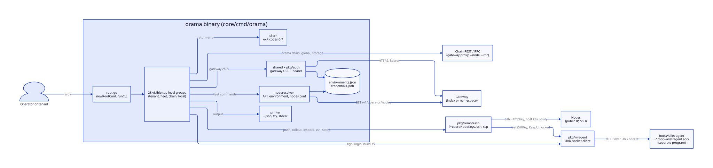
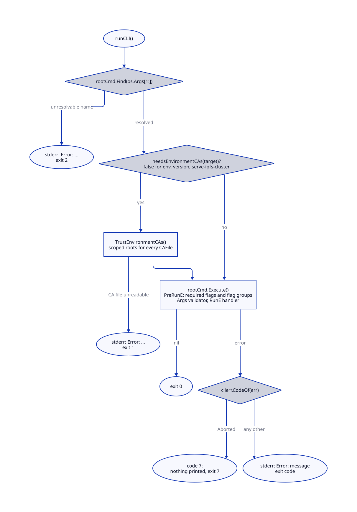
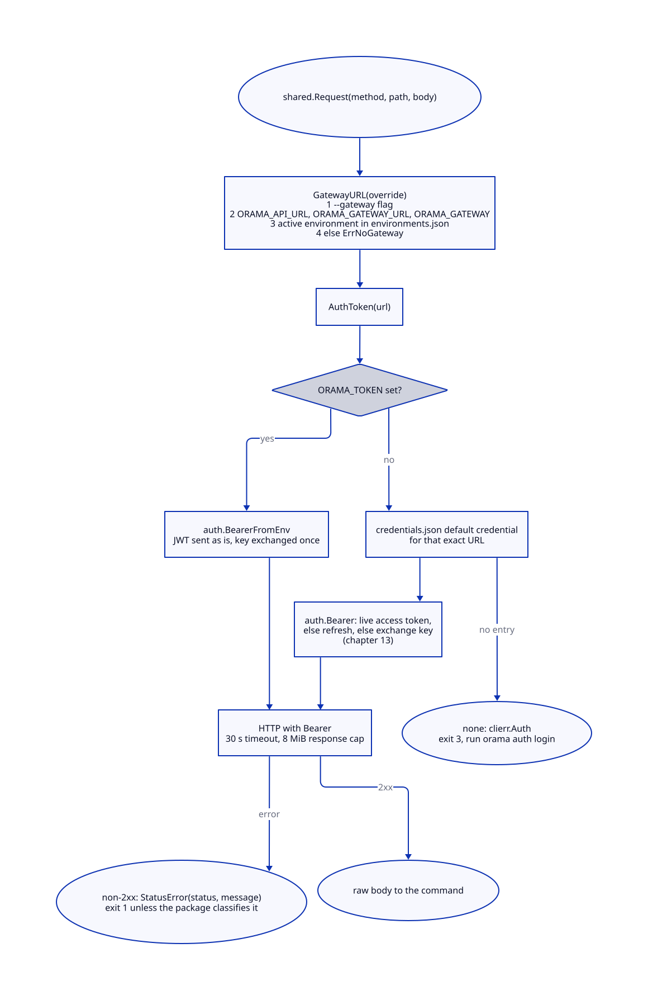
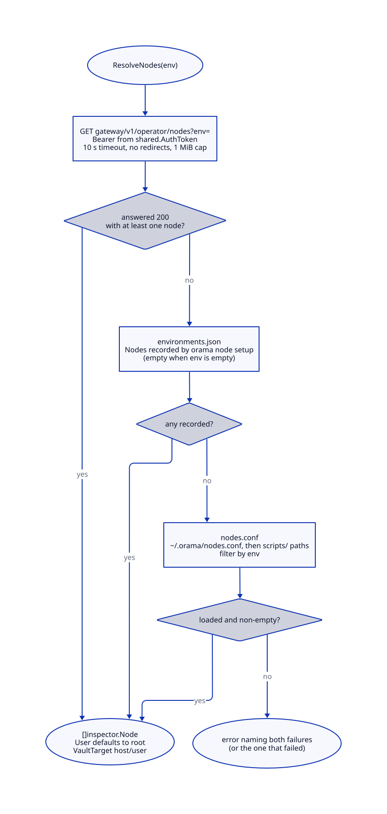
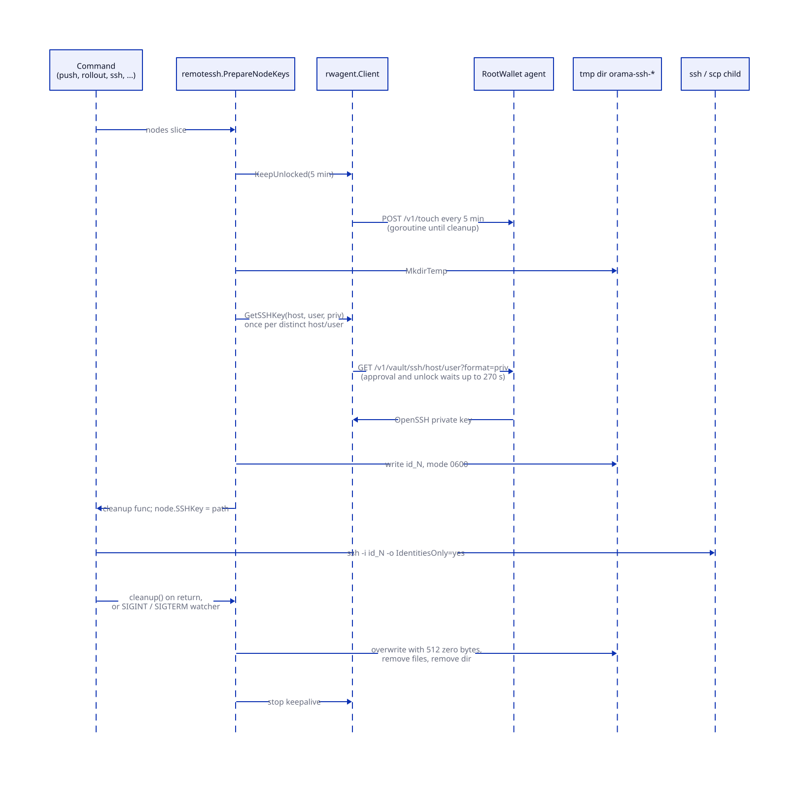

# The CLI

> **At a glance.**
>
> - **What:** `orama` is the one human interface to the network. A single Go binary, built on cobra, serves two audiences: tenants who run a namespace and operators who run nodes and the fleet. It never talks to a node's internals directly. It calls gateway HTTP routes with a short-lived bearer, reaches machines over SSH with keys that live in the RootWallet vault, and signs with the RootWallet agent. Programs use the SDKs and the gateway HTTP API instead; there is no dashboard and no Orama MCP.
> - **Key numbers:** 28 visible top-level command groups and 232 documented commands; 8 exit codes (0 to 7); gateway call timeout 30 s, response cap 8 MiB; node-list call 10 s and 1 MiB; agent request timeout 270 s (120 s approval plus 120 s unlock wait plus 30 s margin); agent keepalive every 5 min against a 30 min auto-lock; SSH connect timeout 10 s and a dead session declared after 60 s; credential and environment files 0600 in a 0700 directory.
> - **Code:** `core/cmd/orama/` (root, `internal/clierr`, `internal/printer`, `internal/shared`, `internal/noderesolver`, `internal/cmd/`), `core/pkg/rwagent/`, `core/pkg/remotessh/`.
> - **Depends on:** [identity](13-identity.md) for what the stored session is, [secrets and keys](16-secrets-and-keys.md) for the wallet's place in the trust model, [build, signing and release](29-build-signing-and-release.md) for the signed archive, [install and upgrade](30-install-and-upgrade.md), [rolling upgrades](31-rolling-upgrades.md) and [recovery](33-recovery.md) for the commands that do the work on nodes.



## Why it exists

An Orama cluster has no control panel. The website is a landing page, documentation, a blog and the chain explorer; tenant web and mobile apps are applications a tenant deploys and are not an Orama control plane. No MCP server exists for tenants or operators; agents read the published documentation. Every administrative act, from signing in to replacing a dead raft voter, therefore has one front door: the `orama` binary (`docs/CLIENT_SURFACE.md`).

Four constraints shaped it.

First, one binary serves two audiences. An operator also deploys apps, and a tenant who runs their own cluster is both. The design keeps both in `orama` and does not split an operator CLI from a tenant CLI, and no operator path is removed to make the tenant surface look smaller. The audiences are separated by what a command authenticates with, not by which binary holds it.

Second, the same file runs in two places. A machine with a wallet runs it to reach the fleet; a node runs its installed copy (`/usr/local/bin/orama`, `core/cmd/orama/internal/production/push/stage.go:NodeOramaBinary`) for the local commands that need root: `upgrade`, `start`, `stop`, `restart`, `doctor`, `report`, and, under `orama maint node`, `install` and `stage-archive`. Chapters 30, 31 and 33 describe what those do. This chapter describes the shell around them.

Third, the CLI holds no durable secret that a thief could use alone. It keeps a session (an access token and a rotating refresh token) in a 0600 file, but the long-lived material, the wallet seed and every SSH private key for every node, stays in the RootWallet vault and reaches the CLI for the length of one operation. A stolen laptop disk yields a session that the gateway can revoke, not the fleet.

Fourth, a script must be able to tell why a command failed. A mistyped flag, a locked wallet, a gateway that is down and a cluster that refused to lose quorum are four different situations and a caller does something different in each. Every failure used to be `os.Exit(1)` from inside a handler; the exit-code scheme below exists because that made the first thing a script had to do parse an English sentence (`core/cmd/orama/internal/clierr/clierr.go`, package comment).

## The model

**Command group.** A top-level cobra command and everything under it. The binary registers 14 groups that `orama --help` lists, 8 more that it hides (`maint`, the operator groups `node`, `global`, `cluster`, `chain`, `monitor` and `nodes`, and `env`) and the hidden `serve-ipfs-cluster` (`core/cmd/orama/root.go:newRootCmd`). Appendix D ([the CLI reference](../appendices/d-cli-reference.md)) lists all 239 documented commands and every flag, hidden groups included, except `env` and the hidden aliases below.

**Network.** A name the CLI knows. It is a **cluster** you reach through a gateway (an *environment* in the code: a name, an HTTPS gateway URL, an optional CA file, the registry network it runs on, and the machines that `orama node setup` installed, stored in `~/.orama/environments.json`), a **network of the registry** (a manifest: chain id, seeds, release root; see [the network registry](#the-network-registry)), or both under one name. One cluster is active. `--env` names another for one command (`core/cmd/orama/internal/environment.go:Environment`).

**Gateway.** The HTTP endpoint a command calls. For tenant commands it is the active network's gateway URL; a few routes only a namespace's own gateway serves use the URL stored with the credential (`NamespaceGatewayURL` below).

**Credential.** A stored session for one wallet in one namespace at one gateway, kept in `~/.orama/credentials.json`. [Chapter 13](13-identity.md#the-command-line-client) defines its fields and the renewal protocol. The CLI asks for a **bearer**: the string to put in `Authorization`.

**Node (CLI sense).** An `inspector.Node` (`core/pkg/inspector/config.go`): host, SSH user, role, environment, the path of a temporary private key file (`SSHKey`, empty until keys are prepared), a **vault target** that names which wallet entry opens it, and an optional pinned `KnownHostsFile`.

**Vault target.** `host/user`, the key under which the RootWallet vault stores that machine's SSH key. Every sandbox node shares one target, `sandbox/root`.

**Agent.** The RootWallet agent: a separate program (the RootWallet desktop app) that holds the unlocked vault and answers a small HTTP API on a Unix socket, `~/.rootwallet/agent.sock`, or the path in `RW_AGENT_SOCK`. `rwagent` is the Go client.

**Printer.** The object through which a command writes: it knows whether stdout is a terminal and whether `--json` was given (`core/cmd/orama/internal/printer/printer.go:Printer`).

### Command groups by audience

The groups sort by what a command needs to do its work. This is the real boundary, because it decides what an attacker needs to run the command.

| Class | Groups | Authenticates with | Needs |
|---|---|---|---|
| Tenant | `deploy`, `app`, `function`, `db`, `domain`, `namespace` (alias `ns`), `members`, `audit`, `auth`, `network` | Gateway bearer from the stored session or `ORAMA_TOKEN` | A signed-in namespace. `auth` and `network` create the inputs the others need |
| Operator, gateway | `status`, and hidden `monitor`, `nodes`, `maint operator`, `maint invite`, `maint cluster` | Gateway bearer of a wallet on the cluster's operator list | An operator wallet; `monitor` and `status` read `/v1/operator/telemetry` |
| Operator, fleet | `upgrade`, `edit`, `remove`, `ssh`, hidden `node` (remote half), `maint push`, `maint rollout`, `maint inspect`, `maint build`, `maint sandbox` | Wallet-derived SSH keys through the agent; `build` and `sandbox` also use wallet signatures | The RootWallet agent unlocked on this machine |
| Operator, local | hidden `node` (local half: `upgrade`, `start`, `stop`, `restart`, `status`, `logs`, `doctor`, `report`) and `maint node` (`install`, `stage-archive`, `schema`, `unlock`) | Root on the machine | `sudo`, on a node |
| Chain | `storage`, and hidden `chain`, `global`, `cluster` (on-chain subcommands) and `maint global` | Reads: gateway proxy, a node's REST, or its RPC. Writes: a transaction signed by the agent | An agent for writes; `--onion` submits through Tor |
| Network client | `maint vpn` | None; runs an unmodified `tor` against a network file | `tor` installed |
| Other | `version`, `help`, `completion`, hidden `serve-ipfs-cluster` | None | The last one is a unit's `ExecStart`, not an operator command |

`docs/CLIENT_SURFACE.md` named two audiences and ten plus ten commands; the tree now has more groups than that page listed. The rule it states still holds: the binary is one, and operator paths are never removed. The `node` group is the bridge: its long help divides it into a local half (run on the node, needs root) and a remote half (run from your machine, reaches nodes over SSH), and its `list` is the same implementation as the top-level `nodes` (`core/cmd/orama/internal/cmd/node/node.go`).

**What `orama --help` shows.** Only the commands a newcomer needs: `setup`, `status`, `upgrade`, `edit`, `remove`, `ssh`, `network`, `auth` and the developer commands (`deploy`, `app`, `db`, `function`, `domain`, `namespace`, `members`, `storage`, `audit`) and `version`. `TestVisibleTopLevelCommands_areWithinTheTargetSet` fails when another command becomes visible, and `TestMovedCommands_existOnlyUnderMaint` when a moved command reappears at its old path (`core/cmd/orama/maint_test.go`). Everything else works and is documented; it is hidden. `orama maint` holds the commands of the people who build, release and repair a network: `build`, `push`, `rollout`, `inspect`, `sandbox`, `invite`, `operator`, `vpn`, `cluster settings` and `creators`, `node` (`install`, `stage-archive`, `autoupdate`, `recover-raft`, `migrate-conf`, `migrate-raft-id`, `schema`, `enroll`, `unlock`), `global` (`validator`, `stage-oramad`, `tor ceremony`, `archive`, `monitor`, `onions`, `txgate`) and `network publish`. A command moved there is not copied: it has one definition in its own package, and `maintcmd.New` mounts it. The operator groups that `setup`, `status`, `upgrade` and `remove` replace (`node`, `global`, `cluster`, `chain`, `monitor`, `nodes`) are hidden by `hideReplacedGroups` and stay in the reference: `cmdmeta.MarkListed` marks a hidden command the reference still documents, and the reference's walk skips every other hidden command, so a deprecated alias is documented where its replacement is (`core/cmd/orama/internal/cmdmeta/alias.go`, `reference_test.go:collectCommands`).

**Hidden aliases that keep an installed node working.** A systemd unit and a remote caller run an `orama` path that an installed node keeps until its next upgrade rewrites the unit, or that a different release's CLI runs on it over SSH. When a command moved, its old path stayed as a hidden alias made by `cmdmeta.HiddenAlias` (a command of its own that shares the target's flags and handler and keeps its node-local annotation): `node autoupdate run` (`orama-autoupdate.service`), `global tor archive` and `global tor monitor` (their timers), `global txgate` (its unit), and `node install` and `node stage-archive`, which `orama node setup`, `maint push` and a remote install run on the node's own binary. `node ipfs-gc`, `node report`, `node invite` and `node upgrade` did not move. `orama node remove` and the remote mode of `orama node upgrade` (`--env`) are replaced by `orama remove` and `orama upgrade`: `node remove` is hidden and still listed, and both print a notice, because nothing an installed node runs calls them (`core/cmd/orama/internal/cmd/node/decommission.go`, `upgrade.go`). `TestUnitCommands_everyExecStartResolves` and `TestHiddenAliases_takeTheFlagsOfTheCommandThatMoved` check that every command a unit runs resolves at the path the unit has and takes the flags of the command it stands for (`core/cmd/orama/node_local_units_test.go`).

## How it works

### One command line, start to finish

`main` calls `runCLI` and nothing else (`core/cmd/orama/main.go`). `runCLI` is the only place the process exits (`core/cmd/orama/root.go:runCLI`):

1. **Resolve the command.** `rootCmd.Find(os.Args[1:])`. A name cobra cannot resolve is reported here, with exit code 2. Without this step, a mistyped group name returned the generic failure code while a mistyped subcommand one level down returned a usage error: the same mistake with two answers.
2. **Trust the environments' CAs.** Unless the target is `network`, its old name `env`, `version` or the hidden `serve-ipfs-cluster` directly under the root (`needsEnvironmentCAs`), `TrustEnvironmentCAs` registers every configured network's CA file for that network's domain only, and installs the scoped roots on `http.DefaultTransport` (`core/pkg/tlsutil/scoped.go:TrustCAForDomain`). A CA file that has gone missing fails every command that could talk to a gateway, with the network named. `orama network` is exempt, because it is the command that repairs the file. The CA is scoped by server name: a cluster on Let's Encrypt staging or a private CA is reachable without trusting that CA for any other host.
3. **Execute.** `rootCmd.Execute()` runs flag parsing, the pre-run checks, the argument validator and the handler.
4. **Turn the error into an exit.** `clierr.CodeOf` reads the code. Code 7 (declined) exits silently, because nothing is wrong. Any other error prints `Error: <message>` on stderr and exits with its code.



Handlers return errors; they never exit. This matters beyond style: a deferred cleanup runs, which is how key files are removed (see [the SSH half](#remote-ssh-with-wallet-derived-keys)), and a handler becomes callable from a test.

### The cobra tree

The tree is built by `newRootCmd`, which adds one package-level `Cmd` per group from `core/cmd/orama/internal/cmd/<group>cmd/` (and `internal/domain`, `internal/deployments`, `internal/db`, `internal/functions` for tenant groups that predate that layout). Command bodies are thin: a handler gathers flags and calls into a package that does the work (`production/*` for node operations, `monitor` for telemetry, `sandbox`, `build`). Business logic is not in the cobra layer, which is why the same body can serve two spellings.

Several conventions are enforced by tests rather than by review.

**Cobra owns parsing.** No command may set `DisableFlagParsing`. Nineteen commands once parsed their own arguments with the standard `flag` package, so `--help` reached the handler as an ordinary argument and `orama node invite --help` tried to read `node.yaml` and exited 1 on any machine that is not a node (`core/cmd/orama/command_tree_test.go:TestNoCommandBypassesFlagParsing`, `TestHelpSucceedsForEveryCommand`, `TestUnknownFlagIsRejected`).

**One definition, mounted twice.** `orama nodes` and `orama node list` are built by the same constructor (`nodescmd.NewListCmd`), each call returning a distinct `*cobra.Command` with its own flag storage, because cobra stores one parent per command. `push` and `rollout` were mounted twice as well (`orama push`, `orama node push`), as separate implementations with opposite defaults and different key handling; they exist once now, under `orama maint`. A test requires that aliased spellings accept identical flags and carry identical help (`core/cmd/orama/command_duplicates_test.go:TestAliasedCommandsShareOneDefinition`).

**Printed commands exist.** The CLI prints copy-pasteable commands in hints and error text. `TestPrintedCommandsExist` scans the string literals of every linked package for `orama <words>` and checks each against the real tree, because a hint that names a command that was never registered is discovered at the worst moment (`core/cmd/orama/command_strings_test.go`).

**Zero-argument commands say so.** A command with no positional argument must declare `Args: cobra.NoArgs`; otherwise a stray word reaches the handler, which looks up credentials first and fails with the wrong code (`core/cmd/orama/args_declared_test.go`).

**Group commands reject a typo.** A group command that has subcommands and no body of its own gets a handler that prints help for no arguments and a usage error naming the bad subcommand otherwise. Cobra's default prints help and exits 0 for a non-runnable command, and decides that before it validates arguments, so `orama node <typo>` used to succeed (`root.go:classifyUsageErrors`).

### Exit codes

The set is small on purpose: a code exists only when a caller would act differently because of it (`core/cmd/orama/internal/clierr/clierr.go`).

| Code | Name | Meaning | A script should |
|---|---|---|---|
| 0 | `CodeOK` | Success | Continue |
| 1 | `CodeFailure` | An error that names no code; the message says what happened | Read stderr |
| 2 | `CodeUsage` | The command line is wrong: missing flag, bad value, unknown subcommand, wrong argument count, not root | Not retry unchanged |
| 3 | `CodeAuth` | Not signed in, session ended, credential refused, not permitted | Run `orama auth login` |
| 4 | `CodeNotFound` | The named thing does not exist | Not retry |
| 5 | `CodeUnavailable` | A gateway or node could not be reached, or answered 502, 503 or 504 | Retry |
| 6 | `CodeConflict` | The cluster refused to protect an invariant, most often quorum | Not retry unchanged; `--force` where the message offers it |
| 7 | `CodeAborted` | The operator declined a confirmation | Treat as nothing happened |

Two tests keep the set honest: the codes are distinct, and all stay at or below 125, above which a shell reports signals and "could not execute" (`clierr_test.go:TestExitCodesAreDistinct`, `TestExitCodesStayBelowTheShellsRange`).

A handler classifies with a constructor (`clierr.Usage`, `Auth`, `NotFound`, `Unavailable`, `Conflict`, `Aborted`, `Failure`), each taking a format string and honouring `%w`, or with `clierr.Wrap(code, err)` when the cause is worth keeping for `errors.Is`. `CodeOf` looks through wrapping, so a caller may add context with `fmt.Errorf("...: %w", err)` without losing the classification. Across the command packages the constructors are used about 194 times for usage, 133 for failure, 21 for unavailable, 17 for not found, 14 for auth, 6 for conflict and 5 for aborted.

**Cobra's own errors are classified too.** `classifyUsageErrors` walks the tree after construction and wraps each declared `Args` validator and each command's flag-error function so that cobra's complaints exit 2. A command with no `Args` is left alone, since replacing cobra's nil default would make a parent command silently accept an unknown subcommand. `classifyRequiredFlags` inserts a `PreRunE` that runs `ValidateRequiredFlags` and `ValidateFlagGroups` first and wraps their errors. Cobra checks both after the command's own `PreRunE`, which had returned them as plain errors: `orama maint node enroll` without `--gateway` exited 1, the same as a gateway that was down (`core/cmd/orama/exit_code_test.go`).

**Confirmation prompts exit 7.** `clierr.Confirm(in, accept...)` reads one line and accepts it only when it exactly equals one of the accepted strings; anything else, including end of input, is `Aborted`. A destructive prompt that asks for `yes` takes nothing looser. A script that pipes the wrong answer therefore exits 7 rather than 0 (`core/cmd/orama/internal/clierr/confirm.go:Confirm`).

**Root is a usage error.** `clierr.RequireRoot(what)` returns code 2 with the message "must be run as root; re-run with sudo", so ten commands print the same sentence for the same mistake.

**Gateway status maps per package, not globally.** `shared.Request` returns a `*StatusError` carrying the HTTP status; the shared layer attaches no exit code to it. The `functions` package classifies it (401 and 403 to auth, 404 to not found, 502, 503 and 504 to unavailable, `core/cmd/orama/internal/functions/helpers.go:apiStatusError`). `shared.BearerNamespace` does so for `whoami`. A command that returns the shared error unchanged exits 1 on the same answer. See [Known gaps](#known-gaps).

### Networks and gateway resolution

`~/.orama/environments.json` lists the clusters the CLI reaches and names the active one. There is no built-in gateway: a computer that has never run `orama network add` has an empty list, and a command that needs a gateway fails with "no network is configured; add the cluster you use with `orama network add <name> https://<gateway>`" (`environment.go:noEnvironmentHelp`). A fresh install does not point at anyone's cluster, and a misconfigured shell cannot quietly talk to devnet. An active network that names a deleted one is an error listing the configured names; no other is substituted, because that would send a command to a cluster the operator did not choose.

`orama network` replaced `orama env` in 0.3.0. The storage did not change: a file that `orama env` wrote is read and written back unchanged, with every field it did not know (`nodes`, `delegations`, `ca_file`) kept, and gained one optional field, `network`, the registry network a cluster runs on (`network_commands_test.go:TestNetworkCommands_readAndKeepAnEnvironmentsFileOfTheOldShape`). `env` is a hidden alias of the same subcommands that prints one line of deprecation to stderr and goes in the next release; `env use` lost its aliases `switch` and `enable`.

`orama network add <name> <gateway-url>` accepts only an `https://` gateway URL, or `http://` for loopback (`localhost`, `*.localhost`, a loopback address), because every command sends its credential to it (`network_commands.go:validateNewEnvironment`). Pointing an existing network at a different host drops its CA file; the CA was trusted for one domain. `orama network use <name>` selects the gateway of that name, or else the one gateway configured on the registry network of that name, and says which when two are.

### The network registry

A network of the registry is a **manifest**: `name`, `chain_id`, `genesis_sha256`, `seeds` (DNS names, never IPs), `channel` (`nightly`, `main` or `dev/<branch>`), `min_version`, `release_repo` (https) and `release_root_sha256`, and `faucet`. A manifest whose `genesis_sha256` is empty is an **announcement**: a network named, with the chain id it will have and its release facts, before the chain exists. It is valid but not joinable (`Manifest.Announced`, `CheckCreated` and `ErrNotCreated`: "stagenet has not been created yet; its creator runs orama setup --create-network stagenet"), it may carry no seeds, it has no genesis to verify or fetch, and `orama maint network announce` writes it with no `genesis.json` (`netregistry/announce.go:Announce`). `core/pkg/netregistry` parses it strictly (an unknown field, trailing data, an http URL, an IP seed or a malformed digest is refused), verifies a genesis and the release root (`release-root.json`) against their digests, and fetches a network over https with every body size-bounded and redirects to anything but https refused (`netregistry/manifest.go`, `fetch.go`).

The registry the CLI trusts is the one it was built with. `networks/<name>/` in the repository holds `manifest.json`, `genesis.json` and `release-root.json`, written by a deploy (`orama maint network publish`) and served by the website at `https://orama.network/networks/<name>/`; the website build copies the directory and fails when a copy differs or a manifest's digests do not match its files. Go cannot embed a file outside the `core` module, so `make -C core sync-networks` copies each network's manifest and release root into `core/pkg/netregistry/embedded/`, which `go:embed` reads, and `TestEmbedded_matchesPublishedNetworks` fails when the two differ. The genesis is not embedded: it is fetched from beside the manifest and checked against `genesis_sha256`, and a manifest published before its genesis gives `ErrGenesisUnpublished` and says so. `publish` refuses to give a published chain id another genesis, because every reset of a network gets a new chain id (`publish.go:Publish`); an announcement has no genesis to protect, so the full manifest is written over it (keeping the announcement's seeds, faucet and release facts that the publish leaves unset), while `Announce` refuses a network that is already created (`ErrAlreadyCreated`).

`orama network add <manifest-url>` adds a network that nobody built in. The URL must be https and end in `/manifest.json`: the release root and genesis are named relative to it. The command fetches both files, checks the root against the manifest's digest, prints the chain id and the digest and asks for `yes` (`--yes` for a script, which then trusts the digest on the strength of the URL it was given). Nothing is stored before the answer; a declined prompt exits 7. The network lands in `~/.orama/networks/<name>/` and is re-verified every time it is loaded, and a name a built-in network has is refused.

**Writes are atomic and serialised.** Every change goes through `updateEnvironmentConfig`: take an exclusive `flock` on `environments.json.lock` (opened with `O_NOFOLLOW`; the kernel drops the lock if the holder dies), reload the file, apply the mutation, write a 0600 temporary file beside it, `fsync`, and `rename` over the original. A reader sees the old file or the new one. Without the lock, a CI script adding several clusters in parallel lost entries (`environment.go:updateEnvironmentConfig`, `environment_lock_unix.go:lockEnvironmentConfig`). The lock file is separate from the config because the config is replaced by rename, and a lock on a replaced inode locks nothing. Non-unix builds have no lock (`environment_lock_other.go`).

**Gateway URL resolution** is one function so the URL and the credential cannot come from different decisions (`core/cmd/orama/internal/shared/api.go`, package comment; `core/pkg/auth/credentials.go:ResolveGatewayURL`). Order:

1. An explicit `--gateway` flag, where a command has one (`shared.GatewayURL(override)`).
2. The first non-empty of `ORAMA_API_URL`, `ORAMA_GATEWAY_URL`, `ORAMA_GATEWAY`.
3. The active environment's gateway URL.
4. Otherwise `ErrNoGateway`.

There is deliberately no default. The URL and the credential used to resolve separately: the URL honoured `ORAMA_API_URL` and the credential lookup did not, so pointing the CLI at one gateway sent it the API key stored for another, and four copies of that pair existed.



### The credential the CLI sends

`shared.AuthToken(override)` returns the bearer for the gateway that resolves from the same inputs. It never returns the API key as the standing credential:

- With `ORAMA_TOKEN` set, `auth.BearerFromEnv` produces the bearer: a JWT-shaped value is sent as is, anything else is exchanged once per run. The variable exists so a CI job can run without a wallet session. It is read after URL resolution, so it is asserted valid for whichever gateway the caller also chose.
- Otherwise the default stored credential for exactly that gateway URL is loaded, and `auth.Bearer` returns a live access token, or refreshes, or as a last resort exchanges a stored key. [Chapter 13](13-identity.md#the-command-line-client) gives the protocol, the single-flight renewal across processes under the credential file's lock, and which gateway answers end the session.

No credential for the gateway is `CodeAuth` with the message "no credentials found for `<url>`. Run 'orama auth login' to authenticate". A refresh token the gateway refuses, or a key it rejects, is also `CodeAuth` (`shared/api.go:renewedBearer`); a renewal that failed for a reason that does not judge the session (unreachable, 5xx, 429) keeps its own code so that a retry is sensible.

`AuthTokenFor(override, namespace)` is for commands given `--namespace`. Namespace-scoped routes act on the credential's namespace, so the flag has to choose the credential: it selects the stored credential for that namespace, or fails with code 3 naming `orama auth login --namespace`. An `ORAMA_TOKEN` belongs to one namespace (the CLI asks the gateway with `GET /v1/auth/whoami`); asked for another it is refused with a usage error rather than used on the wrong one. Before this, the flag was read and ignored.

`NamespaceGatewayURL()` serves the routes only a namespace's own gateway answers, such as raw database export and import and backup and restore, because the cluster-level gateway's database is the registry and not the tenant's. It returns the namespace URL stored with the default credential at login, and the resolved gateway when `ORAMA_TOKEN` is set or none was stored. The bearer is still the short-lived session; the namespace gateway verifies it against the same cluster key.

`shared.Request` and `RequestWith` perform the call: JSON body when given, `Authorization: Bearer`, a 30 s client timeout (`RequestTimeout`), and an 8 MiB cap on the body read. Non-2xx becomes `StatusError` with the gateway's `error` or `message` field, or the trimmed plain-text body. The raw bytes are returned undecoded, so a command with `--json` prints them verbatim and a caller piping to `jq` keeps fields the CLI does not know about.

### Node resolution

Fleet commands need a list of machines. `noderesolver.ResolveNodes(env)` is the only way to get one (`core/cmd/orama/internal/noderesolver/resolver.go`), and its order is fixed in `chooseNodes` (`fallback.go`):



1. **The network API.** `GET /v1/operator/nodes?env=<env>` on the environment's gateway with the stored bearer. The handler returns the `dns_nodes` rows whose `operator_wallet` is the caller (`core/pkg/gateway/handlers/operator/nodes.go:HandleListNodes`). The client has a 10 s timeout, a 1 MiB read cap, and refuses to follow redirects, since the request carries an operator bearer that Go would forward to a subdomain or a plain-http target.
2. **The machines recorded on the environment.** `orama node setup` writes each machine it installs into `environments.json` (`UpsertEnvNode`: host must be a public IPv4 address, role must be `node` or `nameserver`). Before the cluster's name resolves, step 1 fails and these are what the operator can still reach.
3. **`nodes.conf`.** `environment|user@host|role`, searched at `scripts/nodes.conf`, `../scripts/nodes.conf`, `network/scripts/nodes.conf` relative to the working directory, then `~/.orama/nodes.conf`; the first existing file is used, filtered by environment (`core/pkg/remotessh/config.go:FindNodesConf`). This is the legacy inventory, for a fleet written down by hand.

The API wins if it answers with at least one node, even when the other two disagree. If all three fail, the error names both the API failure and the `nodes.conf` failure. Every command resolves through this one function. Commands that read `nodes.conf` directly saw a different fleet than the ones that did not, and one of them was the installer.

`NewNode(host, user, env)` builds the `inspector.Node`: the SSH user defaults to `root`, and the vault target is `host/user`, or `sandbox/root` for the `sandbox` environment. `orama maint push --host` uses it to address a machine that is not registered yet, the same way a registered one is addressed.

`orama nodes` and `orama node list` print what `ResolveNodes` returned as a table (`IP`, `ROLE`, `USER`, `ENVIRONMENT`) or, with `--json`, an array of objects keyed by lowercased header.

### The RootWallet agent client

`core/pkg/rwagent/` is a client for the agent's HTTP-over-Unix-socket API. The agent holds the unlocked vault and answers; the CLI never holds the seed. The default socket is `~/.rootwallet/agent.sock`; `RW_AGENT_SOCK` overrides it, and every caller in the CLI reads that variable (`rwagent.New(os.Getenv("RW_AGENT_SOCK"))`).

**Routes the client uses** (`core/pkg/rwagent/client.go`):

| Method and path | Client method | Used for |
|---|---|---|
| `GET /v1/status` | `Status` | Presence check; `IsRunning` |
| `POST /v1/touch` | `Touch` | Reset the auto-lock window; never unlocks |
| `GET /v1/vault/ssh/HOST/USER?format=priv, pub or both` | `GetSSHKey` | Fetch a node's SSH key |
| `POST /v1/vault/ssh` | `CreateSSHEntry` | Create a key for a new node |
| `DELETE /v1/vault/ssh/HOST/USER` | `DeleteSSHEntry` | Forget a retired node's key; a missing entry is success |
| `GET /v1/vault/password/DOMAIN/USER` | `GetPassword` | The VPS login `orama node setup --password` reads |
| `GET /v1/wallet/address?chain=` | `GetAddress` | The EVM address for sign-in and for the archive signer |
| `POST /v1/wallet/sign` | `Sign`, `SignForPurpose` | Login challenge; archive and release signatures |
| `POST /v1/orama/tx/sign` | `SignOramaTx` | Sign one chain transaction |
| `POST /v1/unlock`, `POST /v1/lock` | `Unlock`, `Lock` | Carried by the client; the CLI commands do not call them |

Every request carries `X-RW-PID` with the CLI's process id. The agent identifies the calling binary itself (approval is keyed to the binary's hash, see [chapter 29](29-build-signing-and-release.md#signing)); the PID lets it detect a process that changes identity mid-request, which it reports as `PEER_VANISHED`.

**Socket check before every dial.** `checkAgentSocket` refuses to connect to a path that is a symlink, is not a socket, is owned by another uid, or is group- or world-writable (`agentSocketAllowed`). Connecting to a Unix socket needs the write bit, so the 0755 the agent creates admits only the owner. A missing path is returned as-is so it is still read as "agent not running". The check runs in the transport's dial function, so a path that was safe when the client was created and is swapped later is checked again.

**Timeouts.** The agent waits up to 120 s for someone to answer an approval prompt (`AgentApprovalTimeout`) and up to 120 s for the wallet to be unlocked on the vault routes (`AgentUnlockWaitTimeout`). A first run against a locked wallet costs both in sequence. The client therefore waits `DefaultTimeout` = 120 + 120 + 30 = 270 s, 30 s longer than the agent can, so the agent's own typed error arrives instead of a context deadline from this side. This replaced a 150 s limit that killed exactly the approve-then-unlock case with a raw context error (`rwagent/skew_test.go:TestTimeoutCoversTheAgentsWorstCase`). Callers that sign with a context of their own use `AgentApprovalTimeout` plus 30 s for the same reason.

**Errors.** The agent's error codes are the complete set its handlers emit: `AGENT_LOCKED`, `APPROVAL_DENIED`, `APPROVAL_TIMEOUT`, `PERMISSION_DENIED`, `NOT_FOUND`, `INVALID_REQUEST`, `PAYLOAD_TOO_LARGE` (the agent's body limit is 1 MiB), `PEER_VANISHED`, `NOT_APPROVED`, `ORAMA_TX_REFUSED`, `INTERNAL_ERROR`; the client adds `AGENT_NOT_RUNNING` for an unreachable socket. `AgentError.Error` appends an actionable hint to each. A locked wallet is answered two ways and the hint distinguishes them: 423 after the vault routes waited out their unlock timeout, 401 immediately from the wallet routes. A body that is not the agent's JSON envelope still becomes an `AgentError` with a code derived from the status, so a 413 is not reported as a JSON decode failure. `IsRetryable` is true only for an unanswered approval and a vanished peer; a denial is never retried. `TestEveryAgentCodeIsClassified` fails when the agent grows a code the client does not know (`rwagent/skew_test.go`).

**Keeping the wallet unlocked for the length of an operation.** The agent auto-locks after 30 minutes of its own traffic (the constant lives in the agent; the client documents it in `rwagent/keepalive.go`). A rolling upgrade fetches every SSH key at the start and then spends twenty-five minutes or more in SSH sessions the agent does not see, so it would lock mid-rollout and the next thing that needed it, the health gate between two nodes, would block on an unlock prompt. `Client.KeepUnlocked(interval)` starts a goroutine that calls `POST /v1/touch` every 5 min (`DefaultKeepaliveInterval`; one request is bounded to 5 s) and returns a stop function. The touch is honoured only from an approved app and never unlocks a locked wallet; the goroutine ends when the operation does, so the wallet is held open no longer than the work needed it. It stops itself, after one stderr warning, when the agent has no `/v1/touch` (too old) or this binary is not approved (`NOT_APPROVED`); it stops silently when the agent is not running. The operation carries on in all three cases; the person at the terminal knows the wallet may lock.

**The e2e guard.** When `ORAMA_E2E=1`, a client refuses an empty socket path (the default would be the operator's real wallet) and any path that is, or lies inside, the real `~/.rootwallet`, compared by device and inode so case-folding, symlinks and hard links are all caught. The real home is read from the user database by uid, because `$HOME` is overridden during a run. The guard runs again at every dial, and fails closed when the real home cannot be found (`rwagent/e2eguard.go:e2eGuard`). A fleet test run signs only through its own throwaway agent.

### Remote SSH with wallet-derived keys

`remotessh.PrepareNodeKeys(nodes)` is how every fleet command gets SSH access. It is called by `push`, `rollout` (through `production/upgrade`), `inspect`, `ssh`, `monitor --ssh`, `setup`, `install`, the decommission and recovery commands, `raftid`, `dnsdelegation`, `sandbox` and `chain faucet` (`core/pkg/remotessh/wallet.go`).



The function, in order:

1. Creates a client and starts `KeepUnlocked` (5 min), so the wallet stays unlocked for exactly the operation.
2. Makes a temporary directory with `os.MkdirTemp("", "orama-ssh-")`, which is mode 0700.
3. For each node, takes its vault target (or `host/user`) and asks the agent for the private key once per distinct target; nodes that share a target share a file. The result must contain `BEGIN OPENSSH PRIVATE KEY`, otherwise the call fails with "agent returned invalid key". The key is written to `id_N` with mode 0600 and `node.SSHKey` is set to its path.
4. Starts an interrupt watcher on SIGINT and SIGTERM. Those signals terminate a Go process without running defers, which used to leave private keys in the temp directory. The watcher runs the release function and then restores the default action and re-sends the signal to itself, so Ctrl-C still ends the command (`watchInterrupts`, `defaultReraise`).
5. Returns a single function, `cleanup`. It is idempotent (`sync.Once`): it stops the keepalive, overwrites each key file with 512 zero bytes (`os.WriteFile` truncates first), removes the files and removes the directory. Every long command takes keys here and defers the cleanup for the whole operation.

Failure at any step stops the watcher, which runs the release function, so a half-prepared set of keys is also removed. An agent error is wrapped by `wrapAgentError`: not running becomes "rootwallet agent is not reachable, open the RootWallet desktop app and unlock it"; a retryable code appends "running this again may succeed"; anything else carries the agent's hint.

**What the package refuses to do.** A test reads the package source and fails if it contains `ssh-add` or the agent-forwarding flag `-A`. Loading a wallet-derived key into the operator's ssh-agent would keep it there until the agent dies, outliving the deploy and defeating keeping the key in a lockable vault; forwarding would expose every loaded key to the remote host (`wallet_test.go:TestPackageNeverLoadsKeysIntoSSHAgent`). Node keys are never copied to another node either: the push fan-out through a hub node, which needed each target's key on the hub, was removed, and every push uploads from this machine ([rolling upgrades](31-rolling-upgrades.md)).

**The ssh and scp invocations** (`remotessh/ssh.go`, `inspector/ssh.go`) pass `-i KEY -o IdentitiesOnly=yes` so only the wallet-derived key is offered, a `ConnectTimeout` of 10 s, and `ServerAliveInterval` 15 with `ServerAliveCountMax` 4: a session whose peer answers nothing for 60 s fails. Without these a connection that died silently (a node overloaded, a NAT dropping the flow) left `scp` waiting forever, and a push or rollout hung on that node with no error. A secret that must reach a remote command goes over its stdin (`WithStdin`), never its argv, which every local user on the remote host can read in `ps`.

**Host-key policy** is per node and is where the CLI is least uniform (see [Trust and security](#trust-and-security)). `inspector.Node.HostKeyOptions` returns, for a node with `KnownHostsFile` set, `StrictHostKeyChecking=yes` against that file only, with the global known-hosts file and any `KnownHostsCommand` disabled; for a node without one, `StrictHostKeyChecking=accept-new` against the operator's own `~/.ssh/known_hosts`. `orama ssh` sets `~/.orama/known_hosts` and refuses a host with no entry in it before it fetches any key (`sshcmd/ssh.go:requirePinnedHostKey`, using `ssh-keygen -F`). `orama node setup` and `node install` pin the host key before the VPS password or bootstrap key is sent, from `--host-key` or after a fingerprint confirmation (`production/setup/hostkey.go`).

**Forgetting.** `ForgetNodeKey` deletes the node's vault entry; `orama node wipe` and `orama node remove` call it for each node they erase, so redeploys and fleet churn do not pile orphan keys into the operator's wallet.

### Signing from the CLI

Three kinds of signature leave the CLI, each bound to a different purpose so that one cannot be passed off as another.

- **Sign-in.** `auth login` asks the agent for the EVM address and for an EIP-191 signature over the gateway's challenge, after checking that the message is a valid sign-in for this gateway's host and wallet and is not a build-archive request (`core/pkg/auth/rootwallet.go`; the protocol is in [chapter 13](13-identity.md#the-command-line-client)). With no agent on the machine, the CLI falls back to an RFC 8628 device login approved from a machine that has one.
- **Build archives and releases.** `orama maint build` signs the archive manifest under the purpose `orama-archive`; the TUF release path uses `orama-release` with a dedicated Ed25519 key. `Sign` refuses any message that begins with either reserved prefix, and `SignForPurpose` refuses a message that is not in the format of the purpose it is sent under, before the agent is contacted (`rwagent/client.go:ReservedPurpose`, `checkPurpose`). The agent enforces the same rule and the per-purpose grants. See [chapter 29](29-build-signing-and-release.md).
- **Chain transactions.** `orama global`, `storage` and `cluster` build a protobuf `SignDoc` locally and send it to `POST /v1/orama/tx/sign`. The agent decodes it itself, shows the decoded transaction in the desktop app, and signs only if the user approves this one request; approving never covers the next one. The client verifies the answer before using it: the signature must be 64 bytes, the key 33 bytes compressed secp256k1, the address must start with `orama1`, and the signature must verify against the returned key over SHA-256 of the `SignDoc` (`decodeOramaTxSignature`). `SubmitDirect` then checks that the signer is the operator it expected, assembles `TxRaw`, broadcasts and waits for inclusion in a block before reporting success (`core/cmd/orama/internal/cmd/globalcmd/submit.go:SubmitDirect`). With no `--node`, the command prints the sign document and signs nothing, so a machine without a wallet can still produce the bytes. See [global nodes](../vol2/37-global-nodes.md) and [chain architecture](../vol2/39-chain-architecture.md).

The setup flow does not take those flags. `core/pkg/onchain` sends the operator's transactions (`MsgRegisterOperator`, `MsgRegisterNode`, `MsgBondNode`, `MsgDeclareCapacity` and `MsgCreateValidator`) and derives what a flag used to carry: the public key from `GET /v1/orama/account` (a new account has none on chain, and the `SignDoc` contains it), the account number and sequence from the chain's account, the gas from `POST /cosmos/tx/v1beta1/simulate` of the transaction itself with a placeholder signature, multiplied by 1.5, and the fee from `GET /orama/fees/v1/base-fee` times that gas, multiplied by 1.5 because the base fee moves between the read and the block (never below 1 norama). A signature from any account other than the one the agent reported is refused before it is broadcast. An account the chain has not seen is `ErrAccountNotFound`: it must receive funds before it can pay a fee.

**Sending ORAMA and using earnings.** `orama chain send <to> <amount>` and `orama chain withdraw-earnings <amount>` are the two user transactions on that path (`core/cmd/orama/internal/cmd/chaincmd/send.go`, `withdraw.go`). They take amounts in ORAMA with up to nine decimals (`parseOramaAmount`, a plain decimal, no sign or exponent, at most twelve whole digits). They sign only for a chain the user expects: the active network's registry manifest names the chain id (`cli.ExpectedChainID`), or `--chain-id` does when the network names none, and the id the endpoint reports (the gateway's `/v1/chain/status`, or a node's `node_info` with `--node`) must equal it, or the command refuses before it opens the wallet. The endpoint must be https or on this machine (`requireSecureEndpoint`). A chain id is 1 to 64 characters of `A-Z a-z 0-9 . _ -`, and every string a chain, gateway or node sent passes through the one printable helper (`httputil.Printable`: control characters and invisible format characters removed) before it reaches an error or the prompt. They send through `onchain.Gateway`, the public routes of the gateway (the wallet query `AccountInfo` and `BaseFee`, `POST /v1/chain/simulate` and `/broadcast`, `GET /v1/chain/tx`), or `onchain.REST` for `--node`. A send is private unless `--public` is given. The private path is `onchain.ErrPrivateUnavailable`: a shielded bundle is proven with the owner's shielded spending key, the RootWallet agent holds no such key and refuses shielded messages, so the command stops, before it opens the chain or the wallet, with a message that names the explicit alternative. It never becomes a public payment on its own. `--public` first prepares the transaction (`onchain.Client.PreparePublicSend`: account, simulation, fee), then prints the payment (chain, sender, recipient, amount in ORAMA and norama, and the fee that will be signed) and the warning that the sender, recipient and amount are visible to everyone permanently, then asks for the word `yes` (`clierr.Confirm`; anything else, including end of input, is `CodeAborted`); `--yes` skips the question. The base fee read from the chain or the gateway must be a plain integer of at most 18 digits (`onchain.ParseBaseFee`), the scaled gas must fit a `uint64`, and a fee over `DefaultMaxFeeNorama` (1 ORAMA, raised with `--max-fee`) is refused before it is signed. After the broadcast the client computes the transaction's hash itself (`onchain.TxHash`, SHA-256 of the `TxRaw`) and refuses an answer that names another hash, so it never waits for, or reports, a different transaction; the wait for a block (`onchain.Gateway.WaitIncluded`, `clusterreg.WaitIncluded`) likewise refuses a result whose hash is not the one asked for. The signed body carries a timeout height, the newest block's height plus `clusterreg.TimeoutHeightMargin` (200 blocks; read in `prepare`, and counted in the simulation too, and by `globalcmd.SubmitDirect` for every `global`, `storage` and `cluster` transaction sent with `--node`), so a node cannot hold the transaction and release it later; `SubmitDirect` also computes the hash of what it sent (`clusterreg.TxHash`) and refuses a broadcast answer that names another; a gateway answer with a non-zero code is a refusal even at HTTP 200. `onchain.Privacy` makes the same choice for a Go caller: its zero value is `Private`. `withdraw-earnings` builds `MsgWithdrawEarnings` for the signer, which has no destination field. A wallet that is locked or refuses is `CodeAuth`; the chain's refusal is a failure with its reason.

A headless agent cannot approve, so `ORAMA_TX_REFUSED` is returned for it; the release purpose is never granted to the headless agent.

### Output conventions

Output used to go to stdout through `fmt.Print` with emoji and colour written unconditionally, so a pipe or a CI log received escape sequences and emoji that mean nothing there, nothing could be captured in a test, and only three commands could produce machine-readable output because each had written `--json` for itself (`core/cmd/orama/internal/printer/printer.go`, package comment). The `printer` package is the replacement.

- **`--json` is a persistent flag on the root**, so every command accepts it (`printer.Register`; `TestRootDefinesJSONForEveryCommand` checks that every leaf inherits it). `printer.For(cmd)` returns a `Printer` writing to the command's own streams, so a test captures output with `SetOut`.
- **Terminal detection happens once.** `New` decides whether stdout is a terminal at construction. Anything that is not an `*os.File` is not a terminal, and `NO_COLOR` set to any value, even empty, turns styling off.
- **Status lines are symbols on a terminal, words elsewhere**: a check mark, cross, warning sign and information sign become `OK`, `ERROR`, `WARN` and `-`; the arrow becomes `->`. `Ok` and `Info` write to stdout; `Warn` and `Fail` write to stderr so they do not contaminate a piped stdout. `Fail` does not exit; only `runCLI` does.
- **In JSON mode, status lines and `Printf` write nothing**, because the caller writes one document and a stray line makes it unparseable. `Table(headers, rows)` writes an aligned table for a person and, in JSON mode, the same data as an array of objects keyed by the lowercased header with spaces as underscores (`NODE ID` becomes `node_id`), so one call site serves both audiences and they cannot drift. `Rows` appends a batch without repeating the header, for `--follow` streams; JSON mode writes one array per batch.
- **Byte sizes** come from one function, powers of 1024 with `KB`, `MB` labels (`printer.FormatBytes`). Seven copies had existed and disagreed on `1.0 KB` against `1.0KB`.
- **stdout carries the result and nothing else.** `orama maint inspect` writes the report to stdout and progress to stderr so `--format json` is one document; the same discipline holds for `status`, `monitor` and `nodes`.

The `version` command prints `orama VERSION (commit C, modified) built DATE`. The version is compiled in (`core/pkg/version`), a `-ldflags` value wins because that is how a release build stamps its tag, and commit and date come only from `-ldflags`: Go's VCS stamp inside a git worktree records the main repository's HEAD and reports the tree as unmodified, so it would name a commit the binary was not built from (`core/cmd/orama/version.go:resolveBuildInfo`).

### The generated reference

`docs/CLI_REFERENCE.md` is rendered from the cobra tree by `renderReference` in `core/cmd/orama/reference_test.go`. `TestCLIReferenceMatchesTheCommandTree` fails when the committed file and the tree disagree and prints the first differing line; `make -C core docs` rewrites it. Hidden commands, `help` and `completion` are excluded. For each command it writes the usage line, aliases, long help, a flag table (excluding inherited flags and cobra's injected `--help`, computed by subtracting ancestors' persistent flags by name because cobra's own accessors answer differently depending on whether the command already ran in the process) and its subcommands. Hand-written flag tables had been missing `--environment`, `--ssh-user`, `--ca-fingerprint` and `--leader-raft-addr`, and `orama maint push` and `orama maint rollout` existed without being mentioned. Appendix D of this book is the same data: [the CLI reference](../appendices/d-cli-reference.md).

The fleet e2e features that check the binary against this file are listed in [Verify it yourself](#verify-it-yourself).

## State it owns

| What | Where | Written by | Read by |
|---|---|---|---|
| `environments.json` (environments, active name, CA file paths, recorded nodes, delegation results) | `~/.orama/`, 0600, directory 0700; written by lock, temp file and rename | `orama network`, `orama node setup`, `orama node dns delegation` | every gateway command, `TrustEnvironmentCAs` at start |
| `environments.json.lock` | beside it, 0600 | `lockEnvironmentConfig` | the same writers |
| `credentials.json` and `.lock` | `~/.orama/`, 0600 | `orama auth`, session renewal | `shared.AuthToken` and everything that calls a gateway; defined in [chapter 13](13-identity.md#the-command-line-client) |
| `known_hosts` | `~/.orama/known_hosts` | `orama node setup` and `install` pinning | `orama ssh` (strict) |
| `nodes.conf` | `~/.orama/nodes.conf` or a `scripts/` path | the operator, `orama maint node migrate-conf` reads it | last resort of `ResolveNodes`, `inspect --config`, `monitor --ssh --config` |
| `orama-ssh-*` temp directory with `id_N` key files | OS temp directory, 0700 and 0600 | `PrepareNodeKeys` | `ssh` and `scp` children; removed by `cleanup` |
| Keepalive goroutine | the CLI process | `KeepUnlocked` | the agent's auto-lock window |
| Interrupt watcher | the CLI process | `watchInterrupts` | removes keys on SIGINT or SIGTERM |
| Scoped CA roots, `http.DefaultTransport` | process memory | `TrustEnvironmentCAs` | every HTTPS call of the process |
| Agent socket | `~/.rootwallet/agent.sock` or `RW_AGENT_SOCK` | the RootWallet agent, not this repo | `rwagent.Client` |
| Environment variables | `ORAMA_API_URL`, `ORAMA_GATEWAY_URL`, `ORAMA_GATEWAY`, `ORAMA_TOKEN`, `RW_AGENT_SOCK`, `ORAMA_E2E`, `NO_COLOR`, `OPENROUTER_API_KEY` (inspect) | the caller | as named in this chapter |
| `docs/CLI_REFERENCE.md` | repository | `make -C core docs` | people; `e2e/features/cli-*` |

The CLI keeps no cache of the node list: every fleet command asks again.

## Lifecycle

**One command.** Resolve, trust CAs, execute, exit, as above. A command that needs the fleet resolves nodes, prepares keys, runs, and removes the keys on return or on SIGINT and SIGTERM. A command that needs a gateway resolves the URL and bearer, makes calls of at most 30 s each, and writes any rotated session back under the credential lock.

**First use.** `orama network add NAME https://GATEWAY` (add `--ca-file` for a staging or private CA), then `orama auth login`. Login needs the RootWallet agent for the fast path and prompts for a namespace; with no agent it starts a device login that another machine approves with `orama auth approve`.

**Rolling upgrade, mixed versions.** The CLI is stateless apart from the files above, so there is no CLI-side upgrade. Version skew shows up in three places. The node-side staging command is the node's installed `orama`; a node from before archive signing has no `node stage-archive`, and `push --trust-signers` stages with the archive's own verified CLI instead ([rolling upgrades](31-rolling-upgrades.md)). An agent older than the CLI lacks `/v1/touch`, which costs the keepalive and prints one warning. A CLI older than the gateway sees route or code changes it does not know; gateway error codes are duplicated in the client rather than imported precisely because it talks to gateways it was not built with, and an unknown code falls through to the gateway's own sentence ([chapter 13](13-identity.md#the-command-line-client)).

**Restart.** A killed CLI loses nothing durable. A hard kill (SIGKILL) or a terminal hangup (SIGHUP) can leave the key files in the temp directory; see [Known gaps](#known-gaps).

**Node loss.** The resolver's API step returns only registered nodes, so a node that has been removed from the registry disappears from `orama nodes`. If the whole gateway is gone, step 2 or 3 of the resolver keeps the operator able to reach the machines by SSH to repair it, which is why `monitor` and `status` have an explicit `--ssh` break-glass mode that is never chosen automatically: when the API fails the error says so and suggests it, so a gateway outage is reported as one and not hidden behind a slower path (`core/cmd/orama/internal/monitor/source.go:NewSource`).

## Failure modes

| Trigger | What the CLI does | What you observe |
|---|---|---|
| Mistyped command, flag or argument count | Cobra's error is wrapped as usage | `Error: ...` on stderr, exit 2 |
| `orama node` with a mistyped subcommand | Group handler rejects the word | exit 2 and "unknown node subcommand" |
| No environment configured | Fails before any network call | "no environment is configured; add the cluster you use with `orama network add`" |
| No stored credential | Stops before the request | exit 3, "Run 'orama auth login' to authenticate" |
| Refresh token revoked, no key | `ErrSessionEnded` | exit 3, `auth login` |
| Gateway unreachable or 502, 503, 504 where classified | Wrapped as unavailable | exit 5; safe to retry |
| Gateway 401 returned through `shared.Request` | `StatusError`, no code attached | exit 1 with the gateway's message |
| RootWallet agent not running | `ErrAgentNotRunning` | "rootwallet agent is not reachable, open the RootWallet desktop app and unlock it" |
| Wallet locked | Vault routes wait up to 120 s; wallet routes refuse at once | 423 or 401 hint: unlock in the desktop app and run again |
| Approval prompt unanswered | `APPROVAL_TIMEOUT`, retryable | "approve it in the RootWallet desktop app", "running this again may succeed" |
| Approval denied | `APPROVAL_DENIED`, not retried | hint names the app permission |
| Binary replaced under a running command | `PEER_VANISHED`, retryable | "run this again" |
| Wallet auto-locks mid-operation | Keepalive touches every 5 min; if impossible, one warning | stderr warning naming the cause |
| Agent socket owned by another user or world-writable | The dial is refused | "rootwallet agent socket is ..." |
| `ORAMA_E2E=1` with no `RW_AGENT_SOCK`, or one inside the real wallet | Every request refused | error wrapping `ErrE2EGuard` |
| SSH session dies silently | `ServerAliveCountMax` 4 at 15 s | the command fails after about 60 s, not never |
| Ctrl-C or SIGTERM during a fleet command | Keys removed, signal re-raised | process ends; no key files left |
| Quorum would be lost (`node stop`, `restart`, `remove`) | Refuses | exit 6, with `--force` named where it exists |
| Operator types anything but the required confirmation | Declined | exit 7, no message |
| Environment CA file deleted | Every non-`env` command fails | error names the environment and the `orama network add --ca-file` fix |
| Two commands edit `environments.json` or `credentials.json` at once | Serialised by `flock` | both changes land |
| Node list API answers empty or errors | Falls to recorded nodes, then `nodes.conf` | a fleet that may be older than the registry's |

## Trust and security

**Where the secrets are.** The wallet seed and every node's SSH private key stay in the RootWallet vault. The CLI holds three things on disk: the session (0600, revocable at the gateway), the environment list (0600, no secret in it beyond CA file paths), and, for the length of one fleet operation, plaintext SSH keys in a 0700 temporary directory.

**Who the CLI trusts.** It trusts the agent's socket only if it is a real socket owned by the caller and not writable by others. It trusts a gateway's TLS certificate against the system roots plus, for an environment's own domain, that environment's CA file. It trusts the gateway's answers about what the caller may do only in the sense of showing them; every authorization decision is the gateway's ([authorization](14-authorization.md)).

**What the CLI refuses to send.** The gateway URL and the credential come from one resolution, so a request never carries the credential stored for another gateway. `env add` refuses plain `http://` except for loopback. The node-list client does not follow redirects. A wallet-derived key is never loaded into an ssh-agent, never forwarded, and never copied to another node. Remote secrets go over stdin. Login refuses to sign a message that is a build-archive request, and the archive and release signatures refuse to sign anything but their own formats.

**What the signing prompts guarantee.** A chain transaction is shown decoded by the agent and signed per request, and the CLI verifies the returned signature before use. An archive signature is bound to the purpose `orama-archive`, and the build is signed once. Neither is silent: the first use after a rebuild of `orama` prompts for approval, because approval is keyed to the hash of the calling binary.

**Attackers by position.**

- *Another local user:* cannot read `~/.orama` (0700) or the temp key directory (0700), and cannot plant an agent socket the CLI will dial (ownership and mode check).
- *Malware as the same user:* can read the session file and the key files while a fleet command runs, and can talk to the agent, which will then prompt the user for sensitive operations. The CLI offers no defence against this; the agent's per-request approval is the defence.
- *A network attacker between the CLI and a gateway:* is stopped by TLS verification. Between the CLI and a node that has never been contacted, the policy depends on the command (next bullet).
- *A network attacker at first contact with a node:* `orama ssh`, `setup` and `install` pin first and refuse an unknown or changed key. `push`, `rollout`, `inspect`, `monitor --ssh`, `status --ssh` and the decommission and recovery commands use `accept-new` against `~/.ssh/known_hosts`: the first contact with a host is trusted and a later change is refused. Public-key SSH authentication reveals no secret to a man in the middle, and the archive a push delivers is signed and verified on the node, but the attacker can feed false command output, so this is a real gap (below).
- *A malicious `.env` or `nodes.conf` in the working directory:* see Known gaps.

## Limits and scale

- Gateway calls: 30 s timeout, 8 MiB response cap. Node-list call: 10 s, 1 MiB. Agent: 270 s per request, 1 MiB body. Keepalive: 5 min interval, 5 s per ping.
- `PrepareNodeKeys` makes one agent call per distinct vault target, in order, and each is a separate round trip that may prompt on a first run. At 10x the fleet that is hundreds of sequential calls and hundreds of key files on disk at once; the cost is paid before the first SSH command. The first bottleneck of the fleet commands is the operator's wallet and the serial SSH loops (push uploads node by node, rollouts restart one node at a time by design), not the CLI.
- A 1 MiB cap on the node-list response is roughly 4,000 rows at the size of a `NodeInfo` (an estimate from the field set, not a measured limit). A fleet beyond that reads a truncated body and fails to parse.
- `credentials.json` and `environments.json` are single files under one `flock` each. They are read-modify-write on every login and renewal; that is irrelevant at human scale and serialises a CI job that signs in many namespaces in parallel.
- `monitor --ssh` raises its refresh floor to 15 s because every refresh SSHes into every node and runs a full report (`monitor.MinSSHInterval`); the API source accepts 2 s to 60 s.

## Design decisions

### One binary for both audiences

*Chosen:* a single `orama` with groups for tenants, operators, chain and the local node. *Rejected:* an operator CLI and a tenant CLI, and removing operator paths. *Why:* an operator is also a tenant, the node-local commands must run from the same installed binary the build ships, and splitting would duplicate the credential, environment and output layers. The audiences are told apart by what a command authenticates with (`docs/CLIENT_SURFACE.md`).

### Handlers return errors; only `runCLI` exits

*Chosen:* `clierr` codes and a single exit point. *Rejected:* `os.Exit` in handlers. *Why:* deferred cleanup never ran (a push left staged private keys behind), every failure was 1, and nothing was testable.

### Cobra owns parsing

*Chosen:* no `DisableFlagParsing`, usage errors classified after the fact. *Rejected:* commands that parse `os.Args` themselves. *Why:* `--help` reached the handler as data, unknown flags were swallowed, and a typo ran the command with defaults.

### One definition mounted under two names

*Chosen:* a constructor that returns a fresh command per mount. *Rejected:* two implementations, and one command object under two parents. *Why:* two implementations drifted into opposite defaults; cobra keeps one parent per command.

### The API first, SSH only when asked

*Chosen:* node lists and telemetry come from the gateway; SSH collection is `--ssh`, never an automatic fallback for telemetry. *Rejected:* silently falling back to SSH when the API fails. *Why:* a gateway outage should be reported as one. The node list does fall back (recorded nodes, then `nodes.conf`), because without it an operator whose gateway is down could not reach the machines to repair it.

### Temporary key files, not an ssh-agent

*Chosen:* write wallet-derived keys to 0600 files for one operation and remove them. *Rejected:* `ssh-add`, agent forwarding, and copying keys to a hub node. *Why:* an ssh-agent holds a key until it is removed or dies, which defeats a lockable vault; forwarding exposes loaded keys to the remote host; a hub holds every target's key.

### Hold the wallet open instead of lengthening the lock

*Chosen:* a `touch` ping tied to the operation's lifetime. *Rejected:* a longer auto-lock, or prompting mid-rollout. *Why:* the person who started the command is in front of it, so the wallet is in use; stopping half-way through a rollout to ask for a password is the worst place to pause.

### The gateway URL and credential are one decision

*Chosen:* a single resolution function used for both. *Rejected:* each command resolving its own URL and looking up its own key. *Why:* four copies of the pair existed and disagreed, sending one gateway's key to another.

### A session bearer, not the API key

*Chosen:* a 15 minute access token renewed transparently; the key is exchanged once when there is no session. *Rejected:* the key as the bearer of every request. *Why:* a ninety-day credential in front of every gateway, in every access log on the way, while the session the login had returned was discarded.

### A built-in registry, no built-in gateway

*Chosen:* the binary carries the manifests and release roots of the networks it was built for, and an empty list of gateways on a new machine. *Rejected:* defaults naming devnet or testnet as clusters to talk to. *Why:* a misconfigured shell once quietly talked to devnet and looked up credentials for a gateway nobody asked for. A manifest names what a newcomer would trust (a chain and a release root), not a place to send a credential, so the first can ship in the binary and the second cannot.

### A generated reference with a failing test

*Chosen:* render `docs/CLI_REFERENCE.md` from the tree and fail the build on drift. *Rejected:* hand-maintained command pages. *Why:* hand-written flag tables went stale within a release.

## Known gaps

- **`--json` is accepted everywhere and honoured in a minority of commands.** The persistent flag is defined on the root and a test checks every leaf inherits it, but about 17 files read it through the printer (23 call sites) while the command packages contain over a thousand direct `fmt.Print` calls. A script that passes `--json` to `orama deploy`, `orama node doctor` or most `orama auth` commands receives text on stdout. `orama maint inspect` has its own `--format json` and does not read `--json` (`core/cmd/orama/internal/inspect_command.go`).
- **Gateway status to exit code is classified per package, not once.** `shared.Request` returns a `StatusError` with no code, so a command built on it exits 1 for a 401, 404 or 503 where `orama function` exits 3, 4 or 5 for the same answers (`core/cmd/orama/internal/shared/request.go:StatusError`, `core/cmd/orama/internal/functions/helpers.go:apiStatusError`). A script cannot rely on code 5 meaning "retry" across groups.
- **Host-key policy is trust on first use for most fleet commands.** Only `orama ssh`, `setup` and `install` (and the sandbox archive path) pin a host key. Nodes produced by the resolver have no `KnownHostsFile`, so `push`, `rollout`, `inspect`, `monitor --ssh`, `status --ssh`, `remove` and the recovery commands run with `StrictHostKeyChecking=accept-new` against the operator's `~/.ssh/known_hosts` (`core/pkg/inspector/config.go:HostKeyOptions`, `core/cmd/orama/internal/noderesolver/resolver.go:NewNode`). The sandbox path turns host-key checking off entirely (`core/pkg/remotessh/ssh.go:WithNoHostKeyCheck`), for ephemeral servers whose addresses are recycled. The consequence is that a machine reached for the first time by a fleet command is trusted on first sight; `~/.orama/known_hosts`, which `setup` fills, is not consulted by them.
- **Key files can outlive a hard kill.** The interrupt watcher covers SIGINT and SIGTERM only; SIGKILL and SIGHUP (a closed terminal) leave the `orama-ssh-*` directory and its plaintext keys in the OS temp directory (`core/pkg/remotessh/wallet.go:interruptSignals`). The cleanup also overwrites each file with 512 zero bytes after truncating it, which is not a secure erase on journalled or copy-on-write file systems, and a key longer than 512 bytes is truncated first rather than overwritten.
- **`orama maint inspect` loads `.env` from the working directory.** It sets every variable in that file that is not already set, before keys are prepared and `ssh` is run (`core/cmd/orama/internal/inspect_command.go:loadDotEnv`). It exists for `OPENROUTER_API_KEY`, but nothing restricts it to that name, so an untrusted checkout's `.env` can set `LD_PRELOAD`, `SSH_ASKPASS`, `RW_AGENT_SOCK` or others for the child `ssh` processes. Severity is low to medium: the user has to run `inspect` in that directory.
- **`FindNodesConf` contradicts its own comment.** The comment says the relative `scripts/` paths depend on the working directory so "no command may resolve nodes through them by default", but `ResolveNodes` reaches it as its last fallback, so a `scripts/nodes.conf` in the current directory defines the fleet when the API and the recorded nodes are empty (`core/pkg/remotessh/config.go:FindNodesConf`). The key for an unknown host does not exist in the vault, so this cannot send a key to an attacker's machine, but it can aim `push` and `inspect` at hosts the operator did not name.
- **`orama ssh` accepts a host not in the inventory.** It prints "attempting direct SSH" and connects as `root` with vault target `HOST/root`; it still requires a pinned host key and a vault entry, so it fails unless both exist (`core/cmd/orama/internal/cmd/sshcmd/ssh.go`). The long help says it accepts a hostname, but matching is by exact `Host` string against the resolver's rows.
- **The 30 minute auto-lock is the agent's constant, not this repository's.** The CLI documents it in `rwagent/keepalive.go` and keeps a 5 minute ping; if the agent's window changes, the comment and the interval need a matching change.
- **`environment_lock_other.go` provides no lock.** On non-unix builds concurrent `orama network` writes can lose an entry; `credentials.json` refuses instead (see [chapter 13](13-identity.md#the-command-line-client)).

## Verify it yourself

Unit tests (run from `core/`):

```
go test ./cmd/orama/... ./pkg/rwagent/... ./pkg/remotessh/...
```

- `core/cmd/orama/exit_code_test.go`, `command_tree_test.go`, `command_duplicates_test.go`, `command_strings_test.go`, `args_declared_test.go`, `environment_ca_gate_test.go`: exit-code classification, the shape of the tree, aliased commands, printed commands, argument declarations, which commands need CAs.
- `core/cmd/orama/reference_test.go:TestCLIReferenceMatchesTheCommandTree`: the generated reference against the tree. Regenerate with `make -C core docs`.
- `core/cmd/orama/internal/clierr/clierr_test.go`, `confirm_test.go`; `internal/printer/printer_test.go`: codes, wrapping, confirmation, status lines and tables in both modes.
- `core/cmd/orama/internal/noderesolver/`: resolution order, redirects, the `NewNode` defaults.
- `core/pkg/rwagent/`: `client_test.go` (socket ownership and mode, purposes), `skew_test.go` (timeout arithmetic, every code classified), `keepalive_test.go` and `touch_test.go`, `e2eguard_test.go`, `orama_tx_test.go`.
- `core/pkg/remotessh/wallet_test.go`: key preparation, cleanup, the interrupt watch, the ssh-agent source check.

Fleet e2e features (the owner runs them):

- `e2e/features/cli-env-auth-misc/`: the whole tree against `docs/CLI_REFERENCE.md`, `orama network` in isolated homes, every credential-needing command without a credential, `inspect` and `ssh` including forged host keys.
- `e2e/features/cli-node-ops-readonly/`: `node`, `monitor`, `nodes` and `status`, tables and JSON.
- `e2e/features/cli-function/`, `cli-sandbox-build/`, `cli-storage-global/`, `chain-cli/`: the remaining groups, help and usage errors, sign documents on a machine with no wallet.

Read-only commands that show the pieces live:

```
orama version
orama network current
orama auth status          # what is stored here, without asking the gateway
orama nodes --env devnet   # the resolver's answer; add --json for the array form
orama node list --env devnet
orama ssh --help           # host-key policy in the long help
```

Check an exit code directly:

```
orama node no-such-subcommand; echo $?    # 2
orama auth whoami; echo $?                # 3 with no stored credential
```

To count how many commands honour `--json` through the printer, search the command packages for `printer.For` and `printer.Std`, and compare with the number of direct `fmt.Print` calls.
