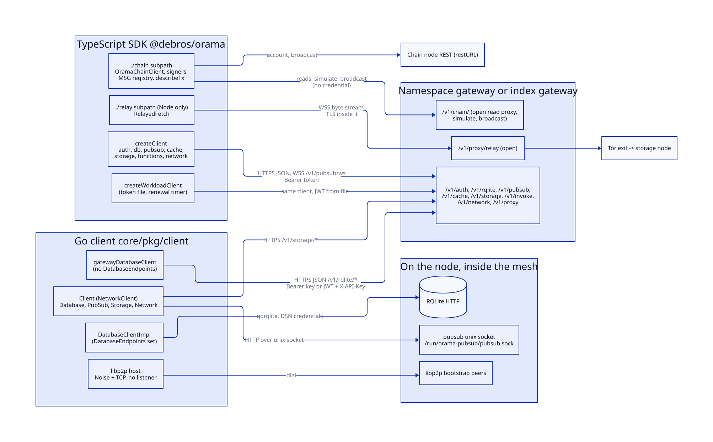
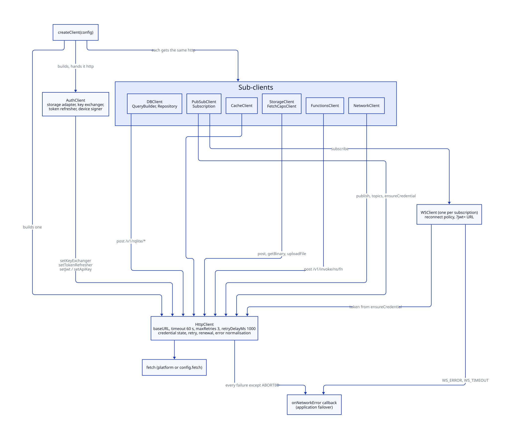
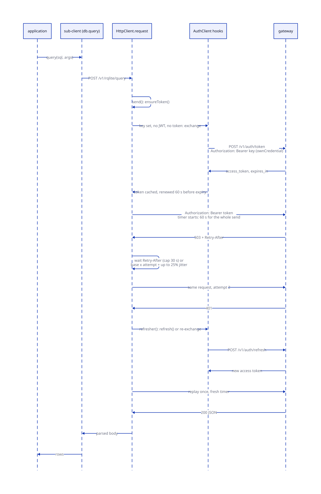
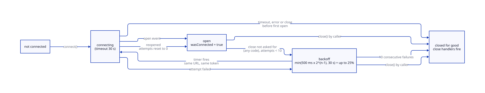
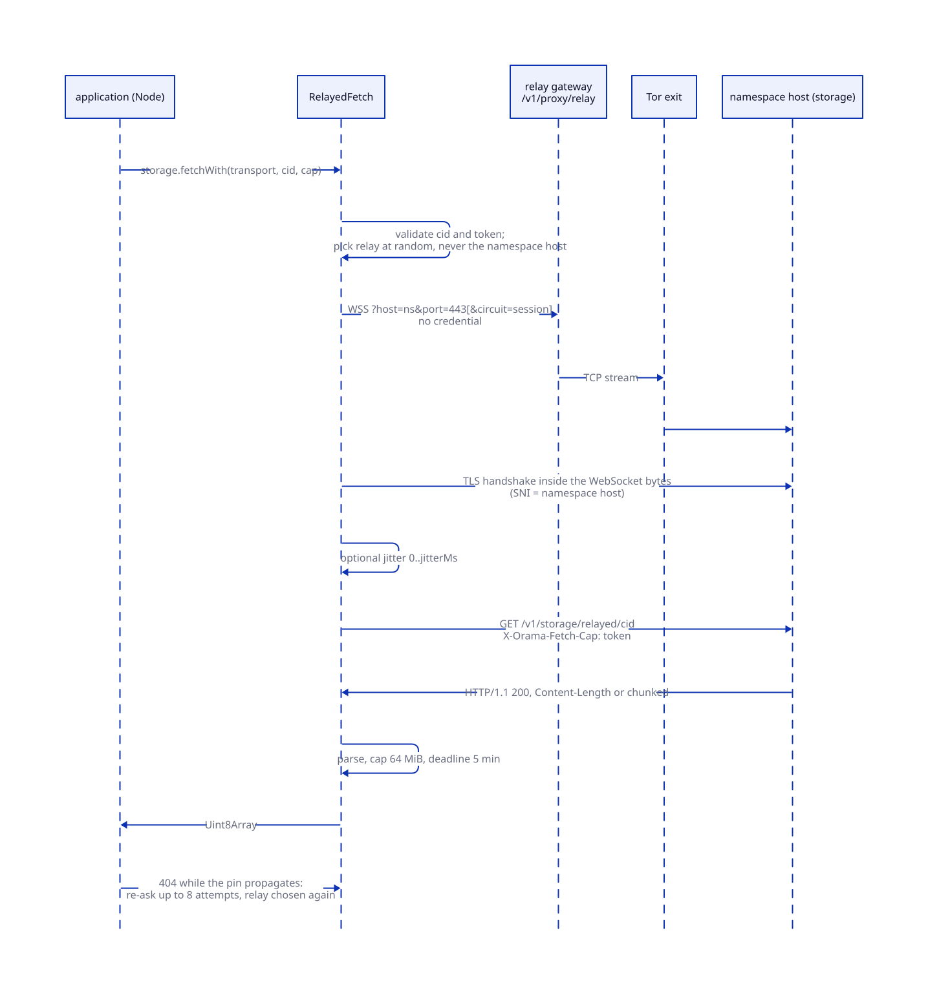
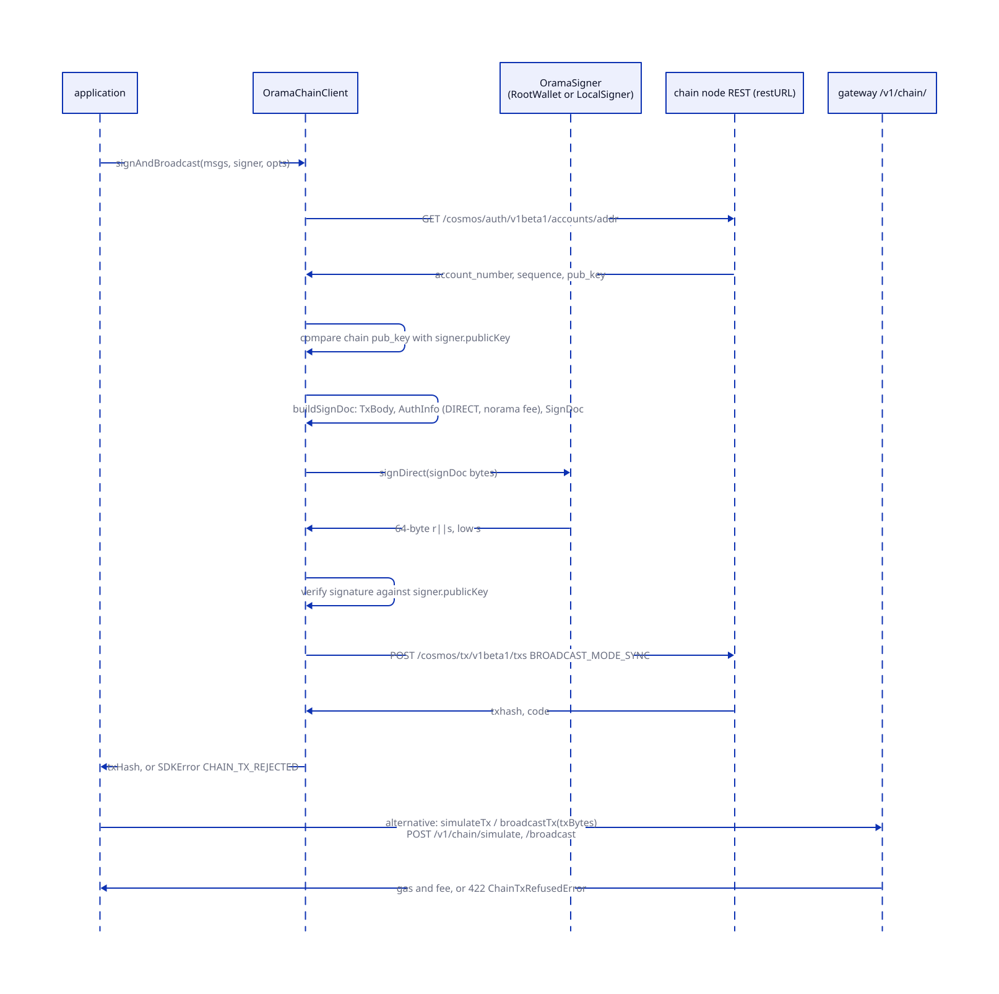
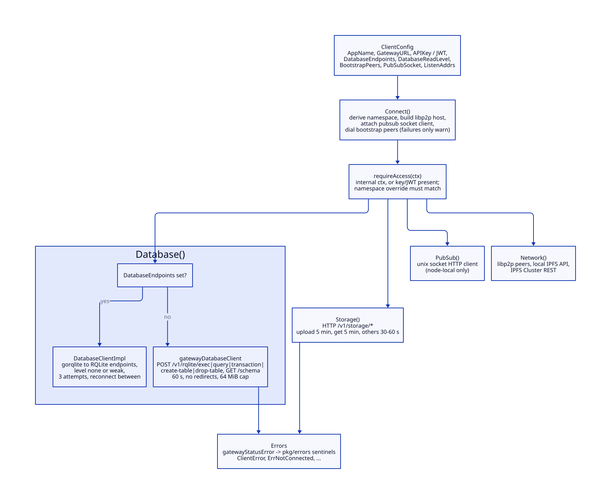

# SDKs

> **At a glance.**
>
> - **What:** two client libraries for the same gateway. The TypeScript SDK (`@debros/orama`, `sdk/`) is the library for tenant applications: one `HttpClient` shared by seven sub-clients, a WebSocket client for pub/sub, and two optional subpaths, `./chain` (read the chain, build and sign transactions) and `./relay` (Node-only relayed storage fetch). The Go client (`core/pkg/client`) is the library the gateway and the control plane use to reach the cluster registry and the node-local services, and the one a Go program outside the cluster uses to reach a gateway. Neither contains a vault client; that is a separate package ([Vault](28-vault.md)).
> - **Key numbers:** TS request timeout 60 s (uploads and downloads 5x), 3 retries on 408, 429, 500, 502, 503 and 504 with a base delay of 1 s times the attempt plus up to 25% jitter, `Retry-After` honoured up to 30 s; access token 15 min, renewed 60 s early; WebSocket reconnect 10 attempts, 500 ms doubling to 30 s; pin-propagation re-ask 8 attempts over 18 s; chain client timeout 15 s. Go gateway database client 60 s timeout and 64 MiB response cap; direct database client 3 attempts; storage timeouts 30 s to 5 min.
> - **Code:** `sdk/src/` (entry points `sdk/src/index.ts`, `sdk/src/chain/index.ts`, `sdk/src/storage/relay-transport.ts`), `core/pkg/client/`, shared fixtures in `contracts/`.
> - **Depends on:** [gateway architecture](12-gateway-architecture.md) for the routes and the error model, [identity](13-identity.md) and [authorization](14-authorization.md) for the credentials the clients carry, [storage](19-storage.md), [pub/sub](20-pubsub.md), and for the chain subpath [chain architecture](../vol2/39-chain-architecture.md).



## Why it exists

A tenant application talks to Orama through one gateway URL, and the gateway has a wide surface: database, cache, pub/sub, storage, functions, authentication, a chain proxy. Calling it with a bare `fetch` means every application rewrites the same code: credential handling, retries, token renewal, error classification, WebSocket recovery. The history is visible in the source. Comments in `sdk/src/core/http.ts` record the loops applications grew around the SDK before it did these things itself: a hand-written refresh-and-retry around every call, a path-substring switch that chose between three header spellings, a raw 90-day key in every request.

Three constraints shaped the libraries.

First, the SDK must be usable from places that cannot be trusted. A browser bundle or a phone app holds whatever credential it is given. The SDK therefore never puts a long-lived key on the wire after the first exchange, and ships no cryptography in its core entry.

Second, one package has to run in Node, browsers and React Native. The core entry has no Node imports. The two features that need Node or heavy dependencies live behind their own subpaths, so a bundler only pulls them in on request (`sdk/tsup.config.ts`).

Third, the SDK is a contract with the gateway, not a copy of it. A field renamed on one side must break a test on the other. The shared fixtures under `contracts/` and the parity tests against the gateway's Go sources exist for that.

The Go client exists for a different reason. The gateway is itself a client of the cluster: it reads the registry, the API keys and the grants through a database handle, and publishes to the node's pub/sub socket. Those calls go through the same `core/pkg/client` that a Go program outside the cluster uses, so the package has two audiences with opposite needs: in-mesh access with direct RQLite connections for the gateway, and plain HTTPS to a gateway for everyone else.

## The model

**Gateway URL.** The one address a client is configured with. For a tenant it is the namespace gateway (`ns-<name>.<domain>`); the URL names the namespace, and the credential must belong to it or the gateway answers `NAMESPACE_MISMATCH`. The clients do not discover gateways and do not fail over between them.

**Credential.** In the TypeScript SDK, one of an API key, a JWT, or nothing. A key is exchanged for a short-lived token, and a token is what travels. In the Go client, the key or JWT is sent as given on every request.

**`HttpClient`.** The TypeScript transport (`sdk/src/core/http.ts:HttpClient`). It owns the base URL, the credential state, the retry loop and the translation of every failure into an `SDKError`. Every sub-client is a thin mapping from a method to a route over one shared `HttpClient`.

**Sub-client.** One class per gateway area: `AuthClient`, `DBClient`, `PubSubClient`, `CacheClient`, `StorageClient`, `FunctionsClient`, `NetworkClient`. `createClient` builds one `HttpClient`, hands it to all of them, and returns them as `client.auth`, `client.db` and so on (`sdk/src/index.ts:createClient`). Because they share the `HttpClient`, `debug: true`, the `fetch` override, the token and the failure callback apply to all of them at once.

**Workload client.** A `Client` built for code running as a deployment, which holds a platform-issued JWT and no key (`sdk/src/workload.ts:createWorkloadClient`).

**Chain client.** `OramaChainClient`, a separate class on the `./chain` subpath. It does not use `HttpClient`: the chain's read proxy is open and a wallet has no gateway credential, so it has its own small `fetch` wrapper (`sdk/src/chain/client.ts:OramaChainClient`).

**Relayed fetch.** `RelayedFetch`, a `FetchTransport` on the `./relay` subpath that downloads a CID through a relay so the storage node never sees the caller's address.

**Go `Client`.** The `NetworkClient` interface and its implementation (`core/pkg/client/interface.go:NetworkClient`, `core/pkg/client/client.go:Client`). It has four accessors: `Database()`, `PubSub()`, `Storage()` and `Network()`. There is no `Cache()` and no `Serverless()`; the e2e feature `sdk-go` asserts the absence (`e2e/features/sdk-go/surface_test.go`).

**Internal context.** A Go `context.Context` marked with `client.WithInternalAuth`, which skips the credential check. Only code in the same process can create one; it is how the gateway and the namespace manager use the client without a user (`core/pkg/client/context.go:WithInternalAuth`).

### Package layout

| Entry | Source | Needs | Why separate |
|---|---|---|---|
| `@debros/orama` | `sdk/src/index.ts` | `isomorphic-ws`; `ws` optional peer on Node | The default import; no Node-only imports |
| `@debros/orama/chain` | `sdk/src/chain/index.ts` | optional peers `@bufbuild/protobuf`, `@noble/curves`, `@noble/hashes`, `@scure/base` | The generated protobuf codecs are large |
| `@debros/orama/relay` | `sdk/src/storage/relay-transport.ts` | Node, `node:tls`, `ws` | `node:tls` must not reach React Native or browser bundles |

The package is built by `tsup` to both ESM and CommonJS, with separate type declarations per format, `sideEffects: false`, and `engines.node >= 20.19` (`sdk/package.json`, `sdk/tsup.config.ts`). The CommonJS build exists because the package once shipped ESM only while documenting `require`. `sdk/tests/unit/packaging.test.ts` pins the exports map, the two formats and the rule that the core has no cryptography dependency.

## How it works

### Building a client

`createClient(config)` takes a gateway `baseURL` and builds, in order, the `HttpClient`, the `AuthClient`, then the other sub-clients (`sdk/src/index.ts:createClient`). The WebSocket URL is the base URL with `http` replaced by `ws`. Nothing connects at construction. The `AuthClient` constructor installs two hooks on the `HttpClient` that carry most of the SDK's behaviour:

- a **key exchanger**, which turns an API key into a token;
- a **token refresher**, which renews an expired session.



The configuration is `ClientConfig` (`sdk/src/index.ts:ClientConfig`). The options with behaviour behind them: `timeout` (default 60 000 ms), `maxRetries` (3), `retryDelayMs` (1000), `debug`, `storage` (a `StorageAdapter` for tokens; `MemoryStorage` by default, `LocalStorageAdapter` for browsers, which prefixes its keys with `@network/sdk:`), `wsConfig` (WebSocket options including `reconnect`), `functionsConfig` (namespace and an optional separate functions origin), `fetch` and `onNetworkError`.

The `fetch` option is also how a caller reaches a gateway with an untrusted certificate. The SDK deliberately does not touch process-wide TLS settings: setting `NODE_TLS_REJECT_UNAUTHORIZED` would disable verification for every other HTTPS client in the process. The caller builds a `fetch` that relaxes verification for that one connection (`sdk/tests/unit/http/tls-env-untouched-bug-325.test.ts` pins that the SDK leaves the environment alone).

### Credentials: one header, one exchange

Every request carries `Authorization: Bearer <token>` and nothing else (`sdk/src/core/http.ts:getAuthHeaders`). The credential logic has three cases.

**A JWT is configured, or set by a sign-in.** It is used as is. The `HttpClient` prefers the JWT over any exchanged token (`this.jwt ?? this.exchangedToken`).

**Only an API key is configured.** Before the first request, `ensureToken` calls the exchanger, which sends `POST /v1/auth/token` with the key as `Authorization: Bearer <key>` and the request flag `ownCredential`, which stops the pipeline from trying to exchange the key in order to send the exchange (`sdk/src/auth/client.ts:exchangeKey`). The gateway answers with `access_token` and `expires_in`; the token embeds the key's own grants. The SDK caches it, and exchanges again when fewer than 60 s remain (`TOKEN_RENEWAL_MARGIN_MS`). Concurrent callers share one in-flight exchange (`this.exchanging`). The gateway's token lifetime is 15 min (`core/pkg/gateway/auth/jwt.go:AccessTokenLifetime`); the SDK assumes 900 s when the response omits `expires_in`.

The reason is containment. A key lives 90 days and sits in a header on every request, where it ends up in access logs, proxy traces and devtools. A token lives 15 minutes. The key now crosses the wire once per 15 minutes, to one route, and never in a URL.

**Neither.** The request is sent without a credential, which works for the open routes (`/v1/chain/`, the sign-in routes, `/v1/namespace/status`).

`ensureToken` returns `undefined`, not a resolved promise, when there is nothing to do. The comment gives the reason: a caller that aborts immediately after the call must find the request already in flight, and an extra microtask would let the abort land before `fetch` started.

#### Sign-in, sessions and renewal

The `AuthClient` maps one method to each identity route; the protocol is in [identity](13-identity.md). `challenge` returns the gateway's Sign-In-with-Ethereum (or Solana) message; the caller signs it verbatim and passes the signature to `verify`, which stores the access token, the refresh token, the namespace it was issued for and the device id (`sdk/src/auth/client.ts:storeSession`). Signing verbatim matters because the gateway verifies against the exact text it issued.

When a request fails with a 401 and a refresher is installed, `HttpClient.request` calls it once and replays the request once (`canRenewFor`, `renewSession`). The refresher chooses between two paths:

- a refresh token is in storage: `POST /v1/auth/refresh` with the refresh token and the namespace it was issued for; a rotated refresh token is written back;
- no user session but a key is configured: clear the cached token and exchange the key again.

Renewal is single-flight (`this.refreshing`), so N requests that expire together cause one refresh. The renewal endpoint is excluded from renewal (`path.startsWith("/v1/auth/refresh")`), or a 401 from the refresh would recurse. A failed renewal is logged and the original 401 is raised, not the renewal's error.

Sessions bound to a device add a signature step. The platform owns the device key (WebCrypto, Secure Enclave, StrongBox); the application hands the SDK a `DeviceSigner` with the public JWK and a `sign` function. For a bound session `refresh`, `revokeDevice`, `approveDeviceLink` and `claimDeviceLink` each build a proof over a message the SDK assembles (`sdk/src/auth/device.ts:makeDeviceProof`), so the key never enters the SDK. Without a signer these calls throw `DEVICE_PROOF_REQUIRED` instead of sending a request the gateway would refuse. Logout from a bound session sends the refresh token and namespace, which ends that device's session; from an unbound one it sends `all: true` (`logoutBody`). Logout is best effort towards the server: a failed `POST /v1/auth/logout` is logged and local state is cleared anyway.

#### Workload tokens

A deployment is handed a token, not a key. `createWorkloadClient` reads `ORAMA_GATEWAY_URL` and the path in `ORAMA_TOKEN_FILE`, reads the token, builds a client with that JWT and schedules a renewal (`sdk/src/workload.ts`). The renewal calls `POST /v1/auth/renew` with the token it holds; the gateway only renews a deployment's own token this way, because letting any access token mint its own successor would make a stolen one valid for ever (`AuthClient.renew`). The timer fires 5 min before expiry (`RENEWAL_MARGIN_MS`), starts from an assumed 60 min lifetime until the first response gives the real one (`core/pkg/gateway/auth/workload.go:WorkloadTokenLifetime` is one hour), never fires sooner than 30 s, and is `unref`ed so it does not keep the process alive. A failed renewal reschedules itself 5 min later and leaves the token in place; the 401 path then covers a token that has already expired. The grants are resolved at mint time, so a grant removed from the deployment reaches the process at its next renewal ([authorization](14-authorization.md#workload-identity)).

### The request pipeline



`HttpClient.request` is a wrapper around `send`. `send` does, in order:

1. Ensure a token (above), unless the request carries its own credential.
2. Build the URL from the per-request `baseURL` override or the client's, append the query, and set `Content-Type: application/json` plus the auth header plus the caller's headers.
3. Refuse at once if the caller's `AbortSignal` has already fired.
4. Link the caller's signal and the timeout into one `AbortController` (`linkAbort`), remembering which of the two fired.
5. Run `requestWithRetry`.
6. Normalise whatever was thrown.

`requestWithRetry` is the retry loop. A non-2xx response is read as JSON (falling back to `{error: statusText}`), turned into an `SDKError` by `SDKError.fromResponse`, and thrown. The loop retries when the status is one of **408, 429, 500, 502, 503, 504**, the attempt count is below `maxRetries`, and the signal has not been aborted. The delay is the gateway's `Retry-After` when present, parsed as seconds or as an HTTP date, and capped at 30 s (`MAX_RETRY_DELAY_MS`). Otherwise it is `retryDelayMs` times the attempt number plus up to 25% random jitter. With the defaults the waits are about 1, 2 and 3 s. The jitter is there so clients that failed together do not return together; honouring `Retry-After` is there because ignoring it turned a rate limit into a burst of three more rejected requests (`sdk/tests/unit/http/retry-policy.test.ts`).

Four properties of this loop matter to an application:

- **Transport failures are not retried.** A DNS failure, a refused connection, a TLS error or a timeout rejects `fetch` with a non-`SDKError`, which is not in the retry set. Only a gateway that answered with a retryable status is retried. Retrying a lost connection is left to the application, through `onNetworkError`.
- **The timeout covers the whole call.** The timer is armed once per `send`, before the first attempt, so retries and their waits share the 60 s. A 401 replay gets a fresh timer because it is a second `send`.
- **A cancel is final.** An aborted signal is never retried and never reported through `onNetworkError`, because a user pressing Cancel is not a network failure. A cancel surfaces as a `NetworkError` with code `ABORTED`.
- **Every method retries.** The status list does not look at the HTTP method, so a `POST` to `/v1/rqlite/exec` is retried after a 502 or 504 even if the gateway executed it first (see Known gaps).

Uploads and downloads use their own paths. `uploadFile` (multipart) and `getBinary` (a streamed `Response`) set a timeout five times the client's. `uploadFile` shares the retry loop but not the 401 renewal; `getBinary` has neither. `getBinary` clears its timer as soon as the headers arrive, so a long body is not killed by a timeout that was meant for reaching the gateway.

### Error mapping

Every failure is an `SDKError` with `httpStatus`, `code` and `details` (`sdk/src/errors.ts:SDKError`). `SDKError.fromResponse` reads the two body shapes the gateway uses ([the error model](12-gateway-architecture.md#the-error-model)) and unwraps the RPC envelope `{ok: false, error: {code, message, retryable, ...}}` so `message`, `code` and `retryable` read the same from either shape. It then picks a subclass by status:

| Status and code | Class | Extra |
|---|---|---|
| 401 with `AUTH_REVOKED` | `RevokedCredentialError` (an `AuthError`) | answer is to sign in again |
| any other 401 | `AuthError` | `requiredScope` |
| 403 with `NAMESPACE_MISMATCH` | `NamespaceError` | `namespace`, `credentialNamespace` |
| any other 403 | `ScopeError` | `requiredScope` from `required_scope` |
| 404 | `NotFoundError` | |
| no HTTP response | `NetworkError`, `httpStatus` 0 | code `NETWORK_ERROR`, `TIMEOUT` or `ABORTED` |
| relayed fetch failures | `RelayError` | `retryAfterSeconds` |
| a refused fetch capability | `FetchCapError` | |
| anything else | `SDKError` | `retryable`, `hint` getters read `details` |

`AuthCode` lists the gateway's codes and `RelayCode` the relay's. A test reads `core/pkg/gateway/auth_errors.go` and the sign-in and device error files and fails if the SDK is missing a code the gateway has (`sdk/tests/unit/auth-codes-parity.test.ts`). The list only grows on both sides. `httpStatus` 0 is the SDK's own marker for "no HTTP response", which is how an application tells "could not reach the gateway" from a real 5xx.

Some errors are normalised on purpose. `db.findOne` turns a 404 into `null`, because the `Repository` equivalent already did and the two disagreed. `cache.get` turns a 404 into `null`, since a miss is normal. `auth.whoami` turns a 401 into `{authenticated: false}` but rethrows everything else, because the earlier "catch all and report signed out" made a dead gateway look like a login problem. `network.proxyAnon` raises `PROXY_FAILED` (502) when the proxy answered 200 with an `error` field. `functions.invoke` wraps a non-SDK failure as `FUNCTION_INVOKE_FAILED`.

The grants are mirrored as constants (`sdk/src/scopes.ts`: `SCOPES`, `PROFILE_SCOPES`, `ROLES`, `satisfiesScope`) and a test reads `core/pkg/gateway/auth/scopes.go` to keep them equal (`sdk/tests/unit/scopes-parity.test.ts`). A client that disagrees with the gateway about which grants exist is worse than one that names none.

### Failover is the application's job

Neither client picks between gateways. The TypeScript `HttpClient` has one `baseURL`. `onNetworkError(error, context)` is the hook for the application to rotate it. The hook receives `{method, path, isRetry, attempt}`; `attempt` is `maxRetries` and `isRetry` is always false. The same callback is called for WebSocket failures with `method: "WS"`. The code calls it for every failed request except an abort, not only for transport failures (see Known gaps), so a handler that rotates gateways must test `error.httpStatus === 0`. The reason for leaving failover out is in the file's own comment: a client cannot know whether the next gateway holds the same namespace, and namespace gateways are per-namespace processes that DNS already spreads across nodes ([DNS and nameservers](24-dns-and-nameservers.md)).

### WebSocket and pub/sub

Publishing is `POST /v1/pubsub/publish` with the payload base64-encoded in `data_base64` and a 30 s timeout (`sdk/src/pubsub/client.ts:PubSubClient.publish`). `topics()` and `getPresence()` are GETs. Subscribing opens one WebSocket per topic at `/v1/pubsub/ws?topic=...`, adding `presence=true`, `member_id` and `member_meta` when presence is on ([pub/sub](20-pubsub.md#subscribing-through-the-gateway)).

A browser cannot set a header on a WebSocket upgrade, so the credential goes in the URL. `subscribe` calls `ensureCredential` first, so what goes in the URL is the exchanged 15-minute token, not the key, and the parameter is always `jwt` (`WSClient.buildWSUrl`). The gateway reads `?jwt=` as a JWT and `?token=` as an API key, so a token in the wrong parameter is looked up as a key and refused. The gateway also strips the parameter before proxying.

Each `Subscription` wraps a `WSClient` and parses the gateway's JSON envelope `{data, topic, timestamp}`: it validates the three fields, decodes the base64 payload to bytes, exposes both `bytes` and a UTF-8 `data` string, and routes `presence.join` and `presence.leave` events to the presence callbacks instead of the message handlers. A malformed frame calls the error handlers and does not close the subscription.



`WSClient` reconnects (`sdk/src/core/ws.ts:ReconnectConfig`). The policy is: enabled, 10 consecutive failed attempts, first delay 500 ms, doubling to a ceiling of 30 s, plus up to 25% jitter. The delays sum to 151.5 s before jitter. A close is final, with the close handlers fired, only if the caller asked for it, the first connect never succeeded, reconnection is off or the budget is spent. Any other close, whatever its code, is a drop: `onReconnecting(attempt, delayMs)` fires, the timer runs, and `open()` runs again. A successful reopen resets the counter and fires `onReconnected`. The close handlers do not fire during recovery, so an application is not told the subscription ended while it is being restored. Each attempt has the connection timeout of 30 s (`WS_TIMEOUT`, 408).

The reconnect reuses the URL, including the token, that the first connect built. That has a consequence the chapter returns to in Known gaps: the gateway closes a socket whose token has expired past a 120 s grace with code 4401 ([pub/sub](20-pubsub.md#subscribing-through-the-gateway)), and the SDK treats that close as a drop.

### Storage

`StorageClient` maps to `/v1/storage/upload` (multipart, `pin` flag defaulting to true, 5 min), `/pin`, `/status/<cid>`, `/get/<cid>` and `/unpin/<cid>`. `upload` accepts `File`, `Blob`, `ArrayBuffer`, `Uint8Array` and `ReadableStream`; a stream is read fully into memory first.

A CID is addressable the moment the upload returns, but the pin has to propagate across the IPFS Cluster peers before every node can serve it. A read soon after a write can legitimately 404. `get`, `getBinary` and `fetchWith` therefore re-ask on a 404: 8 attempts, waiting 1, 2, 3, 3, 3, 3 and 3 s, 18 s in all (`sdk/src/storage/pin-propagation.ts`). If the gateway marks a 404 `retryable: false`, which it does once the content is known to be gone, the SDK stops at once; a gateway that says nothing keeps the old behaviour of retrying every 404. The loop is one function shared by `get` and `getBinary`; they used to each carry a copy.

`FetchCapsClient` mints and revokes fetch capabilities: `mintFetchCaps(cid, {count 1..64, ttlSeconds 3600..604800})` validates both bounds locally with the same limits as the gateway and returns `{id, token, revokeKey, expiresAt}` per capability; `revokeFetchCap(id, revokeKey)` sends the key in `X-Orama-Revoke-Key`. Minting needs a device-bound session ([fetch capabilities](19-storage.md#fetch-capabilities)).

#### Relayed fetch



A `FetchTransport` is how a capability is spent. There are two. `DirectFetch` uses the client's own credential against `/v1/storage/get/<cid>` and ignores the capability: it is the non-private baseline. `RelayedFetch` hides the caller's address from the storage node (`sdk/src/storage/relay-transport.ts:RelayedFetch`). Per fetch:

1. Validate the CID (`^[A-Za-z0-9]+$`) and the capability token (printable ASCII).
2. Pick a relay uniformly at random from the list, excluding any whose host equals the namespace host. A relay that is the storage node would see address and CID together. The constructor runs the same check, so an unusable list fails at construction.
3. Open `wss://<relay>/v1/proxy/relay?host=<namespaceHost>&port=443`, adding `circuit=session` when the caller asked to share a Tor circuit across a batch. The WebSocket carries no credential; the route is open ([the anonymity proxies](12-gateway-architecture.md#anonymity-proxies)).
4. Wrap the WebSocket as a Node `Duplex` and run `tls.connect` over it, with SNI and certificate verification against the namespace host, ALPN `http/1.1`, and the caller's `ca` if given. The relay forwards ciphertext. Binary frames only: a text frame destroys the stream with `RELAY_PROTOCOL_ERROR`.
5. After an optional random delay of 0 to `jitterMs`, send `GET /v1/storage/relayed/<cid>` with `X-Orama-Fetch-Cap` and `Connection: close`.
6. Parse the HTTP/1.1 response with the SDK's own incremental parser (`sdk/src/storage/http-response.ts:Http1ResponseParser`): `Content-Length` or chunked, interim 1xx skipped, head capped at 64 KiB, body capped at `maxBodyBytes` (64 MiB, the relay's own per-stream limit). A 200 whose body is delimited only by the connection closing is refused: a storage node always states the length, and a body that ends when the stream does cannot be told from one a reset cut short.
7. Return the bytes for a 200; map anything else (`storageRefusal`): a `FETCH_CAP_*` code becomes `FetchCapError`, otherwise `SDKError.fromResponse`.

The deadline for the whole fetch is 5 min (`timeoutMs`). A refusal before the upgrade (400, 429, 503) arrives as an ordinary HTTP response and is mapped by `relayRefusal`, with `Retry-After` carried as `retryAfterSeconds`.

The central rule is that the SDK **never falls back to a direct request**. Every relay or tunnel failure is thrown as a `RelayError`. A retry through `DirectFetch` would send the caller's address to the very node the relay exists to hide it from, so the choice of transport is the caller's, made by calling `fetchWith` again with another transport. The pin-propagation loop keeps the same transport and picks a relay afresh each attempt.

What each party sees: the relay sees the caller's address, the namespace host and the size and timing of the stream; it never sees the CID, the capability or the content. The storage node sees the CID and the capability and a Tor exit address. A relay run by the same operator as the storage node is not a boundary, because together they hold both halves. Timing correlation across both ends remains, which `jitterMs` blunts and does not remove. The relay side is in [anonymity and Tor](../vol2/38-anonymity-and-tor.md).

### Functions, cache, database and network

`FunctionsClient.invoke` posts to `/v1/invoke/<namespace>/<function>`. The namespace comes from `functionsConfig.namespace` and defaults to the string `default`, because nothing derives it from the base URL. An optional `gatewayURL` goes through the per-request `baseURL` override rather than being glued onto the path, a mistake that once produced `http://localhost:10104https://...` ([serverless](21-serverless.md)).

`CacheClient` maps to `/v1/cache/get|put|delete|mget|scan|health` ([cache](18-cache.md)). `DBClient` maps to `/v1/rqlite/exec|query|find|find-one|transaction|create-table|drop-table|schema`; `QueryBuilder` posts to `/v1/rqlite/select` and `Repository` composes `find`, `find-one` and `exec`. The gateway, not the SDK, decides what SQL is allowed ([database](17-database.md)). With `debug: true` the `HttpClient` logs the SQL and the arguments of every `/v1/rqlite/` call; `Logger` writes nothing at all when debug is off (`sdk/tests/unit/core/no-console.test.ts` enforces that no source file calls `console` directly). `NetworkClient` covers `/v1/health`, `/v1/network/status|peers|connect|disconnect` and `/v1/proxy/anon`.

### The contract with the gateway

`contracts/` holds JSON fixtures: for each route, the request body the SDK sends, the response the gateway returns and what the SDK method resolves to. The fixtures cover `auth`, `cache`, `db`, `network`, `pubsub` and `storage`; a seventh, `enrollment/seal`, is a cryptographic vector shared by two Go modules and has no route. Each fixture is read twice. A Go test decodes `request` into the handler's own struct with unknown fields rejected, so the gateway must understand every field the SDK sends. A TypeScript test drives the named SDK method through a stub `fetch` and asserts the body is exactly that JSON (`sdk/tests/unit/contracts.test.ts`). Neither side can change a field alone, and neither test needs a cluster. A third check, `e2e/features/contracts-live/`, runs the fixtures against a live fleet.

### The chain subpath

`@debros/orama/chain` reads the chain, builds transactions, has a wallet sign them and describes them for an approval screen. Its design is that the SDK never holds the user's key in the signing path.

**Reads.** `OramaChainClient` takes two optional bases. `gatewayURL` is the gateway root, for the open read proxy `/v1/chain/` ([the chain read proxy](12-gateway-architecture.md#the-chain-read-proxy)): `status`, `block`, `blocks`, `tx`, `validators`, `supply`, `stakingPool`, the indexer (`index/status`, `index/blocks/<h>`, `index/txs/<hash>`, `index/accounts/<addr>/txs`, the cNFT asset and owner routes), and `query/<package.Service>/<Method>` for any module's Query service. Typed wrappers cover x/nodes, x/storage, x/fees, x/archive, x/relay, and the bank, auth, staking, distribution and wasm reads a wallet needs. Each wrapper validates its inputs before any request: bech32 shape for `orama1...` and `oramavaloper1...` addresses, a denom pattern, an unsigned 64-bit range for ids, a page limit of 1 to 100, a 64-hex-character transaction hash, a transaction of 1 byte to 1 MiB (the gateway's `max_tx_bytes`). A read whose base is missing fails and names it. `height` selects a historical read. `restURL` is a node's Cosmos REST API, needed for `account`, `balances` and `broadcast`, which the gateway proxy does not serve. Module queries answer the decoded response with the proto field names, uint64 fields as decimal strings. `isContract` turns the gateway's typed 404 for a non-contract address into `false`.

**Transport.** `request` wraps `fetch` with a 15 s abort timer (`timeoutMs`), sends `Accept: application/json`, and has no retries. A thrown `fetch` becomes `NetworkError` naming the host. A 422 whose body has a numeric `code` becomes `ChainTxRefusedError` (an `SDKError` with code `CHAIN_TX_REJECTED`, `httpStatus` 422, and `chainCode`, `codespace`, `log` and, for a broadcast, `txHash`); the `log` is the gateway's sanitised copy of the chain's reason. Everything else goes through `SDKError.fromResponse`.

**Building and signing.** `buildSignDoc` produces the `TxBody`, `AuthInfo` and `SignDoc` for exactly one signer in `SIGN_MODE_DIRECT` with a secp256k1 key and a fee in `norama`; a transaction with no messages, an empty chain id or a non-positive fee is refused. The bytes are the same as the Go builder's, which a shared fixture pins (`chain/client/tx/testdata/tx_vectors.json`, read by `sdk/tests/unit/chain/vectors.test.ts`). `signTx` hands the serialized `SignDoc` to an `OramaSigner` and verifies the returned 64-byte low-s signature against the signer's own public key before assembling the `TxRaw`, so a signer that signs the wrong document or as another account is an error in the SDK and not a rejected broadcast.



`OramaSigner` is `{address, publicKey, signDirect(signDoc)}`. The builder passes the document, never a key, so a wallet such as RootWallet can decode it and show the user what they approve. `LocalSigner` keeps a key in a private field for tests and servers that own their key. Addresses are `bech32` with prefix `orama` over `RIPEMD160(SHA256(pubkey))` (`sdk/src/chain/address.ts`).

`signAndBroadcast` reads the account from the node REST API, checks that any public key the chain already knows for it equals the signer's, builds, signs, and broadcasts with `BROADCAST_MODE_SYNC`. The gateway alternative, `simulateTx` then `broadcastTx`, needs no node at all, which is how a wallet that has only a gateway works.

**Messages and approval text.** `MSG` holds 69 message definitions, each a type URL, a ts-proto codec and a description function: 59 Orama messages across archive, cnft, emission, houses, market, nodes, relay, shielded, storage and token, 8 Cosmos SDK messages (bank, staking, slashing, distribution) and 2 CosmWasm messages (`sdk/src/chain/messages.ts:MSG`). `describeTx` decodes a transaction and returns, per message, a title, a one-line summary with every amount (`formatAmount` prints ORAMA with the exact `norama` in brackets, so an approval screen never rounds what is signed), notes for what a signer must see, and a `sensitive` flag for messages that move control rather than funds. A message type the registry does not hold is described as unknown and sensitive, with the note "Do not approve what you cannot read" (`sdk/src/chain/describe.ts:describeMessage`).

**Generated code.** `sdk/src/chain/gen` is generated from `chain/proto` and the exact dependency versions pinned in `chain/go.mod` by `sdk/scripts/gen-chain-proto.sh` (protoc with a pinned ts-proto). Only the `tx.proto` files are generated; the read side is JSON over REST, so no query messages are. A test regenerates it and fails on any difference (`sdk/tests/unit/chain/gen-fresh.test.ts`). `chain/client/tx/testdata/wallet_msgs.json` lists every message the chain registers for a wallet, and the SDK must decode all of them.

### The Go client



#### Construction and connection

`NewClient(config)` requires a non-nil config and a non-empty `AppName`, builds a zap logger and returns an unconnected `Client`. `Connect` does the work under a write lock (`core/pkg/client/client.go:Connect`):

1. **Derive the namespace** (`deriveNamespace`): the `Namespace` claim of the JWT payload, decoded without verifying the signature (the gateway verifies; the client only needs a label), else the namespace embedded in a legacy `ak_<random>:<ns>` key, else `AppName`. A current key carries no namespace, deliberately: a key pasted into an issue or a log line used to publish which tenant it belonged to, so for those the application name names the namespace.
2. **Build a libp2p host** with Noise security, the default muxers and TCP only. With no `ListenAddrs` the host has no listener at all: nothing connects to a client, which dials its bootstrap peers and they answer on that connection. A listen address must name an interface; an unspecified address (`0.0.0.0`, `::`) is refused, because it is every interface including the public one.
3. **Persistent identity** when `IdentityPath` is set: load the key file or generate and save one.
4. **Attach the pub/sub client** for the namespace, over the unix socket in `PubSubSocket`.
5. **Dial each bootstrap peer** under `ConnectTimeout` (30 s). A failed dial is logged as a warning and skipped; zero connected peers is a warning too, and `Connect` returns success. The bootstrap list defaults to `ORAMA_BOOTSTRAP_PEERS` when set, else the compiled-in discovery default, which is empty (`core/pkg/client/defaults.go:DefaultBootstrapPeers`, `core/pkg/config/config.go`).

The consequence is stated in the gateway's own comment on the registry connection: `Connect` "reports success without having spoken to the database". It is not evidence that anything is reachable. The gateway therefore runs a probe query itself (`core/pkg/gateway/gateway.go:connectAPIKeyRegistry`).

`requireAccess` runs before every operation. It passes for a context marked internal; otherwise it requires a non-blank `APIKey` or `JWT` and refuses a `pubsub.WithNamespace` context override that names a different namespace than the client's. It is a local presence check, not authentication: the credential is verified by whatever the call reaches.

#### The database client: two implementations

`Database()` returns one of two implementations, chosen by whether `DatabaseEndpoints` is non-empty (`usesRQLiteEndpoints`).

**Gateway mode** (no endpoints) is the client for programs outside the mesh (`core/pkg/client/database_gateway.go:gatewayDatabaseClient`). It posts JSON to `GatewayURL` plus `/v1/rqlite/`: `exec` for writes, `query` for reads, `transaction`, `create-table`, `drop-table`, and `GET schema`. Whether a statement is a write is decided client-side from its first keyword (`INSERT`, `UPDATE`, `DELETE`, `CREATE`, `DROP`, `ALTER`, `TRUNCATE`, `REPLACE`, `MERGE`, `PRAGMA`). Calls are bounded to 60 s and 64 MiB of response. Redirects are never followed: Go strips `Authorization` on a cross-host hop but forwards `X-API-Key`, which the request also carries. Rows arrive as a map per row plus the column order, and the client rebuilds positional rows; it refuses a result with rows and no column order (an old gateway) or with duplicate column names (`SELECT a.id, b.id`), where one of the values is already lost. Integers decode as `int64`, other numbers as `float64`. A transaction the gateway rolls back answers 409 with the failing statement index, which the client turns into "transaction rolled back at statement N". `DropTable` treats "no such table" as success. `GetSchema` leaves out tables the credential may not query (the platform's tables share a namespace's database).

**Direct mode** (endpoints set) is how the gateway reaches its own database (`core/pkg/client/database_client.go:DatabaseClientImpl`). It opens `gorqlite` connections to the listed RQLite HTTP endpoints, which needs a route into the WireGuard mesh. Credentials ride in the endpoint DSN (`user:password@host`), built by the gateway from its config (`core/pkg/gateway/dependencies.go:gatewayClientConfig`). The connection string always sets `disableClusterDiscovery=true` and `level=<read level>`. `DatabaseReadLevel` is `none` by default, a read of this node's local replica that can miss a write the leader has acknowledged but this node has not applied, or `weak`, which sends the read to the leader. The gateway sets `weak` on both of its handles, because an auth decision (a grant just written, a nonce just spent) must see every acknowledged write. The cost is one extra hop to the leader and, while there is no leader, failing reads instead of stale answers. A write returns `LastInsertID` and `RowsAffected` from the acknowledged commit, because reading the new row back is a level-`none` read that a follower has not yet applied.

Direct mode tries the endpoints in order and keeps the first connection that answers `SELECT 1`; on any error it closes the connection and tries again, up to 3 attempts with no delay between them (`withRetry`, and the loop in `Query`). A `gorqlite` panic on an empty result, which the library hits when the server answers an error with no result rows, is recovered into an error (`safeWriteOne`).

#### Storage and network

`StorageClientImpl` sends plain `net/http` requests to `GatewayURL` for `/v1/storage/upload`, `/pin`, `/status/<cid>`, `/get/<cid>` and `/unpin/<cid>`. Timeouts are 5 min for upload and get, 60 s for pin and 30 s for status and unpin. Upload buffers the whole body in memory to build the multipart form. A non-200 response becomes a `gatewayStatusError` carrying the operation, status and message; its `Is` method maps the status onto the sentinels in `core/pkg/errors` (400 and 422 to invalid input, 401, 403, 404, 409, 429, 503, and 408 or 504 to timeout), so `errors.IsNotFound`, `IsUnauthorized` and the other helpers work on storage errors. A 500 matches no helper, deliberately (`core/pkg/client/status_error_test.go`). The message is read from a flat `{"error": ...}` body, falling back to the raw text, up to 64 KiB. `NetworkInfo` reports libp2p peers from the client's own host, the local IPFS peer id and the local IPFS Cluster peer id when those services answer on the node; it is meaningful only on a node.

#### Pub/sub

`PubSub()` is a bridge to `pubsub.HTTPClient`, which speaks HTTP over the unix socket `/run/orama-pubsub/pubsub.sock` (`core/pkg/pubsub/socket.go:DefaultSocketPath`) with a 10 s publish timeout and one upstream event stream per topic. The socket admits only processes running as the pub/sub service's user, so the Go pub/sub path works only inside a gateway on a node ([pub/sub](20-pubsub.md#the-unix-socket-and-the-peer-check)). A program outside the cluster has no pub/sub from this client; it uses the TypeScript SDK's WebSocket path or a gateway route. The interface adds `SubscribeHandle`, which returns a function that removes exactly this handler, and `PublishBatch` and `PublishSame` with optional best-effort semantics and a concurrency cap.

#### Who uses the Go client

Inside the repository the client is used by the index gateway for its main handle and by the namespace gateway for the registry handle (`core/pkg/gateway/gateway.go:connectAPIKeyRegistry`, `core/pkg/gateway/dependencies.go:NewDependencies`). The auth service reads grants, nonces and API keys through it (`core/pkg/gateway/auth/service.go:NewService`). The namespace manager and the deployment replica code call it with `WithInternalAuth` contexts, and the fleet e2e environment uses it as a program outside would (`core/e2e/env.go`).

## State it owns

The SDKs own no cluster state. What they hold is client-side.

| State | Holds | Written by | Where |
|---|---|---|---|
| `HttpClient` credential fields | configured key, JWT, exchanged token and its expiry | `AuthClient`, the exchanger | process memory |
| `StorageAdapter` keys `jwt`, `apiKey`, `refreshToken`, `namespace`, `deviceId` | the session | `AuthClient` after sign-in and refresh | `MemoryStorage`, or `localStorage` under the prefix `@network/sdk:` |
| In-flight exchange and renewal promises | single-flight guards | `HttpClient` | process memory |
| `WSClient` state | socket, handler sets, attempt counter, reconnect timer | `PubSubClient` | one per subscription |
| Workload renewal timer | next renewal | `createWorkloadClient` | process memory, unref'd |
| Go `Client` | libp2p host, namespace, pub/sub adapter, cached RQLite connection | `Connect` | process memory |
| Go libp2p identity file | the client's peer key | `Connect` when `IdentityPath` is set | file, written once and reloaded |
| `sdk/src/chain/gen/` | generated protobuf codecs | `pnpm gen:chain` | the repository |
| `contracts/*/*.json` | request and response fixtures | developers | the repository |

The Go `Client` and every sub-client are safe to share between goroutines: configuration reads go through a read lock and `Config()` returns a copy, including copies of the slice fields. The TypeScript clients are single-threaded, and the concurrency that exists (parallel requests sharing one token exchange or one renewal) is handled by promise sharing.

## Lifecycle

**Boot.** `createClient` does no I/O. The first request triggers the key exchange. A Go `Connect` builds a host and dials peers; the first Go database call opens the RQLite connection in direct mode.

**Normal operation.** A TypeScript token is replaced 60 s before it expires. A session is renewed on the first 401. A workload token is renewed 5 min before it expires. A WebSocket recovers from a drop with backoff.

**Gateway rolling upgrade.** The gateway restarts one node at a time ([rolling upgrades](31-rolling-upgrades.md)). A request that lands on a restarting gateway fails with a connection error (not retried by the SDK) or a 503 (retried, with `Retry-After` honoured). During the gateway's start-up readiness the answer is 503. A pub/sub WebSocket on that gateway closes and the SDK reconnects through DNS to another node or the same one, using the token from the first connect. A mixed-version window needs no negotiation: the SDK treats unknown fields as absent, `retryable` as optional (`undefined` means the gateway gave no verdict), and the pin-propagation loop treats a gateway that says nothing as "retry every 404".

**Token and session expiry.** An API-key client re-exchanges; a user session refreshes; a revoked session answers `AUTH_REVOKED`, which is not renewed (a revoked refresh token fails the refresher, so the original 401 is raised).

**Node loss.** The client sees the gateway it was given, not the node. If that gateway's node is lost, requests fail until the application rotates the URL or DNS stops returning the node.

**Go shutdown.** `Disconnect` closes the pub/sub adapter and the libp2p host and clears the connected flag. After `Disconnect`, the `pubsub` field is nil and `PubSub()` returns a non-nil interface holding a nil pointer (see Known gaps).

## Failure modes

| Trigger | What the client does | What you observe |
|---|---|---|
| Gateway unreachable (DNS, refused, TLS) | TS: no retry; `NetworkError` `NETWORK_ERROR`, `httpStatus` 0; `onNetworkError` called. Go: `request failed: ...` | the error with status 0 |
| Request exceeds 60 s | the abort fires; `NetworkError` `TIMEOUT`; retries and waits count against the same 60 s | `TIMEOUT` |
| Gateway answers 429 with `Retry-After: 60` | waits 30 s (the cap), asks again; the retries share the 60 s request timer | `SDKError` 429 after the second attempt, or `TIMEOUT` at 60 s |
| Gateway answers 503 `AUTH_UNAVAILABLE` (revocation list stale) | retried, `Retry-After: 2` honoured | success after a short wait, or `SDKError` with `retryable: true` |
| 401, access token expired | TS: refresh or re-exchange, replay once. `uploadFile` and `getBinary` do not renew | transparent for `request`; `AuthError` on upload and download for a user JWT |
| 401 `AUTH_REVOKED` | `RevokedCredentialError`; renewal fails | sign in again |
| 403 `NAMESPACE_MISMATCH` | `NamespaceError` with both namespaces | the URL or the key is from the wrong environment |
| 403 `INSUFFICIENT_SCOPE` | `ScopeError.requiredScope` names the grant | mint a key with that grant |
| Read right after upload: 404 | TS `get` and `fetchWith` re-ask for up to 18 s. Go `Storage().Get` does not | success after propagation, or `NotFoundError` |
| WebSocket drops | reconnect up to 10 times; handlers not told | gap in messages; no replay |
| WebSocket closed with 4401 or 4403 | treated as a drop; reconnect refused with the same token; after 10 attempts the close handler fires | subscription ends about 3 min after the gateway closed it |
| Relay fails | `RelayError`; no direct retry | `RELAY_CONNECT_FAILED`, `RELAY_UNAVAILABLE`, `RATE_LIMITED` |
| Storage node refuses the capability | `FetchCapError`; retrying the same token cannot succeed | `FETCH_CAP_INVALID` or `FETCH_CAP_REVOKED` |
| Chain simulate or broadcast refused | `ChainTxRefusedError`, status 422 | `chainCode`, `codespace`, `log` |
| Chain node REST broadcast refused | plain `SDKError` `CHAIN_TX_REJECTED`, status 400 | not the same class as the gateway path |
| Signer returns a bad signature | `signTx` throws before broadcast | "returned a signature that does not verify" |
| Go direct mode: RQLite endpoint down | next endpoint; 3 attempts total, no delay | "failed to connect to any RQLite instance" with the DSN redacted |
| Go gateway mode: gateway redirects | refused, not followed | "does not follow redirects, so point it at the gateway itself" |
| Go `Connect` with no reachable peer | warning, success | `Connect` returned nil but nothing is verified |
| Clock skew | the SDK computes a token's expiry as its own `Date.now()` plus the gateway's `expires_in`, so skew between client and gateway does not change when it renews; the gateway judges expiry by its own clock | a client clock that jumps (suspend, manual change) renews early or late and meets a 401 replay |

## Trust and security

**What the client trusts.** The gateway's TLS certificate (via the runtime's `fetch`) and nothing else. The Go client's JWT namespace parse does not verify the signature and is used only to name the namespace for pub/sub and the local override check; a forged claim changes what the client labels itself, and the gateway still verifies the token.

**What the client protects.** In the TypeScript SDK the long-lived key is sent to one route (`/v1/auth/token`), in the `Authorization` header, once per 15 minutes, and never in a URL. A WebSocket URL carries a 15-minute token. `ALPN`, SNI and certificate verification in the relay path are against the namespace host, not the relay. `Logger` is silent unless `debug` is on, and with debug on, SQL and arguments are logged, so debug logging must not be enabled where logs leave the process. A key in a browser bundle is a key in the hands of everyone who loads the page: `admin` keys belong in CI and on a developer's machine, and an `app-runtime` key carries data-plane grants only, with the gateway additionally requiring a logged-in user's JWT for storage, WebRTC and proxy operations ([API keys](14-authorization.md#api-keys)).

**The Go client sends the raw key.** `addAuthHeaders` sets `Authorization: Bearer <key>` and also `X-API-Key: <key>` on every request when a key is configured and no JWT is (`core/pkg/client/transport.go:addAuthHeaders`). The gateway reads `X-API-Key` first and, for that spelling, marks the response with `Deprecation: true` and `X-Orama-Deprecation` and records the first use per namespace in the audit trail (`core/pkg/gateway/auth_deprecation.go`, `core/pkg/gateway/auth/apikey_request.go:APIKeyAndFormFromRequest`). A Go client with a key therefore uses the deprecated spelling and the raw key on every call, which the TypeScript SDK was changed to avoid. The Go client has no exchange step.

**Attackers.**

| Position | Can | Cannot |
|---|---|---|
| Reads a TS client's network traffic (TLS intact) | nothing | |
| Reads a gateway access log | see the route, the status, and for a WebSocket, a 15-minute token in `?jwt=` | recover the API key |
| Holds an extracted `app-runtime` key | exchange it, use its data-plane grants | act as a user on storage, WebRTC or proxy without a user JWT |
| Runs a relay | see the caller's address and the namespace host | read the CID, the capability or the content |
| Runs the storage node | see the CID, the capability and a Tor exit | learn the caller's address through the relay path |
| Runs both | correlate by timing and size | |
| Supplies an unknown chain message to a wallet | nothing silently | `describeTx` marks it sensitive and says it cannot be read |
| Sets a signer that signs another document | | `signTx` checks the signature against the signer's own public key and the document it built |

**Chain reads are unauthenticated by design.** `/v1/chain/` is open. The chain client sends no credential, so a wallet needs no account to read or to broadcast; the gateway bounds the load with in-flight caps ([rate limits](27-rate-limits-and-egress-controls.md)).

**The Go direct database path** carries RQLite credentials in the endpoint DSN. Errors from it run through `rqlite.RedactError` before they reach a caller or a journal. `DropTable` in direct mode builds its statement with `fmt.Sprintf` on the table name, so the name must come from trusted code; gateway mode sends it as a JSON field to a handler that validates it.

## Limits and scale

| Limit | Value | Source |
|---|---|---|
| TS request timeout | 60 s; uploads and downloads 5x | `HttpClient` constructor, `uploadFile`, `getBinary` |
| TS retries | 3, statuses 408 429 500 502 503 504 | `requestWithRetry` |
| TS retry wait | `Retry-After` or 1 s x attempt, +25% jitter, cap 30 s | `retryDelay` |
| Token renewal margin | 60 s before expiry | `TOKEN_RENEWAL_MARGIN_MS` |
| Publish timeout | 30 s | `PubSubClient.publish` |
| Upload timeout | 300 s | `StorageClient.upload` |
| WebSocket connect timeout | 30 s | `WSClientConfig.timeout` |
| WebSocket reconnect | 10 attempts, 0.5 s doubling to 30 s | `DEFAULT_RECONNECT` |
| Pin propagation | 8 attempts, 18 s waited | `PIN_PROPAGATION_ATTEMPTS` |
| Fetch capability count and TTL | 1 to 64; 3600 to 604 800 s | `FETCH_CAP_*` |
| Relayed fetch | body 64 MiB, 5 min, response head 64 KiB | `RelayedFetch`, `Http1ResponseParser` |
| Chain client timeout | 15 s, no retry | `DEFAULT_TIMEOUT_MS` |
| Chain transaction size | 1 B to 1 MiB | `TX_MAX_BYTES` |
| Chain listing page | 1 to 100 | `WALLET_MAX_PAGE_LIMIT` |
| Go gateway database | 60 s, 64 MiB | `gatewayDatabaseTimeout`, `maxDatabaseResponse` |
| Go direct database | 3 attempts | `withRetry` |
| Go storage | upload 5 min, get 5 min, pin 60 s, status and unpin 30 s | `storage_client.go` |
| Go connect timeout | 30 s | `DefaultClientConfig` |

At ten times the load the first bottleneck is the client's per-process shape rather than the gateway. A TypeScript process with one `createClient` shares one `HttpClient`, so a flood of requests still pays one token exchange. A flood against a gateway under pressure gets 429 or 503 and every client retries three times, spread by jitter but not coordinated, so the gateway sees up to four times the offered load during an incident; the `Retry-After` honour is the only damping. Each pub/sub subscription is its own WebSocket, so an application with many topics holds as many sockets, against the gateway's per-process stream caps ([pub/sub](20-pubsub.md#limits-and-scale)). In the Go client each storage call builds a new `http.Client` and TCP connection, so a high-rate Go caller pays a handshake per call.

## Design decisions

### A token on the wire, not the key

*Chosen:* exchange an API key for a 15-minute token and send only the token; put only the token in a WebSocket URL. *Rejected:* sending the key (the previous behaviour, three header spellings chosen by path). *Why:* a long-lived key in a header lands in access logs, proxy traces and devtools; in a URL it lands in browser history and the `Referer` of the next request. The cost is one extra request per 15 minutes and a dependency of every key-authenticated client on `/v1/auth/token` being up.

### Failover is the application's

*Chosen:* one base URL, a callback for the application to rotate it. *Rejected:* a gateway list inside the SDK. *Why:* the SDK cannot know that another gateway serves the same namespace, and a silent switch to a different origin changes which cookies, tokens and TLS identity apply. The cost is that every application writes a rotation, and that the callback fires on more than transport failures.

### Renew on 401 and replay once, not on a timer

*Chosen:* renew the session when the gateway says it expired, once, shared between concurrent requests. *Rejected:* a background refresh timer. *Why:* a timer runs in a tab that is asleep and holds a process open; renewal on demand costs one failed request after idleness. The workload client is the exception and uses a timer, because a server process has nothing to prompt a renewal until a request has already failed under load.

### Never fall back from a relay to a direct fetch

*Chosen:* a relay failure is an error. *Rejected:* retry direct on failure. *Why:* the fallback would send the caller's address to the storage node, which defeats the relay. The caller chooses.

### The signer never gets a key out and the builder never gets a key in

*Chosen:* the SDK passes the serialized `SignDoc` to an `OramaSigner` and verifies the answer. *Rejected:* a builder that holds the key. *Why:* a wallet must decode the document and show it before signing, and the SDK must be able to catch a signer that signed the wrong thing.

### Two Go database implementations behind one interface

*Chosen:* a gateway-mode client and a direct client behind `DatabaseClient`. *Rejected:* gateway mode for the gateway too. *Why:* a gateway that reached its own registry through a gateway would depend on itself, and the auth path needs the leader-read level that only a direct connection controls. Programs outside the mesh cannot dial RQLite, so they get the HTTPS mode.

### Contract fixtures instead of a schema

*Chosen:* JSON fixtures read by a Go test and a TypeScript test. *Rejected:* generating the SDK from a schema. *Why:* the fixtures pin the bytes both sides actually exchange with no generator in the build, and they run in a unit suite with no cluster.

### The core entry stays Node-free

*Chosen:* `./relay` and `./chain` are separate entries with optional peers. *Rejected:* one bundle. *Why:* React Native and browsers must be able to import the core, and `node:tls` and the protobuf codecs are the two things they cannot or should not carry.

## Known gaps

- **A pub/sub subscription cannot outlive its token.** The gateway closes a socket whose token expired more than 120 s ago with code 4401 ([pub/sub](20-pubsub.md#subscribing-through-the-gateway)). `WSClient` treats every unexpected close as a drop and reopens with the URL built at the first connect, so the expired token goes back to the gateway (`sdk/src/core/ws.ts:handleClose`, `sdk/src/core/ws.ts:buildWSUrl`; `setAuthToken` exists and nothing calls it, and `PubSubClient.subscribe` reads the credential once). Ten attempts over about 150 s later the close handler fires. For an API-key client the subscription therefore ends roughly 17 minutes after it opened, and an application must resubscribe in its close handler. The same loop re-presents a revoked token after a 4403. This is a bug.
- **`PubSubClient.subscribe` does not renew a user JWT.** `ensureCredential` returns the configured JWT as is; only the exchange path is time-aware. A subscribe with an expired JWT fails at the upgrade and the 401 renewal does not apply to a WebSocket (`sdk/src/core/http.ts:ensureCredential`).
- **`uploadFile` and `getBinary` skip renewal.** The 401 replay lives in `request` only, so `storage.upload`, `storage.get` and `storage.getBinary` raise `AuthError` on an expired user JWT while `db` and `cache` calls renew (`sdk/src/core/http.ts:uploadFile`, `sdk/src/core/http.ts:getBinary`). Key-authenticated clients avoid it because their token is renewed ahead of expiry. This is a bug.
- **Non-idempotent requests are retried.** The retry loop ignores the HTTP method, so a `POST /v1/rqlite/exec` that the gateway executed and answered with 502 or 504 is repeated and can insert twice. The gateway marks errors `retryable` in the envelope and the SDK reads that flag only for 404 handling (`sdk/src/core/http.ts:requestWithRetry`).
- **`onNetworkError` is not only for network errors.** The documentation says it fires on network failures, and `isRetry` is always false; the code calls it for any failed request except an abort, including 401, 403 and 404 (`sdk/src/core/http.ts:request`). The `find-one` 404 that `db.findOne` converts to `null` is reported through the callback first.
- **A `Retry-After` over 30 s is shortened.** The gateway's credential bucket answers `Retry-After: 60`; the SDK waits 30 s and asks again (`MAX_RETRY_DELAY_MS`).
- **A stale comment on `WSClient`.** The class comment says "no complex reconnection, no failover" above the reconnect implementation (`sdk/src/core/ws.ts:WSClient`). The default WebSocket URL when `wsURL` is empty is `ws://127.0.0.1:6001`, a port no longer used (`sdk/src/pubsub/client.ts:subscribe`); `createClient` always supplies one.
- **`cache.get` still treats a 500 "key not found" as a miss.** The gateway answers 404 for a missing key now, so the branch is dead, and a retried 500 would delay the answer by the full retry budget (`sdk/src/cache/client.ts:get`).
- **Chain broadcast errors have two shapes.** The gateway path raises `ChainTxRefusedError` (422); the node-REST `broadcast` raises a plain `SDKError` with the same code and status 400 (`sdk/src/chain/client.ts:broadcast`). Code that catches the class misses the second.
- **Go `Transaction` in direct mode is not atomic.** It sends each statement as its own write and, on a failure, retries from the first statement, replaying earlier ones (`core/pkg/client/database_client.go:Transaction`). Gateway mode sends one `transaction` request and is all-or-nothing. This is a bug.
- **Go direct-mode writes are retried on any error.** A constraint violation is retried three times with the connection torn down each time, and a write that committed but whose response was lost can run twice (`core/pkg/client/database_client.go:Query`).
- **Go `RetryAttempts` and `RetryDelay` do nothing.** They are in `ClientConfig` and `DefaultClientConfig` and no code reads them (`core/pkg/client/config.go:ClientConfig`). The retry counts are literals.
- **Go `PubSub()` before `Connect` returns a typed nil.** The field is a nil `*pubSubBridge` wrapped in a non-nil interface, so a call panics on the nil client pointer instead of returning `ErrNotConnected`; the same holds after `Disconnect` (`core/pkg/client/client.go:PubSub`).
- **Go `DropTable` in direct mode skips `requireAccess`** and builds SQL by formatting (`core/pkg/client/database_client.go:DropTable`).
- **Go sends the raw key and no exchange.** See Trust and security (`core/pkg/client/transport.go:addAuthHeaders`).
- **The Go client has no 404 re-ask for fresh uploads**, so `Storage().Get` straight after `Upload` can return not found where the TypeScript SDK waits (`core/pkg/client/storage_client.go:Get`).
- **Go `getGatewayURL` hardcodes `http://localhost:10104`** instead of the constant (`core/pkg/client/transport.go:getGatewayURL`, `core/pkg/constants/ports.go:GatewayAPIPort`).
- **Go `gatewayErrorMessage` reads only the flat error shape.** The RPC envelope `{ok, error: {...}}` fails to decode into a string and the message becomes the raw JSON body (`core/pkg/client/status_error.go:gatewayErrorMessage`).
- **Go `Storage().Upload` buffers the file in memory**, so a large upload costs its size in RAM (`core/pkg/client/storage_client.go:Upload`).
- **The Go statement classifier is a prefix match.** A write that begins with a comment or `WITH` is sent as a read (`core/pkg/client/database_client.go:isWriteStatement`).
- **Functions need an explicit namespace.** `functionsConfig.namespace` defaults to `default` and nothing reads the namespace from the base URL, so a client built for a tenant namespace gateway invokes `/v1/invoke/default/...` unless configured (`sdk/src/functions/client.ts:FunctionsClient`).

## Verify it yourself

| Command | What it shows |
|---|---|
| `cd sdk && pnpm test:unit` | the whole TypeScript unit suite: retry policy, 401 replay, cancellation, WebSocket reconnect, storage propagation and relay, chain builder, parity with the gateway's scopes and error codes, packaging |
| `cd sdk && pnpm vitest run tests/unit/contracts.test.ts` | the SDK's half of the gateway contracts |
| `cd sdk && pnpm vitest run tests/unit/ws/reconnect.test.ts` | the reconnect policy (and that nothing refreshes the token) |
| `cd sdk && pnpm vitest run tests/unit/chain` | transaction vectors written by the Go builder, generated-code freshness, message descriptions |
| `make -C core test-contracts` | the Go half of the contracts |
| `cd core && go test ./pkg/client/...` | namespace derivation, access check, gateway database client, listen-address refusal, typed storage errors |
| `e2e/features/sdk-ts/` | the SDK against a live gateway: sign-in, refresh rotation, replay on 401, devices, chain proxy, workload refusals, a socket closed when its session ends |
| `e2e/features/sdk-go/` | the Go client from outside the cluster: storage, typed errors, database configuration, pub/sub failing fast without the node socket, the documented absences |
| `e2e/features/relayed-fetch/` | relayed fetch against a fleet with the relay and storage on different nodes |
| `e2e/features/contracts-live/` | the contract fixtures against a live gateway |

The owner runs the fleet suites with `make e2e-fleet`; they are listed here, not run by the book. Read-only checks on a live gateway:

```bash
curl -s https://ns-NAME.DOMAIN/v1/health
curl -s https://GATEWAY/v1/chain/status
```

The first shows the gateway the SDK's `network.health()` calls; the second the open chain proxy that `OramaChainClient` reads. To see the credential the SDK sends, build a client with `debug: true` and a `fetch` that prints the `Authorization` header: the first request is `POST /v1/auth/token` with the key, every later one carries the returned token.
