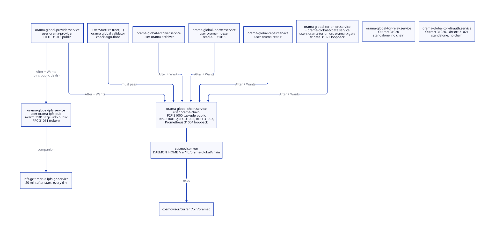
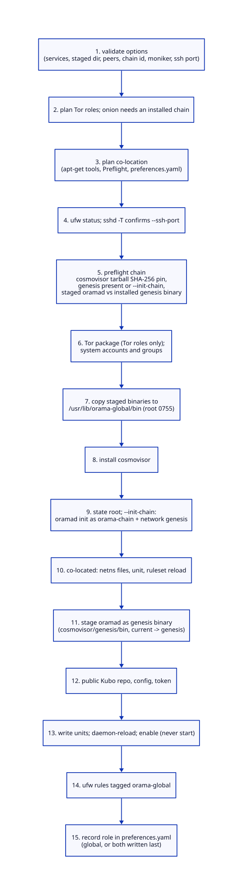
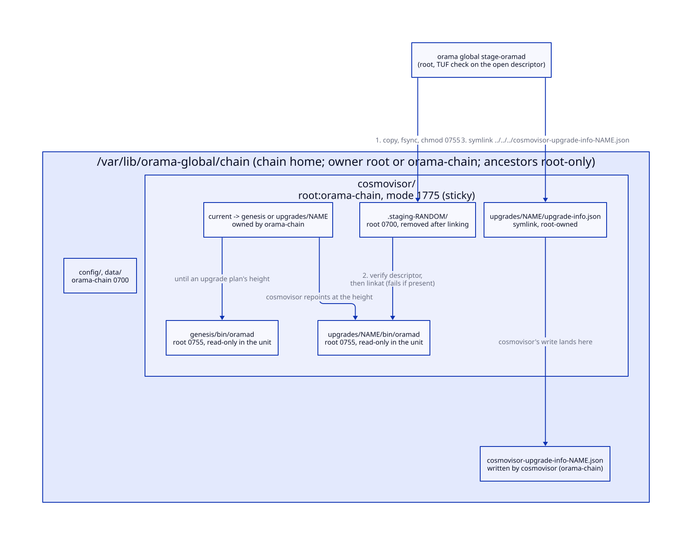
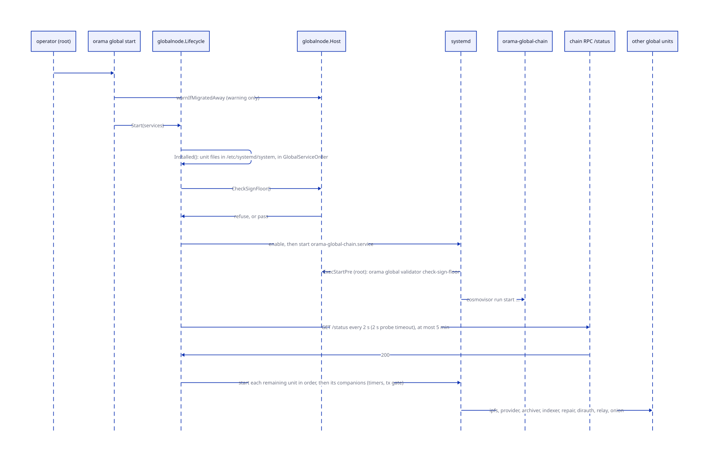
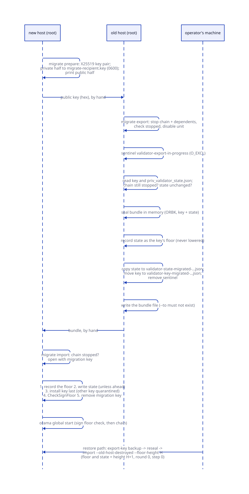
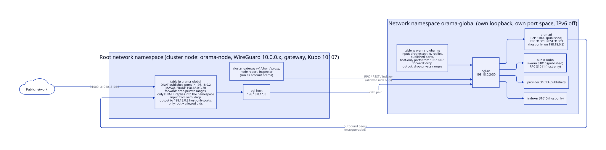
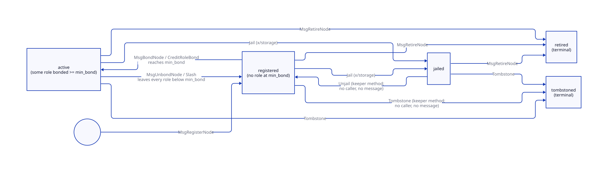
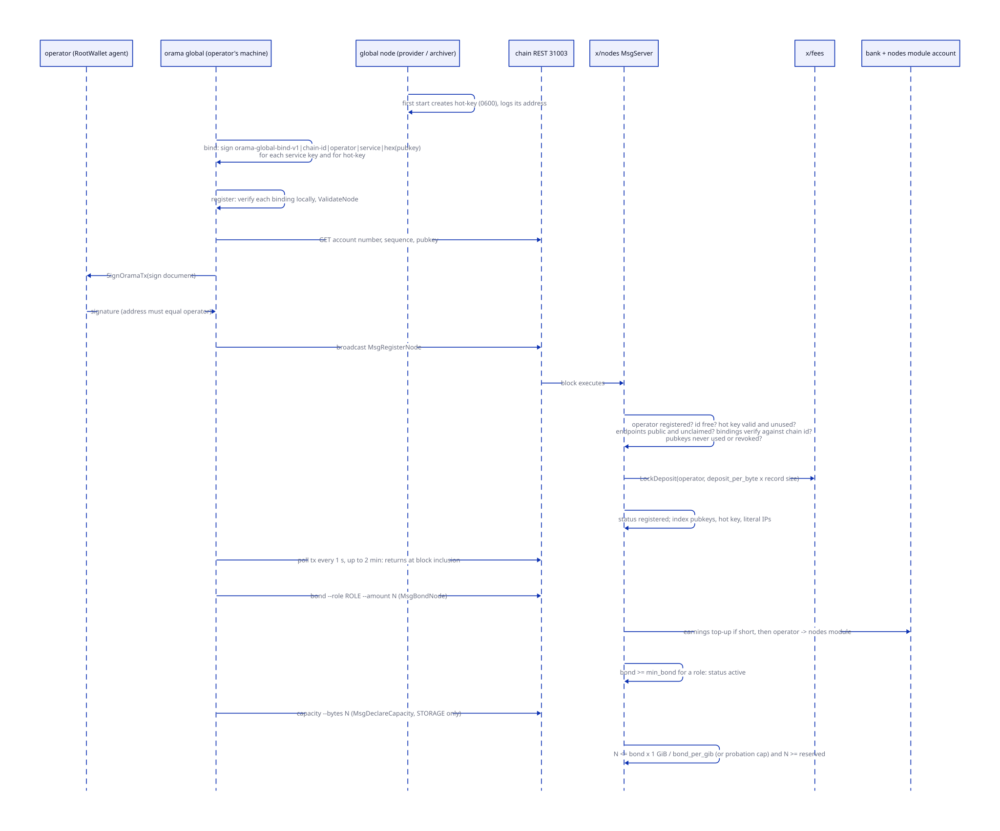

# Global nodes

> **At a glance.**
>
> - **What:** a global node is a machine that runs the public Orama L1 (`oramad`) and, optionally, the services that sit beside it: a public IPFS daemon, the storage provider, the history archiver, the chain indexer, the repair delegate, and the roles of the Orama Tor network. It has no WireGuard interface, no RQLite, no Olric and no gateway, and it is not in any private cluster. A machine can also be a cluster node and a global node at once (`role: both`); the global services then live in their own network namespace, `orama-global`. On chain, the module `x/nodes` is the registry of who runs what: operators, nodes, per-role bonds, service-key bindings, the unbonding queue, declared network identity, an optional public cluster row, and the hot key that signs a node's transactions.
> - **Key numbers:** ports 31000 to 31099 (chain P2P 31000, RPC 31001, gRPC 31002, REST 31003, Prometheus 31004, public Kubo swarm 31010, provider 31013, indexer 31015, Tor ORPort 31020 and DirPort 31021, tx gate 31022); cosmovisor v1.7.3 pinned by SHA-256; RPC wait at most 5 min polled every 2 s; veth pair `198.18.0.0/30`; bond and unbonding defaults: minimum bond 1 ORAMA per role, 21-day unbonding, 14-day network identity lock, 8 endpoints and 8 bindings per node, deposit 68,359 norama per byte of record.
> - **Code:** `core/pkg/globalnode/`, `core/pkg/globalnetns/`, `core/pkg/globalbind/`, `core/pkg/cosmovisor/`, `core/pkg/install/global_install*.go`, `core/cmd/orama/internal/cmd/globalcmd/`, `chain/x/nodes/`.
> - **Depends on:** [the node as a supervisor](../vol1/04-the-node-as-a-supervisor.md) for roles and the boot graph, [privilege and filesystem trust](../vol1/05-privilege-and-filesystem-trust.md) for `rootfs`, [install and upgrade](../vol1/30-install-and-upgrade.md) for the shared installer, [anonymity and Tor](38-anonymity-and-tor.md) for the Tor roles, [chain architecture](39-chain-architecture.md) for the module set around `x/nodes`.


## Why it exists

Orama has two layers. A private cluster is owned by one operator, carries tenant data, and talks to itself over WireGuard. The global layer is public: a chain anyone can read, storage deals anyone can buy, and a Tor network anyone can use. The machines that run the global layer cannot be cluster machines. They have to accept connections from strangers, they hold a consensus key whose theft or duplication is punished by slashing, and they must never be a path into a cluster's overlay.

Four constraints shaped the code.

First, the global services must not share a trust domain with a cluster. A global unit gets no WireGuard route (`IPAddressDeny=` covers `10.0.0.0/8`), cannot see `/opt/orama`, and is not `PartOf` `orama-node.service`, so restarting the supervisor never restarts a validator (`core/pkg/install/global_units.go:globalSandboxTail`). When one machine has to be both, the isolation moves into the kernel: a network namespace with its own firewall (`core/pkg/globalnetns/`).

Second, a validator key is not an ordinary secret. Two processes signing with one key at one height is an equivocation, and the chain slashes 5% and tombstones the validator. The operations that move a key between hosts therefore need a guard that survives a crash, a restart and a hurried operator: the sign floor (`core/pkg/globalnode/floor.go:CheckSignFloor`).

Third, the chain binary is upgraded by a halt at a planned height, and the process that swaps it runs next to the process it replaces. Root has to stage binaries inside a directory tree that the chain account owns without being tricked by that account (`core/pkg/cosmovisor/`).

Fourth, the chain needs to know who the operators are. Storage deals pick slots by operator, network and ASN; the archive pays archivers; relay rewards go to an operator; governance houses weigh operators by days of service. All of that hangs off one registry, `x/nodes`, whose records are signed by an operator's wallet key and whose service keys are proved to belong to that operator.

## The model

**Global role.** A node whose `preferences.yaml` says `role: global`. Its `orama-node` boots a graph of one component (`data-dir`); everything else is a separate unit ([roles](../vol1/04-the-node-as-a-supervisor.md#roles-cluster-global-and-both)).

**Global service.** One of nine installable roles, each one systemd unit and one system account: `chain`, `ipfs`, `provider`, `archiver`, `indexer`, `repair`, `dirauth`, `relay` and `onion` (`core/pkg/install/global_install.go:GlobalServiceOrder`). The word `exit` is not a service: it makes the relay an exit. A service is **standalone** when it never reaches the chain (`dirauth`, `relay`); every other service needs the local chain.

**State root.** `/var/lib/orama-global` (`core/pkg/constants/global.go:GlobalStateRoot`). Root owns it; each service has a subdirectory that its own account owns. Root keeps its own secrets directly in the root: the sign floor, the migration key and copies of migrated validator keys.

**Chain home.** `/var/lib/orama-global/chain`, the `oramad --home` and cosmovisor's `DAEMON_HOME` (`core/pkg/constants/chain.go:ChainHome`).

**Sign floor.** For each validator key, the last height, round and step it signed on a host it was moved from. The chain refuses to start below it.

**Co-located node.** A machine with `role: both`. The cluster stays in the root network namespace. The global units join the namespace `orama-global`, which is joined to the root by a veth pair.

**Operator.** An account registered in `x/nodes`. It signs every message that touches its nodes, from its own wallet key, which never sits on a node.

**Node (on chain).** A record with an id, an operator, a set of roles fixed at registration, a hot key, service-key bindings, public endpoints, per-role bonds, a declared network identity and a status.

**Role.** `VALIDATOR`, `STORAGE`, `RELAY`, `EXIT`, `DIRAUTH` or `ARCHIVER` (`chain/x/nodes/types/params.go:AllRoles`). A role is active only while the node is `active` and that role's bond is at least `min_bond`.

**Binding.** A signature by a service key over `orama-global-bind-v1|chain-id|operator|service|hex(pubkey)`. It proves that the holder of the service key accepts the operator.

**Hot key.** A secp256k1 account whose key lives on the node. The provider, archiver, repair delegate and reporter sign their own transactions with it. A binding named `hot-key` proves the key is the node's.

**Unbonding entry.** Norama escrowed in the `nodes` module account until a completion time.

**Cluster row.** An optional public registry entry: base domain, endpoints, metadata URI. It joins no node to any cluster.

## How it works

### What a global node leaves out

A global node runs none of the private-cluster stack. The node's own supervisor, when the role is `global`, converges one component, `data-dir`, and reports `active` once it is ready (`core/pkg/node/components.go:globalBootComponents`). The chain, the public Kubo and the Tor roles are not boot components, and they are not `PartOf` the node unit, so a supervisor restart cannot touch them. The sandbox every global unit shares closes the other direction: `ProtectSystem=strict`, `NoNewPrivileges=yes`, `PrivateDevices=yes`, `PrivatePIDs=yes`, `RestrictAddressFamilies=AF_INET AF_UNIX`, an empty capability bounding set, `SystemCallFilter=@system-service` minus `@privileged @resources`, `TemporaryFileSystem=/opt/orama:ro`, `InaccessiblePaths=` for the cluster's unit environments, `/etc/wireguard`, `/etc/orama` and the gateway keys, `IPAddressDeny=` for `10.0.0.0/8`, `172.16.0.0/12`, `192.168.0.0/16`, `169.254.0.0/16`, `100.64.0.0/10`, `fc00::/7` and `fe80::/10`, and `IPAddressAllow=localhost` (`core/pkg/install/global_units.go:globalSandboxTail`). The public Kubo and the Tor units add `AF_NETLINK` because libp2p and tor enumerate interfaces; each Tor unit also denies `198.18.0.0/15`, the namespace's own range.

### The service set and its order



`ParseGlobalServices` turns the `--services` list into a set in start order and enforces the dependencies (`core/pkg/install/global_install.go:ParseGlobalServices`):

- Every service except `dirauth`, `relay` and `onion` reaches the chain only on this host's loopback RPC, so `chain` must be in the same list. `onion` may join a machine whose chain unit is already installed.
- `provider` needs `ipfs`: it pins public deals through this host's public Kubo.
- `provider` and `repair` never share a host, because a repair delegate holds repair seeds and a provider must not.
- `dirauth` is itself a relay, so it never goes beside `relay`. `exit` needs `relay` and cannot go with `dirauth`.

| Service | Unit | Account | Public port |
|---|---|---|---|
| `chain` | `orama-global-chain.service` | `orama-chain` | 31000 tcp and udp |
| `ipfs` | `orama-global-ipfs.service`, `orama-global-ipfs-gc.timer` | `orama-ipfs-pub`, group `orama-ipfs-pub-rpc` | 31010 tcp and udp |
| `provider` | `orama-global-provider.service` | `orama-provider` | 31013 tcp |
| `archiver` | `orama-global-archiver.service` | `orama-archiver` | none |
| `indexer` | `orama-global-indexer.service` | `orama-indexer` | none (read API on 31015) |
| `repair` | `orama-global-repair.service` | `orama-repair` | none |
| `dirauth` | `orama-global-tor-dirauth.service`, `orama-global-tor-archive.timer` | `orama-tor-dirauth` | 31020, 31021 tcp |
| `relay` | `orama-global-tor-relay.service`, `orama-global-tor-monitor.timer` | `orama-tor-relay` | 31020 tcp |
| `onion` | `orama-global-tor-onion.service`, `orama-global-txgate.service` | `orama-tor-onion`, `orama-txgate` | none |

The start order is the table's order: chain, Kubo, provider, archiver, indexer, repair, then the Tor roles. Stop runs it backwards. Each dependent unit names the chain with `After=` and `Wants=`, and the provider also names the public Kubo. They are `Wants=`, not `Requires=`: with the chain stopped by hand, systemd does not cascade, and with the Kubo down the provider still starts, fails its pins and declines the slot shortly before its accept window closes (`core/pkg/install/global_units.go:needsIPFS`). The ordering that matters is therefore enforced by the CLI, not by systemd.

### The install path



`orama global install` is a root command that calls `InstallGlobal` (`core/cmd/orama/internal/cmd/globalcmd/install.go`, `core/pkg/install/global_install_apply.go:InstallGlobal`). [Install and upgrade](../vol1/30-install-and-upgrade.md#the-global-layer-installer) places it among the installers; this section is the mechanism. Everything that can refuse does so before the first change to the machine. In order:

1. **Option validation.** The staged directory is required. Persistent peers must each match `40 hex node id @ host : port`, because the list is written into the unit's `ExecStart`. A chain id matches `^[a-z0-9][a-z0-9-]{0,47}$`, a moniker `^[A-Za-z0-9][A-Za-z0-9._-]{0,63}$`. The `ipfs` service needs `--public-storage-gb`. `--init-chain` needs `--genesis` (`core/pkg/install/global_install.go:GlobalInstallOptions`).
2. **Co-location plan,** when `--colocated` is given (below), or a refusal when the machine is already `role: both` and the flag is missing: a plain install would write the units back into the root namespace.
3. **Firewall check.** `ufw status` must say active, or `--enable-firewall` must be given, in which case `sshd -T` must list `--ssh-port` among the ports sshd listens on. Enabling ufw with the wrong port would cut the operator off.
4. **Chain preflight** (`core/pkg/install/global_install_chain.go`, `core/pkg/install/global_install_cosmovisor.go:preflightChain`). The staged cosmovisor tarball (`cosmovisor-v1.7.3-linux-amd64.tar.gz` or `arm64`) must hash to the digest pinned in `core/pkg/constants/cosmovisor.go:CosmovisorTarballSHA256`; the comparison is constant-time. The chain home must already have a genesis unless `--init-chain` will create one. A staged `oramad` must have the same SHA-256 as the genesis binary already in the cosmovisor layout, if there is one.
5. **Apply.** The Tor package is installed for Tor roles. System accounts and the `orama-ipfs-pub-rpc` group are created. Each binary is read from the staged directory through `rootfs` (a directory that root does not own, or that others can write, is refused, and a symlink is never followed) and written to `/usr/lib/orama-global/bin` as root, mode 0755. The cosmovisor binary is extracted from the verified tarball into the same directory. With `--init-chain` the installer runs `oramad init <moniker> --chain-id <id> --default-denom norama` as `orama-chain` through `runuser`, then replaces the generated genesis with the network's after checking its `chain_id`; it refuses a home that already has a genesis, because initialising twice would discard a node's keys. A co-located install then writes the namespace files. The staged `oramad` becomes the cosmovisor genesis binary (below). The public Kubo repo is initialised as its own account at the pinned version (`v0.43.1`, checked by running the staged `ipfs --version` as the Kubo account, not as root), with no `swarm.key`, private ranges filtered and not announced, `Provide.Strategy` set to `pinned`, `StorageMax` set to the declared capacity plus 10% (at least `1GB`), and the RPC behind a bearer token that allows only `add`, `cat`, `pin/add`, `pin/rm`, `repo/gc` and `repo/stat` (`core/pkg/install/installers/ipfs_public.go:PublicKuboConfig`). Units are written mode 0644, then `systemctl daemon-reload` and `enable` run for each. Nothing is started.
6. **Firewall rules.** ufw allows 31000 tcp and udp for the chain, 31010 tcp and udp for the Kubo swarm, 31013 tcp for the provider, 31020 tcp for a relay or authority, and 31021 tcp for an authority, each with the comment `orama-global`, so the cluster's reconcile never deletes them (`core/pkg/install/firewall.go:globalPortSpecs`).
7. **Role.** On a machine with no `preferences.yaml`, the installer writes `role: global`. A machine that already has preferences keeps them, which is how a cluster node installs the global services without becoming a global node by accident (`core/pkg/install/global_role.go:recordGlobalRole`). A co-located install writes `role: both` and `global_netns: orama-global` last, so the node accepts `both` only when the files that role needs already exist.

Running the same install again changes nothing but the bytes of the binaries, with one exception that is refused rather than applied: a different `oramad` than the genesis binary already staged. Changing the chain binary is `orama global stage-oramad` ([below](#cosmovisor-staging)).

The installer does not verify `oramad`, `orama` or `orama-global` against any signature. The release archive does not carry them; the operator stages what they built or verified. The hash pin covers only cosmovisor.

### The chain unit

`RenderGlobalChainUnit` writes the unit (`core/pkg/install/global_units.go:RenderGlobalChainUnit`). Its `ExecStart` is `cosmovisor run start --home /var/lib/orama-global/chain` with `--p2p.laddr tcp://0.0.0.0:31000`, `--rpc.laddr tcp://127.0.0.1:31001`, gRPC on `127.0.0.1:31002`, the REST API on `127.0.0.1:31003`, and `--p2p.persistent_peers` when peers were given. The environment is `DAEMON_NAME=oramad`, `DAEMON_HOME` the chain home, `DAEMON_ALLOW_DOWNLOAD_BINARIES=false`, `DAEMON_RESTART_AFTER_UPGRADE=true` and `GOMEMLIMIT=1GiB`. The Go limit is soft: on a 4 GB machine that shared its memory with IPFS and every namespace, an unconstrained `oramad` heap took the node to 98% (`core/pkg/constants/chain.go:ChainGoMemLimit`). CometBFT v0.39 registers no flag for the Prometheus listener, so the unit only records its address, 31004 on loopback, and the node's `config.toml` sets it.

The unit restarts always, after 5 s, with no start limit, and allows 65,535 open files. `ReadOnlyPaths=` mounts `cosmovisor/genesis` and `cosmovisor/upgrades` read-only for the process. Before every start it runs `ExecStartPre=+/usr/lib/orama-global/bin/orama global validator check-sign-floor`; the `+` runs it as root outside the sandbox, which it needs to read the state root. Because it is an `ExecStartPre`, the guard applies at boot, on a `Restart=always` loop and on a manual `systemctl start`, not only to `orama global start`.

The unit has no WireGuard dependency and its peers must be public addresses: `IPAddressDeny=` covers the private ranges. The stagenet deploy script writes a different chain unit that peers over the WireGuard mesh; it is not this one ([chain architecture](39-chain-architecture.md)). The comment on `ChainP2PPort` in `core/pkg/constants/chain.go` still says the listener is on the WireGuard address; the global unit binds `0.0.0.0`.

`oramad start` refuses a node whose `app.toml` sets `query-gas-limit` to 0 on any chain id that is not a localnet (`chain/cmd/oramad/cmd/commands.go:requireQueryGasLimit`). `oramad init` writes `2000000`. The installer never rewrites an existing `app.toml`.

### Cosmovisor staging



The chain home belongs to `orama-chain`, but root puts binaries in it. A process running as `orama-chain` could plant a symlink where root is about to write, so `core/pkg/cosmovisor/` never resolves a path. `Layout.StageGenesis` and `Layout.StageUpgrade` open `/` and walk to the chain home one component at a time with `O_NOFOLLOW`, checking each descriptor with `fstat` (`core/pkg/cosmovisor/walk_unix.go:openHome`). Every ancestor of the home must be root's and not group- or world-writable (a sticky directory such as `/tmp` is the one exception); the home itself must be owned by root or the chain account. Below the home, every directory is opened from the one before it by file descriptor, and none is looked up by path again.

The tree is:

```
<home>/cosmovisor/genesis/bin/oramad
<home>/cosmovisor/upgrades/<name>/bin/oramad
<home>/cosmovisor/upgrades/<name>/upgrade-info.json -> ../../../cosmovisor-upgrade-info-<name>.json
<home>/cosmovisor/current -> genesis | upgrades/<name>
```

`cosmovisor/` is root-owned, group `orama-chain`, mode 1775. The group can create and replace its own entries there and the sticky bit stops it removing or renaming root's. That is exactly what cosmovisor needs: at the upgrade height it removes and re-creates `current`, a symlink the installer created and chowned to the chain account. `genesis/`, `upgrades/` and everything beneath are root-owned 0755. The second thing cosmovisor writes is `upgrade-info.json` in the upgrade's directory; root puts a symlink there that points up into the chain home, so the write lands in the home and the upgrade directory stays root's and read-only (`core/pkg/cosmovisor/layout.go`, package comment).

A binary enters the tree in `place` (`core/pkg/cosmovisor/stage_unix.go:place`):

1. Refuse if a binary is already there. Nothing is ever replaced.
2. Create a random `.staging-<16 hex>` directory, mode 0700, under `cosmovisor/`.
3. Copy the source into it with `O_EXCL|O_NOFOLLOW`, `fsync`, and set mode 0755 through the open descriptor.
4. Run the caller's `Verify` function on that descriptor. The bytes checked are the bytes installed.
5. `linkat` the staged file into `bin/`, which fails if the name exists, then `fsync` the directory.
6. Remove the staging file and directory. A refused stage also removes an `upgrades/<name>` directory it created, since cosmovisor treats any such directory as a staged upgrade.

`StageGenesis` also creates `upgrades/` so the unit's read-only mount has something to mount, and creates `current -> genesis` only if `current` does not exist; an existing `current` is cosmovisor's and is never repointed. Upgrade names must match `^[a-z0-9][a-z0-9._-]{0,63}$`: cosmovisor lowercases and URI-escapes plan names, and only those characters name the same directory on both sides.

The two callers verify differently. The installer verifies the genesis binary by SHA-256 against the hash it computed when it read the staged file (`core/pkg/install/global_install_cosmovisor.go:fileHasSum`). `orama global stage-oramad` verifies against the TUF release root adopted at `/etc/orama/release-root.json`, through the same descriptor, with `--release-metadata` and `--release-target` (`core/cmd/orama/internal/cmd/globalcmd/stage.go`, [the TUF release root](../vol1/29-build-signing-and-release.md#the-tuf-release-root)). Nothing stages automatically. The auto-update policy refuses mode `auto` for a validator, so each chain upgrade is a command the operator runs (`core/pkg/autoupdate/decide.go:RoleValidator`).

An upgrade is scheduled by governance, not by the node: when an `x/houses` proposal's timelock ends, `x/upgrade` records the plan, and at its height the chain halts with "UPGRADE NEEDED" ([governance and contracts](44-governance-and-contracts.md)). Cosmovisor then points `current` at `upgrades/<name>` and restarts `oramad`. With no staged binary for the plan, the chain stays halted until one is staged. The current build is state-breaking against earlier ones, so a chain home from an earlier build cannot be carried over, and no installed path exists for a patch that changes no consensus behaviour: it is staged as an upgrade plan too.

### Start, stop, restart, status



`globalnode.Lifecycle` drives the units through `systemctl`, run as root (`core/pkg/globalnode/lifecycle.go:Lifecycle`). It finds the installed services by looking for their unit files in `/etc/systemd/system`, in start order. Naming a service that is not installed is an error; so is an empty set.

**Start.** If the chain is among the targets, the sign-floor check runs first, in-process, and a refusal starts nothing. Then `enable` and `start` on the chain unit (enable, because a migration export disables it), and a wait for the chain's RPC. The wait polls `GET /status` every 2 s with a 2 s timeout per probe, for at most 5 min (`core/pkg/globalnode/rpcwait.go:ChainRPCWaitBudget`), because `oramad` replays its last blocks before the RPC listens. If the RPC does not answer, the other services are left stopped and the command fails. On a co-located machine the wait dials `198.18.0.2:31001` over the veth pair instead of loopback. Each remaining service is then started in order, followed by its companions: the Kubo's GC timer, a directory authority's archive timer, a relay's monitor timer, the onion service's tx gate. Starting a chain-dependent service alone requires the chain to be `active`. Starting `dirauth` or `relay` alone requires nothing.

**Stop.** Services stop in reverse start order, each one's companions first. Stopping the chain first stops every installed service that needs it, so the chain is the last of those to go. The standalone Tor roles keep running: a relay never talks to the chain.

**Restart.** Stop then start of the same set. Restarting the chain restarts the chain and its dependents in order, not the standalone roles.

**Status.** `systemctl is-active` for each installed unit. A state with no text, or with whitespace in it, is an error, not a guess.

`systemctl start` on a `Type=simple` unit returns at once, so `orama global start` can report success for a provider that then exits because its `node-id` file is missing. The unit restarts every 5 s with no limit and the loop continues until the file exists.

### The sign floor

A validator signs a vote only if its `priv_validator_state.json` says it has not signed that step. A key copied to a second host together with an old state file can sign a step the first host already signed, with different contents. The sign floor makes that impossible by construction on hosts that ran the migration commands (`core/pkg/globalnode/floor.go:CheckSignFloor`, `core/pkg/globalnode/signstate.go:CheckNotBehind`).

The floor file is `/var/lib/orama-global/validator-sign-floor.json`, mode 0600, one JSON object `{"floors":{"<pub_key base64>":<priv_validator_state.json>}}` (`core/pkg/globalnode/floorstore.go:floorFileFormat`). The key is the public key CometBFT signs as. CometBFT ignores the stored `pub_key` and derives the public key from the last 32 of the 64 bytes of `priv_key`, so that is what the code uses, and it refuses a key file whose `pub_key` names another key; re-encoding the derived bytes means a differently spelled base64 cannot make one key look like two (`core/pkg/globalnode/signstate.go:ValidatorKeyPubKey`). A state is ordered by `(height, round, step)`; it is behind another if it is strictly before in that order.

`CheckSignFloor` runs in this order:

1. Read every floor. A floor file that is not exactly that format (unknown fields, data after the object, no `floors` object) is an error that names the format and how to rewrite the file by hand.
2. If the export sentinel `validator-export-in-progress` exists, refuse.
3. With no floor recorded, pass. A host that never ran a migration command has no guard and needs none.
4. Read the validator key. A missing key with a floor recorded means the key moved to another host; refuse, because `oramad` would otherwise generate a fresh key and a zero state and start signing as a new validator.
5. If no floor is recorded for this key, pass: the key has never been migrated to or from this host.
6. Otherwise read `priv_validator_state.json` and refuse if it is behind the floor.

Every floor update is a read-modify-write under an exclusive `flock` on `validator-sign-floor.lock`, opened without following a symlink, so two concurrent exports or imports cannot lose each other's entry (`core/pkg/globalnode/floorstore.go:updateFloor`). An entry is never removed and a floor is never lowered (`neverLower`).

All of this is trusted only while the state root is root's. `checkStateDir` requires a real directory (a symlink is refused), owned by uid 0, with no group or other write bit. A state root that fails any of these makes every floor, migration and check command refuse.

### Moving a validator key



Migration is three root commands (`core/cmd/orama/internal/cmd/globalcmd/migrate.go`).

`migrate prepare` on the new host generates an X25519 key pair with `nacl/box`, writes the private half to `migrate-recipient.key` (mode 0600) in the state root and prints the public half. A second call prints the same public key. `migrate cancel` deletes the private half.

`migrate export` on the old host:

1. Stops the chain and every service that needs it, checks that the chain unit is `inactive` or `failed`, and disables the unit.
2. Creates the export sentinel with an exclusive create, so of two exports only one proceeds, and any leftover sentinel from an interrupted export blocks both export and start (`core/pkg/globalnode/export.go:ExportMigration`).
3. Reads the key and the state, checks that the chain is still stopped, then reads the state again and aborts if the bytes changed: a chain that started in between may have signed.
4. Seals `{kind, key, state}` in memory with the `ORBK` seal that namespace backups use ([namespace backup](../vol1/17-database.md#namespace-backup)). The node holds only the recipient's public key, so it cannot open what it wrote.
5. Records the state as the key's floor, refusing a state behind a floor already recorded for that key.
6. Copies the state to `validator-state-migrated-<unix>-<16 hex>.json`, then copies the key to `validator-key-migrated-...json` and removes it from the chain home. Both copies are created with `O_EXCL|O_NOFOLLOW`, mode 0600.
7. Removes the sentinel, and only then does the CLI write the bundle file (`--to` must not exist).

From step 6 on, `CheckSignFloor` refuses the old host: the floor is recorded and the key is gone. If the bundle cannot be written the command prints both copy paths; putting both back abandons the migration, and the floor passes because the state is the one it recorded.

`migrate import` on the new host refuses while the chain is running, opens the bundle with the migration key and then, in this order (`core/pkg/globalnode/migrate.go:ImportMigration`): records the source state as the floor (never lowering one); writes the state unless the host's own is already ahead; installs the key last, moving a different key already there to `validator-key-replaced-...json` and leaving the same key alone; runs `CheckSignFloor`; removes the migration key. The order is what makes a failure safe. If anything fails before the key is in place, either the key is not on the host or the floor refuses its state.

A **restore** is the case where the old host is gone. `export-key` seals the key alone to the operator's public key, with the same seal, from a running node. On the operator's machine `reseal` opens that backup with the operator's private key (read from a file of mode 0600, never from the command line) and seals the key to the new host's migration key. The resulting bundle carries no sign state, because nobody knows what a lost host last signed. `import --old-host-destroyed --floor-height H` takes the network's latest committed height H and sets both the floor and the state to height H+1, round 0, step 0: the restored key signs nothing at or below H in any round (`core/pkg/globalnode/signstate.go:RestoreFloor`). It can sign at H+1, so a vote the lost host cast at H+1 is excluded only if that host stopped before H+1 began. A bundle that carries a state refuses the restore flags, and a bundle that does not refuses an import without them. A floor already recorded for that key is never lowered by a lower H.

What the floor does not cover: a copy of the key made any other way (a disk image, a manual copy), or a key put back by hand together with an older state file. The floor lives only on hosts that ran these commands. There is no remote signer topology.

### Co-location: the orama-global network namespace



A machine can be a cluster node and a global node at once, so a small operator can run both layers on one server. The cluster's loopback holds sensitive listeners (Kubo RPC 10107, the gateway's loopback trust, the Caddy admin socket). A global unit that shared that loopback could reach them. So the global units run in a separate network namespace, `orama-global`, with their own loopback and their own port space; both sides can listen on the same port number. Users and state directories were already separate.

`orama global install --colocated` plans the layout before the machine changes (`core/pkg/install/global_netns.go:planNetns`):

- It installs missing `iproute2`, `nftables` and `procps` with `apt-get`, the one change made before the check, since a stock Debian 12 image has no nftables.
- It runs `globalnetns.Preflight`: Linux; `/proc/self/ns/net` exists; systemd 242 or newer (`NetworkNamespacePath=`); and a probe that creates and deletes a throwaway namespace and a veth pair, so a container without `CAP_NET_ADMIN` is refused here and not halfway through; and no route for `198.18.` other than the layout's own (`core/pkg/globalnetns/preflight.go:Preflight`).
- It requires `/opt/orama/.orama/preferences.yaml`, which means a cluster node is installed (and `orama node setup` run later would overwrite the co-located role), and refuses `role: global`.
- It resolves the cluster node's account `orama` to a uid, and every `--chain-client-user` name to a uid. An unknown name or root refuses the install.

The layout (`core/pkg/globalnetns/layout.go`): namespace `orama-global` at `/run/netns/orama-global`; veth ends `ogl-host` (root side, `198.18.0.1/30`) and `ogl-ns` (inside, `198.18.0.2/30`). `198.18.0.0/15` is RFC 2544 benchmarking space, in none of the ranges the units deny, and no provider routes it.

`orama-global-netns.service` is a oneshot that stays active. It first clears what an unclean shutdown left (`ExecStartPre=-`), then sets `net.ipv4.ip_forward=1`, adds the namespace, switches IPv6 off inside it, creates the veth pair with one end in the namespace, switches IPv6 off on the host end, addresses and raises both, adds the default route via `198.18.0.1`, and loads both rulesets. Two `ExecStartPost=` lines read the sysctls back and fail the unit if IPv6 is still on anywhere, because the rulesets are IPv4 only and a namespace with IPv6 could reach the host's link-local address past every drop rule. A kernel booted with `ipv6.disable=1` has no such files and passes. `ExecStop=` deletes the table, the link and the namespace. The unit has no sandboxing, on purpose: `ip netns add` bind-mounts into the host's mount namespace.

Every global unit, the Kubo GC oneshot and the tx gate included, gains `BindsTo=` and `After=orama-global-netns.service`, `NetworkNamespacePath=/run/netns/orama-global` and a read-only bind of `/etc/orama-global/resolv.conf` (`9.9.9.9` and `1.1.1.1`) over `/etc/resolv.conf`, because the host's stub resolver is on the host's loopback (`core/pkg/globalnetns/layout.go:ApplyToUnit`). Timers run no process and stay in the root namespace. The rewrites that move listeners to the namespace address are checked to match exactly once, so a template change that loses a flag fails the install instead of leaving a listener unreachable (`core/pkg/install/global_netns.go:colocatedListeners`): the chain's `--rpc.laddr` and `--api.address`, the indexer's `--rpc` and `--listen`, the tx gate's `--upstream`, and an added `--rpc tcp://198.18.0.2:31001` for the provider, archiver and repair delegate. A relay or authority unit also drops `IPAddressAllow=localhost` for `IPAddressDeny=127.0.0.0/8`, since loopback in the namespace holds the chain's gRPC and metrics.

Two nftables tables, both `table ip` and each replaced in one transaction (`nft -f` of a file that declares, deletes and redefines the table, so a reload never leaves a moment without rules):

- **Root namespace, `orama_global`.** Published ports (every public listener of the installed services) are DNAT'd to `198.18.0.2`; the namespace's outbound traffic from `198.18.0.0/30` is masqueraded; forwarding from `ogl-host` to `10.0.0.0/8`, `172.16.0.0/12`, `192.168.0.0/16`, `169.254.0.0/16` or `100.64.0.0/10` is dropped (the WireGuard mesh is inside `10/8`); only established or DNAT'd connections are forwarded into the namespace; anything arriving on the veth that is not a reply is dropped at `input`, so the namespace cannot reach a cluster service through the host's public or WireGuard address.
- **Namespace, `orama_global_ns`.** `input` has policy drop: loopback, replies, the published ports, and the host-only ports from `198.18.0.1` on `ogl-ns` alone. `forward` has policy drop. `output` drops the private ranges.

The **host-only ports** are the chain's RPC (31001) and REST API (31003), the indexer (31015) and the public Kubo's RPC (31011), whichever are installed. They listen on `198.18.0.2` instead of loopback so the host can reach them, and they are not published: no DNAT, so neither the public network nor the mesh reaches them. Because every local process shares the veth route, the root ruleset's `output` chain lets only root and the allowed accounts connect to them (`meta skuid != { ... } drop`). The allowed set is root, the cluster node's account `orama` (whose gateway proxies `/v1/chain/` and whose node report reads the chain), and any `--chain-client-user` accounts, persisted in `/var/lib/orama-global/netns-chain-clients` so a later install without the flag keeps them. A tenant deployment runs as a systemd dynamic user and is not in the set. IPv4 is enforced twice, by the units' `IPAddressDeny=` and by the kernel rulesets; IPv6 only by the units, and by the namespace having none.

Ufw does not see DNAT'd traffic as input, so a co-located install adds `ufw route allow` rules tagged `orama-global` (one for the namespace's own outbound traffic from `198.18.0.2`, one per published port) and deletes the broader rule that earlier releases added.

`ip_forward` is turned on by the layout. The value it had before the first co-located install is recorded once in `/var/lib/orama-global/netns-prior-ip-forward`; a second install leaves it alone.

Re-installing over a running layout loads the rewritten rulesets into the running namespace (`nft -f` on the host, `ip netns exec orama-global nft -f` inside) but never restarts `orama-global-netns.service`, because every global unit is bound to it and would stop. The Kubo's RPC moves to `198.18.0.2:31011` and the install starts and restarts nothing, so the operator runs `orama global restart`. The cluster gateway reads the chain's endpoints when it starts (`core/pkg/gateway/handlers/chainread/handler.go`), so its `/v1/chain/` route follows the namespace address only after `orama node restart`, which the install prints and does not do: a restart takes the node's quorum duties with it. The node report resolves the endpoints on every report (`core/pkg/telemetry/report/chain.go:chainEndpoints`).

Removing the layout is not built.

### Service-key bindings

A node has one operator key and several service keys. The service keys are not wallet keys: a Tor relay's identity is an ed25519 key the `tor` binary makes, a validator's consensus key is CometBFT's, a hot key is secp256k1. The chain has to be told that each belongs to this operator, and it must not be possible to claim another operator's key. A binding is the proof.

`globalbind` signs and verifies the statement (`core/pkg/globalbind/bind.go:SignBytes`):

```
orama-global-bind-v1|<chain-id>|<operator>|<service>|<lowercase hex pubkey>
```

`operator` is the canonical bech32 account string, because the chain puts that string in the statement and any other spelling would not verify. `service` matches `^[a-z][a-z0-9_-]{0,31}$`. The prefix is a domain separator, and the chain id ties the signature to one network. The package states in its comment that it duplicates `chain/x/nodes/types/binding.go:BindingPrefix` because core imports no chain code; a test pins the two together (`core/pkg/globalbind/bind_test.go:TestSignBytesMatchesChainSource`).

Three key types, two schemes:

- **secp256k1.** The signature is R||S, 64 bytes, S in the low half, over the SHA-256 of the statement: the Cosmos digest. `Verify` rejects a non-canonical scalar or a high S.
- **ed25519.** A normal 64-byte signature from a 32-byte seed.
- **Tor's expanded ed25519 secret.** `tor` stores a 64-byte clamped scalar and nonce prefix, not a seed. `SignExpandedEd25519` derives the public key from the scalar and computes the signature by hand with the `edwards25519` package; the result verifies as ordinary ed25519, so the chain has two key types, not three.

`ReadKeyFile` reads a raw 32- or 64-byte secret (or its hex) or a CometBFT `priv_key` JSON (for ed25519 it keeps the seed, the first 32 bytes of seed||pubkey). A raw 32-byte file is ambiguous between a secp256k1 secret and an ed25519 seed, so `orama global bind` requires `--key-type` for one. It prints JSON with `service`, `key_type`, `pubkey` and `signature` to stdout and the words "binding signed; not submitted" to stderr (`core/cmd/orama/internal/cmd/globalcmd/bind.go`). The private key is read from the file and not written anywhere.

### Operator-side commands

The operator's wallet never touches the node. `orama global register`, `bond`, `unbond`, `capacity` and `retire`, and the validator `unjail` and `edit`, build a transaction body with `core/pkg/clusterreg` and a `SIGN_MODE_DIRECT` sign document (`core/cmd/orama/internal/cmd/globalcmd/submit.go:SubmitDirect`).

- Without `--node`, the command prints the sign document in hex and submits nothing.
- With `--node <chain REST>`, it reads the account number, sequence and public key from the chain, asks the RootWallet agent to sign the document, checks that the agent signed as the operator (the address and public key must match), builds the raw transaction and broadcasts it.
- It then polls the chain once a second for up to 2 minutes (`core/pkg/clusterreg/inclusion.go:InclusionTimeout`) and returns only when the transaction is in a block, printing its hash and height. Admission to the mempool is not success: a transaction the block refuses is reported as a failure with the chain's log, and one not in a block within the timeout is reported with its hash so it can be looked up. A transport failure or a 5xx is classified `Unavailable`, an answer that says no is a `Failure`.
- `--onion` replaces `--node` with a validator's onion service reached only through Tor. An unreachable proxy is an error; there is no clearnet send ([anonymity and Tor](38-anonymity-and-tor.md)).

`register` verifies every `--binding` file locally with `globalbind.Verify` before building `MsgRegisterNode`, so a wrong signature fails on the operator's machine and not as a refused transaction.

No `orama` command builds `MsgRegisterOperator`, which has to precede `register`; it is sent by the Go client in `chain/client/node` or by the stagenet deploy script's helper. No command builds `MsgUpdateNode` either, so an ASN is set at registration only, and there is no rotation path from the CLI. `oramad tx nodes fund-hot-key` builds `MsgFundHotKey`.

### x/nodes: the records



`x/nodes` has eleven messages, six queries and one EndBlocker. It has no authority address, no pause, no governance hook and no message that changes parameters; the genesis values are final (`chain/x/nodes/keeper/keeper.go`, package comment). Every message is signed by the operator that owns the record, every handler runs inside its own cache context (`transact`), and a failure writes nothing.

| Record | Key | Content |
|---|---|---|
| Operator | bech32 address | registration height and time |
| Node | node id | operator, roles, hot key, bindings, endpoints, region hint, ASN, per-role bonds, declared and reserved STORAGE bytes, status, deposit high-water mark, identity timestamp |
| Cluster | cluster id | operator, base domain, public endpoints, metadata URI, status, deposit |
| Unbonding entry | sequence number | node, operator, role, amount, completion time |
| Revoked pubkey | pubkey hex | node, service, reason (retired or tombstoned) |
| Service day | operator, UTC day index | best declared STORAGE volume that day, relay flag |

Ids match `^[A-Za-z0-9][A-Za-z0-9._:-]{0,63}$`. The chain keeps a node's roles as registered; nothing adds or removes a role later. The status of a node is `registered` (no role at its minimum bond), `active` (some role bonded at its minimum), `jailed`, `retired` or `tombstoned`. `refreshStatus` recomputes `registered` and `active` after every bond change and leaves the other three alone (`chain/x/nodes/keeper/store.go:refreshStatus`). Note that "active" is a node property and "role active" a role property: `IsRoleActive` also requires that this role's own bond is at its minimum (`chain/x/nodes/keeper/lifecycle.go:IsRoleActive`).

#### Registering an operator and a node



`MsgRegisterOperator` records the signer. The account must not be the hot key of a live node. It costs only the transaction fee: no deposit and no bond.

`MsgRegisterNode` runs these checks, in order, each failing the whole message (`chain/x/nodes/keeper/msg.go:RegisterNode`):

1. Stateless checks (`ValidateBasic`): canonical addresses, id pattern, hot key different from the operator, a non-empty duplicate-free role set, at least one binding with unique service names and public keys, one `hot-key` binding for this hot key, valid endpoints, region, and ASN.
2. The operator is registered, and the node id is free.
3. The hot key is not an operator and not the hot key of another live node (`HotKeys` index).
4. Each endpoint host is public (below), at most `max_endpoints` (8) are given, and no literal IP among them belongs to another live node (`LiveIPs` index).
5. At most `max_bindings` (8) bindings, each verifying against the block's chain id and the operator.
6. Each service public key is neither revoked nor bound to any other live node, across all key types and all operators.
7. The state deposit is locked (below).

On success the node is `registered` with its identity timestamp set to the block time, and the three indexes are written: live public keys, hot keys, literal IPs. If the node has the `STORAGE` role it is queued for `x/storage` to look at.

**Bindings.** A binding has a service name, a key type, a public key (33 bytes secp256k1 or 32 bytes ed25519) and a 64-byte signature. `VerifyBinding` rebuilds the statement with the canonical operator and the block's chain id (`chain/x/nodes/types/binding.go:VerifyBinding`). Both schemes match `globalbind`. The set of service names is the operator's to choose; two are known to other modules: `hot-key`, and `relay` (an ed25519 key `x/relay` reads as the relay's identity, falling back to the first ed25519 binding).

**The hot key proves possession.** A `hot-key` binding must be exactly one, secp256k1, and the account address of its public key must equal the node's `hot_key`. Without that, an operator could set `hot_key` to an address it does not control, or to another operator's, and aim `MsgFundHotKey` and every hot-key-only message of other modules at a third party. `MsgUpdateNode` enforces the same rule: a new hot key must arrive with bindings containing its own binding, and a replacement of the bindings must keep the current hot key's (`chain/x/nodes/types/hotkey.go:CheckHotKeyBinding`).

**Endpoints.** An endpoint is a URL (`http` or `https`, no userinfo), a multiaddr, or a bare host or host:port, printable ASCII, at most 256 bytes. `chain/netclass` classifies each host and the node's `NetworkOf` and `LiteralIPs` use the same classifier, so a spelling one of them reads as a name cannot be read as an address by another. It parses with `netip` (no zone ids, no leading zeros), refuses any host whose last label is a number (`2130706433`, `0x7f.1`, `127.1`), drops every trailing dot, refuses a host with an empty label, a non-ASCII host, a single-label name, and the local suffixes `.localhost`, `.localdomain`, `.local`, `.internal`, `.lan` and `.home.arpa`. Refused address ranges are the private, loopback, link-local, carrier-grade NAT, documentation, benchmarking, multicast and reserved IPv4 blocks, and for IPv6 everything outside `2000::/3` plus NAT64, discard-only, Teredo, 6to4, documentation, segment-routing, unique-local, link-local, site-local and multicast prefixes (`chain/netclass/netclass.go`). An IPv4-mapped IPv6 address is classified as its IPv4 form. Documentation addresses are therefore not valid endpoints on this chain. For a multiaddr, an `/ip4/` or `/ip6/` part must be a literal of that family.

#### Updating and retiring

`MsgUpdateNode` can replace the hot key, the whole binding set, the endpoints (including with an empty list), the region hint and the ASN (including with 0, through a `set_` flag for each). An update that changes none of them is refused. Replaced service public keys are revoked for good (`RevocationRetired`); a binding that stays is kept. The identity timestamp resets when the ASN changes or the derived network changes. Growth in the record size is charged as an extra deposit part; the deposit never shrinks until retirement.

`MsgRetireNode` requires zero reserved capacity, then in one step revokes every binding, releases the hot key and endpoint addresses, enqueues each positive role bond into the unbonding queue, zeroes the declared capacity, sets `retired` and releases every deposit part. Retirement is final: an id is never reused, and because every public key stays revoked, the same service keys, hot key included, cannot be bound again. A node can be retired from any state but `retired` and `tombstoned`, jailed included.

#### Bonds and unbonding

A bond is norama escrowed in the `nodes` module account, which holds burn permission and nothing else. `MsgBondNode` first lets the operator's earnings cover any shortfall of the bank balance (`FundSpendFromEarnings`, called inside the handler and after every other check, so a rejected bond reverses the top-up with the message), then sends the coins to the module account and adds to that role's bond. A node can only bond a role it registered with.

`MsgUnbondNode` moves an amount out of a role's bond into the queue. It is refused if the amount exceeds the bond, and for `STORAGE` if the declared capacity would exceed what the remaining bond backs. The bond drops at once, so the node can lose `active` and `StorageEligible` immediately; the coins stay in escrow, and slashable, for `unbonding_seconds` (21 days). `EndBlock` pays an entry back to the operator from the module account when its completion time is at or before the block time, collecting every due id from the time index and paying each in its own cache branch (`chain/x/nodes/keeper/abci.go:EndBlock`). An entry that cannot be paid, for example because the bank refuses the recipient, stays queued, emits `nodes_unbonding_failed` and is retried in the next block, so one operator's entry cannot fail `FinalizeBlock` for every validator. A fault that is not about the entry, such as a collection that cannot be decoded, is returned and halts the block.

The invariant the module maintains is that its bank balance equals the sum of all role bonds plus all unbonding entries (`chain/x/nodes/keeper/invariants.go:CheckInvariants`). `Slash` burns the same fraction of the role's bond and of that role's unbonding entries, and the module can burn because it holds the burner permission.

#### Capacity

`MsgDeclareCapacity` sets a `STORAGE` node's declared bytes. The cap is `bond x 1 GiB / bond_per_gib` (truncated), or `probation_capacity_bytes` (1 GiB) when the bond is zero. A declaration below the reserved bytes is refused. A slash clamps the declaration down to the new backing, then clamps reserved bytes down to the declaration: a penalty never fails because the node is busy.

The module maintains a free-capacity index keyed by `(class, operator, node id)` with `class = bits.Len64(free)`, so each class is a half-open power-of-two range. A node is indexed while it has the `STORAGE` role, declares more than it reserved, and is `registered` or `active`; `jailed`, `retired` and `tombstoned` nodes are not indexed (`chain/x/nodes/keeper/capacity.go:resyncCapacity`). No other module calls `ReserveCapacity`, `ReleaseCapacity` or the iterators today; see [Known gaps](#known-gaps).

#### Feeding x/storage

`x/storage` assigns slots only to nodes in its own tracked set. The nodes module keeps that set current without a hook or a scan: every write of a node that has the `STORAGE` role goes through `saveNode`, which queues the node id in the `StorageDirty` key set. At the start of its `BeginBlock` `x/storage` drains the queue (`TakeStorageChanges`) and reconciles each id. A node is tracked while `StorageEligible` holds (role active); a registered, unbonded `STORAGE` node is a probation node (`StorageProbation`) that takes only protocol-deal slots ([storage deals](41-storage-deals.md)). The queue holds only what changed since the last drain, so an idle fleet costs `x/storage` nothing per block.

#### Network identity

Two storage and governance rules need to know a node's network and ASN: protocol-deal slots go to distinct ASNs and distinct /16 networks, and operator houses cap how many members share one. Neither can be proved on chain, so both are declarations by the operator.

- **Network.** Derived, not stored: the first endpoint whose host is a literal public IPv4 address gives its `/16` (`a.b.0.0/16`); a literal IPv6 address gives its `/32`. Hostnames are skipped, because the chain cannot resolve DNS deterministically. A node with no literal-IP endpoint has no network (`chain/x/nodes/types/network.go:NetworkOf`).
- **ASN.** Declared at registration or by update. Zero means undeclared. `AS_TRANS` (23456), documentation ranges (64496 to 64511, 65536 to 65551) and private-use ranges (64512 to 65535, 4200000000 and above) are refused in the message and in genesis (`ValidateASN`).
- **Address uniqueness.** `LiveIPs` maps every normalised literal IP among live nodes' endpoints to its node, so two nodes of one or many operators cannot claim the same address. It does not prove control of the address, and hostnames are not indexed. Retiring a node releases its addresses.
- **Lock.** Each node records `identity_since_unix`, the time it registered or its ASN or derived /16 last changed. `NodeNetwork` and the operator-house view report the identity only after `network_identity_lock_seconds` (14 days) have passed; inside the lock the node counts as unidentified, cannot fill a protocol-deal slot and does not count toward a house's caps (`chain/x/nodes/keeper/identity.go:effectiveIdentity`). The lock is a rolling snapshot: an identity moved to fit a slot draw or a vote does not count for 14 days, which matches the parameter-change timelock. A lock of 0 turns it off, and genesis nodes keep the timestamp the genesis gives them.

What the chain does not do: verify that the operator controls an address, or that the declared ASN is real and its own. Economics (a bond and a deposit per node) and the lock are the bound; a wrong declaration is neither detected nor disputed.

#### Hot key funding

`MsgFundHotKey` moves an amount from the operator's earnings to the fee-only balance of the hot key registered on the operator's own node. The message has no destination field, so the target is always the key that proved possession of itself. The balance can pay a transaction's base fee and cannot be bonded, shielded, deposited or moved on (`chain/x/nodes/keeper/fund_hot_key.go:FundHotKey`). The first funding creates the account for the hot key, because an address with no account cannot sign (the ante handler reads its account number and sequence). It fails for another operator's node, a retired or tombstoned node, a zero amount or more than the operator's earnings, and it follows a rotated hot key.

#### State deposits

Node and cluster records are priced by size. On registration `x/nodes` measures the record's protobuf size, adds 32 bytes of slack for the fields that grow with the deposit, and asks `x/fees` to lock `deposit_per_byte x bytes` from the operator (bank balance first, then earnings): 68,359 norama per byte, about 0.07 ORAMA per KiB (`chain/x/nodes/keeper/store.go:chargeGrowth`). A growing record locks only the growth, under a numbered part. Retirement releases every part; the 99%/1% refund and burn split is inside `x/fees` ([economics](40-economics.md)).

#### Jail, tombstone, slash

These are keeper methods for other modules, not messages (`chain/x/nodes/keeper/lifecycle.go`). `Jail` drops the node out of `active` and out of the capacity index. `Unjail` returns it to `registered` and `refreshStatus` re-activates it if a bond still meets the minimum. `Tombstone` closes a node like a retirement but with reason `tombstoned`. `Slash` burns a fraction in (0, 1] of a role's bond and of its unbonding entries. In the application only `x/storage` calls `Jail` and `Slash`, through the adapter `chain/app/storage_view.go:storageNodes`, which turns an absolute amount into a fraction of the `STORAGE` bond.

#### Service days

`EndBlock` walks every node once and records at most one UTC day per operator. A day counts when the operator has an `active` node with the `STORAGE` role bonded at its minimum and declaring at least `min_service_volume_bytes` (default 1), or an `active` `RELAY` role bonded at its minimum. Several blocks on the same day count once; days with no block are not backfilled. `OperatorServiceDays` returns the count, which `x/houses` reads as eligibility.

#### The cluster registry

`MsgRegisterCluster`, `MsgUpdateCluster` and `MsgRetireCluster` maintain an optional public row: a base domain (lowercase, at least two labels, each at most 63 characters of `[a-z0-9-]`, not an IP), one to eight public endpoints and an `https` metadata URI of at most 256 bytes. It stores no member list, no tenant list and no secret, and registering one joins no node to any cluster. A cluster is not required to run a node, and a retired row's id cannot be registered again. `orama cluster register-onchain` and `retire-onchain` build these messages.

#### Queries, genesis and invariants

The module serves `Params`, `Operator`, `Node`, `Cluster`, `NodeUnbondings` and `Invariants`, over gRPC and REST under `/orama/nodes/v1/`. `NodeUnbondings` returns at most 1,000 entries, because an operator can queue many small unbondings on one node and a public query must not walk them all (`chain/x/nodes/keeper/grpc_query.go:MaxUnbondingsPerQuery`). The core gateway's `/v1/chain/` proxy allows these six ([chain architecture](39-chain-architecture.md)). There is no query that lists nodes or operators.

Genesis validation checks every node as a message would be checked, plus the cross-references: operators exist, unbondings name a node, an operator and a role the node has, no duplicate pubkeys or live addresses, active and registered statuses agree with the bonds, and `next_unbonding_id` is above every existing id. `InitGenesis` re-verifies every binding of a non-closed node against the genesis chain id and requires the `nodes` module account to already hold bonds plus unbonding: it does not mint. The `HotKeys`, `LiveIPs` and `StorageDirty` collections are derived and not exported; they are rebuilt on import, which re-queues every imported `STORAGE` node.

### Services beside the chain

The binary `orama-global` (`chain/cmd/orama-global`) runs the provider, repair delegate, archiver, indexer and reporter. Each is its own unit and account, and each reaches the chain only through the CometBFT RPC (`--rpc`, default `tcp://127.0.0.1:31001`; a co-located unit is given `tcp://198.18.0.2:31001`). Those that sign (provider, archiver, reporter) hold a `hot-key` file in their home: a hex secp256k1 key created with mode 0600 at first start, whose address is logged, and a file that any other user can read is refused (`chain/cmd/orama-global/hotkey.go:loadOrCreateHotKey`). They also read `node-id`, the id the operator registered, and the repair delegate reads `operator`. The services themselves are covered in [storage deals](41-storage-deals.md), [archive and indexer](42-archive-and-indexer.md) and [relay rewards](46-relay-rewards.md).

Bring-up follows from that. The first start of the provider creates `hot-key`, logs the address and exits because `node-id` does not exist; it restarts every 5 s until the operator has registered. The operator needs the secret on the machine that runs `orama global bind` to sign the `hot-key` binding. Only after `register` can `node-id` be written. The provider's public Kubo, `ipfs`, is a separate daemon that is never the private cluster's: its own repo under `/var/lib/orama-global/ipfs`, swarm port 31010, an RPC on 31011, a bearer token in `api-token` (mode 0640, group `orama-ipfs-pub-rpc`, which only the provider joins), and a timer that runs `ipfs repo gc` 20 min after start and every 6 h with up to 30 min of random delay, so a provider is not a free public cache. The GC oneshot passes the token as `--api-auth`, so it is on that process's command line for the length of a run.

## State it owns

| Item | Where | Holds | Written by | Read by |
|---|---|---|---|---|
| Global binaries | `/usr/lib/orama-global/bin` | `oramad`, `orama`, `orama-global`, `ipfs`, `cosmovisor` | the installer, root, 0755 | the units |
| Units | `/etc/systemd/system/orama-global-*.service` and timers | one unit per service, mode 0644 | the installer | systemd |
| State root | `/var/lib/orama-global` | one subdirectory per service | root, then each account | each service |
| Chain home | `/var/lib/orama-global/chain` | `config/`, `data/`, `cosmovisor/` | `oramad`, root for `cosmovisor/` | `oramad`, cosmovisor |
| Validator key and state | `config/priv_validator_key.json`, `data/priv_validator_state.json` | the consensus key, last signed step | `oramad`, the import | `oramad`, `CheckSignFloor` |
| Sign floor | `validator-sign-floor.json`, `validator-sign-floor.lock` | one floor per key | the export and import, root | `CheckSignFloor` |
| Export sentinel | `validator-export-in-progress` | empty file | the export | `CheckSignFloor` |
| Migration key | `migrate-recipient.key` | the recipient's X25519 secret | `migrate prepare`, 0600 | `migrate import` |
| Key copies | `validator-key-migrated-*`, `validator-state-migrated-*`, `validator-key-replaced-*` | copies kept by export and import | root | the operator |
| Public Kubo | `/var/lib/orama-global/ipfs` | repo, `api-token`, `denylist`, `gc.env` | the installer, Kubo | the provider, the GC oneshot |
| Service homes | `provider/`, `archiver/`, `repair/`, `indexer/`, `txgate/`, `tor-*` | `hot-key`, `node-id`, `operator`, stores, torrcs | each service | the same |
| Co-location files | `/etc/orama-global/netns-host.nft`, `netns.nft`, `resolv.conf`, `/etc/sysctl.d/60-orama-global-netns.conf` | rulesets and resolver | the installer | `orama-global-netns.service` |
| Co-location state | `netns-prior-ip-forward`, `netns-chain-clients` | the earlier `ip_forward`, extra allowed accounts | the installer | the installer |
| Preferences | `/opt/orama/.orama/preferences.yaml` | `role`, `global_netns` | the installer | `orama-node` |
| `x/nodes` collections | the `nodes` store key | params, operators, nodes, clusters, unbondings (with time and node indexes), revoked and live pubkeys, service days, free-capacity index, storage queue, hot keys, live IPs | the module | the module and its consumers |
| Bond escrow | the `nodes` module account | bonds plus unbonding | `x/nodes` | `CheckInvariants` |

## Lifecycle

**Install.** `orama global install` enables the units and starts none. `orama global start` brings the chain up, waits for its RPC, and starts the rest. On a machine with no `preferences.yaml` the first run writes `role: global`.

**Registration.** After the chain has synced, the operator signs bindings, registers the operator account (not from the CLI), registers the node, bonds each role, and for storage declares capacity. A node is `registered` until a role meets its minimum bond, then `active`.

**Normal operation.** The chain runs under cosmovisor. Each service signs with its hot key; the hot key pays fees from its own bank balance or earnings, or from a fee-only balance the operator funded with `MsgFundHotKey`. The node report and the inspector read the chain's RPC, the public Kubo and the Tor relay's `monitor.json` ([observability](../vol1/32-observability.md)).

**Chain upgrade.** Governance schedules a plan. The operator stages the binary with `orama global stage-oramad --upgrade <name>` before the height. The chain halts at the height; cosmovisor repoints `current` and restarts it. A global node is not part of `orama rollout` and has no rolling-upgrade protocol of its own: with equal validators a stop of one validator is tolerated up to the chain's fault threshold, and each validator is upgraded by its operator.

**Restart.** `orama global restart` or a reboot. The sign-floor check runs before every start. The units are enabled, so at boot systemd starts them in its own order; the chain's dependents wait for it with `After=` and start whether or not it is up.

**Retire.** `MsgRetireNode` queues the bond for 21 days. Stopping and removing the units is manual: the installer has no removal, and neither does the co-located layout.

**Node loss.** If a host dies, a validator key not migrated before is restored from an `export-key` backup with the restore floor, or the validator is lost. The chain jails a validator that signs fewer than 50% of the last 10,000 blocks for 10 minutes with a 0.01% slash, and slashes and tombstones a double sign (5%) ([chain architecture](39-chain-architecture.md)).

## Failure modes

| Trigger | What the system does | What you observe |
|---|---|---|
| Chain RPC does not answer within 5 min of `start` | the other services are left stopped, the command fails | "the chain started but its RPC did not answer"; `orama global status` shows only the chain |
| Sign floor refuses (state behind floor, key missing with a floor recorded, sentinel present, bad floor file) | `ExecStartPre` fails, the unit does not start; with `Restart=always` it retries every 5 s and fails each time | `systemctl` shows the unit in a restart loop; the journal has "refusing to start the chain" and the cause |
| Export killed part-way | the sentinel stays; every start is refused | the error names the sentinel path; the operator checks whether the key is still in the chain home, then removes the file |
| Bundle file cannot be written after the key left | the key is in `validator-key-migrated-*`; the command prints both copy paths | put both copies back to abandon |
| State root writable by group or others, or not root's | every floor, migration and check command refuses | the error names the directory and the `chmod` or `chown` that fixes it |
| Import into an uninitialised chain home | refused before anything is written | the error says to initialise with `--init-chain` |
| Staged `oramad` bytes differ from the installed genesis binary | the install is refused before any change | the error points to `stage-oramad --upgrade` |
| Cosmovisor tarball hash differs from the pin | the install is refused | the error prints both hashes |
| Upgrade height reached with no staged binary | the chain stays halted | "UPGRADE NEEDED" in the chain log, no new blocks |
| Disk full under the chain home | `oramad` fails to write; with `Restart=always` it loops | the chain stops advancing; the node report shows a non-responsive RPC |
| Clock skew | CometBFT's timeout logic and the unbonding queue use block time, not the host clock | a skewed validator proposes late or rejects proposals; unbonding timing is unaffected |
| Network namespace unit fails, or IPv6 is still on | the unit's `ExecStartPost` fails and, because every global unit is `BindsTo=` it, none starts | `orama global status` shows all units inactive; the journal names the IPv6 file that is not 1 |
| Namespace ruleset reload fails during a re-install | the install fails and names the file; the files are written and load at the next start of the unit | the old rules keep running |
| Provider started before registration | it creates its hot key, logs the address, and exits for lack of `node-id`; restarts every 5 s | a restart loop and a log line naming the missing file |
| `MsgBondNode` with too little bank balance and earnings | the message fails; the earnings top-up is reversed with it | the CLI reports a failure with the chain's log |
| Matured unbonding the bank refuses | stays queued, retried next block | `nodes_unbonding_failed` events |
| Broadcast accepted, block refuses the transaction | the CLI reports a failure with the log | not "registered" |
| Transaction not in a block in 2 min | the CLI reports the hash and stops waiting | look the hash up |

## Trust and security

**The staged binaries.** `oramad` holds the consensus key, `orama-global` holds hot keys and repair seeds, and the `orama` CLI runs as root in `ExecStartPre`. The installer copies them from a root-owned directory without following a symlink, but does not verify them against anything. Whoever stages them is the root of trust. Cosmovisor's tarball is pinned by SHA-256. Later chain binaries go through `stage-oramad`, which checks the TUF release root if the operator has adopted one; without a root it has nothing to check against and refuses.

**Root against the chain account.** Root stages into a tree the chain account owns. The descriptor walk, root-only staging, check-through-descriptor and `linkat` that fails on an existing name mean that a compromised `orama-chain` cannot redirect root's writes or replace a staged binary.

**Key custody.** The operator's wallet key never touches a node; a node holds service keys and a hot key whose loss costs at most the fees it can pay. `validator export-key` seals to a public key the node does not hold, so a compromised node cannot decrypt its own backup. The migration private key sits in the root-only state root, with mode 0600, until an import consumes it.

**What a compromised node can do.** As root: everything on that host, the consensus key included. As `orama-chain`: sign as the validator and read its own state, but not change the staged binaries, the sign floor or the units. As a service account: sign with that service's hot key, which can pay fees only from its own balance and the operator's fee-only funding, and which cannot bond, unbond or retire the node, since those messages are signed by the operator.

**Operators, bindings and keys on chain.** A message that touches a record must be signed by its operator. A service key is bound to one node network-wide, across operators, so an attacker cannot register another operator's relay identity as their own: the signature would have to come from that key, over a statement naming the attacker as operator, and the key would have to be unused. Retired keys are revoked forever, so a stolen, retired key cannot be re-bound. A hot key cannot be an operator, and an account that is a live node's hot key cannot become an operator. Registration is open to any account that pays the fee; there is no admission vote.

**What is declaration only.** ASN and endpoint addresses. A wrong claim is bounded by the bond, the deposit and the 14-day lock, not by verification.

**Co-location.** An attacker in the global namespace (a compromised global service) cannot reach the cluster's loopback, the WireGuard mesh, tenant ranges or the cloud metadata address: dropped in the namespace's own `output`, in the host's `forward`, and by the units' `IPAddressDeny=`. It cannot reach a cluster service through the host's public or WireGuard address: arrivals on the veth are dropped at `input`. An attacker on the host (a tenant deployment) cannot reach the chain's RPC, REST or indexer through the veth: the host's `output` chain admits only root and named accounts. The residue: the rule names accounts, not programs, so any process of the `orama` account (the supervisor, the gateways, everything they supervise), of root, or of a `--chain-client-user` account can reach those ports. A tenant deployment's dynamic user cannot. There is one kernel and one root. The layout has been tested by an integration test that creates the namespace for real (`core/pkg/globalnetns/integration_linux_test.go`), but it is Linux-and-root only and not part of `make test` on other systems.

**What the unsafe RPC routes expose.** CometBFT's RPC has its unsafe routes off (`rpc.unsafe = false`, which `oramad init` writes and the chain unit never overrides).

## Limits and scale

- `EndBlock` of `x/nodes` walks every node once per block to record service days (`chain/x/nodes/keeper/abci.go:recordServiceDays`), reads one service-day row per qualifying operator, and collects every matured unbonding. Cost grows linearly with the number of registered nodes and is paid by every validator in every block. At the current fleet size this is not visible; at some thousands of nodes it becomes block time. It is the module's first bottleneck.
- `houseOperators` walks all nodes and all operators when governance reads eligibility, and `CheckInvariants` walks all nodes and all unbondings; the second runs at genesis and on the query.
- Per node: 8 endpoints, 8 bindings, ids of 64 characters, endpoints of 256 bytes, a region hint of 64 characters. The absolute caps `Params.Validate` accepts are 64 each.
- A node's record is a deposit: a fleet of ten thousand nodes of about a kilobyte locks about 700 ORAMA.
- Operators are free to register apart from the fee. Nothing bounds how many operator rows exist.
- There is no list query for nodes or operators; a client must know ids or use the indexer ([archive and indexer](42-archive-and-indexer.md)).
- On the node: one chain per host (the home and ports are fixed), one namespace per machine, one extra veth pair `198.18.0.0/30`. `198.18.0.0/24` must be free of other routes.
- RPC wait at most 5 min, which bounds how long `start` can block.
- Ten times the validators: the sign-floor and migration code is per-host and does not change. What changes is the chain's own committee behaviour ([chain architecture](39-chain-architecture.md)) and the `EndBlock` walk above.

## Design decisions

### Units beside the supervisor, not components of it

*Chosen:* every global service is its own `orama-global-*` unit, started by `orama global`, never `PartOf` `orama-node.service`. *Rejected:* making the chain a boot component. *Why:* restarting the supervisor must not restart a validator or a relay; a validator that misses blocks because of a node upgrade is slashed. The cost is that ordering is done by a CLI, not by the unit graph.

### One network namespace, not a second machine or a container

*Chosen:* the `orama-global` namespace with a veth pair and two nftables tables. *Rejected:* the global services in the root namespace with firewall rules alone. *Why:* the cluster's loopback holds trust (the gateway's loopback trust, Kubo's RPC, Caddy's admin socket); a namespace removes the loopback instead of policing it. Both sides can use the same port numbers, and the global side has no route into the mesh.

### Host-only ports on the namespace address

*Chosen:* the chain's RPC and REST, the indexer and the Kubo RPC listen on `198.18.0.2` and are admitted from `198.18.0.1` for named accounts only. *Rejected:* publishing them, or a Unix socket proxy. *Why:* the cluster gateway and node report need them; nothing else may have them.

### Sign floor kept per key, in root's directory

*Chosen:* a file of floors keyed by public key, written under a lock, never lowered, plus an export sentinel. *Rejected:* only deleting the key on export, or only relying on CometBFT's own state file. *Why:* a deleted key lets `oramad` generate a fresh one; the state file lives in a directory the chain account can write. The floor lives where only root can write and is checked before every start.

### Root stages by file descriptor

*Chosen:* the fd-relative `O_NOFOLLOW` walk, a root-only staging directory and `linkat`. *Rejected:* `cosmovisor`'s own download, or `os.Rename` into place. *Why:* the chain account owns the home; any path-based write by root can be redirected. Verifying the open descriptor means the bytes checked are the bytes linked.

### Cosmovisor with downloads off

*Chosen:* `DAEMON_ALLOW_DOWNLOAD_BINARIES=false`, binaries staged by the operator. *Rejected:* letting cosmovisor fetch the binary named in an upgrade plan. *Why:* a plan is data; a binary is code that signs. A plan with no staged binary halts the chain instead of running something unverified.

### Bindings, not wallet signatures, for service keys

*Chosen:* each service key signs a statement naming the operator and the chain. *Rejected:* trusting the operator's claim. *Why:* otherwise any operator could register another operator's relay or hot key. The statement is signed with the service key itself, so the chain verifies possession without the key ever leaving the node.

### Hot key distinct from the operator, and funded through a message with no destination

*Chosen:* a node signs with a hot key, funded by `MsgFundHotKey`. *Rejected:* services signing as the operator. *Why:* the operator key must stay off the node. A funding message with no destination field cannot be aimed at a third party.

### Declared identity with a lock

*Chosen:* ASN and endpoints are declarations; identity counts after 14 days. *Rejected:* an oracle for ASN, or no lock. *Why:* an oracle would be a new trust point. The lock makes moving identity to fit a vote or a slot draw cost more than the vote can be held open.

### No governance over x/nodes parameters

*Chosen:* no authority, no `MsgUpdateParams`. *Rejected:* governance-tunable bonds. *Why:* the module is part of the set of rules that stay fixed after genesis; changing them needs a new genesis.

## Known gaps

- `MsgRegisterOperator` and `MsgUpdateNode` have no `orama` command. A new operator needs the Go client in `chain/client/node` or the stagenet helper, and an ASN, endpoints or hot key cannot be changed from the CLI (`core/cmd/orama/internal/cmd/globalcmd/register.go`).
- The roles `VALIDATOR`, `EXIT` and `DIRAUTH` have no consumer on chain: no module reads them, so bonding them has no effect beyond making the node `active`. A `VALIDATOR` role bond does not feed `x/power` (`chain/x/nodes/keeper/lifecycle.go:IsRoleActive`).
- `Unjail`, `Tombstone` and `CreditRoleBond` have no caller in the application. `x/storage` jails a node and nothing can un-jail it; the operator can only retire it. The comment on `CreditRoleBond` says `x/power`'s force-bond path uses it, but that path does not (`chain/x/nodes/keeper/lifecycle.go:CreditRoleBond`).
- `ReserveCapacity`, `ReleaseCapacity` and the free-capacity iterators have no caller outside tests: `x/storage` keeps its own reservations and reads `DeclaredCapacityBytes`. The index and its maintenance on every node write are unused work, and `reserved_capacity_bytes` is always zero (`chain/x/nodes/keeper/capacity.go`).
- The fee-free registration quota (C2) is not implemented. `MsgRegisterOperator` costs the transaction fee and nothing else.
- `x/nodes` has no list queries.
- A global node cannot be removed by the CLI. The installer has no uninstall for a service or for the co-located layout.
- A host that stages the first `oramad` trusts the operator's staging directory. No TUF check runs at install; only `stage-oramad` verifies. A patch release that changes no consensus behaviour has no installed update path.
- The shielded verifier binary `orama-orchard-verifier` is not staged by `orama global install`; `oramad` looks for it in the chain home and a node without it accepts no shielded bundle.
- A remote signer (TMKMS, Horcrux) and sentry topologies are not supported.
- The sign floor protects only hosts that ran the migration commands. A key copied by hand carries no floor.
- `orama global start` reports success for a unit systemd has started but that exits at once (the provider before registration).
- `core/pkg/globalnetns/enter_linux.go:InNamespace` is called only by an integration test. `core/pkg/globalnode/lifecycle.go:DefaultLifecycle` says the co-located RPC wait probes "from inside" the namespace; it dials the namespace address from the host.
- The renderers `RenderGlobalRelayUnit`, `RenderGlobalSBWSUnit` and `RenderGlobalReporterUnit` in `core/pkg/install/global_units.go` are installed by nothing; the reporter binary exists in `orama-global`, but no installer role writes its unit. The comment on `core/pkg/constants/chain.go:ChainP2PPort` still says the listener is on the WireGuard address.
- `MsgRegisterNode` stores a hot key's public key as a binding but does not require the node's `STORAGE` role to register with a particular hot-key service name beyond `hot-key`; other modules' use of service names (`relay`) is by convention only (`chain/app/relay_view.go:RelayBinding`).

## Verify it yourself

**Unit tests** (all in `make test`):

- `core/pkg/globalnode/`: `TestMigration_movesKeyAndStateAndRecordsTheFloor`, `TestExportMigration_oldHostCannotStartAgain`, `TestExportMigration_chainStartedDuringExportAborts`, `TestExportSentinel_leftoverBlocksExportAndStart`, `TestCheckSignFloor_refusesATargetBehindTheSource`, `TestUpdateFloor_concurrentWritersKeepEveryKey`, `TestImportMigration_stateWriteFailureInstallsNoKey`, `TestReseal_restoreStartsAtTheGivenFloor`, `TestLifecycleStart_chainFirstThenRPCThenServices`, `TestLifecycleStop_chainStopsDependentsFirst`, `TestLifecycleStart_rpcDownLeavesServicesStopped`.
- `core/pkg/globalnetns/`: `TestRenderHostRules_onlyRootAndTheClusterAccountReachTheHostOnlyPorts`, `TestRenderRules_replaceTheirTableAtomically`, `TestRenderUnit_failsWhenIPv6CouldNotBeSwitchedOff`, `TestPreflight_refusals`, `TestApplyToUnit_joinsTheNamespace`. The layout built for real is `make -C core test-netns` (build tag `netns_integration`, Linux and root only), whose tests check that the same address binds on both sides, that a listener on the root loopback, on `0.0.0.0` and on `198.18.0.1` is unreachable from inside, and that private ranges are unreachable from the namespace.
- `core/pkg/cosmovisor/`: `TestStageUpgrade_symlinkedUpgradesDirIsRefused`, `TestStageUpgrade_tamperedBinaryIsNotStaged`, `TestStageUpgrade_refusedStageLeavesNoUpgradeDirectory`, `TestStageGenesis_leavesAnExistingCurrentAlone`.
- `core/pkg/globalbind/`: `TestSignBytesMatchesChainSource`, `TestSignExpandedEd25519_matchesStandardSign`.
- `core/pkg/install/`: `TestInstallGlobal_secondRunIsIdempotent`, `TestInstallGlobal_inactiveFirewallRefusedBeforeAnyChange`, `TestInstallGlobal_colocatedMovesTheChainListenersToTheNamespaceAddress`, `TestInstallGlobal_reinstallFailsWhenARunningLoadFails`, `TestColocatedListeners_refuseATemplateThatLostTheFlag`.
- `chain/x/nodes/keeper/`: `TestRegisterNode_hotKeyMustProveItself`, `TestRegisterNode_literalIPBelongsToOneNode`, `TestNodeNetwork_identityCountsOnlyAfterTheLock`, `TestUnbondTiming_andSlashDuringUnbonding`, `TestEndBlock_anUnpayableUnbondingDoesNotHaltTheBlock`, `TestBondNode_rejectedBondLeavesEarningsAndBankAlone`, `TestInvariants_breakWhenStateIsCorrupted`, `TestGenesisRoundTrip`; and in `chain/x/nodes/types/`, `binding_vector_test.go`.

**Fleet e2e** (the owner runs the fleet suite): `e2e/features/chain-global/` covers the operator commands (bind, the sign documents of register, bond, capacity and retire, validator unjail and edit, migrate prepare and cancel, `export-key`, `reseal`, `check-sign-floor`, the refusals of `install`) and co-hosting of the chain unit; `e2e/features/chain-global-destructive/` covers `orama global stop`, `start` and `restart` and the key migration round trip and the restore on a live validator; `e2e/features/chain-hotkey-archive/` covers the hot key and archiver.

**Read-only on a node, as root:**

- `orama global status` lists each installed service, its unit and its `systemctl is-active` state.
- `curl http://127.0.0.1:31001/status` (on a co-located machine `curl http://198.18.0.2:31001/status`) is the chain's CometBFT status.
- `orama global validator check-sign-floor` exits 0 when the chain may start. `ls -l /var/lib/orama-global` shows `validator-sign-floor.json` when a migration ran on this host.
- `ls -l /var/lib/orama-global/chain/cosmovisor` shows `current` and the staged binaries. `readlink /var/lib/orama-global/chain/cosmovisor/current` shows which is running.
- On a co-located machine: `ip netns list`, `nft list table ip orama_global`, `ip netns exec orama-global nft list table ip orama_global_ns`.

**Read-only on the chain:**

- `orama chain node <node-id>` prints the `x/nodes` record. `orama chain query orama.nodes.v1.Query/Params` prints the parameters. `orama chain query orama.nodes.v1.Query/Invariants` prints the three invariants and their detail.
- `orama monitor chain` shows the node's view of the chain (height, sync, validators) and `orama node report` the chain, Kubo and relay sections.
- REST on the node: `/orama/nodes/v1/node/<id>` and `/orama/nodes/v1/node-unbondings/<id>` on port 31003.
