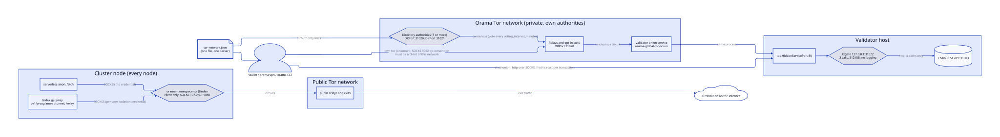
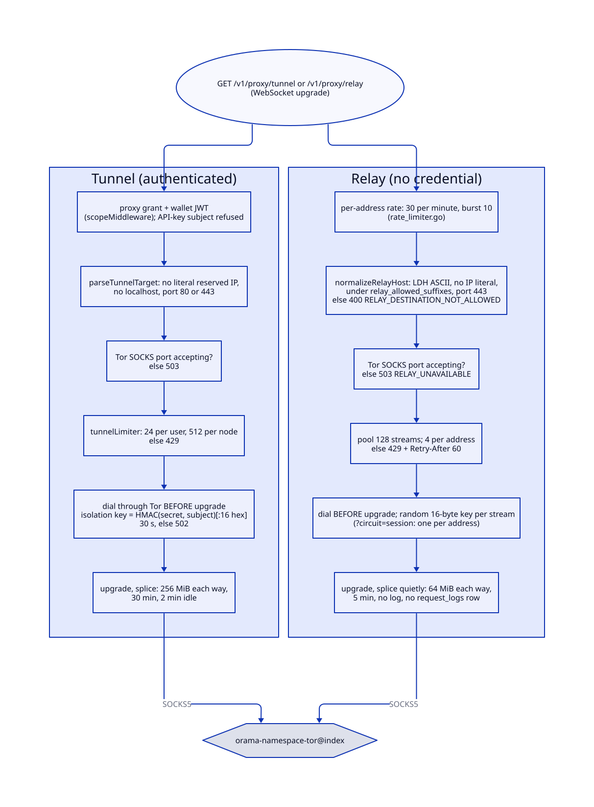
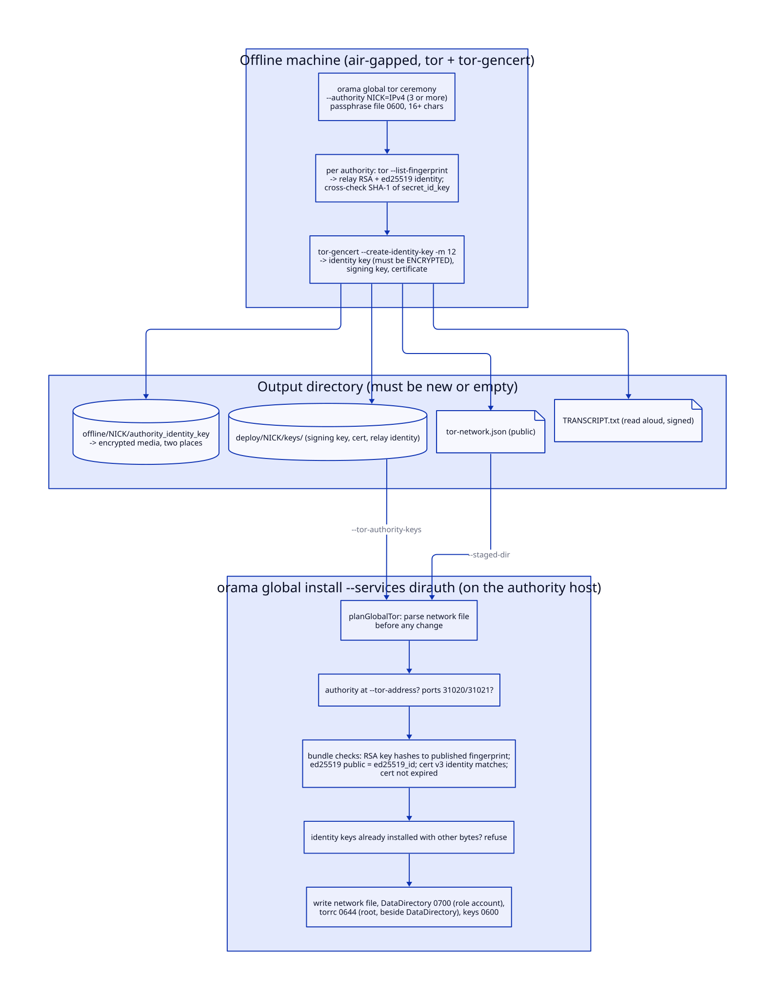
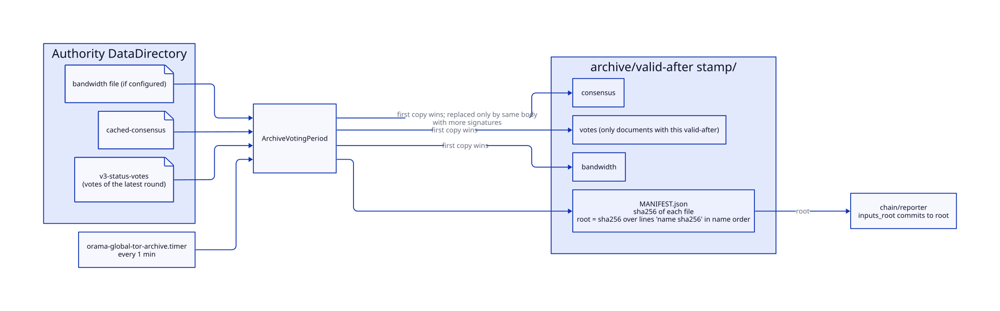
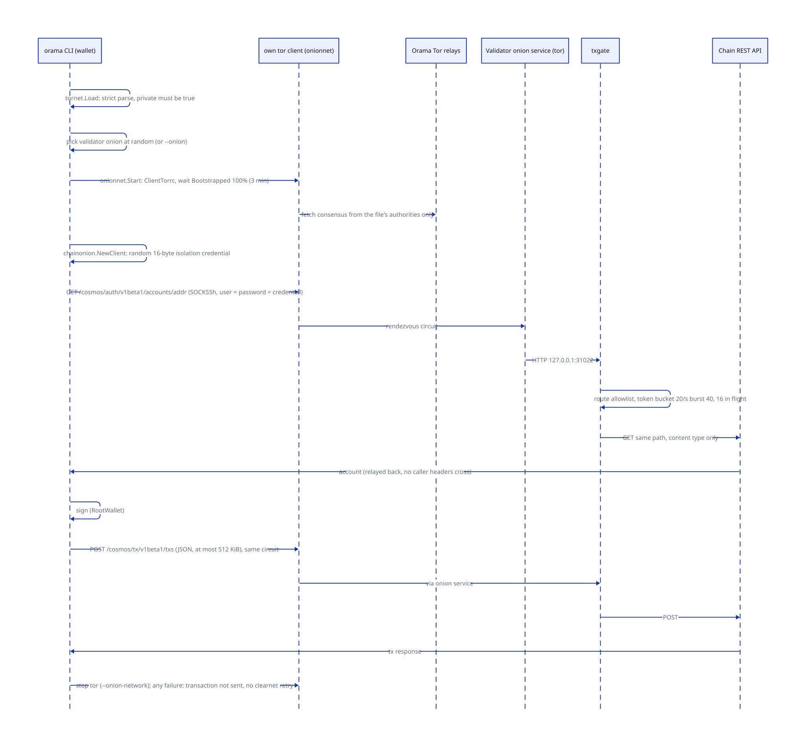
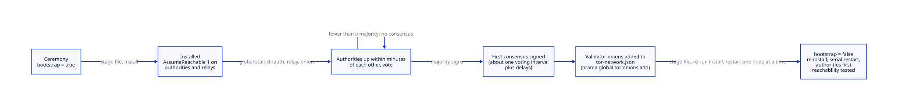

# Anonymity and Tor

> **At a glance.**
>
> - **What:** two separate uses of Tor. Every cluster node runs a client-only Tor on the public Tor network, and the gateway uses it for three anonymising routes (`/v1/proxy/anon`, `/v1/proxy/tunnel`, `/v1/proxy/relay`) and the `anon_fetch` serverless host function; there is no direct path. Separately, the global layer runs the Orama Tor network: unmodified upstream Tor under Orama's own directory authorities, relays, opt-in exits and per-validator onion services, so a wallet can submit a chain transaction without its address reaching the validator. Clients of that network (`orama vpn`, transaction commands) bootstrap from one strict network file and never fall back to the clearnet or the public Tor network.
> - **Key numbers:** node Tor SOCKS `127.0.0.1:9050`; client of the Orama network `9052` by convention, `orama vpn up` offers `127.0.0.1:9150`; ORPort 31020 and DirPort 31021 (`core/pkg/constants/global.go`); tx gate `127.0.0.1:31022`, 3 calls, 512 KiB broadcast body, 20 requests per second with a burst of 40, 16 in flight, no logging; at least 3 authorities, 12-month signing certificates; client bootstrap timeout 3 min; tunnel 24 per user and 512 per node, 256 MiB each way, 30 min, 2 min idle; relay 128 streams, 4 per address, 64 MiB each way, 5 min.
> - **Code:** `core/pkg/anonproxy/`, `core/pkg/tornet/`, `core/pkg/onionnet/`, `core/pkg/chainonion/`, `core/pkg/txgate/`, `chain/x/vpnlaunch/`; the gateway handlers `core/pkg/gateway/anon_proxy_handler.go`, `core/pkg/gateway/anon_tunnel_handler.go`, `core/pkg/gateway/relay_tunnel_handler.go`; the installers `core/pkg/install/global_install_tor.go` and `core/pkg/install/installers/tor.go`; the CLI under `core/cmd/orama/internal/cmd/globalcmd/` and `core/cmd/orama/internal/cmd/vpncmd/`.
> - **Depends on:** [the node as a supervisor](../vol1/04-the-node-as-a-supervisor.md) for the unit that runs the node's Tor client, [authorization](../vol1/14-authorization.md) for the `proxy` grant, [rate limits and egress controls](../vol1/27-rate-limits-and-egress-controls.md) for the shared reserved-range list, [global nodes](37-global-nodes.md) for the global role, the co-located namespace and the chain that the tx gate fronts, and [relay rewards](46-relay-rewards.md) for the reporter that pays relays.

## Why it exists

Orama has two anonymity problems that look alike and have opposite requirements.

The first is egress on behalf of users. An application that runs on Orama (a chat client, a serverless function calling a third-party API) sometimes needs the destination not to learn who asked. The node can offer that only by sending the traffic through an anonymity network that already has many exits. Building exits is pointless for this purpose: a few Orama exits would be a small anonymity set, owned by one operator. So the node's Tor client joins the public Tor network. The cost is that the gateway sits between the user and Tor, which forces a careful account of what the gateway can see (see [Trust and security](#trust-and-security)).

The second is submission of chain transactions. A wallet that posts a transaction to a validator over HTTPS tells the validator its IP address, and a validator that logs it can tie an address to a person. Tor hides the sender, but a public-Tor exit would see the transaction in the clear, and a public-Tor client has no way to reach a service that exists only inside the Orama network. An onion service solves both ends: the wallet connects to the validator's onion address, the validator never sees the wallet's address, and the traffic never leaves Tor. For the onion services to be useful before the public network is large enough to trust, Orama runs its own network: its own directory authorities, its own relays, its own consensus. Its anonymity set is small today, and the code says so (`core/pkg/tornet/network.go:ErrPublicNetwork` refuses any network file that claims otherwise).

Four constraints shape everything below.

- **No direct path, ever.** A caller that asked for anonymised egress must not be downgraded to the node's address, and a transaction that was supposed to go over an onion service must not be sent in the clear. Every client in this chapter fails closed.
- **Unmodified upstream Tor.** Orama does not fork or reimplement Tor. It renders torrc files, runs the `tor` binary, and reads Tor's own files. The Tor Project's apt repository supplies the binary, with a pinned archive key.
- **The gateway is not an anonymity provider.** It is a convenience for clients that cannot run Tor. The relay route (see [The anonymous relay](#the-anonymous-relay)) exists because a node that serves a request must not learn the requester's address, and an authenticated route cannot give that.
- **Identity material stays offline.** The authority identity key signs only certificates; it never lives on a server.

## The model

**Node Tor client.** `orama-namespace-tor@index`, a client-only Tor process on every cluster node, listening on `127.0.0.1:9050` (`core/pkg/constants/tor.go:TorSOCKSAddr`). It belongs to the public Tor network. Its users are the three gateway routes and `anon_fetch`.

**Orama Tor network.** A second Tor network built from the same Tor code. A client of it knows only the directory authorities in its network file and ignores Tor's built-in authorities. A client of the public network resolves no address that exists in it, and the reverse.

**Network file.** `tor-network.json`: the network's name, voting schedule, directory authorities, optional validator onion addresses, and four switches (`private`, `bootstrap`, `allow_exit`, `allow_shared_subnets`). It is public, written once by the key ceremony, shipped beside the release binaries, and parsed by exactly one function, `core/pkg/tornet/network.go:ParseNetwork`.

**Directory authority.** A Tor relay that also votes on the consensus. Each authority has two identities: a relay identity (an RSA key, whose SHA-1 is the `fingerprint`, and an ed25519 master key) and an offline authority identity key (whose SHA-1 is the `v3_ident`) that signs the authority's 12-month signing certificate.

**Relay and exit.** A relay carries other people's circuits. An exit is a relay with an exit policy that allows traffic out to the internet. An Orama node is a relay unless installed otherwise; an exit is opt-in per host and per network.

**Validator onion service.** A v3 hidden service published by a tor client process on a validator host. It forwards port 80 to the tx gate on loopback.

**Tx gate.** A small HTTP server (`core/pkg/txgate/`) between the onion service and the chain's REST API. It forwards three calls and refuses everything else.

**Isolation credential.** The SOCKS username and password sent to Tor. Tor does not authenticate with them; it uses them as a circuit selector. Two streams with different credentials never share a circuit.

**Roles.** What `orama global install --services` can add on a global host:

| Role | Unit | Account | Public ports |
|---|---|---|---|
| `dirauth` | `orama-global-tor-dirauth.service`, `orama-global-tor-archive.timer` | `orama-tor-dirauth` | 31020/tcp, 31021/tcp |
| `relay` | `orama-global-tor-relay.service`, `orama-global-tor-monitor.timer` | `orama-tor-relay` | 31020/tcp |
| `relay,exit` | the relay's unit with an exit policy | `orama-tor-relay` | 31020/tcp |
| `onion` | `orama-global-tor-onion.service`, `orama-global-txgate.service` | `orama-tor-onion`, `orama-txgate` | none |
| client | not a node role: `orama vpn`, `--onion-network`, or a wallet's own tor | the user | none (loopback SOCKS) |

(`core/pkg/install/global_units.go`, `core/pkg/install/global_install_tor.go`, `core/pkg/constants/global.go`.) A directory authority is a relay, so a host runs `dirauth` or `relay`, never both: `requireOneTorPublisher` refuses the second whichever came first. Each role has an account of its own, not the Tor package's `debian-tor`, because an onion service that anyone on the network can reach must not share a uid with an authority's signing key on the same machine.

## How it works

### The node's Tor client

`core/pkg/install/tor_setup.go:PhaseTorSetup` runs on install and on upgrade (in the upgrade, before the node's services stop, so a failure leaves the node serving); `PhaseTorEnsure` runs again after the post-swap re-exec and touches the network only when Tor or its repository is missing. A failure in either is fatal: a node that silently lacked Tor would serve the proxy routes as 503s. In order:

1. `core/pkg/install/installers/anyone_legacy.go` removes the Anyone network that Tor replaced: it stops and disables four units (`orama-namespace-anyone-client@index`, `orama-anyone-client`, `orama-anyone-relay`, `anon.service`), purges the `anon` and `nyx` packages, and deletes the apt source and key, `/etc/anon`, `/var/lib/anon` (relay keys included), `/var/log/anon` and the files Orama wrote. Every step checks first, so the cleaner is a no-op on a node that never had Anyone. A masked unit is unmasked before it is disabled.
2. `core/pkg/install/installers/tor_installer.go:TorInstaller` masks `tor.service` and `tor@default.service` and stops them if running, before the package is installed, because the package would start them and bind 9050.
3. It adds the Tor Project's apt repository (`deb.torproject.org`) for the OS codename unless the source file is exactly the one it writes, and the keyring package is installed. Supported codenames are `bookworm`, `trixie`, `jammy`, `noble` and `resolute`; any other is refused with an error that names them. The archive key is downloaded (at most 256 KiB, 60 s), imported into a throwaway gpg home, and refused unless it holds exactly one primary key with fingerprint `A3C4F0F979CAA22CDBA8F512EE8CBC9E886DDD89` (`core/pkg/install/installers/tor_keyring.go:VerifyTorArchiveKey`). Only that key is exported to the keyring apt trusts, so no other packet in the downloaded file can reach it.
4. `apt-get install tor deb.torproject.org-keyring`. Because install upgrades Tor, every Orama upgrade upgrades Tor.
5. `core/pkg/install/installers/tor.go:GenerateTorrc` writes `/etc/orama/tor/torrc`: `SocksPort 127.0.0.1:9050 IsolateSOCKSAuth`, `ClientOnly 1`, `ORPort 0`, `DirPort 0`, `ExitRelay 0`, `ClientRejectInternalAddresses 1`, `DataDirectory /var/lib/orama-tor`. `IsolateSOCKSAuth` is Tor's default; it is written out because the tunnel depends on it.

The supervisor starts the unit through `core/pkg/namespace/index_host.go:EnsureTor` in the `edge-aux` component; a missing torrc is an error, not a skip. The unit (`core/systemd/orama-namespace-tor@.service`) runs `/usr/bin/tor -f /etc/orama/tor/torrc` as `debian-tor` with `Restart=always`, no start limit, `MemoryMax=1G`, `LimitNOFILE=65536`, `MemoryDenyWriteExecute`, an empty capability set and `IPAddressDeny` for 10.0.0.0/8 (which includes the WireGuard overlay), 172.16.0.0/12, 192.168.0.0/16, 169.254.0.0/16, 100.64.0.0/10, fc00::/7 and fe80::/10, with loopback allowed for the SOCKS listener. Tor reaches only public relays, whatever a caller asks for.

`core/pkg/anonproxy/socks.go` is the only dialer. `Address()` returns the shared constant, `Running()` is a 200 ms TCP probe of the SOCKS port, `NewHTTPClient()` returns an `http.Client` whose every connection is a SOCKS5 CONNECT, and `DialThrough(ctx, addr, isolationKey)` opens one TCP stream. Host names are handed to the proxy unresolved, so the exit resolves them and this node's resolver never sees the destination. If the proxy is down the dial fails; no code path dials directly. `DialVia` is `DialThrough` against an explicit SOCKS address, used by the CLI (see [Onion transaction submission](#onion-transaction-submission)).

### The three gateway routes

All three need the Tor SOCKS port to accept connections, and all three answer 503 when it does not. Route policy (`core/pkg/gateway/route_policy.go`) gives `/v1/proxy/anon` and `/v1/proxy/tunnel` the `proxy` domain with the write action and accepts a wallet token only; `/v1/proxy/relay` is open. See [authorization](../vol1/14-authorization.md) for how the grant and the wallet-token rule are enforced.

#### POST /v1/proxy/anon

The gateway performs one HTTP request for the caller (`core/pkg/gateway/anon_proxy_handler.go:anonProxyHandler`). The body is JSON with `url`, `method`, `headers` and a string `body`, at most 10 MiB. The scheme must be http or https, the method one of GET, POST, PUT, DELETE, PATCH and HEAD, and a host that is a literal reserved address or `localhost` is refused with `DESTINATION_NOT_ALLOWED` (`isPrivateOrLocalHost`, which uses `core/pkg/netguard/`). The check is on the text only: a name that resolves to a private address is stopped by Tor, which runs with `ClientRejectInternalAddresses 1` and also refuses a redirect to one. The client has a 60 s timeout; the response body is read up to 10 MiB and returned base64 inside a JSON envelope with `status_code`, `headers` and `body`; hop-by-hop headers are dropped in both directions. The request carries no isolation credential (see [Known gaps](#known-gaps)).

Because the gateway makes the request, it sees the URL, headers and body in clear text. This route is request-level anonymity for the destination only.

#### GET /v1/proxy/tunnel

The tunnel carries an opaque TCP stream, so the client can run TLS end to end with the destination through it and the gateway relays ciphertext (`core/pkg/gateway/anon_tunnel_handler.go:anonTunnelHandler`). It is a WebSocket rather than an HTTP CONNECT listener because Caddy's `reverse_proxy` does not forward CONNECT and the node opens no extra port; clients that need a proxy endpoint run a loopback CONNECT relay that maps each local CONNECT to one tunnel. Each binary WebSocket message is raw TCP bytes with no framing of Orama's own; a text frame ends the stream.

The handler admits a request in this order, and every refusal is a plain HTTP status because the upgrade has not happened yet:

1. The caller must be a wallet-JWT subject. A subject that came from an API-key exchange is refused with `USER_JWT_REQUIRED` (`tunnelCallerIdentity`). This is defence in depth over the route policy, which already requires a wallet token: an extracted app-runtime key reaches none of these routes.
2. `parseTunnelTarget` validates `?host=&port=`: non-empty, at most 253 characters, none of ` \t\r\n/\?#@` in it, not `localhost` or `*.localhost`, not a literal address in `netguard` (`isPublicIP`), and a port of 80 or 443 (443 when absent). The host is not resolved here.
3. The Tor SOCKS port must accept connections.
4. `tunnelLimiter.acquire` takes a slot: at most 24 concurrent tunnels per subject and 512 per node. Past either, 429 with `Retry-After: 5`.
5. The handler dials through Tor before it upgrades, with a 30 s timeout. A failure is a 502 whose body is a fixed sentence; the destination and the cause are not echoed back, because a tunnel that reports why a dial failed is a probe for whatever the exit can reach.
6. The WebSocket upgrade (origin checked by `httputil.CheckWebSocketOrigin`), then `relayTunnel` splices the two connections.

The splice runs two goroutines. Client to destination: binary messages only, up to 128 KiB per message (`tunnelReadBuffer * 4`), counted against the 256 MiB cap, with a 30 s write deadline. Destination to client: 32 KiB reads, the same cap. The idle timeout is 2 minutes, refreshed on every frame in either direction; the lifetime cap is 30 minutes, applied as a deadline on the upstream. Either side ending, or a cap, closes both. Opened and closed tunnels are logged with host, port, byte counts and duration but no identity.

**Circuit isolation.** The SOCKS credential is `tunnelIsolationKey(secret, subject)`: the first 16 hex characters of HMAC-SHA256 of the wallet subject under a node-local secret. The secret is the cluster secret joined to the node's libp2p peer id (`tunnelSecretFrom`). Stable across restarts, so a user keeps one circuit per node; node-local, so the same user gets a different credential on every node and the anonymity network gets no cross-node correlator; and the wallet address itself never leaves the process toward Tor. If neither value is configured the secret degrades to the constant `orama-tunnel`, which still separates nodes' traffic from each other's configuration but no longer separates users on that node.

#### The anonymous relay

`GET /v1/proxy/relay` is the tunnel with the identity removed and the destination pinned (`core/pkg/gateway/relay_tunnel_handler.go:relayTunnelHandler`). It serves relayed fetch: a client that wants to download an object without the node that holds it learning the client's address opens this socket on a different node, runs TLS to the serving node's namespace host through it, and sends the request inside that TLS. The relay carries ciphertext; the serving node sees a Tor exit. The capability that authorises the download is checked by the serving node (see [storage](../vol1/19-storage.md)).

What differs from the tunnel:

| Property | Tunnel | Relay |
|---|---|---|
| Credential | wallet JWT with the `proxy` grant | none |
| Destination | any public host, port 80 or 443 | a host equal to or under `relay_allowed_suffixes`, port 443 |
| Circuit | one per user per node (HMAC credential) | random 16-byte credential per stream; `?circuit=session` shares one per client address |
| Pool | 24 per user, 512 per node | 128 streams per node, 4 per address, apart from the tunnels |
| Rate limit | the gateway's general limits | 30 streams per minute per address with a burst of 10 (`core/pkg/gateway/rate_limiter.go`) |
| Caps | 256 MiB each way, 30 min | 64 MiB each way, 5 min |
| Logging | access log and `request_logs` | none (route policy `LogNone`): no row, no access-log line, no size or latency metric |
| Served by | the gateway asked | the index gateway even for a namespace host (`MainGateway`) |

The destination check is exact. `normalizeRelayHost` accepts only ASCII letters, digits, hyphens and dots, removes one trailing dot, lowercases, rejects an IP literal, and enforces the 253 and 63 character DNS limits and no label starting or ending in a hyphen. It deliberately avoids Unicode case folding, because U+212A (the Kelvin sign) lowercases to an ASCII `k` and the check and the resolver at the exit would then disagree. The allowlist comparison is on whole labels: `evil-base.example` is not under `base.example`, and neither is `ns-x.base.example.attacker.tld`. The list is `relay_allowed_suffixes` in `node.yaml` (`http_gateway.relay_allowed_suffixes`) or the gateway YAML, defaulting to the cluster's base domain when empty; a suffix that is itself a public suffix is refused at gateway start. The dial is made on the normalised string, exactly as it was checked.

Refusals before the upgrade carry `{error, code, hint}`: 400 `RELAY_DESTINATION_NOT_ALLOWED`, 429 `RATE_LIMITED` with `Retry-After: 60` (rate, per-address cap or full pool), 503 `RELAY_UNAVAILABLE` (Tor down, or the dial through Tor failed; the answer does not name the destination). It never connects directly.

#### anon_fetch

`core/pkg/serverless/hostfunctions/http.go:AnonFetch` is the same guarantee for WASM functions. Its HTTP client is `anonproxy.NewHTTPClient()` with the host function timeout (30 s by default). A request goes through `denyInternalURL` first; Tor down comes back as a transport-error envelope with status 0 and an error naming the SOCKS address, never as a direct request. The deprecated export `anyone_fetch` is kept as an alias. [Serverless](../vol1/21-serverless.md) covers the host-function ABI.

#### Health

`/v1/health` reports the SOCKS port as `checks.anon_proxy` (`core/pkg/gateway/status_handlers.go:anonProxyCheck`): `ok`, or `unavailable` when it does not accept connections. It is deliberately not `error`: `/v1/health` decides DNS membership, and a node whose Tor client is down still serves everything except the anonymity routes. `orama monitor` and the inspector (`core/pkg/inspector/checks/tor.go`: unit active, SOCKS port bound, bootstrap percentage, legacy Anyone files gone) alert on it instead.

### The network file

One file, one parser. Every role and every client calls `tornet.ParseNetwork` (`tornet.Load` for a path):

| Reader | How it names the file |
|---|---|
| `orama global install` (every Tor role) | `tor-network.json` in `--staged-dir`; installed as `/var/lib/orama-global/tor-network.json` |
| `orama vpn up`, `orama vpn check` | `--network`, or `ORAMA_ONION_NETWORK` |
| every chain transaction command | `--onion-network`, or `ORAMA_ONION_NETWORK` |
| `orama global tor onions add` | `--network-file` |
| the relay reporter | does not read it (the `chain` module cannot import `core`); its `authority-id` file holds the authority's `v3_ident` and its `vote-interval` file the `voting_interval_minutes` from this file |

The parser is strict. Unknown JSON fields are an error, because a misspelt key must not leave a default in place; data after the object is an error; the file is at most 1 MiB. `Validate` then enforces:

- `private` is true, or the file is refused with `ErrPublicNetwork`. The ceremony always writes true; a file from an earlier ceremony build has no key and must have it added.
- The name matches `^[a-z0-9][a-z0-9-]{1,47}$`, because it is also a directory name.
- At least `MinAuthorities` = 3 authorities, so that one can be lost with a majority left. Each has a nickname of 1 to 19 letters and digits, a public IPv4 literal (no name, no IPv6, nothing a resolver or torrc line could be made from; reserved ranges are refused through `netguard`), distinct valid TCP ports, 40 uppercase hex digits for `fingerprint` and `v3_ident`, and a 43-character unpadded base64 `ed25519_id` that decodes to 32 bytes. Nicknames, addresses and every identity must be unique across authorities.
- The schedule: `voting_interval_minutes` at least 5 and dividing 1,440; `vote_delay_seconds` and `dist_delay_seconds` each at least 20; and twice their sum below the interval. These are Tor's own startup checks, made at install so a bad file fails there and not on a restart. All authorities must run the same schedule, which is why it is in the file.
- `hsdir_min_uptime_hours` between 0 and 96. Zero keeps Tor's default of 96 hours before a relay may be an HSDir; a validator's onion service needs HSDirs to publish, so a new network sets a few hours.
- `validator_onions`: at most 1,024, each a v3 address (56 base32 characters plus `.onion`) with an optional port (default 80), lower case, no duplicates (`chainonion.Base` does the per-address check).
- `bootstrap` sets `AssumeReachable 1` on authorities and relays; `allow_exit` permits the exit role; `allow_shared_subnets` writes `EnforceDistinctSubnets 0`, which weakens path selection and exists for networks with fewer /16 networks than a circuit has hops.

The file is public and unsigned. Its integrity is the release's. Ports 31020 and 31021 are not enforced by the parser: the authority install refuses an authority whose published ports differ from the ones the global firewall opens (`planTorDirauth`).

Every torrc this package renders starts with `UseDefaultFallbackDirs 0` and the file's `DirAuthority` lines (`address:dirport`, `orport=`, `v3ident=`, RSA fingerprint), so a node of this network never asks the public network's directories for anything. There is no fallback list: clients bootstrap from the authorities in the file.

`tornet.AddValidatorOnionsToFile` is the one writer after the ceremony. A validator's onion address exists only once its onion role has started, which is after the ceremony wrote the file, so `orama global tor onions add --network-file F addr.onion...` validates every address, deduplicates, keeps the file's mode, and replaces it atomically. A file that does not already load is left untouched. Relays and authorities ignore `validator_onions`, so adding one needs no node restart.

### Torrc rendering

`core/pkg/tornet/torrc.go` renders the five roles. It never edits a torrc; it renders a whole file from typed configuration, and refuses any value that could end a line: `checkHome` allows only a plain absolute path with no space, quote, backslash, `#`, control character or `..`; `checkContact` allows printable ASCII on one line, at most 200 characters, with no `#`, backslash or double quote; client listeners go through `CanonLoopback`, which accepts only an IP literal that is loopback, without a zone (netip accepts any text after `%`, newlines included), and a numeric port, and writes the canonical form back.

**Relay, exit, authority** (`RelayTorrc`): `SafeLogging 1`, `Log notice stdout`, `SocksPort 0`, the nickname, contact and `Address` (a relay behind the co-located namespace's NAT cannot discover its own public address), `ORPort N IPv4Only`, `DirPort 0` for a relay and the dir port for an authority. Bootstrap adds `AssumeReachable 1`; bandwidth adds `RelayBandwidthRate` and `RelayBandwidthBurst` in Mbits (what the relay carries for others, not the operator's use); a family adds `MyFamily` lines. A relay's nickname is `Orama` plus 14 hex characters of the SHA-256 of its on-chain node id (`NicknameFor`): stable, 19 characters, and not the node id, so a public descriptor does not name the registration. An authority adds `AuthoritativeDirectory 1`, `V3AuthoritativeDirectory 1`, the voting schedule, `AuthDirMaxServersPerAddr 1` (the Sybil control: at most one relay listed per IP address), `MinUptimeHidServDirectoryV2` when the network sets it, and `V3BandwidthsFile` when a bandwidth file exists. All other listing rules are Tor's defaults: reachability is tested by the authorities, and the Guard, Stable, Fast and HSDir flags are earned. An authority never exits (the validation refuses it), and a relay that is not an exit gets `ExitRelay 0` and `ExitPolicy reject *:*`, always.

**Exit policy.** `ExitPolicyLines` emits, in torrc order (Tor takes the first matching rule): the operator's own refusals; a reject for every IPv4 range in `netguard.Ranges`, which includes the ranges Tor does not reject by default and an exit must (100.64.0.0/10 and 198.18.0.0/15, where the co-located namespace's host address lives); rejects for ports 25, 465, 587, 119, 135-139, 445, 563, 1214, 4661-4666, 6346-6429, 6699 and 6881-6999; then `accept *:*`. `ExitRelay 1`, `IPv6Exit 0`, and `ExitPolicyRejectPrivate 1` and `ExitPolicyRejectLocalInterfaces 1` are written out rather than left to Tor's defaults. An exit is refused unless the network file sets `allow_exit`, so a production network file without it cannot be given an exit by a flag. The operator's list (`/var/lib/orama-global/tor-exit-reject`, read at install only for an exit, at most 1 MiB) takes one IPv4 address or CIDR per line, optionally `:port` or `:lo-hi`; every line is parsed, because it is written into a torrc and a line that is not a destination would be a directive.

**Validator onion service** (`OnionTorrc`): a client of the network with `ClientOnly 1`, `ORPort 0`, `DirPort 0`, `SocksPort 0`, one `HiddenServiceVersion 3`, `HiddenServicePort 80` forwarded to the gate's loopback address, `HiddenServiceEnableIntroDoSDefense 1`, `HiddenServiceMaxStreams 20` with `HiddenServiceMaxStreamsCloseCircuit 1` (a circuit that opens a 21st stream is closed). It relays nothing.

**Client** (`ClientTorrc`): exactly the file's authorities and nothing else, `SocksPort` on a loopback literal with `IsolateSOCKSAuth`, an optional `DNSPort`, `ControlPort 0`, `ClientOnly 1`, `ORPort 0`, `DirPort 0`, `ExitRelay 0`, `UseBridges 0`, `ClientRejectInternalAddresses 1`.

### The key ceremony

`orama global tor ceremony` (`core/pkg/tornet/ceremony.go:RunCeremony`) runs on an air-gapped machine that has `tor` and `tor-gencert`. Inputs: three or more `--authority NICKNAME=IPv4` pairs (ports are fixed at 31020 and 31021), the network switches, and `--passphrase-file`, a regular file owned by the caller with mode 0600 or stricter, at most 4,096 bytes, one line, at least 16 characters. The passphrase reaches `tor-gencert` on stdin (`--passphrase-fd 0`), never on a command line. `--out` must not exist or be empty: a ceremony never writes over keys. Defaults are a 60-minute voting interval and 300 s vote and distribution delays, with `bootstrap` true.

For each authority it runs `tor --list-fingerprint` against a throwaway DataDirectory (making the relay RSA and ed25519 identities), and `tor-gencert --create-identity-key -m 12` (the identity key, the signing key, and a 12-month certificate; `CertMonths`). It then cross-checks Tor's output rather than trusting it:

- The fingerprint Tor prints must equal the SHA-1 the ceremony computes itself from the DER RSA public key in `secret_id_key` (`RelayFingerprint`).
- The ed25519 identity is read from `ed25519_master_id_public_key`, which must be a 32-byte header plus a 32-byte key (`Ed25519Identity`).
- The identity key `tor-gencert` wrote must carry the PEM `ENCRYPTED` marker. If it does not, the passphrase did not reach it and the ceremony stops.
- The certificate must yield a `fingerprint` line (the `v3_ident`) and a `dir-key-expires` time (`ParseAuthorityCertificate`).

The output:

| Path | Content | Where it goes |
|---|---|---|
| `offline/NICK/authority_identity_key` | the authority identity key, passphrase-encrypted; signs certificates and nothing else | encrypted offline media in two places, deleted from the ceremony machine; never on a server, never in a wallet vault |
| `deploy/NICK/keys/` | the signing key, its certificate, the relay identity keys | the authority host, via `--tor-authority-keys` |
| `tor-network.json` | the network file | every node and wallet |
| `TRANSCRIPT.txt` | fingerprints, v3 identities, certificate expiry | read aloud against each host's own output, signed, kept |

If any authority fails the ceremony stops and reports that the output directory holds a partial ceremony that must be removed.

`tor-gencert` protects the identity key with OpenSSL's legacy PEM scheme (3DES with a single-iteration MD5-based key derivation), so a stolen file is cheap to attack offline; the passphrase must carry the strength.

**Install checks the bundle.** `planGlobalTor` reads the network file and renders every torrc before anything on the host changes. For a `dirauth` install `readDirauthKeys` loads the bundle (required: `authority_signing_key`, `authority_certificate`, `secret_id_key`, `ed25519_master_id_secret_key`, `ed25519_master_id_public_key`; optional: `ed25519_signing_secret_key`, `ed25519_signing_cert`, `secret_onion_key`, `secret_onion_key_ntor`, each at most 64 KiB) and refuses it if the relay key does not hash to the fingerprint the file publishes for `--tor-address`, if the ed25519 public key is not the published `ed25519_id`, if the certificate names another v3 identity, or if the signing certificate has expired. Then `applyGlobalTor` refuses to put different bytes over an identity key already installed (`keepIdentity` on `secret_id_key` and `ed25519_master_id_secret_key`, because that would give the host a new identity in the network), and the identity checks all run before the first write, so a refusal leaves the installed keys as they were. The keys Tor rotates itself (the optional four) are installed from the bundle once and never put back over live ones; a rotated signing key and certificate do replace the old ones. The installed layout: DataDirectory `/var/lib/orama-global/tor-NAME` owned by the role's account with mode 0700, keys 0600, and the torrc at `/var/lib/orama-global/tor-NAME.torrc`, root's with mode 0644, beside the DataDirectory and not in it. A role's account owns its DataDirectory and could otherwise rewrite its own exit policy there and have the change survive a restart.

### Directory authorities, the consensus and the archive

A directory authority publishes its relay identity on ORPort 31020 and serves directory documents on DirPort 31021. Authorities vote every `voting_interval_minutes` and sign the resulting consensus; a client trusts a consensus that enough of the authorities in its file have signed. The first consensus appears after up to one voting interval plus the vote and distribution delays (about 40 minutes at a 30-minute interval).

`core/pkg/tornet/consensus.go:ParseConsensus` reads a consensus or a vote-shaped status document (flavours `ns` and `microdesc`): `valid-after`, `fresh-until`, `valid-until`, the number of `directory-signature` lines, and for each router its nickname, RSA identity, address, ORPort, flags and `w` line (`Bandwidth=`, and whether `Measured=` appears). It does not verify signatures; it reads what a node already holds, to report on it. `Fresh(now)` and `Valid(now)` are the two time windows, `Listed(fingerprint)` answers whether the consensus lists a relay, and `Running`, `Exits` and `Guards` count flags.

`orama-global-tor-archive.timer` runs `orama global tor archive` every minute (the shortest legal voting interval is five, and a period must not pass unseen), as the authority's account, with no network (`IPAddressDeny=any`, `AF_UNIX` only). `ArchiveVotingPeriod` copies, into `archive/STAMP/` under the authority's DataDirectory where STAMP is the consensus's `valid-after` as `20060102T150405Z`:

| File | Content |
|---|---|
| `consensus` | the consensus the authority holds |
| `votes` | the votes that made it: only the documents of `v3-status-votes` whose `valid-after` equals this period |
| `bandwidth` | the bandwidth file the authority voted with, when one is configured |
| `MANIFEST.json` | `valid_after`, `votes_missing` (true when the authority no longer held the period's votes), the SHA-256 of each file, and `root` |

`root` is the SHA-256 over the lines `name sha256` in name order (`tornet.ManifestRoot`); it identifies the archived period; a relay report's `inputs_root` is a different hash, over the report entries (`chain/x/relay/types/hash.go:InputsRoot`), and is not bound to it. Re-running changes nothing for an archived period, with one exception encoded in `keepArchived`: the first copy of the votes and bandwidth files wins, a consensus is replaced only by the same body (compared without its signatures) carrying at least as many signatures, because signatures keep arriving after the consensus is first cached, and a different body for the same period is an error, not an update. Files are read without following a link, without blocking on a FIFO, and at most 64 MiB; they are written through a temporary file and renamed (files 0600, directories 0700).

The archive is local to the authority host. Nothing publishes it and nothing prunes it.

`orama global tor info` (as root; `--json` for scripts) is the operator's view: `ReadNodeInfo` reads, for each installed role, the `fingerprint`, `fingerprint-ed25519`, `onion/hostname` and the held consensus (`cached-consensus`, else `cached-microdesc-consensus`) of the DataDirectory, and summarises validity, signature count, relay, exit and guard counts and whether the consensus lists this relay and with which flags. The directory belongs to the Tor account and the reader is root, so every read refuses a link, a non-regular file and anything over the size bound, accepts an onion hostname only if it is a well-formed v3 address, and prints only flag words that match a strict pattern. A role whose directory cannot be read is shown with its error beside the others and the command exits 1.

### Relay health

`orama-global-tor-monitor.timer` (every five minutes, 2 minutes after boot) runs the oneshot `orama-global-tor-monitor.service`: `orama global tor monitor --home /var/lib/orama-global/tor-relay`, as the relay's account, no network. `WriteRelayMonitor` writes `monitor.json` (mode 0640) into the relay's DataDirectory. The body is `{"in_consensus": true|false}`, written only when the answer is known: the relay has an identity and holds a consensus that is still valid. Otherwise the file is `{}` and the node report shows the state as unknown. `report.ParseMonitor` reads it (`core/pkg/telemetry/report/global.go`): `orama monitor node` prints `relay active (in the relay set)` or `(not in the relay set)` on the Global line, and the global health rule `global.relay.consensus` warns when a relay says it is not listed (`core/pkg/telemetry/globalhealth/eval.go`).

### The validator onion service and the tx gate

`--services onion` (with the chain installed on the host or in the same install) writes `orama-global-tor-onion.service`, ordered after the gate, and `orama-global-txgate.service`: `orama global txgate --listen 127.0.0.1:31022 --upstream http://127.0.0.1:31003`. The gate runs as `orama-txgate`, with no key and no access to the chain home. Co-located in the `orama-global` namespace, the upstream becomes the chain REST API on the namespace address (`colocatedListeners`). The gate refuses to start on a non-loopback `--listen`, because it has no authentication of its own.

`core/pkg/txgate/txgate.go:Gate` serves three calls and nothing else of the chain's REST API:

| Call | Path |
|---|---|
| read the signer's account | `GET /cosmos/auth/v1beta1/accounts/ADDRESS`, where ADDRESS matches `^orama1[02-9ac-hj-np-z]{20,100}$` |
| broadcast | `POST /cosmos/tx/v1beta1/txs`, JSON, at most 512 KiB (`MaxBody`) |
| look the transaction up | `GET /cosmos/tx/v1beta1/txs/HASH`, 64 hex characters |

`route` decides in one place. A request with a query string or a raw path is not served. A path that matches none of the three answers 404 `{"error":"not served over the onion service"}` without reaching the chain; a wrong method on a served path 405 with `Allow`; a broadcast that is not `application/json` 415; a body over 512 KiB 413. The query endpoints, the validator list, the transaction search, the node and consensus services are all 404 here.

Every request arrives from the local Tor process, so the gate cannot tell callers apart and keeps no state about them. Its limits are on the whole gate: a token bucket of `DefaultRate` = 20 requests per second with a burst of `DefaultBurst` = 40, and a semaphore of `DefaultInFlight` = 16 requests to the chain API. Past either the answer is 429 `{"error":"busy, try another validator"}` with `Retry-After: 5`, and the wallet tries a different onion service. The upstream call has a 20 s timeout and does not follow redirects; the response is read up to 1 MiB, and a longer or unreadable one is a 502 with a fixed sentence. Only the content type crosses to the chain: no cookie, forwarding header or user agent of the caller, and no header of the chain's answer other than `Content-Type: application/json`. **No request is logged**: not its path, address or body. The server around it (`core/cmd/orama/internal/cmd/globalcmd/txgate.go`) bounds every connection in time (10 s to read headers, 30 s read, 40 s write, 60 s idle), so a client dripping a body cannot hold a connection that no limiter has counted yet.

The onion address is in `/var/lib/orama-global/tor-onion/onion/hostname` and in `orama global tor info`. It is what a validator publishes as an endpoint and what a wallet passes as `--onion`. The wallet's SOCKS proxy for it must be a client of this network: a client of the public network resolves no address of it. No unit on a node runs such a client.

### Onion transaction submission

`core/pkg/chainonion/chainonion.go` is the contract: an onion submission never touches the clearnet. `NewClient(socksAddr)` returns an `http.Client` with a transport that has no `Proxy` (so an `http_proxy` in the environment cannot replace the Tor route), no direct dialer, a `DialContext` that goes only to `anonproxy.DialVia`, a 90 s total timeout (building a rendezvous circuit takes far longer than a clearnet request), and a `CheckRedirect` that refuses every redirect. A dial failure wraps `ErrUnreachable`: "the onion service could not be reached through Tor; the transaction was not sent, and nothing was tried outside Tor". The SOCKS address must be a loopback literal or `localhost` with a numeric port (`ValidateSOCKS`), because the proxy sees the request and the credential in the clear. The client carries one random 16-byte hex isolation credential, so one client per transaction means one circuit per transaction and two transactions cannot be linked by circuit.

`Base(onion)` validates an address and returns `http://host:port`: 56 base32 characters, `.onion`, an optional port in 1 to 65535 written without sign or leading zero. The scheme is http because Tor encrypts end to end to the onion service.

The CLI wiring is `core/cmd/orama/internal/cmd/globalcmd/onion.go:chainTarget`. The commands that sign chain transactions take `--node` or one of two onion routes; mixing a `--node` with either is a usage error, because two routes would leave the clearnet one a silent fallback.

- `--onion addr.onion[:port]` uses a Tor SOCKS proxy that is already running (`--onion-socks`, loopback only, default `127.0.0.1:9050`).
- `--onion-network tor-network.json` (or `ORAMA_ONION_NETWORK`) starts a tor client for the network for this one command (`onionnet.StartOnFreePort`), submits through it, and stops it afterwards. Without `--onion` a validator onion from the file is chosen with `RandomValidatorOnion`, uniformly with a cryptographic random source, so no transaction is steered to a fixed validator. `--onion-socks` with `--onion-network` is a usage error: they would be two Tor clients. `--onion-tor` names the `tor` binary the run starts (default `onionnet.DefaultTorBinary`).

The account read and the broadcast both go over the onion service, each command on a circuit of its own. A network that cannot be joined returns "the transaction was not sent"; nothing is retried another way.

### The client: onionnet and orama vpn

`core/pkg/onionnet/run.go:Start` renders `tornet.ClientTorrc` into `DATADIR/torrc`, writes an empty `torrc-defaults` (replacing the one the distribution's tor reads, so nothing but this torrc configures the client), runs `tor -f ... --defaults-torrc ...`, and returns when the log shows `Bootstrapped 100%`. It gives up after `BootstrapTimeout` = 3 minutes with the last 12 log lines in the error, or earlier if tor exits. Stopping is SIGTERM with a 10 s grace before kill (kill on Windows). `StartOnFreePort` finds a loopback port for the run and, by default, keeps tor's state per network under the user cache directory (`orama/onion/NAME`) so the consensus and guards survive between runs.

`orama vpn up --network F` runs that client until interrupted and offers the SOCKS5 proxy on `--socks` (default `127.0.0.1:9150`, Tor Browser's port, not the node's 9050), optionally a DNS resolver (`--dns`) that answers through the network. It is a proxy, not a system tunnel: only applications pointed at the port use the network, and they must use `socks5h` so the proxy resolves names; the client never resolves a name locally. When tor stops, the port closes and `up` exits with an error, so nothing is routed around the network. Both addresses must be loopback IP literals. Tor locks its state directory, so one client runs per network and data directory at a time: `orama vpn up` and an `--onion-network` submission on the same network cannot run together.

`orama vpn check` joins the network (tor stops when the check ends) and reads an account through each validator onion service in the file, or the one given by `--onion`, each over its own circuit. It asks only what the gate serves: the account read for the all-zero address, which no key controls. The probe passes on 200, or on the chain's own 404 "account not found", recognised by a JSON error with a numeric `code`. The gate's own refusal is also 404 but carries no code, so it fails, as do 429, 502 and anything else. The check passes when at least one onion service answers and fails when tor cannot bootstrap on the authorities, when none answers, or when there is nothing to try. Each probe has a 2-minute timeout.

### The public-launch gate

`chain/x/vpnlaunch` answers whether a public VPN beta may open. It requires, on each of the last 30 days (`ObservationDays`): at least 5 directory authorities with an independent majority, 100 relays from 40 operators, 15 exits in 5 countries, and no operator or family above 10% of consensus weight. The share is compared exactly in 128-bit integer arithmetic (`top*100 <= total*10`), so 10.4% is not rounded down to 10%. `Failures` lists each threshold that failed with the day and the figures, and a window shorter than 30 days is one failure on its own. `Authorize` returns nil only if every threshold holds and `LaunchEnabled` is true. `LaunchEnabled` is a `false` constant, and `TestLaunchStaysSwitchedOff` fails if anything else flips it. Nothing links the package into `oramad` or any node, and nothing builds the `Day` values it judges (see [Known gaps](#known-gaps)).

### The relay bandwidth reporter

The reporter that turns authority votes into `MsgReportEpoch` for `x/relay` belongs to [relay rewards](46-relay-rewards.md). Two facts matter here. It runs only on a directory-authority host and reads only that authority's own votes, selected by `dir-source` identity; the archive of this chapter is where those votes come from, and `inputs_root` commits to the entries sent, not to the archive's manifest `root`. It is a service of `orama global install` (`--services chain,dirauth,reporter`; `core/pkg/install/global_install.go`). The reporter drops an epoch whose report window has passed (`chain/reporter/report.go:ErrWindowClosed`) or that is already settled (`ErrEpochSettled`) instead of retrying it.

## State it owns

| State | Holds | Writer | Reader | Location |
|---|---|---|---|---|
| `/etc/orama/tor/torrc` | the node client's torrc | `installers.TorInstaller.Configure` (install, upgrade) | the node's Tor unit | every cluster node |
| `/var/lib/orama-tor` | the node client's DataDirectory (consensus, guards) | tor, as `debian-tor` | tor | every cluster node |
| apt source `/etc/apt/sources.list.d/tor.sources`, keyring `/usr/share/keyrings/deb.torproject.org-keyring.gpg` | the Tor Project repository and its pinned key | the installer, then the keyring package | apt | every cluster node |
| masked `tor.service`, `tor@default.service` | keeps the distro unit off 9050 | the installer | systemd | every cluster node |
| SOCKS port 127.0.0.1:9050 | the gateway's and `anon_fetch`'s only egress | tor | gateway, serverless engine | every cluster node |
| gateway in-memory `tunnelLimiter` | concurrent tunnels per subject and per node | tunnel handler | tunnel handler | each gateway process |
| gateway in-memory relay pool and per-address map | open relay streams, streams per address | relay handler | relay handler | each gateway process |
| gateway in-memory relay rate limiter | streams per minute per address | rate-limit middleware | rate-limit middleware | each gateway process |
| `/var/lib/orama-global/tor-network.json` | the installed network file | `applyGlobalTor` (root) | `orama global tor`, installs | each Tor role host |
| `/var/lib/orama-global/tor-dirauth`, `tor-relay`, `tor-onion` | each role's DataDirectory, keys and held consensus | tor, as the role account (mode 0700) | `tornet.ReadNodeInfo` (root) | the role host |
| `/var/lib/orama-global/tor-ROLE.torrc` | the rendered torrc | `orama global install` (root, mode 0644) | tor | the role host |
| `tor-dirauth/keys/` | signing key, certificate, relay identity keys | install from the bundle (0600) | tor | authority host |
| `tor-dirauth/archive/STAMP/` | consensus, votes, bandwidth, `MANIFEST.json` | `orama global tor archive` | the reporter, operators | authority host |
| `tor-relay/monitor.json` | `in_consensus` | `orama global tor monitor` | node report | relay host |
| `tor-onion/onion/` | the onion service's keys and `hostname` | tor | `tor info`, the operator | onion host |
| `/var/lib/orama-global/tor-exit-reject` | the exit operator's refusal list | the operator | the install (exits only) | exit host |
| user cache `orama/onion/NAME` | a client's DataDirectory and rendered torrc | `onionnet.Start` | tor | the client's machine |
| authority offline media | the authority identity keys | the ceremony | the ceremony, certificate renewal | offline, two copies |

The txgate keeps no persistent state at all: its token bucket and semaphore are in memory.

## Lifecycle

**Boot of the node client.** The supervisor starts `orama-namespace-tor@index` in `edge-aux`, after edge serving. The gateway does not wait for it: each route probes the SOCKS port per request and answers 503 until it accepts connections.

**Install and upgrade.** The Tor client is set up in phase 2d of both. Upgrade runs the setup before the node's services stop and checks again after the post-swap re-exec. A rolling upgrade therefore upgrades the Tor binary on each node as it goes, and a node in the middle of the roll has a Tor client of one version while its peers run another; nothing between nodes depends on Tor versions. A failure of the Tor phase before the stop aborts the upgrade with the node still serving; in the post-swap run it leaves the node's services stopped and the rolling upgrade halts at that node.

**Standing up the Orama Tor network.** The sequence has the shape in the diagram below. A new network has no consensus, and its relays cannot prove themselves reachable through it, so `bootstrap` is true and authorities and relays assume reachability (which also makes authorities list every connected relay without testing it). The three authorities must be up within minutes of each other to vote. When the first consensus is signed, the validator onion addresses are added to the file, and then `bootstrap` is set to false, the file re-staged, the install re-run on each node and the nodes restarted one at a time, authorities first, with `orama global tor info` checked between each. Three authorities hold a majority with one down; two restarting at once lose the consensus. The install is idempotent, and a refused install (a bundle that is not this authority's, a missing network file, `allow_exit` false) changes nothing.

**Rolling upgrades with mixed versions.** The torrc a node runs is rendered from the binary that installed it, so a mixed fleet can briefly hold nodes with different torrc templates. The network file, not the binary, is what must agree across authorities (same schedule). The certificate for each authority is the one thing that expires on a calendar: an authority whose signing certificate expired stops voting.

**Rotating a signing certificate.** Before month 12, on the offline machine with the identity key and passphrase, `tor-gencert --reuse` produces a new signing key and certificate; they go into a copy of the authority's bundle, `orama global install --services dirauth` runs again with that copy, and the authority restarts. One authority at a time, with a month of margin.

**A compromised authority.** Its identity key is offline, so a host compromise exposes the signing key and the relay identity only. The authority is removed from the network file, the file is shipped in an emergency release, and a ceremony issues its replacement. The remaining authorities keep voting meanwhile; three authorities tolerate one loss. See the playbook in `docs/SECURITY_PLAYBOOKS.md`.

**Stopping an exit.** Re-running `orama global install --services relay` without `exit` rewrites the torrc without the exit policy, and a restart applies it; the node keeps relaying.

**Node loss.** A lost relay drops out of the next consensus on its own. A lost authority is a lost vote: the network keeps voting while a majority remains. A lost validator host takes its onion service with it, and wallets fall through to another validator's address in the file. A lost cluster node loses only its Tor client; its other services keep serving.

**Reset.** `chain/scripts/stagenet/deploy.sh reset` removes every `orama-global-*` unit, `/var/lib/orama-global` and the staging directory, so it removes the Tor roles with the rest. A relay's identity goes with them (it gets a new fingerprint when installed again); an authority keeps its identity because the bundle is in the ceremony output, which stays with the operator.

## Failure modes

| Trigger | What the system does | What you observe |
|---|---|---|
| Node Tor client down or not yet bootstrapped | `/v1/proxy/anon`, `/tunnel`, `/relay` answer 503 (relay: `RELAY_UNAVAILABLE`); `anon_fetch` returns status 0 with an error naming the SOCKS address; nothing is sent directly | `checks.anon_proxy` is `unavailable` and `/v1/health` stays 200; node stays in DNS; inspector `tor.client_active` or `tor.socks_listening` fails |
| Tor circuit cannot be built to the destination | tunnel 502 with a fixed sentence; relay 503 `RELAY_UNAVAILABLE`; the cause is not echoed | gateway log "tunnel dial failed" (tunnel only; the relay logs nothing) |
| Tunnel limit reached | 429 `Retry-After: 5` | "you already have the maximum of 24 concurrent tunnels" or the node maximum of 512 |
| Relay pool full or address over its share | 429 `RATE_LIMITED`, `Retry-After: 60` | hint to pick another relay |
| Destination is a reserved literal, `localhost`, or not under the relay allowlist | 400 (tunnel) or 400 `RELAY_DESTINATION_NOT_ALLOWED`; `/v1/proxy/anon` answers `DESTINATION_NOT_ALLOWED` | no dial is made |
| Apt repository unreachable, wrong key, unknown OS codename | install or upgrade fails; before the stop it leaves the node serving | error names the key fingerprints found or the supported codenames |
| Network file wrong (public, unknown field, bad schedule, fewer than 3 authorities) | every role and client refuses; no install write happens | the parse error names the field |
| Authority bundle belongs to another authority, or the certificate expired | install refused before any write | the error names the expected and found fingerprint, or the expiry date |
| Authority certificate expires on a running authority | the authority stops voting; with three authorities and one silent the consensus still forms | `tor info` shows a stale consensus on that host; nothing warns before expiry (see Known gaps) |
| Two of three authorities down, or restarted together | no consensus can be signed; clients keep using the last valid consensus until `valid-until`, then cannot bootstrap | `tor info` shows `valid false`; `orama vpn` fails with the bootstrap timeout |
| Fresh client, authorities unreachable | `onionnet.Start` gives up after 3 minutes with the last 12 log lines | "tor did not bootstrap in 3m0s; are the network's authorities reachable?" |
| Onion service unreachable or all gates busy | the transaction is not sent; nothing is retried on the clearnet | `ErrUnreachable` text; gate 429 "busy, try another validator" |
| Chain API down behind the gate | gate answers 502 with a fixed sentence (the upstream call has a 20 s timeout) | `orama vpn check` reports "answered HTTP 502" |
| Disk full on an authority | the archive write fails and the oneshot exits non-zero; tor itself may fail separately | the archive timer's unit shows failed; the period is archived by a later run only if the votes of that round are still held |
| Clock skew on an authority | Tor's own consensus-timing checks apply; the archive stamps use the consensus's `valid-after`, not the local clock | a consensus whose `valid-after` is wrong in `tor info` |
| Relay not listed by the consensus | the relay keeps running; `monitor.json` says `in_consensus` false | `global.relay.consensus` warning, "not in the relay set" on the Global line |
| Slow circuit | the tunnel's idle timeout (2 minutes) and lifetime cap (30 minutes) close it | the client sees a closed WebSocket |
| Malformed `exit reject` line | the exit install is refused before any change | the error names the line number |
| A second tor client on one network and data directory | the second fails on tor's state-directory lock | tor's log reports the lock |

## Trust and security

**Who authenticates whom.** Nothing in this chapter authenticates a Tor peer except Tor itself: relays by identity keys listed in the consensus, the consensus by authority signatures, onion services by their address (which is the public key). Orama's contribution is deciding which authorities a node trusts (the network file) and gating access to the gateway routes.

**The gateway operator.** For `/v1/proxy/anon` the node sees everything: URL, headers and body, and logs the method and the full URL (see Known gaps). For `/v1/proxy/tunnel` it sees the destination host and port, the authenticated wallet subject (to enforce the grant and the limits), the client's address, and the volume and timing of the tunnel; the destination never learns the user's address, and the gateway never learns the path, headers or body of TLS traffic. The code comment makes the guarantee precise, and callers must not describe it as hiding the sites a user visits from the node. The relay is the only route that denies the node the client's identity: no credential, no log line, no row, no byte count, and a fresh circuit per stream, with the destination restricted to the cluster's own hosts.

**A compromised exit on the public network.** It sees the destination and, for plain HTTP or the unwrapped `/anon` path, the content. TLS through the tunnel protects the content from the exit. Two tunnel users of one node carry different credentials and so ride different circuits; two `/v1/proxy/anon` requests of different users carry none and can ride one, which lets the exit link them (see Known gaps).

**A tenant function using `anon_fetch`.** The request still passes `denyInternalURL`, and Tor refuses internal addresses; the function cannot aim the call at the WireGuard mesh or a neighbour. It shares the node's Tor client with every other user, with no per-function credential.

**The Orama authorities.** Orama runs every authority. While Orama holds a majority it could sign a consensus that lists only its own relays and so deanonymise a user of the network. The threshold for that to change is encoded in `vpnlaunch` and is unmet; the network file's `private` switch exists so that no client treats this as a public network. A single compromised authority host exposes its signing key (valid for at most 12 months) and relay identity, not the identity key. The `AuthDirMaxServersPerAddr 1` rule limits one address to one listed relay. Authority independence is not measured by any code.

**A hostile relay in the Orama network.** Normal Tor threat model: it sees one hop. `EnforceDistinctSubnets 0` (stagenet) weakens path selection by allowing two relays of one /16 in a circuit; the file's `allow_shared_subnets` states when that is on. Relay listing is controlled by the authorities, not by registration on chain; the chain pays registered, reported relays ([relay rewards](46-relay-rewards.md)) and does not gate who relays.

**An exit.** Opt-in per host and per network. Three layers keep an exit away from the host's own services: Tor's policy (private ranges, local interfaces, mail and file-sharing ports); the unit's `IPAddressDeny` for the private ranges and 198.18.0.0/15 (the co-located namespace, where the chain's RPC and REST API listen); and, in the namespace, the kernel firewall (`core/pkg/globalnetns/layout.go`) that drops RFC 1918, link-local and carrier-grade destinations and, on the host, everything arriving from the namespace except replies. A relay or authority in the namespace also loses loopback (`denyLoopback`), because loopback there holds the chain's gRPC and metrics listeners. A non-co-located exit host (`--services relay,exit` without `--colocated`) keeps loopback for its resolver stub and so protects its own loopback services only with Tor's policy; do not put an exit on a host that runs the chain without the namespace. Logging is `SafeLogging 1` at `notice`, which records no destination.

**The tx gate and the onion service.** Anyone on the network can reach an onion address, so the gate is the whole attack surface. It forwards three paths, validates the address and hash shapes, bounds the body at 512 KiB and the response at 1 MiB, drops all caller headers, and has no key. It cannot read the chain home or sign anything. It does not filter the content of a broadcast: any transaction the chain would accept passes. A gate-wide limit means a single abusive client can hold the gate at its 20 requests per second and push honest wallets to other validators. The chain, not the gate, validates the transaction.

**Secrets.** The authority identity key is encrypted with a passphrase that never touches a command line, kept offline, and absent from any server. The installer never replaces an installed identity key with different bytes. Onion service keys are Tor's, in a mode-0700 directory of an account that shares no uid with the authority or the gate. The node's apt key is pinned by fingerprint. Nothing in this chapter handles RootWallet material except that the CLI hands a signed transaction to `chainonion`.

**Reading the Tor account's files as root.** `tor info`, the archive and the monitor read files in a directory the Tor account owns. They refuse links, non-regular files and oversize files, so a compromised tor cannot point a root reader at another file.

## Limits and scale

| Limit | Value | Source |
|---|---|---|
| Node Tor SOCKS | 127.0.0.1:9050 | `core/pkg/constants/tor.go:TorSOCKSPort` |
| Network client SOCKS | 9052 by convention; `orama vpn up` default 9150; free loopback port for `--onion-network` | `constants.TorNetSOCKSPort`, `vpncmd.DefaultSOCKS` |
| Anon request body and response | 10 MiB each, 60 s | `anon_proxy_handler.go` |
| Tunnel | 24 per user, 512 per node, 256 MiB each way, 30 min, 2 min idle, 30 s dial | `anon_tunnel_handler.go` |
| Relay | 128 streams, 4 per address, 30 per minute (burst 10), 64 MiB each way, 5 min | `relay_tunnel_handler.go` |
| Tx gate | 512 KiB request, 1 MiB response, 20 per second (burst 40), 16 in flight, 20 s upstream | `core/pkg/txgate/txgate.go` |
| Onion service | 20 streams per rendezvous circuit | `tornet.onionMaxStreams` |
| Client bootstrap | 3 minutes | `onionnet.BootstrapTimeout` |
| Onion request | 90 s | `chainonion.requestTimeout` |
| Network file | 1 MiB, 1,024 validator onions, at least 3 authorities | `tornet` |
| Authority certificate | 12 months | `tornet.CertMonths` |
| Archive file | 64 MiB each | `tornet.archiveFileLimit` |

**What scales with what.** All anonymity routes of a node share one Tor process and one SOCKS port. The first bottleneck is that process (its `MemoryMax=1G`, its descriptor limit, and the CPU of one tor daemon), not the gateway: 512 tunnels, 128 relay streams, `/v1/proxy/anon` requests and every `anon_fetch` call all land there. A 10x increase in users per node needs either a second Tor client behind a second SOCKS port, which the code does not support, or more nodes. Because the circuit credential is node-local, adding nodes also spreads users over more circuits, which is a feature, not a cost.

The tx gate is limited as a whole and not per caller. At 10x the wallet population every validator's gate is a shared 20 requests per second; clients spread across the validator onion list by choosing at random, so aggregate capacity is 20 per second times the number of listed validators, and a validator missing from the list takes none. The file caps the list at 1,024.

Authority count has a floor of 3 and no ceiling in code; every extra authority adds a vote and a signature to the consensus, and a majority of them must be reachable and in the same schedule. Relay count is bounded only by the consensus size; the archive grows with it (a few hundred kilobytes per period at stagenet size) and has no retention policy.

At the 30-day launch thresholds (100 relays, 40 operators, 15 exits, 5 authorities) the network is still small by Tor standards; its anonymity set is its operator population, and `vpnlaunch` exists to keep the public beta closed until the numbers say otherwise.

## Design decisions

### Two Tor networks

**Chosen:** the node's client joins the public Tor network; transactions go over a separate Orama network.
**Rejected:** one network for both.
**Why:** the proxy routes need many independent exits, which only the public network has; onion services for validators need a network every wallet can bootstrap from without trusting a public directory with Orama traffic, and one Orama controls the authorities of while the public beta is closed. The constants file states the split (`core/pkg/constants/tor.go`).

### Unmodified upstream Tor from the Tor Project's repository

**Chosen:** render torrc files and run `/usr/bin/tor` from `deb.torproject.org`, key pinned by fingerprint.
**Rejected:** Ubuntu's universe package, a vendored build, a Rust reimplementation.
**Why:** the Tor Project recommends its own repository over the distribution's package, which has not reliably received security updates (`core/pkg/install/installers/tor.go`). Using the upstream binary leaves protocol work to people who do it full time.

### Fail closed on every client

**Chosen:** no direct dial, no environment proxy, no redirects, no retry on another route, no fallback to the public network.
**Rejected:** degrade to a direct request when Tor fails.
**Why:** each client in this chapter exists to keep an address from a peer; a direct request is the opposite of the request. `chainonion`, `onionnet`, `anonproxy`, the relay and `orama vpn` each state it in their package comment.

### One network file, one parser

**Chosen:** `tor-network.json`, parsed strictly in one function, used by every role and client.
**Rejected:** per-component formats; an earlier format (`network.json` for the client, a separate torrc template) was deleted in favour of this one.
**Why:** two parsers disagree. A misspelt key that leaves a default in place on one role and not another would split the network.

### A gate with three calls, not the REST API

**Chosen:** the onion service forwards to `txgate`, which serves the account read, the broadcast and the lookup.
**Rejected:** exposing the chain's REST API (or a reverse proxy with a block list) over the onion.
**Why:** an onion service is reachable by anyone, so the allowlist is the attack surface and a deny list is only as good as the author's imagination. Three exact shapes can be tested exhaustively.

### No per-caller state in the gate

**Chosen:** whole-gate limits; no logging; no caller headers forwarded.
**Rejected:** per-client limits.
**Why:** every request arrives from the local Tor process, so a per-client limit would have to key on something the gate cannot see, and logging would defeat the purpose of the onion service. The cost is that one client can use the whole budget.

### WebSocket tunnel instead of HTTP CONNECT

**Chosen:** `/v1/proxy/tunnel` over WebSocket on the existing port.
**Rejected:** a CONNECT listener.
**Why:** Caddy's `reverse_proxy` does not forward CONNECT, and the alternatives are enabling the per-node-opt-in SNI router or opening a new port on every node, which changes the install surface for every operator (`core/pkg/gateway/anon_tunnel_handler.go`, header comment).

### Dial before upgrade

**Chosen:** the tunnel and relay dial through Tor before upgrading to WebSocket.
**Rejected:** upgrade first.
**Why:** a failure is then a plain HTTP status the client can read, instead of a socket that opens and immediately closes with a reason most clients surface poorly.

### Node-local, HMAC-derived circuit selectors

**Chosen:** the credential is a truncated HMAC of the subject under a secret made of the cluster secret and the node's peer id.
**Rejected:** the wallet address as the credential; one fixed credential; a cluster-wide secret.
**Why:** the address must never leave the process toward Tor; a fixed credential shares a circuit between users; a cluster-wide secret gives the anonymity network a correlator across nodes. A user keeps one circuit per node across restarts.

### Offline identity keys, short-lived signing certificates

**Chosen:** the authority identity key is generated and kept offline; hosts hold a 12-month signing certificate.
**Rejected:** identity keys on the authority hosts.
**Why:** a host compromise should cost a certificate that expires, not the authority's identity. The price is manual renewal.

### Torrc beside the DataDirectory, in root's name

**Chosen:** the torrc is root's (0644) at `/var/lib/orama-global/tor-ROLE.torrc`, outside the role's writable DataDirectory.
**Rejected:** the torrc inside the DataDirectory.
**Why:** the role's account could otherwise rewrite its own exit policy there, and the change would survive a restart.

## Known gaps

- **No independent authority, and no way to measure one.** Orama runs every authority. `vpnlaunch.Day.IndependentDirauthMajority` is a field a caller must supply, and nothing in the tree builds a `Day` from a consensus. Consequence: while Orama holds a majority it could sign a consensus that lists only its own relays; the launch gate cannot be run from data this repository produces. Code: `chain/x/vpnlaunch/gate.go`, `core/pkg/tornet/network.go:MinAuthorities`.
- **The launch gate is unwired.** `vpnlaunch` is linked into nothing, and `LaunchEnabled` is false in every build. Consequence: the public VPN beta stays closed by design; there is no status page that evaluates the thresholds.
- **No bandwidth measurement.** Nothing in the repository measures relay bandwidth. Without a bandwidth file the authorities weight relays by the bandwidth they report, capped by `RelayBandwidthRate`, which a relay can overstate. Consequence: consensus weight is not yet a safe reward basis. Code: `core/pkg/tornet/torrc.go:BandwidthFile`.
- **The archive is not published and has no retention.** It exists on each authority host only. Consequence: the inputs a relay report commits to are not recomputable by anyone else, and the directory grows with the relay count. Code: `core/pkg/tornet/archive.go:ArchiveVotingPeriod`.
- **Nothing reads certificate expiry back from a host.** `TRANSCRIPT.txt` records it at the ceremony; `ReadNodeInfo` reads no certificate, and `orama global tor info` does not show an expiry. Consequence: an authority whose signing certificate expires stops voting with no warning. `docs/TOR_NETWORK.md` states the same gap. Code: `core/pkg/tornet/info.go`.
- **Install does not verify the certificate signature or the ed25519 master secret.** Only identities, the v3 identity in the certificate and the expiry are checked. Consequence: a damaged bundle that passes shows up as tor refusing to start. Code: `core/pkg/install/global_install_tor.go:readDirauthKeys`.
- **The identity-key passphrase protects a legacy PEM file.** The encryption is `tor-gencert`'s (3DES, one-iteration MD5-based derivation). Consequence: a stolen file is cheap to attack offline. Code: `core/pkg/tornet/ceremony.go:RunCeremony`.
- **The install does not register a relay on chain.** `MsgRegisterRelay` is a separate transaction. Consequence: a relay is listed by the authorities but paid only once registered and reported ([relay rewards](46-relay-rewards.md)).
- **The network file is unsigned.** Clients bootstrap from the authorities it lists and there is no signed fallback list. Consequence: the file's integrity is the release's; a client that is handed a forged file joins a forged network. Code: `core/pkg/tornet/network.go:ParseNetwork`.
- **IPv6 is off everywhere** (`IPv4Only`, `IPv6Exit 0`, authority addresses must be IPv4).
- **`/v1/proxy/anon` and `anon_fetch` pass no isolation credential.** `anonproxy.NewHTTPClient` dials with no SOCKS credentials, so requests of different users and tenants can share a circuit and an exit; only the tunnel and the relay separate circuits. Consequence: an exit can link requests that came from different users of one node. Code: `core/pkg/anonproxy/socks.go:NewHTTPClient`.
- **`/v1/proxy/anon` logs the full URL.** `anonProxyHandler` writes the method and `req.URL` (query string included) to the gateway log at info level, on request and on completion, and on failure. Consequence: a URL that carries a token or an identifier lands in the node's log. Code: `core/pkg/gateway/anon_proxy_handler.go:anonProxyHandler`.
- **`/v1/proxy/anon` accepts any port**, where the tunnel and relay accept only 80/443 or 443. Only the exit's policy limits the destination port. Code: `core/pkg/gateway/anon_proxy_handler.go`.
- **The tunnel secret has a shared floor.** With no cluster secret and no peer id configured, `tunnelSecretFrom` returns the constant `orama-tunnel`, and every user of the node gets a credential derived from a publicly known key. Consequence: circuits are still separated per subject on the node, but the credential is predictable to anyone who knows the subject. Code: `core/pkg/gateway/anon_tunnel_handler.go:tunnelSecretFrom`.
- **The gate reads the body before it applies its limits.** A client can make the gate read up to 512 KiB before it is told 429. The limits are whole-gate, so one client can occupy the budget. Code: `core/pkg/txgate/txgate.go:ServeHTTP`.
- **`checkHome` rejects data directories that onionnet itself picks on some platforms.** A path that does not start with `/`, or holds a space, is refused. `DefaultDataDir` is the user's cache directory, so `orama vpn up` and `--onion-network` fail on Windows paths and on a macOS account whose home has a space, although `terminate` has a Windows branch. Consequence: those clients must pass `--data-dir` (for `vpn`) and cannot use `--onion-network` at all. Code: `core/pkg/tornet/torrc.go:checkHome`, `core/pkg/onionnet/run.go:DefaultDataDir`.
- **`docs/RUN_A_GLOBAL_NODE.md` lists "The relay and Tor units" under "Not built yet".** The Tor roles are installed by `orama global install`. The document is stale. Code: `core/pkg/install/global_install_tor.go`.
- **`--onion` defaults to 127.0.0.1:9050**, which on a cluster node is the node's public-Tor client. Such a client cannot resolve an address of the Orama network, so the submission fails closed; it does not leak. Code: `core/pkg/chainonion/chainonion.go:DefaultSOCKS`.
- **One Tor process per node** serves every anonymity route. There is no second SOCKS port to shed load to.

## Verify it yourself

**Unit tests.**

- `cd core && go test ./pkg/anonproxy/ ./pkg/tornet/ ./pkg/onionnet/ ./pkg/chainonion/ ./pkg/txgate/` covers the dialer (`TestNewHTTPClient_proxyDownIsAnErrorNotADirectDial`, `TestDialThrough_isolationKeyIsTheSOCKSUsername`), the torrc renderers (`TestRelayTorrc_nonExitAlwaysRejectsEverything`, `TestRelayTorrc_refusesInjection`, `TestClientTorrc_refusesWhatCouldInjectOrExpose`), the exit policy (`TestExitPolicyLines_everyIPv4ReservedRangeBeforeTheAccept`), the archive (`TestArchiveVotingPeriod_aDifferentConsensusForTheSamePeriodIsAnError`, `TestArchiveVotingPeriod_isIdempotent`), the ceremony (`core/pkg/tornet/ceremony_test.go`), the gate (`TestGate_refusesEverythingElse`, `TestGate_rateLimitIsForTheWholeGateAndRefills`, `TestGate_nothingOfTheCallerCrossesAndNothingOfTheChainLeaks`) and the onion client (`TestClient_proxyDownIsAnErrorAndNothingGoesToTheClearnet`, `TestClient_refusesRedirectsOffTheOnionService`).
- `cd core && go test ./pkg/gateway/ -run 'Tunnel|Relay'` covers the tunnel and relay (`TestParseTunnelTarget_rejectsNonPublicDestinations`, `TestTunnelLimiter_capsPerUserAndReleases`, `TestRelayHostAllowed_matrix`, `TestRelayHandler_carriesBytesWithFreshCircuitsAndLogsNothingAboutThem`).
- `cd core && go test ./pkg/install/ -run 'Tor|Dirauth|Authority'` covers the installer (`TestInstallGlobal_anotherAuthoritysBundleIsRefused`, `TestInstallGlobal_installedIdentityKeyIsNeverReplaced`, `TestInstallGlobal_aRefusedBundleLeavesTheInstalledKeysAsTheyWere`, `TestInstallGlobal_anExpiredAuthorityCertificateIsRefused`).
- `cd chain && go test ./x/vpnlaunch/` includes `TestLaunchStaysSwitchedOff`.

**Fleet e2e features** (the owner runs `make e2e-fleet`): `e2e/features/anon-tor/` (the three routes, the unit's hardening, `checks.anon_proxy`), `e2e/features/anon-tor-chaos/` (Tor stopped on one node, fail-closed), `e2e/features/tor-network/` (ceremony, gate, and where the roles are installed: authorities signing a consensus that lists every relay, archive manifest, exit policy, circuits and onion services through the Orama authorities), `e2e/features/onion-network/` (`orama vpn`, `--onion-network`, refusals), `e2e/features/relay-reporter/` and `e2e/features/relayed-fetch/` (the relay route).

**Read-only commands.**

- On a cluster node: read `checks.anon_proxy` in the node's `/v1/health` answer, and run `orama inspect --subsystem tor`, which runs the checks in `core/pkg/inspector/checks/tor.go`.
- On a Tor role host, as root: `orama global tor info` (and `--json`), then `ls /var/lib/orama-global/tor-dirauth/archive/` and `cat` a `MANIFEST.json` to see a period's digests.
- On a client machine: `orama vpn check --network tor-network.json` joins the network and probes every listed validator onion service.
- On the offline machine: `orama global tor ceremony --help` for the flags; the ceremony writes only to a new directory.
