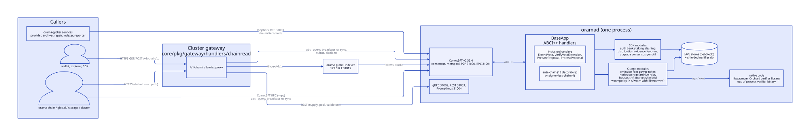
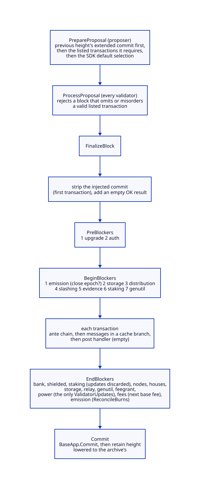
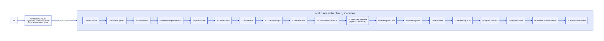
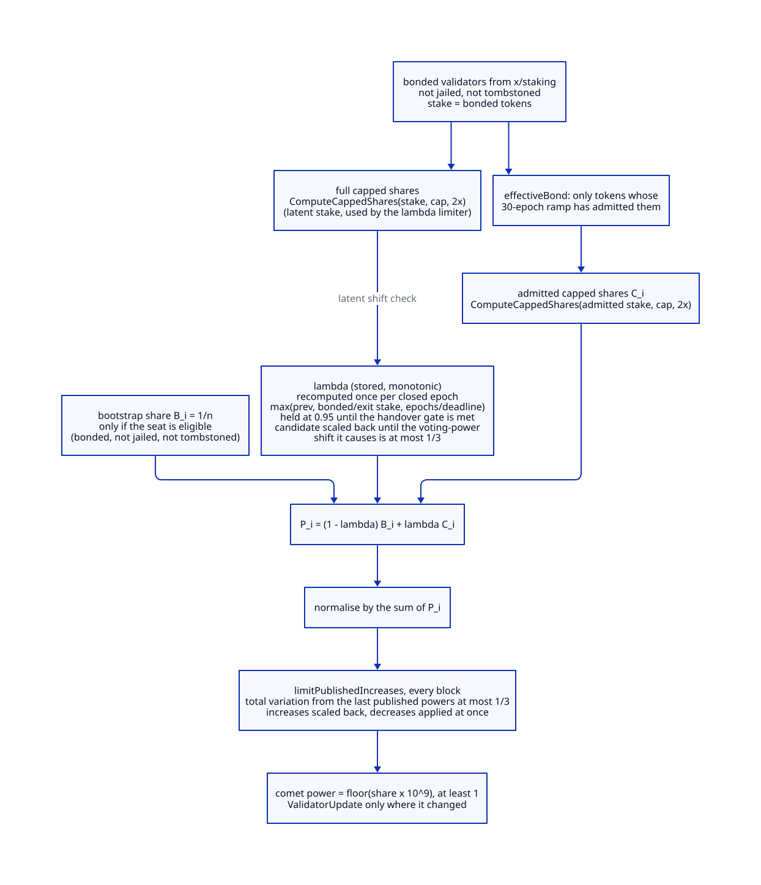
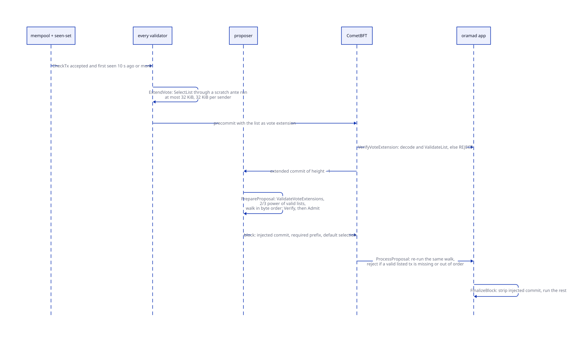
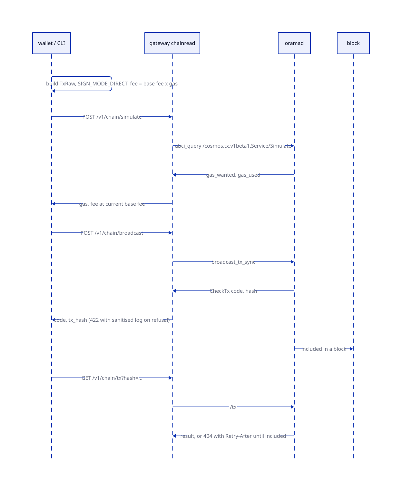

# Chain architecture

> **At a glance.**
>
> - **What:** `oramad` is the Orama L1: a Cosmos SDK v0.54.4 application on CometBFT v0.39.4, wired by hand in one Go module (`chain/`) that `core/` never imports. It runs 21 stores of stock SDK modules and Orama's own (`x/emission`, `x/fees`, `x/power`, `x/token`, `x/nodes`, `x/storage`, `x/archive`, `x/relay`, `x/houses`, `x/cnft`, `x/market`, `x/shielded`, `x/wasmpolicy`, plus wasmd's `x/wasm` when libwasmvm is linked). Four things set it apart from a stock chain: a user-to-user norama send is refused; the validator set comes from `x/power`, a blend of an equal-share bootstrap committee and capped stake, not from `x/staking`; ordinary transactions pay a burned base fee through `x/fees`; and a block must contain the transactions a 2/3 quorum of validators listed in their vote extensions. No governance module can change anything. A change to a stock module needs a new binary on a new genesis.
> - **Key numbers:** ports 31000 (P2P), 31001 (RPC), 31002 (gRPC), 31003 (REST), 31004 (Prometheus); 19 ante decorators; voting power scale 10^9; power cap 5% (3% above 60 active validators, back at 5% after 30 epochs below 50); 30-epoch stake ramp; at most one third of voting power moves per block or per lambda step; bootstrap committee of at least 30 on a production chain-id; vote-extension list 32 KiB, 4 MiB embedded, 1,024 ante runs and 4,096 signature checks per block; the gateway serves 16 module queries, 8 simulations and 16 broadcasts at once; query gas limit 2,000,000.
> - **Code:** `chain/app/`, `chain/x/power/`, `chain/x/inclusion/`, `chain/x/confidential/`, `chain/client/`, `chain/cmd/`, `chain/native/`, `chain/proto/`, `chain/scripts/`, `core/pkg/chainread/`, `core/pkg/clusterreg/`, `core/pkg/gateway/handlers/chainread/`.
> - **Depends on:** [global nodes](37-global-nodes.md) for how `oramad` is installed and who runs it, [economics](40-economics.md) for emission, fees and tokens, [the gateway](../vol1/12-gateway-architecture.md) for the public route policy.



## Why it exists

The private clusters of Orama carry tenant data. They do not carry value that strangers must agree about: who runs a global node, who owes whom for a storage deal, who may relay Tor traffic, how many norama exist. That needs a ledger no single operator controls, and the ledger has to fit the rest of the system. Five constraints shaped it.

First, the chain starts with no money and no stake. A proof-of-stake chain needs bonded value before it can pick validators, and there is no value before the first block. The answer is a bootstrap committee fixed in genesis, each seat with an equal share of voting power and no self-bond. Power then shifts, over a year or sooner, from the committee to stake-weighted validators under a handover factor that can only rise (`chain/x/power/`).

Second, a stake-weighted validator set concentrates. The code caps one validator's power share and redistributes the excess, rate-limits how fast power can move, and ramps new stake in over 30 epochs. Each rule exists because the review that wrote it found a way to take over the set without them (the comments in `chain/x/power/keeper/` name the findings).

Third, payments between users are not public. The bank module is kept, but `norama` cannot move from one user to another, and every protocol payout lands in a restricted earnings ledger. The only way to pay a person is the shielded pool.

Fourth, a validator must not be able to censor for free. Vote extensions carry each validator's list of long-waiting mempool transactions, and a proposal that omits a valid listed transaction is rejected by every other validator (`chain/x/inclusion/`).

Fifth, there is no admin. The authority address of every stock module is the hash of a name that no module has, so every authority-gated message is unreachable. The rules change when validators run a different binary on a different genesis, and in no other way (`chain/app/app.go:UnreachableAuthority`).

## The model

**oramad.** The node binary. It starts CometBFT and the application in one process (`chain/cmd/oramad/`). Its home is `/var/lib/orama-global/chain` on a global node.

**Application.** `OramaApp`, a `baseapp.BaseApp` with the module manager, the ante handler and the ABCI++ handlers (`chain/app/app.go:OramaApp`). It is built by hand, not by depinject.

**Module.** A Cosmos SDK module: a keeper, messages, queries, genesis and optional begin and end blockers. Stock modules are wired unchanged except where this chapter says otherwise. The Orama modules are listed in [the module set](#the-module-set).

**Module account.** A bank account owned by a module, with explicit mint and burn permissions (`maccPerms`). Every module account address is a blocked address: no user can send to it.

**Authority.** The address that may sign a module's parameter-change message. For every stock module it is `UnreachableAuthority()`, the address of the module name `orama/no-authority`.

**Chain-id class.** A chain-id containing `-localnet-`, `-devnet-` or `-stagenet-` is a test network; anything else is production. Several checks (the faucet, the short epochs, the small committee, the locked parameters) read this and nothing else.

**Bootstrap committee.** The genesis list of validators in `x/power`. Each has an equal bootstrap share B_i of 1/n and needs no stake. A seat counts only while its staking record is bonded, not jailed and not tombstoned.

**Power universe.** The committee seats plus every bonded, unjailed, untombstoned staking validator. These are the only candidates for CometBFT voting power.

**Lambda.** The handover factor in zero to one. Power is `(1 - lambda) B_i + lambda C_i`, where C_i is the stake-based capped share. Lambda only rises.

**Handover gate.** The count of simultaneously active validators that must be reached once before lambda may pass `pre_gate_lambda_cap` (0.95).

**Force-bond.** The rule that half of a committee member's reward is delegated to its own validator while lambda is below one, and cannot be withdrawn until then.

**Inclusion list.** A validator's vote extension: up to 32 KiB of raw transactions it has seen waiting for 10 seconds or more. **Extended commit:** the previous height's commit with those extensions, which the proposer injects as the first transaction of the next block.

**Locked genesis.** The check that a genesis file's module parameters equal the compiled defaults, for a chain-id class.

**Signer.** In `chain/client/tx`, anything that can produce a secp256k1 signature over sign bytes, a held key or an agent.

## How it works

### The application

`oramad` is a Cosmos SDK v0.54.4 application on CometBFT v0.39.4, with wasmd v0.70.3 and wasmvm v3.0.7 (`chain/go.mod`). The data backend is pebbledb, set in the default `app.toml`: the goleveldb backend of the pinned store library could not answer a versioned query for any height, including the latest (`chain/cmd/oramad/cmd/commands.go:initAppConfig`). The defaults the command writes are `minimum-gas-prices = 0.000001norama` (a local mempool floor, separate from the chain's base fee), `query-gas-limit = 2000000` and `iavl-cache-size = 100000`. A node refuses to start with a query gas limit of 0 on any chain-id that is not a localnet, because the public `/v1/chain/query/` route would otherwise let one query scan all state (`commands.go:requireQueryGasLimit`). The IAVL cache is held to about 60 MB because the stock size grew past half a gigabyte of live heap on 4 GB hosts that also run Kubo and the cluster.

The application sets `bApp.SetDisableBlockGasMeter(false)`. v0.54 disables the block gas meter by default, and without it the base fee would read zero gas used in every block and never rise (`chain/app/app.go`).

CometBFT's `timeout_commit` is not overridden, so blocks come every 5 seconds when the validators are healthy; `chain/x/wasmpolicy/types/keys.go:AssumedBlockSeconds` encodes the same assumption.

#### Build variants

`chain/Makefile` builds the same `oramad` in several ways, selected by tags and cgo:

| Target | Tags | What it links |
|---|---|---|
| `build` | `nowasm`, cgo off | pure Go, for linux/amd64, darwin/amd64 and darwin/arm64; no CosmWasm, no Orchard verifier |
| `build-wasm` | none, cgo on | the host `libwasmvm` from the module cache (the target prints the download command when it is missing) |
| `build-linux-amd64-orchard` | `nowasm orchardffi netgo osusergo` | the Orchard verifier library, static against musl through zig |
| `build-linux-amd64-full` | `muslc orchardffi netgo osusergo` | one static library carrying libwasmvm and the Orchard verifier (`native-lib-linux-amd64`) plus the pinned out-of-process verifier binary |
| `build-linux-amd64-global` | `nowasm` | `orama-global` and `stagenet-node`, pure Go |

A `nowasm` binary refuses to start a node that claims the wasm module, either in its options or in its genesis (`chain/app/wasm_novm.go:guardWasmClaim`). A binary without the Orchard library accepts no shielded bundle.

The `chain/native/` crate exists because two Rust static libraries linked into one binary each carry their own copy of the standard library and collide. It builds libwasmvm and the Orchard verifier as rlibs of one crate and archives them once (`chain/native/Cargo.toml`). `chain/native/build.sh` copies libwasmvm from the module cache at the version `chain/go.mod` pins, builds with a pinned Rust toolchain and zig for the C parts, and records the SHA-256 of the archive in `chain/native/libwasmvm_muslc.x86_64.a.sha256`; the `verify` mode fails if a rebuild hashes differently. The crate supplies `__rust_probestack` itself, because the unmangled symbol that wasmer needs is exported only mangled by current `compiler_builtins` (`chain/native/src/probestack.rs`).

### The module set

The store keys, in `NewOramaApp`, are: `auth`, `bank`, `staking`, `distribution`, `slashing`, `consensus`, `upgrade`, `feegrant`, `evidence`, `emission`, `power`, `fees`, `token`, `archive`, `nodes`, `houses`, `storage`, `relay`, `cnft`, `market`, `shielded`; `x/wasmpolicy` and wasmd's `wasm` mount their own stores in `installWasm`, and `shielded` has a transient store as well. `x/gov`, `x/mint`, `x/crisis`, `x/circuit`, `x/authz`, `x/group`, `x/nft`, `x/epochs`, IBC and an EVM are not wired.

| Module | Role | Described in |
|---|---|---|
| `auth`, `bank`, `staking`, `slashing`, `distribution`, `evidence`, `feegrant`, `consensus`, `upgrade`, `genutil` | stock, with the wrappers below | this chapter |
| `emission`, `fees`, `token` | supply, fees, factory denoms | [economics](40-economics.md) |
| `power` | CometBFT voting power and the bootstrap committee | this chapter |
| `nodes` | operators, nodes, role bonds, bindings | [global nodes](37-global-nodes.md) |
| `storage`, `archive`, `relay` | storage deals, the history registry, relay rewards | chapters 41, 42 and 46 |
| `houses`, `wasmpolicy`, `wasm` | governance, contract policy, contracts | chapter 44 |
| `cnft`, `market` | compressed NFTs and the market | chapter 45 |
| `shielded` | the Ironwood shielded pool | chapter 43 |

`x/inclusion` is a library, not a module: it has no store or messages, and the application calls it from the ABCI++ handlers. `x/confidential` is a library nothing imports (see [confidential nodes](#confidential-nodes)). `x/vpnlaunch` and `x/wasmbindings` are not wired as modules either; `wasmbindings` is installed into wasmd as a message handler and a query plugin.

The module accounts and their permissions (`maccPerms`): `fee_collector`, `distribution` and `power` hold none; `bonded_tokens_pool` and `not_bonded_tokens_pool` hold Burner and Staking; `emission` holds Minter; `fees`, `fees_deposits`, `nodes`, `houses`, `storage`, `storage_escrow`, `relay` and `shielded` hold Burner; `token` holds Minter and Burner; `archive`, `storage_archive`, `cnft` and `market` hold none; wasmd's `wasm` account holds Burner when the VM is linked. `BlockedAddresses()` is every one of them, so a user can never send to a module account.

### The block lifecycle



The orders are set in `NewOramaApp` and each has a reason written beside it:

- **Pre-blockers:** `upgrade`, then `auth`.
- **Begin-blockers:** `emission` first, so that closing an epoch mints the validator share and hands it to `x/power` before anything else reads balances; then `storage`, `distribution`, `slashing`, `evidence`, `staking`, `genutil`.
- **End-blockers:** `bank`, `shielded`, `staking`, `nodes`, `houses`, `storage`, `relay`, `genutil`, `feegrant`, `power`, `fees`, `emission`. `staking` runs before `power` so that power sees the bonded set after this block's messages. `fees` advances the base fee once the block's gas is final. `emission` is last so that `ReconcileBurns` sees every burn of the block.
- **Genesis:** `auth`, `bank`, `distribution`, `staking`, `slashing`, `genutil`, `evidence`, `feegrant`, `upgrade`, `consensus`, `fees`, `emission`, `wasmpolicy` and `wasm` when present, `power`, `token`, `archive`, `nodes`, `cnft`, `market`, `houses`, `storage`, `relay`, `shielded`. `emission` follows `bank` so that a fresh genesis can see the supply; `power` is last because it records the emission epoch as its own genesis epoch and returns the genesis validator set.

CometBFT accepts validator updates from exactly one module per block. `stakingEndBlockOverride` wraps `x/staking` so that its end-blocker still matures unbonding and redelegation queues and updates pool accounting but returns no updates, and so that its `InitGenesis` returns none either (an exported genesis would otherwise carry updates from both staking and `x/power`, which the module manager rejects). `x/power`'s end-blocker is the only source of `ValidatorUpdate`s (`chain/app/staking_override.go:stakingEndBlockOverride`).

`OramaApp` overrides three BaseApp methods: `CheckTx` records accepted transactions in the inclusion seen-set; `FinalizeBlock` strips the injected commit; `Commit` lowers CometBFT's retain height to the one `x/archive` allows. BaseApp returns 0 (prune nothing) when pruning is off, and the override keeps 0; otherwise the height is `min(BaseApp's, archive's)`, and a non-positive archive height means nothing may be pruned. A block no archived range covers is therefore never pruned, however far the tip runs (`chain/app/retain.go:gateRetainHeight`).

### The ante chain



`setAnteHandler` builds the chain by hand, in the order of the stock chain except for four additions and one substitution (`chain/app/app.go:setAnteHandler`). In order:

1. `SetUpContext`, `ExtensionOptions`, `ValidateBasic`, the stock decorators.
2. The shielded `ShapeDecorator`: a shielded message must be the only message of its transaction, refused before any fee is taken.
3. `UploadSunset` (code upload is closed until the sunset height), `ContractSend` (a contract may not send norama to a user), and `DepositPayer` (records who pays a contract's state deposit).
4. `TxTimeoutHeight`, `ValidateMemo`, `ConsumeGasForTxSize`.
5. `x/fees`' `FeeDecorator` in place of the stock deduct-fee decorator ([economics](40-economics.md#settling-a-fee)).
6. `UndelegateGuard` and `MinDelegation` from `x/power`.
7. `SetPubKey`, `ValidateSigCount`, `SigGasConsume`, `SigVerification`.
8. The shielded `ProofDecorator`: proofs are checked after the signature, so unsigned garbage costs no proof work.
9. `IncrementSequence`.

A transaction whose only message is a `MsgShieldedTransfer` takes a different, shorter chain, because it has no signer and no declared fee: `SetUpContext`, `ExtensionOptions`, `TxTimeoutHeight` and the shielded `SignerlessDecorator`, which checks the bundle and the fee carried in its value balance (`chain/x/shielded/ante/ante.go:Route`). Every other transaction takes the ordinary chain.

`UndelegateGuard` refuses a `MsgUndelegate` or `MsgBeginRedelegate` that would take a bootstrap committee member's own self-bond below the amount `x/power` has force-bonded into it, while lambda is below one. It sums several withdrawals in one transaction before comparing (`chain/x/power/ante/undelegate_guard.go:UndelegateGuard`). `MinDelegationDecorator` simulates the transaction's delegation changes on a copy and refuses any that would leave a delegation strictly between zero and `min_delegation_for_rewards` (1 ORAMA), so the per-epoch reward walk cannot be filled with dust; a full exit is allowed (`chain/x/power/ante/min_delegation.go:MinDelegationDecorator`).

### The bank send restrictions

Three restrictions are appended to the bank keeper's send path, in this order (`chain/app/app.go`):

1. `NoramaSendRestriction`: a send that moves no norama passes; one with a module account on either side passes; a send to a contract passes; every other norama send is refused with `ErrPublicPayment` (`chain/x/shielded/policy/restriction.go:NoramaSendRestriction`). A user cannot pay a user. A contract cannot pay a user, because a payout from a contract is an earnings credit (`PayEarnings`).
2. The contract-send restriction, which lets a contract's funds go to the module accounts that `wasmpolicy.FeeEarningsModules()` names (fees, deposits and the like) but nowhere else.
3. `TokenKeeper.SendRestriction`, which applies every factory token's pause, freeze, non-transferable flag, transfer fee and hook to any send of that token ([economics](40-economics.md#factory-tokens)).

Because bank sends to a module account are blocked by `BlockedAddresses`, wasmd's coin transferrer is wrapped (`allowModuleTransferrer`) so that a contract can still pay the fee and deposit accounts. Nothing here gives the chain a way to pay a user a public balance, apart from stake and node-bond unbonding returning to their owners and the test-network faucet.

### Voting power



`x/power` computes the voting power CometBFT sees, every block, in its end-blocker (`chain/x/power/abci.go:EndBlocker`). Everything in this section is deterministic fixed-point arithmetic over `math.LegacyDec`, with every collection walk done in a sorted order.

#### The universe

`computePowers` loads the bootstrap committee and checks each seat's eligibility (`committeeEligible`): its staking record must exist, be `Bonded`, not be jailed, and its consensus address must not be tombstoned. It then loads the bonded validators from `x/staking` by power. Each bonded validator that is not jailed and not tombstoned contributes its bonded tokens as stake. Only ed25519 consensus keys are accepted, and the chain's consensus parameters permit only that type.

The count of active validators is the number of distinct operators among bonded validators and eligible seats; a seat that also has stake is counted once.

#### The committee

A fresh genesis lists the committee through `oramad genesis add-bootstrap-validator`, one command per member with `--consensus-pubkey-file` pointing at the node's `priv_validator_key.json` and `--min-committee-size` (`chain/x/power/client/cli/genesis.go:AddBootstrapValidatorCmd`). `InitGenesis` gives each member a real staking validator record with status `Bonded` and zero tokens, calls the staking hooks that create the distribution and signing-info records, and returns the genesis validator set with equal power `PowerToCometBFT(1/n)`. The record is deliberately not entered in the power index of `x/staking`, so a seat with no stake never appears among the stake-indexed validators. A production chain-id must declare at least 30 members (`ProductionMinCommitteeSize`); a test chain-id may declare as few as `min_committee_size` (floor 1) (`chain/x/power/keeper/genesis.go:checkCommitteeSizeChainIDGate`).

#### Lambda

Lambda starts at 0, so P_i equals the bootstrap share and only committee members have power. Once per closed emission epoch the end-blocker recomputes it:

```
lambda = min(1, max(lambda_prev, bonded / bootstrap_exit_stake, epochs_since_genesis / bootstrap_deadline_epochs))
```

with `bootstrap_exit_stake` 271,000 ORAMA (about 5% of the first year's maximum emission) and a 365-epoch deadline (`chain/x/power/types/power.go:ComputeLambda`). It is monotonic by construction: `lambda_prev` is one of the terms. It reaches 1 at the deadline whatever the stake.

Three further rules hold it back:

- **The handover gate.** Until the number of active validators has once reached `2 * ceil(1 / cap)` (40 at the 5% cap, 68 at 3%), lambda is held at `pre_gate_lambda_cap` (0.95). The flag `gate_satisfied` is a one-way ratchet. Without it, a small set of validators could take all power the day the deadline passes, however little stake backed them (`HandoverGateThreshold`).
- **The step limit.** When lambda rises, the new value is scaled back until the total variation of normalised power it causes is at most one third. The check runs twice, once on the power the validators would publish (admitted, ramped stake) and once on the latent power (full stake), so a bond added just before a lambda step cannot be held back by the ramp and then released together (`chain/x/power/types/lambda_limit.go:ClampLambdaStepBoth`). The limiter bisects the interval between the old and new lambda 64 times.
- **Epoch cadence.** Lambda and the cap are advanced when the emission epoch is greater than `lambda_last_updated_epoch`; other blocks reuse the stored values.

Lambda cannot be set by any message. At lambda 1 a committee member keeps power only through its own stake, and a seat with none receives a zero-power update and leaves the set.

#### The cap

The active-validator cap is 5% (`cap_fraction_normal`). `UpdateCapState` steps it down to 3% (`cap_fraction_reduced`) when more than 60 validators are active, and steps it back up only after the count has stayed below 50 for 30 consecutive epochs (`chain/x/power/types/power.go:UpdateCapState`). The thresholds sit apart on purpose, so a count near 60 does not flip the cap every epoch.

#### Capped shares

`ComputeCappedShares` is a water-filling allocation over bonded stake. Each validator's raw proportion is its stake over total stake. A validator whose proportional share of the remaining mass exceeds its ceiling is pinned at the ceiling, the excess is shared among the rest in proportion to their raw stake, and the pass repeats for at most n iterations until nobody is newly pinned. The ceiling is `min(cap, raw * max_redistribution_multiplier)` with the multiplier 2: a validator cannot receive more than twice its own raw proportion through redistribution, however much excess exists. Without that bound ten honest validators at the cap and ten attackers holding one unit each would hand the attackers half the power. Because of the bound the shares may sum to less than one; callers normalise by the actual sum. If `cap * n` is less than one (fewer than 20 validators at 5%), or total stake is zero, every validator gets an equal 1/n share (`ComputeCappedShares`).

#### The ramp

New stake does not count at once. For each validator `effectiveBond` splits the current bonded tokens into an admitted amount, whose ramp has finished, and an excess that began ramping at some epoch; the excess counts in proportion `elapsed / ramp_epochs` (30). Added stake starts a new excess; stake that leaves reduces the admitted amount first and at once. The published capped shares are computed from the admitted-plus-vested tokens only, and validators with nothing admitted are left out of that computation, because passing them in would hand each an equal share whenever the cap cannot bind (`chain/x/power/keeper/stake_ramp.go:effectiveBond`). A validator whose capped share falls to zero loses its ramp clock and admitted tokens, and a validator that unbonds fully has them pruned, so a later re-bond starts the ramp again.

#### The blend, normalisation and publication

For each entry the raw power is:

```
P_i = (1 - lambda) * B_i + lambda * C_i
```

where B_i is 1/n for an eligible seat and 0 otherwise, and C_i is the ramped capped share. The raw values may sum to less than one (during the ramp, with a jailed seat, with the redistribution bound), so rewards and CometBFT power are both computed on the normalised share `P_i / sum(P)` (`chain/x/power/keeper/power.go:normalizedShares`).

`limitPublishedIncreases` then compares the normalised shares with the previous block's published powers. If the total variation exceeds one third, the increases are scaled back by bisection while decreases apply in full, because keeping a jailed validator in the set to satisfy the bound would leave it voting. If the scaled result has no positive share and the desired set has one, the desired set is seated. A decrease that exceeds one third is still published (`chain/x/power/types/publish_limit.go:ClampPublishedIncreases`). The one-third bound is the light-client bound named in the code: no more than a third of the previous set's power may be replaced between two consecutive validator sets.

The comet power of an entry is `floor(share * comet_power_scale)`, with the scale 10^9, and at least 1 for any strictly positive share, because CometBFT reads zero as "remove this validator". An update is emitted only for entries whose power changed, and a zero-power update is sent for any operator that had power and is no longer in the universe, using the public key recorded when it was added. If the whole computation would leave no validator with positive power, the end-blocker returns an error instead of an empty set, which would halt the chain.

#### Force-bonding

The reward path of a committee member (described in [economics](40-economics.md#paying-the-validator-share)) delegates 50% of what its operator would receive to its own validator, up to a total self-bond of 2,000 ORAMA (twice `min_self_bond` of 1,000 ORAMA), and records the running total in `committee_self_bond`. `UndelegateGuard` makes that amount unwithdrawable until lambda reaches one. The purpose is to give each seat something to lose to slashing before it holds real power.

#### State

`x/power` owns these collections (`chain/x/power/keeper/keeper.go:Keeper`): `params`, `lambda`, `lambda_last_updated_epoch`, `gate_satisfied`, `cap_current_bps`, `cap_below_streak`, `genesis_epoch`, `bootstrap_committee`, `ramp_activation`, `ramp_admitted`, `ramp_excess`, `ramp_excess_epoch`, `last_power`, `last_pub_key` and `committee_self_bond`. Its module account holds no norama between blocks: it takes an epoch's validator share and pays it out inside the same call, and its invariant is that the balance is empty.

### Slashing on real stake

Stock `x/staking` slashes `TokensFromConsensusPower(power) * fraction`, taking `power` from what CometBFT reports. That assumes CometBFT power is proportional to bonded tokens at 10^6 norama per unit. Here it is on a different scale (capped, ramped, blended, times 10^9), so the stock conversion would burn about a thousand times too much, and the review that found this measured 83% to 100% of a validator's stake burned for one infraction instead of the 5% specified.

`slashBaseFix` wraps the staking keeper that `x/slashing` receives, and `x/evidence` reaches staking only through slashing. It ignores the power it is given and substitutes the power equivalent to the validator's current bonded tokens plus the initial balance of unbonding and redelegation entries created at or after the infraction height that have not matured, so the fraction applies to the stake that was at risk at the infraction (`chain/app/slash_base_fix.go:slashBaseFix`, `chain/app/slash_departed.go:slashableDepartedTokens`). The rounding loss is at most 999,999 norama.

The genesis defaults set the double-sign slash at 5% (the stock value), downtime at 0.01% (stock is 1%), the signed-blocks window at 10,000 and community tax at zero because no path can spend a community pool (`chain/app/genesis_overrides.go`). The other slashing parameters keep their stock defaults. A double-sign tombstones the validator. A tombstoned seat is out of the power universe for good.

A second wrapper makes bonding work for an outsider. Every account starts at zero and rewards arrive only as earnings, so `earningsFundedStaking` wraps the staking message server: before `MsgCreateValidator` or `MsgDelegate` runs, it tops the signer's bank balance up from its own earnings by the exact shortfall (`chain/app/staking_topup.go:earningsFundedStaking`). It runs inside the message handler, so a message that fails undoes the top-up with its cache branch.

### Inclusion lists



A proposer could otherwise keep a transaction out of every block it proposes. The chain uses the vote extensions of ABCI++ to remove that option (`chain/app/inclusion_handlers.go`). The rule lives in the pure library `chain/x/inclusion/`; the app supplies the transaction format and the ante run.

**Switch.** Vote extensions are a consensus parameter: `abci.vote_extensions_enable_height`, set in genesis and never changed. From that height `ExtendVote` and `VerifyVoteExtension` act; from the next height the proposer injects the extended commit. Before it, and at the enable height itself, the handlers do nothing and the proposal handlers are the SDK defaults. The localnet default is 0 (off); the stagenet scripts set it to 2.

**The seen-set.** Each node keeps a bounded memory of transactions that passed `CheckTx` and when it first saw them (`chain/app/inclusion_pool.go:inclusionPool`). An entry is eligible after 10 seconds, expires after an hour, the set holds 16 MiB, and a transaction over 32 KiB is not tracked. It is local state, not consensus state; a `CheckTx` recheck failure removes the entry, and `FinalizeBlock` removes every included transaction.

**ExtendVote.** The validator picks the eligible transactions that are not already in its own proposal, sorts them lexicographically by raw bytes, and walks them: a transaction is chosen if it decodes with exactly one signer and one signature and is ordered, pays at least a base fee of 1, fits the per-extension and per-sender byte caps, and passes the full ante chain run against a scratch branch of the last committed state (`SelectList`). Chosen transactions apply to the scratch branch, so a later candidate is judged after them. The list is encoded with the magic `ORIL`, a version byte and length-prefixed entries. A node that cannot list sends an empty extension, which counts.

**Caps.** The per-extension cap is 32 KiB, cut so that a full set of `staking.max_validators` extensions, each with 2,048 bytes of vote overhead, fits half the block budget (the consensus block max bytes less a 2 MiB reserve). At the stock 100 validators the cap stays 32 KiB. A sender may fill at most one extension. The deduplicated bytes embedded with the extended commit are bounded by 4 MiB.

**VerifyVoteExtension.** A validator accepts an extension that decodes and passes the stateless `ValidateList` (strictly increasing order, no duplicates, size and per-sender caps, fee at least 1) and rejects anything else. It cannot check signatures, which need the sender's account number. Before the enable height a non-empty extension is rejected.

**PrepareProposal.** From the height after the enable height, the proposer first checks the commit with `baseapp.ValidateVoteExtensions`, then injects the commit as the first transaction, prefixed with `ORAMA-INCLUSION-EXTENDED-COMMIT-V1:`. The prefix begins with a byte that cannot start a valid protobuf transaction, so no chain transaction can be mistaken for it. It then calls `Assemble`, which accepts only extensions of the right height and round with positive power, requires the valid ones to hold at least 2/3 of total power, and walks the deduplicated union in byte order. For each transaction it checks decode, fee, sequence (the next sequence of the sender, applied as it goes), the sender's byte budget and the block budget, then `Verify`, then `Admit`. Transactions that pass are the required prefix. The rest of the block comes from the SDK default handler with the remaining space.

**Budgets.** The walk is bounded so that junk cannot make every validator do unbounded work: 1,024 ante-chain runs and 4,096 signature checks per block in total, divided evenly among the extensions that list anything (at least one each), each transaction charged to the listing extension with the most budget left. A validator that lists junk spends its own share. Signature verification (`Verify`) runs before the sender is charged, so a transaction that only names a sender it cannot sign for costs that sender nothing; the cost falls on whoever listed it.

**ProcessProposal.** Every validator decodes the injected commit (and rejects it if it is not the canonical encoding of what it decodes to, so a proposer cannot pad the block with unknown fields), validates the vote extensions, and re-runs the same walk. A block is rejected if a transaction that was valid and fit is missing, or appears after a transaction that is not the next required one. Listed transactions that were invalid or did not fit may be absent. The first same-sequence transaction in byte order wins.

**FinalizeBlock.** The app strips the injected commit before BaseApp sees the block, so it never reaches an ante handler, and puts back a successful empty result in its place, because CometBFT needs one result per transaction.

If the commit cannot be turned into a valid block, for example because valid extensions hold under 2/3 of power, `PrepareProposal` returns an error and BaseApp falls back to the raw request transactions, which `ProcessProposal` then rejects.

### Genesis, locked parameters and export

`InitChainer` guards the genesis (`guardWasmGenesis`), runs `ValidateLockedGenesis`, records the module version map and runs `InitGenesis` for the modules in the order above. The locked-genesis check compares the `params` object of each locked module's genesis (`emission`, `fees`, `power`, `nodes`, `storage`, `relay`, `token`, `archive`, `houses`, `staking`, `slashing`, `distribution`, `shielded`) and the wasmpolicy sunset and deposit parameters with the compiled defaults, key by key, numeric strings compared as decimals. A localnet locks nothing. A devnet or stagenet may differ only in `emission.epoch_duration_seconds`, `min_blocks_per_epoch`, `allow_bootstrap_stake`, the four faucet parameters, and `power.min_committee_size`. A production chain-id may differ in nothing. `oramad genesis validate` runs the same check after the stock validation (`chain/app/locked_genesis.go:ValidateLockedGenesis`). The test `TestLockedGenesis_everyGenesisParameterHasARow` fails when a module gains a parameter that has no row.

The locked values of the stock modules are these. `staking`: bond denom `norama` (`sdk.DefaultBondDenom` is set in `chain/app/config.go`), unbonding time 1,814,400 s (21 days), `max_entries` 7 and `historical_entries` 10,000, all the SDK's own defaults. `slashing`: double-sign 5%, downtime 0.01%, a 10,000-block signed-blocks window, jail duration 600 s. `distribution`: `community_tax` 0, the deprecated `base_proposer_reward` and `bonus_proposer_reward` 0, `withdraw_addr_enabled` true. The `x/houses` timelocks are 14 days for parameters, 7 days for spends and 60 days for upgrades, each with a floor at its default ([governance and contracts](44-governance-and-contracts.md)).

The genesis tooling is `oramad genesis set-emission-params`, `add-bootstrap-validator` and `add-standard-contracts` beside the stock genutil commands. The chain's default consensus block gas is not set in the module defaults: `x/consensus` has no genesis state, so the localnet and stagenet scripts patch `consensus.params.block.max_gas` (100,000,000) and `abci.vote_extensions_enable_height` into the genesis JSON (`chain/scripts/localnet/localnet.sh`).

`oramad export` is the simapp export with the stock zero-height preparation. It is how a chain continues across a coordinated hard fork: `x/power` and `x/emission` both accept an exported genesis, trust its epoch and lambda state, and `x/power` rebuilds the validator set from the exported power records instead of recomputing equal shares.

### Authority and upgrades

`UnreachableAuthority()` is a function, not a variable, because it must be computed after the bech32 prefix is set; a package-level variable would capture the default prefix at static initialisation. It is the address of the module name `orama/no-authority`, which no module has, so no key or module account can sign for it. The test `TestUnreachableAuthority_rejectsEveryAuthorityGatedMsg` proves it for bank, staking, distribution, consensus and upgrade.

`x/houses` is registered and runs its end-blocker, but is not that authority. It reaches the rest of the chain through narrow adapters in `chain/app/enactment.go`: the emission split it enacted ([economics](40-economics.md#closing-an-epoch)); a change to the relay reporter set, delivered through `x/relay`'s own message path with a context flag that only this adapter sets; a software-upgrade plan, stored in `x/upgrade`; and the code-upload allow list read by `x/wasmpolicy`.

No module sets a migration and every `ConsensusVersion` is 1. The application registers no upgrade handler (`SetUpgradeHandler` appears nowhere in `chain/`). A scheduled plan therefore halts a node at its height ([global nodes](37-global-nodes.md#cosmovisor-staging) describes the cosmovisor swap), but the binary that restarts has no handler to apply. The application code matches the rule that releases are state-breaking and restart from a new genesis.

### CosmWasm wiring

When libwasmvm is linked, `installWasm` builds the wasmd keeper with the chain's rules (`chain/app/wasm_vm.go:installWasm`):

- Capabilities are `iterator`, `staking` and `cosmwasm_1_1` through `cosmwasm_2_2`; `stargate` and `ibc2` are omitted, so a contract cannot query arbitrary modules or speak IBC (`chain/app/wasm_caps.go:WasmCapabilities`). The channel, port and packet keepers handed to wasmd are all refusals, and a contract IBC message is rejected in the message handler.
- The coin transferrer is wrapped to let a contract pay the fee and deposit accounts. wasmd calls it only to fund a contract on instantiate or execute, before the contract is registered, so the funding path marks the recipient as a contract for the norama restriction.
- The wasm engine is wrapped by `depositEngine`: every call that changes stored bytes meters the store, and on success charges the growth or releases the shrinkage through the state-deposit ledger in `x/wasmpolicy`; a deposit that cannot be paid turns the call into a contract error (`chain/app/wasm_deposit.go:depositEngine`). A failing call is reverted by wasmd and charged nothing.
- The token transfer hook is bound here: a token that names a contract gets a sudo call with `{"transfer_hook":{denom, from, to, amount}}` (`chain/app/token_hook.go`).
- Orama's message handler and query plugin (`x/wasmbindings`) are installed as decorators.

### Shielded wiring

`buildShielded` opens the nullifier database under `<home>/data/shielded_nullifiers`, next to the application database, so resetting a node's data resets it too. It builds two verifiers, the Orchard library linked through cgo and a pinned binary run out of process, and warms both at construction so their verifying keys are not built inside a consensus handler. The binary is `--shielded-verifier` or `<home>/bin/orama-orchard-verifier`; the node refuses to start it if its SHA-256 differs from `--shielded-verifier-sha256` or the value linked at build time. A node without both accepts no bundle, and says so in its log. At start, a node whose nullifier database does not fold to the accumulator the committed state holds refuses to run (`checkShieldedStoreAtStart`), and the database is a state-sync snapshot extension so a synced node has it. The shielded module's own rules are in chapter 43.

### Confidential nodes

`chain/x/confidential/` is the software boundary for nodes that would prove, by a TEE attestation, that their operator cannot read the machine, and for a marketplace that would place tenants on them. It accepts nothing. `Accept` returns `ErrNoAttestation` for every report. `QuoteVerifier.Verify` parses a SEV-SNP report (a 0x4A0-byte structure, versions 2, 3 or 5, ECDSA P-384) or a TDX quote (version 4, ECDSA P-256) to read its claimed measurement and report data, then fails because the vendor root registry is empty by default, and fails again with `ErrVerifierNotLinked` even if a root were present, because no certificate-chain or signature verification exists. `VerifiedReport` has an unexported field, so no code outside the package can fabricate one. `RegisterNode` needs a verifier and checks that the report's measurement equals the expected one and that its report data equals a SHA-512 over a domain, the operator, the node id and the node key. `MarketplaceLive` is the constant false and every lease returns `ErrMarketplaceNotLive`. The package is imported by nothing in the application, and a test keeps it that way; the e2e feature `chain-waivers` asserts that the live chain has no such surface.

### The Go client

`chain/client/` is the client library the global services link. It is separate from the node: its codec registers the SDK standard interfaces, auth, `x/storage` and `x/archive`, and any other module a caller registers, so a service does not link the application (`chain/client/node/encoding.go`).

`chain/client/node` talks to one `oramad` over its CometBFT RPC. `Query` runs a gRPC query method as an `abci_query`, at the latest height or at a given one; a non-zero ABCI code is a `QueryError`, with `NotFound` for the SDK's key-not-found. `Submit` signs the messages, simulates them for gas, scales the gas by 150%, pays exactly the current base fee for that gas with no tip, broadcasts with `broadcast_tx_sync` and polls for inclusion every second for up to a minute, returning `ErrNotIncluded` on timeout (the caller retries with a fresh sequence). `SubmitSignerless` broadcasts a message with no signature and no fee, for `MsgShieldedTransfer` alone. `FeeFunds` sums an address's bank balance and fee-only balance, because a node's hot key has only the latter.

`chain/client/tx` builds and verifies `SIGN_MODE_DIRECT` transactions. The account key is the 32-byte secp256k1 leaf itself, the BIP-44 leaf at coin type 118; `DeriveAccount` rejects a value outside `[1, N-1]` rather than letting the curve library reduce it into a different account. A transaction has exactly one signer, a fee in norama only and at least one message. `Decode` verifies a transaction's signature against a chain id and account number and returns the signer, fee and message type URLs. A `Signer` interface lets a key held by an agent sign without being read into the process. The fixtures `chain/client/tx/testdata/tx_vectors.json` and `wallet_msgs.json` are the cross-language contract with the TypeScript builder in `sdk/src/chain`: the TypeScript tests must reproduce the exact bytes.

### The binaries

- `oramad` (`chain/cmd/oramad/`): the node, the genesis commands, query and tx helpers, and the shielded-verifier flags.
- `orama-global` (`chain/cmd/orama-global/`): the services beside the chain, each its own subcommand and systemd unit, and each reaching the chain only through the loopback RPC (`tcp://127.0.0.1:31001`): `provider`, `repair`, `archiver`, `history`, `indexer` and `reporter`. A hot key file is created with mode 0600 and refused if any other user can read it. The services are described in [global nodes](37-global-nodes.md) and the chapters on storage deals, the archive and relay rewards.
- `orchard-smoke` (`chain/cmd/orchard-smoke/`): proves a static build on the machine that will run it. It checks that the linked Orchard verifier accepts the two committed vectors and rejects a tampered copy of each, and exits 0, 1 (a check failed) or 2 (built without the Rust verifier).

### How `core` reads and writes the chain

`core/` links no chain or Cosmos code. Three packages give it a way in.



**`core/pkg/chainread`.** The reader behind `orama chain`. It has three read paths: the gateway's `/v1/chain/` proxy, a node's REST API (`--node`) and a node's CometBFT RPC (`--rpc`). Orama module queries use embedded protobuf descriptors (`queries.binpb`, generated by `gen.sh` from `chain/proto` and the SDK and wasmd versions `chain/go.mod` pins), so the CLI can encode a JSON request and decode the answer without a generated type. `Simulate` and `Broadcast` post a signed `TxRaw` to the gateway and turn an HTTP 422 into a `TxRefusedError`. Responses are limited to 4 MiB and requests time out at 15 seconds.

**`core/pkg/gateway/handlers/chainread`.** The `/v1/chain/` proxy. It is a public route, with no credential, because a wallet has none and the chain charges the sender for a transaction. It forwards nothing it did not build: each route has an allowlist entry that constructs one upstream URL, and any other path, method or query is refused. The caller's path is cleaned and anything that `path.Clean` would change, a backslash or a percent sign is refused. Redirects from upstream are not followed.

| Route | Upstream |
|---|---|
| `GET /v1/chain/status`, `block`, `blocks`, `tx`, `validators` | CometBFT RPC; `blocks` spans at most 20 heights, `tx` is a 404 with `Retry-After: 2` until included |
| `GET /v1/chain/supply/norama`, `staking/pool`, `staking/validators` | the node's REST; the validator list is fixed at one page of 200 |
| `GET /v1/chain/index/...` | the indexer on 127.0.0.1:31015 (or the namespace address on a co-located host): status, stats, txs, blocks, accounts and their transactions, cNFT assets and owners; page at most 1,000, limit at most 100 |
| `GET /v1/chain/query/Service/Method` | `abci_query` of one allowlisted gRPC query |
| `POST /v1/chain/simulate` | `abci_query` of the SDK's Simulate service, answering gas and a fee at the current base fee |
| `POST /v1/chain/broadcast` | `broadcast_tx_sync`, answering code, codespace, log and hash |

An upstream failure is never copied, because the node's message can carry paths and store details. A 404, or a CometBFT "not found" error, is answered `404 not found on chain`; any other error status, or a JSON-RPC error object under a 200, is `502 chain request failed`. CometBFT answers an error from a GET route, a transaction missing from its index included, with HTTP 500 and the error in the body, so the body is read whatever the status. Responses are copied unchanged up to 8 MiB (one block is the largest), except `/v1/chain/query/`, which decodes the answer. On the index routes the gateway checks an address's shape (lowercase `orama1` plus bech32 characters) and the indexer checks its checksum; a route that takes no query refuses one, and the validator list takes none.

The query allowlist is explicit: `publicQuery` names each Orama method served, `withheldQuery` names those that never are (every `Invariants` query, and the two that scan an unbounded set, `houses.Tiers` and `shielded.Pools`), and a test fails for an embedded method in neither list, so a new module query cannot become public by being embedded. `walletQuery` allows the bounded SDK reads a wallet needs: bank balance, all and spendable balances, the account, a delegation and a delegator's delegations and unbondings, a validator, the staking pool and parameters, distribution rewards, and wasmd's `ContractInfo`. A request is at most 4 KiB; a height must be within the last 100 blocks; a page limit above 100 is refused; the node's own `query-gas-limit` bounds each query; at most 16 run at once, then `503 Retry-After`. The gateway also gives the query route its own bucket per address (120 a minute, burst 30), simulate 30 a minute with burst 10 per address and 1,200 with burst 200 for the route, and broadcast 12 a minute with burst 4 per address and 600 with burst 100 for the route. A transaction is at most 1 MiB; simulate runs at most 8 at once and broadcast 16. The refusal of a transaction is answered 422 with a log from which stack traces, source locations, filesystem paths and IP addresses are removed, control characters dropped and the length cut to 512 runes. Upstream bases come from the environment (`ORAMA_CHAIN_RPC_URL`, `ORAMA_CHAIN_REST_URL`, `ORAMA_CHAIN_INDEX_URL`) and default to loopback, or to the `orama-global` namespace address on a co-located machine.

The module queries are also on each node's own REST API (`api.enable`, port 31003): every rpc of every Orama module's `Query` service carries a `google.api.http` GET annotation in `chain/proto/orama/<module>/v1/query.proto`, and the module's `RegisterGRPCGatewayRoutes` serves it at `/orama/<module>/v1/<method-in-kebab-case>`. A numeric key, an address or a node id is a path segment (`/orama/emission/v1/schedule-at/3`); a field that can hold a slash (a token denom, a deposit id) or is bytes is a query parameter. The node's REST API serves every query, each `Invariants` included; the public gateway serves only the allowlist. `chain/app/rest_gateway_test.go` serves the routes over a real gRPC connection, and after a change to a `query.proto` the generated `query.pb.go` and `query.pb.gw.go` (`protoc-gen-gocosmos`, `protoc-gen-grpc-gateway` v1.16) and `queries.binpb` (`core/pkg/chainread/gen.sh`) are regenerated.

**`core/pkg/clusterreg`.** Hand-written protobuf for the messages the `orama global`, `orama storage` and `orama cluster` commands send: `MsgRegisterNode`, `MsgRegisterCluster`, bond, unbond, capacity and retire messages of `x/nodes`, the deal, extend, accept, decline, grant, revoke and proof messages of `x/storage`, and the stock unjail and edit-validator messages. Each type has a stateless validator that copies the chain's `ValidateBasic` limits (a test reads the chain's file so a change there fails here), a bech32 check that is the same canonical-address rule as the chain's, and an encoder. `Direct` builds the `SignDoc` for `SIGN_MODE_DIRECT` and the final `TxRaw` from a 64-byte signature, so the CLI can print a document for an agent such as RootWallet to sign. `Broadcast` posts to the node's REST `/cosmos/tx/v1beta1/txs` in sync mode, and `WaitIncluded` polls the REST transaction endpoint every second for up to two minutes, reporting a failure in the block with the chain's log, control characters removed.

### Local and stagenet scripts

`chain/scripts/localnet/localnet.sh` starts an N-validator localnet (default 4) on one machine, no Docker: ports step by 10 per node from 31000, chain-id `orama-localnet-1`, a 30-second epoch of 5 blocks, a block gas limit of 100,000,000, vote extensions off unless `VOTE_EXTENSIONS_ENABLE_HEIGHT` is set, every node a bootstrap committee member with zero self-bond, and optionally the wasm VM and the standard contracts. Supply starts at zero.

`chain/scripts/stagenet/` stands up the real thing on the stagenet machines through the product's own install path (`orama global install --colocated`, then `bind`, `register`, `bond` and `capacity`). `node/` builds `stagenet-node`, a helper that runs on the node: a RootWallet-compatible signing agent for the operator key, `register-operator`, `fund-hot-key`, `epoch`, `earnings`, `tx-fee`. `smoke/` builds `stagenetctl`, which runs the live checks over ssh into the namespace and prints PASS, FAIL or SKIP for each: blocks and inclusion lists, every module's invariants, the standard contracts, a private storage deal, archive ranges, shielded, and the gateway's chain read. The deploy script refuses a chain-id that does not contain `-stagenet-` or `-devnet-`, and its operator key is a validator key in the test keyring, a devnet convenience.

`chain/spikes/` holds the measurements made before the design was fixed: the vote-extension byte budget, IAVL on disk, event shapes, the cNFT tree and the sign modes. Nothing in it is imported by the application.

`chain/proto/orama/` holds the protobuf sources of every module (`.../v1/` with `tx`, `query`, `genesis` and the module's own types). Generated Go and the REST gateway code live beside each module; the gateway's embedded descriptor set is regenerated by `core/pkg/chainread/gen.sh`.

## State it owns

| What | Where | Written by | Read by |
|---|---|---|---|
| Application state (IAVL, one store per module) | `<home>/data/application.db`, pebbledb | the module keepers, one block at a time | queries, other modules |
| CometBFT blocks, state, WAL, mempool | `<home>/data/`, `<home>/config/` | CometBFT | CometBFT, the indexer, the archiver |
| Shielded nullifier set | `<home>/data/shielded_nullifiers` | `x/shielded` | `x/shielded`, snapshots |
| `app.toml`, `config.toml` | `<home>/config/` | `oramad init`, the installer | the node |
| Validator key and sign state | `<home>/config/priv_validator_key.json`, `<home>/data/priv_validator_state.json` | `oramad init`, the sign floor ([global nodes](37-global-nodes.md#the-sign-floor)) | CometBFT |
| Genesis | `<home>/config/genesis.json` | the operator, once | the node |
| Seen-set of listed candidates | process memory, 16 MiB | `CheckTx` | `ExtendVote` |
| Power state | the `power` store, see [state](#state) | `x/power` | `x/power`, rewards, `UndelegateGuard` |
| Module accounts | bank | their modules | invariants |
| Embedded query descriptors | `core/pkg/chainread/queries.binpb` | `gen.sh` | the CLI and the gateway |
| Native library hash | `chain/native/libwasmvm_muslc.x86_64.a.sha256` | `native/build.sh` | `native/build.sh verify` |

## Lifecycle

**Boot.** The installer places the `oramad` binary under cosmovisor and writes `app.toml`, which carries `query-gas-limit` ([global nodes](37-global-nodes.md#the-chain-unit)). `NewOramaApp` builds the keepers, opens the nullifier database, builds and warms the two shielded verifiers (stopping the process if a configured verifier will not start), and `LoadLatestVersion` loads the store. A node with a non-empty chain state also checks the nullifier database against the committed accumulator and panics on a mismatch. On a fresh chain `InitChain` runs the locked-genesis check and the module genesis.

**Normal operation.** Each height runs the lifecycle above. On a validator the work that is not consensus is the seen-set and the `ExtendVote` pass: an ante run per candidate on a scratch branch.

**Rolling upgrade and mixed versions.** There is no supported mixed-version state. The block lifecycle, the ante chain, the power computation, the inclusion walk and the fee market are consensus code; two binaries that differ in any of them disagree about an app hash and halt. A release that changes consensus code is a coordinated halt and, because no migration exists, a new genesis. The orchestration of node restarts for a release that changes no consensus code is in [global nodes](37-global-nodes.md#lifecycle).

**Restart.** The application state and the nullifier database must be restored together. State sync carries the nullifier database through a snapshot extension. The seen-set is empty after a restart, so a node lists nothing for its first 10 seconds.

**Node loss.** A validator that stops signs no blocks and is jailed for downtime after the signed-blocks window misses its threshold, losing 0.01% of its stake. With three equal bootstrap seats the chain halts rather than commit without one, because exactly 2/3 is not a quorum. A node that returns catches up from its peers. A key that signs at the same height on two hosts is a double-sign and loses 5% and the seat.

## Failure modes

| Trigger | What the system does | What you observe |
|---|---|---|
| Fewer than 2/3 of power online | CometBFT halts; no block until enough return | height stops; `catching_up` false on the online nodes |
| One of three equal committee seats offline | the chain halts; two equal thirds is not a quorum | the e2e destructive test relies on this |
| Validator double-signs | `x/evidence` slashes 5% of the stake at risk, jails and tombstones it; `x/power` drops its power at once | `ValidatorUpdate` to zero power in the next block |
| Validator misses the signed-blocks window | jailed, 0.01% slashed | validator `jailed: true`; its power falls to zero in the same block |
| Proposal omits a valid listed transaction | other validators reject the proposal | a nil prevote and a new round |
| Valid extensions hold under 2/3 of power | `PrepareProposal` errors; the fallback block is rejected | rounds without a block |
| Vote extension with a bad list | `VerifyVoteExtension` rejects it | the vote is not counted in the extended commit |
| Listed transaction invalid at execution | it fails like any transaction; the walk used the last committed state, not this block's | the transaction's code is non-zero in the block |
| Shielded verifier missing or failing to start | the node refuses to build the app, or accepts no bundle | `shielded verifiers` log line; `ErrVerifierNotLinked` |
| Nullifier database does not match the state | the node panics at start | message naming `shielded_nullifiers.db` |
| `query-gas-limit` is 0 on a non-localnet chain | `oramad start` refuses | the message gives the exact setting |
| Bad genesis parameters on a production chain-id | `InitChain` fails naming each differing key | the node never produces a block |
| A `nowasm` binary meets a wasm genesis | refuses to start | "built with -tags nowasm refuses to start a node that claims wasm" |
| Disk full | not handled by the application; the process fails as any CometBFT node does | the node stops; see the logs |
| Clock skew on one validator | BFT time is a median of validator timestamps; one skewed clock moves nothing; the seen-set's 10-second eligibility uses the local clock and is not consensus | a late or early list, never a different block |
| Slow peer | CometBFT consensus timeouts apply; the 16-query and 8-simulation limits protect the node from slow gateway clients | `503 Retry-After` from the gateway |
| Bad input to the gateway | refused before forwarding, with a fixed message | 400, 404, 405, 413 or 422 with a sanitised log |
| Gateway cannot reach the chain | `502 chain unreachable` | the explorer and wallets stop; the cluster is unaffected |

### Operator playbooks

No module has a pause, a freeze or an admin key, so every response to a chain fault is one of two things: reading the books, or the coordinated fix below. No external audit has been done, and none of the playbooks has been rehearsed on a live chain; each says where that matters.

#### Reading the books

Every module that holds or moves norama checks its own books through `oramad query <module> invariants`. `chain/scripts/stagenet/deploy.sh` lists them in `INVARIANT_MODULES` (`emission fees storage nodes relay houses token market power shielded`), and `deploy.sh invariants` fails when any node reports a broken check.

| Module | What the check asserts |
|---|---|
| `x/emission` | minted equals the schedule; bank supply equals genesis supply plus validator, development and service mints minus burns |
| `x/fees` | earnings total equals the fees account; open deposits equal the deposits account; burned plus distributed equals collected |
| `x/storage` | escrow conserved; the module account holds exactly the queued mint payments; distinct operators; reserved within declared; the settlement queue is well formed |
| `x/nodes` | module balance equals role bonds plus unbonding entries; active and capacity rules |
| `x/relay` | each settled epoch minted within its ceiling and its payouts sum to what was minted |
| `x/houses` | locked house bonds equal the houses account |
| `x/token` | each token's issued supply equals its bank supply; its metadata deposit matches `x/fees` |
| `x/market` | the market balance equals the open bids |
| `x/power` | the module account holds no norama |
| `x/shielded` | module balance equals pools plus the queued unshields; no negative pool; `data/shielded_nullifiers.db` folds to the accumulator in state |

`x/cnft` and `x/archive` hold no norama of their own, so they have no query. Only `x/emission` mints norama: `x/storage` and `x/relay` payments are minted by it and moved, and `x/token`'s bank keeper refuses a norama mint (`chain/app/mint_policy.go`, `TestGetMaccPerms_onlyEmissionMintsNorama`). The emission checks and the locked-parameter check also run on every `InitGenesis`, so a chain will not start from a genesis that breaks them. Run every query on every validator after any binary change and whenever a balance looks wrong. A broken invariant is a halt-height fix, never a patch on one node.

#### The coordinated halt-height fix

A fix to the state machine changes the app hash, so every validator must switch at the same height or the chain splits; nothing on chain switches them. The steps:

1. Keep the finding with the release signers until the fix is built; open no public issue before step 4 ends.
2. Build from a tagged commit with `make build` in `chain/`, using the `-trimpath` and version ldflags of `chain/scripts/stagenet/deploy.sh`.
3. Sign the release so the TUF root verifies it (`orama global stage-oramad --release-metadata --release-target`, [build, signing and release](../vol1/29-build-signing-and-release.md)). The production signer ceremony has not happened; stagenet uses a test root.
4. Announce a halt height in blocks, far enough ahead for every validator to act.
5. Each validator sets `halt-height` in `config/app.toml` or starts `oramad` with `--halt-height`. At that height the node commits the block and stops.
6. Each validator stages the new binary with `orama global stage-oramad --upgrade <name>` into the cosmovisor layout ([global nodes](37-global-nodes.md#cosmovisor-staging)). Validators stay on notify, so nothing installs by itself.
7. Blocks resume once validators holding more than two thirds of voting power run the fix, which before the lambda hand-over means the bootstrap committee.
8. Run every invariant query on every validator. The patched binary must run on the same home: it keeps `data/shielded_nullifiers.db`, which lives outside the application database, and the verifier binary `x/shielded` needs. A validator started from a copy of only `application.db` has an empty nullifier database, accepts a spent nullifier, diverges and fails the invariant.

The procedure swaps a binary over unchanged stored types. A fix that changes stored types has no migration to run (see Authority and upgrades) and restarts from an exported genesis, as in the committee-failure recovery below.

#### Bootstrap committee failure

Until lambda reaches 1 a permissioned committee of at least 30 seats signs blocks, and CometBFT needs more than two thirds of power online. Seen with `oramad status` (the height stops), `oramad query power bootstrap-committee` and `lambda` (a halt stops epochs, so lambda stops too), and CometBFT's `/validators`.

By itself the chain jails a member that misses more than half of a 10,000-block window for 600 seconds and slashes it 0.01%, and a jailed or tombstoned member's bootstrap share is zero at once, so a committee that keeps two thirds online repairs itself. Slashing and jailing need blocks: with less than two thirds online no block commits, nobody is jailed and nothing on chain can fix it. Seats lapse at lambda 1; lambda is held at 0.95 (`pre_gate_lambda_cap`) until enough validators are active, and the deadline is a genesis parameter no message extends.

Recovery when members are gone for good is a coordinated hard fork over exported state:

1. Wait for enough members to return if possible; the chain resumes by itself above two thirds.
2. Otherwise the survivors stop `oramad`, agree on one height and each run `oramad export --height H --output-document exported.json`. They hash and compare the files; a difference means state diverged and nobody proceeds.
3. `x/power` takes the validator set from the exported `power_records`, not from the committee list, so a seat that must stop signing has `comet_power` set to 0 there. A production chain-id refuses fewer than 30 committee members (`checkCommitteeSizeChainIDGate`), so the dead seats cannot be deleted from `bootstrap_committee`.
4. `oramad genesis validate exported.json` runs the module and locked-parameter checks. Every validator then starts the same file with the same fix binary and runs the invariant queries.

Not rehearsed: step 3's edit on a live chain, and whether a fork also needs a new chain-id. Not possible: adding a seat to a running chain, or shortening the deadline.

#### Directory authority or reporter compromise

`x/relay` pays from reports signed by a reporter set that is separate from the `DIRAUTH` role in `x/nodes`; nothing on chain links a reporter to a `DIRAUTH` node ([relay rewards](46-relay-rewards.md), [anonymity and Tor](38-anonymity-and-tor.md)). Compromise means a reporter's hot key, or an authority host's signing key and relay identity; the authority identity key is offline.

- **A compromised authority host** cannot mint certificates. Remove the authority from `tor-network.json`, ship the file in an emergency release, and run `orama global tor ceremony` for the replacement. The others keep voting; three authorities tolerate one loss and two lost lose the consensus. A host that is suspected, not compromised, gets a new signing certificate with `tor-gencert --reuse` on the offline machine.
- **A lying reporter** moves the median only below three reports; the default quorum is 3, so one liar is ignored. A genesis quorum of 2 makes the median the average of two values, and one bad reporter then skews a relay's weight by half the difference.
- **A reporter that is down or late** loses its epoch: reports for epoch `e` are taken only while the chain is in `e+1`, the epoch settles in the first block of `e+2`, and a late report is refused. With fewer than `min_reporters_quorum` complete reports the epoch mints nothing, so with three reporters and quorum 3 one reporter that stays down stops relay pay.
- **Replacing a reporter** is a structural proposal: `MsgSubmitProposal` with a `relay_reporters` content (`add`, `remove`), voted with `MsgVoteToken` and `MsgVoteOperator`, run with `MsgExecuteProposal` after the timelock, through `x/relay`'s own `MsgUpdateReporters`. A change that would leave no reporter fails. Removal also applies to unsettled epochs, since settlement counts only reports from addresses in the set at that time. The structural tier must be open (lambda 1 and 21 eligible operators over 7 /16 networks and 5 ASNs) and the timelock is 60 days; before the tier opens, or when 60 days is too long, the only lever is a hard fork with a new reporter set in genesis.

Not possible: jailing a relay (`Keeper.JailRelay` has no caller), slashing another operator's `DIRAUTH` node (node messages are signed by the owner only), changing the quorum, caps or uptime minimum (genesis-only), or revoking a directory-authority certificate from the chain. Until a majority of authorities is independent, Orama could list only its own relays, and the VPN is not public until that is fixed.

#### Release-key compromise

A node verifies a staged `oramad` or archive against the TUF root at `/etc/orama/release-root.json`, and no command reaches `autoupdate.Upgrade`, so no node installs a release unless an operator runs a stage command. Nothing rotates the TUF root: `releaseverify` loads the root it is given and walks no chain of root versions, there is no key revocation or threshold change, and no command writes `release-root.json` or signs TUF metadata. The compromised keys' metadata stays valid for any node that still trusts the old root.

An operator can: (1) stop staging and tell the other validators; (2) build a new root and targets on a trusted machine with new keys and reproducible builds; (3) replace `/etc/orama/release-root.json` by hand on each node after comparing its hash with the other operators over a channel that does not depend on the release repository, which is the whole trust step; (4) reset `release-seen.json` by hand if the new repository restarts numbering below the recorded snapshot version, since it refuses a lower one as a rollback; (5) re-stage the fix, as a halt-height fix if the compromise shipped a bad binary. The wallet-signer anchor for archives is a separate rotation that works: `orama build --signers 0xA,0xB` replaces the trusted list when a currently trusted signer signs it, retiring a key takes two builds, and a recorded build date stops replay of a retired key. It covers neither the TUF root nor the chain binary.

#### Mass storage-provider failure

Seen with `oramad query storage queue`, `invariants`, `deal <id>` and `params`, the gRPC `Challenges` and `Slot` queries (no CLI), and the events `storage_slot_evicted`, `storage_slot_assigned`, `storage_slot_declined` and `storage_slot_accepted`. The chain's own response is in [storage deals](41-storage-deals.md): two consecutive misses slash 10% of the epoch price, four (`miss_threshold`) evict the slot, an evicted slot returns to `Pending` and is reassigned every block to a node with a distinct operator, /16 network and ASN, and an open deal with no holder is refunded. Below `s_min_providers` (8) distinct active operators the private-deal subsidy for the epoch is 0.

Operators and owners can: read a replica back with `orama storage get --deal-id N`, re-upload a slot to a new provider with `orama storage put --deal-id N --dir <seal output>`, run a repair delegate (`orama-global repair`, which rebuilds a lost slot from a surviving replica with the owner's repair seed and never sees plaintext), and let a provider that cannot serve answer `orama storage decline` (no penalty) or send `MsgReleaseReplica` (no slash, two per epoch, no CLI). Not possible: changing any storage parameter (genesis-only), or recovering a deal whose every replica is gone without the original `seal` output.

#### Settlement or archive backlog

The settlement queue drains `max_settlements_per_block` (100) items a block and each epoch adds one per challenge. `oramad query storage queue` gives `pending`, `head` and `tail`, and `invariants` checks `queue_well_formed` and `subsidy_within_ceiling`. Eviction, slashing and payment are all applied at settlement, so a backlog delays them, and a deal does not expire or return its escrow while an item is pending. Payment does not depend on the emission ceiling window, because `x/storage` mints the epoch's whole payment into its own account at epoch close; a queue lagging past 30 epochs still settles, except for items a binary older than that change wrote. A queue that grows faster than 100 a block needs a binary with a higher genesis-only rate, shipped as a halt-height fix.

For the archive, `oramad query archive last-archived-height` is the contiguous archived prefix (one unarchived range stalls it), with `range <start> <end>`, `retain-height` and `params`. Only canonical ranges of `range_blocks` are accepted, and an archiver that finds a root conflict writes `<home>/conflicts/<start>-<end>.json` ([archive and indexer](42-archive-and-indexer.md)). `orama-global history get --height H` verifies a bundle against its file hash, each block against its header and the root against `x/archive`. The retain height never rises above the last archived height, but no node prunes by it: a validator's real retention is its own `min-retain-blocks` in `app.toml`, which nothing sets. During an archive stall set it to 0 on every validator, by hand, until the stalled ranges are archived. Not possible: creating an `ARCHIVE` deal for a bundle from `x/storage`, or slashing an archiver for a wrong root.

#### Unshield run

`oramad query shielded pools` shows the pool balances and the queue, `tree-state` the tree and `invariants` the books. The brakes are all code and none is a switch: net unshield from a pool is capped at 2% of it (at least the 1 ORAMA floor) per 24 hours, and a bond unshield over the cap queues and is paid pro rata per window; each vintage and asset has a turnstile so a pool cannot pay out more than went in; an unshield is signed by its target's owner and goes only to that owner's own bond, node bond or fee-only balance ([the shielded pool](43-the-shielded-pool.md)). There is no pause. A circuit bug is answered by the halt-height fix, with the cap bounding the loss meanwhile, and both verifiers call the same upstream `orchard` crate, so a soundness bug there is not caught by the second. A node that halts on the first shielded bundle after a restart is missing a verifier, has the wrong verifier binary (`--shielded-verifier`, `--shielded-verifier-sha256`) or lost `data/shielded_nullifiers.db`, and its start-up message says which. Not rehearsed: a shielded incident on stagenet, and a state-sync of the nullifier database between two nodes.

## Trust and security

**Trust boundaries.** There are five. The validator set (stake plus the committee) is trusted for liveness and, above 2/3, for safety. A node operator is trusted with that node's keys only: the sign floor guards the validator key; a hot key signs a node's own transactions and holds only a fee-only balance. The gateway is a public, unauthenticated read and submit proxy that is trusted for nothing: it forwards signed bytes and answers reads the chain would answer to anyone. A client trusts a node's answers as it would any single full node (the library queries at latest height with no proof). The native verifiers are trusted for the shielded pool: two independent implementations must both accept a bundle.

**What an attacker can and cannot do.**

- *A user.* Cannot pay another user in norama, cannot change any parameter, cannot mint, cannot make a transaction free (the base fee is consensus-enforced), cannot spend earnings except on fees, bonds, deposits and shielding, and cannot fill a block with listed transactions beyond the caps (32 KiB per sender per extension, 1,024 ante runs per block).
- *A proposer.* Can order and select transactions but cannot omit a valid listed one, cannot pad the injected commit with unknown fields, and cannot take another proposer's tips.
- *A validator holding up to a third of power.* Can stall but not finalise a conflicting block; the one-third publication bound means the validator set can never change by more than a third in a step, so a light client can follow it.
- *A validator with stake at the cap.* Is held to 5% (3%) of power after redistribution, and a stake added today counts fully only after 30 epochs. Splitting the stake across identities does not help: each identity's redistribution gain is bounded by twice its own raw proportion.
- *A committee member.* Has equal power and a force-bonded stake that cannot be withdrawn until lambda is 1, so double-signing costs real value.
- *A malicious gateway client.* Cannot reach a route that is not in the allowlist, cannot read an unbounded query, cannot learn paths or addresses from a refusal log, and is rate-limited per address and per route.
- *A package author or host.* A confidential node cannot register at all, because nothing verifies an attestation.

**Secrets.** The chain holds no secret in state. Keys live in files at `0600` on the node (the validator key and the hot key) or in a signing agent. The client builds and verifies transactions without ever holding an agent's key.

**What is not protected.** The chain is public: every block, transaction and ledger is readable. Privacy of payments comes only from the shielded pool, and a public transaction names its signer. Authority is not recoverable: there is no admin to rescue a stuck chain, only a coordinated binary and genesis.

## Limits and scale

**Hard numbers.**

| Quantity | Value | Source |
|---|---|---|
| block interval | 5 s | CometBFT default, not overridden |
| consensus block max bytes | 22,020,096 (21 MiB), the CometBFT default | `chain/spikes/inclusion_test.go` |
| consensus block max gas | 100,000,000, patched into genesis by the scripts | `localnet.sh`, `deploy.sh` |
| `staking.max_validators` | 100 (stock) | the Cosmos SDK default |
| committee size | at least 30 on a production chain-id | `ProductionMinCommitteeSize` |
| lambda deadline, bootstrap exit stake | 365 epochs, 271,000 ORAMA | `DefaultParams` |
| cap, step-down, step-up, hysteresis | 5% / 3%, 60, 50, 30 epochs | `DefaultParams` |
| ramp | 30 epochs | `DefaultRampEpochs` |
| per-extension list, per-sender, embedded | 32 KiB, 32 KiB, 4 MiB | `inclusion.DefaultParams` |
| ante runs, signature checks per block | 1,024, 4,096 | `inclusion.DefaultParams` |
| query gas limit | 2,000,000 | `defaultQueryGasLimit` |
| iavl cache | 100,000 nodes | `defaultIAVLCacheSize` |
| gateway concurrency (query, simulate, broadcast) | 16, 8, 16 | `handlers/chainread` |
| transaction size | 1 MiB | CometBFT `max_tx_bytes`, which the chain does not change |

**At 10x.** The first bottleneck is the ante chain run inside consensus: `ExtendVote`, `PrepareProposal` and `ProcessProposal` each run it, up to 1,024 times, against scratch branches, and the signature checks add up to 4,096 more. The caps bound it per block, and the cost of exceeding them is that excess listed transactions are skipped, not refused, so a flood degrades the inclusion guarantee before it degrades liveness. Second is `x/power`: every block it walks the committee and every bonded validator, computes two water-filling passes (each at most n iterations over n validators) and, when it limits an increase, 64 bisection steps over all entries. That is cheap at 100 validators and grows quadratically in the number of validators at the worst case. Third, the epoch-closing block's reward walk ([economics](40-economics.md#limits-and-scale)). The `staking.max_validators` of 100 is the ceiling on the stake-indexed set; the committee is additional and fixed at genesis. The public gateway is bounded per address and per route, not per chain: ten times the wallets means more 429 and 503 answers, not more load on the node.

## Design decisions

### A bootstrap committee instead of a premine

*Chosen:* equal-power committee seats in genesis, zero stake, a handover factor that rises with time and stake. *Rejected:* a genesis allocation to the first validators. *Why:* there is no value to stake before the first block, and a premine would be a decision about who owns the network. The committee needs no money, and the force-bond gives it something to lose as it earns.

### Power from x/power, bonds from x/staking

*Chosen:* x/staking keeps bonds, delegation, slashing and jailing; its validator updates are discarded and x/power computes the set. *Rejected:* modifying x/staking's power function. *Why:* the SDK's modules stay unmodified and upgradeable in principle; the new rules sit in one module with its own tests. The cost is the slashing base fix, which exists because the two scales differ.

### The one-third publication bound

*Chosen:* limit total variation of published power to one third per block, increases scaled and decreases immediate. *Rejected:* publishing the computed power as is. *Why:* a light client skipping across validator-set changes needs at least a third of the older set to overlap the newer one. A jailed validator is removed at once anyway; a bound that held it would keep it voting.

### Two limits on lambda, one on published power

*Chosen:* bound the lambda step on both the published and the latent power; bound the published power per block separately. *Rejected:* bounding only published power. *Why:* the ramp hides stake from published power; a validator that bonded and waited for the ramp could then be released by a lambda step all at once. Checking latent power too closes that.

### Vote extensions for censorship resistance

*Chosen:* a quorum-attested list the proposer must include, in byte order, with a hard budget. *Rejected:* a longer commit timeout or a leader schedule. *Why:* inclusion is checked by every validator on the block itself, not by trusting a rotation, and a single honest validator's list reaches the block if it is within 2/3 of power.

### The injected commit as a transaction

*Chosen:* the proposer puts the previous extended commit in the block as its first transaction, with a magic prefix that cannot parse as a transaction. *Rejected:* a side channel. *Why:* ProcessProposal can then check the same bytes every validator sees. The cost is that `FinalizeBlock` has to strip it and put a result back, and that optimistic execution must stay off.

### One native library

*Chosen:* libwasmvm and the Orchard verifier in one Rust staticlib. *Rejected:* two staticlibs. *Why:* two copies of the Rust standard library in one binary collide at link time.

### Locked genesis by default values

*Chosen:* compare every genesis parameter with the compiled default by chain-id class. *Rejected:* a separate list of allowed values. *Why:* the default is the only source of truth; a new parameter with no row fails a test, so none can be forgotten.

### The gateway forwards nothing it did not build

*Chosen:* each route builds one upstream URL from validated parts. *Rejected:* a reverse proxy with a path allowlist. *Why:* the caller's path is never forwarded, so a path trick has nothing to reach.

## Known gaps

- A committee member's consensus key cannot be rotated under the same operator address. `x/power` prefers the staking validator's own consensus key once one exists and falls back to the genesis key; nothing detects a changed key, so the validator update keyed by operator address overwrites without ever emitting the old key's removal. Stock Cosmos chains cannot rotate consensus keys either (`chain/x/power/keeper/power.go`).
- `x/power.DistributeEpochRewards` walks every delegation of every validator once per closed epoch, rather than an O(1) per-block accumulator like stock `x/distribution`'s; it is O(delegations) a day by default, and `MinDelegationForRewards` (1 ORAMA) bounds how small a delegation can be (`chain/x/power/keeper/`).
- No upgrade handler or migration exists, so an `x/upgrade` plan halts the chain at its height but nothing applies it; every release that changes stored types restarts from a new genesis (`chain/app/app.go`).
- `x/confidential` accepts no attestation, has no vendor root and no certificate-chain verification, and is imported by nothing. Confidential nodes and the marketplace do not exist (`chain/x/confidential/verifier.go:QuoteVerifier`, `chain/x/confidential/listing.go:MarketplaceLive`).
- `useful_work_multiplier` and `useful_work_multiplier_activated` in `x/power` are validated and stored but read by nothing, so setting them changes no power or payout (`chain/x/power/types/params.go:Validate`).
- The `ValidatorPower` query returns the bootstrap, capped and power shares as zero and only the last CometBFT power (`chain/x/power/keeper/grpc_query.go:ValidatorPower`).
- The requirement that optimistic execution stay off, because it would skip the `FinalizeBlock` override that strips the injected commit, is a comment, not a check (`chain/app/inclusion_app.go:FinalizeBlock`).
- The inclusion walk judges required transactions on the last committed state, while they run after this block's begin-blockers; the base fee can move by 12.5% and rewards are paid in between, so a required transaction can fail at execution. The free space this allows is bounded by the embedded cap but not removed (`chain/x/inclusion/process.go:Required`).
- A comment in `chain/x/inclusion/params.go` sizes the embedded cap for a 150-validator active set; `staking.max_validators` is 100 and `x/power` does not change it.
- Vote extensions are a genesis-only switch; a chain that started without them cannot turn them on without a new genesis (`chain/app/inclusion_handlers.go:voteExtensionActive`).
- Disk-full and write-failure handling are not part of the application; they are whatever CometBFT and the store do.
- The invariant queries of every module are the only runtime check of ledger consistency; none is asserted in a block after genesis (see [economics](40-economics.md#known-gaps)).
- `chain/x/confidential` and `chain/spikes/` carry no operational role; they are listed here because the manifest assigns them to this chapter.

## Verify it yourself

**Unit tests** (all in `make test`, from `chain/`):

- `chain/app/`: `TestOramaApp_buildsAndValidatesDefaultGenesis`, `TestUserToUserNoramaSendIsRefused`, `TestOramaApp_zeroSupplyGenesisProducesBlocksAndPaysEarnings`, `TestBlockedAddresses_coversEveryModuleAccount`, `TestUnreachableAuthority_rejectsEveryAuthorityGatedMsg`, `TestOramaApp_shieldedVerifiersAreTwoAndAnUnconfiguredNodeAcceptsNothing`, `TestLockedGenesis_defaultsEqualPlanValues`, `TestLockedGenesis_everyGenesisParameterHasARow`, `TestLockedGenesis_productionChainRejectsEveryChangedParameter`, `TestLockedGenesis_initChainRefusesChangedParameterOnProductionChainID`.
- Inclusion: `TestInclusion_listedTxMustBeInTheNextBlock`, `TestInclusion_proposalThatDropsAListedTxIsRejected`, `TestInclusion_badCommitIsRejected`, `TestInclusion_forgedSignatureIsNotRequired`, `TestInclusion_oversizedInjectedCommit`, `TestInclusion_disabledBehavesAsBefore` in `chain/app/`; `TestRequired_verifyAttemptsAreCapped`, `TestRequired_oneValidatorsJunkDoesNotStarveAnotherValidatorsTransaction`, `TestRequired_neverExceedsTheEmbeddedCap`, `TestAccept_authenticatedTrimsToTheEmbeddedCap`, `TestProcess_prefix`, `TestProcess_sameSequenceConflict` in `chain/x/inclusion/`.
- `chain/x/power/`: the power, lambda, cap, ramp and publication-limit tests in `keeper/` and `types/`.
- `chain/client/tx`: `vectors_test.go` regenerates the cross-language vectors with `-update-tx-vectors`.
- `core/pkg/gateway/handlers/chainread/`: `TestQuery_everyEmbeddedMethodIsClassified` and the allowlist, sanitiser and limit tests; `core/pkg/clusterreg/` tests read the chain's limit constants.
- `chain/spikes/`: `TestVoteExtensionBudget` prints the byte budget at 30, 60, 100 and 150 validators.

**Fleet e2e** (the owner runs the fleet suite): `e2e/features/chain-core/` (consensus agreement, fee market, send restriction, unreachable authority, staking from earnings, every module's invariants), `e2e/features/chain-core-destructive/` (restart catch-up, base fee under load, export, the undelegate guard), `e2e/features/chain-economics/` (emission, power, nodes), `e2e/features/chain-waivers/` (unwired modules stay unwired; vote extensions enabled at exactly the genesis height), `e2e/features/chain-cli/`, `e2e/features/chain-explorer/` and `e2e/features/chain-wallet-routes/` (the gateway's chain routes).

**Read-only on a node or through the gateway:**

- `orama chain status` prints the chain id, height and sync state; `orama chain validator` the validator set; `curl http://127.0.0.1:31001/status` the node's own CometBFT status.
- `orama chain query orama.power.v1.Query/Lambda`, `.../Params` and `.../BootstrapCommittee` show the handover factor, the power parameters and the committee; `orama chain query orama.power.v1.Query/ValidatorPower '{"operator_address":"oramavaloper1..."}'` the last CometBFT power of one operator.
- `orama chain query --list` prints every query the CLI embeds; the gateway serves only the public subset under `/v1/chain/query/`.
- `curl -s http://127.0.0.1:31001/consensus_params` shows `block.max_gas` and `abci.vote_extensions_enable_height`.
- On a node, `oramad genesis validate` runs the locked-parameter check against a genesis file.
- `chain/cmd/orchard-smoke` run on the target host checks the shielded verifier before the node uses it.
