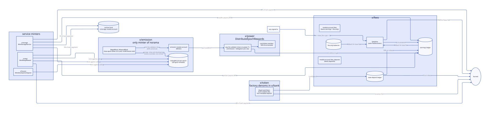
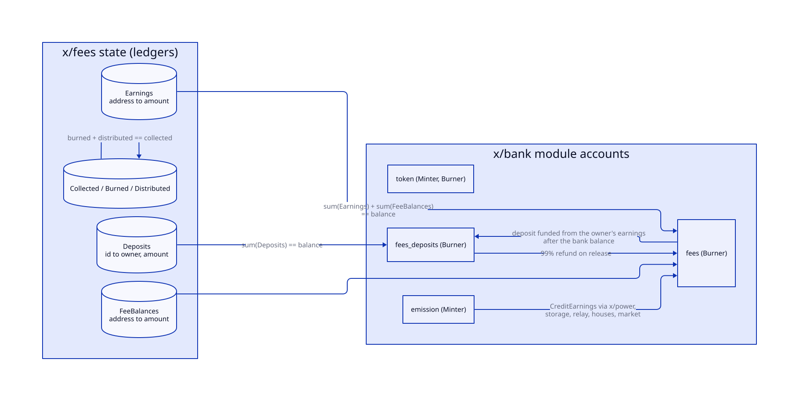
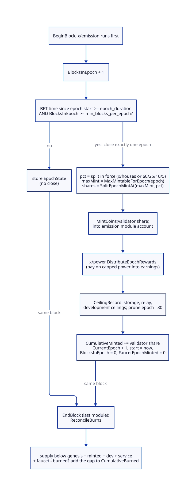
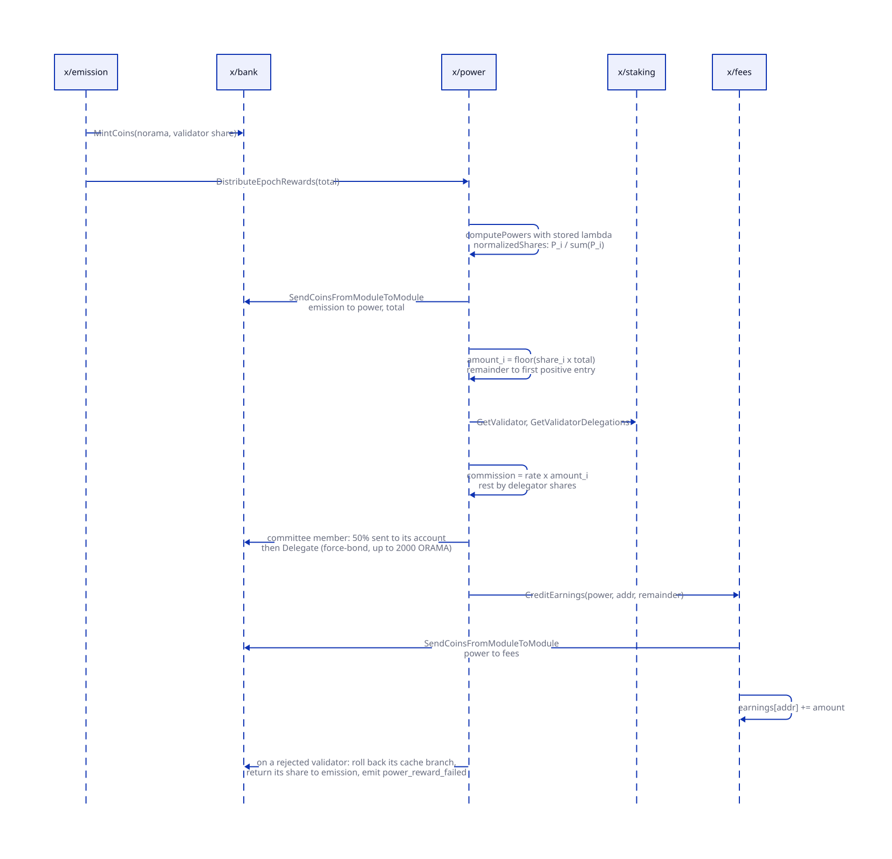
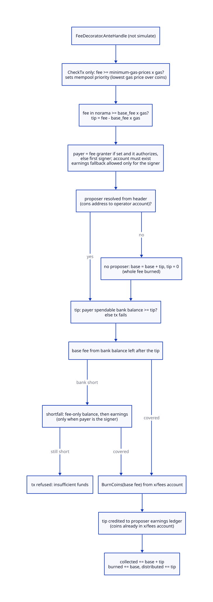
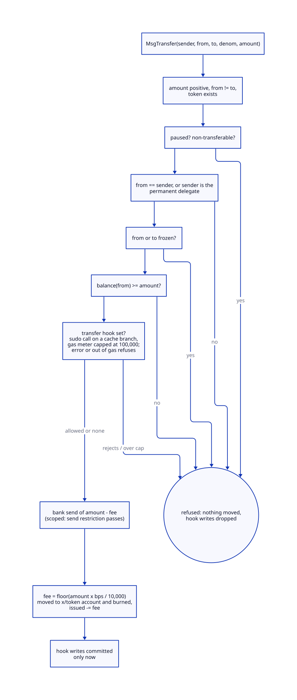

# Economics

> **At a glance.**
>
> - **What:** how norama is created, moved and destroyed on the Orama L1. `x/emission` is the only module that mints norama: it closes an epoch, mints the validator share of a halving-with-tail schedule and pays it through `x/power`, and records the other shares as ceilings that other modules mint against. `x/fees` is the base-fee market, the earnings ledger that holds every protocol payout, the fee-only balances of node hot keys and the state-deposit ledger. `x/token` creates factory denoms in `x/bank` for a fee and a refundable metadata deposit. Nothing here has an admin key: every parameter is fixed at genesis.
> - **Key numbers:** 1 ORAMA is 10^9 norama; epoch closes after 24 h of BFT time and 14,400 blocks, both; maximum emission per epoch 14,848, 7,424, 3,712, 1,856, 928 ORAMA in five brackets of 730 epochs, then 274 ORAMA forever (21,000,640 ORAMA cumulative at epoch 3,650); split 60/25/10/5 (validators, storage, relay, development), each movable at most 10 points; base fee starts and floors at 1 norama per gas, moves at most 12.5% per block toward 50% block fullness, and is burned in full; tips go to the proposer; deposits release 99% and burn 1%; service payments split 90/5/5 (operator, burn, archive); token creation costs 10 ORAMA plus 68,359 norama per metadata byte; a transfer hook runs under 100,000 gas.
> - **Code:** `chain/x/emission/`, `chain/x/fees/`, `chain/x/token/`, with the wiring in `chain/app/app.go`, `chain/app/mint_policy.go`, `chain/app/token_hook.go` and `chain/app/enactment.go`.
> - **Depends on:** [chain architecture](39-chain-architecture.md) for the block lifecycle, the ante chain and `x/power`, [global nodes](37-global-nodes.md) for `x/nodes` bonds and hot keys.

## Why it exists

A permissionless chain needs a currency whose supply nobody can change and whose price of use is set by load, not by a committee. Four constraints shaped the code.

First, supply has to be a function of the epoch number alone. The schedule counts completed epochs, never calendar time, so a halt cannot compress or stretch it, and no message exists that edits it. `x/emission` has no authority address, no `MsgUpdateParams`, and its only message is a faucet that the module refuses on a production chain-id (`chain/x/emission/keeper/keeper.go:Keeper`).

Second, the validators who secure the chain should not also decide what the storage, relay and development shares are worth. Those shares are written as ceilings per epoch and minted only when a module proves work against them. What nobody claims is never minted, so the real supply is at most the schedule and usually below it.

Third, a payout should not be aimed at a chosen address. Every protocol payment lands in the recipient's earnings ledger inside `x/fees` (see [chain architecture](39-chain-architecture.md#the-bank-send-restriction)). Earnings pay fees, bonds, deposits and shielding, and their owner can withdraw them to the owner's own bank balance with `MsgWithdrawEarnings`. That is a spam rule: a payment cannot be aimed at a chosen address, and a reward is not a spendable balance until its owner moves it. Users can pay each other in the open with an ordinary bank send, or privately through the pool.

Fourth, fees must be priced by load and must not enrich whoever orders the block. The base fee follows the EIP-1559 shape and is burned entirely. Only the voluntary tip reaches the proposer, and a tip has to come from a bank balance: a tip is a payment, and earnings pay fees and bonds.

## The model

**norama and ORAMA.** The base denom is `norama`; `ORAMA` is the display unit, 9 decimals (`chain/app/params/params.go:NoramaPerOrama`). Every amount in a message or a state row is an integer count of norama.

**Epoch.** A span of the chain that `x/emission` closes when two conditions hold together: at least `epoch_duration_seconds` of BFT time since it started, and at least `min_blocks_per_epoch` blocks counted in it. Epoch numbers are 1-based and `current_epoch` is 1 right after genesis.

**Schedule.** The maximum norama that may come into existence for a closed epoch, a table of five halving brackets and a tail (`chain/x/emission/types/schedule.go:MaxMintableForEpoch`).

**Split.** The four shares of that maximum: validator, storage, relay, development. Canonically 60/25/10/5 (`chain/x/emission/types/split.go:SplitPercents`).

**Ceiling record.** For each closed epoch, the storage, relay and development shares recorded but not minted, and how much of each has since been minted against it. The module keeps the trailing 30 epochs (`chain/x/emission/types/split.go:CeilingWindow`).

**Earnings.** A ledger in `x/fees`, address to amount, backed by the coins in the `fees` module account. It is a restricted balance: see [the earnings ledger](#the-earnings-ledger).

**Fee-only balance.** A second ledger in `x/fees` that can pay a transaction's base fee and nothing else. An operator gives it to a node's hot key.

**State deposit.** Norama locked under a caller-chosen id in the separate `fees_deposits` module account, refunded 99% to the owner's earnings and burned 1% when released.

**Factory token.** A denom named `factory/creator/subdenom` whose balances live in `x/bank`, with capabilities fixed at creation and only ever dropped.

## How it works

### The schedule

`halvingBracketsOrama` holds the maximum whole-ORAMA mint per epoch for each bracket, and `EpochsPerHalvingBracket` is 730 (`chain/x/emission/types/schedule.go`). The table is compiled in; only a new binary on a new genesis can change it.

| Epochs | Maximum per epoch (ORAMA) | Validator 60% | Storage 25% | Relay 10% | Development 5% |
|---|---|---|---|---|---|
| 1 to 730 | 14,848 | 8,908.8 | 3,712 | 1,484.8 | 742.4 |
| 731 to 1,460 | 7,424 | 4,454.4 | 1,856 | 742.4 | 371.2 |
| 1,461 to 2,190 | 3,712 | 2,227.2 | 928 | 371.2 | 185.6 |
| 2,191 to 2,920 | 1,856 | 1,113.6 | 464 | 185.6 | 92.8 |
| 2,921 to 3,650 | 928 | 556.8 | 232 | 92.8 | 46.4 |
| 3,651 onward | 274 (`TailPerEpochOrama`) | 164.4 | 68.5 | 27.4 | 13.7 |

The five brackets sum to 21,000,640 ORAMA at epoch 3,650 (`CumulativeScheduleMax`). At one epoch a day that is ten years; the first year's maximum is 365 times 14,848, or 5,419,520 ORAMA. The tail adds at most 100,010 ORAMA a year, forever. These are maxima. The 40% that is not the validator share is minted only against claims, so the supply the chain reaches is the validator mints plus whatever storage, relay and development work was actually paid.

Every figure above is a whole number of ORAMA times 10^9, and 10^9 divides evenly by 100. A schedule amount therefore splits into four shares with no remainder at the canonical percentages, and the closed form `CumulativeValidatorMinted` is exact rather than approximate. `SplitEpochMintAt` computes the storage, relay and development shares by integer division and gives the validator share whatever is left, so for any split the four shares always sum to the maximum to the norama (`chain/x/emission/types/split.go:SplitEpochMintAt`).

### Closing an epoch

`x/emission` runs first among the begin-blockers (`chain/x/emission/abci.go:BeginBlocker`). Each block `AdvanceBlock` increments `blocks_in_epoch` and asks `ShouldCloseEpoch`: BFT time minus `epoch_start_unix_nano` must be at least the duration, and the block count at least `min_blocks_per_epoch` (`chain/x/emission/keeper/epoch.go:AdvanceBlock`). At the 5 s blocks CometBFT defaults to, the 24 h clock binds, at about 17,280 blocks; a chain slower than 6 s per block is bound by the 14,400-block floor instead. The block floor is the brake on timestamp games: a supermajority that skewed BFT time still has to produce 14,400 real blocks before an epoch closes.

One call closes exactly one epoch. After a long halt the next block closes the epoch in progress and starts the next one at the current time; the epoch number, and so the halving bracket, advances by one. Missed epochs are never caught up, which is why the schedule is defined in epoch count.

`closeEpoch` does five things in order (`chain/x/emission/keeper/epoch.go:closeEpoch`):

1. It reads the split in force from the `SplitSource`, validates it, and splits `MaxMintableForEpoch(epoch)` with `SplitEpochMintAt`.
2. It mints the validator share into the `emission` module account (`MintCoins`) and calls `x/power`'s `DistributeEpochRewards` to pay it out (below).
3. It writes the `CeilingRecord` for the epoch: the three unminted ceilings, the validator amount minted, zero for the other minted counters, and the four percentages unless the split is canonical (all zero means canonical).
4. It removes the record that fell out of the 30-epoch window.
5. It advances `EpochState`: `cumulative_minted` grows by the validator share, `validator_split_delta` by the difference from the canonical share, `current_epoch` by one, the start time becomes now, `blocks_in_epoch` and `faucet_epoch_minted` reset to zero.

The split source is `x/houses`: `emissionSplitSource` returns the enacted percentages or the canonical ones (`chain/app/enactment.go:emissionSplitSource`). A structural proposal can move each share by at most `SplitBoundPoints` (10) from its canonical value with the four summing to 100, and `Keeper.currentSplit` re-validates the enacted split on every close and fails the block's epoch close if it is invalid. The halving table and the tail are not part of the split and no proposal reaches them.

### Paying the validator share

`DistributeEpochRewards` does not use `x/distribution`. It recomputes every validator's power on the lambda stored by the previous block, normalises it, and pulls the minted coins from the `emission` account into the `power` account (`chain/x/power/keeper/rewards.go:DistributeEpochRewards`). Validator `i` is owed `floor(share_i * total)`; the first positive entry also takes the truncation remainder, so the whole mint is distributed. [Chain architecture](39-chain-architecture.md#voting-power) describes the share itself.

For each validator the amount is split in `distributeValidatorReward`: commission is the validator's commission rate times the amount, truncated; the rest is shared across the validator's delegations pro rata by delegator shares; the rounding dust and the operator's own delegation portion go to the operator. Each credit is `CreditEarnings` from the `power` account into the `fees` account and the ledger, so the reward is an earnings entry, not a bank balance.

Two details matter. A bootstrap committee member's operator credit is partly force-bonded: 50% (`force_bond_fraction`) of what the operator would receive is sent to its account and delegated to its own validator, up to a self-bond ceiling of twice `min_self_bond`, which is 2,000 ORAMA at the defaults (`chain/x/power/keeper/rewards.go:forceBondCommitteeReward`). And each validator is paid in its own cache branch. A failure that is about that validator (an invalid address, a delegation that cannot be read, a force-bond the staking module refuses) rolls its branch back, sends its share back to the `emission` account, emits `power_reward_failed` and moves on; any other fault, such as an unreadable collection, fails the epoch close. The returned coins stay in the `emission` account and are not re-minted: a rejected share is never paid to anyone.

### The service mints

The storage, relay and development shares are claimed by the modules that can prove work. Each claim mints against one epoch's ceiling record and refuses an amount above what remains.

| Caller | Method | Mints into | Counter |
|---|---|---|---|
| `x/storage` | `MintStorageService` | the `storage` account | `cumulative_service_minted` |
| `x/relay` | `MintRelayReward` | the `relay` account | `cumulative_service_minted` |
| `x/houses` | `MintDevelopmentSpend` | the `emission` account | `cumulative_development_minted` |

(`chain/x/emission/keeper/service_mint.go:MintStorageService`, `chain/x/emission/keeper/relay_mint.go:MintRelayReward`, `chain/x/emission/keeper/development.go:MintDevelopmentSpend`.) A claim for an epoch whose record has been pruned, or for a record that does not match the share its recorded split would produce, is refused. The development path additionally checks that the stored ceiling equals the development share of the split the epoch closed under. `x/storage` mints once per closing epoch for the whole payment, while the record is certain to exist, and settlement pays from that reserve, so a settlement queue that lags past the 30-epoch window still pays. Only these four functions and the faucet mint norama; the bank keeper handed to `x/token` refuses any mint that includes norama (`chain/app/mint_policy.go:refuseNoramaMint`).

### Burns, and how the supply is accounted

`x/emission` has no burn path. Other modules burn: the fee decorator, the deposit release, the token creation fee, the service split, the shielded pool's fees, and `x/slashing` through the staking pools. To keep the supply equation true without importing any of them, `ReconcileBurns` runs in the last end-blocker and compares the bank supply of norama with `expectedSupply`: genesis supply plus cumulative validator, development, service and faucet mints, minus cumulative burned. Any shortfall is attributed to `cumulative_burned` (`chain/x/emission/keeper/invariants.go:ReconcileBurns`). It never raises the counter on a surplus, so a mint that bypasses the counters shows up as a broken invariant rather than being absorbed. In one line, `supply == emitted - burned`, where emitted is the genesis supply plus every epoch, development, service and faucet mint.

`CheckSupplyInvariant` states the two invariants that hold after every block: `cumulative_minted` equals `CumulativeValidatorMinted` of the completed epochs plus `validator_split_delta`, exactly; and the bank supply equals `expectedSupply`. They are asserted at genesis (`InitGenesis` refuses a state that breaks them) and are readable through the `Invariants` query. No crisis module is wired, so a broken invariant after genesis does not halt the chain.

### The base fee

`x/fees` keeps one number, the base fee in norama per unit of gas. It starts at `initial_base_fee` (1) and `AdvanceBaseFee` moves it once per block in the `x/fees` end-blocker, using the block gas meter against the consensus `max_gas`. If no `max_gas` is configured the fee does not move (`chain/x/fees/keeper/abci.go:AdvanceBaseFee`). The genesis builders set `max_gas` to 100,000,000.

`NextBaseFee` is pure fixed-point arithmetic (`chain/x/fees/types/basefee.go:NextBaseFee`). The target is `target_block_gas_fraction` (0.5) of `max_gas`; the change fraction is `(used - target) / target`, clamped to plus or minus `max_base_fee_change_fraction` (0.125); the next fee is the current fee times one plus that fraction, truncated. Integer truncation would pin a fee of 1 forever, so a positive change that truncates back to the same integer is raised by one, and a negative change on a fee above the floor is lowered by one. The result never goes below `min_base_fee` (1). A block with no usage lowers the fee by 12.5% per block until the floor; a full block (twice the target) raises it by 12.5%.

### Settling a fee

`FeeDecorator` replaces the stock deduct-fee decorator at position 11 of the 19-decorator ante chain (see the chain in [the ante chain](39-chain-architecture.md#the-ante-chain)):

On a delivered or checked transaction it runs these steps (`chain/x/fees/ante/fee_decorator.go:FeeDecorator`):

1. A transaction with a zero gas limit is refused above height 0.
2. On `CheckTx` only, the node's own `minimum-gas-prices` (default `0.000001norama`) is enforced, and the lowest gas price over the fee coins becomes the mempool priority. This is a local admission policy; it never runs in a block.
3. The fee in norama must be at least the current base fee times the gas limit. The excess is the tip.
4. The payer is the fee granter when one is set and the feegrant keeper authorises it, otherwise the first signer. The account must exist. A granter-paid transaction may not fall back to earnings.
5. The proposer is resolved from the header's proposer address: consensus address to validator to operator account (`ResolveProposer`). If it does not resolve, the whole fee, base and tip, is burned and the tip is zero; an unresolvable header field must not be able to block every transaction.

`SettleFee` then moves the money (`chain/x/fees/keeper/feepay.go:SettleFee`). The payer's spendable bank balance must cover the tip, or the transaction fails. The base fee is taken from the bank balance left after the tip; if that is short and the payer is the signer, the shortfall comes from the payer's fee-only balance first and then from its earnings; if still short, the transaction is refused. The coins taken from the bank go into the `fees` account; the base fee is burned from there (`BurnCoins`), and the tip is credited to the proposer's earnings as a ledger entry, with the coins already sitting in the `fees` account. Finally three counters are updated: `collected` grows by the whole fee, `burned` by the base part and `distributed` by the tip, so `burned + distributed == collected` is an exact invariant.

Simulation runs the same settlement on a discarded branch so the gas of paying from earnings is counted in a `--gas auto` estimate, but never fails the simulation, because the fee and gas of a simulation are not final.

The tip is paid to the proposer's operator account only. Delegators share the epoch reward, not tips.

### The earnings ledger

Every module that pays a protocol reward calls `CreditEarnings` with its own module account as the sender: `x/power` for the epoch reward, `x/storage` and `x/relay` for service payments, `x/houses` for development spends, `x/market` for sale proceeds and royalties, and `x/shielded` for a signer-less transfer's tip (`chain/x/fees/keeper/earnings.go:CreditEarnings`). The coins move into the `fees` account and the ledger entry grows; the invariant is that the sum of earnings plus fee-only balances equals the `fees` account's balance. A ledger row that reaches zero is deleted, because a zero row would fail genesis validation on export.

What earnings can be spent on is the whole restriction. The owner can always turn earnings into a bank balance, and a bank balance can be sent in the open, so the restriction stops a payer from aiming a reward, not an owner from using one:

| Use | Mechanism |
|---|---|
| The base fee of a transaction | `SettleFee`, signer only, after the bank balance (and the fee-only balance) |
| Bonding a validator or delegating | `FundSpendFromEarnings`, called inside the message handler of `MsgCreateValidator` and `MsgDelegate` |
| Bonding a node role, creating a token, opening a storage deal | the same call, inside those handlers |
| A state deposit | `fundDeposit`: bank balance first, then the owner's earnings |
| Shielding | `x/shielded`'s `MsgShieldEarnings` debits the signer's earnings into the pool |
| A public balance | `x/fees`'s `MsgWithdrawEarnings` debits the signer's earnings and sends the same amount to the signer's own bank balance (`chain/x/fees/keeper/withdraw.go:WithdrawEarnings`) |
| A node's hot key | `FundFeeBalance` moves earnings to another address's fee-only balance; `x/nodes`'s `MsgFundHotKey` is its only caller |
| A contract paying a user | `PayEarnings`, from the contract's bank balance into the recipient's earnings |

`FundSpendFromEarnings` tops the signer's bank balance up from its own earnings, by exactly the shortfall, or does nothing if earnings cannot cover the whole shortfall. It is called from message handlers and never from an ante decorator, because ante writes survive a message that then fails: a top-up in the ante chain would turn earnings into spendable balance for free. A handler runs in the message's cache branch, which is discarded if the message fails, taking the top-up with it (`chain/x/fees/keeper/earnings.go:FundSpendFromEarnings`, `chain/app/staking_topup.go:earningsFundedStaking`).

A tip cannot come from earnings. `SettleFee` checks the tip against the bank balance alone. A tip is a payment to the proposer, and earnings pay fees and bonds.

A fee-only balance is the same ledger idea with a narrower use: it pays a base fee and nothing else, it is not bondable, and it is not drawn through a fee granter (`TestFeeBalance_cannotBeBonded`, `TestSettleFee_feeBalanceNeverPaysATip`). `CreditFeeBalance` is the second way in: `x/shielded`'s unshield to the signer's own fee balance.

### State deposits

`x/fees` exposes six deposit operations to other modules' keepers; no user message calls them directly (`chain/x/fees/keeper/deposits.go`). The `fees_deposits` account is separate from `fees` so the two balance invariants are checked independently.

- `LockDeposit` takes an owner, a globally unique id and an amount. The bank balance pays first; any shortfall comes from the same owner's earnings, and both are checked before anything moves. A duplicate id is refused.
- `TopUpDeposit` adds to an open deposit, funded the same way, so one payer is one row.
- `ReleaseDeposit` pays out the whole deposit through `SplitDeposit`: the refund is `deposit_refund_fraction` (0.99) of the amount, truncated, to the owner's earnings, and the burn share (0.01) is whatever is left, so the two sum to the amount exactly.
- `ReleaseDepositPart` does the same for part of a deposit and keeps the row open with the remainder. The part must be positive and strictly less than the deposit.
- `SlashDeposit` burns up to an amount with no refund, removing the row if nothing is left.

The deposit callers are `x/token` (metadata), `x/nodes` (node and cluster records), `x/storage` (probation and deal deposits), `x/cnft` (tree deposits) and `x/wasmpolicy` (contract state, priced per byte of storage growth). A deposit is not a fee: it is returned, less 1%, when the thing it priced is deleted. It prices state at `deposit_per_byte`, 68,359 norama per byte, which is 0.07 ORAMA per KiB with integer division (`chain/x/token/types/params.go:DepositPerByte`). The chain has no price oracle; the number is a constant.

### Service payments

A payment to a storage provider or a relay operator is split 90/5/5 (`chain/x/storage/types/subsidy.go:SplitServicePayment`). The burn is 500 basis points, the archive-fund share 500 basis points, and the operator receives the rest including the rounding remainder. The operator's part is a `CreditEarnings` from the paying module's account; the burn share is `BurnCoins` from the same account; the archive share goes to the archive-fund module account through `FundArchive`, which both `x/storage` and `x/relay` call (`chain/x/storage/keeper/settlement.go:FundArchive`, `chain/x/relay/keeper/settle.go:payOperator`). The mechanisms that decide how much each claim is worth are in the chapters on storage deals and relay rewards; economics sees only the split.

### Shielded fees

A signer-less shielded transfer has no fee decorator. Its fee is the difference between the value entering and leaving the bundle: the base fee part and the per-nullifier fees are burned, the rest is the tip, and the tip is credited to the proposer's earnings, or burned with the rest when no proposer resolves (`chain/x/shielded/keeper/execute.go:ExecuteTransfer`). The shielded pool is described in its own chapter.

### Factory tokens

`MsgCreateToken` creates the denom `factory/creator/subdenom` (`chain/x/token/types/denom.go`). The subdenom matches a lowercase letter followed by 1 to 43 lowercase letters or digits, so the denom has exactly three segments. Name is 1 to 64, symbol 1 to 16 alphanumeric, description 0 to 256 printable ASCII bytes. Creation requires `creation_fee` (10 ORAMA) plus `deposit_per_byte` times the byte count of subdenom, name, symbol and description (`chain/x/token/keeper/create.go:CreateToken`). The handler first tops up the creator's bank balance from its earnings for the exact need, then checks the spendable balance, burns the creation fee from the `token` account, and locks the metadata deposit through `LockDeposit` under the id `token/` plus the denom. The token keeper holds the `Minter` role in `x/bank`, but its bank handle refuses any mint that includes norama, and `MsgMint` is open only to the creator, for the creator's own denom.

Seven capabilities are chosen at creation and can only be dropped, with `MsgRenounce`:

| Capability | Effect | Notes |
|---|---|---|
| mint | the creator may issue more | only the creator; frozen recipients refused |
| freeze | the creator may freeze an account | renouncing does not unfreeze existing freezes |
| permanent delegate | an address may move any holder's tokens | only that delegate can renounce it; `non_transferable` blocks it too |
| transfer fee | a fee of `transfer_fee_bps` of each transfer is burned in the token | at most 10,000 bps; floors; a zero result is possible for a small amount |
| non-transferable | transfers refused | mint and burn still work |
| pause | the creator may pause transfers | mint and burn still work; renouncing does not unpause |
| transfer hook | a CosmWasm contract is called on every transfer | fixed at creation; the contract must exist |

`Transfer` runs the checks in the order of the diagram, then the hook, then a bank send of the net amount, then the fee burn from the sender, then it commits the hook's writes (`chain/x/token/keeper/transfer.go:Transfer`). The transfer fee burns tokens, not norama: `issued` falls by the fee and the denom's bank supply with it.

The hook is a sudo call to the contract with the message `transfer_hook` carrying denom, from, to and the gross amount (`chain/app/token_hook.go:contractTransferHook`). The keeper runs it in a cache branch under a gas meter capped at 100,000 (`chain/x/token/types/keys.go:TransferHookGasCap`) and consumes the gas it used from the transaction's own meter. An error from the contract, or running out of the cap, fails the transfer; the hook's state writes are committed only after the bank send succeeds (`chain/x/token/keeper/hook.go:runTransferHook`). A build without libwasmvm refuses a token that names a hook. Because the hook runs only inside `MsgTransfer`, `SendRestriction` refuses any plain bank send of a token with a fee or a hook (`chain/x/token/keeper/restriction.go:SendRestriction`): freeze, pause, non-transferable, fee and hook hold on every path that moves the coins, including a contract's bank message.

`MsgDeleteToken` removes a token only when its `issued` and its bank supply are both zero, clears its freezes and releases the metadata deposit: 99% to the creator's earnings and 1% burned. `MsgSetShieldable` marks a token usable in the shielded pool, and it is refused while freeze, a permanent delegate or pause is still held, because those powers would let a creator touch value the pool is meant to hide.

## State it owns

| Store | Key | Holds | Written by | Read by |
|---|---|---|---|---|
| `emission` params | `0` | epoch duration, minimum blocks, bootstrap flag, faucet limits | genesis only | `AdvanceBlock`, the faucet |
| `emission` epoch state | `1` | current epoch, start time, blocks in epoch, the cumulative counters | begin and end blockers, service mints | invariants, `x/power`, queries |
| `emission` ceilings | `2`, by epoch | the unminted shares and what was minted against them | `closeEpoch`, the three mint functions | `x/storage`, `x/relay`, `x/houses` |
| `emission` faucet drips | `3`, by address | last drip time (Unix seconds) | `Faucet` | the cooldown check; not exported |
| `fees` params | `0` | six base-fee and deposit parameters | genesis only | the decorator, deposits |
| `fees` base fee | `1` | the current norama per gas | `AdvanceBaseFee` | decorator, clients |
| `fees` earnings | `2`, by address | earnings balance | credits and debits | queries, bond handlers |
| `fees` deposits | `3`, by id | owner and amount | the deposit operations | owning modules |
| `fees` counters | `4`, `5`, `6` | collected, burned, distributed | `SettleFee` | invariants |
| `fees` fee balances | `7`, by address | fee-only balance | `FundFeeBalance`, `CreditFeeBalance` | `SettleFee` |
| `token` params | `0` | creation fee, deposit per byte | genesis only | `CreateToken` |
| `token` tokens | `1`, by denom | metadata, capabilities, paused, shieldable, issued, deposit | the token messages | the send restriction |
| `token` frozen | `2`, pair of denom and account | a freeze | `SetFrozen` | the send restriction |
| module accounts | `emission` (Minter), `fees` and `fees_deposits` (Burner), `token` (Minter, Burner) | the coins behind the ledgers | bank | invariants |

The `emission` module account holds nothing between blocks except development mints waiting to be paid and any reward share returned by a rejected validator; the `power` module account must be empty between blocks (its invariant checks that). The coins of earnings, fee-only balances and deposits are real coins in the `fees` and `fees_deposits` accounts, which is why the ledger sums can be checked against bank balances.

## Lifecycle

**Genesis.** Supply starts at exactly zero. `InitGenesis` validates the state, rejects `allow_bootstrap_stake` and `faucet_enabled` on a production chain-id, and on a fresh genesis (epoch at most 1, nothing minted) records the observed bank supply as `genesis_supply`. A non-zero supply is accepted only with `allow_bootstrap_stake` set, a devnet, stagenet or localnet chain-id, and every norama sitting in the staking bonded pool (`chain/x/emission/keeper/genesis.go:checkPremineGate`). The production floors on epoch length (24 h, 14,400 blocks) apply unless that flag is set. `ValidateLockedGenesis` compares every parameter of every locked module with the module's compiled default; a devnet or stagenet chain-id may differ only in the epoch clock, the faucet and the committee size, a localnet in anything, a production chain-id in nothing (`chain/app/locked_genesis.go:ValidateLockedGenesis`). An export keeps `genesis_supply` and does not recompute it, because recomputing from the then-current supply would double-count everything minted since.

**Normal operation.** Each block: emission counts the block and maybe closes an epoch; transactions pay fees; the end-blockers burn-reconcile and move the base fee. Each epoch: one mint, one payout walk, one ceiling record. Mints against ceilings happen when `x/storage` closes its epoch, when `x/relay` settles an epoch and when `x/houses` advances a spend.

**Rolling upgrade.** The chain does not upgrade in place: no module sets a migration and the application registers no upgrade handler, so the economics modules carry `ConsensusVersion` 1 and a release that changes stored types starts from a new genesis ([chain architecture](39-chain-architecture.md#lifecycle)). Mixed versions are not a supported state for these modules: the base fee, the epoch close and the settlement are consensus code, and two builds that disagree on any of them split the chain.

**Restart.** All state is in the application store. A restart resumes `blocks_in_epoch` and the epoch start time from state, so an epoch that was half done continues. The faucet's drip times are in the store but are not exported, so a re-imported genesis forgets cooldowns.

**Node loss.** A validator that stops or is jailed leaves the power universe and stops earning; its share is redistributed by the normalisation, not minted anew. However long a halt was, the first block after it closes one epoch, not one per elapsed day.

## Failure modes

| Trigger | What the system does | What you observe |
|---|---|---|
| Chain halted for several epochs | Closes one epoch on the next block; the epoch number advances by one | `CurrentEpoch` lags the calendar; emitted supply is below the calendar schedule, never above |
| A validator's reward cannot be paid | Rolls back that validator's branch, returns the share to the `emission` account, emits `power_reward_failed` | the event in the epoch-closing block; supply invariant still holds, the coins are unpaid |
| A fault the reward walk cannot attribute to one validator | The epoch close fails and the block with it | a halted chain; this is deliberate: running on unreadable state would fork |
| An enacted emission split fails validation | `closeEpoch` returns an error | the same: a halted chain, because a bad split must not mint |
| Block gas limit unset (`max_gas` of 0 or less) | The base fee never moves | `BaseFee` constant at its initial value |
| Fee below base fee times gas | The transaction is refused in the ante chain, nothing is charged | code 13, "insufficient fee: got ..., want at least the base fee of ..." |
| Payer has no bank balance for the tip | The transaction fails | "insufficient bank balance to pay a tip ..., a tip must come from a public bank balance, never earnings" |
| Fee granter without bank balance | Refused; the granter's earnings are never used | "a fee granter cannot draw on the payer's earnings" |
| Proposer cannot be resolved | The whole fee is burned | `burned` rises by the fee; no tip is credited |
| Node's `minimum-gas-prices` above the offered price | `CheckTx` refuses; the transaction may still be valid on another node | "insufficient fees" from that node only |
| Token created with no funds | `CreateToken` refuses before burning anything | "insufficient norama to create ...: need X, have Y spendable" |
| Transfer hook errors or exceeds 100,000 gas | The transfer moves nothing; the hook's writes are dropped | `ErrHookGasCap` or "transfer hook rejected" |
| Plain bank send of a paused, fee-bearing or hooked token | Refused by the send restriction | "moves only by x/token MsgTransfer" |
| `ReleaseDeposit` of an unknown id | Returns not found | the message that called it fails |
| Faucet on a production chain-id | `ErrFaucetProduction` before any mint | typed error `emission/1` |
| Bank supply drifts from `expectedSupply` with no burn | `ReconcileBurns` does nothing on a surplus; the invariant reports broken | `Invariants` returns false for `supply_matches_minted` |
| Clock skew in block times | Block times are BFT time, a median of validator timestamps; the block floor still applies | epochs no shorter than 14,400 blocks |

## Trust and security

**Who can mint.** Only `x/emission` holds `Minter` on norama, and its mint paths are the epoch close, the three ceiling-bounded service mints and the faucet. `x/token` also holds `Minter`, but its bank keeper is wrapped with a mint restriction that refuses norama (`TestGetMaccPerms_onlyEmissionMintsNorama`). No message can change the schedule, the split's bounds, the base-fee parameters or the deposit fraction: the stock modules' authority is the hash of a module name that is never registered, and the three modules here have no authority at all. The one lever is the emission split, and it is bounded: each share within 10 points of canonical, the upgrade timelock in `x/houses` (60 days at the defaults, never less), no way to touch the halving table or the tail.

**Who sees what.** Every ledger is public state. Earnings are not hidden; they cannot be paid to a chosen address. A payout is a ledger credit, a user-to-user bank send of an existing balance is public, and value reaches a plain user balance by a deliberate release path: node and stake unbonding returning to the owner, the faucet on a test network, and `MsgWithdrawEarnings`, by which the owner moves earnings to the owner's own balance. The private path between users is a shielded transfer.

**An attacker as a validator or proposer.** A proposer chooses transaction order and receives tips, but cannot raise the base fee by stuffing its own blocks without paying it, because the base fee is burned and the fee a stuffing transaction pays is above the floor. A proposer cannot take other people's tips: the tip is credited to the proposer of the block that contains the transaction, resolved from the header. A supermajority that manipulated timestamps cannot close an epoch before 14,400 blocks. A validator whose commission is 100% takes the whole epoch reward of its delegators: commission has no cap in the economics code (it is the stock staking module's rule, `min_commission_rate` 0).

**An attacker as a user.** A user cannot use earnings as a free spendable balance: top-ups happen inside message handlers and are rolled back with a failed message. A token creator cannot hide a hook or a fee after creation, because capabilities are fixed at creation, and cannot re-enable what it renounced. A holder cannot bypass a token's freeze or pause with `MsgSend` or a contract's bank message, because the bank send restriction runs on every send. A creator cannot create a token with a name a client will mistake for another: the denom contains the creator address, and there is no verified registry.

**Faucet.** The faucet mints for anyone who asks on a test network. It is gated three times: the genesis refuses `faucet_enabled` on a chain-id without `-devnet-`, `-stagenet-` or `-localnet-`; the message checks the chain-id again; and it is bounded per drip (1,000 ORAMA), per recipient cooldown (24 h) and per epoch (100 drips). A chain-id is the only fact the gate reads, so the gate protects a production chain only as far as its chain-id is honest; the locked-genesis check makes a production chain-id with the faucet on a refused genesis.

**The public faucet route.** A newcomer has no account and no node, so cannot sign `MsgFaucet` itself, and any existing account may sign it (the signer pays its own transaction fee through `x/fees`). A gateway whose node.yaml has `chain.faucet.enabled: true` serves `POST /v1/chain/faucet` and signs for it with a secp256k1 key in `chain.faucet.key_file` (default `/opt/orama/.orama/secrets/chain-faucet.key`: owned by the gateway's account, mode 0600, refused otherwise); without the setting or the key the path is a 404. The request is `{"recipient":"orama1…","amount":"<norama>"}`, the amount optional (a decimal string, 100 ORAMA by default). The gateway reads the chain id from the chain for every drip and signs only on a test network's, one transaction at a time (the account's sequence is known only once a block holds the previous one), and simulates it first, so a refusal the chain would give costs the faucet no fee. It answers `200 {"tx_hash","amount","height"}` once the drip is in a block. Refusals are JSON `{"error","message"}`: `bad_request` and `bad_recipient` (400: not a canonical lowercase address, the faucet's own account, or a module or blocked account), `bad_amount` (400: not a whole number of norama, or over `faucet_max_drip`), `cooldown` (429), `allowance_spent` (429 with `Retry-After`: a client network may ask 20,000 ORAMA in a day in all, and all clients together 200,000 ORAMA; both are charged before the drip and given back if it is not made, so one client cannot spend the epoch's cap on fresh recipients), `epoch_cap` (503), `faucet_disabled` (403), `busy` (503 with `Retry-After`: 16 drips already wait for the account's turn, or the requester left while its drip was queued and nothing was sent), `unavailable` (503: the faucet account does not exist or cannot pay a fee), `pending` (504: being made or sent and not yet in a block after 45 seconds, or any error once the transaction was broadcast; the allowance stays charged) and `faucet_failed` (502, the details only in the gateway log). The route has its own rate-limit buckets, 3 a minute with a burst of 3 per client network and 20 a minute with a burst of 6 for the whole route, and at most 24 requests in flight. Buckets and allowance key the caller by the address of the connection and read no `X-Forwarded-For`, which a process on the node, tenant code included, can write; behind Caddy every public caller therefore reaches the gateway from the loopback address and shares one bucket and one allowance, until Caddy proves itself to the gateway with a header only it can write, which does not exist yet.

**Provisioning the faucet.** On the node, as root, `orama maint faucet init` makes the key (never replacing one) and prints the faucet account. The account pays one fee per drip and holds nothing else, so it needs a few ORAMA; it cannot be a genesis account, because a genesis must start at zero supply (`checkPremineGate`). It is funded as any account is, by a drip signed by an operator (`orama chain faucet <account> --env <network> --amount <norama>`). Then `chain.faucet.enabled: true` goes into node.yaml and the node restarts with `orama node restart`; `orama node upgrade` keeps the block. The genesis `faucet_max_drip` must be at least what one `orama setup` needs, which is more than the validator's 1,000 ORAMA self-bond: `orama setup --create-network` sets it to 10,000 ORAMA in the genesis of a test network and enables the faucet unless `--no-faucet`. A running chain does not gain the faucet from a new binary: the message service and the parameters are new state and a new message type with no upgrade handler, so a test network gets it from a new genesis.

## Limits and scale

**Hard numbers.** Epoch duration is at most 365 days and at least 24 h on a production chain; minimum blocks per epoch at most 10^9 and at least 14,400. A subdenom is 2 to 44 characters. A transfer fee is at most 10,000 basis points. A transfer hook is capped at 100,000 gas. The fee-balance and earnings ledgers have one row per address; the deposit ledger one row per id.

**What 10x looks like.** The first bottleneck is the epoch-closing block. `DistributeEpochRewards` visits every validator in the power universe and, for each, every delegation of that validator (`GetValidatorDelegations`, unpaginated), crediting the earnings of each delegator in the same BeginBlock. The cost is linear in total delegations. The 1 ORAMA `min_delegation_for_rewards` rule in the ante chain bounds the dust that can inflate it, but not the number of honest delegators; at ten times the delegations, the one block per epoch that closes the epoch is ten times as heavy while every other block is unchanged. The second is the token invariant walk, which is linear in tokens and is why the query is withheld from the public route. The base fee is the load valve for ordinary traffic: sustained full blocks raise it 12.5% per block, so doubling it takes about six blocks, and it falls at the same rate when load stops.

**Issuance versus demand.** At the first-year maximum, 3,251,712 ORAMA of validator share are minted against a bootstrap exit stake of 271,000 ORAMA, about 5% of year-1 maximum emission. Burn pressure comes from the base fee, the 1% deposit burn, the 5% service burn, token creation fees and slashing; none is tuned against emission. Whether burn can ever balance the tail's 60,006 ORAMA a year of validator mint depends on usage that the code does not constrain.

## Design decisions

### Counting epochs, not time

*Chosen:* the schedule and every halving boundary count completed epochs; a gap closes one epoch. *Rejected:* a calendar-based schedule that mints for elapsed time. *Why:* a halt must not let a restarted chain mint a backlog, and a timestamp that a supermajority can skew must not be able to move a boundary.

### Two conditions to close an epoch

*Chosen:* BFT time and block count must both hold. *Rejected:* time alone. *Why:* timestamps are the one input validators influence; a block-count floor of 14,400 makes compressing an epoch cost real consensus work.

### Mint only the validator share

*Chosen:* the other 40% is a ceiling that modules mint against on proof. *Rejected:* minting all four shares into pools at epoch close. *Why:* unclaimed storage, relay and development emission never exists, so the real supply tracks real work, and no pool holds a balance an attacker could aim at.

### Pay rewards on capped power, into earnings

*Chosen:* `x/power` pays on its own capped, normalised shares and credits earnings; `x/distribution` receives nothing from emission or fees. *Rejected:* the stock mint and distribution modules. *Why:* stock distribution pays on raw stake and into bank balances; this chain caps stake, and a bank balance would be a public payment.

### Earnings restricted to the signer's own uses

*Chosen:* a ledger usable for fees, bonds, deposits and shielding, with a top-up inside message handlers and a withdrawal that only its owner can make, to the owner. *Rejected:* an ordinary bank balance, or a transferable earnings token. *Why:* a reward must not be aimed at a chosen address, and a spendable reward credited by a proposer or a contract would be.

### The tip is paid from the bank balance only

*Chosen:* earnings may pay the base fee but never the tip. *Rejected:* letting earnings pay any fee. *Why:* a tip is the one fee component that reaches a third party; funding it from earnings would let a user pay a chosen proposer address from a restricted balance.

### Burn the whole base fee

*Chosen:* 100% of the base fee is burned and the proposer earns tips only. *Rejected:* a base-fee share to validators. *Why:* a proposer who earns the base fee is paid to fill blocks; burning it makes the fee a pure price signal and ties supply to usage.

### Burn reconciliation instead of a burn hook

*Chosen:* `ReconcileBurns` infers burns from the supply at the last end-blocker. *Rejected:* every burning module calling an emission hook. *Why:* the burners include `x/slashing` and the staking pools, which `x/emission` would otherwise have to depend on; the supply identity needs the total, not the source.

### Fixed capabilities on tokens

*Chosen:* capabilities set at creation and only droppable. *Rejected:* a creator who can add a fee or a hook later. *Why:* a holder can read the token's powers once and rely on them; the only change is a power being given up.

### Enforcement on the bank send path

*Chosen:* a bank send restriction that applies freeze, pause, non-transferable, fee and hook to every move of a token. *Rejected:* checks only in `MsgTransfer`. *Why:* a plain `MsgSend` or a contract's bank message would otherwise route around every power.

## Known gaps

- The comment on `LockDeposit` says no module consumes the deposit API yet (`chain/x/fees/keeper/deposits.go:LockDeposit`); `x/token`, `x/nodes`, `x/storage`, `x/cnft`, `x/market` and `x/wasmpolicy` all do. The comment on `defaultMinGasPriceNorama` says the base fee is not built (`chain/cmd/oramad/cmd/commands.go:defaultMinGasPriceNorama`); it is, and the value is a local mempool floor on top of it.
- No invariant is asserted after genesis. `CheckSupplyInvariant` runs in `InitGenesis`; afterwards the invariants of emission, fees, token and the other modules are queries, and no crisis module or end-blocker halts the chain on a break (`chain/x/emission/keeper/invariants.go:CheckSupplyInvariant`). The fleet e2e suite reads them after every step.
- `ReconcileBurns` attributes any supply shortfall to `cumulative_burned`, whatever its cause; a bug that destroyed coins outside a burn would be recorded as a burn and the invariants would still hold (`chain/x/emission/keeper/invariants.go:ReconcileBurns`).
- The faucet's drip times are not part of genesis export, so a chain restarted from an exported genesis forgets recipient cooldowns (`chain/x/emission/keeper/keeper.go:Keeper`).
- Epoch close walks every validator's delegations in one BeginBlock with no pagination or per-block budget (`chain/x/power/keeper/rewards.go:distributeValidatorReward`).
- `MsgCreateToken` has no per-creator limit and no name uniqueness beyond the creator's own subdenoms; spam is priced only by the 10 ORAMA fee and the deposit (`chain/x/token/keeper/create.go:CreateToken`).
- Commission is uncapped: the staking module's `min_commission_rate` is 0 and `x/power` pays the commission rate as read, so a validator can take all of an epoch's reward from its delegators.

## Verify it yourself

**Unit tests** (all in `make test`, from `chain/`):

- `chain/x/emission/keeper/`: `TestShouldCloseEpoch_bothSatisfied`, `TestShouldCloseEpoch_exactBoundaryIsSatisfied`, `TestAdvanceBlock_noCatchUpAfterLongGap`, `TestAdvanceBlock_prunesCeilingsOutsideWindow`, `TestCheckSupplyInvariant_simulated4000EpochRun`, `TestCheckSupplyInvariant_breaksWhenSupplyDrifts`, `TestInitGenesis_rejectsNonzeroSupplyWhenBootstrapStakeNotAllowed`, `TestInitGenesis_exportReimportRoundTripDoesNotStallOnHeight`, `TestInitGenesis_reconcileBurnsAfterASlashKeepsInvariantHolding`, `TestMintDevelopmentSpend_mintsOnlyRemainingCeiling`, `TestMintStorageService_refusesPastTheCeilingAndBadAmounts`, `TestMintRelayReward_refusesASecondMintPastTheCeiling`, `TestCloseEpoch_usesTheEnactedSplit`, `TestFaucet_refusedOnProductionChainID`, `TestFaucet_epochCapRefusesThenResetsWhenEpochCloses`.
- `chain/x/emission/types/`: the schedule and split tests, including `TestCumulativeScheduleMax_epoch3650Equals21_000_640Orama` and `TestSplitEpochMint_exactDivision`.
- `chain/x/fees/`: `TestNextBaseFee_neverBelowFloor`, `TestNextBaseFee_risesWhenFull`, `TestSettleFee_tipMustComeFromBankNeverEarnings`, `TestWithdrawEarnings_movesEarningsToTheOwnersBankBalance`, `TestWithdrawEarnings_moreThanTheBalanceMovesNothing`, `TestSettleFee_baseFeeFallsBackToEarningsWhenBankIsShort`, `TestSettleFee_feeGranterCannotUseEarningsForBase`, `TestSettleFee_hotKeyPaysTheBaseFeeFromItsFeeBalance`, `TestFundSpendFromEarnings_isDiscardedWithAFailedMessageBranch`, `TestReleaseDeposit_refundsAndBurnsExactSplit`, `TestSlashDeposit_burnsAtMostWhatTheDepositHolds`, `TestCheckInvariants_breakWhenTheLedgerDrifts`, `TestFeeDecorator_tipReachesTheProposer`.
- `chain/x/token/`: `TestCreate_burnsFeeAndLocksDeposit`, `TestTransferHook_gasCapFailsTheTransfer`, `TestTransferHook_aHookWritesOnlyWhenTheTransferSucceeds`, `TestSendRestriction_powersHoldOnABankSend`, `TestSetShieldable_refusesFrozenCapableToken`, `TestDeleteToken_refundsDeposit`, `TestInvariants_breakWhenRecordsDrift`.
- `chain/app/`: `TestGetMaccPerms_onlyEmissionMintsNorama`, `TestOramaApp_zeroSupplyGenesisProducesBlocksAndPaysEarnings`, `TestEarningsFundOwnTokenCreation`, `TestLockedGenesis_testnetRelaxesOnlyTheClockAndCommittee`.

**Fleet e2e** (the owner runs the fleet suite): `e2e/features/chain-economics/` checks the epoch conditions, the schedule at the bracket boundaries and the supply equation on the live chain; `e2e/features/chain-core/` checks the fee market, the earnings fallback, the tip rule, fee grants and the invariants of every module after each step; `e2e/features/chain-core-destructive/` raises the base fee with full blocks and watches it return to the floor; `e2e/features/chain-assets/` covers token creation and the send restriction; `e2e/features/chain-faucet/` covers the faucet limits.

**Read-only on a live chain:**

- `orama chain query orama.emission.v1.Query/CurrentEpoch` prints the epoch state with all the cumulative counters; `orama chain query orama.emission.v1.Query/Params` the epoch parameters; `orama chain query orama.emission.v1.Query/ScheduleAt '{"epoch":731}'` the maximum and its four shares for one epoch; `orama chain query orama.emission.v1.Query/SupplyCapSoFar '{"epoch":3650}'` the schedule maximum.
- `orama chain query orama.fees.v1.Query/BaseFee` prints the current base fee; `orama chain query orama.fees.v1.Query/Params` the market parameters; `orama chain earnings <address>` the earnings ledger of an account; `orama chain balance <address>` its bank balance, which is a different number.
- `orama chain query orama.fees.v1.Query/Deposit '{"id":"token/factory/<creator>/<subdenom>"}'` shows a token's metadata deposit; `orama chain query orama.token.v1.Query/Token '{"denom":"factory/<creator>/<subdenom>"}'` shows its capabilities and issued supply.
- The `Invariants` queries are on a node's own RPC and REST, not on the public gateway route: `orama chain query orama.emission.v1.Query/Invariants --rpc http://127.0.0.1:31001`, and the same for `fees`, `token` and `power`.
