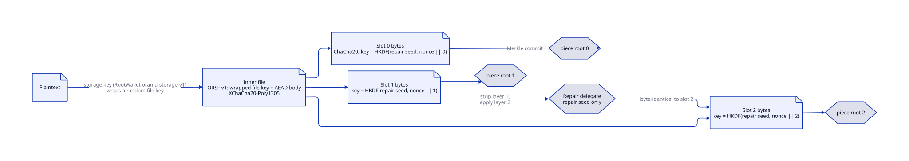
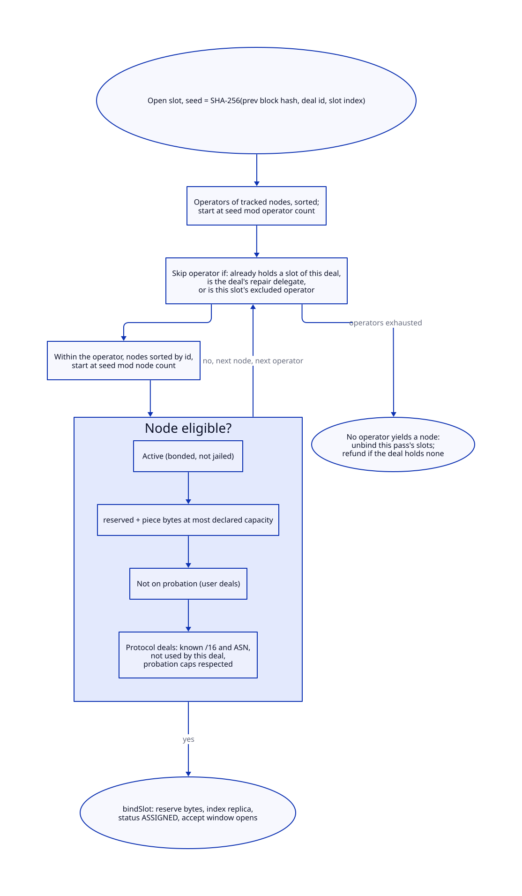
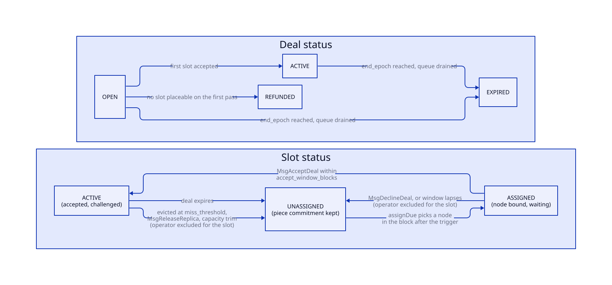
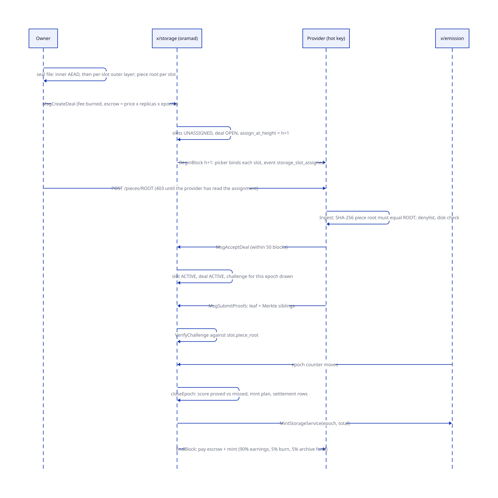
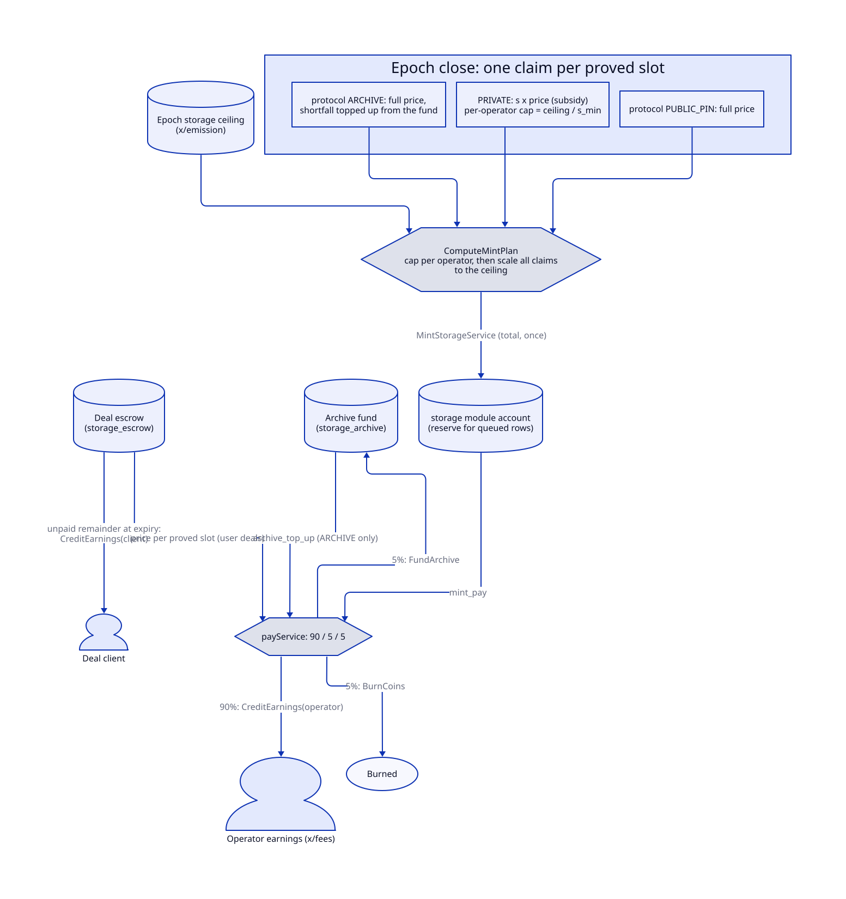

# Storage deals

> **At a glance.**
>
> - **What:** the chain's paid, proven storage. An owner opens a deal on chain, escrows the price, and the chain assigns each replica ("slot") to a distinct storage operator by a seeded pick. The operator's provider daemon stores the bytes, and every epoch the chain draws one leaf of the stored piece at random and requires a Merkle proof of it. Proved slots are paid, missed slots are counted, slashed and eventually evicted and reassigned. Private deals hold only ciphertext; public deals are pinned in a public Kubo; archive deals are opened by the protocol itself.
> - **Key numbers:** 3 to 32 replicas per deal (3 is hard-coded, not a parameter); piece leaf 1 KiB; `k_c` 8 sampled replicas per node per epoch; accept window 50 blocks; slash at 2 consecutive misses (10 percent of one epoch's price), eviction at 4; settlement 100 rows per block, 5 attempts per row; payment split 90 percent operator, 5 percent burned, 5 percent archive fund; subsidy `s` is 0 below 8 active operators and ramps linearly to 1 at 32; provider on port 31013, polls the chain every 6 s, 256 MiB largest upload, 32 proofs per transaction.
> - **Code:** `chain/x/storage/`, `chain/piece/`, `chain/provider/`, `chain/repair/`, `chain/storagekey/`, `chain/netclass/`, `core/pkg/storageclient/`, `core/pkg/storagefile/`, `core/pkg/pieceroot/`; the daemons are subcommands of `chain/cmd/orama-global/`; the owner's commands are `core/cmd/orama/internal/cmd/storagecmd/`.
> - **Depends on:** [global nodes](37-global-nodes.md) for the STORAGE role, bond, hot key and capacity that decide who can hold a slot; [economics](40-economics.md) for the epoch counter, the storage ceiling, the earnings accounts and the deposits; [chain architecture](39-chain-architecture.md) for the message path; [archive and indexer](42-archive-and-indexer.md) for the ARCHIVE deals that x/archive opens.

## Why it exists

The cluster layer already stores data: each namespace runs an IPFS Kubo and cluster ([storage](../vol1/19-storage.md)). That storage belongs to one owner's nodes and is paid for by running them. The global layer needs the opposite: capacity offered by strangers, bought by anyone with a wallet, with no operator trusted to be honest. Four constraints shape the design.

- **Payment must follow proof.** A deterministic state machine cannot call a provider or check a disk. The only thing it can verify is a hash path, so the only thing it pays for is a hash path: a Merkle proof of one leaf the chain chose.
- **Replicas must be independent.** Three copies on one operator are one copy. The picker therefore requires distinct operators for user deals and, for protocol deals, distinct `/16` networks and autonomous systems as well.
- **Providers must not read private data.** A provider holds a ciphertext it cannot open. Repair must work without the owner online and without the repair service learning the plaintext, so the file is sealed in two layers: one the owner alone can open, one derived per slot from a repair seed.
- **Money must be conserved by construction.** Escrow is held in a module account whose balance must equal the sum of open deals' remaining escrow. Subsidies are minted only by x/emission, only against the epoch's storage ceiling, and only when the epoch closes. A bad row must cost one node one payout, never a halted chain.

## The model

**Deal.** A paid commitment to store a piece for a number of epochs: a class, a replica count, a price per epoch per replica, a duration, an escrow and a status. `Deal` in `chain/proto/orama/storage/v1/storage.proto`.

**Class.** `PRIVATE`: one piece commitment per replica, because each replica is a different ciphertext. `PUBLIC_PIN`: one commitment for all replicas, and the piece is pinned in the provider's public Kubo. `ARCHIVE`: a protocol-only class that holds chain history bundles ([archive and indexer](42-archive-and-indexer.md)). Users can create only the first two.

**User deal and protocol deal.** A user deal is paid from the owner's escrow. A protocol deal (`Deal.protocol`) has no client and no escrow; it is opened by the chain itself, always has exactly 3 replicas, and is paid from the epoch's storage ceiling.

**Slot.** One replica of a deal: an index, the piece commitment it must satisfy, and the node, operator, `/16` and ASN currently bound to it. A slot is `UNASSIGNED`, `ASSIGNED` (bound, waiting for the provider to accept) or `ACTIVE` (accepted and challenged).

**Piece commitment.** The Merkle root of the piece together with the real and padded leaf counts and the byte length. Section "Piece commitment" below.

**Provider.** The storage side of a node: an `orama-global provider` process beside oramad, signing with the node's hot key. The chain knows the node, not the process.

**Hot key.** The key the node registered in x/nodes for routine messages. Accept, decline, proofs and release are valid only from it (`requireHotKey` in `chain/x/storage/keeper/state.go`).

**Epoch.** x/emission's epoch counter. At genesis defaults an epoch lasts at least 24 hours and 14,400 blocks. x/storage reads the counter; it never advances it.

**Challenge.** For one (epoch, node, deal, slot): the leaf index the node must prove. **Proof**: that leaf's 1 KiB and its sibling hashes.

**Settlement row.** One queued consequence of a closed challenge: a payout for a proof, or a miss.

**Storage ceiling.** The amount x/emission allows to be minted for storage service in an epoch (25 percent of the epoch's emission in the default split). **Subsidy rate `s`.** The fraction of a PRIVATE deal's price paid from the ceiling on top of the owner's escrow.

**Archive fund.** The 5 percent share of every service payment, held in the `storage_archive` module account. It tops up archive deals when the ceiling is short.

**Probation.** A fee-free node registration with no storage bond. It may take a few protocol-deal slots, is jailed if it proves nothing in 4 epochs, and posts a record deposit from its first earnings.

**Repair delegate.** An operator a deal names to restore evicted replicas. **Repair seed**: the secret from which each slot's outer-layer key is derived. **Storage key**: the owner's 32-byte key from RootWallet's `orama-storage-v1` branch.

**Deal authorization.** A spend-capped allowance one account gives another to create deals on its behalf. It is not an SDK authz grant.

The module accounts are three: `storage` (the reserve for queued mint payments, and the deal fee in transit), `storage_escrow` and `storage_archive` (`chain/x/storage/types/keys.go`).

### Messages and queries

| Message | Signer | Effect |
|---|---|---|
| `MsgCreateDeal` | owner (or grantee) | opens a PRIVATE or PUBLIC_PIN deal |
| `MsgExtendDeal` | the paying client | adds epochs and escrow |
| `MsgGrantDealAuthorization`, `MsgRevokeDealAuthorization` | granter | creates or removes an allowance |
| `MsgAcceptDeal`, `MsgDeclineDeal` | node hot key | answers an assignment |
| `MsgSubmitProofs` | node hot key | proves challenged leaves |
| `MsgReleaseReplica` | node hot key | gives a replica back for a legal reason |

There is no `MsgUpdateParams`. The 21 parameters (`chain/x/storage/types/params.go`) are fixed at genesis.

The queries are `Params`, `Deal`, `Slot`, `Authorization`, `Challenges`, `EpochMint`, `Queue`, `NodeFailures` and `Invariants`. The gateway's public chain route serves all but `Invariants`, which walks every deal and is withheld (`core/pkg/gateway/handlers/chainread/query.go`).

## How it works

### Piece commitment

`chain/piece/piece.go` is the one commitment scheme. Data is cut into 1,024-byte leaves; a partial tail leaf is zero-padded; the leaf count is then padded with all-zero leaves to the next power of two. Three SHA-256 preimages carry a leading tag byte: `0x01` plus the leaf for a leaf, `0x02` plus left and right child for an internal node, and `0x00` plus `ORAMA_PIECE_EMPTY_V1` for the empty piece. A proof is the leaf plus one sibling per level: at 64 GiB (2^26 leaves) that is 1,024 + 26 x 32 = 1,856 bytes (`ProofSize`).

The padding leaves are real tree nodes, but challenges are drawn modulo the real leaf count, so a padding leaf is never selected, and `VerifyChallenge` rejects a proof whose index is at or above the real count. The client has its own copy of the algorithm in `core/pkg/pieceroot/commit.go`, because the core module does not import the chain module; both are held to one set of test vectors (`TestVectors` in `chain/piece/piece_test.go`).

### Sealing a private file

`core/pkg/storagefile/file.go:Prepare` produces the bytes a PRIVATE deal uploads, one distinct ciphertext per slot.

1. **Inner layer.** A random 32-byte file key encrypts the plaintext with XChaCha20-Poly1305. The file key is itself wrapped with XChaCha20-Poly1305 under the owner's storage key. The blob is `ORSF`, a version byte 1, the wrap nonce, the wrapped key, the content nonce and the body. Only the storage key opens it.
2. **Outer layer, per slot.** ChaCha20 with an all-zero nonce, keyed by HKDF-SHA256 over the repair seed with info equal to the 32-byte deal nonce followed by the slot index as 4 big-endian bytes. Each (deal nonce, slot) pair has its own key, so the zero nonce never repeats under one key.
3. **Commitment.** The piece root of each slot's final bytes is what `MsgCreateDeal` carries.

The storage key is `HKDF-SHA256(seed, salt "orama-storage-v1", info empty, 32 bytes)` (`DeriveStorageKey`); day to day it comes out of RootWallet and the CLI reads it from a file, never from a flag. The same outer-layer construction exists in `chain/storagekey/outer.go` for the repair delegate; both are locked to shared test vectors (`TestApply_matchesTheSharedVectors`).

Because the repair seed differs from the storage key, whoever holds only the seed can turn slot 1's bytes into slot 2's bytes (`Rewrap`: apply layer 1, apply layer 2) and learns nothing about the plaintext.

### Creating a deal

`Keeper.CreateDeal` (`chain/x/storage/keeper/deals.go`) runs in the transaction:

1. `ValidateBasic`: class is PRIVATE or PUBLIC_PIN; the deal nonce is exactly 32 bytes; replicas in 3 to 32; price positive; duration in 1 to 1,000,000 epochs; a PRIVATE deal has one commitment per replica, a PUBLIC_PIN deal exactly one; every commitment's counts are consistent with its byte length.
2. The block's deal counter is bumped; more than `max_deals_per_block` (100) fails the transaction.
3. Every piece is at least `min_deal_bytes` (1,024).
4. Escrow is `price x replicas x duration`. If a granter is named, the allowance pays (below). Otherwise the signer pays, and `FundSpendFromEarnings` tops the signer's bank balance up from its own x/fees earnings by exactly the shortfall.
5. The payer's balance must cover fee plus escrow. Both move to the storage module account; the escrow moves on to `storage_escrow`; the `deal_fee` (1,000 norama) is burned.
6. The deal is stored `OPEN` with `assign_at_height` equal to the next block; one `UNASSIGNED` slot per replica is written; the deal id is added to the pending set.

`MsgExtendDeal` adds epochs and escrow for the same price and replica count; only the paying client may call it, protocol deals cannot be extended, and the total duration stays within the 1,000,000-epoch bound. The current epoch's payment is unchanged: settlement prices one epoch at a time.

### Deal authorization

`MsgGrantDealAuthorization` lets a granter give a grantee a budget: a spend limit, an optional period after which the spent amount resets, a maximum piece size, a maximum duration, a fixed replica count and an optional expiry epoch. `spendGrant` checks all of them when the grantee creates a deal with the granter named, and the payer recorded on the deal is the granter. A grantee's use never draws on the grantee's own earnings, and revoking a grant leaves existing deals in place. The primary use is a cluster that backs up to the chain without holding the owner's funds.

### Assignment

BeginBlock runs `assignDue` every block over the pending set in id order. For each deal whose `assign_at_height` has arrived it runs `assignDeal` on a cache branch (`isolate`, below).

For each unassigned slot the seed is `SHA-256(previous block hash, deal id as 8 big-endian bytes, slot index as 4 big-endian bytes)` (`AssignmentSeed`). `PickCandidate` (`chain/x/storage/types/assignment.go`) sorts the operators of all tracked nodes, starts at the seed modulo the operator count, and walks around the ring. It skips an operator that already holds a slot of this deal, the deal's repair delegate, and the operator excluded for this slot. Inside an operator it tries nodes in id order, starting at the seed modulo the node count, and takes the first eligible one.

A node is eligible when it is active (STORAGE role bonded at its minimum, not jailed, retired or tombstoned), when its reserved bytes plus this piece fit its declared capacity, and, for a user deal, when it is not on probation. For a protocol deal the node must also have a known `/16` and a non-zero ASN, and neither may repeat within the deal; a probation node may be used only under the four probation caps.

Binding a slot sets the node, copies its operator, `/16` and ASN onto the slot, resets the miss counter, adds the piece size to the node's reserved bytes and appends the slot to the node's replica index. It emits `storage_slot_assigned`. If any slot cannot be placed, every slot filled in this pass is detached again; if the deal holds no slot at all and is still `OPEN`, it is refunded: the escrow goes back to the client's earnings and the status becomes `REFUNDED`. A deal that already has some slots (a reassignment) stays pending and is tried again each block.

### Accept, decline and release

An assigned provider has `accept_window_blocks` (50) from `assign_height` to answer.

- **Accept** (`AcceptDeal`): signer must be the node's hot key and the slot must be waiting for that node. The slot becomes `ACTIVE`, an `OPEN` deal becomes `ACTIVE`, and this epoch's challenge for the slot is drawn at once.
- **Decline** (`DeclineDeal`): the slot is detached and the operator is recorded as excluded for that slot; the deal is queued for assignment in the next block. No slash.
- **Window lapse** (`expireAcceptWindows`): the same effect as a decline, applied by BeginBlock to every slot still waiting past the window. No slash.
- **Release** (`ReleaseReplica`): the only reason accepted is `LEGAL`; `max_releases_per_epoch` (2) per node per epoch; the slot is detached, the operator excluded, the deal queued. No slash.

Excluding the operator is what stops a reassignment loop: a declining or evicted operator never gets the same slot back.

### The provider daemon

`orama-global provider` (`chain/cmd/orama-global/provider.go`) is one process with two halves: an HTTP server and a runner loop.

**Files.** In its home: `hot-key` (created mode 0600 on first start), `node-id` (the x/nodes id), an optional `denylist`, `store/`, `state.json` and `monitor.json`.

**The piece store** (`chain/provider/store.go`) keeps `pieces/CID` and `meta/CID.json`. A piece is named by the hex of its piece root. `Ingest` recomputes the root from the bytes and refuses a mismatch, a denylisted name, a name that already holds a different piece, and a piece larger than the free disk; it writes a temporary file and renames, and never replaces a stored piece. `assignments/DEAL-SLOT.json` binds a stored piece to a deal slot (`Bind`); a different piece for an already-bound slot is refused.

**HTTP** (`chain/provider/retrieval.go`), on `0.0.0.0:31013`:

| Request | Behaviour |
|---|---|
| `GET` or `HEAD /pieces/ROOT` | serves the file with `Range` support; no authentication, because a piece is ciphertext or public by design |
| `POST /pieces/ROOT` with `X-Piece-Root` equal to the name | stores the body if this node is waiting for that root (`Runner.Assigned`), the body is at most `--max-piece-bytes` (256 MiB), and at most 2 uploads are in flight; otherwise 403, 413, 503 or 409 |
| `POST /pins/ROOT` with `X-Piece-CID` | public deals only: fetches the piece from the public Kubo by CID, checks it against the assigned root, stores it and records the CID; 30 s timeout, 2 concurrent, one per root |

Every request passes a token bucket per client address: 20 per second, burst 40, a table of 4,096 addresses (idle buckets dropped after 10 minutes; a full table refuses a new address), IPv6 grouped by `/64`. The server has a 2-minute read timeout. The 403 answer before the provider has read the assignment is deliberate: the owner's client retries it (`storageclient`'s `upload`).

**The runner** (`chain/provider/runner.go:Step`) runs every 6 seconds. Each step:

1. Reads the current epoch.
2. **Answers challenges first** (`answer`): lists this node's challenges for the epoch, keeps unproved ones on slots the chain still assigns to this node (`holds`), builds proofs and submits them in transactions of at most 32 (`MaxProofsPerTx`). A challenge with no local piece is counted as a miss for the monitor, not an error.
3. **Follows the chain** (`follow`): reads at most 500 blocks (`MaxBlocksPerStep`) past its cursor for `storage_slot_assigned` events naming this node and adds them to the pending set. The cursor starts at the node's registration height, since nothing is assigned before it, and is saved atomically (write, sync, rename) in `state.json`.
4. **Settles pending slots** (`settlePending`): re-reads each pending slot from the chain (so a missed event or a dropped transaction is repaired on the next step); drops it if no longer assigned to this node; when the piece is stored, pins it if public and accepts; when it is not stored and the window is within 2 blocks (`DeclineMarginBlocks`) of closing, declines with the reason "piece not stored" so the chain reassigns now.
5. If an accept happened, answers again immediately, because an accept opens a challenge in the current epoch and waiting a step could land after the epoch closes.
6. **Once per epoch, sweeps** (`sweep`): a bound slot the chain has stopped naming this node for, for one full epoch (`ReleaseGraceEpochs`), is released; the piece's bytes and public pins go only when no other slot or waiting root needs them.
7. Writes `monitor.json` (hot-key fee balance, proof misses, disk bytes, held and pending slots) for the node report.

Every step reads state again from the chain; nothing the runner remembers is authoritative except the cursor.

**The public Kubo.** For PUBLIC_PIN and ARCHIVE slots the runner pins the piece in the host's public Kubo before it accepts (`chain/provider/public.go:pinPublic`). The Kubo client (`chain/provider/kubo.go`) accepts only a loopback RPC URL, or the co-located namespace address `198.18.0.2`, and sends its bearer token nowhere else. `Add` uses CIDv1 with raw leaves so the same bytes always give the same CID. A PRIVATE slot never reaches Kubo; if an earlier public deal pinned a piece with the same root, the private slot unpublishes it (`Unpublish`), and a public slot declines with "root held for a private deal" when a private slot on this node holds the same root. At most 4 CIDs are recorded per piece (`MaxPieceCIDs`); the denylist matches a CIDv0 and the CIDv1 of the same multihash as one entry.

### Challenges and proofs

BeginBlock's `openChallenges` runs every block and is idempotent per (epoch, node, deal, slot). For each node that holds replicas or has a pending rechallenge:

- **Sample.** `SampleReplicaIndexes` picks `min(k_c, replica count)` distinct sequence numbers from the node's replica index with a hash walk (`SHA-256(seed, i)` modulo the count), where the seed is `SHA-256("ORAMA/storage/sample/v1", epoch, node id)`. The cost is `O(k_c)` hashes regardless of how many replicas the node holds.
- **Rechallenge.** Every slot the node missed last epoch and still holds is added.
- **Leaf.** For each chosen slot, the leaf is the digest of `"ORAMA/storage/leaf/v1"`, epoch, deal id, slot index and node id, reduced modulo the slot's real leaf count (`LeafChallengeSeed`, `piece.LeafIndex`). Only accepted slots of deals still inside `[start_epoch, end_epoch)` are challenged.

`SubmitProofs` checks, per proof: the slot belongs to the signing node and is accepted; a challenge exists for this epoch and is unproved; the leaf index equals the drawn index; the 1,024-byte leaf and the sibling hashes fold to the slot's `piece_root` (`piece.VerifyChallenge`). Several transactions per epoch are allowed. A transaction with any bad proof fails whole, so the runner filters out challenges on slots it no longer holds before it builds a batch.

The provider builds a proof by reading the whole stored piece and rebuilding the tree (`chain/provider/challenge.go:ReplicaProof`), which costs a full pass over the piece per challenged slot per epoch.

### Closing an epoch

When x/emission's counter moves past `LastEpoch`, BeginBlock calls `closeEpoch` for the epoch that ended (`chain/x/storage/keeper/settlement.go`).

1. Every challenge record of the epoch is scored on a cache branch (`scoreRecord`). A proof is *paid* only if the node that proved it still holds the slot; a slot released or re-bound before the epoch closed produces a row with no operator and no payment.
2. A paid row carries `escrow_pay` equal to the deal's price (user deals) and, by class, a *claim* on the ceiling: a PRIVATE deal claims `s x price` (zero when `s` is zero); a protocol PUBLIC_PIN claims the full price; a protocol ARCHIVE claims the full price and records its shortfall for the fund to cover. A user PUBLIC_PIN deal claims nothing: it is paid from escrow alone.
3. `s` is `SubsidyRate(active, s_min, s_full)`: 0 while fewer than `s_min_providers` (8) distinct operators have an active node, then `(active - s_min + 1) / (s_full - s_min + 1)`, and 1 at `s_full_providers` (32) or more. The upper bound 1 is a constant in code (`SMax`), not a parameter, so no parameter can pay more than the owner's price in subsidy.
4. `ComputeMintPlan` first scales each operator's subsidy claims down to `ceiling / s_min_providers` (the per-operator cap, so one large operator cannot take the whole ceiling), then scales *all* claims (subsidies and protocol payments) proportionally down to the ceiling, distributing rounding remainders by largest fraction.
5. `reserveMints` has x/emission mint the epoch's whole plan into the `storage` module account in one call, while the ceiling record is certain to exist. Settlement later pays each row from that reserve, so a queue that lags past x/emission's ceiling-retention window never needs a pruned record.
6. One settlement row per challenge is appended to the queue, and the challenge records are deleted.

### The settlement queue

EndBlock's `SettleQueue` applies at most `max_settlements_per_block` (100) rows, in order. A deal cannot expire while it has rows queued (`QueuePending` counts them), so a payment backlog delays expiry instead of losing money.

`settleOne` sends a row down one of three paths:

- **Payout** (`applyPayout`): the node's consecutive misses reset, its rechallenge is cleared, and `payItem` pays the escrow share, the mint share and the archive top-up through `payService`. `noteService` marks the node as having proved and funds a probation deposit.
- **Miss** (`applyMiss`): see the next section. A miss row touches only x/storage's own state and is never retried or dropped.
- **Penalty** (`penalize`): the slash that follows a second consecutive miss, carried in a row of its own so it can be retried.

`payService` (`chain/x/storage/types/subsidy.go:SplitServicePayment`) splits every payment 90, 5, 5: 90 percent credited to the operator's earnings account through x/fees, 5 percent burned, 5 percent moved to `storage_archive`; the operator receives the rounding remainder. The 5 percent share is also how x/relay funds the fund (`Keeper.FundArchive`, [relay rewards](46-relay-rewards.md)).

A payout or penalty that fails because of a collaborator's refusal (an unpayable operator, a short module account, a frozen earnings account) is rolled back, counted, and queued again behind the rows already waiting, due the next epoch (`retryOrDrop`). On the fifth failed attempt (`MaxSettlementAttempts`) the row is dropped: it pays nothing, the deal keeps the escrow the row would have moved (returned to the client at expiry), and any mint reserved for the row is burned so the storage account holds exactly the mint still queued.

### Misses, penalties and eviction

`applyMiss` raises the slot's consecutive-miss counter.

- From the **second** consecutive miss a penalty row is queued.
- At `miss_threshold` (4) the slot is **evicted**: `detachSlot` frees the node's replica entry and reserved bytes, the operator is excluded for the slot, the slot returns to `UNASSIGNED`, and the deal goes back on the pending list for the next block.
- Below the threshold the slot is added to the rechallenge set, so the node is challenged on it again next epoch.

The penalty is `slash_fraction` (0.1) of one epoch's price of the missed deal. A bonded node is slashed through x/nodes, which lowers the capacity its bond backs and clamps the declared capacity; `trimReserved` then evicts replicas, highest replica index first, until reserved bytes fit the new declaration (the index is swap-removed, so "highest" is by current list order, not assignment age). A probation node has no bond: its record deposit is burned instead, and a node with no deposit yet has nothing to lose but its slot.

### Probation

A fee-free registration with no bond (`NodeView.IsProbation`) is tracked as a probation node. It can take only protocol-deal slots: `probation_slots` (1) per node, and `probation_operator_cap`, `probation_network16_cap` and `probation_asn_cap` (2 each) across the fleet. Its record deposit of `probation_deposit` (1,000 norama) is taken progressively from its first earnings, in `min(remaining, paid)` per credit. It graduates when it bonds, or when it has proved storage and `probation_expiry_epochs` (4) have passed; a probation node that has proved nothing by then is jailed. A graduated node keeps its history and never starts a second probation.

### Repair

A deal may name a repair delegate (`repair_delegate`), an operator id. x/storage never assigns a slot of that deal to that operator, and `chain/repair/delegate.go:RepairDeal` does the work off chain. `orama-global repair` reads `home/deals/DEAL.json` files (mode 0600, otherwise refused) holding the deal id and the hex repair seed, and every 30 seconds, for each deal: finds slots that are `ASSIGNED` but not accepted while at least one other slot is `ACTIVE`, fetches a surviving replica from its provider, checks it against that slot's root, rewraps it from the survivor's index to the target's index, checks the result against the target slot's root, and uploads it to the new provider. A wrong seed produces a root mismatch and uploads nothing. A deal whose client has not uploaded yet has no accepted replica and is left alone. A deal file that other users can read, that is malformed or short, or that is named for another deal is logged as an error on every pass and its deal is not repaired; the other deals are repaired in the same pass. Each restored slot is logged (`replica restored`) with `blocks_since_assigned`, the blocks between the chain assigning the replacement slot (the eviction) and the delegate's upload: the delegate's part of the time to restore the full replica count, since the new provider's acceptance follows in a later block. The height is read after the upload; if it cannot be read the restore stands, the failure is logged as an error and the field is left out. There is no metrics endpoint and no SLO threshold is enforced.

A deal that names no delegate is repaired by its owner with `orama storage repair --deal-id N --repair-seed-file F --rpc <oramad RPC>`. For every slot the chain assigned to a new provider that has not accepted, it fetches an accepted replica from another provider (checked against that slot's root), rewraps it with the repair seed, checks the result against the new slot's root and uploads it. A repair seed that is not the deal's misses the root and uploads nothing, and a deal with no accepted replica is refused (`orama storage put` makes the first upload). Without a delegate the deal runs with fewer replicas until the owner runs this command.

Provider endpoints come from x/nodes, which any registered node writes, so the delegate dials only through a client that refuses non-public addresses after DNS resolution and follows no redirects (`chain/repair/public_http.go`, using `chain/netclass/netclass.go:IsPublic`). `netclass` is the chain's single classifier of "is this host a public address", shared by x/nodes validation, the node network identity and this fetcher, and it deliberately avoids `net.ParseIP`, which accepts some address spellings and rejects others that resolvers read differently. A cross-check test holds its special-range list to the core module's list.

### Protocol deals

`maybeProtocolDeals` opens one ARCHIVE and one PUBLIC_PIN protocol deal every `protocol_every_epochs` epochs, each over a deterministic payload of `protocol_piece_bytes`, for `protocol_duration_epochs`, at `protocol_price_per_epoch`. At the default of `protocol_every_epochs` equal to 0 the schedule is off. Their purpose is to give new and probation nodes work that the ceiling pays for, so a network with no customers still pays providers who prove they can store. x/archive opens ARCHIVE deals for real history bundles through `Keeper.CreateArchiveDeal`.

### Isolation of item failures

A block must never halt because one node cannot be paid. `isolate` (`chain/x/storage/keeper/isolate.go`) runs one item's work (one node's sync, one deal's assignment, one challenge's scoring, one settlement row, one probation expiry) on a cache branch. If the work fails with an *item rejection* (`types.ErrItemRejected`, produced by `Refuse` or by a collaborator adapter's recognised refusal: insufficient funds, unauthorized, not found, a node gone or inactive), the branch is dropped, a `storage_item_failed` event carries the reason, and the consecutive-failure counter for (subject, kind) rises. Anything else (an undecodable collection, a broken counter, an unexpected condition) is a fault of the state machine and fails the block, because every validator would otherwise continue on state it cannot trust. At every 100th consecutive failure a `storage_item_stuck` event is emitted. The counters are queryable per node (`NodeFailures`) and survive genesis export.

### The owner's side

`orama storage seal` and `open` run `storagefile.Prepare` and `Open`; `create`, `extend`, `grant`, `revoke`, `accept`, `decline` and `prove` build and sign messages (the sign document is printed unless `--node` names a REST API to submit to; the CLI does not check a root against any bytes); `put` and `get` move bytes (`core/cmd/orama/internal/cmd/storagecmd/`).

`storageclient.Client.Put` checks every slot file against the chain's piece root before any byte leaves the machine, waits (default 5 minutes, polling every 3 s) for each slot to be assigned, then uploads slot i to the provider assigned slot i, retrying the 403 until the provider has read the assignment. `Get` fetches the first slot a provider serves with the on-chain root, strips the slot layer and decrypts; a wrong key or seed stops there with `ErrNotForKey` and no other replica is tried. The client reads the chain through oramad's RPC with hand-decoded protobuf, never holds a signing key, and dials providers through a client that refuses non-public addresses (`core/pkg/storageclient/public_http.go`, built on `core/pkg/netguard`; see [rate limits and egress controls](../vol1/27-rate-limits-and-egress-controls.md)).

## State it owns

| State | Holds | Writer | Reader | Location |
|---|---|---|---|---|
| `Params` | the 21 parameters | genesis only | every keeper path | x/storage store, prefix 0 |
| `NextDealID`, `LastEpoch`, `LastProtocolEpoch`, `DealCountHeight`, `DealsInBlock` | counters | keeper | keeper | x/storage store |
| `Deals` | every deal, never deleted | `CreateDeal`, `ExtendDeal`, settlement, expiry | all | x/storage store |
| `Slots` | every slot with its commitment and holder | assignment, accept, eviction | all | x/storage store |
| `Auths` | deal allowances by (granter, grantee) | grant, revoke, `spendGrant` | create | x/storage store |
| `Nodes` | tracked nodes with probation state | `syncNodes`, settlement | pick, sync | x/storage store |
| `Pending` | deal ids waiting for assignment | create, decline, eviction | `assignDue` | x/storage store |
| `ReplicaCount`, `ReplicaAt` | per-node replica list (swap-remove) | bind, detach | sampling, trim | x/storage store |
| `Reserved` | bytes reserved per node | bind, detach | pick | x/storage store |
| `Challenges` | this epoch's leaf draws and proved flags | BeginBlock, `SubmitProofs` | proofs, `closeEpoch` | x/storage store |
| `Rechallenge` | slots a node missed | `applyMiss`, payout | sampling | x/storage store |
| `Queue`, `QueueHead`, `QueueTail`, `QueuePending` | settlement rows, drained in order | `closeEpoch`, retry | `SettleQueue`, expiry | x/storage store |
| `EpochMinted`, `OperatorMinted` | mint paid per epoch and per operator | `payItem` | invariants, `EpochMint` | x/storage store |
| `ArchiveFund` | fund counter | `FundArchive`, top-ups | `payItem` | x/storage store |
| `Releases` | releases per (epoch, node) | `ReleaseReplica` | rate limit | x/storage store |
| `ProbationNode`, `ProbationOp`, `ProbationNet`, `ProbationASN` | protocol slots held by probation nodes | bind, detach, graduation | pick | x/storage store |
| `Failures` | consecutive failures per (subject, kind) | `isolate` | `NodeFailures` | x/storage store |
| `storage`, `storage_escrow`, `storage_archive` | the three module accounts | bank | invariants | x/bank |
| provider `store/pieces`, `store/meta`, `store/assignments` | stored pieces, root records, slot bindings | the provider | the provider, retrieval | provider home |
| provider `state.json`, `monitor.json`, `hot-key`, `node-id`, `denylist` | block cursor and pending slots, node report input, signer, id, refused CIDs | the provider, the operator | the provider, the node report | provider home |
| repair `deals/ID.json`, `operator` | repair seeds, the delegate's operator | the delegate's operator | the repair process | repair home |

## Lifecycle

**Deal.** Created in a transaction; assigned in the next block; accepted within 50 blocks of assignment; proved in sampled epochs; paid after each epoch closes; expires when the current epoch reaches `end_epoch` and the settlement queue holds none of its rows (`expireDeal` detaches every slot, returns the remaining escrow to the client's earnings, status `EXPIRED`).

**Epoch.** The first block after x/emission's counter moves runs `closeEpoch`, then `maybeProtocolDeals`, then assignment, accept-window expiry, new challenges, deal expiry and probation expiry. EndBlock drains the queue.

**Boot of a provider.** It needs a funded hot key (`orama-global provider` prints the hot key address on first start), a `node-id` file, the node registered in x/nodes with the STORAGE role bonded, and, for public deals, the public Kubo. With no `state.json` it starts at the node's registration height.

**Restart.** The runner resumes from its cursor; challenges listed as unproved are answered on the first step; a pending slot whose window passed during downtime has already been reassigned, and the runner drops it.

**Rolling upgrade.** Unit order is chain, then Kubo, then provider (`Wants=` on Kubo, so a provider with Kubo down still starts and its public pins fail and retry until the window is about to close). The provider and repair daemons are stateless against the chain apart from their cursor; the consensus change is in oramad ([chain architecture](39-chain-architecture.md)).

**Node loss.** A node that stops proving is missed each epoch: a penalty from the second miss, eviction at the fourth, reassignment on the next block, and a repair delegate (if named) restores the bytes. A node whose bond is withdrawn stops being active; it stays tracked until its last replica is gone (`untrackIdleNode`), because sampling and settlement still read it.

## Failure modes

| Trigger | What the system does | What you observe |
|---|---|---|
| Provider process down for an epoch | the sampled challenges are missed; rechallenge next epoch; penalty from the second miss; eviction at the fourth | settlement rows with `proved` false; `monitor.json` `proof_misses`; `storage_slot_evicted` |
| Piece never uploaded | the runner declines before the window closes, or the window lapses; the operator is excluded for the slot | `storage_slot_declined`; the owner's `put` times out waiting |
| Upload with the wrong bytes | `Ingest` refuses on root mismatch; nothing is stored | HTTP 409 "piece root mismatch" |
| Disk full | `Ingest` refuses | HTTP 409 "disk full"; the slot is declined near the window's end |
| Kubo down on a public slot | pin fails and is retried each step; declined 2 blocks before the window closes | provider log; `storage_slot_declined` with reason "public pin failed" |
| No eligible node for a slot | on a new deal: the deal is refunded; on a reassignment: it stays pending and is retried each block | `REFUNDED`; or a deal with an unassigned slot that never fills |
| Operator earnings frozen or module account short | the payout is rolled back, retried the next epoch, dropped on the fifth failure and its mint burned | `storage_settlement_requeued`, `storage_settlement_dropped`, `storage_item_failed` |
| A collaborator returns an unrecognised error | the block fails | consensus halt; this is deliberate, see Design decisions |
| Slash leaves reserved bytes above declared capacity | `trimReserved` evicts replicas until it fits | `storage_slot_evicted` events for the node |
| Proof for a slot reassigned meanwhile | the transaction is refused; the runner filters such challenges first | a failed `MsgSubmitProofs` |
| Clock skew on a provider | none that matters to the chain: windows are in blocks and challenges in epochs; the provider's wait times are its own | |
| Provider far behind the chain | reads at most 500 blocks per step, proving first; catches up over several steps | `state.json` height lagging |
| Bad seed at the delegate | root mismatch, nothing uploaded | `ErrRootMismatch` in the repair log |
| Malicious provider endpoint (loopback, private) | the delegate and the client refuse after resolution | `ErrNotPublic` |

## Trust and security

**Providers.** A provider holds ciphertext it cannot open. It can withhold or delete the bytes and lose the payment, be slashed and be evicted. It cannot forge a proof without the bytes of the challenged leaf and its sibling hashes. It can learn which deals it holds, their sizes, and the owner's account (the deal is public chain state).

**The challenge is not secret in advance.** The leaf index is a hash of the epoch, deal, slot and node id, all public. Anyone, including the provider, can compute every future challenge for a held slot. A provider that keeps only the challenged leaves and their paths for future epochs, not the piece, would pass. This weakens the proof from "stores the whole piece" to "knows which leaves will be asked"; see Known gaps.

**Operators.** Distinctness is by operator id as registered in x/nodes. An attacker with many operator registrations is limited by the per-operator bond and the STORAGE role bond, not by this module. For protocol deals, `/16` and ASN distinctness depends on endpoints and declarations that the chain does not verify (the node view says so in `chain/x/storage/types/expected_keepers.go`).

**The owner.** Holds the storage key (opens the file) and the repair seed (rewraps). A repair delegate holds seeds only; its files must be mode 0600 and a seed that other users can read is refused. A delegate host does not also run the provider (`core/pkg/install/global_units.go:RenderGlobalRepairUnit`), so the party that can rewrap a deal is not a party that holds one of its slots; the chain enforces the same rule by excluding the delegate's operator from assignment.

**Hot key.** Accept, decline, proofs and release come only from it. It needs fee funds, not a bank balance, and is never held on a server other than the node's. The unit runs as its own user (`orama-provider`) and may read the public Kubo's bearer token through a supplementary group and nothing else in that home.

**The upload surface.** Anyone can `POST` to `/pieces/ROOT`, but only for a root the node is waiting for, and the body must hash to that root; a different claimed root is refused so no one can store unrelated bytes under a waiting slot's name. `/pins/ROOT` fetches by CID only for a public-class waiting slot.

**Public deals and the denylist.** An operator can refuse a CID (`denylist`), which declines the slot without a slash. The legal release path is the only user-visible way out of an accepted slot.

## Limits and scale

| Quantity | Value | Where |
|---|---|---|
| Replicas per deal | 3 to 32 | `MinReplicas`, `MaxReplicas` |
| Duration | 1 to 1,000,000 epochs | `MaxDurationEpochs` |
| Deals per block | 100 | `max_deals_per_block` |
| Settlement rows per block | 100 | `max_settlements_per_block` |
| Sampled replicas per node per epoch | 8, plus rechallenges | `k_c` |
| Proofs per provider transaction | 32 | `MaxProofsPerTx` |
| Largest upload | 256 MiB default | `--max-piece-bytes` |
| Largest piece the repair delegate fetches | 1 GiB | `chain/repair/http.go:MaxPieceBytes` |
| Largest piece the client reads | 1 GiB | `core/pkg/storageclient/client.go` |
| CIDs recorded per piece | 4 | `MaxPieceCIDs` |

**Payment follows the sample, not the holdings.** Only challenged slots produce a settlement row, and a node is challenged on at most `k_c` replicas per epoch plus its rechallenges plus any slot it accepted that epoch. A node that holds 100 replicas is paid for roughly 8 of them in an epoch. Escrow for epochs in which a slot was not sampled is not paid and returns to the owner at expiry. The rate an operator earns per byte therefore falls as it holds more replicas.

**Per-block scans.** Several BeginBlock paths walk a whole table every block: `expireAcceptWindows` walks every slot, `expireDeals` (called in both BeginBlock and EndBlock) walks every deal, `expireProbation` walks every tracked node, and `openChallenges` walks every node that holds replicas. `assignDue` rebuilds the candidate list from every tracked node for each open slot. The first bottleneck at 10x the deal or node count is therefore the BeginBlock walk of `Slots` and `Deals`, whose cost grows with all history (deals are never deleted), not with what changed. The sampling itself is linear in `k_c` and independent of replica count (`TestSampleIsLinearInKAtOneMillion`).

**Proof cost.** A proof costs the provider a full read and two tree builds of the piece. For a 256 MiB piece that is 262,144 leaves hashed twice per challenged slot. The proof on chain is at most about 1.9 KB for a 64 GiB piece.

**Memory.** An upload is read fully into memory before it is stored; with 2 concurrent uploads of 256 MiB the provider needs about 512 MiB of headroom for that alone.

## Design decisions

### Pay per challenged slot

**Chosen:** a row exists only for a challenged slot, and the node is paid when the proof lands.
**Rejected:** paying every held slot every epoch and slashing for failures.
**Why:** the chain can verify a proof but not a negative. Payment on proof means the state machine never has to decide that a provider "should have" been paid. The cost is the effect described under Limits.

### One leaf, 1 KiB, drawn by hash

**Chosen:** a single leaf per challenged slot, drawn from public inputs.
**Rejected:** several leaves, a beacon-derived draw.
**Why:** a proof is a small transaction (leaf plus a few dozen hashes), and a draw from public inputs needs no randomness source and gives the same answer on every validator. The comments tie the draw to the real leaf count so padding never matters. The price is the predictability noted in Trust and security.

### Two-layer sealing with a separate repair seed

**Chosen:** an inner layer under the owner's storage key and a per-slot outer layer under a repair seed.
**Rejected:** one layer under the storage key; or giving the repair service the storage key.
**Why:** repair without the owner needs a secret that can turn one replica into another without opening the file. Distinct per-slot ciphertexts also give every slot its own piece root, so the replicas of one deal are not interchangeable copies.

### Hard-coded minimum replicas and subsidy ceiling

**Chosen:** `MinReplicas` of 3 and `SMax` of 1 are constants.
**Rejected:** making them parameters.
**Why:** the code states that no parameter can raise the subsidy above the price or lower the replica count; nothing can be changed by a mistaken genesis. Parameters are fixed at genesis anyway (no `MsgUpdateParams`).

### Reserve the mint when the epoch closes

**Chosen:** mint the epoch's whole storage payment at close, pay from the reserve later.
**Rejected:** minting row by row as the queue drains.
**Why:** x/emission keeps ceiling records for a bounded window (30 epochs, `chain/x/emission/types/split.go:CeilingWindow`). A queue that lags would need a pruned record. A reserve decouples payment timing from record retention, at the cost that a dropped row must burn its share.

### Isolate item failures; fail the block on anything else

**Chosen:** `isolate` swallows only recognised item rejections and counts them; every other error fails the block.
**Rejected:** recovering from all errors, or from none.
**Why:** one unpayable operator must not halt the chain; but a collection that cannot be read means validators would continue on state they cannot trust. The distinction is encoded in `types.Refuse` and in the collaborator adapters (`chain/x/storage/keeper/boundary.go`).

### Distinct operators, then distinct networks

**Chosen:** user deals need distinct operators; protocol deals also need distinct `/16` and ASN.
**Rejected:** network distinctness for all deals.
**Why:** protocol deals have no owner to choose a risk; they should be spread as widely as the declared identity allows. User deals trade that for fewer unplaceable deals while the fleet is small.

## Known gaps

- **Challenge leaves are predictable.** The draw uses only public inputs, so every future challenge of a held slot is computable now. Consequence: a provider can store selected leaves and their paths instead of pieces and still be paid. Code: `chain/x/storage/types/assignment.go:LeafChallengeSeed`.
- **Pay depends on the sample, not on holdings.** A node with more than `k_c` replicas is paid for about `k_c` per epoch. Consequence: operator income per replica falls as holdings grow; the parameter is fixed at genesis. Code: `chain/x/storage/keeper/challenge.go:openNodeChallenges`.
- **BeginBlock scans whole tables every block.** `expireAcceptWindows`, `expireDeals`, `expireProbation` walk all slots, deals and nodes; deals are never removed. Consequence: block time grows with total history. Code: `chain/x/storage/keeper/assign.go:expireAcceptWindows`, `chain/x/storage/keeper/settlement.go:expireDeals`.
- **A reassignment with no eligible node waits forever.** A deal that already holds a slot and cannot place another returns without a refund or an error and is tried every block; the owner is not told. Code: `chain/x/storage/keeper/assign.go:assignDeal`.
- **`SlotStatus` has two values nothing sets.** `SLOT_STATUS_EVICTED` and `SLOT_STATUS_RELEASED` are defined, but eviction and release return a slot to `UNASSIGNED`. Consequence: the slot record does not say why it is empty. Code: `chain/proto/orama/storage/v1/storage.proto`.
- **The client seals fewer replicas than the chain accepts.** `storagefile.MinReplicas` is 1; the chain refuses a deal under 3. Consequence: `orama storage seal` can produce files no deal can use. Code: `core/pkg/storagefile/file.go`.
- **Network identity is declared, not verified.** `/16` and ASN come from node endpoints and the operator's declaration. Consequence: protocol-deal diversity can be faked by an operator that lies. Code: `chain/x/storage/types/expected_keepers.go:NodeView`.
- **Proofs cost a full read per challenge.** The provider rebuilds the tree twice per proof. Consequence: large pieces make the epoch's proving a disk-bound batch. Code: `chain/provider/challenge.go:ReplicaProof`.
- **Dead branches in the subsidy code.** `EpochSubsidyDemand` has two identical branches and `spendGrant` assigns an unused variable. Consequence: none today; they suggest an intended extension rule that is not implemented. Code: `chain/x/storage/types/subsidy.go:EpochSubsidyDemand`, `chain/x/storage/keeper/deals.go:spendGrant`.
- **The deal fee is a fixed 1,000 norama.** It does not scale with size or duration, and the per-deal cost of a tiny piece is the same as a large one. Code: `chain/x/storage/types/params.go:DefaultDealFee`.
- **No end-to-end test of a real accepted slot on the fleet chain.** The e2e chain run funds accounts from a bank balance no run account holds, so accepted slots, real proofs and the release limit are reported blocked. Code: `e2e/features/chain-services/feature.yaml`.

## Verify it yourself

**Unit tests.**

- `cd chain && go test ./x/storage/...` covers the state machine: `TestDistinctOperatorsAndRefund`, `TestRechallengeSlashAndEviction`, `TestProofsAndDeterministicLeaf` (`lifecycle_test.go`); `TestSubsidyCapBinds`, `TestEarlyNetworkSubsidyIsZero`, `TestServiceSplitAndFinalSettlement`, `TestSettlement_paysFromTheReserveAfterTheCeilingIsPruned` (`economics_test.go`); `TestProtocolSlotsDistinctNetworkAndASN`, `TestProbationCapsExpiryAndDeposit`, `TestReleaseIsRateLimitedAndDoesNotSlash` (`protocol_test.go`); `TestSettlement_oneUnpayableRowIsRetriedThenDroppedAndTheQueueKeepsDraining`, `TestIsolate_onlyItemFailuresAreIsolated` (`isolation_test.go`); `TestMiss_slashingAFullNodeReleasesTheReplicasItCanNoLongerHold` (`miss_penalty_test.go`).
- `cd chain && go test ./piece/ ./provider/ ./repair/ ./storagekey/ ./netclass/` covers the commitment (`TestPaddingNeverChallenged`, `TestProofSizeGrowsWithPaddedTree`), the provider (`TestDecide_aPrivateDealNeverReachesThePublicKubo`, `TestPin_oneFetchPerRootAndPinsHaveTheirOwnSlots`, `TestRetrievalLimitsPerAddressAndRefusesAFullTable`), the repair delegate (`TestRepairDeal_rebuildsTheMissingSlotFromASurvivor`, `TestRepairDeal_refusesAWrongSeedAnotherDelegateAndItsOwnSlot`) and the shared outer-layer vectors.
- `cd core && go test ./pkg/storageclient/ ./pkg/storagefile/ ./pkg/pieceroot/` covers the owner's side (`TestPutAndGet_roundTripAcrossProviders`, `TestPut_wrongFileUploadsNothing`, `TestGet_wrongSeedFailsClosed`, `TestDeriveStorageKey_matchesRootWalletVector`).
- `chain/x/storage/keeper/repair_chaos_test.go:TestRepairChaos_killedProviderIsEvictedAndTheDelegateRestoresTheReplica` runs the whole eviction and repair loop in process.

**Fleet e2e features** (the owner runs `make e2e-fleet`): `e2e/features/chain-services/` (every x/storage message's refusals, the allowance caps, hot-key-only answers, the Slot, Authorization, Challenges and EpochMint queries), `e2e/features/chain-hotkey-archive/` (the `NodeFailures` counters), `e2e/features/cli-storage-global/` (every `orama storage` command's sign document, seal and open round trips and refusals).

**Read-only queries and commands.**

- `orama chain deal DEAL-ID` shows a deal. `orama chain query orama.storage.v1.Query/Slot '{"deal_id":"1","slot":0}'` shows a slot. The same command reaches `Params`, `Challenges` (it requires a node id), `EpochMint` (minted against ceiling for an epoch), `Queue` (rows pending) and `NodeFailures` (a stuck subject shows a rising count); `orama chain query --list` lists every query the CLI knows.
- On a provider host: `cat monitor.json` in the provider home for held and pending slots and proof misses; `ls store/assignments` for the bound slots.
- `orama storage seal --help` and `orama storage create --help` list the exact flags.
