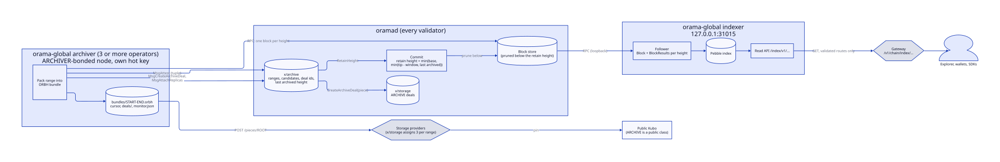
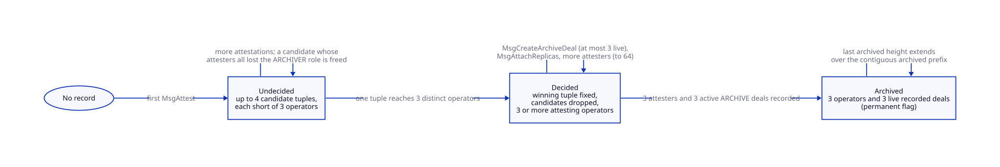
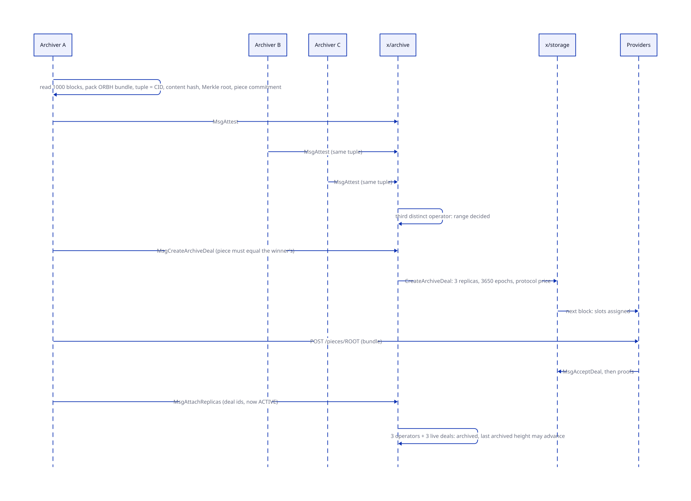
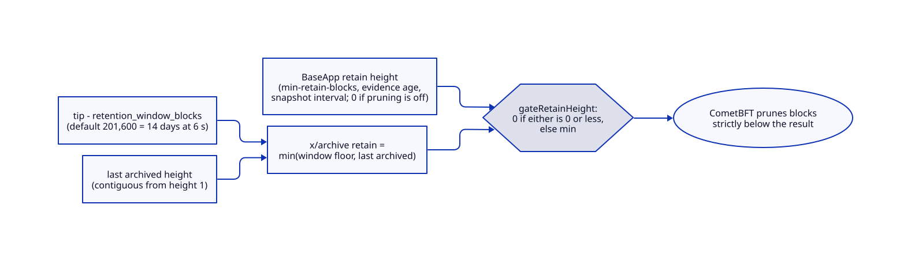
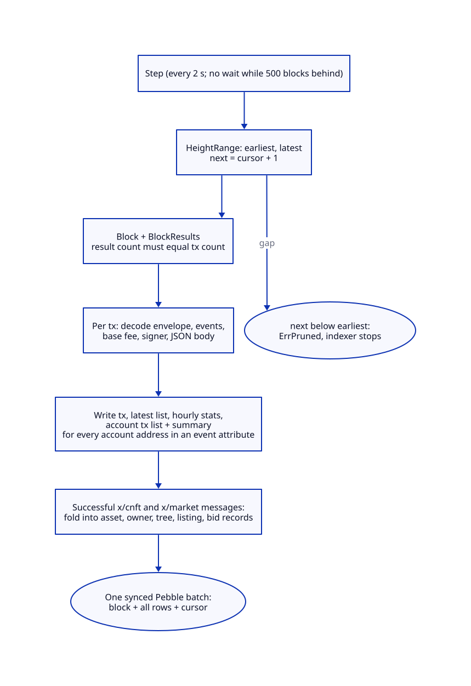

# Archive and indexer

> **At a glance.**
>
> - **What:** two services that keep the chain's history usable after validators prune it. x/archive is the on-chain registry that agrees which bundle of block hashes is the history of each fixed range of heights, requires three independent operators to attest it and three storage deals to hold it, and gates how far any validator may prune. The archiver (`orama-global archiver`) cuts the bundles, attests them, opens the paid ARCHIVE deals and uploads the bytes. The indexer (`orama-global indexer`) follows a node block by block and serves a local read index of blocks, transactions, accounts and compressed NFTs to the explorer and wallets.
> - **Key numbers:** range 1,000 blocks (`range_blocks`); quorum 3 distinct operators and 3 live deals per range; at most 4 candidate tuples per undecided range; retention window 201,600 blocks (14 days at 6 s) by default; bundle at most 4 GiB (`max_piece_bytes`); ARCHIVE deal 3 replicas for 3,650 epochs; indexer API on `127.0.0.1:31015`, default 20 and at most 100 rows a page, at most page 1,000; the indexer steps every 2 s and indexes at most 500 blocks per step.
> - **Code:** `chain/x/archive/`, `chain/archiver/`, `chain/indexer/`; the commands in `chain/cmd/orama-global/archiver.go` and `chain/cmd/orama-global/indexer.go`; the prune gate in `chain/app/retain.go`; the gateway route `core/pkg/gateway/handlers/chainread/index.go`.
> - **Depends on:** [storage deals](41-storage-deals.md) for the ARCHIVE deal class and its payment; [global nodes](37-global-nodes.md) for the ARCHIVER role and the hot key; [chain architecture](39-chain-architecture.md) for how modules and the `Commit` hook are wired; [NFTs and the market](45-nfts-and-the-market.md) for the messages the indexer folds into assets.



## Why it exists

A validator that keeps every block forever grows without bound; a validator that prunes loses history that explorers, auditors and new nodes need. The archive turns that into a rule the state machine enforces: blocks older than the retention window are deleted only when a range that covers them is archived, meaning that several operators who do not know each other agree on its hash and several paid providers hold the bytes.

Three constraints shape it.

- **History must agree before it is trusted.** The chain cannot look up its own past block hashes inside a transaction, so it cannot check an attestation against truth. It checks agreement instead: one tuple must be attested by three distinct operators, and a first attester cannot fix what the range is.
- **Nobody should be able to squat history or drain the ceiling.** Ranges are canonical (fixed boundaries, never overlapping); the deal for a range is priced and timed by the chain, opens only over the winning content, and is capped at three live deals per range.
- **Reading must not load the validator.** An explorer needs transactions by hash, by account and by time, and a wallet needs its NFTs. Serving those from the consensus node would put unbounded scans on the process that signs blocks. The indexer is a separate process with its own database and no key.

## The model

**Range.** A fixed span of `range_blocks` heights, starting at `k x range_blocks + 1`. The record is `RangeRecord` in `chain/proto/orama/archive/v1/archive.proto`.

**Bundle.** The file an archiver writes for a range: the blocks, each with its header hash. Format ORBH, section "The bundle".

**Tuple.** What one attestation states: the bundle CID, the bundle's SHA-256, the Merkle root of the range's block hashes, and the piece commitment of the bundle file (`Tuple` in `chain/x/archive/types/tuple.go`). Attestations are tallied per tuple: archivers that differ in any field do not count toward each other.

**Candidate.** One tuple of an undecided range with the archivers, operators and node ids that attested it.

**Decided.** A range where one tuple reached three distinct operators. The winner's fields become the range's and the other candidates are dropped.

**Archived.** A decided range with at least three attesting archivers and three recorded live ARCHIVE deals. The flag is permanent.

**Last archived height.** The highest H such that every block from 1 to H lies in an archived range (`ContiguousArchivedHeight`). A gap, or an unarchived range, stops it.

**Retain height.** The lowest block a validator must keep: `min(tip - retention_window_blocks, last archived height)`.

**Archiver.** A node with an active ARCHIVER role bond whose hot key signs the three messages. **Operator.** The account that owns the node; the quorum counts operators, not keys or nodes.

**ARCHIVE deal.** An x/storage protocol deal over a bundle ([storage deals](41-storage-deals.md)).

**Index.** The indexer's Pebble database. **Follower.** The loop that fills it. **Cursor.** The last indexed height.

### Messages and queries

| Message | Signer | Effect |
|---|---|---|
| `MsgAttest` | ARCHIVER node's hot key | adds the key's operator to a candidate tuple of a range; decides the range at three operators |
| `MsgCreateArchiveDeal` | ARCHIVER node's hot key | opens one ARCHIVE deal over the winning piece |
| `MsgAttachReplicas` | ARCHIVER node's hot key | records active ARCHIVE deal ids on a decided range |

Queries: `Params`, `Range`, `LastArchivedHeight`, `RetainHeight`. The module has no `MsgUpdateParams`, no begin or end block work and no authority address: its four parameters are fixed at genesis.

## How it works

### The bundle

`chain/archiver/bundle.go` defines ORBH version 1, which is not a CAR file. Big-endian throughout:

```text
"ORBH" | version u8 | start i64 | count u32 |
count x ( block hash [32] | length u32 | tendermint.types.Block protobuf )
```

`Encode` requires consecutive heights, a 32-byte hash and a body of at most 64 MiB per block. `Decode` parses a bundle and checks, per block, that the protobuf decodes, that its height is the expected one and that the block's own hash equals the hash stored beside it. `Verify` checks a bundle against a range record: the file's SHA-256 equals `bundle_hash`, the first and last heights equal the range, and the Merkle root of the block hashes (CometBFT's `merkle.HashFromByteSlices`, in height order) equals `merkle_root`. The bundle CID is a CIDv1 with the raw codec over the SHA-256 of the whole file, in lowercase base32 (`CID`). The range's piece commitment is computed over the same file with the same Merkle scheme as storage deals ([storage deals](41-storage-deals.md)).

### Attesting a range

The archiver loop (`chain/archiver/run.go:Step`) runs every minute (`--interval`). It reads the range width from the chain (`range_blocks`; the flag may repeat it but not differ), then, from its cursor, takes each whole range whose last height is below the tip:

1. Reads each block of the range over RPC, one call per height, and packs the bundle (`packRange`). The whole range is held in memory.
2. Builds the tuple (`tupleOf`) and writes the bundle to `bundles/START-END.orbh` through a temporary file and a rename.
3. Reads the range from the chain. If its own key already attested a different tuple, that is a conflict. If another tuple is on chain, it reads the blocks a second time (`reverify`) and, if the second read packs into the same tuple, keeps its own and attests it anyway, because attestations are tallied per tuple; if the range is already decided for another tuple it records the conflict instead.
4. Submits `MsgAttest`. A refusal because another key of the same operator attested a different tuple is recorded as a conflict once, and the cursor moves on.
5. Saves the cursor (8 big-endian bytes, atomic) and starts following the range for deals.

A conflict is written to `conflicts/START-END.json` with the local and chain values; the pass reports it and continues with the next range.

`Keeper.Attest` (`chain/x/archive/keeper/attest.go`) runs these checks in order:

- `ValidateAttestation`: addresses, heights, a printable-ASCII bundle CID of 1 to 128 characters, two 32-byte hashes, and a piece commitment whose leaf counts are the ones its byte length implies.
- `CheckCanonicalRange`: the range starts at a multiple of `range_blocks` plus 1 and is exactly that long.
- The piece is at most `max_piece_bytes`.
- `requireFinalized`: the range's last height is below the executing block.
- If the signing key already attested this range, the call is idempotent for the same tuple and an error for another one.
- `ArchiverOperator`: the node named has an active ARCHIVER role and the signer is its hot key; the answer is the operator.
- On a fresh or undecided range, candidates none of whose attesting nodes still holds an active ARCHIVER role are freed (`liveCandidates`), so departed operators cannot hold the candidate slots. Then `attestCandidate` adds the operator to the matching candidate. An operator that is already in a different candidate gets `ErrConflictingAttestation`. A new tuple when the range already holds `max_candidates_per_range` (4) gets `ErrCandidatesFull`.
- When a candidate reaches three distinct operators the range is decided: its fields become the range's, the candidates are cleared.
- On a decided range only the winning tuple is accepted, and further operators are added up to 64 archivers.



### ARCHIVE deals and archiving

After a range is decided, any attester may ask for its deals.

`MsgCreateArchiveDeal` requires: a finalized range, the signer is an active ARCHIVER's hot key, the range is decided (`ErrQuorumPending` otherwise), the signer's operator attested the winning tuple (`ErrNotAttester`), and the message's piece commitment equals the winner's (`ErrWrongPiece`). The chain, not the archiver, sets the price (x/storage's `protocol_price_per_epoch`) and the duration (`ArchiveDealEpochs`, 3,650 epochs, ten years at one epoch a day). It first drops recorded deals that ended, then refuses if the live recorded deals plus the pending ones already equal `MaxLiveDealsPerRange` (3, `ErrDealsFull`). Otherwise it calls `CreateArchiveDeal` in x/storage with the range's pinned piece, remembers the new deal as pending for the range and reserves its id so no other range can claim it. The deal is `OPEN` until x/storage assigns three providers in the next block, and an open deal cannot back a range.

`MsgAttachReplicas` records deal ids on a decided range, from an attesting operator. Each id must be an `ACTIVE` ARCHIVE deal (`ArchiveDealActive`: class ARCHIVE and status ACTIVE) that backs no other range. When the range holds three or more attesting archivers and three or more live deals, `storeRange` marks it archived, and extends the contiguous prefix if the new range closes a gap in it. A deal that ended in the meantime is dropped before the test, so the flag always holds over the ids the record lists.

The archiver does the same work off chain (`chain/archiver/deals.go:advanceRange`), each pass, for each attested range it follows:

1. Range archived: stop following. Range not decided: wait. Range decided for another tuple: record the conflict and stop.
2. Drop its own pending deals that x/storage no longer runs.
3. Open the deals the range lacks (`openDeals`) after checking that the bundle file on disk commits to the winning piece. A refusal as `ErrDealsFull` means another archiver was faster and is not an error.
4. Upload the bundle to the provider of every slot that is assigned and not yet accepted (`uploadDeals`): first the slot's assigned root must equal the bundle's, then `POST` to the provider's first http(s) endpoint in x/nodes, four tries 1, 2 and 4 seconds apart, remembering `deal/slot/node` so a restart does not send it again. A slot the chain moves to another node is a new key.
5. Record the deals that have become `ACTIVE` with one `MsgAttachReplicas`.

The deal state is a JSON file per range, `deals/START-END.json`, written atomically.



### Paying for history

An ARCHIVE protocol deal claims its full price from the epoch's storage ceiling for every proved slot, and the archive fund covers any shortfall left after the ceiling's pro-rata cut ([storage deals](41-storage-deals.md), "Closing an epoch"). There is no owner and no escrow. At the default protocol price of 1,000 norama per replica per epoch, one range costs 3 x 3,650 x 1,000 = 10.95 million norama over its ten years, about 0.011 ORAMA, and at 14,400 blocks a day the chain starts about 14 ranges a day.

### Pruning

CometBFT deletes blocks below the retain height `Commit` returns. `OramaApp.Commit` (`chain/app/retain.go`) lets BaseApp compute its usual retain height (from `min-retain-blocks`, the evidence age and the snapshot interval; zero when the operator has not turned pruning on) and then lowers it to x/archive's. `gateRetainHeight` returns 0, meaning prune nothing, when either value is not positive, and the lower of the two otherwise.



x/archive's own retain height is `min(tip - retention_window_blocks, last archived height)` (`types.RetainHeight`). Two properties follow from the formula and are tested: a stalled archive keeps the retain height pinned to the last archived block however far the tip runs ahead (`TestRetainHeight_stallForAYearStaysAtLastArchived`), and when the archive is caught up, blocks inside the 14-day window stay even though they are archived (`TestRetainHeight_fourteenDayWindowBindsWhenArchiveIsCaughtUp`). `PruneAllowed` states the same rule per height. The default window is 201,600 blocks, 14 days at 6 seconds; genesis accepts no window under that default (so the window cannot be set shorter than 14 days of 6-second blocks) and none over 1,209,600 blocks (14 days of 1-second blocks).

### Reading history back

`orama-global history get --height H --from SOURCE --out FILE` finds the range that holds H, loads the bundle from an archiver's home directory or from an http(s) base that serves `bundles/START-END.orbh`, runs `archiver.Verify` against the range record on chain, and writes that block's protobuf to a file; a bundle that does not verify writes nothing. Nothing in the repository serves the HTTP form: a bundle is also held by three providers as a piece, fetchable from them as `GET /pieces/ROOT`, and, because ARCHIVE is a public class, pinned in the public Kubo of each.

### The indexer

`orama-global indexer` (`chain/cmd/orama-global/indexer.go`) follows oramad over its loopback RPC from `--start-height` (default 1) and keeps a Pebble database in `home/index`.

**One block, one batch.** `Follower.Step` (`chain/indexer/follower.go`) reads the node's earliest and latest heights, indexes at most 500 blocks after the cursor, and for each block reads `Block` and `BlockResults`. The result count must equal the transaction count. Each transaction is written with its code, log, gas, events, the signer (the first signature's account, empty for a shielded or undecodable transaction), the memo and its messages as JSON. Failed transactions are indexed too. Per transaction the index also writes: a newest-first list, an hourly bucket (count, failures, base fee burned), and, for every account address that is the whole value of an event attribute, an account-to-transaction entry and a summary row (count, first and last activity). The block row and the cursor are committed with the transaction rows in one synced Pebble batch, so a crash leaves the previous block, never half of one (`chain/indexer/batch.go:commit`).



**cNFTs.** x/cnft and x/market emit no events, so the follower rebuilds asset state from the message bodies and their responses, the way the chain rebuilds a leaf from the transaction that wrote it. A table of twelve handlers (mint, transfer, burn, update metadata, decompress, compress, create tree; list, bid, cancel listing, cancel bid, settle) updates asset, owner, tree, listing and bid records. State the handler needs from before the start height is read from the node at the previous height (`queryBefore`); a node that pruned that state fails the block, so the block is not indexed. An asset is keyed by id, tree and leaf index, and one id may have several records, because the chain does not make asset ids unique across mints. The answer shape follows the DAS `getAsset` layout with only the fields x/cnft has.

**Refusals instead of gaps.** If the next block to index is below the node's earliest block, the follower stops with `ErrPruned` and the process exits; it never skips. An index remembers the start height it was created with and refuses another; it carries a layout version (2) and refuses an index written by another version. Both mean "index again into a new `--home`". A successful transaction the decoder cannot read stops the block, since a block holds only what the application accepted.

**The read API** (`chain/indexer/api.go`) is GET only under `/index/v1/`, with a closed set of routes and query parameters:

| Route | Returns |
|---|---|
| `status` | start height, cursor, node earliest and tip |
| `blocks/HEIGHT` | one block row |
| `txs` (`limit`) | the newest transactions |
| `txs/HASH` | one transaction |
| `stats` | 48 hourly buckets |
| `accounts/ADDR` | the account summary |
| `accounts/ADDR/txs` (`page`, `limit`) | that account's transactions, newest first |
| `cnft/assets/ID` | the records of one asset id (at most 100) |
| `cnft/owners/ADDR/assets` (`page`, `limit`) | the assets an address holds |

A path that is not clean, an escaped path, an unknown or repeated parameter, or a value outside `limit` 1 to 100 and `page` 1 to 1,000 is refused. The listener must be a loopback IP or, on a host that also runs a cluster node, the namespace address `198.18.0.2`; `requireLocalOnly` refuses anything else. The gateway's `/v1/chain/index/` route forwards to it after validating the same shapes again, building the upstream path itself and never forwarding the caller's path; the route is open to callers without a credential.

## State it owns

| State | Holds | Writer | Reader | Location |
|---|---|---|---|---|
| `Params` | retention window, max piece bytes, max candidates, range width | genesis only | keeper, archivers | x/archive store |
| `Ranges` | one `RangeRecord` per attested range, keyed by (start, end) | `Attest`, `AttachReplicas`, `CreateArchiveDeal` | queries, archivers, `history get` | x/archive store |
| `LastArchivedHeight` | the contiguous archived prefix | `storeRange` | `Commit`, queries | x/archive store |
| `AttachedDeals` | deal id to the start of the range it backs | attach, create, drop | attach | x/archive store |
| `PendingDeals` | (range start, deal id) for created deals not yet recorded | `CreateArchiveDeal`, attach | create | x/archive store |
| Archiver `hot-key`, `node-id` | the signing key (mode 0600), the x/nodes id | archiver, operator | archiver | archiver home |
| Archiver `cursor` | last attested height | archiver | archiver | archiver home |
| Archiver `bundles/START-END.orbh` | the bundle files | archiver | archiver, `history get` | archiver home |
| Archiver `deals/START-END.json` | own pending deal ids and uploaded slots | archiver | archiver | archiver home |
| Archiver `conflicts/START-END.json` | local and chain tuples of a conflicted range | archiver | operator | archiver home |
| Archiver `monitor.json` | attested height, last archived, tip, retain lag, unarchived ranges, deals opened, pieces uploaded, upload failures | archiver | the operator (nothing in core reads it) | archiver home |
| Indexer `index/` | Pebble database: blocks, transactions, account lists, assets, trees, listings, bids, hourly stats | follower | read API | indexer home |
| ARCHIVE deal pieces | the bundle as a stored piece, pinned in the public Kubo | providers | owners of `history get`, repair | provider homes |

The indexer keeps no keys. Its unit has no access to the chain home (`core/pkg/install/global_units.go:RenderGlobalIndexerUnit`); the archiver's unit reads blocks over loopback RPC and also has no access to the chain home.

## Lifecycle

**Boot of an archiver.** It needs a funded `hot-key` (created on first start), a `node-id` file naming an x/nodes node whose hot key it is and which holds an active ARCHIVER bond, and the chain reachable over RPC. It reads `range_blocks` from the chain and refuses to start on a mismatch with its flag. With no cursor it starts at height 0 and attests from range 1.

**Steady state.** One pass a minute: attest what is finalised, advance deals, write `monitor.json`. `RetainLagBlocks`, the tip minus the last archived height, is the number to watch: while it grows, every validator's block store grows with it.

**Boot of the indexer.** It binds the index to the start height, opens the listener (loopback only) and follows. A fresh index at a node that already pruned below the start height does not start.

**Restart.** The archiver resumes from its cursor and its deal files; uploads already made are not repeated. The indexer resumes from its cursor, which is committed with each block.

**Rolling upgrade.** The two daemons talk to oramad through public RPC and queries, and the consensus module is part of oramad ([chain architecture](39-chain-architecture.md)). An index with a layout version other than 2 is refused rather than served with fields it never recorded.

**Node loss.** An archiver that loses its ARCHIVER role stops being able to sign any of the three messages, and its candidates are freed when the next attestation of an undecided range arrives. A range already decided keeps its attesters. A deal whose providers are evicted is replaced by the next `MsgCreateArchiveDeal` once the dead one has ended (`dropEndedDeals`).

## Failure modes

| Trigger | What the system does | What you observe |
|---|---|---|
| Fewer than three ARCHIVER operators | no range reaches a decision; last archived height stays; with pruning on, retain height stays at it | `RetainLagBlocks` grows; `Range` shows `decided` false |
| Two groups of operators attest different tuples | each tuple is tallied alone; the first to reach three operators wins; the other is dropped | `conflicts/START-END.json` on the losing archivers |
| An operator attests two tuples of one range | the second is refused (`ErrConflictingAttestation`) | the archiver records a conflict once and moves on |
| Four tuples are already candidates | a fifth tuple is refused (`ErrCandidatesFull`) until one is freed | the attest fails; a candidate frees when its last active attester leaves |
| Attestation before the range is final | refused (`ErrNotFinalized`) | the next pass retries |
| The archiver is restarted mid-range | resumes from its cursor; attestation is idempotent for the same tuple | none |
| Provider never accepts an ARCHIVE slot | the slot is evicted by x/storage; the deal can fail; the archiver sees the ended deal and opens a replacement | `upload_failures`, `unarchived_ranges` in `monitor.json` |
| Bundle bigger than a provider's upload limit | the provider answers 413; the slot cannot be filled by that provider | `upload_failures` rises; deal never goes ACTIVE |
| Block store lacks a height the archiver needs | `Block` fails; the pass stops at that range | archiver error log; retry next pass |
| Node prunes under the indexer | the follower stops with `ErrPruned` and the process exits | indexer unit failed; log names the block and the node's earliest |
| Indexer crash mid-block | the batch is not committed; the index is at the previous block | none after restart |
| `BlockResults` count differs from the block's transaction count | the block is refused, the cursor does not move | repeated log "has N transactions but M results" |
| Disk full under the index | the synced commit fails, the pass retries from the cursor | log "failed to commit block" |
| Clock skew | not used: windows are in blocks, quorum is by operators | none |

## Trust and security

**What the chain verifies and what it does not.** x/archive verifies shapes (hash lengths, leaf counts, the canonical range), that the range ended, that each attester is an active ARCHIVER node's hot key, and that three distinct operators agree. It does not verify that the Merkle root is the root of the real block hashes: a transaction cannot read past block hashes. The agreement of three operators who read the blocks from their own nodes is the only evidence. Three colluding operators could therefore win a range with a false tuple, and nobody could attest a different one afterwards (a decided range accepts only the winner). That would also let them gate pruning on a false archive.

**What a verifier can check alone.** `archiver.Verify` and `Decode` check the file hash against the record, that each block's bytes hash to the stored block hash, the heights and the Merkle root. They do not check that block h+1 commits to block h (the header's last-block-id) and they do not check commit signatures, so a reader who needs the chain of headers verifies that itself from the decoded blocks.

**Deals cannot be abused to spend the ceiling.** The commitment a deal opens with is the winner's, not the message's; the price and the duration are the chain's; a range holds at most three live deals; a deal backs one range only. An archiver can open at most three deals per range in total, however many keys it has.

**Operator identity.** The quorum counts operators. A second node, or a rotated key, of the same operator for the same tuple is accepted and changes nothing.

**Hot key.** The archiver's key signs three message types and needs fee funds; it is created beside the archiver and never on a validator's key store. The unit has no access to the chain home.

**The indexer API.** Read only, bound to loopback or the namespace address, with closed routes and bounded parameters. It reveals only what the chain already publishes. Through the gateway it is reachable without a credential; the gateway validates addresses and hashes by pattern and hands the indexer only paths it built.

**The bundle fetch.** `history get --from` with an http(s) base uses a plain HTTP client with a 5-minute timeout and a 1 GiB limit; the result is verified against the chain record before anything is written, so a hostile server can waste time but not change the output. The archiver's own uploads go through a client that dials only public addresses and follows no redirects (`repair.PublicHTTPClient`).

## Limits and scale

| Quantity | Value | Where |
|---|---|---|
| Range width | 1,000 blocks by default, at most 10,000 | `DefaultRangeBlocks`, `MaxRangeBlocksLimit` |
| Quorum | 3 operators, 3 deals (constants) | `MinArchiverAttestations`, `MinReplicaDeals` |
| Live deals per range | 3 | `MaxLiveDealsPerRange` |
| Archivers recorded per range | 64 | `MaxArchiversPerRange` |
| Candidates per undecided range | 4 default, at most 16 | `max_candidates_per_range` |
| Bundle size | 4 GiB default, at most 1 TiB | `max_piece_bytes`, `MaxPieceBytesLimit` |
| One block in a bundle | 64 MiB | `MaxBlockBytes` |
| Retention window | 201,600 blocks default; between that and 1,209,600 | `RetentionWindowBlocks` |
| Indexer page | 20 default, 100 max; page 1,000 max | `DefaultLimit`, `MaxLimit`, `MaxPage` |
| Indexer blocks per step | 500 | `MaxBlocksPerStep` |
| Hourly stats window | 48 hours | `HourlyWindow` |
| Asset records per id | 100 | `maxAssetRecords` |

**Growth.** The range table grows by about 14 records a day at 6-second blocks and is never pruned. `LastArchivedHeight` is recomputed by walking every range each time a range becomes archived, so the cost of that step grows with the age of the chain. Genesis export carries every range.

**Memory.** An archiver holds a whole range in memory to pack it and reads the bundle file whole to commit to it; a provider reads an upload whole. The default 4 GiB cap in x/archive is far above what a default provider accepts (256 MiB per upload, [storage deals](41-storage-deals.md)); a range whose bundle exceeds the provider's limit cannot be stored by providers at their default.

**The indexer at 10x.** Each block is one synced Pebble commit, so the follower is bounded by the fsync rate, and the account index is one entry per (address, transaction), so a busy address grows its prefix without bound. Pages are served by skipping rows: page 1,000 at 100 per page iterates 100,000 rows before returning (`chain/indexer/reads.go:scan`). The first bottleneck is the single follower's fsync per block when catching up from height 1; the first read bottleneck is deep pages of a very busy account.

## Design decisions

### Tally per tuple, not per range

**Chosen:** attestations count toward a tuple; up to four tuples coexist; the first to three operators wins.
**Rejected:** the first attestation fixes the range and later ones must match.
**Why:** a first attester that is wrong (or malicious) must not be able to freeze a range. The test `TestAttest_aWrongFirstAttestationDoesNotPinTheRange` states it. The price is the candidate bound and the freeing of departed attesters.

### Canonical ranges

**Chosen:** fixed boundaries, never overlapping.
**Rejected:** archivers choose their own spans.
**Why:** the code comment states the aim: one operator cannot hold an arbitrary span or a slice of another range, and the contiguous prefix is simple to compute.

### The chain sets price, duration and content of the deal

**Chosen:** `MsgCreateArchiveDeal` carries only a commitment that must equal the winner's; price and duration are the chain's.
**Rejected:** archivers choose terms.
**Why:** the deal spends the storage ceiling. An archiver that chose terms or content could drain it or fill the range's slots with content nobody attested.

### Gate the prune in `Commit`, not in each validator's config

**Chosen:** the application lowers CometBFT's retain height.
**Rejected:** relying on operators to set `min-retain-blocks` safely.
**Why:** a validator that prunes a block no range covers destroys history no one else has. The gate makes that impossible whatever the operator sets, and prunes nothing while pruning is off.

### A separate indexer process with its own database

**Chosen:** an out-of-process follower with a Pebble index, read-only, loopback.
**Rejected:** CometBFT's built-in indexer, or queries to the consensus node.
**Why:** the explorer needs address and account indexes and cNFT state that CometBFT does not keep, and the consensus process should not run unbounded scans. The code comment on the follower states that x/cnft and x/market emit no events, so state comes from message bodies.

### Stop on a gap, never skip

**Chosen:** `ErrPruned` ends the indexer.
**Rejected:** skipping to the earliest block.
**Why:** the index would silently miss every transaction in the gap.

## Known gaps

- **Attestation is agreement, not verification.** The chain cannot compare a Merkle root with past block hashes. Consequence: three colluding ARCHIVER operators can pin a false history, after which no other tuple can win, and prune gating then trusts it. Code: `chain/x/archive/keeper/attest.go:attestCandidate`.
- **A bundle's headers are not chained.** `Decode` checks each block against its own stored hash, not against its neighbour's last-block-id or the commit signatures. Consequence: a verifier needing proof of the header chain must do it itself. Code: `chain/archiver/bundle.go:checkBlock`.
- **`AttachReplicas` does not compare the deal's content with the range.** It requires an active ARCHIVE deal that backs no other range, and the stale comment in the code says so. Consequence: with scheduled protocol deals switched on (`protocol_every_epochs` above 0), an attesting operator could record an unrelated ARCHIVE deal as a replica. Code: `chain/x/archive/keeper/attest.go:requireArchiveDeals`.
- **One range that never decides blocks pruning for every later range.** The archived prefix is contiguous from height 1. Consequence: a single contested or unattended range stalls pruning chain-wide until it is decided. Code: `chain/x/archive/types/genesis.go:ContiguousArchivedHeight`.
- **`archived` is permanent.** The flag is never cleared when all of a range's deals end. Consequence: after ten years a range reads as archived with no live deal unless someone calls `MsgCreateArchiveDeal` again; the prefix and the prune gate do not notice. Code: `chain/x/archive/keeper/attest.go:storeRange`.
- **`bundle_cid` is not an IPFS retrieval handle for large bundles.** It is the raw-codec CID of the whole file. Consequence: a bundle that Kubo splits into chunks is served under a different CID. Code: `chain/archiver/bundle.go:CID`, `chain/provider/kubo.go:Add`.
- **Nothing serves `bundles/START-END.orbh` over HTTP.** `history get --from` accepts such a base but no component provides it. Consequence: reading archived history from the network means fetching the piece from a provider by root. Code: `chain/cmd/orama-global/archiver.go:loadBundle`.
- **The default provider upload limit is smaller than the archive's piece cap.** 256 MiB against 4 GiB. Consequence: once a 1,000-block range exceeds 256 MiB, default providers decline or refuse it. Code: `chain/cmd/orama-global/provider.go`, `chain/x/archive/types/constants.go:DefaultMaxPieceBytes`.
- **`Keeper.VerifyBundle` has no caller outside tests.** The archiver calls the package function instead. Consequence: the keeper entry point is unused. Code: `chain/x/archive/keeper/keeper.go:VerifyBundle`.
- **The index is single-writer and serial.** One synced commit per block, one account entry per address per transaction, row-skipping pages. Consequence: see Limits. Code: `chain/indexer/batch.go`, `chain/indexer/reads.go:scan`.
- **Nothing reads the archiver's `monitor.json`.** The provider's monitor file feeds the node report; the archiver's does not. Consequence: the retain lag, the number to alert on, has no alert in the tree. Code: `chain/archiver/monitor.go:Monitor`, `core/pkg/telemetry/report/global.go`.
- **No retention or compaction of the index.** It grows with the chain. Code: `chain/indexer/store.go`.
- **The index omits some activity.** Account lists include only addresses that are the whole value of an event attribute. Consequence: an account named only inside a message body, not in an event, has no entry. Code: `chain/indexer/decode.go:eventAddresses`.

## Verify it yourself

**Unit tests.**

- `cd chain && go test ./x/archive/...` covers the registry: `TestAttest_archivedOnlyAfterThreeArchiversAndThreeDeals`, `TestAttest_aWrongFirstAttestationDoesNotPinTheRange`, `TestAttest_anOperatorCannotAttestTwoTuplesOfARange`, `TestAttest_theCandidateSetIsBounded`, `TestAttest_aCandidateOfDepartedArchiversIsFreed`, `TestAttest_onlyCanonicalRangesAreAccepted`, `TestCreateArchiveDeal_mustMatchThePinnedPiece`, `TestCreateArchiveDeal_aRangeHoldsAtMostItsQuorumOfLiveDeals`, `TestLastArchivedHeight_gapDoesNotJump`, `TestRetainHeight_stallForAYearStaysAtLastArchived`, `TestVerifyBundle_mutatedHeaderFails`.
- `cd chain && go test ./archiver/` covers the archiver: `TestRunner_attestsFinalisedRangesAndResumesAfterRestart`, `TestRunner_opensThreeArchiveDealsThenRecordsThemOnceTheyHaveProviders`, `TestRunner_aContestedRangeIsAttestedWithTheArchiversOwnTuple`, `TestRunner_doesNotAttestAContestedRangeWhenItsBlocksChangeBetweenReads`, `TestRunner_uploadIsIdempotentAcrossPassesAndARestart`, `TestVerify_refusesTamperedTruncatedAndMismatchedBundles`.
- `cd chain && go test ./indexer/` covers the index: `TestFollower_resumesAfterRestart`, `TestFollower_refusesAPrunedStart`, `TestFollower_refusesInconsistentBlocksAndKeepsTheCursor`, `TestFollower_cnftLifecycle`, `TestFollower_marketSettleMovesTheLeafToTheBidder`, `TestAPI_refusesBadParameters`, `TestStore_refusesAnIndexOfAnotherLayout`.
- `cd chain && go test ./app/ -run 'TestCommit'` covers the prune gate in `chain/app/retain_test.go`.

**Fleet e2e features** (the owner runs `make e2e-fleet`): `e2e/features/chain-services/` (the attestation, attach and create-deal shapes and refusals, retain height), `e2e/features/chain-hotkey-archive/` (`MsgCreateArchiveDeal` refusals), and `e2e/features/chain-explorer/` (the indexer and its gateway route).

**Read-only commands.**

- `orama chain query orama.archive.v1.Query/RetainHeight '{}'` returns the retain height, the tip, the last archived height and the window. `orama chain query orama.archive.v1.Query/Range '{"start_height":"1","end_height":"1000"}'` shows a range with its candidates or winner, deal ids and flags.
- On an archiver host: `cat monitor.json` in the archiver home (the retain lag is the field to alert on), `ls bundles conflicts deals`.
- `orama-global history get --height H --from ARCHIVER-HOME --out FILE` verifies a bundle against the chain record and writes one block.
- On a host with the indexer: `curl -s http://127.0.0.1:31015/index/v1/status` returns the start height, cursor, and the node's earliest and tip; through a gateway the same is `GET /v1/chain/index/status`.
