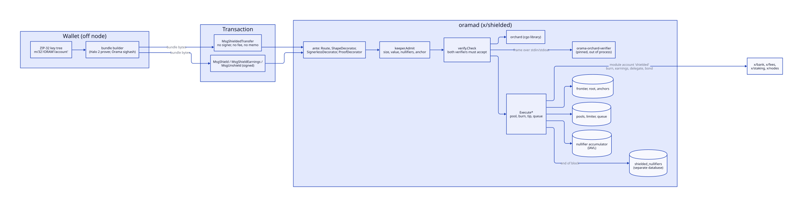
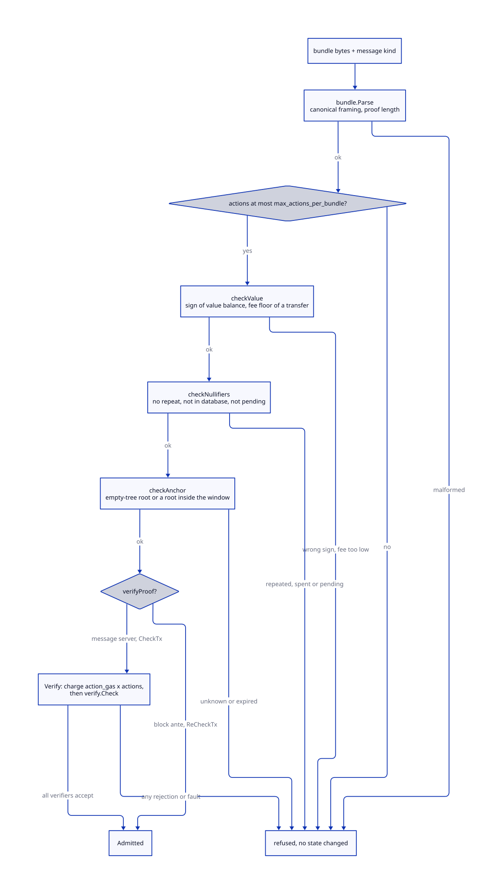
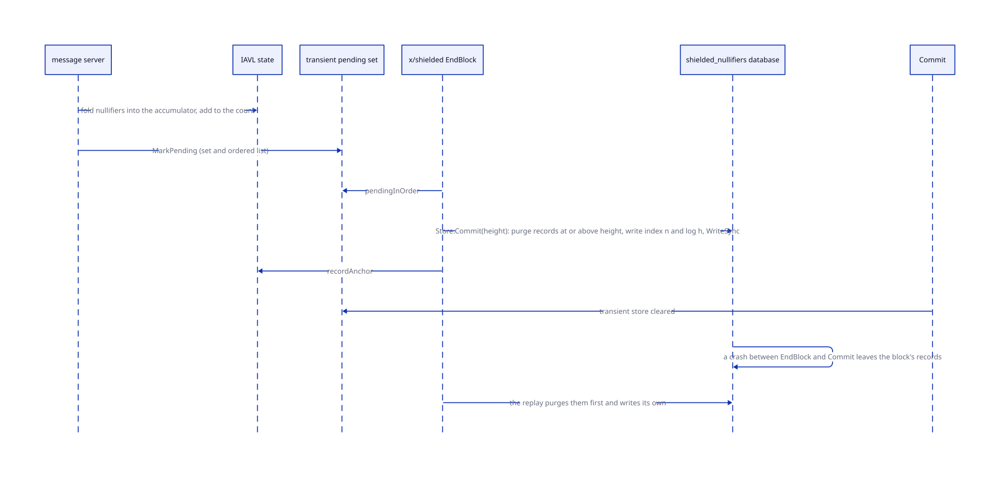
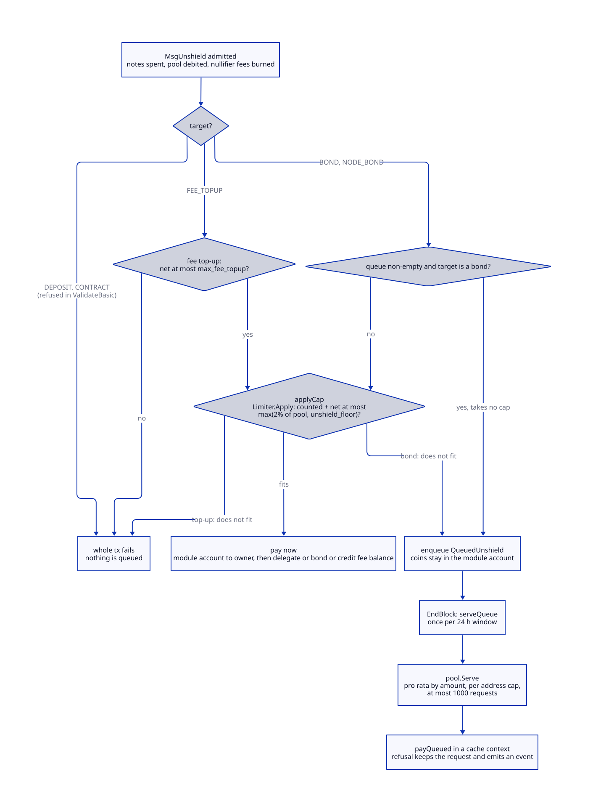

# The shielded pool

> **At a glance.**
>
> - **What:** `x/shielded` is the chain's private payment layer: a single pool of norama held in the module account `shielded`, spent and created as Orchard-style notes (Zcash Ironwood bundles, Halo 2 proofs, no trusted setup). The chain never sees an amount, a sender or a recipient inside the pool. It sees only nullifiers, note commitments, a value balance and a proof, and it checks them. Public user-to-user norama sends are allowed, so this pool is how one person pays another privately. Value enters with `MsgShield` or `MsgShieldEarnings`, moves with the signer-less `MsgShieldedTransfer`, and leaves with `MsgUnshield` to a target the signer owns, through a 24 hour cap. A node accepts a bundle only if two independent verifiers both accept it.
> - **Key numbers:** bundle at most 1 MiB and 16 actions; 250,000 gas per action; nullifier fee 1,000,000 norama (0.001 ORAMA) burned per nullifier; anchor window 14,400 blocks (24 h at 6 s); unshield cap per pool per 24 h is the larger of 2% of the pool and 1,000,000,000 norama (1 ORAMA); fee top-up at most 10,000,000 norama (0.01 ORAMA) per transaction; queue payment per address per window 100,000,000,000 norama (100 ORAMA); 64 signer-less transfers per block; 1000 queue payments per window; 256 proof verifications per node between blocks in the mempool; 4096 remembered failed bundles; sighash domains `orama-shielded-ironwood-sighash-v1` and `-bound-v1`.
> - **Code:** `chain/x/shielded/` (`keeper`, `ante`, `bundle`, `pool`, `policy`, `nullifier`, `snapshot`, `verify`, `orchardffi`, `orchardverifier-bin`, `wallet`), wiring in `chain/app/shielded.go` and `chain/app/shielded_verifiers.go`.
> - **Depends on:** [global nodes](37-global-nodes.md) for the machines that run `oramad`, [chain architecture](39-chain-architecture.md) for the module set and the ante chain, [economics](40-economics.md) for base fee, earnings and the burn, [governance and contracts](44-governance-and-contracts.md) for the contract rules the pool shares.



## Why it exists

Orama has a public chain, and a public chain leaks who pays whom. The network's own money, norama, would turn every purchase of storage, every bond and every tip into a public graph. Two rules follow, and both are in the code.

First, norama may move between users in the open, and a user who wants privacy uses the pool. A bank send of norama between plain accounts is a public payment; the chain keeps no send restriction on norama, only the blocked module accounts (`BlockedAddresses`), so the pool's account `shielded` cannot be paid except through its own messages.

Second, the private way to pay a person is the pool, and using it is optional. A payment inside the pool reveals nothing but its fee. The design takes its constraints from what a chain can and cannot do cheaply:

- **Nodes verify and never prove.** Halo 2 proofs take seconds to build and milliseconds to check. The prover lives in a wallet crate that is never linked into `oramad` (`chain/x/shielded/wallet/`).
- **The set of spent notes grows forever.** One 32-byte nullifier per spend can never be pruned, because a nullifier proves nothing about age. The set has to live somewhere that scales better than the IAVL tree that the app hash walks.
- **A soundness bug in the circuit would be a counterfeiting bug.** The pool therefore carries a turnstile (the pool can never pay out more than went in), a rate cap on outflow (a counterfeiter can drain at most 2% of the pool a day), and two verifiers.
- **There is no one to call.** The module has no authority address, no pause, no parameter-change message and no way to switch the pool off (`chain/x/shielded/keeper/keeper.go`, package comment). Parameters are genesis values.

## The model

**Note.** A unit of shielded value, owned by a key. Only its commitment (32 bytes) and its encrypted ciphertext are public.

**Action.** One spend and one output paired inside a bundle. A bundle of n actions reveals n nullifiers and n new commitments. A bundle that spends fewer real notes than actions pads with fake spends, which is why the empty-tree root is a valid anchor.

**Bundle.** The Orchard bundle of a Zcash v6 transaction (Ironwood): `CompactSize(n)`, then n actions of 672 bytes each (`cv`, `nf`, `rk`, `cmx`, `epk` at 32 bytes, 580 bytes of encrypted note, 80 bytes of out ciphertext), then flags (1), value balance (8, little-endian signed), anchor (32), the proof (2720 + 2272 per action bytes), n spend-authorization signatures and one binding signature at 64 bytes (`chain/x/shielded/bundle/bundle.go:Parse`). The chain reads four things from it: nullifiers, commitments, value balance and anchor.

**Value balance.** The bundle's net flow between the pool and the transparent side, in norama. Negative shields (value enters the pool), positive takes value out. For a transfer it is the fee.

**Nullifier.** A 32-byte tag that a spend reveals. A second appearance of the same nullifier is a double spend.

**Anchor.** The root of the note-commitment tree that the spender proves membership against. The tree is the depth-32 Sinsemilla tree of Orchard.

**Pool.** The balance of one vintage of one asset. Vintage 1 is the only circuit (orchard 0.15.5, post-NU6.3), the asset is norama (`pool.NativeAsset`), and no message can name another. The pool balance is the turnstile: it is debited on every outflow and a debit over the balance fails the transaction.

**Signer-less transfer.** `MsgShieldedTransfer`. It names the fixed protocol address `authtypes.NewModuleAddress("shielded")` as its signer, because Cosmos requires every message to name one (`chain/x/shielded/types/keys.go:SignerlessAddress`). The tx carries no signature, no fee, no memo and no fee payer.

**Two verifiers.** The cgo library `orchard` and the out-of-process binary `orchard-process` (`orama-orchard-verifier`). `verify.Check` needs `verify.MinVerifiers` (2) with distinct IDs, and all must accept.

**Window and queue.** The unshield cap is counted in a rolling 24 hour window per pool. An unshield to a bond that does not fit, or that arrives behind a non-empty queue, waits in the queue; the end blocker pays the queue once per window.

## How it works

### The four messages

| Message | Signed by | Value balance | What moves |
|---|---|---|---|
| `MsgShieldedTransfer` | nobody | positive: the fee | the fee leaves the pool; the base part and nullifier fees burn, the rest is a tip to the proposer's earnings |
| `MsgShield` | the signer | negative: minus the amount | the signer's bank balance pays amount plus nullifier fees; the pool gains the amount |
| `MsgShieldEarnings` | the signer | negative | the signer's own earnings in `x/fees` pay amount plus nullifier fees |
| `MsgUnshield` | the signer | positive: the amount | the pool is debited the amount; the target gets amount minus nullifier fees |

Every shielded message must be alone in its transaction (`chain/x/shielded/ante/ante.go:ShapeDecorator`). `ValidateBasic` of each message bounds the bundle field (1 byte to 1 MiB) and checks the signer; a transfer's signer must equal the protocol address (`chain/x/shielded/types/msgs.go`). Nothing here creates notes from nothing: every credit to the pool is paid by a transparent source in the same transaction, and every note creation inside a bundle is balanced by the proof against the bundle's value balance.

### Admission



`Keeper.Admit` runs the checks cheapest first and changes no state (`chain/x/shielded/keeper/admit.go:Admit`):

1. **Parse.** `bundle.Parse` refuses any framing the verifiers would refuse: action count zero or above `MaxBytes / ActionLen`, a proof length that is not `2720 + 2272 x actions`, a short body or trailing bytes. The Rust verifiers apply the same rule, so the two sides agree on what the bundle contains.
2. **Action limit.** More than `max_actions_per_bundle` (16) is refused before any proof work.
3. **Value rules** (`checkValue`). A transfer's value balance must be non-negative and at least `base_fee x action_gas x actions + nullifier_fee x actions`; a shield's must be negative; an unshield's positive and greater than the nullifier fees.
4. **Nullifiers** (`checkNullifiers`). No repeat inside the bundle, none in the nullifier database below the reader's height, none in the pending set.
5. **Anchor** (`checkAnchor`). The empty tree's root, or a root recorded within `anchor_window_blocks` of the current height.
6. **Proofs**, only when asked (`verifyProof`).

Where the checks run depends on the path:

- **Signed messages** (`MsgShield`, `MsgShieldEarnings`, `MsgUnshield`) go through the normal ante chain. `ShapeDecorator` runs early, before any fee is taken. `ProofDecorator` runs after signature verification, so unsigned garbage never costs proof work. In `CheckTx` it runs the full `Admit` with proofs and marks the nullifiers pending; in `ReCheckTx` it repeats the cheap checks and marks pending again without re-verifying; in a block and in simulation it does nothing. In a block the message server verifies, once (`chain/x/shielded/ante/ante.go:ProofDecorator`).
- **Signer-less transfers** are routed to their own short chain (`ante.Route`): extension options, timeout height and `SignerlessDecorator`. The decorator refuses any signature, any fee, any fee granter, any memo, more than `MaxSignerlessOverhead` (512) bytes of transaction around the bundle, and any gas limit other than exactly `action_gas x actions`. The fee is the bundle's value balance, so nothing else may pay or identify anyone.
- **The message server is the authority.** Every message re-runs `Admit` with proofs in `DeliverTx`, whatever the ante handler did (`chain/x/shielded/keeper/msg_server.go`).

The `binding` argument to `Admit` is nil except for an unshield, where it is the message's signer and target (below).

### The two verifiers

`verify.Check` fails closed. It needs at least two verifiers, none nil, with distinct non-empty IDs, and it runs none of them unless the whole set is valid; then every verifier must accept (`chain/x/shielded/verify/verify.go:Check`). Rejection reasons all wrap `ErrTampered` (malformed, non-canonical proof length, proof rejected, signature rejected); an internal fault wraps `ErrVerifierFault`. The distinction matters in the mempool: a verdict on the bundle is remembered, a fault is not.

**The library.** `orama_orchard_verify`, a C ABI over upstream `orchard` 0.15.5 with feature `circuit`, linked through cgo under the build tag `orchardffi` (`chain/x/shielded/orchardffi/src/lib.rs`, `chain/x/shielded/verify/orchard/orchard_cgo.go`). It builds only the `PostNu6_3` verifying key; the insecure pre-NU6.2 circuit is never built. It checks the framing, every spend-authorization signature and the binding signature over the sighash it is handed, and the Halo 2 proof. A panic is caught at the boundary and returned as a code, never unwound across cgo. The verifying key takes seconds to build, so `Warm` builds it at app construction, not in a consensus handler.

**The binary.** `orama-orchard-verifier`, its own crate with its own `Cargo.lock` and no shared source with the library (`chain/x/shielded/orchardverifier-bin/`). The node runs it as a child process and speaks length-prefixed frames over stdin and stdout: request `u64 id || sighash(32) || bundle`, response `u64 id || code(1)`, a ready frame with id `2^64 - 1` once the key is built (`chain/x/shielded/verify/orchardproc/orchardproc.go`). Requests are serialised. A request that exceeds 30 s (`DefaultRequestTimeout`), a process that dies or one that answers out of protocol kills the process and fails that request with `ErrVerifierFault`; the next request starts a fresh process. Start-up is bounded at 60 s. A fault is never turned into an accept and a request is never retried.

**The pin.** The node refuses to start a binary whose SHA-256 differs from its pin, and refuses to start one at all without a pin. The pin is the flag `--shielded-verifier-sha256`, else the value linked into `oramad` at build time (`chain/app/shielded_verifiers.go:ShieldedVerifierSHA256`). The path is `--shielded-verifier`, else `<home>/bin/orama-orchard-verifier`; the global chain unit passes `--shielded-verifier <home>/cosmovisor/current/bin/orama-orchard-verifier`, where the installer staged the release's copy beside `oramad`. Two nodes with different binaries could disagree about a bundle, so the pin is what makes the second verifier part of consensus.

**The sighash.** Neither verifier invents the message the signatures cover; Go computes it and both are handed it (`chain/x/shielded/verify/orchard/sighash.go:Sighash`):

```text
SHA-256( "orama-shielded-ironwood-sighash-v1" || u16be(len(chainID)) || chainID || effectingData )
SHA-256( "orama-shielded-ironwood-sighash-bound-v1" || u16be(len(chainID)) || chainID
         || u32be(len(binding)) || binding || effectingData )
```

`effectingData` is the bundle prefix before the proof: the action count, every action, flags, value balance and anchor. The chain id stops a bundle signed for one Orama network from replaying on another; a verifier built for an empty chain id is refused. The wallet computes the same bytes (`chain/x/shielded/wallet/src/sighash.rs`), and tests recompute the hash from committed bundle bytes.

**Without the Rust library.** A build without cgo or without the `orchardffi` tag links `orchard_stub.go` and `tree_stub.go`: the verifier refuses every bundle with `ErrVerifierNotLinked` and the tree cannot compute the empty root, so a bundle is refused at the anchor gate. Such a node can still run the chain and every other module. It cannot admit a shielded bundle, and since a bundle is only valid if every validator verifies it, the network's validators must all run the full build.

### The unshield binding

A bundle in the mempool is public. An unshield pays value to a transparent target, so anyone who saw the bundle could submit it as their own unshield and take what it pays. The signatures therefore commit to the destination. `MsgUnshield.Binding` builds, from the decoded address bytes:

```text
u8(len(signer)) || signer || u8(target) || u8(len(validator)) || validator
    || u16be(len(node_id)) || node_id || u8(role)
```

and the sighash with a binding uses its own domain string so that a bound and an unbound sighash can never collide (`chain/x/shielded/types/msgs.go:Binding`). A bundle built for one signer and one target fails signature verification under any other. Transfers and shields carry no binding: a copied transfer pays its own fee once, and a copied shield spends the copier's own funds.

### Execution

The value rules above are checked in `Admit`; the pool arithmetic is in `Execute*` (`chain/x/shielded/keeper/execute.go`, `chain/x/shielded/keeper/unshield.go`).

**Transfer.** `register` first. Then the pool is debited the fee; base fee and nullifier fees are burned from the module account (`ExecuteTransfer`). The remainder, the tip, is credited to the proposer's earnings through `x/fees`. When the proposer does not resolve to an account, the whole fee is burned, so nothing sits in an account that nobody can spend from. The tip counts against the pool's 24 hour cap (`capTip`), and a tip over what the cap has left fails the transfer. The reason is in the comment: a tip becomes a proposer's spendable earnings, so an uncapped tip would let a proposer who holds counterfeit notes drain the pool through fees without meeting the cap. The burned part is exempt.

**Shield.** The signer's bank balance pays amount plus nullifier fees into the module account; the nullifier fees are burned and the pool is credited the amount, so the pool balance equals what the notes are worth. `MsgShieldEarnings` is the same, but the funds come from `DebitEarningsUpTo` and a module-to-module move out of `x/fees`; it refuses if the signer has less in earnings than it needs. Fee-only balances are not shieldable.

**Unshield.** See the cap and queue below. Every path first calls `register`.

**`register`.** The step that makes a bundle's effects permanent (`chain/x/shielded/keeper/tree.go:register`): each nullifier is folded into the running accumulator, the count is increased, the nullifiers are marked pending, and the commitments are appended to the tree. The chain never creates a note itself.

### The note-commitment tree and anchors

The chain keeps the tree's frontier only, the right edge of the tree, as opaque bytes, with the current root and the size. An empty frontier is zero bytes; otherwise `position (u64 LE) || leaf (32) || one ommer (32) per set bit of the position`, at most 1064 bytes (`chain/x/shielded/types/genesis.go:MaxFrontierLen`). Sinsemilla exists only in Rust, so appending goes through `orama_orchard_tree_append`, a stateless function over bytes (`chain/x/shielded/verify/orchard/tree_cgo.go:Append`). A leaf that is not a canonical field element, or a full tree, is refused.

At the end of every block `recordAnchor` stores the current root under the block height and deletes the anchor that fell out of the window (`chain/x/shielded/keeper/abci.go:recordAnchor`). An idle tree's root is recorded again every block, so it never expires. An anchor produced by a block is usable from the next block. The empty tree's root is always valid and only fake spends can use it.

### Nullifiers outside IAVL



The nullifier set lives in a dedicated database, `<home>/data/shielded_nullifiers`, in the same backend as `application.db` (`chain/app/shielded.go:openNullifierStore`). It has two key spaces (`chain/x/shielded/nullifier/store.go:Store`):

- `n || nullifier -> height (u64 BE)`, the index;
- `h || height (u64 BE) || seq (u32 BE) -> nullifier`, the append-only log in insertion order.

The app hash cannot cover a set that large cheaply, so it commits to a running accumulator in IAVL: `acc = SHA-256(acc || nullifier)` folded over every nullifier in insertion order from 32 zero bytes, plus a count (`nullifier.Fold`). Two honest nodes agree on the set if they agree on the accumulator.

A record written at height h is visible to a reader at height `asOf` when h is below `asOf`. A block reads at its own height, so it never sees the records that it, or a block that it replaces, wrote; the mempool's check state reads at the last committed height plus one (`chain/x/shielded/keeper/pending.go:asOf`). That rule is what makes crashes and rollbacks safe:

- **Writing.** A message folds its nullifiers into the accumulator, marks them in the transient store (`transient_shielded`, a set and an ordered list), and a failed transaction rolls both back. The end blocker reads the pending list in order and calls `Store.Commit(height, nullifiers)` before `Commit`.
- **Crash between FinalizeBlock and Commit.** The database holds the block's records and IAVL does not. On restart the block is executed again; its end blocker first deletes every record at or above its height, then writes its own. The replay produces the same app hash.
- **Rollback.** Records above the rollback height are invisible and are deleted when the first block at that height commits.
- **Duplicates.** `Commit` refuses a nullifier already recorded below its height, and a duplicate within the block, as corruption.
- **Genesis.** Export lists the first `nullifier_count` records in order (later records belong to a block that never committed) and refuses if database and state disagree. Import requires an empty database, writes at height 0 so every height sees them, and `GenesisState.Validate` refuses a list that does not fold to `nullifier_accumulator`. The genesis is as large as the set.
- **State sync.** The IAVL snapshot carries the accumulator and the count only. `snapshot.Extension` (`shielded_nullifiers`, format 1) streams the first `count` records in payloads of 4096 records, and a restore imports them into an empty store and fails unless they fold to the accumulator that the restored state committed to. A failed restore resets the store (`chain/x/shielded/snapshot/snapshot.go`).
- **At start.** For a node past height 0, `checkShieldedStoreAtStart` folds the database and panics if it disagrees with the committed accumulator and count: a database missing after a restore, from another chain or cut short would accept a spent nullifier or refuse a fresh one and the node would diverge on the first shielded bundle (`chain/app/shielded.go`).

### The mempool defence

A signer-less transfer pays nothing before its proof is checked. Without a bound, a stream of bundles that fail only the Halo 2 proof costs every node one verification each. Two node-local, `CheckTx`-only mechanisms limit that (`chain/x/shielded/keeper/admission.go`):

- a bounded memory of failed bundles (`MaxFailedBundles`, 4096, keyed by the SHA-256 of the exact bundle and binding bytes, oldest evicted first), so each distinct failing bundle costs one verification per node; only verdicts (`ErrTampered`) are remembered, never faults;
- a budget of `MaxCheckVerificationsPerBlock` (256) verifications between two blocks, reset in `EndBlock`. When it is spent, the answer is `ErrMempoolBusy`: the transaction is not invalid and can be sent again.

Neither runs inside a block, and neither affects state: a block verifies every bundle, always. Inside a block, `max_signerless_per_block` (64) bounds the proof work that signer-less transfers put in one block. The count lives in the transient store, so a failed transfer returns its slot and the next block starts at zero (`chain/x/shielded/keeper/signerless.go:takeSignerlessSlot`).

### The cap and the queue



The cap bounds what a counterfeiter can take out, whether through unshields or through tips. For a pool with balance B, the net outflow in a rolling 24 hour window may not exceed `max(2% of B, unshield_floor)`, with B read before the outflow (`chain/x/shielded/pool/pool.go:CapAmount`, `Limiter.Apply`). The fraction is a constant of the code (`UnshieldNumerator`, `UnshieldDenominator`), not a parameter. The window opens with the first outflow and rolls when 24 hours of block time have passed. Fee burns are exempt; anything that becomes spendable counts.

`MsgUnshield` has a target, and the signer must own it. There is no beneficiary field, and a plain user bank account is never a target:

| Target | Behaviour |
|---|---|
| `BOND` | the signer's own delegation to `validator`, through `x/staking`'s own message server; held to `x/power`'s `min_delegation_for_rewards`, which the shielded path would otherwise skip because it is not a signed `MsgDelegate` (`chain/app/shielded.go:shieldedBonder`). Queues when it does not fit. |
| `NODE_BOND` | the signer's own role bond on `node_id` (`MsgBondNode` with the signer as operator, so `x/nodes` refuses a node the signer does not own). Queues when it does not fit. |
| `FEE_TOPUP` | credits the signer's fee-only balance in `x/fees`, which pays base fees and cannot be bonded, sent, shielded or deposited. At most `max_fee_topup` per transaction. Counts against the cap and fails the whole transaction when it does not fit. |
| `DEPOSIT`, `CONTRACT` | refused in `ValidateBasic`, before any proof work: no path exists. |

The flow of `ExecuteUnshield`: reject the unlinked targets; refuse a top-up over `max_fee_topup`; for a bond, check the delegation minimum now; `register`; debit the pool the full amount (the turnstile) and burn the nullifier fees; then either pay, or queue. A request whose notes are spent has left the pool even if it is queued: its coins stay in the module account, so the module balance equals the pools plus the queue.

A bond that arrives while the queue is non-empty waits its turn and takes no cap. A top-up never waits.

`serveQueue` runs in the end blocker once per window (the limiter records `served_window_start`). Capacity is what the cap leaves, `CapAmount(balance, floor) - counted`. It is split by `pool.Serve`: one request per address (the sum of that address's requests), pro rata by amount, capped per address at `queue_per_address_cap`, and never above what remains, so a request at the head cannot hold the window. Capacity left after the per-address cap is not redistributed. At most `MaxServedPerWindow` (1000) requests are read, oldest first, so the end blocker's work does not grow with the queue. A grant is paid FIFO across that address's requests. Each payment runs in a cache context; if the target refuses (a validator that no longer exists, a retired node, a delegation that would be dust) the cache is dropped, the request stays queued and the block emits `shielded_queue_payment_failed` with its id, owner and reason. The other requests are still paid.

### Wallet side

The prover is a separate crate, `orama-shielded-wallet`, built against the same exact pins as the verifier crate so that the wallet builds what the node verifies. Keys follow ZIP-32 hardened-only derivation with an Orama personalisation: BIP-39 seed, HKDF-SHA256 with salt `orama-shielded-v1`, a master key from BLAKE2b-512 keyed `OramaIP32Orchard`, then the path `m/32'/0x4F52414D'/account'`. No Orama key equals a Zcash Orchard key derived from the same seed, and the tree is disjoint from every other branch of the seed (`chain/x/shielded/wallet/src/keys.rs`). The builder produces spends with Merkle witnesses, outputs, the proof and the signatures over the Orama sighash (`chain/x/shielded/wallet/src/bundle.rs`). A signer-less transfer's gas is computed as `action_gas x actions`; simulation cannot give it, because the ante handler does not verify in simulation.

Two details of the derivation: the coin type `0x4F52414D` is the ASCII "ORAM" (1329811789), not a SLIP-44 registration and unrelated to the Cosmos coin type; and an address is the raw 43-byte Orchard address (an 11-byte diversifier and the 32-byte `pk_d`) with no text encoding defined. RootWallet must carry the `orama-shielded-v1` branch for a seed to reach the same keys.

**Vectors.** `chain/x/shielded/wallet/testdata/keys/keys.json` holds the all-"abandon ... about" seed and two other BIP-39 phrases, with, for accounts 0 and 1, the chain code, spending key, full viewing key, external and internal incoming viewing keys, outgoing viewing key and the first three external addresses; `cargo test` recomputes them and checks the framework against orchard's own `SpendingKey::from_zip32_seed` under Zcash's personalisation. `cargo run --release --example gen_scenario` writes `testdata/bundles/scenario.json`: real v6 bundles from an in-memory note tree (two shields, a transfer that spends a real note and leaves the fee of 100 in its value balance, and an unshield bound to its signer and target), each with the canonical bundle bytes, effecting data, Orama sighash, anchor, nullifiers, commitments and value balance. A seeded ChaCha20 RNG makes a regeneration byte-identical (about 20 s of proving). Every committed bundle is checked three ways: Rust passes it through `orama-orchard-ffi`; `TestSighash_matchesWalletBuilder` recomputes the sighash with `orchard.Sighash`; and under the `orchardffi` build `TestVerify_walletBuilderBundlesAccept` runs it through the library verifier, while `TestShieldedReal_theWalletBuilderScenarioRunsThroughTheChain` (`chain/app/shielded_wallet_test.go`) runs the scenario through `FinalizeBlock` with both verifiers, checking before each step that the tree root equals the wallet's anchor, that the wallet's binding equals `MsgUnshield.Binding` and that every nullifier is spent. `make orchard-test` runs all of it. Not built: the wallet scans one bundle at a time by trial decryption, its note tree recomputes roots and paths from every leaf and is for tests and vectors rather than an incremental witness store, and it has no RootWallet integration, address text format, or fee and delegation logic.

## State it owns

| State | Holds | Written by | Read by | Where |
|---|---|---|---|---|
| `Params` | the eight parameters | genesis only | every check | IAVL, prefix 0 |
| `Pools` | balance per (vintage, asset) | shield, transfer, unshield | cap, invariants, queries | IAVL, prefix 1 |
| `Limiters` | window start, counted, served window start | unshield, tips, queue | cap, `serveQueue` | IAVL, prefix 2 |
| `Queue` | `QueuedUnshield` by id | unshield, `serveQueue` | end blocker, invariants | IAVL, prefix 3 |
| `NextQueueID` | the queue sequence | `enqueue` | `enqueue` | IAVL, prefix 4 |
| `Frontier`, `TreeSize`, `CurrentRoot` | the tree's right edge, its size and root | `appendCommitments` | `Append`, `recordAnchor` | IAVL, prefixes 5, 6, 7 |
| `Anchors`, `AnchorHeights` | root to height, and height to root | `recordAnchor` | `checkAnchor` | IAVL, prefixes 8, 9 |
| `Accumulator`, `NullifierCount` | the fold of every nullifier, and how many | `register` | app hash, invariants, snapshot | IAVL, prefixes 10, 11 |
| pending set and list, sequence, signer-less count | this block's nullifiers and signer-less transfers | `MarkPending`, `takeSignerlessSlot` | `checkUnspent`, `EndBlock` | transient store `transient_shielded` |
| nullifier database | the spent set | `EndBlock` via `Store.Commit` | `checkUnspent`, queries, snapshots | `<home>/data/shielded_nullifiers` |
| module account `shielded` | the pools plus the queue, in norama | bank | invariants | `x/bank`; permission `Burner` |
| failed-bundle memory, verification budget | rejected exact bytes; proofs left this block | `Verify` | `Verify` | memory, per node |
| verifier process | the child `orama-orchard-verifier` | first `Verify` or `Warm` | `Verify` | one child process per `oramad` |
| verifying key | the Halo 2 key | `Warm` | library | memory, built at start |

Queries, all point lookups (`chain/x/shielded/keeper/grpc_query.go`): `Params`, `Pools`, `TreeState` (size, root, number of anchors, accumulator, count), `NullifierSpent` and `Invariants`. REST paths: `/orama/shielded/v1/params`, `/pools`, `/tree-state`, `/nullifier-spent`, `/invariants`. There is no query that lists the queue, the notes, or any note content, and none can exist, because the chain does not hold them.

## Lifecycle

**Genesis.** `DefaultGenesisState` is an empty pool, an empty tree and zero accumulator. `InitGenesis` validates the state, requires the nullifier database to be empty (a database left from another chain would refuse bundles the new chain has never seen) and loads pools, limiters, queue, tree, anchors and nullifiers.

**Boot.** `buildShielded` opens the nullifier database and constructs the verifiers. On a node with a chain id, it builds the library and the process verifier and warms both, so neither verifying key is built inside a consensus handler. If the library is linked, the process verifier must start too: a node that cannot verify must not serve blocks. If the binary is absent or the library not linked, a node of a stagenet, testnet or mainnet chain refuses to start: it would vote on proposals it never verified and fork itself off at the first shielded transaction it executes. Only a localnet or a scripted devnet (`-localnet-`, `-devnet-`, `chain/app/shielded_verifiers.go:verifiersOptional`) starts, logs that it accepts no shielded bundle, and refuses every bundle with `ErrVerifierNotLinked`. An app with no chain id, the throwaway instance the CLI builds to read module metadata, gets no verifiers. After the app is built, `checkShieldedStoreAtStart` folds the nullifier database against the committed state.

**Normal operation.** Per block: transactions execute, each bundle marks its nullifiers pending and folds the accumulator; the end blocker (ordered before `x/staking`, so a bond the queue pays is seen by that block's validator set) refills the mempool budget, serves the queue if a window is due, writes the block's nullifiers and records the anchor.

**Rolling upgrade.** The module is at consensus version 1 and has no migration. A change to the tree, the sighash, the accumulator fold or the verification rules is state-breaking and has to ride a governed chain upgrade ([global nodes](37-global-nodes.md#cosmovisor-staging)). The verifier pin is linked into `oramad`, so a new verifier binary arrives with a new `oramad`; a node whose binary differs from the pin does not run it.

**Restart.** The verifier process is started again on first use. The mempool's failed-bundle memory and its budget are lost, which only means a node re-verifies a bundle it had already rejected.

**Node loss.** The nullifier database must be restored together with `application.db`, or rebuilt by state-syncing with the snapshot extension. A node that loses only the nullifier database refuses to start (above); the repair is to reset the node's data and sync again.

## Failure modes

| Trigger | What the system does | What you observe |
|---|---|---|
| Build without cgo or the `orchardffi` tag | a stagenet, testnet or mainnet node refuses to start; on a localnet or devnet every bundle is refused with `ErrVerifierNotLinked` and the tree cannot compute the empty root | a start panic naming the chain and `orama-orchard-verifier`; on a localnet or devnet, the start log says the node accepts no shielded bundle |
| Verifier binary missing or not at its pin | the process verifier will not start; a binary configured but unstartable stops the node; an absent one stops a stagenet, testnet or mainnet node and leaves every bundle refused on a localnet or devnet | panic naming `--shielded-verifier` and `--shielded-verifier-sha256`, or `ErrBinaryPin` with both hashes |
| Verifier process hangs for 30 s, crashes or answers out of protocol | the process is killed; that bundle fails with `ErrVerifierFault` and is not remembered; the next request starts a new process | one failed transaction; the next block verifies normally |
| Bundle that fails its proof | refused; in the mempool the exact bytes are remembered | `ErrProofRejected` or `ErrSignatureRejected`; resubmitting the same bytes is refused without a verification |
| Mempool verification budget spent | `ErrMempoolBusy` for further bundles until the next block | the transaction is not invalid; send it again |
| Double spend, in a block or against the pending set | `ErrNullifierSpent`; a transaction that fails after marking rolls the mark back | the second bundle fails; the first is unaffected |
| Anchor older than the window, or never a root | `ErrAnchorUnknown` before any proof is checked | the wallet must rebuild against a recent root |
| Transfer fee below base fee of its gas plus nullifier fees | `ErrFeeTooLow` | the wallet reads the base fee and rebuilds |
| Signer-less block full | the 65th transfer in a block fails and returns its slot | `ErrSignerlessBlockFull`; retry next block |
| Unshield over the cap | a top-up fails whole; a bond is queued | `MsgUnshieldResponse.queued` true; the coins arrive in a later window |
| Queued target refuses payment | the request stays; the others are paid | event `shielded_queue_payment_failed` every window until the target accepts |
| Crash between FinalizeBlock and Commit | the block replays; its nullifier records are purged then rewritten | no divergence; same app hash |
| Nullifier database missing, short or foreign at start | the node panics at start | the panic names `<home>/data/shielded_nullifiers.db` and says to reset the data and sync again |
| Disk full under the home | `WriteSync` of the nullifier batch fails in `EndBlock`, which fails the block on this node | the node halts; the other validators continue |
| Clock skew | the cap, the window and the anchor window all use block time and height | none from skew on the host |
| Accumulator disagrees with the database in a running node | `Invariants` query reports `accumulator_matches` false with the detail | the node's own record of divergence; there is no automatic halt |

## Trust and security

**What the chain learns.** It sees, for every bundle, the nullifiers, the commitments, the value balance, the anchor and the ciphertexts. For a shield, an unshield and a transfer's fee it sees an amount. An observer can count how many notes exist and how many are spent, can tell when a transfer pays an unusual fee, and can tie a shield or an unshield to the signing account. It cannot tell which note a nullifier spends, who owns a note or what is in it. A transfer has no signer, no memo and no fee payer. The tip goes to the proposer's earnings account in the clear.

**Counterfeiting.** A soundness bug in the circuit or in `orchard` would let someone mint notes. The chain cannot detect that. The defences are bounded loss and not prevention: the turnstile means the pool pays out at most what went in; the cap means at most 2% of the pool (or 1 ORAMA, whichever is larger) leaves per 24 hours across unshields and tips; the queue and the per-address cap spread what must be paid. The two verifiers defend against bugs in one build, not against a logic bug in the shared crate (see Known gaps).

**Malleability and replay.** A copied unshield fails its signatures because the binding commits to signer and target. A bundle for another chain fails because the chain id is in the sighash. A replayed bundle fails on its nullifiers. A copied transfer or shield is harmless as described above.

**Denial of service.** An attacker can submit bundles that fail their proofs. Each distinct bundle costs a node one verification, at most 256 per block between blocks, and no signer-less transfer is charged until its proof passes. This is a bound on the CPU and not on the admission queue: a busy budget turns away honest bundles too until the next block.

**Verifier compromise.** An attacker who can write the verifier binary changes what a node accepts, and a node that differs from the network forks itself off. The pin is the defence; it is checked before every start of the child. There is a window between the hash check and the exec (`chain/x/shielded/verify/orchardproc/orchardproc.go:checkPin`), so the binary's directory must not be writable by anyone but the node's owner. On a global node, the chain account owns the chain home.

**Module authority.** None. There is no governance path to the module: no parameter change, no pause. Changing a parameter or the cap requires a chain upgrade.

## Limits and scale

| Resource | Bound | Source |
|---|---|---|
| Bundle size | 1 MiB; 16 actions by default | `bundle.MaxBytes`, `max_actions_per_bundle` |
| Signer-less transaction overhead | 512 bytes around the bundle | `ante.MaxSignerlessOverhead` |
| Gas | `action_gas x actions` per bundle, 250,000 per action; a block's gas limit bounds actions per block | `Params.TxGas` |
| Signer-less transfers per block | 64 | `max_signerless_per_block` |
| Mempool verifications between blocks | 256 per node | `MaxCheckVerificationsPerBlock` |
| Queue payments per window | 1000 | `MaxServedPerWindow` |
| Anchors held | one per block of the window, 14,400 | `anchor_window_blocks` |
| Tree capacity | depth 32 | Orchard |
| Nullifier storage | about 32 bytes in the index and 32 in the log per nullifier, plus key overhead; the genesis export is as large as the set | `nullifier.Store` |

At 10x load the first bottleneck is verification, not storage. Every validator verifies every bundle in a block, and the out-of-process verifier serialises requests behind a mutex, so the binary verifies one bundle at a time per node, and every bundle is verified twice. The bound is the block gas limit divided by 250,000 per action, a placeholder price: the default gas, fee and cap values are named in the code as not measured on production hardware (`chain/x/shielded/types/params.go`, the comment on the defaults). The second bottleneck is the nullifier set, which grows with every spend and is never pruned; it stays cheap to read (a key lookup) but it adds to state sync time, to genesis export size and to the cost of the start-up fold. The third is the queue: its scan reads at most 1000 entries per window, but the queue itself is unbounded and has no cancel message.

## Design decisions

### Nullifiers outside IAVL, committed by an accumulator

*Chosen:* a dedicated database for the set and a SHA-256 fold plus count in IAVL. *Rejected:* the nullifier set in the IAVL tree. *Why:* an append-only set of unbounded size would be walked by every state-sync snapshot and every IAVL version; the accumulator gives the app hash a commitment to the whole set in 64 bytes. The cost is the extra machinery that keeps the two stores in step: height-visible reads, the purge on replay, the start check and a snapshot extension.

### Two verifiers, one a separate binary

*Chosen:* the cgo library plus a separately built, separately pinned Rust binary run out of process. *Rejected:* a Go Halo 2 verifier. *Why:* no Go verifier exists, and writing one for a circuit that has a soundness-bug history is a project of its own. The split gives defence against memory corruption, linking and ABI faults, hangs and a bad dependency bump in one lock file. It does not give independence of logic (both call the same crate) and the code says so (`chain/x/shielded/verify/orchardproc/orchardproc.go`, package comment).

### The sighash is computed in Go

*Chosen:* Go computes the sighash and both verifiers receive it. *Rejected:* each verifier deriving it from the bundle. *Why:* a disagreement between two derivations is a fork. One definition in one language, mirrored in the wallet and tested against it.

### Signer-less transfers

*Chosen:* a message that names a constant address, with a dedicated ante chain that refuses signatures and fees. *Rejected:* a signed transfer with a relayer. *Why:* a signature or a fee payer identifies someone. The cost is that the transaction is not charged until its proof passes, which is why the per-node verification budget exists, and that it needs its own gas rule: its gas limit must equal the schedule exactly, so the state reads run on an unmetered context.

### The cap counts tips

*Chosen:* a transfer's tip counts against the 24 hour cap and fails the transfer when it does not fit. *Rejected:* exempting fees from the cap. *Why:* the tip becomes a proposer's spendable earnings, so exempting it would turn the proposer role into a way around the cap.

### Bonds queue; top-ups fail

*Chosen:* a bond over the cap waits; a fee top-up over it fails the transaction. *Rejected:* queuing everything. *Why:* a top-up is a small, immediate need and a wallet can retry; a bond can wait for a window without harm. The behaviour of the top-up is the stricter and simpler one.

### No authority

*Chosen:* no authority address, no pause, no setter for any parameter. *Rejected:* a governed pause. *Why:* a pause is a key that can freeze everyone's funds, and a pool whose safety depends on someone not pulling it is not a pool. The cost is that a defect is fixed only by a chain upgrade.

## Known gaps

- **Shared logic between the two verifiers.** Both call upstream `orchard` 0.15.5; a logic bug in its circuit, verifying key or signature code is accepted by both. The cap and the turnstile bound the loss. `chain/x/shielded/verify/orchardproc/orchardproc.go`.
- **Gas, fee and cap values are placeholders.** `action_gas`, `nullifier_fee`, `max_fee_topup`, `anchor_window_blocks` and the queue cap are not measured on production hardware. `chain/x/shielded/types/params.go`.
- **`DEPOSIT` and `CONTRACT` targets are refused.** No module has a path for either, so a shielded balance cannot pay a storage deposit or a contract directly. `chain/x/shielded/types/msgs.go:ValidateBasic`.
- **The queue is unbounded and cannot be cancelled.** A request whose target never accepts stays forever, and its coins stay in the module account. `chain/x/shielded/keeper/queue.go`.
- **Multi-asset and vintage migration are not wired.** `pool.Pools`, `AllowAsset`, `AllowToken` and `Pools.Move` hold tested logic that no keeper path calls; the keeper keeps its own balances and names one pool. `chain/x/shielded/pool/pool.go`.
- **Unused policy helpers.** `policy.CheckTarget` and `policy.BundlePaysFee` are called by tests only, and `policy.MaxFeeTopup` (10 ORAMA) disagrees with the parameter default (0.01 ORAMA). `chain/x/shielded/policy/unshield.go`, `chain/x/shielded/policy/fee.go`.
- **The verifier is staged once per version, not rotated in place.** `orama global install` and `stage-oramad` put `orama-orchard-verifier` in the cosmovisor layout beside each `oramad`, and the unit names it through `current/bin`. A verifier changed without a new `oramad` (its digest is linked into the binary) has no installed path. `core/pkg/install/global_install_verifier.go:verifyStagedVerifier`.
- **Check-then-exec window on the verifier pin.** The hash is verified, then the file is executed; protection is the directory's permissions. `chain/x/shielded/verify/orchardproc/orchardproc.go:checkPin`.
- **The fleet e2e covers refusals only.** The run chain is built without the Orchard library and the verifier binary, so no bundle is accepted there; the success paths run in `chain/app` tests with the `orchardffi` tag. `e2e/features/chain-shielded/feature.yaml`.
- **Invariants are queries, not halts.** A node whose accumulator drifts reports it through `Invariants` and at start; a running node does not stop. `chain/x/shielded/keeper/invariants.go`.
- **Privacy is bounded by the transparent edges.** Shield and unshield amounts, the fee of a transfer and the tip are visible, and can fingerprint a user who always pays the same fee.

## Verify it yourself

**Unit tests** (all in `make test`; those marked need an `orchardffi` build):

- `chain/x/shielded/keeper/`: `TestShield_fundsThePoolAndBurnsTheNullifierFee`, `TestTransfer_replayIsRefused`, `TestTransfer_anchorMustBeInTheWindow`, `TestTransfer_emptyTreeAnchorIsAlwaysValid`, `TestTransfer_everyVerifierMustAccept`, `TestTransfer_aTipOverTheCapFailsSoAProposerCannotDrainThePoolThroughFees`, `TestUnshield_theTargetIsTheSignerAndNobodyElse`, `TestUnshield_bondOverTheCapQueuesAndKeepsTheCoinsInTheModule`, `TestQueue_nextWindowServesRequestsProRataByAmount`, `TestQueue_perAddressCapBindsAWhaleWithManyRequests`, `TestQueue_aRefusingTargetKeepsItsRequestAndOthersStillPay`, `TestNullifiers_aReplayedBlockDoesNotSeeItsOwnRecords`, `TestInvariants_detectADriftedAccumulator`, `TestAdmission_aBundleThatFailedItsProofCostsOneVerification`, `TestSignerless_aBlockHoldsAtMostTheParamsLimit`, `TestGenesis_aRestoredChainRefusesAReplayedNullifier`.
- `chain/x/shielded/ante/`: `TestSignerless_refusesEverythingThatWouldIdentifyOrPaySomeone`, `TestSignerless_gasLimitMustBeExactlyTheBundlesGas`, `TestShape_shieldedMessagesMustBeAlone`, `TestProof_checkStateVerifiesAndMarksBlocksDoNot`.
- `chain/x/shielded/nullifier/`, `snapshot/`, `verify/`, `pool/`, `bundle/`: `TestStore_replayOfAHeightReplacesItsRecords`, `TestStore_rollbackHidesAndThenDropsLaterHeights`, `TestRestore_refusesWhatDoesNotFoldToTheCommittedAccumulator`, `TestOneVerifierIsNotEnough`, `TestSameVerifierTwiceIsNotTwoVerifiers`, `TestTurnstileUnderflowAndMigration`, `TestServeCapsTheWhale`, `TestParse_refusesWhatTheVerifiersRefuse`.
- `chain/app/` (real proofs, `orchardffi` build): `TestShieldedReal_shieldTransferUnshieldThroughFinalizeBlock`, `TestShieldedReal_anUnshieldCannotBeRedirected`, `TestShieldedReal_aBlockReplayedAfterACrashIsIdentical`, `TestShieldedReal_aKilledVerifierProcessIsRestartedForTheNextBlock`, `TestShieldedReal_aNodeRefusesToStartWithAVerifierBinaryThatIsNotItsPin`, `TestShieldedReal_aNodeRefusesToStartWithAMissingOrShortNullifierDatabase`, `TestShielded_buildWithoutTheVerifierAcceptsNoBundle`, `TestWalletFlow_publicUserToUserNoramaSendIsRefused`.

**Fleet e2e** (the owner runs the fleet suite): `e2e/features/chain-shielded/` covers the four messages' refusals, the five queries and the invariants on every validator; `e2e/features/chain-core/` covers the refusal of a public user-to-user send.

**Read-only on the chain:**

- `orama chain query orama.shielded.v1.Query/Params` prints the parameters; `Pools` the pool balances; `TreeState` the tree size, root, anchor count, accumulator and nullifier count; `Invariants` reports `balance_matches`, `pools_non_negative` and `accumulator_matches`.
- `orama chain query orama.shielded.v1.Query/NullifierSpent` takes a 32-byte nullifier and reports whether it is spent.
- REST on a node's API port: `/orama/shielded/v1/tree-state` and `/orama/shielded/v1/invariants`.

**On a node.** The start log line `shielded verifiers` shows `library_linked`, the verifier path and whether the binary is present and pinned. `ls <home>/data` shows `shielded_nullifiers.db` beside `application.db`.
