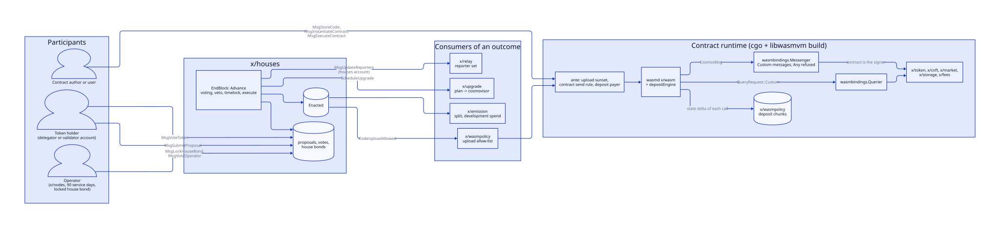
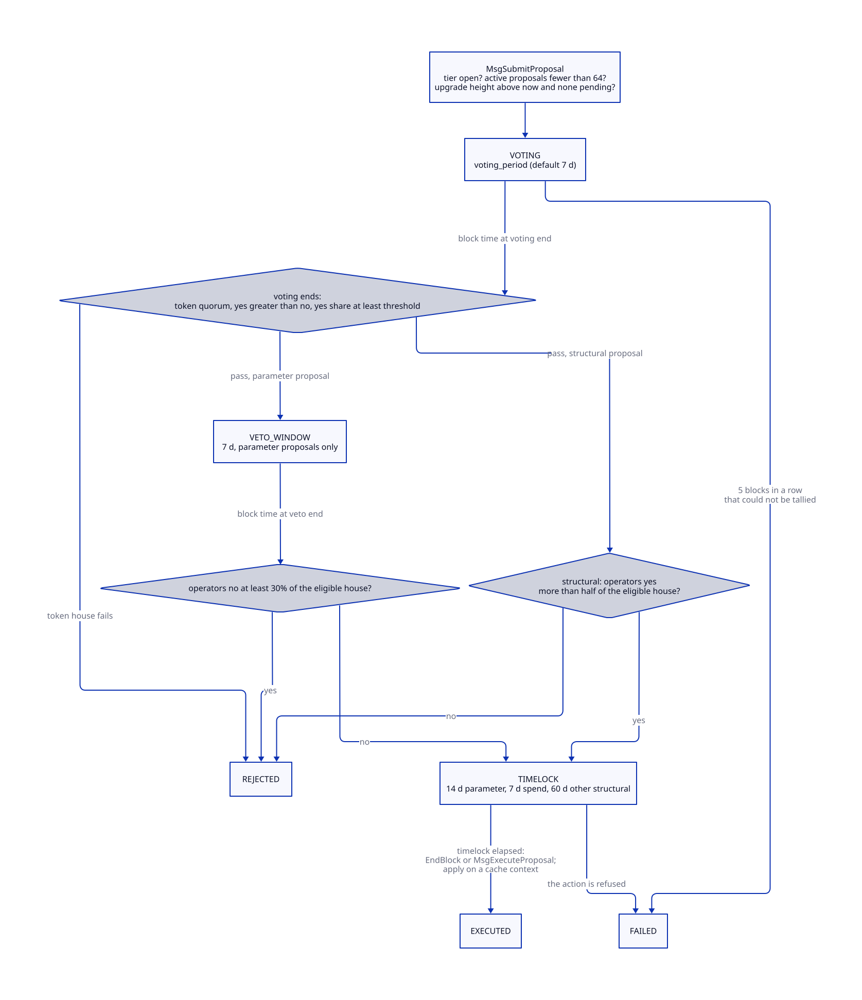
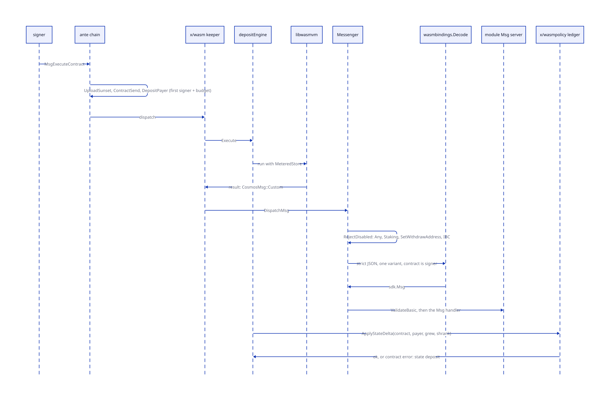
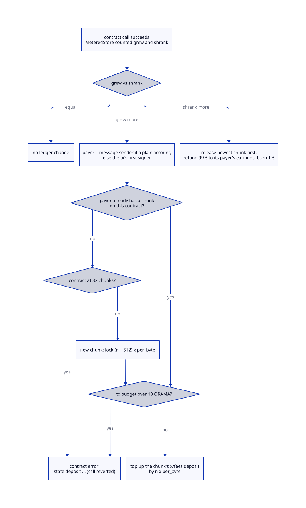

# Governance and contracts

> **At a glance.**
>
> - **What:** two halves of one answer to "who can change the chain, and what can user code do on it". `x/houses` is the only on-chain governance: a token house weighted by bonded stake and an operator house of one vote per eligible node operator, with tier gates that keep governance closed until the network is large and diverse enough, fixed timelocks, and a slashable operator bond. It has no authority key, no pause and no expedited path, and every stock SDK module keeps an unreachable authority, so a vote can only do the seven things the module codes. The second half is the contract runtime: CosmWasm through wasmd, with `x/wasmpolicy` closing uploads until a sunset height, forbidding contracts from paying users in norama, refusing IBC, and charging a refundable deposit for every byte of contract state; `x/wasmbindings` is the only way a contract reaches Orama's modules; five audited standard contracts ship in genesis.
> - **Key numbers:** voting 7 d (1 to 28 d), veto window 7 d, timelocks 14 d parameter, 7 d spend, 60 d upgrade and other structural; token quorum 40% of bonded stake (33.4% to 66.7%); delegated-vote cap 3% of bonded stake per validator; operator house at least 21 eligible operators, 90 service days, house bond 1,000 ORAMA (1 to 1,000,000), at most 3 per /16 and 5 per ASN; structural tier needs 7 distinct /16 and 5 ASNs; veto at 30% of the eligible house; 64 active proposals; upload sunset 3,162,240 blocks (183 days at an assumed 5 s); state deposit 68,359 norama per byte, 10 ORAMA per transaction, 32 payers per contract, 512 bytes of chunk overhead; 5 standard contracts.
> - **Code:** `chain/x/houses/`, `chain/x/wasmpolicy/`, `chain/x/wasmbindings/`, `chain/contracts/standard/`, wiring in `chain/app/enactment.go`, `chain/app/houses_view.go`, `chain/app/wasm_vm.go`, `chain/app/wasm_deposit.go`.
> - **Depends on:** [global nodes](37-global-nodes.md) for `x/nodes` operators and cosmovisor, [the shielded pool](43-the-shielded-pool.md) for the norama send rule, [chain architecture](39-chain-architecture.md) for the ante chain and module order, [economics](40-economics.md) for emission, earnings and deposits, [NFTs and the market](45-nfts-and-the-market.md) for two of the bound modules.

## Why it exists

A chain that nobody can change is a chain that nobody can fix, and a chain that someone can change at will is a chain with an owner. Orama's rule is that the owners are the people who run and secure it, and that the rules they cannot touch are written in code that has no setter. Three constraints shaped `x/houses`.

First, governance must not exist before it can be trusted. A vote among five founders is not a vote. The module therefore opens in two tiers, each gated by facts it reads from other modules: how much stake is bonded, whether the power multiplier lambda has reached 1, how many operators have served 90 days, and how those operators are spread across networks.

Second, two electorates see different risks. Token holders carry the economic risk and operators carry the operational one. A parameter change must pass the token house and can be vetoed by a minority of operators. A structural change, which can move money or code, must pass both.

Third, nothing about the vote may be a shortcut. The delays are floors in code, a genesis may lengthen them and never shorten them, and no message skips a timelock. The SDK's own `x/gov` is not wired, and each stock module that expects `x/gov` is given an authority address derived from a name that no module will ever register (`chain/app/app.go:UnreachableAuthority`). A chain upgrade is the one thing a vote can cause, and it is a plan that a validator's cosmovisor must still stage ([global nodes](37-global-nodes.md#cosmovisor-staging)).

The contract runtime answers a different question: what may user code do on a chain whose money is private by default. Four constraints follow.

- **User code must not reopen the public payment graph.** A contract cannot pay a user in norama. It pays into the user's earnings account instead.
- **User code must not become a way to upload unreviewed bytecode early.** Upload is closed until a sunset height, and a governed allow-list of code hashes is the only exception.
- **State is not free.** Without a price on storage a contract could fill every node's disk. Contract state carries a refundable deposit.
- **A contract must act only for itself.** The binding layer makes the contract the signer of every message it sends and has no field that names another.

## The model

**Token house.** Every bonded delegation votes. A delegator votes directly with `MsgVoteToken`, or inherits the vote its validator cast with the validator's own account.

**Operator house.** The set of eligible operators, one vote each. An operator is eligible when it is registered in `x/nodes` with an active node that has a declared network identity past the identity lock, has at least 90 proven service days, and holds a house bond of at least `house_bond`. The per-network caps are applied after eligibility (`chain/x/houses/keeper/eligibility.go:eligibleSet`).

**House bond.** Norama locked in the `houses` module account. It is locked while the operator has a vote on a proposal that is voting or in its veto window, and it is burned in full on equivocation.

**Tier.** The parameter tier takes `ParameterChange`. The structural tier takes the other six kinds (below). Each tier is open or closed (`Tiers`); a proposal of a closed tier is refused at submission.

**Proposal content.** Exactly one of seven actions: `ParameterChange`, `SoftwareUpgrade`, `EmissionSplitChange`, `DevelopmentSpend`, `PowerBoundsChange`, `RelayReporterChange`, `AllowListChange` (`chain/x/houses/types/content.go:ProposalContent`).

**Enacted.** The structural state that `x/houses` stores after a timelock, and that other modules read: the emission split, the scheduled upgrade, the relay reporters, the two allow-lists, and the power bounds (`chain/x/houses/keeper/enacted.go`).

**Ossified rules.** Rules with no field and no message: the emission schedule and tail, the burn rule, the absence of freeze, blacklist, halt, pause, circuit breaker and expedited proposal. `bootstrap_exit_stake` and the delays are genesis-only.

**Contract runtime.** wasmd's `x/wasm` on libwasmvm, present only in a build with cgo and without the `nowasm` tag. `x/wasmpolicy` is always wired and holds the policy even in a build without the VM.

**Standard contracts.** Five CosmWasm contracts stored at genesis as code ids 1 to 5 and instantiated by no one: `cw20-base`, `cw721-base`, `cw20-escrow`, `cw3-fixed-multisig`, `cw-vesting` (`chain/contracts/standard/manifest.json`).

**Binding.** A JSON object in `CosmosMsg::Custom` or `QueryRequest::Custom`. Exactly one module field is set, unknown fields are refused, and there is no sender field.

## How it works

### The tiers

`Tiers` reads four facts and reports each tier (`chain/x/houses/keeper/eligibility.go:Tiers`):

- `lambda`, from `x/power`, which `x/houses` reads through an interface and does not recompute;
- `bonded`, the norama balance of the staking bonded pool;
- the eligible operator set and its network diversity;
- the parameters `bootstrap_exit_stake` (271,000 ORAMA) and `min_house_size` (21).

| Tier | Opens when |
|---|---|
| Parameter | (bonded is at least `bootstrap_exit_stake`, or lambda is at least 1) and at least `min_house_size` eligible operators |
| Structural | lambda at least 1, at least `min_house_size` eligible operators, at least 7 distinct /16 prefixes and at least 5 distinct ASNs among them |

At bootstrap both are closed: no proposal can be submitted and every parameter stays at its genesis value. A read that fails (lambda unset, a staking read error) is a retryable fault of that one proposal, not a block failure (below).

Operator identity comes from `x/nodes`. `houseOperators` takes an operator's /16 and ASN from its lowest-id active node that has both a derivable /16 and a declared ASN, and only once the node's identity has stood unchanged for the network identity lock (`chain/app/houses_view.go`). An operator whose only nodes are younger than the lock, or lack either value, is skipped. Both values are declarations by the operator, not verified on chain, so a house of 21 can be an operator that declares 21 prefixes ([global nodes](37-global-nodes.md)).

`eligibleSet` sorts candidates by the height at which their bond was first locked, then by address, and applies the caps in that order: a candidate is dropped when its /16 already holds `max_eligible_per_prefix16` members (default 3) or its ASN holds `max_eligible_per_asn` (default 5). Earlier locks win.

### Proposals

`SubmitProposal` (`chain/x/houses/keeper/proposal.go`) checks `ValidateBasic` of the content (exactly one action, its fields inside coded bounds), that the content's tier is open, for an upgrade that its height is above the current height and that no earlier upgrade is still scheduled, and that fewer than `MaxActiveProposals` (64) are active. It takes the next id, sets the voting end to the block time plus `voting_period_seconds`, and records the proposal as `VOTING`. The proposer pays no deposit, and the chain has no minimum of any kind on who may propose; the cost of spam is the active cap and the transaction fee.

**Token votes.** `VoteToken` records a direct vote while the proposal is `VOTING` and before its end. The same vote twice is a no-op; a different second vote is an error and costs nothing, because the house bond belongs to the operator house.

**Operator votes.** `VoteOperator` requires that the voter be in the eligible set. It is open during `VOTING`, and for a parameter proposal also during `VETO_WINDOW`. A different second vote leaves the first vote in place, burns the voter's whole house bond (`slashBond`), records an `Equivocation`, and returns success with `slashed` true so the burn is not rolled back with the transaction. An equivocator is not counted for that proposal even if it locks a new bond.

**Tally of the token house.** `tallyTokenVotes` walks every bonded delegation (amounts in norama, converted from shares):

- A delegator that voted counts in full with its own option.
- A delegator that did not vote inherits its validator's vote if the validator's account voted, but a validator's inherited stake counts at most `bonded x 3%` (`DelegatedVoteCapPercent`). A validator's own self-bond does not inherit; it counts only if the validator voted.
- The delegations may not sum to more than the bonded stake; if they do the tally is rejected for this block.

A proposal passes the token house (`tokenHousePasses`) when participation (yes plus no plus abstain) is at least `bonded x token_quorum`, yes is strictly greater than no, and yes divided by participation is at least `token_pass_threshold`.

**Closing the vote.** `Advance` runs in the end blocker of every block over the active proposals in id order (`chain/x/houses/keeper/advance.go:Advance`). When `VOTING` has ended:

- *Parameter proposal.* If the token house fails, `REJECTED`. Otherwise `VETO_WINDOW` for `veto_window_seconds`. At its end the operators who voted NO, as a share of the eligible set, are counted; at 30% or more (`VetoPercent`), or with an empty house, the proposal is `REJECTED` with the reason "operator house veto". Otherwise it enters `TIMELOCK`.
- *Structural proposal.* The token house must pass and operator YES votes must exceed half of the eligible set (`operatorMajority`, computed at tally time). Then `TIMELOCK`; otherwise `REJECTED`.

**Timelock.** `Params.TimelockFor` returns the parameter delay (14 d) for a parameter change, the spend delay (7 d) for a development spend, and the upgrade delay (60 d) for every other structural content. No path is shorter. When the timelock has elapsed, `EndBlock` executes the proposal, and any account may execute it earlier in a transaction with `MsgExecuteProposal` once the time has passed; the signer is not an authority.

**Execution.** `execute` applies the action on a cache context. A refused action writes nothing and the proposal becomes `FAILED` with its reason. `FAILED` is final and the action is not retried; a proposer who still wants it submits a new proposal. A collection that cannot be decoded is not a refusal of the action and fails the block.

**Proposals that cannot be advanced.** A staking, power or operator read that fails, or a tally over delegations that do not add up, is a fault of the proposal and not of the block (`ErrAdvanceRejected`). `Advance` runs that proposal's step in a cache context, rolls it back, emits `houses_proposal_failed`, counts the failure on the proposal and tries again next block. After `MaxAdvanceAttempts` (5) consecutive failures the proposal is closed `FAILED`. A failure that is not about the proposal (a store that cannot be read) is returned and fails the block on every validator. A block that advances the proposal clears the count.

### What a proposal can change

| Content | Tier | Effect once enacted |
|---|---|---|
| `ParameterChange` | parameter | replaces `token_quorum`, `token_pass_threshold`, `voting_period_seconds`, `house_bond`, `max_eligible_per_prefix16`, `max_eligible_per_asn` of the houses' own `Params`, inside the bounds of `Params.Validate` |
| `SoftwareUpgrade` | structural | calls `x/upgrade` `ScheduleUpgrade(name, height)` and records it; the node halts at the height with "UPGRADE NEEDED" unless it has a handler |
| `EmissionSplitChange` | structural | `x/emission` reads the split when it closes an epoch; each share within 10 points of 60/25/10/5, summing to 100 |
| `DevelopmentSpend` | structural | after the 7 d spend delay, mints through `x/emission` only up to the closed epoch's development ceiling and credits the recipient's earnings |
| `PowerBoundsChange` | structural | records `m_max` (0.75 to 1.25) and the one-way activation of the useful-work multiplier |
| `RelayReporterChange` | structural | calls `x/relay`'s own `MsgUpdateReporters` handler with the houses module account as signer; a change that empties the set fails |
| `AllowListChange` | structural | adds or removes SHA-256 hashes of uploadable wasm code, and adapter names |

A governance vote moves very little. The six parameters of the first row are the only tunable numbers in the module. It cannot change a parameter of any other module: `x/nodes`, `x/shielded` and `x/storage` have no setter, and every authority-gated message of a stock module is unreachable. A software upgrade is the one general mechanism, and it works by scheduling a halt, not by editing state.

`SoftwareUpgrade` carries an absolute block height. The height is checked against the current height at submission and again at execution. The delay is 60 days and the block time is not exact, so a height chosen at submission can be in the past by the time the timelock ends, in which case execution fails and the proposal is `FAILED`.

### House bond

`LockHouseBond` moves norama from the signer to the `houses` module account and adds to the signer's single `HouseBond` row; the first lock records the block height that orders ties. `UnlockHouseBond` returns the whole bond and fails with `ErrBondLocked` while the signer has an operator vote on any proposal in `VOTING` or `VETO_WINDOW`. The invariant is that the sum of bonds equals the module account balance (`chain/x/houses/keeper/invariants.go:CheckInvariants`).

### Enactment wiring

`x/houses` never pushes values. Each consumer asks (`chain/x/houses/keeper/enacted.go`), or an adapter built in `chain/app/enactment.go` calls the consumer:

- `emissionSplitSource` implements the emission module's split source and returns the canonical split until a proposal changes it.
- `relayReporterEnactor` computes the new reporter set from the current one and calls `x/relay`'s message handler under `relaykeeper.WithAllowReporterChange`, the only way that message is accepted.
- `upgradeScheduler` calls the upgrade keeper directly, so the plan exists although the SDK's own `MsgSoftwareUpgrade` is unreachable.
- `x/wasmpolicy` reads `CodeUploadAllowed` on every upload before the sunset.

`Keeper.WithEnactors` supplies the reporter and upgrade enactors. Without them those two kinds of proposal fail at execution instead of recording an outcome that nothing reads. The keeper copies taken before `WithEnactors` (those handed to other modules) never execute a proposal, so only the rebuilt value needs the wiring.

### The contract runtime and its policy

`installWasm` builds wasmd's keeper with Orama's policy around it (`chain/app/wasm_vm.go:installWasm`):

- **Capabilities.** `iterator`, `staking` and `cosmwasm_1_1` to `cosmwasm_2_2`. `stargate` and `ibc2` are omitted, so a contract that needs either does not pass wasmd's check at upload (`chain/app/wasm_caps.go:WasmCapabilities`).
- **No IBC.** The channel, port and ICS-4 dependencies are no-ops that return `ErrIBCDisabled`, and the message handler decorator refuses any `CosmosMsg::Ibc` or `Ibc2` (`chain/x/wasmpolicy/ibc.go:RejectContractIBC`). No IBC module is wired.
- **Coin transfers.** A coin transferrer allows a send to the `fees` and `fees_deposits` module accounts, and otherwise marks the recipient as a contract being funded, because wasmd moves instantiate funds before it registers the contract.
- **Upload.** The `UploadSunsetDecorator` checks every message of every transaction, including simulations. Before `upload_sunset_height` (default 3,162,240 blocks, 183 days at an assumed 5 s; the anchor window of the shielded pool assumes 6 s), `MsgStoreCode`, `MsgStoreAndInstantiateContract` and `MsgStoreAndMigrateContract` are refused unless the code id is in the genesis code set or the SHA-256 of the uncompressed wasm is on the enacted allow-list. A fresh store message names no code id, so in practice only the allow-list opens the door. The hash is of the uncompressed bytes (a gzip upload is decompressed, capped at 4 MiB), so a gzip wrapper does not change it. No message can change the sunset: `InitGenesis` is the only writer and it refuses a second write (`chain/x/wasmpolicy/keeper/keeper.go:CheckMsg`).
- **Instantiate.** Every standard code accepts `Everybody`; instantiate is not otherwise restricted.

### Norama stays out of contract hands

Three rules keep the public payment graph closed:

1. **Bank restriction.** `NoramaSendRestriction` lets a user or a contract send norama to a contract, but not a user to a user ([the shielded pool](43-the-shielded-pool.md)).
2. **Contract send.** `ContractSendDecorator` is both an ante decorator and a bank send restriction: a contract may send norama only to another contract or to a module account on its list, never to a user (`chain/x/wasmpolicy/ante/send.go:ContractSendDecorator`). As a bank restriction it also applies to sends that a contract's submessages make and that never appear in the outer transaction.
3. **Earnings.** A contract that owes a user ORAMA uses the earnings binding. The payment lands in the user's earnings account in `x/fees`, which cannot be sent, so the public balance never appears.

A token wrapper cannot hold or create norama: `RefuseNoramaWrapper` refuses a created denom that is `norama` or a factory denom whose subdenom is `norama`, and a held factory denom of that form. A contract may hold the native denom, to escrow ORAMA (`chain/x/wasmpolicy/norama.go:RefuseNoramaWrapper`). The same refusal covers mint and burn through the binding.

**The declared limit: a contract can issue a public IOU for ORAMA it holds.** Users may pay ORAMA into a contract (escrow, markets and DeFi need that), and a contract may mint its own token, through the `x/token` binding (`factory/{contract}/{subdenom}`) or as a CW20 from the standard CW20 base. Nothing on chain ties that token's supply to the ORAMA the contract holds, and the token moves publicly between users, so a contract that issues one turns held ORAMA into a public payment rail. The chain does not stop it, because the only way would be to forbid contracts from holding ORAMA between transactions, which breaks escrow, markets and DeFi; the owner chose to allow it (decision O-B). `TestBindings_aContractCanIssueAPublicIOUForOramaItHolds` and `TestBindings_tokenBindingRefusesToWrapNorama` in `chain/app/wasm_bindings_test.go` hold both edges: the IOU is possible, the wrapper named `norama` is refused. What else is refused: a bank send from a contract to a user, `CosmosMsg::Any` (the stargate form) and `SetWithdrawAddress`, so a contract cannot reach a module it has no binding for or redirect staking rewards. The genesis CW20 base is a user-token base and is never given ORAMA to wrap. A holder of an IOU trusts the issuing contract's code as with any wrapped asset: it is not shielded, not redeemable by the protocol, and the protocol makes no claim about its backing, so a wallet should show a token's issuer and mint authority before its balance. A related limit: contract and market payments show the payer, the amount and the contract publicly, and a permissionless relay contract (a user pays it, it calls `earnings.pay`) is a public user-to-user rail whose payee still lands privately in earnings.

### Bindings

`wasmbindings.Messenger` wraps wasmd's message handler (`chain/x/wasmbindings/messenger.go:DispatchMsg`):

1. **Refuse the dangerous variants** (`RejectDisabled`): `CosmosMsg::Any`, which is also how the stargate form arrives, the whole `Staking` family, and `Distribution::SetWithdrawAddress`. The comment gives the reason for staking: the ante-only delegation rules would not apply to a contract. IBC is refused by the wrapper in `chain/app/wasm_vm.go`.
2. **Pass through** anything that is not `Custom` to wasmd's own handler (bank sends, wasm execute, instantiate).
3. **Decode a `Custom` message** (`wasmbindings.Decode`). The JSON is decoded with unknown fields disallowed and trailing data refused. Exactly one of `token`, `cnft`, `market`, `storage`, `earnings` and `shielded` may be set, and then exactly one variant under it. The contract's address is the signer of every produced message, because no field can name another (`TestDecode_aSenderFieldCannotBeSmuggledIn`).
4. **Route.** `ValidateBasic` of the message, then the module's own Msg handler through the app's message router, so every module rule applies to a contract as to a user.

| Binding | Variants | Notes |
|---|---|---|
| `token` | `create`, `mint`, `burn` | mint and burn refuse norama and norama-named factory denoms; creation refuses a norama wrapper |
| `cnft` | `create_collection`, `create_tree`, `mint` | the contract is the creator ([NFTs and the market](45-nfts-and-the-market.md)) |
| `market` | `list`, `cancel_listing`, `bid`, `cancel_bid`, `settle` | the contract is seller, bidder or settler |
| `storage` | `create_deal` | paid from the contract's own funds; no granter field, so a contract never spends another account's deal allowance |
| `earnings` | `pay` | `PayEarnings` from the contract's balance into a user's earnings account; event `orama_earnings_pay` |
| `shielded` | none | every variant returns `NOT_LINKED` |

`wasmbindings.Querier` answers `QueryRequest::Custom`: `token.info`, `cnft.tree`, `cnft.verify_proof` (charged 20,000 gas plus 3,000 per proof sibling, answering `valid` false with a reason for a bad proof and an error for a missing tree) and `market.listing`. A `shielded` query returns `NOT_LINKED` (`chain/x/wasmbindings/query.go`).

### State deposits

wasmd has no price on storage, so Orama prices it in a wrapper around wasmd's VM engine (`chain/app/wasm_deposit.go:depositEngine`). Every `Instantiate`, `Execute`, `Migrate`, `MigrateWithInfo`, `Sudo` and `Reply` gets a `MeteredStore` that counts bytes added and removed: a new key weighs `len(key) + len(value)`, an overwrite changes by the difference of the values, a delete frees key plus value (`chain/x/wasmpolicy/metered_store.go`). When the call returns successfully with a net change, `ApplyStateDelta` settles it in the ledger of `x/wasmpolicy`; a failed call is reverted by wasmd and charged nothing. Queries and code storage do not write contract state and are not wrapped.

**Who pays.** The message sender when it is a plain account, else the first signer of the transaction that the ante chain recorded (`DepositPayerDecorator`). A contract never pays: its calls are rooted in a signer.

**Growth.** `charge` locks `growth x deposit_per_byte` (68,359 norama, about 0.07 ORAMA per KB; the price `x/token` and `x/nodes` ship) from the payer through `x/fees`. The ledger keeps one *chunk* per payer per contract, keyed by (contract, sequence):

- If the payer already has a chunk on this contract, it is topped up.
- If not, a new chunk is created, which also locks `chunk_overhead_bytes` (512) for its own ledger rows, up to `max_deposit_chunks` (32) payers per contract. A thirty-third payer is refused with `ErrDepositLedgerFull`.
- Every lock adds to the transaction's `DepositBudget`, which lives in the context for the whole transaction and counts submessages that later revert, which only makes the cap stricter. The sum may not pass `max_deposit_per_tx` (10 ORAMA, about 146 KB of new state at the default price): `ErrDepositCap`.

**Shrink.** `refund` releases chunks newest first, each refunded to the payer who locked it; a partial release leaves the remainder of a chunk. `x/fees` returns 99% to the payer's earnings and burns 1% (`chain/x/wasmpolicy/keeper/deposit.go:FeesKeeper`). Only charged bytes can be refunded: a contract's genesis state or first bytes that were never charged are not, so a shrink past the charged total releases the charged total and no more. The overhead is released with its whole chunk.

**Failure.** A deposit that cannot be paid, a payer with no balance or earnings, or a missing payer turns the call into a contract error `state deposit: ...`, which wasmd treats as any failed execution. Outside a transaction (a block hook, a genesis call) there is no payer and growth fails.

### The standard contracts

`chain/contracts/standard/` embeds five wasm files and a manifest. `Load` refuses a file whose SHA-256 differs from the manifest, or an entry with no 40-hex source commit. `Apply` writes them into the genesis map: one wasm code per contract, creator the `wasmpolicy` module account (no key controls it, so no one owns the contracts), instantiate permission `Everybody`, nothing instantiated, wasmd's code sequence advanced past them, and the code ids added to the genesis code set (`chain/contracts/standard/genesis.go:Apply`). It refuses a genesis that already has wasm codes or contracts, or one with no `wasm` module.

| Code id | Contract | Standard | Role |
|---|---|---|---|
| 1 | `cw20-base` | CW20 | fungible token; user tokens only, it never wraps norama |
| 2 | `cw721-base` | CW721 | NFT base |
| 3 | `cw20-escrow` | escrow | escrow of native and CW20 tokens with an arbiter |
| 4 | `cw3-fixed-multisig` | CW3 | fixed-membership multisig for users' own use |
| 5 | `cw-vesting` | vesting | native and CW20 vesting with a schedule |

Each contract is built from a pinned upstream commit, recorded with its patch, toolchain and wasm SHA-256 in `chain/contracts/standard/manifest.json`:

| Contract | Upstream tag | Commit | Patch |
|---|---|---|---|
| `cw20-base` 2.0.0, `cw3-fixed-multisig` 2.0.0 | CosmWasm/cw-plus `v2.0.0` | `d91c70ea53acf2ac694efa343f3697e7cd165534` | `Cargo.lock` to cosmwasm-std 2.2.2 |
| `cw721-base` 0.22.0 | CosmWasm/cw-nfts `v0.22.0` | `b11876a65890cf9ee2201f768e81b0a00ae395e9` | none |
| `cw20-escrow` 0.14.2 | CosmWasm/cw-tokens `v0.14.2` | `1db4b7387953538d7a0123d3732385981d18db57` | `Cargo.lock` to cosmwasm-std 1.5.4 |
| `cw-vesting` 2.7.1 | DA0-DA0/dao-contracts `v2.7.1` | `92c44e593e6a0677a437e028514ce207efbd4d66` | `Cargo.lock` to cosmwasm-std 1.5.4, and the `ibc3` feature dropped |

`chain/contracts/standard/build.sh verify` (`make contracts-verify`) fetches each source at its commit and checks the commit, applies the patch, builds with Rust 1.81.0 for `wasm32-unknown-unknown` with `--locked`, runs `wasm-opt -Os --signext-lowering` and compares the SHA-256 with the manifest; `build.sh update` rewrites the files and hashes. No prebuilt wasm is downloaded, and two builds in different directories produce the same hashes provided they use the same `wasm-opt` (the manifest pins version 132; `ALLOW_TOOL_DRIFT=1` overrides and the hashes then differ). The patches have two reasons. wasmvm v3.0.7 aborts, on a dlmalloc assertion, in contracts built with cosmwasm-std 2.0.x or 1.1 to 1.3, so only the lock files move to a newer patch release. The cw-vesting workspace enables cosmwasm-std's `ibc3` feature, which would make the contract require the `stargate` capability this chain does not advertise. Rust 1.81 is used because rustc 1.87 and later emit bulk-memory from the precompiled standard library, which wasmvm rejects. `oramad genesis add-standard-contracts` is the command that applies the set to a genesis, and `chain/scripts/stagenet/deploy.sh` runs it after the bootstrap committee is added.

The standard contracts run as contracts, so the send restriction applies to them and some cannot handle ORAMA: a CW3 multisig proposal that bank-sends ORAMA to a user fails at execution; the escrow releases and refunds by bank send, so ORAMA escrowed for a user recipient cannot leave it (token and CW20 escrows work); and the vesting contract's instantiate for the native denom sends a distribution `SetWithdrawAddress`, which is refused, so it can vest a user token but not ORAMA. A contract pays a user ORAMA through the earnings binding.

They are built from pinned upstream commits with Rust 1.81 and `wasm-opt -Os --signext-lowering`. The pinned `Cargo.lock` files are patched to `cosmwasm-std` 2.2.2 (cw-plus) and 1.5.4 (cw-tokens), because wasmvm 3.0.7 aborts in contracts built with some earlier 2.0.x and 1.1 to 1.3 versions; `cw-vesting` also loses its stargate feature, since `stargate` is not a capability of this chain. The tests show that each contract also respects the norama rule: a multisig, an escrow and a vesting contract cannot pay norama to a user.

## State it owns

| State | Holds | Written by | Read by | Where |
|---|---|---|---|---|
| houses `Params` | quorum, threshold, voting period, bond, caps, house size, delays | genesis; `ParameterChange` for six fields | every tally | IAVL `houses`, prefix 0 |
| `NextProposalID`, `Proposals`, `Active` | proposals and the active id set | `SubmitProposal`, `Advance` | queries, `Advance` | prefixes 1, 2, 6 |
| `TokenVotes`, `OperatorVotes` | one vote per (proposal, voter) | `VoteToken`, `VoteOperator` | tallies | prefixes 3, 4 |
| `Bonds` | house bond per operator | `LockHouseBond`, slash, unlock | eligibility, invariants | prefix 5 |
| `Equivocations` | (proposal, operator) pairs | `VoteOperator` | tallies, `VoteOperator` | prefix 7 |
| `Enacted` | the structural outcomes | `execute` | emission, wasmpolicy, queries | prefix 8 |
| module account `houses` | locked bonds | bank | invariant | `x/bank` |
| wasmpolicy sunset, genesis codes, price, limits | write-once policy | `InitGenesis` only | ante, ledger | `wasmpolicy` store, prefixes 0, 1, 2, 6 |
| deposit chunks, contract bytes, next chunk | the state-deposit ledger | `ApplyStateDelta` | refunds, invariants | prefixes 3, 4, 5 (JSON values) |
| `x/fees` deposits `wasm/<contract>/<seq>` | the locked norama | `x/fees` | release | `x/fees`, module `fees_deposits` |
| deposit budget, deposit payer | per-transaction context values | `DepositPayerDecorator` | `charge` | context only |
| `x/wasm` store | codes, contracts, contract state | wasmd | wasmd | `wasm` store key, with `<home>/wasm` for compiled modules |

Queries for `x/houses`: `Params`, `Proposal`, `Vote`, `HouseBond`, `Tiers`, `Enacted` and `Invariants`, at `/orama/houses/v1/...`. `x/wasmpolicy` registers no Msg service, no query and no REST route. Contract queries go through wasmd.

## Lifecycle

**Genesis.** `x/houses` starts with defaults and both tiers closed. Genesis parameters of governance are locked: on any chain id other than a localnet, devnet or stagenet, `ValidateLockedGenesis` compares every locked module parameter, including `wasmpolicy.upload_sunset_height`, with the app's defaults and refuses a difference. `chain/contracts/standard/genesis.go:Apply` stores the five contracts. A build without the VM refuses a genesis that contains the wasm module (`TestNowasmInitChainRejectsWasmGenesis`) and a node that claims wasm.

**Normal operation.** Each block's end blocker runs `Advance`. Contract calls charge and refund through the ledger as they run.

**Rolling upgrade.** Neither module has a migration: `x/houses` and `x/wasmpolicy` are at consensus version 1. Fields added to houses `Params` decode as zero from an older binary and fail validation, so a chain that ran the older build restarts from a new genesis. A governed `SoftwareUpgrade` is the mechanism for changing the binary: at the plan height every node halts, cosmovisor switches `current`, and the new binary runs the registered handler or stays halted if none is staged.

**Restart.** All state is in the store. The `MeteredStore` and the deposit budget are per call and per transaction.

**Node loss and mixed versions.** A validator on a binary without the VM cannot follow a chain that has wasm state; it refuses to start with the claim error.

## Failure modes

| Trigger | What the system does | What you observe |
|---|---|---|
| Proposal submitted while its tier is closed | refused with `ErrTierClosed` | the transaction fails; `Tiers` shows which condition is unmet |
| Staking, power or operator read fails while tallying | that proposal's step is rolled back and retried next block, at most 5 times in a row, then `FAILED` | `houses_proposal_failed` event and log line; `advance_failures` on the proposal |
| Store fault while advancing | the block fails on every validator | chain halt |
| Timelocked action refused at execution (spend over the ceiling, reporter set emptied, upgrade height passed, no enactor wired) | no partial write; `FAILED` with the reason | proposal status and `fail_reason` |
| Operator casts a second, different vote | house bond burned, equivocation recorded, first vote stays | `MsgVoteOperatorResponse.slashed` true; the operator leaves the eligible set |
| Unlock while a vote is open | refused with `ErrBondLocked` | the operator waits for the proposal to leave voting and veto |
| Delegations sum to more than bonded stake | tally rejected for this block | retried; `FAILED` after 5 |
| Contract upload before the sunset, hash not on the allow-list | `ErrUploadClosed` | the upload transaction fails in the ante handler |
| Contract sends norama to a user | `ErrContractNorama` from the ante decorator or the bank restriction | the contract call or submessage fails |
| Contract returns `CosmosMsg::Any`, staking or IBC | `ErrDisabledMessage` or `ErrIBCDisabled` | the contract execution fails |
| Binding message with an unknown field, two variants or trailing data | `ErrBadMessage` | the contract execution fails |
| Contract state grows and nobody can pay | contract error `state deposit: ...`, call reverted | the execute transaction fails; no ledger row |
| One transaction would lock more than 10 ORAMA | `ErrDepositCap` | the call fails; the transaction budget counts reverted submessages too |
| A 33rd payer grows one contract | `ErrDepositLedgerFull` | the call fails |
| Binary built with `nowasm` joins a chain with wasm state | refuses to start | start-up error naming libwasmvm |
| Ledger and `x/fees` disagree | `Keeper.CheckInvariants` reports `DepositsMatch` false; the module registers no query to read it | only the keeper tests exercise it |

## Trust and security

**The houses.** An attacker with majority stake can pass the token house but cannot pass a structural proposal without more than half of the eligible operators, and cannot open the structural tier without 21 operators across 7 prefixes and 5 ASNs. A parameter proposal can be vetoed by 30% of the eligible house. An attacker with a majority of operators can pass the operator house of a structural proposal only with the token house too. The remaining exposure is the declaration of identity: a prefix and an ASN are declared by the operator in `x/nodes` and not verified, so diversity counts what operators claim. The identity lock is what stops an operator moving its identity to fit one vote.

**Short houses.** Fewer than 21 eligible operators means no governance at all. A hostile minority cannot reduce the house, because eligibility depends on the operator's own bond and service, not on anyone's vote.

**Delegated voting.** A validator that controls many delegations carries at most 3% of bonded stake in inherited votes. A delegator that votes directly overrides the validator in full.

**No authority.** Every stock module's authority is the hash of a name that no module registers. `TestUnreachableAuthority_rejectsEveryAuthorityGatedMsg` covers bank, staking, distribution, consensus and upgrade. The upgrade path that `x/houses` uses is the keeper's `ScheduleUpgrade`, which needs no authority message and is reachable only from `execute`.

**Contracts.** A contract can act for itself only. It cannot name a sender, reach a module that has no binding, delegate stake, redirect rewards, open a channel, or hold a norama wrapper. Its state costs the person who calls it. The remaining powers of a contract are the ones the bound modules give any account: create tokens, mint NFTs, list and bid, open a storage deal with its own funds, and pay a user's earnings. A contract that receives norama from users is a public account whose balance is visible, which is the opposite of the pool; the standard escrow and vesting contracts therefore pay out in tokens or into earnings.

**Upload.** The sunset is the main defence against unreviewed code: before it, only the genesis five and governed hashes can be stored. After it, upload is open, and any code that passes wasmd's capability check can run. Gas and the deposit are then the bounds.

**The standard contracts** are pinned to upstream commits, patched only in `Cargo.lock` (and one `Cargo.toml` line), and checked against their hashes at every load.

## Limits and scale

| Resource | Bound | Source |
|---|---|---|
| Active proposals | 64 | `MaxActiveProposals` |
| Advance failures per proposal | 5 consecutive blocks | `MaxAdvanceAttempts` |
| Eligible set per network | 3 per /16, 5 per ASN by default; 1 to 21 | `Params` |
| House size | 21 to 101 required | `min_house_size` |
| Deposit per transaction | 10 ORAMA | `DefaultMaxDepositPerTx` |
| Payers per contract | 32 | `DefaultMaxDepositChunks` |
| Hashed upload size | 4 MiB uncompressed | `maxHashedWasmBytes` |
| Verify-proof query | 20,000 + 3,000 per sibling gas | `VerifyProofBaseGas` |

`Advance` walks every active proposal each block and a tally walks every bonded delegation (`GetAllDelegations`) and every operator, so the cost of the end blocker grows with the number of delegations times the number of open proposals, up to 64. At 10x the delegations, a block that closes several votes at once is the first thing to slow; the tally has no cache. The eligible-set computation reads every operator and every node on each tally and on each operator vote. Contract scale is bounded by gas first. The ledger refund walk is bounded by the 32-chunk cap, which is the reason for the cap.

## Design decisions

### No `x/gov`

*Chosen:* `x/houses` and a never-registered authority name. *Rejected:* the SDK's `x/gov`. *Why:* `x/gov` can change any parameter of any module with one vote and has an expedited path; this chain has rules that no vote may touch. A name that no module will ever register forces any later migration to be a visible code change rather than a silent handover.

### Tier gates read live facts

*Chosen:* tiers open on bonded stake, lambda, operator count and network spread, computed on each submission. *Rejected:* a genesis flag or a block height. *Why:* governance that opens on a date can open before the network is ready. The gate is the proof that the network is large and diverse.

### Delays are floors with a ceiling

*Chosen:* each delay has a coded minimum equal to the planned value and a maximum, fixed at genesis. *Rejected:* governable delays. *Why:* a vote that could shorten its own timelock could grant itself the shortcut it exists to prevent.

### Bond burns on equivocation, token house does not

*Chosen:* a second different operator vote burns the whole bond. A second different token vote is an error. *Why:* the operator bond is what makes a seat cost something, and the operator house can be bribed to vote both ways; token voters hold the stake whose weight the vote already counts.

### Retry a stuck proposal, fail it at five

*Chosen:* a proposal-level fault rolls back and retries for 5 blocks, then fails. *Rejected:* failing the block, and retrying forever. *Why:* a block failure halts every validator because of one bad proposal; an endless retry keeps a dead proposal active and counts against the cap of 64.

### The contract is always the signer

*Chosen:* no sender field in any binding, and `CosmosMsg::Any` refused. *Rejected:* letting a contract send any registered message. *Why:* a general message path would let a contract act as itself for every module, including ones whose rules live in the ante chain, which a contract's messages never reach (the staking comment says so).

### Deposits in an engine wrapper

*Chosen:* wrap wasmd's VM engine with a metered store and a ledger of per-payer chunks. *Rejected:* a flat fee, and wasmd's own accounting. *Why:* wasmd prices gas but not retained bytes; a refundable deposit prices occupancy and returns it. Chunks per payer let the refund go to the person who paid, with a walk bounded by the chunk cap.

### Contracts pay users through earnings

*Chosen:* the `earnings.pay` binding and a bank rule that refuses contract-to-user norama. *Rejected:* letting contracts send norama. *Why:* a contract payout would otherwise be a public transfer from a public account to a user, which is the leak the pool exists to prevent.

## Known gaps

- **Contract earnings have no spending path.** Earnings credited to a contract's address are debited only for the signer of a transaction (fees, staking top-up, shielding), and a contract signs none. A contract that expects to be paid in ORAMA must forward the funds another way (`chain/x/fees/keeper/earnings.go:DebitEarningsUpTo`).
- **Public IOUs for held ORAMA are allowed by decision.** A contract holding ORAMA can issue a public token against it and the chain neither limits nor audits that (`chain/x/wasmpolicy/norama.go:RefuseNoramaWrapper`).
- **The shielded binding is not built.** Every `shielded` message and query returns `NOT_LINKED`, so a contract cannot take part in the pool; a contract's balance is public. `chain/x/wasmbindings/bindings.go`.
- **Two enacted outcomes have no consumer.** The power-bounds record (`m_activated`, `m_max`) and the adapter allow-list are stored but read by no module. `chain/x/houses/keeper/enacted.go:AdapterAllowed`.
- **Upgrade heights are absolute.** A software upgrade proposal fixes a block height 60 days ahead and fails if the height has passed at execution. `chain/x/houses/keeper/proposal.go:checkUpgradeHeight`.
- **Operator identity is declared, not verified.** Diversity and the per-network caps count what operators claim in `x/nodes`. `chain/app/houses_view.go`.
- **No proposal deposit.** Submitting a proposal costs only the transaction fee and an active slot; 64 slots can be held by one account. `chain/x/houses/keeper/proposal.go:SubmitProposal`.
- **Block-time assumptions disagree.** The upload sunset counts blocks at an assumed 5 s and the shielded anchor window at 6 s. `chain/x/wasmpolicy/types/keys.go:AssumedBlockSeconds`.
- **The tally walks every delegation each time.** There is no cached or incremental tally. `chain/x/houses/keeper/tally.go:tallyToken`.
- **Governance success paths are not run on the fleet.** The fleet e2e covers the refusals of the houses messages, because no funded path exists there; the success paths are keeper and app tests. `e2e/features/chain-economics/feature.yaml`.
- **The fleet's chain has no VM.** The run chain is built without libwasmvm, so contract execution, deposits and the bindings are tested in `chain/app` and `chain/x/wasmbindings` and not on the fleet. `e2e/features/chain-assets/feature.yaml`.
- **The ledger is JSON in the store.** Deposit rows and limits are stored as `encoding/json`, not protobuf, and the wasmpolicy module has no query or REST route. `chain/x/wasmpolicy/types/jsoncodec.go`.

## Verify it yourself

**Unit tests** (all in `make test`; the wasm tests need a cgo build with libwasmvm):

- `chain/x/houses/keeper/`: `TestTiersStayClosedUntilOpeningRulesHold`, `TestSmallOperatorHouseBlocksStructuralVotes`, `TestOperatorHousePrefix16AndASNCaps`, `TestHouseBondLockAndSlashOnEquivocation`, `TestVetoWindow`, `TestDelegatedVoteCap`, `TestDirectVoteOverridesValidator`, `TestTimelocksAndNoEarlyExecution`, `TestSpendMintsOnlyWhenApprovedAndWithinCeiling`, `TestSplitStaysInsideCodedBoundsAndMIsOneWay`, `TestAdvance_aProposalThatNeverAdvancesIsFailedAtTheBound`, `TestAdvance_aStoreFaultStaysFatal`, `TestSoftwareUpgrade_isScheduledOnlyAfterItsTimelock`, `TestRelayReporters_refusedChangeFailsTheProposal`.
- `chain/app/`: `TestEnactment_softwareUpgradeBecomesAnUpgradePlan`, `TestEnactment_uploadAllowListOpensOneCodeHashBeforeTheSunset`, `TestEnactment_emissionClosesEpochsAtTheEnactedSplit`, `TestUnreachableAuthority_rejectsEveryAuthorityGatedMsg`, `TestDeposit_growthIsChargedToTheCallerAndDeletionRefunds`, `TestDeposit_aTransactionCannotLockMoreThanTheCap`, `TestUpload_theHeightCannotBeChangedByAnyMessage`, `TestBindings_bypassAttemptsAreRefused`, `TestBindings_earningsPaymentIsTheOnlyNoramaPathToAUser`, `TestStandardMultisig_cannotPayNoramaToAUser`, `TestContracts_gasExhaustionAndUnboundedRecursionFailTheTransaction`, `TestCapabilitiesOmitIBCAndStargate`.
- `chain/x/wasmbindings/`: `TestDecode_aSenderFieldCannotBeSmuggledIn`, `TestMessenger_refusesAnyStargateAndSetWithdrawAddress`, `TestQuerier_verifyProofRejectsTamperedProofsWithoutAnError`.
- `chain/x/wasmpolicy/`: `TestUploadSunset`, `TestKeeperHasNoSunsetSetter`, `TestContractSendDecorator`, `TestApplyStateDelta_shrinkReleasesNewestChunkFirstToItsPayer`, `TestApplyStateDelta_aContractHoldsAtMostMaxChunksPayers`, `TestMeteredStore_countsNewKeysOverwritesAndDeletes`, `TestRefuseNoramaWrapper`.
- `chain/contracts/standard/`: `TestLoad_everyArtifactMatchesItsPinnedHash`, `TestApply_refusesWhatItCannotAddTo`.

**Fleet e2e** (the owner runs the fleet suite): `e2e/features/chain-economics/` covers the six houses messages' refusals, the houses queries and the closed tiers; `e2e/features/chain-assets/` covers the wasm policy against the build (no VM: no wasm types; VM: upload closed before the sunset); `e2e/features/chain-waivers/` holds the tripwires for unwired surfaces.

**Read-only on the chain:**

- `orama chain query orama.houses.v1.Query/Tiers` shows each tier, lambda, bonded stake, the eligible count and the distinct prefixes and ASNs.
- `orama chain query orama.houses.v1.Query/Params`, `Proposal`, `Vote`, `HouseBond`, `Enacted` and `Invariants` print the rest; REST under `/orama/houses/v1/`.
- `orama chain query cosmwasm.wasm.v1.Query/Codes` (a VM build) lists the five standard codes with their creator, the `wasmpolicy` module account.
