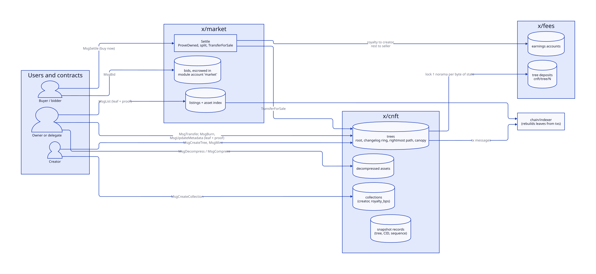
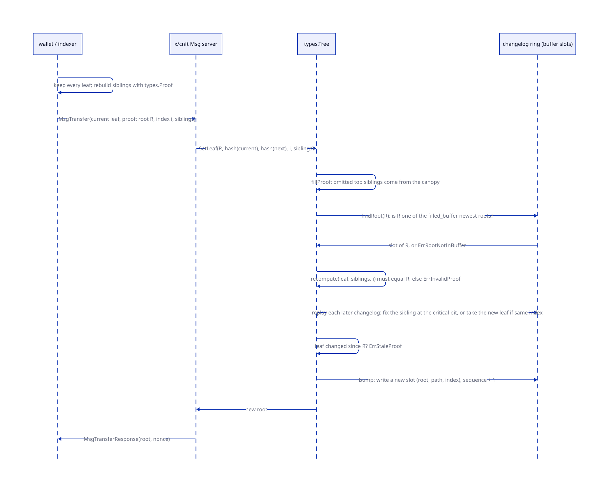
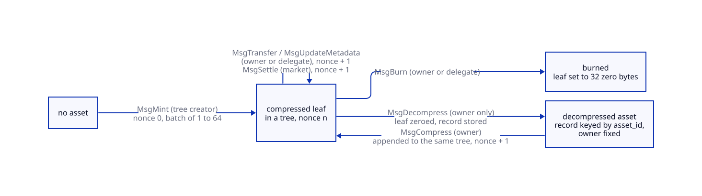
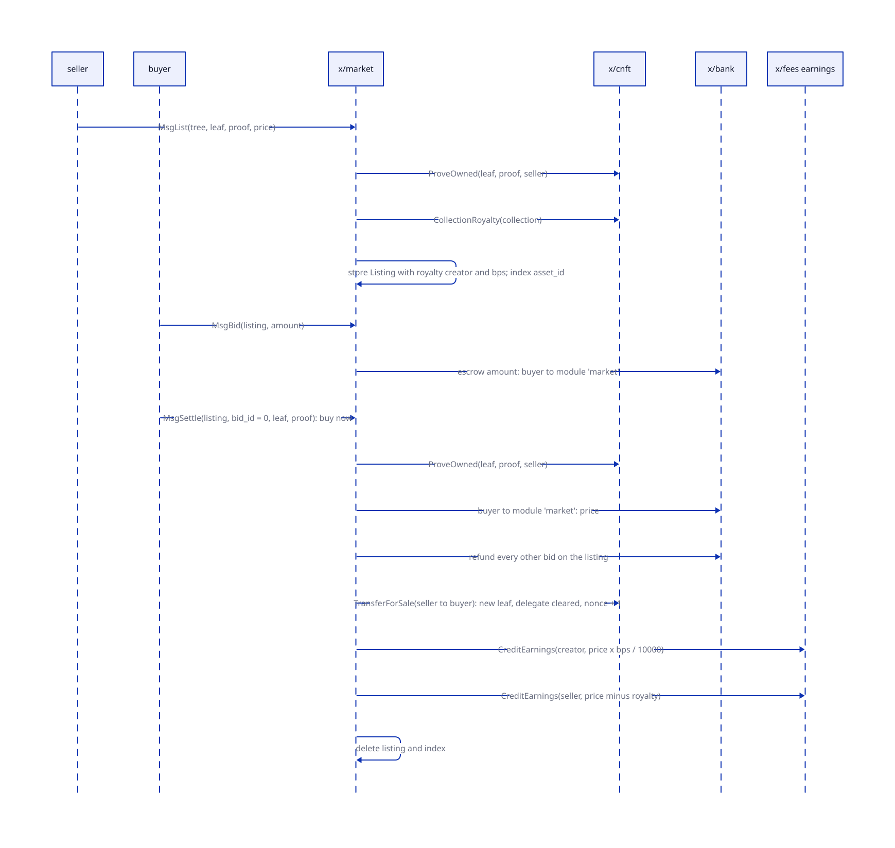

# NFTs and the market

> **At a glance.**
>
> - **What:** `x/cnft` is the chain's NFT module, built on compressed trees: an asset is a 32-byte leaf hash in a concurrent Merkle tree, and the chain stores only the tree (its root, a ring of recent changelogs, the rightmost path and an optional canopy), never the assets. Holders prove their leaf with a Merkle proof in every transaction that changes it. An asset can be decompressed into a full state record and compressed back. `x/market` is a small marketplace over it: fixed-price listings, escrowed bids, buy now, and settlement that splits the price into a creator royalty and the seller's share, both credited to earnings accounts so that sale proceeds never become public balances.
> - **Key numbers:** tree depth 1 to 30 (up to 2^30 leaves), changelog buffer 1 to 2,048 roots, canopy up to 14 levels; mint batch at most 64 leaves; metadata CID at most 128 bytes; collection name at most 64 bytes; royalty at most 10,000 basis points; tree deposit 1 norama per byte of modelled tree state (264 norama for depth 1, 31,588 for depth 14 with a buffer of 64, 3,089,444 for the largest shape); `verify_proof` query 20,000 gas plus 3,000 per sibling; at most 1,000 snapshot records per query.
> - **Code:** `chain/x/cnft/`, `chain/x/market/`; the off-chain asset index in `chain/indexer/`; contract access in `chain/x/wasmbindings/`.
> - **Depends on:** [governance and contracts](44-governance-and-contracts.md) for the contract bindings that reach both modules, [the shielded pool](43-the-shielded-pool.md) for what an earnings balance can become, [chain architecture](39-chain-architecture.md) for the module set and the norama send rule, [economics](40-economics.md) for earnings and deposits, [archive and indexer](42-archive-and-indexer.md) for the index that serves leaves.

## Why it exists

An NFT collection of a million items is a million records. On a chain that every validator replays and stores, a million records is a million state writes that the creator pays for once and every node carries for ever. The compressed design puts the million items in the chain's *transaction history* and keeps one small tree in *state*: the tree's size is fixed when it is created, whatever the number of leaves. The price is that the chain no longer knows who owns what. The holder knows, and shows it with a proof.

Three constraints shaped the code.

- **State must not grow with the collection.** A tree's stored size is a function of its shape (depth, buffer, canopy) only. A mint changes the root and one changelog slot, not the number of rows.
- **Many writers must be able to act in one block.** In a Merkle tree every update changes the root, so a proof built against yesterday's root is wrong by the time a second transaction in the same block uses it. A ring of recent roots lets the chain fast-forward an older proof across the updates since, as long as those updates touched other leaves.
- **The money must stay private.** A sale on a public chain would publish buyer, seller, price and the creator's income as bank transfers. Here the buyer pays from a bank balance (a bid is a public escrow), and the seller and the creator are paid into earnings accounts, which cannot be sent to a user and can only be spent in ways the chain lists, shielding among them ([the shielded pool](43-the-shielded-pool.md)).

Neither module has an authority address, a pause or a parameter. Everything is controlled by creators and owners (`chain/x/cnft/keeper/keeper.go`, comment on `Keeper`).

## The model

**Collection.** An id, a creator, a name and `royalty_bps`. Fixed at creation: no message changes a collection.

**Tree.** A concurrent Merkle tree of depth d, owned by the collection's creator and bound to one collection. It holds: the active root, a ring of `buffer_size` changelogs, the *rightmost proof* (the path needed to append the next leaf), a canopy of cached upper nodes, a sequence number, and the id of the deposit that pays for it.

**Leaf.** The state of one asset: `asset_id` (32 bytes), `owner`, an optional `delegate`, `metadata_cid`, `creator_hash`, `nonce` and `hash_id`. The tree stores only its SHA-256.

**Asset id.** Chosen by the creator at mint, 32 bytes. Not unique across compressed leaves; unique among decompressed assets.

**Changelog.** One entry per tree update: the new root, the path of new nodes from the changed leaf to the root, and the leaf index.

**Anchor.** The root a proof is built against. It must be one of the `filled_buffer` newest roots in the ring.

**Canopy.** The top `canopy_depth` levels of the tree, cached, so that a proof may omit that many top siblings.

**Delegate.** An account that may transfer, burn or update a leaf besides its owner. A market sale clears it.

**Decompressed asset.** A full record in state keyed by asset id, produced from a leaf by `MsgDecompress`.

**Snapshot.** A record that ties a tree sequence number to a CID where a client has stored a copy of the tree's leaves. The chain stores the CID, not the data.

**Listing, bid.** A seller's offer of one leaf at a fixed price, and a buyer's escrowed offer on a listing.

**Earnings.** An account balance in `x/fees` that pays fees and a fixed set of spends, and cannot be sent as a public balance.

## How it works

### The leaf and the tree

`EncodeLeaf` fixes the leaf's bytes: the five byte fields (`asset_id`, `owner`, `delegate`, `metadata_cid`, `creator_hash`), each as a big-endian u32 length followed by the bytes, then the nonce as a big-endian u64 and `hash_id` as a big-endian u32. An empty delegate is a zero length, not a missing field. The leaf hash is `SHA-256(EncodeLeaf)`. Owner and delegate are the raw 20-byte account bytes, not bech32. `hash_id` sits inside the encoding so that a later hash function can be told apart without reinterpreting old leaves; only `1` (SHA-256) exists (`chain/x/cnft/types/leaf.go:EncodeLeaf`).

`creator_hash` is the SHA-256 of the *collection* creator's account bytes, written at mint. It lets anyone who holds a leaf verify who minted it without a lookup, and it does not change on transfer.

A node of the tree is `SHA-256(left || right)`. The value of an empty leaf is 32 zero bytes, and the value of an empty subtree of height h is the hash of two empty subtrees of height h minus 1 (`chain/x/cnft/types/merkle.go:emptyNode`). A new tree has one buffered root, the root of the all-empty tree, and a rightmost index of 0.

### Creating collections and trees

`MsgCreateCollection` records the creator, name (1 to 64 bytes) and royalty (0 to 10,000 basis points). `MsgCreateTree` checks that the signer created the collection, validates the shape (`ValidateTreeShape`) and locks a deposit before it creates the tree:

- depth 1 to 30 (30 is the limit because the changelog update isolates the critical bit inside a u32);
- buffer 1 to 2,048, not required to be a power of two;
- canopy at most 14 and strictly below the depth, so leaves themselves are never cached.

The deposit is one norama per byte of a model of the tree's state (`chain/x/cnft/types/deposit.go:TreeStateBytes`): a 128-byte header, one changelog slot per buffer entry at `32 + 32 x depth + 4` bytes, the rightmost path at the same size, and `2^(canopy+1) - 2` canopy nodes at 32 bytes. The comment says the model is not a measurement of the protobuf encoding. A deposit is `x/fees` deposit `cnft/tree/<id>` (`LockDeposit`); `x/cnft` never releases it and has no message that deletes a tree. The deposits are small: 31,588 norama for depth 14 with buffer 64, and 109,540 for depth 20 with buffer 64 and canopy 10.

### Minting

`MsgMint` is signed by the tree's creator. It carries an anchor root and 1 to 64 leaves, each with `asset_id`, `owner`, optional `delegate` and `metadata_cid`. For each leaf the keeper refuses an asset id that is already decompressed, builds the leaf with nonce 0, the collection creator's hash and `hash_id` 1, and hashes it. Then `AppendBatch` checks the anchor *once* against the ring and appends every leaf at the on-chain rightmost index (`chain/x/cnft/keeper/msg_server.go:mint`). The response returns the leaf indices and the new root. The anchor may be any buffered root, not the active one, which is why two mints in one block both succeed (`TestTwoMintsInOneBlock_keepIntermediateRoot`).

An append updates only the rightmost path: for index i with `t` trailing zero bits, levels below `t` pair with empty subtrees, level `t` pairs with the previous rightmost node, and levels above take the stored sibling. This is why the chain can append with no proof from the minter, only an anchor. An empty or all-zero leaf cannot be appended, and a full tree refuses.

### Proofs, the ring and stale proofs

A state change on a leaf is `SetLeaf(anchor, previous, next, index, siblings)` (`chain/x/cnft/types/merkle.go:SetLeaf`):

1. The index must be below the rightmost index: only minted positions can be changed.
2. `fillProof` completes the proof. A proof may omit the top `canopy_depth` siblings, which are read from the canopy; this is allowed only against the current root, and a proof against an older root must be full length.
3. `prepareProof` finds the anchor in the ring (`ErrRootNotInBuffer` if not), recomputes the root from the previous leaf hash and the siblings, and requires it to equal the anchor (`ErrInvalidProof`).
4. It then replays every changelog written after the anchor. For each one it fixes the sibling at the critical bit of `index XOR changelog.index`, which is the one node of the proof that the other update can have changed. If the other update was at the *same* index, the leaf has moved on and the result is `ErrStaleProof`.
5. The fast-forwarded proof must hash to the *current* root, or the proof is invalid.
6. The ring advances one slot, writes the new root, the path of new nodes and the index, and the sequence number increases. The canopy and the rightmost record are updated.

`Prove` (read only) is the same minus the write; `x/market` and the contract query `verify_proof` use it. A proof stays usable while fewer than `buffer_size` updates have been made since its anchor and none of them touched its leaf. After that a holder rebuilds the proof from the current tree; everything needed is public.

Sizing the buffer is the creator's choice: a buffer of b allows b concurrent updates between a wallet building a proof and the chain executing it, and costs 32 x (depth + 1) + 4 bytes of deposit per slot.

### Transfers, burns, metadata

`MsgTransfer`, `MsgBurn` and `MsgUpdateMetadata` each carry the *current leaf* and a proof, and are signed by the leaf's owner or its delegate (`signerCanWrite`). The chain hashes the supplied leaf, so a signer cannot lie about it: a wrong leaf hashes to a different value and `recompute` fails.

- *Transfer* replaces the owner and delegate and increases the nonce by one. A transfer that changes neither is refused in `ValidateBasic`. A transfer pays no royalty; only a market sale does, and a test shows a transfer credits no earnings (`TestMsgTransfer_doesNotCreditEarnings`).
- *UpdateMetadata* replaces the CID and increases the nonce.
- *Burn* sets the leaf to 32 zero bytes. The slot is not reusable: appends go only to the rightmost position.

Nonces make every change a different leaf, so an old proof of an old state can never be replayed against a newer one (`advance` refuses an overflow of the u64).

### Decompression

`MsgDecompress` is signed by the leaf's owner (`ValidateBasic` requires the signer to equal `current.owner`; a delegate cannot decompress). It refuses an asset id that is already decompressed, zeroes the leaf in the tree, and stores a `DecompressedAsset` keyed by asset id with the leaf's fields, the tree id, the leaf index and the collection. `MsgCompress` takes the asset id and an anchor, requires the signer to be the stored owner, builds the leaf with nonce plus one, appends it to the same tree and removes the record. If the tree is full the compress fails and the asset stays decompressed.

A decompressed asset is queryable (`/orama/cnft/v1/decompressed`) and can be an ordinary state record for an application that wants to read ownership without a proof. The module has no transfer message for it: it cannot move until it is compressed again. While an asset id is decompressed, `MsgMint` refuses to mint that id again.

### Snapshots

`MsgRecordSnapshot` is signed by the tree's creator and stores `(tree id, sequence, CID)`. The CID points at a copy of the tree's leaves that a client or indexer keeps in IPFS; the chain does not verify it or fetch it (`TestRecordSnapshot_storesCIDWithoutStorage`). A snapshot lets a new indexer start from a known sequence number instead of replaying the whole history. `Snapshots` returns at most 1,000 records, oldest first.

### Rebuilding a tree from history

The chain keeps no leaf data, and neither module emits events. The data is in the transactions: every state change carries the current leaf in its message and the new nonce in its response. `chain/indexer` folds each successful transaction of the cnft and market message types into an asset index (`chain/indexer/cnft.go`), which serves `/cnft/assets/...` and `/cnft/owners/<owner>/assets`. `types.Proof(leaves, index, depth)` rebuilds a proof and root from an ordered leaf list, and a test rebuilds a tree from transaction bodies and compares roots (`TestRebuildTreeFromTxBodies`). A wallet that stores its own leaf and refreshes its proof from an indexer needs no trust in the indexer: the chain verifies the proof.

### Listing

`MsgList` is signed by the seller. The seller supplies the leaf and a proof; `ProveOwned` checks that the leaf's owner is the seller and that the proof verifies against the tree (a delegate cannot list). The listing records the seller, tree id, leaf index, asset id, price, and a *copy* of the collection's creator and royalty (`RoyaltyCreator`, `RoyaltyBps`). One asset has one open listing at a time (`AssetListing`, keyed by asset id). The price must be positive.

A listing is not an escrow. The leaf stays where it is and the seller may still transfer, burn or decompress it; the listing then fails to settle, since `ProveOwned` no longer holds for the seller (below).

### Bids

`MsgBid` escrows the bidder's norama in the `market` module account and records `(listing id, bid id, bidder, amount)`. This is a public bank balance movement: the amount of every bid is visible. The seller cannot bid on their own listing. There is no minimum amount beyond positive, no expiry and no limit on the number of bids per listing. `MsgCancelBid` refunds the bidder and removes the bid. `MsgCancelListing` refunds every bid of the listing and removes the listing.

### Settlement

`MsgSettle` has two modes, chosen by `bid_id`:

- **Buy now** (`bid_id` 0). The signer is the buyer. They may not be the seller, must hold the listing price in their bank balance, and the price is taken from them into the `market` account.
- **Accept a bid** (`bid_id` above 0). Only the seller can sign. The bid's escrowed amount is the price and the bidder is the buyer.

The leaf and proof in the message must match the listing's index and asset id and prove that the *seller still owns the leaf* (`ProveOwned`). Then, in order (`chain/x/market/keeper/msg_server.go:settle`): `SplitSale` divides the price into `royalty = price x royalty_bps / 10,000` (rounded down) and the seller's remainder, which sum to the price; the buyer's payment is taken, or the winning bid consumed; every other bid on the listing is refunded; `TransferForSale` moves the leaf to the buyer (owner set to the buyer, delegate cleared, nonce plus one) with no further payment; `CreditEarnings` credits the royalty to the collection creator and the remainder to the seller from the `market` module; the listing is deleted. The whole message is one transaction, so a failure at any step leaves no partial state. The response reports price, royalty and seller proceeds.

The royalty applies to market sales only. A creator who is also the seller receives both parts.

### Contracts

A contract reaches both modules through the bindings in [governance and contracts](44-governance-and-contracts.md#bindings): `cnft` variants `create_collection`, `create_tree` and `mint`, and `market` variants `list`, `cancel_listing`, `bid`, `cancel_bid` and `settle`. The contract is the creator, seller, bidder or settler. Two queries, `cnft.tree` and `cnft.verify_proof`, and `market.listing`, are available to contracts (`chain/x/wasmbindings/query.go`). `verify_proof` charges 20,000 gas plus 3,000 per sibling and answers `valid: false` with a reason for a proof that does not verify.

## State it owns

| State | Holds | Written by | Read by | Where |
|---|---|---|---|---|
| `NextCollectionID`, `NextTreeID` | id sequences, both starting at 1 | create messages | create messages | `cnft` store, prefixes 0 and 1 |
| `Collections` | creator, name, royalty | `MsgCreateCollection` | trees, mint, market | prefix 2 |
| `Trees` | root, changelog ring, rightmost path, canopy, sequence, deposit id | create, mint, transfer, burn, update, decompress, compress | proofs, market, queries | prefix 3 |
| `Decompressed` | full asset records by asset id | `MsgDecompress`, removed by `MsgCompress` | mint, compress, queries | prefix 4 |
| `Snapshots`, `NextSnapshot` | (tree, id) to CID and sequence; per-tree counter | `MsgRecordSnapshot` | queries | prefixes 5 and 6 |
| `x/fees` deposit `cnft/tree/<id>` | the tree's locked norama | `LockDeposit` at tree creation | nobody releases it | `x/fees` |
| `NextListingID`, `NextBidID` | id sequences | list, bid | list, bid | `market` store, prefixes 0 and 1 |
| `Listings` | listing with seller, price, royalty snapshot | `MsgList`, deleted by cancel and settle | bid, settle, queries | prefix 2 |
| `Bids` | (listing, bid) to bidder and amount | `MsgBid`, removed by cancel, settle | settle, refund, invariants | prefix 3 |
| `AssetListing` | asset id to its open listing id | list, delete | list | prefix 4 |
| module account `market` | the sum of open bids, plus the price in the middle of a settle | bank | invariant | `x/bank` |

Queries: cnft `Collection`, `Tree`, `Decompressed`, `Snapshots` at `/orama/cnft/v1/collection/{id}`, `/tree/{id}`, `/decompressed`, `/snapshots/{tree_id}`; market `Listing`, `Bid`, `Invariants` at `/orama/market/v1/listing/{id}`, `/bid/{listing_id}/{bid_id}`, `/invariants`. There is no query that lists listings or bids; the index does that off chain. The market invariant is that its module account holds exactly the sum of open bids, since a sale pays out in the same message that takes the payment (`chain/x/market/keeper/invariants.go:CheckInvariants`). `x/cnft` has no invariants query.

## Lifecycle

**Genesis.** Both modules start empty, ids at 1. Genesis export and import round-trip collections, trees with their rings and canopies, decompressed assets and snapshots, and `Validate` checks each tree's shape against its collection.

**Normal operation.** There is no begin or end blocker in either module. All work happens in messages.

**Rolling upgrade.** Neither module has a migration (consensus version 1). The leaf encoding, the node hash and the changelog replay are consensus rules; a change to any is state-breaking and rides a governed chain upgrade ([global nodes](37-global-nodes.md#cosmovisor-staging)). `hash_id` is the reserved path for a different leaf hash.

**Restart and node loss.** All state is in the store. A new node replays blocks; nothing depends on an off-chain index. An indexer that loses its database rebuilds it from blocks, or from a snapshot CID plus the blocks after its sequence.

**Tree exhaustion.** A tree of depth d takes 2^d mints. When it is full, `AppendBatch` fails with "tree is full" and the creator makes a new tree in the same collection. Burned positions are not reused.

## Failure modes

| Trigger | What the system does | What you observe |
|---|---|---|
| Proof against a root older than the ring | `ErrRootNotInBuffer` | the wallet rebuilds the proof from the current tree |
| Proof of a leaf that another update changed since the anchor | `ErrStaleProof` | the wallet refreshes the leaf from the index |
| Proof that does not hash to its anchor | `ErrInvalidProof` | the transaction fails |
| Wrong current leaf supplied | the supplied leaf hashes differently, so the proof fails | `ErrInvalidProof` |
| Signer is neither owner nor delegate | "signer is not the owner or delegate" | the transaction fails |
| Mint into a full tree | "tree is full" | create a new tree |
| Mint of a decompressed asset id | "asset is already decompressed" | the batch fails whole |
| Not enough balance for the tree deposit | `LockDeposit` fails | no tree is created and no id is consumed |
| Bid with insufficient balance | the escrow send fails | no bid stored |
| Settle with a leaf that no longer belongs to the seller | `ProveOwned` fails | the sale does not happen; the escrowed bids stay |
| List an asset with an open listing | "asset is already listed" | cancel first; only the listing's seller can |
| Buy now with a balance below the price | refused up front | no payment taken |
| Nonce at its maximum | "nonce overflow" | the leaf can no longer change |
| Clock skew, disk full, partition | no effect on the logic: no module reads the clock; disk exhaustion is the node's | none specific to the module |

## Trust and security

**Ownership is a hash.** Whoever supplies a leaf and a proof that hash to a buffered root and are signed by the leaf's owner or delegate controls the asset. The chain never trusts the supplied leaf, only its hash, and the signer must match the owner inside it.

**Creator powers.** A tree's creator decides what is minted and to whom and can mint into any collection tree they created. They cannot change a minted leaf's owner. They cannot change the royalty. They cannot delete the tree. A creator can mint two leaves with the same asset id (the module only refuses an id that is already decompressed), so an asset id identifies an asset only within one tree and one creator's care. A buyer who relies on the id should also check the tree and `creator_hash`.

**Delegates.** A delegate can transfer, burn and update the metadata of a leaf. It cannot list it on the market or decompress it. A sale clears the delegate.

**Market.** A seller cannot take a bid without delivering the leaf: the transfer is in the same message as the payment and fails the whole transaction otherwise. A bidder cannot be charged more than the amount escrowed. The royalty is read at listing time from the collection and stored, and since no message changes a collection, a listing cannot be affected by later edits. The royalty is avoidable: a plain `MsgTransfer` pays nothing, so a buyer and seller can trade off market. The module does not prevent it.

**Privacy.** Bids and buy-now payments are public bank balances. Proceeds are credited to earnings, not the seller's bank balance. A buyer's balance, the price and the parties of a sale are visible in the message; what is hidden is only what the seller and the creator can later do with their earnings.

**Contracts.** A contract can be a seller or bidder like any account, with the same rules, and bids from a contract come from its bank balance.

## Limits and scale

| Resource | Bound | Source |
|---|---|---|
| Leaves per tree | 2^depth, depth at most 30 | `MaxDepth` |
| Concurrent updates between proof and execution | `buffer_size`, at most 2,048 | `MaxBuffer` |
| Proof size | depth siblings of 32 bytes; fewer by the canopy depth against the current root | `fillProof` |
| Mint batch | 64 leaves | `MaxMintBatch` |
| Tree state | 128 + (buffer + 1) x (36 + 32 x depth) + (2^(canopy+1) - 2) x 32 bytes | `TreeStateBytes` |
| Snapshot query | 1,000 records | `MaxSnapshotsPerQuery` |
| Bids per listing | none | |

A tree's state is constant (about 3 MB for the largest shape), whatever its leaf count, and an update costs one proof verification of depth hashes plus one replay of at most `buffer_size` changelogs, in the worst case, which is the dominant cost: a tree with a deep buffer under heavy contention makes each transaction replay more. At 10x the load the first bottleneck is therefore the buffer on a hot tree: updates beyond the buffer's depth between a wallet's read and the chain's execute fail with `ErrRootNotInBuffer`, and the wallet retries with a fresh proof. The second is the number of bids on one listing, which is unbounded, and a cancel or a settle of that listing refunds every one of them inside one transaction. A listing that has attracted many one-norama bids can become too expensive to cancel or settle within a block's gas limit. Each such bid costs its sender the transaction fee and a norama of escrow, which is returned.

The marketplace has no listing index on chain: a client that wants "all listings in a collection" reads the indexer, which sees every message.

## Design decisions

### Compression: state holds roots, history holds assets

*Chosen:* a concurrent Merkle tree per creator-chosen shape, with leaf data in transactions. *Rejected:* one state record per asset. *Why:* state size is fixed at tree creation. The cost is that the holder (or an indexer) must keep the leaf, and the chain cannot answer "who owns asset X" without help.

### A ring of roots instead of locking

*Chosen:* a changelog ring and proof replay by critical bit. *Rejected:* requiring a proof against the current root only. *Why:* every update changes the root, so under any concurrency exactly one transaction per block could succeed against a tree. The ring makes the failure rate a tunable (the buffer size) that the creator pays for in deposit.

### Append needs no proof

*Chosen:* the tree keeps the rightmost path, so a mint carries only an anchor. *Why:* a minter appending a batch must not have to know the siblings of an empty position, and the append is determined by the stored path. The anchor check is only that the minter is looking at a recent tree.

### Creator hash in the leaf

*Chosen:* the leaf carries `SHA-256(collection creator)`. *Why:* a leaf is verifiable as to its minter without reading the tree record, and the value survives every transfer.

### Settlement credits earnings

*Chosen:* the seller and the creator are paid through `CreditEarnings`. *Rejected:* a bank payout. *Why:* a bank payout would publish the payee's new balance; norama cannot move user to user in the open ([the shielded pool](43-the-shielded-pool.md)), and the earnings account is the destination the rest of the chain uses for income.

### No royalty on a plain transfer

*Chosen:* the royalty is a market rule. *Why:* a transfer is not always a sale (gift, wallet move, custody). The comment on `transfer` says so. The consequence is that the royalty can be avoided by trading off market.

### Deposits that are never released

*Chosen:* a one-way tree deposit priced by the byte, with no delete message. *Why:* a tree is cheap (a few thousand norama), and deleting one would need a rule for every outstanding leaf and every listing against it.

## Known gaps

- **Unbounded bids per listing.** Nothing caps or prices the number of bids, and cancel and settle refund them all in one transaction, so a listing can be made too expensive to cancel or settle. `chain/x/market/keeper/msg_server.go:refundListingBids`.
- **Stale listings.** If the seller transfers or burns a listed leaf, the listing remains, blocks relisting of the asset id (only the old seller can cancel it) and keeps its bids escrowed until the seller cancels or each bidder cancels. There is no expiry. `chain/x/market/keeper/msg_server.go:list`.
- **Bids do not expire.** An escrowed bid stays until its bidder cancels it. `chain/x/market/keeper/msg_server.go:bid`.
- **Royalties are optional in practice.** A plain `MsgTransfer` bypasses them. `chain/x/cnft/keeper/msg_server.go:transfer`.
- **Asset ids are not unique across compressed leaves.** The creator chooses them and the module checks only against decompressed assets; the market's one-listing-per-asset index is keyed by id alone, so two leaves with one id share a listing slot. `chain/x/cnft/keeper/msg_server.go:mint`.
- **Tree deposits are never released and trees cannot be deleted.** `chain/x/cnft/types/expected_keepers.go:FeesKeeper`.
- **Decompressed assets have no transfer.** The only exit is `MsgCompress`, signed by the owner. `chain/x/cnft/keeper/msg_server.go:decompress`.
- **No events.** Neither module emits events; clients depend on transaction bodies and the indexer. `chain/indexer/cnft.go`.
- **No on-chain listing or bid enumeration.** Only point queries exist. `chain/x/market/keeper/grpc_query.go`.
- **No cnft invariants query.** Only the market module can be checked from outside the keeper. `chain/x/market/keeper/invariants.go:CheckInvariants`.
- **The fleet e2e cannot run the paid paths.** Bids, buy now and royalty payout need a funded bank balance, which the fleet's chain does not provide; those are covered by keeper tests. `e2e/features/chain-assets/feature.yaml`.

## Verify it yourself

**Unit tests** (all in `make test`):

- `chain/x/cnft/types/`: `TestEncodeLeaf_canonicalOrder`, `TestEncodeLeaf_everyFieldChangesTheEncoding`, `TestTreeDeposit_isDepthBufferAndCanopy`, `TestAppend_matchesFullRoot`, `TestTwoAppends_keepTheAnchorRoot`, `TestProof_fastForwardAndStale`, `TestProof_olderThanBufferFails`, `TestCanopy_shortProofMatchesCurrentRoot`, `TestMerkleProof_1024Leaves`, `TestMerkleBenchmark_1MLeaves`.
- `chain/x/cnft/keeper/`: `TestCreateTree_locksDeposit`, `TestTwoMintsInOneBlock_keepIntermediateRoot`, `TestStaleProofAndRootOlderThanBuffer`, `TestMsgTransfer_doesNotCreditEarnings`, `TestDecompressCompressRoundTrip`, `TestRebuildTreeFromTxBodies`, `TestRecordSnapshot_storesCIDWithoutStorage`, `TestSnapshotsQuery_isBounded`.
- `chain/x/market/`: `TestSplitSale_500BpsOf10000`, `TestSettle_paysEarningsNotBank`, `TestSettle_acceptsBidFromEscrow`.
- `chain/indexer/`: `TestFollower_cnftLifecycle`, `TestFollower_marketSettleMovesTheLeafToTheBidder`.
- `chain/app/`: `TestWalletFlow_mintTransferListAndBuyACompressedNFT`, `TestWalletFlow_transferACompressedNFTToAnotherWallet`, `TestBindings_cnftMintAndProofVerification`, `TestBindings_marketListBidCancelAndSettle`.

**Fleet e2e** (the owner runs the fleet suite): `e2e/features/chain-assets/` runs a client-side tree on the live chain: collection, tree deposit, mint, transfer between validators, metadata update, decompress and compress, burn, snapshot, every proof and shape refusal, and the market's list, relist refusal, self-bid, self-buy and cancel rules.

**Read-only on the chain:**

- `orama chain query orama.cnft.v1.Query/Tree` with a tree id prints the shape, the active root, the sequence and the buffered roots; `Collection` prints the creator and royalty; `Decompressed` takes an asset id; `Snapshots` takes a tree id.
- `orama chain query orama.market.v1.Query/Listing` and `Bid` print one listing or bid; `Invariants` reports whether the `market` account equals the open bids.
- REST: `/orama/cnft/v1/tree/<id>` and `/orama/market/v1/invariants` on the node's API port. The indexer's `/cnft/owners/<owner>/assets` lists an owner's assets.
