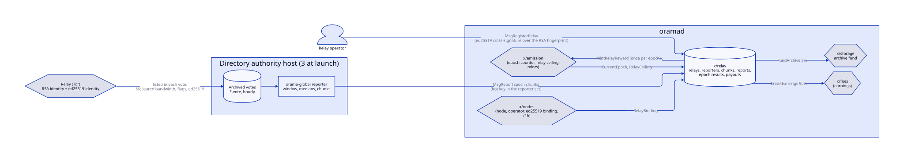
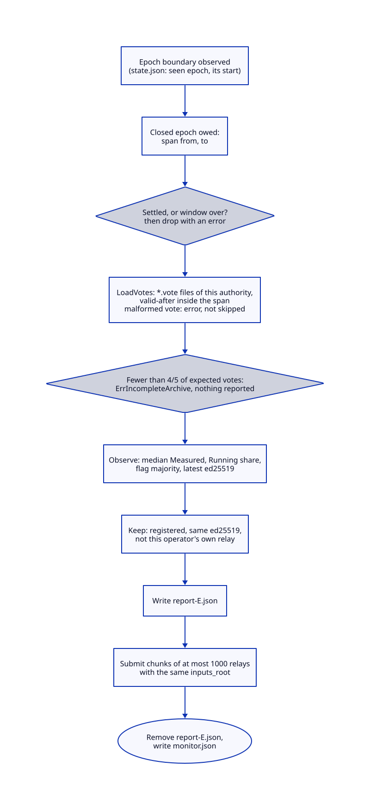
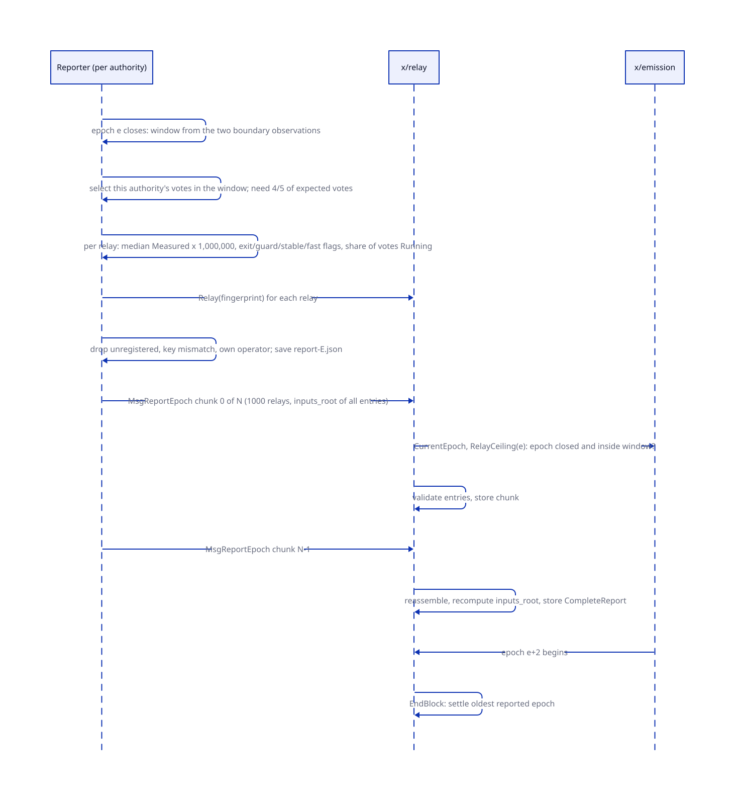
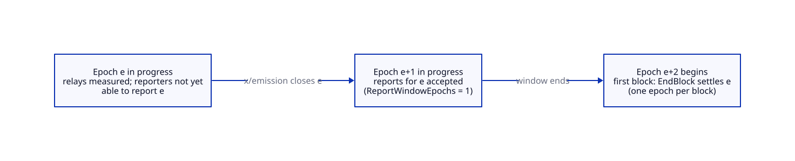
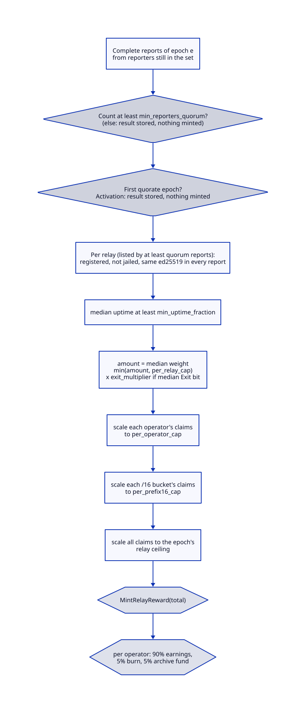

# Relay rewards

> **At a glance.**
>
> - **What:** the 10 percent of emission set aside for relays. Each relay is registered on chain under its Tor identity. Each directory authority runs a reporter that turns its archived votes into a per-relay report of measured bandwidth, uptime and exit status for every closed epoch. x/relay takes the median of the reports, applies a per-relay, per-operator and per-`/16` cap, scales the total to that epoch's relay ceiling, mints it through x/emission and pays each operator through the 90, 5, 5 service split. Nobody sends a message to be paid; settlement happens in a block's end step.
> - **Key numbers:** quorum 3 reporters (genesis default, equal to the three initial authorities); relay pays only at median uptime of at least 0.9; exit multiplier 2; caps per relay 100 ORAMA, per operator 200 ORAMA, per `/16` 200 ORAMA per epoch; one weight unit is 1,000,000 norama of a measured bandwidth unit; report window 1 epoch; at most 4,096 relays per chunk, 32 chunks, 128 reporters; the reporter's default chunk is 1,000 relays and its pass interval 5 minutes.
> - **Code:** `chain/x/relay/`, `chain/reporter/`; the command `chain/cmd/orama-global/reporter.go`; the wiring `chain/app/relay_view.go` and `chain/app/enactment.go`.
> - **Depends on:** [anonymity and Tor](38-anonymity-and-tor.md) for the authorities, their votes and the archive; [economics](40-economics.md) for the epoch, the relay ceiling and the earnings accounts; [storage deals](41-storage-deals.md) for the archive fund and the service split; [global nodes](37-global-nodes.md) for the node record and its ed25519 binding.

## Why it exists

The Orama Tor network needs relays, and relays cost bandwidth. The chain can pay for them only if it can learn how much each carried, and a transaction cannot measure bandwidth. The measurement therefore happens outside the chain, in the Tor directory authorities that already vote on every relay, and the chain's job is to turn several authorities' measurements into one payment without letting any one of them decide it.

Four constraints shape the design.

- **No one measurer is trusted.** A relay's pay is a median across independent reporters, so one lying or broken reporter cannot move it.
- **A relay must not pay itself.** A reporter may not be a relay operator, a relay's identity must be cross-signed by the key the node registered, and the honest reporter leaves out relays of its own operator.
- **The mint is bounded by the epoch.** x/emission is the only module that mints, and only up to the epoch's relay ceiling. A relay's weight is a claim; the ceiling is the budget.
- **An idle or broken epoch must cost nothing and halt nothing.** Without enough reports the epoch mints nothing and the chain moves on; with a report in progress at the window's end, it is dropped rather than left to block the epochs after it.

## The model

**Relay.** A registered Tor relay: the node id, the RSA identity fingerprint (the 20-byte SHA-1 of the relay's RSA identity), the ed25519 identity public key, the operator account, the `/16` bucket and the exit declaration (`Relay` in `chain/proto/orama/relay/v1/relay.proto`). The fingerprint is the key.

**Cross-certificate.** The ed25519 identity's signature over the string `orama/relay/rsa-cross-cert/v1`, a zero byte, the node id, a zero byte, and the RSA fingerprint (`CrossCertMessage` in `chain/x/relay/types/crosscert.go`). It binds the Tor identity to the node and to the operator who owns it.

**Reporter.** An address in x/relay's reporter set. At genesis it holds the authorities' reporter keys; afterwards the set changes only through a passed governance proposal. A reporter is not an authority in any other sense.

**Observation.** One reporter's measurement of one relay for one epoch: fingerprint, ed25519 id, consensus weight (norama, before caps), flags, uptime fraction (`RelayObservation`).

**Chunk, report.** A report is split into chunks of up to 4,096 observations; each chunk is a `MsgReportEpoch` carrying the chunk index and count and the `inputs_root` of the whole report. When all chunks of one reporter for one epoch have arrived they are reassembled into a `CompleteReport`.

**Inputs root.** SHA-256 of a version byte (1) and the canonical encoding of every entry in order (`InputsRoot`). It binds the chunks of one report to each other.

**Report window.** Epoch e closes when the chain enters e+1; reports for e are accepted during e+1 only; e settles in the first block of e+2 (`ReportWindowEpochs`, a constant).

**Quorum.** `min_reporters_quorum` reports are needed for an epoch to pay anything, and the same number of reports must list a relay for it to be paid.

**Ceiling.** x/emission's relay ceiling for an epoch (10 percent of the epoch's emission in the default split). **Activation.** The first epoch that reaches quorum switches rewards on and mints nothing.

### Messages and queries

| Message | Signer | Effect |
|---|---|---|
| `MsgRegisterRelay` | the node's operator | records a relay after the cross-signature checks |
| `MsgReportEpoch` | a reporter | adds one chunk of a report |
| `MsgUpdateReporters` | no one | accepted only inside a passed structural proposal (below) |

Queries: `Params`, `Reporters`, `Relay` (by fingerprint hex), `EpochResult`, `Invariants`. There is no message that removes a relay, and no message that jails one. The module has no `MsgUpdateParams`: its six parameters are fixed at genesis (`chain/x/relay/types/params.go`).

## How it works

### Registration

`registerRelay` (`chain/x/relay/keeper/register.go`) checks, in order:

1. The node id is not empty and the fingerprint is 20 bytes.
2. The operator is not in the reporter set (`ErrReporterOperatesRelay`).
3. x/nodes resolves the node (`RelayBinding`): its ed25519 key (the binding whose service is `relay`, else the first ed25519 binding), its operator, and its effective network (a canonical `A.B.0.0/16` derived from its literal-IP endpoints, or empty when it has none or its identity is still inside the network-identity lock). The message's operator must be the node's operator.
4. `VerifyCrossCert`: the ed25519 signature over the cross-certificate message verifies under the node's key (`ErrCrossCertMismatch` otherwise).
5. The `/16` bucket is derived from the network (`RelayPrefix16`): a relay with no identified network, or an IPv6 one, goes into one shared bucket named `unidentified`.
6. The fingerprint and the node must both be unregistered.

The record keeps a snapshot of the ed25519 key and the `/16`. Neither follows later changes in x/nodes. Registration does not check or lock a bond: the code says bond locking belongs to x/nodes, and the module does not import it. A relay is a registration plus a signature, and the exit flag it declares is advisory (pay uses the reporters' median).

### The reporter

`orama-global reporter` (`chain/cmd/orama-global/reporter.go`) runs on an authority host, in a home with `hot-key` (created on first start, mode 0600; its address must be in the reporter set and funded for fees), `operator`, `authority-id` (the 40-hex v3 identity from the `dir-source` line of the authority's votes, equal to the `v3_ident` in the Tor network file) and a `votes` directory the archive fills. It wakes every 5 minutes (`--interval`) and `Runner.Step` (`chain/reporter/runner.go`) does the following.

**Epoch spans.** The chain exposes only the start of the epoch in progress. The reporter keeps the epoch it last saw and its start in `state.json`; when the epoch number has advanced by one, the epoch that just ended is *due*, with the span between the two starts (BFT time). If it advanced by more than one, the spans in between are lost and are reported as `ErrEpochMissed`; the reporter carries on from the epoch now in progress. A chain whose epoch is behind the state is an error that tells the operator to remove `state.json` after a chain reset. The boundary is saved before any report is tried, so a failing report does not cost the next epoch its span.

**Closed epochs.** For each due epoch the reporter first asks the chain whether the epoch is settled or the window is over, and if so drops it with `ErrEpochSettled` or `ErrWindowClosed` and removes any saved report: nothing can still be sent.

**Observations** (`chain/reporter/observe.go`). `LoadVotes` reads `*.vote` regular files in the votes directory, parses the header of each, and fully parses only the votes of this authority whose `valid-after` is inside the span. A vote that does not parse is an error naming the file; a vote without its `directory-footer` is still being written and is refused; two different votes for one `valid-after` are an error, a byte-identical copy counts once. `Observe` then requires that the votes cover at least four fifths of the votes the span expects (span divided by the vote interval, hourly by default: 20 of 24 for a 24-hour epoch), else `ErrIncompleteArchive` and nothing is reported. For each relay in any of the votes:

- **Weight** is the median of the `Measured=` value on the `w` line over the votes that list the relay `Running` and measured it, times 1,000,000 (`NoramaPerWeight`) norama. The advertised `Bandwidth=` is never read, since a relay states it itself. A relay the authority did not measure weighs zero.
- **Uptime** is the share of all selected votes that list the relay `Running`.
- **Flags**: Exit (set when at least half of the votes that list it `Running` carry `Exit` and not `BadExit`), Guard, Stable, Fast (each at half or more of the votes). Only the Exit bit changes pay.
- **Ed25519 id** is the one in the latest vote that carries one; a relay with none cannot be reported.

**Narrowing** (`entries`). A relay is left out, and counted in `monitor.json`, when it has no ed25519 id, is not registered on chain, is registered to the reporter's own operator, or carries a different ed25519 id than the one registered. x/relay refuses a whole chunk that holds an unregistered relay or a wrong identity, so these are filtered first.

**Sending.** The chosen entries are written to `report-EPOCH.json` before the first chunk is sent, because the registry can change between passes and a chunk already on chain completes only with messages of the same `inputs_root`. `Messages` splits them into chunks of `--chunk-entries` (default 1,000, about 150 KB a transaction; up to 4,096) in a deterministic order, so resubmitting after a crash is a repeat. An empty report is one empty chunk. More than 32 chunks is an error. A rejected chunk is retried on the next pass with the same saved entries; when the last chunk is in, the saved report is removed and `monitor.json` records the epoch, chunk count and the counts left out.

### Taking a report

`reportEpoch` (`chain/x/relay/keeper/report.go`) validates a chunk before storing it:

1. The signer is in the reporter set.
2. The epoch is at least 1, is closed (`epoch` less than the current epoch), is within the window (`current - epoch` at most 1), has a relay ceiling, and is not settled.
3. Chunk count in 1 to 32, index below the count, `inputs_root` 32 bytes, at most 4,096 entries.
4. Each entry is well formed (20-byte fingerprint, 32-byte ed25519 id, weight in 0 to 2^62, uptime in 0 to 1), refers to a registered relay with the same ed25519 id, and appears once in the chunk.
5. If the reporter's complete report for the epoch exists, a repeat with the same root is accepted and returns complete; a different root is refused.
6. A chunk already stored at that index is accepted if identical and refused if different; its metadata must match the siblings'.
7. While chunks are missing it stores the chunk. When the last one arrives it sorts the chunks by index, rejects gaps and duplicate fingerprints across chunks, recomputes `InputsRoot` over the reassembled entries and compares it with the message's. A mismatch deletes the partial report so a corrected resubmission is not stuck behind a chunk that can no longer be replaced.

The complete report replaces the chunks. The bound on a whole report is 32 x 4,096 = 131,072 entries.

### Settlement

`EndBlock` (`chain/x/relay/keeper/abci.go`) runs before x/emission's end block, which reconciles the mint it makes. It finds the oldest epoch that has a stored report or chunk, and settles it when the current epoch is more than `ReportWindowEpochs` past it. At most one epoch settles per block, oldest first, and an epoch nobody reported on is never written. No message chooses when an epoch is paid.

`SettleEpoch` (`chain/x/relay/keeper/settle.go`):

1. A result already stored for the epoch is returned unchanged, so a repeat never mints twice.
2. Only complete reports from addresses still in the reporter set count. Fewer than `min_reporters_quorum`: a result with `quorum_met` false is stored and nothing is minted; rewards are not deactivated.
3. The first epoch to reach quorum activates rewards (`Activation`) and mints nothing. An epoch at or below the activation epoch mints nothing.
4. Otherwise `payEpoch` runs:
   - For each relay listed by at least quorum reports, in fingerprint order: skip it if it is not registered, is jailed, or any report carries an ed25519 id other than the registered one (a mismatch here is skipped, not an error, so a key change cannot abort the epoch); skip it if the median uptime is under `min_uptime_fraction` (0.9); take the median weight, capped at `per_relay_cap`; multiply by `exit_multiplier` (2) if the median Exit bit is set; skip it if the result is not positive.
   - Scale each operator's claims down pro rata to `per_operator_cap`, then each `/16` bucket's to `per_prefix16_cap`, then all claims to the epoch's ceiling (`scaleToCap`: pro rata, remainders to the largest fractional parts, the sum exactly the cap).
   - Mint the sum once through x/emission's `MintRelayReward`, which refuses an amount over the epoch's remaining ceiling.
   - Per operator, in order, pay the operator's total through the service split: the operator's share (the remainder after rounding) is credited to its earnings account through x/fees, 5 percent is burned from the relay module account, 5 percent moves to the archive fund (`payOperator`). The payout rows and the epoch's `minted` stay gross.
5. The result and the payouts are stored; the epoch's reports and chunks are deleted.

The medians are exact rules: for weights the middle value of an odd count and the floored average of the two middle values of an even count (formed as low plus half the difference so it cannot overflow); for uptime the same with decimal division; for Exit the lower median of the bit, so one dissenter among three does not set it.

### Who can change the reporter set

`MsgUpdateReporters` is accepted only when the context carries a flag, `AllowReporterChange`, which `chain/app/enactment.go:relayReporterEnactor` sets while executing a passed structural proposal of x/houses ([governance and contracts](44-governance-and-contracts.md)). The signer is the houses module account and is ignored beyond address validation. The new set may not be empty, is capped at 128, is canonicalised and de-duplicated, and may not name the operator of a registered relay (`ErrReporterOperatesRelay`). Registration refuses the converse. Genesis refuses a reporter that operates a relay.

### Jailing

`Keeper.JailRelay` marks a relay jailed so settlement pays it nothing. It is the only path, it is meant for a governance caller after bad-exit evidence, and it is not called from anywhere in the tree. There is no automatic slashing and no message that jails.

## State it owns

| State | Holds | Writer | Reader | Location |
|---|---|---|---|---|
| `Params` | the six parameters | genesis only | settlement | x/relay store |
| `Reporters` | the reporter addresses | genesis; `MsgUpdateReporters` under the flag | report, settlement, registration | x/relay store |
| `Relays` | one record per fingerprint | `MsgRegisterRelay`; `JailRelay` | reports, settlement | x/relay store |
| `NodeIndex` | node id to fingerprint | registration | registration | x/relay store |
| `Chunks` | in-flight chunks by (epoch, reporter, index) | `MsgReportEpoch` | reassembly, `EndBlock` | x/relay store |
| `Reports` | complete reports by (epoch, reporter) | reassembly | settlement | x/relay store |
| `Activation` | whether rewards are active and since which epoch | settlement | settlement | x/relay store |
| `EpochResults` | quorum, ceiling, minted per settled epoch | settlement | queries, reporters, invariants | x/relay store |
| `Payouts` | gross payout per (epoch, fingerprint) | settlement | queries, invariants | x/relay store |
| relay module account | the minted reward in transit | x/emission | settlement | x/bank |
| reporter `hot-key`, `operator`, `authority-id` | signer, operator, authority identity | operator | reporter | reporter home |
| reporter `votes/*.vote` | archived votes | whatever syncs the archive | reporter | reporter home |
| reporter `state.json`, `report-EPOCH.json`, `monitor.json` | epoch cursor and owed spans; the chosen entries; what the last pass included and left out | reporter | reporter, operator | reporter home |

## Lifecycle

**Genesis.** `DefaultGenesisState` starts with no reporters and rewards inactive; a production genesis writes the authorities' reporter set. The parameters are the placeholder defaults in `chain/x/relay/types/params.go` unless genesis overrides them; nothing can change them afterwards.

**Registering a relay.** The operator signs the cross-certificate with the relay's ed25519 identity and submits `MsgRegisterRelay`. No `orama` command builds this message or the signature; the tests in `e2e/features/chain-services/` do it by hand. `orama global tor info` prints the fingerprints that the message needs ([anonymity and Tor](38-anonymity-and-tor.md)).

**An epoch.** During e the authorities vote hourly and the votes are archived. When e closes, each reporter's next pass makes it due, narrows the votes, and sends chunks during e+1. In the first block of e+2 the end step settles e.

**Starting rewards.** The first epoch with a quorum of complete reports activates and pays nothing; payment begins with the next epoch that reaches quorum.

**Restart of a reporter.** `state.json` holds the epoch it last saw and the owed spans; `report-EPOCH.json` holds the entries chosen for an epoch in flight. A restart resumes and sends the same messages. A reporter that was down across more than one epoch boundary loses those spans.

**Installation.** `RenderGlobalReporterUnit` exists but nothing calls it: the reporter has no installer, nor does the sbws service that measures relay bandwidth. An operator wires them by hand (`core/pkg/install/global_units.go`).

**Rolling upgrade.** Settlement is part of oramad ([chain architecture](39-chain-architecture.md)); the reporter reads public queries and signs a message type that does not change between versions. The `inputs_root` encoding carries a version byte.

**Node loss.** A retired or unbonded node's relay stays registered and, if the votes still list it, still paid: settlement never asks x/nodes whether the node exists.

## Failure modes

| Trigger | What the system does | What you observe |
|---|---|---|
| Fewer than quorum complete reports | the epoch stores a result with `quorum_met` false and mints nothing; its ceiling is not minted | `EpochResult` with minted 0 |
| One reporter down (quorum 3 of 3) | no relay is paid for that epoch | the same; the reporter's `monitor.json` is stale |
| A reporter lies about one relay | the median of three ignores one outlier (`TestMedianOfThreeIgnoresHundredXLiar`) | the relay is paid the honest median |
| Two reporters collude | they set the median | not detectable on chain |
| A report is late | refused with `ErrReportWindow`; the reporter drops the epoch | reporter error "report window of the epoch has closed" |
| A report is half sent at the end of the window | the partial report is dropped at settlement so later epochs are not held back | no payout from that reporter for that epoch |
| A chunk names an unregistered relay or a wrong ed25519 id | the whole chunk is refused | transaction error; the honest reporter filters first |
| Reassembled root differs from `inputs_root` | the partial report is deleted | transaction error; resend |
| Votes archive holds under four fifths of the epoch's votes | the reporter reports nothing | `ErrIncompleteArchive` in the log, retried each pass until the window ends |
| A relay's uptime median is under 0.9 | it is paid nothing that epoch | absent from the epoch's payouts |
| A relay has no measured bandwidth | its weight is zero and it is skipped | absent from the payouts |
| Total claims exceed the relay ceiling | all claims scale down pro rata | payouts below the weights |
| Reporter reports an epoch twice | the second is a repeat, accepted | complete is true |
| A collaborator returns an error during settlement | the end step returns an error and the block fails | consensus halt; see Known gaps |
| Chain reset | the reporter's epoch is behind its state | error naming `state.json` |

## Trust and security

**Reporters.** Each reporter vouches for the relays it lists, and the median of all reporters decides. With three reporters and quorum 3, one wrong reporter cannot change a payment, two can, and all three are needed for any payment at all. The set is the authorities' keys at genesis and changes only by a passed structural proposal. A reporter is a hot key on an authority host that holds no other power in x/relay.

**The reporter is not the operator.** The chain refuses an address that is both a reporter and a relay operator. The reporter key is a distinct address from the operator account that runs the authority, so this check does not stop an authority operator from reporting on relays it runs. The honest rule that the reporter leaves out relays of its own operator is in the reporter binary, and the code states that the chain does not enforce it: a reporter that signs without that binary is held only by the median.

**Relays.** A relay proves control of the ed25519 identity the node registered by the cross-signature, and a report entry must carry that identity. A relay cannot be registered under a node the signer does not operate. Registration needs no bond, so the cost of registering many relays is a transaction each; the caps and the measured bandwidth bound what they earn.

**Weights.** Pay is a measured figure that comes from the authority's bandwidth file, not from what a relay advertises. Weights are bounded by 2^62 so that no sum or product overflows the 256-bit integer and halts the end step.

**Caps.** `per_relay_cap` bounds one relay before the exit multiplier; `per_operator_cap` and `per_prefix16_cap` bound the sum a group can claim, so splitting one machine into many relays, or many operators into one network, does not multiply the pay. All relays without an identified network share one `/16` bucket and one cap.

**Money.** Only x/emission mints, only against the epoch's ceiling, and `MintRelayReward` refuses a total over what remains of it. The invariants (`ceiling holds`, `payouts match`) are computed by the `Invariants` query, which a node serves on its own query service and the gateway's public route withholds.

**Data.** Votes and reports are public information. The reporter's `hot-key` is mode 0600 and its state files are mode 0640.

## Limits and scale

| Quantity | Value | Where |
|---|---|---|
| Reporters | at most 128 | `MaxReporters` |
| Entries per chunk | at most 4,096 | `MaxEntriesPerChunk` |
| Chunks per report | at most 32 | `MaxChunkCount` |
| Relays per report | 131,072; with the reporter's default chunk of 1,000, 32,000 | `MaxEntriesPerReport`, `DefaultChunkEntries` |
| One weight | at most 2^62 | `MaxConsensusWeight` |
| Exit multiplier | 1 to 1,000 | `MaxExitMultiplier` |
| Report window | 1 epoch | `ReportWindowEpochs` |
| Epochs settled per block | 1 | `EndBlock` |
| Reporter pass | 5 minutes | `reporterInterval` |
| Vote file | 64 MiB, 131,072 relays, 1 MiB per line | `chain/reporter/vote.go` |

**Per relay at the default caps.** A measured bandwidth of 100,000 reaches the 100 ORAMA per-relay cap (one unit is 1,000,000 norama); an exit can reach 200 ORAMA with the multiplier, which is also the operator and `/16` cap. The ceiling then scales every claim down, so the real payment is share of the epoch's budget, not the figure.

**At 10x.** Reports are stored as one value per (epoch, reporter) holding every entry, and the end step reads all of them in one block, groups by fingerprint, sorts and builds the claim list. At 131,072 relays and 3 reporters that is about 400,000 observations in one end step, from three stored values of the order of tens of megabytes each, and the end step has no gas meter. That is the first bottleneck. Chunk reassembly re-reads the stored siblings on every chunk (`chunksFor`), so a 32-chunk report reads about 500 chunk values in total. Payout rows (`Payouts`) and epoch results are never pruned, so state grows by one row per paid relay per epoch for the life of the chain.

## Design decisions

### Median of reporters, not one measurer

**Chosen:** pay the median of several authorities' reports; quorum 3.
**Rejected:** trusting one measurer; or deriving weights on chain.
**Why:** the chain cannot measure bandwidth, and a single authority's figure would let it set pay. The defaults record the owner's decision: all three initial authorities, so one lying reporter cannot move the median.

### Measured bandwidth, not advertised

**Chosen:** the `w` line's `Measured=` value only.
**Rejected:** the advertised bandwidth.
**Why:** a relay states its advertised figure itself (`chain/reporter/vote.go:Router`).

### Settlement by the block, not by a message

**Chosen:** `EndBlock` settles by epoch number.
**Rejected:** a settle message.
**Why:** the module comment says no reporter, operator or caller chooses when an epoch is paid; an idle chain writes nothing.

### A constant report window

**Chosen:** `ReportWindowEpochs` is 1 and is not a parameter.
**Rejected:** a parameter.
**Why:** the comment states it only has to stay well inside the window x/emission keeps a closed epoch's ceiling (30 epochs, `CeilingWindow`), so every report that reaches settlement finds its ceiling.

### Activation epoch pays nothing

**Chosen:** the first quorate epoch only switches rewards on.
**Rejected:** paying from the first report.
**Why:** it makes the first payment depend on a second proof that the reporters work; the cost is one epoch of unpaid service.

### Cap order: relay, then exit multiplier, then groups, then ceiling

**Chosen:** this order, with remainders to the largest fractions.
**Rejected:** applying the ceiling only.
**Why:** the caps bound what one relay, operator or network can claim; the ceiling is the budget and scales everything last, so caps never leave an unspendable remainder.

### Registration by cross-signature, no bond check

**Chosen:** the ed25519 identity signs the RSA fingerprint.
**Rejected:** a relay bond held in x/relay.
**Why:** the module comment says bonds belong to x/nodes and the module does not import it; the signature proves identity without a Tor-side key.

## Known gaps

- **Nothing requires a RELAY bond at registration or payment.** `registerRelay` reads the node's binding and operator but not whether it holds an active RELAY role bond, and settlement never asks x/nodes again. Consequence: a relay is paid with no stake, and a retired node's relay keeps being paid while the votes list it. Code: `chain/x/relay/keeper/register.go`, `chain/app/relay_view.go:RelayBinding`.
- **No way to remove a relay and nothing calls `JailRelay`.** Consequence: a bad relay is never removed or stopped from being paid by anything in the tree. Code: `chain/x/relay/keeper/jail.go:JailRelay`.
- **The own-operator rule is not enforced by the chain.** The reporter key and the operator account differ. Consequence: an authority operator that also runs relays can report on them with a modified reporter, held only by the median. Code: `chain/reporter/runner.go:Config`, `chain/x/relay/keeper/register.go`.
- **`inputs_root` commits to the entries, not to the archive.** The code comment says binding it to archived votes is outside the module. Consequence: `docs/TOR_NETWORK.md` and [anonymity and Tor](38-anonymity-and-tor.md) say the root commits to the archive's manifest; it does not, and another party can only recompute the entries from the votes and the registry as it stood. Code: `chain/x/relay/types/hash.go:InputsRoot`.
- **The reporter and the bandwidth service have no installer.** Consequence: without sbws no relay is measured, so every weight is zero and no relay is paid; the unit renderers exist but nothing calls them. Code: `core/pkg/install/global_units.go:RenderGlobalReporterUnit`.
- **No command registers a relay.** The cross-signature and the message are built only in tests. Consequence: an operator needs tooling this repository does not ship. Code: `chain/x/relay/types/crosscert.go:CrossCertMessage`.
- **A single missing reporter stops all relay pay for the epoch.** Quorum equals the number of initial authorities. Consequence: the epoch's ceiling is not minted and is not carried forward. Code: `chain/x/relay/types/params.go:DefaultMinReportersQuorum`, `chain/x/relay/keeper/settle.go:SettleEpoch`.
- **The settlement end step is unmetered and scans whole reports.** Consequence: the cost grows with relays times reporters in one block; see Limits. Code: `chain/x/relay/keeper/settle.go:scoreRelays`.
- **Payouts and results are never pruned.** Consequence: one row per paid relay per epoch forever. Code: `chain/x/relay/keeper/settle.go:storePayouts`.
- **A relay record is a snapshot with no update or removal.** The ed25519 key and the `/16` bucket are read once at registration, and the node and fingerprint are each registered once. Consequence: a relay whose Tor identity changes, or that moves to another network, cannot be corrected; a changed identity needs a new node, and the old record stays, keeps its bucket and is skipped when the votes carry another key. Code: `chain/x/relay/keeper/register.go`.
- **The reporter cannot report above 32,000 relays at its default chunk size.** `--chunk-entries` up to 4,096 raises that to 131,072. Code: `chain/reporter/chunk.go:Messages`.
- **A stale comment.** `NodeView` says x/nodes does not exist in this binary yet. Code: `chain/x/relay/types/expected_keepers.go`.

## Verify it yourself

**Unit tests.**

- `cd chain && go test ./x/relay/...` covers the state machine: `TestRSAFingerprintMustMatchEd25519CrossSignature`, `TestChunkedReportsReassembleInIndexOrder`, `TestInputsRootRecomputesAndRejectsAMutatedEntry`, `TestRepeatedChunkIsIdempotentUntilComplete`, `TestReportEpoch_onlyForAClosedEpochInsideItsWindow`, `TestEndBlock_settlesAnEpochOnlyAfterItsReportWindow`, `TestEndBlock_settlesOneEpochPerBlockOldestFirst`, `TestQuorumFailureMintsNothingAndDoesNotActivate`, `TestMedianOfThreeIgnoresHundredXLiar`, `TestCaps`, `TestUptimeBelowMinimumPaysNothing`, `TestExitMultiplierOnlyWhenMedianExitFlagIsSet`, `TestPayProRataStopsAtCeiling`, `TestSettle_paysThroughTheServiceSplitAndTheOperatorGetsTheRemainder`, `TestSettle_unidentifiedRelaysShareOnePrefixCap`, `TestRegisterRelay_refusesAReporterAsOperator`, `TestModuleNeverSetsAllowReporterChange`.
- `cd chain && go test ./reporter/` covers the reporter: `TestObserve_weightIsTheMeasuredMedianNeverTheAdvertisedBandwidth`, `TestObserve_refusesAnArchiveThatMissesTooMuch`, `TestStep_neverReportsItsOwnOperatorsRelays`, `TestStep_aRetryResendsTheEntriesChosenFirst`, `TestStep_reportsUntilTheEndOfTheWindowAndNotAfter`, `TestStep_aDamagedVoteIsNotReportedAround`, `TestMessages_chunksReassembleToTheRoot`.
- `cd chain && go test ./app/ -run 'TestApp_relay'` runs the app-level settlement test (`TestApp_relayEpochsSettleWithoutAnyMessage`).

**Fleet e2e features** (the owner runs `make e2e-fleet`): `e2e/features/chain-services/` (cross-certified registration and its refusals, the reporter set closed to messages, report shape), `e2e/features/relay-reporter/` (the reporter refuses to start without its identity; a closed epoch's report is accepted; needs an authority's archived votes), `e2e/features/tor-network/` and `e2e/features/onion-network/` (the Tor network the relays belong to).

**Read-only queries.**

- `orama chain query orama.relay.v1.Query/Reporters '{}'` lists the reporter set; `orama chain query orama.relay.v1.Query/EpochResult '{"epoch":"5"}'` shows whether an epoch settled, its ceiling and what it minted.
- `orama chain query orama.relay.v1.Query/Relay '{"rsa_fingerprint_hex":"..."}'` shows a registration with its operator, `/16` bucket and jail flag.
- On an authority host: `cat monitor.json` and `cat state.json` in the reporter home show the last report and the owed epochs (`ls report-*.json` shows an epoch in flight).
