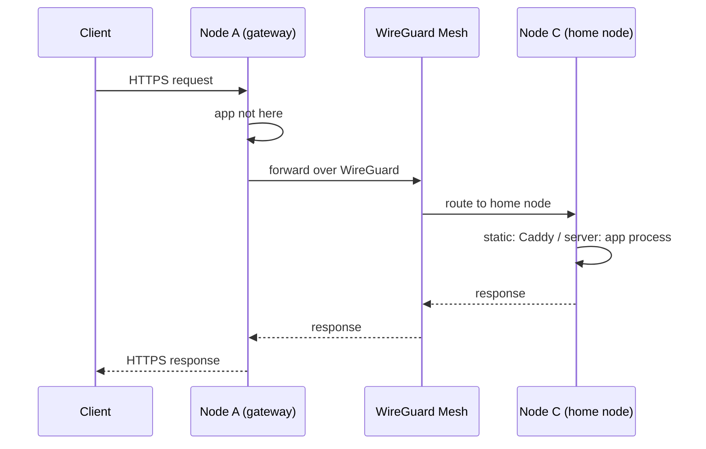
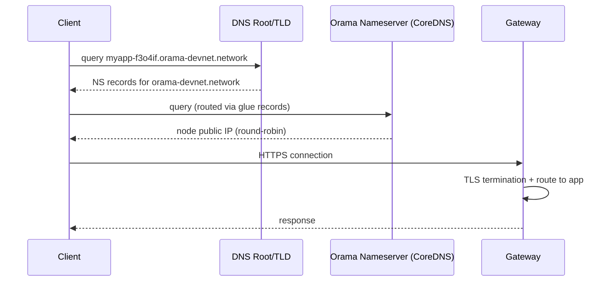

# Domains and Routing

Every deployment on the Orama Network is assigned a domain automatically. You do not need to configure DNS, provision certificates, or set up reverse proxies -- the network handles all of it.

## Automatic Domain Assignment

When you deploy an application, it receives a unique subdomain on the environment's base domain:

```
<app-name>-<random>.<base-domain>
```

For example, deploying an app named `myapp` on devnet:

```
myapp-f3o4if.orama-devnet.network
```

The random suffix ensures uniqueness across all namespaces. You can also specify a custom subdomain with `--subdomain`.

The three environments each have their own base domain:

| Environment | Base Domain |
|-------------|-------------|
| **Devnet** | `orama-devnet.network` |
| **Testnet** | `orama-testnet.network` |
| **Production** | `dbrs.space` |

The domain is live as soon as the deployment completes. No additional configuration is required.

---

## Cross-Node Routing

Every app has a **home node** -- the node it was deployed to and where its process runs (or where its static files are served from). However, clients can reach the app through **any node** in the cluster. The gateway mesh handles routing transparently.

From the client's perspective, there is no difference between hitting the home node directly or hitting a different node that proxies the request. The response is identical.

### How Routing Works

1. The client resolves the app's domain via DNS (round-robin across nameservers)
2. The request arrives at whichever node the DNS resolved to
3. The gateway on that node extracts the app name from the subdomain
4. It looks up which node hosts the app
5. If the app's home node is **this node**, the gateway serves the request directly
6. If the app's home node is a **different node**, the gateway proxies the request over the WireGuard mesh to the home node



The proxy hop adds minimal latency because all inter-node traffic travels over WireGuard tunnels on the private `10.0.0.0/24` subnet. These are persistent, encrypted UDP tunnels -- no TCP handshake or TLS negotiation is required for the internal hop.

### Why This Matters

- **High availability.** If DNS resolves to any healthy node, the request succeeds regardless of where the app is hosted.
- **Simple DNS.** All nodes share the same set of domains. DNS can round-robin across all nameservers without knowing which node hosts which app.
- **Transparent to clients.** The client always talks HTTPS to a single endpoint. The internal routing is invisible.

---

## DNS Resolution Flow

Understanding how a request travels from a client's browser to your app:



Each Orama node runs **CoreDNS** as its authoritative nameserver. The domain registrar's NS records point to the Orama nodes themselves, and glue records provide the IP addresses so resolvers can reach them without a circular dependency.

### DNS record chain

```
orama-devnet.network.    NS    ns1.orama-devnet.network.
                         NS    ns2.orama-devnet.network.
                         NS    ns3.orama-devnet.network.

ns1.orama-devnet.network.  A   <node-1-public-ip>    (glue record)
ns2.orama-devnet.network.  A   <node-2-public-ip>    (glue record)
ns3.orama-devnet.network.  A   <node-3-public-ip>    (glue record)

myapp-f3o4if.orama-devnet.network.  A  <resolved-node-ip>
```

Because multiple NS records exist, DNS resolvers distribute queries across nodes. This provides both load balancing and redundancy at the DNS layer.

---

## SSL/TLS Certificates

All deployments are served over HTTPS with certificates provisioned automatically via **Let's Encrypt**. You do not need to generate, upload, or renew certificates.

### How It Works

1. When a new domain is created (on deploy), the gateway requests a certificate from Let's Encrypt
2. Let's Encrypt issues an **ACME DNS-01 challenge** to verify domain ownership
3. CoreDNS (running on the same node) serves the challenge response
4. The certificate is issued and installed in the gateway (Caddy)
5. Caddy handles automatic renewal before expiration

The DNS-01 challenge method is used instead of HTTP-01 because it does not require the ACME server to reach a specific node -- CoreDNS can serve the challenge response from any nameserver, which works well with the round-robin DNS setup.

### Certificate Details

| Property | Value |
|----------|-------|
| **CA** | Let's Encrypt |
| **Challenge type** | DNS-01 via CoreDNS |
| **Key type** | ECDSA P-256 |
| **Renewal** | Automatic (handled by Caddy) |
| **Wildcard** | Per-app certificates, not wildcard |

---

## Custom Domains

You can map your own domain (like `api.example.com`) to an Orama deployment using the custom domains API.

### REST API

| Method | Endpoint | Description |
|--------|----------|-------------|
| `POST` | `/v1/deployments/domains/add` | Add a custom domain to a deployment |
| `POST` | `/v1/deployments/domains/verify` | Verify domain ownership via DNS |
| `GET` | `/v1/deployments/domains/list` | List all custom domains |
| `DELETE` | `/v1/deployments/domains/remove` | Remove a custom domain |

### Flow

1. Add a CNAME record on your domain pointing to your app's Orama domain
2. Call the add endpoint with your domain and deployment name
3. Verify ownership via DNS (the API will check for the CNAME)
4. A certificate is automatically provisioned for the custom domain

---

## Troubleshooting

### Domain not resolving

If your app's domain does not resolve after deployment:

1. **Check deployment status.** Run `orama app get <name>` and verify the app is in a healthy state.
2. **Wait for DNS propagation.** New DNS records can take up to a few minutes to propagate, though it is usually instant.
3. **Check from multiple locations.** DNS round-robin means different resolvers may get different node IPs. Try `dig myapp-f3o4if.orama-devnet.network` to see what DNS returns.

### Certificate errors

If you see a TLS certificate error in the browser:

1. **Wait a moment.** Certificate provisioning via ACME takes a few seconds after the first request to a new domain.
2. **Check the domain name.** Ensure you are using the exact domain from `orama app get <name>`.
3. **Hard refresh.** Browsers cache certificate errors aggressively. Try an incognito window or `curl -v https://your-domain`.
