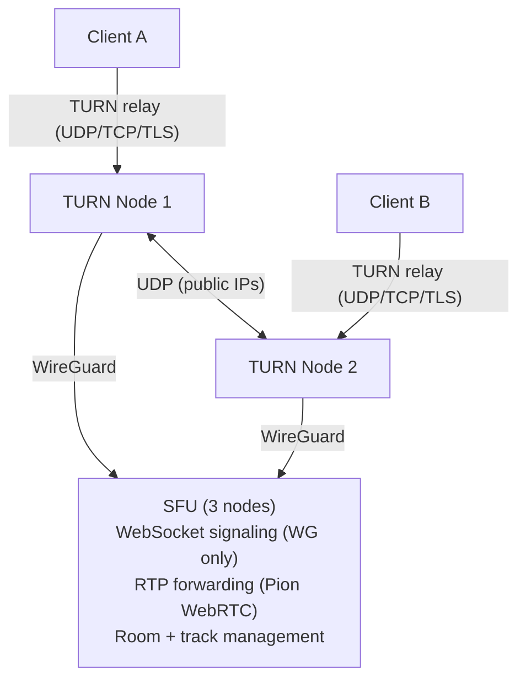

# WebRTC

Real-time voice, video, and data channels for the Orama Network. Media flows through TURN relays — clients never connect directly. The SFU (Selective Forwarding Unit) handles room management, track routing, and signaling over WebSocket.

## Architecture

All client media is relayed through TURN servers. The SFU binds exclusively to internal WireGuard interfaces and is unreachable from the public internet. Clients connect to TURN, TURN relays to the SFU over WireGuard.



Key properties:

- **Forced relay** — `iceTransportPolicy: "relay"` enforced server-side. No direct peer connections.
- **Namespace isolation** — Each namespace gets its own TURN secret, port ranges, and room space.
- **Redundancy** — SFU runs on all 3 nodes. TURN runs on 2 of 3 (capacity-selected).

## Enabling WebRTC

WebRTC is opt-in per namespace. The namespace must already have a running cluster (RQLite + Olric + Gateway).

```bash
# Enable
orama namespace enable webrtc --namespace myapp

# Check status
orama namespace webrtc-status --namespace myapp

# Disable (stops services, deallocates ports, removes DNS)
orama namespace disable webrtc --namespace myapp
```

On enable, the system allocates port blocks, spawns TURN on 2 nodes, spawns SFU on all 3 nodes, and creates DNS records for the TURN servers.

## Authentication

All WebRTC endpoints require the same authentication as other namespace endpoints.

```
# API Key via header (recommended)
X-API-Key: <your-namespace-api-key>

# API Key via Authorization header
Authorization: ApiKey <your-namespace-api-key>

# JWT Bearer token
Authorization: Bearer <jwt>
```

## Client Integration

### 1. Get TURN Credentials

Request short-lived TURN credentials from the gateway. Credentials expire based on the returned `ttl`.

```typescript
const res = await fetch(
  "https://ns-myapp.orama-devnet.network/v1/webrtc/turn/credentials",
  {
    method: "POST",
    headers: { "X-API-Key": apiKey },
  }
);

const { uris, username, password, ttl } = await res.json();
```

Response shape:

```typescript
interface TURNCredentials {
  uris: string[];       // TURN server URIs (UDP, TCP, TLS)
  username: string;     // "{expiry_unix}:{namespace}"
  password: string;     // HMAC-SHA1 derived, base64-encoded
  ttl: number;          // Seconds until expiry (default: 600)
}
```

Example `uris`:

```json
[
  "turn:ns-myapp.orama-devnet.network:3478?transport=udp",
  "turn:ns-myapp.orama-devnet.network:3478?transport=tcp",
  "turns:ns-myapp.orama-devnet.network:5349"
]
```

### 2. Create PeerConnection

Use the credentials to build an `RTCPeerConnection` with relay-only transport.

```typescript
const pc = new RTCPeerConnection({
  iceServers: [{ urls: uris, username, credential: password }],
  iceTransportPolicy: "relay",
});
```

The `iceTransportPolicy: "relay"` setting is mandatory. The SFU rejects non-relay candidates server-side.

### 3. Connect Signaling WebSocket

The signaling channel is a WebSocket connection to the SFU. Pass the room ID and authentication as query parameters.

```typescript
const ws = new WebSocket(
  `wss://ns-myapp.orama-devnet.network/v1/webrtc/signal?room=${roomId}&api_key=${apiKey}`
);

ws.onmessage = (event) => {
  const msg = JSON.parse(event.data);

  switch (msg.type) {
    case "offer":
      handleOffer(msg);
      break;
    case "answer":
      handleAnswer(msg);
      break;
    case "ice-candidate":
      handleICE(msg);
      break;
    case "peer-joined":
      handleJoin(msg);
      break;
    case "peer-left":
      handleLeave(msg);
      break;
    case "turn-credentials":
    case "refresh-credentials":
      updateTURN(msg);
      break;
    case "server-draining":
      reconnect();
      break;
  }
};
```

### 4. Handle SDP Exchange

Standard WebRTC offer/answer flow through the SFU.

```typescript
// Publishing a local track
const stream = await navigator.mediaDevices.getUserMedia({
  audio: true,
  video: true,
});

for (const track of stream.getTracks()) {
  pc.addTrack(track, stream);
}

const offer = await pc.createOffer();
await pc.setLocalDescription(offer);

ws.send(JSON.stringify({ type: "offer", sdp: offer.sdp }));

// Handle answer from SFU
function handleAnswer(msg: { sdp: string }) {
  pc.setRemoteDescription({ type: "answer", sdp: msg.sdp });
}

// Exchange ICE candidates
pc.onicecandidate = ({ candidate }) => {
  if (candidate) {
    ws.send(JSON.stringify({ type: "ice-candidate", candidate }));
  }
};

function handleICE(msg: { candidate: RTCIceCandidateInit }) {
  pc.addIceCandidate(msg.candidate);
}
```

### 5. Handle Remote Tracks

The SFU forwards tracks from other participants.

```typescript
pc.ontrack = (event) => {
  const [stream] = event.streams;
  const video = document.createElement("video");
  video.srcObject = stream;
  video.autoplay = true;
  document.getElementById("remote-videos")?.appendChild(video);
};
```

### 6. Handle Credential Refresh

The SFU sends refreshed TURN credentials at 80% of TTL (8 minutes for the default 10-minute TTL). Update the ICE configuration without renegotiating.

```typescript
function updateTURN(msg: TURNCredentials) {
  const config = pc.getConfiguration();
  config.iceServers = [
    { urls: msg.uris, username: msg.username, credential: msg.password },
  ];
  pc.setConfiguration(config);
}
```

### 7. Handle Server Draining

When an SFU node is shutting down (during upgrades), it sends a `server-draining` message. Reconnect to another node.

```typescript
function reconnect() {
  ws.close();
  // Re-establish signaling connection — the gateway routes to an available SFU
  const newWs = new WebSocket(
    `wss://ns-myapp.orama-devnet.network/v1/webrtc/signal?room=${roomId}&api_key=${apiKey}`
  );
  // Re-attach handlers...
}
```

## Room Management

Rooms are managed via REST. Creating and closing rooms requires namespace ownership.

```typescript
const headers = {
  "X-API-Key": apiKey,
  "Content-Type": "application/json",
};

// Create a room
await fetch("https://ns-myapp.orama-devnet.network/v1/webrtc/rooms", {
  method: "POST",
  headers,
  body: JSON.stringify({ room_id: "my-room" }),
});

// List rooms
const rooms = await fetch("https://ns-myapp.orama-devnet.network/v1/webrtc/rooms", {
  headers,
}).then((r) => r.json());

// Close a room
await fetch(
  "https://ns-myapp.orama-devnet.network/v1/webrtc/rooms?room_id=my-room",
  { method: "DELETE", headers }
);
```

## REST Endpoints

| Method | Path | Auth | Description |
|--------|------|------|-------------|
| POST | `/v1/webrtc/turn/credentials` | API key / JWT | Get TURN relay credentials |
| GET (WebSocket) | `/v1/webrtc/signal` | API key / JWT | Signaling channel |
| GET | `/v1/webrtc/rooms` | API key / JWT | List rooms |
| POST | `/v1/webrtc/rooms` | API key / JWT (owner) | Create room |
| DELETE | `/v1/webrtc/rooms` | API key / JWT (owner) | Close room |

## Signaling Messages

Messages exchanged over the WebSocket signaling channel.

### Client to SFU

| Type | Description |
|------|-------------|
| `join` | Join a room |
| `offer` | SDP offer |
| `answer` | SDP answer |
| `ice-candidate` | ICE candidate |
| `leave` | Leave a room |

### SFU to Client

| Type | Description |
|------|-------------|
| `offer` | SDP offer (for subscribing to new tracks) |
| `answer` | SDP answer |
| `ice-candidate` | ICE candidate |
| `peer-joined` | New peer entered the room |
| `peer-left` | Peer left the room |
| `turn-credentials` | Initial TURN credentials on connect |
| `refresh-credentials` | Refreshed TURN credentials (sent at 80% TTL) |
| `server-draining` | SFU shutting down, reconnect to another node |

## TURN Credential Protocol

Credentials use HMAC-SHA1 with a per-namespace shared secret generated on WebRTC enable (32 bytes, `crypto/rand`).

| Property | Value |
|----------|-------|
| Algorithm | HMAC-SHA1 |
| Username format | `{expiry_unix}:{namespace}` |
| Password | `base64(HMAC-SHA1(shared_secret, username))` |
| Default TTL | 600 seconds (10 minutes) |
| Refresh | SFU sends `refresh-credentials` at 80% TTL |

Clients must update their ICE server configuration when they receive a `refresh-credentials` message. Failure to refresh will cause media to stop flowing when the old credentials expire.

## Port Allocation

WebRTC uses a separate port allocation system from core namespace services.

| Service | Port Range | Protocol | Notes |
|---------|-----------|----------|-------|
| SFU signaling | 30000–30099 | TCP | WireGuard only, 1 port per namespace |
| SFU media (RTP) | 20000–29999 | UDP | WireGuard only, 500 ports per namespace |
| TURN listen | 3478 | UDP + TCP | Fixed, public |
| TURNS (TLS) | 5349 | TCP | Fixed, public |
| TURN relay | 49152–65535 | UDP | 800 ports per namespace |

SFU ports are internal only — bound to WireGuard interfaces, not exposed through the firewall. TURN ports are public-facing and opened via UFW on TURN nodes.

## Full Example

A minimal working example connecting two peers in a room.

```typescript
async function joinRoom(roomId: string, apiKey: string) {
  // 1. Get TURN credentials
  const creds = await fetch(
    "https://ns-myapp.orama-devnet.network/v1/webrtc/turn/credentials",
    { method: "POST", headers: { "X-API-Key": apiKey } }
  ).then((r) => r.json());

  // 2. Create PeerConnection
  const pc = new RTCPeerConnection({
    iceServers: [
      { urls: creds.uris, username: creds.username, credential: creds.password },
    ],
    iceTransportPolicy: "relay",
  });

  // 3. Get local media
  const stream = await navigator.mediaDevices.getUserMedia({
    audio: true,
    video: true,
  });
  for (const track of stream.getTracks()) {
    pc.addTrack(track, stream);
  }

  // 4. Handle remote tracks
  pc.ontrack = (event) => {
    const [remoteStream] = event.streams;
    const video = document.createElement("video");
    video.srcObject = remoteStream;
    video.autoplay = true;
    document.getElementById("remote-videos")?.appendChild(video);
  };

  // 5. Connect signaling
  const ws = new WebSocket(
    `wss://ns-myapp.orama-devnet.network/v1/webrtc/signal?room=${roomId}&api_key=${apiKey}`
  );

  ws.onopen = async () => {
    ws.send(JSON.stringify({ type: "join", room_id: roomId }));

    const offer = await pc.createOffer();
    await pc.setLocalDescription(offer);
    ws.send(JSON.stringify({ type: "offer", sdp: offer.sdp }));
  };

  pc.onicecandidate = ({ candidate }) => {
    if (candidate) {
      ws.send(JSON.stringify({ type: "ice-candidate", candidate }));
    }
  };

  ws.onmessage = (event) => {
    const msg = JSON.parse(event.data);

    switch (msg.type) {
      case "answer":
        pc.setRemoteDescription({ type: "answer", sdp: msg.sdp });
        break;
      case "ice-candidate":
        pc.addIceCandidate(msg.candidate);
        break;
      case "offer":
        pc.setRemoteDescription({ type: "offer", sdp: msg.sdp }).then(async () => {
          const answer = await pc.createAnswer();
          await pc.setLocalDescription(answer);
          ws.send(JSON.stringify({ type: "answer", sdp: answer.sdp }));
        });
        break;
      case "refresh-credentials":
        const config = pc.getConfiguration();
        config.iceServers = [
          { urls: msg.uris, username: msg.username, credential: msg.password },
        ];
        pc.setConfiguration(config);
        break;
      case "server-draining":
        // Reconnect logic
        break;
    }
  };

  return { pc, ws, stream };
}
```

## Data Channels

WebRTC data channels work through the same SFU relay path. Create a data channel before generating the offer.

```typescript
const dc = pc.createDataChannel("app-data", { ordered: true });

dc.onopen = () => {
  dc.send(JSON.stringify({ action: "cursor-move", x: 100, y: 200 }));
};

dc.onmessage = (event) => {
  const data = JSON.parse(event.data);
  // Handle incoming data channel messages
};

// On the receiving side
pc.ondatachannel = (event) => {
  const channel = event.channel;
  channel.onmessage = (e) => {
    const data = JSON.parse(e.data);
    // Handle incoming messages
  };
};
```

## Security

- **Forced relay** — `iceTransportPolicy: "relay"` enforced server-side. Clients cannot bypass TURN.
- **HMAC credentials** — Per-namespace shared secret. Credentials expire after 10 minutes.
- **Namespace isolation** — Separate TURN secrets, port ranges, and room spaces per namespace.
- **SFU on WireGuard only** — SFU binds to `10.0.0.x`, never `0.0.0.0`. Only reachable through TURN relay.
- **Permissions-Policy** — `camera=(self), microphone=(self)` restricts media device access to same-origin.
- **Room ownership** — Creating and closing rooms requires namespace-level authentication.
